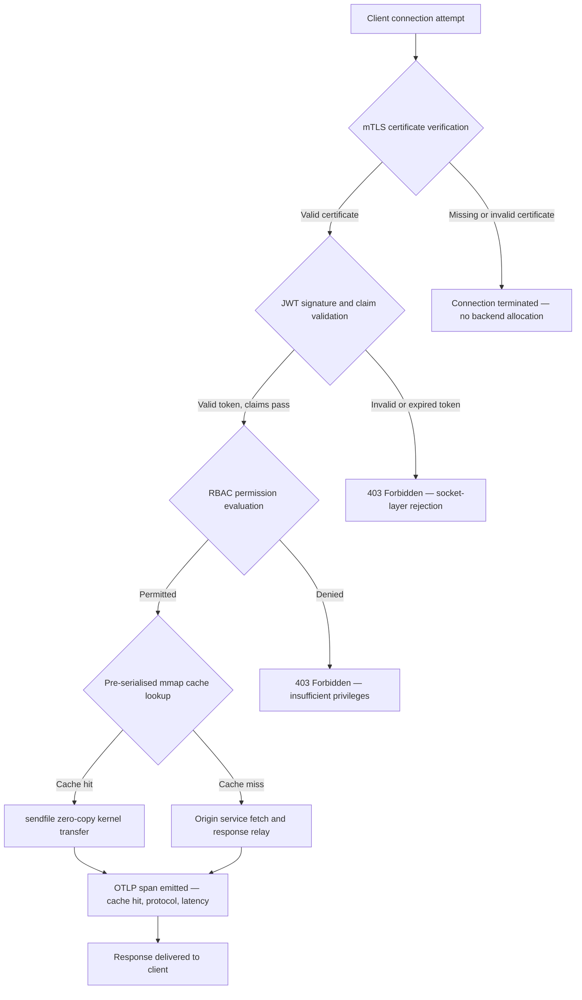

## http-handle: 2026లో బ్యాంకింగ్ కోసం అధిక-పనితీరు, జీరో-డిపెండెన్సీ ఎడ్జ్ ఇంగ్రెస్

బ్యాంకింగ్ ఎడ్జ్‌కు ఒక డిపెండెన్సీ సమస్య ఉంది. క్లయింట్ మరియు కోర్ బ్యాంకింగ్ సేవ మధ్య ట్రాఫిక్‌ను మార్గనిర్దేశం చేసే ప్రతి Nginx లేదా Envoy ఇన్‌స్టెన్స్ ఒక డిపెండెన్సీ ట్రీను మోస్తుంది: OpenSSL బిల్డ్‌లు, Lua మాడ్యూల్స్, gRPC లైబ్రరీలు, మరియు కంటైనర్ లేయర్‌లు — ప్రతి ఒక్కటి సంభావ్య CVE, ప్రతి ఒక్కటి ప్రత్యేక ప్యాచింగ్ చక్రాన్ని అవసరం చేస్తుంది, ప్రతి ఒక్కటి SLA కొలతను సంక్లిష్టం చేసే జాప్యం వైవిధ్యాన్ని జోడిస్తుంది. [డిజిటల్ ఆపరేషనల్ రెసిలియన్స్ యాక్ట్ (DORA)](https://eur-lex.europa.eu/eli/reg/2022/2554/oj) కింద, ఆ సంక్లిష్టత ఇప్పుడు కార్యాచరణ బాధ్యతతో పాటు నియంత్రణాపరమైన బాధ్యత కూడా.

[http-handle](https://github.com/sebastienrousseau/http-handle) భిన్నమైన విధానాన్ని తీసుకుంటుంది. ఇది `libc` దాటి సున్నా రన్‌టైమ్ డిపెండెన్సీలతో ఒకే, స్టాటిక్‌గా లింక్ చేసిన Rust బైనరీ. ఇది ARM64 నోడ్‌లపై సెకనుకు 1,80,000 అభ్యర్థనలను అందిస్తుంది, నెట్‌వర్క్ సాకెట్ లేయర్ వద్ద మ్యూచువల్ TLS మరియు JWT ప్రామాణీకరణను అమలు చేస్తుంది, మరియు HTTP/2 మరియు HTTP/3ను స్వయంచాలకంగా చర్చిస్తుంది — ఇవన్నీ 20 MB RAM కంటే తక్కువ విస్తరణ పరిమాణంలో.

## త్వరిత సమాధానం

**ఒక వాక్యంలో http-handle అంటే ఏమిటి?** http-handle అనేది ఓపెన్-సోర్స్, స్టాటిక్‌గా లింక్ చేసిన Rust బైనరీ, ఇది బ్యాంకింగ్ ఎడ్జ్ వద్ద భారీ ప్రాక్సీ కంటైనర్‌లను భర్తీ చేస్తుంది, Linux `sendfile(2)` జీరో-కాపీ కర్నెల్ బదిలీల ద్వారా ARM64పై సెకనుకు 1,80,000 req/sను అందిస్తుంది, ఏదైనా బ్యాకెండ్ వనరును తాకక ముందే సాకెట్ లేయర్ వద్ద mTLS, JWT, మరియు RBACను అమలు చేస్తుంది, మరియు స్థానిక [OpenTelemetry](https://opentelemetry.io/) మెట్రిక్‌లను విడుదల చేస్తుంది — `libc` దాటి సున్నా రన్‌టైమ్ లైబ్రరీ డిపెండెన్సీలతో.

## కార్యనిర్వాహక సారాంశం

బ్యాంకులు ఒక దశాబ్దంగా తమ ఎడ్జ్ వద్ద Nginx మరియు Envoyను నడిపాయి. రెండూ సమర్థమైనవి; కానీ ఏదీ 2026 నియంత్రణ వాతావరణం కోసం రూపొందించబడలేదు. డిపెండెన్సీ-భరిత కంటైనర్ ఇమేజ్‌లు కంప్లయన్స్ బృందాలు తగినంత వేగంగా క్లియర్ చేయలేని CVE క్యూలను ఉత్పత్తి చేస్తాయి, మరియు ప్రతి లైబ్రరీ వెర్షన్ మార్పు రిగ్రెషన్ రిస్క్‌ను మోస్తుంది. DORA ఆర్టికల్స్ 5 మరియు 6 ICT రిస్క్ కనుగొన్న తర్వాత ప్యాచ్ చేయడం కాదు, డిజైన్ ద్వారానే నిర్వహించబడాలని డిమాండ్ చేస్తాయి. Basel III కార్యాచరణ రిస్క్ ఫ్రేమ్‌వర్క్‌లు వ్యవస్థ సంక్లిష్టతతో వైఫల్య బిందువులు పెరిగే ఆర్కిటెక్చర్‌లను శిక్షిస్తాయి.

http-handle మూలంలోనే డిపెండెన్సీ సమస్యను తొలగిస్తుంది. బైనరీ ఒకసారి, స్టాటిక్‌గా, రన్‌టైమ్ వద్ద ఎలాంటి బాహ్య లైబ్రరీ అవసరాలు లేకుండా కంపైల్ చేయబడుతుంది. దాడి ఉపరితలం Rust ప్రామాణిక లైబ్రరీ మరియు `libc`కు కుదించబడుతుంది. భద్రతా అమలు — mTLS సర్టిఫికేట్ ధ్రువీకరణ, JWT క్లయిమ్ ధ్రువీకరణ, మరియు రోల్-బేస్డ్ యాక్సెస్ కంట్రోల్ — ఏదైనా బ్యాకెండ్ కేటాయింపుకు ముందే నెట్‌వర్క్ సాకెట్ వద్ద అమలవుతుంది, జీరో ట్రస్ట్ పరిధిని దాని అతిచిన్న సాధ్యమైన రూపానికి కుదిస్తుంది. పనితీరు ఆర్కిటెక్చర్ నుండి అనుసరిస్తుంది: ముందుగా-సీరియలైజ్ చేసిన మెమరీ-మ్యాప్డ్ కాష్ బ్లాక్‌లు `sendfile(2)` కర్నెల్ బదిలీలతో కలిసి డేటాను CPU-నుండి-మెమరీ కాపీ మార్గం నుండి పూర్తిగా తొలగిస్తాయి, ARM64 హార్డ్‌వేర్‌పై సెకనుకు 1,80,000 req/sను నిలబెడతాయి. ఫలితం DORA స్థితిస్థాపకత అవసరాలను సంతృప్తిపరిచే, Basel III కార్యాచరణ రిస్క్ తగ్గింపు వాదనలకు మద్దతిచ్చే, మరియు SM&CR కింద సీనియర్ IT నాయకులకు ఎడ్జ్ మౌలిక సదుపాయం కోసం ధృవీకరించదగిన, సింగిల్-కాంపోనెంట్ జవాబుదారీ గొలుసును ఇచ్చే ఇంగ్రెస్ లేయర్.

## ముఖ్యాంశాలు

- **చిన్న బైనరీలు, చిన్న CVE క్యూలు.** స్టాటిక్‌గా లింక్ చేసిన సింగిల్ బైనరీకి ప్యాచ్ చేయడానికి ఒక ప్యాకేజీ, ధ్రువీకరించడానికి ఒక విడుదల, మరియు ఆడిట్ చేయడానికి ఒక ఆర్టిఫ్యాక్ట్ ఉంటుంది. ప్రామాణిక మాడ్యూల్ సెట్‌తో Nginx 30కి పైగా షేర్డ్ లైబ్రరీ డిపెండెన్సీలతో రవాణా అవుతుంది; ప్రతి ఒక్కటి దాని స్వంత దుర్బలత్వ జీవిత చక్రాన్ని మోస్తుంది.
- **జీరో-కాపీ ఒక ఆప్టిమైజేషన్ కాదు — అది ఒక డిజైన్ నిర్బంధం.** సెకనుకు 1,80,000 req/s వద్ద, ఏదైనా యూజర్-స్పేస్ డేటా కాపీ కొలవదగిన జాప్యం వైవిధ్యాన్ని ప్రవేశపెడుతుంది. `sendfile(2)` ఫైల్ డిస్క్రిప్టర్ కంటెంట్‌లను పూర్తిగా కర్నెల్ స్పేస్‌లో నెట్‌వర్క్ సాకెట్‌కు బదిలీ చేస్తుంది. mmap-పిన్ చేసిన ప్రతిస్పందన కాష్ బ్లాక్‌లతో కలిపి, కాష్ చేసిన ప్రతిస్పందనల కోసం CPU డేటా మార్గాన్ని ఎప్పుడూ తాకదు.
- **భద్రతా పరిధి సాకెట్ వద్ద ఉండాలి.** అప్లికేషన్ మిడిల్‌వేర్‌లో JWTలు మరియు mTLS సర్టిఫికేట్‌లను ధ్రువీకరించడం అంటే అభ్యర్థన తిరస్కరించబడటానికి ముందే బ్యాకెండ్ ఇప్పటికే థ్రెడ్‌లు మరియు మెమరీని కేటాయించింది అని అర్థం. సాకెట్-లేయర్ ధ్రువీకరణ అప్రామాణీకృత అభ్యర్థనలు ఏ బ్యాకెండ్ వనరులను వినియోగించకుండా నిర్ధారిస్తుంది.
- **OTLP పరిశీలనీయత అంతరాన్ని తొలగిస్తుంది.** స్థానిక OpenTelemetry ఏకీకరణ అంటే ప్రతి అభ్యర్థన, ప్రతి ప్రామాణీకరణ నిర్ణయం, మరియు ప్రతి ప్రోటోకాల్ చర్చ సైడ్‌కార్ ఏజెంట్ లేకుండా నిర్మాణాత్మక టెలిమెట్రీని ఉత్పత్తి చేస్తుంది. ఇప్పటికే ఉన్న బ్యాంక్ డాష్‌బోర్డ్‌లు OTLP ట్రేసులను నేరుగా తీసుకుంటాయి.

**సంబంధిత చదవదగినవి:** [2026లో AI, MCP, మరియు ఆర్థిక మౌలిక సదుపాయం కోసం YAMLకు ఎందుకు సురక్షితమైన Rust స్టాక్ అవసరం](https://sebastienrousseau.com/2026-06-18-noyalib-safe-yaml-rust-ai-mcp-financial-infrastructure-2026/), [CloudCDN: 2026లో AI-స్థానిక ఎడ్జ్ కోసం ఓపెన్-సోర్స్ బ్లూప్రింట్](https://sebastienrousseau.com/2026-06-11-cloudcdn-open-source-blueprint-ai-native-edge-2026/), [2026లో బ్యాంకులు మరియు ఆర్థిక సంస్థల కోసం ఉత్తమ క్లౌడ్ మౌలిక సదుపాయ ఆర్కిటెక్చర్](https://sebastienrousseau.com/2026-05-16-best-cloud-infrastructure-architecture-2026/).

## 01. బ్యాంకింగ్‌లో భారీ ప్రాక్సీ సమస్య

Nginx మరియు Envoy ఆధునిక ఇంటర్నెట్ ఎడ్జ్‌ను నిర్మించాయి. అవి కాన్ఫిగర్ చేయదగినవి, యుద్ధ-పరీక్షితమైనవి, మరియు పెద్ద సముదాయాల మద్దతు కలిగినవి. అవి DORA ఉనికిలోకి రాకముందు, Basel III కార్యాచరణ రిస్క్ ఫ్రేమ్‌వర్క్‌లు పరిమాణాత్మక సంక్లిష్టత తగ్గింపును డిమాండ్ చేయడానికి ముందు, మరియు ARM64 క్లౌడ్ నోడ్‌లు అధిక-త్రూపుట్ కంప్యూట్ యొక్క ఆర్థికశాస్త్రాన్ని మార్చడానికి ముందు చేసిన ఆర్కిటెక్చరల్ ఎంపికలు కూడా.

ఆచరణాత్మక పరిణామం బ్యాంకులకు అవసరమైనది మరియు భారీ ప్రాక్సీ కంటైనర్‌లు అందించేది మధ్య ఒక అంతరం.

**డిపెండెన్సీ ఉపరితలం.** ఒక ప్రామాణిక Envoy విస్తరణ OpenSSL, Abseil, Protobuf, gRPC, Lua, మరియు డజన్ల కొద్దీ ద్వితీయ లైబ్రరీలను లోపలికి తీసుకుంటుంది. ప్రతి ఒక్కటి ఒక స్వతంత్ర CVE జీవిత చక్రాన్ని మోస్తుంది. నేషనల్ వల్నరబిలిటీ డేటాబేస్ ఒక క్లిష్టమైన OpenSSL సలహాను ప్రచురించినప్పుడు, ఎస్టేట్‌లోని ప్రతి Envoy ఇన్‌స్టెన్స్ ఒక కంప్లయన్స్ గడియారంగా మారుతుంది: అంచనా వేయడం, ప్యాచ్ చేయడం, పరీక్షించడం, పునఃవిస్తరించడం, మరియు పునఃధృవీకరించడం — బైనరీ నడిచే ప్రతి వాతావరణంలో. DORA ఆర్టికల్ 6 కింద, బ్యాంకులు ICT రిస్క్ నిర్వహణ ప్రక్రియలు దామాషాగా, డాక్యుమెంట్ చేయబడి, మరియు ధృవీకరించదగినవి అని ప్రదర్శించాలి. మల్టీ-లైబ్రరీ డిపెండెన్సీ ట్రీ ఆ ప్రదర్శనను నిర్వహించడానికి ఖరీదైనదిగా చేస్తుంది.

**మెమరీ ఓవర్‌హెడ్.** కనీసంగా కాన్ఫిగర్ చేసిన Nginx వర్కర్ ప్రాసెస్ మధ్యస్థ లోడ్ కింద 40–80 MB రెసిడెంట్ మెమరీని వినియోగిస్తుంది. స్థాయిలో — ట్రేడింగ్ సిస్టమ్‌లు, పేమెంట్ APIలు, మరియు కస్టమర్-ఫేసింగ్ పోర్టల్‌ల అంతటా వందల ఇంగ్రెస్ నోడ్‌లు — ఆ ఓవర్‌హెడ్ బాగా-ఇంజనీర్ చేసిన సింగిల్-బైనరీ ప్రత్యామ్నాయంపై తగిన పనితీరు ప్రయోజనం లేకుండా కొలవదగిన మౌలిక సదుపాయ ఖర్చుగా చేరుతుంది.

**ప్యాచింగ్ వేగం.** కంటైనర్-ఇమేజ్ సరఫరా గొలుసులు CVE ప్రచురణ మరియు ఉత్పత్తికి చేరే ధృవీకరించిన ప్యాచ్ మధ్య బహుళ-రోజుల ఆలస్యాన్ని ప్రవేశపెడతాయి. బేస్ ఇమేజ్ పునర్నిర్మించబడాలి, అప్లికేషన్ లేయర్ పునఃలేయర్ చేయబడాలి, పూర్తి పరీక్ష మ్యాట్రిక్స్ పునఃఅమలు చేయబడాలి, మరియు విస్తరణ పైప్‌లైన్ పునఃఅమలు చేయబడాలి. DORA సంఘటన నివేదన కిటికీల కింద పనిచేసే క్లిష్టమైన బ్యాంకింగ్ సిస్టమ్‌ల కోసం, ఈ చక్రం ఒక నిర్మాణాత్మక రిస్క్.

http-handle మూడింటినీ పరిష్కరిస్తుంది. ఒక బైనరీ. ఒక CVE ఉపరితలం. ప్యాచ్ చేయడానికి ఒక ఆర్టిఫ్యాక్ట్. ఉత్పత్తి ఇంగ్రెస్ నోడ్ కోసం 20 MB RAM కంటే తక్కువ.

## 02. http-handle 2026 ఆర్కిటెక్చర్ లెన్స్

బైనరీ ఐదు పరస్పరాధారిత లేయర్‌లుగా నిర్మించబడింది, ప్రతి ఒక్కటి సాంప్రదాయ ప్రాక్సీ ఆర్కిటెక్చర్‌లు సేకరించే ఒక నిర్దిష్ట రిస్క్ వర్గాన్ని తొలగించడానికి రూపొందించబడింది.

### పట్టిక 1: http-handle ఆర్కిటెక్చర్ లేయర్‌లు మరియు రిస్క్ ఉపశమనం

| లేయర్ | డిజైన్ నిర్ణయం | ఇది ఎందుకు ముఖ్యం | సరిగ్గా నిర్వహించకపోతే రిస్క్ |
| ---- | ---- | ---- | ---- |
| **సర్వర్ కోర్** | సింగిల్ Rust బైనరీ, స్టాటిక్‌గా లింక్ చేయబడింది, `libc` దాటి సున్నా డిపెండెన్సీలు | ప్యాచ్ చేయడానికి ఒక ఆర్టిఫ్యాక్ట్; ఎస్టేట్ అంతటా లైబ్రరీ CVE వ్యాప్తిని తొలగిస్తుంది | డిపెండెన్సీ కన్ఫ్యూజన్ దాడులు; లైబ్రరీ దుర్బలత్వ సంచయనం |
| **యాక్సిలరేషన్ ఇంజిన్** | ముందుగా-సీరియలైజ్ చేసిన mmap కాష్ బ్లాక్‌లు మరియు `sendfile(2)` జీరో-కాపీ కర్నెల్ బదిలీలు | సబ్-మిల్లీసెకన్ ప్రాక్సీ ఓవర్‌హెడ్‌తో ARM64పై సెకనుకు 1,80,000 req/s; కాష్ చేసిన ప్రతిస్పందనల కోసం డేటా యూజర్ స్పేస్‌లోకి ప్రవేశించదు | మెమరీ-మ్యాపింగ్ లీక్‌లు; కాష్ ఇన్‌వాలిడేషన్ కింద కర్నెల్-స్పేస్ బాటిల్‌నెక్‌లు |
| **క్రిప్టోగ్రాఫిక్ భద్రత** | హాట్-రీలోడ్ సర్టిఫికేట్ మద్దతు మరియు ALPN చర్చతో స్థానిక mTLS | డేటా సమగ్రత మరియు ప్రోటోకాల్ అనుకూలతను హామీ ఇస్తుంది; కనెక్షన్ డ్రాప్‌లు లేకుండా సర్టిఫికేట్ రొటేషన్ | సేవా అంతరాయాలకు కారణమయ్యే సర్టిఫికేట్ గడువు ముగింపు; బలహీన సైఫర్ సూట్ డిఫాల్ట్‌లు |
| **యాక్సెస్ పాలసీ ప్లేన్** | సాకెట్-లేయర్ JWT ధ్రువీకరణ మరియు RBAC క్లయిమ్ మూల్యాంకనం | అప్రామాణీకృత అభ్యర్థనలు ఏ బ్యాకెండ్ వనరులను వినియోగించవు; కర్నెల్ సరిహద్దు వద్ద జీరో ట్రస్ట్ అమలు | JWT అల్గోరిథం కన్ఫ్యూజన్ దాడులు; అధిక-హక్కు యాక్సెస్ మంజూరు చేసే RBAC తప్పు-కాన్ఫిగరేషన్ |
| **పరిశీలనీయత** | స్థానిక [OpenTelemetry (OTLP)](https://opentelemetry.io/docs/specs/otlp/) ఏకీకరణ | సైడ్‌కార్ ఏజెంట్‌లు లేకుండా నిర్మాణాత్మక టెలిమెట్రీ; ఇప్పటికే ఉన్న బ్యాంక్ మానిటరింగ్ ఎస్టేట్‌లలోకి నేరుగా ప్రవేశం | అంతరాయాల సమయంలో బ్లైండ్ స్పాట్‌లు; DORA సంఘటన నివేదన కోసం అసంపూర్ణ ఆడిట్ ట్రేల్‌లు |

## 03. కీలక పనితీరు మరియు భద్రతా సంకేతాలు

ఎడ్జ్ వద్ద http-handleను నడిపే బ్యాంకులు DORA కార్యాచరణ నివేదన అవసరాలను మరియు అంతర్గత SLA గవర్నెన్స్‌ను సంతృప్తిపరచడానికి ఐదు పరిమాణాత్మక సంకేతాలను ఇన్‌స్ట్రుమెంట్ చేయాలి.

### పట్టిక 2: కార్యాచరణ బెంచ్‌మార్క్‌లు మరియు నియంత్రణ సూచనలు

| సంకేతం | బెంచ్‌మార్క్ | నియంత్రణ సూచన | సాంకేతిక అమలు |
| ---- | ---- | ---- | ---- |
| **త్రూపుట్** | P99 ≤ 1 ms ప్రాక్సీ ఓవర్‌హెడ్ వద్ద ARM64 నోడ్‌లపై ≥ 1,80,000 req/s | Basel III కార్యాచరణ రిస్క్ — వ్యవస్థ సంక్లిష్టత తగ్గింపు | `sendfile(2)` + mmap ముందుగా-సీరియలైజ్ చేసిన కాష్ బ్లాక్‌లు; కాష్ హిట్‌ల కోసం యూజర్-స్పేస్ డేటా కాపీ లేదు |
| **దాడి ఉపరితలం** | సున్నా రన్‌టైమ్ లైబ్రరీ డిపెండెన్సీలు; ప్రతి విడుదలకు ఒక బైనరీ ఆర్టిఫ్యాక్ట్ | [DORA ఆర్టికల్ 6](https://eur-lex.europa.eu/eli/reg/2022/2554/oj) — డిజైన్ ద్వారా ICT రిస్క్ నిర్వహణ | `cargo build --release --target aarch64-unknown-linux-musl`తో స్టాటిక్ కంపైలేషన్ |
| **ప్రామాణీకరణ జాప్యం** | బ్యాకెండ్ ప్రతిస్పందన మొదటి బైట్‌కు ముందు mTLS హ్యాండ్‌షేక్ + JWT ధ్రువీకరణ పూర్తవుతుంది | [DORA ఆర్టికల్ 5](https://eur-lex.europa.eu/eli/reg/2022/2554/oj) — ICT భద్రతా రక్షణ | సాకెట్-లేయర్ ఇంటర్‌సెప్షన్; బ్యాకెండ్ రూటింగ్‌కు ముందు కర్నెల్-ప్రక్క Rustలో JWT క్లయిమ్ మూల్యాంకనం |
| **సర్టిఫికేట్ లభ్యత** | రొటేషన్ సమయంలో సున్నా డ్రాప్ చేసిన కనెక్షన్‌లతో mTLS సర్టిఫికేట్‌ల హాట్-రీలోడ్ | ఎడ్జ్ లభ్యత కోసం SM&CR సీనియర్ మేనేజ్‌మెంట్ జవాబుదారీతనం | inotify-ఆధారిత సర్టిఫికేట్ వాచర్; రీలోడ్ సమయంలో ఆటమిక్ ఫైల్-డిస్క్రిప్టర్ స్వాప్ |
| **పరిశీలనీయత కవరేజ్** | ప్రామాణీకరణ ఫలితం, ప్రోటోకాల్ వెర్షన్, మరియు కాష్ స్థితితో OTLP స్పాన్‌లను ఉత్పత్తి చేసే 100% అభ్యర్థనలు | DORA ఆర్టికల్ 17 — సంఘటన గుర్తింపు మరియు నివేదన | స్థానిక OTLP ఎక్స్‌పోర్టర్; సైడ్‌కార్ అవసరం లేదు; gRPC లేదా HTTP/Protobuf రవాణా కాన్ఫిగర్ చేయదగినది |

## 04. జీరో-కాపీ ఇంజిన్: mmap మరియు sendfile(2)

అధిక-పౌనఃపున్య బ్యాంకింగ్‌లో నెట్‌వర్క్ పనితీరు — రియల్-టైమ్ చెల్లింపులు, మార్కెట్-డేటా APIలు, ప్రామాణీకరణ టోకెన్ సేవలు — అన్నిటికంటే ఒక నిర్బంధం ద్వారా మరింత పరిమితం చేయబడుతుంది: బైట్‌లను నిల్వ నుండి నెట్‌వర్క్ సాకెట్‌కు తరలించే ఖర్చు.

సాంప్రదాయ HTTP సర్వర్‌లు ఫైల్ కంటెంట్‌లను యూజర్-స్పేస్ బఫర్‌లోకి చదువుతాయి, ఆపై ఆ బఫర్‌ను సాకెట్‌కు రాస్తాయి. ఆ క్రమానికి ప్రతి ప్రతిస్పందనకు రెండు మెమరీ కాపీలు మరియు యూజర్ స్పేస్ మరియు కర్నెల్ స్పేస్ మధ్య రెండు కాంటెక్స్ట్ స్విచ్‌లు అవసరం. సెకనుకు 1,80,000 అభ్యర్థనల వద్ద, సంచిత ఓవర్‌హెడ్ గణనీయమైనది.

http-handle రెండు కాపీలను తొలగిస్తుంది.

**మెమరీ-మ్యాప్డ్ కాష్ బ్లాక్‌లు.** సేవ ప్రారంభమైనప్పుడు, ఇది `mmap(2)`ను ఉపయోగించి స్టాటిక్ ప్రతిస్పందన కంటెంట్‌ను మెమరీ-మ్యాప్డ్ ప్రాంతాలలోకి సీరియలైజ్ చేస్తుంది. ఈ ప్రాంతాలు కర్నెల్ పేజ్ కాష్‌లో పిన్ చేయబడతాయి. కాష్ చేసిన వనరు కోసం అభ్యర్థన వచ్చినప్పుడు, ప్రతిస్పందన ఇప్పటికే కర్నెల్ మెమరీలోకి మ్యాప్ చేయబడింది — డిస్క్ రీడ్ లేదు, బఫర్ కేటాయింపు లేదు.

**`sendfile(2)` కర్నెల్ బదిలీ.** Linux `sendfile(2)` సిస్టమ్ కాల్ డేటాను నేరుగా ఫైల్ డిస్క్రిప్టర్ నుండి — లేదా మెమరీ-మ్యాప్డ్ ప్రాంతం నుండి — నెట్‌వర్క్ సాకెట్ ఫైల్ డిస్క్రిప్టర్‌కు, పూర్తిగా కర్నెల్ లోపల బదిలీ చేస్తుంది. ఏ బైట్ యూజర్ స్పేస్‌లోకి ప్రవేశించదు. CPU పాత్ర సిస్టమ్ కాల్ జారీ చేయడం మరియు పూర్తి ఈవెంట్‌ను నిర్వహించడానికి తగ్గుతుంది. ఈ ఆర్కిటెక్చర్‌తో ARM64 నోడ్‌లపై, http-handle నిరంతర లోడ్ కింద సబ్-మిల్లీసెకన్ ప్రాక్సీ ఓవర్‌హెడ్‌తో సెకనుకు 1,80,000 req/sను నిలబెడుతుంది.

నెల-చివరి బ్యాచ్ సమన్వయం, ఇంట్రాడే లిక్విడిటీ నివేదన, లేదా రియల్-టైమ్ మోసం-స్కోరింగ్ API ట్రాఫిక్‌ను నడిపే బ్యాంకుల కోసం, ఇంజనీరింగ్ పరిణామం ప్రత్యక్షమైనది: ట్రాఫిక్ టైర్‌కు తక్కువ ARM64 నోడ్‌లు, తక్కువ మౌలిక సదుపాయ ఖర్చు, మరియు సామర్థ్య లోటుల నుండి చిన్న DORA స్థితిస్థాపకత రిస్క్.

## 05. mTLS మరియు JWT యాక్సెస్ పాలసీ ప్లేన్

బ్యాంకింగ్‌లో, ఎడ్జ్ వద్ద ప్రామాణీకరణ ఒక ఫీచర్ కాదు — అది ఒక నియంత్రణ అవసరం. DORA ICT భద్రతా నియంత్రణలు దామాషాగా, డాక్యుమెంట్ చేయబడి, మరియు ధృవీకరించదగినవి అని ఆదేశిస్తుంది. SM&CR మౌలిక సదుపాయ భద్రతా నిర్ణయాల కోసం వ్యక్తిగత జవాబుదారీతనాన్ని పేరు పెట్టబడిన సీనియర్ మేనేజర్‌లపై ఉంచుతుంది. ప్రశ్న ఎడ్జ్ వద్ద ప్రామాణీకరించాలా వద్దా కాదు, ఏ లేయర్ వద్ద అనేది.

http-handle ఏదైనా బ్యాకెండ్ వనరు కేటాయించబడటానికి ముందే మూడు-దశల జీరో ట్రస్ట్ పాలసీని అమలు చేస్తుంది.

**దశ 1: mTLS క్లయింట్ సర్టిఫికేట్ ధ్రువీకరణ.** TLS హ్యాండ్‌షేక్ సమయంలో, http-handle కాన్ఫిగర్ చేయదగిన ట్రస్ట్ స్టోర్‌కు వ్యతిరేకంగా క్లయింట్ సర్టిఫికేట్‌ను అభ్యర్థిస్తుంది మరియు ధ్రువీకరిస్తుంది. చెల్లుబాటు అయ్యే సర్టిఫికేట్ లేని కనెక్షన్‌లు హ్యాండ్‌షేక్ వద్దే ముగుస్తాయి. ఏ అప్లికేషన్ థ్రెడ్ ఉత్పత్తి చేయబడదు, ఏ మెమరీ పూల్ కేటాయించబడదు. బ్యాకెండ్ ఆ అభ్యర్థనను ఎప్పుడూ చూడదు.

**దశ 2: JWT క్లయిమ్ ధ్రువీకరణ.** mTLS దాటిన కనెక్షన్‌ల కోసం, http-handle సాకెట్ లేయర్ వద్ద `Authorization` హెడర్ నుండి JSON వెబ్ టోకెన్‌ను సేకరించి ధ్రువీకరిస్తుంది. అభ్యర్థన రూటింగ్ లేయర్‌కు చేరడానికి ముందే సంతకం ధ్రువీకరణ, గడువు తనిఖీలు, మరియు జారీచేసేవారి ధ్రువీకరణ జరుగుతాయి. అల్గోరిథం కన్ఫ్యూజన్ దాడులు — ఒక అసమాన కీ ఆశించినప్పుడు సర్వర్ ఒక సమమిత అల్గోరిథంను అంగీకరించే చోట — కాన్ఫిగరేషన్‌లో స్పష్టమైన అల్గోరిథం అనుమతి-జాబితా చేయడం ద్వారా నిరోధించబడతాయి.

**దశ 3: RBAC క్లయిమ్ మూల్యాంకనం.** ధ్రువీకరించిన JWT క్లయిమ్‌లు ఇన్-మెమరీ రోల్ టేబుల్‌కు మ్యాప్ అవుతాయి. తగినంత అనుమతులు లేని అభ్యర్థనలు యాక్సెస్ పాలసీ ప్లేన్ వద్ద 403 ప్రతిస్పందనను పొందుతాయి. అనధికార ట్రాఫిక్ కోసం బ్యాకెండ్ సేవ ఎప్పుడూ ప్రేరేపించబడదు.

ఈ క్రమం కార్యాచరణపరంగా ముఖ్యమైనది. సాంప్రదాయ నమూనా కింద — ప్రామాణీకరణ అప్లికేషన్ మిడిల్‌వేర్‌లో నడిచే చోట — ఒకే తిరస్కరణ జారీ చేయబడటానికి ముందు దాడిదారు అప్రామాణీకృత అభ్యర్థనలతో బ్యాకెండ్ థ్రెడ్ పూల్‌లను అయిపోయేలా చేయగలడు. సాకెట్-లేయర్ ప్రామాణీకరణ ఆ దాడి వెక్టర్‌ను పూర్తిగా కుప్పకూల్చుతుంది.

## 06. ALPN రూటింగ్ మరియు HTTP/3 ఫాల్‌బ్యాక్ చైన్

బ్యాంకింగ్ ట్రాఫిక్ విభిన్న నెట్‌వర్క్ పరిస్థితులలో వస్తుంది: ట్రేడింగ్ డెస్క్‌ల కోసం కార్పొరేట్ ఫైబర్, మొబైల్ బ్యాంకింగ్ క్లయింట్‌ల కోసం 5G, రిమోట్ ఆపరేషన్‌ల కోసం ఉపగ్రహ కనెక్టివిటీ, మరియు నియంత్రిత వాతావరణాలలో TLS తనిఖీ ప్రాక్సీలు. ఒకే-ప్రోటోకాల్ ఇంగ్రెస్ ఒక అత్యల్ప-సాధారణ-భాజక నిర్బంధాన్ని సృష్టిస్తుంది.

http-handle ప్రతి కనెక్షన్ కోసం సరైన ప్రోటోకాల్‌ను స్వయంచాలకంగా ఎంచుకోవడానికి [అప్లికేషన్-లేయర్ ప్రోటోకాల్ నెగోషియేషన్ (ALPN)](https://www.rfc-editor.org/rfc/rfc7301)ను ఉపయోగిస్తుంది.

**HTTP/2** TCP పై బ్రౌజర్ మరియు API ట్రాఫిక్ కోసం డిఫాల్ట్. ఒకే కనెక్షన్‌పై మల్టీప్లెక్స్ చేసిన స్ట్రీమ్‌లు ఏకకాల అభ్యర్థన నమూనాల కింద HTTP/1.1 ప్రవేశపెట్టే హెడ్-ఆఫ్-లైన్ బ్లాకింగ్‌ను తొలగిస్తాయి.

**HTTP/3 (QUIC)** నెట్‌వర్క్ UDPకి మద్దతిచ్చినప్పుడు మరియు క్లయింట్ దాని ALPN పొడిగింపులో `h3`ను ప్రకటించినప్పుడు సక్రియం అవుతుంది. QUIC యొక్క స్వతంత్ర స్ట్రీమ్ మల్టీప్లెక్సింగ్ మరియు కనెక్షన్ మైగ్రేషన్ TCP కనెక్షన్‌లు తరచుగా డ్రాప్ అయ్యి తిరిగి కనెక్ట్ అయ్యే రద్దీ సెల్యులార్ నెట్‌వర్క్‌లలో మొబైల్ బ్యాంకింగ్ క్లయింట్‌ల కోసం దీన్ని గణనీయంగా మెరుగ్గా చేస్తాయి.

**సునాయాస ఫాల్‌బ్యాక్.** ALPN చర్చ విఫలమైతే — ఒక మధ్యస్థ ప్రాక్సీ పొడిగింపును తొలగించడం వల్ల లేదా ఒక పాత క్లయింట్ దాన్ని విస్మరించడం వల్ల — http-handle అన్ని భద్రతా హెడర్‌లు, mTLS అమలు, మరియు JWT ధ్రువీకరణను నిర్వహిస్తూ HTTP/1.1కి తిరిగి పడిపోతుంది. ప్రోటోకాల్ ఫాల్‌బ్యాక్ సమయంలో ఏ భద్రతా లక్షణం క్షీణించదు.

## 07. జీరో-కాపీ అభ్యర్థన జీవిత చక్రం

కింది రేఖాచిత్రం ప్రామాణీకరణ గేట్‌లు మరియు పరిశీలనీయత విడుదల బిందువులతో సహా క్లయింట్ కనెక్షన్ నుండి ప్రతిస్పందన అందించడం వరకు పూర్తి అభ్యర్థన మార్గాన్ని చూపుతుంది.

కాష్-హిట్ ప్రతిస్పందనల కోసం క్లిష్టమైన మార్గం మూడు భద్రతా గేట్‌లు మరియు ఒక సిస్టమ్ కాల్‌ను దాటుతుంది. ప్రతిస్పందన బాడీ కోసం ఏ యూజర్-స్పేస్ బఫర్ కేటాయించబడదు. OTLP స్పాన్ ప్రామాణీకరణ ఫలితం, ALPN-చర్చించిన ప్రోటోకాల్ వెర్షన్, కాష్ స్థితి, మరియు ఎండ్-టు-ఎండ్ జాప్యాన్ని ఒకే నిర్మాణాత్మక రికార్డ్‌లో సంగ్రహిస్తుంది.

## 08. నియంత్రణ అమరిక: DORA, Basel III, మరియు SM&CR

### DORA ఆర్టికల్స్ 5 మరియు 6 — ICT రిస్క్ నిర్వహణ మరియు రక్షణ

[DORA ఆర్టికల్ 5](https://eur-lex.europa.eu/eli/reg/2022/2554/oj) ఆర్థిక సంస్థలు ICT రిస్క్ నిర్వహణ ఫ్రేమ్‌వర్క్‌లను నిర్వహించాలని అవసరం చేస్తుంది. ఆర్టికల్ 6 వారు తమ ICT సిస్టమ్‌ల రిస్క్ ప్రొఫైల్‌కు దామాషాగా రక్షణ మరియు నివారణ చర్యలను అమలు చేయాలని అవసరం చేస్తుంది.

స్టాటిక్‌గా లింక్ చేసిన సింగిల్ బైనరీ మల్టీ-లైబ్రరీ కంటైనర్ స్టాక్ కంటే రెండు అవసరాలను మరింత సమర్థవంతంగా సంతృప్తిపరుస్తుంది. దాడి ఉపరితలం పరిమాణాత్మకమైనది — ఒక ఆర్టిఫ్యాక్ట్, ఒక డిపెండెన్సీ (`libc`), ఒక CVE ఉపరితలం — మరియు రక్షణ చర్యలు ప్రక్రియాత్మకమైనవి కాకుండా నిర్మాణాత్మకమైనవి: mTLS మరియు JWT అమలును తప్పు-కాన్ఫిగరేషన్ ద్వారా దాటవేయలేము ఎందుకంటే అవి ఏదైనా కాన్ఫిగర్ చేయదగిన అప్లికేషన్ లాజిక్ నడిచే ముందే సాకెట్ లేయర్ వద్ద అమలవుతాయి.

### Basel III — కార్యాచరణ రిస్క్ మూలధన అవసరాలు

[Basel III యొక్క కార్యాచరణ రిస్క్ ఫ్రేమ్‌వర్క్](https://www.bis.org/bcbs/basel3.htm) నియంత్రణ మూలధన అవసరాలను ప్రదర్శించదగిన రిస్క్ తగ్గింపుకు ముడిపెడుతుంది. వ్యవస్థ సంక్లిష్టత మరియు ICT వైఫల్య-బిందువుల సంఖ్యలో కొలవదగిన తగ్గింపును డాక్యుమెంట్ చేయగల బ్యాంకులకు తగ్గించిన కార్యాచరణ రిస్క్ మూలధన కేటాయింపు కోసం పరిమాణాత్మక వాదన ఉంటుంది. మల్టీ-కంటైనర్ ప్రాక్సీ ఎస్టేట్‌ను సింగిల్-బైనరీ ఇంగ్రెస్ నోడ్‌లతో భర్తీ చేయడం ఖచ్చితంగా ఈ వాదనకు మద్దతిచ్చే సంక్లిష్టత తగ్గింపు రకం — ఇంజనీరింగ్ బృందం ధృవీకరణ డాక్యుమెంటేషన్‌ను ఉత్పత్తి చేయగలిగినంత వరకు.

http-handle యొక్క ఆడిట్ చేయదగిన విడుదల ఆర్టిఫ్యాక్ట్‌లు — పునరుత్పాదన బిల్డ్‌లు, SBOM-అనుకూల డిపెండెన్సీ మేనిఫెస్ట్‌లు, మరియు OTLP-ఆధారిత కార్యాచరణ లాగ్‌లు — Basel III మూలధన చర్చలకు అవసరమైన డాక్యుమెంటేషన్ గొలుసుకు మద్దతిస్తాయి.

### SM&CR — సీనియర్ మేనేజర్ జవాబుదారీతనం

[సీనియర్ మేనేజర్‌లు మరియు సర్టిఫికేషన్ రెజీమ్ (SM&CR)](https://www.fca.org.uk/firms/senior-managers-certification-regime) వారి జవాబుదారీత్వంలోని సిస్టమ్‌ల ICT భద్రతా స్థితి కోసం పేరు పెట్టబడిన సీనియర్ మేనేజర్‌లపై వ్యక్తిగత బాధ్యతను ఉంచుతుంది. సేవా అంతరాయం లేకుండా సర్టిఫికేట్‌లను హాట్-రీలోడ్ చేసే, OTLP ద్వారా నిర్మాణాత్మక ఆడిట్ లాగ్‌లను ఉత్పత్తి చేసే, మరియు ప్రతి విస్తరణకు ఒక వెర్షన్-పిన్ చేసిన ఆర్టిఫ్యాక్ట్ కలిగిన సింగిల్-బైనరీ ఇంగ్రెస్ పేరు పెట్టబడిన సీనియర్ మేనేజర్‌కు ధృవీకరించదగిన, డాక్యుమెంట్ చేయదగిన భద్రతా గొలుసును ఇస్తుంది. మల్టీ-లైబ్రరీ కంటైనర్ స్టాక్ ఇవ్వదు.

## 09. పాత్ర ప్రకారం దీని అర్థం ఏమిటి

### డైరెక్టర్ల బోర్డు మరియు ముఖ్య కార్యనిర్వాహకులు

Basel III కార్యాచరణ రిస్క్ ఫ్రేమ్‌వర్క్‌ల కింద నియంత్రణ మూలధన ఆప్టిమైజేషన్ ప్రదర్శించదగిన సంక్లిష్టత తగ్గింపుపై ఆధారపడి ఉంటుంది. Nginx లేదా Envoyను ఒకే స్టాటిక్‌గా లింక్ చేసిన బైనరీతో భర్తీ చేయడం ఆడిట్ చేయదగిన మరియు ప్రుడెన్షియల్ రెగ్యులేటర్‌లకు అందించదగిన విధంగా ICT వైఫల్య-బిందువుల సంఖ్యను తగ్గిస్తుంది. తగ్గించిన CVE ఉపరితలం సైబర్-బీమా ప్రీమియం పునఃచర్చకు కూడా మద్దతిస్తుంది — బీమా సంస్థలు ప్రదర్శించదగిన దాడి-ఉపరితల మెట్రిక్‌లపై ధర నిర్ణయిస్తాయి, మరియు సింగిల్-డిపెండెన్సీ ఇంగ్రెస్ బైనరీ ఒక కాంక్రీట్ డేటా బిందువు.

### ముఖ్య సమాచార భద్రతా అధికారులు మరియు ముఖ్య రిస్క్ అధికారులు

DORA సమ్మతికి ICT రక్షణ చర్యలు దామాషాగా మరియు ధృవీకరించదగినవిగా ఉండాలి. సాకెట్-లేయర్ mTLS మరియు JWT అమలు ఎడ్జ్ వద్ద ధృవీకరించదగిన, దాటవేయలేని ప్రామాణీకరణ గేట్‌ను అందిస్తుంది. హాట్-రీలోడ్ సర్టిఫికేట్ రొటేషన్ సాంప్రదాయ సర్టిఫికేట్ నవీకరణలు మోసే సేవా-కిటికీ రిస్క్‌ను తొలగిస్తుంది. జీరో-డిపెండెన్సీ కంపైలేషన్ నమూనా అంటే ఒక క్లిష్టమైన `libc` సలహా ప్రచురించబడినప్పుడు, మొత్తం ఎస్టేట్‌ను ఒకే Rust మూల ఆర్టిఫ్యాక్ట్ నుండి రోజుల బదులు గంటలలో పునర్నిర్మించవచ్చు, పరీక్షించవచ్చు, మరియు పునఃవిస్తరించవచ్చు.

### ఇంజనీరింగ్ మరియు IT నిర్వహణ

ప్రామాణిక ARM64 నోడ్‌పై సెకనుకు 1,80,000 req/s చెల్లింపు APIలు మరియు ప్రామాణీకరణ సేవల కోసం మౌలిక సదుపాయ-పరిమాణ సంభాషణను మారుస్తుంది. స్థానిక OTLP ఏకీకరణ Prometheus ఎక్స్‌పోర్టర్‌లు, సైడ్‌కార్ ఏజెంట్‌లు, లేదా అనుకూల లాగ్ షిప్పర్‌ల అవసరాన్ని తొలగిస్తుంది. Kubernetes విస్తరణ నమూనా ప్రామాణిక పాడ్ — 20 MB RAM కంటే తక్కువ, హక్కు కలిగిన కంటైనర్ అనుమతులు లేవు, హోస్ట్-నెట్‌వర్క్ యాక్సెస్ లేదు. సర్టిఫికేట్ హాట్-రీలోడ్ Kubernetes రోలింగ్-రీస్టార్ట్ ఓవర్‌హెడ్ లేకుండా పనిచేస్తుంది.

## తరచుగా అడిగే ప్రశ్నలు

**లోడ్ కింద సర్టిఫికేట్ రొటేషన్‌ను http-handle ఎలా నిర్వహిస్తుంది?**
బైనరీ inotify వాచర్‌ను ఉపయోగించి సర్టిఫికేట్ ఫైల్ మార్గాలను పర్యవేక్షిస్తుంది. కొత్త సర్టిఫికేట్ మరియు కీ ఫైల్‌లు గుర్తించబడినప్పుడు, ఇది సక్రియ TLS కాంటెక్స్ట్ యొక్క ఆటమిక్ స్వాప్‌ను చేస్తుంది — ఇప్పటికే ఉన్న కనెక్షన్‌లు మునుపటి సర్టిఫికేట్‌ను ఉపయోగించి పూర్తవుతాయి, కొత్త కనెక్షన్‌లు వెంటనే రొటేట్ చేసిన దాన్ని ఉపయోగిస్తాయి. ఏ కనెక్షన్ డ్రాప్ చేయబడదు. ఏ సేవా-కిటికీ అవసరం లేదు.

**http-handle ఒక ఇంగ్రెస్ కంట్రోలర్‌గా Kubernetes క్లస్టర్ లోపల నడవగలదా?**
అవును. బైనరీ ప్రామాణిక ఇంగ్రెస్ సేవా అనోటేషన్‌తో స్వతంత్ర పాడ్‌గా నడుస్తుంది. వనరు అవసరాలు పూర్తి త్రూపుట్ వద్ద 20 MB RAM కంటే తక్కువ, హక్కు కలిగిన కంటైనర్ అనుమతులు మరియు హోస్ట్-నెట్‌వర్క్ యాక్సెస్ అవసరం లేకుండా. కేంద్రీకృత గేట్‌వే ప్రామాణీకరణ కంటే సైడ్‌కార్ లేయర్ వద్ద mTLS అమలు ప్రాధాన్యత ఉన్న సేవా మెష్‌లలో ఇది ఒక సైడ్‌కార్‌గా కూడా నడవగలదు.

**ప్రాక్సీ దాని కొలవదగిన జాప్యం సహకారం ఏమిటి?**
కాష్-హిట్ ప్రతిస్పందనల కోసం, ప్రాక్సీ ఓవర్‌హెడ్ — సాకెట్ యాక్సెప్ట్ నుండి `sendfile(2)` పూర్తి వరకు — ARM64 హార్డ్‌వేర్‌పై సబ్-మిల్లీసెకన్. అప్‌స్ట్రీమ్ ఫెచ్ అవసరమయ్యే కాష్-మిస్ ప్రతిస్పందనల కోసం, ఓవర్‌హెడ్ అదే సబ్-మిల్లీసెకన్ గణాంకం మరియు మూల ప్రతిస్పందన సమయం. ప్రాక్సీ స్వయంగా క్యూయింగ్ జాప్యాన్ని జోడించదు ఎందుకంటే ప్రామాణీకరణ ఆధారాల ధ్రువీకరణ పూర్తయ్యే ముందు థ్రెడ్-పూల్ కేటాయింపు లేకుండా సాకెట్ లేయర్ వద్ద సమకాలికంగా జరుగుతుంది.

**ఇప్పటికే ఉన్న API గేట్‌వేతో పాటు జీరో ట్రస్ట్ ఆర్కిటెక్చర్‌లోకి http-handle ఎలా సరిపోతుంది?**
http-handle OSI లేయర్ 4/7 సరిహద్దు వద్ద పనిచేస్తుంది: ఇది అప్‌స్ట్రీమ్ సేవలకు రూటింగ్ చేయడానికి ముందు రవాణా-లేయర్ mTLSను అమలు చేస్తుంది మరియు అప్లికేషన్-లేయర్ JWTలను ధ్రువీకరిస్తుంది. ఇది పూర్తి API గేట్‌వే ముందు కూర్చోవచ్చు — గేట్‌వే యొక్క ఖరీదైన ప్రాసెసింగ్ లేయర్‌కు చేరడానికి ముందు అప్రామాణీకృత ట్రాఫిక్‌ను గ్రహించడం — లేదా యాక్సెస్ పాలసీ పూర్తిగా JWT క్లయిమ్‌లలో వ్యక్తీకరించదగిన సేవల కోసం గేట్‌వేను పూర్తిగా భర్తీ చేయవచ్చు.

**సరఫరా-గొలుసు ఆడిట్ ప్రయోజనాల కోసం బైనరీ అవుట్‌పుట్ పునరుత్పాదకమైనదా?**
అవును. బిల్డ్ పిన్ చేసిన Rust టూల్‌చైన్ వెర్షన్ మరియు లాక్ చేసిన `Cargo.lock`తో పునరుత్పాదకమైనది. `cargo cyclonedx` ద్వారా SBOM ఉత్పత్తి ప్రతి విడుదలకు CycloneDX-అనుకూల బిల్ ఆఫ్ మెటీరియల్స్‌ను ఉత్పత్తి చేస్తుంది. రెండు ఆర్టిఫ్యాక్ట్‌లు బ్యాంక్ యొక్క అంతర్గత సాఫ్ట్‌వేర్ కంపోజిషన్ విశ్లేషణ టూల్‌చైన్‌కు ప్రచురించదగినవి మరియు DORA సరఫరా-గొలుసు రిస్క్ డాక్యుమెంటేషన్ అవసరాలను సంతృప్తిపరుస్తాయి.

## ముగింపు

బ్యాంకింగ్ ఎడ్జ్‌కు ఎక్కువ ఫీచర్‌లు అవసరం లేదు — దానికి తక్కువ కాంపోనెంట్‌లు అవసరం, ప్రతి ఒక్కటి తక్కువ చేస్తూ మరియు దాన్ని ధృవీకరించదగిన విధంగా చేస్తూ. http-handle ఇంగ్రెస్ లేయర్‌ను దాని అవిభాజ్య కనీసానికి తగ్గిస్తుంది: సాకెట్ వద్ద ప్రామాణీకరణను అమలు చేసే, డేటాను కాపీ చేయకుండా బదిలీ చేసే, మరియు అది చేసే ప్రతిదాన్ని నిర్మాణాత్మక టెలిమెట్రీలో నివేదించే ఒకే Rust బైనరీ. DORA సమ్మతి కాలక్రమాలు, Basel III మూలధన ఆప్టిమైజేషన్ సమీక్షలు, మరియు SM&CR జవాబుదారీ అవసరాలను నావిగేట్ చేసే బ్యాంకుల కోసం, ఆ సరళత ఒక ఇంజనీరింగ్ ప్రాధాన్యత కాదు — అది ఒక నియంత్రణ వాదన.

[http-handle మూల కోడ్](https://github.com/sebastienrousseau/http-handle) MIT మరియు Apache 2.0 ద్వంద్వ లైసెన్స్ కింద అందుబాటులో ఉంది.

---

*సూచనలు*

Basel Committee on Banking Supervision (2011). *Basel III: A global regulatory framework for more resilient banks and banking systems*. Bank for International Settlements. వద్ద అందుబాటులో ఉంది: [https://www.bis.org/publ/bcbs189.pdf](https://www.bis.org/publ/bcbs189.pdf)

European Parliament and Council (2022). Regulation (EU) 2022/2554 on digital operational resilience for the financial sector (DORA). వద్ద అందుబాటులో ఉంది: [https://eur-lex.europa.eu/legal-content/EN/TXT/?uri=CELEX:32022R2554](https://eur-lex.europa.eu/legal-content/EN/TXT/?uri=CELEX:32022R2554)

Financial Conduct Authority (2015). *Senior Managers and Certification Regime (SM&CR)*. వద్ద అందుబాటులో ఉంది: [https://www.fca.org.uk/firms/senior-managers-certification-regime](https://www.fca.org.uk/firms/senior-managers-certification-regime)

Internet Engineering Task Force (2014). *RFC 7301: Transport Layer Security (TLS) Application-Layer Protocol Negotiation Extension*. వద్ద అందుబాటులో ఉంది: [https://www.rfc-editor.org/rfc/rfc7301](https://www.rfc-editor.org/rfc/rfc7301)

OpenTelemetry Authors (2024). *OpenTelemetry Protocol Specification (OTLP)*. వద్ద అందుబాటులో ఉంది: [https://opentelemetry.io/docs/specs/otlp/](https://opentelemetry.io/docs/specs/otlp/)
