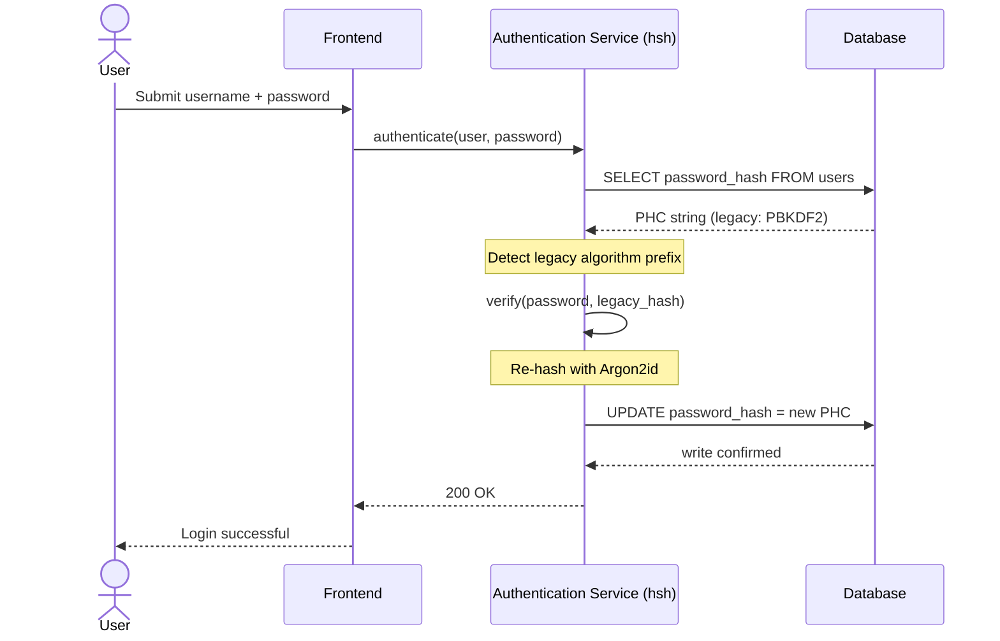
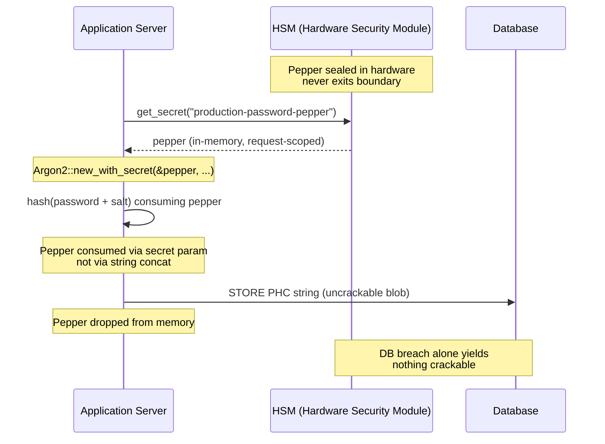

## ఎంటర్‌ప్రైజ్ బ్యాంకింగ్‌లో పాస్‌వర్డ్ నిర్వహణను భద్రపరచడం: hsh తో మల్టీ-అల్గోరిథం హాషింగ్ మరియు అప్‌గ్రేడ్‌లు

> **కార్యనిర్వాహక సారాంశం.** 2018 బెదిరింపు నమూనాకు వ్యతిరేకంగా నిర్మించబడిన బ్యాంకింగ్ ప్రామాణీకరణ 2026 నియంత్రణ వ్యవస్థ కింద ఇక పనికిరాదు. GPU-వేగవంతమైన క్రాకింగ్, ASIC సాంద్రత మరియు సమీపిస్తున్న పోస్ట్-క్వాంటం క్షితిజం PBKDF2 మరియు తొలి-పరామితి scrypt యొక్క భద్రతా మార్జిన్‌ను కూల్చివేశాయి; DORA ఆర్టికల్ 5 ఆ క్షయాన్ని బోర్డు-జవాబుదారీ బాధ్యతగా మార్చింది. hsh, ఒక ఓపెన్-సోర్స్ స్వచ్ఛమైన Rust ఫ్రేమ్‌వర్క్, సమస్యను మూడు పొరల్లో సమాంతరంగా పరిష్కరిస్తుంది: ప్రతి విజయవంతమైన లాగిన్‌లో నిల్వ చేసిన క్రెడెన్షియల్‌ను నిర్వహణ విండో లేకుండా ప్రస్తుత Argon2id పరామితులకు రీహాష్ చేసే `verify_and_upgrade` డిస్పాచర్; డేటాబేస్ ఉల్లంఘన మాత్రమే క్రాక్ చేయదగినది ఏదీ ఇవ్వకుండా చేసే HSM- లేదా KMS-ఇంటర్‌లాక్డ్ పెప్పరింగ్ పొర; మరియు C-ఆధారిత క్రిప్టోగ్రాఫిక్ లైబ్రరీలలో అంతర్లీనంగా ఉన్న ఫారిన్-ఫంక్షన్-ఇంటర్‌ఫేస్ దాడి ఉపరితలాన్ని తొలగించే మెమరీ-సురక్షిత సప్లై చైన్. ఫలితం DORA, Basel III కార్యాచరణ-ప్రమాద క్రమశిక్షణ, SM&CR సీనియర్-మేనేజర్ జవాబుదారీతనం మరియు NIST IR 8547 పోస్ట్-క్వాంటం మైగ్రేషన్ క్షితిజాన్ని సంతృప్తిపరిచే పునాది — ప్రామాణీకరణ ఎస్టేట్‌ను అప్‌గ్రేడ్ చేయడానికి చారిత్రకంగా అవసరమైన భారీ-రీసెట్ కార్యక్రమం లేకుండా.

చాలా ఎంటర్‌ప్రైజ్ బ్యాంకింగ్ ప్రామాణీకరణ ఇప్పటికీ 2018 బెదిరింపు నమూనాకు కఠినతరం చేయబడిన పాస్‌వర్డ్ పొరపై ఆధారపడి ఉంది. దానిని బద్దలు కొట్టే హార్డ్‌వేర్ ముందుకు సాగింది. GPU ఫామ్‌లు స్కేల్ అవుతుండగా మరియు క్రిప్టోగ్రాఫికల్‌గా సంబంధిత క్వాంటం కంప్యూటర్‌లు (CRQCలు) సమీపిస్తుండగా, లెగసీ హాషింగ్ — PBKDF2, తొలి scrypt — దాడిదారులు ఆఫ్‌లైన్ క్రాక్ క్యూలో గడిపే ప్రతి గంట కంప్యూట్ కింద క్షీణిస్తుంది. క్షయం నిశ్శబ్దమైనది: నిన్న బలంగా ఉన్న హాష్ ఇప్పుడు అలా లేదని ప్రొడక్షన్ డేటాబేస్‌లో ఏదీ మీకు చెప్పదు.

[డిజిటల్ ఆపరేషనల్ రెసిలియన్స్ యాక్ట్ (DORA)](https://eur-lex.europa.eu/eli/reg/2022/2554/oj "Regulation (EU) 2022/2554 — Digital Operational Resilience Act") కింద, ప్రొడక్షన్‌లో రొటేట్ చేయని, లెగసీ క్రిప్టోగ్రాఫిక్ ఆస్తులను వదిలివేయడం ఇక సాంకేతిక రుణం కాదు. ఇది పేరు పెట్టబడిన నియంత్రణ బాధ్యత.

[hsh](https://github.com/sebastienrousseau/hsh "hsh — pure-Rust password hashing framework") ఈ అంతరాన్ని మూసివేస్తుంది. ఒక స్వచ్ఛమైన Rust ఫ్రేమ్‌వర్క్‌గా, ఇది బహుళ హాష్ ఫార్మాట్‌లను పక్కపక్కనే నిర్వహిస్తుంది మరియు క్రియాశీల లాగిన్ సెషన్‌ల సమయంలో బలహీన క్రెడెన్షియల్స్‌ను ఇన్-ఫ్లైట్‌గా అప్‌గ్రేడ్ చేస్తుంది. ప్రామాణీకరణ మౌలిక సదుపాయం నిర్వహణ విండో లేకుండా, బలవంతపు రీసెట్ లేకుండా, ఒక్క సెకను డౌన్‌టైమ్ లేకుండా 2026 స్థితిస్థాపకత ఆదేశాలకు అనుగుణంగా ఉంటుంది.

## 01. బ్యాంకింగ్‌లో క్రిప్టోగ్రాఫిక్ క్షయ సమస్య

hsh వంటి ఫ్రేమ్‌వర్క్ యొక్క అవసరాన్ని అర్థం చేసుకోవడానికి, ఒకరు పాస్‌వర్డ్ హాష్ యొక్క జీవిత చక్రాన్ని అర్థం చేసుకోవాలి. అల్గోరిథమ్‌లు మనోహరంగా వృద్ధాప్యం చెందవు; అవి వాటిని బద్దలు కొట్టడానికి అందుబాటులో ఉన్న హార్డ్‌వేర్‌కు సాపేక్షంగా క్షీణిస్తాయి.

**ASIC/GPU వేగవంతం అంతరం.** PBKDF2 వంటి అల్గోరిథమ్‌లు CPUలకు గణనపరంగా ఖరీదైనవిగా రూపొందించబడ్డాయి. నేడు, దాడిదారులు ఆఫ్‌లైన్ డిక్షనరీ దాడులను అమలు చేయడానికి అత్యంత సమాంతరీకృత GPUలను ఉపయోగిస్తారు. 2018లో ఉత్పత్తి చేయబడిన లెగసీ హాష్ 2026 ప్రత్యర్థికి వ్యతిరేకంగా చాలా బలహీనమైనది.

**బిగ్-బ్యాంగ్ మైగ్రేషన్ ప్రమాదం.** ఒక CISO PBKDF2 నుండి Argon2id వంటి మెమరీ-హార్డ్ అల్గోరిథమ్‌కు అప్‌గ్రేడ్ చేయాలని నిర్ణయించినప్పుడు, వారు హాష్‌లను తిరిగి ఎన్‌క్రిప్ట్ చేయడానికి వాటిని రివర్స్ చేయలేరు. సంప్రదాయ పరిష్కారాలు — మిలియన్ల మంది వినియోగదారుల పాస్‌వర్డ్ రీసెట్‌లను బలవంతం చేయడం — భారీ కస్టమర్ ఘర్షణ మరియు కార్యాచరణ ప్రమాదాన్ని కలిగిస్తాయి.

**C-లైబ్రరీ సప్లై చైన్.** చారిత్రకంగా, బ్యాంకింగ్ మిడిల్‌వేర్ హాషింగ్ కోసం `argonautica` వంటి లైబ్రరీలు లేదా ముడి C బైండింగ్‌లపై ఆధారపడింది. ఈ లైబ్రరీలు దాచిన సప్లై-చైన్ ప్రమాదాన్ని కలిగి ఉంటాయి: ప్రామాణీకరణ మాడ్యూల్‌లో ఒక్క మెమరీ-బఫర్ ఓవర్‌ఫ్లో బ్యాంకింగ్ స్టాక్ యొక్క అత్యంత హక్కుగల పొరలో రిమోట్ కోడ్ ఎగ్జిక్యూషన్ (RCE)కు దారితీయవచ్చు.

### అల్గోరిథం పోలిక — హార్డ్‌వేర్ నిరోధకత మరియు ట్యూనింగ్ ఉపరితలం

ఒక బ్యాంకు మైగ్రేషన్ కార్పస్‌లో వాస్తవికంగా ఎదుర్కొనే మూడు అల్గోరిథమ్‌లు క్రిప్టోగ్రాఫిక్ ప్రిమిటివ్ ఎంపికలో కాకుండా, హార్డ్‌వేర్ ఒత్తిడి కింద అవి ఎలా వృద్ధాప్యం చెందుతాయనే దానిలో ఎక్కువగా విభేదిస్తాయి. దిగువ పట్టిక ఆచరణాత్మక భంగిమను సంగ్రహిస్తుంది.

| అల్గోరిథం | మెమరీ-హార్డ్ | GPU / ASIC నిరోధకత | ట్యూనింగ్ ఉపరితలం | 2026 స్థితి |
| ---- | ---- | ---- | ---- | ---- |
| **PBKDF2** | లేదు | తక్కువ — GPUపై వెక్టరైజ్ అవుతుంది; సాధారణ హార్డ్‌వేర్‌పై ప్రతి అంచనాకు సబ్-మిల్లీసెకన్. | పునరావృత గణన మాత్రమే. | లెగసీ. మైగ్రేషన్ సమయంలో వెరిఫై-సైడ్ ఫాల్‌బ్యాక్‌గా మాత్రమే ఆమోదయోగ్యం. |
| **scrypt** | అవును (మధ్యస్థం) | మధ్యస్థం — మెమరీ ఖర్చు సాధారణ GPU ఫామ్‌లను ఓడిస్తుంది; స్కేల్‌లో ASIC-అమోర్టైజ్ చేయదగినది. | `N` (CPU/మెమరీ), `r` (బ్లాక్ పరిమాణం), `p` (సమాంతరత). | గ్రీన్‌ఫీల్డ్ కోసం నిరుత్సాహపరచబడింది. మైగ్రేషన్ కార్పోరాలో క్రియాశీలంగా ఉంది. |
| **Argon2id** | అవును (అధిక) | అధిక — మెమరీ- మరియు సమయ-హార్డ్; సైడ్-ఛానల్ మరియు TMTO దాడులను నిరోధిస్తుంది. | మెమరీ ఖర్చు (`m`), సమయ ఖర్చు (`t`), సమాంతరత (`p`), రహస్యం (పెప్పర్). | సిఫార్సు చేయబడిన డిఫాల్ట్. OWASP, NIST SP 800-63B-4 డ్రాఫ్ట్, FedRAMP. |

మైగ్రేషన్ ప్లాన్ కోసం తీసుకోవలసిన అంశం సంకుచితమైనది: PBKDF2 అనేది *వెరిఫై-సైడ్* స్థితి, *రైట్-సైడ్* గమ్యస్థానం కాదు. PBKDF2 రికార్డ్‌పై ప్రతి విజయవంతమైన లాగిన్ బయటకు వెళ్లే మార్గంలో Argon2id రికార్డ్‌ను ఉత్పత్తి చేయాలి.

## 02. hsh 2026 ఆర్కిటెక్చర్ లెన్స్

ఫ్రేమ్‌వర్క్ ఐదు కోర్ పొరల్లో నిర్మాణాత్మకంగా ఉంది, ప్రతి ఒక్కటి నిర్దిష్ట వర్గం కార్యాచరణ ప్రమాదాన్ని తగ్గించడానికి ఇంజనీర్ చేయబడింది.

### పట్టిక 1: hsh ఆర్కిటెక్చర్ పొరలు మరియు ప్రమాద తగ్గింపు

| పొర | డిజైన్ నిర్ణయం | ఇది ఎందుకు ముఖ్యమైనది | తప్పుగా నిర్వహిస్తే ప్రమాదం |
| ---- | ---- | ---- | ---- |
| **క్రిప్టోగ్రాఫిక్ ప్రిమిటివ్‌లు** | Argon2id, scrypt మరియు PBKDF2 కు మద్దతిచ్చే ఏకీకృత PHC స్ట్రింగ్ ఫార్మాట్ | బ్యాక్‌వర్డ్ అనుకూలతను నిర్వహిస్తూ GPU దాడులకు ఉత్తమ-తరగతి నిరోధకతను అందిస్తుంది. | డేటా సైలోలు; సెకనుకు 100B+ అంచనాలను అనుమతించే బలహీన అల్గోరిథమ్‌లు ఆఫ్‌లైన్. |
| **పాలసీ ఇంజిన్** | `verify_and_upgrade` డిస్పాచ్ | లాగిన్‌లో డైనమిక్‌గా లెగసీ నుండి ఆధునిక పాలసీలకు మారడాన్ని ఆటోమేట్ చేస్తుంది. | భద్రతా క్షయం; క్రియాశీల వినియోగదారులు సులభంగా క్రాక్ చేయదగిన లెగసీ హాష్ రకాలపై ఉండటం. |
| **హార్డ్‌వేర్ ఇంటర్‌లాక్** | HSM మరియు క్లౌడ్ KMS "పెప్పరింగ్" సామర్థ్యాలు | డేటాబేస్ ఉల్లంఘన మాత్రమే అభ్యర్థి పాస్‌వర్డ్‌లను బహిర్గతం చేయదని నిర్ధారిస్తుంది. | SQL ఇంజెక్షన్ ఉల్లంఘన తర్వాత ఆఫ్‌లైన్ బ్రూట్-ఫోర్స్ దాడులు విజయవంతం కావడం. |
| **భద్రతా పరిశుభ్రత** | `deny.toml` అమలు మరియు స్వచ్ఛమైన Rust | అసురక్షిత FFI మరియు నమ్మదగని బాహ్య C-డిపెండెన్సీలను పూర్తిగా నిరోధిస్తుంది. | విపత్తు సప్లై చైన్ దాడులు మరియు మెమరీ-కరప్షన్ CVEలు. |

## 03. జీరో-డౌన్‌టైమ్ రీహాష్ మార్గం

`verify_and_upgrade` నమూనా జీరో డేటాబేస్ డౌన్‌టైమ్ అవసరమయ్యే తెలివైన, స్థితి-అవగాహన కలిగిన డిస్పాచింగ్ సిస్టమ్ ద్వారా డేటా మైగ్రేషన్‌ను పరిష్కరిస్తుంది.

వినియోగదారు తమ క్రెడెన్షియల్స్‌ను సమర్పించినప్పుడు, hsh నిల్వ చేసిన పాస్‌వర్డ్ హాషింగ్ కాంపిటిషన్ (PHC) స్ట్రింగ్‌ను చదువుతుంది. అది లెగసీ హాష్‌ను (ఉదా., పాత PBKDF2 కాన్ఫిగరేషన్) కలిగి ఉంటే, సిస్టమ్ కింది ప్రవాహాన్ని అమలు చేస్తుంది:

1. **గుర్తింపు:** లెగసీ అల్గోరిథం మరియు దాని నిర్దిష్ట పరామితులను పార్స్ చేస్తుంది.
2. **ధృవీకరణ:** లెగసీ హాష్‌కు వ్యతిరేకంగా అభ్యర్థి పాస్‌వర్డ్‌ను ధృవీకరిస్తుంది.
3. **రియల్-టైమ్ అప్‌గ్రేడ్:** విజయవంతమైన సరిపోలిక తర్వాత, ఇది మెమరీలో ప్లెయిన్‌టెక్స్ట్ అభ్యర్థి పాస్‌వర్డ్‌ను తీసుకుంటుంది మరియు అత్యంత సురక్షితమైన Argon2id పాలసీని ఉపయోగించి వెంటనే కొత్త హాష్‌ను గణిస్తుంది.
4. **నిలకడ:** ఇది కొత్త PHC స్ట్రింగ్‌ను బ్యాంకింగ్ అప్లికేషన్‌కు తిరిగి ఇస్తుంది, ఇది డేటాబేస్‌లో లెగసీ రికార్డ్‌ను ఓవర్‌రైట్ చేస్తుంది.

ఈ ప్రక్రియ ఎండ్-యూజర్‌కు పూర్తిగా పారదర్శకంగా ఉంటుంది. ఇది మొదటి రోజునే అత్యంత క్రియాశీల ఖాతాలను అత్యధిక భద్రతా స్థాయికి సమర్థవంతంగా మైగ్రేట్ చేస్తుంది, కాలక్రమేణా బ్యాంకు దాడి ఉపరితలాన్ని సేంద్రీయంగా నాటకీయంగా తగ్గిస్తుంది.

నిల్వ చేసిన రికార్డ్ లెగసీ అల్గోరిథంపై ఉన్నప్పుడు ఒక్క లాగిన్ ఈవెంట్ సమయంలో ఏమి జరుగుతుందో దిగువ క్రమం చూపుతుంది. వినియోగదారు ఏమీ మారడాన్ని చూడరు; బ్యాంకు ప్రామాణీకరణ ఎస్టేట్ ఒక రికార్డ్‌తో బలపడుతుంది.



### అమలు నమూనా — `verify_and_upgrade` డిస్పాచ్

ప్రామాణీకరణ సేవ లోపల ఏకీకరణ ఉపరితలం చిన్నది. లెగసీ కోడ్ పాత్ ఫాల్‌బ్యాక్‌గా ఉంటుంది; కొత్త కోడ్ పాత్ డిస్పాచర్.

```rust
use hsh::{Hasher, UpgradeResult};

struct UserRecord {
    username: String,
    password_hash: String, // PHC string
}

async fn authenticate(user: UserRecord, password_attempt: &str) -> Result<bool, AuthError> {
    let hasher = Hasher::new();
    match hasher.verify_and_upgrade(password_attempt, &user.password_hash) {
        Ok(UpgradeResult::Verified(is_valid)) => Ok(is_valid),
        Ok(UpgradeResult::Upgraded(new_hash)) => {
            db::update_user_hash(&user.username, new_hash).await?;
            Ok(true)
        }
        Err(_) => Err(AuthError::InvalidCredentials),
    }
}
```

మూడు లక్షణాలు ముఖ్యమైనవి:

- **స్థితి-అవగాహన.** `verify_and_upgrade` PHC స్ట్రింగ్ ప్రిఫిక్స్‌ను పరిశీలిస్తుంది. అల్గోరిథం మార్కర్ లెగసీ అయితే, ఫ్రేమ్‌వర్క్ కాన్ఫిగర్ చేయబడిన Argon2id పాలసీకి వ్యతిరేకంగా స్వయంచాలకంగా రీహాష్‌ను ప్రేరేపిస్తుంది. కాలింగ్ కోడ్‌లో బ్రాంచింగ్ లేదు.
- **అణుత్వం.** లెగసీ ధృవీకరణ విజయవంతమైన తర్వాత మాత్రమే, అదే ప్రామాణీకరణ ఈవెంట్ లోపల రీహాషింగ్ జరుగుతుంది. ప్రత్యేక బ్యాచ్ జాబ్ లేదు, షెడ్యూల్ చేయబడిన మైగ్రేషన్ విండో లేదు మరియు రోల్ బ్యాక్ చేయవలసిన విధ్వంసక భారీ మైగ్రేషన్ లేదు.
- **నిలకడ.** `UpgradeResult::Upgraded` వేరియంట్ కొత్త PHC స్ట్రింగ్‌ను తీసుకువెళుతుంది. లెగసీ రికార్డ్ కోసం ఇప్పటికే ఉన్న అదే డేటా పాత్ ద్వారా అప్లికేషన్ దానిని నిలుపుకుంటుంది — సమాంతర రైట్ ఉపరితలం లేదు, రెండు-దశల రైట్ ప్రోటోకాల్ లేదు.

**వైఫల్య రీతులు.** అప్‌గ్రేడ్ రైట్ సమయంలో డేటాబేస్ రైట్ విఫలమైతే లేదా KMS క్షణికంగా చేరుకోలేకపోతే, సెషన్ ఇప్పటికీ లెగసీ హాష్‌కు వ్యతిరేకంగా విజయవంతమవుతుంది మరియు రికార్డ్ పాత అల్గోరిథంపై ఉంటుంది. తదుపరి విజయవంతమైన లాగిన్ అప్‌గ్రేడ్‌ను తిరిగి ప్రయత్నిస్తుంది. సగం-మైగ్రేట్ చేయబడిన స్థితి లేదు మరియు వినియోగదారు-కనిపించే వైఫల్యం లేదు — మైగ్రేషన్ లాగిన్ ఈవెంట్‌ల అంతటా మోనోటానిక్, మరియు విఫలమైన అప్‌గ్రేడ్ యొక్క ప్రతి-రికార్డ్ ఖర్చు తదుపరి లాగిన్‌లో ఖచ్చితంగా ఒక అదనపు రీట్రై.

## 04. HSM / KMS ఇంటర్‌లాక్ ద్వారా పెప్పర్డ్ హాష్‌లు

ప్రామాణిక పాస్‌వర్డ్ హాషింగ్ ప్రత్యక్ష డేటాబేస్ లీక్‌ల నుండి రక్షిస్తుంది, కానీ దాడిదారు డేటాబేస్ (హాష్‌లు మరియు సాల్ట్‌లు) రెండింటినీ పొందితే, వారు ఆఫ్‌లైన్ క్రాకింగ్‌ను అమలు చేయవచ్చు.

hsh బలమైన "పెప్పర్డ్" భద్రతా పొరను ప్రవేశపెడుతుంది. హార్డ్‌వేర్ సెక్యూరిటీ మాడ్యూల్స్ (HSMలు) లేదా క్లౌడ్-నేటివ్ కీ మేనేజ్‌మెంట్ సర్వీసెస్ (KMS)తో ఏకీకృతం చేయడం ద్వారా, తుది Argon2id అవుట్‌పుట్ సురక్షిత హార్డ్‌వేర్ సరిహద్దును ఎప్పటికీ వదిలిపెట్టని అధిక-ఎంట్రోపీ కీతో క్రిప్టోగ్రాఫికల్‌గా చుట్టబడుతుంది. వినియోగదారు డేటాబేస్ ఎక్స్‌ఫిల్‌ట్రేట్ చేయబడితే, దాడిదారు కేవలం ఎన్‌క్రిప్ట్ చేయబడిన బ్లాబ్‌లను మాత్రమే కలిగి ఉంటారు. బ్యాంకు భౌతికంగా వేరుచేయబడిన HSM మౌలిక సదుపాయాన్ని కూడా ఉల్లంఘించకుండా వారు పాస్‌వర్డ్‌లను క్రాక్ చేయడం ప్రారంభించలేరు.

దిగువ ఆర్కిటెక్చర్ రేఖాచిత్రం రహస్య మార్గాన్ని గుర్తిస్తుంది. పెప్పర్ ఎప్పుడూ డేటాబేస్‌లో దిగదు; డేటాబేస్ ఎప్పుడూ దాని స్వంతంగా చిరునామా చేయదగినది ఏదీ కలిగి ఉండదు. రెండు స్టోర్‌లు స్వతంత్రంగా విఫలం కావచ్చు — రెండూ కలిసి విఫలమైతే మాత్రమే సిస్టమ్ గోప్యతను కోల్పోతుంది.



### అమలు నమూనా — HSM-ఆధారిత పెప్పర్డ్ Argon2id

పెప్పర్ కాన్ఫిగరేషన్ ఫైల్ నుండి కాకుండా, రిక్వెస్ట్ సమయంలో HSM నుండి పొందబడుతుంది. `Argon2::new_with_secret` దానిని స్ట్రింగ్ కాన్‌కాటినేషన్ ద్వారా కాకుండా, అల్గోరిథం యొక్క రహస్య పరామితి ద్వారా వినియోగిస్తుంది.

```rust
use argon2::{
    Argon2, Algorithm, Version, Params,
    PasswordHasher, PasswordVerifier,
    password_hash::{PasswordHash, SaltString, rand_core::OsRng},
};

async fn authenticate_with_hsm(
    user: UserRecord,
    password_attempt: &str,
) -> Result<bool, AuthError> {
    let pepper = hsm::client::get_secret("production-password-pepper").await?;
    let hasher = Argon2::new_with_secret(
        &pepper,
        Algorithm::Argon2id,
        Version::V0x13,
        Params::default(),
    )
    .map_err(|_| AuthError::Internal)?;

    let parsed = PasswordHash::new(&user.password_hash)
        .map_err(|_| AuthError::InvalidCredentials)?;
    if hasher.verify_password(password_attempt.as_bytes(), &parsed).is_ok() {
        if is_legacy_hash(&user.password_hash) {
            let new_hash = hasher
                .hash_password(
                    password_attempt.as_bytes(),
                    &SaltString::generate(&mut OsRng),
                )
                .map_err(|_| AuthError::Internal)?
                .to_string();
            db::update_user_hash(&user.username, new_hash).await?;
        }
        return Ok(true);
    }
    Err(AuthError::InvalidCredentials)
}
```

ఈ ఆకృతి నుండి మూడు DORA-అనుగుణ పరిణామాలు వస్తాయి:

- **కీ రొటేషన్ ఒక కీ-మేనేజ్‌మెంట్ సమస్యగా.** పెప్పర్ డేటాబేస్‌లో కాకుండా HSM/KMS సరిహద్దు వెనుక ఉంటుంది. రొటేషన్ వినియోగదారు ఎస్టేట్ అంతటా రీహాషింగ్ ప్రచారంగా కాకుండా కీ-మేనేజ్‌మెంట్ మార్పుగా మారుతుంది. కొత్త హాష్‌లు ప్రస్తుత పెప్పర్ వెర్షన్‌కు బంధిస్తాయి; పాత హాష్‌లు సహజంగా అప్‌గ్రేడ్ అయ్యే వరకు వాటి బంధిత వెర్షన్ కింద ధృవీకరించబడతాయి.
- **విధుల విభజన.** పెప్పర్‌ను చదివే సేవా గుర్తింపు ఆడిట్ చేయదగినది మరియు కనీస-హక్కు కలిగి ఉండాలి. సంబంధిత HSM గ్రాంట్ లేకుండా పూర్తి డేటాబేస్ ఎక్స్‌ఫిల్‌ట్రేషన్ క్రాక్ చేయదగినది ఏదీ ఇవ్వదు. డేటాబేస్ లేకుండా HSM-గ్రాంట్ రాజీ చిరునామా చేయదగినది ఏదీ ఇవ్వదు. ఏ ఒక్క వైఫల్యం యొక్క బ్లాస్ట్ రేడియస్ కూడా పరిమితం చేయబడింది.
- **లెంగ్త్ ఎక్స్‌టెన్షన్ మరియు కాన్‌క్యాట్ బగ్‌లను నివారించండి.** స్ట్రింగ్ కాన్‌కాటినేషన్ కంటే Argon2 యొక్క రహస్య పరామితిని ఉపయోగించడం అమలు ఉపరితలం నుండి క్రిప్టోగ్రాఫిక్ గోత్‌చాలు మొత్తం తరగతిని — లెంగ్త్-ఎక్స్‌టెన్షన్, తప్పుగా-టైప్ చేయబడిన UTF-8 కాన్‌కాటినేషన్, సాల్ట్/పెప్పర్-ఆర్డరింగ్ బగ్‌లను — తొలగిస్తుంది.

## 05. నియంత్రణ అనుగుణ్యత: DORA, Basel III మరియు SM&CR

- **DORA ఆర్టికల్స్ 5 మరియు 6:** ఆర్థిక సంస్థలు ICT రిస్క్ మేనేజ్‌మెంట్ ఫ్రేమ్‌వర్క్‌లను నిర్వహించాలని కోరుతుంది. రొటేట్ చేయని, దశాబ్దం-పాత పాస్‌వర్డ్ హాష్‌లపై ఆధారపడే వ్యూహం ఈ సూత్రాలను ఉల్లంఘిస్తుంది. hsh క్రిప్టోగ్రాఫిక్ రక్షణలను నిరంతరం ఎత్తడానికి డాక్యుమెంట్ చేయబడిన, ఆటోమేటెడ్ యంత్రాంగాన్ని అందిస్తుంది.
- **Basel III:** నష్ట సంఘటనల సంభావ్యత మరియు తీవ్రతకు నియంత్రణ మూలధనాన్ని లింక్ చేస్తుంది. HSM ఇంటర్‌లాక్‌తో Argon2id ను అమలు చేయడం ద్వారా, డేటాబేస్ ఉల్లంఘన యొక్క తీవ్రత నాటకీయంగా తగ్గుతుంది, తక్కువ కార్యాచరణ ప్రమాద మూలధన కేటాయింపు కోసం పరిమాణాత్మక వాదనలకు మద్దతు ఇస్తుంది.
- **SM&CR జవాబుదారీతనం:** క్రిప్టోగ్రాఫిక్ క్షయాన్ని చురుకుగా పరిష్కరించే ఆర్కిటెక్చర్‌ను ఆమోదించడం పేరు పెట్టబడిన సీనియర్ మేనేజర్‌లకు ప్రమాద తగ్గింపు యొక్క ధృవీకరించదగిన, డాక్యుమెంట్ చేయదగిన గొలుసును అందిస్తుంది.

## తరచుగా అడిగే ప్రశ్నలు

**hsh టైర్-1 బ్యాంకింగ్ ప్రామాణీకరణ మార్గం కోసం ప్రొడక్షన్-సిద్ధంగా ఉందా?**
లైబ్రరీ ఓపెన్-సోర్స్, డాక్యుమెంట్ చేయబడింది, మరియు RustCrypto పాస్‌వర్డ్-హాషింగ్ పర్యావరణ వ్యవస్థకు ఆధారమయ్యే అదే `argon2` క్రేట్ ద్వారా Argon2id ను వినియోగిస్తుంది. టైర్-1 అనుసరణ బ్యాంకు స్వంత డ్యూ-డిలిజెన్స్‌ను అనుసరిస్తుంది: స్వతంత్ర కోడ్ సమీక్ష, పునరుత్పత్తి-బిల్డ్ ధృవీకరణ, డిపెండెన్సీ-ట్రీ పిన్నింగ్, HSM-వెండర్ ఏకీకరణ పరీక్ష మరియు కార్యాచరణ ప్రమాద సైన్-ఆఫ్. hsh పునాదిని అందిస్తుంది; బ్యాంకు విస్తరణను ధృవీకరిస్తుంది.

**`verify_and_upgrade` భారీ-మైగ్రేషన్ ప్రమాదాన్ని ఎలా నివారిస్తుంది?**
వెరిఫయర్ పార్స్ సమయంలో PHC స్ట్రింగ్‌ను పరిశీలిస్తుంది, పాస్‌వర్డ్‌ను ధృవీకరించడానికి లెగసీ అల్గోరిథంను నడుపుతుంది, మరియు — నిల్వ చేసిన అల్గోరిథం లేదా పరామితి సెట్ ప్రస్తుత అడుగు కంటే తక్కువగా ఉంటే — బంధిత HSM పెప్పర్‌తో Argon2id కింద ప్లెయిన్‌టెక్స్ట్‌ను రీహాష్ చేసి కొత్త PHC స్ట్రింగ్‌ను అణుపరంగా తిరిగి వ్రాస్తుంది. వినియోగదారు సాధారణ లాగిన్‌ను అనుభవిస్తారు. ప్రతి విజయవంతమైన ప్రామాణీకరణకు ఎస్టేట్ ఒక రికార్డ్‌తో బలపడుతుంది. రీసెట్ ప్రచారం లేదు, నిర్వహణ విండో లేదు, కార్యాచరణ ప్రమాద సంఘటన లేదు.

**ఎప్పుడూ లాగిన్ చేయని నిద్రాణ ఖాతాలకు ఏమి జరుగుతుంది?**
ఎప్పుడూ ప్రామాణీకరించని రికార్డ్‌లు ఎప్పుడూ రీహాష్ కావు. బ్యాంకులు దీనిని రెండు పరిపూరక పాలసీలతో పరిష్కరిస్తాయి: డాక్యుమెంట్ చేయబడిన నిద్రాణత్వ ప్రవేశ ద్వారం (తరచుగా 18–24 నెలలు), దాని తర్వాత ఖాతా నియంత్రిత రీసెట్ ప్రచారం కింద పరిపాలనాపరంగా రొటేట్ చేయబడుతుంది, మరియు నిర్వచించిన కోహోర్ట్‌లలో (అధిక-విలువ, అధిక-హక్కు, నియంత్రించబడిన) ఖాతాల కోసం షెడ్యూల్ చేయబడిన నిర్వహణ సమయంలో సింథటిక్ రీహాష్ రన్. రెండూ పాలసీలు, లైబ్రరీ ప్రవర్తనలు కావు; hsh డిస్పాచ్ నిర్ణయాన్ని ఆడిట్ టెలిమెట్రీలో రికార్డ్ చేస్తుంది, తద్వారా కార్యాచరణ యజమాని కవరేజీని రుజువు చేయగలరు.

**HSM పెప్పర్ ప్రామాణీకరణ మార్గంపై ఒక్క వైఫల్య బిందువును ప్రవేశపెడుతుందా?**
చెల్లింపు సందేశాలపై సంతకం చేసే మరియు KMS-ఆధారిత కీలను రొటేట్ చేసే అదే HSM మార్గంలో ఉంది. ప్రమాదం బ్యాంకు ఇప్పటికే ఉన్న భంగిమకు సమానం; hsh దానిని ప్రవేశపెట్టడానికి బదులుగా వారసత్వంగా పొందుతుంది. తగ్గింపులు ప్రామాణికమైనవి: HA HSM జతలు, హాట్-స్పేర్ KMS ప్రాంతాలు, HSM అందుబాటులో లేని సమయంలో రీడ్-ఓన్లీ మోడ్‌కు సర్క్యూట్-బ్రేకర్ ఫాల్-బ్యాక్‌తో రిక్వెస్ట్-స్కోప్డ్ పెప్పర్ రిట్రీవల్, మరియు HSM అందుబాటులో లేని పరిస్థితి కోసం స్పష్టమైన కార్యాచరణ రన్‌బుక్. పెప్పర్ అనేది `argon2` యొక్క రహస్య పరామితి, ఇన్-ప్రాసెస్‌లో వినియోగించబడి, ఉపయోగం తర్వాత మెమరీ నుండి తొలగించబడుతుంది.

**పోస్ట్-క్వాంటం మైగ్రేషన్‌కు సాపేక్షంగా hsh ఎక్కడ ఉంది?**
hsh అనేది పాస్‌వర్డ్-మరియు-రహస్య-హాషింగ్ ఫ్రేమ్‌వర్క్, కీ-ఎన్‌క్యాప్సులేషన్ లేదా సిగ్నేచర్ ప్రిమిటివ్ కాదు. [NIST IR 8547](https://csrc.nist.gov/pubs/ir/8547/ipd "Transition to Post-Quantum Cryptography Standards")లో డాక్యుమెంట్ చేయబడిన PQC పరివర్తన కీ స్థాపన (ML-KEM, FIPS 203) మరియు సిగ్నేచర్‌లను (ML-DSA, FIPS 204; SLH-DSA, FIPS 205) లక్ష్యంగా చేసుకుంటుంది. hsh కవర్ చేసే హాషింగ్ పొర ఆ మైగ్రేషన్‌కు ఎక్కువగా ఆర్తోగోనల్. రెండూ పునాది స్థాయిలో కలుస్తాయి — రెండూ మెమరీ-సురక్షిత, ఆడిట్-చేయదగిన, పునరుత్పత్తి-బిల్డ్ క్రిప్టోగ్రాఫిక్ సప్లై చైన్‌ను కోరుకుంటాయి — ఇది hsh నేడు ప్రారంభించే భంగిమ ఖచ్చితంగా.

## ముగింపు

డిప్లాయ్-అండ్-ఫర్‌గెట్ పాస్‌వర్డ్ హాషింగ్ ముగిసింది. DORA క్రిప్టోగ్రాఫిక్ నిష్క్రియత్వాన్ని సాంకేతిక రుణం నుండి పేరు పెట్టబడిన నియంత్రణ బాధ్యతగా మార్చింది, మరియు హార్డ్‌వేర్ వక్రరేఖ ప్రతి సంవత్సరం మరింత నిటారుగా అవుతుంది. hsh యొక్క సహకారం బలమైన అల్గోరిథం కాదు — Argon2id సంవత్సరాలుగా అందుబాటులో ఉంది. సహకారం అనేది డౌన్‌టైమ్‌ను షెడ్యూల్ చేయకుండా, వినియోగదారు రీసెట్‌లను బలవంతం చేయకుండా మరియు బ్యాంకు ప్రామాణీకరణ మార్గంతో C-ఆధారిత FFI షిమ్‌లను నమ్మకుండా దానికి మైగ్రేట్ చేయడానికి కార్యాచరణ యంత్రాంగం.

[hsh సోర్స్ కోడ్](https://github.com/sebastienrousseau/hsh "hsh — pure-Rust password hashing framework, MIT and Apache 2.0 dual licence") MIT మరియు Apache 2.0 ద్వంద్వ లైసెన్స్ కింద అందుబాటులో ఉంది.

## సూచనలు

Basel Committee on Banking Supervision (2011). *Basel III: A global regulatory framework for more resilient banks and banking systems*. Bank for International Settlements. ఇక్కడ అందుబాటులో ఉంది: [https://www.bis.org/publ/bcbs189.pdf](https://www.bis.org/publ/bcbs189.pdf "Basel III: A global regulatory framework for more resilient banks and banking systems")

Biryukov, A., Dinu, D., Khovratovich, D., and Josefsson, S. (2021). *RFC 9106: Argon2 Memory-Hard Function for Password Hashing and Proof-of-Work Applications*. Internet Engineering Task Force. ఇక్కడ అందుబాటులో ఉంది: [https://datatracker.ietf.org/doc/html/rfc9106](https://datatracker.ietf.org/doc/html/rfc9106 "RFC 9106 — Argon2 Memory-Hard Function for Password Hashing")

European Parliament and Council (2022). *Regulation (EU) 2022/2554 on digital operational resilience for the financial sector (DORA)*. ఇక్కడ అందుబాటులో ఉంది: [https://eur-lex.europa.eu/eli/reg/2022/2554/oj](https://eur-lex.europa.eu/eli/reg/2022/2554/oj "Regulation (EU) 2022/2554 — DORA")

Financial Conduct Authority (2015). *Senior Managers and Certification Regime (SM&CR)*. ఇక్కడ అందుబాటులో ఉంది: [https://www.fca.org.uk/firms/senior-managers-certification-regime](https://www.fca.org.uk/firms/senior-managers-certification-regime "Senior Managers and Certification Regime")

National Institute of Standards and Technology (2024). *Initial Public Draft — Transition to Post-Quantum Cryptography Standards (NIST IR 8547)*. ఇక్కడ అందుబాటులో ఉంది: [https://csrc.nist.gov/pubs/ir/8547/ipd](https://csrc.nist.gov/pubs/ir/8547/ipd "NIST IR 8547 — Transition to Post-Quantum Cryptography Standards")

OWASP Foundation (2024). *Password Storage Cheat Sheet*. ఇక్కడ అందుబాటులో ఉంది: [https://cheatsheetseries.owasp.org/cheatsheets/Password_Storage_Cheat_Sheet.html](https://cheatsheetseries.owasp.org/cheatsheets/Password_Storage_Cheat_Sheet.html "OWASP Password Storage Cheat Sheet")
