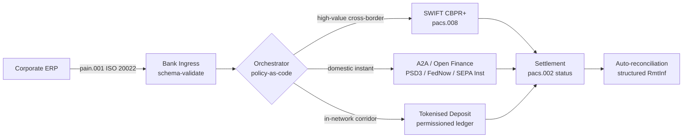

## సరిహద్దు-దాటి 2026: కార్పొరేట్ ట్రెజరీలో ISO 20022, ఓపెన్ ఫైనాన్స్ మరియు టోకనైజ్డ్ డిపాజిట్‌లు

> **కార్యనిర్వాహక సారాంశం.** 2026లో సరిహద్దు-దాటి కార్పొరేట్ ట్రెజరీ అనేది సంబంధ-నిర్వహణ సమస్య కావడానికి ముందు ఒక బహుళ-రైల్ ఇంజనీరింగ్ సమస్య. PSD3 మరియు ఫైనాన్షియల్ డేటా యాక్సెస్ (FiDA) నియంత్రణ ఓపెన్-బ్యాంకింగ్ పరిధిని కార్పొరేట్ ట్రెజరీ డేటాలోకి విస్తరిస్తాయి; నవంబర్ 2026 SWIFT MT/MX కట్-ఓవర్ CBPR+-అనుకూల pacs.008ను ఏకైక ఆచరణీయ సరిహద్దు-దాటి ఇంటర్‌బ్యాంక్ ఫార్మాట్‌గా చేస్తుంది; టోకనైజ్డ్ డిపాజిట్‌లు మరియు నియంత్రిత స్టేబుల్‌కాయిన్ రైల్‌లు అనుమతి-ఆధారిత నెట్‌వర్క్‌ల లోపల దాదాపు T+0లో హోల్‌సేల్ సెటిల్‌మెంట్ దశను నిర్వహిస్తాయి. ఈ చక్రంలో గెలిచే CIB ఏకైక రైల్‌ను ఎంచుకునేది కాదు; అది వాటిని బంధించే ఆర్కెస్ట్రేషన్ లేయర్‌ను ఇంజనీర్ చేసేది. ఈ వ్యాసం నాలుగు-రైల్ ఆర్కిటెక్చర్‌ను (PSD3 కింద A2A, SWIFT CBPR+, బ్యాంకు-జారీ చేసిన టోకనైజ్డ్ డిపాజిట్‌లు, నియంత్రిత స్టేబుల్‌కాయిన్‌లు) పరిశీలిస్తుంది — ప్రతి రైల్ దేనిలో బాగా పనిచేస్తుంది, క్రెడిట్-ఎక్స్‌పోజర్ సరిహద్దులు ఎక్కడ పడతాయి, మరియు కార్పొరేట్ ఒక చెల్లింపును చూసేలా, సూపర్‌వైజర్ ఒక ఆడిట్ చేయదగ్గ ట్రెయిల్‌ను చూసేలా వాటికి పైన ఉన్న పాలసీ-యాజ్-కోడ్ ఆర్కెస్ట్రేషన్ లేయర్ దేనిని అమలు చేయాలి.

ఒక యూరోపియన్ పారిశ్రామిక కార్పొరేట్ ఒక బుధవారం ఉదయం ఒక బ్రెజిలియన్ సరఫరాదారుకు EUR 4.2 మిలియన్లు చెల్లిస్తుంది. ట్రెజరీ వర్క్‌స్టేషన్ ఒక బ్యాంకును ఎంచుకోదు. అది ఒక రైల్‌ను ఎంచుకుంటుంది — రైల్‌ల ఒక క్రమాన్ని. కస్టమర్-ఫేసింగ్ సూచన PSD3 కింద ఒక ఓపెన్ ఫైనాన్స్ ప్రొవైడర్ ద్వారా రూట్ చేయబడిన A2A pain.001 మెసేజ్‌గా వస్తుంది. బ్యాంకు దాన్ని CIB ప్రైవేట్ నెట్‌వర్క్ లోపల టోకనైజ్డ్ డిపాజిట్‌లపై రెండు కరస్పాండెంట్ అధికార పరిధుల మీదుగా నడిపిస్తుంది. లాంగ్ టెయిల్ — టోకనైజ్డ్-డిపాజిట్ సంబంధం లేని సబ్-సరఫరాదారుకు USD 80,000 ఇన్‌వాయిస్ క్లీన్-అప్ — ఇంకా SWIFT CBPR+పై pacs.008గా ప్రయాణిస్తుంది. కస్టమర్ ఒక చెల్లింపును చూస్తాడు. ఆర్కిటెక్చర్ నాలుగు రైల్‌లను చూస్తుంది. ఇది కలిసి నిలబడటానికి ఏకైక కారణం [ISO 20022](/2023-09-29-automating-iso-20022-compliant-payment-file-creation-with-pain001/index.html).

Mastercard [ఓపెన్ బ్యాంకింగ్ నుండి ఓపెన్ ఫైనాన్స్‌కు పరిణామం](https://www.mastercard.com/us/en/news-and-trends/Insights/2026/open-banking-to-open-finance-the-evolution-of-financial-data.html "Mastercard: open banking to open finance, the evolution of financial data") గురించి మాట్లాడేటప్పుడు వర్ణించే ఆపరేటింగ్ మోడల్ ఇదే — డేటా మరియు చెల్లింపులు ఒకే ఆర్కెస్ట్రేషన్ లేయర్‌లోకి కలిసిపోతాయి, రైల్‌ను కస్టమర్ కాదు సిస్టమ్ ఎంచుకుంటుంది. సీనియర్ బ్యాంకింగ్ టెక్నాలజిస్ట్‌ల కోసం ఆసక్తికరమైన ప్రశ్న ఏ రైల్ గెలుస్తుందనేది కాదు. అది ఆర్కెస్ట్రేషన్ లేయర్ ఎలా ఇంజనీర్ చేయబడింది, పాలించబడింది మరియు సమన్వయపరచబడింది అనేది.

## 01. కార్డుల నుండి A2Aకు — ఓపెన్ ఫైనాన్స్ మార్పు

కార్డ్ రైల్‌లు తొలగిపోవడం లేదు. అవి పునర్నిర్వచించబడుతున్నాయి.

2025 అంతటా మరియు 2026లోకి, [PSD3 మరియు ఫైనాన్షియల్ డేటా యాక్సెస్ (FiDA) నియంత్రణ](https://www.consultancy.uk/news/42202/orchestrating-open-banking-for-platform-growth-2026-outlook "Consultancy.uk: orchestrating open banking for platform growth, 2026 outlook") ఓపెన్-బ్యాంకింగ్ బాధ్యతను చెల్లింపు ఖాతాలకు మించి పెన్షన్లు, తనఖాలు, పొదుపులు, బీమా మరియు కార్పొరేట్ ట్రెజరీ డేటాలోకి విస్తరించాయి. కార్పొరేట్ ట్రెజరీ ప్రభావం ప్రత్యక్షమైనది: ఒక CIB రిలేషన్‌షిప్ మేనేజర్ ఇప్పుడు కార్పొరేట్ సూచన మేరకు, ఒక API ఒప్పందం ద్వారా బహుళ బ్యాంకుల మీదుగా కార్పొరేట్ యొక్క పూర్తి లిక్విడిటీ చిత్రాన్ని వినియోగించగలడు.

కార్పొరేట్‌లు వినియోగించే ఆర్కెస్ట్రేషన్ లేయర్‌ను రెండు ఆపరేటర్లు స్పష్టంగా నిర్మిస్తున్నారు. Nexi తన అక్వైరింగ్ ఉనికిని SEPA Instant మరియు పాన్-యూరోపియన్ RTGS కారిడార్‌ల మీదుగా A2A ఇనిషియేషన్‌లోకి విస్తరించింది, ఎండ్-టు-ఎండ్ ISO 20022 స్థానికంగా. Mastercard యొక్క ఓపెన్ ఫైనాన్స్ ప్లాట్‌ఫారమ్ — Aiia మరియు Finicity యొక్క దాని కొనుగోలుపై స్థిరపడింది — దిగువన డేటా-అగ్రిగేషన్ మరియు కన్సెంట్ లేయర్‌ను అందిస్తుంది, గతంలో కార్డ్ ఆథరైజేషన్‌లకు సేవ చేసిన అదే API ఎస్టేట్ ద్వారా చెల్లింపు ఇనిషియేషన్ ఉద్భవిస్తుంది.

ఈ మార్పు మూడు కారణాల వల్ల ముఖ్యం:

1. **యూనిట్ ఆర్థికశాస్త్రం.** PSD3 కింద ప్రారంభించబడిన A2A చెల్లింపు నుండి ఇంటర్‌చేంజ్‌ను తొలగిస్తుంది. అధిక-టికెట్ B2B ప్రవాహాల కోసం, పొదుపు గణనీయమైనది; తక్కువ-టికెట్ వినియోగదారు ప్రవాహాల కోసం, వ్యాపారి వ్యయ స్టాక్ కూలిపోతుంది.
2. **డేటా నాణ్యత.** ISO 20022 కింద A2A కార్డులు ఎప్పటికీ మోయలేని స్ట్రక్చర్డ్ రెమిటెన్స్ డేటాను మోస్తుంది. 95% పైన ఆటో-రీకన్సిలియేషన్ రేట్‌లు ఇప్పుడు కనీస అవసరాలు.
3. **రిస్క్ మోడల్.** A2A అనేది కార్డ్ ఆథరైజేషన్ కాదు, ఒక క్రెడిట్ ట్రాన్స్‌ఫర్. మోసం ఉపరితలం, చార్జ్‌బ్యాక్ మోడల్, మరియు వివాద మోడల్ అన్నీ వేరుగా ఉంటాయి. కస్టమర్ ప్రొటెక్షన్ లేయర్ వారసత్వంగా పొందబడటం లేదు, పునర్నిర్మించబడుతోందని కార్పొరేట్ ట్రెజరీ బృందాలు అర్థం చేసుకోవాలి.

2026లో బహుళ-రైల్ ప్రతిపాదనను అమ్మే CIB ఆర్కెస్ట్రేషన్‌ను అమ్ముతోంది — యాక్సెస్‌ను కాదు. యాక్సెస్ ఇప్పుడు నియంత్రించబడింది.

## 02. రైల్‌ల మీదుగా ఉమ్మడి భాషగా ISO 20022

బహుళ-రైల్ అసలు పని చేయగలుగుతున్నదానికి కారణం ఇప్పుడు మెసేజ్ ఫార్మాట్ రైల్‌ల మీదుగా స్థిరంగా ఉండటమే.

BIS కమిటీ ఆన్ పేమెంట్స్ అండ్ మార్కెట్ ఇన్‌ఫ్రాస్ట్రక్చర్స్ (CPMI) తన [సరిహద్దు-దాటి చెల్లింపులను మెరుగుపరచడానికి ISO 20022 హార్మనైజేషన్ అవసరాలు](https://www.bis.org/cpmi/publ/d230.pdf "BIS CPMI: ISO 20022 harmonisation requirements for enhancing cross-border payments")లో ఆర్కిటెక్చరల్ కేసును స్పష్టంగా చేసింది. CBPR+కు నవంబర్ 2025 కట్-ఓవర్ సరిహద్దు-దాటి ఇంటర్‌బ్యాంక్ మెసేజింగ్ కోసం MT103 / MT202 యుగాన్ని మూసివేసింది. ఆ సమయం నుండి, ప్రతి ప్రధాన రైల్ — SWIFT, FedNow, SEPA Instant, RTP, మరియు ఆసియా మరియు లాటిన్ అమెరికాలోని ప్రధాన ఇన్‌స్టంట్ చెల్లింపు వ్యవస్థలు — అదే pacs.008 / pacs.009 / pain.001 వ్యాకరణాన్ని మాట్లాడతాయి.

కార్పొరేట్ ట్రెజరీ కోసం ఆచరణాత్మక పరిణామం:

- **రూటింగ్ డేటా-ఆధారితం.** ట్రెజరీ వర్క్‌స్టేషన్ ఒక pain.001ను ఒకసారి చదివి, మెసేజ్‌ను తిరిగి మ్యాప్ చేయకుండా — కారిడార్, టికెట్ పరిమాణం, కట్-ఆఫ్, మరియు ప్రతిపక్ష సంబంధం ఆధారంగా ప్రతి చెల్లింపుకు రైల్‌ను నిర్ణయించగలదు.
- **రెమిటెన్స్ డేటా హాప్‌ను తట్టుకుంటుంది.** స్ట్రక్చర్డ్ రెమిటెన్స్ ఫీల్డ్‌లు (`<RmtInf><Strd>`) కరస్పాండెంట్ దశల మీదుగా ట్రంకేషన్ లేకుండా కొనసాగుతాయి. డేటా ఇకపై రైల్ సరిహద్దు వద్ద కోల్పోబడనందున ఆటో-రీకన్సిలియేషన్ రేట్‌లు పెరుగుతాయి.
- **అనుమతుల స్క్రీనింగ్ ఆడిట్ చేయదగినదిగా మారుతుంది.** LEI రిఫరెన్స్‌లతో స్ట్రక్చర్డ్ `<Dbtr>` / `<Cdtr>` / `<DbtrAgt>` / `<CdtrAgt>` ఫీల్డ్‌లు ఫ్రీ-టెక్స్ట్ నేమ్ స్క్రీనింగ్‌ను భర్తీ చేస్తాయి. హిట్ రేట్‌లు తగ్గుతాయి. ఇన్వెస్టిగేషన్ క్యూలు కుంచించుకుపోతాయి.

కింది రేఖాచిత్రం ఒకే pain.001ను బ్యాంకు ప్రవేశం గుండా, పాలసీ-యాజ్-కోడ్ ఆర్కెస్ట్రేటర్‌లోకి, మరియు కారిడార్ మరియు టికెట్ పరిమాణం డిమాండ్ చేసే ఏ రైల్‌కు అయినా బయటకు గుర్తిస్తుంది — ఒక మెసేజ్, అనేక రైల్‌లు, తిరిగి మ్యాపింగ్ లేదు.

ఈ స్థిరత్వం యొక్క ఖర్చు ఇంజనీరింగ్ క్రమశిక్షణ. ISO 20022 అనుమతించేది. రెండు బ్యాంకులు పూర్తిగా CBPR+ అనుకూలంగా ఉండి కూడా ఫీల్డ్ వినియోగం, క్యారెక్టర్ సెట్, మరియు రెమిటెన్స్-డేటా నిర్మాణంలో భిన్నంగా ఉండే pacs.008 మెసేజ్‌లను ఉత్పత్తి చేయగలవు. 2026లో సరిహద్దు-దాటిపై గెలిచే CIB స్టాండర్డ్ అవసరమైనదానికంటే కఠినమైన మెసేజ్ ప్రొఫైల్‌ను అమలు చేస్తుంది — మరియు సెటిల్‌మెంట్ వద్ద కాదు, పార్స్ వద్ద తిరస్కరిస్తుంది.

## 03. టోకనైజ్డ్ డిపాజిట్‌లు మరియు స్థిర రైల్‌లు

హోల్‌సేల్ సెటిల్‌మెంట్ దశలోనే రైల్ కథ ఆసక్తికరంగా మారుతుంది.

[ఆటోమేషన్, కంటింజెన్సీ రైల్‌లు, ISO 20022 మరియు స్టేబుల్‌కాయిన్‌ల ట్రేడ్ ట్రెజరీ పేమెంట్స్ విశ్లేషణ](https://tradetreasurypayments.com/articles/automation-contingency-rails-iso-20022-and-stablecoins-the-2026-trends-reshaping-corporate-finance-and-b2b-payments "Trade Treasury Payments: automation, contingency rails, ISO 20022 and stablecoins, the 2026 trends reshaping corporate finance and B2B payments")లో బాగా వర్ణించబడిన 2026 చిత్రం, హోల్‌సేల్ సెటిల్‌మెంట్ లేయర్‌ను నిర్మాణాత్మకంగా భిన్నమైన రెండు మోడల్‌లుగా విభజిస్తుంది.

**బ్యాంకు-జారీ చేసిన టోకనైజ్డ్ డిపాజిట్‌లు.** ఒక వాణిజ్య బ్యాంకు అనుమతి-ఆధారిత లెడ్జర్‌పై టోకనైజ్డ్ లయబిలిటీని జారీ చేస్తుంది — JPM Coin, HSBC యొక్క Orion-లింక్డ్ డిపాజిట్ టోకెన్, ప్రధాన యూరోపియన్ CIB సమానులు. టోకెన్ జారీ చేసే బ్యాంకుపై ప్రత్యక్ష క్లెయిమ్. సెటిల్‌మెంట్ నెట్‌వర్క్ లోపల దాదాపు T+0. కంప్లయెన్స్ జారీ చేసే బ్యాంకు బాధ్యత. రైల్ పూర్తిగా నియంత్రించబడింది, పూర్తిగా ట్రేస్ చేయదగినది, మరియు జారీదారు ఆన్-బోర్డ్ చేసిన పాల్గొనేవారికి పరిమితం.

**ఇంటిగ్రేటెడ్ స్టేబుల్‌కాయిన్ రైల్‌లు.** ఒక నియంత్రిత స్టేబుల్‌కాయిన్ — పూర్తిగా రిజర్వ్ చేయబడింది, ఆడిట్ చేయబడింది, మరియు MiCA లేదా సమానమైన ప్రాంతీయ పాలన కింద నిర్వహించబడుతోంది — బ్యాంకు-జారీ చేసిన టోకనైజ్డ్ డిపాజిట్‌లు ఇంకా చేరని కారిడార్‌ను సెటిల్ చేస్తుంది. టోకెన్ ఒక బ్యాంకు బ్యాలెన్స్ షీట్‌పై కాదు, రిజర్వ్‌పై క్లెయిమ్. కంప్లయెన్స్ జారీదారు, ఆన్-ర్యాంప్, మరియు ఆఫ్-ర్యాంప్ మధ్య పంచుకోబడుతుంది.

రెండు మోడల్‌లు పోటీ పడటం లేదు. అవి పేర్చబడ్డాయి. 2026లో ఒక CIB సరిహద్దు-దాటి ఉత్పత్తి సాధారణంగా ఇన్-నెట్‌వర్క్ దశ కోసం బ్యాంకు-జారీ చేసిన టోకనైజ్డ్ డిపాజిట్‌లను మరియు ఇన్-నెట్‌వర్క్ రైల్ ముగిసే కారిడార్ కోసం నియంత్రిత స్టేబుల్‌కాయిన్‌ను ఉపయోగిస్తుంది. కార్పొరేట్ ఒక ISO 20022 చెల్లింపును చూస్తుంది. దిగువన సెటిల్‌మెంట్ కథ బహుళ-టోకెన్.

బోర్డ్-స్థాయి ప్రశ్న మొదటి ప్రోగ్రామబుల్-లిక్విడిటీ పైలట్‌ల నుండి ఆపరేషనల్-రిస్క్ కమిటీలు అడుగుతున్న అదే ప్రశ్న: టోకెన్‌పై క్రెడిట్ ఎక్స్‌పోజర్‌ను ఎవరు మోస్తారు, మరియు ఎంతకాలం? టోకనైజ్డ్ డిపాజిట్‌లు స్పష్టమైన సమాధానం ఇస్తాయి — జారీ చేసే బ్యాంకు, బర్న్ వరకు. ఇంటిగ్రేటెడ్ స్టేబుల్‌కాయిన్ రైల్‌లు మరింత సూక్ష్మమైనదాన్ని ఇస్తాయి — రిజర్వ్, ఆడిట్ చక్రం మరియు రిడెంప్షన్ గ్యారంటీకి లోబడి. ప్రతి రైల్‌కు ప్రతి కారిడార్‌కు సమాధానాన్ని డాక్యుమెంట్ చేయని ట్రెజరీ బృందం తన బ్యాలెన్స్ షీట్‌పై కొలవని క్రెడిట్ రిస్క్‌ను మోస్తోంది.

## 04. స్వయంప్రతిపత్త ట్రెజరీ స్టాక్

రైల్ లేయర్‌కు పైన ఆర్కెస్ట్రేషన్ లేయర్ ఉంటుంది. ఆర్కెస్ట్రేషన్ లేయర్‌కు పైన ఏజెంట్ లేయర్ ఉంటుంది.

నేను ఈ ఆర్కిటెక్చర్‌ను [ది అటానమస్ ట్రెజరీ ఇండెక్స్ 2026: ప్రోగ్రామబుల్ లిక్విడిటీ అండ్ టోకనైజ్డ్ డిపాజిట్స్](https://sebastienrousseau.com/2026-06-07-autonomous-treasury-index-programmable-liquidity-tokenised-deposits-2026 "Sebastien Rousseau: The Autonomous Treasury Index 2026")లో వివరంగా వివరించాను. సంక్షిప్త రూపం: 2026లో ఏజెంటిక్ ట్రెజరీ అనేది ఆర్కెస్ట్రేషన్ లేయర్, పాలసీ-యాజ్-కోడ్‌గా వ్యక్తీకరించబడింది, దానిలో పరిమిత ఏజెంట్‌లు అమలు చేస్తాయి.

స్టాక్ ఇది:

1. **రైల్ లేయర్.** SWIFT CBPR+, ఇన్‌స్టంట్ A2A, టోకనైజ్డ్ డిపాజిట్‌లు, నియంత్రిత స్టేబుల్‌కాయిన్‌లు. ప్రతి రైల్‌కు ప్రచురించబడిన ప్రొఫైల్, కట్-ఆఫ్ టేబుల్, కాస్ట్ కర్వ్, మరియు సెటిల్‌మెంట్-ఫైనాలిటీ మోడల్ ఉంటాయి.
2. **ఆర్కెస్ట్రేషన్ లేయర్.** ISO 20022 లోపలికి, ISO 20022 బయటకు. కారిడార్, టికెట్, కట్-ఆఫ్, ప్రతిపక్ష సంబంధం, మరియు పాలసీ ఆధారంగా ప్రతి చెల్లింపుకు రైల్ నిర్ణయం. పాలసీ వెర్షన్ చేయబడింది, సంతకం చేయబడింది, మరియు ఆడిట్ చేయదగినది.
3. **ఏజెంట్ లేయర్.** పరిమిత ట్రెజరీ ఏజెంట్‌లు టూల్-కాల్ సరిహద్దులు, ఆడిట్ లాగ్‌లు, మరియు కిల్ స్విచ్‌లతో ఆర్కెస్ట్రేషన్ పాలసీని అమలు చేస్తాయి. ఏజెంట్ రైల్‌ను ఎంచుకోదు. పాలసీ రైల్‌ను ఎంచుకుంటుంది. ఏజెంట్ పాలసీని నడుపుతుంది.
4. **రీకన్సిలియేషన్ లేయర్.** ISO 20022 pacs.008 / pacs.002 / camt.054 మెసేజ్‌లు అసలు pain.001 సూచనకు వ్యతిరేకంగా సమన్వయం అవుతాయి, స్ట్రక్చర్డ్ రెమిటెన్స్ డేటా మాన్యువల్ జోక్యం లేకుండా లూప్‌ను మూసివేస్తుంది.

2026లో ఈ స్టాక్‌ను అమ్మే CIB ఒకేసారి నాలుగు వస్తువులను అమ్ముతోంది — మరియు వాటిని విడిగా ధర నిర్ణయిస్తోంది. దాన్ని కొనే కార్పొరేట్ రైల్‌ల మీదుగా ఐచ్ఛికతను కొంటోంది, ఒక మెసేజ్ ప్రమాణం, ఒక పాలసీ లేయర్, ఒక రీకన్సిలియేషన్ ఫీడ్‌తో. అదే ఆర్కిటెక్చరల్ మార్పు. మిగతాదంతా అమలు వివరాలు.

## తరచుగా అడిగే ప్రశ్నలు

**"ఓపెన్ ఫైనాన్స్" అనేది కేవలం రీబ్రాండ్ చేసిన ఓపెన్ బ్యాంకింగా?**
కాదు. PSD2 కింద ఓపెన్ బ్యాంకింగ్ చెల్లింపు ఖాతాలను కవర్ చేసింది. PSD3 మరియు ఫైనాన్షియల్ డేటా యాక్సెస్ (FiDA) నియంత్రణ డేటా-షేరింగ్ బాధ్యతను పెన్షన్లు, తనఖాలు, పొదుపులు, బీమా, మరియు కార్పొరేట్ ట్రెజరీ డేటాలోకి విస్తరిస్తాయి. కార్పొరేట్-ట్రెజరీ ప్రభావం ప్రత్యక్షం: ఒక CIB రిలేషన్‌షిప్ మేనేజర్ ఇప్పుడు కార్పొరేట్ యొక్క చెల్లింపు-ఖాతా చరిత్రను మాత్రమే కాదు, కార్పొరేట్ సూచన మేరకు, ఒక API ఒప్పందం ద్వారా బహుళ బ్యాంకుల మీదుగా దాని పూర్తి లిక్విడిటీ చిత్రాన్ని వినియోగించగలడు.

**రైల్ కాకుండా ఆర్కెస్ట్రేషన్ లేయర్ ఎందుకు ఆర్కిటెక్చరల్ దృష్టి?**
ఎందుకంటే రైల్‌లు ఇప్పుడు వస్తువీకరించబడుతున్నాయి. SWIFT CBPR+ pacs.008, PSD3 కింద A2A, టోకనైజ్డ్ డిపాజిట్‌లు, మరియు నియంత్రిత స్టేబుల్‌కాయిన్‌లు అన్నీ మెసేజ్ స్థాయిలో అదే ISO 20022 వ్యాకరణాన్ని మోస్తాయి. 2026 CIBను వేరు చేసేది కారిడార్, టికెట్ పరిమాణం, సెటిల్‌మెంట్-ఫైనాలిటీ అవసరం, మరియు ప్రతిపక్ష సంబంధం ఆధారంగా ప్రతి చెల్లింపుకు రైల్‌ను ఎంచుకునే పాలసీ-యాజ్-కోడ్ ఇంజన్ — మరియు సూపర్‌వైజర్ అడిగే ఆడిట్ టెలిమెట్రీలో ఎంపికను రికార్డ్ చేసేది. ఆ ఇంజన్ లేకుండా, బహుళ-రైల్ అనేది పాలన లేని ఐచ్ఛికత మాత్రమే.

**టోకనైజ్డ్-డిపాజిట్ దశలో క్రెడిట్-ఎక్స్‌పోజర్ సరిహద్దు ఎక్కడ పడుతుంది?**
అనుమతి-ఆధారిత లెడ్జర్‌పై బ్యాంకు-జారీ చేసిన టోకనైజ్డ్ డిపాజిట్‌లు జారీ చేసే బ్యాంకుపై ప్రత్యక్ష క్లెయిమ్ — క్రెడిట్ ఎక్స్‌పోజర్ బర్న్ వద్ద ముగుస్తుంది. నియంత్రిత స్టేబుల్‌కాయిన్ రైల్‌లు (EUలో MiCA-పర్యవేక్షిత, UKలో బ్యాంక్ ఆఫ్ ఇంగ్లాండ్ యొక్క చర్చా-పత్ర పాలన, ఇతర ప్రాంతాలలో సమానమైనవి) రిజర్వ్‌పై క్లెయిమ్, ఎక్స్‌పోజర్ విండో ఆడిట్ చక్రం మరియు రిడెంప్షన్-గ్యారంటీ నిబంధనలకు లోబడి ఉంటుంది. ప్రతి రైల్‌కు ప్రతి కారిడార్‌కు సమాధానాన్ని డాక్యుమెంట్ చేయని ట్రెజరీ బృందం తన బ్యాలెన్స్ షీట్‌పై కొలవని క్రెడిట్ రిస్క్‌ను మోస్తోంది.

**ఈ ఆర్కిటెక్చర్‌లో SWIFTకు ఏమవుతుంది?**
SWIFT అదృశ్యం కాదు — అది లాంగ్ టెయిల్‌ను స్థిరపరుస్తుంది. బ్యాంకు-జారీ చేసిన టోకనైజ్డ్ డిపాజిట్‌లు ఇంకా చేరని కారిడార్‌లు (చాలా వర్ధమాన-మార్కెట్ సబ్-సరఫరాదారు సంబంధాలు, చాలా తక్కువ-ఫ్రీక్వెన్సీ / తక్కువ-టికెట్ సరిహద్దు-దాటి ప్రవాహం), మరియు కార్పొరేట్ లేదా బ్యాంకు CBPR+ కరస్పాండెంట్-బ్యాంకింగ్ ఆడిట్ ట్రెయిల్‌ను కోరే కారిడార్‌లు, SWIFT pacs.008పై కొనసాగుతాయి. 2026 ఆర్కిటెక్చర్ "SWIFT + కొత్త రైల్‌లు", "SWIFTకు బదులుగా కొత్త రైల్‌లు" కాదు.

**ఈ స్టాక్‌ను కొన్నప్పుడు కార్పొరేట్ ఏమి కొంటుంది?**
రైల్‌ల మీదుగా ఐచ్ఛికత, ఒక మెసేజ్ ప్రమాణం (ISO 20022), ఒక పాలసీ లేయర్ (ఆర్కెస్ట్రేషన్ ఇంజన్), మరియు ఒక రీకన్సిలియేషన్ ఫీడ్ (pacs.002 స్టేటస్ + camt.054 కన్ఫర్మేషన్ + స్ట్రక్చర్డ్ camt.053 స్టేట్‌మెంట్‌లు)తో. కార్పొరేట్ నాలుగు వేర్వేరు రైల్ కనెక్షన్‌ల కోసం చెల్లించడం లేదు. నాలుగు రైల్‌లను నిర్వహణపరంగా ఒకటిగా ప్రవర్తించేలా చేసే ఆర్కెస్ట్రేషన్ లేయర్ కోసం — మరియు తదుపరి పర్యవేక్షక అభ్యర్థన మరుసటి ఉదయం "ఆ EUR 4.2 మిలియన్ల చెల్లింపు ఏ రైల్‌పై ప్రయాణించింది, మరియు ఎందుకు?" అని సమాధానం ఇవ్వనిచ్చే ఆడిట్ ట్రెయిల్ కోసం అది చెల్లిస్తోంది.

## ముగింపు

2026లో సరిహద్దు-దాటి కార్పొరేట్ ట్రెజరీ ఒక బహుళ-రైల్ ఇంజనీరింగ్ సమస్య. బహుళ-రైల్‌ను నిర్వహించదగినదిగా చేసే వ్యాకరణం ISO 20022. PSD3 మరియు FiDA డేటా పరిధిని విస్తరించి కార్పొరేట్ ట్రెజరీ వర్క్‌ఫ్లోలోకి ఓపెన్ ఫైనాన్స్‌ను బలవంతం చేస్తాయి. టోకనైజ్డ్ డిపాజిట్‌లు మరియు నియంత్రిత స్టేబుల్‌కాయిన్‌లు హోల్‌సేల్ సెటిల్‌మెంట్ దశను నిర్వహిస్తాయి. SWIFT ఇంకా లాంగ్ టెయిల్‌ను స్థిరపరుస్తుంది.

గెలిచే CIB ఆర్కెస్ట్రేషన్ లేయర్‌ను నిర్మించేది — ఏకైక రైల్‌ను ఎంచుకుని దానిపై ఫ్రాంఛైజీని పందెం కాసేది కాదు. గెలిచే కార్పొరేట్ ట్రెజరీ బృందం ప్రతి రైల్‌కు ప్రతి కారిడార్‌కు క్రెడిట్ ఎక్స్‌పోజర్‌ను డాక్యుమెంట్ చేసేది, నియంత్రకుడు కోరిన దానికంటే కఠినమైన ISO 20022 ప్రొఫైల్‌ను అమలు చేసేది, మరియు రైల్ నిర్ణయాన్ని ప్రతి-చెల్లింపు తీర్పుగా కాదు, పాలసీగా పరిగణించేది.

ఆసక్తికరమైన పని ఆర్కెస్ట్రేషన్ లేయర్‌లో ఉంది. దాన్ని జాగ్రత్తగా నిర్మించండి.

## సూచనలు

Bank for International Settlements, Committee on Payments and Market Infrastructures (2023). *Harmonised ISO 20022 data requirements for enhancing cross-border payments* (CPMI Papers No. 230). ఇక్కడ లభ్యం: [https://www.bis.org/cpmi/publ/d230.htm](https://www.bis.org/cpmi/publ/d230.htm "BIS CPMI 230 — Harmonised ISO 20022 data requirements")

Bank for International Settlements (2024). *Project Agorá: cross-border payments with tokenised commercial bank deposits and central bank money*. BIS Innovation Hub. ఇక్కడ లభ్యం: [https://www.bis.org/about/bisih/topics/fmis/agora.htm](https://www.bis.org/about/bisih/topics/fmis/agora.htm "BIS Project Agorá")

Bank of England (2023). *Regulatory regime for systemic payment systems using stablecoins and related service providers — Discussion Paper*. ఇక్కడ లభ్యం: [https://www.bankofengland.co.uk/paper/2023/dp/regulatory-regime-for-systemic-payment-systems-using-stablecoins-and-related-service-providers](https://www.bankofengland.co.uk/paper/2023/dp/regulatory-regime-for-systemic-payment-systems-using-stablecoins-and-related-service-providers "Bank of England — Regulatory regime for stablecoins discussion paper")

European Commission (2023). *Proposal for a Directive on payment services and electronic money services (PSD3)*. ఇక్కడ లభ్యం: [https://finance.ec.europa.eu/regulation-and-supervision/financial-services-legislation/implementing-and-delegated-acts/payment-services-directive_en](https://finance.ec.europa.eu/regulation-and-supervision/financial-services-legislation/implementing-and-delegated-acts/payment-services-directive_en "European Commission — Payment Services Directive proposal")

European Parliament and Council (2023). *Regulation (EU) 2023/1114 on markets in crypto-assets (MiCA)*. ఇక్కడ లభ్యం: [https://eur-lex.europa.eu/eli/reg/2023/1114/oj](https://eur-lex.europa.eu/eli/reg/2023/1114/oj "Regulation (EU) 2023/1114 — Markets in Crypto-Assets (MiCA)")

Financial Action Task Force (2023). *International standards on combating money laundering and the financing of terrorism — Recommendation 16 on wire transfers*. ఇక్కడ లభ్యం: [https://www.fatf-gafi.org/en/publications/Fatfrecommendations/Fatf-recommendations.html](https://www.fatf-gafi.org/en/publications/Fatfrecommendations/Fatf-recommendations.html "FATF Recommendations")

International Organization for Standardization (2020). *ISO 17442 Financial services — Legal entity identifier (LEI)*. ఇక్కడ లభ్యం: [https://www.gleif.org/en/about-lei/iso-17442-the-lei-code-structure](https://www.gleif.org/en/about-lei/iso-17442-the-lei-code-structure "ISO 17442 — Legal Entity Identifier")

SWIFT (2024). *Cross-Border Payments and Reporting Plus (CBPR+) usage guidelines*. ఇక్కడ లభ్యం: [https://www.swift.com/standards/iso-20022/iso-20022-programme](https://www.swift.com/standards/iso-20022/iso-20022-programme "SWIFT CBPR+ usage guidelines")
