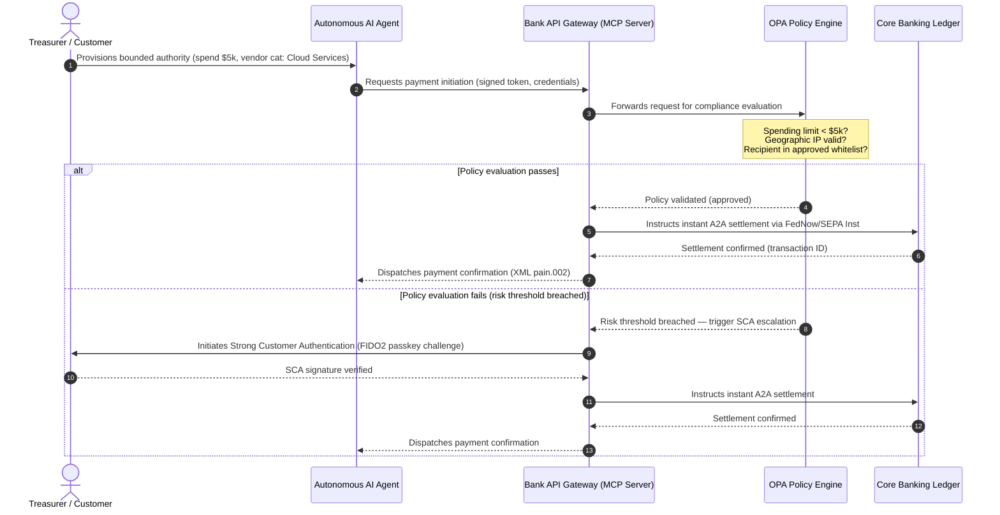

## 2026 ప్రపంచ చెల్లింపుల ఔట్‌లుక్: ఏజెంటిక్, కనిపించని, రియల్-టైమ్ ప్రపంచంలో ఆపరేటింగ్ మోడల్, రిస్క్, రెవెన్యూ

ప్రపంచ లావాదేవీ బ్యాంకుల కోసం, 2026-2028 చక్రం ఒక నిర్మాణాత్మక కిటికీ. ఆధునిక చెల్లింపు మౌలిక సదుపాయం ఇకపై ఒక పరిపాలనా వినియోగం కాదు — ఇది బ్యాంక్-గ్రేడ్ సాంకేతిక వ్యూహం యొక్క కేంద్రం. G-SIBలు మరియు ప్రధాన ప్రాంతీయ సంస్థల లోపల, సాంకేతికత, నియంత్రణ, మరియు కస్టమర్ నిరీక్షణ ఒకే ఆపరేటింగ్ ప్లేన్‌లో కలిసిపోయాయి.

ఈ చక్రాన్ని మూడు శక్తులు నిర్వచిస్తాయి, ప్రతి ఒక్కటి నేరుగా ఒక ఎగ్జిక్యూటివ్-సూట్ ఆందోళనకు మ్యాప్ అవుతుంది.

- **ఏజెంటిక్ కామర్స్** — ఛానల్ పంపిణీ, ఉత్పత్తి రూపకల్పన, బాధ్యత కేటాయింపు, మరియు పర్యవేక్షక పరిశీలన కింద మోడల్ రిస్క్ మేనేజ్‌మెంట్.
- **కనిపించని చెల్లింపులు** — కస్టమర్ అనుభవం, బ్యాంకులు తమ లెడ్జర్‌ను కార్పొరేట్ మరియు మర్చంట్ ఫ్రంట్-ఎండ్‌లలో ఎంబెడ్ చేయడంలో విఫలమైన చోట మధ్యవర్తిత్వ తొలగింపు (disintermediation) రిస్క్‌తో.
- **రియల్-టైమ్ ఎగ్జిక్యూషన్** — మూలధన వేగం, ఫలితంగా లిక్విడిటీ నిర్వహణ, క్రెడిట్ రిస్క్, కార్యాచరణ స్థితిస్థాపకత, మరియు మోసం రక్షణలో మార్పుతో.

ఆర్థిక పణాలు గణనీయమైనవి. మోసం వేగం మరియు సంక్లిష్టతలో స్కేల్ అవుతుంది; నియంత్రణ గడువులు కఠినమైనవి; మరియు తమ కోర్ సిస్టమ్‌లను ముందుగానే ఆధునీకరించే బ్యాంకులు గణనీయమైన ఫీజు-రెవెన్యూ అవకాశాలను తెరుస్తాయి. నిష్క్రియత్వం యొక్క ఖర్చు దీనికి విరుద్ధం: తక్షణ లావాదేవీ తిరస్కరణలు, కార్యాచరణ అడ్డంకులు, నియంత్రణ జరిమానాలు, మరియు వేగవంతమైన మార్కెట్-షేర్ క్షయం.

## నిశ్చయత నిచ్చెన — ఏది తేదీ నిర్ధారితం, ఏది నియంత్రితం, ఏది అంచనా

ఈ నివేదికలోని ప్రతి అంశం ఒకే స్థాయి నిశ్చయతను కలిగి ఉండదు. బోర్డు-స్థాయి ప్రశ్న ఏమిటంటే ఏ డెల్టాలు గడువులు, ఏవి పర్యవేక్షక నిరీక్షణలు, మరియు ఏవి ఇప్పటికీ మార్కెట్ అంచనాలు — ఎందుకంటే సమాధానం బడ్జెట్ సంభాషణను మారుస్తుంది.

| వర్గం | ఉదాహరణలు |
| --- | --- |
| **కఠిన గడువులు** | Swift CBPR+ స్ట్రక్చర్డ్-అడ్రస్ కట్-ఓవర్ (14 నవంబర్ 2026); EPC SEPA స్కీమ్ రూల్‌బుక్‌లు (15 నవంబర్ 2026) |
| **నియంత్రణ బాధ్యతలు** | DORA ICT రిస్క్ + స్థితిస్థాపకత పరీక్ష + మూడవ-పక్ష పర్యవేక్షణ (EU); PSD3/PSR కింద SCA అప్పగింత; SR 11-7 + PRA SS1/23 కింద MRM |
| **అధిక-సంభావ్యత మార్కెట్ మార్పులు** | రియల్-టైమ్ ట్రెజరీ APIలు, AI-నేతృత్వ మోసం రక్షణ, API-ఆధారిత లిక్విడిటీ, డీప్‌ఫేక్-నడిచే బయోమెట్రిక్ మోసం |
| **వ్యూహాత్మక ఎంపికలు** | టోకనైజ్డ్ డిపాజిట్లు, Project Agorá కింద యూనిఫైడ్ లెడ్జర్లు, ఏజెంటిక్-కామర్స్ కారిడార్లు, నిరంతర FX (Wire 365) |
| **అంచనాలు** | 2030 నాటికి ఏటా $3-$5 ట్రిలియన్ల ఏజెంటిక్-కామర్స్ ప్రవాహాలు (McKinsey బేస్‌లైన్) |

పైన ఉన్న రెండు వరుసలను — బ్యాంక్ ఏదైనా అప్‌సైడ్‌ను పట్టుకున్నా లేదా పట్టుకోకపోయినా — ఒక బడ్జెట్ లైన్‌ను నడిపించే కంప్లయన్స్ వాస్తవాలుగా పరిగణించండి. కింది రెండు వరుసలను వ్యూహాత్మక ఎంపికలుగా పరిగణించండి — దిశలో అధిక-విశ్వాసం, కానీ ఎగ్జిక్యూషన్ సమయం ఒక నియంత్రకుని క్యాలెండర్ ప్రవేశం కాకుండా ఒక బోర్డు ఎంపిక.

## ప్రపంచ చెల్లింపు అధికారుల కలయిక

ఈ నివేదిక నాలుగు అధికారిక పరిశ్రమ గొంతుల నుండి 2026 చెల్లింపులు మరియు వాణిజ్య ఔట్‌లుక్‌లను సంశ్లేషణ చేస్తుంది — [J.P. Morgan Payments](https://www.jpmorgan.com/payments/newsroom/payments-outlook-2026-trends-report-released "J.P. Morgan Payments — Outlook 2026"), [Global Payments](https://investors.globalpayments.com/news-events/press-releases/detail/497/global-payments-releases-its-2026-commerce-and-payment "Global Payments — 2026 Commerce and Payment Trends Report"), HSBC, మరియు The Payments Association — మరియు వాటిని [క్రాస్-బోర్డర్ చెల్లింపులను మెరుగుపరచడానికి G20 రోడ్‌మ్యాప్](https://www.fsb.org/2026/03/fsb-kicks-off-new-implementation-phase-to-enhance-cross-border-payments-through-public-private-partnership/ "FSB — cross-border payments implementation phase, March 2026")కు వ్యతిరేకంగా త్రిభుజీకరిస్తుంది.

ప్రతి సంస్థ పర్యావరణ వ్యవస్థను వేరే మార్కెట్ కోణం నుండి సమీపిస్తుంది, కానీ వాటి కనుగొన్నవి మూడు మార్పులేనివాటిపై కలుస్తాయి.

1. **తక్షణ, API-నడిచే రెయిల్‌లు ప్రాతిపదిక.** వారసత్వ బ్యాచ్-ప్రాసెసింగ్ మోడల్‌లు క్రాస్-బోర్డర్ మరియు అధిక-విలువ ప్రవాహాల కోసం అంచుకు నెట్టబడ్డాయి; ఆ విభాగాలలో లావాదేవీ వేగం ఎల్లప్పుడూ-ఆన్, రియల్-టైమ్ మెసేజింగ్ ద్వారా నిర్దేశించబడుతుంది.
2. **AI ముప్పు మరియు రక్షణ రెండూ.** జనరేటివ్ సాధనాలు మరియు డీప్‌ఫేక్‌లు లావాదేవీ మోసాన్ని స్కేల్ చేస్తాయి, ఇది రియల్-టైమ్, బహుళ-పొర మెషిన్-లెర్నింగ్ ప్రతి-రక్షణలను అవసరం చేస్తుంది.
3. **టోకనైజేషన్ ఉత్పత్తి-సిద్ధమైన మౌలిక సదుపాయం.** లెడ్జర్లు టోకనైజ్డ్ వాణిజ్య బాధ్యతలు మరియు హోల్‌సేల్ కేంద్ర బ్యాంక్ డిజిటల్ కరెన్సీలను హోస్ట్ చేయడానికి ఏకీకృతం అవుతున్నాయి.

| నివేదిక | ప్రాథమిక ప్రేక్షకులు | దృష్టి | ముఖ్య స్తంభం | బ్యాంక్ చిక్కులు |
| --- | --- | --- | --- | --- |
| **J.P. Morgan Payments** | కార్పొరేట్ ట్రెజరర్లు, G-SIBలు | రియల్-టైమ్ లిక్విడిటీ, మోసం | APIలు, AI బయోమెట్రిక్స్ | నిరంతర 365-రోజుల సెటిల్‌మెంట్ కోసం లిక్విడిటీ, FX, మరియు రిస్క్ సిస్టమ్‌లను పునర్నిర్మించండి. |
| **Global Payments** | మర్చంట్లు, ఇ-కామర్స్ | POS పరిణామం, ఓమ్నిఛానల్ | ఏజెంటిక్ కామర్స్, ఘర్షణరహిత చెక్‌అవుట్ | స్వయంప్రతిపత్త AI ఏజెంట్ల కోసం సురక్షితమైన, API-గేట్ చేసిన మర్చంట్ చెల్లింపు కారిడార్లను నిర్మించండి. |
| **HSBC Insights** | బహుళజాతి కార్పొరేట్లు | ERP ఇంటిగ్రేషన్లు (SAP/Oracle), రియల్-టైమ్ నగదు | Treasury-as-a-Service, నగదు దృశ్యమానత | లావాదేవీ API సూట్‌లను ద్రవ్యీకరించండి మరియు మూలం వద్ద రియల్-టైమ్ నగదు లెడ్జర్ నివేదనను ఎంబెడ్ చేయండి. |
| **The Payments Association** | ఫిన్‌టెక్‌లు, చెల్లింపు సంస్థలు | స్టేబుల్‌కాయిన్లు, టోకనైజేషన్, ప్రపంచ నియంత్రణ | నియంత్రిత డిజిటల్ ఆస్తులు, విధాన కంప్లయన్స్ | టోకనైజ్డ్ డిపాజిట్ల కోసం బ్యాలెన్స్ షీట్లను సిద్ధం చేయండి మరియు PSD3/PSR బాధ్యత నిర్మాణాలను నావిగేట్ చేయండి. |

నాలుగు ఔట్‌లుక్‌లు వాస్తవంగా పబ్లిక్-సెక్టర్ G20 విధాన మౌలిక సదుపాయం పైన నడిచే ప్రైవేట్-సెక్టర్ ఆపరేటింగ్ స్టాక్‌ను నిర్వచిస్తాయి, విధాన ఉద్దేశాన్ని బ్యాంకుల లోపల లిక్విడిటీ, టోకనైజేషన్, డేటా, మరియు మోసం నియంత్రణపై నిర్దిష్ట నిర్ణయాలుగా అనువదిస్తాయి.

## స్తంభం 1 — ఏజెంటిక్ కామర్స్ మరియు కనిపించని చెల్లింపులు

ఏజెంటిక్ కామర్స్ అనేది మానవ-నడిచే, క్లిక్-టు-బై చెక్‌అవుట్ నుండి స్వయంప్రతిపత్త, మోడల్-నడిచే లావాదేవీ ప్రారంభానికి మారడం. పరిశ్రమ అంచనాలు 2030 నాటికి స్వయంప్రతిపత్త ఏజెంట్లచే మధ్యవర్తిత్వం వహించబడే ఏటా $3-$5 ట్రిలియన్ల వాణిజ్యంపై కలుస్తాయి — ఒక మానవుడు 'కొను' క్లిక్ చేయకుండా అమలు చేయబడే ప్రపంచ చెల్లింపు పరిమాణంలో తక్కువ-ఒక-అంకె వాటా.

రిటైల్ మరియు వాణిజ్య పర్యావరణ వ్యవస్థకు సంబంధిత అంతరం ఉంది. ఇప్పుడు స్పష్టమైన మెజారిటీ వినియోగదారులు దాదాపు-ఘర్షణరహిత చెల్లింపులను ఆశిస్తారు, అయినప్పటికీ సగం కంటే తక్కువ మర్చంట్లు వన్-క్లిక్ చెక్‌అవుట్ లేదా API-ప్రాప్యత ఉత్పత్తి కేటలాగ్‌లకు ప్రాధాన్యత ఇచ్చారు. AI ఏజెంట్లు మానవ కళ్ళ కోసం రూపొందించబడిన వారసత్వ బహుళ-పేజీ చెక్‌అవుట్ స్క్రీన్‌లను నావిగేట్ చేయలేవు; వాటికి నిర్మాణాత్మక, మెషిన్-టు-మెషిన్ API హ్యాండ్‌షేక్‌లు అవసరం.

### బ్యాంక్ ప్రాధాన్యతలు మరియు కార్యాచరణ ప్రభావం

- **KYC మరియు AML యాజమాన్యం.** ఏజెంటిక్ లావాదేవీ గొలుసు లోపల కంప్లయన్స్ బాధ్యత ఎవరు కలిగి ఉంటారో బ్యాంకులు నిర్వచించాలి. వినియోగదారుని వ్యక్తిగత AI ఏజెంట్ ఒక మర్చంట్ యొక్క ఏజెంటిక్ చెక్‌అవుట్ ద్వారా లావాదేవీని ప్రారంభిస్తే, మూలభూత అప్పగించిన అధికారం క్రిప్టోగ్రాఫికల్‌గా ప్రాథమిక ఖాతాదారునికి కట్టుబడి ఉందని బ్యాంక్ ధృవీకరించాలి.
- **బాధ్యత మరియు చార్జ్‌బ్యాక్ పునర్రూపకల్పన.** కార్డ్ స్కీమ్‌లు మరియు A2A రెయిల్‌లు మానవ ప్రామాణీకరణ చుట్టూ రూపొందించబడ్డాయి. ఒక AI ఏజెంట్ తప్పుడు కొనుగోలు చేసినప్పుడు — ఉదాహరణకు, డేటా-పార్సింగ్ లోపం కారణంగా తప్పు పారిశ్రామిక ఇన్వెంటరీని సేకరించడం — బ్యాంకులు వినియోగదారు, ఏజెంట్ ప్రొవైడర్, మరియు మర్చంట్ మధ్య బాధ్యతను స్పష్టంగా కేటాయించాలి.
- **ఏజెంటిక్ ప్రవాహాలకు రిస్క్-రేటింగ్.** చెల్లింపు రూటింగ్ ఇంజన్‌లు ఏజెంటిక్ చెల్లింపులను గతిశీలంగా రిస్క్-రేట్ చేయాలి, ఒక స్థిరమైన సెటిల్‌మెంట్ ట్రాక్ రికార్డ్ ఉనికిలో ఉండే వరకు మానవ-ప్రారంభితం కాని లావాదేవీలకు అధిక రిజర్వ్ అవసరాలు లేదా ఇంటర్‌చేంజ్ రేట్లను వర్తింపజేస్తాయి.

### సరిహద్దు చర్య మరియు సరిహద్దు అధికారం

"అపరిమిత చర్య"ను తగ్గించడానికి — ఒక సాఫ్ట్‌వేర్ లోపం కారణంగా అనంతమైన పునరావృత కొనుగోలు లూప్ నడుపుతున్న ఎంటర్‌ప్రైజ్ ప్రొక్యూర్‌మెంట్ ఏజెంట్ — బ్యాంకులు **సరిహద్దు-అధికార API గేట్లను** అమలు చేయాలి. గేట్లు మూడు కోణాలలో విధాన-స్థాయి పరిమితులను అమలు చేస్తాయి.

1. **శ్రేణీకృత ఆర్థిక పరిమితులు** — లావాదేవీ పరిమాణం, రోజువారీ సంచిత విలువ, మరియు మర్చంట్ వర్గం ద్వారా పరిమితం చేయబడిన ఏజెంట్ ఖర్చు.
2. **సందర్భ-అవగాహన రక్షణలు** — లెడ్జర్ నిధులను విడుదల చేయడానికి ముందు అంచనా వేయబడిన ద్వితీయ సంకేతాలు (రోజు-సమయం, IP జియోలొకేషన్, లావాదేవీ ఫ్రీక్వెన్సీ).
3. **హ్యూమన్-ఇన్-ద-లూప్ ఎస్కలేషన్** — ఒక లావాదేవీ రిస్క్ థ్రెషోల్డ్‌లను మించినప్పుడల్లా PSD3 / PSR కింద స్ట్రాంగ్ కస్టమర్ అథెంటికేషన్ (SCA) ద్వారా ప్రేరేపించబడిన తప్పనిసరి మానవ ప్రామాణీకరణ.

క్రింది Mermaid సీక్వెన్స్ చాలా బ్యాంకులు సరిహద్దు-అధికార ఏజెంటిక్ చెల్లింపు ప్రవాహంగా గుర్తించే లక్ష్య నిర్మాణాన్ని చూపిస్తుంది.

### Model Context Protocol (MCP)

స్థానికీకరించిన AI మోడల్‌లను బ్యాంక్-పరిపాలిత ఎగ్జిక్యూషన్ పొరలకు కనెక్ట్ చేయడానికి, పరిశ్రమ [Model Context Protocol (MCP)](https://modelcontextprotocol.io "Model Context Protocol — open standard for LLM tool integration") చుట్టూ ప్రామాణీకరిస్తోంది — ఇది LLMలను కోర్ సిస్టమ్‌లకు ముడి ప్రాప్యత లేకుండా స్పష్టంగా పరిధించబడిన, ఆడిట్ చేయదగిన సాధనాలు మరియు APIలను పిలవడానికి అనుమతించే ఒక ఓపెన్ ప్రోటోకాల్.

బ్యాంకింగ్ APIలను (చెల్లింపు ప్రారంభం, బ్యాలెన్స్ విచారణ, పార్టీ ధృవీకరణ) ఒక MCP సర్వర్ లోపల చుట్టడం LLMలను డేటాబేస్ టేబుల్‌లు మరియు సిస్టమ్-రూట్ నియంత్రణల నుండి దూరంగా ఉంచుతుంది. మోడల్ నిర్మాణాత్మక, ఆడిట్ చేయబడిన, రేట్-పరిమిత ఎండ్‌పాయింట్‌ల ద్వారా మాత్రమే లెడ్జర్‌తో సంకర్షిస్తుంది — భద్రత మోడల్ లోపల పాతిపెట్టబడకుండా ఏజెంటిక్ సాధన ఎగ్జిక్యూషన్ యొక్క సరిహద్దు వద్ద అమలు చేయబడుతుంది.

## స్తంభం 2 — ట్రెజరీ రూపాంతరం మరియు లిక్విడిటీ పునర్‌ఊహన

2026లో లావాదేవీ బ్యాంకింగ్ వేగం రోజు-చివరి బ్యాచ్ ప్రాసెసింగ్ నుండి ఎల్లప్పుడూ-ఆన్, రియల్-టైమ్ ట్రెజరీ కార్యకలాపాలకు మారడం ద్వారా నిర్ణయించబడుతుంది. బహుళజాతి కార్పొరేట్లు ఇకపై చిక్కుకుపోయిన నగదును సహించవు — సెటిల్‌మెంట్ సిస్టమ్‌లు మూసివేయబడినందున వారాంతాల్లో లేదా సెలవుదినాల్లో స్థానిక ఖాతాలలో నిష్క్రియంగా కూర్చున్న లిక్విడిటీ.

### రియల్-టైమ్ లిక్విడిటీ కోసం ఆర్థిక కేసు

అభివృద్ధి చెందిన రియల్-టైమ్ నగదు మరియు డేటా సామర్థ్యాలు కలిగిన కార్పొరేట్లు, ప్రధానంగా చిక్కుకుపోయిన లిక్విడిటీని తగ్గించడం మరియు వర్కింగ్-క్యాపిటల్ చక్రాలను ఆప్టిమైజ్ చేయడం ద్వారా, రెవెన్యూ వృద్ధి మరియు మూలధన సామర్థ్యంపై సహచరులను అధిగమించే అవకాశం గణనీయంగా ఎక్కువ అని J.P. Morgan మరియు HSBC రెండూ నివేదిస్తాయి.

ఆ విలువను పట్టుకోవడానికి, బ్యాంకులు కార్పొరేట్ ERPలను (SAP, Oracle) నేరుగా బ్యాంక్ లెడ్జర్‌లోకి ప్లగ్ చేయడానికి అనుమతించే **Treasury-as-a-Service (TaaS) API ఉత్పత్తులను** రవాణా చేస్తాయి.

- **రియల్-టైమ్ బ్యాలెన్స్ APIలు** `camt.052` స్కీమాను ఉపయోగించి — ఫైల్-బదిలీ ప్రోటోకాల్‌లను తక్షణ, ఈవెంట్-నడిచే నగదు-స్థానం నివేదనతో భర్తీ చేస్తాయి.
- **బల్క్ పేమెంట్ ఇనిషియేషన్ APIలు** `pain.001` ఉపయోగించి — ERP లెడ్జర్ నుండి వెండర్ చెల్లింపు బ్యాచ్‌ల ప్రత్యక్ష, స్ట్రెయిట్-త్రూ ఎగ్జిక్యూషన్.
- **నిరంతర FX APIలు** — ట్రెజరీ ఇంజన్‌లు క్రాస్-బోర్డర్ సెటిల్‌మెంట్ కోసం రియల్-టైమ్, అల్గోరిథమిక్ విదేశీ-మారకపు రేట్లను లాక్ చేస్తాయి, రాత్రిపూట మార్కెట్-గ్యాప్ రిస్క్‌ను తొలగిస్తాయి.
- **వర్చువల్ ఖాతా APIలు** — కార్పొరేట్లు స్వయంచాలక రిసీవబుల్స్ మ్యాచింగ్ మరియు లెడ్జర్ విభజన కోసం వేల ఉప-ఖాతాలను గతిశీలంగా స్పిన్ అప్ చేసి తొలగిస్తాయి.

### కార్యాచరణ స్థితిస్థాపకత మరియు DORA

ఎల్లప్పుడూ-ఆన్ లిక్విడిటీని అందించడం బ్యాంక్ రిస్క్ ప్రొఫైల్‌ను రూపాంతరం చేస్తుంది. వ్యవస్థీకృతంగా ముఖ్యమైన రియల్-టైమ్ ట్రెజరీ APIల కోసం, **ఐదు-తొమ్మిదులు (99.999 %) లభ్యత** అనేది సూపర్‌వైజర్లకు DORA-గ్రేడ్ స్థితిస్థాపకతను ప్రదర్శించడానికి బ్యాంకులు తమకు నిర్దేశించుకునే అంతర్గత ఇంజనీరింగ్ లక్ష్యంగా మారుతోంది. DORA స్వయంగా ఒక సార్వత్రిక ఐదు-తొమ్మిదుల సంఖ్యను నిర్దేశించదు; ఇది ICT రిస్క్ నిర్వహణ, ఘటన నివేదన, స్థితిస్థాపకత పరీక్ష, మూడవ-పక్ష రిస్క్, మరియు క్లిష్టమైన ICT ప్రొవైడర్ల పర్యవేక్షణను కవర్ చేస్తుంది — కానీ నిరంతర లోడ్ కింద అడపాదడపా పడిపోయే ట్రెజరీ-API ప్లాట్‌ఫారమ్ దాని తీవ్రమైన-కానీ-ఆమోదయోగ్య దృశ్య జాబితాను నమ్మదగినట్లుగా సమర్థించదు.

[డిజిటల్ ఆపరేషనల్ రెసిలియన్స్ యాక్ట్ (DORA)](https://eur-lex.europa.eu/legal-content/EN/TXT/?uri=CELEX%3A32022R2554 "Regulation (EU) 2022/2554 — Digital Operational Resilience Act") కింద, అది ఒక IT KPI కాదు — ఇది ఒక కఠినమైన నియంత్రణ అవసరం. రియల్-టైమ్ ట్రెజరీ API ఉపరితలం మరియు లెడ్జర్ డేటాబేస్ క్లిష్టమైన చెల్లింపులకు అంతరాయం కలిగించకుండా లేదా వ్యవస్థీకృత లిక్విడిటీని రాజీపడకుండా తీవ్రమైన-కానీ-ఆమోదయోగ్య సైబర్‌దాడులు, నెట్‌వర్క్ అంతరాయాలు, మరియు హైపర్‌స్కేలర్ అంతరాయాలను గ్రహించగలవని నిరూపించాలని నియంత్రకులు బ్యాంకుల నుండి ఆశిస్తారు. దీనికి జియో-రిడండంట్, యాక్టివ్-యాక్టివ్ మల్టీ-క్లౌడ్ డేటాబేస్ నిర్మాణాలు, రియల్-టైమ్ ముప్పు-గుర్తింపు పొరలు, మరియు స్వయంచాలక ఫెయిల్‌ఓవర్ అవసరం — ఇది కేవలం ఆడిట్ డోసియర్‌లో కాకుండా మార్పు ఖర్చు లైన్‌లో కనిపిస్తుంది.

### నిరంతర FX మరియు క్రాస్-బోర్డర్ ఆవిష్కరణ

రియల్-టైమ్ ట్రెజరీ ఒకే-కరెన్సీ సరిహద్దు లోపల జీవించలేదు. G-SIBలు నిరంతర FX మౌలిక సదుపాయాన్ని అమలు చేస్తున్నాయి — J.P. Morgan యొక్క [Wire 365](https://www.jpmorgan.com/insights/payments/fx-cross-border/wire-365-global-clearing "J.P. Morgan — Wire 365 global clearing reinvented") ప్లాట్‌ఫారమ్ సాంప్రదాయ కేంద్ర-బ్యాంక్ RTGS గంటలకు మించి సంవత్సరంలోని ఏ రోజైనా క్రాస్-బోర్డర్ చెల్లింపులు మరియు FX మార్పిడులను ప్రాసెస్ చేస్తుంది. ఆ పొర స్తంభం 3లో చర్చించిన టోకనైజ్డ్-డిపాజిట్ మరియు యూనిఫైడ్-లెడ్జర్ సిస్టమ్‌లతో నేరుగా అనుసంధానమవుతుంది.

## స్తంభం 3 — టోకనైజ్డ్ డిపాజిట్లు మరియు యూనిఫైడ్ లెడ్జర్

టోకనైజేషన్ వేరుచేయబడిన ప్రూఫ్-ఆఫ్-కాన్సెప్ట్ పైలట్‌ల నుండి స్కేల్ చేయబడిన, బ్యాంక్-గ్రేడ్ ద్రవ్య మౌలిక సదుపాయానికి ఉత్తీర్ణమైంది. దృష్టి ప్రైవేట్ స్టేబుల్‌కాయిన్లు మరియు ఊహాజనిత క్రిప్టోఆస్తుల నుండి **టోకనైజ్డ్ వాణిజ్య బ్యాంక్ డిపాజిట్లు** మరియు ప్రోగ్రామబుల్ యూనిఫైడ్ లెడ్జర్లపై నడిచే **హోల్‌సేల్ కేంద్ర బ్యాంక్ డిజిటల్ కరెన్సీలు (wCBDCలు)**కు మారింది.

రిఫరెన్స్ ఫ్రేమ్‌వర్క్ [Project Agorá](https://www.bis.org/about/bisih/topics/fmis/agora.htm "BIS Project Agorá — tokenisation of wholesale cross-border payments") — ఇది BIS మరియు IIF చేత సమావేశపరచబడిన ఒక ప్రధాన పబ్లిక్-ప్రైవేట్ సహకారం, ఇందులో **ఎనిమిది కేంద్ర బ్యాంకులు** మరియు 40కి పైగా ప్రైవేట్ ఆర్థిక సంస్థలు ఉన్నాయి (BIS Agorá పేజీ ప్రకారం, 27 మే 2026న నవీకరించబడింది). క్రాస్-బోర్డర్ సెటిల్‌మెంట్ ఘర్షణను తొలగించడానికి, కంప్లయన్స్ తనిఖీలను సమన్వయం చేయడానికి, మరియు 24/7 అటామిక్ ఫైనాలిటీని ప్రారంభించడానికి టోకనైజ్డ్ వాణిజ్య బ్యాంక్ డిపాజిట్లు ఒక భాగస్వామ్య ప్రోగ్రామబుల్ లెడ్జర్‌పై టోకనైజ్డ్ హోల్‌సేల్ CBDCలతో ఎలా అనుసంధానమవుతాయో ఈ ప్రాజెక్ట్ అన్వేషిస్తుంది.

### ఐదు-దశల టోకనైజేషన్ ప్రయాణం

G-SIBలు మరియు ప్రధాన ప్రాంతీయ బ్యాంకుల కోసం, టోకనైజేషన్ అనేది అంతర్గత ఆప్టిమైజేషన్ నుండి ఓపెన్-మార్కెట్ ఇంటరాపరబిలిటీకి ఒక దశలవారీ ప్రయాణం.

1. **అంతర్గత ట్రెజరీ లిక్విడిటీ** — బ్యాంక్ యొక్క సొంత శాఖల అంతటా తక్షణ, 24/7 క్రాస్-బోర్డర్ బదిలీ మరియు నెటింగ్‌ను ప్రారంభించడానికి అంతర్గత కార్పొరేట్ నగదు బ్యాలెన్స్‌లను టోకనైజ్ చేయడం (ఉదా. JPM Coin లేదా సమానమైన ప్రైవేట్ బ్యాంక్ లెడ్జర్లు).
2. **సరిహద్దు బహుళ-బ్యాంక్ కారిడార్లు** — విభిన్న సంస్థల అంతటా ఇంటర్‌బ్యాంక్ సెటిల్‌మెంట్ మరియు భాగస్వామ్య లెడ్జర్ స్థితిని పరీక్షించడానికి క్లోజ్డ్, నియంత్రిత కన్సార్టియాలు (Project Agorá సాండ్‌బాక్స్).
3. **నిరంతర ప్రోగ్రామబుల్ FX** — యూనిఫైడ్ లెడ్జర్‌పై స్మార్ట్ కాంట్రాక్టులు తక్షణ పేమెంట్-వర్సెస్-పేమెంట్ (PvP) FXని అమలు చేస్తాయి, సమయ మండలాల అంతటా సెటిల్‌మెంట్ రిస్క్‌ను తొలగిస్తాయి.
4. **టోకనైజ్డ్ రియల్-వరల్డ్ ఆస్తులు (RWAs)** — టోకనైజ్డ్ నగదు లెగ్ తక్షణ డెలివరీ-వర్సెస్-పేమెంట్ (DvP) ఫైనాలిటీ కోసం టోకనైజ్డ్ సెక్యూరిటీలు, రుణం, లేదా వాణిజ్య లెడ్జర్లతో అనుసంధానమవుతుంది, మూలధన లాక్-అప్‌ను రోజుల నుండి మిల్లీసెకన్లకు తగ్గిస్తుంది.
5. **నియంత్రిత పబ్లిక్/హైబ్రిడ్ ఇంటరాపరబిలిటీ** — సురక్షిత గేట్‌వే ర్యాపర్లు సంస్థాగత లిక్విడిటీని ఓపెన్ పబ్లిక్ నెట్‌వర్క్‌లతో సురక్షితంగా సంకర్షించడానికి అనుమతిస్తాయి.

### ప్రుడెన్షియల్ మరియు బ్యాలెన్స్-షీట్ చిక్కులు

టోకనైజ్డ్ నగదును ప్రుడెన్షియల్ ఫ్రేమ్‌వర్క్‌ల ద్వారా జాగ్రత్తగా నావిగేట్ చేయాలి. ఒక టోకనైజ్డ్ డిపాజిట్ ఒక సాంప్రదాయ వాణిజ్య బ్యాంక్ డిపాజిట్‌కు ఆర్థికంగా సమానమైనదిగా ఉండాలని — అంటే అదే డిపాజిట్-బీమా కవరేజ్‌తో బ్యాంక్ బ్యాలెన్స్ షీట్‌పై ఒక అభద్ర బాధ్యత — సూపర్‌వైజర్లు నొక్కి చెబుతారు.

కార్యాచరణపరంగా, టోకనైజ్డ్ డిపాజిట్లు క్లాసికల్ లిక్విడిటీ ఒత్తిడి మోడల్‌లు అనుకరించడానికి నిర్మించబడని రిస్క్‌లను ప్రవేశపెడతాయి. స్మార్ట్ కాంట్రాక్టులు వారసత్వ ఊహలు పట్టుకోని వేగం మరియు పరిమాణంలో ప్రోగ్రామబుల్ ఉపసంహరణలను అమలు చేస్తాయి. Basel III కింద, రిస్క్ ఇంజన్ ప్రోగ్రామబుల్ నగదు రన్-ఆఫ్‌లను మోడల్ చేయగలదని మరియు టోకనైజ్డ్ లెడ్జర్ రోజువారీ లిక్విడిటీ చక్రం ద్వారా వారసత్వ RTGS సిస్టమ్‌లతో శుభ్రంగా ఇంటరాపరేట్ చేస్తుందని బ్యాంకులు నిర్ధారించుకోవాలి.

### స్టేబుల్‌కాయిన్లు vs టోకనైజ్డ్ డిపాజిట్లు — ఒక సూక్ష్మ స్థితి

ప్రైవేట్ పూర్తిగా-రిజర్వ్డ్ స్టేబుల్‌కాయిన్లు (USDC, మొదలైనవి) రిటైల్ క్రాస్-బోర్డర్ రెమిటెన్స్ మరియు వికేంద్రీకృత వాణిజ్యంలో మార్కెట్ షేర్‌ను పట్టుకోవడం కొనసాగిస్తాయి, కానీ వాణిజ్య బ్యాంకింగ్ వ్యవస్థ యొక్క క్రెడిట్-సృష్టి సామర్థ్యం మరియు సెటిల్‌మెంట్ ఫైనాలిటీ లేకపోతాయి.

రిటైల్ రెయిల్‌లపై పోటీపడే బదులు, లావాదేవీ బ్యాంకులు కస్టడీని స్థాపిస్తున్నాయి, తమ సొంత నియంత్రిత టోకనైజ్డ్ బాధ్యత సాధనాలను జారీ చేస్తున్నాయి, మరియు సురక్షిత ఆన్-/ఆఫ్-ర్యాంప్ గేట్‌వేలను నిర్మిస్తున్నాయి. కార్పొరేట్ క్లయింట్లు మూలధనాన్ని నియంత్రిత చుట్టుకొలత లోపల ఉంచుకుంటూ ప్రోగ్రామింగ్ సౌలభ్యాన్ని పొందుతారు.

### టోకనైజ్డ్ మనీ గురించి ఒక బోర్డు అడగవలసిన ప్రశ్నలు

- **యూనిఫైడ్ లెడ్జర్ భాగస్వామ్యం.** Project Agorá వంటి హోల్‌సేల్ పబ్లిక్-ప్రైవేట్ యూనిఫైడ్-లెడ్జర్ చొరవలలో భాగస్వామ్యం కోసం మా క్రియాశీల వ్యూహాత్మక రోడ్‌మ్యాప్ ఏమిటి?
- **బ్యాలెన్స్ షీట్ మరియు రిస్క్ మోడలింగ్.** స్మార్ట్-కాంట్రాక్ట్-ప్రేరేపిత టోకెన్ రన్-ఆఫ్‌ల వేగాన్ని లెక్కించడానికి మా రిస్క్ ఇంజన్‌లు మరియు మూలధన-సమృద్ధి ఫ్రేమ్‌వర్క్‌లు ఒత్తిడి-పరీక్షను నవీకరించాయా?
- **మొదటి-మూవర్ క్లయింట్ విభాగాలు.** మా కార్పొరేట్-ట్రెజరీ మరియు వాణిజ్య-బ్యాంకింగ్ క్లయింట్ విభాగాలలో ఏవి ప్రోగ్రామబుల్, టోకనైజ్డ్ DvP/PvP సెటిల్‌మెంట్ నుండి తక్షణం లాభపడతాయి?

## స్తంభం 4 — నిర్మాణాత్మక డేటా మరియు మోసం రక్షణ

2026లో మౌలిక సదుపాయ కంప్లయన్స్ **14/15 నవంబర్ 2026 స్ట్రక్చర్డ్-అడ్రస్ కట్-ఓవర్**చే ఆధిపత్యం చెలాయించబడుతుంది — రెండు ప్రక్కప్రక్క గడువులు కలిసి క్రాస్-బోర్డర్ మరియు EU-లోపలి రెయిల్‌ల అంతటా నిర్మాణరహిత-చిరునామా మార్గాన్ని మూసివేస్తాయి. [SWIFT Standards Release (SR) 2026](https://www.swift.com/standards/iso-20022/removal-unstructured-address "SWIFT — Removal of unstructured address, November 2026") కింద, CBPR+ **14 నవంబర్ 2026** నుండి పూర్తిగా నిర్మాణరహిత `<AdrLine>` బ్లాక్‌లను స్వీకరించడం ఆపేస్తుంది. 2025 EPC SEPA స్కీమ్ రూల్‌బుక్‌ల కింద, నిర్మాణరహిత చిరునామా ఫార్మాట్ **15 నవంబర్ 2026** వరకు మాత్రమే అనుమతించబడుతుంది. కట్-ఓవర్‌ల తర్వాత, నిర్మాణాత్మక అంశాలు ఆశించిన చోట నిర్మాణరహిత చిరునామాను కలిగి ఉన్న ఏదైనా క్రాస్-బోర్డర్ లేదా దేశీయ సందేశం నెట్‌వర్క్ ద్వారా ఆలస్యం అవుతుంది లేదా తిరస్కరించబడుతుంది.

చాలా సంస్థలకు తేదీ తెలుసు. చాలామంది దీన్ని ఇంటర్‌ఫేస్ పొర వద్ద ఒక ఉపరితల మ్యాపింగ్ వ్యాయామంగా పరిగణిస్తారు. వాస్తవం ఒక లోతైన డేటా-నాణ్యత మరియు డేటా-గవర్నెన్స్ సవాలు. వినాశకరమైన తిరస్కరణ రేట్లను నివారించడానికి, చెల్లింపు కార్యకలాపాలకు స్పష్టమైన క్రాస్-ఫంక్షనల్ గవర్నెన్స్ ఫ్రేమ్ అవసరం.

- **ఉత్పత్తి మరియు కార్యకలాపాలు.** మూలం వద్ద డేటా క్యాప్చర్. కస్టమర్-ఫేసింగ్ డిజిటల్ పోర్టల్‌లు, ఆన్‌బోర్డింగ్ ఇంటర్‌ఫేస్‌లు, మరియు కార్పొరేట్ ERP ఇన్‌పుట్ ఫీల్డ్‌లు చెల్లింపు ప్రారంభ స్థానం వద్ద నిర్మాణాత్మక చిరునామా ఫీల్డ్‌లను (`<StrtNm>`, `<PstCd>`, `<TwnNm>`, `<Ctry>`) అమలు చేయాలి.
- **సాంకేతికత.** పార్సింగ్, మ్యాపింగ్, స్కీమా ధృవీకరణ. ధృవీకరణ ఇంజన్‌లు వారసత్వ ఫైల్‌లు SWIFT ఇంటర్‌ఫేస్‌ను తాకకముందే వాటిని బ్లాక్ చేస్తాయి. స్థానికంగా-అమలు చేయబడిన మెషిన్-లెర్నింగ్ మోడల్‌లు వారసత్వ నిర్మాణరహిత చిరునామా బ్లాక్‌లను `<PstlAdr>` కింద XML-అనుకూల ట్యాగ్‌లుగా పార్స్ చేస్తాయి.
- **కంప్లయన్స్ మరియు రిస్క్.** నిర్మాణాత్మక XML ఫీల్డ్‌లను గ్రహించడానికి ఆంక్షల స్క్రీనింగ్, లావాదేవీ పర్యవేక్షణ, మరియు AML లాజిక్ నవీకరించబడతాయి — తప్పుడు-సానుకూల రేట్లు మరియు మాన్యువల్ దర్యాప్తులను తగ్గిస్తాయి.

### నిర్మాణాత్మక డేటా కోసం వ్యాపార కేసు

ఒక కంప్లయన్స్ ఖర్చుగా పరిగణించబడితే, నిర్మాణాత్మక-డేటా కార్యక్రమం ఖరీదైనది. ఒక రెవెన్యూ ఎనేబ్లర్‌గా పరిగణించబడితే, ఇది తనకు తానే చెల్లించుకుంటుంది.

1. **అధునాతన క్రెడిట్ నిర్ణయం.** నిర్మాణాత్మక ఇన్‌వాయిస్, రెమిటెన్స్, మరియు అంతిమ-రుణగ్రహీత డేటా బ్యాంకులకు కార్పొరేట్ క్లయింట్ల కోసం స్వయంచాలక, ఖచ్చితమైన వర్కింగ్-క్యాపిటల్ ఫైనాన్సింగ్ మరియు సప్లై-చైన్ ఇన్‌వాయిస్-ఫ్యాక్టరింగ్ కార్యక్రమాలను నిర్మించడానికి అనుమతిస్తుంది.
2. **స్వయంచాలక రిసీవబుల్స్ మ్యాచింగ్.** నిర్మాణాత్మక పార్టీ మరియు ఇన్‌వాయిస్ ఐడెంటిఫైయర్‌లను బహిర్గతం చేయడం ప్రీమియం నగదు-సరిపోల్చు మరియు వర్చువల్-ఖాతా పూలింగ్ ఉత్పత్తులకు మద్దతు ఇస్తుంది, కొత్త లావాదేవీ-ఫీజు రెవెన్యూను ఉత్పత్తి చేస్తుంది.
3. **ద్రవ్యీకరించదగిన లావాదేవీ విశ్లేషణలు.** బ్యాంకులు సూక్ష్మమైన రియల్-టైమ్ లిక్విడిటీ మరియు కొనుగోలు-నమూనా విశ్లేషణ డాష్‌బోర్డ్‌లను కార్పొరేట్ CFOలు మరియు ట్రెజరర్లకు ప్యాకేజ్ చేసి విక్రయిస్తాయి.

### ఒక పొరలవారీ AI మోసం రక్షణ

లావాదేవీ వేగాలు రియల్-టైమ్‌కు వేగవంతమవుతున్నందున, మోసం సాంకేతికతలు స్కేల్ అయ్యాయి. [Entrust యొక్క 2026 Identity Fraud Report](https://www.entrust.com/resources/reports/identity-fraud-report "Entrust 2026 Identity Fraud Report") డీప్‌ఫేక్‌లను **ఐదు బయోమెట్రిక్ మోసం ప్రయత్నాలలో ఒకటి**గా ఉంచుతుంది; పూర్వపు Entrust విశ్లేషణ డీప్‌ఫేక్‌లను ప్రత్యేకంగా **వీడియో బయోమెట్రిక్ మోసం ప్రయత్నాలలో 40 %**గా ఉంచింది. ఏ ఫ్రేమింగ్ అయినా, సింథటిక్ మీడియా ఇప్పుడు ఆన్‌బోర్డింగ్ మరియు చెల్లింపు ప్రవాహాలలో వాయిస్ మరియు ఫేషియల్-రికగ్నిషన్ నియంత్రణలను ఓడించడానికి ఒక భౌతిక ఛానల్.

రక్షణ ఒక **మూడు-పొర AI మోసం మోడల్**.

1. **గుర్తింపు పొర.** చెల్లింపు ప్రాప్యతను భద్రపరచడానికి బయోమెట్రిక్‌గా ధృవీకరించబడిన [FIDO2](https://fidoalliance.org/fido2/ "FIDO Alliance — FIDO2 specification") పాస్‌కీలు, క్రిప్టోగ్రాఫికల్‌గా సంతకం చేయబడిన హార్డ్‌వేర్ పరికర-బైండింగ్, మరియు వికేంద్రీకృత డిజిటల్ ID వాలెట్లు.
2. **ప్రవర్తనా పొర.** స్వయంచాలక బోట్ ఎగ్జిక్యూషన్ లేదా సెషన్-హైజాక్ ప్రయత్నాలను గుర్తించడానికి నిరంతర ప్రవర్తనా బయోమెట్రిక్స్ — సెషన్ నావిగేషన్ వేగం, టైపింగ్ లయ, పరికర ధోరణి.
3. **లావాదేవీ పొర.** [ISO 20022](/2023-09-29-automating-iso-20022-compliant-payment-file-creation-with-pain001/index.html) యొక్క నిర్మాణాత్మక ఫీల్డ్‌లు రియల్-టైమ్ మెషిన్-లెర్నింగ్ రిస్క్ ఇంజన్‌లకు ఫీడ్ చేస్తాయి, ప్రారంభమైన మిల్లీసెకన్లలో అనుమానాస్పద లావాదేవీలను గుర్తించడానికి లావాదేవీ మెటాడేటాను భాగస్వామ్య నెట్‌వర్క్-స్థాయి కన్సార్టియం ఇంటెలిజెన్స్‌తో క్రాస్-రిఫరెన్స్ చేస్తాయి.

సూపర్‌వైజర్లను సంతృప్తిపరచడానికి, లావాదేవీ-పొర AI మోడల్‌లు కఠినమైన **వివరణీయత పారామితులను** కలిగి ఉంటాయి మరియు ఒక ప్రత్యేక మోడల్ రిస్క్ మేనేజ్‌మెంట్ (MRM) కార్యక్రమం కింద పనిచేస్తాయి. ఒక స్వయంచాలక బ్లాక్ లేదా మోసం హెచ్చరికను ప్రేరేపించిన నిర్దిష్ట డేటా పాయింట్లు మరియు అల్గోరిథమిక్ లాజిక్‌ను [US Federal Reserve SR 11-7](https://www.federalreserve.gov/frrs/guidance/supervisory-guidance-on-model-risk-management.htm "US Federal Reserve — Supervisory Guidance on Model Risk Management, SR 11-7") మరియు బ్యాంక్ ఆఫ్ ఇంగ్లాండ్ యొక్క [PRA SS1/23](https://www.bankofengland.co.uk/prudential-regulation/publication/2023/may/model-risk-management-principles-for-banks-ss "Bank of England PRA SS1/23 — Model Risk Management principles for banks")కు అనుగుణంగా బ్యాంకులు వివరించాలని నియంత్రకులు ఆశిస్తారు.

## 2026-2028 బోర్డురూమ్ ఎజెండా

నాలుగు స్తంభాల అంతటా అమలు చేయడానికి, G-SIB మరియు ప్రాంతీయ బ్యాంక్ నిర్వహణ సంస్థలు కార్యాచరణ మరియు సాంకేతిక పెట్టుబడులను ఒక స్పష్టమైన మూడు-హోరిజన్ రోడ్‌మ్యాప్ వెంట నిర్వహించాలి.

### హోరిజన్ 1 — తక్షణ కంప్లయన్స్ మరియు కోర్ హార్డెనింగ్ (0-12 నెలలు)

- **దృష్టి.** ISO 20022 డేటా నాణ్యతను ప్రామాణీకరించండి మరియు ప్రాథమిక రియల్-టైమ్ లావాదేవీ మార్గాలను భద్రపరచండి.
- **విజయ సూచిక (KPI).** 14/15 నవంబర్ 2026 కట్-ఓవర్‌ల తర్వాత SWIFT మరియు SEPAపై సున్నా నిర్మాణరహిత-చిరునామా తిరస్కరణలు.
- **ఎగ్జిక్యూటివ్ యజమాని.** చీఫ్ ఆపరేటింగ్ ఆఫీసర్ / హెడ్ ఆఫ్ పేమెంట్ ఆపరేషన్స్.
- **డెలివరబుల్ రకం.** నో-రిగ్రెట్స్ మూవ్. కోర్ డేటాబేస్ స్కీమా నవీకరణలు మరియు SWIFT SR 2026 ధృవీకరణ ఇంజన్.

### హోరిజన్ 2 — ఆటోమేషన్ మరియు ఏజెంటిక్ రక్షణలు (12-24 నెలలు)

- **దృష్టి.** సరిహద్దు ఏజెంటిక్ API గేట్లు మరియు నిరంతర మోసం-రక్షణ నిర్మాణం.
- **విజయ సూచిక (KPI).** మెషిన్-టు-మెషిన్ మరియు AI-ప్రారంభిత API లావాదేవీలలో 100 % FIDO2 హార్డ్‌వేర్ బైండింగ్ మరియు సరిహద్దు-అధికార విధాన ఇంజన్‌ల ద్వారా ధృవీకరించబడతాయి.
- **ఎగ్జిక్యూటివ్ యజమాని.** చీఫ్ ఇన్ఫర్మేషన్ ఆఫీసర్ / చీఫ్ రిస్క్ ఆఫీసర్.
- **డెలివరబుల్ రకం.** నో-రిగ్రెట్స్ మూవ్ (మోసం రక్షణ) ప్లస్ వ్యూహాత్మక ఎంపిక (ఏజెంటిక్ కామర్స్). MCP రోల్‌అవుట్ మరియు మూడు-పొర మోసం AI.

### హోరిజన్ 3 — ప్లాట్‌ఫారమ్ టోకనైజేషన్ మరియు యూనిఫైడ్ లెడ్జర్లు (24-36 నెలలు)

- **దృష్టి.** ట్రెజరీ ఆస్తులను టోకనైజ్డ్ డిపాజిట్లకు మార్చండి మరియు భాగస్వామ్య క్రాస్-బోర్డర్ లెడ్జర్లలో పాల్గొనండి.
- **విజయ సూచిక (KPI).** అధిక-విలువ కార్పొరేట్ ట్రెజరీ సెటిల్‌మెంట్ పరిమాణంలో కనీసం 15 % టోకనైజ్డ్ డిపాజిట్ సాధనాలు లేదా యూనిఫైడ్-లెడ్జర్ ఏర్పాట్ల ద్వారా స్థానికంగా ప్రాసెస్ చేయబడతాయి (ఉదా. Project Agorá కారిడార్లు).
- **ఎగ్జిక్యూటివ్ యజమాని.** గ్రూప్ ట్రెజరర్ / హెడ్ ఆఫ్ ట్రాన్సాక్షన్ బ్యాంకింగ్.
- **డెలివరబుల్ రకం.** వ్యూహాత్మక ఎంపిక. ప్రోగ్రామబుల్ లెడ్జర్ మౌలిక సదుపాయం, స్మార్ట్-కాంట్రాక్ట్ లిక్విడిటీ నియమాలు, DvP/PvP సెటిల్‌మెంట్ అడాప్టర్లు.

## సోమవారం ఉదయం ఏమి చేయాలి — ఒక ఆరు-అంశాల బ్యాంక్ చెక్‌లిస్ట్

మూడు-హోరిజన్ రోడ్‌మ్యాప్ చక్ర ప్రణాళిక. దిగువ చెక్‌లిస్ట్ అనేది ఒక CIO, COO, లేదా హెడ్ ఆఫ్ ట్రాన్సాక్షన్ బ్యాంకింగ్ కార్యక్రమంలోని మిగిలిన భాగం ఎంత పరిపక్వమైనప్పటికీ, తదుపరి పని వారం చివరి నాటికి టేబుల్‌పై కలిగి ఉండగలిగేది.

1. **నిర్మాణరహిత చిరునామా బహిర్గతతను జాబితా చేయండి** ఛానల్ మరియు సందేశ రకం ద్వారా. ప్రతి వారసత్వ ఫైల్ మార్గం, ప్రతి వారసత్వ API ఎండ్‌పాయింట్, ఇప్పటికీ ఫ్రీ-టెక్స్ట్ `<AdrLine>` విడుదల చేసే ప్రతి కార్పొరేట్ ERP. అవుట్‌పుట్: ప్రతి మూలానికి ఒక గణన, ఒక యజమాని, మరియు ఒక పరిష్కార తేదీ.
2. **ఒక ఏజెంటిక్-పేమెంట్ రిస్క్ వర్గీకరణను స్థాపించండి.** మానవ-ప్రారంభితం కాని ప్రవాహాలను ప్రారంభ పద్ధతి (వినియోగదారు ఏజెంట్, మర్చంట్ ఏజెంట్, కార్పొరేట్ ప్రొక్యూర్‌మెంట్ ఏజెంట్), ప్రతిపక్ష రకం, మరియు రెయిల్ ద్వారా వర్గీకరించండి. అవుట్‌పుట్: ఒక ఒక-పేజీ వర్గీకరణ మరియు ఒక రూటింగ్-ఇంజన్ టికెట్.
3. **AI-ప్రారంభిత చెల్లింపుల కోసం అప్పగించిన-అధికార విధాన పరిమితులను నిర్వచించండి.** టికెట్ పరిమాణం, మర్చంట్ వర్గం, భౌగోళికం ద్వారా శ్రేణీకృత పరిమితులు. అవుట్‌పుట్: OPA ఇంజన్ అమలు చేయగల ఒక ముసాయిదా విధానం-కోడ్‌గా స్పెక్.
4. **DORA-క్లిష్టమైన ట్రెజరీ APIలు మరియు మూడవ-పక్ష ఆధారపడతలను మ్యాప్ చేయండి.** ఏ APIలు తీవ్రమైన-కానీ-ఆమోదయోగ్య దృశ్య జాబితాలో ఉన్నాయి; అవి ఏ మూడవ పక్షాలపై ఆధారపడతాయి; ఏ కాంట్రాక్టులు ఇప్పటికే DORA ఆర్టికల్ 28ను చేరుకుంటాయి. అవుట్‌పుట్: ప్రతి APIకి ఒక క్లిష్టమైన-ICT-మూడవ-పక్ష రిజిస్టర్ వరుస.
5. **కొలవదగిన ట్రెజరీ విలువతో రెండు టోకనైజ్డ్-డిపాజిట్ వినియోగ కేసులను గుర్తించండి.** అంతర్గత క్రాస్-బ్రాంచ్ నెటింగ్ మరియు ఒకే Project-Agorá-ప్రక్క కారిడార్ వాస్తవిక మొదటి రెండు. అవుట్‌పుట్: ప్రతిదానికి యజమాని మరియు 90-రోజుల నిర్ణయ తేదీతో ఒక పరిమాణ వ్యాపార కేసు.
6. **మోసం మరియు ఏజెంటిక్ నిర్ణయం కోసం ఒక మోడల్-రిస్క్ నియంత్రణ ఫ్రేమ్‌వర్క్‌ను సృష్టించండి.** మోసం మరియు ఏజెంటిక్-చెల్లింపు మార్గాలలోని ప్రతి ML మోడల్‌ను SR 11-7 / PRA SS1/23 నిరీక్షణలకు మ్యాప్ చేయండి: డాక్యుమెంట్ చేసిన ఉద్దేశం, డేటా వంశం, వివరణీయత, పర్యవేక్షణ, ఓవర్‌రైడ్ మార్గం. అవుట్‌పుట్: ప్రతి మోడల్‌కు ఒక ఒక-పేజీ MRM నియంత్రణ మ్యాట్రిక్స్.

జాబితా యొక్క ఉద్దేశం దానిలో ఏదైనా నవీనమైనది అని కాదు. ఉద్దేశం ఏమిటంటే అది ఈ వారం ప్రారంభించడానికి తగినంత చిన్నది, తదుపరి ఎగ్జిక్యూటివ్ కమిటీ వద్ద ట్రాక్ చేయడానికి తగినంత గమనించదగినది, మరియు నాలుగు స్తంభాలతో నిర్మాణాత్మకంగా సమలేఖనం చేయబడింది కాబట్టి ప్రారంభ పని కార్యక్రమంతో పోటీపడకుండా దానికి ఆహారం అందిస్తుంది.

## FAQ

**ఏజెంటిక్ కామర్స్ నిజంగా 2030 నాటికి $3-$5 ట్రిలియన్లకు చేరుకుంటుందా?**
McKinsey బేస్‌లైన్ 2030 నాటికి $5 ట్రిలియన్ల ఏజెంటిక్ కామర్స్ అమ్మకాలను సూచిస్తుంది, $3 ట్రిలియన్లు మరియు $5 ట్రిలియన్ల మధ్య గుంపుగా ఉన్న స్వతంత్ర అంచనాల పరిధితో. వ్యత్యాసం మర్చంట్లు మెషిన్-చదవగల చెక్‌అవుట్ APIలను ఎంత దూకుడుగా రవాణా చేస్తారు మరియు బ్యాంకులు ఏజెంట్లను SCA అప్పగింత కింద లావాదేవీ చేయడానికి ఎంత త్వరగా అనుమతిస్తారు అనేదాన్ని ప్రతిబింబిస్తుంది — అడ్డంకి ఏజెంట్ సామర్థ్య వైపు కాకుండా బ్యాంక్ మరియు మర్చంట్ వైపు ఉంది.

**14/15 నవంబర్ 2026 కట్-ఓవర్‌లు దేశీయ SEPA ప్రవాహాలకు కూడా వర్తిస్తాయా?**
అవును. నిర్మాణాత్మక-చిరునామా అవసరం CBPR+ క్రాస్-బోర్డర్ మరియు SEPA చెల్లింపు సందేశాలకు వర్తిస్తుంది. రెండు రెయిల్‌లను నడుపుతున్న బ్యాంకులకు SWIFT ఇంటర్‌ఫేస్‌కు అప్‌స్ట్రీమ్‌లో రెండు సమాంతర మ్యాపింగ్‌ల కాకుండా ఒకే కానానికల్ చిరునామా స్కీమా అవసరం.

**ఒక టోకనైజ్డ్ డిపాజిట్ ఒక స్టేబుల్‌కాయిన్‌తో సమానమేనా?**
కాదు. ఒక టోకనైజ్డ్ డిపాజిట్ అనేది ఒక నియంత్రిత బ్యాంక్ బ్యాలెన్స్ షీట్‌పై ఒక అభద్ర బాధ్యత, ఒక సాంప్రదాయ డిపాజిట్‌కు సమానమైన డిపాజిట్-బీమా కవరేజ్‌తో. ఒక స్టేబుల్‌కాయిన్ సాధారణంగా క్రెడిట్-సృష్టి సామర్థ్యం లేకుండా ఒక బ్యాంక్-కాని సంస్థ జారీ చేసిన పూర్తిగా-రిజర్వ్డ్ సాధనం. Project Agorá యొక్క రూపకల్పన టోకనైజ్డ్ డిపాజిట్లు ఒక భాగస్వామ్య ప్రోగ్రామబుల్ లెడ్జర్‌పై హోల్‌సేల్ CBDCల ప్రక్కన కూర్చుంటాయని భావిస్తుంది; స్టేబుల్‌కాయిన్లు హోల్‌సేల్ సెటిల్‌మెంట్ లెగ్‌లో కనిపించవు.

**Project Agorá ఇప్పటికే ఉన్న wCBDC పైలట్‌లకు ఎలా సంబంధించినది?**
Agorá అనేది అనుసంధాన ఫ్రేమ్. జాతీయ wCBDC ప్రయోగాలు కేంద్ర-బ్యాంక్-మనీ లెగ్‌ను కవర్ చేస్తాయి; Agorá టోకనైజ్డ్ వాణిజ్య డిపాజిట్లను అదే ప్రోగ్రామబుల్ లెడ్జర్‌పైకి తెస్తుంది కాబట్టి క్రాస్-బోర్డర్ సెటిల్‌మెంట్ రెండు మనీ రకాల అంతటా అటామిక్‌గా ఉంటుంది. ఏడు పాల్గొనే కేంద్ర బ్యాంకులు మరియు 40+ ప్రైవేట్ సంస్థలు దీన్ని హోల్‌సేల్ టోకనైజ్డ్ మనీ నిర్మాణం కోసం అతిపెద్ద పబ్లిక్-ప్రైవేట్ డిజైన్ మైదానంగా చేస్తాయి.

**ఒక TaaS API కోసం కనీస DORA కంప్లయన్స్ భంగిమ ఏమిటి?**
జియో-రిడండంట్ యాక్టివ్-యాక్టివ్ అమలు, SM&CR (UK) కింద పేరు పెట్టబడిన యజమానులతో డాక్యుమెంట్ చేసిన తీవ్రమైన-కానీ-ఆమోదయోగ్య సైబర్ దృశ్యాలు, మరియు క్లిష్టమైన చెల్లింపులకు అంతరాయం కలిగించని పరీక్షించబడిన ఫెయిల్‌ఓవర్. అది లేకుండా, TaaS ఉత్పత్తి రెవెన్యూ లైన్ కావడానికి ముందు ఒక నియంత్రణ బాధ్యత.

## సూచనలు

- Bank for International Settlements (BIS) Innovation Hub. (2026). *Project Agorá: exploring tokenisation of wholesale cross-border payments*. [BIS Project Agorá](https://www.bis.org/about/bisih/topics/fmis/agora.htm).
- Deutsche Bank. (2026). *Digital Money: a perspective on stablecoins, tokenised deposits and CBDCs*. [Deutsche Bank Flow](https://flow.db.com/publications/flow-white-papers-and-guides/digital-money-a-perspective-on-stablecoins-tokenised-deposits-and-cbdcs).
- European Parliament and Council. (2022). *Regulation (EU) 2022/2554 on Digital Operational Resilience (DORA)*. [DORA Regulation](https://eur-lex.europa.eu/legal-content/EN/TXT/?uri=CELEX%3A32022R2554).
- Financial Stability Board. (2026). *FSB kicks off new implementation phase to enhance cross-border payments*. [FSB statement](https://www.fsb.org/2026/03/fsb-kicks-off-new-implementation-phase-to-enhance-cross-border-payments-through-public-private-partnership/).
- Global Payments. (2025). *2026 Commerce and Payment Trends Report — press release*. [Global Payments press release](https://investors.globalpayments.com/news-events/press-releases/detail/497/global-payments-releases-its-2026-commerce-and-payment).
- J.P. Morgan Payments. (2026). *Payments Outlook 2026 Trends Report Released*. [J.P. Morgan Newsroom](https://www.jpmorgan.com/payments/newsroom/payments-outlook-2026-trends-report-released).
- J.P. Morgan Insights. (2026). *5 Payment Trends to Watch for in 2026*. [J.P. Morgan Trends](https://www.jpmorgan.com/insights/payments/trends-innovation/five-payment-trends-in-2026).
- J.P. Morgan FX & Cross-Border. (2026). *Wire 365: Global Clearing Reinvented*. [J.P. Morgan FX Wire 365](https://www.jpmorgan.com/insights/payments/fx-cross-border/wire-365-global-clearing).
- SWIFT. (2026). *ISO 20022 milestone for November 2026: unstructured addresses to be removed*. [SWIFT ISO 20022 Milestone](https://www.swift.com/news-events/news/iso-20022-milestone-november-2026-unstructured-addresses-be-removed).
- SWIFT Standards. (2026). *Removal of unstructured address*. [SWIFT Standards](https://www.swift.com/standards/iso-20022/removal-unstructured-address).
- Bank of England. (2023). *Supervisory Statement (SS1/23) — Model Risk Management principles for banks*. [Bank of England PRA SS1/23](https://www.bankofengland.co.uk/prudential-regulation/publication/2023/may/model-risk-management-principles-for-banks-ss).
- US Federal Reserve. (2011). *Supervisory Guidance on Model Risk Management (SR 11-7)*. [SR 11-7](https://www.federalreserve.gov/frrs/guidance/supervisory-guidance-on-model-risk-management.htm).
- McKinsey & Company. (2025). *McKinsey forecast: $5 trillion in agentic commerce sales by 2030* (via Digital Commerce 360). [McKinsey agentic forecast](https://www.digitalcommerce360.com/2025/10/20/mckinsey-forecast-5-trillion-agentic-commerce-sales-2030/).
- HSBC Business. (2026). *HSBC Business Insights*. [HSBC Insights](https://www.business.hsbc.com/en-gb/insights).
- Bright Defense. (2026). *Deepfake Statistics: A Growing Security Concern*. [Deepfake fraud statistics](https://www.brightdefense.com/resources/deepfake-statistics/).
- European Banking Authority. (2019). *Guidelines on outsourcing arrangements (EBA/GL/2019/02)*. [EBA Outsourcing Guidelines](https://www.eba.europa.eu/regulation-and-policy/internal-governance/guidelines-on-outsourcing-arrangements).
