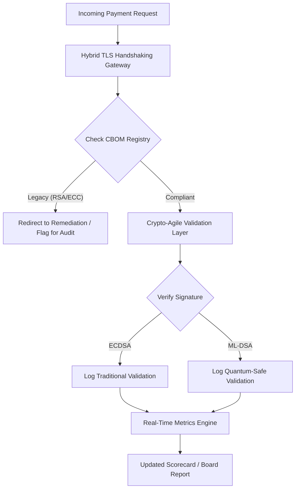

## 2026 పోస్ట్-క్వాంటమ్ సెక్యూరిటీ స్కోర్‌కార్డ్: ధర్మకర్తృత్వ క్రిప్టోగ్రాఫిక్ చురుకుదనం కోసం ఒక బోర్డు-స్థాయి మెట్రిక్ చట్రం

పోస్ట్-క్వాంటమ్ భద్రత ఇక పరిశోధన ప్రాజెక్టు కాదు. "పర్యవేక్షక గడియారం" 2020ల చివరి అమలు గడువుల వైపు కదులుతోంది. [NIST FIPS 203 (ML-KEM)](https://csrc.nist.gov/pubs/fips/203/final) మరియు [NIST FIPS 204 (ML-DSA)](https://csrc.nist.gov/pubs/fips/204/final) యొక్క ఖరారు, కీ ఎన్‌క్యాప్సులేషన్ మరియు డిజిటల్ సంతకాల కోసం ప్రమాణాలను క్రోడీకరించింది.

నియంత్రణ సంస్థలు ఇప్పుడు టైర్-1 బ్యాంకులు పైలట్ కార్యక్రమాలను దాటి ముందుకు సాగాలని ఆశిస్తున్నాయి. 2026లో, దృష్టి ఈ ప్రమాణాల పారిశ్రామికీకరణ వైపు మారింది. స్పష్టమైన మైగ్రేషన్ మార్గాన్ని ప్రదర్శించడంలో వైఫల్యం [Digital Operational Resilience Act (DORA)](https://eur-lex.europa.eu/eli/reg/2022/2554/oj) కింద గణనీయమైన నియంత్రణ జరిమానాలను, మరియు క్వాంటమ్-ఆధారిత డిక్రిప్షన్ యొక్క ముందుగానే ఊహించదగిన ముప్పును విస్మరించే డైరెక్టర్లకు వ్యక్తిగత బాధ్యతను కలిగి ఉంటుంది.

## 01. బోర్డు-స్థాయి క్వాంటమ్ స్కోర్‌కార్డ్

కింది మెట్రిక్‌లు, కమర్షియల్ మరియు ఇన్వెస్ట్‌మెంట్ బ్యాంకింగ్ (CIB) ఎస్టేట్‌ల అంతటా క్వాంటమ్ సంసిద్ధత మరియు క్రిప్టోగ్రాఫిక్ ఆరోగ్యాన్ని అంచనా వేయడానికి బోర్డులకు ఒక ప్రామాణిక చట్రాన్ని అందిస్తాయి.

### పట్టిక 1: PQC స్కోర్‌కార్డ్ మెట్రిక్‌లు మరియు సహనాలు

| మెట్రిక్ | గణిత సూత్రం | బోర్డు-ఆమోదిత సహనాలు | సహనం దాటిన పక్షంలో ప్రమాదం |
| ---- | ---- | ---- | ---- |
| **ఇన్వెంటరీ సంపూర్ణత శాతం (ICP)** | (గుర్తించిన క్రిప్టో ఆస్తులు / మొత్తం అంచనా వేసిన ఆస్తులు) × 100 | > 98% | అధిక-విలువ క్లియరింగ్ డేటా మార్గాలలో నీడ ఎన్‌క్రిప్షన్ మరియు అంధ మచ్చలు. |
| **HNDL బహిర్గతం రేటు (HER)** | (లెగసీ క్రిప్టోపై దీర్ఘకాల డేటా / మొత్తం దీర్ఘకాల డేటా) × 100 | < 5% | వాణిజ్య రహస్యాలు, సార్వభౌమ రుణ లెడ్జర్‌లు, మరియు హోల్‌సేల్ చెల్లింపు రికార్డుల శాశ్వత రాజీ. |
| **NIST మైగ్రేషన్ పురోగతి రేటు (MPR)** | (FIPS 203/204 నడుస్తున్న సిస్టమ్‌లు / మొత్తం క్లిష్టమైన సిస్టమ్‌లు) × 100 | > 60% (2026 సంవత్సరాంతానికి) | నియంత్రణ పాటించకపోవడం మరియు G20-అమరిక కలిగిన ప్రతిపక్షాల నుండి మినహాయింపు. |
| **క్రిప్టో-చురుకుదనం సంసిద్ధత సూచిక (CARI)** | (నైరూప్య క్రిప్టో పొరలు కలిగిన యాప్‌లు / మొత్తం కోర్ యాప్‌లు) × 100 | > 85% | తీవ్రమైన సాంకేతిక రుణం మరియు భవిష్యత్తు అల్గోరిథం వాడుక తగ్గింపులకు ప్రతిస్పందించలేకపోవడం. |

## 02. క్రిప్టోగ్రాఫిక్ బిల్ ఆఫ్ మెటీరియల్స్ (CBOM)

ICP మెట్రిక్ ఒక సమగ్రమైన **CBOM డిస్కవరీ దశ** ద్వారా ప్రాతిపదికగా నిర్ణయించబడుతుంది. ఇది సంస్థలోని ప్రతి క్రిప్టోగ్రాఫిక్ ఎండ్‌పాయింట్‌ను గుర్తించే ఒక స్వయంచాలక ప్రక్రియ.

- **ఎండ్‌పాయింట్ డిస్కవరీ:** లెగసీ RSA లేదా ECC వినియోగాన్ని గుర్తించడానికి క్రియాశీల TLS సెషన్‌ల కోసం అంతర్గత మరియు క్లౌడ్ నెట్‌వర్క్‌లను స్కాన్ చేయడం.
- **కీ ఇన్వెంటరీ:** పబ్లిక్/ప్రైవేట్ కీ జతలను వాటి సంబంధిత యజమానులకు మ్యాప్ చేయడం మరియు ఖచ్చితమైన గడువు తేదీలను మ్యాప్ చేయడం.
- **డిపెండెన్సీ మ్యాపింగ్:** వాడుక తగ్గించబడిన అల్గోరిథంలపై ఆధారపడే మూడవ-పక్ష లైబ్రరీలు మరియు APIలను గుర్తించడం.

ఈ డిస్కవరీ దశ ఒక ఏకైక సత్య మూలాన్ని సృష్టిస్తుంది, ఆర్థిక పనితీరు అంతే సూక్ష్మతతో క్రిప్టోగ్రాఫిక్ ఆరోగ్యంపై నివేదించడానికి CISOను వీలు కల్పిస్తుంది.

## 03. హోల్‌సేల్ చెల్లింపులలో HNDL బహిర్గతాన్ని తొలగించడం

ప్రత్యర్థులు హోల్‌సేల్ చెల్లింపులను మరియు దీర్ఘకాల కార్పొరేట్ డేటాబేస్‌లను చురుకుగా లక్ష్యంగా చేసుకుంటున్నారు. ఈ "Harvest-Now-Decrypt-Later" (HNDL) దాడులు నేటి ఎన్‌క్రిప్ట్ చేయబడిన ట్రాఫిక్‌ను అడ్డగించడం మరియు పురాలేఖనం చేయడాన్ని కలిగి ఉంటాయి.

ఒక క్రిప్టోగ్రాఫికల్‌గా సంబంధిత క్వాంటమ్ కంప్యూటర్ (CRQC) నేడు లేకపోయినా, ఇప్పుడు అడ్డగించిన డేటా భవిష్యత్తులో దుర్బలంగా ఉంటుంది. దీన్ని తగ్గించడానికి దీర్ఘకాల డేటా (ఉదా., గుర్తింపు రికార్డులు, 30-సంవత్సరాల బాండ్ ఒప్పందాలు, మరియు న్యాయ పురాలేఖనాలు) యొక్క అధిక-ప్రాధాన్యత మైగ్రేషన్ అవసరం, ఇది నేరుగా HER మెట్రిక్‌ను తగ్గిస్తుంది. చెల్లింపు ఛానెల్‌లను హైబ్రిడ్ PQC-సంప్రదాయ ఎన్‌క్రిప్షన్‌కు (X25519తో పాటు ML-KEM ఉపయోగించి) అప్‌గ్రేడ్ చేయడం పురాలేఖన ముప్పులకు వ్యతిరేకంగా తక్షణ రక్షణను అందిస్తుంది.

## 04. చక్కగా రూపొందించిన ఇంటర్‌ఫేస్‌ల ద్వారా క్రిప్టో-చురుకుదనాన్ని కార్యాచరణలోకి తీసుకురావడం

క్రిప్టో-చురుకుదనం ఇంజనీరింగ్ నైరూప్యతల ద్వారా సాకారమవుతుంది. [KyberLib](https://sebastienrousseau.com/2026-06-12-kyberlib-post-quantum-banking-migration-standards-code-2026) వంటి ఆధునిక లైబ్రరీలు, డెవలపర్లు మొత్తం అప్లికేషన్ స్టాక్‌ను తిరిగి రాయకుండా క్వాంటమ్-సురక్షిత మాడ్యూళ్లను ఎలా అమలు చేయవచ్చో ప్రదర్శిస్తాయి.

- **నైరూప్య ర్యాపర్‌లు:** అప్లికేషన్‌లు అల్గోరిథం-నిర్దిష్ట రొటీన్‌ల కంటే ఒక సాధారణ `encrypt()` లేదా `sign()` ఫంక్షన్‌ను పిలుస్తాయి.
- **రన్‌టైమ్ స్వాపింగ్:** అంతర్లీన మాడ్యూల్‌ను క్లిష్టమైన కోడ్ మోహరింపుల కంటే కాన్ఫిగరేషన్ మార్పుల ద్వారా ECDSA నుండి ML-DSAకు మార్చవచ్చు.

ఈ నిర్మాణం, భవిష్యత్తులో ఒక నిర్దిష్ట PQC అల్గోరిథం రాజీ పడితే, సంస్థ సంవత్సరాల కంటే గంటలలో మారగలదని నిర్ధారిస్తుంది.

## 05. క్వాంటమ్-సురక్షిత ఇన్‌గ్రెస్ ధ్రువీకరణ వర్క్‌ఫ్లో

కింది రేఖాచిత్రం, ఒక క్వాంటమ్-చురుకైన బ్యాంకింగ్ వాతావరణంలో సురక్షిత పరిధిలోకి ప్రవేశించే డేటా యొక్క జీవితచక్రాన్ని వివరిస్తుంది.

## ముగింపు

ఒక టైర్-1 బ్యాంకు యొక్క క్రిప్టోగ్రాఫిక్ ఎస్టేట్ ఇక CISO ఆందోళన కాదు. ఇది ధర్మకర్తృత్వ మౌలిక సదుపాయం. NIST FIPS 203 మరియు 204 అల్గోరిథంలను నిర్ణయిస్తాయి; DORA ఆర్టికల్ 5 జవాబుదారీతన ఉపరితలాన్ని నిర్ణయిస్తుంది; SM&CR దానిని ఒక పేరు గల సీనియర్ మేనేజర్‌కు జోడిస్తుంది. పైన ఉన్న స్కోర్‌కార్డ్ — ఇన్వెంటరీ సంపూర్ణత, HNDL బహిర్గతం, మైగ్రేషన్ పురోగతి, క్రిప్టో-చురుకుదనం — క్రిప్టోగ్రాఫిక్ కోడ్‌ను చదవాల్సిన అవసరం లేకుండా ఆ ఎస్టేట్‌ను పాలించడానికి బోర్డుకు అవసరమైన నాలుగు సంఖ్యలను అందిస్తుంది.

అత్యంత ముఖ్యమైన సంఖ్య HNDL బహిర్గతం. నేడు హోల్‌సేల్-చెల్లింపుల పురాలేఖనంలో ఉన్న ప్రతి లెగసీ-ఎన్‌క్రిప్ట్ చేయబడిన రికార్డు, మొదటి క్రిప్టోగ్రాఫికల్‌గా సంబంధిత క్వాంటమ్ కంప్యూటర్ రవాణా అయ్యే రోజున చదవగలిగేదిగా ఉంటుంది. లెక్కింపు నిశ్శబ్దంగా మరియు అసమానంగా ఉంటుంది: రక్షకులు తాము కలిగి ఉన్న డేటాపై మాత్రమే చర్య తీసుకోగలరు, ప్రత్యర్థులు తాము ఇప్పటికే సంవత్సరాల క్రితం బయటకు తీసిన డేటాపై చర్య తీసుకోగలరు. 2024లో RSA-2048తో ఎన్‌క్రిప్ట్ చేయబడిన ఒక 30-సంవత్సరాల కార్పొరేట్ బాండ్ ఒప్పందం, ఒక CRQC ప్రత్యక్షమయ్యే రోజున తన గోప్యత హామీని కోల్పోయే ఒప్పందం.

[KyberLib](https://sebastienrousseau.com/2026-06-12-kyberlib-post-quantum-banking-migration-standards-code-2026) మరియు దాని సహచరులు దీన్ని బహుళ-సంవత్సరాల ప్లాట్‌ఫారమ్ పునఃరచన నుండి ఒక కాన్ఫిగరేషన్ మార్పుగా మారుస్తాయి. కోడ్ రాయడం బోర్డు పని కాదు. క్రిప్టో-చురుకుదనం సంసిద్ధత సూచిక — ఒక నైరూప్య క్రిప్టోగ్రాఫిక్ ఇంటర్‌ఫేస్ వెనుక ఉన్న కోర్ అప్లికేషన్‌ల వాటా — పన్నెండు నెలలలోపు 85 %ను దాటాలని డిమాండ్ చేయడం, మరియు త్రైమాసిక స్కోర్‌కార్డ్‌ను చదవడం బోర్డు పని.
