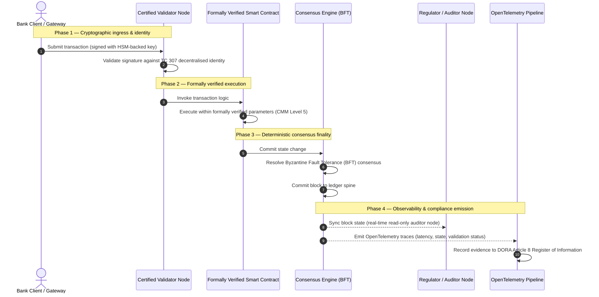

## సాక్ష్యం నుండి సత్యం వైపు: ధృవీకృత బ్లాక్‌చెయిన్‌లు బ్యాంకింగ్ నమ్మకం యొక్క తదుపరి యుగాన్ని ఎందుకు నిర్వచిస్తాయి

## కార్యనిర్వాహక సారాంశం & వ్యూహాత్మక సందర్భం (TL;DR)

2026లో హోల్‌సేల్ బ్యాంకింగ్ మరియు ప్రపంచ లావాదేవీలు ఒక చారిత్రక మలుపు వద్ద ఉన్నాయి. ఆర్థిక సేవలు స్వతహాగా డిజిటల్, రియల్-టైమ్ క్లియరింగ్ నెట్‌వర్క్‌లకు మారుతున్నప్పుడు, మరియు కృత్రిమ మేధ సంభావ్యతా అనిశ్చితత్వాన్ని (probabilistic non-determinism) ప్రవేశపెడుతున్నప్పుడు, సంప్రదాయ అనలాగ్, వెనుకటి-వైపు హామీ నమూనాలు (స్థిర సంస్థ-ఆధారిత ఆడిట్‌ల వంటివి) ఆధునిక రిస్క్ నిర్వహణ మరియు విశ్వసనీయత అవసరాలను తీర్చడంలో విఫలమవుతున్నాయి.

ISO/IEC టెక్నికల్ కమిటీ 307 (TC 307) పంపిణీ లెడ్జర్ సాంకేతికతల కోసం ఒక ప్రామాణిక ప్రాతిపదికను స్థాపించింది. అయితే, నిజమైన కార్పొరేట్ మరియు సంస్థాగత స్వీకరణకు వర్ణనాత్మక మార్గదర్శకత్వం నుండి నిర్దేశాత్మక, స్వతంత్రంగా ధృవీకరించదగిన బ్లాక్‌చెయిన్ హామీకి మారడం అవసరం. లెడ్జర్ పాలన, ఏకాభిప్రాయ సమగ్రత, స్మార్ట్ కాంట్రాక్ట్ భద్రత మరియు గూఢలిపి చురుకుదనాన్ని కఠినమైన 5-స్థాయి కెపబిలిటీ మెచ్యూరిటీ మోడల్ (CMM) కు వ్యతిరేకంగా స్కోరు చేయడం ద్వారా, బ్యాంకులు కూర్పు-పద్ధతి, విక్రేత-నిర్దిష్ట ఊహల నుండి ధృవీకరించదగిన, బోర్డు-ఆడిట్ చేయదగిన ఆర్థిక సత్యం వైపు కదలగలవు.

## ముఖ్యాంశాలు

* **విశ్వసనీయ ఘర్షణ అంతరం**: మనం ప్రస్తుతం బ్యాంకును (Basel III), క్లౌడ్‌ను (ISO 27001) మరియు AI పాలన వ్యవస్థలను (ISO 42001) ధృవీకరించగలం, కానీ ఏది సత్యమో నిర్ణయించే పంపిణీ లెడ్జర్‌ను మనం ఇంకా ధృవీకరించలేకపోతున్నాము. ఈ అసమానత ఒక ప్రధాన కార్యాచరణ దుర్బలత్వం.
* **DORA ప్రత్యక్ష విశ్వసనీయ బాధ్యతను అమలు చేస్తుంది**: DORA ఆర్టికల్ 5 ప్రకారం, అన్ని మూడవ-పక్ష మరియు లెడ్జర్ విస్తరణల కార్యాచరణ స్థితిస్థాపకతకు బ్యాంకు డైరెక్టర్ల బోర్డులు ప్రత్యక్ష, బదిలీ చేయలేని వ్యక్తిగత బాధ్యతను భరిస్తాయి, వైఫల్యాల విషయంలో తీవ్రమైన SM&CR వ్యక్తిగత జరిమానాలతో.
* **AI ఆడిట్ వెన్నెముక**: మెషిన్ లెర్నింగ్ పునరుత్పత్తి చేయలేని, సంభావ్యతా ఫలితాలను ప్రవేశపెడుతుండగా, ఒక ధృవీకృత బ్లాక్‌చెయిన్ నిర్ధారిత స్థితి సంగ్రహాన్ని అందిస్తుంది. మోడల్ వెర్షన్‌లు, ఇన్‌పుట్‌లు మరియు ధృవీకరణ నిర్ణయాలను ఆన్-చెయిన్‌లో నమోదు చేయడం ISO 42001 మరియు మోడల్ రిస్క్ మేనేజ్‌మెంట్ ప్రమాణాలను సంతృప్తిపరుస్తుంది.
* **సర్టిఫైడ్ బ్లాక్‌చెయిన్ ఇండెక్స్**: ఈ ఇండెక్స్ పాలన, ఏకాభిప్రాయం, స్మార్ట్ కాంట్రాక్ట్‌లు మరియు పరిశీలనీయతను 0-నుండి-5 CMM స్కేల్‌పై ధృవీకరించదగిన, ఆడిట్-సిద్ధమైన స్కోర్‌కార్డ్‌గా అధికారికం చేస్తుంది, ఇంజనీరింగ్ కొలమానాలను బోర్డు-ఆమోదిత రిస్క్ అపిటైట్ స్టేట్‌మెంట్‌లుగా అనువదిస్తుంది.

## 01. డిజిటల్ బ్యాంకింగ్‌లో విశ్వసనీయ ఘర్షణ అంతరం

శాస్త్రీయ బ్యాంకింగ్‌లో, నమ్మకం అనేది సంబంధపరమైనది, సంస్థాగతమైనది మరియు వెనుకటి-వైపుది. ఇది స్వతంత్ర, మూడవ-పక్ష ఆడిటర్లు స్థిర సమయ బిందువుల వద్ద ఆర్థిక స్థితిని సమీక్షించడం, ద్వైపాక్షిక లెడ్జర్ సైలోల మధ్య వ్యత్యాసాలను సమన్వయం చేయడంపై ఆధారపడుతుంది. 2026 యొక్క రియల్-టైమ్, API-ఆధారిత మార్కెట్లలో, ఈ నమూనా నిషేధిత జాప్యాలను మరియు నిర్మాణాత్మక రిస్క్‌లను ప్రవేశపెడుతుంది.

లావాదేవీలు తక్షణమే సెటిల్ అయినప్పుడు, అంతర్-దిన ద్రవ్యత్వ నిధులను API గేట్‌వేలు గతిశీలంగా నిర్వహించినప్పుడు, మరియు ఆస్తి యాజమాన్యం భాగస్వామ్య లెడ్జర్‌ల అంతటా టోకనైజ్ చేయబడినప్పుడు, వెనుకటి-వైపు ఆడిట్‌లు నివారణ నియంత్రణలకు బదులుగా ఫోరెన్సిక్ కసరత్తులుగా మారతాయి. విశ్వసనీయులు ఇకపై కేవలం కార్పొరేట్ సంస్థను ధృవీకరించడంపై మాత్రమే ఆధారపడలేరు. వారు డిజిటల్ ఉపరితలాన్ని కూడా ధృవీకరించాలి.

ప్రస్తుతం, బ్యాంకులు ఒక స్పష్టమైన నిర్మాణాత్మక అసమానత కింద పనిచేస్తున్నాయి:

1. **ధృవీకృత క్లౌడ్ మౌలిక సదుపాయం**: హార్డ్‌వేర్ నోడ్‌లు, వర్చువలైజ్డ్ కంటైనర్లు మరియు భౌతిక డేటాసెంటర్లు ISO/IEC 27001 మరియు SOC 2 Type II నియంత్రణలకు వ్యతిరేకంగా ధృవీకరించబడతాయి.
2. **ధృవీకృత నిర్వహణ ప్రక్రియలు**: కార్యాచరణ రిస్క్ విధానాలు, వ్యాపార కొనసాగింపు ప్రణాళికలు మరియు అల్గోరిథమిక్ విస్తరణలు కఠినమైన రిస్క్ చట్రాల కింద పరిపాలించబడతాయి.
3. **ధృవీకరించని లెడ్జర్ ఇంజన్లు**: కోర్ పంపిణీ ఏకాభిప్రాయ యంత్రాంగాలు, వాలిడేటర్ నోడ్ సరఫరా గొలుసులు, స్మార్ట్ కాంట్రాక్ట్ సరిహద్దులు మరియు నెట్‌వర్క్ పాలన నమూనాలు ధృవీకరించని, అనుకూల, లేదా కన్సార్టియం-నిర్దిష్ట ఊహలకు వదిలివేయబడతాయి.

ఈ అసమానత ఒక ప్రధాన వైఫల్య బిందువు. ఒక బ్యాంకు సురక్షిత, ISO 27001-ధృవీకృత క్లౌడ్ కంటైనర్ లోపల ధృవీకృత అప్లికేషన్‌ను నడపగలదు, కానీ ఆ కంటైనర్ కేంద్రీకృత వాలిడేటర్ నియంత్రణ, దుర్బల ఏకాభిప్రాయ పారామితులు, లేదా ఆడిట్ చేయని స్మార్ట్ కాంట్రాక్ట్‌లతో ఉన్న పంపిణీ లెడ్జర్‌కు వ్రాస్తే, లావాదేవీ సమగ్రత రాజీపడుతుంది. ఈ అంతరాన్ని పూరించడానికి, లెడ్జర్ ఇంజన్ స్వయంగా ఒక ధృవీకరించదగిన హామీ వస్తువుగా మారాలి.

## 02. ISO/IEC TC 307 ప్రామాణీకరణ ప్రాతిపదిక

పంపిణీ లెడ్జర్‌లను ప్రామాణీకరించడానికి అవసరమైన మౌలిక పని ISO/IEC టెక్నికల్ కమిటీ 307 (TC 307) (బ్లాక్‌చెయిన్ మరియు పంపిణీ లెడ్జర్ సాంకేతికతలు) ద్వారా స్థాపించబడుతోంది. బ్లాక్‌చెయిన్‌ను ఒక వివిక్త సాంకేతిక ప్రోటోకాల్‌గా పరిగణించకుండా, TC 307 దానిని ఒక సంస్థాగత విశ్వసనీయ మౌలిక సదుపాయంగా సంబోధిస్తుంది, తన పనిని ఐదు కోర్ స్తంభాల అంతటా నిర్వహిస్తుంది:

1. **వర్గీకరణ మరియు పదజాలం (ISO 22739)**: వివిధ న్యాయపరిధులు, ఆర్థిక పథకాలు మరియు సంస్థల అంతటా స్థిరమైన చట్టపరమైన మరియు కార్యాచరణ నిర్వచనాలను నిర్ధారిస్తూ, ఒక ఉమ్మడి నామకరణాన్ని స్థాపిస్తుంది.
2. **సూచన నిర్మాణం (ISO/TR 23245)**: అనుకూల పంపిణీ లెడ్జర్ వ్యవస్థ యొక్క సరిహద్దులు, పొరలు, డేటా ప్రవాహాలు మరియు కార్యాత్మక భాగాలను నిర్వచిస్తుంది.
3. **భద్రత, గోప్యత మరియు స్మార్ట్ కాంట్రాక్ట్‌లు (ISO/TR 23244 / ISO 23613)**: డిజిటల్ ఆస్తి వ్యవస్థల కోసం ప్రాతిపదిక భద్రతా మార్గదర్శకాలను స్థాపించి, స్మార్ట్ కాంట్రాక్ట్ దుర్బలత్వ ఉపశమనం మరియు జీవిత-చక్ర పాలన కోసం ఉత్తమ పద్ధతులను వివరిస్తుంది.
4. **అంతర్-కార్యనిర్వహణ చట్రాలు**: వైవిధ్యమైన లెడ్జర్ నెట్‌వర్క్‌ల మధ్య డేటా మరియు ఆస్తి-మార్పిడి యంత్రాంగాలను సంబోధిస్తుంది, వివిక్త టోకనైజ్డ్ సైలోల ఏర్పాటును నివారిస్తుంది.
5. **వికేంద్రీకృత గుర్తింపు మరియు విశ్వసనీయ యాంకర్‌లు**: లెడ్జర్-ఆధారిత గూఢలిపి గుర్తింపుదారులను అధికారిక పబ్లిక్-కీ మౌలిక సదుపాయాలతో (PKI) మరియు రాష్ట్ర-అధీకృత రిజిస్ట్రీలతో సమగ్రపరుస్తుంది.

మొత్తంగా, TC 307 DLT ఒక అనుకూల ఇంజనీరింగ్ ఎంపిక నుండి ఒక ప్రామాణిక నిర్మాణాత్మక క్రమశిక్షణగా మారడాన్ని సూచిస్తుంది. అయితే, TC 307 ప్రధానంగా వర్ణనాత్మకంగానే ఉంది. ఇది మంచిది ఎలా ఉంటుందో నిర్వచిస్తుంది (మార్గదర్శకత్వం), కానీ క్లిష్టమైన లేదా ముఖ్యమైన విధులను (CIFs) ఉత్పత్తిలో విస్తరించడానికి రిస్క్ అధికారులు మరియు పర్యవేక్షకులు కోరే నిర్దేశాత్మక ధృవీకరణ ప్రోటోకాల్‌ను (హామీ) ఇది అందించదు.

## 03. మార్గదర్శకత్వం vs. హామీ: విశ్వసనీయ వ్యత్యాసం

ఆర్థిక మార్కెట్ పాల్గొనేవారు సాంకేతికతను అది వినూత్నమైనది లేదా సొగసైనది అనే కారణంగా విస్తరించరు; దానిని పరిపాలించగలిగినప్పుడు, ఆడిట్ చేయగలిగినప్పుడు, రక్షించగలిగినప్పుడు మరియు మూలధన నిల్వ అవసరాలతో సమన్వయం చేయగలిగినప్పుడు వారు దానిని విస్తరిస్తారు. అందుకే బ్యాంకింగ్‌లో ప్రామాణీకరణ సహజంగా రెండు పొరలుగా విడిపోతుంది:

* **మార్గదర్శకత్వం (చట్రం)**: ఉత్తమ పద్ధతులు, సూచన లక్ష్యాలు మరియు నిర్మాణాత్మక మార్గదర్శకాలను వివరిస్తుంది (ఉదా., ISO/IEC TC 307, NIST చట్రాలు).
* **హామీ (రుజువు)**: చట్రం రూపొందించినట్లు అమలు చేయబడిందని మరియు పనిచేస్తోందని స్వతంత్ర, నిరంతర మరియు మూడవ-పక్ష-ధృవీకరించదగిన సాక్ష్యాన్ని అందిస్తుంది (ఉదా., ISO 27001 ధృవీకరణ, SOC 2 ఆడిట్‌లు, నియంత్రణ పరీక్షలు).

క్లౌడ్ మౌలిక సదుపాయాన్ని ధృవీకరిస్తూ ధృవీకరించని లెడ్జర్ ఏకాభిప్రాయంపై ఆధారపడటం ఒక క్లిష్టమైన నియంత్రణ అంతరం. "మార్పులేని" బ్లాక్‌చెయిన్ తప్పనిసరిగా "సంస్థాగతంగా నమ్మదగినది" కాదు. మార్పులేనితనం కేవలం నమోదు చేసిన డేటా మారలేదని మాత్రమే హామీ ఇస్తుంది; వాలిడేటర్ నోడ్‌లు సురక్షితమా, ఏకాభిప్రాయ ప్రోటోకాల్ కుమ్మక్కుకు వ్యతిరేకంగా స్థితిస్థాపకమా, స్మార్ట్ కాంట్రాక్ట్ లాజిక్ గణితపరంగా సరైనదా, లేదా గూఢలిపి కీ నిర్వహణ పోస్ట్-క్వాంటమ్ ఆదేశాలకు అనుగుణంగా ఉందా అని అది ధృవీకరించదు.

ఈ అంతరాన్ని మూసివేయడానికి, 2026 సర్టిఫైడ్ బ్లాక్‌చెయిన్ ఇండెక్స్ ఈ అవసరాలను ప్రపంచ బ్యాంకింగ్ నియంత్రణలకు మ్యాప్ చేయబడిన పరిమాణాత్మక కెపబిలిటీ మెచ్యూరిటీ మోడల్ (CMM) గా అధికారికం చేస్తుంది.

## 04. 2026 సర్టిఫైడ్ బ్లాక్‌చెయిన్ ఇండెక్స్

సీనియర్ మేనేజ్‌మెంట్ తమ లెడ్జర్ ప్లాట్‌ఫారమ్‌లను మూల్యాంకనం చేసి ధృవీకరించడానికి వీలుగా, ఈ ఇండెక్స్ పంపిణీ లెడ్జర్ మౌలిక సదుపాయాన్ని ఐదు ఆడిట్ చేయదగిన కార్యాచరణ పొరలుగా నిర్మిస్తుంది, వీటిని 0-నుండి-5 CMM స్కేల్‌పై స్కోరు చేస్తారు.

## పట్టిక 1: సర్టిఫైడ్ బ్లాక్‌చెయిన్ ఇండెక్స్ నిర్మాణం

| ఇండెక్స్ పొర | కెపబిలిటీ మెచ్యూరిటీ స్థాయి (CMM) | సాంకేతిక మరియు కార్యాచరణ కొలమానం | నియంత్రణ / విశ్వసనీయ నియంత్రణ సూచన |
| ---- | ---- | ---- | ---- |
| **లెడ్జర్ పాలన** | **స్థాయి 0**: తాత్కాలిక కన్సార్టియం**స్థాయి 3**: స్వయంచాలిత వాలిడేటర్ పరిశీలన & భ్రమణం**స్థాయి 5**: వికేంద్రీకృత, బహుళ-పక్ష గూఢలిపి గుర్తింపు యాంకరింగ్ | పరిశీలించబడిన ఆర్థిక సంస్థలు నిర్వహించే వాలిడేటర్ నోడ్‌ల %; వాలిడేటర్ వివాదాలను పరిష్కరించడానికి సగటు సమయం; నోడ్‌ల భౌగోళిక పంపిణీ | **DORA ఆర్టికల్ 5** (పాలన మరియు సంస్థ); **CPMI-IOSCO PFMI సూత్రం 2** (పాలన) & **సూత్రం 3** (రిస్క్‌ల సమగ్ర నిర్వహణ కోసం చట్రం) |
| **ఏకాభిప్రాయ సమగ్రత** | **స్థాయి 0**: సింగిల్-నోడ్ లేదా అపారదర్శక POW**స్థాయి 3**: నిర్ధారిత తుది స్థితితో ఆడిట్ చేయబడిన BFT**స్థాయి 5**: నిరంతర జాప్య పర్యవేక్షణతో బహుళ-న్యాయపరిధి, అధికారికంగా ధృవీకరించబడిన ఏకాభిప్రాయం | గరిష్ఠ సహించదగిన ఏకాభిప్రాయ జాప్యం; కుమ్మక్కు-నిరోధక పరిమితి; అనుకరణ నోడ్ విభజన కింద అప్‌టైమ్ SLA | **DORA ఆర్టికల్ 6** (ICT రిస్క్ నిర్వహణ చట్రం); **CPMI-IOSCO PFMI సూత్రం 8** (సెటిల్‌మెంట్ తుది స్థితి) |
| **గుర్తింపు & గూఢలిపి** | **స్థాయి 0**: బలహీన RSA / ECDSA కీలు**స్థాయి 3**: HSM-మద్దతు కీ నిర్వహణతో మల్టీ-సిగ్**స్థాయి 5**: క్వాంటమ్-సురక్షిత హైబ్రిడ్ కీలు (FIPS 203 ML-KEM) మరియు జీరో-నాలెడ్జ్ గోప్యతా గేట్లు | HSM-మద్దతు కీలతో సంతకం చేయబడిన లెడ్జర్ లావాదేవీల %; PQC వలస సంసిద్ధత స్కోరు; ZK-ప్రూఫ్ జాప్యం | **NIST FIPS 203 / 204**; **ISO/IEC 27001** (సమాచార భద్రతా నిర్వహణ) |
| **స్మార్ట్ కాంట్రాక్ట్ హామీ** | **స్థాయి 0**: ఆడిట్ చేయని సాలిడిటీ స్క్రిప్ట్‌లు**స్థాయి 3**: స్వయంచాలిత కంపైలర్ ధృవీకరణ & బాహ్య ఆడిట్**స్థాయి 5**: సర్క్యూట్-బ్రేకర్ నవీకరణలతో అధికారికంగా ధృవీకరించబడిన, మార్పులేని స్మార్ట్ కాంట్రాక్ట్‌లు | గణిత అధికారిక ధృవీకరణతో ఉన్న స్మార్ట్ కాంట్రాక్ట్‌ల %; కంపైలర్ హెచ్చరికల సంఖ్య; దుర్బలత్వ స్కాన్ కవరేజ్ | **అవుట్‌సోర్సింగ్ ఏర్పాట్లపై EBA మార్గదర్శకాలు** (పేరాలు 81, 113-117); **DORA ఆర్టికల్ 30** (కనీస ఒప్పంద నిబంధనలు) |
| **ఆడిట్ & పరిశీలనీయత** | **స్థాయి 0**: మాన్యువల్ లాగ్ స్క్రాపింగ్**స్థాయి 3**: నిర్మాణాత్మక OTel ట్రేస్‌లు & చదవడానికి-మాత్రమే ఆడిటర్ నోడ్‌లు**స్థాయి 5**: ఆర్టికల్ 8 రిజిస్టర్‌కు స్వయంచాలిత, నిరంతర సమన్వయం | OpenTelemetry ట్రేస్‌లచే కవర్ చేయబడిన లావాదేవీల %; లెడ్జర్ బ్లాక్-కమిట్ నుండి ఆడిటర్-నోడ్ సింక్ వరకు జాప్యం | **BCBS 239** (రిస్క్ డేటా సమీకరణ); **DORA ఆర్టికల్ 8** (సమాచార రిజిస్టర్ / ITS స్కీమాలు) |

## పట్టిక 2: ప్రపంచ బ్యాంకింగ్ ప్రమాణాలకు మ్యాప్ చేయబడిన ముఖ్య విశ్వసనీయ సంకేతాలు

| సంకేతం / ప్రామాణికం | కొలమానం | బ్యాంకింగ్ ప్లాట్‌ఫారమ్‌లపై ప్రభావం | నియంత్రణ మూలం |
| ---- | ---- | ---- | ---- |
| **ISO/IEC TC 307 పురోగతి** | ISO/TR సాంకేతిక నివేదికల నుండి అధికారిక ధృవీకరణ పథకాలకు మార్పు | పంపిణీ లెడ్జర్ ఇంజన్లను ధృవీకరించడానికి మొదటి ప్రామాణిక చట్రాన్ని స్థాపిస్తుంది | **ISO/IEC JTC 1 / SC 44** (పంపిణీ లెడ్జర్ సాంకేతికతలు) |
| **Project Agorá నమూనా దశ** | 40+ పాల్గొనే వాణిజ్య బ్యాంకులు; టోకనైజ్డ్ డిపాజిట్ల ఏకీకృత లెడ్జర్ పరీక్ష | సరిహద్దు-దాటి క్లియరింగ్‌ను సందేశ ప్రసారం (SWIFT) నుండి పరమాణు టోకనైజ్డ్ సెటిల్‌మెంట్‌కు మారుస్తుంది | **బ్యాంక్ ఫర్ ఇంటర్నేషనల్ సెటిల్‌మెంట్స్ (BIS) ఇన్నోవేషన్ హబ్** |
| **DORA ఆర్టికల్ 30 మూడవ-పక్ష ఆడిట్** | భద్రతా ప్రమాణాలకు వ్యతిరేకంగా 100% నోడ్ ప్రొవైడర్లు మరియు మౌలిక సదుపాయ హోస్ట్‌లు ఆడిట్ చేయబడ్డాయి | "నీడ వాలిడేటర్ నోడ్‌లను" తొలగిస్తుంది; పూర్తి సరఫరా-గొలుసు పారదర్శకతను తప్పనిసరి చేస్తుంది | **యూరోపియన్ సూపర్‌వైజరీ అథారిటీస్ (ESA)** |
| **ISO/IEC 42001 (AI పాలన)** | గూఢలిపిపరంగా మార్పులేని AI మోడల్ మరియు శిక్షణ లాగ్‌లు ఆన్-చెయిన్‌లో | మెషిన్ లెర్నింగ్ కోసం బ్లాక్‌చెయిన్‌ను మార్పులేని సాక్ష్య లెడ్జర్‌గా ("ఆడిట్ వెన్నెముక") ఉపయోగిస్తుంది | **ISO/IEC 42001:2023** (సమాచార సాంకేతికత — కృత్రిమ మేధ) |
| **Basel III మూలధన సమర్థత** | నమోదు చేయబడిన సంక్లిష్టత తగ్గింపు ఆధారంగా కార్యాచరణ రిస్క్ మూలధన బఫర్‌లలో తగ్గింపు | ప్రామాణిక కార్యాచరణ రిస్క్ చట్రాలు ధృవీకరించబడిన లెడ్జర్ స్థితిస్థాపకతను నేరుగా క్రెడిట్ చేస్తాయి | **బ్యాంకింగ్ పర్యవేక్షణపై బాసెల్ కమిటీ (BCBS)** |

## 05. AI "ఆడిట్ వెన్నెముక": నిర్ధారిత మౌలిక సదుపాయంపై సంభావ్యతా మేధ

2026లో ఒక ధృవీకృత బ్లాక్‌చెయిన్‌కు అత్యంత శక్తివంతమైన వ్యూహాత్మక పాత్రలలో ఒకటి కృత్రిమ మేధ విస్తరణలకు **"ఆడిట్ వెన్నెముక"**గా వ్యవహరించడం. ఆధునిక ఆర్థిక వ్యవస్థలు ఎక్కువగా సంభావ్యతాపరంగా మారుతున్నాయి. క్రెడిట్ స్కోరింగ్, రియల్-టైమ్ మోసం గుర్తింపు, అల్గోరిథమిక్ ట్రేడింగ్ మరియు స్వయంప్రతిపత్త కస్టమర్ పరస్పర చర్యలు కాలక్రమేణా పరిణామం చెందే, తప్పిపోయే మరియు అనుకూలించే మెషిన్ లెర్నింగ్ మోడల్‌లచే నడపబడతాయి. ఈ మోడల్‌లు నిర్ధారితం కావు: రెండు వేర్వేరు సమయాల్లో అదే ఇన్‌పుట్ ఇచ్చినప్పుడు, గతిశీల బరువులు మరియు నిరంతర శిక్షణ కారణంగా అవి వేర్వేరు ఫలితాలను ఇవ్వవచ్చు.

ఈ అనిశ్చితత్వం **ISO/IEC 42001 (AI పాలన)** మరియు మోడల్ రిస్క్ మేనేజ్‌మెంట్ (MRM) ప్రమాణాల (**US Federal Reserve SR 11-7** మరియు **UK PRA SS1/23** వంటివి) కింద ఒక తీవ్రమైన పాలన సవాలును ప్రవేశపెడుతుంది: *కచ్చితంగా పునరుత్పత్తి చేయలేని నిర్ణయాలను మీరు ఎలా ఆడిట్ చేస్తారు, వివరిస్తారు మరియు రక్షిస్తారు?*

ఒక ధృవీకృత పంపిణీ లెడ్జర్ నిర్ధారిత ప్రతిభారాన్ని అందిస్తుంది. AI మోడల్‌లు సంభావ్యతాపరంగా పనిచేస్తుండగా, ధృవీకృత బ్లాక్‌చెయిన్ వాటి పారామితులను నిర్ధారితంగా నమోదు చేస్తుంది, ఒక మార్పుచేయలేని సాక్ష్య వెన్నెముకను స్థాపిస్తుంది:

* **మోడల్ వెర్షనింగ్ మరియు వెయిట్ యాంకరింగ్**: ప్రతి విస్తరించబడిన మోడల్ వెర్షన్, దాని అనుబంధ బరువులు మరియు దాని శిక్షణ డేటా చెక్‌సమ్‌లు హాష్ చేయబడి బిల్డ్-టైమ్‌లో లెడ్జర్‌కు వ్రాయబడతాయి, **SLSA Level 3** సరఫరా-గొలుసు అవసరాలను సంతృప్తిపరుస్తాయి.
* **సందర్భోచిత ఇన్‌పుట్ లాగింగ్**: ఒక AI మోడల్ ఒక క్లిష్టమైన నిర్ణయాన్ని అమలు చేసినప్పుడు (ఉదా., రుణాన్ని ఆమోదించడం లేదా లావాదేవీని ఫ్లాగ్ చేయడం), కచ్చితమైన సందర్భోచిత ఇన్‌పుట్‌లు మరియు మోడల్ హాష్‌లు లెడ్జర్‌కు వ్రాయబడతాయి, ఒక చెడ్డుబాటు-సాక్ష్య చరిత్రను సృష్టిస్తాయి.
* **కోడ్ యాక్సెస్ లేకుండా ఆడిట్ చేయగలగడం**: ఒక నియంత్రకుడు, "మీ మోడల్ ఈ క్రెడిట్ దరఖాస్తును జూన్ 3న ఎందుకు తిరస్కరించింది?" అని అడిగితే, బ్యాంకు యాజమాన్య కోడ్‌ను బహిర్గతం చేయవలసిన అవసరం లేదు లేదా కచ్చితమైన మోడల్ స్థితిని పునఃసృష్టించడానికి ప్రయత్నించవలసిన అవసరం లేదు. ఇది ఇన్‌పుట్‌లు, బరువులు మరియు ధృవీకరణ స్థితి యొక్క గూఢలిపిపరంగా సంతకం చేయబడిన, ఆన్-చెయిన్ లెడ్జర్ రికార్డును సమర్పిస్తుంది.

మెషిన్ లెర్నింగ్ మోడల్‌ల సంభావ్యతా నిర్ణయాలను ఒక ధృవీకృత బ్లాక్‌చెయిన్ యొక్క నిర్ధారిత ఏకాభిప్రాయానికి యాంకర్ చేయడం ద్వారా, సంస్థ స్వయంచాలిత చర్యల యొక్క రక్షించదగిన, పునర్నిర్మించదగిన మరియు స్వతంత్రంగా ధృవీకరించదగిన కాలరేఖను సృష్టిస్తుంది.

## 06. ధృవీకృత ఏకాభిప్రాయం-నుండి-ఆడిట్ పైప్‌లైన్‌ను దృశ్యీకరించడం

కింది అనుక్రమ రేఖాచిత్రం ఒక లావాదేవీ ధృవీకృత బ్లాక్‌చెయిన్ ప్లాట్‌ఫారమ్ గుండా వెళ్ళే జీవిత-చక్రాన్ని వివరిస్తుంది, ధృవీకరణ గేట్లు, ఏకాభిప్రాయ సమగ్రత, స్మార్ట్ కాంట్రాక్ట్ అమలు మరియు టెలిమెట్రీ ఉద్గారం బోర్డు-సిద్ధ నియంత్రణ సాక్ష్యాన్ని ఉత్పత్తి చేయడానికి ఎలా పరస్పరం అనుసంధానమవుతాయో ప్రదర్శిస్తుంది:

ఈ లావాదేవీ అనుక్రమానికి క్లిష్టమైన మార్గం ప్రతి ధృవీకరణ, అమలు మరియు ఏకాభిప్రాయ దశ గూఢలిపిపరంగా సంతకం చేయబడాలని కోరుతుంది, తద్వారా చివరి-నుండి-చివరి మూలాధారాన్ని నిర్ధారిస్తుంది. నియంత్రకుని ఆడిటర్ నోడ్ బ్లాక్ స్థితిని రియల్-టైమ్‌లో సింక్రొనైజ్ చేస్తుంది, వెనుకటి-వైపు, మాన్యువల్ ఆర్థిక సమన్వయ అవసరాన్ని తొలగిస్తుంది.

## 07. సీనియర్ మేనేజర్ల కోసం బోర్డురూమ్ ప్లేబుక్

సంస్థాగత నమ్మకం నుండి మౌలిక సదుపాయ నమ్మకానికి పరివర్తనను విజయవంతంగా నావిగేట్ చేయడానికి, బ్యాంకు కార్యనిర్వాహకులు మరియు సీనియర్ మేనేజర్లు వెంటనే నాలుగు కీలక ఆదేశాలను అమలు చేయాలి:

1. **ఎంటర్‌ప్రైజ్ రిస్క్ మేనేజ్‌మెంట్ (ERM) లో లెడ్జర్ ఆడిట్‌లను తప్పనిసరి చేయండి**: 5-పొర **సర్టిఫైడ్ బ్లాక్‌చెయిన్ ఇండెక్స్ నిర్మాణం** (CMM స్థాయి 3 కనిష్ఠం) కు వ్యతిరేకంగా ఆడిట్ చేయబడితే తప్ప, ఏ పంపిణీ లెడ్జర్ ప్లాట్‌ఫారమ్—ప్రైవేట్, పబ్లిక్, లేదా కన్సార్టియం-ఆధారితమైనా—క్లిష్టమైన లేదా ముఖ్యమైన విధులకు (CIFs) విస్తరించకూడదన్న విధానాన్ని అమలు చేయండి.
2. **బ్లాక్‌చెయిన్‌లను ISO 42001 AI సాక్ష్య వెన్నెముకగా సమగ్రపరచండి**: మోడల్ వెర్షన్‌లు, బరువులు, ఇన్‌పుట్‌లు మరియు నిర్ణయాల యొక్క చెడ్డుబాటు-సాక్ష్య ఆడిట్ లెడ్జర్‌ను సృష్టిస్తూ, అన్ని అధిక-ప్రభావ మెషిన్ లెర్నింగ్ మోడల్‌లను ఒక ధృవీకృత బ్లాక్‌చెయిన్‌తో సమగ్రపరచమని చీఫ్ రిస్క్ ఆఫీసర్ మరియు లీడ్ AI ఆర్కిటెక్ట్‌ను నిర్దేశించండి.
3. **వాలిడేటర్ నోడ్ సరఫరా గొలుసును ఆడిట్ చేయండి (DORA ఆర్టికల్ 30)**: వాలిడేటర్ నోడ్‌లను హోస్ట్ చేసే లేదా DLT నెట్‌వర్క్‌ల కోసం క్లౌడ్ హోస్టింగ్‌ను నిర్వహించే అన్ని మూడవ-పక్ష సంస్థలను ఆడిట్ చేయమని ప్రొక్యూర్‌మెంట్ విభాగాన్ని కోరండి, బ్యాంకు యొక్క అంతర్గత క్లౌడ్ నోడ్‌లకు వర్తించే అదే సైబర్‌భద్రత మరియు కార్యాచరణ స్థితిస్థాపకత ప్రమాణాలకు అనుగుణ్యతను తప్పనిసరి చేస్తూ.
4. **లెడ్జర్ నిర్మాణాలను CPMI-IOSCO మరియు BCBS 239 తో సమలేఖనం చేయండి**: లెడ్జర్ అవుట్‌పుట్ టెలిమెట్రీని **BCBS 239** డేటా రిపోర్టింగ్ అవసరాలతో నేరుగా సమలేఖనం చేయమని ప్లాట్‌ఫారమ్ ఇంజనీరింగ్ బృందాన్ని నిర్దేశించండి, మరియు ఏకాభిప్రాయ మరియు సెటిల్‌మెంట్ తుది స్థితి పారామితులు **CPMI-IOSCO సూత్రాలు 8 మరియు 9** కు కఠినంగా అనుగుణంగా ఉన్నాయని నిర్ధారించండి.

## 08. తరచుగా అడిగే ప్రశ్నలు

**ISO/IEC TC 307 ఒక ధృవీకరణ ప్రమాణమా?**
కాదు. ISO/IEC TC 307 అనేది పదజాలం, సూచన నిర్మాణాలు మరియు భద్రతా మార్గదర్శకాలను స్థాపించే ఒక సాంకేతిక కమిటీ. ఇది "మంచిది ఎలా ఉంటుంది" (మార్గదర్శకత్వం) అని నిర్వచించినప్పటికీ, బ్యాంకింగ్ పర్యవేక్షకులను సంతృప్తిపరచడానికి పరిశ్రమ ఈ పత్రాలను అధికారిక, ఆడిట్ చేయదగిన ధృవీకరణ పథకాలుగా (హామీ) అమలు చేయాలి.

**ఒక ధృవీకృత బ్లాక్‌చెయిన్ DORA అనుగుణ్యతకు ఎలా మద్దతు ఇస్తుంది?**
DORA ఆర్టికల్ 5 కింద, బ్యాంకు బోర్డులు సాంకేతిక స్థితిస్థాపకతకు ప్రత్యక్ష, వ్యక్తిగత బాధ్యతను భరిస్తాయి. ఒక ధృవీకృత బ్లాక్‌చెయిన్ ఏకాభిప్రాయ సమగ్రత, వాలిడేటర్ సరఫరా-గొలుసు నియంత్రణ మరియు స్మార్ట్ కాంట్రాక్ట్ భద్రతకు ధృవీకరించదగిన, గూఢలిపి సాక్ష్యాన్ని అందిస్తుంది, SM&CR వ్యక్తిగత బాధ్యత దావాలకు వ్యతిరేకంగా రక్షించడానికి అవసరమైన నమోదు చేయదగిన "సహేతుకమైన చర్యలను" బోర్డు సభ్యులకు ఇస్తుంది.

సంప్రదాయ లెడ్జర్ ఆడిట్ మరియు ధృవీకృత బ్లాక్‌చెయిన్ ఆడిట్ మధ్య తేడా ఏమిటి?
సంప్రదాయ ఆడిట్ వెనుకటి-వైపుది, లావాదేవీలు క్లియర్ అయిన తర్వాత మాన్యువల్ ఎంట్రీలు మరియు స్థిర ఫైళ్లను ధృవీకరిస్తుంది. ధృవీకృత బ్లాక్‌చెయిన్ ఆడిట్ నిరంతరం మరియు రియల్-టైమ్; వాలిడేటర్ నోడ్‌లు, BFT ఏకాభిప్రాయ ఇంజన్ మరియు అధికారికంగా ధృవీకరించబడిన స్మార్ట్ కాంట్రాక్ట్‌లు లావాదేవీలను నిర్ధారితంగా అమలు చేయడానికి ధృవీకరించబడతాయి, వ్యవస్థ ఆరోగ్యాన్ని నిరంతరం ధృవీకరించే నిర్మాణాత్మక టెలిమెట్రీని (OpenTelemetry) ఉద్గారిస్తాయి.

బ్యాంకింగ్ ఉపయోగం కోసం పబ్లిక్ బ్లాక్‌చెయిన్‌లను ధృవీకరించగలమా?
చాలా న్యాయపరిధులలో, స్వచ్ఛమైన అనుమతి-రహిత పబ్లిక్ బ్లాక్‌చెయిన్‌లు వాలిడేటర్ గుర్తింపు ధృవీకరణ లేకపోవడం, అనూహ్య గ్యాస్/లావాదేవీ ఖర్చులు మరియు నిర్ధారితం-కాని తుది స్థితి (ఉదా., సంభావ్యతా ప్రూఫ్-ఆఫ్-వర్క్/స్టేక్ ఫోర్క్‌లు) కారణంగా బ్యాంకింగ్ నియంత్రణలను సంతృప్తిపరచడంలో విఫలమవుతాయి. బ్యాంకింగ్‌లో ధృవీకృత బ్లాక్‌చెయిన్‌లు సాధారణంగా ఎంటర్‌ప్రైజ్ అనుమతి-ఆధారిత లేదా అత్యధికంగా నియంత్రిత పబ్లిక్-హైబ్రిడ్ నిర్మాణాలను ఉపయోగిస్తాయి, ఇక్కడ వాలిడేటర్ నోడ్ ఆపరేటర్లు గుర్తించబడిన మరియు ఆడిట్ చేయబడిన ఆర్థిక సంస్థలు.

## 09. సూచనలు

* Basel Committee on Banking Supervision (BCBS), 2013. *Principles for effective risk data aggregation and reporting (BCBS 239)*. Basel: Bank for International Settlements. Available at: [https://www.bis.org/publ/bcbs239.pdf](https://www.bis.org/publ/bcbs239.pdf).
* Committee on Payments and Market Infrastructures and Technical Committee of the International Organization of Securities Commissions (CPMI-IOSCO), 2012. *Principles for financial market infrastructures*. Basel: Bank for International Settlements. Available at: [https://www.bis.org/cpmi/publ/d101a.pdf](https://www.bis.org/cpmi/publ/d101a.pdf).
* European Banking Authority (EBA), 2019. *EBA/GL/2019/02 — Guidelines on outsourcing arrangements*. Paris: EBA. Available at: [https://www.eba.europa.eu/regulation-and-policy/internal-governance/guidelines-on-outsourcing-arrangements](https://www.eba.europa.eu/regulation-and-policy/internal-governance/guidelines-on-outsourcing-arrangements).
* European Parliament and Council of the European Union, 2022. *Regulation (EU) 2022/2554 on digital operational resilience for the financial sector (DORA)*. Brussels: Official Journal of the European Union. Available at: [https://eur-lex.europa.eu/legal-content/EN/TXT/?uri=CELEX%3A32022R2554](https://eur-lex.europa.eu/legal-content/EN/TXT/?uri=CELEX%3A32022R2554).
* ISO/IEC JTC 1/SC 42, 2023. *ISO/IEC 42001:2023 — Information technology — Artificial intelligence — Management system*. Geneva: International Organization for Standardization. Available at: [https://www.iso.org/standard/81230.html](https://www.iso.org/standard/81230.html).
* ISO/IEC Technical Committee 307, 2020. *ISO/IEC 22739:2020 — Blockchain and distributed ledger technologies — Vocabulary*. Geneva: International Organization for Standardization. Available at: [https://www.iso.org/standard/73771.html](https://www.iso.org/standard/73771.html).
* National Institute of Standards and Technology (NIST), 2026. *First Three Finalized Post-Quantum Encryption Standards (FIPS 203, 204, and 205)*. Gaithersburg: U.S. Department of Commerce. Available at: [https://www.nist.gov/news-events/news/2024/08/nist-releases-first-3-finalized-post-quantum-encryption-standards](https://www.nist.gov/news-events/news/2024/08/nist-releases-first-3-finalized-post-quantum-encryption-standards).
