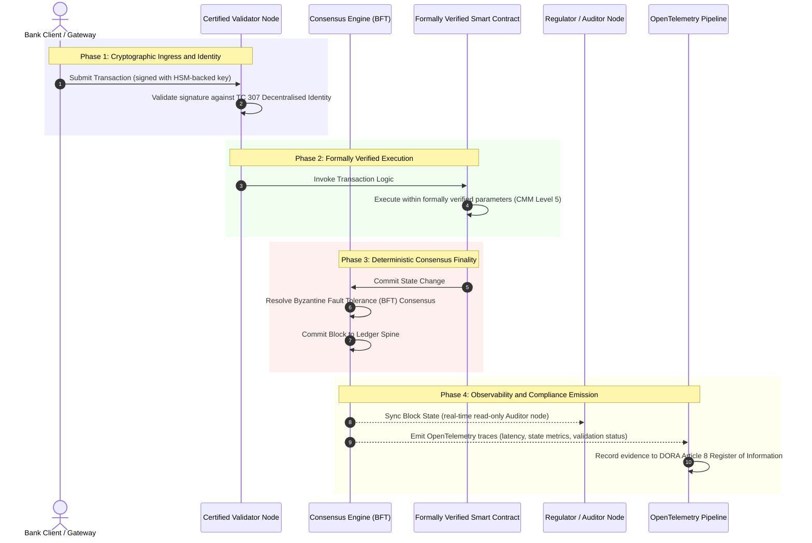

# సాక్ష్యం నుండి సత్యం వరకు: బ్యాంకింగ్ నమ్మకం యొక్క తదుపరి యుగాన్ని ధృవీకరించబడిన బ్లాక్‌చెయిన్లు ఎందుకు నిర్వచిస్తాయి

**మార్చలేనిది అంటే నమ్మదగినది కాదు.** టోకు బ్యాంకింగ్ నిజ-సమయ సెటిల్‌మెంట్ మరియు సంభావ్య AI వైపు కదులుతున్నందున, ఏది సత్యమో నిర్ణయించే ఖాతా పుస్తకం బ్యాంకులు ఇంకా ధృవీకరించలేని ఏకైక పొరగా మారింది. వారు సంస్థను Basel III కింద, క్లౌడ్‌ను ISO 27001 కింద మరియు వాటి AIని ISO 42001 కింద ధృవీకరిస్తారు, కానీ పంపిణీ చేయబడిన ఖాతా పుస్తకం, దాని పరిపాలన, ఏకాభిప్రాయం, గూఢలిపి శాస్త్రం మరియు స్మార్ట్ కాంట్రాక్టులు, విక్రేత-నిర్దిష్ట ఊహకు వదిలివేయబడతాయి. ఆ ఫిడ్యూషియరీ అంతరాన్ని మూసివేయడానికి ISO/IEC TC 307 మార్గదర్శకత్వం నుండి నిర్దేశక హామీకి మారడం అవసరమని ఈ నివేదిక వాదిస్తుంది: ఇంజనీరింగ్ మెట్రిక్‌లను బోర్డు-ఆడిట్ చేయదగిన, DORA-రక్షించదగిన సత్యంగా మార్చే 5-స్థాయి ధృవీకరించబడిన బ్లాక్‌చెయిన్ ఇండెక్స్‌కు వ్యతిరేకంగా ఖాతా పుస్తకాన్ని స్కోర్ చేయడం.

<!-- lead-start -->
<aside class="post-lead" aria-label="వ్యాస సారాంశం">

<strong>సంక్షిప్తంగా.</strong> బ్యాంకులు సంస్థను, క్లౌడ్‌ను మరియు వాటి AIని ధృవీకరిస్తాయి, కానీ ఏది సత్యమో పెరుగుతున్న స్థాయిలో నిర్ణయించే ఖాతా పుస్తకాన్ని కాదు. ISO/IEC TC 307 మార్గదర్శకత్వాన్ని ఇస్తుంది, హామీని కాదు. 5-స్థాయి ధృవీకరించబడిన బ్లాక్‌చెయిన్ ఇండెక్స్ ఖాతా పుస్తక పరిపాలన, ఏకాభిప్రాయ సమగ్రత, గుర్తింపు మరియు గూఢలిపి శాస్త్రం, స్మార్ట్-కాంట్రాక్ట్ హామీ మరియు పరిశీలనీయతను పరిపక్వత నమూనాకు వ్యతిరేకంగా స్కోర్ చేసి, ఫిడ్యూషియరీ అంతరాన్ని మూసివేసి, సంభావ్య AIకి నిర్ధారిత ఆడిట్ వెన్నెముకను ఇస్తుంది.

<strong>ముఖ్య అంశాలు</strong>

<ul class="post-lead-takeaways">
  <li><strong>ఫిడ్యూషియరీ ఘర్షణ అంతరం.</strong> బ్యాంకు (Basel III), క్లౌడ్ (ISO 27001) మరియు AI పరిపాలన వ్యవస్థ (ISO 42001) ధృవీకరించబడవచ్చు; ఏది సత్యమో నిర్ణయించే పంపిణీ చేయబడిన ఖాతా పుస్తకం ఇంకా ధృవీకరించబడలేదు. ఆ అసమానత ఒక సజీవ కార్యాచరణ దుర్బలత్వం.</li>
  <li><strong>DORA దీన్ని వ్యక్తిగతం చేస్తుంది.</strong> DORA Article 5 కింద, బ్యాంకు బోర్డులు మూడవ-పక్ష మరియు ఖాతా పుస్తక విస్తరణల యొక్క స్థితిస్థాపకత కోసం ప్రత్యక్ష, అప్పగించలేని బాధ్యతను కలిగి ఉంటాయి, వైఫల్యం కోసం SM&amp;CR వ్యక్తిగత జరిమానాలతో.</li>
  <li><strong>AI ఆడిట్ వెన్నెముక.</strong> మెషిన్ లెర్నింగ్ పునరుత్పత్తి చేయలేనిది; ధృవీకరించబడిన బ్లాక్‌చెయిన్ మోడల్ వెర్షన్‌లను, ఇన్‌పుట్‌లను మరియు ధృవీకరణ నిర్ణయాలను ఆన్-చెయిన్‌లో నిర్ధారితంగా బంధిస్తుంది, ISO 42001 మరియు మోడల్-రిస్క్-మేనేజ్‌మెంట్ ప్రమాణాలను సంతృప్తిపరుస్తుంది.</li>
  <li><strong>ధృవీకరించబడిన బ్లాక్‌చెయిన్ ఇండెక్స్.</strong> పరిపాలన, ఏకాభిప్రాయం, గూఢలిపి శాస్త్రం, స్మార్ట్ కాంట్రాక్టులు మరియు పరిశీలనీయత ఒక 0-నుండి-5 CMM స్కోర్‌కార్డ్‌గా మారతాయి, ఇది ఇంజనీరింగ్ మెట్రిక్‌లను బోర్డు-ఆమోదిత రిస్క్ అపెటైట్ స్టేట్‌మెంట్‌లుగా అనువదిస్తుంది.</li>
</ul>

<strong>సంబంధిత పఠనం:</strong> <a href="https://sebastienrousseau.com/2026-07-02-certified-blockchains-banking-trust-tc307-assurance-2026">ధృవీకరించబడిన బ్లాక్‌చెయిన్లు మరియు బ్యాంకింగ్ నమ్మకం: TC 307 హామీ</a>, <a href="https://sebastienrousseau.com/2026-07-24-global-payments-outlook-operating-model-risk-revenue">2026 గ్లోబల్ పేమెంట్స్ ఔట్‌లుక్</a>.

</aside>
<!-- lead-end -->

> **కార్యనిర్వాహక సారాంశం**
>
> - **టోకు బ్యాంకింగ్ ఒక మలుపు బిందువులో ఉంది.** నిజ-సమయ క్లియరింగ్ మరియు సంభావ్య AI అనలాగ్, పూర్వదృష్టి హామీ నమూనాను విచ్ఛిన్నం చేస్తాయి: స్థిర, సంస్థ-ఆధారిత ఆడిట్‌లు ఇకపై ఆధునిక రిస్క్-మేనేజ్‌మెంట్ లేదా ఫిడ్యూషియరీ డిమాండ్‌లను తీర్చవు.
> - **TC 307 ఒక ప్రాతిపదిక, ఒక ధృవపత్రం కాదు.** ISO/IEC TC 307 పంపిణీ చేయబడిన ఖాతా పుస్తకాల కోసం పదజాలం, రిఫరెన్స్ ఆర్కిటెక్చర్ మరియు భద్రతా మార్గదర్శకత్వాన్ని ప్రామాణీకరించింది, కానీ ఇది వర్ణనాత్మకమైనది. మంచిది ఎలా ఉంటుందో ఇది నిర్వచిస్తుంది; ఉత్పత్తి విస్తరణను అధికారం చేయడానికి రిస్క్ అధికారులు మరియు పర్యవేక్షకులకు అవసరమైన నిర్దేశక ధృవీకరణను ఇది అందించదు.
> - **హామీ అంటే ఖాతా పుస్తకాన్ని స్కోర్ చేయడం.** పరిపాలన, ఏకాభిప్రాయ సమగ్రత, స్మార్ట్-కాంట్రాక్ట్ భద్రత మరియు గూఢలిపి చురుకుదనం, కఠినమైన 5-స్థాయి పరిపక్వత నమూనాకు వ్యతిరేకంగా స్కోర్ చేయబడి, బ్యాంకులను ముక్కలుగా, విక్రేత-నిర్దిష్ట ఊహ నుండి ధృవీకరించదగిన, బోర్డు-ఆడిట్ చేయదగిన ఆర్థిక సత్యానికి తరలిస్తాయి.
> - **ఖాతా పుస్తకం AI కోసం ఆడిట్ వెన్నెముక.** మోడల్ వెర్షన్‌లను, ఇన్‌పుట్‌లను మరియు ధృవీకరణ నిర్ణయాలను నిర్ధారిత ఏకాభిప్రాయానికి యాంకర్ చేయడం పునరుత్పత్తి చేయలేని మెషిన్ లెర్నింగ్‌కు ISO 42001, SR 11-7 మరియు PRA SS1/23 కింద రక్షించదగిన, పునర్నిర్మించదగిన సాక్ష్య రికార్డును ఇస్తుంది.

## డిజిటల్ బ్యాంకింగ్‌లో ఫిడ్యూషియరీ ఘర్షణ అంతరం

సాంప్రదాయ బ్యాంకింగ్‌లో, నమ్మకం సంబంధపరమైనది, సంస్థాగతమైనది మరియు పూర్వదృష్టితో కూడినది. ఇది స్థిర సమయ బిందువుల వద్ద ఆర్థిక స్థితిని సమీక్షించే స్వతంత్ర, మూడవ-పక్ష ఆడిటర్‌లపై ఆధారపడి ఉంటుంది, ద్వైపాక్షిక ఖాతా పుస్తక సైలోల అంతటా వ్యత్యాసాలను సమన్వయం చేస్తుంది. 2026 యొక్క నిజ-సమయ, API-ఆధారిత మార్కెట్‌లలో, ఈ నమూనా నిషేధాత్మక జాప్యాలను మరియు నిర్మాణాత్మక ప్రమాదాలను ప్రవేశపెడుతుంది.

లావాదేవీలు తక్షణమే సెటిల్ అయినప్పుడు, ఇంట్రాడే లిక్విడిటీ పూల్‌లను API గేట్‌వేలు డైనమిక్‌గా నిర్వహించినప్పుడు, మరియు ఆస్తి యాజమాన్యం భాగస్వామ్య ఖాతా పుస్తకాల అంతటా టోకనైజ్ చేయబడినప్పుడు, పూర్వదృష్టి ఆడిట్‌లు నివారణ నియంత్రణల కంటే ఫోరెన్సిక్ వ్యాయామాలుగా మారతాయి. ఫిడ్యూషియరీలు ఇకపై కార్పొరేట్ సంస్థను ధృవీకరించడంపై మాత్రమే ఆధారపడలేరు. వారు డిజిటల్ ఆధారాన్ని కూడా ధృవీకరించాలి.

ప్రస్తుతం, బ్యాంకులు ఒక స్పష్టమైన నిర్మాణాత్మక అసమానత కింద పనిచేస్తాయి:

1. **ధృవీకరించబడిన క్లౌడ్ మౌలిక సదుపాయాలు**: హార్డ్‌వేర్ నోడ్‌లు, వర్చువలైజ్డ్ కంటైనర్‌లు మరియు భౌతిక డేటాసెంటర్‌లు ISO/IEC 27001 మరియు SOC 2 Type II నియంత్రణలకు వ్యతిరేకంగా ధృవీకరించబడతాయి.  
2. **ధృవీకరించబడిన నిర్వహణ ప్రక్రియలు**: కార్యాచరణ రిస్క్ విధానాలు, వ్యాపార కొనసాగింపు ప్రణాళికలు మరియు అల్గోరిథమిక్ విస్తరణలు కఠినమైన రిస్క్ ఫ్రేమ్‌వర్క్‌ల కింద పరిపాలించబడతాయి.  
3. **ధృవీకరించని ఖాతా పుస్తక ఇంజిన్‌లు**: ప్రధాన పంపిణీ చేయబడిన ఏకాభిప్రాయ యంత్రాంగాలు, ధృవీకరణ నోడ్ సరఫరా గొలుసులు, స్మార్ట్ కాంట్రాక్ట్ సరిహద్దులు మరియు నెట్‌వర్క్ పరిపాలన నమూనాలు ధృవీకరించని, అనుకూల లేదా కన్సార్టియం-నిర్దిష్ట ఊహలకు వదిలివేయబడతాయి.

ఈ అసమానత ఒక ప్రధాన వైఫల్య బిందువు. ఒక బ్యాంకు సురక్షితమైన, ISO 27001-ధృవీకరించబడిన క్లౌడ్ కంటైనర్ లోపల ధృవీకరించబడిన అప్లికేషన్‌ను నడపగలదు, కానీ ఆ కంటైనర్ కేంద్రీకృత ధృవీకరణ నియంత్రణ, దుర్బల ఏకాభిప్రాయ పారామితులు లేదా ఆడిట్ చేయని స్మార్ట్ కాంట్రాక్టులతో కూడిన పంపిణీ చేయబడిన ఖాతా పుస్తకానికి వ్రాస్తే, లావాదేవీ సమగ్రత రాజీపడుతుంది. ఈ అంతరాన్ని పూడ్చడానికి, ఖాతా పుస్తక ఇంజిన్ కూడా ధృవీకరించదగిన హామీ వస్తువుగా మారాలి.

## ISO/IEC TC 307 ప్రామాణీకరణ ప్రాతిపదిక

పంపిణీ చేయబడిన ఖాతా పుస్తకాలను ప్రామాణీకరించడానికి అవసరమైన మౌలిక పనిని ISO/IEC Technical Committee 307 (TC 307\) (బ్లాక్‌చెయిన్ మరియు పంపిణీ చేయబడిన ఖాతా పుస్తక సాంకేతికతలు) ఏర్పాటు చేస్తోంది. బ్లాక్‌చెయిన్‌ను ఒక వివిక్త సాంకేతిక ప్రోటోకాల్‌గా పరిగణించడానికి బదులుగా, TC 307 దీన్ని ఒక సంస్థాగత నమ్మక మౌలిక సదుపాయంగా పరిష్కరిస్తుంది, దాని పనిని ఐదు ప్రధాన స్తంభాల అంతటా నిర్వహిస్తుంది:

1. **వర్గీకరణ మరియు పదజాలం (ISO 22739\)**: ఒక ఉమ్మడి నామకరణాన్ని ఏర్పాటు చేస్తుంది, వివిధ అధికార పరిధులు, ఆర్థిక పథకాలు మరియు సంస్థల అంతటా స్థిరమైన చట్టపరమైన మరియు కార్యాచరణ నిర్వచనాలను నిర్ధారిస్తుంది.  
2. **రిఫరెన్స్ ఆర్కిటెక్చర్ (ISO/TR 23245\)**: సమ్మతమైన పంపిణీ చేయబడిన ఖాతా పుస్తక వ్యవస్థ యొక్క సరిహద్దులు, పొరలు, డేటా ప్రవాహాలు మరియు క్రియాత్మక భాగాలను నిర్వచిస్తుంది.  
3. **భద్రత, గోప్యత మరియు స్మార్ట్ కాంట్రాక్టులు (ISO/TR 23244 / ISO 23613\)**: డిజిటల్ ఆస్తి వ్యవస్థల కోసం ప్రాతిపదిక భద్రతా మార్గదర్శకాలను ఏర్పాటు చేస్తుంది మరియు స్మార్ట్ కాంట్రాక్ట్ దుర్బలత్వ ఉపశమనం మరియు జీవితచక్ర పరిపాలన కోసం ఉత్తమ పద్ధతులను వివరిస్తుంది.  
4. **పరస్పర చర్య ఫ్రేమ్‌వర్క్‌లు**: వైవిధ్యమైన ఖాతా పుస్తక నెట్‌వర్క్‌ల మధ్య డేటా మరియు ఆస్తి-మార్పిడి యంత్రాంగాలను పరిష్కరిస్తుంది, వివిక్త టోకనైజ్డ్ సైలోల ఏర్పాటును నివారిస్తుంది.  
5. **వికేంద్రీకృత గుర్తింపు మరియు నమ్మక యాంకర్‌లు**: ఖాతా పుస్తక-ఆధారిత గూఢలిపి గుర్తింపుదారులను అధికారిక పబ్లిక్-కీ మౌలిక సదుపాయాలు (PKI) మరియు రాష్ట్ర-అధీకృత రిజిస్ట్రీలతో సమగ్రపరుస్తుంది.

సమిష్టిగా, TC 307 DLTని అనుకూల ఇంజనీరింగ్ ఎంపిక నుండి ప్రామాణీకరించబడిన నిర్మాణాత్మక క్రమశిక్షణకు మార్పును సూచిస్తుంది. అయితే, TC 307 ప్రధానంగా వర్ణనాత్మకంగానే ఉంది. మంచిది ఎలా ఉంటుందో (మార్గదర్శకత్వం) ఇది నిర్వచిస్తుంది, కానీ కీలక లేదా ముఖ్యమైన విధులు (CIFs) యొక్క ఉత్పత్తి విస్తరణలను అధికారం చేయడానికి రిస్క్ అధికారులు మరియు పర్యవేక్షకులకు అవసరమైన నిర్దేశక ధృవీకరణ ప్రోటోకాల్‌ను (హామీ) ఇది అందించదు.

## మార్గదర్శకత్వం vs. హామీ: ఫిడ్యూషియరీ వ్యత్యాసం

ఆర్థిక మార్కెట్ పాల్గొనేవారు సాంకేతికతను అది వినూత్నమైనది లేదా సొగసైనది కాబట్టి విస్తరించరు; అది పరిపాలించబడగలిగినప్పుడు, ఆడిట్ చేయబడగలిగినప్పుడు, రక్షించబడగలిగినప్పుడు మరియు మూలధన నిల్వ అవసరాలతో సమన్వయం చేయబడగలిగినప్పుడు వారు దాన్ని విస్తరిస్తారు. అందుకే బ్యాంకింగ్‌లో ప్రామాణీకరణ సహజంగా రెండు పొరలుగా విడిపోతుంది:

* **మార్గదర్శకత్వం (ఫ్రేమ్‌వర్క్)**: ఉత్తమ పద్ధతులు, రిఫరెన్స్ లక్ష్యాలు మరియు నిర్మాణాత్మక మార్గదర్శకాలను వివరిస్తుంది (ఉదా., ISO/IEC TC 307, NIST ఫ్రేమ్‌వర్క్‌లు).  
* **హామీ (రుజువు)**: ఫ్రేమ్‌వర్క్ రూపొందించిన విధంగా అమలు చేయబడి మరియు పనిచేస్తోందని స్వతంత్ర, నిరంతర మరియు మూడవ-పక్ష-ధృవీకరించదగిన సాక్ష్యాన్ని అందిస్తుంది (ఉదా., ISO 27001 ధృవీకరణ, SOC 2 ఆడిట్‌లు, నియంత్రణ పరీక్షలు).

క్లౌడ్ మౌలిక సదుపాయాలను ధృవీకరిస్తూ ధృవీకరించని ఖాతా పుస్తక ఏకాభిప్రాయంపై ఆధారపడటం ఒక కీలక నియంత్రణ అంతరం. "మార్చలేని" బ్లాక్‌చెయిన్ తప్పనిసరిగా "సంస్థాగతంగా నమ్మదగినది" కాదు. మార్చలేనితనం నమోదు చేసిన డేటా మారలేదని మాత్రమే హామీ ఇస్తుంది; ధృవీకరణ నోడ్‌లు సురక్షితమని, ఏకాభిప్రాయ ప్రోటోకాల్ కుమ్మక్కుకు వ్యతిరేకంగా స్థితిస్థాపకంగా ఉందని, స్మార్ట్ కాంట్రాక్ట్ లాజిక్ గణితశాస్త్రపరంగా సరైనదని, లేదా గూఢలిపి కీ నిర్వహణ పోస్ట్-క్వాంటం ఆదేశాలకు అనుగుణంగా ఉందని ఇది ధృవీకరించదు.

ఈ అంతరాన్ని మూసివేయడానికి, 2026 ధృవీకరించబడిన బ్లాక్‌చెయిన్ ఇండెక్స్ ఈ అవసరాలను గ్లోబల్ బ్యాంకింగ్ నియంత్రణలకు మ్యాప్ చేయబడిన లెక్కించదగిన పరిపక్వత నమూనా (CMM)గా అధికారికం చేస్తుంది.

## 2026 ధృవీకరించబడిన బ్లాక్‌చెయిన్ ఇండెక్స్

సీనియర్ నిర్వహణ వారి ఖాతా పుస్తక ప్లాట్‌ఫారమ్‌లను అంచనా వేయడానికి మరియు ధృవీకరించడానికి వీలు కల్పించడానికి, ఈ ఇండెక్స్ పంపిణీ చేయబడిన ఖాతా పుస్తక మౌలిక సదుపాయాలను ఐదు ఆడిట్ చేయదగిన కార్యాచరణ పొరలుగా నిర్మిస్తుంది, 0-నుండి-5 CMM స్కేల్‌పై స్కోర్ చేయబడతాయి.

### పట్టిక 1: ధృవీకరించబడిన బ్లాక్‌చెయిన్ ఇండెక్స్ ఆర్కిటెక్చర్

| ఇండెక్స్ పొర | పరిపక్వత స్థాయి (CMM) | సాంకేతిక మరియు కార్యాచరణ మెట్రిక్ | నియంత్రణ / ఫిడ్యూషియరీ నియంత్రణ రిఫరెన్స్ |
| ---- | ---- | ---- | ---- |
| **ఖాతా పుస్తక పరిపాలన** | **Level 0**: తాత్కాలిక కన్సార్టియం**Level 3**: స్వయంచాలక ధృవీకరణ పరిశీలన & భ్రమణం**Level 5**: వికేంద్రీకృత, బహుళ-పక్ష గూఢలిపి గుర్తింపు యాంకరింగ్ | పరిశీలించబడిన ఆర్థిక సంస్థలచే నిర్వహించబడే ధృవీకరణ నోడ్‌ల %; ధృవీకరణ వివాదాలను పరిష్కరించడానికి సగటు సమయం; నోడ్‌ల భౌగోళిక పంపిణీ | **DORA Article 5** (పరిపాలన మరియు సంస్థ); **CPMI-IOSCO PFMI Principle 2** (పరిపాలన) & **Principle 3** (ప్రమాదాల సమగ్ర నిర్వహణ కోసం ఫ్రేమ్‌వర్క్) |
| **ఏకాభిప్రాయ సమగ్రత** | **Level 0**: సింగిల్-నోడ్ లేదా అపారదర్శక POW**Level 3**: నిర్ధారిత అంతిమత్వంతో ఆడిట్ చేయబడిన BFT**Level 5**: నిరంతర జాప్య పర్యవేక్షణతో బహుళ-అధికార పరిధి, అధికారికంగా ధృవీకరించబడిన ఏకాభిప్రాయం | గరిష్ట సహించదగిన ఏకాభిప్రాయ జాప్యం; కుమ్మక్కు-నిరోధక పరిమితి; అనుకరించిన నోడ్ విభజన కింద అప్‌టైమ్ SLA | **DORA Article 6** (ICT రిస్క్ మేనేజ్‌మెంట్ ఫ్రేమ్‌వర్క్); **CPMI-IOSCO PFMI Principle 8** (సెటిల్‌మెంట్ అంతిమత్వం) |
| **గుర్తింపు & గూఢలిపి శాస్త్రం** | **Level 0**: బలహీన RSA / ECDSA కీలు**Level 3**: HSM-మద్దతు గల కీ నిర్వహణతో మల్టీ-సిగ్**Level 5**: క్వాంటం-సురక్షిత హైబ్రిడ్ కీలు (FIPS 203 ML-KEM) మరియు జీరో-నాలెడ్జ్ గోప్యతా గేట్‌లు | HSM-మద్దతు గల కీలతో సంతకం చేయబడిన ఖాతా పుస్తక లావాదేవీల %; PQC మైగ్రేషన్ సంసిద్ధత స్కోర్; ZK-ప్రూఫ్ జాప్యం | **NIST FIPS 203 / 204**; **ISO/IEC 27001** (సమాచార భద్రతా నిర్వహణ) |
| **స్మార్ట్ కాంట్రాక్ట్ హామీ** | **Level 0**: ఆడిట్ చేయని సాలిడిటీ స్క్రిప్ట్‌లు**Level 3**: స్వయంచాలక కంపైలర్ ధృవీకరణ & బాహ్య ఆడిట్**Level 5**: సర్క్యూట్-బ్రేకర్ అప్‌గ్రేడ్‌లతో అధికారికంగా ధృవీకరించబడిన, మార్చలేని స్మార్ట్ కాంట్రాక్టులు | గణితశాస్త్ర అధికారిక ధృవీకరణతో స్మార్ట్ కాంట్రాక్టుల %; కంపైలర్ హెచ్చరికల సంఖ్య; దుర్బలత్వ స్కాన్ కవరేజ్ | **EBA Guidelines on Outsourcing Arrangements** (పేరాలు 81, 113-117); **DORA Article 30** (కనిష్ట ఒప్పంద నిబంధనలు) |
| **ఆడిట్ & పరిశీలనీయత** | **Level 0**: మాన్యువల్ లాగ్ స్క్రాపింగ్**Level 3**: నిర్మాణాత్మక OTel ట్రేస్‌లు & చదవడానికి-మాత్రమే ఆడిటర్ నోడ్‌లు**Level 5**: Article 8 రిజిస్టర్‌కు స్వయంచాలక, నిరంతర సమన్వయం | OpenTelemetry ట్రేస్‌లచే కవర్ చేయబడిన లావాదేవీల %; ఖాతా పుస్తక బ్లాక్-కమిట్ నుండి ఆడిటర్-నోడ్ సింక్ వరకు జాప్యం | **BCBS 239** (రిస్క్ డేటా అగ్రిగేషన్); **DORA Article 8** (సమాచార రిజిస్టర్ / ITS స్కీమాలు) |

### పట్టిక 2: గ్లోబల్ బ్యాంకింగ్ ప్రమాణాలకు మ్యాప్ చేయబడిన కీలక నమ్మక సంకేతాలు

| సంకేతం / బెంచ్‌మార్క్ | మెట్రిక్ | బ్యాంకింగ్ ప్లాట్‌ఫారమ్‌లపై ప్రభావం | నియంత్రణ మూలం |
| ---- | ---- | ---- | ---- |
| **ISO/IEC TC 307 పురోగతి** | ISO/TR సాంకేతిక నివేదికల నుండి అధికారిక ధృవీకరణ పథకాలకు మార్పు | పంపిణీ చేయబడిన ఖాతా పుస్తక ఇంజిన్‌లను ధృవీకరించడానికి మొదటి ప్రామాణీకరించబడిన ఫ్రేమ్‌వర్క్‌ను ఏర్పాటు చేస్తుంది | **ISO/IEC JTC 1 / SC 44** (పంపిణీ చేయబడిన ఖాతా పుస్తక సాంకేతికతలు) |
| **Project Agorá ప్రోటోటైప్ దశ** | 40+ పాల్గొనే వాణిజ్య బ్యాంకులు; టోకనైజ్డ్ డిపాజిట్‌ల ఏకీకృత ఖాతా పుస్తక పరీక్ష | సరిహద్దు-దాటి క్లియరింగ్‌ను మెసేజింగ్ (SWIFT) నుండి అటామిక్ టోకనైజ్డ్ సెటిల్‌మెంట్‌కు మార్చడం | **Bank for International Settlements (BIS) Innovation Hub** |
| **DORA Article 30 మూడవ-పక్ష ఆడిట్** | భద్రతా ప్రమాణాలకు వ్యతిరేకంగా ఆడిట్ చేయబడిన నోడ్ ప్రొవైడర్‌లు మరియు మౌలిక సదుపాయ హోస్ట్‌లలో 100% | "షాడో ధృవీకరణ నోడ్‌లను" తొలగిస్తుంది; సంపూర్ణ సరఫరా-గొలుసు పారదర్శకతను తప్పనిసరి చేస్తుంది | **European Supervisory Authorities (ESA)** |
| **ISO/IEC 42001 (AI పరిపాలన)** | గూఢలిపిపరంగా మార్చలేనిదిగా చేయబడిన AI మోడల్ మరియు శిక్షణ లాగ్‌లు ఆన్-చెయిన్ | మెషిన్ లెర్నింగ్ కోసం మార్చలేని సాక్ష్య ఖాతా పుస్తకంగా ("ఆడిట్ వెన్నెముక") బ్లాక్‌చెయిన్‌ను ఉపయోగిస్తుంది | **ISO/IEC 42001:2023** (సమాచార సాంకేతికత, కృత్రిమ మేధస్సు) |
| **Basel III మూలధన సమృద్ధి** | నమోదు చేయబడిన సంక్లిష్టత తగ్గింపు ఆధారంగా కార్యాచరణ రిస్క్ మూలధన బఫర్‌లలో తగ్గింపు | ప్రామాణీకరించబడిన కార్యాచరణ రిస్క్ ఫ్రేమ్‌వర్క్‌లు ధృవీకరించబడిన ఖాతా పుస్తక స్థితిస్థాపకతను నేరుగా క్రెడిట్ చేస్తాయి | **Basel Committee on Banking Supervision (BCBS)** |

## AI "ఆడిట్ వెన్నెముక": నిర్ధారిత మౌలిక సదుపాయాలపై సంభావ్య మేధస్సు

2026లో ధృవీకరించబడిన బ్లాక్‌చెయిన్ కోసం అత్యంత శక్తివంతమైన వ్యూహాత్మక పాత్రలలో ఒకటి కృత్రిమ మేధస్సు విస్తరణల కోసం **"ఆడిట్ వెన్నెముక"**గా వ్యవహరించడం. ఆధునిక ఆర్థిక వ్యవస్థలు పెరుగుతున్న స్థాయిలో సంభావ్యంగా ఉన్నాయి. క్రెడిట్ స్కోరింగ్, నిజ-సమయ మోసం గుర్తింపు, అల్గోరిథమిక్ ట్రేడింగ్ మరియు స్వయంప్రతిపత్త కస్టమర్ పరస్పర చర్యలు కాలక్రమేణా పరిణామం చెందే, డ్రిఫ్ట్ అయ్యే మరియు అనుసరించే మెషిన్ లెర్నింగ్ మోడల్‌లచే నడపబడతాయి. ఈ మోడల్‌లు నిర్ధారితం కానివి: రెండు వేర్వేరు సమయాల్లో అదే ఇన్‌పుట్ ఇచ్చినప్పుడు, డైనమిక్ వెయిట్‌లు మరియు నిరంతర శిక్షణ కారణంగా అవి వేర్వేరు అవుట్‌పుట్‌లను ఇవ్వవచ్చు.

ఈ నిర్ధారితం-కానితనం **ISO/IEC 42001 (AI పరిపాలన)** మరియు **Model Risk Management (MRM)** ప్రమాణాల (**US Federal Reserve SR 11-7** మరియు **UK PRA SS1/23** వంటివి) కింద ఒక లోతైన పరిపాలన సవాలును ప్రవేశపెడుతుంది: *ఖచ్చితంగా పునరుత్పత్తి చేయలేని నిర్ణయాలను మీరు ఎలా ఆడిట్ చేస్తారు, వివరిస్తారు మరియు రక్షిస్తారు?*

ధృవీకరించబడిన పంపిణీ చేయబడిన ఖాతా పుస్తకం నిర్ధారిత ప్రతిభారాన్ని అందిస్తుంది. AI మోడల్‌లు సంభావ్యంగా పనిచేస్తుండగా, ధృవీకరించబడిన బ్లాక్‌చెయిన్ వాటి పారామితులను నిర్ధారితంగా రికార్డు చేస్తుంది, మార్చలేని సాక్ష్య వెన్నెముకను ఏర్పాటు చేస్తుంది:

* **మోడల్ వెర్షనింగ్ మరియు వెయిట్ యాంకరింగ్**: విస్తరించబడిన ప్రతి మోడల్ వెర్షన్, దాని అనుబంధ వెయిట్‌లు మరియు దాని శిక్షణ డేటా చెక్‌సమ్‌లు బిల్డ్-సమయంలో హాష్ చేయబడి ఖాతా పుస్తకానికి వ్రాయబడతాయి, **SLSA Level 3** సరఫరా-గొలుసు అవసరాలను సంతృప్తిపరుస్తాయి.  
* **సందర్భోచిత ఇన్‌పుట్ లాగింగ్**: ఒక AI మోడల్ ఒక కీలక నిర్ణయాన్ని అమలు చేసినప్పుడు (ఉదా., రుణాన్ని ఆమోదించడం లేదా లావాదేవీని ఫ్లాగ్ చేయడం), ఖచ్చితమైన సందర్భోచిత ఇన్‌పుట్‌లు మరియు మోడల్ హాష్‌లు ఖాతా పుస్తకానికి వ్రాయబడతాయి, ఒక ట్యాంపర్-స్పష్ట చరిత్రను సృష్టిస్తాయి.  
* **కోడ్ యాక్సెస్ లేకుండా ఆడిట్ చేయగలిగే సామర్థ్యం**: ఒక నియంత్రకుడు, "జూన్ 3న మీ మోడల్ ఈ క్రెడిట్ దరఖాస్తును ఎందుకు తిరస్కరించింది?" అని అడిగితే, బ్యాంకు యాజమాన్య కోడ్‌ను బహిర్గతం చేయవలసిన అవసరం లేదు లేదా ఖచ్చితమైన మోడల్ స్థితిని పునఃసృష్టించడానికి ప్రయత్నించవలసిన అవసరం లేదు. ఇది ఇన్‌పుట్‌లు, వెయిట్‌లు మరియు ధృవీకరణ స్థితి యొక్క గూఢలిపిపరంగా సంతకం చేయబడిన, ఆన్-చెయిన్ ఖాతా పుస్తక రికార్డును సమర్పిస్తుంది.

మెషిన్ లెర్నింగ్ మోడల్‌ల సంభావ్య నిర్ణయాలను ధృవీకరించబడిన బ్లాక్‌చెయిన్ యొక్క నిర్ధారిత ఏకాభిప్రాయానికి యాంకర్ చేయడం ద్వారా, సంస్థ స్వయంచాలక చర్యల యొక్క రక్షించదగిన, పునర్నిర్మించదగిన మరియు స్వతంత్రంగా ధృవీకరించదగిన కాలక్రమాన్ని సృష్టిస్తుంది.

## ధృవీకరించబడిన ఏకాభిప్రాయం-నుండి-ఆడిట్ పైప్‌లైన్‌ను దృశ్యీకరించడం

కింది సీక్వెన్స్ రేఖాచిత్రం ధృవీకరించబడిన బ్లాక్‌చెయిన్ ప్లాట్‌ఫారమ్ ద్వారా వెళ్ళే లావాదేవీ యొక్క జీవితచక్రాన్ని వివరిస్తుంది, ధృవీకరణ గేట్‌లు, ఏకాభిప్రాయ సమగ్రత, స్మార్ట్ కాంట్రాక్ట్ అమలు మరియు టెలిమెట్రీ ఉద్గారం బోర్డు-సిద్ధమైన నియంత్రణ సాక్ష్యాన్ని ఉత్పత్తి చేయడానికి ఎలా ఇంటర్‌లాక్ అవుతాయో ప్రదర్శిస్తుంది:

ఈ లావాదేవీ క్రమం కోసం కీలక మార్గం ప్రతి ధృవీకరణ, అమలు మరియు ఏకాభిప్రాయ దశ గూఢలిపిపరంగా సంతకం చేయబడాలని అవసరం, ఎండ్-టు-ఎండ్ మూలాన్ని నిర్ధారిస్తుంది. నియంత్రకుని ఆడిటర్ నోడ్ బ్లాక్ స్థితిని నిజ-సమయంలో సమకాలీకరిస్తుంది, పూర్వదృష్టి, మాన్యువల్ ఆర్థిక సమన్వయం అవసరాన్ని తొలగిస్తుంది.

## సీనియర్ మేనేజర్ల కోసం బోర్డ్‌రూమ్ ప్లేబుక్

సంస్థాగత నమ్మకం నుండి మౌలిక సదుపాయ నమ్మకానికి మార్పును విజయవంతంగా నిర్వహించడానికి, బ్యాంకు కార్యనిర్వాహకులు మరియు సీనియర్ మేనేజర్‌లు వెంటనే నాలుగు కీలక ఆదేశాలను అమలు చేయాలి:

1. **ఎంటర్‌ప్రైజ్ రిస్క్ మేనేజ్‌మెంట్ (ERM)లో ఖాతా పుస్తక ఆడిట్‌లను తప్పనిసరి చేయండి**: ఏ పంపిణీ చేయబడిన ఖాతా పుస్తక ప్లాట్‌ఫారమ్, అది ప్రైవేట్, పబ్లిక్ లేదా కన్సార్టియం-ఆధారితమైనా, 5-పొర **ధృవీకరించబడిన బ్లాక్‌చెయిన్ ఇండెక్స్ ఆర్కిటెక్చర్**కు వ్యతిరేకంగా ఆడిట్ చేయబడకపోతే కీలక లేదా ముఖ్యమైన విధులు (CIFs) కోసం విస్తరించబడకూడదనే విధానాన్ని అమలు చేయండి (కనిష్టంగా CMM Level 3).  
2. **బ్లాక్‌చెయిన్‌లను ISO 42001 AI సాక్ష్య వెన్నెముకగా సమగ్రపరచండి**: అన్ని అధిక-ప్రభావ మెషిన్ లెర్నింగ్ మోడల్‌లను ధృవీకరించబడిన బ్లాక్‌చెయిన్‌తో సమగ్రపరచమని చీఫ్ రిస్క్ ఆఫీసర్ మరియు లీడ్ AI ఆర్కిటెక్ట్‌ను ఆదేశించండి, మోడల్ వెర్షన్‌లు, వెయిట్‌లు, ఇన్‌పుట్‌లు మరియు నిర్ణయాల యొక్క ట్యాంపర్-స్పష్ట ఆడిట్ ఖాతా పుస్తకాన్ని సృష్టిస్తుంది.  
3. **ధృవీకరణ నోడ్ సరఫరా గొలుసును ఆడిట్ చేయండి (DORA Article 30\)**: DLT నెట్‌వర్క్‌ల కోసం ధృవీకరణ నోడ్‌లను హోస్ట్ చేసే లేదా క్లౌడ్ హోస్టింగ్‌ను నిర్వహించే అన్ని మూడవ-పక్ష సంస్థలను ఆడిట్ చేయమని ప్రొక్యూర్‌మెంట్ విభాగాన్ని కోరండి, బ్యాంకు అంతర్గత క్లౌడ్ నోడ్‌లకు వర్తించే అదే సైబర్‌భద్రత మరియు కార్యాచరణ స్థితిస్థాపకత ప్రమాణాలకు అనుగుణంగా ఉండటాన్ని తప్పనిసరి చేస్తుంది.  
4. **ఖాతా పుస్తక ఆర్కిటెక్చర్‌లను CPMI-IOSCO మరియు BCBS 239తో సమలేఖనం చేయండి**: ఖాతా పుస్తక అవుట్‌పుట్ టెలిమెట్రీని నేరుగా **BCBS 239** డేటా రిపోర్టింగ్ అవసరాలతో సమలేఖనం చేయమని ప్లాట్‌ఫారమ్ ఇంజనీరింగ్ బృందాన్ని ఆదేశించండి, మరియు ఏకాభిప్రాయం మరియు సెటిల్‌మెంట్ అంతిమత్వ పారామితులు **CPMI-IOSCO Principles 8 and 9**కు కఠినంగా అనుగుణంగా ఉండేలా చూసుకోండి.

## తరచుగా అడిగే ప్రశ్నలు

**ISO/IEC TC 307 ఒక ధృవీకరణ ప్రమాణమా?**  
కాదు. ISO/IEC TC 307 అనేది పదజాలం, రిఫరెన్స్ ఆర్కిటెక్చర్‌లు మరియు భద్రతా మార్గదర్శకాలను ఏర్పాటు చేసే ఒక సాంకేతిక కమిటీ. ఇది "మంచిది ఎలా ఉంటుంది" (మార్గదర్శకత్వం) అని నిర్వచించినప్పటికీ, బ్యాంకింగ్ పర్యవేక్షకులను సంతృప్తిపరచడానికి పరిశ్రమ ఈ పత్రాలను అధికారిక, ఆడిట్ చేయదగిన ధృవీకరణ పథకాలుగా (హామీ) కార్యరూపంలోకి తీసుకురావాలి.

**ధృవీకరించబడిన బ్లాక్‌చెయిన్ DORA సమ్మతికి ఎలా మద్దతు ఇస్తుంది?**  
DORA Article 5 కింద, బ్యాంకు బోర్డులు సాంకేతిక స్థితిస్థాపకత కోసం ప్రత్యక్ష, వ్యక్తిగత బాధ్యతను వహిస్తాయి. ధృవీకరించబడిన బ్లాక్‌చెయిన్ ఏకాభిప్రాయ సమగ్రత, ధృవీకరణ సరఫరా-గొలుసు నియంత్రణ మరియు స్మార్ట్ కాంట్రాక్ట్ భద్రత యొక్క ధృవీకరించదగిన, గూఢలిపి సాక్ష్యాన్ని అందిస్తుంది, SM\&CR వ్యక్తిగత బాధ్యత దావాలకు వ్యతిరేకంగా రక్షించడానికి అవసరమైన నమోదు చేయదగిన "సహేతుక చర్యలను" బోర్డు సభ్యులకు ఇస్తుంది.

**సాంప్రదాయ ఖాతా పుస్తక ఆడిట్‌కు మరియు ధృవీకరించబడిన బ్లాక్‌చెయిన్ ఆడిట్‌కు మధ్య తేడా ఏమిటి?**  
సాంప్రదాయ ఆడిట్ పూర్వదృష్టితో కూడినది, లావాదేవీలు క్లియర్ అయిన తర్వాత మాన్యువల్ ఎంట్రీలు మరియు స్థిర ఫైళ్ళను ధృవీకరిస్తుంది. ధృవీకరించబడిన బ్లాక్‌చెయిన్ ఆడిట్ నిరంతరమైనది మరియు నిజ-సమయమైనది; ధృవీకరణ నోడ్‌లు, BFT ఏకాభిప్రాయ ఇంజిన్ మరియు అధికారికంగా ధృవీకరించబడిన స్మార్ట్ కాంట్రాక్టులు లావాదేవీలను నిర్ధారితంగా అమలు చేయడానికి ధృవీకరించబడతాయి, వ్యవస్థ ఆరోగ్యాన్ని నిరంతరం ధృవీకరించే నిర్మాణాత్మక టెలిమెట్రీని (OpenTelemetry) విడుదల చేస్తాయి.

**పబ్లిక్ బ్లాక్‌చెయిన్‌లను బ్యాంకింగ్ ఉపయోగం కోసం ధృవీకరించవచ్చా?**  
చాలా అధికార పరిధులలో, స్వచ్ఛమైన అనుమతి-రహిత పబ్లిక్ బ్లాక్‌చెయిన్‌లు ధృవీకరణ గుర్తింపు ధృవీకరణ లేకపోవడం, అనూహ్య గ్యాస్/లావాదేవీ ఖర్చులు మరియు నిర్ధారితం-కాని అంతిమత్వం (ఉదా., సంభావ్య ప్రూఫ్-ఆఫ్-వర్క్/స్టేక్ ఫోర్క్‌లు) కారణంగా బ్యాంకింగ్ నియంత్రణలను సంతృప్తిపరచడంలో విఫలమవుతాయి. బ్యాంకింగ్‌లో ధృవీకరించబడిన బ్లాక్‌చెయిన్‌లు సాధారణంగా ఎంటర్‌ప్రైజ్ అనుమతి-గల లేదా అత్యంత నియంత్రిత పబ్లిక్-హైబ్రిడ్ ఆర్కిటెక్చర్‌లను ఉపయోగిస్తాయి, ఇక్కడ ధృవీకరణ నోడ్ ఆపరేటర్‌లు గుర్తించబడిన మరియు ఆడిట్ చేయబడిన ఆర్థిక సంస్థలు.

## మూలాలు

* Basel Committee on Banking Supervision (BCBS), 2013\. *సమర్థవంతమైన రిస్క్ డేటా అగ్రిగేషన్ మరియు రిపోర్టింగ్ కోసం సూత్రాలు (BCBS 239\)*. బాసెల్: Bank for International Settlements. ఇక్కడ అందుబాటులో ఉంది: [Basel Committee on Banking Supervision (BCBS), 2013\.](https://www.bis.org/publ/bcbs239.pdf "Basel Committee on Banking Supervision (BCBS), 2013\.").  
* Committee on Payments and Market Infrastructures and Technical Committee of the International Organisation of Securities Commissions (CPMI-IOSCO), 2012\. *ఆర్థిక మార్కెట్ మౌలిక సదుపాయాల కోసం సూత్రాలు*. బాసెల్: Bank for International Settlements. ఇక్కడ అందుబాటులో ఉంది: [Committee on Payments and Market Infrastructures and Technical Committee of the International Organisation of Securities Commissions (CPMI-IOSCO), 2012\.](https://www.bis.org/cpmi/publ/d101.htm "Committee on Payments and Market Infrastructures and Technical Committee of the International Organisation of Securities Commissions (CPMI-IOSCO), 2012\.").  
* European Banking Authority (EBA), 2019\. *EBA/GL/2019/02, ఔట్‌సోర్సింగ్ ఏర్పాట్లపై మార్గదర్శకాలు*. పారిస్: EBA. ఇక్కడ అందుబాటులో ఉంది: [European Banking Authority (EBA), 2019\.](https://www.eba.europa.eu/regulation-and-policy/internal-governance/guidelines-on-outsourcing-arrangements "European Banking Authority (EBA), 2019\.").  
* European Parliament and Council of the European Union, 2022\. *ఆర్థిక రంగం కోసం డిజిటల్ కార్యాచరణ స్థితిస్థాపకతపై నియంత్రణ (EU) 2022/2554 (DORA)*. బ్రస్సెల్స్: Official Journal of the European Union. ఇక్కడ అందుబాటులో ఉంది: [European Parliament and Council of the European Union, 2022\.](https://eur-lex.europa.eu/legal-content/EN/TXT/?uri=CELEX%3A32022R2554 "European Parliament and Council of the European Union, 2022\.").  
* ISO/IEC JTC 1/SC 42, 2023\. *ISO/IEC 42001:2023, సమాచార సాంకేతికత, కృత్రిమ మేధస్సు, నిర్వహణ వ్యవస్థ*. జెనీవా: International Organisation for Standardisation. ఇక్కడ అందుబాటులో ఉంది: [ISO/IEC JTC 1/SC 42, 2023\.](https://www.iso.org/standard/81230.html "ISO/IEC JTC 1/SC 42, 2023\.").  
* ISO/IEC Technical Committee 307, 2020\. *ISO/IEC 22739:2020, బ్లాక్‌చెయిన్ మరియు పంపిణీ చేయబడిన ఖాతా పుస్తక సాంకేతికతలు, పదజాలం*. జెనీవా: International Organisation for Standardisation. ఇక్కడ అందుబాటులో ఉంది: [ISO/IEC Technical Committee 307, 2020\.](https://www.iso.org/standard/73771.html "ISO/IEC Technical Committee 307, 2020\.").  
* National Institute of Standards and Technology (NIST), 2026\. *మొదటి మూడు ఖరారు చేయబడిన పోస్ట్-క్వాంటం ఎన్‌క్రిప్షన్ ప్రమాణాలు (FIPS 203, 204, and 205\)*. గైథర్స్‌బర్గ్: U.S. Department of Commerce. ఇక్కడ అందుబాటులో ఉంది: [National Institute of Standards and Technology (NIST), 2026\.](https://www.nist.gov/news-events/news/2024/08/nist-releases-first-3-finalized-post-quantum-encryption-standards "National Institute of Standards and Technology (NIST), 2026\.").
