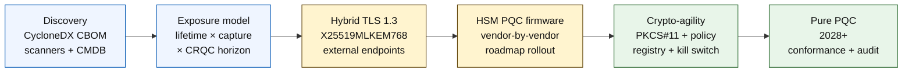

# ดัชนีธนาคารปลอดภัยจากควอนตัมในปี 2026: การเข้ารหัสหลังควอนตัม QKD ความคล่องตัวเข้ารหัส และความเสี่ยง Harvest-Now-Decrypt-Later

<!-- lead-start: manual -->
<aside class="post-lead" aria-label="สรุปบทความ">

<strong>สรุปสั้น.</strong> ธนาคารปลอดภัยจากควอนตัมในปี 2026 คือโครงการส่งมอบที่มีกำหนดส่งซึ่งกำหนดโดยจุดตัดของสองเส้นโค้ง — อายุการรักษาความลับของข้อมูลที่สถาบันถือไว้วันนี้ และขอบเขตการมาถึงของคอมพิวเตอร์ควอนตัมที่เกี่ยวข้องเชิงเข้ารหัส (CRQC) NIST FIPS 203 / 204 / 205 เป็นมาตรฐานสุดท้ายตั้งแต่สิงหาคม 2024; CNSA 2.0 กำหนดสภาพสุดท้ายของรัฐบาลกลางสหรัฐที่ปี 2033; harvest-now-decrypt-later เกิดขึ้นแล้วกับข้อมูลอายุยาว สกอร์การ์ดควอนตัมระดับบอร์ดติดตามสี่เปอร์เซ็นต์ที่ชัดเจน: ความครบถ้วนของสินค้าคงคลัง ความเสี่ยง HNDL ความคืบหน้าการย้าย NIST ความพร้อมความคล่องตัวเข้ารหัส

<strong>ประเด็นสำคัญ</strong>

<ul class="post-lead-takeaways">
  <li><strong>การถกเถียงเรื่องอัลกอริทึมปิดตัวเมื่อวันที่ 13 สิงหาคม 2024.</strong> ML-KEM (FIPS 203), ML-DSA (FIPS 204), SLH-DSA (FIPS 205) คือคำตอบ ธนาคารที่ยังเดินสายงานประเมินภายในเพื่อ "เลือกผู้ชนะ" ล้าหลังไป 18 เดือน</li>
  <li><strong>Harvest-now-decrypt-later มีผลแล้ว.</strong> สิ่งใดก็ตามที่มีอายุการรักษาความลับเลยจุดที่ CRQC น่าจะมาถึง — สินเชื่อบ้าน 30 ปี การพิจารณารับประกันชีวิต บันทึกธุรกรรมตาม MiFID II / GDPR คลังเก็บข้อมูล M&amp;A — ต้องย้ายไปใช้การห่อหุ้มกุญแจปลอดภัยจากควอนตัมแบบไฮบริดเดี๋ยวนี้ ไม่ใช่รอจนกว่า CRQC จะถูกประกาศ</li>
  <li><strong>สินค้าคงคลังคือวุฒิภาวะที่กั้นทุกอย่าง.</strong> รายการวัตถุดิบเชิงเข้ารหัส (CBOM) — โปรโตคอล ไลบรารี ใบรับรอง พาร์ทิชัน HSM การพึ่งพาผู้ขาย เจ้าของแอปพลิเคชัน อายุการจำแนกข้อมูล — คือเงื่อนไขก่อนทุกขั้นตอน วัดความสดใหม่ ไม่ใช่ความครอบคลุม</li>
  <li><strong>TLS 1.3 ไฮบริดคือการติดตั้งของปี 2026.</strong> การแบ่งกุญแจไฮบริด X25519MLKEM768 คือสิ่งที่ Chrome / Firefox / Cloudflare / Akamai เจรจาจริงในวันนี้ TLS ML-KEM ล้วนต้องรอเฟิร์มแวร์ HSM และความพร้อมของ CA</li>
  <li><strong>ความคล่องตัวเข้ารหัสคือผลส่งมอบที่ยั่งยืน.</strong> นามธรรม PKCS#11 กุญแจที่มีป้ายกำกับ ทะเบียนนโยบายที่จับคู่บริการธุรกิจกับชุดอัลกอริทึมที่อนุญาต หากปราศจากสิ่งนี้ การเปลี่ยนอัลกอริทึมครั้งต่อไปคือโครงการหลายปีอีกครั้ง</li>
</ul>
</aside>
<!-- lead-end -->

ธนาคารปลอดภัยจากควอนตัมในปี 2026 เป็นเรื่องของการย้ายระบบเชิงปฏิบัติการ ไม่ใช่การคาดการณ์ NIST ได้ออกมาตรฐานการเข้ารหัสหลังควอนตัมสามชุดแรกเรียบร้อยแล้ว และธนาคารต้องเข้าใจว่าระบบใดพึ่งพา RSA, ECC, TLS, ลายเซ็น, HSM, ใบรับรอง, ช่องทางการชำระเงิน, คลังเก็บข้อมูล และข้อมูลความลับอายุยาว คำถามดัชนีเรียบง่าย: สถาบันสามารถเปลี่ยนการเข้ารหัสได้ก่อนที่ภัยคุกคามจะเริ่มทำงานจริงหรือไม่?

---

> **บทสรุปผู้บริหาร / ประเด็นสำคัญ**
>
> - **มาตรฐาน NIST เป็นรูปธรรมแล้ว.** FIPS 203 กำหนด ML-KEM สำหรับการห่อหุ้มกุญแจ FIPS 204 กำหนด ML-DSA สำหรับลายเซ็น และ FIPS 205 กำหนด SLH-DSA เป็นมาตรฐานลายเซ็นแบบแฮชไร้สถานะ
> - **สินค้าคงคลังคือประตูวุฒิภาวะด่านแรก.** ธนาคารย้ายสิ่งที่ค้นไม่พบไม่ได้: ใบรับรอง กุญแจ โปรโตคอล แอปพลิเคชัน ผู้ขาย HSM API คลังเก็บข้อมูล และระบบฝังตัวต้องถูกแผนที่
> - **ความคล่องตัวเข้ารหัสคือวัตถุประสงค์ที่ยั่งยืน.** เป้าหมายไม่ใช่การสลับอัลกอริทึมครั้งเดียว แต่คือความสามารถในการเปลี่ยนแกนหลักเชิงเข้ารหัสโดยไม่ต้องออกแบบทั้งแอปพลิเคชันใหม่
> - **ข้อมูลอายุยาวเปลี่ยนความเร่งด่วน.** ความเสี่ยง harvest-now-decrypt-later หมายความว่าข้อมูลที่ถูกจับวันนี้อาจกลายเป็นข้อมูลอ่านได้ในอนาคตหากยังคงมีค่ามากพอ
> - **QKD คือส่วนเสริมเฉพาะทาง.** การกระจายกุญแจควอนตัมอาจเหมาะกับช่องทางที่มีมูลค่าสูงสุด แต่ไม่สามารถทดแทนการย้าย PQC ทั่วทั้งสถาบันได้
>
---

## เหตุใดปี 2026 จึงเป็นปีที่ดัชนีนี้สำคัญ

การเปลี่ยนแปลงสามอย่างในช่วงปี 2024-2025 ทำให้เรื่องปลอดภัยจากควอนตัมกลายเป็นโครงการธนาคารที่วัดผลได้ ไม่ใช่จุดสังเกตทางวิจัยอีกต่อไป หนึ่ง NIST ออกมาตรฐานหลังควอนตัมหลักเสร็จเมื่อวันที่ 13 สิงหาคม 2024: [FIPS 203 (ML-KEM) ⧉](https://nvlpubs.nist.gov/nistpubs/FIPS/NIST.FIPS.203.pdf "FIPS 203 — Module-Lattice-Based Key-Encapsulation Mechanism"), [FIPS 204 (ML-DSA) ⧉](https://nvlpubs.nist.gov/nistpubs/FIPS/NIST.FIPS.204.pdf "FIPS 204 — Module-Lattice-Based Digital Signature Standard"), [FIPS 205 (SLH-DSA) ⧉](https://nvlpubs.nist.gov/nistpubs/FIPS/NIST.FIPS.205.pdf "FIPS 205 — Stateless Hash-Based Digital Signature Standard") การถกเถียงเรื่องคัดเลือกอัลกอริทึมจบลงในวันนั้น; ธนาคารที่ยังเดินสายงานภายในเรื่อง "ระบบใดจะชนะ" ในปี 2026 ล้าหลังไป 18 เดือน

สอง [CNSA 2.0 ของ NSA ⧉](https://media.defense.gov/2022/Sep/07/2003071834/-1/-1/0/CSA_CNSA_2.0_ALGORITHMS_.PDF "Commercial National Security Algorithm Suite 2.0") กำหนดสภาพสุดท้ายของรัฐบาลกลางสหรัฐที่ปี 2033 พร้อมจุดตัดกลางทางตั้งแต่ปี 2027 สำหรับการลงนามซอฟต์แวร์และเฟิร์มแวร์ และปี 2030 สำหรับเบราว์เซอร์และระบบปฏิบัติการ ธนาคารใดก็ตามที่มีความเสี่ยงกับคู่สัญญารัฐบาลกลางสหรัฐ — FedNow การดำเนินงานคลัง บัญชีลูกค้ารัฐบาลกลาง — อยู่ภายในขอบเขตนั้นสำหรับระบบที่สัมผัสข้อมูลรัฐบาลกลาง นาฬิกาไม่ได้เป็นนามธรรมอีกต่อไป

สาม [Harvest-Now-Decrypt-Later (HNDL) ⧉](https://csrc.nist.gov/Projects/post-quantum-cryptography "NIST Post-Quantum Cryptography programme") คือเหตุผลความเสี่ยงที่รองรับความเร่งด่วน ผู้ไม่หวังดีที่ซับซ้อนกำลังจับข้อความชำระเงินที่ป้องกันด้วย TLS ซองข้อความ SWIFT เอกสาร KYC และข้อความเข้ารหัสในคลังอายุยาวที่ศูนย์การเงินสำคัญแล้ว ข้อมูลที่ถูกจับในปี 2026 ต้องการเพียงให้ยังคงเป็นความลับในขณะที่ถูกถอดรหัส — สำหรับสินเชื่อบ้าน 30 ปี การพิจารณารับประกันชีวิต บันทึกธุรกรรม MiFID II / GDPR และคลังเก็บ M&A หน้าต่างนั้นยาวเกินทุกการประมาณการที่น่าเชื่อถือสำหรับคอมพิวเตอร์ควอนตัมที่เกี่ยวข้องเชิงเข้ารหัส (CRQC) ผู้ไม่หวังดีไม่ต้องการคอมพิวเตอร์ควอนตัมในวันนี้ พวกเขาต้องการมันก่อนที่ข้อมูลจะหมดความสำคัญ

ดัชนีธนาคารปลอดภัยจากควอนตัมวัดว่าสถาบันของคุณสามารถส่งมอบการย้ายระบบก่อนที่จุดตัดนั้นจะมาถึงหรือไม่ งานไม่ใช่เรื่องว่าจะย้ายหรือไม่อีกต่อไป แต่เป็นเรื่องว่าการย้ายจะเสร็จในกรอบเวลาที่ปกป้องได้หรือไม่

## สถาปัตยกรรมดัชนีปี 2026

| ชั้นดัชนี | ทิศทางปี 2026 | ตัวชี้วัดความพร้อม | ความเสี่ยงหากดำเนินผิดพลาด |
|---|---|---|---|
| **สินค้าคงคลัง** | แผนที่สินทรัพย์เข้ารหัส โปรโตคอล ใบรับรอง ผู้ขาย และคลาสข้อมูล | เปอร์เซ็นต์ของฐานสินทรัพย์ที่จัดทำสินค้าคงคลัง | การพึ่งพาที่เปราะต่อควอนตัมที่ไม่รู้จัก |
| **ความเสี่ยง** | จำแนกระบบตามอายุการรักษาความลับและความสำคัญของธุรกรรม | สินทรัพย์เสี่ยงสูงตามมูลค่าและอายุ | การย้ายระบบที่จัดลำดับความสำคัญผิด |
| **การย้ายระบบ** | นำแพทเทิร์นไฮบริดและพร้อม PQC ที่สอดคล้องกับมาตรฐาน NIST มาใช้ | ความพร้อม ML-KEM และ ML-DSA | การยกแพลตฟอร์มฉุกเฉินภายใต้กำหนดส่ง |
| **ความคล่องตัวเข้ารหัส** | แยกตรรกะแอปพลิเคชันออกจากแกนหลักเชิงเข้ารหัส | ความครอบคลุมการเข้ารหัสที่ควบคุมด้วยนโยบาย | อัลกอริทึมที่ฮาร์ดโค้ดทั่วทั้งฐานสินทรัพย์ |
| **การประกันคุณภาพ** | ทดสอบการทำงานร่วมกัน ประสิทธิภาพ การรองรับ HSM ใบรับรอง และความพร้อมของผู้ขาย | อัตราผ่านการทดสอบและรายการข้อยกเว้นค้าง | ช่องทางพังหรือการควบคุมสำรองที่อ่อนแอ |

### สกอร์การ์ดควอนตัมระดับบอร์ด

สกอร์การ์ดความพร้อมควอนตัมที่น่าเชื่อถือต้องติดตามตัวเลขเปอร์เซ็นต์ที่ชัดเจน ไม่ใช่เพียงสถานะโครงการ:

1. **ความครบถ้วนของสินค้าคงคลัง:** เปอร์เซ็นต์ของแอปพลิเคชันระดับ tier-1 ที่มีรายการวัตถุดิบเชิงเข้ารหัส (CBOM) ครบถ้วน
2. **ความเสี่ยง HNDL:** ปริมาณข้อมูลความลับอายุยาว (เช่น PII ความลับทางการค้า) ที่ส่งผ่านเครือข่ายโดยไม่มีการห่อหุ้มกุญแจปลอดภัยจากควอนตัมแบบไฮบริด
3. **ความคืบหน้าการย้าย NIST:** เปอร์เซ็นต์ของกุญแจการเข้ารหัสแบบอสมมาตรและลายเซ็นดิจิทัลที่ย้ายไปยังมาตรฐาน FIPS 203 (ML-KEM) และ FIPS 204 (ML-DSA)
4. **ความพร้อมความคล่องตัวเข้ารหัส:** เปอร์เซ็นต์ของระบบสำคัญที่อัลกอริทึมเข้ารหัสสามารถหมุนเวียนผ่านนโยบายส่วนกลางโดยไม่ต้องคอมไพล์โค้ดใหม่

## สัญญาณปัจจุบันที่ต้องติดตาม

| สัญญาณ | ความหมายต่อธนาคาร | แหล่งที่มา |
|---|---|---|
| **FIPS 203 ML-KEM** | มาตรฐาน NIST หลักสำหรับการสร้างกุญแจเข้ารหัสทั่วไป | [NIST ⧉](https://www.nist.gov/news-events/news/2024/08/nist-releases-first-3-finalized-post-quantum-encryption-standards "First three finalized post-quantum encryption standards") |
| **FIPS 204 ML-DSA** | มาตรฐาน NIST หลักสำหรับลายเซ็นดิจิทัล | [NIST ⧉](https://www.nist.gov/news-events/news/2024/08/nist-releases-first-3-finalized-post-quantum-encryption-standards "First three finalized post-quantum encryption standards") |
| **FIPS 205 SLH-DSA** | ทางเลือกลายเซ็นแบบแฮชและการออกแบบสำรอง | [NIST ⧉](https://www.nist.gov/news-events/news/2024/08/nist-releases-first-3-finalized-post-quantum-encryption-standards "First three finalized post-quantum encryption standards") |
| **สนับสนุนการบูรณาการทันที** | NIST บอกผู้ดูแลระบบอย่างชัดเจนให้เริ่มบูรณาการมาตรฐานเพราะการบูรณาการเต็มรูปแบบต้องใช้เวลา | [NIST ⧉](https://www.nist.gov/news-events/news/2024/08/nist-releases-first-3-finalized-post-quantum-encryption-standards "First three finalized post-quantum encryption standards") |
| **โครงการควอนตัมของธนาคารกำลังขยาย** | ธนาคารใหญ่กำลังสำรวจเทคโนโลยีควอนตัมขณะเตรียมการเปลี่ยนผ่าน PQC | [Quantum Insider ⧉](https://thequantuminsider.com/2026/03/27/15-plus-global-banks-probing-the-wonderful-world-of-quantum-technologies/ "Overview of global banks exploring quantum technologies") |

## การย้ายระบบเริ่มต้นที่บัญชีแยกประเภทของการเข้ารหัส

ลำดับการย้ายระบบเป็นที่เข้าใจกันดีในตอนนี้ แต่ละประตูสร้างหลักฐานที่ขับเคลื่อนประตูถัดไป; การข้ามหรือบีบประตูคือสิ่งที่สร้างความเสี่ยงยกแพลตฟอร์มฉุกเฉินที่ปรากฏในคอลัมน์ความล้มเหลวของสถาปัตยกรรมดัชนี

ผลส่งมอบแรกไม่ใช่อัลกอริทึมใหม่ แต่คือรายการวัตถุดิบเชิงเข้ารหัส (CBOM) ธนาคารต้องการสินค้าคงคลังที่มีชีวิตซึ่งเชื่อมโยงบริการธุรกิจกับอัลกอริทึม ไลบรารี ใบรับรอง ความยาวกุญแจ HSM อายุข้อมูล ผู้ขาย และเจ้าของเชิงปฏิบัติการ หากไม่มีบัญชีแยกประเภทนั้น การย้ายระบบปลอดภัยจากควอนตัมกลายเป็นการเดา

ชุดข้อมูล CBOM ควรบันทึกสำหรับแต่ละแกนหลักเชิงเข้ารหัส: โปรโตคอลหรืออินเตอร์เฟซ (TLS 1.3, IPsec, SSH, รูปแบบข้อความชำระเงินที่กำหนดเอง), อัลกอริทึมและชุดพารามิเตอร์ (RSA-2048, ECDH P-256, ML-KEM-768, ML-DSA-65), ไลบรารีและเวอร์ชัน (OpenSSL 3.4, แฮชคอมมิต BoringSSL, การ build SDK ของผู้ขาย), ขอบเขตฮาร์ดแวร์ (พาร์ทิชัน HSM, TPM, secure enclave หรือไม่มี), เอกลักษณ์ใบรับรองหากเกี่ยวข้อง, เจ้าของแอปพลิเคชัน, และอายุการจำแนกข้อมูล เครื่องมือที่เข้าสู่การผลิตในปี 2025-2026 — IBM Quantum Safe Inventory, [ข้อกำหนด CycloneDX CBOM ⧉](https://cyclonedx.org/capabilities/cbom/ "CycloneDX Cryptography Bill of Materials") โอเพนซอร์ส, เครื่องสแกนระดับองค์กรจาก CryptoNext / Sandbox / PQShield — บูรณาการกับท่อ CMDB ที่มีอยู่ ไม่มีตัวใดสมบูรณ์โดยลำพัง; คาดหวังรอบการสร้าง CBOM 12-18 เดือนแม้จะมีเครื่องมือของผู้ขายและบุคลากรทุ่มเทเต็มเวลา

ตัวชี้วัดที่ต้องติดตามคือความสดใหม่ ไม่ใช่ความครอบคลุม CBOM ที่ล้าสมัยไปสองเดือนแย่กว่าไม่มี CBOM เลย เพราะมันให้ความมั่นใจผิดๆ แก่ทีมความมั่นคงเกี่ยวกับสิ่งที่ถูกย้ายไปแล้ว

## ไฮบริดก่อน คล่องตัวเสมอ

ธนาคารส่วนใหญ่จะไม่สลับทุกอย่างพร้อมกัน แพทเทิร์นที่เป็นจริงคือการติดตั้งแบบไฮบริด ที่กลไกแบบคลาสสิกและหลังควอนตัมรันด้วยกันขณะที่ผู้ขาย โปรโตคอล ใบรับรอง และเครื่องมือเชิงปฏิบัติการพัฒนาขึ้น เป้าหมายระยะยาวคือความคล่องตัวเข้ารหัส: ทางเลือกเชิงเข้ารหัสที่ควบคุมด้วยนโยบายซึ่งสามารถเปลี่ยนแปลงได้โดยไม่ต้องสร้างแอปพลิเคชันธุรกิจใหม่

[Insert Interactive Component: Harvest-Now-Decrypt-Later (HNDL) Risk Calculator — เครื่องมือแบบสไลเดอร์ที่ผู้บริหารป้อนอายุการเก็บข้อมูลเทียบกับกรอบเวลาควอนตัมที่ประมาณการเพื่อดูหน้าต่างความเสี่ยงของตน]

> **ข้อมูลเชิงลึกสำคัญ:** หากข้อมูลของคุณต้องเป็นความลับ 10 ปี และคอมพิวเตอร์ควอนตัมที่เกี่ยวข้องเชิงเข้ารหัส (CRQC) ห่างออกไป 7 ปี กำหนดส่งการย้ายระบบของคุณไม่ใช่อีก 7 ปีข้างหน้า — มันคือเมื่อ 3 ปีที่แล้ว

ในทางปฏิบัติหมายถึง TLS 1.3 พร้อมการแบ่งกุญแจไฮบริด `X25519MLKEM768` สำหรับจุดปลายภายนอก (Chrome / Firefox / Cloudflare / Akamai รองรับทั้งหมดในวันนี้), สายลายเซ็นคลาสสิกจนกว่าโครงสร้างพื้นฐาน HSM และ CA จะตามทัน และชั้นนามธรรม PKCS#11 ที่ปล่อยให้ทะเบียนนโยบายหมุนเวียนอัลกอริทึมโดยไม่ต้องคอมไพล์แอปพลิเคชันธุรกิจใหม่ ความคล่องตัวเข้ารหัสคือสิ่งที่กำหนดว่าการเปลี่ยนอัลกอริทึมครั้งต่อไป (เมื่อใด ไม่ใช่หากใด) เป็นการหมุนเวียนหกสัปดาห์หรือโครงการเจ็ดปีอีกครั้ง

## QKD เหมาะอยู่ตรงไหน

การกระจายกุญแจควอนตัมอยู่ในดัชนีในฐานะตัวเลือกช่องทางที่อ่อนไหวสูง โดยเฉพาะสำหรับโครงสร้างพื้นฐานตลาดการเงิน การเชื่อมต่อธนาคารกลาง และกระแสสถาบันที่อ่อนไหวอย่างยิ่ง ควรถูกปฏิบัติเป็นส่วนเสริม PQC ไม่ใช่ข้ออ้างในการชะลอการย้ายระบบระดับองค์กร

## ความหมายต่อธนาคารแต่ละประเภท

### ธนาคารที่มีความสำคัญเชิงระบบระดับโลก

ปัญหายากคือสเกล: จุดปลาย TLS หลายหมื่นจุด, พาร์ทิชัน HSM หลายร้อยพาร์ทิชัน, ผู้ออกใบรับรองภายในหลายสิบราย, แอปพลิเคชันธุรกิจหลายร้อยรายการที่ฝังแกนหลักเชิงเข้ารหัส, และ SDK ของผู้ขายที่ธนาคารปรับแก้ไม่ได้ การลงทุนไม่ใช่ pilot อีกครั้ง แต่คือเครื่องมือ CBOM, ชั้นนามธรรม PKCS#11 ที่ต่อสายเข้ากับทุก build ใหม่, แผนรวม HSM ที่เลือกผู้ขายรายหนึ่งให้นำหน้าด้านเฟิร์มแวร์ PQC และยอมรับหางหลายปีกับรายอื่น, และทะเบียนนโยบายที่กลายเป็นพื้นผิวความคล่องตัวเข้ารหัสที่ยั่งยืนหลังการย้าย FIPS 203 / 204 / 205 เสร็จสิ้นแล้วนาน

### ธนาคารธุรกรรมและองค์กร

ขอบเขตการย้ายระบบแคบกว่าระดับ G-SIB แต่ความเสี่ยง HNDL รุนแรง: การส่งข้อความข้ามพรมแดน SWIFT, ข้อมูลชำระเงินมีโครงสร้างที่บรรทุก PII คู่สัญญาองค์กร, แพลตฟอร์มแลกเปลี่ยนเอกสารที่ถือเอกสารการเงินการค้า, และคลังเก็บรายงานที่เก็บไว้ระยะยาว จัดลำดับความสำคัญ TLS ไฮบริดบนทุกจุดปลายที่หันออกหาลูกค้าและ PQC ขณะพักสำหรับคลังเก็บข้อมูล ผลักดันความรับผิดชอบของผู้ขาย HSM — ทีมแพลตฟอร์มธนาคารองค์กรมีอำนาจในการจัดซื้อโดยตรงที่ทีมเทคโนโลยีค้าส่งมักขาด

### ธนาคารระดับภูมิภาค

ซื้อสแต็คผู้ขายที่มีแกนความคล่องตัวเข้ารหัสอยู่แล้ว เลือกแพลตฟอร์ม core banking ที่ผู้ขายตีพิมพ์ CBOM และผูกพันกับกรอบเวลาการรองรับ ML-KEM / ML-DSA ตรวจสอบให้แน่ใจว่าแผนงาน HSM ของผู้ขายสอดคล้องกับกำหนดส่งการย้ายของธนาคาร ความสามารถวิศวกรรมที่ต้องใช้ในการสร้างความคล่องตัวเข้ารหัสจากศูนย์ใช้เวลาหลายปี; ผู้ขายชำระต้นทุนนั้นกระจายไปทั่วลูกค้าหลายราย และธนาคารได้รับประโยชน์ งานตรวจสอบ — ตรวจว่าคำกล่าวอ้างของผู้ขายผ่านกระบวนการ MRM ของสถาบัน — คือขอบเขตภายในที่ชอบธรรม

### ฟินเทค PSP และผู้ให้บริการโครงสร้างพื้นฐาน

คำถามการแข่งขันสำหรับผู้ขายที่ขายเข้าธนาคารในปี 2026 ไม่ใช่ "คุณรองรับ PQC หรือไม่" แต่คือ "คุณสามารถผลิต CycloneDX CBOM สำหรับแพลตฟอร์มของคุณ เมทริกซ์การรองรับของผู้ขาย HSM และ SLA การหมุนเวียนอัลกอริทึมที่เป็นลายลักษณ์อักษรได้หรือไม่" ผู้ขายที่ตอบว่าได้จะผ่านประตูจัดซื้อระดับ tier-1 ในปี 2026-2027 ผู้ขายที่ทำไม่ได้จะแพ้รอบต่ออายุให้คู่แข่งที่ทำได้

## บทสรุป

ธนาคารปลอดภัยจากควอนตัมในปี 2026 ไม่ใช่จุดสังเกตทางวิจัย แต่เป็นโครงการส่งมอบที่มีกำหนดส่งซึ่งกำหนดโดยจุดตัดของสองเส้นโค้ง — อายุการรักษาความลับของข้อมูลที่สถาบันถือไว้วันนี้ และขอบเขตการมาถึงของคอมพิวเตอร์ควอนตัมที่เกี่ยวข้องเชิงเข้ารหัส สถาบันที่ดูน่าเชื่อถือต่อผู้กำกับดูแลและคู่สัญญาในปี 2030 คือสถาบันที่เริ่มสร้าง CBOM ในปี 2024 ติดตั้ง TLS ไฮบริดบนทุกจุดปลายภายนอกภายในปลายปี 2026 และวิศวกรรมความคล่องตัวเข้ารหัสเข้ากับทุก build ใหม่ตั้งแต่วันแรก สถาบันที่ไม่ทำจะค้นพบว่าหน้าต่างการย้ายระบบของพวกเขาปิดไปแล้วสำหรับข้อมูลที่ผู้ไม่หวังดีกำลังเก็บเกี่ยวในวันนี้หรือไม่

วัดการย้ายระบบในแบบที่คุณวัดโครงการเชิงปฏิบัติการใดก็ตาม: รู้ขอบเขต จัดลำดับสำคัญ ผูกพันกำหนดส่ง ทะเบียนข้อยกเว้นซื่อตรง ยิ่งคุณมองฐานสินทรัพย์ของตนเองอย่างเข้มงวด หน้าต่างการย้ายระบบยิ่งรู้สึกแคบลง

## คำถามที่พบบ่อย

**ธนาคารควรจัดทำสินค้าคงคลังอะไรก่อน?**

เริ่มต้นด้วย TLS ที่เปิดเผยต่อภายนอก ช่องทางการชำระเงิน การยืนยันตัวตนลูกค้า การเชื่อมต่อระหว่างธนาคาร บริการที่สนับสนุนด้วย HSM คลังเก็บข้อมูลระยะยาว และระบบที่จัดการข้อมูลความลับซึ่งมีอายุการใช้งานยาว

**PQC เป็นเพียงประเด็นความปลอดภัยทางไซเบอร์เท่านั้นหรือไม่?**

ไม่ใช่ มันส่งผลต่อการชำระเงิน เอกลักษณ์ หลักฐานทางกฎหมาย การลงนามธุรกรรม ความไว้วางใจของลูกค้า การเก็บรักษาข้อมูล การจัดการผู้ขาย และความยืดหยุ่นเชิงปฏิบัติการ

**ความคล่องตัวเข้ารหัสหมายถึงอะไร?**

ความคล่องตัวเข้ารหัสหมายถึงความสามารถในการเปลี่ยนแกนหลักเชิงเข้ารหัสผ่านการควบคุมเชิงนโยบายและแพลตฟอร์มแทนการเปลี่ยนแอปพลิเคชันแบบฮาร์ดโค้ด

**ธนาคารควรรอมาตรฐานเพิ่มเติมหรือไม่?**

ไม่ NIST ได้สนับสนุนให้ผู้ดูแลระบบเริ่มบูรณาการมาตรฐานสุดท้ายชุดแรกเพราะการบูรณาการเต็มรูปแบบต้องใช้เวลา

## อ้างอิง

- NIST, (2026). [First three finalized post-quantum encryption standards ⧉](https://www.nist.gov/news-events/news/2024/08/nist-releases-first-3-finalized-post-quantum-encryption-standards "First three finalized post-quantum encryption standards").

<!-- enrich-start -->
<aside class="author-card" aria-label="เกี่ยวกับผู้เขียน"><strong class="author-card-name"><a href="/about/index.html">Sebastien Rousseau</a></strong>นักเทคโนโลยีธนาคารอาวุโสที่เขียนเกี่ยวกับ AI ประยุกต์ โครงสร้างพื้นฐานการชำระเงิน เงินที่ถูก tokenise ISO 20022 ความปลอดภัยหลังควอนตัม บริการการเงินแบบ cloud-native และตลาดดิจิทัลที่อยู่ใต้การกำกับดูแลมากกว่า 20 ปีที่ HSBC Commercial &amp; Investment Bank, PayPal, Barclays, Shazam, AKQA, Virgin Group. <a href="/about/index.html">โปรไฟล์เต็ม</a> &middot; <a href="https://www.linkedin.com/in/sebastienrousseau/" rel="external noopener">LinkedIn</a> &middot; <a href="https://github.com/sebastienrousseau" rel="external noopener">GitHub</a></aside>

ตรวจสอบล่าสุด <time datetime="2026-06-04">2026-06-04</time>.

<!-- enrich-end -->
