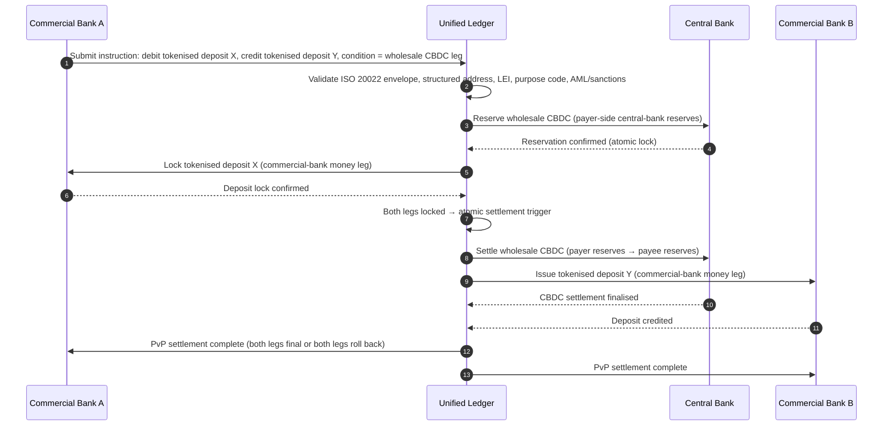

<!-- lead-start: manual -->
<aside class="post-lead" aria-label="สรุปบทความ">

<strong>สรุปสั้น</strong> การชำระเงินขายส่งในปี 2026 อยู่ที่จุดตัดของการเปลี่ยนเชิงโครงสร้างสองอย่าง: ISO 20022 บังคับข้อมูลการชำระเงินแบบมีโครงสร้างเข้าสู่โมเดลปฏิบัติการ และเงินฝากแบบโทเคน + BIS Project Agorá กำลังเคลื่อนการชำระบัญชีข้ามพรมแดนไปสู่รางแบบ atomic โปรแกรมได้ และเปิดตลอดเวลา คำถามปี 2026 สำหรับธนาคารไม่ใช่ "เราย้ายข้อความเรียบร้อยหรือยัง" แต่เป็น "ปฏิบัติการการชำระเงินของเราวัดได้ กำหนดเส้นทางได้ และตรวจสอบได้หรือไม่" — และดัชนีนี้แบ่งคำถามนั้นเป็นสี่เปอร์เซ็นต์ที่แน่นอน: ความครบถ้วนข้อมูลแบบมีโครงสร้าง ความเหมาะสมของการกำหนดเส้นทางราง ระยะเวลาการชำระบัญชีถึงขั้นสุด และความครอบคลุมระเบียง Agorá

<strong>ประเด็นสำคัญ</strong>

<ul class="post-lead-takeaways">
  <li><strong>พฤศจิกายน 2026 เป็นเส้นตายที่บังคับ ไม่ใช่คำแนะนำ</strong> SWIFT ยกเลิกการรองรับที่อยู่แบบไม่มีโครงสร้างใน SR 2026 การชำระเงินที่ไม่มีเมืองและประเทศในฟิลด์ที่กำหนดจะหยุดเคลียร์ ต้นทุนการแก้ไข อัตราการปฏิเสธ และขีดความสามารถปฏิบัติการล้วนเลื่อนจาก "ตัวชี้วัด" เป็น "ท่าทีที่ผู้กำกับดูแลเห็น"</li>
  <li><strong>เงินฝากแบบโทเคนเอาชนะ stablecoin ในงานขายส่งที่อยู่ใต้การกำกับดูแล</strong> เงินฝากแบบโทเคนรักษาความสัมพันธ์ธนาคาร-ผู้ฝากและสินทรัพย์ชำระบัญชีของธนาคารกลางไว้พร้อมเปิดความสามารถโปรแกรมได้ Stablecoin คงบทบาทที่ขอบ; เงินฝากแบบโทเคนยึดที่แกน</li>
  <li><strong>BIS Project Agorá คือมาตรฐานอ้างอิงสำหรับระเบียง</strong> ถ้าผลิตภัณฑ์ข้ามพรมแดนของธนาคารไม่สามารถวิ่งภายในระเบียง Agorá ได้ภายในปี 2027 ธนาคารกำลังแข่งบนรางที่ตลาดที่เหลือกำลังออกแล้ว</li>
  <li><strong>การประสานรางเรียลไทม์คือโมเดลปฏิบัติการ</strong> การตัดสินใจหลายรางในปี 2026 (FedNow / RTP / TIPS / SEPA Inst / on-chain) ไม่ใช่ "รางไหน" — แต่คือทะเบียนนโยบาย โปรไฟล์สภาพคล่อง และเครื่องมือกำหนดเส้นทางที่เลือกรางต่อรายการชำระเงิน</li>
  <li><strong>วัดเอง หรือถูกวัด</strong> สี่เปอร์เซ็นต์ — ความครบถ้วนข้อมูลแบบมีโครงสร้าง ความเหมาะสมของการกำหนดเส้นทางราง ระยะเวลาการชำระบัญชีถึงขั้นสุด ความครอบคลุมระเบียง Agorá — แปลงท่าทีการชำระเงินเป็นหลักฐานพร้อมต่อผู้กำกับดูแลก่อนหน้าต่างการตรวจปี 2026/27</li>
</ul>
</aside>
<!-- lead-end -->

# ดัชนีการชำระเงินขายส่งในปี 2026: ISO 20022 เงินฝากแบบโทเคน รางเรียลไทม์ และการชำระบัญชีข้ามพรมแดน

การชำระเงินขายส่งในปี 2026 ถูกปรับโครงสร้างด้วยการเปลี่ยนสองอย่างที่เกิดขึ้นพร้อมกัน: ข้อมูลการชำระเงินแบบมีโครงสร้าง และการชำระบัญชีแบบโปรแกรมได้ หมุดหมายที่อยู่แบบมีโครงสร้างของ SWIFT ในเดือนพฤศจิกายน 2026 บังคับคุณภาพข้อมูลเข้าสู่โมเดลปฏิบัติการ ขณะที่ BIS Project Agorá และเงินฝากแบบโทเคนกำลังทดสอบว่าการชำระบัญชีข้ามพรมแดนจะกลายเป็น atomic โปร่งใส และเปิดตลอดเวลาได้หรือไม่

---

> **บทสรุปผู้บริหาร / ประเด็นสำคัญ**
>
> - **พฤศจิกายน 2026 เป็นหมุดหมายข้อมูลที่บังคับ** SWIFT ระบุว่าการชำระเงินที่มีที่อยู่แบบไม่มีโครงสร้างจะไม่ถูกรองรับหลังจากการเปลี่ยนแปลง SR 2026
> - **ข้อมูลแบบมีโครงสร้างกลายเป็นโครงสร้างพื้นฐานของผลิตภัณฑ์** เมืองและประเทศต้องอยู่ในฟิลด์ที่กำหนดอย่างต่ำที่สุด แปลงคุณภาพข้อมูลการชำระเงินเป็นประเด็นของลูกค้า ปฏิบัติการ และการกำกับ
> - **เงินฝากแบบโทเคนคือตัวเลือกการออกแบบสำหรับขายส่ง** Project Agorá สำรวจเงินฝากธนาคารพาณิชย์แบบโทเคนและทุนสำรองธนาคารกลางแบบโทเคนในโมเดลบัญชีแยกประเภทที่รวมเป็นหนึ่ง
> - **ดัชนีควรวัดคุณภาพการชำระบัญชี ไม่ใช่ความเร็วเพียงอย่างเดียว** ความขั้นสุด ความโปร่งใส อัตราการแก้ไข การใช้สภาพคล่อง ข้อมูลการกำกับ และการมองเห็นของลูกค้ามีความสำคัญพอ ๆ กับการดำเนินการทันที
> - **การชำระเงินข้ามพรมแดนยังคงเป็นวาระสาธารณะ-เอกชน** FSB ยังคงขับเคลื่อน roadmap G20 ผ่านการดำเนินการพร้อมการประสานกันระหว่างภาครัฐและเอกชน
>
---

## ทำไมปี 2026 จึงเป็นปีที่ดัชนีนี้สำคัญ

Stanford AI Index มีประโยชน์เพราะปฏิบัติกับสนามเทคโนโลยีที่เคลื่อนเร็วเหมือนสิ่งที่วัดได้: ผลงานวิจัย ประสิทธิภาพเชิงเทคนิค การนำไปใช้ที่รับผิดชอบ เศรษฐศาสตร์ การยอมรับในภาคส่วน นโยบาย และความรู้สึกสาธารณะ ถูกนำมารวมในกรอบเดียว ([Stanford HAI ⧉](https://hai.stanford.edu/ai-index/2026-ai-index-report "The 2026 AI Index Report")) ธนาคารและสถาบันการเงินต้องมีวินัยเดียวกันสำหรับโครงสร้างพื้นฐาน เอเจนต์ AI ความปลอดภัยทนต่อควอนตัม ความยืดหยุ่นแบบ cloud native และการชำระเงินขายส่งไม่ใช่เส้นทางนวัตกรรมที่แยกกันอีกต่อไป; กำลังบรรจบเป็นโมเดลปฏิบัติการเดียว

คำถามเชิงปฏิบัติของธนาคารไม่ใช่ว่าแต่ละด้านสำคัญหรือไม่ แต่คือสถาบันสามารถวัดความพร้อมข้ามทุกด้านพร้อมกันได้หรือไม่ ธนาคารสามารถ deploy เอเจนต์ AI ได้แต่ยังเปราะบางถ้า cryptography ไม่พร้อมย้าย สามารถปรับปรุงแพลตฟอร์มคลาวด์แต่ยังล้มถ้าข้อมูลการชำระเงินยังไม่มีโครงสร้าง สามารถรัน pilot tokenisation แต่ยังสร้างความเสี่ยงเชิงระบบถ้าชั้นการชำระบัญชี สภาพคล่อง ตัวตน และบันทึกการตรวจสอบไม่ได้ถูกออกแบบร่วมกัน

## สถาปัตยกรรมดัชนีปี 2026

| ชั้นดัชนี | ทิศทางปี 2026 | ตัวชี้วัดความพร้อม | ความเสี่ยงเมื่อจัดการพลาด |
|---|---|---|---|
| **ข้อมูล ISO 20022** | เคลื่อนจากข้อความไม่มีโครงสร้างสู่ฟิลด์มีโครงสร้างที่ถูกกำกับ | ความพร้อมที่อยู่แบบมีโครงสร้างและอัตราการปฏิเสธ | การปฏิเสธการชำระเงินและการแก้ไขด้วยมือ |
| **การประสานราง** | กำหนดเส้นทางข้าม RTGS instant correspondent stablecoin และรางโทเคน | ต้นทุน ความเร็ว ความขั้นสุด และการกำหนดเส้นทางที่ตระหนักเขตอำนาจ | รางที่กระจัดกระจายพร้อมการควบคุมที่ซ้ำซ้อน |
| **การชำระบัญชีแบบโทเคน** | ใช้เงินฝากแบบโทเคนและเงินธนาคารกลางที่ลดการเสียดทาน | ความครอบคลุม DvP PvP การชำระบัญชีแบบ atomic | สินทรัพย์ pilot ที่ไม่มีคุณค่าต่อ workflow ทางธุรกิจ |
| **สภาพคล่อง** | ปรับสภาพคล่องระหว่างวัน เงินสดที่ติดล็อก และหน้าต่างการชำระบัญชีให้เหมาะ | สภาพคล่องที่ประหยัดและการลดความล้มเหลวในการชำระบัญชี | การระบายสภาพคล่องที่เร็วขึ้น |
| **การกำกับ** | ฝัง AML, sanctions, FATF และข้อกำหนดบันทึกการตรวจสอบเข้าในข้อมูลการชำระเงิน | การปฏิบัติตามแบบ straight-through และการอธิบายได้ | ข้อมูลที่ละเอียดขึ้นโดยไม่มีการควบคุมที่แข็งแกร่งขึ้น |

## สัญญาณการชำระเงินขายส่งที่จับคู่กับลำดับความสำคัญระดับโลก

ชุดสัญญาณปี 2026 ไม่ใช่วาระการวิจัย แต่เป็นรายการตรวจสอบการส่งมอบที่ Chief Payments Officer ของธนาคารถูกวัดอยู่แล้ว งานแก้ไขปรากฏในสามจุด: ซองข้อความ ชั้นการประสานราง และบัญชีแยกประเภทการชำระบัญชี

| สัญญาณ | อ้างอิง G20 / SWIFT / BIS | การใช้งานบนแพลตฟอร์มทางเทคนิค |
|---|---|---|
| **65 % ของข้อความการชำระเงินยังมีที่อยู่แบบไม่มีโครงสร้าง** | [SWIFT SR 2026 — หมุดหมายที่อยู่แบบโครงสร้าง พ.ย. 2026 ⧉](https://www.swift.com/news-events/news/iso-20022-milestone-november-2026-unstructured-addresses-be-removed "ISO 20022 November 2026 structured address milestone") | การตรวจสอบสคีมาใน middleware การชำระเงินก่อนข้อความเข้าสู่ SWIFTNet adapter; การแยกวิเคราะห์ที่อยู่อัตโนมัติที่จุดรับเข้าจากช่องทางองค์กร + ธนาคารตัวกลาง |
| **เป้าหมาย FSB G20: 75 % ของการชำระเงินข้ามพรมแดนเสร็จภายใน 1 ชั่วโมงภายในปี 2027** | [FSB roadmap การชำระเงินข้ามพรมแดน ระยะการดำเนินการปี 2026 ⧉](https://www.fsb.org/2026/03/fsb-kicks-off-new-implementation-phase-to-enhance-cross-border-payments-through-public-private-partnership/ "FSB cross-border payments implementation phase") | เกตเวย์แปลง FX แบบเรียลไทม์พร้อมหน้าต่างสภาพคล่องที่ตกลงล่วงหน้า; hook ยืนยัน T+0 เข้าสู่พอร์ทัลลูกค้า; เครื่องมือกำหนดเส้นทางรางที่ตัดระเบียงที่ไม่สามารถปฏิบัติตามซอง 1 ชม. ออก |
| **เป้าหมาย FSB G20: ต้นทุนธุรกรรมข้ามพรมแดนเฉลี่ยต่ำกว่า 1 % สำหรับรายย่อยต่ำกว่า 3 %** | [เป้าหมายเชิงปริมาณ FSB G20 ⧉](https://www.fsb.org/2026/03/fsb-kicks-off-new-implementation-phase-to-enhance-cross-border-payments-through-public-private-partnership/ "FSB cross-border payments implementation phase") | telemetry การประมาณการต้นทุนต่อทุกระเบียง (สเปรด FX ค่าธรรมเนียมตัวกลาง ต้นทุนยก); ทะเบียนนโยบายส่วนต่างที่เปิดเผยการตั้งราคาที่ไม่ปฏิบัติตามก่อนเสนอราคา |
| **BIS Project Agorá เข้าสู่ระยะต้นแบบข้ามธนาคารกลางเจ็ดแห่ง + ธนาคารพาณิชย์ 41 แห่ง** | [BIS Project Agorá ⧉](https://www.bis.org/about/bisih/topics/fmis/agora.htm "Project Agorá") | สเปคบูรณาการบัญชีแยกประเภทรวม: โหนดบัญชีแยกประเภทเงินฝากแบบโทเคน + plane การชำระบัญชี wholesale CBDC + hook KYC/AML; พูล on-chain ที่ขนาดตามส่วนแบ่งระเบียงของธนาคาร |
| **กรอบ "digital money" ของ Deutsche Bank ตกผลึกในสถาปัตยกรรมลูกค้า** | [Deutsche Bank — Digital Money: stablecoins, tokenised deposits and CBDCs ⧉](https://flow.db.com/publications/flow-white-papers-and-guides/digital-money-a-perspective-on-stablecoins-tokenised-deposits-and-cbdcs "Digital Money: stablecoins, tokenised deposits and CBDCs") | API การชำระบัญชีที่ไม่ผูกกับ wallet ซึ่งจัดการการเลือก stablecoin / เงินฝากแบบโทเคน / CBDC ต่อรายการ; เงื่อนไขโปรแกรมได้ที่ประเมินกับทะเบียนนโยบายของธนาคาร ไม่ใช่ของลูกค้า |

## จุดเปลี่ยนของข้อมูลการชำระเงิน

ISO 20022 ได้เคลื่อนจากโครงการรูปแบบข้อความสู่โมเดลปฏิบัติการคุณภาพข้อมูล ถ้าข้อมูลผู้รับผลประโยชน์ ผู้ชำระเงิน เจ้าหนี้ เอเจนต์ เมือง ประเทศ วัตถุประสงค์ และข้อมูลคู่กรณีอ่อน ธนาคารจะประสบการปฏิเสธ การแก้ไข แรงเสียดทานด้าน sanctions ความหงุดหงิดของลูกค้า และการวิเคราะห์ที่อ่อน

**SR 2026 ทำให้สิ่งนี้กลายเป็นสัญญาที่บังคับ ไม่ใช่คำแนะนำ** SWIFT Standards Release 2026 (พฤศจิกายน 2026) บังคับใช้กฎที่อยู่แบบโครงสร้างที่ชั้นเครือข่าย — ข้อความที่ element `<PstlAdr>` ไม่บรรจุ `<TwnNm>` และ `<Ctry>` จะถูกปฏิเสธทันทีที่รับโดย validation stack ของ SWIFTNet ไม่ใช่ถูกตั้งธงให้แก้ไข คิวการแก้ไขหยุดเป็นเส้นต้นทุนของ back-office และกลายเป็นเหตุการณ์ความล้มเหลวของการชำระบัญชีพร้อมความล่าช้าที่ลูกค้าเห็น ทีมปฏิบัติการที่ปฏิบัติต่อ SR 2026 ในฐานะ "คำแนะนำที่เข้มขึ้น" กำลังทำงานจาก runbook ที่ผิด

### การปฏิบัติตามข้อมูลการชำระเงินแบบโครงสร้างภายใต้ ISO 20022

พื้นที่การแก้ไขแคบและกำหนดชัดเจน element XML ด้านล่างคือจุดที่ validation stack ของ SWIFTNet เดือนพฤศจิกายน 2026 ปฏิเสธข้อความจริง ทุกอย่างที่เหลือคือผลกระทบปลายน้ำ

| Data Element | ISO 20022 XML Tag | ข้อกำหนด SWIFT พฤศจิกายน 2026 | กลยุทธ์การแก้ไขทางเทคนิค |
|---|---|---|---|
| **ที่อยู่แบบโครงสร้าง** | `<PstlAdr>` บรรจุ `<TwnNm>` + `<Ctry>` | บังคับ ข้อความ `<AdrLine>` แบบไม่มีโครงสร้างจะกระตุ้นการปฏิเสธที่เครือข่ายที่ SWIFTNet adapter ฝั่งรับ | การแยกวิเคราะห์ที่อยู่อัตโนมัติที่จุดเริ่มต้นการชำระเงิน; การเขียนฟอร์มช่องทางองค์กรใหม่; การล้างข้อมูลคู่สัญญาทุกรายในสมุดเก่าก่อนการหักบัญชีครั้งถัดไป |
| **Legal Entity Identifier (LEI)** | `<Id>` ภายใต้ `<OrgId>` | แนะนำอย่างยิ่งสำหรับการตรวจสอบคู่สัญญาทางการเงินที่ไม่ใช่บุคคล; บังคับในระเบียง CBPR+ หลายระเบียง | ค้นหา LEI + cross-check กับ GLEIF ณ การ onboarding องค์กร; การเสริมข้อมูลอัตโนมัติสำหรับคู่สัญญาในสมุดเก่าผ่านบริการข้อมูลอ้างอิง |
| **รหัสวัตถุประสงค์การชำระเงิน** | `<Purp>` บรรจุ `<Cd>` | บังคับในระเบียงเรียลไทม์ระดับภูมิภาคหลายแห่ง (CBPR+, SEPA Inst, TIPS) สำหรับการคัดกรอง AML / sanctions อัตโนมัติ | จับคู่รหัสธุรกรรมภายในธนาคารแบบเก่ากับรายการ ISO 20022 ExternalPurposeCode มาตรฐาน; เปิดเผยการเลือกวัตถุประสงค์ใน UI ช่องทางองค์กร; default-deny กับรหัสที่ไม่รู้จัก |
| **คู่สัญญาขั้นสุดท้าย** | `<UltmtDbtr>` / `<UltmtCdtr>` | เปิดเผยบริบทผู้รับผลประโยชน์ขั้นสุดท้ายเพื่อปฏิบัติตามพารามิเตอร์ travel-rule G20 FATF + sanctions; บังคับสำหรับรหัสประเภทการชำระเงินหลายรหัส | ดึงชื่อคู่สัญญาแบบ end-to-end จากบัญชีย่อยของบัญชีแยกประเภท; กระทบยอดกับ KYC graph; เปิดเผยคู่สัญญาขั้นสุดท้ายในการยืนยันทุกครั้ง |
| **ข้อมูลการโอน (แบบโครงสร้าง)** | `<RmtInf><Strd>` กับ `<RfrdDocInf>` | จำเป็นสำหรับการชำระเงินองค์กรที่เชื่อมโยงใบแจ้งหนี้แบบกระทบยอดได้ภายใต้ CBPR+ ระยะ 2 | จับข้อมูลการโอนแบบโครงสร้าง ณ เวลาเสนอราคาในพอร์ทัลองค์กร; ปฏิเสธ fallback แบบข้อความอิสระสำหรับกระแสมูลค่าสูง |

## เงินฝากแบบโทเคนและ CBDC ขายส่ง

เงินฝากแบบโทเคนรักษาโมเดลเงินของธนาคารพาณิชย์พร้อมเพิ่มความสามารถโปรแกรมได้ เงินธนาคารกลางขายส่งรักษาความขั้นสุดของการชำระบัญชี รูปแบบการออกแบบที่น่าสนใจคือการรวมกัน: เงินธนาคารพาณิชย์สำหรับความสัมพันธ์ลูกค้าและการเป็นตัวกลางสินเชื่อ เงินธนาคารกลางสำหรับการชำระบัญชีขั้นสุดและความเชื่อมั่นเชิงระบบ

Project Agorá ทำให้การรวมกันเป็นรูปธรรม สถาปัตยกรรมด้านล่างคือรูปแบบอ้างอิงของ BIS สำหรับการชำระบัญชีข้ามพรมแดนแบบ atomic ชำระเงิน-ต่อ-ชำระเงิน (PvP) โดยใช้ทั้งบัญชีแยกประเภทเงินฝากธนาคารพาณิชย์และ plane การชำระบัญชี wholesale CBDC โดยประสานผ่านบัญชีแยกประเภทรวม

การชำระบัญชีเป็น atomic โดยโครงสร้าง: ทั้งสองขา commit หรือทั้งคู่ roll back ความขั้นสุดของการชำระบัญชีบนขา wholesale CBDC ทำให้การโอนเงินฝากแบบโทเคนของธนาคารพาณิชย์มีผลโดยไม่มีความเสี่ยงตัวกลาง บัญชีแยกประเภทรวมคือ plane การประสาน ไม่ใช่ระบบการชำระเงินในตัวเอง — ธนาคารกลางยังออกสินทรัพย์การชำระบัญชี และธนาคารพาณิชย์ยังบันทึกหนี้สินเงินฝาก

## ผลิตภัณฑ์การชำระเงินขายส่งใหม่

ผลิตภัณฑ์ไม่ใช่แค่การชำระเงินอีกต่อไป มันคือชุดของการดำเนินการ ข้อมูล สภาพคล่อง การกำกับ การติดตามที่มา และการจัดการข้อยกเว้น ธนาคารที่สามารถเปิดเผยขีดความสามารถเหล่านั้นผ่าน API และแดชบอร์ดลูกค้าจะแปลงการปฏิบัติตามโครงสร้างพื้นฐานเป็นคุณค่าให้ลูกค้า

## สิ่งนี้หมายความว่าอย่างไรแยกตามประเภทธนาคาร

### ธนาคารสำคัญต่อระบบระดับโลก

ธนาคารระดับโลกควรปฏิบัติต่อดัชนีนี้เป็นบัตรคะแนนสถาปัตยกรรมองค์กร ความสำคัญไม่ใช่ proof of concept อีกชิ้น; มันคือหลักฐานว่า workflow อัตโนมัติ การย้าย cryptography การพึ่งคลาวด์ และการปรับปรุงการชำระเงินสามารถถูกกำกับเป็นระบบความเสี่ยงและคุณค่าเดียวได้

### ธนาคารธุรกรรมและธนาคารองค์กร

ธนาคารธุรกรรมควรมุ่งที่การชำระเงินขายส่ง ข้อมูลแบบมีโครงสร้าง สภาพคล่อง เงินฝากแบบโทเคน และบริการ treasury แบบเอเจนต์ ข้อเสนอลูกค้าที่มีคุณค่าสูงสุดไม่ใช่การย้ายเงินที่เร็วขึ้นเพียงอย่างเดียว; มันคือการย้ายเงินที่อธิบายได้ ตรวจสอบได้ โปรแกรมได้ พร้อมการสอบสวนที่น้อยลงและการมองเห็นทุนหมุนเวียนที่ดีขึ้น

### ธนาคารภูมิภาค

ธนาคารภูมิภาคควรใช้ดัชนีเพื่อเลี่ยงการกระจัดกระจายของโปรแกรม ไม่จำเป็นต้องนำในทุกแนวรบ แต่ต้องมีตำแหน่งที่เชื่อถือได้ในการกำกับ AI สินค้าคงคลังหลังควอนตัม หลักฐานการออกจากคลาวด์ และความพร้อมข้อมูลการชำระเงิน

### Fintech, PSP และผู้ให้บริการโครงสร้างพื้นฐาน

Fintech และผู้ให้บริการโครงสร้างพื้นฐานควรจัดแผนผลิตภัณฑ์ของตนให้สอดคล้องกับความพร้อมของธนาคารที่วัดได้ ข้อเสนอที่ดีที่สุดจะลดความเสี่ยงในการบูรณาการ เสริมหลักฐาน และทำให้โครงสร้างพื้นฐานที่ซับซ้อนง่ายขึ้นสำหรับธนาคารในการกำกับ

## บทสรุป

คุณค่าของรายงานสไตล์ดัชนีคือการแปลงวาระเทคโนโลยีที่กระจัดกระจายเป็นโมเดลปฏิบัติการที่วัดได้ ในปี 2026 ผู้ชนะในโครงสร้างพื้นฐานทางการเงินจะไม่ใช่สถาบันที่มี pilot มากที่สุด พวกเขาคือสถาบันที่สามารถพิสูจน์ความพร้อมข้ามอัตโนมัติ ความปลอดภัย ความยืดหยุ่น การชำระบัญชี เศรษฐศาสตร์ และการกำกับ พร้อมกัน

## คำถามที่พบบ่อย

**ทำไม ISO 20022 ยังเป็นประเด็นปี 2026?**

เพราะการย้ายยังไม่สมบูรณ์จนกว่าข้อมูลการชำระเงินจะถูกจัดโครงสร้าง ถูกกำกับ ถูกจับที่ต้นทาง และใช้งานได้ข้ามช่องทาง ลูกค้า และโครงสร้างพื้นฐานตลาด

**เงินฝากแบบโทเคนคืออะไร?**

เงินฝากแบบโทเคนคือการแทนค่าทางดิจิทัลของเงินธนาคารพาณิชย์ ออกแบบมาเพื่อรักษาความสัมพันธ์ธนาคาร-ผู้ฝากพร้อมเปิดให้การชำระบัญชีแบบโปรแกรมได้

**เงินฝากแบบโทเคนจะแทน stablecoin หรือไม่?**

ไม่ทุกที่ Stablecoin อาจยังมีประโยชน์ในบางบริบทของสินทรัพย์ดิจิทัลและข้ามพรมแดน ขณะที่เงินฝากแบบโทเคนน่าสนใจเชิงโครงสร้างสำหรับการธนาคารขายส่งที่อยู่ใต้การกำกับ

**ธนาคารควรวัดอะไร?**

วัดความพร้อมข้อมูลแบบมีโครงสร้าง การปฏิเสธการชำระเงิน ต้นทุนการแก้ไข เวลาการชำระบัญชี การใช้สภาพคล่อง ผลลัพธ์การกำหนดเส้นทางราง และการมองเห็นของลูกค้า

## อ้างอิง

- SWIFT, (2026). [หมุดหมายที่อยู่แบบมีโครงสร้าง ISO 20022 พฤศจิกายน 2026 ⧉](https://www.swift.com/news-events/news/iso-20022-milestone-november-2026-unstructured-addresses-be-removed "ISO 20022 November 2026 structured address milestone").
- BIS Innovation Hub, (2026). [Project Agorá ⧉](https://www.bis.org/about/bisih/topics/fmis/agora.htm "Project Agorá").
- FSB, (2026). [ระยะการดำเนินการการชำระเงินข้ามพรมแดน ⧉](https://www.fsb.org/2026/03/fsb-kicks-off-new-implementation-phase-to-enhance-cross-border-payments-through-public-private-partnership/ "Cross-border payments implementation phase").
- Deutsche Bank, (2026). [เงินดิจิทัล: stablecoin เงินฝากแบบโทเคน และ CBDC ⧉](https://flow.db.com/publications/flow-white-papers-and-guides/digital-money-a-perspective-on-stablecoins-tokenised-deposits-and-cbdcs "Digital Money: stablecoins, tokenised deposits and CBDCs").

<!-- enrich-start -->
<aside class="author-card" aria-label="เกี่ยวกับผู้เขียน"><strong class="author-card-name"><a href="/about/index.html">Sebastien Rousseau</a></strong>นักเทคโนโลยีธนาคารอาวุโสที่เขียนเกี่ยวกับ AI ประยุกต์ โครงสร้างพื้นฐานการชำระเงิน เงินที่ถูก tokenise ISO 20022 ความปลอดภัยหลังควอนตัม บริการการเงินแบบ cloud-native และตลาดดิจิทัลที่อยู่ใต้การกำกับดูแลมากกว่า 20 ปีที่ HSBC Commercial &amp; Investment Bank, PayPal, Barclays, Shazam, AKQA, Virgin Group. <a href="/about/index.html">โปรไฟล์เต็ม</a> &middot; <a href="https://www.linkedin.com/in/sebastienrousseau/" rel="external noopener">LinkedIn</a> &middot; <a href="https://github.com/sebastienrousseau" rel="external noopener">GitHub</a></aside>

ตรวจสอบล่าสุด <time datetime="2026-06-06">2026-06-06</time>.

<!-- enrich-end -->
