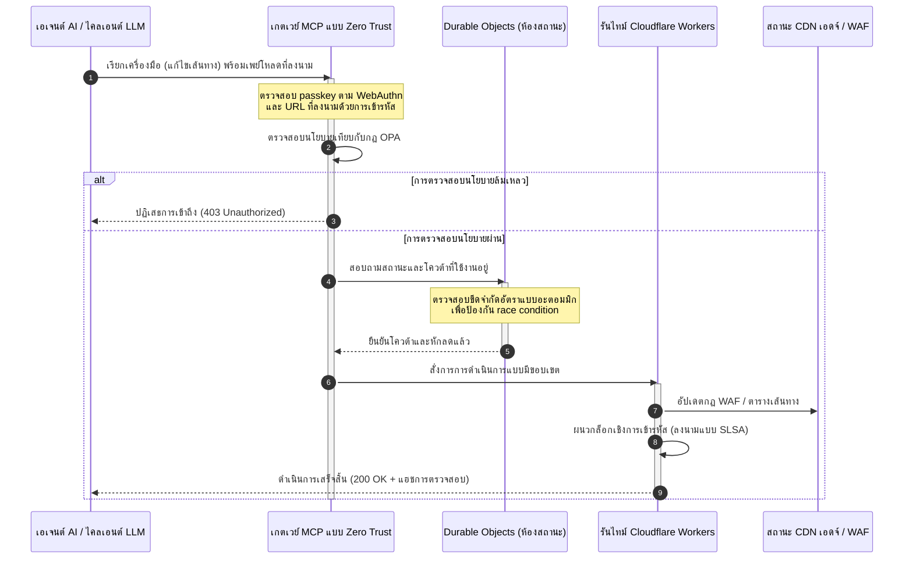

# CloudCDN: พิมพ์เขียวโอเพนซอร์สสำหรับเอดจ์ AI-เนทีฟในปี 2569

<!-- lead-start: manual -->
<aside class="post-lead" aria-label="สรุปบทความ">

<strong>สรุปสั้น</strong> เทคโนโลยีองค์กรในปี 2569 ถูกกำหนดโดยการบรรจบกันของการประมวลผลแบบเซิร์ฟเวอร์เลสที่กระจายทั่วโลกกับ AI เชิงเอเจนต์ CDN มาตรฐาน — ซึ่งสร้างขึ้นเพื่อแคชไฟล์สถิตและกำหนดเส้นทางทราฟฟิกพื้นฐาน — ล้าสมัยเชิงโครงสร้างในยุคของการจัดการข้อมูลเชิงรุกแบบเรียลไทม์ CloudCDN คือพิมพ์เขียวโอเพนซอร์สที่ปรับบทบาทของเอดจ์ให้เป็นระนาบควบคุมแบบแอ็กทีฟ: รันไทม์เซิร์ฟเวอร์เลส การประสานสถานะผ่าน Cloudflare Durable Objects และเกตเวย์ Model Context Protocol (MCP) แบบ Zero Trust ที่ให้เอเจนต์ AI อัตโนมัติดำเนินงานโครงสร้างพื้นฐานเว็บภายในกรอบปฏิบัติการที่มีขอบเขตและปลอดภัยด้วยการเข้ารหัส

<strong>ประเด็นสำคัญ</strong>

<ul class="post-lead-takeaways">
  <li><strong>จากแคชสถิตสู่ระนาบควบคุมที่มีขอบเขต</strong> CloudCDN ย้ายขอบเขตการปฏิบัติงานไปที่เอดจ์ เปลี่ยนโหนด CDN ให้เป็นประตูนโยบายแบบแอ็กทีฟที่ตัดสินใจด้านความปลอดภัย การกำหนดเส้นทาง และการควบคุมการเข้าถึงในระดับต่ำกว่ามิลลิวินาที</li>
  <li><strong>การประสานสถานะที่เอดจ์</strong> Cloudflare Durable Objects บังคับใช้การจำกัดอัตราแบบอะตอมมิกเรียลไทม์และการประสานสถานะทั่วโลก — ไม่มี race condition แบบกระจาย ไม่มีการละเมิดโควต้าเชิงระบบข้ามภูมิภาคเอดจ์</li>
  <li><strong>การจัดการโครงสร้างพื้นฐานเชิงเอเจนต์อย่างปลอดภัยผ่าน MCP</strong> เกตเวย์แบบ Zero Trust เปิดเผยเครื่องมือ MCP เฉพาะทาง 42 ตัว ให้เอเจนต์ AI ตรวจสอบ กำหนดค่า และดำเนินงานโครงสร้างพื้นฐานภายใต้ขอบเขตที่ลงนามด้วยการเข้ารหัส</li>
  <li><strong>ความปลอดภัยของห่วงโซ่อุปทานเป็นสิ่งส่งมอบของไปป์ไลน์</strong> แหล่งที่มาของบิลด์ระดับ SLSA Level 3 ผ่าน Sigstore/Cosign และการทดสอบหน่วย 3,185 รายการที่ความครอบคลุม 100% ในทุกรีลีส</li>
  <li><strong>หลักฐานระดับคณะกรรมการ ไม่ใช่แดชบอร์ด</strong> เทเลเมทรีจากเอดจ์แมปโดยตรงกับความรับผิดชอบของคณะกรรมการตาม DORA มาตรา 5 การรายงานความเสี่ยงตาม BCBS 239 และกฎเงินกองทุนความเสี่ยงด้านปฏิบัติการตาม Basel III</li>
</ul>

<strong>อ่านที่เกี่ยวข้อง:</strong> <a href="/2026-05-16-best-cloud-infrastructure-architecture-2026/">สถาปัตยกรรมโครงสร้างพื้นฐานคลาวด์ที่ดีที่สุดในปี 2569</a> · <a href="/2026-06-05-cloud-native-banking-index-dora-resilience-platform-engineering-2026/">ดัชนีธนาคารแบบ Cloud Native ในปี 2569</a> · <a href="/2026-06-03-agentic-ai-index-banks-autonomy-governance-auditability-2026/">ดัชนี AI เชิงเอเจนต์สำหรับธนาคารในปี 2569</a>

</aside>
<!-- lead-end -->

การถกเถียงเรื่อง CDN จบลงแล้ว เอดจ์ไม่ใช่แคชอีกต่อไป แต่คือระนาบควบคุมของซอฟต์แวร์ AI-เนทีฟ เมื่อเอเจนต์เรียกใช้เครื่องมือ ย้ายข้อมูล ล้างแคช ร้องขอ signed URLs และประสานเวิร์กโฟลว์ โมเดลเดิมที่อาศัยแดชบอร์ดทึบแสงและระนาบควบคุมที่เป็นกรรมสิทธิ์ก็เลิกเป็นเพียงความไม่สะดวก และกลายเป็นภาระความรับผิดเชิงกำกับดูแล CloudCDN เสนอโมเดลที่ต่างออกไป: แพลตฟอร์มเอดจ์ที่เปิด ตรวจสอบได้ และควบคุมโดยเอเจนต์ได้ ซึ่งปฏิบัติต่อความปลอดภัย การเข้าถึง สมรรถนะ และความสามารถในการตรวจสอบเป็นค่าเริ่มต้นที่บังคับใช้ได้ ไม่ใช่คำสัญญาของผู้ขาย

จุดอ้างอิงโอเพนซอร์สของบทความนี้คือ [cloudcdn.pro ⧉](https://github.com/sebastienrousseau/cloudcdn.pro "cloudcdn.pro") รีโปนี้คือ CDN แบบหลายเทนแนนต์ AI-เนทีฟ ที่อ่านได้ตั้งแต่ต้นจนจบและนำไปปรับใช้ได้อย่างอิสระ: TTFB ต่ำกว่า 100 มิลลิวินาทีทั่ว PoPs ของ Cloudflare การควบคุมด้วย MCP การจำกัดอัตราด้วย Durable Objects การเข้าถึงระดับ WCAG-AA, signed URLs, passkeys, SLSA Level 3 และการทดสอบ 3,185 รายการที่ความครอบคลุม 100%

---

> **สรุปสำหรับผู้บริหาร / ประเด็นสำคัญ**
>
> - **เอดจ์กลายเป็นขอบเขตการปฏิบัติงาน** CloudCDN เปลี่ยนโหนด CDN มาตรฐานให้เป็นประตูนโยบายแบบแอ็กทีฟที่ดำเนินการด้านความปลอดภัย การกำหนดเส้นทาง และการควบคุมการเข้าถึงในระดับต่ำกว่ามิลลิวินาที
> - **Durable Objects ทำให้การจำกัดอัตราเป็นแบบอะตอมมิก** การบังคับใช้โควต้าแบบเรียลไทม์ที่สอดคล้องกันทั่วโลกปิดช่องโหว่ race condition ที่ตัวจำกัดอัตราแบบ eventually consistent เปิดทิ้งไว้ให้ผู้โจมตีและเอเจนต์ที่ทำงานผิดปกติ
> - **เอเจนต์ดำเนินงานโครงสร้างพื้นฐานผ่านเครื่องมือ MCP ที่มีขอบเขต 42 ตัว** ทุกการเรียกใช้ถูกตรวจสอบกับ passkeys ตาม WebAuthn เพย์โหลดที่ลงนาม และนโยบาย OPA ก่อนการดำเนินการใด ๆ
> - **ห่วงโซ่อุปทานเป็นส่วนหนึ่งของผลิตภัณฑ์** แหล่งที่มาของบิลด์ระดับ SLSA Level 3 ผ่าน Sigstore/Cosign เชื่อมโยงทุกรีลีสกับซอร์สโค้ดที่ผ่านการตรวจสอบด้วยการเข้ารหัส
> - **เทเลเมทรีคือหลักฐานการปฏิบัติตามกฎ** การดำเนินงานที่เอดจ์แมปกับ DORA มาตรา 5, BCBS 239 และเงินกองทุนความเสี่ยงด้านปฏิบัติการตาม Basel III — โดยตรง ไม่ใช่ผ่านการรายงานย้อนหลัง
>
---

## ทำไมโปรเจกต์โอเพนซอร์สนี้จึงสำคัญในปี 2569

ไอทีองค์กรในปี 2569 ได้เคลื่อนจากการจัดเตรียมโครงสร้างพื้นฐานแบบสถิตไปสู่การจัดการข้อมูลแบบเรียลไทม์ที่ขับเคลื่อนด้วยเหตุการณ์ มีแรงผลักดันทางตลาดสองประการอยู่เบื้องหลังการเปลี่ยนแปลงนี้

ประการแรกคือการแพร่ขยายของ AI เชิงเอเจนต์ โมเดลอัตโนมัติและเอเจนต์ซอฟต์แวร์ทำงานปฏิบัติการที่ซับซ้อนแล้วในวันนี้ — การบรรเทาภัยคุกคามอัตโนมัติ การตัดสินใจกำหนดเส้นทาง การปรับสมดุลบัญชีแยกประเภทแบบเรียลไทม์ พวกมันไม่ใช้แดชบอร์ด พวกมันเรียกใช้เครื่องมือ

ประการที่สองคือการบังคับใช้อย่างจริงจังของ[กฎว่าด้วยความยืดหยุ่นในการดำเนินงานดิจิทัล (DORA) ⧉](https://eur-lex.europa.eu/legal-content/EN/TXT/?uri=CELEX%3A32022R2554 "กฎ (EU) 2022/2554 ว่าด้วยความยืดหยุ่นในการดำเนินงานดิจิทัลของภาคการเงิน") สถาบันการเงินไม่สามารถพึ่งพา CDN บุคคลที่สามที่ทึบแสงและเป็นกรรมสิทธิ์ได้อีกต่อไป หน่วยงานกำกับดูแลต้องการความสามารถในการมองเห็นห่วงโซ่อุปทานซอฟต์แวร์อย่างสมบูรณ์ ความสามารถในการออกจากผู้ให้บริการที่พิสูจน์ได้ และร่องรอยการตรวจสอบเชิงการเข้ารหัสที่แก้ไขไม่ได้

สถาปัตยกรรมเซิร์ฟเวอร์แบบรวมศูนย์สร้างค่าปรับด้านความหน่วงที่การจัดการแบบเรียลไทม์รับไม่ได้ CDN ที่เป็นกรรมสิทธิ์ทำงานเหมือนกล่องดำที่ทำให้สถาบันเผชิญการบุกรุกห่วงโซ่อุปทานซึ่งมองไม่เห็น และยิ่งไม่สามารถนำมาเป็นหลักฐานได้ CloudCDN ปิดช่องว่างนั้นด้วยพิมพ์เขียวโอเพนซอร์สที่โปร่งใสแบบ Zero Trust ซึ่งเปลี่ยนเอดจ์ให้เป็นระนาบควบคุมแบบแอ็กทีฟ สำหรับผู้บริหารเทคโนโลยี มันย้ายบทสนทนาจากต้นทุนของการปฏิบัติตามกฎไปสู่ Return on Resilience: เงินกองทุนที่ถูกรักษาไว้ด้วยไปป์ไลน์ปฏิบัติการอัตโนมัติที่พร้อมรับการตรวจสอบ

## มุมมองสถาปัตยกรรม

สถาปัตยกรรม CloudCDN จัดโครงสร้างเป็นห้าชั้น แทนที่มิดเดิลแวร์แบบรวมศูนย์ด้วยพื้นฐานเอดจ์เฉพาะที่ซึ่งมีสถานะ:

| ชั้น | การตัดสินใจเชิงการออกแบบ | ทำไมจึงสำคัญ | ความเสี่ยงหากจัดการผิดพลาด |
|---|---|---|---|
| **รันไทม์เอดจ์** | Cloudflare Workers และ Pages | ขจัดความหน่วงของ VM แบบรวมศูนย์ ดำเนินนโยบายระดับต่ำกว่ามิลลิวินาทีทั่วโลก | สมรรถนะที่ได้มาโดยไร้วินัยเชิงนโยบายสร้างความคลาดเคลื่อนแบบไร้ระเบียบที่เอดจ์ |
| **การประสานสถานะ** | Durable Objects | รับประกันความสอดคล้องแบบอะตอมมิกเรียลไทม์สำหรับขีดจำกัดอัตราและสถานะที่ใช้ร่วมกันข้ามภูมิภาค | race condition แบบกระจาย การละเมิดทรัพยากร API โควต้าขอบเขตที่ถูกข้าม |
| **อินเทอร์เฟซเอเจนต์** | เกตเวย์ MCP แบบ Zero Trust | เปิดเผยเครื่องมือ MCP เฉพาะทาง 42 ตัว ให้เอเจนต์ AI ดำเนินงานโครงสร้างพื้นฐานภายใต้ขอบเขตที่ปกครองได้ | การเรียกใช้เครื่องมือแบบไร้ขอบเขตและการเปลี่ยนค่ากำหนดโดยไม่ได้รับอนุญาต |
| **การควบคุมการเข้าถึง** | passkeys ตาม WebAuthn และ signed URLs | แทนที่รหัสผ่านแบบสถิตด้วยลายเซ็นเชิงการเข้ารหัสสำหรับการดำเนินงานที่ตรวจสอบได้ | การเปลี่ยนแปลงที่ระบุที่มาได้อ่อนแอ การขโมยข้อมูลรับรองที่นำไปสู่การเจาะขอบเขต |
| **ประตูคุณภาพ** | SLSA Level 3 และความครอบคลุมการทดสอบ 100% | พิสูจน์แหล่งที่มาของบิลด์เชิงคณิตศาสตร์ สกัดการแทรกดีเพนเดนซีที่เป็นอันตราย | โค้ดอันตรายถูกแทรกผ่านห่วงโซ่อุปทานซอฟต์แวร์ |

## สัญญาณเชิงปฏิบัติการที่ควรติดตาม

ความพร้อมด้านเอดจ์วัดได้ ต่อไปนี้คือตัวชี้วัดเชิงปริมาณที่แสดงความสามารถในการลงมือจริง ไม่ใช่เพียงเจตนา:

| สัญญาณ | ตัวชี้วัด / เกณฑ์อ้างอิง | การอ้างอิงเชิงกำกับดูแล | การนำไปใช้บนแพลตฟอร์ม |
|---|---|---|---|
| **เครื่องมือ MCP 42 ตัว** | จำนวนรีจิสทรีเครื่องมือที่มีขอบเขตสำหรับการจัดการอัตโนมัติ | COBIT 2019 (BAI06) | เกตเวย์ MCP ตรวจสอบลายเซ็นเอเจนต์เทียบกับนโยบาย OPA |
| **Durable Objects** | การบังคับใช้โควต้าแบบอะตอมมิกไร้การรั่วไหลในระดับต่ำกว่ามิลลิวินาที | DORA มาตรา 6 | Durable Objects ติดตามสถานะโควต้า API ระดับโลก |
| **passkeys และ signed URLs** | 100% ของเซสชันผู้ดูแลระบบยืนยันผ่าน FIDO2 WebAuthn | DORA มาตรา 30 | การตรวจสอบลายเซ็นเชิงการเข้ารหัสฝังอยู่ในเราเตอร์เอดจ์ |
| **SLSA Level 3** | แมนิเฟสต์บิลด์ที่ลงนามด้วยการเข้ารหัส (Sigstore) | DORA มาตรา 30 | ไปป์ไลน์ GitHub Actions สร้างเมทาดาทาบิลด์ที่ลงนาม |
| **การทดสอบหน่วย 3,185 รายการ** | ความครอบคลุม 100% ประตูกัน regression ในทุกรีลีส | NIST CSF 2.0 (PR.DS-01) | ไปป์ไลน์ CI หยุดการปรับใช้ทันทีเมื่อมีการทดสอบล้มเหลว |

## CDN กลายเป็นระนาบควบคุมแบบแอ็กทีฟ

CDN แบบดั้งเดิมถูกออกแบบรอบการเร่งความเร็วเนื้อหาสถิตแบบรับมือเฉย ๆ CloudCDN นิยามโมเดลใหม่ ด้วย Cloudflare Workers และ Durable Objects ที่ผสานเข้าด้วยกัน เอดจ์ทำหน้าที่เป็นประตูนโยบายแบบแอ็กทีฟที่มีสถานะ

เมื่อเอเจนต์ AI หรือกระบวนการอัตโนมัติร้องขอการเปลี่ยนค่ากำหนดโครงสร้างพื้นฐานหรือการปรับเส้นทาง มันไม่ได้คุยกับฐานข้อมูลรวมศูนย์ที่เปราะบาง คำขอจะถูกดักจับที่โหนดเอดจ์ที่ใกล้ที่สุดและถูกนำผ่านการตรวจสอบตัวตน นโยบาย และโควต้าก่อนการดำเนินการใด ๆ:

ทุกขั้นตอนในลำดับนั้นสร้างบันทึกที่ลงนามและระบุที่มาได้ นั่นคือความแตกต่างระหว่าง CDN ที่เร่งความเร็วเนื้อหากับระนาบควบคุมที่ปกครองได้

## ทำไมโอเพนซอร์สจึงเปลี่ยนโมเดลความไว้วางใจ

สำหรับประธานเจ้าหน้าที่ความปลอดภัยสารสนเทศ CDN ที่เป็นกรรมสิทธิ์และทึบแสงคือความเสี่ยงที่ทบต้น เครือข่ายเอดจ์แบบปิดซอร์สคือกล่องดำ: หากผู้ขายถูกบุกรุกจากภายใน ธนาคารจะมองไม่เห็นอะไรเลยจนกว่าการรั่วไหลจะถูกเปิดเผยต่อสาธารณะ

CloudCDN แทนที่ความไม่สมมาตรนั้นด้วยโมเดลความไว้วางใจแบบโอเพนซอร์สที่ตรวจสอบได้เต็มรูปแบบ สร้างบนกลไกสามประการ:

1. **แหล่งที่มาของบิลด์เชิงคณิตศาสตร์** ภายใต้ SLSA Level 3 ทุกรีลีสถูกเชื่อมโยงด้วยการเข้ารหัสกับรีโป GitHub แบบโอเพนซอร์สของมัน CISO สามารถพิสูจน์ได้ — เชิงคณิตศาสตร์ ไม่ใช่เชิงสัญญา — ว่าไบนารีที่รันบนโหนดเอดจ์ทั่วโลกของ Cloudflare มีซอร์สโค้ดที่ผ่านการตรวจสอบทุกบรรทัดอย่างแน่นอน
2. **การตรวจสอบความปลอดภัยสาธารณะอย่างต่อเนื่อง** ฐานโค้ดถูกตรวจด้วยการสแกนอัตโนมัติ การเปิดเผยช่องโหว่ต่อสาธารณะ และการตรวจสอบโค้ดโดยเพื่อนร่วมวิชาชีพ ความคลุมเครือไม่ใช่การควบคุม การตรวจทานต่างหากที่ใช่
3. **ไม่มีการผูกขาดผู้ขาย (DORA มาตรา 28)** DORA กำหนดให้ธนาคารพิสูจน์กลยุทธ์การออกจากผู้ให้บริการบุคคลที่สามที่สำคัญอย่างชัดเจนและผ่านการทดสอบ เนื่องจาก CloudCDN เป็นโอเพนซอร์สและสร้างบนพื้นฐานเซิร์ฟเวอร์เลสมาตรฐาน สถาบันจึงสามารถย้ายค่ากำหนดเอดจ์จาก Cloudflare ไปยังรันไทม์เซิร์ฟเวอร์เลสอื่นหรือคลัสเตอร์ Kubernetes ส่วนตัวได้ — และนำความสามารถนั้นเป็นหลักฐานต่อหน่วยงานกำกับดูแล

## รูปแบบเอดจ์ระดับธนาคาร

CloudCDN ถูกออกแบบให้ผ่านมาตรฐานการปฏิบัติตามกฎของภาคการเงินโลก โดยแมปการดำเนินงานทางเทคนิคที่เอดจ์เข้ากับกรอบที่ผู้กำกับดูแลตรวจสอบจริงโดยตรง:

- **การจัดการความเสี่ยงโมเดล ([US Fed SR 11-7 ⧉](https://www.federalreserve.gov/supervisionreg/srletters/sr1107.htm "แนวทางกำกับดูแลการจัดการความเสี่ยงโมเดล") / UK PRA SS1/23)** โมเดลอัตโนมัติที่ทำงานปฏิบัติการอยู่ภายใต้ธรรมาภิบาลความเสี่ยงโมเดล เกตเวย์ MCP ของ CloudCDN ปฏิบัติต่อเครื่องมือเชิงเอเจนต์เหมือนโมเดลเชิงปริมาณ: ขอบเขตนโยบายที่เข้มงวด การบันทึกแบบเรียลไทม์ และการตัดสินใจขั้นสุดท้ายโดยมนุษย์ภาคบังคับสำหรับการกระทำที่มีผลกระทบสูง
- **BCBS 239 (การรวบรวมข้อมูลความเสี่ยง)** ด้วยการจับ ติดป้าย และจัดโครงสร้างข้อมูลธุรกรรมที่เอดจ์ ตัวชี้วัดปฏิบัติการถูกสร้างขึ้นแบบเรียลไทม์ — ตรงตามข้อกำหนดของ BCBS 239 ด้านความสมบูรณ์ของข้อมูล ความทันเวลา และการสืบย้อนเชิงกำกับดูแล
- **DORA มาตรา 5 (ความรับผิดชอบของคณะกรรมการ)** คณะกรรมการแบกรับความรับผิดส่วนบุคคลขั้นสุดท้ายต่อความยืดหยุ่นในการดำเนินงาน CloudCDN แปลเทเลเมทรีจากเอดจ์เป็นหลักฐานเชิงปริมาณที่พิสูจน์ได้ ซึ่งกรรมการที่ไม่ใช่สายเทคนิคสามารถนำเข้าการตรวจสอบที่มีความรับผิดส่วนบุคคล
- **เงินกองทุนความเสี่ยงด้านปฏิบัติการตาม Basel III** ธนาคารดำรงเงินกองทุนตามกฎเพื่อรองรับความเสี่ยงด้านปฏิบัติการ การสลับระบบกู้คืนภัยพิบัติอัตโนมัติและแหล่งที่มาของบิลด์ระดับ SLSA Level 3 ลดโปรไฟล์ความเสี่ยงด้านปฏิบัติการของสถาบัน — รักษาเงินกองทุนไว้บนงบดุล ไม่ใช่แค่ผ่านการตรวจสอบ

## ความหมายแยกตามประเภทธนาคาร

### ธนาคารที่มีความสำคัญเชิงระบบระดับโลก (G-SIB)

G-SIB ประมวลผลปริมาณธุรกรรมมหาศาลข้ามหลายเขตอำนาจ ลำดับความสำคัญคือการแทนที่การควบคุมขอบเขตแบบเดิมที่กระจัดกระจายด้วยระนาบเอดจ์เดียวที่เป็นเอกภาพ การปรับใช้รูปแบบ CloudCDN ทำให้ G-SIB กำหนดมาตรฐานนโยบายความปลอดภัย เกตเวย์ API และธรรมาภิบาลเชิงเอเจนต์ทั่วโลกได้ — และสร้างไปป์ไลน์หลักฐานที่สอดคล้องกับ DORA เป็นผลพลอยได้จากการดำเนินงาน ไม่ใช่ความวุ่นวายรายไตรมาส

### ธนาคารธุรกรรมและธนาคารองค์กร

สำหรับธนาคารธุรกรรม ผลิตภัณฑ์ที่หันหน้าเข้าหาลูกค้าคือชุดรวมของความเร็วในการดำเนินการ ความปลอดภัย และความโปร่งใสของข้อมูล รูปแบบ CloudCDN ทำให้ธนาคารเหล่านี้เปิดแดชบอร์ด API ที่ปลอดภัยและบริการติดตามเงินสดแบบเรียลไทม์ให้เหรัญญิกองค์กรได้ — ท่าทีด้านเอดจ์ที่ยืดหยุ่นซึ่งปกป้องเงินฝากองค์กร

### ธนาคารระดับภูมิภาคและธนาคารขนาดเล็ก

ธนาคารระดับภูมิภาคเผชิญผู้คุกคามกลุ่มเดียวกับ G-SIB โดยไม่มีงบประมาณวิศวกรรมเท่ากัน พิมพ์เขียวเอดจ์ระดับธนาคารแบบโอเพนซอร์สให้การควบคุมพร้อมใช้ทันที: ความสอดคล้องเชิงกำกับดูแลแบบทันทีโดยไม่มีค่าใบอนุญาตกรรมสิทธิ์ และมีซอร์สโค้ดเป็นหลักฐาน

## คู่มือปฏิบัติสำหรับคณะกรรมการ

ความยืดหยุ่นในการดำเนินงานไม่ใช่ตัวชี้วัดไอทีหลังบ้านที่มองไม่เห็นอีกต่อไป แต่เป็นวาระสำคัญของห้องประชุมคณะกรรมการที่มาพร้อมความรับผิดส่วนบุคคล สถาบันที่รักษาความไว้วางใจของหน่วยงานกำกับดูแล ลูกค้า และผู้ถือหุ้นในปี 2569 ปฏิบัติต่อเทคโนโลยีเป็นสินทรัพย์ที่พิสูจน์ได้และสังเกตได้

แผนงานสำหรับผู้นำเทคโนโลยีอาวุโสนั้นสั้น:

1. **กำหนดให้หลักฐานเป็นผลิตภัณฑ์** จัดงบให้ไปป์ไลน์อัตโนมัติที่จัดทำเอกสารด้วยตัวเองที่เอดจ์ — หลักฐานที่เกิดจากการดำเนินงาน ไม่ใช่ถูกประกอบขึ้นเพื่อผู้ตรวจสอบ
2. **ย้ายไปสู่การควบคุมเอดจ์ที่มีสถานะ** ถอดการจำกัดอัตรา WAF และการยืนยันตัวตนออกจากเซิร์ฟเวอร์รวมศูนย์ไปไว้บนพื้นฐานเอดจ์แบบอะตอมมิก
3. **วางขอบเขตเชิงเอเจนต์ด้วยการเข้ารหัส** บังคับใช้เกตเวย์ MCP แบบ Zero Trust พร้อมการตรวจสอบ passkey และ OPA สำหรับทุกการเรียกใช้เครื่องมืออัตโนมัติ
4. **กำหนดให้มีการตรวจสอบบิลด์แบบโอเพนซอร์ส** ทำให้แหล่งที่มาของบิลด์ระดับ SLSA Level 3 เป็นเงื่อนไขของการปรับใช้ ไม่ใช่ความปรารถนา

## คำถามที่พบบ่อย

**CloudCDN พร้อมสำหรับการตรวจสอบตาม DORA หรือไม่**

พร้อม CloudCDN ถูกออกแบบให้ผลิตหลักฐานการปฏิบัติตามกฎอัตโนมัติที่แมปโดยตรงกับเทมเพลต ITS ของ Register of Information (RT.01 ถึง RT.15) และข้อสัญญาตาม DORA มาตรา 30

**ข้อได้เปรียบของการใช้ Durable Objects ในการจำกัดอัตราคืออะไร**

ตัวจำกัดอัตราแบบกระจายดั้งเดิมพึ่งพาความสอดคล้องแบบ eventual consistency ซึ่งทิ้งช่วงเวลาหน่วงให้ผู้โจมตีหรือเอเจนต์ที่ทำงานผิดปกติใช้ประโยชน์ได้ Durable Objects รับประกันความสอดคล้องแบบอะตอมมิกทันทีทั่วโลก ปิดช่องโหว่ race condition ได้ทั้งหมด

**อะไรทำให้ CloudCDN เป็น AI-เนทีฟ**

การดำเนินงานที่ควบคุมด้วย MCP และโมเดลการควบคุมที่ตระหนักถึงเอเจนต์ โครงสร้างพื้นฐานถูกดำเนินงานผ่านเครื่องมือที่ปกครองได้ 42 ตัว พร้อมตัวตนเชิงการเข้ารหัสและขอบเขตนโยบาย — ออกแบบสำหรับเวิร์กโฟลว์อัตโนมัติ ไม่ใช่เพียงแดชบอร์ดของมนุษย์

**โค้ดโอเพนซอร์สเพิ่มความเสี่ยงต่อช่องโหว่ zero-day หรือไม่**

ไม่ CDN ที่เป็นกรรมสิทธิ์แบบปิดซอร์สพึ่งพาความปลอดภัยผ่านความคลุมเครือ ฐานโค้ดของ CloudCDN ถูกทดสอบอัตโนมัติ ตรวจทานโดยสาธารณะ และตรวจสอบความถูกต้องตาม SLSA Level 3 อย่างต่อเนื่อง — เกณฑ์ความไว้วางใจที่สูงกว่าอย่างพิสูจน์ได้

## แหล่งอ้างอิง

- European Parliament and Council of the European Union, (2022). [กฎ (EU) 2022/2554 ว่าด้วยความยืดหยุ่นในการดำเนินงานดิจิทัลของภาคการเงิน (DORA) ⧉](https://eur-lex.europa.eu/legal-content/EN/TXT/?uri=CELEX%3A32022R2554 "กฎ (EU) 2022/2554 ว่าด้วยความยืดหยุ่นในการดำเนินงานดิจิทัลของภาคการเงิน (DORA)"). บรัสเซลส์: วารสารทางการของสหภาพยุโรป.
- Basel Committee on Banking Supervision (BCBS), (2013). [หลักการเพื่อการรวบรวมข้อมูลความเสี่ยงและการรายงานความเสี่ยงที่มีประสิทธิผล (BCBS 239) ⧉](https://www.bis.org/publ/bcbs239.htm "หลักการเพื่อการรวบรวมข้อมูลความเสี่ยงและการรายงานความเสี่ยงที่มีประสิทธิผล (BCBS 239)"). บาเซิล: ธนาคารเพื่อการชำระหนี้ระหว่างประเทศ.
- Board of Governors of the Federal Reserve System, (2011). [แนวทางกำกับดูแลการจัดการความเสี่ยงโมเดล (SR Letter 11-7) ⧉](https://www.federalreserve.gov/supervisionreg/srletters/sr1107.htm "แนวทางกำกับดูแลการจัดการความเสี่ยงโมเดล (SR Letter 11-7)"). วอชิงตัน ดี.ซี.: ธนาคารกลางสหรัฐ.
- Cloudflare, (2026). [เอกสาร Durable Objects: การประสานสถานะที่เอดจ์ ⧉](https://developers.cloudflare.com/durable-objects/ "เอกสาร Durable Objects"). ซานฟรานซิสโก: Cloudflare.
- Cloudflare, (2026). [การสร้างเอเจนต์ AI ด้วย MCP การพิสูจน์ตัวตน และ Durable Objects ⧉](https://blog.cloudflare.com/building-ai-agents-with-mcp-authn-authz-and-durable-objects/ "การสร้างเอเจนต์ AI ด้วย MCP การพิสูจน์ตัวตน และ Durable Objects").
- GitHub, (2026). [รีโป cloudcdn.pro ⧉](https://github.com/sebastienrousseau/cloudcdn.pro "รีโป cloudcdn.pro").

<!-- enrich-start -->
<aside class="author-card" aria-label="เกี่ยวกับผู้เขียน"><strong class="author-card-name"><a href="/about/index.html">Sebastien Rousseau</a></strong>นักเทคโนโลยีธนาคารอาวุโสที่เขียนเกี่ยวกับ AI ประยุกต์ โครงสร้างพื้นฐานการชำระเงิน เงินที่ผ่านการทำโทเคน ISO 20022 ความปลอดภัยหลังควอนตัม บริการทางการเงินแบบ cloud-native โครงสร้างพื้นฐานโอเพนซอร์ส และตลาดดิจิทัลที่อยู่ภายใต้การกำกับดูแลมากกว่า 20 ปีที่ HSBC Commercial &amp; Investment Bank, PayPal, Barclays, Shazam, AKQA, Virgin Group. <a href="/about/index.html">โปรไฟล์เต็ม</a> &middot; <a href="https://www.linkedin.com/in/sebastienrousseau/" rel="external noopener">LinkedIn</a> &middot; <a href="https://github.com/sebastienrousseau" rel="external noopener">GitHub</a></aside>

ตรวจสอบล่าสุด <time datetime="2026-06-11">2026-06-11</time>.

<!-- enrich-end -->
