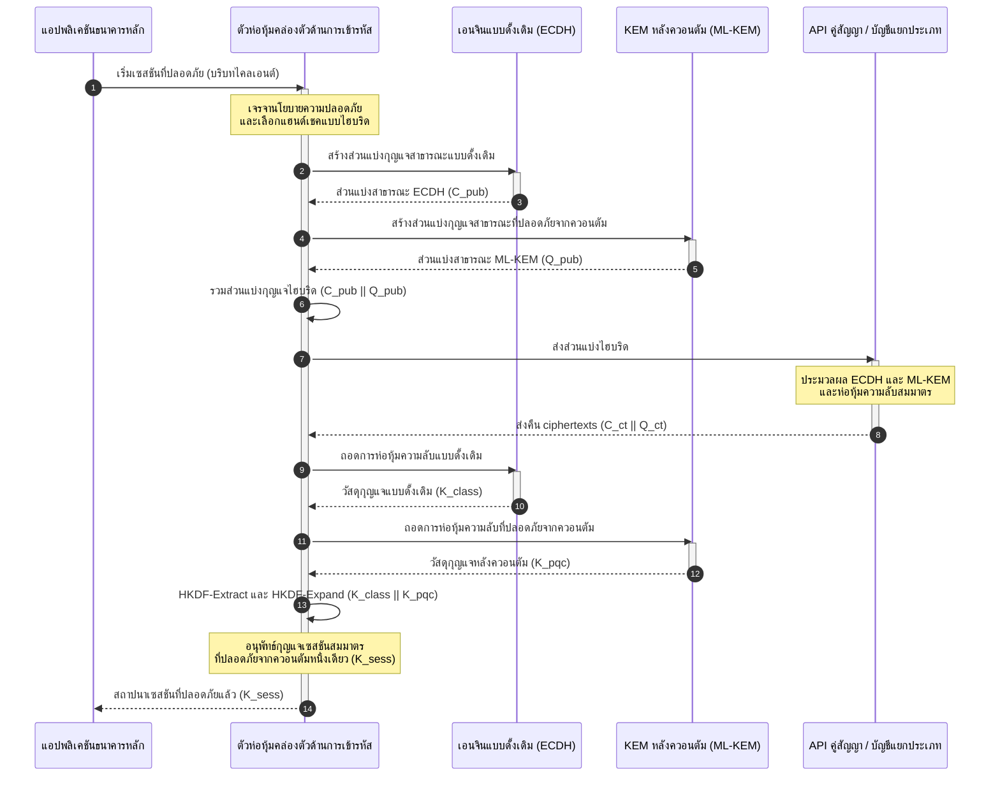

# KyberLib และการย้ายระบบหลังควอนตัมของธนาคารปี 2569: จากมาตรฐานสู่โค้ด

<!-- lead-start: manual -->
<aside class="post-lead" aria-label="สรุปบทความ">

<strong>สรุปสั้น</strong> โครงสร้างพื้นฐานธนาคารในปี 2569 เผชิญภัยคุกคามเชิงระบบที่มีจุดสิ้นสุดที่รู้แน่ชัด: การคำนวณระดับควอนตัมจะทำลายการแลกเปลี่ยนกุญแจ RSA และ ECC ที่ปกป้องทราฟฟิกระหว่างทางในปัจจุบัน มาตรฐานระดับรัฐบาลกลางและเอกสารนโยบายของผู้กำกับดูแลได้สร้างความตระหนักรู้แล้ว แต่การลงมือทางเทคนิคยังคงแยกส่วน <a href="https://github.com/sebastienrousseau/kyberlib">KyberLib</a> คือพิมพ์เขียวทางวิศวกรรมแบบโอเพนซอร์สที่ย้ายเรื่องราวหลังควอนตัมไปสู่โค้ด Rust ที่เป็นรูปธรรมและปลอดภัยต่อหน่วยความจำ — ดำเนินการ ML-KEM ตามมาตรฐาน NIST (FIPS 203) เบื้องหลังขอบเขตนามธรรมที่คล่องตัวด้านการเข้ารหัส เพื่อให้สถาบันยกระดับความปลอดภัยของชั้นขนส่งและการห่อหุ้มกุญแจได้ก่อนที่การโจมตีแบบ "Store Now, Decrypt Later" จะไปถึงคลังข้อมูลของตน

<strong>ประเด็นสำคัญ</strong>

<ul class="post-lead-takeaways">
  <li><strong>จากนโยบายสู่โค้ดที่ตรวจสอบได้</strong> KyberLib ย้ายการเข้ารหัสหลังควอนตัมจากโรดแมปเชิงกลยุทธ์ที่เป็นนามธรรม ไปสู่การพัฒนา Rust ที่เป็นรูปธรรม ประสิทธิภาพสูง และตรวจสอบได้</li>
  <li><strong>การดำเนินการ ML-KEM ตามมาตรฐาน FIPS 203</strong> ไลบรารีดำเนินการ ML-KEM — อัลกอริทึมการสถาปนากุญแจที่สรุปขั้นสุดท้ายภายใต้ NIST FIPS 203 — รักษาความสอดคล้องให้ตรงกับความคาดหวังด้านกำกับดูแลทั่วโลก</li>
  <li><strong>ความคล่องตัวด้านการเข้ารหัสโดยการออกแบบ</strong> ขอบเขตนามธรรมที่นิ่งช่วยให้แอปพลิเคชันธนาคารสับเปลี่ยน primitives การเข้ารหัสได้ โดยไม่ต้องเขียนแอปพลิเคชันใหม่ซึ่งมีต้นทุนสูงและเสี่ยงต่อข้อผิดพลาด</li>
  <li><strong>ความปลอดภัยหน่วยความจำด้วย Rust</strong> กฎความเป็นเจ้าของ ณ เวลาคอมไพล์ขจัด buffer overflow และหน่วยความจำรั่วที่รุมเร้าไลบรารีเข้ารหัสรุ่นเก่าที่เขียนด้วย C โดยคงความเร็วระดับ zero-cost abstraction</li>
  <li><strong>การบรรเทาความรับผิดของกรรมการ</strong> หลักฐานการย้ายระบบที่สังเกตและทดสอบได้ มอบบันทึก "ขั้นตอนที่สมเหตุสมผล" ซึ่งการตรวจสอบความรับผิดส่วนบุคคลตาม DORA มาตรา 5 เรียกร้องจากคณะกรรมการ</li>
</ul>

<strong>อ่านเพิ่มเติม</strong> <a href="/2026-05-18-quantum-cryptography-standards-developments-2026/">มาตรฐานการเข้ารหัสควอนตัม 2026</a> · <a href="/2026-05-28-dora-ai-act-data-sovereignty-banking-compliance-stack-2026/">สแต็คการปฏิบัติตามกฎ DORA + กฎหมาย AI</a> · <a href="/2026-05-20-cloud-native-banking-financial-institutions-2026/">ธนาคารแบบ cloud-native</a>

</aside>
<!-- lead-end -->

การย้ายระบบหลังควอนตัมหยุดเป็นแบบฝึกหัดการวางแผนแล้ว ในปี 2569 มันคือข้อกำหนดเชิงปฏิบัติการที่มีผลจริง และช่องว่างระหว่างเจตนารมณ์ด้านกำกับดูแลกับการลงมือทางวิศวกรรมคือจุดที่ความเสี่ยงตั้งอยู่ในขณะนี้ [KyberLib ⧉](https://github.com/sebastienrousseau/kyberlib "kyberlib") ปิดช่องว่างนั้นบางส่วน: ไลบรารี Rust ที่มุ่งใช้งานจริงและปลอดภัยต่อหน่วยความจำ ซึ่งดำเนินการ ML-KEM ตามพารามิเตอร์ FIPS 203 ฉบับสมบูรณ์ และห่อหุ้มไว้ในขอบเขตที่คล่องตัวด้านการเข้ารหัส ซึ่งระบบธุรกรรมของธนาคารต้องการอย่างแท้จริง

---

> **สรุปสำหรับผู้บริหาร / ประเด็นสำคัญ**
>
> - **ภัยคุกคามดำเนินการอยู่แล้ว** ฝ่ายตรงข้ามกำลังเก็บเกี่ยวข้อมูลแบบ "Store Now, Decrypt Later" ในวันนี้ ความลับของข้อมูลจะล้มเหลวย้อนหลังในวันที่คอมพิวเตอร์ควอนตัมที่มีนัยสำคัญทางการเข้ารหัสมาถึง
> - **มาตรฐานสรุปขั้นสุดท้ายแล้ว** NIST FIPS 203 (ML-KEM) และ FIPS 204 (ML-DSA) ให้เกณฑ์มาตรฐานที่ชัดเจนและทดสอบได้แก่คณะกรรมการตรวจสอบ — ข้ออ้างว่า "กำลังรอมาตรฐาน" ใช้ไม่ได้อีกต่อไป
> - **KyberLib คือพิมพ์เขียวทางวิศวกรรม** Rust ที่ปลอดภัยต่อหน่วยความจำ การคอมไพล์ `no_std` สำหรับ HSM และสมาร์ตการ์ด และรูปแบบแฮนด์เชคแบบไฮบริดที่รักษาความเข้ากันได้กับระบบแบบดั้งเดิม
> - **ความคล่องตัวด้านการเข้ารหัสคือเป้าหมายที่ยั่งยืน** ขอบเขตนามธรรมที่นิ่งช่วยให้ primitives เปลี่ยนได้โดยไม่ต้องเขียนแอปพลิเคชันใหม่ — บทเรียนที่อยู่ยาวนานกว่าอัลกอริทึมใดอัลกอริทึมหนึ่ง
> - **คณะกรรมการแบกรับความรับผิด** DORA มาตรา 5 วางความรับผิดชอบส่วนบุคคลไว้ที่กรรมการ โค้ดการย้ายระบบที่ตรวจสอบและสังเกตได้คือหลักฐานที่ตอบโจทย์ข้อนั้น
>
---

## ทำไมโครงการโอเพนซอร์สนี้จึงสำคัญในปี 2569

ขณะที่การเข้ารหัสแบบอสมมาตรกำลังเข้าใกล้จุดล้าสมัย ภัยคุกคามไม่ได้รอให้คอมพิวเตอร์ควอนตัมที่มีนัยสำคัญทางการเข้ารหัสถูกสร้างขึ้นก่อน ฝ่ายตรงข้ามกำลังดำเนินการโจมตีแบบ **"Store Now, Decrypt Later" (SNDL)** อยู่ในขณะนี้ — เก็บเกี่ยวสตรีมข้อมูลเข้ารหัสระหว่างทางของธุรกรรมธนาคารองค์กร ความลับทางการค้า และการสื่อสารของสถาบัน โดยตั้งใจจะถอดรหัสเมื่อขีดความสามารถควอนตัมสุกงอม สำหรับธนาคาร แฮนด์เชคแบบดั้งเดิมทุกครั้งบนสายในวันนี้ คือการละเมิดความลับของข้อมูลที่มีกำหนดระเบิดล่าช้า

ผู้กำกับดูแลได้ตอบสนองด้วยพันธกรณีที่เป็นรูปธรรม:

1. **DORA มาตรา 6 (การบริหารความเสี่ยง ICT)** กำหนดให้สถาบันต้องทำแผนผัง ระบุ และบรรเทาช่องโหว่ทั่วทั้งสินทรัพย์การเข้ารหัสของตน — รวมถึงการแลกเปลี่ยนกุญแจแบบอสมมาตรที่ฝังอยู่ใน middleware ซึ่งไม่มีใครเคยจัดทำคลังสินทรัพย์
2. **NIST FIPS 203 และ 204** สถาปนามาตรฐานหลังควอนตัมอย่างเป็นทางการสำหรับการห่อหุ้มกุญแจ (ML-KEM) และลายเซ็นดิจิทัล (ML-DSA) มอบเกณฑ์มาตรฐานแก่คณะกรรมการตรวจสอบ เพื่อใช้วัดความคืบหน้าของการย้ายระบบ

การดำเนินการย้ายระบบนี้โดยไม่กระทบการดำเนินงานจริง จำเป็นต้องก้าวข้ามเอกสารนโยบายไปสู่ **โครงสร้างพื้นฐานการเข้ารหัสโอเพนซอร์สที่ตรวจสอบได้** [KyberLib ⧉](https://github.com/sebastienrousseau/kyberlib "kyberlib") ส่งมอบสิ่งนั้นอย่างตรงจุด: ไลบรารี Rust ที่ปลอดภัยต่อหน่วยความจำและสอดคล้องกับ FIPS 203 ซึ่งเปลี่ยนการเปลี่ยนผ่านหลังควอนตัมให้เป็นสายงานวิศวกรรมที่วัดผลและพิสูจน์ได้ — และย้ายบทสนทนาการลงทุนเทคโนโลยีไปสู่ผลตอบแทนด้านความยืดหยุ่น (Return on Resilience) ที่จับต้องได้

## มุมมองด้านสถาปัตยกรรม

KyberLib วางตัวอยู่เบื้องหลังขอบเขต API ที่นิ่ง ป้องกันแอปพลิเคชันธุรกรรมหลักของธนาคารจากการเปลี่ยนแปลงใน primitives การเข้ารหัสระดับล่าง

| ชั้น | การตัดสินใจออกแบบ | ทำไมจึงสำคัญ | ความเสี่ยงหากจัดการพลาด |
|---|---|---|---|
| **Primitive** | การห่อหุ้มกุญแจ ML-KEM ตาม FIPS 203 | แทนที่การแลกเปลี่ยนกุญแจ Diffie-Hellman และ RSA แบบดั้งเดิมด้วยโครงสร้างฐาน lattice | ความไม่สอดคล้องกับพารามิเตอร์ FIPS 203 ฉบับสมบูรณ์ นำไปสู่การตรวจสอบการปฏิบัติตามกฎที่ไม่ผ่าน |
| **ภาษา** | การพัฒนาด้วย Rust ที่ปลอดภัยต่อหน่วยความจำ | ขจัดช่องโหว่หน่วยความจำเสียหาย (buffer overflow, use-after-free) ที่ฝังรากใน C/C++ | dependency ขยายตัวจนบั่นทอนความสมบูรณ์ของห่วงโซ่การ build |
| **ชั้นนามธรรม** | ขอบเขตคล่องตัวด้านการเข้ารหัสที่นิ่ง | แอปพลิเคชันสลับอัลกอริทึมเบื้องหลังอินเทอร์เฟซเดียวเมื่อมาตรฐานพัฒนาไป | primitives ที่ฮาร์ดโค้ดบังคับให้ต้องเขียนใหม่ด้วยมือในทุกการย้ายระบบในอนาคต |
| **การติดตั้งใช้งาน** | แฮนด์เชคการเข้ารหัสแบบไฮบริด | ผสาน KEM หลังควอนตัมกับอัลกอริทึมแบบดั้งเดิมในซองห่อสองชั้น | สูญเสียความเข้ากันได้กับระบบเดิม หรือการตั้งค่าเลื่อนไหลอย่างเงียบ ๆ |
| **การรับประกัน** | ที่มาระดับ SLSA Level 3 และการทดสอบที่ตรวจสอบได้ | รับประกันแหล่งกำเนิดและที่มาของโค้ด ตัวอย่างตรวจสอบได้ทีละบรรทัด | ละครความปลอดภัย — ไลบรารีกล่องดำที่ข้อผิดพลาดในการพัฒนาโผล่ในระบบจริง |

## สัญญาณเชิงปฏิบัติการที่ควรติดตาม

การพิสูจน์การปฏิบัติตามข้อกำหนดหลังควอนตัมต่อคณะกรรมการกำกับดูแลและผู้กำกับดูแล หมายถึงการติดตามตัวชี้วัดที่เฉพาะเจาะจงและวัดเป็นตัวเลขได้:

| สัญญาณ | ตัวชี้วัด | อ้างอิงด้านกำกับดูแล | การติดตั้งบนแพลตฟอร์ม |
|---|---|---|---|
| **ความสอดคล้องกับ FIPS 203 ML-KEM** | การปฏิบัติตามพารามิเตอร์ฉบับสมบูรณ์ 100% (ML-KEM-512/768/1024) | NIST FIPS 203 | การเข้ารหัสฐาน lattice ที่ผ่านการตรวจสอบพารามิเตอร์ คอมไพล์อยู่ภายในโมดูล KyberLib |
| **คลังสินทรัพย์การเข้ารหัส** | คลังสินทรัพย์ที่ครบถ้วนของการใช้การแลกเปลี่ยนกุญแจแบบอสมมาตรทั่วทุกระบบ | NIST SP 1800-38 | เอเจนต์สแกนอัตโนมัติที่บันทึก cipher suites ที่ใช้งานอยู่ลงทะเบียนกลาง |
| **การแลกเปลี่ยนกุญแจแบบไฮบริด** | สัดส่วนของแฮนด์เชคชั้นขนส่งที่ดำเนินการในซองห่อแบบไฮบริด | DORA มาตรา 6 | พร็อกซีเครือข่ายที่ห่อแฮนด์เชค TLS 1.3 แบบดั้งเดิมด้วยการห่อหุ้ม PQC |
| **การคอมไพล์ `no_std`** | ความสามารถในการคอมไพล์โดยไม่ใช้ standard library ของ Rust สำหรับเป้าหมายที่จำกัดทรัพยากร | DORA มาตรา 30 | การคอมไพล์ `no_std` แบบมีเงื่อนไขใน KyberLib สำหรับ Hardware Security Modules |
| **ดัชนีความคล่องตัวด้านการเข้ารหัส** | เวลาเป็นนาทีในการสับเปลี่ยน primitive การเข้ารหัสทั่ว API gateway | UK PRA SS1/23 | ทะเบียนกำหนดเส้นทางแบบนามธรรมที่จัดสรรอัลกอริทึมผ่านตัวแปร runtime |

## ทำไม Rust จึงสำคัญสำหรับการเข้ารหัสหลังควอนตัม

การพัฒนาอัลกอริทึมหลังควอนตัมอย่าง ML-KEM ต้องอาศัยการดำเนินการทางคณิตศาสตร์ระดับล่างที่ซับซ้อนบน polynomial rings ในอดีต การรันการดำเนินการเหล่านั้นที่ความเร็วระดับใช้งานจริงหมายถึง C/C++ หรือ assembly ที่เขียนด้วยมือ — พื้นผิวการโจมตีขนาดใหญ่สำหรับหน่วยความจำเสียหาย ในโค้ดที่ธนาคารผิดพลาดได้น้อยที่สุดพอดี

Rust เปลี่ยนท่าทีด้านความปลอดภัยของวิศวกรรมการเข้ารหัสในสามทางที่เป็นรูปธรรม:

1. **ความปลอดภัยหน่วยความจำ ณ เวลาคอมไพล์** โมเดลความเป็นเจ้าของของ Rust รับประกันว่า buffer overflow, double free และ use-after-free ถูกป้องกันตั้งแต่เวลาคอมไพล์ เรื่องนี้สำคัญอย่างยิ่งสำหรับไลบรารีหลังควอนตัม ซึ่งขนาดกุญแจและ ciphertext ใหญ่กว่าคู่เทียบแบบดั้งเดิมอย่างมีนัยสำคัญ
2. **abstractions แบบ deterministic ที่ไร้ต้นทุน** Rust คอมไพล์เป็นโค้ดเครื่องเนทีฟโดยไม่มี garbage collector ความเร็วในการประมวลผลและรอยเท้าหน่วยความจำจึงเทียบเท่าหรือเหนือกว่าไลบรารีฐาน C โดยยังคงความปลอดภัยไว้
3. **ความเข้ากันได้กับ `no_std`** KyberLib คอมไพล์ได้โดยไม่ใช้ standard library ของ Rust จึงรันในสภาพแวดล้อม bare-metal ที่จำกัดทรัพยากรได้ — รวมถึง Hardware Security Modules และสมาร์ตการ์ด — เก็บการเข้ารหัสระดับธนาคารไว้ภายในขอบเขตความปลอดภัยทางกายภาพ

## การออกแบบสถาปัตยกรรมที่คล่องตัวด้านการเข้ารหัส

โหมดความล้มเหลวคลาสสิกในการย้ายระบบการเข้ารหัสคือการฮาร์ดโค้ด: สมมติฐานเฉพาะอัลกอริทึมที่ฝังตรงในตรรกะแอปพลิเคชัน และถูกค้นพบใหม่อย่างเจ็บปวดทุกครั้งที่เปลี่ยนผ่าน เป้าหมายที่ยั่งยืนสำหรับปี 2569 คือ **ความคล่องตัวด้านการเข้ารหัส (crypto-agility)** — ชั้นนามธรรมที่ปฏิบัติต่ออัลกอริทึมเป็นโมดูลที่สับเปลี่ยนได้เบื้องหลังอินเทอร์เฟซที่นิ่ง เพื่อให้การย้ายระบบครั้งถัดไปเป็นเพียงการเปลี่ยนการตั้งค่า ไม่ใช่การเขียนระบบใหม่ทั้งองค์กร

ลำดับด้านล่างแสดงให้เห็นว่าตัวห่อหุ้มคล่องตัวด้านการเข้ารหัสของ KyberLib ประสานแฮนด์เชคแลกเปลี่ยนกุญแจแบบไฮบริด (ดั้งเดิมบวกหลังควอนตัม) อย่างไร:

ซองห่อแบบไฮบริดคือรายละเอียดที่สำคัญเชิงปฏิบัติการ จนกว่า primitives หลังควอนตัมจะสะสมการพิสูจน์ในระบบจริงมาหลายปี กุญแจเซสชันจะอนุพัทธ์จากทั้งความลับแบบดั้งเดิมและความลับหลังควอนตัม: ผู้โจมตีต้องทำลายทั้ง ECDH **และ** ML-KEM จึงจะกู้คืนช่องสัญญาณได้ คู่สัญญาที่ยังไม่ย้ายระบบยังทำงานต่อได้ ส่วนคู่สัญญาที่ย้ายแล้วได้รับการปกป้องฐาน lattice ทันที

## เพลย์บุ๊กสำหรับห้องประชุมคณะกรรมการ

ความปลอดภัยหลังควอนตัมไม่ใช่เรื่องการเข้ารหัสของหน่วยงานหลังบ้าน แต่เป็นประเด็นกำกับดูแลระดับคณะกรรมการที่มีผลส่วนบุคคล ผู้บริหารระดับสูงควรกำหนดกรอบการย้ายระบบผ่านความรับผิดชอบในฐานะผู้มีหน้าที่ดูแลผลประโยชน์:

- **DORA มาตรา 5 (การกำกับดูแลและการจัดองค์กร)** วางความรับผิดชอบส่วนบุคคลด้านความปลอดภัย ICT ไว้ที่คณะกรรมการบริษัท การทดสอบแบบโอเพนซอร์สที่สังเกตได้คือหลักฐานตรงที่การตรวจสอบความรับผิดส่วนบุคคลเรียกร้อง — "เราเลือกการพัฒนา FIPS 203 ที่ตรวจสอบได้ และนี่คือผลการรันทดสอบความสอดคล้อง" เป็นคำตอบที่ปกป้องได้ ส่วน "ผู้ขายของเรายืนยันกับเราแล้ว" ไม่ใช่
- **การบริหารความเสี่ยงแบบจำลอง (US Fed SR 11-7 / UK PRA SS1/23)** บังคับใช้กับสถาปัตยกรรมตัวห่อหุ้มการเข้ารหัสไม่ต่างจากแบบจำลองการตั้งราคา ชั้นนามธรรมควรผ่านการตรวจสอบความถูกต้องของ MRM รวมถึงประสิทธิภาพภายใต้สถานการณ์การหยุดชะงักขั้นรุนแรง
- **เงินกองทุนความเสี่ยงด้านปฏิบัติการตาม Basel III** ให้รางวัลแก่ความสมบูรณ์ของการควบคุมที่พิสูจน์ได้ แฮนด์เชคไฮบริดที่ผ่านการทดสอบลดโปรไฟล์ความเสี่ยงด้านปฏิบัติการระยะยาวของสถาบัน บีบส่วนเพิ่มเงินกองทุนให้แคบลง และปลดปล่อยพื้นที่งบดุลให้ฝ่ายบริหารเงินนำไปใช้เชิงรุก

## ความหมายตามประเภทธนาคาร

### ธนาคารที่มีความสำคัญเชิงระบบระดับโลก (G-SIBs)

G-SIB ดำเนินระบบธุรกรรมที่หนักไปด้วยระบบเดิม ข้อจำกัดที่ผูกมัดจึงคือการค้นหา: ต้องรู้ว่าการแลกเปลี่ยนกุญแจแบบอสมมาตรเกิดขึ้นที่ใดจริง ๆ คลังสินทรัพย์การเข้ารหัสแบบต่อเนื่องภายใต้แนวทาง NIST SP 1800-38 ต้องมาก่อน จากนั้น KyberLib จึงมอบไลบรารีมาตรฐานที่ปลอดภัยต่อหน่วยความจำ สำหรับดำเนินการห่อหุ้มกุญแจหลังควอนตัมทั่วทุกโหนดยุคใหม่ที่คลังสินทรัพย์ค้นพบ

### ธนาคารธุรกรรมและธนาคารองค์กร

ความลับของข้อมูลทั่วรางการชำระเงินคือหัวใจของแฟรนไชส์ เนื่องจาก KyberLib คอมไพล์สู่เป้าหมาย `no_std` แบบ bare-metal ได้ ธนาคารธุรกรรมจึงติดตั้งแฮนด์เชคหลังควอนตัมเข้าไปในฮาร์ดแวร์กำหนดเส้นทางการชำระเงินและบริหารสภาพคล่องที่ขอบเครือข่ายได้โดยตรง — ไม่ใช่เพียงในชั้นแอปพลิเคชัน

### ธนาคารระดับภูมิภาคและธนาคารขนาดเล็ก

สถาบันระดับภูมิภาคเผชิญการเก็บเกี่ยวข้อมูลที่รัฐหนุนหลังแบบเดียวกัน โดยไม่มีงบวิจัยระดับ G-SIB การพัฒนา Rust แบบโอเพนซอร์สที่ตรวจสอบได้ มอบเส้นทางสำเร็จรูปสู่ความสอดคล้องกับ NIST FIPS 203 ได้ทันที โดยไม่ต้องเจรจาโรดแมปกล่องดำของผู้ขาย

## จากโรดแมปสู่โค้ดที่คอมไพล์ได้

การเปลี่ยนผ่านหลังควอนตัมคืองานวิศวกรรมที่ดำเนินอยู่จริง และสถาบันที่รักษาความไว้วางใจของผู้กำกับดูแล คู่สัญญา และผู้บริหารเงินขององค์กรไว้ได้ตลอดปี 2569 คือสถาบันที่ย้ายจากโรดแมปนามธรรมไปสู่โค้ดที่สังเกตได้และคอมไพล์ได้ อาณัติของผู้บริหารตามมาโดยตรง: ตรวจสอบจุดแลกเปลี่ยนกุญแจของระบบเดิม ติดตั้งแฮนด์เชคไฮบริดบนช่องทางที่มีมูลค่าสูงสุด และสร้างขอบเขตนามธรรมที่นิ่งซึ่งทำให้การสับเปลี่ยน primitive ทุกครั้งในอนาคตเป็นเรื่องปกติ KyberLib ทำให้แต่ละขั้นตอนเหล่านั้นเป็นขีดความสามารถเชิงปฏิบัติการที่วัดได้ ไม่ใช่คำมั่นบนสไลด์

## คำถามที่ถามบ่อย

**KyberLib สอดคล้องกับมาตรฐาน NIST ฉบับสมบูรณ์หรือไม่?**

สอดคล้อง KyberLib ออกแบบรอบพารามิเตอร์ของ ML-KEM ตามที่สรุปขั้นสุดท้ายใน FIPS 203 ทำให้ไลบรารีที่คอมไพล์แล้วสอดคล้องกับความคาดหวังด้านกำกับดูแลระดับรัฐบาลกลางและระดับโลก

**ไลบรารีหลังควอนตัมต้องการฮาร์ดแวร์เฉพาะทางหรือไม่?**

ไม่ การพัฒนา Rust ของ KyberLib คอมไพล์สู่สถาปัตยกรรมระบบมาตรฐาน ความสามารถ `no_std` ยังช่วยให้รันบน Hardware Security Modules และสมาร์ตการ์ดเฉพาะทาง ในจุดที่ต้องการการเก็บรักษากุญแจทางกายภาพ

**"Store Now, Decrypt Later" กระทบการปฏิบัติตามกฎในปัจจุบันอย่างไร?**

หากชั้นขนส่งพึ่งพา RSA หรือ ECC แบบดั้งเดิม ฝ่ายตรงข้ามสามารถเก็บเกี่ยวทราฟฟิกได้ในวันนี้และถอดรหัสเมื่อขีดความสามารถควอนตัมสุกงอม การแลกเปลี่ยนกุญแจแบบไฮบริดที่ติดตั้งตอนนี้ เก็บข้อมูลที่ถูกดักจับไว้เบื้องหลังการปกป้องฐาน lattice

**ทำไมจึงใช้แฮนด์เชคไฮบริด แทนที่จะย้ายไปใช้ primitives หลังควอนตัมโดยตรง?**

ซองห่อแบบไฮบริดอนุพัทธ์กุญแจเซสชันจากทั้งความลับแบบดั้งเดิมและความลับหลังควอนตัม ความปลอดภัยจึงคงอยู่เว้นแต่ทั้งสองจะถูกทำลาย แนวทางนี้รักษาความเข้ากันได้กับคู่สัญญาที่ยังไม่ย้ายระบบ ระหว่างที่ primitives ใหม่สะสมการพิสูจน์ในระบบจริง

## อ้างอิง

- National Institute of Standards and Technology, (2024). [FIPS 203: Module-Lattice-Based Key-Encapsulation Mechanism Standard ⧉](https://www.nist.gov/news-events/news/2024/08/nist-releases-first-3-finalized-post-quantum-encryption-standards "ประกาศ NIST FIPS 203").
- Board of Governors of the Federal Reserve System, (2011). [Supervisory Guidance on Model Risk Management (SR Letter 11-7) ⧉](https://www.federalreserve.gov/supervisionreg/srletters/sr1107.htm "Federal Reserve SR 11-7").
- European Parliament and Council of the European Union, (2022). [Regulation (EU) 2022/2554 ว่าด้วยความยืดหยุ่นเชิงปฏิบัติการดิจิทัลสำหรับภาคการเงิน (DORA) ⧉](https://eur-lex.europa.eu/legal-content/EN/TXT/?uri=CELEX%3A32022R2554 "กฎระเบียบ DORA").
- NIST National Cybersecurity Center of Excellence, (2025). [Migration to Post-Quantum Cryptography (NIST SP 1800-38) ⧉](https://www.nccoe.nist.gov/projects/migration-post-quantum-cryptography "NIST SP 1800-38").
- GitHub, (2026). [คลังโอเพนซอร์ส kyberlib ⧉](https://github.com/sebastienrousseau/kyberlib "คลัง kyberlib").

<!-- enrich-start -->
<aside class="author-card" aria-label="เกี่ยวกับผู้เขียน"><strong class="author-card-name"><a href="/about/index.html">Sebastien Rousseau</a></strong>นักเทคโนโลยีธนาคารอาวุโสที่เขียนเกี่ยวกับ AI ประยุกต์ โครงสร้างพื้นฐานการชำระเงิน เงินที่ผ่านการทำโทเคน ISO 20022 ความปลอดภัยหลังควอนตัม บริการทางการเงินแบบ cloud-native โครงสร้างพื้นฐานโอเพนซอร์ส และตลาดดิจิทัลที่อยู่ภายใต้การกำกับดูแลมากกว่า 20 ปีที่ HSBC Commercial &amp; Investment Bank, PayPal, Barclays, Shazam, AKQA, Virgin Group. <a href="/about/index.html">โปรไฟล์เต็ม</a> &middot; <a href="https://www.linkedin.com/in/sebastienrousseau/" rel="external noopener">LinkedIn</a> &middot; <a href="https://github.com/sebastienrousseau" rel="external noopener">GitHub</a></aside>

ตรวจสอบล่าสุด <time datetime="2026-06-12">12 มิถุนายน 2569</time>.

<!-- enrich-end -->
