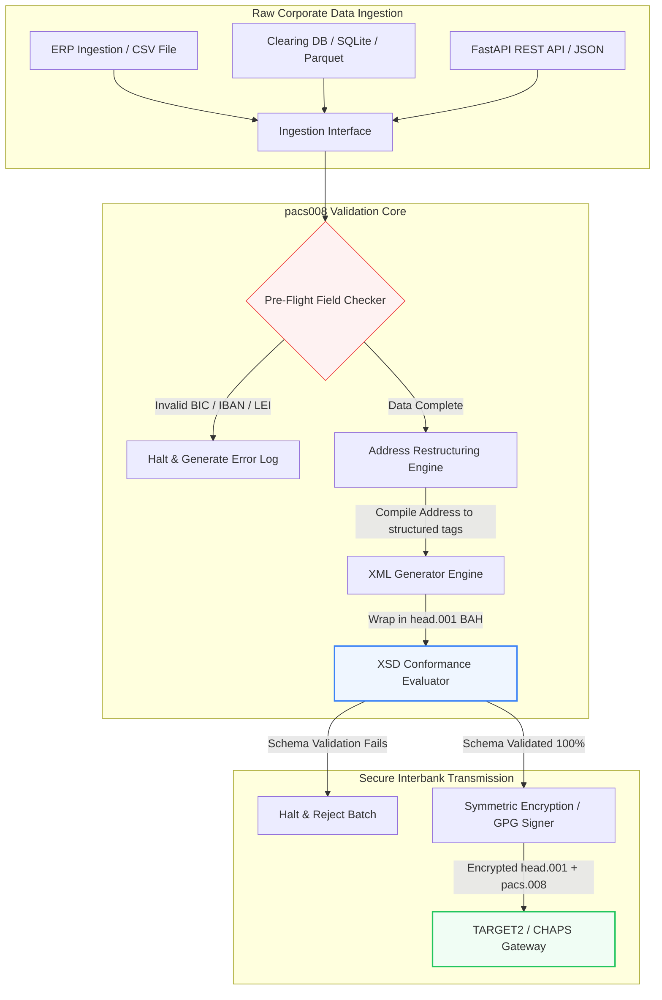

---

# Front Matter (YAML)

author: "contact@sebastienrousseau.com (Sebastien Rousseau)"
banner_alt: "พนักงานออฟฟิศพร้อมผู้ช่วยเสียงและแล็ปท็อป — สื่อถึงข้อความการชำระเงินระหว่างธนาคารที่มีโครงสร้างและเครื่องอ่านได้ ซึ่งระบบอัตโนมัติ pacs.008 ทำให้เขียนโปรแกรมได้"
banner_height: "1597"
banner_width: "2584"
banner: "https://cloudcdn.pro/stocks/images/tyler-prahm-lmV3gJSAgbo.webp"
cdn: "https://cloudcdn.pro"
charset: "UTF-8"
cname: "sebastienrousseau.com"
copyright: "© ลิขสิทธิ์ 2025 - 2026 - Sebastien Rousseau สงวนลิขสิทธิ์"
date: "June 15, 2026"
description: "Pacs008 คือไลบรารี Python โอเพนซอร์สที่อัตโนมัติการสร้างและตรวจสอบข้อความ ISO 20022 pacs.008 FI-to-FI การโอนเครดิตลูกค้า — ที่อยู่แบบมีโครงสร้าง การห่อ BAH head.001 ตรวจสอบเช็คซัม BIC/LEI/IBAN ติดตาม UETR ผ่าน OpenTelemetry — สร้างขึ้นเพื่อรองรับ SWIFT cutover พฤศจิกายน 2569"
format-detection: "telephone=no"
hreflang: "th"
icon: "https://cloudcdn.pro/clients/sebastienrousseau/v1/logos/sebastienrousseau.svg"
id: "https://sebastienrousseau.com/2026-06-15-pacs008-automation-iso-20022-interbank-payments-2026"
image_alt: "ภาพเหมือนขาวดำของ Sebastien Rousseau"
image_height: "162"
image_width: "162"
image: "https://cloudcdn.pro/stocks/images/sebastienrousseau.webp"
keywords: "pacs008, ISO 20022 pacs.008, FI to FI การโอนเครดิตลูกค้า, ที่อยู่แบบมีโครงสร้าง, SWIFT CBPR+, BAH head.001, TARGET2, CHAPS, Fedwire, DORA, BCBS 239, Basel III, UETR, การตรวจสอบ LEI, SEPA VoP"
language: "th-TH"
last_reviewed: "2026-06-15"
layout: "report"
locale: "th_TH"
logo_alt: "โลโก้ของ Sebastien Rousseau"
logo_height: "44"
logo_width: "44"
logo: "https://cloudcdn.pro/clients/sebastienrousseau/v1/logos/sebastienrousseau.svg"
menu: ""
measurementID: "G-169G4ET5HQ"
name: "Sebastien Rousseau"
permalink: "https://sebastienrousseau.com/2026-06-15-pacs008-automation-iso-20022-interbank-payments-2026"
rating: "general"
referrer: "no-referrer"
robots: "index, follow"
schema: "FAQPage, Article"
seo_title: "ระบบอัตโนมัติ pacs.008 สำหรับยุค ISO 20022"
short_name: "sebastienrousseau"
subtitle: "ข้อความ pacs.008 คือจุดที่ข้อมูลการชำระเงินระหว่างธนาคาร ที่อยู่แบบมีโครงสร้าง การปฏิบัติตามกฎ การจัดเส้นทาง และการดำเนินงานชำระบัญชี มาบรรจบกัน"
tags: "pacs008, ISO 20022, การชำระเงินระหว่างธนาคาร, การชำระเงินขายส่ง, Python"
theme-color: "0, 83, 191"
title: "การสร้างระบบอัตโนมัติ pacs.008 สำหรับยุคระหว่างธนาคาร ISO 20022 ในปี 2569"
url: "https://sebastienrousseau.com/2026-06-15-pacs008-automation-iso-20022-interbank-payments-2026"
viewport: "width=device-width, initial-scale=1, shrink-to-fit=no"

# RSS - The RSS feed front matter (YAML).
atom_link: "https://sebastienrousseau.com/2026-06-15-pacs008-automation-iso-20022-interbank-payments-2026/rss.xml"
category: "Finance"
docs: https://validator.w3.org/feed/docs/rss2.html
generator: "Static Site Generator (SSG) (version 0.0.26)"
item_description: "Pacs008 มอบรากฐาน Python โอเพนซอร์สเพื่ออัตโนมัติข้อความ ISO 20022 FI-to-FI การโอนเครดิตลูกค้าในยุคการชำระเงินระหว่างธนาคาร"
item_guid: "https://sebastienrousseau.com/2026-06-15-pacs008-automation-iso-20022-interbank-payments-2026/rss.xml"
item_link: "https://sebastienrousseau.com/2026-06-15-pacs008-automation-iso-20022-interbank-payments-2026/rss.xml"
item_pub_date: "Mon, 15 Jun 2026 06:06:06 +0000"
item_title: "การสร้างระบบอัตโนมัติ pacs.008 สำหรับยุคระหว่างธนาคาร ISO 20022 ในปี 2569"
last_build_date: "Mon, 15 Jun 2026 06:06:06 +0000"
managing_editor: "contact@sebastienrousseau.com (Sebastien Rousseau)"
pub_date: "Mon, 15 Jun 2026 06:06:06 +0000"
ttl: "60"
type: "article"
webmaster: "contact@sebastienrousseau.com"

# Apple - The Apple front matter (YAML).
apple_mobile_web_app_orientations: "portrait"
apple_touch_icon_sizes: "192x192"
apple-mobile-web-app-capable: "yes"
apple-mobile-web-app-status-bar-inset: "black"
apple-mobile-web-app-status-bar-style: "black-translucent"
apple-mobile-web-app-title: "ระบบอัตโนมัติ pacs.008 สำหรับยุค ISO 20022"
apple-touch-fullscreen: "yes"

# MS Application - The MS Application front matter (YAML).

msapplication-navbutton-color: "0, 83, 191"

# Twitter Card - The Twitter Card front matter (YAML).

twitter_card: "summary_large_image"
twitter_creator: "@wwdseb"
twitter_description: "Pacs008 มอบรากฐาน Python โอเพนซอร์สเพื่ออัตโนมัติข้อความ ISO 20022 FI-to-FI การโอนเครดิตลูกค้าในยุคการชำระเงินระหว่างธนาคาร"
twitter_image: "https://cloudcdn.pro/clients/sebastienrousseau/v1/logos/sebastienrousseau.svg"
twitter_image_alt: "โลโก้ของ Sebastien Rousseau"
twitter_site: "@wwdseb"
twitter_title: "ระบบอัตโนมัติ pacs.008 สำหรับยุค ISO 20022"
twitter_url: "https://sebastienrousseau.com/2026-06-15-pacs008-automation-iso-20022-interbank-payments-2026"

excerpt: "pacs008 คือชุดเครื่องมือ Python โอเพนซอร์สที่ทำให้ข้อความ ISO 20022 FI-to-FI การโอนเครดิตลูกค้าสามารถเขียนโปรแกรมได้ — ที่อยู่แบบมีโครงสร้าง การตรวจสอบ การจัดเส้นทาง ฮุกการปฏิบัติตามกฎ และกำหนดเวลา SWIFT พฤศจิกายน 2569 ถูกฝังเป็นค่าตั้งต้น"

# Humans.txt - The Humans.txt front matter (YAML).
author_website: "https://sebastienrousseau.com"
author_twitter: "@wwdseb"
author_location: "London, UK"
thanks: "ขอบคุณที่อ่าน!"
site_last_updated: "2026-06-15"
site_standards: "HTML5, CSS3, RSS, Atom, JSON, XML, YAML, Markdown, TOML"
site_components: "Kaishi, Kaishi Builder, Kaishi CLI, Kaishi Templates, Kaishi Themes"
site_software: "Static Site Generator, Rust"

---

# การอัตโนมัติการชำระเงินระหว่างธนาคาร ISO 20022 pacs.008 ด้วย Python โอเพนซอร์สในปี 2569

<!-- lead-start -->
<aside class="post-lead" aria-label="สรุปบทความ">

<strong>สรุปสั้น.</strong> ภายใต้แนวทาง SWIFT CBPR+ วันที่ 14 พฤศจิกายน 2569 หรือ Structured Address Cliff จะยกเลิกการใช้ที่อยู่ทางไปรษณีย์แบบไม่มีโครงสร้างบน TARGET2, CHAPS, Fedwire, Lynx และ SEPA Pacs008 คือไลบรารี Python โอเพนซอร์สที่อัตโนมัติการสร้างและตรวจสอบข้อความ ISO 20022 FI-to-FI การโอนเครดิตลูกค้า (pacs.008) ห่อการชำระเงินใน Business Application Headers (BAH head.001) และฝังการปฏิบัติตามที่อยู่แบบมีโครงสร้างเข้าไปในเส้นทางข้อมูลก่อนที่ข้อความจะแตะเครือข่ายชำระบัญชี

<strong>ประเด็นสำคัญ</strong>

<ul class="post-lead-takeaways">
  <li><strong>กำหนดเวลาที่อยู่แบบมีโครงสร้างเป็นเด็ดขาด</strong> หลังวันที่ 14 พฤศจิกายน 2569 บล็อกที่อยู่แบบไม่มีโครงสร้างจะถูกปลดระวาง Pacs008 บังคับใช้องค์ประกอบที่อยู่ทางไปรษณีย์แบบมีโครงสร้าง (<code>&lt;TwnNm&gt;</code>, <code>&lt;Ctry&gt;</code>, <code>&lt;PstCd&gt;</code>) ที่ขั้นการรวบรวมข้อมูลเพื่อป้องกันการถูกปฏิเสธที่ขอบเครือข่าย</li>
  <li><strong>การจัดเตรียมข้อความแบบรวมศูนย์</strong> ห่อ payload การชำระเงิน pacs.008 หลักใน envelope Business Application Header (head.001) ที่ตรงตามมาตรฐาน มอบโมเดลการประมวลผลแบบ round-trip ที่เป็นมาตรฐาน</li>
  <li><strong>ความถูกต้องของอัลกอริทึม</strong> ตัวตรวจสอบ BIC และ Legal Entity Identifiers (LEIs) ในตัว โดยใช้การคำนวณเช็คซัม ISO 7064 Modulo 97-10</li>
  <li><strong>ความสามารถในการตรวจสอบย้อนกลับระดับ DORA</strong> เครื่องมือวัดผ่าน OpenTelemetry แบบเต็มรูปแบบ คีย์ด้วย Unique End-to-End Transaction Reference (UETR) สำหรับบันทึกการตรวจสอบแบบเรียลไทม์และลายเซ็นการตรวจสอบเชิงรหัสลับ</li>
  <li><strong>การรักษาความรับผิดชอบของคณะกรรมการ</strong> จัดความแม่นยำของข้อความระหว่างธนาคารให้สอดคล้องกับ DORA Article 5, การรายงานตาม BCBS 239 และการประหยัดเงินกองทุนตามความเสี่ยงปฏิบัติการของ Basel III</li>
</ul>

<strong>อ่านเพิ่มเติม:</strong> <a href="https://sebastienrousseau.com/2026-05-19-global-wholesale-payments-economics-2026">การชำระเงินขายส่งระดับโลกในปี 2569: ISO 20022, การฟื้นฟู RTGS และเศรษฐศาสตร์ของการทำงานร่วมกัน</a>, <a href="https://sebastienrousseau.com/2026-05-27-ai-operating-system-payments-fraud-routing-resilience-compliance-2026">AI ในฐานะระบบปฏิบัติการของการชำระเงิน: การทุจริต การจัดเส้นทาง ความยืดหยุ่น และการปฏิบัติตามกฎในปี 2569</a>, <a href="https://sebastienrousseau.com/2026-05-12-iso-20022-pacs008-structured-address-deadline">กำหนดเวลาที่อยู่แบบมีโครงสร้างของ pacs.008 พฤศจิกายน 2569: มุมมองหกเดือน</a>.

</aside>
<!-- lead-end -->

เชื่อมช่องว่างระหว่างข้อมูลทางการเงินเดิมกับข้อความระหว่างธนาคารแบบมีโครงสร้าง ผ่านท่อส่ง Python ที่ตรวจสอบสคีมาได้และมีร่องรอยการตรวจสอบ

จุดอ้างอิงโอเพนซอร์สของบทความนี้คือ [pacs008 ⧉](https://github.com/sebastienrousseau/pacs008 "pacs008 — ไลบรารี Python โอเพนซอร์ส") ที่เก็บโค้ดถูกวางตำแหน่งเป็นไลบรารี Python สำหรับอัตโนมัติข้อความ XML ISO 20022 pacs.008 FI-to-FI การโอนเครดิตลูกค้า

## ทำไมโครงการโอเพนซอร์สนี้ถึงสำคัญในปี 2569

โครงสร้างพื้นฐานการชำระบัญชีระหว่างธนาคารระดับโลกกำลังเข้าสู่การปรับปรุงครั้งใหญ่ที่สุดในรอบเกือบครึ่งศตวรรษ

ในเดือนมิถุนายน 2569 ภาคบริการทางการเงินกำลังใกล้ถึง **SWIFT Structured Address Cliff วันที่ 14 พฤศจิกายน 2569** อย่างรวดเร็ว ตั้งแต่วันดังกล่าวเป็นต้นไป แนวทาง SWIFT CBPR+ พร้อมด้วย TARGET2, CHAPS, Fedwire และ Canadian Lynx จะปลดระวางบรรทัดที่อยู่ทางไปรษณีย์แบบไม่มีโครงสร้างอย่างเป็นทางการ (ที่ใช้เพียง `<AdrLine>` ภายในบล็อก `<PstlAdr>`) สถาบันการเงินที่เข้าร่วมทั้งหมดต้องส่งที่อยู่ในรูปแบบ hybrid (โครงสร้าง `<TwnNm>` และ `<Ctry>` พร้อมองค์ประกอบ `<AdrLine>` ไม่เกินสองรายการสำหรับรายละเอียดที่เหลือ) หรือรูปแบบที่มีโครงสร้างเต็มรูปแบบ (องค์ประกอบแยกสำหรับชื่อถนน หมายเลขอาคาร และรหัสไปรษณีย์) ข้อความใดที่ไม่ผ่านเกณฑ์นี้จะถูกปฏิเสธที่ขอบเครือข่าย

สำหรับสถาบันการเงิน การเปลี่ยนผ่านนี้สร้างข้อจำกัดด้านการปฏิบัติงานที่สำคัญ:

1. **บทลงโทษการปฏิเสธที่ขอบเครือข่าย** การชำระเงินที่ไม่ผ่านเกณฑ์ที่อยู่แบบมีโครงสร้างจะเผชิญการปฏิเสธเครือข่ายทันที กระตุ้นความล่าช้าของธุรกรรม การติดขัดของสภาพคล่อง และงานคั่งค้างเชิงปฏิบัติการ
2. **SEPA Verification of Payee (VoP)** กำหนดให้ผู้ให้บริการการชำระเงิน (PSPs) ภายในเขต SEPA ทุกรายตรวจสอบความตรงกันระหว่างชื่อผู้รับและ IBAN ก่อนดำเนินการโอนเครดิต เพิ่มประตูการตรวจสอบอีกชั้นที่จุดเริ่มต้นของข้อความ

[Pacs008](https://github.com/sebastienrousseau/pacs008) แก้ปัญหานี้ มันคือไลบรารี Python โอเพนซอร์สแบบน้ำหนักเบาที่อัตโนมัติการแปลงข้อมูลทางการเงินดิบเป็นข้อความ ISO 20022 pacs.008 การโอนเครดิตลูกค้าระหว่างธนาคารที่ตรวจสอบสคีมาแล้วเต็มรูปแบบ ด้วยการเชื่อมช่องว่างจากข้อมูลเดิมสู่ข้อมูลที่มีโครงสร้าง pacs008 ส่งมอบ Return on Resilience (RoR) ที่สูง รักษาเงินทุนหมุนเวียน และยึดมั่นการดำเนินการแบบเรียลไทม์บนรางการชำระเงินทั่วโลก

## ทำไมผมจึงสร้าง pacs008 แบบนี้

ผมเป็นคนเขียน `pacs008` และไลบรารีพี่น้องต้นน้ำของมันอย่าง `pain001` และผมใช้ชีวิต
การทำงานไปกับการชำระเงินรายใหญ่และการบริหารผลิตภัณฑ์ API ส่วนผสมนี้เองคือเหตุผลที่
ไลบรารีนี้มีหน้าตาแบบนี้ จึงควรระบุการตัดสินใจเหล่านั้นออกมาให้ชัด แทนที่จะปล่อยให้
ซ่อนอยู่ในโค้ด

**การตรวจสอบทำงานก่อนการสร้าง ไม่ใช่หลังจากนั้น** สัญชาตญาณของระบบชำระเงินส่วนใหญ่
คือสร้างข้อความขึ้นมาก่อนแล้วค่อยตรวจ เพราะกระบวนการทบทวนถูกออกแบบมาแบบนั้น ไฟล์ถูก
สร้าง มีคนตรวจดู ข้อยกเว้นเข้าคิว ลำดับเช่นนี้รับประกันว่าข้อบกพร่องจะถูกพบ ณ จุดที่
มีแรงงัดน้อยที่สุด หลังจากงานประกอบข้อความเสร็จไปแล้ว และบ่อยครั้งหลังจากข้อความออก
จากองค์กรไปแล้ว การตรวจสอบก่อนหมายความว่าที่อยู่ที่ไม่เป็นไปตามข้อกำหนดหรือ IBAN ที่
ผิดรูปจะกลายเป็นความล้มเหลวของบิลด์ แทนที่จะเป็นการปฏิเสธจากเครือข่าย

**สัญญาอนุญาตเป็น MIT เพราะธนาคารต้องอ่านตรรกะการตรวจสอบได้ ไม่ใช่แค่เชื่อมัน**
ตัวตรวจสอบแบบปิดขอให้สถาบันยอมรับการตีความแนวทางการใช้งานของคนอื่นด้วยความเชื่อใจ
นั่นไม่ใช่สิ่งที่สมเหตุสมผลจะขอจากทีมที่แบกภาระตามกฎเกณฑ์ ทุกกฎในไลบรารีนี้สามารถ
ตรวจสอบ โต้แย้ง และแยกสาขาได้

**การตรวจสอบอ้างอิงสคีมา XSD อย่างเป็นทางการ แทนที่จะเขียนขึ้นใหม่** การประมาณกฎ
ISO 20022 ด้วยมือจะเบี่ยงออกจากสัญญาจริงของเครือข่ายทันทีที่ฝ่ายใดฝ่ายหนึ่ง
เปลี่ยนแปลง สคีมาคือสัญญา สิ่งอื่นล้วนเป็นแหล่งความจริงที่สองที่รอวันขัดแย้งกัน

**มันมุ่งไปที่ CI ไม่ใช่ขั้นตอนการทบทวน** ตัวตรวจสอบที่คนต้องจำได้ว่าต้องสั่งรัน คือ
ตัวตรวจสอบที่จะเลิกถูกรันภายใต้แรงกดดันของกำหนดส่ง ซึ่งเป็นเวลาที่มันสำคัญที่สุดพอดี

สิ่งที่ไลบรารีนี้จงใจไม่ทำก็จงใจไม่แพ้กัน มันคือชุดเครื่องมือระดับข้อความ มันไม่แทนที่
เครื่องยนต์ชำระเงิน ระบบคัดกรองมาตรการคว่ำบาตร หรือการแก้ไขข้อมูลหลักของลูกค้าที่
สถาบันต้องทำที่ต้นทาง มันทำให้การแก้ไขนั้นบังคับใช้ได้ แต่ไม่ได้ทำแทนคุณ

## เลนส์สถาปัตยกรรม pacs008 ปี 2569

ไลบรารี pacs008 ถูกออกแบบเป็นเครื่องยนต์การตรวจสอบและการสร้างแบบแยกชั้น เพื่อให้แน่ใจว่าอินพุตดิบจะถูกแยกวิเคราะห์ เสริมข้อมูล และห่อใน envelope มาตรฐานอย่างเป็นระบบ:

| ชั้น | การตัดสินใจออกแบบ | ทำไมจึงสำคัญ | ความเสี่ยงหากจัดการผิด |
|---|---|---|---|
| **ชั้นอินพุต** | รับข้อมูล CSV, JSON, SQLite และ Parquet | พบทีมบูรณาการของธนาคารตรงที่ข้อมูลของพวกเขาอยู่แล้ว ป้องกันการย้ายแพลตฟอร์ม | การรับ payload ข้อมูลดิบที่ไม่ผ่านการตรวจสอบหรือเสียหาย |
| **ชั้นการตรวจสอบ** | การตรวจสอบล่วงหน้ากับสคีมา XSD ทางการและกฎทางธุรกิจที่กำหนดเอง | หยุดการดำเนินการและแจ้งข้อผิดพลาดก่อนที่ไฟล์การชำระเงินจะถูกส่งไปยังเครือข่ายชำระบัญชี | ไฟล์ XML ที่ไม่ถูกต้องกระตุ้นการปฏิเสธเครือข่ายทันทีและความล่าช้าของการชำระบัญชี |
| **ชั้น BAH Envelope** | การห่อ Business Application Header (head.001) อัตโนมัติ | กำหนดการส่งและจัดเส้นทางข้อความเป็นมาตรฐานบนพื้นฐานของแท็ก `<MsgDefIdr>` | การส่ง payload pacs.008 ดิบโดยไม่มี envelope ภายนอกที่จำเป็น ทำให้ระบบปฏิเสธ |
| **ชั้นการ Serialize** | รองรับ XML มาตรฐานและ JSON ที่สอดคล้องกับ ISO (TS 23029) | เปิดใช้การแปลโดยตรงระหว่าง payload XML และ JSON รองรับ REST API สมัยใหม่และการสตรีม Kafka | การแสดงข้อมูลที่กระจัดกระจายซึ่งละเมิดแนวทาง ISO ทางการ |
| **ชั้นการสังเกตการณ์** | การติดตามผ่าน OpenTelemetry คีย์ด้วย UETR | จับเส้นทางและบันทึกการดำเนินการโดยละเอียด มอบความสามารถในการตรวจสอบแบบเรียลไทม์ | ช่องว่างในการติดตามที่กีดขวางทัศนวิสัยเชิงปฏิบัติการและการตรวจสอบ |

## สัญญาณระหว่างธนาคารและหมุดหมายเชิงกำกับดูแลที่สำคัญ

เพื่อแสดงความยืดหยุ่นในการดำเนินงานเชิงธุรกรรม ผู้จัดการเทคโนโลยีและความเสี่ยงระดับสูงต้องติดตามตัวชี้วัดการปฏิบัติตามที่เฉพาะเจาะจงและวัดผลได้:

| สัญญาณ | เกณฑ์มาตรฐาน / เกณฑ์เชิงปฏิบัติการ | อ้างอิง G20 / SWIFT / DORA | การนำไปใช้บนแพลตฟอร์มเทคนิค |
|---|---|---|---|
| **การปฏิบัติตามที่อยู่แบบมีโครงสร้าง** | % ของข้อความ pacs.008 ที่ใช้ฟิลด์ `<PstlAdr>` แบบมีโครงสร้างเต็มรูปแบบพร้อม `<TwnNm>` และ `<Ctry>` ที่กำหนด | กำหนดเวลา SWIFT SR 2026 | การตรวจสอบสคีมาล่วงหน้าใน pacs008 ที่ปฏิเสธบรรทัดที่อยู่แบบไม่มีโครงสร้าง |
| **SEPA Verification of Payee** | การตรวจสอบความตรงกันระหว่างชื่อผู้รับและ IBAN ก่อนการดำเนินการข้อความ | กฎระเบียบ SEPA VoP | คลาส helper VoP ในตัวที่รัน query การตรวจสอบล่วงหน้าบน IBAN/BIC |
| **การบูรณาการ BAH head.001** | เปอร์เซ็นต์ของ payload การชำระเงินขาออกที่ถูกห่อใน Business Application Headers สำเร็จ | แนวทาง TARGET2 / CBPR+ | ระบบย่อยการห่อ BAH ที่รวบรวม envelope XML ภายนอกอัตโนมัติ |
| **เช็คซัม LEI Modulo** | การตรวจสอบหลักตรวจสอบ ISO 7064 Modulo 97-10 บนบล็อก `<LEI>` ของลูกหนี้และเจ้าหนี้ | คำสั่งของ Bank of England | ตัวตรวจสอบเชิงอัลกอริทึมที่ยืนยันความถูกต้องของรหัส 20 ตัวอักษร |
| **ความแม่นยำในการติดตาม UETR** | 100% ของการชำระเงินที่สร้างขึ้นถูกฉีดด้วย Unique End-to-End Transaction Reference ที่ถูกต้อง | ข้อกำหนด SWIFT UETR | การสร้างและการติดตามรหัสอ้างอิง UUIDv4 36 ตัวอักษรอัตโนมัติ |

## ทำไม Python ถึงเป็นทางขึ้นที่เหมาะสำหรับระบบอัตโนมัติระหว่างธนาคาร

ศูนย์กลางการชำระเงินสมัยใหม่และทีมปฏิบัติการคลังในปี 2569 พึ่งพา Python อย่างมากในการแปลงข้อมูล การสร้างแบบจำลองทางการเงิน และการบูรณาการฐานข้อมูล ERP

ด้วยการใช้ไลบรารี Python โอเพนซอร์ส สถาบันต่าง ๆ จะได้รับข้อได้เปรียบที่สำคัญ:

1. **ภาระทางความคิดต่ำและความสามารถในการทำงานร่วมกันสูง** Python ทำหน้าที่เป็นสะพานเชื่อมที่เหนียวแน่น ช่วยให้นักพัฒนาเขียนสคริปต์ง่าย ๆ ที่ดึงคำสั่งการชำระเงินดิบจากฐานข้อมูลเดิม ตรวจสอบกับกฎธนาคารระหว่างประเทศที่ซับซ้อน และส่งออก XML ที่สอดคล้องภายใน workflow เดียวที่เป็นเอกภาพ
2. **การกำจัดตัวแปล "กล่องดำ" ที่ทึบแสง** พอร์ทัลธนาคารเชิงพาณิชย์มักเรียกเก็บค่าธรรมเนียมใบอนุญาตสูงสำหรับตัวแปลไฟล์การชำระเงินที่กำหนดเอง ตัวแปลเหล่านี้เป็นกล่องดำที่เป็นกรรมสิทธิ์ ทำให้ทีมความปลอดภัยไม่สามารถตรวจสอบว่าข้อมูลถูกประมวลผลอย่างไรหรือคีย์ถูกเก็บไว้ที่ใด ไลบรารีโอเพนซอร์สที่ตรวจสอบได้อย่าง pacs008 รับประกันความโปร่งใสของโค้ดอย่างสมบูรณ์
3. **การบูรณาการ CI/CD ที่ราบรื่น** Pacs008 รวมเข้ากับท่อส่งการบูรณาการและการปรับใช้แบบต่อเนื่องโดยตรง ช่วยให้นักพัฒนาอัตโนมัติการทดสอบไฟล์การชำระเงินเป็นส่วนหนึ่งของวงจรการส่งมอบซอฟต์แวร์มาตรฐาน

## การออกแบบท่อส่งระหว่างธนาคารแบบมีขอบเขต

จุดอ่อนสำคัญในการชำระบัญชีระหว่างธนาคารคือ "การสร้าง batch ที่ไม่ควบคุม" — การสร้างไฟล์โดยไม่มีลูปการตรวจสอบที่ชัดเจนและมีขอบเขต Pacs008 ถูกออกแบบให้ทำงานเป็นเครื่องยนต์การตรวจสอบหลักภายในท่อส่งธุรกรรมหลายขั้นตอนที่ควบคุมอย่างเข้มงวด

ขั้นตอนการดำเนินงานด้านล่างแสดงวิธีที่ข้อมูลธุรกรรมดิบส่งผ่านท่อ pacs008 เพื่อสร้างไฟล์ pacs.008 ที่ปลอดภัยเชิงรหัสลับและสอดคล้องกับสคีมา ห่อใน envelope BAH:

## คู่มือคณะกรรมการและความรับผิดชอบเชิงอำนาจหน้าที่

ระบบอัตโนมัติการชำระเงินระหว่างธนาคารเป็นประเด็นการบริหารความเสี่ยงและการกำกับดูแลกิจการระดับคณะกรรมการ ผู้จัดการระดับสูงต้องจัดการคุณภาพข้อมูลธุรกรรมผ่านเลนส์ของความรับผิดชอบเชิงอำนาจหน้าที่และการลดความเสี่ยงปฏิบัติการ:

- **DORA Article 5 (ความรับผิดชอบของคณะกรรมการ)** กำหนดความรับผิดชอบส่วนตัวโดยตรงต่อสมาชิกคณะกรรมการสำหรับความยืดหยุ่นและความปลอดภัยของการดำเนินงาน ICT ของสถาบัน เนื่องจากการชำระบัญชีระหว่างธนาคารเป็นฟังก์ชันบริษัทที่สำคัญ คณะกรรมการต้องแสดงให้เห็นว่าได้นำการควบคุมธุรกรรมที่แข็งแกร่ง ตรวจสอบแล้ว และอัตโนมัติมาใช้ เพื่อป้องกันการหยุดชะงักเชิงปฏิบัติการหรือการชำระเงินล่าช้า
- **BCBS 239 (การรวมข้อมูลความเสี่ยงและการรายงาน)** กำหนดให้การรายงานธุรกรรมทางการเงินต้องแม่นยำ ครบถ้วน และสร้างขึ้นแบบเรียลไทม์ Pacs008 ช่วยให้สถาบันบรรลุการปฏิบัติตาม BCBS 239 โดยรับประกันว่าข้อมูลการชำระเงินมีโครงสร้างที่สะอาดและตรวจสอบแล้วที่แหล่งกำเนิด กำจัดช่องว่างข้อมูลและข้อผิดพลาดการกระทบยอดด้วยมือที่รบกวนสเปรดชีตเดิม
- **การลดค่าใช้จ่ายเงินกองทุนตามความเสี่ยงปฏิบัติการ (Basel III)** ภายใต้แนวทาง Basel III อัตราข้อผิดพลาดการชำระเงินสูงและค่าใช้จ่ายการแทรกแซงด้วยมือเพิ่มข้อกำหนดเงินกองทุนตามความเสี่ยงปฏิบัติการของธนาคาร ผูกมัดเงินทุนที่อาจถูกนำไปใช้สำหรับการให้กู้ยืมหรือการลงทุน การอัตโนมัติท่อส่งการชำระเงินช่วยลดเบี้ยประกันเงินกองทุนเหล่านี้โดยตรง รักษาคุณค่าในงบดุล

## ความหมายตามประเภทธนาคาร

### ธนาคารที่มีความสำคัญเชิงระบบระดับโลก (G-SIBs)

G-SIBs จัดการปริมาณธุรกรรมข้ามพรมแดนของบริษัทขนาดใหญ่ ความท้าทายหลักของพวกเขาคือการแก้ไขข้อมูลเดิมที่ไม่มีโครงสร้างก่อนที่จะถึงเครือข่ายชำระบัญชี ด้วยการบูรณาการ pacs008 เข้ากับเกตเวย์ธนาคารเชิงพาณิชย์ G-SIBs สามารถจัดหายูทิลิตี้การตรวจสอบอัตโนมัติให้กับลูกค้าองค์กร ลดค่าใช้จ่ายในการซ่อมแซมการชำระเงินด้วยมือ และยึดมั่นการดำเนินการแบบเรียลไทม์บนเครือข่าย SWIFT

### ธนาคารธุรกรรมและธนาคารเชิงพาณิชย์

สำหรับธนาคารธุรกรรม คุณภาพข้อมูลการชำระเงินคือตัวสร้างความแตกต่างเชิงการแข่งขัน ด้วยการเสนอเครื่องมือตรวจสอบโอเพนซอร์สที่ตรวจสอบได้อย่าง pacs008 ให้กับลูกค้าคลังบริษัท ธนาคารเหล่านี้สามารถเร่งการ onboarding ลดการปฏิเสธไฟล์การชำระเงิน และสร้างความไว้วางใจของลูกค้าผ่านอัตราการประมวลผลแบบ straight-through ที่เหนือกว่า

### ธนาคารระดับภูมิภาคและธนาคารขนาดเล็ก

ธนาคารระดับภูมิภาคต้องรักษาการปฏิบัติตามมาตรฐานการชำระเงินระหว่างประเทศโดยไม่มีงบประมาณเทคโนโลยีมหาศาลของ G-SIBs Pacs008 มอบโซลูชันที่ใช้ Python แบบน้ำหนักเบา ประหยัดต้นทุน และสอดคล้องเต็มรูปแบบ ช่วยให้สถาบันขนาดเล็กเสนอความสามารถในการเริ่มต้นการชำระเงินสมัยใหม่ที่มีโครงสร้างได้ โดยไม่ต้องมีใบอนุญาต middleware ที่เป็นกรรมสิทธิ์ราคาแพง

## บทสรุป: แผนถนนการชำระบัญชีระหว่างธนาคาร

กำหนดเวลาที่อยู่แบบมีโครงสร้างของ SWIFT พฤศจิกายน 2569 ที่กำลังจะมาถึงเป็นขอบเขตที่แข็งสำหรับการดำเนินงานคลังบริษัท การพึ่งพาสเปรดชีตเดิม การป้อนข้อมูลด้วยมือ และไฟล์การชำระเงินที่ไม่มีโครงสร้าง คือความเสี่ยงทางธุรกิจที่ดำเนินอยู่

เพื่อยึดมั่นความต่อเนื่องของธุรกรรมและลดค่าใช้จ่ายเชิงปฏิบัติการ ผู้จัดการเทคโนโลยีและการเงินระดับสูงควรดำเนินแผนถนนการชำระบัญชีที่ชัดเจนวันนี้:

1. **บังคับใช้การตรวจสอบที่แหล่งกำเนิด** กำหนดให้คำสั่งการชำระเงินทั้งหมดถูกตรวจสอบและจัดรูปแบบตามสคีมา ISO 20022 XSD ทางการ ก่อนออกจากขอบเขต ERP ของบริษัท
2. **ตรวจสอบท่อส่งข้อมูล** เปลี่ยนจากการประมวลผลสเปรดชีตด้วยมือ และนำ workflow ที่ใช้ Python แบบอัตโนมัติและตรวจสอบได้มาใช้โดยใช้ pacs008
3. **นำความปลอดภัยแบบ hybrid มาใช้** ตรวจสอบให้แน่ใจว่าไฟล์การชำระเงินที่สร้างขึ้นถูกลงนามเชิงรหัสลับและเข้ารหัสก่อนส่ง สนองความคาดหวังของเครือข่ายแบบ zero-trust
4. **จัดให้สอดคล้องกับลำดับความสำคัญเชิงอำนาจหน้าที่** รายงานเมตริกระบบอัตโนมัติการชำระเงินและคุณภาพข้อมูลต่อคณะกรรมการอย่างเป็นทางการ จัดกรอบการลงทุนเป็นโครงการลดความเสี่ยงปฏิบัติการที่สำคัญภายใต้ DORA

## คำถามที่ถามบ่อย

**pacs008 สอดคล้องกับกฎที่อยู่ SWIFT SR 2026 ที่กำลังจะมาถึงหรือไม่**

ใช่ Pacs008 ออกแบบมาเพื่อรองรับหมุดหมายที่อยู่แบบมีโครงสร้างของ SWIFT พฤศจิกายน 2569 อย่างเข้มงวด บังคับใช้การแยกองค์ประกอบที่อยู่ทางไปรษณีย์ (เมือง ประเทศ รหัสไปรษณีย์) เข้าฟิลด์ XML ของ ISO 20022 ที่กำหนด

**pacs008 สามารถห่อ payload การชำระเงินใน Business Application Headers ได้หรือไม่**

ใช่ เนื่องจาก pacs008 รองรับการห่อ Business Application Header (BAH head.001) โดยกำเนิด มันจึงรวบรวม envelope ภายนอกที่จำเป็นโดย TARGET2, CHAPS และเครือข่าย CBPR+ โดยอัตโนมัติ

**ทำไมไลบรารีโอเพนซอร์สถึงดีกว่าตัวแปลไฟล์ที่เป็นกรรมสิทธิ์**

ตัวแปลที่เป็นกรรมสิทธิ์คือกล่องดำที่ทึบแสง ทำให้การตรวจสอบความปลอดภัยเป็นไปไม่ได้ ไลบรารีโอเพนซอร์สที่ผ่านการตรวจสอบโดยเพื่อนร่วมงานอย่าง pacs008 มอบความโปร่งใสของโค้ดอย่างสมบูรณ์ ช่วยให้ทีมความปลอดภัยสามารถยืนยันว่าไม่มีข้อมูลการชำระเงินที่ละเอียดอ่อนถูกเปิดเผยระหว่างการประมวลผล

**pacs008 ตรวจสอบรหัสประจำตัวอะไรบ้าง**

Pacs008 มาพร้อมตัวตรวจสอบในตัวสำหรับ Bank Identifier Codes (BICs) และ Legal Entity Identifiers (LEIs) โดยใช้การคำนวณเช็คซัม ISO 7064 Modulo 97-10 พร้อมการตรวจสอบหลักตรวจสอบ IBAN และการตรวจสอบความเป็นเอกลักษณ์ของ UETR

## อ้างอิง

- SWIFT, (2024). *ISO 20022 November 2026 Structured Address Milestone*. La Hulpe: SWIFT. ดูได้ที่: [หมุดหมาย ISO 20022 ของ SWIFT ⧉](https://www.swift.com/standards/iso-20022/iso-20022-bytes/call-action-november-2026 "หมุดหมาย ISO 20022 ของ SWIFT").
- Basel Committee on Banking Supervision (BCBS), (2013). *Principles for effective risk data aggregation and risk reporting (BCBS 239)*. Basel: Bank for International Settlements. ดูได้ที่: [หลักการ BCBS 239 ⧉](https://www.bis.org/publ/bcbs239.htm "หลักการ BCBS 239").
- European Parliament and Council of the European Union, (2022). *Regulation (EU) 2022/2554 on digital operational resilience for the financial sector (DORA)*. Brussels: Official Journal of the European Union. ดูได้ที่: [กฎระเบียบ DORA ⧉](https://eur-lex.europa.eu/legal-content/EN/TXT/?uri=CELEX%3A32022R2554 "กฎระเบียบ DORA").
- GitHub, (2026). *pacs008 open-source repository*. ดูได้ที่: [ที่เก็บโค้ด pacs008 ⧉](https://github.com/sebastienrousseau/pacs008 "ที่เก็บโค้ด pacs008").

<!-- enrich-start -->
<aside class="author-card" aria-label="เกี่ยวกับผู้เขียน"><strong class="author-card-name"><a href="/about/index.html">Sebastien Rousseau</a></strong>นักเทคโนโลยีธนาคารอาวุโสที่เขียนเกี่ยวกับ AI ประยุกต์ การย้ายไป ISO 20022 การเข้ารหัสหลังควอนตัมสำหรับบริการทางการเงิน และการเปลี่ยนผ่านเชิงโครงสร้างของการชำระเงินขายส่งมากกว่า 20 ปีที่ HSBC Commercial &amp; Investment Bank, PayPal, Barclays, Shazam, AKQA, Virgin Group. <a href="/about/index.html">โปรไฟล์เต็ม</a> &middot; <a href="https://www.linkedin.com/in/sebastienrousseau/" rel="external noopener">LinkedIn</a> &middot; <a href="https://github.com/sebastienrousseau" rel="external noopener">GitHub</a></aside>

ตรวจสอบล่าสุด <time datetime="2026-06-15">2026-06-15</time>.

<aside class="related-posts" aria-labelledby="related-heading">
<h2 id="related-heading" class="related-heading">อ่านเพิ่มเติม</h2>

<article class="related-card"><footer class="related-body"><h3><a href="https://sebastienrousseau.com/2026-05-19-global-wholesale-payments-economics-2026">การชำระเงินขายส่งระดับโลกในปี 2569: ISO 20022, การฟื้นฟู RTGS และเศรษฐศาสตร์ของการทำงานร่วมกัน</a></h3>
<time datetime="2026-05-19">2026-05-19</time>
</footer></article>
<article class="related-card"><footer class="related-body"><h3><a href="https://sebastienrousseau.com/2026-05-27-ai-operating-system-payments-fraud-routing-resilience-compliance-2026">AI ในฐานะระบบปฏิบัติการของการชำระเงิน: การทุจริต การจัดเส้นทาง ความยืดหยุ่น และการปฏิบัติตามกฎในปี 2569</a></h3>
<time datetime="2026-05-27">2026-05-27</time>
</footer></article>
<article class="related-card"><footer class="related-body"><h3><a href="https://sebastienrousseau.com/2026-05-12-iso-20022-pacs008-structured-address-deadline">กำหนดเวลาที่อยู่แบบมีโครงสร้างของ pacs.008 พฤศจิกายน 2569: มุมมองหกเดือน</a></h3>
<time datetime="2026-05-12">2026-05-12</time>
</footer></article>

</aside>
<!-- enrich-end -->
