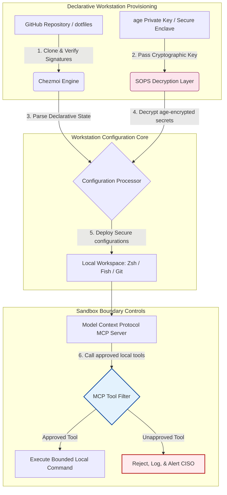

---

# Front Matter (YAML)

author: "contact@sebastienrousseau.com (Sebastien Rousseau)"
banner_alt: "เวิร์กสเตชันนักพัฒนาในแสงสลัว — สื่อถึง dotfiles ที่ตระหนักรู้ AI ทำซ้ำได้ และปลอดภัย สำหรับเซิร์ฟเวอร์ MCP, การลงนาม SLSA, ความลับ age/SOPS และความเข้ากันได้หลายเชลล์"
banner_height: "1597"
banner_width: "2584"
banner: "https://cloudcdn.pro/stocks/images/almas-salakhov-Vq2ap8aFFEs.webp"
cdn: "https://cloudcdn.pro"
charset: "UTF-8"
cname: "sebastienrousseau.com"
copyright: "© Copyright 2025 - 2026 - Sebastien Rousseau. All rights reserved."
date: "June 16, 2026"
description: "Dotfiles ที่ตระหนักรู้ AI คือรูปแบบเวิร์กสเตชันที่ปลอดภัยและทำซ้ำได้สำหรับยุค MCP — คอนฟิกเชิงประกาศผ่าน Chezmoi, ความลับ SOPS/age, ต้นทาง SLSA Level 3, ความเข้ากันได้หลายเชลล์ และขอบเขตแซนด์บ็อกซ์ที่จำกัดสำหรับเอเจนต์ AI ท้องถิ่น"
format-detection: "telephone=no"
hreflang: "th"
icon: "https://cloudcdn.pro/clients/sebastienrousseau/v1/logos/sebastienrousseau.svg"
id: "https://sebastienrousseau.com/2026-06-16-ai-aware-dotfiles-secure-reproducible-workstation-2026"
image_alt: "ภาพถ่ายขาวดำของ Sebastien Rousseau"
image_height: "162"
image_width: "162"
image: "https://cloudcdn.pro/stocks/images/sebastien-rousseau.png"
keywords: "dotfiles, Chezmoi, MCP, Model Context Protocol, SLSA, SOPS, การเข้ารหัส age, คอนฟิกเชิงประกาศ, เวิร์กสเตชันนักพัฒนา, DORA Article 5, NIST CSF 2.0, ความปลอดภัยห่วงโซ่อุปทาน, AI เชิงเอเจนต์, ความเข้ากันได้หลายเชลล์, Zsh, Fish, Nushell"
language: "th-TH"
last_reviewed: "2026-06-16"
layout: "report"
locale: "th_TH"
logo_alt: "โลโก้ Sebastien Rousseau"
logo_height: "44"
logo_width: "44"
logo: "https://cloudcdn.pro/clients/sebastienrousseau/v1/logos/sebastienrousseau.svg"
menu: ""
measurementID: "G-169G4ET5HQ"
name: "Sebastien Rousseau"
permalink: "https://sebastienrousseau.com/2026-06-16-ai-aware-dotfiles-secure-reproducible-workstation-2026"
rating: "general"
referrer: "no-referrer"
robots: "index, follow"
schema: "FAQPage, Article"
seo_title: "Dotfiles ตระหนักรู้ AI สำหรับเวิร์กสเตชันนักพัฒนาที่ปลอดภัย"
short_name: "sebastienrousseau"
subtitle: "เวิร์กสเตชันนักพัฒนาเป็นส่วนหนึ่งของห่วงโซ่อุปทาน AI แล้ว dotfiles จึงต้องการความปลอดภัย ความสามารถทำซ้ำ สุขอนามัยความลับ และเวิร์กโฟลว์ที่ตระหนักรู้ MCP"
tags: "dotfiles, เครื่องมือนักพัฒนา, MCP, SLSA, เวิร์กสเตชันปลอดภัย, chezmoi, macOS, Linux, WSL"
theme-color: "0, 83, 191"
title: "Dotfiles ตระหนักรู้ AI ในปี 2026: สร้างเวิร์กสเตชันนักพัฒนาที่ปลอดภัยและทำซ้ำได้สำหรับ MCP, SLSA และความเข้ากันได้หลายเชลล์"
url: "https://sebastienrousseau.com/2026-06-16-ai-aware-dotfiles-secure-reproducible-workstation-2026"
viewport: "width=device-width, initial-scale=1, shrink-to-fit=no"

# RSS - The RSS feed front matter (YAML).
atom_link: "https://sebastienrousseau.com/2026-06-16-ai-aware-dotfiles-secure-reproducible-workstation-2026/rss.xml"
category: "Technology"
docs: https://validator.w3.org/feed/docs/rss2.html
generator: "Static Site Generator (SSG) (version 0.0.26)"
item_description: "มุมมองต่อ dotfiles เชิงประกาศสำหรับเวิร์กสเตชันนักพัฒนาที่ปลอดภัยและทำซ้ำได้ ครอบคลุม macOS, Linux และ WSL พร้อมการตระหนักรู้ MCP, SLSA, age, SOPS และความเข้ากันได้หลายเชลล์"
item_guid: "https://sebastienrousseau.com/2026-06-16-ai-aware-dotfiles-secure-reproducible-workstation-2026/rss.xml"
item_link: "https://sebastienrousseau.com/2026-06-16-ai-aware-dotfiles-secure-reproducible-workstation-2026/rss.xml"
item_pub_date: "Tue, 16 Jun 2026 06:06:06 +0000"
item_title: "Dotfiles ตระหนักรู้ AI ในปี 2026: สร้างเวิร์กสเตชันนักพัฒนาที่ปลอดภัยและทำซ้ำได้สำหรับ MCP, SLSA และความเข้ากันได้หลายเชลล์"
last_build_date: "Tue, 16 Jun 2026 06:06:06 +0000"
managing_editor: "contact@sebastienrousseau.com (Sebastien Rousseau)"
pub_date: "Tue, 16 Jun 2026 06:06:06 +0000"
ttl: "60"
type: "article"
webmaster: "contact@sebastienrousseau.com"

# Apple - The Apple front matter (YAML).
apple_mobile_web_app_orientations: "portrait"
apple_touch_icon_sizes: "192x192"
apple-mobile-web-app-capable: "yes"
apple-mobile-web-app-status-bar-inset: "black"
apple-mobile-web-app-status-bar-style: "black-translucent"
apple-mobile-web-app-title: "Dotfiles ตระหนักรู้ AI สำหรับเวิร์กสเตชันนักพัฒนา"
apple-touch-fullscreen: "yes"

# MS Application - The MS Application front matter (YAML).

msapplication-navbutton-color: "0, 83, 191"

# Twitter Card - The Twitter Card front matter (YAML).

twitter_card: "summary_large_image"
twitter_creator: "@wwdseb"
twitter_description: "มุมมองต่อ dotfiles เชิงประกาศสำหรับเวิร์กสเตชันนักพัฒนาที่ปลอดภัยและทำซ้ำได้ ครอบคลุม macOS, Linux และ WSL พร้อมการตระหนักรู้ MCP, SLSA, age, SOPS และความเข้ากันได้หลายเชลล์"
twitter_image: "https://cloudcdn.pro/clients/sebastienrousseau/v1/logos/sebastienrousseau.svg"
twitter_image_alt: "โลโก้ของ Sebastien Rousseau"
twitter_site: "@wwdseb"
twitter_title: "Dotfiles ตระหนักรู้ AI สำหรับเวิร์กสเตชันนักพัฒนาที่ปลอดภัย"
twitter_url: "https://sebastienrousseau.com/2026-06-16-ai-aware-dotfiles-secure-reproducible-workstation-2026"

excerpt: "Dotfiles ที่ตระหนักรู้ AI ในปี 2026 ปฏิบัติต่อเวิร์กสเตชันนักพัฒนาในฐานะโครงสร้างพื้นฐานห่วงโซ่อุปทาน — คอนฟิกเชิงประกาศที่จัดการด้วย chezmoi พร้อมการตระหนักรู้ MCP, รุ่นที่ลงนามด้วย SLSA, ความลับ age/SOPS, การเริ่มต้นต่ำกว่าหนึ่งวินาที และความเข้ากันได้ระหว่าง macOS/Linux/WSL"

# Humans.txt - The Humans.txt front matter (YAML).
author_website: "https://sebastienrousseau.com"
author_twitter: "@wwdseb"
author_location: "London, UK"
thanks: "ขอบคุณที่อ่าน!"
site_last_updated: "2026-06-16"
site_standards: "HTML5, CSS3, RSS, Atom, JSON, XML, YAML, Markdown, TOML"
site_components: "Kaishi, Kaishi Builder, Kaishi CLI, Kaishi Templates, Kaishi Themes"
site_software: "Static Site Generator, Rust"

---

# Dotfiles ตระหนักรู้ AI ในปี 2026: สร้างเวิร์กสเตชันนักพัฒนาที่ปลอดภัยและทำซ้ำได้สำหรับ MCP, SLSA และความเข้ากันได้หลายเชลล์

<!-- lead-start -->
<aside class="post-lead" aria-label="สรุปบทความ">

<strong>สรุปสั้น.</strong> เวิร์กสเตชันนักพัฒนาไม่ใช่เพียงปลายทางอีกต่อไป มันเป็นผู้มีส่วนร่วมที่ทำงานอยู่ในห่วงโซ่อุปทานซอฟต์แวร์ และเป็นอินเทอร์เฟซตรงสำหรับชั้นควบคุม AI ท้องถิ่น ผู้ช่วย AI ในเทอร์มินัลและเซิร์ฟเวอร์ <a href="https://modelcontextprotocol.io">Model Context Protocol (MCP)</a> ดำเนินคำสั่งเชลล์ท้องถิ่น ตรวจสอบที่เก็บโค้ด และอ่านไฟล์คอนฟิกที่เป็นความลับโดยตรง <a href="https://github.com/sebastienrousseau/dotfiles">Dotfiles ของ Sebastien Rousseau</a> คือกรอบงานโอเพนซอร์สเชิงประกาศที่สร้างเวิร์กสเตชันที่ปลอดภัยและทำซ้ำได้บน macOS, Linux และ Windows Subsystem for Linux (WSL) — บูรณาการ <a href="https://www.chezmoi.io/">Chezmoi</a>, <a href="https://github.com/getsops/sops">SOPS, age</a> และต้นทางการสร้าง SLSA Level 3 เพื่อแยกความลับด้วยหน่วยความจำที่ปลอดภัย และเส้นทางการดำเนินงานที่จำกัดสำหรับโมเดล AI ท้องถิ่น

<strong>ประเด็นสำคัญ</strong>

<ul class="post-lead-takeaways">
  <li><strong>เวิร์กสเตชันคือโครงสร้างพื้นฐานห่วงโซ่อุปทาน.</strong> คอนฟิกสภาพแวดล้อมนักพัฒนาต้องได้รับการปฏิบัติด้วยความเข้มงวดเชิงประกาศเดียวกับการดีพลอยเซิร์ฟเวอร์โปรดักชัน เพื่อขจัดการเลื่อนไหลของคอนฟิกแบบทำมือ</li>
  <li><strong>ความท้าทายของชั้นควบคุม AI.</strong> โมเดล AI ในเทอร์มินัลและเครื่องมือ MCP สามารถเข้าถึงไดเรกทอรีท้องถิ่นได้ Dotfiles ต้องบังคับขอบเขตแซนด์บ็อกซ์ที่จำกัด รายการสิทธิ์เครื่องมือที่เข้มงวด และบันทึกท้องถิ่นที่แก้ไขไม่ได้ เพื่อป้องกันข้อมูลรั่วไหล</li>
  <li><strong>ความเข้ากันได้ข้ามแพลตฟอร์มอย่างสมบูรณ์.</strong> ประสิทธิภาพเชลล์ระดับต่ำกว่าหนึ่งวินาทีและโปรไฟล์ความปลอดภัยที่เหมือนกันบน macOS, Linux (Zsh, Fish, Nushell) และ WSL ช่วยลดเวลาการรับเข้างานนักพัฒนาจากสัปดาห์เหลือเพียงนาที</li>
  <li><strong>การแยกความลับที่ปลอดภัยเชิงเข้ารหัส.</strong> การเข้ารหัสไฟล์ด้วย SOPS และ age หยุดข้อมูลรับรองที่ฮาร์ดโค้ด (โทเคน GitHub, คีย์เข้าถึงคลาวด์) ไม่ให้ถูกคอมมิตลง Git หรือถูกอ่านโดย LLM ท้องถิ่น</li>
  <li><strong>คุณค่าเชิงมูลฐานระดับคณะกรรมการ.</strong> แปลการปฏิบัติตามคอนฟิกเวิร์กสเตชันให้เป็นวาระห้องประชุมที่ชัดเจน สนับสนุน DORA Article 5, มาตรฐานปลายทาง NIST CSF 2.0 และการลดความเสี่ยงปฏิบัติการตาม Basel III</li>
</ul>

<strong>อ่านเพิ่มเติม:</strong> <a href="https://sebastienrousseau.com/2026-05-23-agentic-payments-banking-consent-liability-new-payment-ux-2026">การชำระเงินเชิงเอเจนต์ในธนาคาร: ความยินยอม ความรับผิด และ UX การชำระเงินใหม่ในปี 2026</a>, <a href="https://sebastienrousseau.com/2024-03-12-revolutionising-real-time-speech-recognition-on-macos-with-openai-whisper/index.html">การรู้จำเสียงพูดเรียลไทม์ที่รวดเร็วบน macOS: OpenAI Whisper</a>, <a href="https://sebastienrousseau.com/2024-02-26-google-gemma-ai-transforming-open-source-ai-development/index.html">Google Gemma AI: การพัฒนา AI โอเพนซอร์ส</a>.

</aside>
<!-- lead-end -->

เชื่อมช่องว่างระหว่างคอนฟิกเวิร์กสเตชันเชิงประกาศกับห่วงโซ่อุปทานซอฟต์แวร์ที่ปลอดภัย ในยุคของโมเดล AI ท้องถิ่นและเครื่องมือนักพัฒนาเชิงเอเจนต์

จุดอ้างอิงโอเพนซอร์สของบทความนี้คือ [dotfiles ⧉](https://github.com/sebastienrousseau/dotfiles "dotfiles — คอนฟิกเวิร์กสเตชันเชิงประกาศ") ที่เก็บโค้ดวางตำแหน่งตัวเองในฐานะ dotfiles เชิงประกาศสำหรับ macOS, Linux และ WSL ให้ความเข้ากันได้หลายเชลล์ การเริ่มต้นต่ำกว่าหนึ่งวินาที รุ่นที่ลงนามด้วย SLSA และคอนฟิกที่ตระหนักรู้ AI/MCP

## เหตุใดโครงการโอเพนซอร์สนี้จึงสำคัญในปี 2026

ในเดือนมิถุนายน 2026 เวิร์กสเตชันนักพัฒนาคือจุดอ่อนที่สุดในห่วงโซ่อุปทานซอฟต์แวร์ และเป็นเป้าหมายที่มีมูลค่าสูงสำหรับเครือข่ายไซเบอร์ทั้งฝ่ายอาชญากรและฝ่ายที่รัฐสนับสนุนระดับสูง

สภาพความปลอดภัยของสภาพแวดล้อมการพัฒนาเปลี่ยนแปลงอย่างสิ้นเชิงด้วยการขึ้นมาของผู้ช่วยเขียนโค้ด AI ในเทอร์มินัล (เช่น Claude Code) และการรับเอา Model Context Protocol (MCP) มาใช้ เทอร์มินัลนักพัฒนาท้องถิ่นในปัจจุบันเป็นที่อยู่ของเอเจนต์ AI ที่ทำงานอัตโนมัติ ซึ่งสามารถ:

- อ่านและแก้ไขไฟล์ซอร์สท้องถิ่น
- เรียกเครื่องมือ CLI ท้องถิ่น (`git`, `npm`, `aws`, `kubectl`)
- ตรวจสอบตัวแปรสภาพแวดล้อมเชลล์ ฐานข้อมูลท้องถิ่น และค่าคอนฟิก

หากสภาพแวดล้อมท้องถิ่นของนักพัฒนาไม่มีขอบเขตที่เข้มงวด เครื่องมือ AI อัตโนมัติเหล่านี้อาจอ่านข้อมูลส่วนตัวที่เป็นความลับโดยไม่ตั้งใจ รั่วไหลข้อมูลรับรองคลาวด์ไปยัง LLM API สาธารณะ หรือดำเนินแพ็กเกจที่เป็นอันตรายระหว่างการสร้างอัตโนมัติ

ภายใต้ Digital Operational Resilience Act (DORA) และ NIST Cybersecurity Framework (CSF) 2.0 สถาบันการเงินมีภาระทางกฎหมายในการตรวจสอบต้นทางและความสมบูรณ์ด้านความปลอดภัยของทุกอุปกรณ์ที่เข้าถึงห่วงโซ่อุปทานซอฟต์แวร์ "แล็ปท็อปแบบเกล็ดหิมะ" — คอนฟิกที่ทำมือ ไม่ได้รับการตรวจสอบ และเลื่อนไหลไปเรื่อย ๆ — ไม่สอดคล้องกับมาตรฐานธนาคารโลกอีกต่อไป

[Dotfiles ของ Sebastien Rousseau](https://github.com/sebastienrousseau/dotfiles) แก้ปัญหานี้ มันเป็นกรอบงานบริหารจัดการเวิร์กสเตชันเชิงประกาศแบบโอเพนซอร์ส ที่สร้างเวิร์กสเตชันนักพัฒนาที่ปลอดภัยและทำซ้ำได้ ด้วยการบังคับใช้คอนฟิกฐานที่เป็นมาตรฐานและตรวจสอบได้ โครงการนี้ส่งมอบ Return on Resilience (RoR) ที่สูง ลดเวลาการรับเข้างานนักพัฒนาจากสัปดาห์เหลือเพียงชั่วโมง และปกป้องห่วงโซ่อุปทานทางการเงินที่เป็นความลับจากช่องโหว่ปลายทาง

## เลนส์สถาปัตยกรรมเวิร์กสเตชันตระหนักรู้ AI ปี 2026

กรอบงาน dotfiles ทำงานในฐานะตัวจัดการสภาพแวดล้อมเชิงประกาศที่ปลอดภัย — เชลล์ เครื่องมือ และความลับท้องถิ่นทั้งหมดได้รับการจัดการอย่างเป็นระบบ ตรวจสอบได้ และแยกออกจากกัน:

| ชั้น | การตัดสินใจการออกแบบ | เหตุใดจึงสำคัญ | ความเสี่ยงหากจัดการผิด |
|---|---|---|---|
| **ชั้นการจัดเตรียม** | การบริหารคอนฟิกเชิงประกาศผ่าน Chezmoi | สร้างเวิร์กสเตชันที่ทำซ้ำได้อย่างสมบูรณ์บน macOS, Linux และ WSL ขจัดการเลื่อนไหล | คอนฟิกแบบเกล็ดหิมะที่มีสถานะท้องถิ่นไม่ได้รับการตรวจสอบและมีช่องโหว่ |
| **ชั้นเชลล์** | ความเข้ากันได้หลายเชลล์ (Zsh, Fish, Nushell) | รับประกันการเริ่มต้นต่ำกว่าหนึ่งวินาทีและพฤติกรรม alias ที่สม่ำเสมอข้ามสภาพแวดล้อม | คำสั่งเชลล์ไม่สม่ำเสมอ ทำให้ผลของสคริปต์ไม่คาดคิด |
| **ชั้นความลับ** | การเข้ารหัสไฟล์ด้วย SOPS และ age | ป้องกันข้อมูลรับรองฮาร์ดโค้ดและคีย์ดิบไม่ให้ถูกคอมมิตลง Git หรือเปิดเผยต่อ LLM ท้องถิ่น | ข้อมูลรับรองรั่วไหลในประวัติที่เก็บโค้ดสาธารณะ หรือถูกประนีประนอมโดยเอเจนต์ท้องถิ่น |
| **ชั้น AI/MCP** | การควบคุมขอบเขต Model Context Protocol | จำกัดเอเจนต์ AI ท้องถิ่นให้ใช้เฉพาะเครื่องมือที่อนุมัติ บันทึกการดำเนินงานท้องถิ่นทั้งหมด | เอเจนต์ AI ไม่มีขอบเขต ดำเนินคำสั่งที่ควบคุมไม่ได้หรือทำลายระบบ |
| **ชั้นห่วงโซ่อุปทาน** | รุ่นที่ลงนามด้วย SLSA และการตรวจสอบ Sigstore | พิสูจน์ความถูกต้องของสคริปต์บูตสแตรปและไฟล์คอนฟิกเชิงเข้ารหัส | สคริปต์ติดตั้งที่ถูกประนีประนอม ฉีดประตูหลังเข้าสู่สภาพแวดล้อมนักพัฒนา |

## สัญญาณความปลอดภัยและอัตโนมัติของเวิร์กสเตชันที่ต้องติดตาม

เพื่อรักษาความปลอดภัยอย่างสมบูรณ์บนทั้งกองทัพการพัฒนา Chief Information Security Officers (CISOs) และผู้จัดการเทคโนโลยีต้องติดตามตัวชี้วัดปฏิบัติการที่เฉพาะเจาะจงและวัดได้:

| สัญญาณ | ตัวชี้วัด / เกณฑ์ปฏิบัติการ | อ้างอิง NIST CSF / DORA | การนำไปใช้ทางเทคนิคบนแพลตฟอร์ม |
|---|---|---|---|
| **ความสามารถทำซ้ำของเวิร์กสเตชัน** | % ของแล็ปท็อปนักพัฒนาที่จัดการด้วยที่เก็บโค้ด dotfile เชิงประกาศโดยไม่มีการเลื่อนไหล | NIST CSF 2.0 (PR.DS-01) | การตรวจสอบการเลื่อนไหลของ Chezmoi ที่ดำเนินอัตโนมัติเมื่อเริ่มเทอร์มินัล |
| **สุขอนามัยข้อมูลรับรอง** | ไม่มีความลับหรือคีย์ที่ไม่ได้เข้ารหัสในรูปข้อความล้วนในไฟล์คอนฟิกท้องถิ่นใด ๆ | DORA Article 6 (ความปลอดภัย ICT) | Git pre-commit hooks และการสแกนท้องถิ่นที่ปฏิเสธไฟล์ที่ไม่ได้เข้ารหัส |
| **ต้นทางการสร้าง** | 100% ของเครื่องมือบูตสแตรปเวิร์กสเตชันได้รับการตรวจสอบด้วย manifests ที่ลงนามเชิงเข้ารหัส | DORA Article 30 (ห่วงโซ่อุปทาน) | การตรวจสอบ Sigstore และ SLSA Level 3 ฝังอยู่ในไปป์ไลน์การติดตั้ง |
| **เวลารับเข้างานนักพัฒนา** | เวลาที่ใช้จากการได้รับฮาร์ดแวร์ดิบ จนถึงพื้นที่ทำงานการพัฒนาที่คอนฟิกครบและปฏิบัติตามมาตรฐาน | Return on Resilience (RoR) | สคริปต์ติดตั้งเชิงประกาศอัตโนมัติ ที่ประกอบสภาพแวดล้อมในเวลาน้อยกว่า 15 นาที |
| **การเข้าถึงที่จำกัดของเอเจนต์ AI** | การยืนยันว่าเครื่องมือ AI ท้องถิ่นทำงานภายในขอบเขตไดเรกทอรีที่กำหนด โดยมีค่าเริ่มต้นเป็นอ่านอย่างเดียว | การบริหารความเสี่ยงโมเดล | โปรไฟล์คอนฟิก MCP จำกัดแคตตาล็อกเครื่องมือของเอเจนต์ให้อยู่ในการดำเนินงานที่อนุมัติ |

## เหตุใดคอนฟิกเชิงประกาศจึงเป็นแกนกลางของความปลอดภัยเวิร์กสเตชัน

วิธีการดั้งเดิมในการติดตั้งเวิร์กสเตชันนักพัฒนาส่วนใหญ่ทำด้วยมือ ส่งผลให้เกิด "แล็ปท็อปแบบเกล็ดหิมะ" — สภาพแวดล้อมที่คอนฟิกเลื่อนไหลไปตามกาลเวลา เมื่อนักพัฒนาติดตั้งเครื่องมือเอง ปรับตัวแปร และแก้ไขสคริปต์ท้องถิ่น การเลื่อนไหลนี้สร้างช่องโหว่วิกฤตหลายประการ:

1. **คอนฟิกเงาที่ไม่ได้ติดตาม.** แล็ปท็อปที่เลื่อนไหลมักรันแพ็กเกจซอฟต์แวร์ที่ล้าสมัยและมีช่องโหว่ หรือสคริปต์ท้องถิ่นที่หลบเลี่ยงเครื่องมือความปลอดภัยขององค์กร
2. **ความลับรั่วไหล.** นักพัฒนามักฮาร์ดโค้ดคีย์ API, โทเคน GitHub หรือข้อมูลรับรอง AWS ลงในสคริปต์ข้อความล้วนหรือโปรไฟล์เชลล์โดยตรง ทำให้เปราะบางต่อการขโมยอย่างยิ่ง
3. **การรับเข้างานที่ไม่มีประสิทธิภาพ.** การติดตั้งเวิร์กสเตชันนักพัฒนาใหม่ด้วยมืออาจใช้เวลาวิศวกรรมถึงสองสัปดาห์ ส่งผลกระทบต่อความเร็วของทีม

ด้วยการเปลี่ยนไปสู่คอนฟิกเชิงประกาศที่ขับเคลื่อนด้วยโมเดลโดยใช้ Chezmoi พื้นที่ทำงานนักพัฒนาทั้งหมดกลายเป็นระบบบันทึกที่ควบคุมเวอร์ชันและทำซ้ำได้ ทุกการเปลี่ยนแปลง alias การพึ่งพาแพ็กเกจ และค่าเริ่มต้นความปลอดภัย ได้รับการบันทึกใน Git ตรวจสอบกับนโยบายการปฏิบัติตามขององค์กร และตรวจสอบเชิงเข้ารหัส ก่อนนำไปใช้กับแล็ปท็อปจริง

## การออกแบบสภาพแวดล้อมนักพัฒนา AI ที่จำกัด

เพื่อป้องกันเอเจนต์ AI ท้องถิ่นและเครื่องมือ MCP ไม่ให้เข้าถึงสินทรัพย์ท้องถิ่นโดยไม่มีขอบเขต เวิร์กสเตชันต้องทำงานในฐานะระนาบการดำเนินงานที่จำกัด

โฟลว์การดำเนินงานด้านล่างแสดงว่ากรอบงาน dotfiles ประสาน Chezmoi, SOPS และ age อย่างไรเพื่อถอดรหัสและดีพลอย dotfiles ที่ปลอดภัย ในขณะที่ยังคงรักษาขอบเขตการดำเนินงานในแซนด์บ็อกซ์ที่แยกออก สำหรับเอเจนต์ AI ท้องถิ่นที่เรียกเครื่องมือ MCP:

## พลย์บุ๊กห้องประชุมและความรับผิดเชิงมูลฐาน

ความปลอดภัยของเวิร์กสเตชันนักพัฒนาและความสมบูรณ์ของห่วงโซ่อุปทานคือวาระห้องประชุมที่วิกฤต ผู้บริหารระดับสูงต้องจัดการความเสี่ยงของสภาพแวดล้อมนักพัฒนาผ่านเลนส์ของความรับผิดชอบเชิงมูลฐาน การปฏิบัติตามกฎ และการรักษามูลค่าทางธุรกิจ:

- **DORA Article 5 (ความรับผิดชอบของคณะกรรมการ).** กำหนดให้องค์กรปกครอง (คณะกรรมการ) มีความรับผิดชอบสูงสุดต่อการบริหารความเสี่ยง ICT ของสถาบัน เนื่องจากเวิร์กสเตชันนักพัฒนาคือประตูสู่ห่วงโซ่อุปทานซอฟต์แวร์ กรรมการคณะกรรมการต้องตรวจสอบว่าปลายทางปลอดภัย ตรวจสอบได้ครบ และจัดการภายใต้กรอบงานคอนฟิกที่เข้มงวดและทำซ้ำได้ เพื่อสนองการตรวจสอบเชิงกำกับดูแล
- **การปฏิบัติตาม NIST CSF 2.0 (ความปลอดภัยปลายทาง).** กำหนดให้เฉพาะอุปกรณ์ที่อนุมัติและตรวจสอบความถูกต้องแล้ว ซึ่งรันคอนฟิกที่ปลอดภัยและเป็นมาตรฐานเท่านั้น ที่เข้าถึงเครือข่ายและที่เก็บโค้ดขององค์กรได้ Dotfiles เชิงประกาศช่วยให้ทีมความปลอดภัยพิสูจน์ได้เชิงคณิตศาสตร์ว่าสภาพแวดล้อมนักพัฒนาทั้งหมดสอดคล้องกับฐานความปลอดภัยขององค์กร ขจัดความเสี่ยงของการติดตั้งแบบ "เกล็ดหิมะ" ที่ไม่ได้รับการตรวจสอบ
- **การรักษามูลค่างบดุล.** ข้อมูลรับรองนักพัฒนาที่ถูกประนีประนอมเพียงรายเดียวหรือการละเมิดห่วงโซ่อุปทานเพียงครั้งเดียว อาจทำให้สถาบันสูญเสียเงินหลายล้านดอลลาร์ในการแก้ไข ค่าปรับเชิงกำกับดูแล และความเสียหายต่อชื่อเสียง การเปลี่ยนไปสู่สภาพแวดล้อมนักพัฒนาเชิงประกาศที่ปลอดภัย ลดความเสี่ยงนี้โดยตรง รักษามูลค่างบดุล และปกป้องความไว้วางใจของลูกค้า

## สิ่งนี้หมายความว่าอย่างไรตามประเภทธนาคาร

### ธนาคารที่มีความสำคัญต่อระบบการเงินโลก (G-SIBs)

G-SIBs จัดการเวิร์กสเตชันนักพัฒนาหลายพันเครื่องข้ามหลายทวีปและเขตอำนาจเชิงกำกับดูแล ความท้าทายหลักคือการรักษาความสม่ำเสมอของคอนฟิกและป้องกันการรั่วไหลของข้อมูลรับรองในทีมวิศวกรรมขนาดใหญ่ ด้วยการรับเอาโมเดล dotfiles เชิงประกาศแบบโอเพนซอร์สที่ใช้ Chezmoi G-SIBs สามารถมาตรฐานความปลอดภัยปลายทาง อัตโนมัติการตรวจสอบการปฏิบัติตาม และลดเวลาการรับเข้างานนักพัฒนาจากสัปดาห์เหลือเพียงนาทีทั่วองค์กรระดับโลก

### ธนาคารธุรกรรมและธนาคารองค์กร

ธนาคารธุรกรรมดำเนินเกตเวย์การชำระเงินที่เป็นความลับและโครงสร้างพื้นฐานการเคลียร์รายใหญ่ การพิสูจน์ความสมบูรณ์อย่างสมบูรณ์ของโค้ดที่ดีพลอยไปยังสภาพแวดล้อมโปรดักชันเหล่านี้คือข้อเรียกร้องเชิงกำกับดูแลที่ต่อรองไม่ได้ การมาตรฐานเวิร์กสเตชันนักพัฒนาภายใต้กรอบงาน dotfiles ที่ปลอดภัยและสอดคล้องกับ SLSA รับประกันว่าห่วงโซ่อุปทานซอฟต์แวร์ได้รับการตรวจสอบครบและปกป้องจากช่องโหว่ปลายทางของนักพัฒนาท้องถิ่น

### ธนาคารภูมิภาคและธนาคารขนาดเล็ก

ธนาคารภูมิภาคต้องรักษามาตรฐานความปลอดภัยไซเบอร์ที่สูง โดยไม่มีงบประมาณความปลอดภัยขนาดมหึมาของ G-SIBs กรอบงาน dotfiles โอเพนซอร์สนี้ให้โซลูชันที่เบา คุ้มค่า และปลอดภัยสูงที่เข้ากันได้ดีกับ Python และ Rust ช่วยให้สถาบันขนาดเล็กนำความปลอดภัยปลายทางระดับองค์กรและการป้องกันห่วงโซ่อุปทานไปใช้ โดยไม่ต้องเสียค่าใบอนุญาตซอฟต์แวร์เชิงพาณิชย์ที่แพง

## บทสรุป: แผนที่นำทางเวิร์กสเตชันนักพัฒนา

เวิร์กสเตชันนักพัฒนาไม่ใช่อุปกรณ์รอบข้างอีกต่อไป มันเป็นชั้นควบคุมวิกฤตในห่วงโซ่อุปทานซอฟต์แวร์ การยอมให้ "แล็ปท็อปแบบเกล็ดหิมะ" ที่คอนฟิกด้วยมือและไม่ได้รับการตรวจสอบเข้าถึงสินทรัพย์ขององค์กร คือความเสี่ยงเชิงปฏิบัติการและเชิงกำกับดูแลที่ร้ายแรง

เพื่อรักษาห่วงโซ่อุปทานซอฟต์แวร์ให้ปลอดภัยและปกป้องปลายทางจากช่องโหว่ของเอเจนต์ AI ท้องถิ่น ผู้จัดการเทคโนโลยีและความปลอดภัยอาวุโสควรดำเนินแผนที่นำทางการพัฒนาที่ชัดเจนในวันนี้:

1. **บังคับใช้การจัดเตรียมเชิงประกาศ.** ค่อย ๆ เลิกใช้กระบวนการติดตั้งที่ทำด้วยมือและขับเคลื่อนด้วยเอกสาร และบังคับให้สภาพแวดล้อมนักพัฒนาทั้งหมดได้รับการจัดเตรียมเชิงประกาศโดยใช้ Chezmoi
2. **บังคับสุขอนามัยความลับ.** บังคับ pre-commit hooks ที่เข้มงวดและเครื่องมือสแกน เพื่อรับประกันว่าไม่มีข้อมูลรับรอง คีย์ หรือโทเคน API ดิบในรูปข้อความล้วน ถูกเก็บในคอนฟิกเวิร์กสเตชันท้องถิ่นใด ๆ
3. **สร้างขอบเขตแซนด์บ็อกซ์ AI.** นำโปรไฟล์คอนฟิก MCP ที่ปลอดภัยและจำกัดไปใช้ เพื่อจำกัดผู้ช่วยเขียนโค้ด AI ท้องถิ่นและเอเจนต์ ให้ใช้เฉพาะเครื่องมือและไดเรกทอรีที่อนุมัติและเป็นอ่านอย่างเดียว
4. **รักษาห่วงโซ่อุปทานให้ปลอดภัย.** รับประกันว่าสคริปต์บูตสแตรปและคอนฟิกสภาพแวดล้อมทั้งหมด ได้รับการตรวจสอบเชิงเข้ารหัสด้วยต้นทาง SLSA Level 3 ก่อนการดีพลอย

## คำถามที่พบบ่อย

**Chezmoi คืออะไรและทำไมจึงใช้สำหรับ dotfiles?**

Chezmoi คือตัวจัดการ dotfile เชิงประกาศแบบโอเพนซอร์สที่ปลอดภัย มันช่วยให้นักพัฒนาจัดการคอนฟิกท้องถิ่นในฐานะที่เก็บโค้ดที่ควบคุมเวอร์ชัน รับประกันความสม่ำเสมอและความสามารถทำซ้ำอย่างสมบูรณ์ข้ามระบบปฏิบัติการที่แตกต่างกัน (macOS, Linux, WSL)

**กรอบงานปกป้องความลับอย่างไร?**

กรอบงานใช้ SOPS (Secrets Operations) และการเข้ารหัสไฟล์ age เพื่อเข้ารหัสข้อมูลรับรองที่เป็นความลับ (เช่น โทเคน GitHub หรือคีย์เข้าถึงคลาวด์) ภายในที่เก็บโค้ด dotfile โดยตรง สิ่งนี้ป้องกันคีย์ไม่ให้ถูกคอมมิตในรูปข้อความล้วน หรือถูกอ่านโดยเอเจนต์ AI ท้องถิ่นที่ไม่ได้รับอนุญาต

**Model Context Protocol (MCP) คืออะไรและส่งผลต่อความปลอดภัยอย่างไร?**

MCP คือมาตรฐานเปิดที่อนุญาตให้โมเดล AI ดำเนินเครื่องมือท้องถิ่นและเข้าถึงไฟล์อย่างปลอดภัย กรอบงาน dotfiles นำไฟล์คอนฟิก MCP ที่เข้มงวดไปใช้ เพื่อจำกัดเครื่องมือ AI ท้องถิ่นและเอเจนต์ให้ใช้เฉพาะไดเรกทอรีและคำสั่งที่อนุมัติ

**กรอบงานสนับสนุนเชลล์ใดบ้าง?**

Bash, Zsh, Fish, Nushell และ PowerShell — ด้วยความเข้ากันได้บน macOS, Linux และ WSL เพื่อให้พฤติกรรมคำสั่งเหมือนกันไม่ว่านักพัฒนาจะเปิดเทอร์มินัลใด

## เอกสารอ้างอิง

- Open Source Security Foundation (OpenSSF), (2024). *Supply-chain Levels for Software Artifacts (SLSA)*. ดูได้ที่: [กรอบงาน SLSA ⧉](https://slsa.dev/ "กรอบงาน SLSA").
- NIST, (2024). *NIST Cybersecurity Framework 2.0*. Gaithersburg: National Institute of Standards and Technology. ดูได้ที่: [NIST CSF 2.0 ⧉](https://www.nist.gov/cyberframework "NIST Cybersecurity Framework 2.0").
- European Parliament and Council of the European Union, (2022). *Regulation (EU) 2022/2554 on digital operational resilience for the financial sector (DORA)*. Brussels: Official Journal of the European Union. ดูได้ที่: [ระเบียบ DORA ⧉](https://eur-lex.europa.eu/legal-content/EN/TXT/?uri=CELEX%3A32022R2554 "ระเบียบ DORA").
- GitHub, (2026). *dotfiles open-source repository*. ดูได้ที่: [ที่เก็บโค้ด dotfiles ⧉](https://github.com/sebastienrousseau/dotfiles "ที่เก็บโค้ด dotfiles").

<!-- enrich-start -->
<aside class="author-card" aria-label="เกี่ยวกับผู้เขียน"><strong class="author-card-name"><a href="/about/index.html">Sebastien Rousseau</a></strong>นักเทคโนโลยีธนาคารอาวุโส เขียนเกี่ยวกับ AI ประยุกต์ การย้ายระบบไป ISO 20022 การเข้ารหัสหลังควอนตัมสำหรับบริการทางการเงิน และการเปลี่ยนแปลงเชิงโครงสร้างของการชำระเงินรายใหญ่ประสบการณ์กว่า 20 ปี ที่ HSBC Commercial &amp; Investment Bank, PayPal, Barclays, Shazam, AKQA, Virgin Group <a href="/about/index.html">โปรไฟล์เต็ม</a> &middot; <a href="https://www.linkedin.com/in/sebastienrousseau/" rel="external noopener">LinkedIn</a> &middot; <a href="https://github.com/sebastienrousseau" rel="external noopener">GitHub</a></aside>

ทบทวนล่าสุด <time datetime="2026-06-16">2026-06-16</time>.

<aside class="related-posts" aria-labelledby="related-heading">
<h2 id="related-heading" class="related-heading">อ่านเพิ่มเติม</h2>

<article class="related-card"><footer class="related-body"><h3><a href="https://sebastienrousseau.com/2026-05-23-agentic-payments-banking-consent-liability-new-payment-ux-2026">การชำระเงินเชิงเอเจนต์ในธนาคาร: ความยินยอม ความรับผิด และ UX การชำระเงินใหม่ในปี 2026</a></h3>
<time datetime="2026-05-23">2026-05-23</time>
</footer></article>
<article class="related-card"><footer class="related-body"><h3><a href="https://sebastienrousseau.com/2024-03-12-revolutionising-real-time-speech-recognition-on-macos-with-openai-whisper/index.html">การรู้จำเสียงพูดเรียลไทม์ที่รวดเร็วบน macOS: OpenAI Whisper</a></h3>
<time datetime="2024-03-12">2024-03-12</time>
</footer></article>
<article class="related-card"><footer class="related-body"><h3><a href="https://sebastienrousseau.com/2024-02-26-google-gemma-ai-transforming-open-source-ai-development/index.html">Google Gemma AI: การพัฒนา AI โอเพนซอร์ส</a></h3>
<time datetime="2024-02-26">2024-02-26</time>
</footer></article>

</aside>
<!-- enrich-end -->
