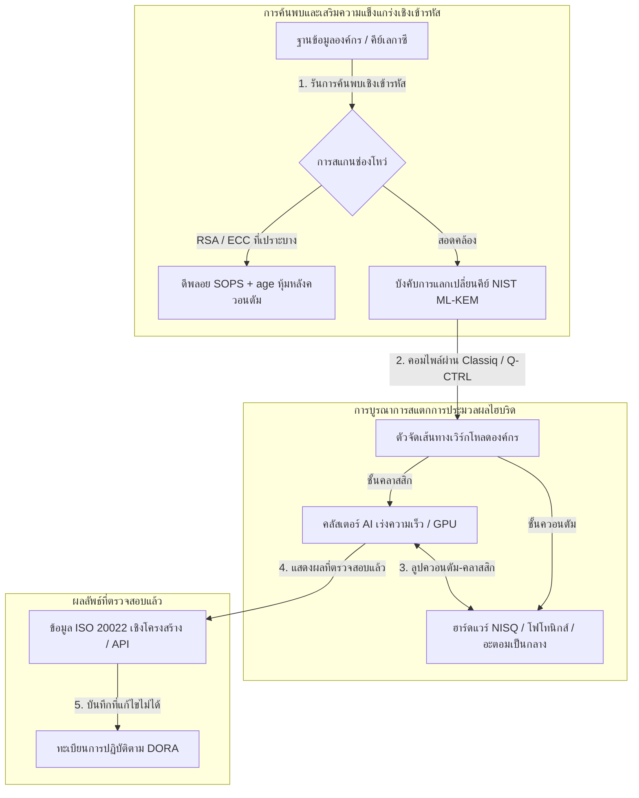

---

# Front Matter (YAML)

author: "contact@sebastienrousseau.com (Sebastien Rousseau)"
banner_alt: "มุมมองเวทีจากการประชุม Economist Impact 5th Annual Commercialising Quantum Global 2026 ณ ลอนดอน — สะท้อนการเปลี่ยนผ่านของเทคโนโลยีควอนตัมจากงานวิจัยฟิสิกส์สู่เวิร์กโฟลว์ที่พร้อมใช้งานในระดับองค์กร"
banner_height: "1597"
banner_width: "2584"
banner: "https://cloudcdn.pro/stocks/images/sebastien-rousseau-20260617-5th-commercialising-quantum-2.webp"
cdn: "https://cloudcdn.pro"
charset: "UTF-8"
cname: "sebastienrousseau.com"
copyright: "© Copyright 2025 - 2026 - Sebastien Rousseau. All rights reserved."
date: "June 17, 2026"
description: "ข้อสรุประดับห้องประชุมจากการประชุม Economist Impact 5th Annual Commercialising Quantum Global 2026 — เงินทุนพุ่ง 1.3 พันล้านดอลลาร์ สแตกไฮบริดแบบ no-regrets ความเร่งด่วนของการย้ายระบบเข้ารหัสหลังควอนตัม การพาณิชย์ของควอนตัมเซนซิง และคำสั่งจาก HSBC ว่าการรอคือความผิดพลาดที่ไม่ควรเกิด"
format-detection: "telephone=no"
hreflang: "th"
icon: "https://cloudcdn.pro/clients/sebastienrousseau/v1/logos/sebastienrousseau.svg"
id: "https://sebastienrousseau.com/2026-06-17-economist-commercialising-quantum-summit-2026"
image_alt: "ภาพถ่ายขาวดำของ Sebastien Rousseau"
image_height: "162"
image_width: "162"
image: "https://cloudcdn.pro/stocks/images/sebastien-rousseau.png"
keywords: "Commercialising Quantum Global 2026, การประชุม Economist Impact, การเข้ารหัสหลังควอนตัม, NIST ML-KEM, harvest-now decrypt-later, SNDL, HSBC ควอนตัม, Philip Intallura, ควอนตัมเซนซิง, การนำทางอิสระจาก GPS, NQCC, EU Quantum Act, Quantcore, รางวัล qBIG, Lord Vallance, ไฮบริดควอนตัม-คลาสสิก, DORA Article 6"
language: "th-TH"
last_reviewed: "2026-06-17"
layout: "report"
locale: "th_TH"
logo_alt: "โลโก้ Sebastien Rousseau"
logo_height: "44"
logo_width: "44"
logo: "https://cloudcdn.pro/clients/sebastienrousseau/v1/logos/sebastienrousseau.svg"
menu: ""
measurementID: "G-169G4ET5HQ"
name: "Sebastien Rousseau"
permalink: "https://sebastienrousseau.com/2026-06-17-economist-commercialising-quantum-summit-2026"
rating: "general"
referrer: "no-referrer"
robots: "index, follow"
schema: "FAQPage, Article"
seo_title: "Commercialising Quantum 2026: ข้อสรุประดับห้องประชุม"
short_name: "sebastienrousseau"
subtitle: "ควอนตัมก้าวข้ามจากวิทยาศาสตร์ห้องปฏิบัติการเชิงเก็งกำไรสู่เวิร์กโฟลว์ไฮบริดในองค์กรแล้ว ห้องประชุมต้องตอบสนองต่อเงินทุน 1.3 พันล้านดอลลาร์ในปี 2026 การย้ายระบบหลังควอนตัมที่ต้องทำทันที และคำสั่งจาก HSBC ให้หยุดรอ"
tags: "ควอนตัม, การเข้ารหัสหลังควอนตัม, NIST ML-KEM, harvest-now decrypt-later, ควอนตัมเซนซิง, HSBC, Economist Impact, การประมวลผลไฮบริด, DORA, EU Quantum Act, NQCC, ข้อสรุปการประชุม"
theme-color: "0, 83, 191"
title: "จากคิวบิตสู่กำไร: ข้อสรุปเชิงกลยุทธ์จากการประชุม Economist 5th Annual Commercialising Quantum Global 2026"
url: "https://sebastienrousseau.com/2026-06-17-economist-commercialising-quantum-summit-2026"
viewport: "width=device-width, initial-scale=1, shrink-to-fit=no"

# RSS - The RSS feed front matter (YAML).
atom_link: "https://sebastienrousseau.com/2026-06-17-economist-commercialising-quantum-summit-2026/rss.xml"
category: "Technology"
docs: https://validator.w3.org/feed/docs/rss2.html
generator: "Static Site Generator (SSG) (version 0.0.26)"
item_description: "ข้อสรุประดับห้องประชุมจากการประชุม Economist Impact 5th Annual Commercialising Quantum Global 2026 — เงินทุนพุ่ง 1.3 พันล้านดอลลาร์ สแตกไฮบริดแบบ no-regrets ความเร่งด่วนของการย้ายระบบเข้ารหัสหลังควอนตัม การพาณิชย์ของควอนตัมเซนซิง และคำสั่งจาก HSBC ว่าการรอคือความผิดพลาดที่ไม่ควรเกิด"
item_guid: "https://sebastienrousseau.com/2026-06-17-economist-commercialising-quantum-summit-2026/rss.xml"
item_link: "https://sebastienrousseau.com/2026-06-17-economist-commercialising-quantum-summit-2026/rss.xml"
item_pub_date: "Wed, 17 Jun 2026 06:06:06 +0000"
item_title: "จากคิวบิตสู่กำไร: ข้อสรุปเชิงกลยุทธ์จากการประชุม Economist 5th Annual Commercialising Quantum Global 2026"
last_build_date: "Wed, 17 Jun 2026 06:06:06 +0000"
managing_editor: "contact@sebastienrousseau.com (Sebastien Rousseau)"
pub_date: "Wed, 17 Jun 2026 06:06:06 +0000"
ttl: "60"
type: "article"
webmaster: "contact@sebastienrousseau.com"

# Apple - The Apple front matter (YAML).
apple_mobile_web_app_orientations: "portrait"
apple_touch_icon_sizes: "192x192"
apple-mobile-web-app-capable: "yes"
apple-mobile-web-app-status-bar-inset: "black"
apple-mobile-web-app-status-bar-style: "black-translucent"
apple-mobile-web-app-title: "Commercialising Quantum 2026: ข้อสรุประดับห้องประชุม"
apple-touch-fullscreen: "yes"

# MS Application - The MS Application front matter (YAML).

msapplication-navbutton-color: "0, 83, 191"

# Twitter Card - The Twitter Card front matter (YAML).

twitter_card: "summary_large_image"
twitter_creator: "@wwdseb"
twitter_description: "ข้อสรุประดับห้องประชุมจากการประชุม Economist Impact 5th Annual Commercialising Quantum Global 2026 — เงินทุนพุ่ง 1.3 พันล้านดอลลาร์ สแตกไฮบริดแบบ no-regrets ความเร่งด่วนของการย้ายระบบเข้ารหัสหลังควอนตัม การพาณิชย์ของควอนตัมเซนซิง และคำสั่งจาก HSBC ว่าการรอคือความผิดพลาดที่ไม่ควรเกิด"
twitter_image: "https://cloudcdn.pro/clients/sebastienrousseau/v1/logos/sebastienrousseau.svg"
twitter_image_alt: "โลโก้ของ Sebastien Rousseau"
twitter_site: "@wwdseb"
twitter_title: "Commercialising Quantum 2026: ข้อสรุประดับห้องประชุม"
twitter_url: "https://sebastienrousseau.com/2026-06-17-economist-commercialising-quantum-summit-2026"

excerpt: "การประชุม Economist Impact 5th Annual Commercialising Quantum Global 2026 ยืนยันการเปลี่ยนจุดหมุนของควอนตัมไปสู่เวิร์กโฟลว์ในองค์กร: ระดมทุน 1.3 พันล้านดอลลาร์ใน 5 เดือน การเข้ารหัสหลังควอนตัมเป็นภาระความรับผิดเชิงมูลฐานในระดับคณะกรรมการภายใต้การเก็บเกี่ยวแบบ SNDL ควอนตัมเซนซิงพร้อมจำหน่ายแล้วในวันนี้สำหรับการนำทางอิสระจาก GPS และ Philip Intallura จาก HSBC ได้ส่งคำสั่งว่าการรอฮาร์ดแวร์ทนต่อความผิดพลาดคือความผิดพลาดที่ไม่ควรเกิด"

# Humans.txt - The Humans.txt front matter (YAML).
author_website: "https://sebastienrousseau.com"
author_twitter: "@wwdseb"
author_location: "London, UK"
thanks: "ขอบคุณที่อ่าน!"
site_last_updated: "2026-06-17"
site_standards: "HTML5, CSS3, RSS, Atom, JSON, XML, YAML, Markdown, TOML"
site_components: "Kaishi, Kaishi Builder, Kaishi CLI, Kaishi Templates, Kaishi Themes"
site_software: "Static Site Generator, Rust"

---

# จากคิวบิตสู่กำไร: ข้อสรุปเชิงกลยุทธ์จากการประชุม Economist 5th Annual Commercialising Quantum Global 2026

ความพร้อมขององค์กร การย้ายระบบสู่การเข้ารหัสหลังควอนตัม สแตกการประมวลผลไฮบริด และภูมิทัศน์เชิงพาณิชย์ที่กำลังก่อตัวของควอนตัมเซนซิงและเครือข่ายควอนตัม

**สรุปสั้น.** การประชุม 5th Annual Commercialising Quantum Global 2026 ซึ่งจัดโดย Economist Impact ระหว่างวันที่ 16–17 มิถุนายน 2026 ณ Business Design Centre กรุงลอนดอน รวบรวมผู้นำระดับโลกกว่า 1,100 คน ครอบคลุมภาคองค์กร การเงิน นโยบาย และวิจัย ประเด็นสำคัญสะท้อนการเปลี่ยนเชิงโครงสร้างที่ชัดเจน: เทคโนโลยีควอนตัมเปลี่ยนผ่านจากวิทยาศาสตร์ห้องปฏิบัติการเชิงเก็งกำไร ไปสู่เวิร์กโฟลว์องค์กรไฮบริดที่นำไปใช้ได้จริง ด้วยเงินทุนเสี่ยงที่ระดมได้ 1.3 พันล้านดอลลาร์ในเพียง 5 เดือนแรกของปี 2026 การอภิปรายในห้องประชุมไม่ใช่การนับจำนวนคิวบิตทางกายภาพอีกต่อไป แต่เป็นการสร้างสแตกการประมวลผลไฮบริดแบบ "no-regrets" การปกป้องสินทรัพย์ดิจิทัลจากภัยคุกคามเชิงเข้ารหัสแบบ "harvest-now, decrypt-later" (SNDL) และการดีพลอยระบบควอนตัมเซนซิงระยะใกล้สำหรับการนำทางอิสระจาก GPS

## ประเด็นสำคัญ

- **การเปลี่ยนผ่านสู่เวิร์กโฟลว์เชิงปฏิบัติในระดับองค์กร.** ผู้นำในวงการ ([Steve Suarez](https://www.linkedin.com/in/stevesuarez) แห่ง HorizonX, [Phil Intallura](https://www.linkedin.com/in/intallura) แห่ง HSBC) ย้ำว่า การบูรณาการควอนตัมไม่ใช่ปัญหาฟิสิกส์อีกต่อไป แต่เป็นปัญหาปฏิบัติการ ธนาคารและองค์กรกำลังดีพลอยโครงการนำร่องไฮบริดควอนตัม-คลาสสิก เพื่อเตรียมบุคลากรและปรับเวิร์กโหลดที่ใช้งานอยู่ให้เหมาะสม
- **การเข้ารหัสหลังควอนตัม (PQC) คือวาระระดับคณะกรรมการ.** ผู้เชี่ยวชาญด้านความปลอดภัยและกฎหมาย (CMS UK, [Joanne Miller](https://www.linkedin.com/in/joanne-miller-nso) แห่ง Microsoft, [Craig Farrell](https://www.linkedin.com/in/craig-farrell) แห่ง EY) เตือนว่า องค์กรไม่สามารถรอฮาร์ดแวร์ที่ทนต่อความผิดพลาดเพื่อดีพลอย PQC ได้ การเก็บเกี่ยวแบบ "Harvest-now, decrypt-later" เกิดขึ้นในวันนี้ ทำให้การย้ายระบบไปยังมาตรฐาน NIST ML-KEM เป็นภาระความรับผิดเชิงมูลฐานที่ต้องทำทันที
- **ควอนตัมเซนซิงนำหน้ากำไรระยะใกล้.** ในขณะที่การประมวลผลทนต่อความผิดพลาดยังต้องใช้เวลาอีกหลายปี ควอนตัมเซนซิง ([Matthew Kinsella](https://www.linkedin.com/in/matthewkinsella) แห่ง Infleqtion) กำลังขยายตัวอย่างรวดเร็ว นาฬิกาควอนตัมและเซนเซอร์เฉื่อยกำลังถูกดีพลอยในการนำทางอิสระจาก GPS ความมั่นคงแห่งชาติ และกริดพลังงานที่เสถียรขั้นสูง
- **อธิปไตย คลัสเตอร์ และความเร่งด่วนเชิงนโยบาย.** รัฐมนตรีกระทรวงวิทยาศาสตร์แห่งสหราชอาณาจักร [Lord Vallance](https://www.linkedin.com/in/patrick-vallance) และ [Lord William Hague](https://www.linkedin.com/in/williamhague) วางภารกิจระดับชาติเพื่อแปลงงานวิจัยเป็น "ซูเปอร์คลัสเตอร์" ในระดับอุตสาหกรรม ที่ประสานงานกับ National Quantum Computing Centre (NQCC) EU Quantum Act ที่กำลังจะมาถึงยิ่งเน้นย้ำการแย่งชิงเชิงภูมิรัฐศาสตร์เพื่อกำลังการประมวลผลแห่งอธิปไตย
- **Quantcore คว้ารางวัล qBIG.** Quantcore สปินเอาท์จาก University of Glasgow คว้ารางวัล IOP qBIG จากผลงานชิ้นส่วนตัวนำยิ่งยวดที่ใช้ไนโอเบียมอันก้าวกระโดด ซึ่งทำงานที่อุณหภูมิสูงกว่าวัสดุดั้งเดิม ลดภาระโครงสร้างพื้นฐานไครโอเจนิกส์ได้อย่างมีนัยสำคัญ

**อ่านเพิ่มเติม:** [KyberLib และการย้ายระบบธนาคารสู่ยุคหลังควอนตัมในปี 2026: จากมาตรฐานสู่โค้ด](https://sebastienrousseau.com/2026-06-12-kyberlib-post-quantum-banking-migration-standards-code-2026/), [ดัชนีความยืดหยุ่นของธนาคารในปี 2026: AI คลาวด์ ควอนตัม การชำระเงิน และความเสี่ยงจากการกระจุกตัวของบุคคลที่สาม](https://sebastienrousseau.com/2026-06-08-banking-resilience-index-ai-cloud-quantum-payments-third-party-risk-2026/), [ดัชนีธนาคารแบบ Cloud Native ในปี 2026: DORA วิศวกรรมแพลตฟอร์ม คลาวด์แห่งอธิปไตย และความยืดหยุ่นเชิงปฏิบัติการ](https://sebastienrousseau.com/2026-06-05-cloud-native-banking-index-dora-resilience-platform-engineering-2026/).

## 01. เหตุใดการประชุมปี 2026 จึงสำคัญต่อห้องประชุม

การประชุม Commercialising Quantum Global ของ Economist ฉบับปี 2026 เป็นจุดเปลี่ยนถาวรในวิธีที่โลกองค์กรประเมินเทคโนโลยีเชิงลึก

ในอดีต การประมวลผลควอนตัมถูกผลักไปอยู่ในแผนกวิจัยและพัฒนาในฐานะภารกิจวิทยาศาสตร์ที่กินเวลาหลายทศวรรษ ในเดือนมิถุนายน 2026 มุมมองนี้ล้าสมัยแล้ว องค์กรต้องเปลี่ยนผ่านจากความสงสัยใคร่รู้แบบ "ฟิสิกส์เป็นศูนย์กลาง" ไปสู่การนำไปปฏิบัติแบบ "ธุรกิจเป็นศูนย์กลาง" เหตุผลมีสองประการ:

1. **การบรรจบกันระหว่างควอนตัมและ AI.** สแตก HPC กำลังหลอมรวม AI แบบเร่งความเร็วเชิงคลาสสิก และโหนด NISQ (Noisy Intermediate-Scale Quantum) เข้าเป็นชั้นการประมวลผลเดียวที่เป็นหนึ่ง องค์กรที่ชะลอการสร้างแอปพลิเคชันที่พร้อมสำหรับควอนตัมจะพบว่า หน้าต่างของการคว้าความได้เปรียบเชิงกลยุทธ์กำลังปิดเร็วกว่าที่คาดไว้
2. **ความเร่งด่วนเชิงภูมิรัฐศาสตร์และเชิงมูลฐาน.** ด้วยโครงการควอนตัมที่นำโดยภารกิจของสหราชอาณาจักร และ EU Quantum Act ที่กำลังจะมาถึง กำลังการประมวลผลควอนตัมจึงกลายเป็นเรื่องของอธิปไตยแห่งชาติและความต่อเนื่องขององค์กร

นอกจากนี้ ความมั่นคงไซเบอร์หลังควอนตัมไม่ใช่ข้อกำหนดการปฏิบัติตามในอนาคตอีกต่อไป ภัยคุกคามจากการโจมตีแบบ "store now, decrypt later" (SNDL) ของผู้ไม่ประสงค์ดี หมายความว่า ข้อมูลองค์กรที่ถูกดักไว้ในวันนี้จะถูกถอดรหัสเมื่อระบบควอนตัมเชิงพาณิชย์ขยายขนาดได้ ก่อให้เกิดภาระความรับผิดทันทีภายใต้คำสั่งความยืดหยุ่นเชิงปฏิบัติการระดับโลก เช่น Digital Operational Resilience Act (DORA)

## 02. เลนส์เชิงกลยุทธ์ของ Commercialising Quantum 2026

ผู้นำเทคโนโลยีระดับองค์กรต้องแมปวุฒิภาวะควอนตัมข้ามชั้นปฏิบัติการที่แตกต่างกัน 5 ชั้น โดยประเมินขอบเขตเวลาและความเสี่ยงต่องบดุล

### ตารางที่ 1: เลนส์เชิงกลยุทธ์ของ Commercialising Quantum 2026

| ชั้น | จุดสนใจขององค์กร | กรอบเวลา / ขอบฟ้า | ความเสี่ยงหลักขององค์กร |
| :---- | :---- | :---- | :---- |
| **ฮาร์ดแวร์และคอมไพเลอร์** | การเลือกระหว่างแนวทางที่แข่งขันกัน (ตัวนำยิ่งยวด ไอออนกักขัง อะตอมเป็นกลาง โฟโทนิกส์) | 3 – 5 ปี (ทนต่อความผิดพลาด) | การล็อกตัวเองในสถาปัตยกรรมทางตัน หรือเดิมพันแพลตฟอร์มเดียวเร็วเกินไป |
| **การเสริมความแข็งแกร่งเชิงเข้ารหัส** | การค้นพบและจัดทำคลังการพึ่งพาเชิงเข้ารหัส การย้ายระบบไปยัง NIST ML-KEM | ทันที (การย้ายระบบที่ดำเนินอยู่) | การละเมิดข้อมูลเชิงระบบและความล้มเหลวในการปฏิบัติตาม DORA และ NIST CSF 2.0 |
| **ควอนตัมเซนซิง** | การดีพลอยการนำทางอิสระจาก GPS นาฬิกาที่เสถียรขั้นสูง และเครื่องวัดแรงโน้มถ่วง | 1 – 2 ปี (เชิงพาณิชย์ทันที) | การหยุดชะงักเชิงปฏิบัติการของโลจิสติกส์ การขนส่ง และกริดพลังงานจากการรบกวน GPS |
| **การบูรณาการระบบ** | การเชื่อมต่อฮาร์ดแวร์ควอนตัมเข้ากับศูนย์ข้อมูล HPC และซูเปอร์คอมพิวเตอร์เชิงคลาสสิกที่มีอยู่ | 1 – 3 ปี (ระยะไฮบริด) | ความหน่วงสูง ปัญหาคอขวดในการถ่ายโอนข้อมูล และไซโลการประมวลผลที่กระจัดกระจาย |
| **ซอฟต์แวร์ระดับองค์กร** | การเปิดเผยอัลกอริทึมควอนตัมผ่านชั้นนามธรรมระดับสูงและ API (Classiq, Q-CTRL) | ทันที (การสร้างทักษะ) | การแยกบุคลากรและเวิร์กโฟลว์ออกจากการปฏิบัติงานวิศวกรรมจริง |

## 03. สัญญาณควอนตัมหลักและตัวกระตุ้นห้องประชุม

ผู้นำเทคโนโลยีต้องเฝ้าติดตามตัวชี้วัดตลาดและกฎระเบียบที่เฉพาะเจาะจงและวัดได้ เพื่อนำทางการลงทุนด้านควอนตัม

### ตารางที่ 2: สัญญาณควอนตัมหลักและตัวกระตุ้นห้องประชุม

| สัญญาณ | ตัวชี้วัดเชิงปริมาณ | การอ้างอิงเชิงกฎระเบียบ / นโยบาย | ลำดับความสำคัญของแพลตฟอร์มที่ปฏิบัติได้ |
| :---- | :---- | :---- | :---- |
| **เงินทุนควอนตัมพุ่ง** | ระดมทุนทั่วโลก 1.3 พันล้านดอลลาร์ใน 5 เดือนแรกของปี 2026 | Return on Resilience (RoR) | เปลี่ยนงบประมาณจากโครงการนำร่องเชิงเก็งกำไรไปสู่เวิร์กโหลดไฮบริดควอนตัม-คลาสสิกแบบ "no-regrets" |
| **ความเสี่ยงการถอดรหัสข้อมูล** | 100% ของข้อมูลที่เข้ารหัสที่ส่งผ่านช่องสาธารณะ ถูกเปิดเผยต่อการเก็บเกี่ยวแบบ SNDL | DORA Article 6 (ความปลอดภัย ICT) | นำเครื่องมือค้นพบเชิงเข้ารหัสมาใช้ เพื่อระบุคีย์ RSA/ECC ที่เปราะบางทั่วทั้งระบบ |
| **โครงสร้างพื้นฐานแห่งอธิปไตย** | งบประมาณ 2.5 พันล้านปอนด์ของ UK National Quantum Strategy | UK Quantum Missions / Lord Vallance | สร้างพันธมิตรท้องถิ่นกับซูเปอร์คลัสเตอร์แห่งชาติ เช่น NQCC |
| **กำหนดเส้นตายการปฏิบัติตาม** | การเปลี่ยนผ่านที่อยู่แบบโครงสร้างของ SWIFT วันที่ 14 พฤศจิกายน 2026 | คำสั่ง SWIFT SR 2026 | ทำความสะอาดและจัดรูปแบบฐานข้อมูลระหว่างธนาคารให้ตรงตามข้อกำหนด XML แบบโครงสร้าง |

## 04. เจาะลึกธีมหลักของการประชุม

### ควอนตัมถึงจุดเปลี่ยนของการลงทุน

เงินทุนเสี่ยงเร่งตัวขึ้นอย่างมีนัยสำคัญ โดยระดมได้ **1.3 พันล้านดอลลาร์** ใน 5 เดือนแรกของปี 2026 เพียงเท่านั้น ต่างจากวงจรการเก็งกำไรในปีก่อน ๆ คลื่นเงินทุนปัจจุบันได้รับการหนุนหลังด้วยเวิร์กโหลดในโลกจริงที่นำไปใช้ได้ในระยะใกล้ ผู้บรรยายจาก Classiq และ IBM Quantum Platform สาธิตให้เห็นว่า ชั้นนามธรรมของซอฟต์แวร์และคอมไพเลอร์อัตโนมัติ ช่วยให้ทีมนักพัฒนาที่ไม่ใช่ผู้เชี่ยวชาญ สามารถดำเนินอัลกอริทึมไฮบริดควอนตัม-คลาสสิกบนโครงสร้างพื้นฐานคลาสสิกในปัจจุบันได้ กลยุทธ์ "no-regrets" นี้ ช่วยให้องค์กรสร้างบุคลากรและเวิร์กโฟลว์ที่พร้อมสำหรับควอนตัมได้ทันที

### คำเตือนเชิงกฎหมายและกฎระเบียบเรื่อง "harvest now, decrypt later"

หุ้นส่วนกฎหมายและผู้บริหารด้านความปลอดภัยไซเบอร์จุดประเด็นสำคัญ เกี่ยวกับความเร่งด่วนของความเสี่ยงข้อมูล ตัวแทนจากสำนักงานกฎหมายผู้สนับสนุน CMS UK และ Chief Security Officer ของ Microsoft [Joanne Miller](https://www.linkedin.com/in/joanne-miller-nso) ส่งคำเตือนที่ตรงไปตรงมาแก่ผู้บริหารระดับสูงว่า *การรอฮาร์ดแวร์ทนต่อความผิดพลาดก่อนดีพลอยการเข้ารหัสหลังควอนตัม เป็นความล้มเหลวเชิงมูลฐานขั้นวิกฤต*

ภายใต้กระบวนทัศน์ "store now, decrypt later" (SNDL) ผู้กระทำที่ไม่เป็นมิตรกำลังเก็บเกี่ยวข้อมูลองค์กรที่เข้ารหัสในวันนี้อย่างจริงจัง โดยตั้งใจจะถอดรหัสทันทีที่คอมพิวเตอร์ควอนตัมที่มีนัยสำคัญเชิงเข้ารหัสปรากฏขึ้น องค์กรต้องดีพลอยการป้องกันหลังควอนตัม (เช่น NIST ML-KEM) ทันที เพื่อปกป้องชุดข้อมูลที่อ่อนไหวซึ่งมีอายุการใช้งานยาวนาน ทรัพย์สินทางปัญญา และบันทึกลูกค้าในอดีต

### การปรับแนว "ควอนตัมเซนซิง" ใหม่หลังกระแสคำพูดเกินจริง

ในขณะที่การประมวลผลควอนตัมที่ทนต่อความผิดพลาดยังต้องใช้เวลาอีกหลายปี การประชุมเน้นว่า ควอนตัมเซนซิงเป็นคลื่นแรกของการดีพลอยในโลกจริงที่ทำกำไรได้อย่างแท้จริง Chief Executive [Matthew Kinsella](https://www.linkedin.com/in/matthewkinsella) แห่ง Infleqtion อธิบายอย่างละเอียดว่า นาฬิกาควอนตัม เซนเซอร์เฉื่อย และระบบความถี่วิทยุ กำลังขยายตัวอย่างรวดเร็วในหลายอุตสาหกรรม

เนื่องจากเทคโนโลยีเหล่านี้วัดค่าคงที่ทางกายภาพด้วยความแม่นยำระดับใต้อะตอม จึงเปิดทางสู่ **การนำทางอิสระจาก GPS** กริดพลังงานที่เสถียรขั้นสูง และการสื่อสารโทรคมนาคมในห้วงอวกาศลึก แอปพลิเคชันเหล่านี้มีความเกี่ยวข้องอย่างยิ่งกับการบิน การขนส่งทางทะเล และระบบป้องกันประเทศ ที่กำลังเผชิญภัยคุกคามจากการรบกวน GPS ที่เพิ่มขึ้น

### ความร่วมมือของระบบนิเวศและคลัสเตอร์

ระบบนิเวศควอนตัมของสหราชอาณาจักรใช้การประชุมที่ลอนดอน เพื่อแสดงนวัตกรรมซูเปอร์คลัสเตอร์ภายในประเทศ การอัปเดตสดจาก National Quantum Computing Centre (NQCC) และ Digital Catapult อธิบายว่า สปินเอาท์ดีพเทคในระยะเริ่มต้นสามารถลด "ช่องว่างทางเทคโนโลยี" ได้อย่างไร ด้วยการบูรณาการฮาร์ดแวร์ควอนตัมโดยตรงเข้ากับศูนย์ข้อมูลซูเปอร์คอมพิวเตอร์เชิงคลาสสิก

[Wridhdhisom Karar](https://www.linkedin.com/in/wridhdhisomkarar) ผู้ร่วมก่อตั้งสตาร์ทอัพควอนตัมสัญชาติสกอตแลนด์ Quantcore ขึ้นรับรางวัล Institute of Physics (IOP) Quantum Business Innovation and Growth (qBIG) อันทรงเกียรติ จากชิ้นส่วนตัวนำยิ่งยวดที่ใช้ไนโอเบียมของบริษัท ชิ้นส่วนเหล่านี้ทำงานที่อุณหภูมิสูงกว่าวัสดุดั้งเดิม ลดภาระโครงสร้างพื้นฐานไครโอเจนิกส์ที่จำเป็นต่อการขยายขนาดโปรเซสเซอร์ควอนตัมได้อย่างมีนัยสำคัญ

### กรณีศึกษา HSBC: เหตุใดการรอควอนตัมจึงเป็น "ความผิดพลาดที่ไม่ควรเกิด"

ข้อมูลเชิงลึกจาก [**Philip Intallura, Ph.D.**](https://www.linkedin.com/in/intallura) (Global Head of Quantum Technologies ของ HSBC ที่ปรึกษารัฐบาลสหราชอาณาจักร และที่ปรึกษาคณะกรรมการ) ในงาน Economist 5th Annual Commercialising Quantum Event (2026) ส่งคำสั่งทรงพลังถึงห้องประชุมว่า *"การรอควอนตัมที่ทนต่อความผิดพลาดก่อนเริ่ม คือความผิดพลาดที่ไม่ควรเกิด"*

Dr Intallura โต้แย้งว่า แนวทาง "รอดู" ที่พบบ่อยในสถาบันการเงิน เป็นการทำเข้าประตูตัวเองที่สร้างบนสมมติฐานผิด ๆ สามประการ:

- **ROI ระยะใกล้เป็นเรื่องจริง.** ในการทดสอบเชิงประจักษ์ HSBC ทำผลงานเหนือกว่าโมเดลที่ใช้งานในโปรดักชัน เชื่อมงานควอนตัมเข้ากับส่วนอื่นของธุรกิจ ใช้ควอนตัมเพื่อกระชับความสัมพันธ์กับลูกค้ารายใหญ่ที่สุดบางราย และดึงดูดธุรกิจใหม่ที่มีนัยสำคัญเข้าสู่ **HSBC Innovation Banking**
- **ควอนตัมคือเส้นโค้งการรับเอามาใช้ที่ชัน.** การสร้างขีดความสามารถ การวางกลยุทธ์ การจัดหาเงินทุน และการดำเนินวงจรการทดลองภายในองค์กรที่ถูกกำกับดูแลอย่างหนัก ไม่ใช่ภารกิจระยะสั้น กระบวนการต้องได้รับการทดสอบและปรับให้เข้ากับเทคโนโลยีอย่างเป็นระบบ
- **ควอนตัมคือระบบนิเวศ.** ไม่มีผู้เล่นรายเดียวที่ไปถึงเป้าหมายได้คนเดียว ทุกบทความวิจัย POC และโครงการนำร่องที่ HSBC ดำเนินการ ล้วนเป็นความร่วมมืออย่างใกล้ชิดกับผู้ให้บริการควอนตัม — และในบางกรณี ความร่วมมือยังขยายไปยังวงวิชาการ ผู้กำกับดูแล และรัฐบาล

**คำสั่งปิดท้ายต่อห้องประชุม:** *"ขีดความสามารถที่คุณจะต้องการในวันแรกของยุคที่ทนต่อความผิดพลาด คือขีดความสามารถที่คุณสร้างในวันนี้"*

## 05. ไปป์ไลน์การบูรณาการควอนตัมและการเข้ารหัสในระดับองค์กร

เพื่อปกป้องสินทรัพย์ดิจิทัลในขณะที่สร้างความพร้อมด้านควอนตัม องค์กรต้องสร้างไปป์ไลน์การบูรณาการที่ชัดเจน

## 06. พลย์บุ๊กห้องประชุม: ภารกิจที่ต้องลงมือทำ

เพื่อแปลงข้อมูลเชิงลึกจากการประชุม Commercialising Quantum Global 2026 ให้เป็นมูลค่าทางธุรกิจทันที ผู้บริหารระดับสูงควรดำเนินพลย์บุ๊กห้องประชุม 4 ขั้นตอนต่อไปนี้:

1. **กำหนดให้มีการค้นพบเชิงเข้ารหัส.** สั่งการ Chief Information Security Officer (CISO) ให้จัดทำคลังสินทรัพย์เชิงเข้ารหัสทั้งหมด แมปทุกคีย์ RSA และ ECC เลกาซีทั่วทั้งองค์กร เพื่อเตรียมการย้ายระบบไปสู่ยุคหลังควอนตัม
2. **ดีพลอยกลยุทธ์ไฮบริดแบบ "no-regrets".** อย่ารอฮาร์ดแวร์ที่สมบูรณ์แบบ ลงทุนในซอฟต์แวร์ที่ได้รับแรงบันดาลใจจากควอนตัม และโครงการนำร่องไฮบริดคลาสสิก-ควอนตัม เพื่อพัฒนาบุคลากรภายในและปรับปรุงโลจิสติกส์ซับซ้อนหรือพอร์ตความเสี่ยงในวันนี้
3. **ประเมินควอนตัมเซนซิงสำหรับโลจิสติกส์.** หากองค์กรของคุณพึ่งพาห่วงโซ่อุปทานระดับโลก การขนส่ง หรือโครงสร้างพื้นฐานวิกฤต ให้ประเมินระบบควอนตัมเซนซิง (เช่น การนำทางอิสระจาก GPS) อย่างจริงจัง เพื่อบรรเทาความเสี่ยงการหยุดชะงักเชิงภูมิรัฐศาสตร์
4. **ลงทะเบียน Insight Hour วันที่ 30 มิถุนายน.** ตรวจสอบให้แน่ใจว่าผู้นำเทคโนโลยีของคุณลงทะเบียน **Commercialising Quantum Global Insight Hour** เสมือนจริง ในวันที่ 30 มิถุนายน 2026 เวลา 15:00 น. BST (สนับสนุนโดย IonQ) เพื่อติดตามกลยุทธ์การบริหารความเสี่ยงระดับองค์กรและการจัดสรรบุคลากรต่อไป

## 07. คำถามที่พบบ่อย

**"harvest now, decrypt later" (SNDL) คืออะไร และเหตุใดจึงสำคัญในวันนี้?**
SNDL คือการดักและจัดเก็บข้อมูลที่เข้ารหัสในวันนี้ โดยมีเจตนาถอดรหัสในภายหลัง เมื่อคอมพิวเตอร์ควอนตัมที่มีนัยสำคัญเชิงเข้ารหัสพร้อมใช้งาน ชุดข้อมูลที่อ่อนไหวซึ่งมีอายุการใช้งานยาวนาน — ทรัพย์สินทางปัญญา บันทึกลูกค้า การสื่อสารของรัฐ — กำลังตกเป็นเป้าหมายแล้ว การย้ายระบบไปสู่ NIST ML-KEM คือการตัดสินใจเชิงมูลฐานที่คณะกรรมการไม่อาจเลื่อนได้

**เหตุใดควอนตัมเซนซิงจึงเป็นคลื่นเชิงพาณิชย์คลื่นแรก แทนที่จะเป็นการประมวลผล?**
เซนเซอร์ควอนตัมวัดค่าคงที่ทางกายภาพด้วยความแม่นยำระดับใต้อะตอม และไม่ต้องการฮาร์ดแวร์ที่ทนต่อความผิดพลาดแบบที่การประมวลผลควอนตัมต้องการ นาฬิกาควอนตัม เครื่องวัดแรงโน้มถ่วง และเซนเซอร์เฉื่อย อยู่ในการดีพลอยนำร่องแล้ว สำหรับการนำทางอิสระจาก GPS กริดพลังงานที่เสถียรขั้นสูง และการสื่อสารในห้วงอวกาศลึก

**งานควอนตัมของ HSBC เป็นเพียง R&D หรือสร้างผลตอบแทนที่วัดได้แล้ว?**
ตามคำกล่าวของ Philip Intallura ในการประชุม HSBC ทำผลงานเหนือกว่าโมเดลที่ใช้งานในโปรดักชัน ใช้ควอนตัมเพื่อกระชับความสัมพันธ์กับลูกค้ารายใหญ่ที่สุด และดึงดูดธุรกิจใหม่ที่มีนัยสำคัญเข้าสู่ HSBC Innovation Banking งานได้ย้ายจากการวิจัยไปสู่การบูรณาการเชิงปฏิบัติการแล้ว

## 08. เอกสารอ้างอิง

- **Economist Impact, (2026).** *5th Annual Commercialising Quantum Global 2026.* บันทึกการประชุมสด วันที่ 16–17 มิถุนายน 2026 ลอนดอน: Business Design Centre ดูได้ที่: [Economist Impact](https://events.economist.com/commercialising-quantum/).
- **National Institute of Standards and Technology (NIST), (2024).** *First Three Finalized Post-Quantum Encryption Standards (FIPS 203, 204, and 205).* Gaithersburg: U.S. Department of Commerce ดูได้ที่: [NIST Standards](https://www.nist.gov/news-events/news/2024/08/nist-releases-first-3-finalized-post-quantum-encryption-standards).
- **European Parliament and Council of the European Union, (2022).** *Regulation (EU) 2022/2554 on digital operational resilience for the financial sector (DORA).* Brussels: Official Journal of the European Union ดูได้ที่: [ระเบียบ DORA](https://eur-lex.europa.eu/legal-content/EN/TXT/?uri=CELEX%3A32022R2554).
- **SWIFT, (2024).** *ISO 20022 November 2026 Structured Address Milestone.* La Hulpe: SWIFT ดูได้ที่: [SWIFT ISO 20022 milestone](https://www.swift.com/standards/iso-20022/iso-20022-bytes/call-action-november-2026).
