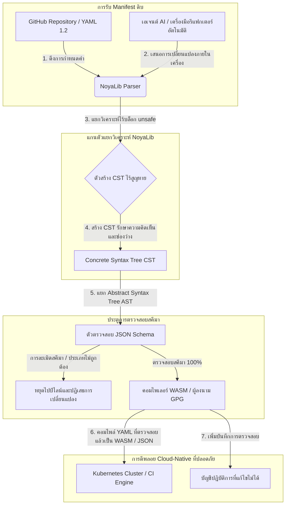

---

# Front Matter (YAML)

author: "contact@sebastienrousseau.com (Sebastien Rousseau)"
banner_alt: "เรขาคณิตเชิงสถาปัตยกรรมภายใต้แสงเงาที่เข้มข้น — สะท้อนบทบาทของ NoyaLib ในฐานะตัวแยกวิเคราะห์ YAML แบบ Rust ที่ปลอดภัยและรับน้ำหนักของ CI, Kubernetes, MCP และการกำหนดค่าในภาคบริการทางการเงิน"
banner_height: "1597"
banner_width: "2584"
banner: "https://cloudcdn.pro/stocks/images/ken-cheung-KonWFWUaAuk.webp"
cdn: "https://cloudcdn.pro"
charset: "UTF-8"
cname: "sebastienrousseau.com"
copyright: "© Copyright 2025 - 2026 - Sebastien Rousseau. All rights reserved."
date: "June 18, 2026"
description: "NoyaLib ตัวแยกวิเคราะห์ YAML 1.2 แบบ Rust ปลอดภัยเต็มรูป สอดคล้องสเปก 406/406 พร้อม JSON Schema, CST ไร้สูญหาย และ MCP/WASM สำหรับโครงสร้างพื้นฐานทางการเงิน"
format-detection: "telephone=no"
hreflang: "th"
icon: "https://cloudcdn.pro/clients/sebastienrousseau/v1/logos/sebastienrousseau.svg"
id: "https://sebastienrousseau.com/2026-06-18-noyalib-safe-yaml-rust-ai-mcp-financial-infrastructure-2026"
image_alt: "ภาพถ่ายขาวดำของ Sebastien Rousseau"
image_height: "162"
image_width: "162"
image: "https://cloudcdn.pro/stocks/images/sebastienrousseau.webp"
keywords: "ตัวแยกวิเคราะห์ YAML แบบ Rust ที่ปลอดภัยกว่า, NoyaLib, ความสอดคล้องสเปก YAML 1.2, Rust แบบ zero-unsafe, การตรวจสอบ JSON Schema, Concrete Syntax Tree แบบไร้สูญหาย, CST, MCP, Model Context Protocol, WebAssembly, Kubernetes manifest, การกำหนดค่า CI/CD, DORA Article 5, BCBS 239, ความเสี่ยงเชิงปฏิบัติการ Basel III, โครงสร้างพื้นฐานทางการเงิน, ความปลอดภัยของการกำหนดค่า, ความปลอดภัยของห่วงโซ่อุปทานซอฟต์แวร์"
language: "th-TH"
last_reviewed: "2026-06-18"
layout: "report"
locale: "th_TH"
logo_alt: "โลโก้ Sebastien Rousseau"
logo_height: "44"
logo_width: "44"
logo: "https://cloudcdn.pro/clients/sebastienrousseau/v1/logos/sebastienrousseau.svg"
menu: ""
measurementID: "G-169G4ET5HQ"
name: "Sebastien Rousseau"
permalink: "https://sebastienrousseau.com/2026-06-18-noyalib-safe-yaml-rust-ai-mcp-financial-infrastructure-2026"
rating: "general"
referrer: "no-referrer"
robots: "index, follow"
schema: "FAQPage, Article"
seo_title: "ตัวแยก YAML Rust ที่ปลอดภัยกว่าเพื่อ AI, MCP และการเงิน"
short_name: "sebastienrousseau"
subtitle: "สแตก YAML แบบ Rust ที่ปลอดภัยกว่า — NoyaLib — แปลง YAML 1.2 จากมาร์กอัปเพื่อความสะดวก ให้กลายเป็นระนาบควบคุมการกำหนดค่าที่ปลอดภัยเชิงเข้ารหัสและสอดคล้องสเปก สำหรับเอเจนต์ AI, MCP, Kubernetes และโครงสร้างพื้นฐานภาคบริการทางการเงิน"
tags: "ตัวแยกวิเคราะห์ YAML แบบ Rust ที่ปลอดภัยกว่า, NoyaLib, YAML 1.2, Rust แบบ zero-unsafe, JSON Schema, MCP, WebAssembly, Kubernetes, DORA, BCBS 239, Basel III, โครงสร้างพื้นฐานทางการเงิน, ความปลอดภัยของห่วงโซ่อุปทาน"
theme-color: "0, 83, 191"
title: "เหตุใด YAML จึงต้องการสแตก Rust ที่ปลอดภัยกว่า สำหรับ AI, MCP และโครงสร้างพื้นฐานทางการเงินในปี 2026"
url: "https://sebastienrousseau.com/2026-06-18-noyalib-safe-yaml-rust-ai-mcp-financial-infrastructure-2026"
viewport: "width=device-width, initial-scale=1, shrink-to-fit=no"

# RSS - The RSS feed front matter (YAML).
atom_link: "https://sebastienrousseau.com/2026-06-18-noyalib-safe-yaml-rust-ai-mcp-financial-infrastructure-2026/rss.xml"
category: "Technology"
docs: https://validator.w3.org/feed/docs/rss2.html
generator: "Static Site Generator (SSG) (version 0.0.26)"
item_description: "NoyaLib ตัวแยกวิเคราะห์ YAML 1.2 แบบ Rust ปลอดภัยเต็มรูป สอดคล้องสเปก 406/406 พร้อม JSON Schema, CST ไร้สูญหาย และ MCP/WASM สำหรับโครงสร้างพื้นฐานทางการเงิน"
item_guid: "https://sebastienrousseau.com/2026-06-18-noyalib-safe-yaml-rust-ai-mcp-financial-infrastructure-2026/rss.xml"
item_link: "https://sebastienrousseau.com/2026-06-18-noyalib-safe-yaml-rust-ai-mcp-financial-infrastructure-2026/rss.xml"
item_pub_date: "Thu, 18 Jun 2026 06:06:06 +0000"
item_title: "เหตุใด YAML จึงต้องการสแตก Rust ที่ปลอดภัยกว่า สำหรับ AI, MCP และโครงสร้างพื้นฐานทางการเงินในปี 2026"
last_build_date: "Thu, 18 Jun 2026 06:06:06 +0000"
managing_editor: "contact@sebastienrousseau.com (Sebastien Rousseau)"
pub_date: "Thu, 18 Jun 2026 06:06:06 +0000"
ttl: "60"
type: "article"
webmaster: "contact@sebastienrousseau.com"

# Apple - The Apple front matter (YAML).
apple_mobile_web_app_orientations: "portrait"
apple_touch_icon_sizes: "192x192"
apple-mobile-web-app-capable: "yes"
apple-mobile-web-app-status-bar-inset: "black"
apple-mobile-web-app-status-bar-style: "black-translucent"
apple-mobile-web-app-title: "ตัวแยก YAML Rust ที่ปลอดภัยกว่าเพื่อ AI, MCP และการเงิน"
apple-touch-fullscreen: "yes"

# MS Application - The MS Application front matter (YAML).

msapplication-navbutton-color: "0, 83, 191"

# Twitter Card - The Twitter Card front matter (YAML).

twitter_card: "summary_large_image"
twitter_creator: "@wwdseb"
twitter_description: "NoyaLib ตัวแยกวิเคราะห์ YAML 1.2 แบบ Rust ปลอดภัยเต็มรูป สอดคล้องสเปก 406/406 พร้อม JSON Schema, CST ไร้สูญหาย และ MCP/WASM สำหรับโครงสร้างพื้นฐานทางการเงิน"
twitter_image: "https://cloudcdn.pro/clients/sebastienrousseau/v1/logos/sebastienrousseau.svg"
twitter_image_alt: "โลโก้ของ Sebastien Rousseau"
twitter_site: "@wwdseb"
twitter_title: "ตัวแยก YAML Rust ที่ปลอดภัยกว่าเพื่อ AI, MCP และการเงิน"
twitter_url: "https://sebastienrousseau.com/2026-06-18-noyalib-safe-yaml-rust-ai-mcp-financial-infrastructure-2026"

excerpt: "NoyaLib คือสแตก YAML แบบ Rust ที่ปลอดภัยกว่า — ไม่มีบล็อก unsafe สอดคล้องสเปก YAML 1.2 ครบ 406/406 ผ่าน Concrete Syntax Tree แบบไร้สูญหาย ตรวจสอบด้วย JSON Schema (Draft 2020-12) พร้อม MCP/WASM — ออกแบบสำหรับเอเจนต์ AI, Kubernetes, CI/CD และระนาบควบคุมการกำหนดค่าหลังโครงสร้างพื้นฐานทางการเงิน"

# Humans.txt - The Humans.txt front matter (YAML).
author_website: "https://sebastienrousseau.com"
author_twitter: "@wwdseb"
author_location: "London, UK"
thanks: "ขอบคุณที่อ่าน!"
site_last_updated: "2026-06-18"
site_standards: "HTML5, CSS3, RSS, Atom, JSON, XML, YAML, Markdown, TOML"
site_components: "Kaishi, Kaishi Builder, Kaishi CLI, Kaishi Templates, Kaishi Themes"
site_software: "Static Site Generator, Rust"

---

# เหตุใด YAML จึงต้องการสแตก Rust ที่ปลอดภัยกว่า สำหรับ AI, MCP และโครงสร้างพื้นฐานทางการเงินในปี 2026

สแตก YAML แบบ Rust ที่ปลอดภัยกว่ามีความสำคัญ เพราะ YAML รับน้ำหนักไปป์ไลน์ CI/CD, Kubernetes manifest, กฎ [Open Policy Agent](https://www.openpolicyagent.org/) และทะเบียนเครื่องมือของ Model Context Protocol (MCP) — และการแยกวิเคราะห์ที่กำกวมเพียงครั้งเดียว สามารถทำให้ระบบเคลียริงล่ม กำหนดค่ากลุ่มความปลอดภัยผิดพลาด หรือมอบสิทธิ์ที่ไม่ถูกต้องให้กับเอเจนต์ AI ภายในเครื่อง [NoyaLib](https://github.com/sebastienrousseau/noyalib) คือระบบนิเวศการแยกวิเคราะห์และตรวจสอบ [YAML 1.2](https://yaml.org/spec/1.2.2/) แบบ pure-Rust ไร้ unsafe ที่ออกแบบมาเพื่อให้โครงสร้างพื้นฐานดังกล่าวปลอดภัยตั้งแต่ค่าเริ่มต้น

## คำตอบโดยย่อ

**NoyaLib คืออะไรในประโยคเดียว?** NoyaLib คือระบบนิเวศการแยกวิเคราะห์และตรวจสอบ YAML 1.2 แบบ pure-Rust โอเพนซอร์ส ที่ไม่มีโค้ด `unsafe` สอดคล้องสเปก 100% ครบทั้ง 406 เทสต์ของชุดทดสอบ YAML อย่างเป็นทางการ มี Concrete Syntax Tree แบบไร้สูญหาย และการตรวจสอบ [JSON Schema](https://json-schema.org/) แบบเรียลไทม์ — ออกแบบมาเพื่อให้การกำหนดค่าของเอเจนต์ AI, MCP, Kubernetes และโครงสร้างพื้นฐานทางการเงิน ปลอดภัยตั้งแต่ค่าเริ่มต้น

## บทสรุปผู้บริหาร

YAML ดูเป็นเรื่องเล็กน้อย จนกว่าการแยกวิเคราะห์ที่กำกวมหรือการละเมิดสคีมาจะทำให้ระบบเคลียริงโปรดักชันมูลค่าหลายพันล้านดอลลาร์ล่ม ในปี 2026 YAML เป็นมาตรฐานโดยพฤตินัยสำหรับไปป์ไลน์ [CI/CD](https://docs.github.com/en/actions/learn-github-actions/workflow-syntax-for-github-actions), [Kubernetes](https://kubernetes.io/docs/concepts/configuration/overview/) manifest, กฎ [Open Policy Agent](https://www.openpolicyagent.org/) และทะเบียนเครื่องมือ Model Context Protocol (MCP) ตัวแยกวิเคราะห์เลกาซีที่ไม่โปร่งใส — พร้อมช่องโหว่หน่วยความจำและการแยกวิเคราะห์เชิงทำลาย — เป็นความเสี่ยงด้านความปลอดภัยที่ยอมรับไม่ได้ NoyaLib คือระบบนิเวศ YAML 1.2 แบบ pure-Rust ไร้ unsafe สอดคล้องสเปก 100% ครบทั้ง 406 เทสต์ของชุดทดสอบอย่างเป็นทางการ มี Concrete Syntax Tree (CST) แบบไร้สูญหายที่รักษาความคิดเห็นและช่องว่าง พร้อมการตรวจสอบ JSON Schema ในตัว ผลลัพธ์คือ YAML ที่ถูกหล่อใหม่เป็นระนาบควบคุมการกำหนดค่า ที่ตรวจสอบได้ ปลอดภัย และเข้าถึงได้โดยเอเจนต์

## ประเด็นสำคัญ

- **การกำหนดค่าคือโค้ดโปรดักชัน.** ไฟล์ YAML ที่ผิดรูปเพียงไฟล์เดียว สามารถกำหนดค่ากลุ่มความปลอดภัยแบบ cloud-native หรือสิทธิ์ของเอเจนต์ AI ผิดพลาดได้ NoyaLib ปฏิบัติต่อ YAML ในฐานะโครงสร้างพื้นฐานวิกฤต
- **การออกแบบไร้ unsafe.** สร้างขึ้นทั้งหมดด้วย Rust ที่ปลอดภัย ไม่มีบล็อก `unsafe` NoyaLib กำจัดช่องโหว่ด้านความปลอดภัยของหน่วยความจำ — buffer overflow, การประมวลผลโค้ดจากระยะไกล — ในชั้นการแยกวิเคราะห์หลัก
- **ความสอดคล้องสเปกสมบูรณ์ 406/406.** ตรวจสอบโครงสร้างการกำหนดค่าทางคณิตศาสตร์ กำจัดความคลาดเคลื่อนในการแยกวิเคราะห์และการเลื่อนของโครงสร้างระหว่างสภาพแวดล้อม staging กับโปรดักชัน
- **Concrete Syntax Tree แบบไร้สูญหาย.** ต่างจากตัวแยกวิเคราะห์เลกาซีที่ทิ้งความคิดเห็นและการจัดรูปแบบ NoyaLib รักษาช่องว่างและคำอธิบาย เปิดทางให้เอเจนต์ AI ทำการรีแฟกเตอร์อัตโนมัติแบบไป-กลับได้อย่างปลอดภัย
- **มูลค่าเชิงมูลฐานระดับคณะกรรมการ.** เชื่อมโยงความสมบูรณ์ของการกำหนดค่ากับ [DORA Article 5](https://eur-lex.europa.eu/legal-content/EN/TXT/?uri=CELEX%3A32022R2554) และตัวชี้วัดทุนความเสี่ยงเชิงปฏิบัติการของ [Basel III](https://www.bis.org/bcbs/publ/d424.htm) ปกป้องผู้บริหารระดับสูงจากความรับผิดส่วนบุคคลโดยตรง

**อ่านเพิ่มเติม:** [KyberLib และการย้ายระบบธนาคารสู่ยุคหลังควอนตัมในปี 2026: จากมาตรฐานสู่โค้ด](https://sebastienrousseau.com/2026-06-12-kyberlib-post-quantum-banking-migration-standards-code-2026/), [ดัชนีธนาคารแบบ Cloud Native ในปี 2026: DORA วิศวกรรมแพลตฟอร์ม คลาวด์แห่งอธิปไตย และความยืดหยุ่นเชิงปฏิบัติการ](https://sebastienrousseau.com/2026-06-05-cloud-native-banking-index-dora-resilience-platform-engineering-2026/), [Dotfiles ที่รู้จัก AI ในปี 2026: การสร้างเวิร์กสเตชันนักพัฒนาที่ปลอดภัยและทำซ้ำได้ สำหรับ MCP, SLSA และความเท่าเทียมระหว่างเชลล์หลายตัว](https://sebastienrousseau.com/2026-06-16-ai-aware-dotfiles-secure-reproducible-workstation-2026/).

## 01. เหตุใดสแตก YAML แบบ Rust ที่ปลอดภัยกว่าจึงสำคัญในปี 2026

ในเดือนมิถุนายน 2026 โครงสร้างพื้นฐาน IT ระดับองค์กรกระจายตัวสูงและถูกอัตโนมัติมากขึ้นเรื่อยๆ

YAML ได้กลายมาเป็นภาษาการกำหนดค่าที่รับน้ำหนักของสแตกวิศวกรรมซอฟต์แวร์ทั้งหมดอย่างเงียบๆ มันรับน้ำหนักเวิร์กโฟลว์ continuous-integration (CI) ที่คอมไพล์อาร์ติแฟกต์โปรดักชัน [Kubernetes](https://kubernetes.io/docs/concepts/overview/) manifest ที่ออร์เคสเตรตคลัสเตอร์ cloud-native ระดับโลก และสคีมาเซิร์ฟเวอร์ [Model Context Protocol](https://modelcontextprotocol.io/) (MCP) ที่ให้สิทธิ์เอเจนต์ AI ภายในเครื่องในการประมวลผลปฏิบัติการในเครื่อง

ตัวแยกวิเคราะห์ YAML เลกาซี — [PyYAML](https://pyyaml.org/), [yaml-cpp](https://github.com/jbeder/yaml-cpp), [libyaml](https://github.com/yaml/libyaml) — มีความเสี่ยงเชิงโครงสร้างสองประการ:

1. **ช่องโหว่การบีบบังคับประเภทข้อมูล (the "Norway problem").** ตัวแยกวิเคราะห์เลกาซีมักบีบบังคับสตริงที่ไม่ใส่เครื่องหมายอัญประกาศ (รหัสประเทศ `NO` กลายเป็น `false` แบบบูลีน เช่นเดียวกับ `yes`/`no`) — ดู [YAML 1.1 vs 1.2 boolean tag](https://yaml.org/type/bool.html) — ก่อให้เกิดความล้มเหลวของระบบวิกฤตหรือการกำหนดค่าผิดพลาดเชิงความปลอดภัยอย่างเงียบ
2. **การโจมตีความปลอดภัยหน่วยความจำ.** ตัวแยกวิเคราะห์ที่ไม่โปร่งใส เขียนด้วย C/C++ ได้รับผลกระทบจาก memory-leak และ buffer-overflow ซึ่งอาจนำไปสู่ remote code execution (RCE) บนเซิร์ฟเวอร์ build หลัก

[NoyaLib](https://github.com/sebastienrousseau/noyalib) แก้ไขความท้าทายเหล่านี้ เป็นระบบนิเวศการแยกวิเคราะห์และตรวจสอบ YAML 1.2 แบบ pure-Rust ไร้ unsafe โดยการบรรลุความสอดคล้องสเปกสมบูรณ์ 406/406 และบังคับการตรวจสอบ JSON Schema อย่างเข้มงวดในระหว่างการแยกวิเคราะห์ NoyaLib ส่งมอบ **Return on Resilience (RoR)** ที่สูง — ป้องกันการหยุดทำงานที่เกิดจากการกำหนดค่า และปกป้องห่วงโซ่อุปทานซอฟต์แวร์ระดับการเงิน

## 02. มุมมองสถาปัตยกรรม NoyaLib ปี 2026

ระบบนิเวศ NoyaLib ทำงานเป็นตัวแยกวิเคราะห์การกำหนดค่าที่ปลอดภัยและไร้สูญหาย ทุก manifest ภายในเครื่องและบนคลาวด์ ได้รับการตรวจสอบเชิงโครงสร้างและปกป้องที่ชั้นการประมวลผลต่ำสุด

### ตารางที่ 1: ชั้นสถาปัตยกรรม NoyaLib และการบรรเทาความเสี่ยง

| ชั้น | การตัดสินใจออกแบบ | เหตุใดจึงสำคัญ | ความเสี่ยงหากจัดการผิด |
| ---- | ---- | ---- | ---- |
| **ชั้นตัวแยกวิเคราะห์** | ตัวแยกวิเคราะห์ pure-Rust สอดคล้อง YAML 1.2 ไม่มีบล็อก `unsafe` | กำจัดช่องโหว่ความปลอดภัยหน่วยความจำและ buffer overflow ที่ชั้นการประมวลผลต่ำสุด | Remote code execution (RCE) บนเซิร์ฟเวอร์ build หลัก |
| **ชั้นความสอดคล้อง** | สอดคล้อง 100% ครบทั้ง 406/406 เทสต์ของชุดทดสอบ YAML 1.2 อย่างเป็นทางการ | กำจัดความคลาดเคลื่อนในการแยกวิเคราะห์และการเลื่อนของการบีบบังคับประเภทระหว่าง staging กับโปรดักชัน | ข้อผิดพลาดการบีบบังคับประเภท "Norway problem" ที่ปิดใช้กลุ่มความปลอดภัย |
| **ชั้น syntax-tree** | Concrete Syntax Tree (CST) แบบไร้สูญหาย | รักษาความคิดเห็น ช่องว่าง และลำดับในระหว่างการแยกวิเคราะห์แบบไป-กลับและการรีแฟกเตอร์เชิงโปรแกรม | การรีแฟกเตอร์อัตโนมัติด้วย AI ทำลายคำอธิบายของนักพัฒนา |
| **ชั้นการตรวจสอบ** | การตรวจสอบ [JSON Schema (Draft 2020-12)](https://json-schema.org/draft/2020-12/release-notes) ในระหว่างการแยกวิเคราะห์ | บังคับโมเดลข้อมูลที่เข้มงวดบนไฟล์การกำหนดค่า ก่อนเข้าถึงคลัสเตอร์โปรดักชัน | ไฟล์การกำหนดค่าผิดรูปที่ทำให้คลัสเตอร์ cloud-native ล่ม |
| **ชั้นอินเตอร์เฟซ** | WebAssembly (WASM) และ MCP bindings | อนุญาตให้การตรวจสอบการกำหนดค่าทำงานโดยตรงในเบราว์เซอร์ edge nodes และชุดเครื่องมือเอเจนต์ภายในเครื่อง | การแยกไซโลของเครื่องมือ ที่การตรวจสอบไม่สามารถทำงานบนอุปกรณ์ edge ได้ |

## 03. สัญญาณความปลอดภัยของเวิร์กสเตชันและการกำหนดค่าหลัก

เพื่อรักษาความปลอดภัยสมบูรณ์ทั่วทั้งฐานการพัฒนาและการปฏิบัติงาน Chief Information Security Officer (CISO) ต้องเฝ้าติดตามตัวชี้วัดที่เฉพาะเจาะจงและวัดได้

### ตารางที่ 2: สัญญาณความปลอดภัยของเวิร์กสเตชันและการกำหนดค่า

| สัญญาณ | ตัวชี้วัด / เกณฑ์มาตรฐานปฏิบัติการ | การอ้างอิง NIST CSF / DORA | การนำไปใช้บนแพลตฟอร์มทางเทคนิค |
| ---- | ---- | ---- | ---- |
| **ความสอดคล้องของตัวแยกวิเคราะห์** | อัตราการผ่าน 100% ของชุดทดสอบ YAML 1.2 อย่างเป็นทางการ (406/406 เทสต์) | [DORA Article 6](https://eur-lex.europa.eu/legal-content/EN/TXT/?uri=CELEX%3A32022R2554) (ความปลอดภัย ICT) | แกนตัวแยกวิเคราะห์ NoyaLib ตรวจสอบ manifest ทั้งหมดก่อนการประมวลผล CI |
| **โปรไฟล์ความปลอดภัยของหน่วยความจำ** | ไม่มีบล็อก `unsafe` ของ Rust ภายในตัวแยกวิเคราะห์และ dependency ของ serializer | DORA Article 30 (ห่วงโซ่อุปทาน) | การตรวจสอบคอมไพเลอร์อัตโนมัติ ([`forbid(unsafe_code)`](https://doc.rust-lang.org/reference/attributes/diagnostics.html#the-forbid-attribute)) ใน cargo build |
| **การตรวจสอบสคีมา** | 100% ของไฟล์การกำหนดค่าที่แยกวิเคราะห์ ได้รับการตรวจสอบกับโมเดล [JSON Schema](https://json-schema.org/) ที่ถูกต้อง | [NIST CSF 2.0](https://www.nist.gov/cyberframework) (PR.DS-01) | ประตูการตรวจสอบเรียลไทม์ที่หยุดไปป์ไลน์ build เมื่อมีการละเมิดสคีมา |
| **การเลื่อนของการกำหนดค่า** | การตรวจจับและกู้คืนไฟล์การกำหนดค่าภายในเครื่องแบบเรียลไทม์ ไปยังสถานะที่กำกับด้วย git | Return on Resilience (RoR) | telemetry ต่อเนื่องที่บันทึกการแก้ไขไฟล์ภายในเครื่องทั้งหมด |
| **การควบคุมการเข้าถึงของเอเจนต์** | สิทธิ์แบบอ่านอย่างเดียวที่จำกัดขอบเขต สำหรับเครื่องมือ AI ภายในเครื่องที่ทำงานผ่านการกำหนดค่า MCP | การจัดการความเสี่ยงของแบบจำลอง ([SR 11-7](https://web.archive.org/web/20260414150921/https://www.federalreserve.gov/supervisionreg/srletters/sr1107.htm)) | ขอบเขตเซิร์ฟเวอร์ MCP ที่จำกัดการปฏิบัติงานของเอเจนต์ให้อยู่ในไดเรกทอรีที่ได้รับอนุมัติ |

## 04. ความเข้าใจผิดของการแยกวิเคราะห์การกำหนดค่าแบบไม่โปร่งใส

ช่องโหว่หลักในการปฏิบัติงานแบบ cloud-native คือ *การแยกวิเคราะห์ที่ไม่โปร่งใส* — การใช้ตัวแยกวิเคราะห์ที่ทิ้งเมตาดาตาเชิงโครงสร้าง (ความคิดเห็น ช่องว่าง ลำดับของเอกสาร) หรือบีบบังคับประเภทอย่างเงียบในระหว่างการคอมไพล์ พฤติกรรมนี้ก่อให้เกิดความเสี่ยงด้านความปลอดภัยที่รุนแรงสองประการ:

1. **การรีแฟกเตอร์เชิงทำลาย.** เมื่อผู้ช่วยเขียนโค้ด AI หรือเครื่องมือรีแฟกเตอร์อัตโนมัติ อัปเดต deployment manifest ตัวแยกวิเคราะห์ดั้งเดิมจะทิ้งความคิดเห็นและการจัดรูปแบบของนักพัฒนา ทำลายบริบทที่จำเป็นสำหรับการตรวจสอบโดยมนุษย์และการวิเคราะห์หลังเหตุการณ์
2. **ความคลาดเคลื่อนในการแยกวิเคราะห์.** หากสภาพแวดล้อม staging ใช้ตัวแยกวิเคราะห์บน Python และโปรดักชันใช้ตัวแยกวิเคราะห์บน C ความแตกต่างเล็กน้อยในความสอดคล้องสเปก YAML 1.2 อาจทำให้ manifest staging ที่ถูกต้อง ล้มเหลวหรือทำงานต่างไปในโปรดักชัน สร้างช่องโหว่ความปลอดภัยที่ซ่อนเร้น

**Concrete Syntax Tree (CST) แบบไร้สูญหาย** ของ NoyaLib แก้ไขปัญหานี้ มันรักษาทุกช่องว่าง ความคิดเห็น และบรรทัดเอกสารตลอดวงจรการแยกวิเคราะห์-และ-ซีเรียลไลซ์ ผู้ช่วย AI อัตโนมัติสามารถแก้ไข รีแฟกเตอร์ และคอมมิตไฟล์การกำหนดค่า ในขณะที่รักษาคำอธิบายที่มนุษย์เขียนไว้ 100% — เป็นหลักฐานการตรวจสอบสมบูรณ์

## 05. การออกแบบไปป์ไลน์การกำหนดค่า AI แบบจำกัดขอบเขต

เพื่อป้องกันการเปลี่ยนแปลงการกำหนดค่าที่เป็นอันตรายจากการเข้าถึงสภาพแวดล้อมโปรดักชัน องค์กรต้องนำไปป์ไลน์การกำหนดค่าที่จำกัดขอบเขตอย่างเข้มงวด และตรวจสอบด้วยสคีมา มาใช้

ไหลปฏิบัติการด้านล่างแสดงวิธีที่ NoyaLib แยกวิเคราะห์ YAML ดิบ สร้าง CST ไร้สูญหาย ตรวจสอบ AST กับโมเดล JSON Schema และคอมไพล์ WebAssembly bindings สำหรับสภาพแวดล้อมเบราว์เซอร์หรือ edge

## 06. พลย์บุ๊กห้องประชุมและความรับผิดเชิงมูลฐาน

ความปลอดภัยของการกำหนดค่าและความสมบูรณ์ของห่วงโซ่อุปทานซอฟต์แวร์ เป็นวาระสำคัญระดับห้องประชุม ผู้บริหารระดับสูงต้องเข้าถึงการจัดการการกำหนดค่าผ่านเลนส์ของหน้าที่เชิงมูลฐานและความยืดหยุ่นเชิงปฏิบัติการ

- **DORA Article 5 (ความรับผิดชอบของคณะกรรมการ).** กำหนดว่า คณะกรรมการแบกรับความรับผิดชอบสูงสุดที่มอบหมายไม่ได้ ในการจัดการความเสี่ยง ICT ของสถาบัน เนื่องจากไฟล์การกำหนดค่าควบคุมกลุ่มความปลอดภัย cloud-native วิกฤต และเส้นทางการชำระเงิน คณะกรรมการต้องตรวจสอบว่าระบบที่แยกวิเคราะห์ manifest เหล่านี้ ปลอดภัยทางหน่วยความจำและสอดคล้องสเปกเต็มรูป เพื่อให้ผ่านการตรวจสอบของหน่วยกำกับดูแล ([Regulation (EU) 2022/2554](https://eur-lex.europa.eu/legal-content/EN/TXT/?uri=CELEX%3A32022R2554))
- **BCBS 239 (การรวบรวมข้อมูลความเสี่ยงและการรายงาน).** กำหนดว่า การรายงานความเสี่ยงและตัวชี้วัดโครงสร้างพื้นฐาน ต้องถูกต้อง ครบถ้วน และสร้างขึ้นภายใต้การควบคุมคุณภาพข้อมูลที่เข้มงวด NoyaLib รองรับ BCBS 239 ด้วยการแยกวิเคราะห์และตรวจสอบไฟล์การกำหนดค่ากับสคีมาที่เข้มงวดที่แหล่งที่มา ป้องกันการรั่วไหลของข้อมูลอย่างเงียบหรือการหยุดทำงานที่เกิดจากการกำหนดค่าผิดพลาด ([มาตรฐาน BCBS 239](https://www.bis.org/publ/bcbs239.htm))
- **การบรรเทาภาระทุนความเสี่ยงเชิงปฏิบัติการ (Basel III).** การหยุดทำงานที่เกิดจากการกำหนดค่า ทำให้ภาระทุนความเสี่ยงเชิงปฏิบัติการภายใต้ Basel III พุ่งสูงโดยตรง ผูกพันทุนงบดุล การกำหนดมาตรฐานสแตกการกำหนดค่าระดับองค์กรบนตัวแยกวิเคราะห์ pure-Rust ที่ปลอดภัยอย่าง NoyaLib ลดความเสี่ยงนี้ รักษาทุน และปกป้องความเชื่อมั่นของลูกค้า ([มาตรฐาน Basel III](https://www.bis.org/bcbs/publ/d424.htm))

## 07. ผลกระทบต่อธนาคารแต่ละประเภท

### ธนาคารที่มีความสำคัญเชิงระบบระดับโลก (G-SIBs)

G-SIBs จัดการ microservices และไปป์ไลน์การดีพลอยหลายพันรายการ ข้ามเขตอำนาจหลายแห่ง ความท้าทายหลักของพวกเขาคือการรักษาความสม่ำเสมอของการกำหนดค่า และป้องกันการเลื่อนของความปลอดภัยทั่วฐาน cloud-native ขนาดใหญ่ การกำหนดมาตรฐานบนสแตก YAML Rust ที่ปลอดภัยกว่าอย่าง NoyaLib รับประกันว่า Kubernetes manifest, ไปป์ไลน์ CI/CD และนโยบายความปลอดภัยทั้งหมด ถูกแยกวิเคราะห์และตรวจสอบภายใต้กรอบการทำงานที่ปลอดภัยทางหน่วยความจำที่สม่ำเสมอ — กำจัดความเสี่ยงของการกำหนดค่าแบบ "snowflake" ที่ไม่ได้รับการตรวจสอบ

### ธนาคารธุรกรรมและธนาคารองค์กร

ธนาคารธุรกรรมดำเนินการเกตเวย์การชำระเงินที่ละเอียดอ่อน และโครงสร้างพื้นฐานเคลียริงระดับขายส่ง การพิสูจน์ความปลอดภัยสมบูรณ์ของโค้ดและการกำหนดค่าที่ดีพลอยไปยังสภาพแวดล้อมโปรดักชันเหล่านี้ เป็นข้อเรียกร้องเชิงกฎระเบียบที่ต่อรองไม่ได้ การบูรณาการ NoyaLib รับประกันว่าห่วงโซ่อุปทานซอฟต์แวร์ได้รับการตรวจสอบเต็มรูปแบบ ไร้สูญหาย และปกป้องจากช่องโหว่การแยกวิเคราะห์ — การควบคุมที่แมปอย่างชัดเจนกับ DORA Article 6 และ [PCI DSS v4.0](https://www.pcisecuritystandards.org/document_library/) ส่วนที่ 6

### ธนาคารระดับภูมิภาคและธนาคารขนาดเล็ก

ธนาคารระดับภูมิภาคต้องรักษามาตรฐานความปลอดภัยไซเบอร์สูง โดยไม่มีงบประมาณเทคโนโลยีระดับ G-SIB กรอบการทำงาน NoyaLib โอเพนซอร์สมอบโซลูชันที่เป็นมิตรกับ Rust ที่เบา คุ้มค่า และปลอดภัยสูง ทำให้สถาบันขนาดเล็กนำการรักษาความปลอดภัยการกำหนดค่าและการป้องกันห่วงโซ่อุปทานระดับองค์กรไปใช้ได้ โดยไม่ต้องเสียค่าธรรมเนียมใบอนุญาตเชิงพาณิชย์

## 08. บทสรุป: แผนงานความปลอดภัยของการกำหนดค่า

เวิร์กสเตชันของนักพัฒนาและการกำหนดค่าโครงสร้างพื้นฐาน cloud-native เป็นระนาบควบคุมวิกฤตในห่วงโซ่อุปทานซอฟต์แวร์ การยอมให้ไฟล์การกำหนดค่าที่ไม่ได้รับการตรวจสอบ กำกวม หรือไม่ปลอดภัย เข้าถึงสินทรัพย์ขององค์กร เป็นความเสี่ยงเชิงปฏิบัติการและกฎระเบียบที่ยอมรับไม่ได้

เพื่อรักษาความปลอดภัยของห่วงโซ่อุปทานซอฟต์แวร์ และปกป้องอุปกรณ์ปลายทางจากช่องโหว่การกำหนดค่า ผู้บริหารด้านเทคโนโลยีและความปลอดภัยระดับสูงควรดำเนินแผนงานการพัฒนาที่ชัดเจนในวันนี้:

1. **กำหนดให้มีการกำหนดค่าแบบประกาศ.** ค่อยๆ ยกเลิกการปรับการกำหนดค่าด้วยมือที่ไม่ได้รับการตรวจสอบ และกำหนดให้ manifest ทั้งหมดถูกจัดการเป็นระบบบันทึกแบบประกาศที่ควบคุมเวอร์ชัน
2. **บังคับการตรวจสอบสคีมา.** บังคับ pre-commit hook ที่เข้มงวด และยูทิลิตี้สแกน เพื่อให้แน่ใจว่าไฟล์การกำหนดค่าทั้งหมดได้รับการตรวจสอบกับโมเดล JSON Schema ที่ถูกต้องก่อนการดีพลอย
3. **ใช้การไป-กลับแบบไร้สูญหาย.** ตรวจสอบให้แน่ใจว่าผู้ช่วยเขียนโค้ด AI อัตโนมัติทั้งหมด และเครื่องมือรีแฟกเตอร์ ใช้การแยกวิเคราะห์แบบไร้สูญหาย เพื่อรักษาความคิดเห็น ช่องว่าง และบริบทของนักพัฒนา
4. **รักษาความปลอดภัยของห่วงโซ่อุปทาน.** ตรวจสอบให้แน่ใจว่าการติดตั้งการกำหนดค่าและยูทิลิตี้การแยกวิเคราะห์ทั้งหมด ได้รับการยืนยันเชิงเข้ารหัสโดยใช้ไลบรารี pure-Rust ไร้ unsafe อย่าง NoyaLib ก่อนการประมวลผล ([กรอบงาน SLSA](https://slsa.dev/))

## 09. คำถามที่พบบ่อย

**NoyaLib คืออะไร และเหตุใดจึงใช้สำหรับการแยกวิเคราะห์ YAML?**
NoyaLib เป็นตัวแยกวิเคราะห์ YAML 1.2 แบบ pure-Rust ไร้ unsafe โอเพนซอร์ส มันบรรลุความสอดคล้องสเปก 100% ครบทั้ง 406 เทสต์ของชุดทดสอบอย่างเป็นทางการ บังคับการตรวจสอบ [JSON Schema](https://json-schema.org/) อย่างเข้มงวดในระหว่างการแยกวิเคราะห์ และเปิดเผย WASM และ [MCP](https://modelcontextprotocol.io/) bindings — ทำให้เป็นสแตก YAML Rust ที่ปลอดภัยกว่า สำหรับเอเจนต์ AI, Kubernetes และโครงสร้างพื้นฐานทางการเงิน

**เหตุใดการออกแบบไร้ unsafe จึงสำคัญสำหรับการแยกวิเคราะห์การกำหนดค่า?**
ช่องโหว่ความปลอดภัยหน่วยความจำ — buffer overflow, use-after-free — ภายในตัวแยกวิเคราะห์เลกาซีที่เขียนด้วย C/C++ สามารถนำไปสู่ remote code execution บนเซิร์ฟเวอร์ build หลัก การออกแบบ pure-Rust ของ NoyaLib ด้วย [`#![forbid(unsafe_code)]`](https://doc.rust-lang.org/reference/attributes/diagnostics.html#the-forbid-attribute) กำจัดช่องโหว่เหล่านี้ทางคณิตศาสตร์ในเวลาคอมไพล์

**Concrete Syntax Tree (CST) แบบไร้สูญหายคืออะไร และเหตุใดจึงสำคัญ?**
ตัวแยกวิเคราะห์ดั้งเดิมทิ้งความคิดเห็นและการจัดรูปแบบ ทำให้การแก้ไขอัตโนมัติโดยเอเจนต์ AI กลายเป็นเชิงทำลาย Concrete Syntax Tree แบบไร้สูญหายของ NoyaLib รักษาทุกความคิดเห็น ช่องว่าง และบรรทัดเอกสาร — ทำให้ผู้ช่วย AI สามารถแก้ไขและรีแฟกเตอร์ไฟล์การกำหนดค่าได้อย่างปลอดภัย ในขณะที่รักษาบริบทของนักพัฒนา การวิเคราะห์หลังเหตุการณ์ และเส้นทางการตรวจสอบให้คงสภาพ

**NoyaLib แมปกับ DORA, BCBS 239 และ Basel III อย่างไร?**
DORA Article 5 วางความรับผิดชอบความเสี่ยง ICT ไว้บนคณะกรรมการ; BCBS 239 เรียกร้องการควบคุมคุณภาพข้อมูลในการรายงานความเสี่ยง; Basel III เก็บภาษีทุนความเสี่ยงเชิงปฏิบัติการ NoyaLib จัดหาชั้นการแยกวิเคราะห์ที่ตรวจสอบสคีมา ปลอดภัยทางหน่วยความจำ ที่ระเบียบเหล่านี้ต้องการสำหรับการกำหนดค่าในฐานะโค้ด — ทำให้การแมปเชิงกฎระเบียบตรงไปตรงมา และภาระทุนความเสี่ยงเชิงปฏิบัติการเล็กลง

## 10. เอกสารอ้างอิง

- **YAML, (2026).** *YAML 1.2 specification*. ดูได้ที่: [YAML 1.2 spec](https://yaml.org/spec/1.2.2/).
- **JSON Schema, (2026).** *JSON Schema Draft 2020-12 release notes*. ดูได้ที่: [JSON Schema Draft 2020-12](https://json-schema.org/draft/2020-12/release-notes).
- **European Parliament and Council of the European Union, (2022).** *Regulation (EU) 2022/2554 on digital operational resilience for the financial sector (DORA)*. Brussels: Official Journal of the European Union. ดูได้ที่: [ระเบียบ DORA](https://eur-lex.europa.eu/legal-content/EN/TXT/?uri=CELEX%3A32022R2554).
- **Basel Committee on Banking Supervision, (2013).** *Principles for effective risk data aggregation and risk reporting (BCBS 239)*. Basel: Bank for International Settlements. ดูได้ที่: [มาตรฐาน BCBS 239](https://www.bis.org/publ/bcbs239.htm).
- **Basel Committee on Banking Supervision, (2017).** *Basel III: finalising post-crisis reforms*. Basel: Bank for International Settlements. ดูได้ที่: [มาตรฐาน Basel III](https://www.bis.org/bcbs/publ/d424.htm).
- **Anthropic, (2025).** *Model Context Protocol (MCP) specification*. ดูได้ที่: [Model Context Protocol](https://modelcontextprotocol.io/).
- **GitHub, (2026).** *noyalib open-source repository*. ดูได้ที่: [คลัง NoyaLib](https://github.com/sebastienrousseau/noyalib).
