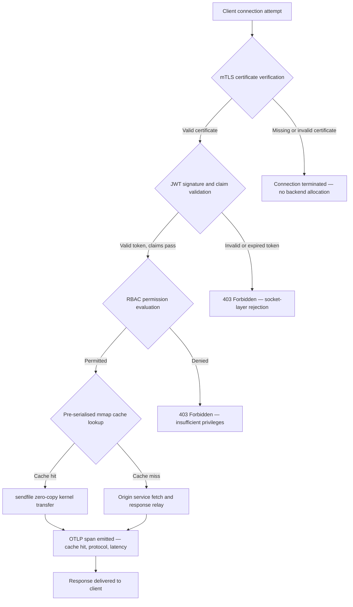

---

# Front Matter (YAML)

author: "contact@sebastienrousseau.com (Sebastien Rousseau)"
banner_alt: "ทิวทัศน์เมืองนามธรรมบนวงจรพิมพ์ในยามค่ำคืน — แสดงให้เห็น edge ของธนาคารที่การถ่ายโอน zero-copy ระดับเคอร์เนล การจับมือ mTLS และการตรวจสอบ JWT มาบรรจบกันในไบนารีที่เชื่อมต่อแบบสแตติกเพียงตัวเดียว"
banner_height: "1597"
banner_width: "2584"
banner: "https://cloudcdn.pro/stocks/images/bit-cloud-GlqbGLCPnQ4.webp"
cdn: "https://cloudcdn.pro"
charset: "UTF-8"
cname: "sebastienrousseau.com"
copyright: "© Copyright 2025 - 2026 - Sebastien Rousseau. All rights reserved."
date: "June 20, 2026"
description: "http-handle คือไบนารี Rust ที่เชื่อมต่อแบบสแตติกซึ่งส่งมอบ 180,000 คำขอต่อวินาทีที่ edge ของธนาคารโดยไม่มีการพึ่งพา runtime ใด ๆ มีการตรวจสอบ mTLS และ JWT ในตัว HTTP/2 และ HTTP/3 ที่เจรจาผ่าน ALPN และการสังเกตการณ์ OTLP — ปิดช่องว่างด้านความปลอดภัยและความยืดหยุ่นที่ Nginx และ Envoy ทิ้งไว้"
format-detection: "telephone=no"
hreflang: "th"
icon: "https://cloudcdn.pro/clients/sebastienrousseau/v1/logos/sebastienrousseau.svg"
id: "https://sebastienrousseau.com/2026-06-20-http-handle-zero-dependency-edge-ingress-banking-rust-2026"
image_alt: "ภาพถ่ายขาวดำของ Sebastien Rousseau"
image_height: "162"
image_width: "162"
image: "https://cloudcdn.pro/stocks/images/sebastienrousseau.webp"
keywords: "http-handle, Rust edge ingress, พร็อกซีไร้การพึ่งพา, โครงสร้างพื้นฐานธนาคาร, mTLS JWT, sendfile zero-copy, ALPN HTTP3, การปฏิบัติตาม DORA, Basel III, การสังเกตการณ์ OTLP, ไบนารีสแตติก, ARM64 banking, zero trust banking, ingress น้ำหนักเบา, ความปลอดภัยธนาคาร Rust"
language: "th-TH"
last_reviewed: "2026-06-20"
layout: "report"
locale: "th_TH"
logo_alt: "โลโก้ของ Sebastien Rousseau"
logo_height: "44"
logo_width: "44"
logo: "https://cloudcdn.pro/clients/sebastienrousseau/v1/logos/sebastienrousseau.svg"
menu: ""
measurementID: "G-169G4ET5HQ"
name: "Sebastien Rousseau"
permalink: "https://sebastienrousseau.com/2026-06-20-http-handle-zero-dependency-edge-ingress-banking-rust-2026"
rating: "general"
referrer: "no-referrer"
robots: "index, follow"
schema: "FAQPage, Article"
seo_title: "http-handle: Rust Ingress ไร้การพึ่งพาสำหรับธนาคารที่ 180k req/s"
short_name: "sebastienrousseau"
subtitle: "ไบนารี Rust ที่เชื่อมต่อแบบสแตติกเพียงตัวเดียวส่งมอบ 180,000 คำขอต่อวินาทีพร้อม mTLS, JWT และ ALPN ที่ edge ของธนาคารได้อย่างไร — และหมายความว่าอย่างไรสำหรับการปฏิบัติตาม DORA และ Basel III"
tags: "http-handle, Rust, banking, edge-ingress, mTLS, JWT, ALPN, HTTP3, DORA, Basel-III, zero-copy, sendfile, ARM64, zero-trust, OTLP, observability, open-source, infrastructure"
theme-color: "0, 83, 191"
title: "http-handle: Edge Ingress ประสิทธิภาพสูงไร้การพึ่งพาสำหรับธนาคารในปี 2026"
url: "https://sebastienrousseau.com/2026-06-20-http-handle-zero-dependency-edge-ingress-banking-rust-2026"
viewport: "width=device-width, initial-scale=1, shrink-to-fit=no"

# RSS - The RSS feed front matter (YAML).
atom_link: "https://sebastienrousseau.com/2026-06-20-http-handle-zero-dependency-edge-ingress-banking-rust-2026/rss.xml"
category: "Technology"
docs: https://validator.w3.org/feed/docs/rss2.html
generator: "Static Site Generator (SSG) (version 0.0.40)"
item_description: "http-handle คือไบนารี Rust ที่เชื่อมต่อแบบสแตติกซึ่งส่งมอบ 180,000 คำขอต่อวินาทีที่ edge ของธนาคารโดยไม่มีการพึ่งพา runtime ใด ๆ มีการตรวจสอบ mTLS และ JWT ในตัว HTTP/2 และ HTTP/3 ที่เจรจาผ่าน ALPN และการสังเกตการณ์ OTLP — ปิดช่องว่างด้านความปลอดภัยและความยืดหยุ่นที่ Nginx และ Envoy ทิ้งไว้"
item_guid: "https://sebastienrousseau.com/2026-06-20-http-handle-zero-dependency-edge-ingress-banking-rust-2026/rss.xml"
item_link: "https://sebastienrousseau.com/2026-06-20-http-handle-zero-dependency-edge-ingress-banking-rust-2026/rss.xml"
item_pub_date: "Sat, 20 Jun 2026 07:07:07 +0000"
item_title: "http-handle: Edge Ingress ประสิทธิภาพสูงไร้การพึ่งพาสำหรับธนาคารในปี 2026"
last_build_date: "Sat, 20 Jun 2026 07:07:07 +0000"
managing_editor: "contact@sebastienrousseau.com (Sebastien Rousseau)"
pub_date: "Sat, 20 Jun 2026 07:07:07 +0000"
ttl: "60"
type: "article"
webmaster: "contact@sebastienrousseau.com"

# Apple - The Apple front matter (YAML).
apple_mobile_web_app_orientations: "portrait"
apple_touch_icon_sizes: "192x192"
apple-mobile-web-app-capable: "yes"
apple-mobile-web-app-status-bar-inset: "black"
apple-mobile-web-app-status-bar-style: "black-translucent"
apple-mobile-web-app-title: "Edge ธนาคารไร้การพึ่งพา"
apple-touch-fullscreen: "yes"

# MS Application - The MS Application front matter (YAML).

msapplication-navbutton-color: "0, 83, 191"

# Twitter Card - The Twitter Card front matter (YAML).

twitter_card: "summary_large_image"
twitter_creator: "@wwdseb"
twitter_description: "http-handle คือไบนารี Rust ที่เชื่อมต่อแบบสแตติกซึ่งส่งมอบ 180,000 คำขอต่อวินาทีที่ edge ของธนาคารโดยไม่มีการพึ่งพา runtime ใด ๆ พร้อม mTLS, JWT และการสังเกตการณ์ OTLP"
twitter_image: "https://cloudcdn.pro/clients/sebastienrousseau/v1/logos/sebastienrousseau.svg"
twitter_image_alt: "Logo of Sebastien Rousseau"
twitter_site: "@wwdseb"
twitter_title: "http-handle: Rust Ingress ไร้การพึ่งพาสำหรับธนาคารที่ 180k req/s"
twitter_url: "https://sebastienrousseau.com/2026-06-20-http-handle-zero-dependency-edge-ingress-banking-rust-2026"

# Humans.txt - The Humans.txt front matter (YAML).
author_website: "https://sebastienrousseau.com"
author_twitter: "@wwdseb"
author_location: "London, UK"
thanks: "Thanks for reading!"
site_last_updated: "2026-06-20"
site_standards: "HTML5, CSS3, RSS, Atom, JSON, XML, YAML, Markdown, TOML"
site_components: "Kaishi, Kaishi Builder, Kaishi CLI, Kaishi Templates, Kaishi Themes"
site_software: "Static Site Generator, Rust"

---

# http-handle: Edge Ingress ประสิทธิภาพสูงไร้การพึ่งพาสำหรับธนาคารในปี 2026

<!-- lead-start -->
<aside class="post-lead" aria-label="สรุปบทความ">

<strong>TL;DR.</strong> http-handle คือไบนารี Rust แบบโอเพ่นซอร์สที่เชื่อมต่อแบบสแตติกซึ่งแทนที่ Nginx และ Envoy ที่ edge ของธนาคาร โดยส่งมอบ 180,000 คำขอต่อวินาทีบนโหนด ARM64 ผ่านการถ่ายโอน zero-copy <code>sendfile(2)</code> ของ Linux บังคับใช้ mTLS และการตรวจสอบ JWT บนเลเยอร์ซ็อกเก็ตเครือข่ายก่อนที่โค้ดแอปพลิเคชันใด ๆ จะทำงาน เจรจา HTTP/2 และ HTTP/3 โดยอัตโนมัติผ่าน ALPN และส่งเมตริก OpenTelemetry แบบเนทีฟ — ทั้งหมดนี้โดยไม่มีการพึ่งพา runtime นอกจาก <code>libc</code>

<strong>ข้อสรุปสำคัญ</strong>

<ul class="post-lead-takeaways">
  <li><strong>ปัญหาของพร็อกซีหนัก</strong> Nginx และ Envoy มีต้นไม้การพึ่งพาที่ขยายพื้นผิว CVE และทำให้วงจรแก้ไขความเสี่ยง ICT ตาม DORA ซับซ้อนยิ่งขึ้น</li>
  <li><strong>ประสิทธิภาพ zero-copy ในระดับขนาดใหญ่</strong> บล็อกแคช mmap ที่ซีเรียลไลซ์ล่วงหน้าและการถ่ายโอนเคอร์เนล <code>sendfile(2)</code> รักษา 180,000 req/s บน ARM64 โดยมีค่าใช้จ่ายพร็อกซีต่ำกว่าหนึ่งมิลลิวินาที</li>
  <li><strong>ความปลอดภัยที่ซ็อกเก็ต ไม่ใช่แอปพลิเคชัน</strong> การตรวจสอบใบรับรองไคลเอ็นต์ mTLS การตรวจสอบ JWT และการประเมิน RBAC เสร็จสมบูรณ์ก่อนที่ทรัพยากร backend ใด ๆ จะถูกจัดสรรสำหรับคำขอ</li>
  <li><strong>การจัดตำแหน่งกฎระเบียบในตัว</strong> พื้นผิวการโจมตีที่ลดลงและการปรับใช้ไบนารีเดียวที่ตรวจสอบได้โดยตรงตอบสนองต่อข้อ 5 และ 6 ของ DORA ความเสี่ยงด้านการดำเนินงาน Basel III และห่วงโซ่ความรับผิดชอบ SM&CR</li>
</ul>

<strong>การอ่านที่เกี่ยวข้อง:</strong> <a href="https://sebastienrousseau.com/2026-06-18-noyalib-safe-yaml-rust-ai-mcp-financial-infrastructure-2026">ทำไม YAML จึงต้องการสแต็ก Rust ที่ปลอดภัยกว่าสำหรับ AI, MCP และโครงสร้างพื้นฐานทางการเงินในปี 2026</a>, <a href="https://sebastienrousseau.com/2026-06-11-cloudcdn-open-source-blueprint-ai-native-edge-2026">CloudCDN: แผนผังโอเพ่นซอร์สสำหรับ AI-Native Edge ในปี 2026</a>, <a href="https://sebastienrousseau.com/2026-05-16-best-cloud-infrastructure-architecture-2026">สถาปัตยกรรมโครงสร้างพื้นฐานคลาวด์ที่ดีที่สุดสำหรับธนาคารและสถาบันการเงินในปี 2026</a>

</aside>
<!-- lead-end -->

edge ของธนาคารมีปัญหาการพึ่งพา ทุก instance ของ Nginx หรือ Envoy ที่กำหนดเส้นทางการรับส่งข้อมูลระหว่างไคลเอ็นต์และบริการธนาคารหลักมีต้นไม้การพึ่งพา: การสร้าง OpenSSL โมดูล Lua ไลบรารี gRPC และเลเยอร์คอนเทนเนอร์ — แต่ละอันเป็น CVE ที่อาจเกิดขึ้น แต่ละอันต้องการวงจรการแพตช์โดยเฉพาะ แต่ละอันเพิ่มความแปรปรวนของเวลาแฝงที่ทำให้การวัด SLA ซับซ้อนขึ้น ภายใต้ [Digital Operational Resilience Act (DORA)](https://eur-lex.europa.eu/eli/reg/2022/2554/oj) ความซับซ้อนนั้นขณะนี้เป็นความรับผิดทางกฎระเบียบเท่าเทียมกับการดำเนินงาน

[http-handle](https://github.com/sebastienrousseau/http-handle) ใช้แนวทางที่แตกต่าง เป็นไบนารี Rust เดียวที่เชื่อมต่อแบบสแตติกโดยไม่มีการพึ่งพา runtime นอกจาก `libc` ส่งมอบ 180,000 คำขอต่อวินาทีบนโหนด ARM64 บังคับใช้ TLS แบบร่วมกันและการตรวจสอบ JWT บนเลเยอร์ซ็อกเก็ตเครือข่าย และเจรจา HTTP/2 และ HTTP/3 โดยอัตโนมัติ — ทั้งหมดในพื้นที่การปรับใช้ต่ำกว่า 20 MB ของ RAM

## คำตอบด่วน

**http-handle คืออะไรในหนึ่งประโยค?** http-handle คือไบนารี Rust แบบโอเพ่นซอร์สที่เชื่อมต่อแบบสแตติกซึ่งแทนที่คอนเทนเนอร์พร็อกซีหนักที่ edge ของธนาคาร โดยส่งมอบ 180,000 req/s บน ARM64 ผ่านการถ่ายโอนเคอร์เนล zero-copy `sendfile(2)` ของ Linux บังคับใช้ mTLS, JWT และ RBAC บนเลเยอร์ซ็อกเก็ตก่อนที่ทรัพยากร backend ใด ๆ จะถูกสัมผัส และส่งเมตริก [OpenTelemetry](https://opentelemetry.io/) แบบเนทีฟ — โดยไม่มีการพึ่งพาไลบรารี runtime นอกจาก `libc`

## บทสรุปสำหรับผู้บริหาร

ธนาคารใช้ Nginx และ Envoy ที่ edge มาเป็นเวลาหนึ่งทศวรรษ ทั้งสองมีความสามารถ แต่ไม่มีอันไหนที่ออกแบบสำหรับสภาพแวดล้อมกฎระเบียบปี 2026 ภาพคอนเทนเนอร์ที่มีการพึ่งพาจำนวนมากสร้างคิว CVE ที่ทีมปฏิบัติตามไม่สามารถล้างได้เร็วพอ และทุกการอัปเกรดเวอร์ชันไลบรารีมีความเสี่ยงการถดถอย ข้อ 5 และ 6 ของ DORA กำหนดให้ความเสี่ยง ICT ได้รับการจัดการตามการออกแบบ ไม่ใช่แก้ไขหลังการค้นพบ กรอบความเสี่ยงด้านการดำเนินงาน Basel III ลงโทษสถาปัตยกรรมที่จุดล้มเหลวคูณด้วยความซับซ้อนของระบบ

http-handle กำจัดปัญหาการพึ่งพาจากแหล่งที่มา ไบนารีถูกคอมไพล์ครั้งเดียวแบบสแตติกโดยไม่มีข้อกำหนดไลบรารีภายนอกในขณะทำงาน พื้นผิวการโจมตีหดตัวลงสู่ไลบรารีมาตรฐาน Rust บวก `libc` การบังคับใช้ความปลอดภัย — การตรวจสอบใบรับรอง mTLS การตรวจสอบอ้างสิทธิ์ JWT และการควบคุมการเข้าถึงตามบทบาท — ดำเนินการบนซ็อกเก็ตเครือข่ายก่อนการจัดสรร backend ใด ๆ ทำให้ขอบเขต Zero Trust ยุบตัวลงสู่การแสดงออกที่เล็กที่สุดที่เป็นไปได้ ประสิทธิภาพตามมาจากสถาปัตยกรรม: บล็อกแคชที่แมปในหน่วยความจำที่ซีเรียลไลซ์ล่วงหน้าร่วมกับการถ่ายโอนเคอร์เนล `sendfile(2)` ลบข้อมูลออกจากเส้นทางการคัดลอก CPU-ต่อ-หน่วยความจำโดยสมบูรณ์ รักษา 180,000 req/s บนฮาร์ดแวร์ ARM64 ผลลัพธ์คือเลเยอร์ ingress ที่ตอบสนองความต้องการความยืดหยุ่น DORA สนับสนุนข้อโต้แย้งการลดความเสี่ยงด้านการดำเนินงาน Basel III และมอบห่วงโซ่ความรับผิดชอบส่วนประกอบเดียวที่ตรวจสอบได้แก่ผู้นำ IT อาวุโสภายใต้ SM&CR สำหรับโครงสร้างพื้นฐาน edge

## ข้อสรุปสำคัญ

- **ไบนารีขนาดเล็กลง คิว CVE ขนาดเล็กลง** ไบนารีเดียวที่เชื่อมต่อแบบสแตติกมีแพ็กเกจเดียวที่จะแพตช์ การเผยแพร่เดียวที่จะตรวจสอบ และอาร์ทิแฟกต์เดียวที่จะตรวจสอบ Nginx ที่มีชุดโมดูลมาตรฐานมาพร้อมกับการพึ่งพาไลบรารีที่ใช้ร่วมกันมากกว่า 30 รายการ แต่ละรายการมีวงจรชีวิตความเสี่ยงของตัวเอง
- **Zero-copy ไม่ใช่การปรับแต่ง — เป็นข้อจำกัดการออกแบบ** ที่ 180,000 req/s การคัดลอกข้อมูลในพื้นที่ผู้ใช้ใด ๆ จะแนะนำความแปรปรวนของเวลาแฝงที่วัดได้ `sendfile(2)` ถ่ายโอนเนื้อหาตัวอธิบายไฟล์ไปยังซ็อกเก็ตเครือข่ายทั้งหมดในพื้นที่เคอร์เนล รวมกับบล็อกแคชการตอบสนองที่ตรึงด้วย mmap CPU จะไม่สัมผัสเส้นทางข้อมูลสำหรับการตอบสนองที่แคช
- **ขอบเขตความปลอดภัยเป็นของซ็อกเก็ต** การตรวจสอบ JWT และใบรับรอง mTLS ในมิดเดิลแวร์แอปพลิเคชันหมายความว่า backend ได้จัดสรรเธรดและหน่วยความจำแล้วก่อนที่คำขอจะถูกปฏิเสธ การตรวจสอบเลเยอร์ซ็อกเก็ตทำให้มั่นใจว่าคำขอที่ไม่ได้รับการตรวจสอบสิทธิ์จะไม่ใช้ทรัพยากร backend เลย
- **OTLP กำจัดช่องว่างการสังเกตการณ์** การรวม OpenTelemetry แบบเนทีฟหมายความว่าทุกคำขอ ทุกการตัดสินใจตรวจสอบสิทธิ์ และทุกการเจรจาโปรโตคอลสร้างการวัดโทรคมนาคมที่มีโครงสร้างโดยไม่มีตัวแทน sidecar แดชบอร์ดธนาคารที่มีอยู่รับ OTLP traces โดยตรง

**การอ่านที่เกี่ยวข้อง:** [ทำไม YAML จึงต้องการสแต็ก Rust ที่ปลอดภัยกว่าสำหรับ AI, MCP และโครงสร้างพื้นฐานทางการเงินในปี 2026](https://sebastienrousseau.com/2026-06-18-noyalib-safe-yaml-rust-ai-mcp-financial-infrastructure-2026/), [CloudCDN: แผนผังโอเพ่นซอร์สสำหรับ AI-Native Edge ในปี 2026](https://sebastienrousseau.com/2026-06-11-cloudcdn-open-source-blueprint-ai-native-edge-2026/), [สถาปัตยกรรมโครงสร้างพื้นฐานคลาวด์ที่ดีที่สุดสำหรับธนาคารและสถาบันการเงินในปี 2026](https://sebastienrousseau.com/2026-05-16-best-cloud-infrastructure-architecture-2026/)

## 01. ปัญหาพร็อกซีหนักในธนาคาร

Nginx และ Envoy สร้าง edge ของอินเทอร์เน็ตสมัยใหม่ มีการกำหนดค่าได้ ผ่านการทดสอบในการต่อสู้ และได้รับการสนับสนุนจากชุมชนขนาดใหญ่ แต่ยังเป็นตัวเลือกทางสถาปัตยกรรมที่ทำขึ้นก่อนที่ DORA จะมีอยู่ ก่อนที่กรอบความเสี่ยงด้านการดำเนินงาน Basel III จะเรียกร้องการลดความซับซ้อนที่วัดได้ และก่อนที่โหนดคลาวด์ ARM64 จะเปลี่ยนเศรษฐศาสตร์ของการคำนวณปริมาณงานสูง

ผลที่ตามมาในทางปฏิบัติคือช่องว่างระหว่างสิ่งที่ธนาคารต้องการและสิ่งที่คอนเทนเนอร์พร็อกซีหนักส่งมอบ

**พื้นผิวการพึ่งพา** การปรับใช้ Envoy มาตรฐานดึง OpenSSL, Abseil, Protobuf, gRPC, Lua และไลบรารีรองหลายสิบรายการ แต่ละรายการมีวงจรชีวิต CVE อิสระ เมื่อ National Vulnerability Database เผยแพร่คำแนะนำ OpenSSL ที่สำคัญ ทุก instance ของ Envoy ในทรัพย์สินกลายเป็นนาฬิกาการปฏิบัติตาม: ประเมิน แพตช์ ทดสอบ ปรับใช้ใหม่ และรับรองใหม่ — ในทุกสภาพแวดล้อมที่ไบนารีทำงาน ภายใต้ข้อ 6 ของ DORA ธนาคารต้องแสดงให้เห็นว่ากระบวนการจัดการความเสี่ยง ICT มีความสมส่วน มีเอกสาร และตรวจสอบได้ ต้นไม้การพึ่งพาหลายไลบรารีทำให้การแสดงนั้นมีราคาแพงในการรักษา

**ค่าใช้จ่ายหน่วยความจำ** กระบวนการทำงาน Nginx ที่กำหนดค่าขั้นต่ำใช้หน่วยความจำในการพักอาศัย 40–80 MB ภายใต้ภาระงานปานกลาง ในระดับขนาดใหญ่ — โหนด ingress หลายร้อยโหนดในระบบการซื้อขาย API การชำระเงิน และพอร์ทัลที่หันหน้าไปทางลูกค้า — ค่าใช้จ่ายนั้นสะสมเป็นต้นทุนโครงสร้างพื้นฐานที่วัดได้โดยไม่มีผลประโยชน์ด้านประสิทธิภาพที่สอดคล้องกันเมื่อเปรียบเทียบกับทางเลือกไบนารีเดียวที่ออกแบบมาอย่างดี

**ความเร็วในการแพตช์** ห่วงโซ่อุปทานภาพคอนเทนเนอร์แนะนำความล่าช้าหลายวันระหว่างการเผยแพร่ CVE และการแพตช์ที่ผ่านการตรวจสอบแล้วที่ถึงการผลิต ภาพฐานต้องสร้างใหม่ เลเยอร์แอปพลิเคชันต้องวางใหม่ เมทริกซ์การทดสอบทั้งหมดต้องรันใหม่ และไปป์ไลน์การปรับใช้ต้องดำเนินการใหม่ สำหรับระบบธนาคารที่สำคัญที่ทำงานภายใต้หน้าต่างการรายงานเหตุการณ์ DORA วงจรนี้เป็นความเสี่ยงเชิงโครงสร้าง

http-handle แก้ไขทั้งสาม ไบนารีเดียว พื้นผิว CVE เดียว อาร์ทิแฟกต์เดียวที่จะแพตช์ หน่วยความจำ RAM ต่ำกว่า 20 MB สำหรับโหนด ingress ในการผลิต

## 02. เลนส์สถาปัตยกรรม http-handle 2026

ไบนารีมีโครงสร้างเป็นห้าเลเยอร์ที่พึ่งพากัน แต่ละอันออกแบบเพื่อกำจัดประเภทความเสี่ยงเฉพาะที่สถาปัตยกรรมพร็อกซีแบบดั้งเดิมสะสม

### ตารางที่ 1: เลเยอร์สถาปัตยกรรม http-handle และการบรรเทาความเสี่ยง

| เลเยอร์ | การตัดสินใจออกแบบ | ทำไมจึงสำคัญ | ความเสี่ยงหากจัดการผิดพลาด |
| ---- | ---- | ---- | ---- |
| **แกนกลางเซิร์ฟเวอร์** | ไบนารี Rust เดียวเชื่อมต่อแบบสแตติก ไม่มีการพึ่งพานอกจาก `libc` | อาร์ทิแฟกต์เดียวที่จะแพตช์ กำจัดการแพร่กระจาย CVE ของไลบรารีทั่วทั้งทรัพย์สิน | การโจมตี dependency confusion การสะสมช่องโหว่ไลบรารี |
| **เครื่องยนต์เร่งความเร็ว** | บล็อกแคช mmap ที่ซีเรียลไลซ์ล่วงหน้าและการถ่ายโอนเคอร์เนล zero-copy `sendfile(2)` | 180,000 req/s บน ARM64 โดยมีค่าใช้จ่ายพร็อกซีต่ำกว่าหนึ่งมิลลิวินาที ไม่มีข้อมูลเข้าสู่พื้นที่ผู้ใช้สำหรับการตอบสนองที่แคช | การรั่วไหลของการแมปหน่วยความจำ คอขวดในพื้นที่เคอร์เนลภายใต้การทำให้แคชไม่ถูกต้อง |
| **ความปลอดภัยการเข้ารหัส** | mTLS แบบเนทีฟพร้อมการสนับสนุนการโหลดใบรับรองแบบฮอตและการเจรจา ALPN | รับประกันความสมบูรณ์ของข้อมูลและความเข้ากันได้ของโปรโตคอล การหมุนใบรับรองโดยไม่ทิ้งการเชื่อมต่อ | การหมดอายุใบรับรองทำให้เกิดการหยุดชะงักของบริการ ค่าเริ่มต้นชุดรหัสที่อ่อนแอ |
| **ระนาบนโยบายการเข้าถึง** | การตรวจสอบ JWT เลเยอร์ซ็อกเก็ตและการประเมินอ้างสิทธิ์ RBAC | คำขอที่ไม่ได้รับการตรวจสอบสิทธิ์ไม่ใช้ทรัพยากร backend Zero Trust บังคับใช้ที่ขอบเขตเคอร์เนล | การโจมตีความสับสนอัลกอริทึม JWT การกำหนดค่า RBAC ผิดพลาดที่ให้การเข้าถึงมากเกินไป |
| **การสังเกตการณ์** | การรวม [OpenTelemetry (OTLP)](https://opentelemetry.io/docs/specs/otlp/) แบบเนทีฟ | การวัดโทรคมนาคมที่มีโครงสร้างโดยไม่มีตัวแทน sidecar การนำเข้าโดยตรงในทรัพย์สินการตรวจสอบธนาคารที่มีอยู่ | จุดบอดระหว่างการหยุดชะงัก เส้นทางการตรวจสอบที่ไม่สมบูรณ์สำหรับการรายงานเหตุการณ์ DORA |

## 03. สัญญาณประสิทธิภาพและความปลอดภัยสำคัญ

ธนาคารที่ใช้งาน http-handle ที่ edge ต้องวัดสัญญาณที่วัดได้ห้าอย่างเพื่อตอบสนองความต้องการการรายงานการดำเนินงาน DORA และการกำกับดูแล SLA ภายใน

### ตารางที่ 2: เกณฑ์มาตรฐานการดำเนินงานและการอ้างอิงกฎระเบียบ

| สัญญาณ | เกณฑ์มาตรฐาน | การอ้างอิงกฎระเบียบ | การนำไปใช้ทางเทคนิค |
| ---- | ---- | ---- | ---- |
| **ปริมาณงาน** | ≥ 180,000 req/s บนโหนด ARM64 ที่ P99 ≤ 1 ms ค่าใช้จ่ายพร็อกซี | ความเสี่ยงด้านการดำเนินงาน Basel III — การลดความซับซ้อนของระบบ | `sendfile(2)` + บล็อกแคช mmap ที่ซีเรียลไลซ์ล่วงหน้า ไม่มีการคัดลอกข้อมูลพื้นที่ผู้ใช้สำหรับการแคช hits |
| **พื้นผิวการโจมตี** | ไม่มีการพึ่งพาไลบรารี runtime ไบนารีอาร์ทิแฟกต์หนึ่งรายการต่อการเผยแพร่ | [ข้อ 6 DORA](https://eur-lex.europa.eu/eli/reg/2022/2554/oj) — การจัดการความเสี่ยง ICT ตามการออกแบบ | การคอมไพล์แบบสแตติกด้วย `cargo build --release --target aarch64-unknown-linux-musl` |
| **เวลาแฝงการตรวจสอบสิทธิ์** | การจับมือ mTLS + การตรวจสอบ JWT เสร็จสมบูรณ์ก่อนไบต์แรกของการตอบสนอง backend | [ข้อ 5 DORA](https://eur-lex.europa.eu/eli/reg/2022/2554/oj) — การป้องกันความปลอดภัย ICT | การสกัดกั้นเลเยอร์ซ็อกเก็ต การประเมินอ้างสิทธิ์ JWT ใน Rust ที่อยู่ติดกับเคอร์เนลก่อนการกำหนดเส้นทาง backend |
| **ความพร้อมใช้งานใบรับรอง** | การโหลดใบรับรอง mTLS แบบฮอตพร้อมการเชื่อมต่อที่ทิ้งเป็นศูนย์ระหว่างการหมุน | ความรับผิดชอบของผู้บริหารระดับสูง SM&CR สำหรับความพร้อมใช้งาน edge | ตัวเฝ้าดูใบรับรองที่ขับเคลื่อนด้วย inotify การสลับตัวอธิบายไฟล์แบบอะตอมิกระหว่างการโหลดใหม่ |
| **ความครอบคลุมการสังเกตการณ์** | 100% ของคำขอที่สร้าง OTLP spans พร้อมผลการตรวจสอบสิทธิ์ เวอร์ชันโปรโตคอล และสถานะแคช | ข้อ 17 DORA — การตรวจจับเหตุการณ์และการรายงาน | OTLP exporter แบบเนทีฟ ไม่ต้องการ sidecar gRPC หรือ HTTP/Protobuf transport ที่กำหนดค่าได้ |

## 04. เครื่องยนต์ Zero-Copy: mmap และ sendfile(2)

ประสิทธิภาพเครือข่ายในธนาคารความถี่สูง — การชำระเงินแบบเรียลไทม์ API ข้อมูลตลาด บริการโทเค็นการตรวจสอบสิทธิ์ — ถูกจำกัดด้วยข้อจำกัดหนึ่งมากกว่าสิ่งอื่นใด: ต้นทุนของการย้ายไบต์จากที่จัดเก็บไปยังซ็อกเก็ตเครือข่าย

เซิร์ฟเวอร์ HTTP ทั่วไปอ่านเนื้อหาไฟล์ลงในบัฟเฟอร์พื้นที่ผู้ใช้ จากนั้นเขียนบัฟเฟอร์นั้นไปยังซ็อกเก็ต ลำดับนั้นต้องการการคัดลอกหน่วยความจำสองครั้งและการสลับบริบทสองครั้งระหว่างพื้นที่ผู้ใช้และพื้นที่เคอร์เนลสำหรับทุกการตอบสนอง ที่ 180,000 คำขอต่อวินาที ค่าใช้จ่ายสะสมมีนัยสำคัญ

http-handle กำจัดการคัดลอกทั้งสอง

**บล็อกแคชที่แมปในหน่วยความจำ** เมื่อบริการเริ่มต้น จะซีเรียลไลซ์เนื้อหาการตอบสนองแบบสแตติกในภูมิภาคที่แมปในหน่วยความจำโดยใช้ `mmap(2)` ภูมิภาคเหล่านี้ถูกตรึงในแคชหน้าของเคอร์เนล เมื่อคำขอมาถึงสำหรับทรัพยากรที่แคช การตอบสนองจะถูกแมปในหน่วยความจำเคอร์เนลแล้ว — ไม่มีการอ่านดิสก์ ไม่มีการจัดสรรบัฟเฟอร์

**การถ่ายโอนเคอร์เนล `sendfile(2)`** การเรียกระบบ Linux `sendfile(2)` ถ่ายโอนข้อมูลโดยตรงจากตัวอธิบายไฟล์ — หรือภูมิภาคที่แมปในหน่วยความจำ — ไปยังตัวอธิบายไฟล์ซ็อกเก็ตเครือข่ายทั้งหมดภายในเคอร์เนล ไม่มีไบต์ใดเข้าสู่พื้นที่ผู้ใช้ บทบาทของ CPU ลดลงเหลือเพียงการออกการเรียกระบบและการจัดการเหตุการณ์การเสร็จสมบูรณ์ บนโหนด ARM64 ที่มีสถาปัตยกรรมนี้ http-handle รักษา 180,000 req/s ที่ค่าใช้จ่ายพร็อกซีต่ำกว่าหนึ่งมิลลิวินาทีภายใต้ภาระงานที่ต่อเนื่อง

สำหรับธนาคารที่ดำเนินการกระทบยอดแบตช์สิ้นเดือน การรายงานสภาพคล่องในวันเดียวกัน หรือการรับส่งข้อมูล API การให้คะแนนการฉ้อโกงแบบเรียลไทม์ ผลที่ตามมาทางวิศวกรรมนั้นตรงไปตรงมา: โหนด ARM64 น้อยลงต่อเลเยอร์การรับส่งข้อมูล ต้นทุนโครงสร้างพื้นฐานต่ำลง และความเสี่ยงความยืดหยุ่น DORA ขนาดเล็กลงจากการขาดความจุ

## 05. ระนาบนโยบายการเข้าถึง mTLS และ JWT

ในธนาคาร การตรวจสอบสิทธิ์ที่ edge ไม่ใช่คุณสมบัติ — เป็นข้อกำหนดกฎระเบียบ DORA กำหนดให้การควบคุมความปลอดภัย ICT มีความสมส่วน มีเอกสาร และตรวจสอบได้ SM&CR วางความรับผิดชอบส่วนตัวสำหรับการตัดสินใจด้านความปลอดภัยโครงสร้างพื้นฐานบนผู้จัดการอาวุโสที่ได้รับการแต่งตั้ง คำถามไม่ใช่ว่าจะตรวจสอบสิทธิ์ที่ edge หรือไม่ แต่เป็นเลเยอร์ใด

http-handle บังคับใช้นโยบาย Zero Trust สามขั้นตอนก่อนที่ทรัพยากร backend ใด ๆ จะถูกจัดสรร

**ขั้นตอนที่ 1: การตรวจสอบใบรับรองไคลเอ็นต์ mTLS** ระหว่างการจับมือ TLS http-handle ขอและตรวจสอบใบรับรองไคลเอ็นต์เทียบกับที่เก็บความไว้วางใจที่กำหนดค่าได้ การเชื่อมต่อที่ไม่มีใบรับรองที่ถูกต้องจะสิ้นสุดที่การจับมือ ไม่มีเธรดแอปพลิเคชันที่สร้างขึ้น ไม่มีพูลหน่วยความจำที่จัดสรร backend จะไม่เห็นคำขอเลย

**ขั้นตอนที่ 2: การตรวจสอบอ้างสิทธิ์ JWT** สำหรับการเชื่อมต่อที่ผ่าน mTLS http-handle ดึงและตรวจสอบ JSON Web Token จากส่วนหัว `Authorization` ที่เลเยอร์ซ็อกเก็ต การตรวจสอบลายเซ็น การตรวจสอบการหมดอายุ และการตรวจสอบผู้ออกใบรับรองเกิดขึ้นก่อนที่คำขอจะถึงเลเยอร์การกำหนดเส้นทาง การโจมตีความสับสนอัลกอริทึม — ที่เซิร์ฟเวอร์ยอมรับอัลกอริทึมสมมาตรเมื่อคาดหวังกุญแจอสมมาตร — ถูกบล็อกโดยรายการที่อนุญาตอัลกอริทึมอย่างชัดเจนในการกำหนดค่า

**ขั้นตอนที่ 3: การประเมินอ้างสิทธิ์ RBAC** อ้างสิทธิ์ JWT ที่ผ่านการตรวจสอบแมปไปยังตารางบทบาทในหน่วยความจำ คำขอที่มีสิทธิ์ไม่เพียงพอได้รับการตอบสนอง 403 ที่ระนาบนโยบายการเข้าถึง บริการ backend จะไม่ถูกเรียกใช้สำหรับการรับส่งข้อมูลที่ไม่ได้รับอนุญาต

การจัดลำดับนี้มีความสำคัญทางการดำเนินงาน ภายใต้โมเดลดั้งเดิม — ที่การตรวจสอบสิทธิ์ทำงานในมิดเดิลแวร์แอปพลิเคชัน — ผู้โจมตีสามารถหมดพูลเธรด backend ด้วยคำขอที่ไม่ได้รับการตรวจสอบสิทธิ์ก่อนที่จะออกการปฏิเสธเพียงครั้งเดียว การตรวจสอบสิทธิ์เลเยอร์ซ็อกเก็ตยุบเวกเตอร์การโจมตีนั้นโดยสมบูรณ์

## 06. การกำหนดเส้นทาง ALPN และห่วงโซ่สำรอง HTTP/3

การรับส่งข้อมูลธนาคารมาถึงในสภาพเครือข่ายที่หลากหลาย: ไฟเบอร์องค์กรสำหรับโต๊ะซื้อขาย 5G สำหรับลูกค้าธนาคารมือถือ การเชื่อมต่อดาวเทียมสำหรับการดำเนินงานระยะไกล และพร็อกซีการตรวจสอบ TLS ในสภาพแวดล้อมที่มีการควบคุม ingress โปรโตคอลเดียวสร้างข้อจำกัดตัวหารร่วมที่เล็กที่สุด

http-handle ใช้ [Application-Layer Protocol Negotiation (ALPN)](https://www.rfc-editor.org/rfc/rfc7301) เพื่อเลือกโปรโตคอลที่เหมาะสมที่สุดสำหรับแต่ละการเชื่อมต่อโดยอัตโนมัติ

**HTTP/2** เป็นค่าเริ่มต้นสำหรับการรับส่งข้อมูลเบราว์เซอร์และ API ผ่าน TCP สตรีมมัลติเพล็กซ์ผ่านการเชื่อมต่อเดียวกำจัด head-of-line blocking ที่ HTTP/1.1 แนะนำภายใต้รูปแบบคำขอพร้อมกัน

**HTTP/3 (QUIC)** เปิดใช้งานเมื่อเครือข่ายรองรับ UDP และไคลเอ็นต์โฆษณา `h3` ในส่วนขยาย ALPN การมัลติเพล็กซ์สตรีมอิสระและการย้ายการเชื่อมต่อของ QUIC ทำให้ดีกว่าอย่างมีนัยสำคัญสำหรับลูกค้าธนาคารมือถือบนเครือข่ายมือถือที่แออัดที่การเชื่อมต่อ TCP ตัดและเชื่อมต่อใหม่บ่อยครั้ง

**การสำรองแบบสง่างาม** หากการเจรจา ALPN ล้มเหลว — เพราะพร็อกซีตัวกลางลบส่วนขยายออกหรือไคลเอ็นต์รุ่นเก่าละเว้น — http-handle จะกลับไปที่ HTTP/1.1 ในขณะที่รักษาส่วนหัวความปลอดภัยทั้งหมด การบังคับใช้ mTLS และการตรวจสอบ JWT ไม่มีคุณสมบัติความปลอดภัยใดที่ลดลงระหว่างการสำรองโปรโตคอล

## 07. วงจรชีวิตคำขอ Zero-Copy

แผนภาพต่อไปนี้แสดงเส้นทางคำขอที่สมบูรณ์จากการเชื่อมต่อไคลเอ็นต์ไปยังการส่งมอบการตอบสนอง รวมถึงประตูการตรวจสอบสิทธิ์และจุดการปล่อยการสังเกตการณ์

เส้นทางสำคัญสำหรับการตอบสนอง cache hit ผ่านประตูความปลอดภัยสามประตูและการเรียกระบบหนึ่งครั้ง ไม่มีการจัดสรรบัฟเฟอร์พื้นที่ผู้ใช้สำหรับเนื้อหาการตอบสนอง OTLP span จับผลการตรวจสอบสิทธิ์ เวอร์ชันโปรโตคอลที่เจรจาด้วย ALPN สถานะแคช และเวลาแฝง end-to-end ในบันทึกที่มีโครงสร้างเดียว

## 08. การจัดตำแหน่งกฎระเบียบ: DORA, Basel III และ SM&CR

### ข้อ 5 และ 6 DORA — การจัดการความเสี่ยง ICT และการป้องกัน

[ข้อ 5 DORA](https://eur-lex.europa.eu/eli/reg/2022/2554/oj) กำหนดให้นิติบุคคลทางการเงินรักษากรอบการจัดการความเสี่ยง ICT ข้อ 6 กำหนดให้พวกเขาดำเนินการมาตรการป้องกันและการป้องกันที่สมส่วนกับโปรไฟล์ความเสี่ยงของระบบ ICT ของพวกเขา

ไบนารีเดียวที่เชื่อมต่อแบบสแตติกตอบสนองความต้องการทั้งสองได้อย่างมีประสิทธิภาพมากกว่าสแต็กคอนเทนเนอร์หลายไลบรารี พื้นผิวการโจมตีสามารถวัดได้ — อาร์ทิแฟกต์หนึ่งรายการ การพึ่งพาหนึ่งรายการ (`libc`) พื้นผิว CVE หนึ่ง — และมาตรการป้องกันเป็นโครงสร้างแทนที่จะเป็นขั้นตอน: การบังคับใช้ mTLS และ JWT ไม่สามารถหลีกเลี่ยงได้โดยการกำหนดค่าผิดพลาดเพราะทำงานที่เลเยอร์ซ็อกเก็ตก่อนที่ตรรกะแอปพลิเคชันที่กำหนดค่าได้ใด ๆ จะทำงาน

### Basel III — ข้อกำหนดเงินทุนความเสี่ยงด้านการดำเนินงาน

[กรอบความเสี่ยงด้านการดำเนินงาน Basel III](https://www.bis.org/bcbs/basel3.htm) เชื่อมโยงข้อกำหนดเงินทุนกฎระเบียบกับการลดความเสี่ยงที่แสดงให้เห็นได้ ธนาคารที่สามารถบันทึกการลดลงที่วัดได้ในความซับซ้อนของระบบและจำนวนจุดล้มเหลว ICT มีข้อโต้แย้งที่วัดได้สำหรับการจัดสรรเงินทุนความเสี่ยงด้านการดำเนินงานที่ลดลง การแทนที่ทรัพย์สินพร็อกซีหลายคอนเทนเนอร์ด้วยโหนด ingress ไบนารีเดียวคือประเภทการลดความซับซ้อนที่รองรับข้อโต้แย้งนี้ — โดยมีเงื่อนไขว่าทีมวิศวกรรมสามารถผลิตเอกสารการรับรอง

อาร์ทิแฟกต์การเผยแพร่ที่ตรวจสอบได้ของ http-handle — การสร้างที่ทำซ้ำได้ ไฟล์รายการการพึ่งพาที่เข้ากันได้กับ SBOM และบันทึกการดำเนินงานที่ใช้ OTLP — รองรับห่วงโซ่เอกสารที่การอภิปรายเงินทุน Basel III ต้องการ

### SM&CR — ความรับผิดชอบผู้จัดการอาวุโส

[Senior Managers and Certification Regime (SM&CR)](https://www.fca.org.uk/firms/senior-managers-certification-regime) วางความรับผิดส่วนตัวบนผู้จัดการอาวุโสที่ได้รับการแต่งตั้งสำหรับท่าทีความปลอดภัย ICT ของระบบภายใต้ความรับผิดชอบของพวกเขา ingress ไบนารีเดียวที่โหลดใบรับรองแบบฮอตโดยไม่มีการหยุดชะงักของบริการ ผลิตบันทึกการตรวจสอบที่มีโครงสร้างผ่าน OTLP และมีอาร์ทิแฟกต์ที่กำหนดเวอร์ชันหนึ่งรายการต่อการปรับใช้ มอบห่วงโซ่ความปลอดภัยที่ตรวจสอบและบันทึกได้แก่ผู้จัดการอาวุโสที่ได้รับการแต่งตั้ง สแต็กคอนเทนเนอร์หลายไลบรารีไม่ได้ทำเช่นนั้น

## 09. ความหมายตามบทบาท

### คณะกรรมการบริษัทและประธานเจ้าหน้าที่บริหาร

การปรับแต่งเงินทุนกฎระเบียบภายใต้กรอบความเสี่ยงด้านการดำเนินงาน Basel III ขึ้นอยู่กับการลดความซับซ้อนที่แสดงให้เห็นได้ การแทนที่ Nginx หรือ Envoy ด้วยไบนารีเดียวที่เชื่อมต่อแบบสแตติกลดจำนวนจุดล้มเหลว ICT ในลักษณะที่ตรวจสอบได้และนำเสนอต่อผู้กำกับดูแลด้านความระมัดระวัง พื้นผิว CVE ที่ลดลงยังรองรับการเจรจาใหม่เบี้ยประกันภัยไซเบอร์ — ผู้ประกันภัยกำหนดราคาตามเมตริกพื้นผิวการโจมตีที่แสดงให้เห็นได้ และไบนารี ingress ที่มีการพึ่งพาเดียวเป็นจุดข้อมูลที่เป็นรูปธรรม

### ประธานเจ้าหน้าที่ฝ่ายความปลอดภัยสารสนเทศและประธานเจ้าหน้าที่ฝ่ายความเสี่ยง

การปฏิบัติตาม DORA กำหนดให้มาตรการป้องกัน ICT มีความสมส่วนและตรวจสอบได้ การบังคับใช้ mTLS และ JWT เลเยอร์ซ็อกเก็ตมอบประตูการตรวจสอบสิทธิ์ที่ตรวจสอบได้และไม่สามารถหลีกเลี่ยงได้ที่ edge การหมุนใบรับรองแบบฮอตลบความเสี่ยงหน้าต่างบริการที่การอัปเดตใบรับรองแบบดั้งเดิมมี โมเดลการคอมไพล์แบบไม่พึ่งพาหมายความว่าเมื่อมีการเผยแพร่คำแนะนำ `libc` ที่สำคัญ ทรัพย์สินทั้งหมดสามารถสร้างใหม่ ทดสอบ และปรับใช้ใหม่จากอาร์ทิแฟกต์ต้นทาง Rust เดียวในชั่วโมงแทนที่จะเป็นวัน

### วิศวกรรมและการจัดการ IT

180,000 req/s บนโหนด ARM64 มาตรฐานเปลี่ยนการสนทนาการปรับขนาดโครงสร้างพื้นฐานสำหรับ API การชำระเงินและบริการการตรวจสอบสิทธิ์ การรวม OTLP แบบเนทีฟลบความต้องการ Prometheus exporters ตัวแทน sidecar หรือผู้ส่งบันทึกที่กำหนดเอง โมเดลการปรับใช้ Kubernetes เป็น pod มาตรฐาน — ต่ำกว่า 20 MB RAM ไม่มีสิทธิ์คอนเทนเนอร์ที่มีสิทธิพิเศษ ไม่มีการเข้าถึงเครือข่าย host การโหลดใบรับรองแบบฮอตทำงานโดยไม่มีค่าใช้จ่ายการรีสตาร์ตแบบต่อเนื่อง Kubernetes

## FAQ

**http-handle จัดการการหมุนใบรับรองภายใต้ภาระงานอย่างไร?**
ไบนารีตรวจสอบเส้นทางไฟล์ใบรับรองโดยใช้ตัวเฝ้าดู inotify เมื่อตรวจพบไฟล์ใบรับรองและคีย์ใหม่ จะดำเนินการสลับอะตอมิกของบริบท TLS ที่ใช้งานอยู่ — การเชื่อมต่อที่มีอยู่เสร็จสมบูรณ์โดยใช้ใบรับรองก่อนหน้าในขณะที่การเชื่อมต่อใหม่ใช้ใบรับรองที่หมุนแล้วทันที ไม่มีการเชื่อมต่อที่ทิ้ง ไม่ต้องการหน้าต่างบริการ

**http-handle สามารถทำงานภายใน Kubernetes cluster เป็น ingress controller ได้ไหม?**
ใช่ ไบนารีทำงานเป็น pod แบบสแตนด์อโลนพร้อมคำอธิบาย ingress service มาตรฐาน ข้อกำหนดทรัพยากรต่ำกว่า 20 MB RAM ที่ throughput เต็มที่ โดยไม่มีสิทธิ์คอนเทนเนอร์ที่มีสิทธิพิเศษและไม่มีข้อกำหนดการเข้าถึงเครือข่าย host ยังสามารถทำงานเป็น sidecar ใน service meshes ที่การบังคับใช้ mTLS ที่เลเยอร์ sidecar เป็นที่นิยมมากกว่าการตรวจสอบสิทธิ์ gateway แบบรวมศูนย์

**การมีส่วนร่วมของเวลาแฝงที่วัดได้ของพร็อกซีเองคืออะไร?**
สำหรับการตอบสนอง cache hit ค่าใช้จ่ายพร็อกซี — จากการยอมรับซ็อกเก็ตจนถึงการเสร็จสมบูรณ์ `sendfile(2)` — ต่ำกว่าหนึ่งมิลลิวินาทีบนฮาร์ดแวร์ ARM64 สำหรับการตอบสนอง cache miss ที่ต้องการการดึงข้อมูล upstream ค่าใช้จ่ายคือตัวเลขต่ำกว่าหนึ่งมิลลิวินาทีเดียวกันบวกเวลาการตอบสนองต้นทาง พร็อกซีเองไม่เพิ่มเวลาแฝงการรอคิวเพราะการตรวจสอบสิทธิ์เกิดขึ้นแบบซิงโครนัสที่เลเยอร์ซ็อกเก็ตโดยไม่มีการจัดสรรพูลเธรดก่อนที่การตรวจสอบข้อมูลรับรองจะเสร็จสมบูรณ์

**http-handle เข้ากันได้กับสถาปัตยกรรม Zero Trust ร่วมกับ API gateway ที่มีอยู่อย่างไร?**
http-handle ทำงานที่ขอบเขตเลเยอร์ OSI 4/7: บังคับใช้ mTLS เลเยอร์ transport และตรวจสอบ JWT เลเยอร์แอปพลิเคชันก่อนกำหนดเส้นทางไปยังบริการ upstream สามารถนั่งด้านหน้า API gateway เต็มรูปแบบ — ดูดซับการรับส่งข้อมูลที่ไม่ได้รับการตรวจสอบสิทธิ์ก่อนที่จะถึงเลเยอร์การประมวลผลที่แพงกว่าของ gateway — หรือแทนที่ gateway โดยสมบูรณ์สำหรับบริการที่นโยบายการเข้าถึงสามารถแสดงออกได้ทั้งหมดใน JWT claims

**ผลลัพธ์ไบนารีสามารถทำซ้ำได้สำหรับวัตถุประสงค์การตรวจสอบห่วงโซ่อุปทานหรือไม่?**
ใช่ การสร้างสามารถทำซ้ำได้ด้วยเวอร์ชัน Rust toolchain ที่ตรึงไว้และ `Cargo.lock` ที่ล็อค การสร้าง SBOM ผ่าน `cargo cyclonedx` สร้างรายการวัสดุที่เข้ากันได้กับ CycloneDX สำหรับแต่ละการเผยแพร่ อาร์ทิแฟกต์ทั้งสองสามารถเผยแพร่ไปยัง toolchain การวิเคราะห์การจัดองค์ประกอบซอฟต์แวร์ภายในของธนาคารและตอบสนองข้อกำหนดเอกสารความเสี่ยงห่วงโซ่อุปทาน DORA

## สรุป

edge ของธนาคารไม่ต้องการคุณสมบัติเพิ่มเติม — ต้องการส่วนประกอบน้อยลง แต่ละส่วนทำน้อยลงและทำอย่างตรวจสอบได้ http-handle ลด ingress layer ลงสู่ขั้นต่ำที่ไม่สามารถลดได้: ไบนารี Rust เดียวที่บังคับใช้การตรวจสอบสิทธิ์บนซ็อกเก็ต ถ่ายโอนข้อมูลโดยไม่คัดลอก และรายงานทุกสิ่งที่ทำในการวัดโทรคมนาคมที่มีโครงสร้าง สำหรับธนาคารที่นำทางกำหนดเวลาการปฏิบัติตาม DORA การตรวจสอบการปรับแต่งเงินทุน Basel III และข้อกำหนดความรับผิดชอบ SM&CR ความเรียบง่ายนั้นไม่ใช่ความชอบทางวิศวกรรม — มันเป็นข้อโต้แย้งกฎระเบียบ

[ซอร์สโค้ด http-handle](https://github.com/sebastienrousseau/http-handle) มีให้บริการภายใต้ใบอนุญาตคู่ MIT และ Apache 2.0

---

*อ้างอิง*

Basel Committee on Banking Supervision (2011). *Basel III: A global regulatory framework for more resilient banks and banking systems*. Bank for International Settlements. Available at: [https://www.bis.org/publ/bcbs189.pdf](https://www.bis.org/publ/bcbs189.pdf)

European Parliament and Council (2022). Regulation (EU) 2022/2554 on digital operational resilience for the financial sector (DORA). Available at: [https://eur-lex.europa.eu/legal-content/EN/TXT/?uri=CELEX:32022R2554](https://eur-lex.europa.eu/legal-content/EN/TXT/?uri=CELEX:32022R2554)

Financial Conduct Authority (2015). *Senior Managers and Certification Regime (SM&CR)*. Available at: [https://www.fca.org.uk/firms/senior-managers-certification-regime](https://www.fca.org.uk/firms/senior-managers-certification-regime)

Internet Engineering Task Force (2014). *RFC 7301: Transport Layer Security (TLS) Application-Layer Protocol Negotiation Extension*. Available at: [https://www.rfc-editor.org/rfc/rfc7301](https://www.rfc-editor.org/rfc/rfc7301)

OpenTelemetry Authors (2024). *OpenTelemetry Protocol Specification (OTLP)*. Available at: [https://opentelemetry.io/docs/specs/otlp/](https://opentelemetry.io/docs/specs/otlp/)
