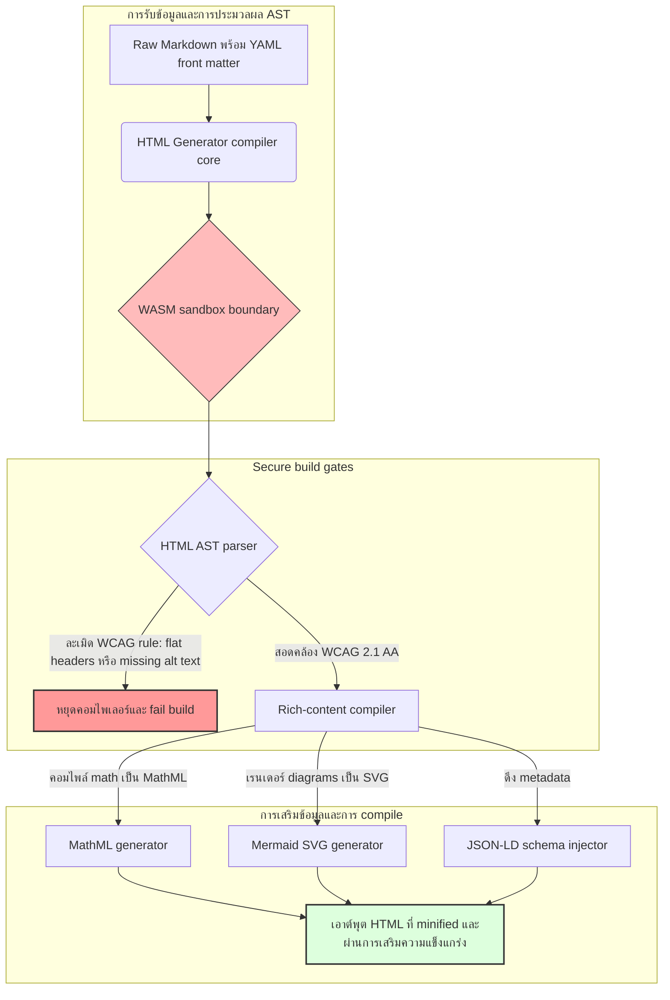

---

# Front Matter (YAML)

author: "contact@sebastienrousseau.com (Sebastien Rousseau)"
banner_alt: "เรขาคณิตสถาปัตยกรรมภายใต้แสงที่มีโครงสร้าง — สะท้อนบทบาทของ HTML Generator ในฐานะท่อประมวลผล Markdown-to-HTML แบบ compile-gated เพื่อโครงสร้างพื้นฐานการเผยแพร่ที่เข้าถึงได้ รองรับ SEO และมีการ sandbox"
banner_height: "1597"
banner_width: "2584"
banner: "https://cloudcdn.pro/stocks/images/markus-winkler-IrRbSND5EUc-unsplash-1200.webp"
cdn: "https://cloudcdn.pro"
charset: "UTF-8"
cname: "sebastienrousseau.com"
copyright: "© Copyright 2025 - 2026 - Sebastien Rousseau. All rights reserved."
date: "June 20, 2026"
description: "HTML Generator คือไลบรารี Rust ที่แปลง Markdown เป็น HTML ที่สอดคล้อง WCAG พร้อม SEO และเสริมด้วย JSON-LD — accessibility-as-code รองรับ MathML และ Mermaid และการประมวลผลแบบ WebAssembly sandbox เพื่อการเผยแพร่ที่ปลอดภัยระดับองค์กร"
format-detection: "telephone=no"
hreflang: "th"
icon: "https://cloudcdn.pro/clients/sebastienrousseau/v1/logos/sebastienrousseau.svg"
id: "https://sebastienrousseau.com/2026-06-20-html-generator-accessible-seo-structured-markdown-rust-2026"
image_alt: "ภาพขาวดำของ Sebastien Rousseau"
image_height: "162"
image_width: "162"
image: "https://cloudcdn.pro/stocks/images/sebastienrousseau.webp"
keywords: "html-generator, Rust Markdown to HTML, accessibility as code, WCAG 2.1 AA, SEO-ready HTML, JSON-LD, MathML, Mermaid, WebAssembly, EAA, DORA, ADA Title III, การเผยแพร่ที่เข้าถึงได้, sandboxed parsing, open source"
language: "th-TH"
last_reviewed: "2026-06-20"
layout: "report"
locale: "th_TH"
logo_alt: "โลโก้ของ Sebastien Rousseau"
logo_height: "44"
logo_width: "44"
logo: "https://cloudcdn.pro/clients/sebastienrousseau/v1/logos/sebastienrousseau.svg"
menu: ""
measurementID: "G-169G4ET5HQ"
name: "Sebastien Rousseau"
permalink: "https://sebastienrousseau.com/2026-06-20-html-generator-accessible-seo-structured-markdown-rust-2026"
rating: "general"
referrer: "no-referrer"
robots: "index, follow"
schema: "FAQPage, Article"
seo_title: "Accessibility-as-Code: แปลง Markdown เป็น HTML ระดับ AAA ด้วย Rust ปี 2026"
short_name: "sebastienrousseau"
subtitle: "เปลี่ยนการเผยแพร่เนื้อหาเว็บองค์กร เอกสารผลิตภัณฑ์ และพอร์ทัลลูกค้า จากไฟล์ข้อความที่ไม่สามารถเข้าถึงได้ ให้กลายเป็นสินทรัพย์ดิจิทัลที่มีโครงสร้างสูง สอดคล้องกฎระเบียบ และมีการ sandbox"
tags: "html-generator, Rust, Markdown, accessibility, WCAG, SEO, JSON-LD, MathML, Mermaid, WebAssembly, EAA, DORA, ADA, AI-discovery, RAG, open source, โครงสร้างพื้นฐานธนาคาร"
theme-color: "0, 83, 191"
title: "แปลง Markdown เป็น HTML ที่เข้าถึงได้ รองรับ SEO และมีโครงสร้างด้วย Rust ในปี 2026"
url: "https://sebastienrousseau.com/2026-06-20-html-generator-accessible-seo-structured-markdown-rust-2026"
viewport: "width=device-width, initial-scale=1, shrink-to-fit=no"

# RSS - The RSS feed front matter (YAML).
atom_link: "https://sebastienrousseau.com/2026-06-20-html-generator-accessible-seo-structured-markdown-rust-2026/rss.xml"
category: "Technology"
docs: https://validator.w3.org/feed/docs/rss2.html
generator: "Static Site Generator (SSG) (version 0.0.40)"
item_description: "HTML Generator คือไลบรารี Rust ที่แปลง Markdown เป็น HTML ที่สอดคล้อง WCAG พร้อม SEO และเสริมด้วย JSON-LD — accessibility-as-code รองรับ MathML และ Mermaid และการประมวลผลแบบ WebAssembly sandbox เพื่อการเผยแพร่ที่ปลอดภัยระดับองค์กร"
item_guid: "https://sebastienrousseau.com/2026-06-20-html-generator-accessible-seo-structured-markdown-rust-2026/rss.xml"
item_link: "https://sebastienrousseau.com/2026-06-20-html-generator-accessible-seo-structured-markdown-rust-2026/rss.xml"
item_pub_date: "Sat, 20 Jun 2026 06:06:06 +0000"
item_title: "แปลง Markdown เป็น HTML ที่เข้าถึงได้ รองรับ SEO และมีโครงสร้างด้วย Rust ในปี 2026"
last_build_date: "Sat, 20 Jun 2026 06:06:06 +0000"
managing_editor: "contact@sebastienrousseau.com (Sebastien Rousseau)"
pub_date: "Sat, 20 Jun 2026 06:06:06 +0000"
ttl: "60"
type: "article"
webmaster: "contact@sebastienrousseau.com"

# Apple - The Apple front matter (YAML).
apple_mobile_web_app_orientations: "portrait"
apple_touch_icon_sizes: "192x192"
apple-mobile-web-app-capable: "yes"
apple-mobile-web-app-status-bar-inset: "black"
apple-mobile-web-app-status-bar-style: "black-translucent"
apple-mobile-web-app-title: "Markdown เป็น HTML ระดับ AAA ด้วย Rust"
apple-touch-fullscreen: "yes"

# MS Application - The MS Application front matter (YAML).

msapplication-navbutton-color: "0, 83, 191"

# Twitter Card - The Twitter Card front matter (YAML).

twitter_card: "summary_large_image"
twitter_creator: "@wwdseb"
twitter_description: "HTML Generator คือไลบรารี Rust ที่แปลง Markdown เป็น HTML ที่สอดคล้อง WCAG พร้อม SEO และเสริมด้วย JSON-LD — accessibility-as-code รองรับ MathML และ Mermaid และการประมวลผลแบบ WebAssembly sandbox"
twitter_image: "https://cloudcdn.pro/clients/sebastienrousseau/v1/logos/sebastienrousseau.svg"
twitter_image_alt: "โลโก้ของ Sebastien Rousseau"
twitter_site: "@wwdseb"
twitter_title: "Accessibility-as-Code: แปลง Markdown เป็น HTML ระดับ AAA ด้วย Rust"
twitter_url: "https://sebastienrousseau.com/2026-06-20-html-generator-accessible-seo-structured-markdown-rust-2026"

# Humans.txt - The Humans.txt front matter (YAML).
author_website: "https://sebastienrousseau.com"
author_twitter: "@wwdseb"
author_location: "London, UK"
thanks: "ขอบคุณที่อ่านบทความนี้!"
site_last_updated: "2026-06-20"
site_standards: "HTML5, CSS3, RSS, Atom, JSON, XML, YAML, Markdown, TOML"
site_components: "Kaishi, Kaishi Builder, Kaishi CLI, Kaishi Templates, Kaishi Themes"
site_software: "Static Site Generator, Rust"

---

# แปลง Markdown เป็น HTML ที่เข้าถึงได้ รองรับ SEO และมีโครงสร้างด้วย Rust ในปี 2026

<!-- lead-start -->
<aside class="post-lead" aria-label="สรุปบทความ">

<strong>สรุปโดยย่อ.</strong> HTML Generator คือคอมไพเลอร์ Markdown-to-HTML แบบ pure-Rust ที่บังคับใช้ WCAG 2.1 AA ในขั้นตอน build บรรจุข้อมูล JSON-LD ที่สอดคล้องกับ schema เรนเดอร์ MathML และ Mermaid SVG แบบ native และแยกการประมวลผลภายใน WebAssembly sandbox — เปลี่ยนการเผยแพร่เนื้อหาให้กลายเป็น control plane แบบ compile-gated เพื่อการเข้าถึง SEO และความปลอดภัย ICT

<strong>ประเด็นสำคัญ</strong>

<ul class="post-lead-takeaways">
  <li><strong>คำตอบเร็ว.</strong> HTML Generator คืออะไรในหนึ่งประโยค?</li>
  <li><strong>บทสรุปผู้บริหาร.</strong> การเรนเดอร์ Markdown ดูเหมือนง่าย แต่การผลิต HTML ระดับการเผยแพร่จริงคือปัญหาความสอดคล้องกับกฎระเบียบ</li>
  <li><strong>01. เหตุใดคอมไพเลอร์ HTML ที่เน้น accessibility จึงมีความสำคัญในปี 2026.</strong> EAA และ ADA Title III ได้ยกระดับ accessibility จากสุขอนามัยทางวิศวกรรมให้กลายเป็นความรับผิดชอบทางกฎหมายในระดับกรรมการบริษัท</li>
  <li><strong>02. มุมมองสถาปัตยกรรม HTML Generator ปี 2026.</strong> ท่อประมวลผลแบบ compile-gated หลายขั้นตอน จาก Markdown ดิบสู่เอาต์พุต HTML ที่ผ่านการเสริมความแข็งแกร่ง</li>
</ul>

<strong>อ่านเพิ่มเติม:</strong> <a href="https://sebastienrousseau.com/2026-06-18-noyalib-safe-yaml-rust-ai-mcp-financial-infrastructure-2026">ทำไม YAML จึงต้องการ Rust Stack ที่ปลอดภัยกว่าสำหรับ AI, MCP และโครงสร้างพื้นฐานการเงินในปี 2026</a>, Static Site Generator ที่ปลอดภัยโดยค่าเริ่มต้นสำหรับการเผยแพร่ในยุค AI ปี 2026, <a href="https://sebastienrousseau.com/2026-06-11-cloudcdn-open-source-blueprint-ai-native-edge-2026">CloudCDN: แผนผังโอเพนซอร์สสำหรับ Edge ที่รองรับ AI-Native ในปี 2026</a>.

</aside>
<!-- lead-end -->

ในปี 2026 เนื้อหาเว็บถูกบริโภคโดยโปรแกรมรวบรวมข้อมูลของ AI เครื่องมือค้นหาที่ขับเคลื่อนด้วย LLM และท่อประมวลผล Retrieval-Augmented Generation (RAG) มากพอๆ กับผู้อ่านที่เป็นมนุษย์ HTML ที่แบนหรือผิดรูปแบบทำลายการค้นพบโดยเครื่องจักร ขณะที่ความล้มเหลวในการปฏิบัติตามกฎระเบียบระดับโลกที่เข้มงวด เช่น [European Accessibility Act (EAA)](https://www.accessibility-act.eu/) และ [US ADA Title III](https://www.ada.gov/topics/title-iii/) ปัจจุบันถือเป็นความรับผิดชอบทางแพ่งที่ชัดเจน [HTML Generator](https://github.com/sebastienrousseau/html-generator) คือไลบรารี Rust สมรรถนะสูงที่ออกแบบมาเพื่อปิดช่องว่างเหล่านั้น — ที่ระดับคอมไพเลอร์ ไม่ใช่ในแพตช์หลังการนำใช้งาน

## คำตอบเร็ว

**HTML Generator คืออะไรในหนึ่งประโยค?** HTML Generator คือคอมไพเลอร์ Markdown-to-HTML แบบ pure-Rust โอเพนซอร์สที่บังคับใช้ [WCAG 2.1 AA](https://www.w3.org/TR/WCAG21/) ในขั้นตอน build สร้าง semantic landmarks และแอตทริบิวต์ ARIA อัตโนมัติ บรรจุข้อมูลเมตา [JSON-LD](https://json-ld.org/) ที่สอดคล้องกับ schema จาก YAML front matter เรนเดอร์ Mermaid diagrams และสูตรคณิตศาสตร์เป็น SVG และ MathML ที่เข้าถึงได้ และทำงานภายใน [WebAssembly](https://webassembly.org/) sandbox — เปลี่ยนการเผยแพร่เนื้อหาองค์กรให้กลายเป็น control plane แบบ compile-gated ระดับ fiduciary

## บทสรุปผู้บริหาร

การเรนเดอร์ Markdown ดูเหมือนง่าย แต่ HTML ระดับการเผยแพร่จริงคือปัญหาความสอดคล้องกับกฎระเบียบ ในเดือนมิถุนายน 2026 ทุกจุดสัมผัสขององค์กร — พอร์ทัลนักลงทุน รายงานกำกับดูแล เอกสารลูกค้า ข้อมูลอ้างอิง API ทรัพย์สินทางการตลาด — ถูกประมวลผลโดยทั้งมนุษย์และเครื่องจักร แรงกดดันสองประการมาบรรจบกันในทุกหน้า: [EAA](https://www.accessibility-act.eu/) และ [ADA Title III](https://www.ada.gov/topics/title-iii/) ทำให้ accessibility กลายเป็นความเสี่ยงทางกฎหมายระดับกรรมการบริษัท ขณะที่การรับข้อมูลโดย AI และท่อประมวลผล RAG ให้รางวัลกับเอาต์พุตที่มีโครงสร้างและอ่านได้ด้วยเครื่อง ไลบรารี Markdown มาตรฐานผลิต HTML แบบแบนที่ล้มเหลวในทั้งสองด้าน HTML Generator จัดการกับการสร้างเอกสารเป็นท่อประมวลผลแบบ compile-gated: การตรวจสอบ WCAG ถือเป็น build error, JSON-LD มาจาก YAML front matter โดยไม่ต้องประทับตราด้วยมือ, MathML และ Mermaid เรนเดอร์ได้อย่างเข้าถึงได้ และเอนจินทั้งหมดส่งมอบในรูปแบบ WebAssembly target เพื่อให้การประมวลผลเอกสารที่ไม่น่าเชื่อถืออยู่ภายใน sandbox แยกจากโฮสต์

## ประเด็นสำคัญ

- **Accessibility-as-code คือพื้นฐานใหม่.** EAA กำหนดให้ accessibility เป็นข้อบังคับสำหรับบริการดิจิทัลสำหรับผู้บริโภค HTML Generator ประเมินแผนผังเอกสารในขั้นตอน compile สร้าง semantic landmarks และแอตทริบิวต์ ARIA อัตโนมัติ — ลดการแก้ไขหลังการนำใช้งาน ลดงบประมาณการแก้ไขปัญหา และป้องกันไม่ให้ alt-text ที่หายไปส่งไปถึง production
- **ข้อมูลที่มีโครงสร้างเพื่อการค้นพบโดย AI.** การค้นหาสมัยใหม่และ RAG ต้องพึ่งพาข้อมูลเมตาที่อ่านได้ด้วยเครื่อง คอมไพเลอร์ประมวลผล YAML front matter และบรรจุ [JSON-LD ที่สอดคล้องกับ Schema.org](https://schema.org/) โดยตรงลงใน document head ทำให้เนื้อหาตีความได้อย่างสมบูรณ์โดย [Google Rich Results](https://developers.google.com/search/docs/appearance/structured-data/intro-structured-data), [Bing Webmaster](https://www.bing.com/webmasters) และโปรแกรมรวบรวมข้อมูลที่ขับเคลื่อนด้วย LLM
- **ความเป็นเลิศของเนื้อหาทางเทคนิค.** การเผยแพร่เนื้อหาทางเทคนิคไม่ใช่แค่ข้อความธรรมดา HTML Generator คอมไพล์ math extensions ใน Markdown ดิบเป็น [MathML](https://www.w3.org/Math/) ที่เข้าถึงได้ และเรนเดอร์ [Mermaid.js](https://mermaid.js.org/) diagrams เป็น SVG ที่ตอบสนอง — ทั้งสองรักษาโครงสร้างที่สอดคล้อง WCAG แทนที่จะเป็นภาพทึบแสง
- **WebAssembly sandboxing.** การประมวลผล Markdown ที่ไม่น่าเชื่อถือคือความเสี่ยงด้านความปลอดภัย ด้วยการกำหนดเป้าหมายเป็น [WASM](https://webassembly.org/), HTML Generator ทำงานภายใน sandbox แยกที่ป้องกันการประมวลผลโค้ดโดยอำเภอใจและปกป้องระบบโฮสต์ — ตอบสนองพันธกรณีความปลอดภัย ICT ตาม DORA Article 6 โดยตรง
- **การปกป้องในระดับ fiduciary สำหรับกรรมการบริษัท.** การไม่ปฏิบัติตามกฎระเบียบทางเทคนิคได้เข้าสู่ห้องประชุมกรรมการแล้ว การกำหนดมาตรฐานบน HTML engine แบบ compile-gated ปกป้องกรรมการและผู้บริหารระดับสูงจากความเสี่ยงทางแพ่งและกฎระเบียบส่วนตัวภายใต้ DORA, EAA และ ADA Title III

**อ่านเพิ่มเติม:** [ทำไม YAML จึงต้องการ Rust Stack ที่ปลอดภัยกว่าสำหรับ AI, MCP และโครงสร้างพื้นฐานการเงินในปี 2026](https://sebastienrousseau.com/2026-06-18-noyalib-safe-yaml-rust-ai-mcp-financial-infrastructure-2026/), Static Site Generator ที่ปลอดภัยโดยค่าเริ่มต้นสำหรับการเผยแพร่ในยุค AI ปี 2026, [CloudCDN: แผนผังโอเพนซอร์สสำหรับ Edge ที่รองรับ AI-Native ในปี 2026](https://sebastienrousseau.com/2026-06-11-cloudcdn-open-source-blueprint-ai-native-edge-2026/).

## 01. เหตุใดคอมไพเลอร์ HTML ที่เน้น Accessibility จึงมีความสำคัญในปี 2026

ทรัพย์สินเว็บขององค์กร ไลบรารีเอกสาร และศูนย์ช่วยเหลือผลิตภัณฑ์ คือจุดสัมผัสดิจิทัลที่สำคัญ ปัจจุบันพวกมันตกอยู่ภายใต้แรงกดดันสองประการที่เข้มข้นและเชื่อมโยงกัน

ประการแรกคือ **การรับข้อมูลโดย AI และการค้นพบ** เนื้อหาถูกประมวลผลมากขึ้นเรื่อยๆ โดย large language models และท่อประมวลผล Retrieval-Augmented Generation HTML ที่แบนหรือผิดรูปแบบทำให้โปรแกรมรวบรวมข้อมูลสับสน ทำให้การวิจัยและเอกสารขององค์กรมองไม่เห็นในกระบวนทัศน์การค้นหาสมัยใหม่ — รวมถึง [Google Search Generative Experience](https://blog.google/products/search/generative-ai-search/), การเรียกดู [ChatGPT](https://chat.openai.com/) และ RAG agents ระดับองค์กร

ประการที่สองคือ **กฎหมาย accessibility ระดับโลกที่เข้มงวด** ภายใต้ [European Accessibility Act](https://www.accessibility-act.eu/) (บังคับใช้อย่างสมบูรณ์ตั้งแต่มิถุนายน 2025) และ [US ADA Title III](https://www.ada.gov/topics/title-iii/) แพลตฟอร์มการเผยแพร่ขององค์กรต้องรับประกัน accessibility ดิจิทัลอย่างสมบูรณ์ ความล้มเหลวในการปฏิบัติตาม [WCAG 2.1 AA](https://www.w3.org/TR/WCAG21/) ไม่ใช่แค่ความผิดพลาดทางวิศวกรรมอีกต่อไป แต่เป็นความรับผิดชอบทางแพ่งและกฎระเบียบที่นำไปสู่การยุติคดีมูลค่าหลายล้านดอลลาร์

[HTML Generator](https://github.com/sebastienrousseau/html-generator) แก้ไขแรงกดดันทั้งสองอย่างโดยตรง เป็นไลบรารี Rust ที่ thread-safe ออกแบบมาเพื่อแปลง Markdown เป็น HTML ที่เข้าถึงได้ รองรับ SEO และมีโครงสร้าง ด้วยการจัดการกับการสร้างเอกสารเป็นท่อประมวลผลแบบ compile-gated เอนจินส่งมอบ **Return on Resilience (RoR)** สูง — ปกป้องงบดุลจากการฟ้องร้องด้าน accessibility ขณะที่เพิ่มการอ่านได้ด้วยเครื่องสูงสุดเพื่อการค้นพบโดย AI

## 02. มุมมองสถาปัตยกรรม HTML Generator ปี 2026

เฟรมเวิร์กถูกออกแบบเป็นท่อประมวลผลการ compile ที่ปลอดภัยแบบหลายขั้นตอน ที่แปลงข้อความ Markdown ดิบเป็น static assets ที่มีการตรวจสอบทางเข้ารหัสและเข้าถึงได้สูง

### ตารางที่ 1: ชั้นสถาปัตยกรรม HTML Generator และการลดความเสี่ยง

| ชั้น | การตัดสินใจออกแบบ | เหตุผลความสำคัญ | ความเสี่ยงหากจัดการผิดพลาด |
| ---- | ---- | ---- | ---- |
| **ชั้นอินพุต** | ตัวประมวลผล Markdown พร้อม YAML front matter | พบนักเขียนในสภาพแวดล้อมที่พวกเขาอยู่ แยกเนื้อหาออกจาก metadata โครงสร้าง | Metadata ไม่สอดคล้อง sitemap เสียหาย ช่องว่างการทำ index |
| **ชั้นโครงสร้าง** | Table of Contents อัตโนมัติและ semantic landmarks พร้อมแท็ก ARIA | สร้างแผนผังเอกสารที่นำทางได้และเข้าถึงได้โดยการก่อสร้าง | HTML แบบแบนที่ทำให้ screen readers เสียหายและละเมิด WCAG |
| **ชั้นเนื้อหาสมบูรณ์** | การเรนเดอร์ MathML และ Mermaid.js SVG แบบ native | คอมไพล์สูตรและ diagrams เป็น SVG และ MathML ที่เข้าถึงได้ | ความล่าช้าในการเรนเดอร์ JS ฝั่ง client และเอาต์พุต assistive-technology ที่เสียหาย |
| **ชั้น SEO และข้อมูล** | การสร้าง JSON-LD แบบรวมและ structured metadata | บรรจุ JSON-LD ที่สอดคล้องกับ [Schema.org](https://schema.org/) โดยตรงใน head | เครื่องมือค้นหาและ AI crawlers อ่านผู้เขียน บริบท การออกใบอนุญาตผิดพลาด |
| **ชั้น Runtime** | คอมไพเลอร์ Rust แบบ native พร้อม WebAssembly target | เปิดใช้การประมวลผลที่ปลอดภัยภายใน sandbox บนเซิร์ฟเวอร์ edge nodes และเบราว์เซอร์ | การประมวลผลโค้ดโดยอำเภอใจขณะประมวลผล Markdown ที่ไม่น่าเชื่อถือ |

## 03. สัญญาณความปลอดภัยเว็บและ Accessibility หลัก

เพื่อยืนยันว่าทรัพย์สินการเผยแพร่ที่เผชิญสาธารณะตรงตามการตรวจสอบกฎระเบียบและความปลอดภัยสมัยใหม่ ผู้บริหารเทคโนโลยีระดับสูงต้องติดตามตัวชี้วัดเฉพาะที่วัดได้

### ตารางที่ 2: สัญญาณความปลอดภัยเว็บและ accessibility

| สัญญาณ | ตัวชี้วัด / มาตรฐานการดำเนินงาน | อ้างอิง EAA / DORA / W3C | การนำไปใช้ทางเทคนิค |
| ---- | ---- | ---- | ---- |
| **ความสอดคล้องด้าน accessibility** | 100% ของหน้าที่คอมไพล์ตรวจสอบตาม WCAG 2.1 AA | [EAA](https://www.accessibility-act.eu/) และ [ADA Title III](https://www.ada.gov/topics/title-iii/) | ตัวประมวลผล HTML AST ขณะ build ประเมิน image alt tags และ semantic landmarks |
| **WASM execution sandbox** | 100% ของ Markdown อินพุตที่ไม่น่าเชื่อถือคอมไพล์ใน WebAssembly runtime แบบแยก | [DORA Article 6](https://eur-lex.europa.eu/legal-content/EN/TXT/?uri=CELEX%3A32022R2554) (ความปลอดภัย ICT) | การแยกสภาพแวดล้อมการประมวลผลออกจากเซิร์ฟเวอร์โฮสต์ |
| **ครอบคลุม structured metadata** | 100% ของบทความที่เผยแพร่บรรจุ JSON-LD headers ที่ถูกต้องและสอดคล้องกับ schema | ข้อกำหนด [Schema.org](https://schema.org/) | การประมวลผล front matter อัตโนมัติและแปลงเป็น JSON-LD objects |
| **ปริมาณงานการ compile** | เป้าหมายจำนวนหน้าต่อวินาทีเกิน 10,000 บนฮาร์ดแวร์ทั่วไป | Return on Resilience (RoR) | คอมไพเลอร์ Rust AST ที่ทำงานแบบขนานสูง |
| **การตรวจสอบ rich-snippet** | ข้อผิดพลาด parsing เป็นศูนย์บน [Google Rich Results](https://search.google.com/test/rich-results) และ [Schema validator](https://validator.schema.org/) | แนวทาง Google Search | การตรวจสอบโครงสร้างของ JSON-LD ที่สร้างขึ้นในระหว่างท่อประมวลผล build |

## 04. ตำนานของการเรนเดอร์ Markdown แบบง่าย

ความเข้าใจผิดทั่วไปในหมู่ผู้จัดการเทคโนโลยีคือการแปลง Markdown เป็น HTML เป็นเพียงการแทนที่ข้อความแบบง่าย ไลบรารีมาตรฐานหลายตัวแปลงการจัดรูปแบบ Markdown เป็น HTML แบบแบนและไม่มีโครงสร้าง เอาต์พุตแสดงผลแก่ผู้อ่านที่มองเห็นได้ในเบราว์เซอร์ แต่มันเป็นกับดักความสอดคล้องกับกฎระเบียบ

HTML แบบแบนมักขาดสามสิ่ง

1. **ลำดับชั้น heading ที่ถูกต้อง.** Markdown มาตรฐานไม่บังคับลำดับ heading การข้ามจาก `<h1>` ไปยัง `<h4>` ละเมิด WCAG 2.1 AA และทำให้การนำทางเอกสารของ screen readers เสียหาย
2. **ความหมายของตารางที่ชัดเจน.** ตาราง Markdown มาตรฐานไม่ค่อยถูกเรนเดอร์ด้วยแอตทริบิวต์ scope `<th>` และ `<tbody>` ที่ถูกต้องสำหรับการประมวลผลที่เข้าถึงได้
3. **Metadata ที่อ่านได้ด้วยเครื่อง.** HTML มาตรฐานขาด JSON-LD hooks ที่แพลตฟอร์มค้นหา AI และระบบรับข้อมูล RAG สมัยใหม่ต้องพึ่งพา

HTML Generator แก้ไขปัญหานี้ด้วยการประมวลผล Markdown เป็น **Abstract Syntax Tree (AST)** เอนจินประเมินโครงสร้างเอกสารก่อนส่งออก HTML ตรวจสอบการซ้อน heading บรรจุแอตทริบิวต์ ARIA ที่เหมาะสม และยืนยันว่าทุก media asset มีข้อความทางเลือก — เปลี่ยน accessibility จากการตรวจสอบด้วยมือให้กลายเป็น invariant ที่รับประกันในขั้นตอน compile

## 05. การออกแบบท่อประมวลผล Build แบบ Accessibility-as-Code

เพื่อป้องกันไม่ให้ assets ที่ไม่สามารถเข้าถึงได้หรือไม่ถูก index ถึง production สาธารณะ accessibility ต้องเป็น compiler gate ที่เข้มงวด ท่อประมวลผลต่อไปนี้แสดงให้เห็นว่า HTML Generator ประเมิน Markdown อย่างไร ทำงาน validation ที่แยกด้วย WebAssembly และส่งออก HTML ที่มีโครงสร้างและผ่านการเสริมความแข็งแกร่ง

## 06. แผนปฏิบัติการสำหรับห้องประชุมกรรมการและความรับผิดชอบในระดับ Fiduciary

ความสอดคล้องกับ accessibility สมัยใหม่และความปลอดภัยเว็บเป็นประเด็นที่ไม่อาจต่อรองได้ในห้องประชุมกรรมการ ผู้บริหารระดับสูงต้องเข้าถึงโครงสร้างพื้นฐานการเผยแพร่ผ่านมุมมองของความเสี่ยงทางกฎหมาย การปกป้องการเงิน และความเสี่ยงจากกฎระเบียบ

- **European Accessibility Act (EAA).** กำหนดพันธกรณีความสอดคล้องที่มีผลผูกพันทางกฎหมายโดยตรงบนพอร์ทัลดิจิทัลสาธารณะและเอกชน การไม่ปฏิบัติตามอาจนำไปสู่บทลงโทษทางการเงินอย่างรุนแรง การฟ้องร้องทางแพ่ง และการถอน asset ออกจากตลาด EU ทันที ด้วยการผสาน accessibility-as-code กรรมการสามารถรับรองได้ว่าโค้ดที่ไม่สอดคล้องไม่สามารถส่งออกได้ — เปลี่ยนการแก้ไขเชิงรับให้กลายเป็นการป้องกันทางกฎหมายเชิงโครงสร้าง
- **DORA Article 6 (สภาพแวดล้อม ICT ที่ปลอดภัย).** กำหนดกฎเข้มงวดสำหรับความปลอดภัยสภาพแวดล้อม ICT ด้วยการแยกการ compile Markdown ภายใน WebAssembly sandbox องค์กรรับประกันว่าการประมวลผลเอกสารที่ลูกค้าอัปโหลดหรือ partner feeds ไม่สามารถเปิดเผยเซิร์ฟเวอร์โฮสต์ต่อการประมวลผลโค้ดโดยอำเภอใจ ปกป้องพอร์ทัลธนาคารที่สำคัญ
- **การลดต้นทุนในการตรวจสอบความสอดคล้อง.** ความสอดคล้องด้าน accessibility แบบดั้งเดิมพึ่งพาการตรวจสอบหลังการนำใช้งานที่มีค่าใช้จ่ายสูงและย้อนหลัง — หลายหมื่นดอลลาร์ต่อปีต่อไซต์ การนำการตรวจสอบ WCAG มาเป็น compile-time block ขจัดค่าใช้จ่ายย้อนหลังเหล่านั้น เปลี่ยนงบประมาณความสอดคล้องจากการป้องกันไปสู่นวัตกรรม

## 07. ความหมายสำหรับธนาคารและองค์กรแต่ละประเภท

### ธนาคารที่มีความสำคัญเชิงระบบทั่วโลก (G-SIBs)

G-SIBs ดำเนินการทรัพย์สินสาธารณะหลายภาษาขนาดใหญ่ที่เผยแพร่เอกสารวิจัยหลายพันชิ้น การเปิดเผยข้อมูลกำกับดูแล และเอกสารนักลงทุนในหลายเขตอำนาจศาล ความท้าทายของพวกเขาคือขนาดและความเทียบเท่าหลายภาษา WebAssembly target และเอนจิน Rust สมรรถนะสูงของ HTML Generator ช่วยให้ไลบรารีวิจัยที่แปลเป็นภาษาท้องถิ่นขนาดใหญ่สามารถอัปเดต คอมไพล์ และนำใช้งานทั่วโลกภายในไม่กี่วินาที — โดยไม่มีความล่าช้าในการเรนเดอร์หรือการถดถอยด้าน accessibility

### ธนาคารธุรกรรมและธนาคารองค์กร

สำหรับธนาคารธุรกรรม พอร์ทัลลูกค้า ศูนย์เอกสาร และคู่มือ API สำหรับนักพัฒนาคือจุดสัมผัสดิจิทัลที่สำคัญ การ compile assets เหล่านั้นผ่าน HTML Generator หมายความว่าช่องทางที่เผชิญกับลูกค้าไม่มีการเปิดเผย XSS ไม่มีเวกเตอร์การแฮก dependency และไม่มีข้อบกพร่องด้าน accessibility — รักษาความเชื่อถือสถาบันและลดพื้นที่การฟ้องร้อง

### ธนาคารระดับภูมิภาคและ Fintechs

ธนาคารระดับภูมิภาคและ fintechs ที่คล่องตัวแข่งขันด้านประสบการณ์ดิจิทัลโดยไม่มีงบประมาณวิศวกรรมระดับ G-SIB HTML Generator มอบท่อประมวลผลการเผยแพร่ระดับ enterprise-grade ออกจากกล่อง ช่วยให้ทรัพย์สินขนาดเล็กส่ง assets ที่เข้าถึงได้ รองรับ SEO และมี sandbox ที่ทนต่อการตรวจสอบจากทั้งหน่วยงานกำกับดูแลและลูกค้าองค์กรที่มีแนวโน้ม

## 08. แผนงานโครงสร้างพื้นฐานการเผยแพร่

ทรัพย์สินเว็บสาธารณะขององค์กรเป็นองค์ประกอบหลักของ operational resilience การพึ่งพาบน web engines ที่ช้า มีช่องโหว่แบบ dynamic และใช้ฐานข้อมูล — หรือ static assets ที่ไม่มีการลงนาม — คือความเสี่ยงทางธุรกิจที่ยอมรับไม่ได้

เพื่อรักษาความปลอดภัยจุดสัมผัสดิจิทัลสาธารณะและปกป้องงบดุลจากการฟ้องร้องด้าน accessibility ผู้จัดการเทคโนโลยีและความปลอดภัยระดับสูงควรดำเนินแผนงานที่ชัดเจน

1. **เปลี่ยนไปใช้สถาปัตยกรรม static.** ยุติแพลตฟอร์ม CMS แบบ dynamic รุ่นเก่าสำหรับทรัพย์สินวิจัย การตลาด และเอกสาร ย้ายเนื้อหาไปยังท่อประมวลผลแบบ compile-gated เช่น HTML Generator
2. **บังคับใช้ accessibility ในขั้นตอน build.** นำ accessibility-as-code มาใช้ ล้มเหลว compilation pipelines อัตโนมัติบนการละเมิด WCAG 2.1 AA ใดๆ
3. **แยก parsing ใน WebAssembly.** Sandbox การประมวลผลเอกสารและเนื้อหาทั้งหมดภายใน WASM runtime เพื่อให้อินพุตที่ไม่น่าเชื่อถือไม่สัมผัสระบบโฮสต์
4. **บรรจุ JSON-LD metadata ที่สมบูรณ์.** รับรองว่าทุก asset ที่เผยแพร่มี JSON-LD headers ที่สอดคล้องกับ schema เพื่อเพิ่มการค้นพบโดย AI สูงสุด

## 09. คำถามที่พบบ่อย

**HTML Generator บังคับใช้ accessibility อย่างไร?**

มันประมวลผล HTML Abstract Syntax Tree ที่สร้างขึ้นในขั้นตอน build ประเมินเอกสารตาม [WCAG 2.1 AA](https://www.w3.org/TR/WCAG21/) หากละเมิดกฎ — แอตทริบิวต์ alt หายไป heading ถูกข้าม form control ไม่มีชื่อ — คอมไพเลอร์หยุด build โดยจัดการ accessibility เป็น invariant ขณะ compile แทนที่จะเป็นงานตรวจสอบหลังการนำใช้งาน

**เหตุใด WebAssembly isolation จึงมีความสำคัญ?**

[WebAssembly](https://webassembly.org/) ช่วยให้เอนจินประมวลผล Markdown ทำงานภายใน sandbox แบบแยก ห่างจากเซิร์ฟเวอร์โฮสต์ แม้เมื่อผู้กระทำที่เป็นภัยอัปโหลดเอกสาร Markdown ที่สร้างขึ้นเพื่อใช้ประโยชน์จากช่องโหว่ของ parser การประมวลผลถูกกักไว้ — ปกป้องระบบโฮสต์และตอบสนองพันธกรณีความปลอดภัย ICT ตาม DORA Article 6

**JSON-LD เป็นประโยชน์ต่อการค้นพบในการค้นหาปี 2026 อย่างไร?**

[JSON-LD](https://json-ld.org/) ให้ข้อมูลเมตาที่มีโครงสร้างและอ่านได้ด้วยเครื่องใน document head [Google Rich Results](https://developers.google.com/search/docs/appearance/structured-data/intro-structured-data), โปรแกรมรวบรวมข้อมูล Bing และ search agents ที่ขับเคลื่อนด้วย LLM ระบุผู้เขียน ใบอนุญาต วันที่เผยแพร่ และบริบทความหมายทันที — ข้ามความคลุมเครือของ HTML มาตรฐานและเพิ่มพื้นที่ผิวในการค้นพบที่ขับเคลื่อนโดย AI

**กลุ่มเป้าหมายของ HTML Generator คือใคร?**

ผู้สร้าง static-site, ทีมเอกสาร, นักเขียนเชิงเทคนิค, นักพัฒนา Rust และวิศวกรแพลตฟอร์มที่ส่ง estates ที่ต้องการ accessibility หรือเผชิญหน้ากับผู้กำกับดูแล นอกจากนี้ยังเป็นชั้นประมวลผลเนื้อหาที่ใช้ได้ภายใน secure-publishing pipelines ขนาดใหญ่เช่น [Static Site Generator (SSG)](https://github.com/sebastienrousseau/static-site-generator)

## 10. เอกสารอ้างอิง

- World Wide Web Consortium (W3C), 2024. [Web Content Accessibility Guidelines (WCAG) 2.1 ⧉](https://www.w3.org/TR/WCAG21/ "Web Content Accessibility Guidelines 2.1").
- Schema.org, 2026. [ข้อกำหนด structured-data ของ Schema.org ⧉](https://schema.org/ "Schema.org structured-data specifications").
- European Parliament and Council of the European Union, 2022. [Regulation (EU) 2022/2554 on digital operational resilience for the financial sector (DORA) ⧉](https://eur-lex.europa.eu/legal-content/EN/TXT/?uri=CELEX%3A32022R2554 "DORA Regulation").
- European Commission, 2025. [European Accessibility Act ⧉](https://www.accessibility-act.eu/ "European Accessibility Act").
- US Department of Justice, 2024. [ADA Title III ⧉](https://www.ada.gov/topics/title-iii/ "ADA Title III").
- WebAssembly Community Group, 2026. [ข้อกำหนด WebAssembly ⧉](https://webassembly.org/ "WebAssembly").
- GitHub, 2026. [HTML Generator repository ⧉](https://github.com/sebastienrousseau/html-generator "HTML Generator open-source repository").

<!-- enrich-start -->
<aside class="author-card" aria-label="เกี่ยวกับผู้เขียน"><strong class="author-card-name"><a href="/about/index.html">Sebastien Rousseau</a></strong>นักเทคโนโลยีธนาคารระดับสูงที่เขียนเกี่ยวกับ AI ประยุกต์ โครงสร้างพื้นฐานการชำระเงิน เงินที่แปลงเป็น token, ISO 20022 ความปลอดภัย post-quantum บริการทางการเงิน cloud-native โครงสร้างพื้นฐาน open-source และตลาดดิจิทัลที่อยู่ภายใต้กฎระเบียบประสบการณ์กว่า 20 ปีที่ HSBC Commercial &amp; Investment Bank, PayPal, Barclays, Shazam, AKQA, Virgin Group. <a href="/about/index.html">โปรไฟล์เต็ม</a> &middot; <a href="https://www.linkedin.com/in/sebastienrousseau/" rel="external noopener">LinkedIn</a> &middot; <a href="https://github.com/sebastienrousseau" rel="external noopener">GitHub</a></aside>

ตรวจสอบล่าสุด <time datetime="2026-06-20">2026-06-20</time>.

<!-- enrich-end -->
