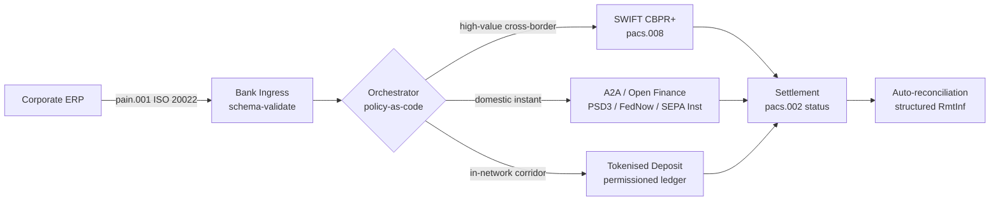

---

# Front Matter (YAML)

author: "contact@sebastienrousseau.com (Sebastien Rousseau)"
banner_alt: "เรือคอนเทนเนอร์ที่ท่าเรือน้ำลึกในยามรุ่งสาง — สื่อถึงการเคลื่อนย้ายมูลค่าขององค์กรข้ามพรมแดนแบบหลายรางผ่านเครือข่ายชำระเงิน ISO 20022, open finance และเงินฝากแบบโทเค็นในปี 2026"
banner_height: "1597"
banner_width: "2584"
banner: "https://cloudcdn.pro/stocks/images/viktor-forgacs-KxVRDiFdTVo.webp"
cdn: "https://cloudcdn.pro"
charset: "UTF-8"
cname: "sebastienrousseau.com"
copyright: "© Copyright 2025 - 2026 - Sebastien Rousseau. All rights reserved."
date: "June 24, 2026"
description: "ISO 20022, A2A, open finance ภายใต้ PSD3/FiDA และเงินฝากแบบโทเค็น กำลังปรับโฉมเทรเชอรีองค์กรข้ามพรมแดนควบคู่ SWIFT ในปี 2026 อย่างไร"
format-detection: "telephone=no"
hreflang: "th"
icon: "https://cloudcdn.pro/clients/sebastienrousseau/v1/logos/sebastienrousseau.svg"
id: "https://sebastienrousseau.com/2026-06-24-cross-border-iso-20022-open-finance-tokenised-deposits-treasury-2026"
image_alt: "ภาพถ่ายขาวดำของ Sebastien Rousseau"
image_height: "162"
image_width: "162"
image: "https://cloudcdn.pro/stocks/images/sebastienrousseau.webp"
keywords: "การชำระเงินข้ามพรมแดน, ISO 20022, open finance, PSD3, FiDA, เงินฝากแบบโทเค็น, stablecoin, A2A, เทรเชอรี, CIB, Nexi, Mastercard, multi-rail, pacs.008, pain.001, SWIFT, FedNow, SEPA Instant, RTP, CBPR+"
language: "th-TH"
last_reviewed: "2026-06-24"
layout: "report"
locale: "th_TH"
logo_alt: "โลโก้ Sebastien Rousseau"
logo_height: "44"
logo_width: "44"
logo: "https://cloudcdn.pro/clients/sebastienrousseau/v1/logos/sebastienrousseau.svg"
menu: ""
measurementID: "G-169G4ET5HQ"
name: "Sebastien Rousseau"
permalink: "https://sebastienrousseau.com/2026-06-24-cross-border-iso-20022-open-finance-tokenised-deposits-treasury-2026"
rating: "general"
referrer: "no-referrer"
robots: "index, follow"
schema: "FAQPage, Article"
seo_title: "ข้ามพรมแดน 2026: ISO 20022, Open Finance, รางโทเค็น"
short_name: "sebastienrousseau"
subtitle: "เทรเชอรีองค์กรข้ามพรมแดนในปี 2026 ทำงานบนกลไกหลายราง — ISO 20022 เป็นไวยากรณ์ร่วม, A2A และ open finance เป็นรางที่ลูกค้าใช้งาน, เงินฝากแบบโทเค็นเป็นชั้นชำระดุลโฮลเซล โดยมี SWIFT ยังคงยึดเทลที่ยาวไว้"
tags: "การชำระเงินข้ามพรมแดน, ISO 20022, open finance, PSD3, FiDA, เงินฝากแบบโทเค็น, A2A, เทรเชอรี, CIB, multi-rail, pacs.008, pain.001, SWIFT, FedNow, SEPA Instant, RTP, CBPR+"
theme-color: "0, 83, 191"
title: "ข้ามพรมแดน 2026: ISO 20022, Open Finance และเงินฝากแบบโทเค็นในเทรเชอรีองค์กร"
url: "https://sebastienrousseau.com/2026-06-24-cross-border-iso-20022-open-finance-tokenised-deposits-treasury-2026"
viewport: "width=device-width, initial-scale=1, shrink-to-fit=no"

# RSS - The RSS feed front matter (YAML).
atom_link: "https://sebastienrousseau.com/2026-06-24-cross-border-iso-20022-open-finance-tokenised-deposits-treasury-2026/rss.xml"
category: "Technology"
docs: https://validator.w3.org/feed/docs/rss2.html
generator: "Static Site Generator (SSG) (version 0.0.26)"
item_description: "ISO 20022, A2A, open finance ภายใต้ PSD3/FiDA และเงินฝากแบบโทเค็น กำลังปรับโฉมเทรเชอรีองค์กรข้ามพรมแดนควบคู่ SWIFT ในปี 2026 อย่างไร"
item_guid: "https://sebastienrousseau.com/2026-06-24-cross-border-iso-20022-open-finance-tokenised-deposits-treasury-2026/rss.xml"
item_link: "https://sebastienrousseau.com/2026-06-24-cross-border-iso-20022-open-finance-tokenised-deposits-treasury-2026/rss.xml"
item_pub_date: "Wed, 24 Jun 2026 07:07:07 +0000"
item_title: "ข้ามพรมแดน 2026: ISO 20022, Open Finance และเงินฝากแบบโทเค็นในเทรเชอรีองค์กร"
last_build_date: "Wed, 24 Jun 2026 06:06:06 +0000"
managing_editor: "contact@sebastienrousseau.com (Sebastien Rousseau)"
pub_date: "Wed, 24 Jun 2026 07:07:07 +0000"
ttl: "60"
type: "article"
webmaster: "contact@sebastienrousseau.com"

# Apple - The Apple front matter (YAML).
apple_mobile_web_app_orientations: "portrait"
apple_touch_icon_sizes: "192x192"
apple-mobile-web-app-capable: "yes"
apple-mobile-web-app-status-bar-inset: "black"
apple-mobile-web-app-status-bar-style: "black-translucent"
apple-mobile-web-app-title: "ข้ามพรมแดน 2026: ISO 20022, Open Finance, รางโทเค็น"
apple-touch-fullscreen: "yes"

# MS Application - The MS Application front matter (YAML).

msapplication-navbutton-color: "0, 83, 191"

# Twitter Card - The Twitter Card front matter (YAML).

twitter_card: "summary_large_image"
twitter_creator: "@wwdseb"
twitter_description: "ISO 20022, A2A, open finance ภายใต้ PSD3/FiDA และเงินฝากแบบโทเค็น กำลังปรับโฉมเทรเชอรีองค์กรข้ามพรมแดนควบคู่ SWIFT ในปี 2026 อย่างไร"
twitter_image: "https://cloudcdn.pro/clients/sebastienrousseau/v1/logos/sebastienrousseau.svg"
twitter_image_alt: "โลโก้ของ Sebastien Rousseau"
twitter_site: "@wwdseb"
twitter_title: "ข้ามพรมแดน 2026: ISO 20022, Open Finance, รางโทเค็น"
twitter_url: "https://sebastienrousseau.com/2026-06-24-cross-border-iso-20022-open-finance-tokenised-deposits-treasury-2026"

excerpt: "เทรเชอรีองค์กรข้ามพรมแดนในปี 2026 คือโจทย์วิศวกรรมแบบหลายราง ISO 20022 เป็นไวยากรณ์ร่วม A2A และ open finance ภายใต้ PSD3/FiDA เป็นรางที่ลูกค้าใช้ เงินฝากแบบโทเค็นรับชั้นชำระดุลโฮลเซล และ SWIFT ยังคงยึดเทลที่ยาวไว้ งานที่น่าสนใจอยู่ที่ชั้นออร์เคสเตรชัน ไม่ใช่ที่โมเดล"

# Humans.txt - The Humans.txt front matter (YAML).
author_website: "https://sebastienrousseau.com"
author_twitter: "@wwdseb"
author_location: "London, UK"
thanks: "ขอบคุณที่อ่าน!"
site_last_updated: "2026-06-24"
site_standards: "HTML5, CSS3, RSS, Atom, JSON, XML, YAML, Markdown, TOML"
site_components: "Kaishi, Kaishi Builder, Kaishi CLI, Kaishi Templates, Kaishi Themes"
site_software: "Static Site Generator, Rust"

---

# ข้ามพรมแดน 2026: ISO 20022, Open Finance และเงินฝากแบบโทเค็นในเทรเชอรีองค์กร

<!-- lead-start -->
<aside class="post-lead" aria-label="Article summary">

<strong>TL;DR.</strong> เทรเชอรีองค์กรข้ามพรมแดนในปี 2026 ทำงานบนสี่รางขนานกัน — SWIFT CBPR+, A2A ทันทีภายใต้ PSD3/FiDA, เงินฝากแบบโทเค็น และรางสเตเบิลคอยน์ — เย็บเข้าด้วยกันด้วย ISO 20022 ในฐานะไวยากรณ์ร่วม งานของทีม CIB และเทรเชอรีองค์กรคือออร์เคสเตรชัน ไม่ใช่การเลือกราง

<strong>ประเด็นสำคัญ</strong>

<ul class="post-lead-takeaways">
  <li><strong>หลายรางคือค่าตั้งต้น</strong> ไม่มีรางเดียวที่เคลียร์ได้ทุกคอร์ริดอร์ ทุกขนาดรายการ ทุก cut-off เทรเชอรีเลือกรางต่อรายการชำระเงิน ไม่ใช่ต่อธนาคาร</li>
  <li><strong>ISO 20022 คือภาษากลาง</strong> pacs.008, pacs.009 และ pain.001 พ่วงข้อมูลเรมิตแทนซ์ผ่านราง RTGS, instant, A2A และเงินฝากแบบโทเค็น ทำให้การตัดสินใจเส้นทางขับเคลื่อนด้วยข้อมูล ไม่ใช่ผูกติดกับราง</li>
  <li><strong>Open finance ขยายขอบเขต</strong> PSD3 และ FiDA ผลักโมเดล open banking เข้าสู่เงินบำนาญ ประกัน และข้อมูลเทรเชอรี Nexi และ Mastercard กำลังสร้างชั้นออร์เคสเตรชันที่องค์กรเข้ามาใช้บริการ</li>
  <li><strong>เงินฝากแบบโทเค็นคือชั้นโฮลเซล</strong> เงินฝากแบบโทเค็นที่ธนาคารออก และรางสเตเบิลคอยน์ที่บูรณาการเข้ามา นั่งอยู่ใต้รางทันทีที่ลูกค้าเห็น และชำระดุลขาโฮลเซลใกล้ T+0</li>
</ul>

<strong>อ่านเพิ่มเติม:</strong> <a href="https://sebastienrousseau.com/2026-06-07-autonomous-treasury-index-programmable-liquidity-tokenised-deposits-2026">ดัชนีเทรเชอรีอัตโนมัติ 2026: สภาพคล่องเชิงโปรแกรมและเงินฝากแบบโทเค็น</a>, <a href="https://sebastienrousseau.com/2026-06-15-pacs008-automation-iso-20022-interbank-payments-2026">การอัตโนมัติ pacs.008: การชำระเงินระหว่างธนาคารด้วย ISO 20022 ในปี 2026</a>.

</aside>
<!-- lead-end -->

> **บทสรุปสำหรับผู้บริหาร.** เทรเชอรีองค์กรข้ามพรมแดนในปี 2026 คือโจทย์วิศวกรรมแบบหลายราง ก่อนจะเป็นโจทย์การบริหารความสัมพันธ์ PSD3 และระเบียบ Financial Data Access (FiDA) ขยายขอบเขต open banking เข้าสู่ข้อมูลเทรเชอรีองค์กร การตัดสวิตช์ SWIFT MT/MX ในเดือนพฤศจิกายน 2026 ทำให้ pacs.008 ที่สอดคล้องกับ CBPR+ กลายเป็นรูปแบบเดียวที่ใช้งานได้สำหรับการชำระเงินระหว่างธนาคารข้ามพรมแดน เงินฝากแบบโทเค็นและรางสเตเบิลคอยน์ที่ได้รับการกำกับรับขาชำระดุลโฮลเซลใกล้ T+0 ภายในเครือข่ายที่ได้รับอนุญาต CIB ที่ชนะในรอบนี้ไม่ใช่ CIB ที่เลือกรางเดียว แต่คือ CIB ที่วิศวกรรมชั้นออร์เคสเตรชันเพื่อยึดทุกรางเข้าด้วยกัน บทความนี้เดินสำรวจสถาปัตยกรรมสี่ราง (A2A ภายใต้ PSD3, SWIFT CBPR+, เงินฝากแบบโทเค็นที่ธนาคารออก, สเตเบิลคอยน์ที่ได้รับการกำกับ) — แต่ละรางทำอะไรได้ดี ขอบเขตภาระสินเชื่ออยู่ตรงไหน และชั้นออร์เคสเตรชันแบบ policy-as-code เหนือรางเหล่านั้นต้องบังคับใช้อะไร เพื่อให้ลูกค้าองค์กรเห็นการชำระเงินรายการเดียว และผู้กำกับเห็นเส้นทางตรวจสอบเดียว

บริษัทอุตสาหกรรมยุโรปจ่ายซัพพลายเออร์บราซิล 4.2 ล้านยูโรในเช้าวันพุธ เทรเชอรีเวิร์กสเตชันไม่ได้เลือกธนาคาร แต่เลือกราง — เป็นลำดับของราง คำสั่งที่ลูกค้าเห็นมาถึงในรูปข้อความ A2A pain.001 ที่ส่งผ่านผู้ให้บริการ open finance ภายใต้ PSD3 ธนาคารยิงคำสั่งข้ามเขตอำนาจคอเรสปอนเดนต์สองแห่งบนเงินฝากแบบโทเค็นภายในเครือข่ายส่วนตัวของ CIB ส่วนเทลที่ยาว — ใบแจ้งหนี้เคลียร์ยอด 80,000 ดอลลาร์ไปยังซัพพลายเออร์รายย่อยที่ไม่มีความสัมพันธ์เงินฝากแบบโทเค็น — ยังวิ่งผ่าน SWIFT CBPR+ ในรูปแบบ pacs.008 ลูกค้าเห็นการชำระเงินรายการเดียว สถาปัตยกรรมเห็นสี่ราง ISO 20022 คือเหตุผลเดียวที่ทำให้มันยึดติดกันได้

นี่คือโมเดลปฏิบัติการที่ Mastercard อธิบายเมื่อพูดถึง[การก้าวจาก open banking สู่ open finance](https://www.mastercard.com/us/en/news-and-trends/Insights/2026/open-banking-to-open-finance-the-evolution-of-financial-data.html "Mastercard: จาก open banking สู่ open finance วิวัฒนาการของข้อมูลทางการเงิน") — ข้อมูลและการชำระเงินหลอมรวมในชั้นออร์เคสเตรชันเดียว โดยระบบเป็นผู้เลือกราง ไม่ใช่ลูกค้า คำถามที่น่าสนใจสำหรับนักเทคโนโลยีธนาคารระดับซีเนียร์ไม่ใช่ว่ารางใดจะชนะ แต่คือชั้นออร์เคสเตรชันถูกออกแบบ กำกับ และกระทบยอดอย่างไร

## 01. จากบัตรสู่ A2A — การเปลี่ยนผ่าน open finance

รางบัตรไม่ได้หายไป มันถูกตีกรอบใหม่

ตลอดปี 2025 ถึงปี 2026 [PSD3 และระเบียบ Financial Data Access (FiDA)](https://www.consultancy.uk/news/42202/orchestrating-open-banking-for-platform-growth-2026-outlook "Consultancy.uk: การออร์เคสเตรต open banking เพื่อการเติบโตของแพลตฟอร์ม แนวโน้ม 2026") ขยายภาระหน้าที่ open banking ออกไปนอกบัญชีชำระเงิน เข้าสู่เงินบำนาญ จำนอง ออมทรัพย์ ประกัน และข้อมูลเทรเชอรีองค์กร นัยต่อเทรเชอรีองค์กรตรงไปตรงมา ผู้จัดการความสัมพันธ์ CIB สามารถบริโภคภาพสภาพคล่องเต็มรูปของลูกค้าองค์กรข้ามหลายธนาคารผ่านสัญญา API เดียวได้แล้ว ตามคำสั่งของลูกค้าองค์กร

ผู้เล่นสองรายกำลังสร้างชั้นออร์เคสเตรชันที่องค์กรจะบริโภคอย่างชัดเจน Nexi ขยายรอยเท้าการรับชำระเข้าสู่การเริ่ม A2A ข้าม SEPA Instant และคอร์ริดอร์ RTGS ทั่วยุโรป โดยใช้ ISO 20022 เนทีฟตลอดเส้นทาง แพลตฟอร์ม open finance ของ Mastercard — ยึดอยู่บนการเข้าซื้อ Aiia และ Finicity — จัดเตรียมชั้นการรวมข้อมูลและการให้ความยินยอมที่อยู่ข้างใต้ โดยการเริ่มชำระเงินผุดขึ้นมาผ่านแอสเตท API เดียวกับที่เคยใช้กับการอนุมัติบัตร

การเปลี่ยนผ่านสำคัญด้วยสามเหตุผล:

1. **เศรษฐศาสตร์ต่อหน่วย** A2A ที่เริ่มต้นภายใต้ PSD3 ดึง interchange ออกจากการชำระเงิน สำหรับโฟลว B2B รายการใหญ่ การประหยัดมีนัยสำคัญ สำหรับโฟลวผู้บริโภครายการเล็ก สแตกต้นทุนของร้านค้ายุบตัวลง
2. **คุณภาพข้อมูล** A2A ภายใต้ ISO 20022 พ่วงข้อมูลเรมิตแทนซ์เชิงโครงสร้างที่บัตรไม่เคยทำได้ อัตรากระทบยอดอัตโนมัติเกิน 95% ตอนนี้คือเดิมพันบนโต๊ะ
3. **โมเดลความเสี่ยง** A2A คือ credit transfer ไม่ใช่การอนุมัติบัตร พื้นผิวการฉ้อโกง โมเดล chargeback และโมเดลข้อพิพาท ล้วนต่างกัน ทีมเทรเชอรีองค์กรต้องเข้าใจว่าชั้นการคุ้มครองลูกค้ากำลังถูกสร้างใหม่ ไม่ใช่ตกทอดมา

CIB ที่ขายข้อเสนอแบบหลายรางในปี 2026 ขายออร์เคสเตรชัน ไม่ใช่การเข้าถึง การเข้าถึงตอนนี้ถูกกำกับโดยกฎหมายแล้ว

## 02. ISO 20022 ในฐานะภาษากลางข้ามราง

เหตุผลที่หลายรางใช้งานได้จริงคือรูปแบบข้อความตอนนี้สอดคล้องกันข้ามราง

คณะกรรมการระบบการชำระเงินและโครงสร้างพื้นฐานตลาด (CPMI) ของ BIS ตั้งกรณีเชิงสถาปัตยกรรมไว้ชัดเจนใน[ข้อกำหนดการประสาน ISO 20022 เพื่อยกระดับการชำระเงินข้ามพรมแดน](https://www.bis.org/cpmi/publ/d230.pdf "BIS CPMI: ข้อกำหนดการประสาน ISO 20022 เพื่อยกระดับการชำระเงินข้ามพรมแดน") การคัตโอเวอร์ CBPR+ ในเดือนพฤศจิกายน 2025 ปิดยุค MT103 / MT202 สำหรับการส่งข้อความระหว่างธนาคารข้ามพรมแดน ตั้งแต่จุดนั้น ทุกรางหลัก — SWIFT, FedNow, SEPA Instant, RTP และระบบการชำระเงินทันทีรายใหญ่ในเอเชียและละตินอเมริกา — พูดไวยากรณ์ pacs.008 / pacs.009 / pain.001 เดียวกัน

ผลในทางปฏิบัติสำหรับเทรเชอรีองค์กร:

- **การกำหนดเส้นทางขับเคลื่อนด้วยข้อมูล** เทรเชอรีเวิร์กสเตชันอ่าน pain.001 ครั้งเดียวและตัดสินใจเลือกรางต่อรายการชำระเงิน บนพื้นฐานของคอร์ริดอร์ ขนาดรายการ cut-off และความสัมพันธ์กับคู่ค้า โดยไม่ต้องแมปข้อความใหม่
- **ข้อมูลเรมิตแทนซ์รอดข้ามฮอป** ฟิลด์เรมิตแทนซ์เชิงโครงสร้าง (`<RmtInf><Strd>`) พ่วงต่อขาคอเรสปอนเดนต์โดยไม่ถูกตัดทอน อัตรากระทบยอดอัตโนมัติพุ่งขึ้น เพราะข้อมูลไม่หายที่ขอบเขตของราง
- **การคัดกรองมาตรการลงโทษตรวจสอบย้อนหลังได้** ฟิลด์ `<Dbtr>` / `<Cdtr>` / `<DbtrAgt>` / `<CdtrAgt>` ที่มีโครงสร้างพร้อมการอ้างอิง LEI แทนที่การคัดกรองชื่อแบบข้อความอิสระ อัตราการตรวจพบเท็จลดลง คิวการตรวจสอบหดตัว

แผนภาพด้านล่างไล่ตาม pain.001 หนึ่งข้อความผ่านอินเกรสของธนาคาร เข้าสู่ออเคสเตรเตอร์แบบ policy-as-code และออกไปยังรางที่คอร์ริดอร์และขนาดรายการกำหนด — ข้อความเดียว หลายราง ไม่ต้องแมปใหม่

ราคาของความสอดคล้องนี้คือวินัยทางวิศวกรรม ISO 20022 ผ่อนปรน สองธนาคารสามารถปฏิบัติตาม CBPR+ อย่างเต็มที่และยังคงผลิตข้อความ pacs.008 ที่แตกต่างกันในการใช้ฟิลด์ ชุดอักขระ และโครงสร้างข้อมูลเรมิตแทนซ์ CIB ที่จะชนะการชำระเงินข้ามพรมแดนในปี 2026 บังคับใช้โปรไฟล์ข้อความที่เคร่งครัดกว่ามาตรฐานกำหนด — และปฏิเสธในขั้นพาร์ส ไม่ใช่ที่ขั้นชำระดุล

## 03. เงินฝากแบบโทเค็นและรางที่เสถียร

ขาชำระดุลโฮลเซลคือจุดที่เรื่องของรางน่าสนใจ

ภาพปี 2026 ที่จับได้ดีในการ[วิเคราะห์การอัตโนมัติ รางสำรอง ISO 20022 และสเตเบิลคอยน์โดย Trade Treasury Payments](https://tradetreasurypayments.com/articles/automation-contingency-rails-iso-20022-and-stablecoins-the-2026-trends-reshaping-corporate-finance-and-b2b-payments "Trade Treasury Payments: การอัตโนมัติ รางสำรอง ISO 20022 และสเตเบิลคอยน์ แนวโน้ม 2026 ที่ปรับโฉมการเงินองค์กรและการชำระเงิน B2B") แบ่งชั้นชำระดุลโฮลเซลออกเป็นสองโมเดลที่ต่างกันเชิงโครงสร้าง

**เงินฝากแบบโทเค็นที่ธนาคารพาณิชย์ออก** ธนาคารพาณิชย์ออกหนี้สินแบบโทเค็นบนเลดเจอร์ที่ได้รับอนุญาต — JPM Coin, โทเค็นเงินฝากที่เชื่อมต่อ Orion ของ HSBC และคู่แข่ง CIB หลักของยุโรป โทเค็นคือสิทธิเรียกร้องตรงต่อธนาคารผู้ออก การชำระดุลใกล้ T+0 ภายในเครือข่าย การปฏิบัติตามกฎเป็นความรับผิดชอบของธนาคารผู้ออก รางถูกกำกับเต็มรูป ตรวจสอบย้อนหลังได้เต็มรูป และจำกัดที่ผู้เข้าร่วมที่ผู้ออกได้ on-boarding ไว้

**รางสเตเบิลคอยน์ที่บูรณาการ** สเตเบิลคอยน์ที่ได้รับการกำกับ — สำรองเต็มจำนวน ผ่านการตรวจสอบ และดำเนินงานภายใต้ MiCA หรือระบอบภูมิภาคที่เทียบเท่า — ชำระดุลคอร์ริดอร์ที่เงินฝากแบบโทเค็นของธนาคารยังเข้าไม่ถึง โทเค็นคือสิทธิเรียกร้องต่อทุนสำรอง ไม่ใช่ต่องบดุลธนาคาร การปฏิบัติตามกฎแบ่งกันระหว่างผู้ออก on-ramp และ off-ramp

สองโมเดลไม่ได้แข่งกัน แต่ซ้อนกัน ผลิตภัณฑ์ข้ามพรมแดนของ CIB ในปี 2026 โดยทั่วไปใช้เงินฝากแบบโทเค็นที่ธนาคารออกสำหรับขาภายในเครือข่าย และใช้สเตเบิลคอยน์ที่ได้รับการกำกับสำหรับคอร์ริดอร์ที่รางภายในเครือข่ายสิ้นสุด ลูกค้าองค์กรเห็นการชำระเงิน ISO 20022 รายการเดียว เรื่องราวของการชำระดุลข้างใต้คือแบบหลายโทเค็น

คำถามระดับบอร์ดเป็นคำถามเดียวกับที่คณะกรรมการความเสี่ยงเชิงปฏิบัติการได้ถามมาตั้งแต่นำร่องสภาพคล่องเชิงโปรแกรมครั้งแรก ใครแบกรับภาระสินเชื่อบนโทเค็น และนานแค่ไหน เงินฝากแบบโทเค็นให้คำตอบที่สะอาด — ธนาคารผู้ออก จนกว่าจะ burn รางสเตเบิลคอยน์ที่บูรณาการให้คำตอบที่ละเอียดอ่อนกว่า — ทุนสำรอง ภายใต้รอบการตรวจสอบและการรับประกันการไถ่ถอน ทีมเทรเชอรีที่ไม่เอกสารคำตอบต่อรางต่อคอร์ริดอร์กำลังแบกความเสี่ยงเครดิตที่ไม่ได้วัดบนงบดุลของตน

## 04. สแตกเทรเชอรีอัตโนมัติ

เหนือชั้นรางคือชั้นออร์เคสเตรชัน เหนือชั้นออร์เคสเตรชันคือชั้นเอเจนต์

ผมวางสถาปัตยกรรมไว้โดยละเอียดใน[ดัชนีเทรเชอรีอัตโนมัติ 2026: สภาพคล่องเชิงโปรแกรมและเงินฝากแบบโทเค็น](https://sebastienrousseau.com/2026-06-07-autonomous-treasury-index-programmable-liquidity-tokenised-deposits-2026 "Sebastien Rousseau: ดัชนีเทรเชอรีอัตโนมัติ 2026") เวอร์ชันสั้น เทรเชอรีแบบเอเจนต์ในปี 2026 คือชั้นออร์เคสเตรชัน แสดงเป็น policy-as-code โดยมีเอเจนต์ที่ถูกจำกัดขอบเขตทำงานภายใน

สแตกประกอบด้วย:

1. **ชั้นราง** SWIFT CBPR+, A2A ทันที, เงินฝากแบบโทเค็น, สเตเบิลคอยน์ที่ได้รับการกำกับ แต่ละรางมีโปรไฟล์ที่เผยแพร่ ตาราง cut-off เส้นโค้งต้นทุน และโมเดลความสิ้นสุดในการชำระดุล
2. **ชั้นออร์เคสเตรชัน** ISO 20022 เข้า ISO 20022 ออก ตัดสินใจเลือกรางต่อรายการชำระเงินบนพื้นฐานคอร์ริดอร์ ขนาดรายการ cut-off ความสัมพันธ์คู่ค้า และนโยบาย นโยบายมีเวอร์ชัน มีลายเซ็น และตรวจสอบย้อนหลังได้
3. **ชั้นเอเจนต์** เอเจนต์เทรเชอรีที่ถูกจำกัดขอบเขตประมวลผลนโยบายออร์เคสเตรชันด้วยขอบเขตการเรียกใช้เครื่องมือ บันทึกการตรวจสอบ และคีย์สวิตช์หยุดฉุกเฉิน เอเจนต์ไม่ได้เลือกราง นโยบายเลือกราง เอเจนต์ประมวลผลนโยบาย
4. **ชั้นกระทบยอด** ข้อความ ISO 20022 pacs.008 / pacs.002 / camt.054 กระทบยอดกับคำสั่ง pain.001 เดิม ด้วยข้อมูลเรมิตแทนซ์เชิงโครงสร้างปิดวงจรโดยไม่ต้องแทรกแซงด้วยมือ

CIB ที่ขายสแตกนี้ในปี 2026 ขายสี่สิ่งในเวลาเดียวกัน — และตั้งราคาแยกกัน ลูกค้าองค์กรที่ซื้อสแตกนี้ซื้อทางเลือกข้ามราง โดยมีมาตรฐานข้อความเดียว ชั้นนโยบายเดียว ฟีดกระทบยอดเดียว นั่นคือการเปลี่ยนผ่านเชิงสถาปัตยกรรม อย่างอื่นคือรายละเอียดการนำไปใช้

## คำถามที่พบบ่อย

**"Open finance" เป็นเพียง open banking ที่เปลี่ยนชื่อใหม่หรือไม่?**
ไม่ใช่ Open banking ภายใต้ PSD2 ครอบคลุมเฉพาะบัญชีชำระเงิน ส่วน PSD3 และระเบียบ Financial Data Access (FiDA) ขยายภาระการแบ่งปันข้อมูลไปยังเงินบำนาญ จำนอง ออมทรัพย์ ประกัน และข้อมูลเทรเชอรีองค์กร นัยต่อเทรเชอรีองค์กรนั้นตรงไปตรงมา — ผู้จัดการความสัมพันธ์ CIB สามารถบริโภคภาพสภาพคล่องเต็มรูปของลูกค้าองค์กรข้ามหลายธนาคารผ่านสัญญา API เดียวตามคำสั่งของลูกค้าองค์กรได้แล้ว ไม่ใช่แค่ประวัติบัญชีชำระเงิน

**ทำไมชั้นออร์เคสเตรชันจึงเป็นจุดสนใจเชิงสถาปัตยกรรม ไม่ใช่ตัวราง?**
เพราะรางทั้งหลายกำลังกลายเป็นสินค้าโภคภัณฑ์ SWIFT CBPR+ pacs.008, A2A ภายใต้ PSD3, เงินฝากแบบโทเค็น และสเตเบิลคอยน์ที่ได้รับการกำกับ ล้วนใช้ไวยากรณ์ ISO 20022 เดียวกันในระดับข้อความ สิ่งที่ทำให้ CIB ในปี 2026 แตกต่างคือเอนจิน policy-as-code ที่เลือกรางสำหรับแต่ละการชำระเงินตามคอร์ริดอร์ ขนาดตั๋ว ข้อกำหนดเรื่อง settlement-finality และความสัมพันธ์กับคู่ค้า — และที่บันทึกการตัดสินใจไว้ในเทเลเมตรีตรวจสอบที่ผู้กำกับจะร้องขอ ปราศจากเอนจินนั้น multi-rail เป็นเพียงทางเลือกที่ไร้ธรรมาภิบาล

**ขอบเขตภาระสินเชื่อบนขาเงินฝากแบบโทเค็นอยู่ตรงไหน?**
เงินฝากแบบโทเค็นที่ธนาคารออกบนเลดเจอร์ที่ได้รับอนุญาตเป็นสิทธิ์เรียกร้องโดยตรงต่อธนาคารผู้ออก — ภาระสินเชื่อสิ้นสุดที่การเบิร์น ส่วนรางสเตเบิลคอยน์ที่ได้รับการกำกับ (กำกับโดย MiCA ในสหภาพยุโรป, ระบอบ discussion-paper ของธนาคารแห่งอังกฤษในสหราชอาณาจักร, ระบอบเทียบเคียงในที่อื่น) เป็นสิทธิ์เรียกร้องต่อทุนสำรอง โดยช่วงภาระอยู่ภายใต้รอบการตรวจสอบและเงื่อนไขการการันตีการไถ่ถอน ทีมเทรเชอรีที่ไม่มีเอกสารคำตอบต่อรางต่อคอร์ริดอร์ กำลังแบกความเสี่ยงสินเชื่อที่ไม่ได้วัดไว้บนงบดุล

**SWIFT จะเป็นอย่างไรในสถาปัตยกรรมนี้?**
SWIFT ไม่ได้หายไป — มันยึดเทลที่ยาวไว้ คอร์ริดอร์ที่เงินฝากแบบโทเค็นยังไปไม่ถึง (ความสัมพันธ์ซับซัพพลายเออร์ในตลาดเกิดใหม่ส่วนใหญ่ กระแสข้ามพรมแดนความถี่ต่ำ/ตั๋วเล็กส่วนใหญ่) และคอร์ริดอร์ที่ลูกค้าองค์กรหรือธนาคารต้องการเส้นทางตรวจสอบของคอเรสปอนเดนต์ CBPR+ ยังคงวิ่งบน SWIFT pacs.008 สถาปัตยกรรมปี 2026 คือ "SWIFT + รางใหม่" ไม่ใช่ "รางใหม่แทน SWIFT"

**ลูกค้าองค์กรซื้ออะไรเมื่อซื้อสแตกนี้?**
ทางเลือกข้ามราง โดยมีมาตรฐานข้อความเดียว (ISO 20022) ชั้นนโยบายเดียว (เอนจินออร์เคสเตรชัน) และฟีดกระทบยอดเดียว (สถานะ pacs.002 + การยืนยัน camt.054 + ใบแจ้งยอด camt.053 เชิงโครงสร้าง) ลูกค้าองค์กรไม่ได้จ่ายเพื่อการเชื่อมต่อรางสี่รางที่แยกกัน แต่จ่ายเพื่อชั้นออร์เคสเตรชันที่ทำให้สี่รางทำงานเหมือนเป็นหนึ่งเดียวในเชิงปฏิบัติ — และเส้นทางตรวจสอบที่ตอบคำถามว่า "การชำระเงิน 4.2 ล้านยูโรนั้นวิ่งบนรางไหน และทำไม?" ในเช้าวันรุ่งขึ้นเมื่อผู้กำกับร้องขอ

## บทสรุป

เทรเชอรีองค์กรข้ามพรมแดนในปี 2026 คือโจทย์วิศวกรรมแบบหลายราง ISO 20022 คือไวยากรณ์ที่ทำให้หลายรางจัดการได้ PSD3 และ FiDA ขยายขอบเขตข้อมูลและบังคับ open finance เข้าสู่เวิร์กโฟลวเทรเชอรีองค์กร เงินฝากแบบโทเค็นและสเตเบิลคอยน์ที่ได้รับการกำกับรับขาชำระดุลโฮลเซล SWIFT ยังคงยึดเทลที่ยาวไว้

CIB ที่ชนะคือ CIB ที่สร้างชั้นออร์เคสเตรชัน — ไม่ใช่ CIB ที่เลือกรางเดียวและเดิมพันแฟรนไชส์ทั้งหมดบนมัน ทีมเทรเชอรีองค์กรที่ชนะคือทีมที่เอกสารภาระสินเชื่อต่อรางต่อคอร์ริดอร์ บังคับใช้โปรไฟล์ ISO 20022 ที่เคร่งครัดกว่าที่ผู้กำกับกำหนด และปฏิบัติต่อการตัดสินใจเลือกรางเป็นนโยบาย ไม่ใช่การตัดสินรายกรณี

งานที่น่าสนใจอยู่ที่ชั้นออร์เคสเตรชัน สร้างมันอย่างพิถีพิถัน

## เอกสารอ้างอิง

Bank for International Settlements, Committee on Payments and Market Infrastructures (2023). *Harmonised ISO 20022 data requirements for enhancing cross-border payments* (CPMI Papers No. 230). Available at: [https://www.bis.org/cpmi/publ/d230.htm](https://www.bis.org/cpmi/publ/d230.htm "BIS CPMI 230 — Harmonised ISO 20022 data requirements")

Bank for International Settlements (2024). *Project Agorá: cross-border payments with tokenised commercial bank deposits and central bank money*. BIS Innovation Hub. Available at: [https://www.bis.org/about/bisih/topics/fmis/agora.htm](https://www.bis.org/about/bisih/topics/fmis/agora.htm "BIS Project Agorá")

Bank of England (2023). *Regulatory regime for systemic payment systems using stablecoins and related service providers — Discussion Paper*. Available at: [https://www.bankofengland.co.uk/paper/2023/dp/regulatory-regime-for-systemic-payment-systems-using-stablecoins-and-related-service-providers](https://www.bankofengland.co.uk/paper/2023/dp/regulatory-regime-for-systemic-payment-systems-using-stablecoins-and-related-service-providers "Bank of England — Regulatory regime for stablecoins discussion paper")

European Commission (2023). *Proposal for a Directive on payment services and electronic money services (PSD3)*. Available at: [https://finance.ec.europa.eu/regulation-and-supervision/financial-services-legislation/implementing-and-delegated-acts/payment-services-directive_en](https://finance.ec.europa.eu/regulation-and-supervision/financial-services-legislation/implementing-and-delegated-acts/payment-services-directive_en "European Commission — Payment Services Directive proposal")

European Parliament and Council (2023). *Regulation (EU) 2023/1114 on markets in crypto-assets (MiCA)*. Available at: [https://eur-lex.europa.eu/eli/reg/2023/1114/oj](https://eur-lex.europa.eu/eli/reg/2023/1114/oj "Regulation (EU) 2023/1114 — Markets in Crypto-Assets (MiCA)")

Financial Action Task Force (2023). *International standards on combating money laundering and the financing of terrorism — Recommendation 16 on wire transfers*. Available at: [https://www.fatf-gafi.org/en/publications/Fatfrecommendations/Fatf-recommendations.html](https://www.fatf-gafi.org/en/publications/Fatfrecommendations/Fatf-recommendations.html "FATF Recommendations")

International Organization for Standardization (2020). *ISO 17442 Financial services — Legal entity identifier (LEI)*. Available at: [https://www.gleif.org/en/about-lei/iso-17442-the-lei-code-structure](https://www.gleif.org/en/about-lei/iso-17442-the-lei-code-structure "ISO 17442 — Legal Entity Identifier")

SWIFT (2024). *Cross-Border Payments and Reporting Plus (CBPR+) usage guidelines*. Available at: [https://www.swift.com/standards/iso-20022/iso-20022-programme](https://www.swift.com/standards/iso-20022/iso-20022-programme "SWIFT CBPR+ usage guidelines")

<!-- enrich-start -->
<aside class="author-card" aria-label="About the author"><strong class="author-card-name"><a href="/about/index.html">Sebastien Rousseau</a></strong>นักเทคโนโลยีธนาคารระดับซีเนียร์ เขียนเกี่ยวกับ AI ประยุกต์ การโยกย้าย ISO 20022 การเข้ารหัสยุคหลังควอนตัมสำหรับบริการการเงิน และการเปลี่ยนผ่านเชิงโครงสร้างของการชำระเงินโฮลเซลประสบการณ์กว่า 20 ปีที่ HSBC Commercial &amp; Investment Bank, PayPal, Barclays, Shazam, AKQA, Virgin Group <a href="/about/index.html">โปรไฟล์ฉบับเต็ม</a> &middot; <a href="https://www.linkedin.com/in/sebastienrousseau/" rel="external noopener">LinkedIn</a> &middot; <a href="https://github.com/sebastienrousseau" rel="external noopener">GitHub</a></aside>

ตรวจทานล่าสุด <time datetime="2026-06-24">2026-06-24</time>

<!-- enrich-end -->
