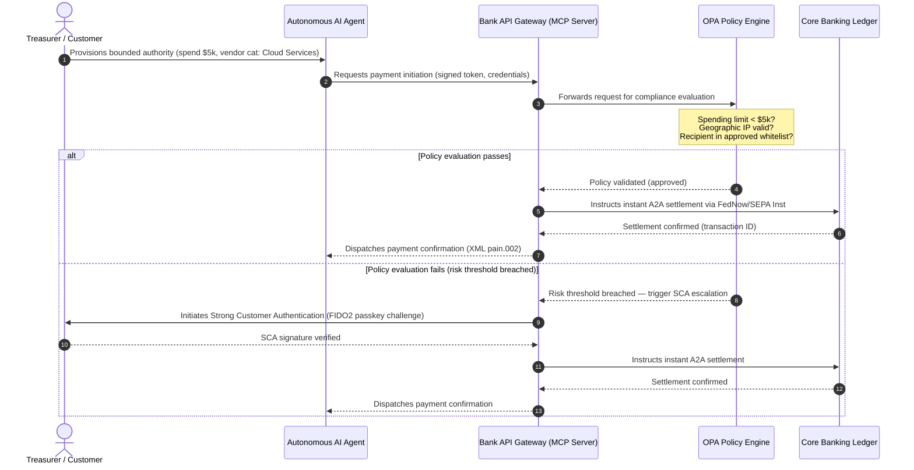

# ภาพรวมการชำระเงินระดับโลกปี 2026: โมเดลการดำเนินงาน ความเสี่ยง และรายได้ในโลกแบบเอเจนต์ มองไม่เห็น และเรียลไทม์

วงจรการชำระเงินระดับโลกปี 2026 ถูกกำหนดโดยพลังที่บรรจบกันสามประการ — พาณิชย์แบบเอเจนต์ การชำระเงินแบบฝังที่มองไม่เห็น และการดำเนินงานเรียลไทม์ — ซึ่งวางอยู่บนบัญชีแยกประเภทรวมแบบโทเค็นภายใต้ Project Agorá และการเปลี่ยนผ่านที่อยู่แบบมีโครงสร้างของ SWIFT พฤศจิกายน 2026 ที่กำหนดวันชัดเจน

<!-- lead-start -->
<aside class="post-lead" aria-label="Article summary">

<strong>สรุปย่อ.</strong> ภูมิทัศน์การชำระเงินปี 2026 เคลื่อนจากการย้ายระบบส่งข้อความไปสู่โมเดลการดำเนินงานหลายมิติ ที่ความเสี่ยงและรายได้ถูกกำหนดโดยการดำเนินงานเรียลไทม์ บทความนี้สังเคราะห์ภาพรวมปี 2026 ของ J.P. Morgan, Global Payments, HSBC และ Payments Association เป็นแผนการดำเนินงานของธนาคาร G-SIB สี่เสาหลัก ครอบคลุมพาณิชย์แบบเอเจนต์ที่ริเริ่มโดยโมเดล API การคลังที่ทำงานตลอดเวลา บัญชีแยกประเภทรวมแบบโทเค็นภายใต้ BIS Project Agorá และเส้นตายที่อยู่แบบมีโครงสร้างของ SWIFT วันที่ 14/15 พฤศจิกายน 2026

<strong>ประเด็นสำคัญ</strong>

<ul class="post-lead-takeaways">
  <li><strong>พาณิชย์แบบเอเจนต์เปิดพรมแดนความรับผิดที่มอบหมาย</strong> เอเจนต์ AI แบบอิสระคาดว่าจะเป็นตัวกลางในพาณิชย์ประจำปี 3-5 ล้านล้านดอลลาร์ภายในปี 2030 ธนาคารต้องกำหนดการควบคุม MCP การมอบหมาย SCA ภายใต้ PSD3/PSR และความเป็นเจ้าของ KYC/AML ในห่วงโซ่การชำระเงินแบบหลายเอเจนต์</li>
  <li><strong>สภาพคล่องที่ทำงานตลอดเวลาคือเส้นฐานเชิงปฏิบัติการและกฎระเบียบในปัจจุบัน</strong> API การคลังตลอด 24/7 และบัญชีเสมือนลดเงินสดที่ติดค้างและยกระดับมาตรฐานความยืดหยุ่น สำหรับ API ทรีเชอรีแบบเรียลไทม์ที่มีความสำคัญต่อระบบ ความพร้อมใช้งานห้าเก้า (99.999 %) กลายเป็นเป้าหมายวิศวกรรมภายในที่ธนาคารตั้งให้กับตนเองเพื่อแสดงให้ผู้กำกับดูแลเห็นถึงความยืดหยุ่นระดับ DORA DORA เองไม่ได้กำหนดเกณฑ์ห้าเก้าสากล แต่ครอบคลุมการจัดการความเสี่ยง ICT การรายงานเหตุการณ์ การทดสอบความยืดหยุ่น ความเสี่ยงบุคคลที่สาม และการกำกับดูแลผู้ให้บริการ ICT สำคัญ</li>
  <li><strong>การโทเค็นได้พัฒนาไปสู่บัญชีแยกประเภทรวมที่อยู่ภายใต้กฎระเบียบ</strong> Project Agorá เป็นกรอบความร่วมมือภาครัฐ-เอกชนที่ใหญ่ที่สุดสำหรับเงินฝากธนาคารพาณิชย์แบบโทเค็นและเงินสำรองของธนาคารกลาง ธนาคารต้องการเส้นทางการโทเค็นห้าขั้นตอน พร้อมการปฏิบัติเชิงป้องกันที่ชัดเจน</li>
  <li><strong>การเปลี่ยนผ่านที่อยู่แบบมีโครงสร้างวันที่ 14/15 พฤศจิกายน 2026 มีกำหนดที่ตายตัว</strong> ฟิลด์ที่อยู่ไปรษณีย์แบบไม่มีโครงสร้างในข้อความ CBPR+ และ SEPA จะทำให้เกิดการปฏิเสธทันที จำเป็นต้องมีธรรมาภิบาลข้อมูลที่สะอาดในทีมผลิตภัณฑ์ เทคโนโลยี และการกำกับดูแลการปฏิบัติตามข้อกำหนด</li>
</ul>

<strong>การอ่านที่เกี่ยวข้อง:</strong> <a href="https://sebastienrousseau.com/2026-06-23-iso-20022-pain001-programmable-liquidity-autonomic-treasury-2026">จาก Pain.001 ถึงสภาพคล่องโปรแกรมได้: ISO 20022 ในฐานะระบบประสาทอัตโนมัติของการคลังในปี 2026</a>, <a href="https://sebastienrousseau.com/2026-06-24-cross-border-iso-20022-open-finance-tokenised-deposits-treasury-2026">ข้ามพรมแดนปี 2026: ISO 20022, Open Finance และเงินฝากโทเค็นในการคลังองค์กร</a>, <a href="https://sebastienrousseau.com/2026-06-25-quantum-dawn-cib-kyberlib-quantum-resilient-payments-stack-2026">รุ่งอรุณควอนตัมสำหรับ CIB: จาก KyberLib ถึงสแต็คการชำระเงินที่ทนทานต่อควอนตัม</a>

</aside>
<!-- lead-end -->

สำหรับธนาคารธุรกรรมระดับโลก วงจร 2026-2028 คือหน้าต่างเชิงโครงสร้าง โครงสร้างพื้นฐานการชำระเงินสมัยใหม่ไม่ใช่สาธารณูปโภคเชิงธุรการอีกต่อไป — มันคือหัวใจของยุทธศาสตร์เทคโนโลยีระดับธนาคาร ภายในธนาคาร G-SIB และสถาบันระดับภูมิภาคขนาดใหญ่ เทคโนโลยี กฎระเบียบ และความคาดหวังของลูกค้าได้บรรจบกันเป็นระนาบการดำเนินงานเดียว

พลังสามประการกำหนดวงจรนี้ และแต่ละพลังเชื่อมโยงโดยตรงกับความกังวลในระดับผู้บริหาร

- **พาณิชย์แบบเอเจนต์** — การกระจายช่องทาง การออกแบบผลิตภัณฑ์ การมอบหมายความรับผิด และการบริหารความเสี่ยงโมเดลภายใต้การกำกับดูแล
- **การชำระเงินที่มองไม่เห็น** — ประสบการณ์ของลูกค้า พร้อมความเสี่ยงในการถูกตัดตัวกลางเมื่อธนาคารล้มเหลวในการฝังบัญชีแยกประเภทเข้าไปในส่วนหน้าของลูกค้าองค์กรและร้านค้า
- **การดำเนินงานเรียลไทม์** — ความเร็วของทุน พร้อมการเปลี่ยนแปลงที่ตามมาในการบริหารสภาพคล่อง ความเสี่ยงสินเชื่อ ความยืดหยุ่นเชิงปฏิบัติการ และการป้องกันการฉ้อโกง

ผลตอบแทนทางการเงินมีสาระสำคัญ การฉ้อโกงปรับขนาดในความเร็วและความซับซ้อน เส้นตายกฎระเบียบเป็นสิ่งที่หลีกเลี่ยงไม่ได้ และธนาคารที่ปรับปรุงระบบหลักของตนเชิงรุกจะปลดล็อกโอกาสในรายได้ค่าธรรมเนียมจำนวนมาก ค่าใช้จ่ายของการไม่ดำเนินการคือสิ่งตรงกันข้าม การปฏิเสธธุรกรรมทันที ปัญหาคอขวดเชิงปฏิบัติการ บทลงโทษทางกฎระเบียบ และการกัดเซาะส่วนแบ่งตลาดอย่างรวดเร็ว

## บันไดความแน่นอน — อะไรที่มีกำหนดวันที่ ถูกกำกับดูแล หรือเป็นการพยากรณ์

ไม่ใช่ทุกรายการในรายงานนี้มีความแน่นอนระดับเดียวกัน คำถามระดับคณะกรรมการคือเดลตาใดคือเส้นตาย เดลตาใดคือความคาดหวังของผู้กำกับดูแล และเดลตาใดยังคงเป็นเพียงการคาดการณ์ตลาด — เพราะคำตอบเปลี่ยนบทสนทนาเรื่องงบประมาณ

| ประเภท | ตัวอย่าง |
| --- | --- |
| **เส้นตายตายตัว** | การเปลี่ยนผ่านที่อยู่แบบมีโครงสร้างของ Swift CBPR+ (14 พฤศจิกายน 2026) กฎเกณฑ์ EPC SEPA scheme (15 พฤศจิกายน 2026) |
| **ข้อผูกพันทางกฎระเบียบ** | DORA — ความเสี่ยง ICT การทดสอบความยืดหยุ่น และการกำกับดูแลบุคคลที่สาม (EU) การมอบหมาย SCA ภายใต้ PSD3/PSR MRM ภายใต้ SR 11-7 และ PRA SS1/23 |
| **การเปลี่ยนแปลงตลาดที่มีโอกาสสูง** | API ทรีเชอรีแบบเรียลไทม์ การป้องกันการฉ้อโกงที่นำโดย AI สภาพคล่องที่ใช้ API การฉ้อโกงไบโอเมตริกที่ขับเคลื่อนด้วยดีปเฟค |
| **ตัวเลือกกลยุทธ์** | เงินฝากโทเค็น บัญชีแยกประเภทรวมภายใต้ Project Agorá ทางเดินพาณิชย์แบบเอเจนต์ FX ต่อเนื่อง (Wire 365) |
| **การพยากรณ์** | กระแสพาณิชย์แบบเอเจนต์ประจำปี `$3-$5 trillion` ภายในปี 2030 (เส้นฐาน McKinsey) |

ถือสองแถวบนสุดเป็นข้อเท็จจริงการปฏิบัติตามข้อกำหนดที่ขับเคลื่อนบรรทัดงบประมาณไม่ว่าธนาคารจะจับมูลค่าด้านบวกได้หรือไม่ ถือสองแถวล่างเป็นตัวเลือกกลยุทธ์ — มีความเชื่อมั่นสูงในทิศทาง แต่จังหวะการดำเนินการเป็นตัวเลือกของคณะกรรมการ ไม่ใช่รายการในปฏิทินของผู้กำกับดูแล

## การบรรจบกันของผู้มีอำนาจด้านการชำระเงินระดับโลก

รายงานนี้สังเคราะห์ภาพรวมการชำระเงินและพาณิชย์ปี 2026 จากเสียงอุตสาหกรรมที่น่าเชื่อถือสี่ราย — [J.P. Morgan Payments](https://www.jpmorgan.com/payments/newsroom/payments-outlook-2026-trends-report-released "J.P. Morgan Payments — Outlook 2026"), [Global Payments](https://investors.globalpayments.com/news-events/press-releases/detail/497/global-payments-releases-its-2026-commerce-and-payment "Global Payments — 2026 Commerce and Payment Trends Report"), HSBC และ The Payments Association — และเปรียบเทียบกับ [G20 Roadmap for Enhancing Cross-Border Payments](https://www.fsb.org/2026/03/fsb-kicks-off-new-implementation-phase-to-enhance-cross-border-payments-through-public-private-partnership/ "FSB — cross-border payments implementation phase, March 2026")

แต่ละองค์กรมองระบบนิเวศจากมุมตลาดที่แตกต่างกัน แต่ข้อค้นพบของพวกเขาบรรจบกันที่ค่าคงที่สามประการ

1. **รางที่ทำงานทันทีและขับเคลื่อนด้วย API คือเส้นฐาน** โมเดลการประมวลผลแบบ batch แบบเดิมถูกลดทอนความสำคัญสำหรับการไหลข้ามพรมแดนและการไหลมูลค่าสูง ความเร็วของธุรกรรมในกลุ่มเหล่านั้นถูกกำหนดโดยการส่งข้อความเรียลไทม์ที่ทำงานตลอดเวลา
2. **AI เป็นทั้งภัยคุกคามและการป้องกัน** เครื่องมือ generative และดีปเฟคขยายขนาดการฉ้อโกงธุรกรรม จำเป็นต้องมีการป้องกันโต้กลับด้วยการเรียนรู้ของเครื่องแบบหลายชั้นเรียลไทม์
3. **การโทเค็นเป็นโครงสร้างพื้นฐานที่พร้อมใช้งานในการผลิต** บัญชีแยกประเภทกำลังรวมกันเพื่อรองรับหนี้สินทางการค้าแบบโทเค็นและสกุลเงินดิจิทัลของธนาคารกลางขายส่ง

| รายงาน | ผู้ฟังหลัก | จุดเน้น | เสาหลัก | ผลกระทบต่อธนาคาร |
| --- | --- | --- | --- | --- |
| **J.P. Morgan Payments** | เหรัญญิกองค์กร, G-SIBs | สภาพคล่องเรียลไทม์, การฉ้อโกง | APIs, ไบโอเมตริก AI | สร้างระบบสภาพคล่อง FX และความเสี่ยงใหม่สำหรับการชำระบัญชีต่อเนื่อง 365 วัน |
| **Global Payments** | ร้านค้า, อีคอมเมิร์ซ | วิวัฒนาการ POS, ออมนิแชนเนล | พาณิชย์แบบเอเจนต์, เช็คเอาท์ไร้แรงเสียดทาน | สร้างทางเดินการชำระเงินของร้านค้าที่ปลอดภัยและควบคุมด้วย API สำหรับเอเจนต์ AI แบบอิสระ |
| **HSBC Insights** | บริษัทข้ามชาติ | การผสาน ERP (SAP/Oracle), เงินสดเรียลไทม์ | Treasury-as-a-Service, การมองเห็นเงินสด | สร้างรายได้จากชุด API ธุรกรรมและฝังการรายงานบัญชีเงินสดเรียลไทม์ที่ต้นทาง |
| **The Payments Association** | ฟินเทค, สถาบันการชำระเงิน | Stablecoins, การโทเค็น, กฎระเบียบระดับโลก | สินทรัพย์ดิจิทัลที่อยู่ภายใต้กฎระเบียบ, การปฏิบัติตามนโยบาย | เตรียมงบดุลสำหรับเงินฝากโทเค็นและนำทางโครงสร้างความรับผิด PSD3/PSR |

ภาพรวมทั้งสี่กำหนดสแต็คการดำเนินงานภาคเอกชนที่ทำงานบนโครงสร้างพื้นฐานนโยบายภาครัฐ G20 อย่างมีประสิทธิภาพ แปลเจตนานโยบายเป็นการตัดสินใจที่เป็นรูปธรรมเกี่ยวกับสภาพคล่อง การโทเค็น ข้อมูล และการควบคุมการฉ้อโกงภายในธนาคาร

## เสาหลักที่ 1 — พาณิชย์แบบเอเจนต์และการชำระเงินที่มองไม่เห็น

พาณิชย์แบบเอเจนต์คือการเปลี่ยนผ่านจากการเช็คเอาท์แบบคลิกซื้อที่ขับเคลื่อนโดยมนุษย์ ไปสู่การริเริ่มธุรกรรมแบบอิสระที่ขับเคลื่อนโดยโมเดล การคาดการณ์ของอุตสาหกรรมบรรจบกันที่พาณิชย์ประจำปี 3-5 ล้านล้านดอลลาร์ที่เป็นตัวกลางโดยเอเจนต์อิสระภายในปี 2030 — ส่วนแบ่งหลักเดียวต่ำของปริมาณการชำระเงินระดับโลกที่ดำเนินการโดยไม่มีมนุษย์คลิก 'ซื้อ'

ระบบนิเวศค้าปลีกและการค้ามีช่องว่างที่สอดคล้องกัน ผู้บริโภคส่วนใหญ่ที่ชัดเจนคาดหวังการชำระเงินที่เกือบไร้แรงเสียดทาน แต่ร้านค้าน้อยกว่าครึ่งให้ความสำคัญกับเช็คเอาท์คลิกเดียวหรือแคตตาล็อกผลิตภัณฑ์ที่เข้าถึงได้ผ่าน API เอเจนต์ AI ไม่สามารถนำทางหน้าจอเช็คเอาท์หลายหน้าแบบเดิมที่ออกแบบสำหรับสายตามนุษย์ พวกเขาต้องการการจับมือ API แบบเครื่องต่อเครื่องที่มีโครงสร้าง

### ลำดับความสำคัญของธนาคารและผลกระทบเชิงปฏิบัติการ

- **ความเป็นเจ้าของ KYC และ AML** ธนาคารต้องกำหนดว่าใครถือภาระผูกพันในการปฏิบัติตามข้อกำหนดภายในห่วงโซ่ธุรกรรมแบบเอเจนต์ หากเอเจนต์ AI ส่วนตัวของผู้บริโภคริเริ่มธุรกรรมผ่านเช็คเอาท์แบบเอเจนต์ของร้านค้า ธนาคารต้องตรวจสอบว่าอำนาจที่มอบหมายต้นทางถูกผูกมัดเชิงเข้ารหัสกับเจ้าของบัญชีหลัก
- **การออกแบบความรับผิดและการปฏิเสธรายการใหม่** โครงการบัตรและรางการชำระเงิน A2A ถูกออกแบบรอบการอนุมัติของมนุษย์ เมื่อเอเจนต์ AI ทำการซื้อที่ผิดพลาด — เช่น จัดซื้อสินค้าคงคลังอุตสาหกรรมที่ไม่ถูกต้องเนื่องจากข้อผิดพลาดในการแยกวิเคราะห์ข้อมูล — ธนาคารต้องจัดสรรความรับผิดอย่างชัดเจนระหว่างผู้บริโภค ผู้ให้บริการเอเจนต์ และร้านค้า
- **การจัดอันดับความเสี่ยงการไหลแบบเอเจนต์** เครื่องมือการกำหนดเส้นทางการชำระเงินต้องจัดอันดับความเสี่ยงการชำระเงินแบบเอเจนต์แบบไดนามิก ใช้ข้อกำหนดเงินสำรองหรืออัตรา interchange ที่สูงขึ้นกับธุรกรรมที่ไม่ได้ริเริ่มโดยมนุษย์ จนกว่าจะมีประวัติการชำระบัญชีที่มั่นคง

### การกระทำที่จำกัดและอำนาจที่จำกัด

เพื่อบรรเทา "การกระทำที่ไม่จำกัด" — เอเจนต์จัดซื้อขององค์กรที่ทำงานเป็นวงจรการซื้อแบบเรียกซ้ำไม่สิ้นสุดเนื่องจากความผิดพลาดของซอฟต์แวร์ — ธนาคารต้องใช้ **เกต API ที่มีอำนาจที่จำกัด** เกตเหล่านี้บังคับใช้ขีดจำกัดระดับนโยบายในสามมิติ

1. **ขีดจำกัดทางการเงินแบบลำดับชั้น** — การใช้จ่ายของเอเจนต์ถูกจำกัดด้วยขนาดธุรกรรม มูลค่าสะสมรายวัน และหมวดหมู่ร้านค้า
2. **มาตรการป้องกันที่รับรู้บริบท** — สัญญาณรอง (เวลาในวัน, IP geolocation, ความถี่ของธุรกรรม) ถูกประเมินก่อนที่บัญชีแยกประเภทจะปล่อยเงิน
3. **การยกระดับด้วยมนุษย์ในวงจร** — การอนุมัติของมนุษย์ที่บังคับถูกเรียกใช้ผ่าน Strong Customer Authentication (SCA) ภายใต้ PSD3 / PSR เมื่อใดก็ตามที่ธุรกรรมเกินเกณฑ์ความเสี่ยง

ลำดับ Mermaid ด้านล่างแสดงสถาปัตยกรรมเป้าหมายที่ธนาคารหลายแห่งจะรับรู้ว่าเป็นการไหลของการชำระเงินแบบเอเจนต์ที่มีอำนาจที่จำกัด

### Model Context Protocol (MCP)

เพื่อเชื่อมต่อโมเดล AI ในเครื่องเข้ากับชั้นการดำเนินงานที่กำกับโดยธนาคาร อุตสาหกรรมกำลังกำหนดมาตรฐานรอบ [Model Context Protocol (MCP)](https://modelcontextprotocol.io "Model Context Protocol — open standard for LLM tool integration") — โปรโตคอลแบบเปิดที่ให้ LLM เรียกใช้เครื่องมือและ API ที่มีขอบเขตชัดเจน ตรวจสอบได้ โดยไม่มีการเข้าถึงระบบหลักโดยตรง

การห่อ API ของธนาคาร (การริเริ่มการชำระเงิน การสอบถามยอดคงเหลือ การยืนยันคู่สัญญา) ไว้ในเซิร์ฟเวอร์ MCP ทำให้ LLM อยู่ห่างจากตารางฐานข้อมูลและการควบคุมระดับ root ของระบบ โมเดลโต้ตอบกับบัญชีแยกประเภทผ่านจุดสิ้นสุดที่มีโครงสร้าง ตรวจสอบ และจำกัดอัตราเท่านั้น — ความปลอดภัยถูกบังคับใช้ที่ขอบเขตของการดำเนินการเครื่องมือแบบเอเจนต์ แทนที่จะฝังอยู่ภายในโมเดล

## เสาหลักที่ 2 — การเปลี่ยนแปลงการคลังและการคิดสภาพคล่องใหม่

ความเร็วของธนาคารธุรกรรมในปี 2026 ถูกกำหนดโดยการเปลี่ยนจากการประมวลผลแบบ batch สิ้นวัน ไปสู่การดำเนินงานคลังเรียลไทม์ที่ทำงานตลอดเวลา บริษัทข้ามชาติไม่ทนต่อเงินสดที่ติดค้างอีกต่อไป — สภาพคล่องที่นิ่งอยู่ในบัญชีท้องถิ่นในช่วงสุดสัปดาห์หรือวันหยุดเพราะระบบการชำระบัญชีปิด

### กรณีเชิงเศรษฐกิจสำหรับสภาพคล่องเรียลไทม์

J.P. Morgan และ HSBC รายงานทั้งคู่ว่าบริษัทที่มีความสามารถด้านเงินสดและข้อมูลเรียลไทม์ขั้นสูง มีแนวโน้มที่จะทำผลงานดีกว่าคู่แข่งในด้านการเติบโตของรายได้และประสิทธิภาพของทุนอย่างมีนัยสำคัญ ส่วนใหญ่โดยการลดสภาพคล่องที่ติดค้างและการเพิ่มประสิทธิภาพวงจรเงินทุนหมุนเวียน

เพื่อจับมูลค่านั้น ธนาคารส่ง **ผลิตภัณฑ์ API Treasury-as-a-Service (TaaS)** ที่ให้ ERP องค์กร (SAP, Oracle) เชื่อมต่อโดยตรงกับบัญชีแยกประเภทของธนาคาร

- **API ยอดคงเหลือเรียลไทม์** ที่ใช้สคีมา `camt.052` — แทนที่โปรโตคอลการถ่ายโอนไฟล์ด้วยการรายงานสถานะเงินสดทันที ขับเคลื่อนด้วยเหตุการณ์
- **API การริเริ่มการชำระเงินจำนวนมาก** ที่ใช้ `pain.001` — การดำเนินการ batch การชำระเงินผู้ขายโดยตรง straight-through จากบัญชีแยกประเภท ERP
- **API FX ต่อเนื่อง** — เครื่องมือการคลังล็อกอัตราแลกเปลี่ยนเงินตราต่างประเทศเรียลไทม์แบบอัลกอริทึมสำหรับการชำระบัญชีข้ามพรมแดน กำจัดความเสี่ยงช่องว่างตลาดข้ามคืน
- **API บัญชีเสมือน** — บริษัทเปิดและปิดบัญชีย่อยหลายพันบัญชีแบบไดนามิกสำหรับการจับคู่ลูกหนี้อัตโนมัติและการแยกบัญชีแยกประเภท

### ความยืดหยุ่นเชิงปฏิบัติการและ DORA

การเสนอสภาพคล่องที่ทำงานตลอดเวลาเปลี่ยนโปรไฟล์ความเสี่ยงของธนาคาร สำหรับ API ทรีเชอรีแบบเรียลไทม์ที่มีความสำคัญต่อระบบ ความพร้อมใช้งานห้าเก้า (99.999 %) กลายเป็นเป้าหมายวิศวกรรมภายในที่ธนาคารตั้งให้กับตนเองเพื่อแสดงให้ผู้กำกับดูแลเห็นถึงความยืดหยุ่นระดับ DORA DORA เองไม่ได้กำหนดเกณฑ์ห้าเก้าสากล แต่ครอบคลุมการจัดการความเสี่ยง ICT การรายงานเหตุการณ์ การทดสอบความยืดหยุ่น ความเสี่ยงบุคคลที่สาม และการกำกับดูแลผู้ให้บริการ ICT สำคัญ — แต่แพลตฟอร์ม API ทรีเชอรีที่ขาดช่วงเป็นพักๆ ภายใต้โหลดต่อเนื่องจะไม่สามารถปกป้องคลังสถานการณ์รุนแรงแต่เป็นไปได้ของตนได้อย่างน่าเชื่อถือ

ภายใต้ [Digital Operational Resilience Act (DORA)](https://eur-lex.europa.eu/legal-content/EN/TXT/?uri=CELEX%3A32022R2554 "Regulation (EU) 2022/2554 — Digital Operational Resilience Act") นั่นไม่ใช่ KPI ด้าน IT — เป็นข้อกำหนดทางกฎระเบียบที่เข้มงวด ผู้กำกับดูแลคาดหวังให้ธนาคารพิสูจน์ว่าพื้นผิว API การคลังเรียลไทม์และฐานข้อมูลบัญชีแยกประเภทสามารถดูดซับการโจมตีทางไซเบอร์ที่รุนแรงแต่เป็นไปได้ การหยุดทำงานของเครือข่าย และการหยุดชะงักของไฮเปอร์สเกลเลอร์ โดยไม่ขัดจังหวะการชำระเงินที่สำคัญหรือกระทบสภาพคล่องเชิงระบบ นั่นต้องการสถาปัตยกรรมฐานข้อมูล multi-cloud แบบ geo-redundant active-active ชั้นการตรวจจับภัยคุกคามเรียลไทม์ และการสำรองอัตโนมัติ — ปรากฏในบรรทัดต้นทุนการเปลี่ยนแปลง ไม่ใช่แค่ในเอกสารการตรวจสอบ

### FX ต่อเนื่องและนวัตกรรมข้ามพรมแดน

การคลังเรียลไทม์ไม่สามารถอยู่ภายในขอบเขตสกุลเงินเดียวได้ ธนาคาร G-SIB กำลังปรับใช้โครงสร้างพื้นฐาน FX ต่อเนื่อง — แพลตฟอร์ม [Wire 365](https://www.jpmorgan.com/insights/payments/fx-cross-border/wire-365-global-clearing "J.P. Morgan — Wire 365 global clearing reinvented") ของ J.P. Morgan ประมวลผลการชำระเงินข้ามพรมแดนและการแปลง FX ทุกวันของปี เกินกว่าชั่วโมง RTGS ของธนาคารกลางแบบดั้งเดิม ชั้นนั้นเชื่อมโยงโดยตรงกับระบบเงินฝากโทเค็นและบัญชีแยกประเภทรวมที่กล่าวถึงในเสาหลักที่ 3

## เสาหลักที่ 3 — เงินฝากโทเค็นและบัญชีแยกประเภทรวม

การโทเค็นได้พัฒนาจากนำร่อง proof-of-concept ที่แยกออกมา ไปสู่โครงสร้างพื้นฐานทางการเงินระดับธนาคารที่ขยายขนาดได้ จุดเน้นได้เปลี่ยนจาก stablecoins ส่วนตัวและคริปโตเก็งกำไร ไปสู่ **เงินฝากธนาคารพาณิชย์แบบโทเค็น** และ **สกุลเงินดิจิทัลของธนาคารกลางขายส่ง (wCBDCs)** ที่ทำงานบนบัญชีแยกประเภทรวมที่โปรแกรมได้

กรอบอ้างอิงคือ [Project Agorá](https://www.bis.org/about/bisih/topics/fmis/agora.htm "BIS Project Agorá — tokenisation of wholesale cross-border payments") — ความร่วมมือภาครัฐ-เอกชนขนาดใหญ่ที่จัดโดย BIS และ IIF เกี่ยวข้องกับธนาคารกลางแปดแห่งและสถาบันการเงินเอกชนกว่า 40 แห่ง (ตามหน้า BIS Agorá, อัปเดต 27 พฤษภาคม 2026) โครงการนี้สำรวจว่าเงินฝากธนาคารพาณิชย์แบบโทเค็นรวมเข้ากับ CBDC ขายส่งแบบโทเค็นบนบัญชีแยกประเภทที่โปรแกรมได้ร่วมกันอย่างไร เพื่อกำจัดแรงเสียดทานการชำระบัญชีข้ามพรมแดน ประสานการตรวจสอบการปฏิบัติตามข้อกำหนด และเปิดใช้งานความสุดท้ายแบบอะตอม 24/7

### เส้นทางการโทเค็นห้าขั้นตอน

สำหรับธนาคาร G-SIB และธนาคารระดับภูมิภาคขนาดใหญ่ การโทเค็นเป็นเส้นทางทีละขั้นตอนจากการเพิ่มประสิทธิภาพภายในไปสู่การทำงานร่วมกันในตลาดเปิด

1. **สภาพคล่องการคลังภายใน** — การโทเค็นยอดเงินสดองค์กรภายใน (เช่น JPM Coin หรือบัญชีแยกประเภทธนาคารส่วนตัวที่เทียบเท่า) เพื่อเปิดใช้งานการโอนข้ามพรมแดนและการหักล้างทันที 24/7 ในสาขาของธนาคารเอง
2. **ทางเดินหลายธนาคารแบบจำกัด** — กลุ่มที่อยู่ภายใต้กฎระเบียบและปิด (แซนด์บ็อกซ์ Project Agorá) เพื่อทดสอบการชำระบัญชีระหว่างธนาคารและสถานะบัญชีแยกประเภทร่วมในสถาบันที่แตกต่างกัน
3. **FX โปรแกรมได้ต่อเนื่อง** — สมาร์ทคอนแทรคต์บนบัญชีแยกประเภทรวมดำเนินการ FX แบบ Payment-versus-Payment (PvP) ทันที กำจัดความเสี่ยงในการชำระบัญชีข้ามเขตเวลา
4. **สินทรัพย์โลกจริงแบบโทเค็น (RWAs)** — ขาเงินสดแบบโทเค็นรวมเข้ากับบัญชีแยกประเภทหลักทรัพย์ หนี้ หรือการค้าแบบโทเค็น สำหรับความสุดท้ายแบบ Delivery-versus-Payment (DvP) ทันที ลดการล็อกทุนจากวันเหลือมิลลิวินาที
5. **การทำงานร่วมกันแบบไฮบริด/สาธารณะที่อยู่ภายใต้กฎระเบียบ** — ตัวห่อหุ้มเกตเวย์ที่ปลอดภัยช่วยให้สภาพคล่องของสถาบันโต้ตอบอย่างปลอดภัยกับเครือข่ายสาธารณะแบบเปิด

### นัยเชิงป้องกันและงบดุล

เงินสดแบบโทเค็นต้องนำทางผ่านกรอบเชิงป้องกันอย่างระมัดระวัง ผู้กำกับดูแลเน้นย้ำว่าเงินฝากแบบโทเค็นต้องเทียบเท่าทางเศรษฐกิจกับเงินฝากธนาคารพาณิชย์แบบดั้งเดิม — หมายถึงหนี้สินที่ไม่มีหลักประกันในงบดุลของธนาคารที่มีความคุ้มครองประกันเงินฝากเดียวกัน

ในเชิงปฏิบัติการ เงินฝากแบบโทเค็นแนะนำความเสี่ยงที่โมเดลความเครียดสภาพคล่องแบบคลาสสิกไม่ได้สร้างขึ้นมาเพื่อจำลอง สมาร์ทคอนแทรคต์ดำเนินการถอนที่โปรแกรมได้ในความเร็วและปริมาณที่สมมติฐานเดิมจับไม่ได้ ภายใต้ Basel III ธนาคารต้องมั่นใจว่าเครื่องมือความเสี่ยงสามารถสร้างโมเดลการไหลออกของเงินสดที่โปรแกรมได้ และบัญชีแยกประเภทแบบโทเค็นทำงานร่วมกับระบบ RTGS เดิมได้อย่างราบรื่นในวงจรสภาพคล่องรายวัน

### Stablecoins กับเงินฝากโทเค็น — ตำแหน่งที่ละเอียดอ่อน

Stablecoins ส่วนตัวที่มีเงินสำรองเต็ม (USDC ฯลฯ) ยังคงจับส่วนแบ่งตลาดในการโอนเงินข้ามพรมแดนค้าปลีกและพาณิชย์แบบกระจายอำนาจ แต่ขาดความสามารถในการสร้างสินเชื่อและความสุดท้ายในการชำระบัญชีของระบบธนาคารพาณิชย์

แทนที่จะแข่งขันบนรางค้าปลีก ธนาคารธุรกรรมกำลังจัดตั้งการดูแล ออกเครื่องมือหนี้สินแบบโทเค็นที่อยู่ภายใต้กฎระเบียบของตน และสร้างเกตเวย์ on-/off-ramp ที่ปลอดภัย ลูกค้าองค์กรได้รับความยืดหยุ่นในการเขียนโปรแกรมในขณะที่รักษาทุนไว้ภายในขอบเขตที่อยู่ภายใต้กฎระเบียบ

### คำถามที่คณะกรรมการควรถามเกี่ยวกับเงินแบบโทเค็น

- **การมีส่วนร่วมในบัญชีแยกประเภทรวม** แผนกลยุทธ์ที่กำลังดำเนินอยู่ของเราสำหรับการมีส่วนร่วมในความริเริ่มบัญชีแยกประเภทรวมภาครัฐ-เอกชนขายส่งเช่น Project Agorá คืออะไร
- **การสร้างโมเดลงบดุลและความเสี่ยง** เครื่องมือความเสี่ยงและกรอบความเพียงพอของเงินกองทุนของเราได้อัปเดตการทดสอบความเครียดเพื่อพิจารณาความเร็วของการไหลออกของโทเค็นที่ถูกกระตุ้นโดยสมาร์ทคอนแทรคต์หรือไม่
- **กลุ่มลูกค้าที่ลงมือก่อน** กลุ่มลูกค้าการคลังองค์กรและธนาคารพาณิชย์ใดของเราจะได้รับประโยชน์ทันทีจากการชำระบัญชี DvP/PvP แบบโทเค็นที่โปรแกรมได้

## เสาหลักที่ 4 — ข้อมูลแบบมีโครงสร้างและการป้องกันการฉ้อโกง

การปฏิบัติตามข้อกำหนดโครงสร้างพื้นฐานในปี 2026 ถูกครอบงำโดย **การเปลี่ยนผ่านที่อยู่แบบมีโครงสร้างวันที่ 14/15 พฤศจิกายน 2026** ที่จัดตั้งขึ้นภายใต้ [SWIFT Standards Release (SR) 2026](https://www.swift.com/standards/iso-20022/removal-unstructured-address "SWIFT — Removal of unstructured address, November 2026") Swift CBPR+ ยกเลิกบล็อก `<AdrLine>` ที่ไม่มีโครงสร้างตั้งแต่วันที่ 14 พฤศจิกายน 2026 กฎเกณฑ์ EPC SEPA อนุญาตที่อยู่ไม่มีโครงสร้างเพียงถึงวันที่ 15 พฤศจิกายน 2026 เท่านั้น ข้อความข้ามพรมแดนหรือในประเทศใดๆ ที่มีที่อยู่แบบไม่มีโครงสร้างที่คาดว่าจะมีองค์ประกอบแบบมีโครงสร้างจะถูกล่าช้าหรือปฏิเสธโดยเครือข่ายหลังการเปลี่ยนผ่าน

สถาบันส่วนใหญ่รู้วันที่ หลายแห่งถือว่าเป็นการทำแผนที่ผิวเผินที่ชั้นอินเทอร์เฟซ ความเป็นจริงคือความท้าทายด้านคุณภาพข้อมูลและธรรมาภิบาลข้อมูลที่ลึกกว่า เพื่อหลีกเลี่ยงอัตราการปฏิเสธที่หายนะ การดำเนินงานการชำระเงินต้องการกรอบธรรมาภิบาลข้ามสายงานที่ชัดเจน

- **ผลิตภัณฑ์และการดำเนินงาน** การจับข้อมูลที่ต้นทาง พอร์ทัลดิจิทัลที่ลูกค้าเผชิญ อินเทอร์เฟซการเปิดบัญชี และฟิลด์ป้อนข้อมูล ERP องค์กรต้องบังคับใช้ที่อยู่แบบมีโครงสร้าง (`<StrtNm>`, `<PstCd>`, `<TwnNm>`, `<Ctry>`) ที่จุดริเริ่มการชำระเงิน
- **เทคโนโลยี** การแยกวิเคราะห์ การทำแผนที่ การตรวจสอบสคีมา เครื่องมือการตรวจสอบบล็อกไฟล์เดิมก่อนที่จะไปถึงอินเทอร์เฟซ SWIFT โมเดลการเรียนรู้ของเครื่องที่ปรับใช้ในเครื่องแยกวิเคราะห์บล็อกที่อยู่แบบไม่มีโครงสร้างเดิมเป็นแท็กที่สอดคล้องกับ XML ภายใต้ `<PstlAdr>`
- **การปฏิบัติตามข้อกำหนดและความเสี่ยง** การคัดกรองการคว่ำบาตร การตรวจสอบธุรกรรม และตรรกะ AML ได้รับการอัปเดตเพื่อรับเข้าฟิลด์ XML ที่มีโครงสร้าง — ลดอัตราผลบวกลวงและการสืบสวนด้วยตนเอง

### กรณีธุรกิจสำหรับข้อมูลแบบมีโครงสร้าง

หากถือเป็นต้นทุนการปฏิบัติตามข้อกำหนด โครงการข้อมูลแบบมีโครงสร้างจะแพง หากถือเป็นตัวเอื้อรายได้ มันคุ้มค่ากับตัวเอง

1. **การตัดสินใจเครดิตขั้นสูง** ข้อมูลใบแจ้งหนี้ การชำระเงิน และลูกหนี้ขั้นสุดท้ายแบบมีโครงสร้าง ช่วยให้ธนาคารสร้างโครงการการเงินเงินทุนหมุนเวียนและการ factoring ใบแจ้งหนี้ห่วงโซ่อุปทานแบบอัตโนมัติและแม่นยำสำหรับลูกค้าองค์กร
2. **การจับคู่ลูกหนี้อัตโนมัติ** การเปิดเผยตัวระบุคู่สัญญาและใบแจ้งหนี้แบบมีโครงสร้างสนับสนุนผลิตภัณฑ์การกระทบยอดเงินสดและการรวมบัญชีเสมือนระดับพรีเมียม สร้างรายได้ค่าธรรมเนียมธุรกรรมใหม่
3. **การวิเคราะห์ธุรกรรมที่สร้างรายได้ได้** ธนาคารบรรจุและขายแดชบอร์ดการวิเคราะห์สภาพคล่องเรียลไทม์และรูปแบบการซื้อที่ละเอียดให้กับ CFO และเหรัญญิกองค์กร

### การป้องกันการฉ้อโกง AI แบบหลายชั้น

เมื่อความเร็วของธุรกรรมเร่งสู่เรียลไทม์ เทคนิคการฉ้อโกงได้ขยายขนาด [รายงานการฉ้อโกงอัตลักษณ์ 2026 ของ Entrust](https://www.entrust.com/resources/reports/identity-fraud-report "Entrust 2026 Identity Fraud Report") ระบุว่าดีปเฟคคิดเป็น **หนึ่งในห้าของความพยายามฉ้อโกงไบโอเมตริก** การวิเคราะห์ของ Entrust ก่อนหน้านี้ระบุว่าดีปเฟคคิดเป็น **40 % ของความพยายามฉ้อโกงไบโอเมตริกวิดีโอ** โดยเฉพาะ ไม่ว่าจะตีกรอบแบบไหน สื่อสังเคราะห์เป็นช่องทางสำคัญในการเอาชนะการควบคุมการรู้จำเสียงและใบหน้าในการเปิดบัญชีและการไหลของการชำระเงิน

การป้องกันคือ **โมเดลการฉ้อโกง AI สามชั้น**

1. **ชั้นข้อมูลประจำตัว** passkey [FIDO2](https://fidoalliance.org/fido2/ "FIDO Alliance — FIDO2 specification") ที่ตรวจสอบไบโอเมตริก การผูกอุปกรณ์ฮาร์ดแวร์ที่ลงนามเชิงเข้ารหัส และกระเป๋าเงิน ID ดิจิทัลแบบกระจายอำนาจ เพื่อรักษาความปลอดภัยการเข้าถึงการชำระเงิน
2. **ชั้นพฤติกรรม** ไบโอเมตริกพฤติกรรมต่อเนื่อง — จังหวะการนำทางเซสชัน จังหวะการพิมพ์ การวางแนวอุปกรณ์ — เพื่อตรวจจับการดำเนินการบอตอัตโนมัติหรือความพยายามจี้เซสชัน
3. **ชั้นธุรกรรม** ฟิลด์ที่มีโครงสร้างของ ISO 20022 ป้อนเครื่องมือความเสี่ยงการเรียนรู้ของเครื่องเรียลไทม์ ตรวจสอบเมตาดาต้าธุรกรรมข้ามกับข้อมูลข่าวกรองกลุ่มเครือข่ายร่วม เพื่อระบุธุรกรรมที่น่าสงสัยภายในมิลลิวินาทีของการริเริ่ม

เพื่อให้ผู้กำกับดูแลพอใจ โมเดล AI ชั้นธุรกรรมรวมพารามิเตอร์ **ความสามารถในการอธิบาย** ที่เข้มงวด และดำเนินการภายใต้โครงการ Model Risk Management (MRM) เฉพาะ ผู้กำกับดูแลคาดหวังให้ธนาคารอธิบายจุดข้อมูลเฉพาะและตรรกะอัลกอริทึมที่ทำให้เกิดการบล็อกอัตโนมัติหรือการแจ้งเตือนการฉ้อโกง สอดคล้องกับ [US Federal Reserve SR 11-7](https://www.federalreserve.gov/frrs/guidance/supervisory-guidance-on-model-risk-management.htm "US Federal Reserve — Supervisory Guidance on Model Risk Management, SR 11-7") และ [PRA SS1/23](https://www.bankofengland.co.uk/prudential-regulation/publication/2023/may/model-risk-management-principles-for-banks-ss "Bank of England PRA SS1/23 — Model Risk Management principles for banks") ของธนาคารแห่งอังกฤษ

## วาระห้องประชุมกรรมการปี 2026-2028

เพื่อดำเนินการตลอดสี่เสาหลัก คณะกรรมการบริหารธนาคาร G-SIB และธนาคารระดับภูมิภาคควรจัดการการลงทุนเชิงปฏิบัติการและเทคโนโลยีตามแผนสามขอบฟ้าที่ชัดเจน

### ขอบฟ้า 1 — การปฏิบัติตามข้อกำหนดทันทีและการเสริมความแข็งแกร่งของแกนหลัก (0-12 เดือน)

- **จุดเน้น** กำหนดมาตรฐานคุณภาพข้อมูล ISO 20022 และรักษาเส้นทางธุรกรรมเรียลไทม์พื้นฐาน
- **ตัวบ่งชี้ความสำเร็จ (KPI)** การปฏิเสธที่อยู่แบบไม่มีโครงสร้างเป็นศูนย์บน SWIFT และ SEPA หลังการเปลี่ยนผ่านวันที่ 14/15 พฤศจิกายน 2026
- **เจ้าของบริหาร** ประธานเจ้าหน้าที่ปฏิบัติการ / หัวหน้าฝ่ายการดำเนินงานการชำระเงิน
- **ประเภทผลผลิต** การเคลื่อนไหวที่ไม่มีเสียใจ การอัปเดตสคีมาฐานข้อมูลหลักและเครื่องมือการตรวจสอบ SWIFT SR 2026

### ขอบฟ้า 2 — การทำงานอัตโนมัติและการป้องกันแบบเอเจนต์ (12-24 เดือน)

- **จุดเน้น** เกต API แบบเอเจนต์ที่จำกัดและสถาปัตยกรรมการป้องกันการฉ้อโกงต่อเนื่อง
- **ตัวบ่งชี้ความสำเร็จ (KPI)** 100% ของธุรกรรม API ที่ริเริ่มโดยเครื่องต่อเครื่องและ AI ได้รับการตรวจสอบผ่านการผูกฮาร์ดแวร์ FIDO2 และเครื่องมือนโยบายอำนาจที่จำกัด
- **เจ้าของบริหาร** ประธานเจ้าหน้าที่สารสนเทศ / ประธานเจ้าหน้าที่ความเสี่ยง
- **ประเภทผลผลิต** การเคลื่อนไหวที่ไม่มีเสียใจ (การป้องกันการฉ้อโกง) บวกตัวเลือกกลยุทธ์ (พาณิชย์แบบเอเจนต์) การปรับใช้ MCP และ AI การฉ้อโกงสามชั้น

### ขอบฟ้า 3 — การโทเค็นแพลตฟอร์มและบัญชีแยกประเภทรวม (24-36 เดือน)

- **จุดเน้น** เปลี่ยนสินทรัพย์การคลังเป็นเงินฝากโทเค็นและเข้าร่วมในบัญชีแยกประเภทข้ามพรมแดนที่ใช้ร่วมกัน
- **ตัวบ่งชี้ความสำเร็จ (KPI)** อย่างน้อย 15% ของปริมาณการชำระบัญชีการคลังองค์กรมูลค่าสูงได้รับการประมวลผลโดยกำเนิดผ่านเครื่องมือเงินฝากโทเค็นหรือการจัดเรียงบัญชีแยกประเภทรวม (เช่น ทางเดิน Project Agorá)
- **เจ้าของบริหาร** เหรัญญิกกลุ่ม / หัวหน้าฝ่ายธนาคารธุรกรรม
- **ประเภทผลผลิต** ตัวเลือกกลยุทธ์ โครงสร้างพื้นฐานบัญชีแยกประเภทที่โปรแกรมได้ กฎสภาพคล่องสมาร์ทคอนแทรคต์ ตัวแปลงการชำระบัญชี DvP/PvP

## ต้องทำอะไรเช้าวันจันทร์ — รายการตรวจสอบหกข้อสำหรับธนาคาร

แผนสามขอบฟ้าคือแผนวงจร รายการตรวจสอบด้านล่างคือสิ่งที่ CIO, COO หรือหัวหน้าฝ่ายธนาคารธุรกรรมสามารถวางบนโต๊ะได้ภายในสิ้นสัปดาห์ทำงานถัดไป โดยไม่คำนึงว่าส่วนที่เหลือของโปรแกรมจะมีความสมบูรณ์เพียงใด

1. **สำรวจการเปิดเผยที่อยู่แบบไม่มีโครงสร้าง** ตามช่องทางและประเภทข้อความ ทุกเส้นทางไฟล์เดิม ทุกจุดสิ้นสุด API เดิม ทุก ERP องค์กรที่ยังคงปล่อย `<AdrLine>` แบบข้อความอิสระ ผลผลิต จำนวน เจ้าของ และวันที่แก้ไขต่อแหล่งที่มา
2. **จัดทำอนุกรมวิธานความเสี่ยงการชำระเงินแบบเอเจนต์** จัดหมวดหมู่กระแสที่ไม่ได้ริเริ่มโดยมนุษย์ตามวิธีการริเริ่ม (เอเจนต์ผู้บริโภค เอเจนต์ร้านค้า เอเจนต์จัดซื้อองค์กร) ประเภทคู่สัญญา และรางการชำระเงิน ผลผลิต อนุกรมวิธานหนึ่งหน้าและตั๋วสำหรับเครื่องมือกำหนดเส้นทาง
3. **กำหนดขีดจำกัดนโยบายอำนาจที่มอบหมายสำหรับการชำระเงินที่ริเริ่มโดย AI** ขีดจำกัดเป็นชั้นตามขนาดธุรกรรม หมวดหมู่ร้านค้า ภูมิศาสตร์ ผลผลิต ร่างข้อกำหนดนโยบายในรูปโค้ดที่เครื่องมือ OPA สามารถบังคับใช้ได้
4. **ทำแผนที่ API ทรีเชอรีที่สำคัญต่อ DORA และการพึ่งพาบุคคลที่สาม** API ใดอยู่ในคลังสถานการณ์รุนแรงแต่เป็นไปได้ พึ่งพาบุคคลที่สามใด สัญญาใดได้ปฏิบัติตาม DORA Article 28 แล้ว ผลผลิต แถวลงทะเบียนผู้ให้บริการ ICT สำคัญต่อ API หนึ่งรายการ
5. **ระบุกรณีการใช้งานเงินฝากโทเค็นสองกรณีที่มีมูลค่าทรีเชอรีที่วัดได้** การหักล้างข้ามสาขาภายในและทางเดินที่อยู่ติดกับ Project Agorá หนึ่งทางเดินคือสองกรณีแรกที่สมจริง ผลผลิต กรณีธุรกิจที่มีขนาดสำหรับแต่ละกรณี พร้อมเจ้าของและวันที่ตัดสินใจภายใน 90 วัน
6. **สร้างกรอบควบคุมความเสี่ยงโมเดลสำหรับการฉ้อโกงและการตัดสินใจแบบเอเจนต์** ทำแผนที่ทุกโมเดล ML ในเส้นทางการฉ้อโกงและการชำระเงินแบบเอเจนต์ให้ตรงกับความคาดหวังของ SR 11-7 และ PRA SS1/23 วัตถุประสงค์ที่บันทึกไว้ สายข้อมูล ความสามารถในการอธิบาย การตรวจสอบ และเส้นทางการ override ผลผลิต เมทริกซ์ควบคุม MRM หนึ่งหน้าต่อโมเดล

ประเด็นของรายการนี้ไม่ใช่ว่ารายการใดเป็นเรื่องใหม่ ประเด็นคือมันเล็กพอที่จะเริ่มได้ภายในสัปดาห์นี้ สังเกตได้ดีพอที่จะติดตามในคณะกรรมการบริหารครั้งถัดไป และสอดคล้องเชิงโครงสร้างกับเสาหลักสี่ประการ เพื่อให้งานช่วงต้นป้อนเข้าสู่โปรแกรมแทนที่จะแข่งขันกับโปรแกรม

## คำถามที่พบบ่อย

**พาณิชย์แบบเอเจนต์จะถึง 3-5 ล้านล้านดอลลาร์ภายในปี 2030 จริงหรือ**
เส้นฐาน McKinsey ชี้ไปที่ยอดขายพาณิชย์แบบเอเจนต์ 5 ล้านล้านดอลลาร์ภายในปี 2030 พร้อมการคาดการณ์อิสระที่กลุ่มอยู่ระหว่าง 3 ล้านล้านถึง 5 ล้านล้านดอลลาร์ ความแปรปรวนสะท้อนว่าร้านค้าส่ง API เช็คเอาท์ที่อ่านได้ด้วยเครื่องอย่างก้าวร้าวเพียงใด และธนาคารปล่อยให้เอเจนต์ทำธุรกรรมภายใต้การมอบหมาย SCA เร็วเพียงใด — คอขวดอยู่ที่ฝั่งธนาคารและร้านค้า ไม่ใช่ที่ฝั่งความสามารถของเอเจนต์

**การเปลี่ยนผ่าน SWIFT วันที่ 14/15 พฤศจิกายน 2026 ใช้กับการไหล SEPA ภายในประเทศด้วยหรือไม่**
ใช่ ข้อกำหนดที่อยู่แบบมีโครงสร้างใช้กับข้ามพรมแดน CBPR+ และข้อความการชำระเงิน SEPA ธนาคารที่ใช้รางทั้งสองต้องการสคีมาที่อยู่ canonical เดียวต้นน้ำของอินเทอร์เฟซ SWIFT ไม่ใช่การทำแผนที่แบบขนานสองชุด

**เงินฝากแบบโทเค็นเหมือนกับ stablecoin หรือไม่**
ไม่ เงินฝากแบบโทเค็นคือหนี้สินที่ไม่มีหลักประกันในงบดุลของธนาคารที่อยู่ภายใต้กฎระเบียบ ที่มีความคุ้มครองประกันเงินฝากเดียวกันกับเงินฝากแบบดั้งเดิม Stablecoin โดยทั่วไปเป็นเครื่องมือที่มีเงินสำรองเต็มที่ออกโดยไม่ใช่ธนาคาร โดยไม่มีความสามารถในการสร้างสินเชื่อ การออกแบบของ Project Agorá สันนิษฐานว่าเงินฝากแบบโทเค็นอยู่เคียงข้าง wCBDC บนบัญชีแยกประเภทที่โปรแกรมได้ร่วมกัน Stablecoins ไม่ปรากฏในขาการชำระบัญชีขายส่ง

**Project Agorá เกี่ยวข้องกับนำร่อง wCBDC ที่มีอยู่อย่างไร**
Agorá คือกรอบบูรณาการ การทดลอง wCBDC ระดับชาติครอบคลุมขาเงินของธนาคารกลาง Agorá นำเงินฝากพาณิชย์แบบโทเค็นมาบนบัญชีแยกประเภทที่โปรแกรมได้เดียวกัน เพื่อให้การชำระบัญชีข้ามพรมแดนเป็นแบบอะตอมข้ามทั้งสองประเภทเงิน ธนาคารกลางที่เข้าร่วมแปดแห่งและสถาบันเอกชน 40+ แห่งทำให้เป็นพื้นที่ออกแบบภาครัฐ-เอกชนที่ใหญ่ที่สุดสำหรับสถาปัตยกรรมเงินโทเค็นขายส่ง

**ท่าทีการปฏิบัติตามข้อกำหนด DORA ขั้นต่ำสำหรับ API TaaS คืออะไร**
การปรับใช้แบบ geo-redundant active-active สถานการณ์ไซเบอร์ที่รุนแรงแต่เป็นไปได้ที่บันทึกพร้อมเจ้าของที่ระบุภายใต้ SM&CR (สหราชอาณาจักร) และการสำรองที่ทดสอบที่ไม่ขัดจังหวะการชำระเงินที่สำคัญ หากไม่มีสิ่งนั้น ผลิตภัณฑ์ TaaS เป็นภาระทางกฎระเบียบก่อนที่จะเป็นบรรทัดรายได้

## เอกสารอ้างอิง

- Bank for International Settlements (BIS) Innovation Hub. (2026). *Project Agorá: exploring tokenisation of wholesale cross-border payments*. [BIS Project Agorá](https://www.bis.org/about/bisih/topics/fmis/agora.htm).
- Deutsche Bank. (2026). *Digital Money: a perspective on stablecoins, tokenised deposits and CBDCs*. [Deutsche Bank Flow](https://flow.db.com/publications/flow-white-papers-and-guides/digital-money-a-perspective-on-stablecoins-tokenised-deposits-and-cbdcs).
- European Parliament and Council. (2022). *Regulation (EU) 2022/2554 on Digital Operational Resilience (DORA)*. [DORA Regulation](https://eur-lex.europa.eu/legal-content/EN/TXT/?uri=CELEX%3A32022R2554).
- Financial Stability Board. (2026). *FSB kicks off new implementation phase to enhance cross-border payments*. [FSB statement](https://www.fsb.org/2026/03/fsb-kicks-off-new-implementation-phase-to-enhance-cross-border-payments-through-public-private-partnership/).
- Global Payments. (2025). *2026 Commerce and Payment Trends Report — press release*. [Global Payments press release](https://investors.globalpayments.com/news-events/press-releases/detail/497/global-payments-releases-its-2026-commerce-and-payment).
- J.P. Morgan Payments. (2026). *Payments Outlook 2026 Trends Report Released*. [J.P. Morgan Newsroom](https://www.jpmorgan.com/payments/newsroom/payments-outlook-2026-trends-report-released).
- J.P. Morgan Insights. (2026). *5 Payment Trends to Watch for in 2026*. [J.P. Morgan Trends](https://www.jpmorgan.com/insights/payments/trends-innovation/five-payment-trends-in-2026).
- J.P. Morgan FX & Cross-Border. (2026). *Wire 365: Global Clearing Reinvented*. [J.P. Morgan FX Wire 365](https://www.jpmorgan.com/insights/payments/fx-cross-border/wire-365-global-clearing).
- SWIFT. (2026). *ISO 20022 milestone for November 2026: unstructured addresses to be removed*. [SWIFT ISO 20022 Milestone](https://www.swift.com/news-events/news/iso-20022-milestone-november-2026-unstructured-addresses-be-removed).
- SWIFT Standards. (2026). *Removal of unstructured address*. [SWIFT Standards](https://www.swift.com/standards/iso-20022/removal-unstructured-address).
- Bank of England. (2023). *Supervisory Statement (SS1/23) — Model Risk Management principles for banks*. [Bank of England PRA SS1/23](https://www.bankofengland.co.uk/prudential-regulation/publication/2023/may/model-risk-management-principles-for-banks-ss).
- US Federal Reserve. (2011). *Supervisory Guidance on Model Risk Management (SR 11-7)*. [SR 11-7](https://www.federalreserve.gov/frrs/guidance/supervisory-guidance-on-model-risk-management.htm).
- McKinsey & Company. (2025). *McKinsey forecast: $5 trillion in agentic commerce sales by 2030* (via Digital Commerce 360). [McKinsey agentic forecast](https://www.digitalcommerce360.com/2025/10/20/mckinsey-forecast-5-trillion-agentic-commerce-sales-2030/).
- HSBC Business. (2026). *HSBC Business Insights*. [HSBC Insights](https://www.business.hsbc.com/en-gb/insights).
- Bright Defense. (2026). *Deepfake Statistics: A Growing Security Concern*. [Deepfake fraud statistics](https://www.brightdefense.com/resources/deepfake-statistics/).
- European Banking Authority. (2019). *Guidelines on outsourcing arrangements (EBA/GL/2019/02)*. [EBA Outsourcing Guidelines](https://www.eba.europa.eu/regulation-and-policy/internal-governance/guidelines-on-outsourcing-arrangements).

<!-- enrich-start -->
<aside class="author-card" aria-label="About the author"><strong class="author-card-name"><a href="/about/index.html">Sebastien Rousseau</a></strong>นักเทคโนโลยีธนาคารอาวุโสที่เขียนเกี่ยวกับ AI ประยุกต์ การย้าย ISO 20022 การเข้ารหัสหลังควอนตัมสำหรับบริการทางการเงิน และการเปลี่ยนแปลงเชิงโครงสร้างของการชำระเงินขายส่งประสบการณ์ 20+ ปีที่ HSBC Commercial &amp; Investment Bank, PayPal, Barclays, Shazam, AKQA, Virgin Group <a href="/about/index.html">โปรไฟล์ฉบับเต็ม</a> &middot; <a href="https://www.linkedin.com/in/sebastienrousseau/" rel="external noopener">LinkedIn</a> &middot; <a href="https://github.com/sebastienrousseau" rel="external noopener">GitHub</a></aside>

ตรวจสอบล่าสุด <time datetime="2026-06-25">2026-06-25</time>

<!-- enrich-end -->
