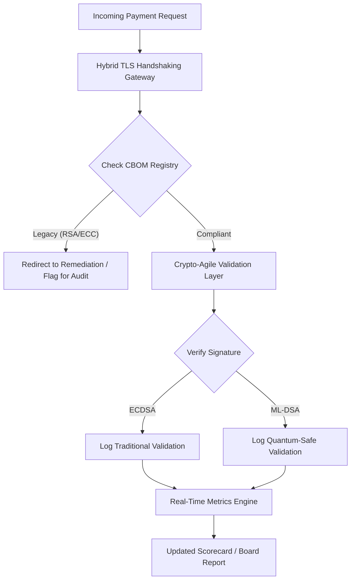

# สกอร์การ์ดความปลอดภัยหลังควอนตัมปี 2026: กรอบตัวชี้วัดระดับคณะกรรมการเพื่อความคล่องตัวเชิงเข้ารหัสในฐานะภาระผูกพันทางทรัสตี

<aside class="post-lead" aria-label="Article summary">

<strong>TL;DR.</strong> ณ เดือนมิถุนายน 2026 การเข้ารหัสหลังควอนตัม (PQC) ได้เปลี่ยนผ่านจากข้อกังวลทางเทคนิคเชิงทดลองไปสู่ภาระผูกพันทางทรัสตีหลัก คณะกรรมการต้องกำกับดูแลการย้ายระบบการเข้ารหัสแบบเดิมไปสู่มาตรฐาน NIST FIPS 203 และ 204 อย่างเป็นระบบ เพื่อบรรเทาความเสี่ยงทางการเงินและการดำเนินงานเชิงระบบภายใต้ DORA

<strong>ประเด็นสำคัญ</strong>

<ul class="post-lead-takeaways">
  <li><strong>การจัดแนวร่วม G20 และเส้นตายเด็ดขาด</strong> หน่วยงานกำกับดูแลระหว่างประเทศได้กำหนดช่วงปลายทศวรรษ 2020 เป็นเส้นตายเด็ดขาดสำหรับการเปลี่ยนผ่านสู่ระบบที่ปลอดภัยต่อควอนตัม โดยกำหนดให้สถาบันต้องแสดงความคืบหน้าการย้ายที่วัดผลได้</li>
  <li><strong>Cryptographic Bill of Materials (CBOM)</strong> เปรียบได้กับ software BOM โดย CBOM คือบัญชีสินทรัพย์เข้ารหัสทั้งหมดแบบสดและอัตโนมัติ ที่จำเป็นต่อการสร้างความโปร่งใสตลอดห่วงโซ่อุปทาน</li>
  <li><strong>การเปิดเผยต่อ Harvest-Now-Decrypt-Later (HNDL)</strong> ผู้โจมตีกำลังดักจับและจัดเก็บข้อมูลการชำระเงินขายส่งมูลค่าสูงที่ถูกเข้ารหัสไว้ในขณะนี้ การบรรเทาความเสี่ยงนี้จำเป็นต้องติดตั้งสถาปัตยกรรม PQC แบบไฮบริดทันที</li>
  <li><strong>ธรรมาภิบาลทางทรัสตีผ่าน crypto-agility</strong> Crypto-agility คือตัวชี้วัดธรรมาภิบาลที่วัดผลได้ ความสามารถในการสลับเปลี่ยน cryptographic primitives โดยไม่ต้องออกแบบระบบหลักใหม่ (โดยใช้ไลบรารีอย่าง KyberLib) คือความรับผิดระดับคณะกรรมการภายใต้ SM&CR</li>
</ul>

<strong>อ่านเพิ่มเติม:</strong> <a href="https://sebastienrousseau.com/2026-06-12-kyberlib-post-quantum-banking-migration-standards-code-2026">KyberLib และการย้ายธนาคารสู่ยุคหลังควอนตัมในปี 2026</a>, <a href="https://sebastienrousseau.com/2023-11-19-crystals-kyber-the-safeguarding-algorithm-in-a-quantum-age/index.html">CRYSTALS-Kyber: อัลกอริทึมปกป้องข้อมูลในยุคควอนตัม</a>

</aside>
ความปลอดภัยหลังควอนตัมไม่ใช่โครงการวิจัยอีกต่อไป "นาฬิกาฝ่ายกำกับ" กำลังเดินเข้าใกล้เส้นตายบังคับใช้ในช่วงปลายทศวรรษ 2020 การประกาศใช้ [NIST FIPS 203 (ML-KEM)](https://csrc.nist.gov/pubs/fips/203/final) และ [NIST FIPS 204 (ML-DSA)](https://csrc.nist.gov/pubs/fips/204/final) ได้กำหนดมาตรฐานสำหรับการห่อหุ้มกุญแจและลายเซ็นดิจิทัลอย่างเป็นทางการ

หน่วยงานกำกับคาดหวังให้ธนาคาร Tier-1 ก้าวพ้นโครงการนำร่อง ในปี 2026 โฟกัสได้เปลี่ยนไปสู่การทำให้มาตรฐานเหล่านี้กลายเป็นกระบวนการอุตสาหกรรม การไม่สามารถแสดงเส้นทางการย้ายที่ชัดเจนนำมาซึ่งบทลงโทษทางการกำกับอย่างมีนัยสำคัญภายใต้ [Digital Operational Resilience Act (DORA)](https://eur-lex.europa.eu/eli/reg/2022/2554/oj) และความรับผิดส่วนบุคคลที่อาจเกิดขึ้นกับกรรมการที่เพิกเฉยต่อภัยคุกคามการถอดรหัสด้วยควอนตัมซึ่งคาดการณ์ได้

## 01. สกอร์การ์ดควอนตัมระดับคณะกรรมการ

ตัวชี้วัดต่อไปนี้คือกรอบมาตรฐานให้คณะกรรมการประเมินความพร้อมต่อควอนตัมและสุขภาพเชิงเข้ารหัสทั่วทั้งหน่วยงาน Commercial and Investment Banking (CIB)

### ตาราง 1: ตัวชี้วัดและค่าความคลาดเคลื่อนของสกอร์การ์ด PQC

| ตัวชี้วัด | สูตรคณิตศาสตร์ | ค่าความคลาดเคลื่อนที่บอร์ดอนุมัติ | ความเสี่ยงเมื่ออยู่นอกค่าที่กำหนด |
| ---- | ---- | ---- | ---- |
| **Inventory Completeness Percentage (ICP)** | (สินทรัพย์เข้ารหัสที่ระบุแล้ว / สินทรัพย์ทั้งหมดที่ประเมินไว้) × 100 | > 98% | การเข้ารหัสซ่อนเร้นและจุดบอดในเส้นทางข้อมูลการเคลียร์มูลค่าสูง |
| **HNDL Exposure Rate (HER)** | (ข้อมูลอายุยาวที่ใช้ระบบเข้ารหัสเดิม / ข้อมูลอายุยาวทั้งหมด) × 100 | < 5% | ความลับทางการค้า บัญชีหนี้สาธารณะ และบันทึกการชำระเงินขายส่งถูกเจาะถาวร |
| **NIST Migration Progress Rate (MPR)** | (ระบบที่ใช้ FIPS 203/204 / ระบบสำคัญทั้งหมด) × 100 | > 60% (ภายในสิ้นปี 2026) | ไม่ปฏิบัติตามข้อบังคับและถูกตัดออกจากคู่สัญญาที่ปฏิบัติตามแนวทาง G20 |
| **Crypto-Agility Readiness Index (CARI)** | (แอปที่มีชั้นการเข้ารหัสแบบนามธรรม / แอปหลักทั้งหมด) × 100 | > 85% | หนี้ทางเทคนิครุนแรงและไร้ความสามารถในการตอบสนองต่อการเลิกใช้อัลกอริทึมในอนาคต |

## 02. Cryptographic Bill of Materials (CBOM)

ตัวชี้วัด ICP กำหนดเส้นฐานผ่าน **ขั้นตอนการค้นพบ CBOM** ที่ครอบคลุม ซึ่งเป็นกระบวนการอัตโนมัติที่ระบุทุก endpoint เข้ารหัสภายในองค์กร

- **การค้นพบ Endpoint:** สแกนเครือข่ายภายในและคลาวด์เพื่อค้นหาเซสชัน TLS ที่ใช้งานอยู่ และระบุการใช้ RSA หรือ ECC แบบเดิม
- **บัญชีกุญแจ:** จับคู่กุญแจสาธารณะ/กุญแจส่วนตัวกับเจ้าของและบันทึกวันหมดอายุที่แน่นอน
- **การจับคู่ Dependency:** ระบุไลบรารีและ API ของบุคคลที่สามที่พึ่งพาอัลกอริทึมที่เลิกใช้แล้ว

ขั้นตอนการค้นพบนี้สร้างแหล่งข้อมูลความจริงเพียงแหล่งเดียว ที่ช่วยให้ CISO สามารถรายงานสุขภาพเชิงเข้ารหัสได้ในระดับความละเอียดเดียวกับผลประกอบการทางการเงิน

## 03. ขจัดการเปิดเผยต่อ HNDL ในการชำระเงินขายส่ง

ผู้โจมตีกำลังพุ่งเป้าไปที่การชำระเงินขายส่งและฐานข้อมูลบริษัทที่มีอายุการใช้งานยาว การโจมตีแบบ "Harvest-Now-Decrypt-Later" (HNDL) เกี่ยวข้องกับการดักจับและเก็บถาวรของทราฟฟิกที่เข้ารหัสในวันนี้

แม้คอมพิวเตอร์ควอนตัมที่เกี่ยวข้องเชิงเข้ารหัส (CRQC) จะยังไม่มีอยู่ในวันนี้ แต่ข้อมูลที่ถูกดักจับในตอนนี้จะเปราะบางในอนาคต การบรรเทาเรื่องนี้จำเป็นต้องเร่งย้ายข้อมูลอายุยาว (เช่น บันทึกอัตลักษณ์ สัญญาพันธบัตร 30 ปี และเอกสารกฎหมาย) ซึ่งจะลดตัวชี้วัด HER โดยตรง การอัปเกรดช่องทางการชำระเงินไปสู่การเข้ารหัสไฮบริด PQC-ดั้งเดิม (โดยใช้ ML-KEM ควบคู่กับ X25519) ให้การป้องกันทันทีต่อภัยคุกคามจากการเก็บถาวร

## 04. ทำให้ Crypto-Agility ใช้งานจริงผ่านอินเทอร์เฟซที่ออกแบบดี

Crypto-agility เกิดขึ้นได้ผ่านนามธรรมเชิงวิศวกรรม ไลบรารีสมัยใหม่อย่าง [KyberLib](https://sebastienrousseau.com/2026-06-12-kyberlib-post-quantum-banking-migration-standards-code-2026) แสดงให้เห็นว่านักพัฒนาสามารถติดตั้งโมดูลที่ปลอดภัยต่อควอนตัมโดยไม่ต้องเขียนสแตกแอปพลิเคชันทั้งหมดใหม่

- **Wrapper แบบนามธรรม:** แอปพลิเคชันเรียกใช้ฟังก์ชัน `encrypt()` หรือ `sign()` แบบทั่วไป แทนรูทีนเฉพาะอัลกอริทึม
- **การสลับเปลี่ยนขณะรันไทม์:** โมดูลภายในสามารถสลับจาก ECDSA ไปเป็น ML-DSA ผ่านการเปลี่ยนค่าคอนฟิก แทนที่จะต้องดีพลอยโค้ดที่ซับซ้อน

สถาปัตยกรรมนี้รับประกันว่า หากอัลกอริทึม PQC ตัวใดตัวหนึ่งถูกเจาะในอนาคต องค์กรสามารถปรับเปลี่ยนได้ภายในชั่วโมง แทนที่จะเป็นปี

## 05. กระบวนการตรวจสอบขาเข้าที่ปลอดภัยต่อควอนตัม

แผนภาพต่อไปนี้แสดงวงจรชีวิตของข้อมูลที่เข้าสู่ปริมณฑลปลอดภัยในสภาพแวดล้อมธนาคารที่คล่องตัวต่อควอนตัม

## บทสรุป

ที่ดินเชิงเข้ารหัสของธนาคาร Tier-1 ไม่ใช่เรื่องของ CISO อีกต่อไป มันคือโครงสร้างพื้นฐานเชิงทรัสตี NIST FIPS 203 และ 204 กำหนดอัลกอริทึม DORA Article 5 กำหนดพื้นที่ความรับผิด SM&CR ผูกมันไว้กับชื่อผู้บริหารระดับสูงรายหนึ่ง สกอร์การ์ดข้างต้น — Inventory Completeness, HNDL Exposure, Migration Progress, Crypto-Agility — มอบตัวเลขสี่ตัวที่คณะกรรมการต้องการเพื่อกำกับที่ดินผืนนี้ โดยไม่ต้องอ่านโค้ดเข้ารหัส

ตัวเลขที่สำคัญที่สุดคือ HNDL Exposure ทุกบันทึกที่เข้ารหัสด้วยระบบเดิมซึ่งอยู่ในคลังการชำระเงินขายส่งในวันนี้ จะสามารถอ่านได้ในวันที่คอมพิวเตอร์ควอนตัมที่เกี่ยวข้องเชิงเข้ารหัสเครื่องแรกถูกส่งมอบ การนับถอยหลังนี้เงียบและไม่สมมาตร ผู้ป้องกันสามารถลงมือได้เฉพาะกับข้อมูลที่ตนถืออยู่ ส่วนผู้โจมตีลงมือกับข้อมูลที่ขโมยไปแล้วเมื่อหลายปีก่อน สัญญาพันธบัตรองค์กร 30 ปี ที่เข้ารหัสด้วย RSA-2048 ในปี 2024 คือสัญญาที่สูญเสียการรับประกันความลับในวันที่ CRQC เริ่มใช้งาน

[KyberLib](https://sebastienrousseau.com/2026-06-12-kyberlib-post-quantum-banking-migration-standards-code-2026) และไลบรารีพันธมิตรเปลี่ยนเรื่องนี้จากการเขียนแพลตฟอร์มใหม่หลายปีให้กลายเป็นการเปลี่ยนค่าคอนฟิก งานของคณะกรรมการไม่ใช่การเขียนโค้ด งานของคณะกรรมการคือเรียกร้องให้ Crypto-Agility Readiness Index — สัดส่วนแอปพลิเคชันหลักที่อยู่หลังอินเทอร์เฟซเข้ารหัสแบบนามธรรม — ขยับผ่าน 85% ภายในสิบสองเดือน และอ่านสกอร์การ์ดรายไตรมาส

<aside class="author-card" aria-label="About the author"><strong class="author-card-name"><a href="/about/index.html">Sebastien Rousseau</a></strong>นักเทคโนโลยีธนาคารอาวุโส เขียนเรื่อง AI ที่นำไปใช้จริง การย้าย ISO 20022 การเข้ารหัสหลังควอนตัมสำหรับบริการทางการเงิน และการเปลี่ยนแปลงเชิงโครงสร้างของการชำระเงินขายส่งประสบการณ์มากกว่า 20 ปีใน HSBC Commercial & Investment Bank, PayPal, Barclays, Shazam <a href="https://www.linkedin.com/in/sebastienrousseau/" rel="external noopener">LinkedIn</a> &middot; <a href="https://github.com/sebastienrousseau" rel="external noopener">GitHub</a></aside>

ตรวจทานล่าสุด <time datetime="2026-06-29">2026-06-29</time>

