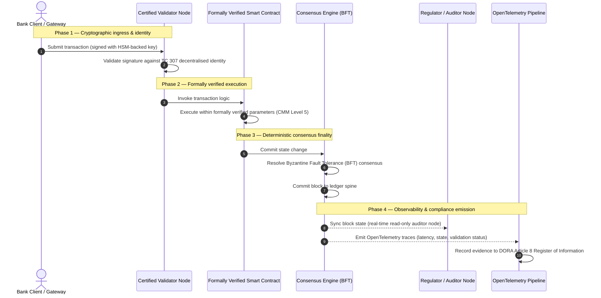

# จากหลักฐานสู่ความจริง: เหตุใดบล็อกเชนที่ได้รับการรับรองจะนิยามยุคใหม่ของความไว้วางใจทางการธนาคาร

## บทสรุปเชิงกลยุทธ์ (สาระสำคัญ)

ธนาคารขายส่งและธุรกรรมทั่วโลกในปี 2026 อยู่ ณ จุดเปลี่ยนทางประวัติศาสตร์ เมื่อบริการทางการเงินเปลี่ยนไปสู่เครือข่ายการหักบัญชีดิจิทัลโดยกำเนิดแบบเรียลไทม์ และเมื่อปัญญาประดิษฐ์นำความไม่แน่นอนเชิงความน่าจะเป็นเข้ามา แบบจำลองการประกันแบบดั้งเดิมที่เป็นอนาล็อกและย้อนหลัง (เช่น การตรวจสอบแบบคงที่ที่อิงกับนิติบุคคล) ไม่สามารถตอบสนองความต้องการสมัยใหม่ด้านการบริหารความเสี่ยงและหน้าที่ในฐานะผู้ดูแลผลประโยชน์ได้อีกต่อไป

คณะกรรมการวิชาการ ISO/IEC TC 307 ได้กำหนดรากฐานมาตรฐานสำหรับเทคโนโลยีบัญชีแยกประเภทแบบกระจาย อย่างไรก็ตาม การนำไปใช้ในระดับสถาบันอย่างแท้จริงต้องอาศัยการเปลี่ยนจากแนวทางเชิงพรรณนาไปสู่การประกันบล็อกเชนเชิงกำหนดที่รับรองได้อย่างอิสระ ด้วยการให้คะแนนธรรมาภิบาลของบัญชีแยกประเภท ความสมบูรณ์ของฉันทามติ ความปลอดภัยของสัญญาอัจฉริยะ และความคล่องตัวเชิงวิทยาการเข้ารหัส เทียบกับแบบจำลองวุฒิภาวะความสามารถ (CMM) ที่เข้มงวดห้าระดับ ธนาคารสามารถเปลี่ยนจากสมมติฐานที่กระจัดกระจายและเฉพาะผู้ขายไปสู่ความจริงทางการเงินที่รับรองได้และคณะกรรมการตรวจสอบได้

## ประเด็นสำคัญ

* **ช่องว่างแรงเสียดทานเชิงผู้ดูแลผลประโยชน์**: ปัจจุบันเรารับรองธนาคาร (Basel III) คลาวด์ (ISO 27001) และระบบธรรมาภิบาล AI (ISO 42001) ได้ แต่ยังไม่สามารถรับรองบัญชีแยกประเภทแบบกระจายที่กำหนดความจริงมากขึ้นเรื่อย ๆ ได้ ความไม่สมมาตรนี้เป็นช่องโหว่เชิงปฏิบัติการที่สำคัญ  
* **DORA บังคับใช้ความรับผิดชอบเชิงผู้ดูแลผลประโยชน์โดยตรง**: ภายใต้มาตรา 5 ของ DORA คณะกรรมการของธนาคารต้องรับผิดชอบส่วนบุคคลโดยตรงที่ไม่สามารถมอบหมายได้ต่อความยืดหยุ่นเชิงปฏิบัติการของการปรับใช้บุคคลที่สามและบัญชีแยกประเภททั้งหมด พร้อมบทลงโทษส่วนบุคคลที่รุนแรงภายใต้ระบอบ SM&CR เมื่อเกิดความล้มเหลว  
* **กระดูกสันหลังการตรวจสอบของ AI**: ในจุดที่การเรียนรู้ของเครื่องให้ผลลัพธ์เชิงความน่าจะเป็นที่ทำซ้ำไม่ได้ บล็อกเชนที่ได้รับการรับรองให้การจับสถานะแบบกำหนดได้ การบันทึกเวอร์ชันของแบบจำลอง อินพุต และการตัดสินใจตรวจสอบความถูกต้องบนเชนเป็นไปตาม ISO 42001 และมาตรฐานการบริหารความเสี่ยงของแบบจำลอง  
* **ดัชนีบล็อกเชนที่ได้รับการรับรอง**: ดัชนีนี้ทำให้ธรรมาภิบาล ฉันทามติ สัญญาอัจฉริยะ และความสามารถในการสังเกตเป็นทางการในรูปแบบสกอร์การ์ดที่ตรวจสอบได้และพร้อมตรวจสอบบนมาตราส่วน CMM ตั้งแต่ 0 ถึง 5 แปลงเมตริกทางวิศวกรรมเป็นคำแถลงความเสี่ยงที่ยอมรับได้ซึ่งคณะกรรมการอนุมัติ

## 01. ช่องว่างแรงเสียดทานเชิงผู้ดูแลผลประโยชน์ในธนาคารดิจิทัล

ในธนาคารแบบดั้งเดิม ความไว้วางใจเป็นเชิงความสัมพันธ์ เชิงสถาบัน และย้อนหลัง มันอาศัยผู้ตรวจสอบบัญชีบุคคลที่สามอิสระที่ทบทวนสถานะทางการเงิน ณ จุดเวลาที่กำหนด กระทบยอดความคลาดเคลื่อนระหว่างไซโลบัญชีแยกประเภททวิภาคี ในตลาดที่ขับเคลื่อนด้วย API แบบเรียลไทม์ของปี 2026 แบบจำลองนี้นำมาซึ่งความหน่วงที่กีดขวางและความเสี่ยงเชิงโครงสร้าง

เมื่อธุรกรรมชำระบัญชีทันที กองสภาพคล่องระหว่างวันได้รับการจัดการแบบพลวัตโดยเกตเวย์ API และกรรมสิทธิ์ในสินทรัพย์ถูกแปลงเป็นโทเคนบนบัญชีแยกประเภทที่ใช้ร่วมกัน การตรวจสอบย้อนหลังกลายเป็นการฝึกซ้อมทางนิติวิทยาศาสตร์แทนที่จะเป็นการควบคุมเชิงป้องกัน ผู้ดูแลผลประโยชน์ไม่สามารถพึ่งพาเพียงการรับรองนิติบุคคลได้อีกต่อไป พวกเขาต้องรับรองพื้นฐานดิจิทัลเอง

ปัจจุบัน ธนาคารดำเนินงานภายใต้ความไม่สมมาตรเชิงสถาปัตยกรรมที่เห็นได้ชัด:

1. **โครงสร้างพื้นฐานคลาวด์ที่ได้รับการรับรอง**: โหนดฮาร์ดแวร์ คอนเทนเนอร์เสมือน และศูนย์ข้อมูลกายภาพได้รับการตรวจสอบเทียบกับการควบคุม ISO/IEC 27001 และ SOC 2 Type II  
2. **กระบวนการจัดการที่ได้รับการรับรอง**: นโยบายความเสี่ยงเชิงปฏิบัติการ แผนความต่อเนื่องทางธุรกิจ และการปรับใช้อัลกอริทึมได้รับการกำกับโดยกรอบความเสี่ยงที่เข้มงวด  
3. **เครื่องยนต์บัญชีแยกประเภทที่ไม่ได้รับการรับรอง**: กลไกฉันทามติแบบกระจาย ห่วงโซ่อุปทานของโหนดตรวจสอบ ขอบเขตของสัญญาอัจฉริยะ และแบบจำลองธรรมาภิบาลเครือข่ายถูกปล่อยให้เป็นสมมติฐานที่ไม่ได้รับการรับรอง กำหนดเอง หรือเฉพาะกลุ่มพันธมิตร

ความไม่สมมาตรนี้เป็นจุดล้มเหลวที่สำคัญ ธนาคารสามารถเรียกใช้แอปพลิเคชันที่ตรวจสอบแล้วภายในคอนเทนเนอร์คลาวด์ที่ปลอดภัยและได้รับการรับรอง ISO 27001 แต่หากคอนเทนเนอร์นั้นเขียนไปยังบัญชีแยกประเภทแบบกระจายที่มีการควบคุมตัวตรวจสอบแบบรวมศูนย์ พารามิเตอร์ฉันทามติที่มีช่องโหว่ หรือสัญญาอัจฉริยะที่ไม่ได้รับการตรวจสอบ ความสมบูรณ์ของธุรกรรมก็ถูกบั่นทอน เพื่อเชื่อมช่องว่างนี้ ตัวเครื่องยนต์บัญชีแยกประเภทเองต้องกลายเป็นวัตถุแห่งการประกันที่รับรองได้

## 02. รากฐานการกำหนดมาตรฐาน ISO/IEC TC 307

งานพื้นฐานที่จำเป็นในการกำหนดมาตรฐานบัญชีแยกประเภทแบบกระจายกำลังถูกจัดตั้งโดยคณะกรรมการวิชาการ ISO/IEC TC 307 (เทคโนโลยีบล็อกเชนและบัญชีแยกประเภทแบบกระจาย) แทนที่จะปฏิบัติต่อบล็อกเชนเป็นโปรโตคอลทางเทคนิคที่แยกเดี่ยว TC 307 เข้าหามันในฐานะโครงสร้างพื้นฐานความไว้วางใจเชิงสถาบัน โดยจัดระเบียบงานรอบเสาหลักห้าประการ:

1. **อนุกรมวิธานและคำศัพท์ (ISO 22739)**: กำหนดระบบการตั้งชื่อร่วม รับประกันคำนิยามทางกฎหมายและเชิงปฏิบัติการที่สอดคล้องกันระหว่างเขตอำนาจศาล โครงการทางการเงิน และสถาบัน  
2. **สถาปัตยกรรมอ้างอิง (ISO/TR 23245)**: กำหนดขอบเขต ชั้น การไหลของข้อมูล และองค์ประกอบเชิงหน้าที่ของระบบบัญชีแยกประเภทแบบกระจายที่สอดคล้อง  
3. **ความปลอดภัย ความเป็นส่วนตัว และสัญญาอัจฉริยะ (ISO/TR 23244 / ISO 23613)**: กำหนดแนวทางความปลอดภัยพื้นฐานสำหรับระบบสินทรัพย์ดิจิทัลและให้รายละเอียดแนวปฏิบัติที่ดีที่สุดในการบรรเทาช่องโหว่ของสัญญาอัจฉริยะและธรรมาภิบาลวงจรชีวิต  
4. **กรอบการทำงานร่วมกันได้**: จัดการกลไกการแลกเปลี่ยนข้อมูลและสินทรัพย์ระหว่างเครือข่ายบัญชีแยกประเภทที่หลากหลาย ป้องกันการก่อตัวของไซโลโทเคนที่แยกเดี่ยว  
5. **อัตลักษณ์แบบกระจายและจุดยึดความไว้วางใจ**: บูรณาการตัวระบุเชิงวิทยาการเข้ารหัสที่อิงบัญชีแยกประเภทกับโครงสร้างพื้นฐานกุญแจสาธารณะ (PKI) ที่เป็นทางการและทะเบียนที่รัฐอนุญาต

โดยรวม TC 307 ส่งสัญญาณการเปลี่ยนผ่านของ DLT จากทางเลือกทางวิศวกรรมที่กำหนดเองไปสู่วินัยเชิงสถาปัตยกรรมที่เป็นมาตรฐาน อย่างไรก็ตาม TC 307 ยังคงเป็นเชิงพรรณนาเป็นหลัก มันกำหนดว่าความเป็นเลิศมีลักษณะอย่างไร (แนวทาง) แต่ไม่ได้ให้โปรโตคอลการยืนยันเชิงกำหนด (การประกัน) ที่เจ้าหน้าที่ความเสี่ยงและผู้กำกับดูแลต้องการเพื่ออนุญาตการปรับใช้ในการผลิตของฟังก์ชันที่สำคัญหรือจำเป็น (CIF)

## 03. แนวทางเทียบกับการประกัน: ความแตกต่างเชิงผู้ดูแลผลประโยชน์

ผู้เข้าร่วมตลาดการเงินไม่ได้ปรับใช้เทคโนโลยีเพราะมันสร้างสรรค์หรือหรูหรา พวกเขาปรับใช้เมื่อสามารถกำกับ ตรวจสอบ ปกป้อง และกระทบยอดกับข้อกำหนดเงินสำรองได้ นั่นคือเหตุผลที่การกำหนดมาตรฐานในธนาคารแยกออกเป็นสองชั้นโดยธรรมชาติ:

* **แนวทาง (กรอบ)**: ร่างแนวปฏิบัติที่ดีที่สุด เป้าหมายอ้างอิง และแนวทางเชิงสถาปัตยกรรม (เช่น ISO/IEC TC 307 กรอบ NIST)  
* **การประกัน (หลักฐาน)**: ให้หลักฐานที่เป็นอิสระ ต่อเนื่อง และตรวจสอบได้โดยบุคคลที่สามว่ากรอบได้รับการนำไปปฏิบัติและทำงานตามที่ออกแบบไว้ (เช่น การรับรอง ISO 27001 การตรวจสอบ SOC 2 การตรวจสอบเชิงกำกับ)

การพึ่งพาฉันทามติของบัญชีแยกประเภทที่ไม่ได้รับการรับรองในขณะที่รับรองโครงสร้างพื้นฐานคลาวด์เป็นช่องว่างเชิงกำกับที่สำคัญ บล็อกเชนที่ "เปลี่ยนแปลงไม่ได้" ไม่จำเป็นต้อง "ได้รับความไว้วางใจเชิงสถาบัน" ความเปลี่ยนแปลงไม่ได้รับประกันเพียงว่าข้อมูลที่ป้อนยังคงไม่เปลี่ยนแปลง มันไม่ได้ยืนยันว่าโหนดตรวจสอบปลอดภัยหรือไม่ โปรโตคอลฉันทามติทนต่อการสมรู้ร่วมคิดหรือไม่ ตรรกะสัญญาอัจฉริยะถูกต้องทางคณิตศาสตร์หรือไม่ หรือการจัดการกุญแจเชิงวิทยาการเข้ารหัสสอดคล้องกับข้อบังคับหลังควอนตัมหรือไม่

เพื่อปิดช่องว่างนี้ ดัชนีบล็อกเชนที่ได้รับการรับรอง 2026 ทำให้ข้อกำหนดเหล่านี้เป็นทางการในรูปแบบวุฒิภาวะความสามารถ (CMM) ที่วัดได้ ซึ่งเชื่อมโยงกับกฎระเบียบการธนาคารทั่วโลก

## 04. ดัชนีบล็อกเชนที่ได้รับการรับรอง 2026

เพื่อให้ผู้บริหารระดับสูงสามารถประเมินและรับรองแพลตฟอร์มบัญชีแยกประเภทของตน ดัชนีนี้จัดโครงสร้างโครงสร้างพื้นฐานบัญชีแยกประเภทแบบกระจายเป็นห้าชั้นเชิงปฏิบัติการที่ตรวจสอบได้ ให้คะแนนบนมาตราส่วน CMM ตั้งแต่ 0 ถึง 5

## ตารางที่ 1: สถาปัตยกรรมของดัชนีบล็อกเชนที่ได้รับการรับรอง

| ชั้นดัชนี | ระดับวุฒิภาวะ (CMM) | เมตริกทางเทคนิคและเชิงปฏิบัติการ | การอ้างอิงการควบคุมเชิงกำกับ / ผู้ดูแลผลประโยชน์ |
| ---- | ---- | ---- | ---- |
| **ธรรมาภิบาลบัญชีแยกประเภท** | **ระดับ 0**: กลุ่มพันธมิตรเฉพาะกิจ**ระดับ 3**: การคัดกรองและหมุนเวียนตัวตรวจสอบอัตโนมัติ**ระดับ 5**: การยึดอัตลักษณ์เชิงวิทยาการเข้ารหัสแบบกระจาย หลายฝ่าย | % ของโหนดตรวจสอบที่ดำเนินการโดยนิติบุคคลทางการเงินที่ผ่านการคัดกรอง; เวลาเฉลี่ยในการแก้ไขข้อพิพาทของตัวตรวจสอบ; การกระจายทางภูมิศาสตร์ของโหนด | **DORA มาตรา 5** (ธรรมาภิบาลและองค์กร); **CPMI-IOSCO PFMI หลักการ 2** (ธรรมาภิบาล) และ **หลักการ 3** (กรอบการบริหารความเสี่ยงอย่างครอบคลุม) |
| **ความสมบูรณ์ของฉันทามติ** | **ระดับ 0**: โหนดเดียวหรือ PoW ที่ทึบแสง**ระดับ 3**: BFT ที่ตรวจสอบแล้วพร้อมความเป็นที่สุดแบบกำหนดได้**ระดับ 5**: ฉันทามติหลายเขตอำนาจศาลที่ยืนยันอย่างเป็นทางการพร้อมการเฝ้าติดตามความหน่วงอย่างต่อเนื่อง | ความหน่วงฉันทามติสูงสุดที่ยอมรับได้; เกณฑ์การต้านทานการสมรู้ร่วมคิด; SLA ความพร้อมใช้งานภายใต้การแบ่งพาร์ติชันโหนดจำลอง | **DORA มาตรา 6** (กรอบการบริหารความเสี่ยง ICT); **CPMI-IOSCO PFMI หลักการ 8** (ความเป็นที่สุดของการชำระบัญชี) |
| **อัตลักษณ์และวิทยาการเข้ารหัส** | **ระดับ 0**: กุญแจ RSA / ECDSA ที่อ่อนแอ**ระดับ 3**: หลายลายเซ็นพร้อมการจัดการกุญแจที่หนุนด้วย HSM**ระดับ 5**: กุญแจไฮบริดที่ปลอดภัยเชิงควอนตัม (FIPS 203 ML-KEM) และประตูความเป็นส่วนตัวแบบไร้ความรู้ | % ของธุรกรรมบัญชีแยกประเภทที่ลงนามด้วยกุญแจที่หนุนด้วย HSM; คะแนนความพร้อมในการย้าย PQC; ความหน่วงของการพิสูจน์ ZK | **NIST FIPS 203 / 204**; **ISO/IEC 27001** (การจัดการความปลอดภัยของข้อมูล) |
| **การประกันสัญญาอัจฉริยะ** | **ระดับ 0**: สคริปต์ Solidity ที่ไม่ได้ตรวจสอบ**ระดับ 3**: การยืนยันคอมไพเลอร์อัตโนมัติและการตรวจสอบภายนอก**ระดับ 5**: สัญญาอัจฉริยะที่เปลี่ยนแปลงไม่ได้และยืนยันอย่างเป็นทางการพร้อมการอัปเกรดแบบเบรกเกอร์ | % ของสัญญาอัจฉริยะที่มีการยืนยันอย่างเป็นทางการทางคณิตศาสตร์; จำนวนคำเตือนของคอมไพเลอร์; ความครอบคลุมของการสแกนช่องโหว่ | **แนวทาง EBA เกี่ยวกับการจ้างภายนอก** (ย่อหน้า 81, 113-117); **DORA มาตรา 30** (ข้อสัญญาขั้นต่ำ) |
| **การตรวจสอบและความสามารถในการสังเกต** | **ระดับ 0**: การขูดบันทึกด้วยมือ**ระดับ 3**: ร่องรอย OTel ที่มีโครงสร้างและโหนดผู้ตรวจสอบแบบอ่านอย่างเดียว**ระดับ 5**: การกระทบยอดอัตโนมัติและต่อเนื่องกับทะเบียนมาตรา 8 | % ของธุรกรรมที่ครอบคลุมโดยร่องรอย OpenTelemetry; ความหน่วงจากการยืนยันบล็อกถึงการซิงค์โหนดผู้ตรวจสอบ | **BCBS 239** (การรวมข้อมูลความเสี่ยง); **DORA มาตรา 8** (ทะเบียนข้อมูล / สคีมา ITS) |

## ตารางที่ 2: สัญญาณความไว้วางใจสำคัญที่เชื่อมโยงกับมาตรฐานการธนาคารทั่วโลก

| สัญญาณ / เกณฑ์เปรียบเทียบ | เมตริก | ผลกระทบต่อแพลตฟอร์มธนาคาร | แหล่งกำกับ |
| ---- | ---- | ---- | ---- |
| **ความคืบหน้า ISO/IEC TC 307** | การเปลี่ยนจากรายงานทางเทคนิค ISO/TR ไปสู่โครงการรับรองที่เป็นทางการ | สร้างกรอบมาตรฐานแรกในการรับรองเครื่องยนต์บัญชีแยกประเภทแบบกระจาย | **ISO/IEC JTC 1 / SC 44** (เทคโนโลยีบัญชีแยกประเภทแบบกระจาย) |
| **ระยะต้นแบบของโครงการ Agorá** | ธนาคารพาณิชย์เข้าร่วมกว่า 40 แห่ง; การทดสอบบัญชีแยกประเภทรวมสำหรับเงินฝากที่แปลงเป็นโทเคน | ย้ายการหักบัญชีข้ามพรมแดนจากการส่งข้อความ (SWIFT) ไปสู่การชำระบัญชีแบบอะตอมที่แปลงเป็นโทเคน | **ศูนย์นวัตกรรมของธนาคารเพื่อการชำระหนี้ระหว่างประเทศ (BIS)** |
| **การตรวจสอบบุคคลที่สาม DORA มาตรา 30** | 100% ของผู้ให้บริการโหนดและโฮสต์โครงสร้างพื้นฐานได้รับการตรวจสอบเทียบกับเกณฑ์ความปลอดภัย | กำจัด "โหนดตรวจสอบเงา"; บังคับความโปร่งใสของห่วงโซ่อุปทานอย่างเต็มที่ | **หน่วยงานกำกับดูแลยุโรป (ESA)** |
| **ISO/IEC 42001 (ธรรมาภิบาล AI)** | บันทึกแบบจำลองและการฝึกอบรม AI ถูกทำให้เปลี่ยนแปลงไม่ได้เชิงวิทยาการเข้ารหัสบนเชน | ใช้บล็อกเชนเป็นทะเบียนหลักฐานที่เปลี่ยนแปลงไม่ได้ ("กระดูกสันหลังการตรวจสอบ") สำหรับการเรียนรู้ของเครื่อง | **ISO/IEC 42001:2023** (เทคโนโลยีสารสนเทศ — ปัญญาประดิษฐ์) |
| **ความเพียงพอของเงินกองทุน Basel III** | การลดบัฟเฟอร์เงินกองทุนความเสี่ยงเชิงปฏิบัติการตามการลดความซับซ้อนที่มีเอกสาร | กรอบความเสี่ยงเชิงปฏิบัติการที่เป็นมาตรฐานให้เครดิตโดยตรงต่อความยืดหยุ่นของบัญชีแยกประเภทที่ยืนยันแล้ว | **คณะกรรมการบาเซิลว่าด้วยการกำกับดูแลธนาคาร (BCBS)** |

## 05. "กระดูกสันหลังการตรวจสอบ" ของ AI: ปัญญาเชิงความน่าจะเป็นบนโครงสร้างพื้นฐานแบบกำหนดได้

หนึ่งในบทบาทเชิงกลยุทธ์ที่ทรงพลังที่สุดของบล็อกเชนที่ได้รับการรับรองในปี 2026 คือการทำหน้าที่เป็น **"กระดูกสันหลังการตรวจสอบ"** สำหรับการปรับใช้ปัญญาประดิษฐ์ ระบบการเงินสมัยใหม่มีความเป็นความน่าจะเป็นมากขึ้นเรื่อย ๆ การให้คะแนนเครดิต การตรวจจับการฉ้อโกงแบบเรียลไทม์ การซื้อขายด้วยอัลกอริทึม และปฏิสัมพันธ์กับลูกค้าแบบอัตโนมัติล้วนขับเคลื่อนด้วยแบบจำลองการเรียนรู้ของเครื่องที่วิวัฒนาการ เลื่อน และปรับตัวไปตามเวลา แบบจำลองเหล่านี้ไม่เป็นแบบกำหนดได้: ด้วยอินพุตเดียวกัน ณ สองเวลาต่างกัน อาจให้เอาต์พุตต่างกันเนื่องจากน้ำหนักแบบพลวัตและการฝึกอบรมอย่างต่อเนื่อง

ความไม่เป็นแบบกำหนดได้นี้ก่อให้เกิดความท้าทายเชิงธรรมาภิบาลอันลึกซึ้งภายใต้ **ISO/IEC 42001 (ธรรมาภิบาล AI)** และมาตรฐานการบริหารความเสี่ยงของแบบจำลอง (MRM) (เช่น **SR 11-7 ของธนาคารกลางสหรัฐ** และ **SS1/23 ของ PRA อังกฤษ**): *คุณจะตรวจสอบ อธิบาย และปกป้องการตัดสินใจที่ไม่สามารถทำซ้ำได้อย่างเคร่งครัดได้อย่างไร?*

บัญชีแยกประเภทแบบกระจายที่ได้รับการรับรองให้ตัวถ่วงดุลแบบกำหนดได้ ในจุดที่แบบจำลอง AI ทำงานเชิงความน่าจะเป็น บล็อกเชนที่ได้รับการรับรองบันทึกพารามิเตอร์ของมันแบบกำหนดได้ สร้างกระดูกสันหลังหลักฐานที่เปลี่ยนแปลงไม่ได้:

* **การกำหนดเวอร์ชันแบบจำลองและการยึดน้ำหนัก**: ทุกเวอร์ชันของแบบจำลองที่ปรับใช้ น้ำหนักที่เกี่ยวข้อง และเช็คซัมของข้อมูลฝึกอบรมถูกแฮชและเขียนไปยังบัญชีแยกประเภท ณ เวลาบิลด์ ตอบสนองข้อกำหนดห่วงโซ่อุปทาน **SLSA Level 3**  
* **การบันทึกอินพุตเชิงบริบท**: เมื่อแบบจำลอง AI ดำเนินการตัดสินใจสำคัญ (เช่น อนุมัติสินเชื่อหรือตั้งค่าสถานะธุรกรรม) อินพุตเชิงบริบทที่แน่นอนและแฮชแบบจำลองถูกเขียนไปยังบัญชีแยกประเภท สร้างประวัติที่ทนต่อการปลอมแปลง  
* **ความสามารถในการตรวจสอบโดยไม่ต้องเข้าถึงโค้ด**: หากผู้กำกับดูแลถามว่า "ทำไมแบบจำลองของคุณจึงปฏิเสธคำขอสินเชื่อนี้เมื่อวันที่ 3 มิถุนายน?" ธนาคารไม่จำเป็นต้องเปิดเผยโค้ดกรรมสิทธิ์หรือพยายามสร้างสถานะแบบจำลองที่แน่นอนขึ้นใหม่ มันแสดงบันทึกบนเชนที่ลงนามเชิงวิทยาการเข้ารหัสของอินพุต น้ำหนัก และสถานะการตรวจสอบ

ด้วยการยึดการตัดสินใจเชิงความน่าจะเป็นของแบบจำลองการเรียนรู้ของเครื่องกับฉันทามติแบบกำหนดได้ของบล็อกเชนที่ได้รับการรับรอง สถาบันสร้างไทม์ไลน์ของการกระทำอัตโนมัติที่ปกป้องได้ สร้างขึ้นใหม่ได้ และตรวจสอบได้อย่างอิสระ

## 06. การแสดงภาพไปป์ไลน์จากฉันทามติสู่การตรวจสอบที่ได้รับการรับรอง

ไดอะแกรมลำดับต่อไปนี้แสดงวงจรชีวิตของธุรกรรมที่ผ่านแพลตฟอร์มบล็อกเชนที่ได้รับการรับรอง แสดงให้เห็นว่าประตูการตรวจสอบ ความสมบูรณ์ของฉันทามติ การดำเนินการสัญญาอัจฉริยะ และการปล่อยเทเลเมทรีเชื่อมประสานกันอย่างไรเพื่อผลิตหลักฐานเชิงกำกับที่พร้อมสำหรับคณะกรรมการ:

เส้นทางวิกฤตของลำดับธุรกรรมนี้ต้องการให้ทุกขั้นตอนการตรวจสอบ การดำเนินการ และฉันทามติลงนามเชิงวิทยาการเข้ารหัส รับประกันที่มาแบบต้นทางถึงปลายทาง โหนดผู้ตรวจสอบของผู้กำกับดูแลซิงค์สถานะบล็อกแบบเรียลไทม์ กำจัดความจำเป็นในการกระทบยอดทางการเงินด้วยมือแบบย้อนหลัง

## 07. คู่มือคณะกรรมการสำหรับผู้จัดการอาวุโส

เพื่อนำทางการเปลี่ยนผ่านจากความไว้วางใจเชิงองค์กรสู่ความไว้วางใจเชิงโครงสร้างพื้นฐานอย่างประสบความสำเร็จ ผู้บริหารธนาคารและผู้จัดการอาวุโสควรดำเนินคำสั่งสำคัญสี่ประการทันที:

1. **บังคับการตรวจสอบบัญชีแยกประเภทในการบริหารความเสี่ยงองค์กร (ERM)**: บังคับใช้นโยบายที่ว่าไม่มีแพลตฟอร์มบัญชีแยกประเภทแบบกระจายใด — ส่วนตัว สาธารณะ หรือกลุ่มพันธมิตร — จะถูกปรับใช้สำหรับฟังก์ชันที่สำคัญหรือจำเป็น (CIF) โดยไม่ได้รับการตรวจสอบเทียบกับ **สถาปัตยกรรมดัชนีบล็อกเชนที่ได้รับการรับรอง** ห้าชั้น (ขั้นต่ำ CMM ระดับ 3)  
2. **บูรณาการบล็อกเชนเป็นกระดูกสันหลังหลักฐาน AI ตาม ISO 42001**: สั่งการ Chief Risk Officer และสถาปนิก AI หลักให้บูรณาการแบบจำลองการเรียนรู้ของเครื่องที่มีผลกระทบสูงทั้งหมดกับบล็อกเชนที่ได้รับการรับรอง สร้างทะเบียนการตรวจสอบที่ทนต่อการปลอมแปลงของเวอร์ชันแบบจำลอง น้ำหนัก อินพุต และการตัดสินใจ  
3. **ตรวจสอบห่วงโซ่อุปทานของโหนดตรวจสอบ (DORA มาตรา 30)**: กำหนดให้ฝ่ายจัดซื้อตรวจสอบนิติบุคคลบุคคลที่สามทั้งหมดที่โฮสต์โหนดตรวจสอบหรือจัดการโฮสติ้งคลาวด์สำหรับเครือข่าย DLT บังคับมาตรฐานความปลอดภัยไซเบอร์และความยืดหยุ่นเชิงปฏิบัติการเดียวกันกับที่ใช้กับโหนดคลาวด์ภายในของธนาคาร  
4. **จัดแนวสถาปัตยกรรมบัญชีแยกประเภทกับ CPMI-IOSCO และ BCBS 239**: สั่งการทีมวิศวกรรมแพลตฟอร์มให้จัดแนวเทเลเมทรีเอาต์พุตของบัญชีแยกประเภทโดยตรงกับข้อกำหนดการรายงานข้อมูล **BCBS 239** และรับประกันว่าพารามิเตอร์ฉันทามติและความเป็นที่สุดของการชำระบัญชีสอดคล้องอย่างเคร่งครัดกับ **หลักการ 8 และ 9 ของ CPMI-IOSCO**

## 08. คำถามที่พบบ่อย

**ISO/IEC TC 307 เป็นมาตรฐานการรับรองหรือไม่?**  
ไม่ ISO/IEC TC 307 เป็นคณะกรรมการวิชาการที่กำหนดคำศัพท์ สถาปัตยกรรมอ้างอิง และแนวทางความปลอดภัย แม้ว่ามันจะกำหนดว่า "ความเป็นเลิศมีลักษณะอย่างไร" (แนวทาง) อุตสาหกรรมต้องทำให้เอกสารเหล่านี้ใช้งานได้ในรูปแบบโครงการรับรองที่เป็นทางการและตรวจสอบได้ (การประกัน) เพื่อทำให้ผู้กำกับดูแลธนาคารพอใจ

**บล็อกเชนที่ได้รับการรับรองสนับสนุนการปฏิบัติตาม DORA อย่างไร?**  
ภายใต้มาตรา 5 ของ DORA คณะกรรมการธนาคารต้องรับผิดชอบส่วนบุคคลโดยตรงต่อความยืดหยุ่นทางเทคโนโลยี บล็อกเชนที่ได้รับการรับรองให้หลักฐานเชิงวิทยาการเข้ารหัสที่ตรวจสอบได้ของความสมบูรณ์ของฉันทามติ การควบคุมห่วงโซ่อุปทานของตัวตรวจสอบ และความปลอดภัยของสัญญาอัจฉริยะ มอบ "ขั้นตอนที่สมเหตุสมผล" ที่มีเอกสารซึ่งจำเป็นแก่สมาชิกคณะกรรมการในการปกป้องต่อการเรียกร้องความรับผิดชอบส่วนบุคคลภายใต้ SM&CR

ความแตกต่างระหว่างการตรวจสอบบัญชีแยกประเภทแบบดั้งเดิมกับการตรวจสอบบล็อกเชนที่ได้รับการรับรองคืออะไร?  
การตรวจสอบแบบดั้งเดิมเป็นแบบย้อนหลัง: มันยืนยันรายการด้วยมือและไฟล์คงที่หลังจากธุรกรรมชำระบัญชีแล้ว การตรวจสอบบล็อกเชนที่ได้รับการรับรองเป็นแบบต่อเนื่องและเรียลไทม์ โหนดตรวจสอบ เครื่องยนต์ฉันทามติ BFT และสัญญาอัจฉริยะที่ยืนยันอย่างเป็นทางการได้รับการรับรองให้ดำเนินการธุรกรรมแบบกำหนดได้ ปล่อยเทเลเมทรีที่มีโครงสร้าง (OpenTelemetry) ที่ยืนยันสุขภาพของระบบอย่างต่อเนื่อง

บล็อกเชนสาธารณะสามารถรับรองสำหรับการใช้งานธนาคารได้หรือไม่?  
ในเขตอำนาจศาลส่วนใหญ่ บล็อกเชนสาธารณะแบบไม่มีการอนุญาตล้วนล้มเหลวในการตอบสนองกฎระเบียบการธนาคารเนื่องจากขาดการยืนยันอัตลักษณ์ของตัวตรวจสอบ ต้นทุนธุรกรรมที่คาดเดาไม่ได้ และความเป็นที่สุดที่ไม่เป็นแบบกำหนดได้ (เช่น การแยกสาขาเชิงความน่าจะเป็นของ proof-of-work/stake) บล็อกเชนที่ได้รับการรับรองในการธนาคารมักใช้สถาปัตยกรรมองค์กรแบบมีการอนุญาตหรือสถาปัตยกรรมสาธารณะ-ไฮบริดที่ถูกกำกับอย่างเข้มงวด ซึ่งผู้ดำเนินการโหนดตรวจสอบเป็นนิติบุคคลทางการเงินที่ระบุตัวตนและตรวจสอบแล้ว

## 09. เอกสารอ้างอิง

* คณะกรรมการบาเซิลว่าด้วยการกำกับดูแลธนาคาร (BCBS), 2013. *Principles for effective risk data aggregation and reporting (BCBS 239)*. บาเซิล: ธนาคารเพื่อการชำระหนี้ระหว่างประเทศ. มีที่: [https://www.bis.org/publ/bcbs239.pdf](https://www.bis.org/publ/bcbs239.pdf).  
* Committee on Payments and Market Infrastructures และ Technical Committee of the International Organization of Securities Commissions (CPMI-IOSCO), 2012. *Principles for financial market infrastructures*. บาเซิล: ธนาคารเพื่อการชำระหนี้ระหว่างประเทศ. มีที่: [https://www.bis.org/cpmi/publ/d101.htm](https://www.bis.org/cpmi/publ/d101.htm).  
* หน่วยงานธนาคารยุโรป (EBA), 2019. *EBA/GL/2019/02 — Guidelines on outsourcing arrangements*. ปารีส: EBA. มีที่: [https://www.eba.europa.eu/regulation-and-policy/internal-governance/guidelines-on-outsourcing-arrangements](https://www.eba.europa.eu/regulation-and-policy/internal-governance/guidelines-on-outsourcing-arrangements).  
* รัฐสภายุโรปและคณะมนตรีแห่งสหภาพยุโรป, 2022. *ระเบียบ (EU) 2022/2554 ว่าด้วยความยืดหยุ่นเชิงปฏิบัติการดิจิทัลสำหรับภาคการเงิน (DORA)*. บรัสเซลส์: ราชกิจจานุเบกษาของสหภาพยุโรป. มีที่: [https://eur-lex.europa.eu/legal-content/EN/TXT/?uri=CELEX%3A32022R2554](https://eur-lex.europa.eu/legal-content/EN/TXT/?uri=CELEX%3A32022R2554).  
* ISO/IEC JTC 1/SC 42, 2023. *ISO/IEC 42001:2023 — Information technology — Artificial intelligence — Management system*. เจนีวา: องค์การระหว่างประเทศว่าด้วยการมาตรฐาน. มีที่: [https://www.iso.org/standard/81230.html](https://www.iso.org/standard/81230.html).  
* คณะกรรมการวิชาการ ISO/IEC 307, 2020. *ISO/IEC 22739:2020 — Blockchain and distributed ledger technologies — Vocabulary*. เจนีวา: องค์การระหว่างประเทศว่าด้วยการมาตรฐาน. มีที่: [https://www.iso.org/standard/73771.html](https://www.iso.org/standard/73771.html).  
* National Institute of Standards and Technology (NIST), 2026. *First Three Finalized Post-Quantum Encryption Standards (FIPS 203, 204, and 205)*. เกเธอส์เบิร์ก: U.S. Department of Commerce. มีที่: [https://www.nist.gov/news-events/news/2024/08/nist-releases-first-3-finalized-post-quantum-encryption-standards](https://www.nist.gov/news-events/news/2024/08/nist-releases-first-3-finalized-post-quantum-encryption-standards).
