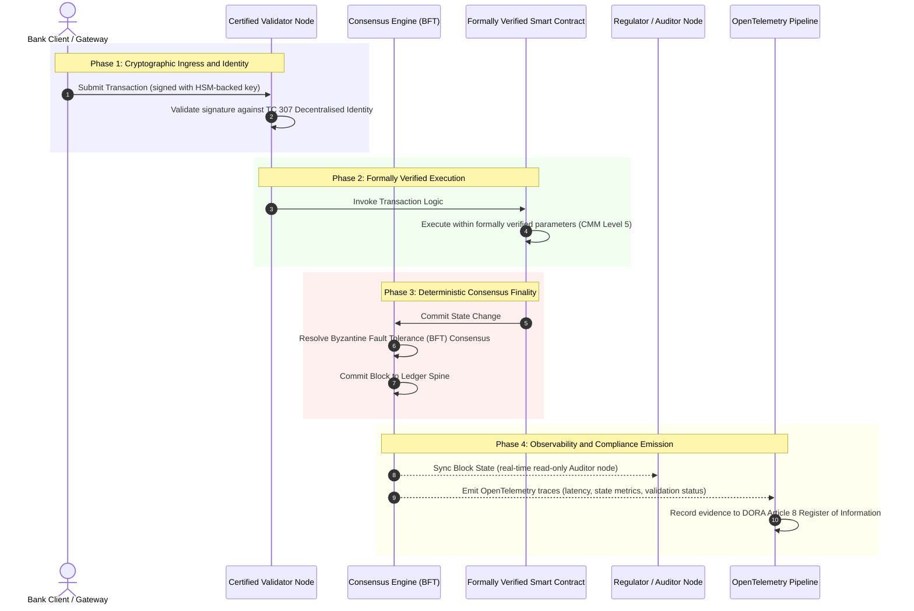

# จากหลักฐานสู่ความจริง: เหตุใดบล็อกเชนที่ผ่านการรับรองจะนิยามยุคใหม่ของความเชื่อมั่นทางธนาคาร

**การไม่เปลี่ยนแปลงไม่ใช่สิ่งเดียวกับการได้รับความเชื่อมั่น** เมื่อธนาคารขายส่งเคลื่อนเข้าสู่การชำระบัญชีแบบเรียลไทม์และ AI เชิงความน่าจะเป็น บัญชีแยกประเภทที่ตัดสินว่าอะไรคือความจริงได้กลายเป็นชั้นเดียวที่ธนาคารยังคงไม่สามารถรับรองได้ ธนาคารรับรองตัวนิติบุคคลภายใต้ Basel III รับรองคลาวด์ภายใต้ ISO 27001 และรับรอง AI ของตนภายใต้ ISO 42001 แต่บัญชีแยกประเภทแบบกระจาย ทั้งการกำกับดูแล ฉันทามติ การเข้ารหัส และสัญญาอัจฉริยะ กลับถูกปล่อยไว้ตามสมมติฐานเฉพาะของผู้จำหน่าย รายงานฉบับนี้เสนอว่าการปิดช่องว่างเชิงภาระหน้าที่นั้นจำเป็นต้องเคลื่อนจากแนวทาง ISO/IEC TC 307 ไปสู่การประกันเชิงกำหนด: การให้คะแนนบัญชีแยกประเภทเทียบกับดัชนีบล็อกเชนที่ผ่านการรับรอง 5 ระดับ ซึ่งเปลี่ยนตัวชี้วัดทางวิศวกรรมให้เป็นความจริงที่ตรวจสอบได้ในระดับคณะกรรมการและป้องกันได้ตาม DORA

<!-- lead-start -->
<aside class="post-lead" aria-label="สรุปบทความ">

<strong>สรุปสั้น</strong> ธนาคารรับรองตัวนิติบุคคล คลาวด์ และ AI ของตน แต่ไม่รับรองบัญชีแยกประเภทที่กำหนดว่าอะไรคือความจริงมากขึ้นเรื่อย ๆ ISO/IEC TC 307 ให้แนวทาง ไม่ใช่การประกัน ดัชนีบล็อกเชนที่ผ่านการรับรอง 5 ระดับให้คะแนนการกำกับดูแลบัญชีแยกประเภท ความสมบูรณ์ของฉันทามติ อัตลักษณ์และการเข้ารหัส การประกันสัญญาอัจฉริยะ และความสามารถในการสังเกต เทียบกับแบบจำลองวุฒิภาวะความสามารถ ปิดช่องว่างเชิงภาระหน้าที่และมอบกระดูกสันหลังการตรวจสอบที่กำหนดได้แน่นอนให้แก่ AI เชิงความน่าจะเป็น

<strong>ประเด็นสำคัญ</strong>

<ul class="post-lead-takeaways">
  <li><strong>ช่องว่างเชิงภาระหน้าที่ที่เกิดจากแรงเสียดทาน</strong> ธนาคาร (Basel III) คลาวด์ (ISO 27001) และระบบการกำกับดูแล AI (ISO 42001) สามารถรับรองได้ แต่บัญชีแยกประเภทแบบกระจายที่ตัดสินว่าอะไรคือความจริงยังไม่สามารถรับรองได้ ความไม่สมมาตรนั้นคือช่องโหว่ในการดำเนินงานที่มีอยู่จริง</li>
  <li><strong>DORA ทำให้เรื่องนี้เป็นความรับผิดชอบส่วนบุคคล</strong> ภายใต้ DORA Article 5 คณะกรรมการธนาคารแบกรับความรับผิดโดยตรงและมอบหมายต่อไม่ได้ต่อความยืดหยุ่นของการนำระบบบุคคลที่สามและบัญชีแยกประเภทมาใช้ พร้อมบทลงโทษส่วนบุคคลตาม SM&amp;CR หากล้มเหลว</li>
  <li><strong>กระดูกสันหลังการตรวจสอบ AI</strong> การเรียนรู้ของเครื่องไม่สามารถทำซ้ำได้ บล็อกเชนที่ผ่านการรับรองบันทึกเวอร์ชันของโมเดล อินพุต และการตัดสินใจในการตรวจสอบไว้บนเชนอย่างกำหนดได้แน่นอน ตอบสนอง ISO 42001 และมาตรฐานการบริหารความเสี่ยงของโมเดล</li>
  <li><strong>ดัชนีบล็อกเชนที่ผ่านการรับรอง</strong> การกำกับดูแล ฉันทามติ การเข้ารหัส สัญญาอัจฉริยะ และความสามารถในการสังเกต กลายเป็นบัตรคะแนน CMM ระดับ 0 ถึง 5 ที่แปลตัวชี้วัดทางวิศวกรรมให้เป็นแถลงการณ์ความเสี่ยงที่ยอมรับได้ซึ่งได้รับอนุมัติจากคณะกรรมการ</li>
</ul>

<strong>อ่านที่เกี่ยวข้อง:</strong> <a href="https://sebastienrousseau.com/2026-07-02-certified-blockchains-banking-trust-tc307-assurance-2026">บล็อกเชนที่ผ่านการรับรองและความเชื่อมั่นทางธนาคาร: การประกันตาม TC 307</a>, <a href="https://sebastienrousseau.com/2026-07-24-global-payments-outlook-operating-model-risk-revenue">แนวโน้มการชำระเงินทั่วโลกปี 2026</a>.

</aside>
<!-- lead-end -->

> **บทสรุปสำหรับผู้บริหาร**
>
> - **ธนาคารขายส่งอยู่ ณ จุดเปลี่ยน** การหักบัญชีแบบเรียลไทม์และ AI เชิงความน่าจะเป็นทำลายแบบจำลองการประกันเชิงแอนะล็อกที่มองย้อนหลัง การตรวจสอบแบบคงที่ที่อิงตัวนิติบุคคลไม่ตอบสนองความต้องการด้านการบริหารความเสี่ยงหรือภาระหน้าที่สมัยใหม่อีกต่อไป
> - **TC 307 คือฐานตั้งต้น ไม่ใช่ใบรับรอง** ISO/IEC TC 307 ได้กำหนดมาตรฐานคำศัพท์ สถาปัตยกรรมอ้างอิง และแนวทางด้านความปลอดภัยสำหรับบัญชีแยกประเภทแบบกระจาย แต่มันเป็นเชิงพรรณนา มันนิยามว่าอะไรคือสิ่งที่ดี แต่ไม่ได้ให้การตรวจสอบเชิงกำหนดที่เจ้าหน้าที่ความเสี่ยงและผู้กำกับดูแลต้องการเพื่ออนุญาตให้นำไปใช้งานจริง
> - **การประกันหมายถึงการให้คะแนนบัญชีแยกประเภท** การกำกับดูแล ความสมบูรณ์ของฉันทามติ ความปลอดภัยของสัญญาอัจฉริยะ และความคล่องตัวเชิงการเข้ารหัส ที่ให้คะแนนเทียบกับแบบจำลองวุฒิภาวะความสามารถ 5 ระดับที่เข้มงวด เคลื่อนธนาคารจากสมมติฐานเฉพาะของผู้จำหน่ายที่กระจัดกระจายไปสู่ความจริงทางการเงินที่รับรองได้และตรวจสอบได้ในระดับคณะกรรมการ
> - **บัญชีแยกประเภทคือกระดูกสันหลังการตรวจสอบสำหรับ AI** การยึดเวอร์ชันของโมเดล อินพุต และการตัดสินใจในการตรวจสอบเข้ากับฉันทามติที่กำหนดได้แน่นอน มอบบันทึกหลักฐานที่ป้องกันได้และสร้างขึ้นใหม่ได้ให้แก่การเรียนรู้ของเครื่องที่ทำซ้ำไม่ได้ ภายใต้ ISO 42001, SR 11-7 และ PRA SS1/23

## ช่องว่างเชิงภาระหน้าที่ที่เกิดจากแรงเสียดทานในการธนาคารดิจิทัล

ในการธนาคารแบบดั้งเดิม ความเชื่อมั่นเป็นเรื่องเชิงความสัมพันธ์ เชิงสถาบัน และมองย้อนหลัง มันขึ้นอยู่กับผู้ตรวจสอบบัญชีอิสระซึ่งเป็นบุคคลที่สามที่ทบทวนสถานะทางการเงิน ณ จุดเวลาคงที่ กระทบยอดความคลาดเคลื่อนข้ามคลังบัญชีแยกประเภททวิภาคี ในตลาดที่ขับเคลื่อนด้วย API แบบเรียลไทม์ของปี 2026 แบบจำลองนี้ก่อให้เกิดความหน่วงที่สูงเกินยอมรับและความเสี่ยงเชิงโครงสร้าง

เมื่อธุรกรรมชำระบัญชีทันที กลุ่มสภาพคล่องระหว่างวันถูกบริหารแบบพลวัตโดยเกตเวย์ API และกรรมสิทธิ์ในสินทรัพย์ถูกแปลงเป็นโทเคนข้ามบัญชีแยกประเภทที่ใช้ร่วมกัน การตรวจสอบย้อนหลังกลายเป็นการสืบสวนเชิงนิติวิทยาศาสตร์แทนที่จะเป็นการควบคุมเชิงป้องกัน ผู้มีภาระหน้าที่ไม่สามารถพึ่งพาการรับรองเพียงตัวนิติบุคคลได้อีกต่อไป พวกเขาต้องรับรองรากฐานดิจิทัลนั้นเอง

ในปัจจุบัน ธนาคารดำเนินงานภายใต้ความไม่สมมาตรเชิงสถาปัตยกรรมที่เห็นได้ชัด:

1. **โครงสร้างพื้นฐานคลาวด์ที่ผ่านการรับรอง**: โหนดฮาร์ดแวร์ คอนเทนเนอร์เสมือน และศูนย์ข้อมูลกายภาพ ได้รับการตรวจสอบเทียบกับการควบคุม ISO/IEC 27001 และ SOC 2 Type II  
2. **กระบวนการบริหารจัดการที่ผ่านการรับรอง**: นโยบายความเสี่ยงในการดำเนินงาน แผนความต่อเนื่องทางธุรกิจ และการนำอัลกอริทึมไปใช้ ถูกกำกับภายใต้กรอบความเสี่ยงที่เข้มงวด  
3. **เครื่องยนต์บัญชีแยกประเภทที่ไม่ได้รับการรับรอง**: กลไกฉันทามติแบบกระจายหลัก ห่วงโซ่อุปทานของโหนดตรวจสอบ ขอบเขตของสัญญาอัจฉริยะ และแบบจำลองการกำกับดูแลเครือข่าย ถูกปล่อยไว้ตามสมมติฐานที่ไม่ได้รับการรับรอง สร้างเอง หรือเฉพาะกลุ่มพันธมิตร

ความไม่สมมาตรนี้คือจุดล้มเหลวสำคัญ ธนาคารสามารถรันแอปพลิเคชันที่ผ่านการตรวจสอบภายในคอนเทนเนอร์คลาวด์ที่ปลอดภัยและได้รับการรับรอง ISO 27001 แต่หากคอนเทนเนอร์นั้นเขียนไปยังบัญชีแยกประเภทแบบกระจายที่มีการควบคุมโหนดตรวจสอบแบบรวมศูนย์ พารามิเตอร์ฉันทามติที่มีช่องโหว่ หรือสัญญาอัจฉริยะที่ไม่ได้รับการตรวจสอบ ความสมบูรณ์ของธุรกรรมก็ถูกลดทอน เพื่อเชื่อมช่องว่างนี้ เครื่องยนต์บัญชีแยกประเภทเองต้องกลายเป็นวัตถุแห่งการประกันที่รับรองได้

## ฐานตั้งต้นการกำหนดมาตรฐาน ISO/IEC TC 307

งานพื้นฐานที่จำเป็นในการกำหนดมาตรฐานบัญชีแยกประเภทแบบกระจายกำลังถูกสร้างขึ้นโดย ISO/IEC Technical Committee 307 (TC 307\) (เทคโนโลยีบล็อกเชนและบัญชีแยกประเภทแบบกระจาย) แทนที่จะมองบล็อกเชนเป็นโปรโตคอลทางเทคนิคที่แยกส่วน TC 307 กล่าวถึงมันในฐานะโครงสร้างพื้นฐานแห่งความเชื่อมั่นเชิงสถาบัน จัดระเบียบงานของตนตามห้าเสาหลัก:

1. **อนุกรมวิธานและคำศัพท์ (ISO 22739\)**: สร้างศัพทานุกรมร่วม รับประกันคำนิยามทางกฎหมายและการดำเนินงานที่สอดคล้องกันข้ามเขตอำนาจศาล โครงการทางการเงิน และสถาบันต่าง ๆ  
2. **สถาปัตยกรรมอ้างอิง (ISO/TR 23245\)**: นิยามขอบเขต ชั้น การไหลของข้อมูล และองค์ประกอบเชิงหน้าที่ของระบบบัญชีแยกประเภทแบบกระจายที่เป็นไปตามข้อกำหนด  
3. **ความปลอดภัย ความเป็นส่วนตัว และสัญญาอัจฉริยะ (ISO/TR 23244 / ISO 23613\)**: สร้างแนวทางความปลอดภัยพื้นฐานสำหรับระบบสินทรัพย์ดิจิทัล และให้รายละเอียดแนวปฏิบัติที่ดีที่สุดสำหรับการบรรเทาช่องโหว่ของสัญญาอัจฉริยะและการกำกับดูแลตลอดวงจรชีวิต  
4. **กรอบการทำงานร่วมกันได้**: กล่าวถึงกลไกการแลกเปลี่ยนข้อมูลและสินทรัพย์ระหว่างเครือข่ายบัญชีแยกประเภทที่แตกต่างกัน ป้องกันการก่อตัวของคลังโทเคนที่แยกโดดเดี่ยว  
5. **อัตลักษณ์แบบกระจายและจุดยึดความเชื่อมั่น**: ผสานตัวระบุเชิงการเข้ารหัสที่อิงบัญชีแยกประเภทเข้ากับโครงสร้างพื้นฐานกุญแจสาธารณะ (PKI) ที่เป็นทางการและทะเบียนที่ได้รับอนุญาตจากรัฐ

โดยรวม TC 307 ส่งสัญญาณถึงการเปลี่ยนผ่านของ DLT จากทางเลือกทางวิศวกรรมที่สร้างเองไปสู่วินัยเชิงสถาปัตยกรรมที่เป็นมาตรฐาน อย่างไรก็ตาม TC 307 ยังคงเป็นเชิงพรรณนาเป็นหลัก มันนิยามว่าอะไรคือสิ่งที่ดี (แนวทาง) แต่ไม่ได้ให้โปรโตคอลการตรวจสอบเชิงกำหนด (การประกัน) ที่เจ้าหน้าที่ความเสี่ยงและผู้กำกับดูแลต้องการเพื่ออนุญาตให้นำหน้าที่ที่วิกฤตหรือสำคัญ (CIFs) ไปใช้งานจริง

## แนวทางกับการประกัน: ความแตกต่างเชิงภาระหน้าที่

ผู้เข้าร่วมตลาดการเงินไม่ได้นำเทคโนโลยีมาใช้เพราะมันเป็นนวัตกรรมหรือสวยงาม พวกเขานำมาใช้เมื่อมันสามารถกำกับดูแล ตรวจสอบ ป้องกัน และกระทบยอดกับข้อกำหนดเงินสำรองได้ นี่คือเหตุผลที่การกำหนดมาตรฐานในการธนาคารคลี่คลายออกเป็นสองชั้นโดยธรรมชาติ:

* **แนวทาง (กรอบการทำงาน)**: ระบุแนวปฏิบัติที่ดีที่สุด เป้าหมายอ้างอิง และแนวทางเชิงสถาปัตยกรรม (เช่น ISO/IEC TC 307, กรอบการทำงานของ NIST)  
* **การประกัน (หลักฐาน)**: ให้หลักฐานที่เป็นอิสระ ต่อเนื่อง และตรวจสอบได้โดยบุคคลที่สามว่ากรอบการทำงานถูกนำไปปฏิบัติและดำเนินการตามที่ออกแบบไว้ (เช่น การรับรอง ISO 27001, การตรวจสอบ SOC 2, การตรวจสอบเชิงกำกับดูแล)

การพึ่งพาฉันทามติของบัญชีแยกประเภทที่ไม่ได้รับการรับรองในขณะที่รับรองโครงสร้างพื้นฐานคลาวด์คือช่องว่างเชิงกำกับดูแลที่วิกฤต บล็อกเชนที่ "ไม่เปลี่ยนแปลง" ไม่จำเป็นต้องได้รับ "ความเชื่อมั่นเชิงสถาบัน" การไม่เปลี่ยนแปลงเพียงรับประกันว่าข้อมูลที่ป้อนเข้าไม่ถูกเปลี่ยนแปลง มันไม่ได้ตรวจสอบว่าโหนดตรวจสอบปลอดภัย โปรโตคอลฉันทามติมีความยืดหยุ่นต่อการสมรู้ร่วมคิด ตรรกะของสัญญาอัจฉริยะถูกต้องเชิงคณิตศาสตร์ หรือการบริหารกุญแจเข้ารหัสเป็นไปตามข้อบังคับหลังควอนตัม

เพื่อปิดช่องว่างนี้ ดัชนีบล็อกเชนที่ผ่านการรับรองปี 2026 ทำให้ข้อกำหนดเหล่านี้เป็นรูปธรรมในแบบจำลองวุฒิภาวะความสามารถ (CMM) ที่วัดปริมาณได้และเชื่อมโยงกับกฎระเบียบการธนาคารทั่วโลก

## ดัชนีบล็อกเชนที่ผ่านการรับรองปี 2026

เพื่อให้ผู้บริหารระดับสูงสามารถประเมินและรับรองแพลตฟอร์มบัญชีแยกประเภทของตน ดัชนีนี้จัดโครงสร้างโครงสร้างพื้นฐานบัญชีแยกประเภทแบบกระจายออกเป็นห้าชั้นการดำเนินงานที่ตรวจสอบได้ ให้คะแนนตามมาตรวัด CMM ระดับ 0 ถึง 5

### ตารางที่ 1: สถาปัตยกรรมดัชนีบล็อกเชนที่ผ่านการรับรอง

| ชั้นดัชนี | ระดับวุฒิภาวะความสามารถ (CMM) | ตัวชี้วัดเชิงเทคนิคและการดำเนินงาน | การอ้างอิงการควบคุมเชิงกำกับดูแล / ภาระหน้าที่ |
| ---- | ---- | ---- | ---- |
| **การกำกับดูแลบัญชีแยกประเภท** | **Level 0**: กลุ่มพันธมิตรเฉพาะกิจ**Level 3**: การคัดกรองและหมุนเวียนผู้ตรวจสอบอัตโนมัติ**Level 5**: การยึดอัตลักษณ์เชิงการเข้ารหัสแบบหลายฝ่ายและกระจาย | % ของโหนดตรวจสอบที่ดำเนินการโดยนิติบุคคลทางการเงินที่ผ่านการคัดกรอง; เวลาเฉลี่ยในการแก้ไขข้อพิพาทของผู้ตรวจสอบ; การกระจายทางภูมิศาสตร์ของโหนด | **DORA Article 5** (การกำกับดูแลและการจัดองค์กร); **CPMI-IOSCO PFMI Principle 2** (การกำกับดูแล) และ **Principle 3** (กรอบการบริหารความเสี่ยงอย่างครอบคลุม) |
| **ความสมบูรณ์ของฉันทามติ** | **Level 0**: โหนดเดี่ยวหรือ POW ที่ไม่โปร่งใส**Level 3**: BFT ที่ผ่านการตรวจสอบพร้อมความสิ้นสุดที่กำหนดได้แน่นอน**Level 5**: ฉันทามติที่ผ่านการพิสูจน์เชิงรูปนัยแบบหลายเขตอำนาจศาลพร้อมการเฝ้าติดตามความหน่วงอย่างต่อเนื่อง | ความหน่วงฉันทามติสูงสุดที่ยอมรับได้; เกณฑ์ความต้านทานการสมรู้ร่วมคิด; SLA ความพร้อมใช้งานภายใต้การจำลองการแบ่งพาร์ทิชันโหนด | **DORA Article 6** (กรอบการบริหารความเสี่ยง ICT); **CPMI-IOSCO PFMI Principle 8** (ความสิ้นสุดของการชำระบัญชี) |
| **อัตลักษณ์และการเข้ารหัส** | **Level 0**: กุญแจ RSA / ECDSA ที่อ่อนแอ**Level 3**: มัลติซิกพร้อมการบริหารกุญแจที่รองรับด้วย HSM**Level 5**: กุญแจไฮบริดที่ปลอดภัยเชิงควอนตัม (FIPS 203 ML-KEM) และประตูความเป็นส่วนตัวแบบความรู้เป็นศูนย์ | % ของธุรกรรมบัญชีแยกประเภทที่ลงนามด้วยกุญแจที่รองรับด้วย HSM; คะแนนความพร้อมในการย้ายไปสู่ PQC; ความหน่วงของการพิสูจน์ ZK | **NIST FIPS 203 / 204**; **ISO/IEC 27001** (การบริหารความมั่นคงปลอดภัยสารสนเทศ) |
| **การประกันสัญญาอัจฉริยะ** | **Level 0**: สคริปต์ solidity ที่ไม่ได้รับการตรวจสอบ**Level 3**: การตรวจสอบคอมไพเลอร์อัตโนมัติและการตรวจสอบจากภายนอก**Level 5**: สัญญาอัจฉริยะที่ผ่านการพิสูจน์เชิงรูปนัยและไม่เปลี่ยนแปลงพร้อมการอัปเกรดแบบเซอร์กิตเบรกเกอร์ | % ของสัญญาอัจฉริยะที่ผ่านการพิสูจน์เชิงรูปนัยทางคณิตศาสตร์; จำนวนคำเตือนของคอมไพเลอร์; ความครอบคลุมของการสแกนช่องโหว่ | **EBA Guidelines on Outsourcing Arrangements** (ย่อหน้า 81, 113-117); **DORA Article 30** (ข้อสัญญาขั้นต่ำ) |
| **การตรวจสอบและความสามารถในการสังเกต** | **Level 0**: การคัดลอกบันทึกด้วยมือ**Level 3**: ร่องรอย OTel เชิงโครงสร้างและโหนดผู้ตรวจสอบแบบอ่านอย่างเดียว**Level 5**: การกระทบยอดต่อเนื่องอัตโนมัติสู่ทะเบียน Article 8 | % ของธุรกรรมที่ครอบคลุมด้วยร่องรอย OpenTelemetry; ความหน่วงจากการยืนยันบล็อกของบัญชีแยกประเภทถึงการซิงค์โหนดผู้ตรวจสอบ | **BCBS 239** (การรวมข้อมูลความเสี่ยง); **DORA Article 8** (ทะเบียนข้อมูล / ITS Schemas) |

### ตารางที่ 2: สัญญาณความเชื่อมั่นสำคัญที่เชื่อมโยงกับมาตรฐานการธนาคารทั่วโลก

| สัญญาณ / เกณฑ์มาตรฐาน | ตัวชี้วัด | ผลกระทบต่อแพลตฟอร์มการธนาคาร | แหล่งกำกับดูแล |
| ---- | ---- | ---- | ---- |
| **ความคืบหน้าของ ISO/IEC TC 307** | การเปลี่ยนผ่านจากรายงานทางเทคนิค ISO/TR สู่โครงการรับรองที่เป็นทางการ | สร้างกรอบการทำงานมาตรฐานแรกสำหรับการรับรองเครื่องยนต์บัญชีแยกประเภทแบบกระจาย | **ISO/IEC JTC 1 / SC 44** (เทคโนโลยีบัญชีแยกประเภทแบบกระจาย) |
| **ระยะต้นแบบของ Project Agorá** | ธนาคารพาณิชย์ที่เข้าร่วม 40+ แห่ง; การทดสอบบัญชีแยกประเภทรวมของเงินฝากแบบโทเคน | ย้ายการหักบัญชีข้ามพรมแดนจากการส่งข้อความ (SWIFT) สู่การชำระบัญชีแบบโทเคนที่เป็นอะตอม | **Bank for International Settlements (BIS) Innovation Hub** |
| **การตรวจสอบบุคคลที่สามตาม DORA Article 30** | 100% ของผู้ให้บริการโหนดและผู้โฮสต์โครงสร้างพื้นฐานได้รับการตรวจสอบเทียบกับเกณฑ์ความปลอดภัย | กำจัด "โหนดตรวจสอบเงา"; บังคับความโปร่งใสของห่วงโซ่อุปทานทั้งหมด | **European Supervisory Authorities (ESA)** |
| **ISO/IEC 42001 (การกำกับดูแล AI)** | บันทึกโมเดลและการฝึก AI ที่ถูกทำให้ไม่เปลี่ยนแปลงเชิงการเข้ารหัสบนเชน | ใช้บล็อกเชนเป็นบัญชีแยกประเภทหลักฐานที่ไม่เปลี่ยนแปลง ("กระดูกสันหลังการตรวจสอบ") สำหรับการเรียนรู้ของเครื่อง | **ISO/IEC 42001:2023** (เทคโนโลยีสารสนเทศ ปัญญาประดิษฐ์) |
| **ความเพียงพอของเงินกองทุนตาม Basel III** | การลดกันชนเงินกองทุนความเสี่ยงในการดำเนินงานตามการลดความซับซ้อนที่มีเอกสารรองรับ | กรอบความเสี่ยงในการดำเนินงานที่เป็นมาตรฐานให้เครดิตโดยตรงต่อความยืดหยุ่นของบัญชีแยกประเภทที่ผ่านการตรวจสอบ | **Basel Committee on Banking Supervision (BCBS)** |

## "กระดูกสันหลังการตรวจสอบ" ของ AI: ปัญญาเชิงความน่าจะเป็นบนโครงสร้างพื้นฐานที่กำหนดได้แน่นอน

หนึ่งในบทบาทเชิงกลยุทธ์ที่ทรงพลังที่สุดของบล็อกเชนที่ผ่านการรับรองในปี 2026 คือการทำหน้าที่เป็น **"กระดูกสันหลังการตรวจสอบ"** สำหรับการนำปัญญาประดิษฐ์ไปใช้ ระบบการเงินสมัยใหม่เป็นเชิงความน่าจะเป็นมากขึ้นเรื่อย ๆ การให้คะแนนเครดิต การตรวจจับการฉ้อโกงแบบเรียลไทม์ การซื้อขายเชิงอัลกอริทึม และการปฏิสัมพันธ์กับลูกค้าแบบอัตโนมัติ ถูกขับเคลื่อนด้วยโมเดลการเรียนรู้ของเครื่องที่วิวัฒนาการ เคลื่อนออก และปรับตัวไปตามกาลเวลา โมเดลเหล่านี้ไม่ได้กำหนดแน่นอน: เมื่อได้รับอินพุตเดียวกันในสองเวลาต่างกัน อาจให้ผลลัพธ์ต่างกันเนื่องจากน้ำหนักเชิงพลวัตและการฝึกอย่างต่อเนื่อง

การไม่กำหนดแน่นอนนี้ก่อให้เกิดความท้าทายด้านการกำกับดูแลที่ลึกซึ้งภายใต้ **ISO/IEC 42001 (การกำกับดูแล AI)** และมาตรฐาน **การบริหารความเสี่ยงของโมเดล (MRM)** (เช่น **US Federal Reserve SR 11-7** และ **UK PRA SS1/23**): *คุณจะตรวจสอบ อธิบาย และป้องกันการตัดสินใจที่ทำซ้ำได้ไม่แน่นอนอย่างไร?*

บัญชีแยกประเภทแบบกระจายที่ผ่านการรับรองมอบตัวถ่วงดุลที่กำหนดได้แน่นอน ในขณะที่โมเดล AI ทำงานเชิงความน่าจะเป็น บล็อกเชนที่ผ่านการรับรองบันทึกพารามิเตอร์ของมันอย่างกำหนดได้แน่นอน สร้างกระดูกสันหลังหลักฐานที่แก้ไขไม่ได้:

* **การกำหนดเวอร์ชันโมเดลและการยึดน้ำหนัก**: ทุกเวอร์ชันของโมเดลที่นำไปใช้ น้ำหนักที่เกี่ยวข้อง และเช็คซัมของข้อมูลฝึก ถูกแฮชและเขียนไปยังบัญชีแยกประเภท ณ เวลาสร้าง ตอบสนองข้อกำหนดห่วงโซ่อุปทาน **SLSA Level 3**  
* **การบันทึกอินพุตเชิงบริบท**: เมื่อโมเดล AI ดำเนินการตัดสินใจที่วิกฤต (เช่น การอนุมัติสินเชื่อหรือการแจ้งเตือนธุรกรรม) อินพุตเชิงบริบทที่แน่นอนและแฮชของโมเดลถูกเขียนไปยังบัญชีแยกประเภท สร้างประวัติที่ตรวจจับการแก้ไขได้  
* **ความสามารถในการตรวจสอบโดยไม่ต้องเข้าถึงโค้ด**: หากผู้กำกับดูแลถามว่า "เหตุใดโมเดลของคุณจึงปฏิเสธใบสมัครสินเชื่อนี้ในวันที่ 3 มิถุนายน?" ธนาคารไม่จำเป็นต้องเปิดเผยโค้ดที่เป็นกรรมสิทธิ์หรือพยายามสร้างสถานะโมเดลที่แน่นอนขึ้นใหม่ ธนาคารนำเสนอบันทึกบัญชีแยกประเภทบนเชนที่ลงนามเชิงการเข้ารหัสของอินพุต น้ำหนัก และสถานะการตรวจสอบ

ด้วยการยึดการตัดสินใจเชิงความน่าจะเป็นของโมเดลการเรียนรู้ของเครื่องเข้ากับฉันทามติที่กำหนดได้แน่นอนของบล็อกเชนที่ผ่านการรับรอง สถาบันสร้างเส้นเวลาของการกระทำอัตโนมัติที่ป้องกันได้ สร้างขึ้นใหม่ได้ และตรวจสอบได้อย่างเป็นอิสระ

## การแสดงภาพไปป์ไลน์จากฉันทามติที่ผ่านการรับรองสู่การตรวจสอบ

แผนภาพลำดับต่อไปนี้แสดงวงจรชีวิตของธุรกรรมที่ผ่านแพลตฟอร์มบล็อกเชนที่ผ่านการรับรอง สาธิตว่าประตูการตรวจสอบ ความสมบูรณ์ของฉันทามติ การดำเนินการสัญญาอัจฉริยะ และการส่งข้อมูลเทเลเมทรี ประสานกันอย่างไรเพื่อสร้างหลักฐานเชิงกำกับดูแลที่พร้อมสำหรับคณะกรรมการ:

เส้นทางวิกฤตสำหรับลำดับธุรกรรมนี้กำหนดให้ทุกขั้นตอนของการตรวจสอบ การดำเนินการ และฉันทามติต้องลงนามเชิงการเข้ารหัส รับประกันการพิสูจน์แหล่งที่มาแบบต้นทางถึงปลายทาง โหนดผู้ตรวจสอบของผู้กำกับดูแลซิงค์สถานะบล็อกแบบเรียลไทม์ กำจัดความจำเป็นในการกระทบยอดทางการเงินด้วยมือแบบย้อนหลัง

## คู่มือปฏิบัติในห้องประชุมคณะกรรมการสำหรับผู้บริหารระดับสูง

เพื่อบริหารจัดการการเปลี่ยนจากความเชื่อมั่นเชิงองค์กรไปสู่ความเชื่อมั่นเชิงโครงสร้างพื้นฐานได้สำเร็จ ผู้บริหารและผู้จัดการอาวุโสของธนาคารควรดำเนินคำสั่งหลักสี่ประการทันที:

1. **บังคับการตรวจสอบบัญชีแยกประเภทในการบริหารความเสี่ยงองค์กร (ERM)**: บังคับใช้นโยบายที่ไม่มีแพลตฟอร์มบัญชีแยกประเภทแบบกระจายใด ไม่ว่าจะเป็นแบบส่วนตัว สาธารณะ หรืออิงกลุ่มพันธมิตร ที่จะนำไปใช้กับหน้าที่ที่วิกฤตหรือสำคัญ (CIFs) ได้ เว้นแต่จะผ่านการตรวจสอบเทียบกับ **สถาปัตยกรรมดัชนีบล็อกเชนที่ผ่านการรับรอง** 5 ชั้น (CMM Level 3 เป็นอย่างต่ำ)  
2. **ผสานบล็อกเชนเป็นกระดูกสันหลังหลักฐาน AI ตาม ISO 42001**: สั่งการให้ประธานเจ้าหน้าที่ความเสี่ยงและสถาปนิก AI หลักผสานโมเดลการเรียนรู้ของเครื่องที่มีผลกระทบสูงทั้งหมดเข้ากับบล็อกเชนที่ผ่านการรับรอง สร้างบัญชีแยกประเภทตรวจสอบที่ตรวจจับการแก้ไขได้ของเวอร์ชันโมเดล น้ำหนัก อินพุต และการตัดสินใจ  
3. **ตรวจสอบห่วงโซ่อุปทานของโหนดตรวจสอบ (DORA Article 30\)**: กำหนดให้ฝ่ายจัดซื้อตรวจสอบนิติบุคคลบุคคลที่สามทั้งหมดที่โฮสต์โหนดตรวจสอบหรือบริหารการโฮสต์คลาวด์สำหรับเครือข่าย DLT บังคับการปฏิบัติตามมาตรฐานความมั่นคงปลอดภัยไซเบอร์และความยืดหยุ่นในการดำเนินงานเดียวกับที่ใช้กับโหนดคลาวด์ภายในของธนาคาร  
4. **จัดแนวสถาปัตยกรรมบัญชีแยกประเภทให้สอดคล้องกับ CPMI-IOSCO และ BCBS 239**: สั่งการให้ทีมวิศวกรรมแพลตฟอร์มจัดแนวเทเลเมทรีผลลัพธ์ของบัญชีแยกประเภทให้ตรงกับข้อกำหนดการรายงานข้อมูล **BCBS 239** โดยตรง และรับประกันว่าพารามิเตอร์ฉันทามติและความสิ้นสุดของการชำระบัญชีเป็นไปตาม **CPMI-IOSCO Principles 8 และ 9** อย่างเคร่งครัด

## คำถามที่พบบ่อย

**ISO/IEC TC 307 เป็นมาตรฐานการรับรองหรือไม่?**  
ไม่ใช่ ISO/IEC TC 307 เป็นคณะกรรมการทางเทคนิคที่สร้างคำศัพท์ สถาปัตยกรรมอ้างอิง และแนวทางด้านความปลอดภัย ในขณะที่มันนิยาม "ว่าอะไรคือสิ่งที่ดี" (แนวทาง) อุตสาหกรรมต้องทำให้เอกสารเหล่านี้เป็นรูปธรรมในโครงการรับรองที่เป็นทางการและตรวจสอบได้ (การประกัน) เพื่อตอบสนองผู้กำกับดูแลการธนาคาร

**บล็อกเชนที่ผ่านการรับรองสนับสนุนการปฏิบัติตาม DORA อย่างไร?**  
ภายใต้ DORA Article 5 คณะกรรมการธนาคารแบกรับความรับผิดโดยตรงและส่วนบุคคลต่อความยืดหยุ่นทางเทคโนโลยี บล็อกเชนที่ผ่านการรับรองมอบหลักฐานเชิงการเข้ารหัสที่ตรวจสอบได้ของความสมบูรณ์ของฉันทามติ การควบคุมห่วงโซ่อุปทานของผู้ตรวจสอบ และความปลอดภัยของสัญญาอัจฉริยะ มอบ "ขั้นตอนที่สมเหตุสมผล" ที่มีเอกสารรองรับซึ่งกรรมการต้องการเพื่อป้องกันข้อเรียกร้องความรับผิดส่วนบุคคลตาม SM\&CR

**อะไรคือความแตกต่างระหว่างการตรวจสอบบัญชีแยกประเภทแบบดั้งเดิมกับการตรวจสอบบล็อกเชนที่ผ่านการรับรอง?**  
การตรวจสอบแบบดั้งเดิมมองย้อนหลัง ตรวจสอบรายการที่ป้อนด้วยมือและไฟล์คงที่หลังจากธุรกรรมหักบัญชีเสร็จสิ้น การตรวจสอบบล็อกเชนที่ผ่านการรับรองเป็นแบบต่อเนื่องและเรียลไทม์ โหนดตรวจสอบ เครื่องยนต์ฉันทามติ BFT และสัญญาอัจฉริยะที่ผ่านการพิสูจน์เชิงรูปนัยได้รับการรับรองให้ดำเนินการธุรกรรมอย่างกำหนดได้แน่นอน ส่งเทเลเมทรีเชิงโครงสร้าง (OpenTelemetry) ที่ตรวจสอบความสมบูรณ์ของระบบอย่างต่อเนื่อง

**บล็อกเชนสาธารณะสามารถรับรองสำหรับการใช้งานทางการธนาคารได้หรือไม่?**  
ในเขตอำนาจศาลส่วนใหญ่ บล็อกเชนสาธารณะแบบไร้การอนุญาตล้วนไม่สามารถตอบสนองกฎระเบียบการธนาคารได้เนื่องจากขาดการตรวจสอบอัตลักษณ์ของผู้ตรวจสอบ ต้นทุนแก๊ส/ธุรกรรมที่คาดเดาไม่ได้ และความสิ้นสุดที่ไม่กำหนดแน่นอน (เช่น การแยกสายเชิงความน่าจะเป็นของ proof-of-work/stake) บล็อกเชนที่ผ่านการรับรองในการธนาคารมักใช้สถาปัตยกรรมแบบมีการอนุญาตระดับองค์กรหรือแบบไฮบริดสาธารณะที่ได้รับการกำกับดูแลอย่างเข้มงวด ซึ่งผู้ดำเนินการโหนดตรวจสอบเป็นนิติบุคคลทางการเงินที่ระบุตัวตนและผ่านการตรวจสอบ

## อ้างอิง

* Basel Committee on Banking Supervision (BCBS), 2013\. *Principles for effective risk data aggregation and reporting (BCBS 239\)*. Basel: Bank for International Settlements. Available at: [Basel Committee on Banking Supervision (BCBS), 2013\.](https://www.bis.org/publ/bcbs239.pdf "Basel Committee on Banking Supervision (BCBS), 2013\.").  
* Committee on Payments and Market Infrastructures and Technical Committee of the International Organisation of Securities Commissions (CPMI-IOSCO), 2012\. *Principles for financial market infrastructures*. Basel: Bank for International Settlements. Available at: [Committee on Payments and Market Infrastructures and Technical Committee of the International Organisation of Securities Commissions (CPMI-IOSCO), 2012\.](https://www.bis.org/cpmi/publ/d101.htm "Committee on Payments and Market Infrastructures and Technical Committee of the International Organisation of Securities Commissions (CPMI-IOSCO), 2012\.").  
* European Banking Authority (EBA), 2019\. *EBA/GL/2019/02, Guidelines on outsourcing arrangements*. Paris: EBA. Available at: [European Banking Authority (EBA), 2019\.](https://www.eba.europa.eu/regulation-and-policy/internal-governance/guidelines-on-outsourcing-arrangements "European Banking Authority (EBA), 2019\.").  
* European Parliament and Council of the European Union, 2022\. *Regulation (EU) 2022/2554 on digital operational resilience for the financial sector (DORA)*. Brussels: Official Journal of the European Union. Available at: [European Parliament and Council of the European Union, 2022\.](https://eur-lex.europa.eu/legal-content/EN/TXT/?uri=CELEX%3A32022R2554 "European Parliament and Council of the European Union, 2022\.").  
* ISO/IEC JTC 1/SC 42, 2023\. *ISO/IEC 42001:2023, Information technology, Artificial intelligence, Management system*. Geneva: International Organisation for Standardisation. Available at: [ISO/IEC JTC 1/SC 42, 2023\.](https://www.iso.org/standard/81230.html "ISO/IEC JTC 1/SC 42, 2023\.").  
* ISO/IEC Technical Committee 307, 2020\. *ISO/IEC 22739:2020, Blockchain and distributed ledger technologies, Vocabulary*. Geneva: International Organisation for Standardisation. Available at: [ISO/IEC Technical Committee 307, 2020\.](https://www.iso.org/standard/73771.html "ISO/IEC Technical Committee 307, 2020\.").  
* National Institute of Standards and Technology (NIST), 2026\. *First Three Finalised Post-Quantum Encryption Standards (FIPS 203, 204, and 205\)*. Gaithersburg: U.S. Department of Commerce. Available at: [National Institute of Standards and Technology (NIST), 2026\.](https://www.nist.gov/news-events/news/2024/08/nist-releases-first-3-finalized-post-quantum-encryption-standards "National Institute of Standards and Technology (NIST), 2026\.").
