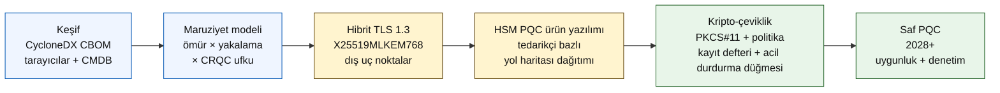

# 2026 Kuantum-Güvenli Bankacılık İndeksi: Kuantum-Sonrası Kriptografi, QKD, Kripto-Çeviklik ve Şimdi-Topla-Sonra-Çöz Riski

<!-- lead-start: manual -->
<aside class="post-lead" aria-label="Makale özeti">

<strong>Kısaca.</strong> 2026'da kuantum-güvenli bankacılık, iki eğrinin kesişimiyle belirlenen son teslim tarihi olan bir teslim programıdır — kurumun bugün elinde tuttuğu verinin gizlilik ömrü ve Kriptografik Olarak Anlamlı bir Kuantum Bilgisayarın (CRQC) varış ufku. NIST FIPS 203 / 204 / 205 Ağustos 2024'ten bu yana nihaileşmiş durumda; CNSA 2.0 ABD federal son durumunu 2033 olarak belirliyor; uzun ömürlü veride şimdi-topla-sonra-çöz çoktan yaşanıyor. Yönetim Kurulu Kuantum Karnesi dört kesin yüzdeyi takip eder: envanter tamlığı, HNDL maruziyeti, NIST göç ilerlemesi, kripto-çeviklik hazırlığı.

<strong>Kilit çıkarımlar</strong>

<ul class="post-lead-takeaways">
  <li><strong>Algoritma tartışması 13 Ağustos 2024'te kapandı.</strong> ML-KEM (FIPS 203), ML-DSA (FIPS 204), SLH-DSA (FIPS 205) cevaplardır. "Kazananı seçmek" için hâlâ iç değerlendirmeler yürüten bankalar 18 ay geride.</li>
  <li><strong>Şimdi-topla-sonra-çöz çoktan geçerlidir.</strong> Gizlilik ömrü inandırıcı CRQC varışını aşan her şey — 30 yıllık konut kredileri, hayat sigortası teminat süreçleri, MiFID II / GDPR işlem kayıtları, M&amp;A saklama arşivleri — bir CRQC duyurulduğunda değil, şimdi hibrit kuantum-güvenli anahtar kapsüllemeye geçmek zorundadır.</li>
  <li><strong>Envanter, geçişi belirleyen olgunluktur.</strong> Bir Kriptografik Malzeme Listesi (CBOM) — protokol, kütüphane, sertifika, HSM bölümü, tedarikçi bağımlılığı, uygulama sahibi, veri sınıflandırma ömrü — diğer her şeyin önkoşuludur. Kapsamı değil, tazeliği takip edin.</li>
  <li><strong>Hibrit TLS 1.3, 2026 dağıtımıdır.</strong> X25519MLKEM768 hibrit anahtar paylaşımı Chrome / Firefox / Cloudflare / Akamai'nin bugün fiilen müzakere ettiği şeydir. Saf ML-KEM TLS, HSM ürün yazılımı ve CA hazırlığını bekler.</li>
  <li><strong>Kripto-çeviklik kalıcı teslimattır.</strong> PKCS#11 soyutlaması, etiketli anahtarlar, iş hizmetini izinli algoritma kümesine eşleyen politika kayıt defteri. Olmadığında bir sonraki algoritma geçişi yine çok yıllı bir programdır.</li>
</ul>
</aside>
<!-- lead-end -->

2026'da kuantum-güvenli bankacılık spekülasyon değil, operasyonel göç meselesidir. NIST ilk üç kuantum-sonrası kriptografi standardını nihai hâle getirdi ve bankalar artık hangi sistemlerin RSA, ECC, TLS, imzalar, HSM'ler, sertifikalar, ödeme kanalları, arşivler ve uzun ömürlü gizli verilere bağımlı olduğunu anlamak zorundadır. İndeksin sorusu basittir: kurum, tehdit operasyonel hale gelmeden önce kriptografisini değiştirebilir mi?

---

> **Yönetici Özeti / Kilit Çıkarımlar**
>
> - **NIST standartları artık somut.** FIPS 203 anahtar kapsülleme için ML-KEM'i, FIPS 204 imzalar için ML-DSA'yı, FIPS 205 ise durumsuz bir hash tabanlı imza standardı olarak SLH-DSA'yı tanımlar.
> - **Envanter ilk olgunluk kapısıdır.** Bir banka bulamadığı şeyi taşıyamaz: sertifikalar, anahtarlar, protokoller, uygulamalar, tedarikçiler, HSM'ler, API'ler, arşivler ve gömülü sistemler haritalanmalıdır.
> - **Kripto-çeviklik kalıcı hedeftir.** Amaç tek seferlik bir algoritma değişimi değildir; bütün uygulamaları yeniden tasarlamadan kriptografik ilkelleri değiştirebilmektir.
> - **Uzun ömürlü veri aciliyeti değiştirir.** Şimdi-topla-sonra-çöz riski, bugün yakalanan verinin yeterince uzun süre değerli kalırsa ileride okunabilir hale gelebileceği anlamına gelir.
> - **QKD özelleşmiş bir tamamlayıcıdır.** Kuantum anahtar dağıtımı en yüksek değerli kanallar için anlamlı olabilir; kurum çapındaki PQC göçünün yerine geçmez.
>
---

## 2026 Neden Bu İndeksin Önemli Olduğu Yıldır

2024-2025'teki üç değişim, kuantum-güvenliği bir araştırma gözlem noktası olmaktan çıkarıp ölçülebilir bir banka programına dönüştürdü. İlki, NIST birincil kuantum-sonrası standartları 13 Ağustos 2024'te nihaileştirdi: [FIPS 203 (ML-KEM) ⧉](https://nvlpubs.nist.gov/nistpubs/FIPS/NIST.FIPS.203.pdf "FIPS 203 — Modül-Kafes Tabanlı Anahtar Kapsülleme Mekanizması"), [FIPS 204 (ML-DSA) ⧉](https://nvlpubs.nist.gov/nistpubs/FIPS/NIST.FIPS.204.pdf "FIPS 204 — Modül-Kafes Tabanlı Dijital İmza Standardı"), [FIPS 205 (SLH-DSA) ⧉](https://nvlpubs.nist.gov/nistpubs/FIPS/NIST.FIPS.205.pdf "FIPS 205 — Durumsuz Hash Tabanlı Dijital İmza Standardı"). Algoritma seçim tartışması o tarihte kapandı; 2026'da hâlâ "hangi şema kazanır" iç çalışmalarını yürüten bankalar 18 ay geride.

İkincisi, [NSA'in CNSA 2.0 ⧉](https://media.defense.gov/2022/Sep/07/2003071834/-1/-1/0/CSA_CNSA_2.0_ALGORITHMS_.PDF "Commercial National Security Algorithm Suite 2.0") düzenlemesi ABD federal son durumunu 2033 olarak belirledi; yazılım ve ürün yazılımı imzalama için 2027'de, tarayıcılar ve işletim sistemleri için 2030'da başlayan ara kesim tarihleriyle. ABD federal karşı taraf maruziyeti olan herhangi bir banka — FedNow, Hazine işlemleri, federal müşteri hesapları — federal veriye dokunan sistemler için bu çevrenin içindedir. Saat artık soyut değildir.

Üçüncüsü, [Şimdi-Topla-Sonra-Çöz (HNDL) ⧉](https://csrc.nist.gov/Projects/post-quantum-cryptography "NIST Kuantum-Sonrası Kriptografi programı") aciliyetin yük taşıyan risk argümanıdır. Gelişmiş düşmanlar büyük finans merkezlerinde TLS korumalı ödeme mesajlarını, SWIFT zarflarını, KYC belgelerini ve uzun ömürlü arşiv şifrelerini çoktan yakalıyor. 2026'da yakalanan verinin yalnızca çözüldüğü anda gizlilik açısından hassas kalması gerekir — 30 yıllık konut kredileri, hayat sigortası teminat süreçleri, MiFID II / GDPR işlem kayıtları ve M&A saklama arşivleri için bu pencere, Kriptografik Olarak Anlamlı bir Kuantum Bilgisayarın (CRQC) her inandırıcı tahminini fazlasıyla aşar. Düşmanın bugün bir kuantum bilgisayarına ihtiyacı yoktur. Verinin önemini kaybetmesinden önce bir tanesine ihtiyacı vardır.

Kuantum-Güvenli Bankacılık İndeksi, kurumunuzun o kesişim gelmeden göçü teslim edip edemeyeceğini ölçer. İş artık göç edip etmemekle değil, göçün savunulabilir bir takvimde tamamlanıp tamamlanmayacağıyla ilgilidir.

## 2026 İndeks Mimarisi

| İndeks Katmanı | 2026 Yönelimi | Hazırlık Metriği | Yanlış Yönetilirse Risk |
|---|---|---|---|
| **Envanter** | Kriptografik varlıkları, protokolleri, sertifikaları, tedarikçileri ve veri sınıflarını haritala | Envantere alınan estate yüzdesi | Bilinmeyen kuantuma açık bağımlılıklar |
| **Maruziyet** | Sistemleri gizlilik ömrü ve işlem kritikliğine göre sınıflandır | Değer ve ömre göre yüksek riskli varlıklar | Yanlış önceliklendirilmiş göç |
| **Göç** | NIST standartlarıyla hizalı hibrit ve PQC-hazır desenleri benimse | ML-KEM ve ML-DSA hazırlığı | Son teslim tarihi altında acil yeniden platformlama |
| **Kripto-çeviklik** | Uygulama mantığını kriptografik ilkellerden ayır | Politika kontrollü kripto kapsamı | Estate boyunca koda gömülmüş algoritmalar |
| **Güvence** | Birlikte çalışabilirliği, performansı, HSM desteğini, sertifikaları ve tedarikçi hazırlığını test et | Test geçme oranı ve istisna kuyruğu | Bozuk kanallar veya zayıf yedek kontroller |

### Yönetim Kurulu Kuantum Karnesi

İnandırıcı bir kuantum hazırlık karnesi yalnızca proje durumlarını değil, kesin yüzdeleri takip etmeyi gerektirir:

1. **Envanter Tamlığı:** Tamamen haritalanmış bir Kriptografik Malzeme Listesi (CBOM) bulunan tier-1 uygulamaların yüzdesi.
2. **HNDL Maruziyeti:** Hibrit kuantum-güvenli anahtar kapsülleme olmaksızın ağlar üzerinden iletilen uzun ömürlü gizli verilerin (örn. kişisel veri, ticari sırlar) hacmi.
3. **NIST Göç İlerlemesi:** FIPS 203 (ML-KEM) ve FIPS 204 (ML-DSA) standartlarına taşınmış asimetrik şifreleme anahtarlarının ve dijital imzaların yüzdesi.
4. **Kripto-Çeviklik Hazırlığı:** Kriptografik algoritmaların kod yeniden derlemesi gerektirmeden merkezi politika üzerinden döndürülebildiği kritik sistemlerin yüzdesi.

## Takip Edilecek Güncel Sinyaller

| Sinyal | Bankalar için Anlamı | Kaynak |
|---|---|---|
| **FIPS 203 ML-KEM** | Genel şifreleme anahtar kurulumu için birincil NIST standardı | [NIST ⧉](https://www.nist.gov/news-events/news/2024/08/nist-releases-first-3-finalized-post-quantum-encryption-standards "İlk üç nihai kuantum-sonrası şifreleme standardı") |
| **FIPS 204 ML-DSA** | Dijital imzalar için birincil NIST standardı | [NIST ⧉](https://www.nist.gov/news-events/news/2024/08/nist-releases-first-3-finalized-post-quantum-encryption-standards "İlk üç nihai kuantum-sonrası şifreleme standardı") |
| **FIPS 205 SLH-DSA** | Hash tabanlı imza alternatifi ve yedek tasarım | [NIST ⧉](https://www.nist.gov/news-events/news/2024/08/nist-releases-first-3-finalized-post-quantum-encryption-standards "İlk üç nihai kuantum-sonrası şifreleme standardı") |
| **Hemen entegrasyon teşvik ediliyor** | NIST yöneticilere standartları entegre etmeye başlamalarını açıkça söylüyor çünkü tam entegrasyon zaman alıyor | [NIST ⧉](https://www.nist.gov/news-events/news/2024/08/nist-releases-first-3-finalized-post-quantum-encryption-standards "İlk üç nihai kuantum-sonrası şifreleme standardı") |
| **Banka kuantum programları genişliyor** | Büyük bankalar PQC geçişlerini hazırlarken kuantum teknolojilerini de inceliyor | [Quantum Insider ⧉](https://thequantuminsider.com/2026/03/27/15-plus-global-banks-probing-the-wonderful-world-of-quantum-technologies/ "Kuantum teknolojilerini araştıran küresel bankalara genel bakış") |

## Göç, Kriptografi Defteriyle Başlar

Göç sırası bu noktada iyi anlaşılmıştır. Her kapı bir sonrakini besleyen kanıt üretir; bir kapıyı atlamak veya sıkıştırmak, İndeks Mimarisi başarısızlık sütununda görünen acil yeniden platformlama riskini üreten şeydir.

İlk teslimat yeni bir algoritma değildir; bir kriptografik malzeme listesidir (CBOM). Bankaların iş hizmetlerini algoritmalara, kütüphanelere, sertifikalara, anahtar uzunluklarına, HSM'lere, veri ömürlerine, tedarikçilere ve operasyonel sahiplere bağlayan canlı bir envantere ihtiyacı vardır. O defter olmadan kuantum-güvenli göç tahmin işine dönüşür.

CBOM kayıt kümesi her kriptografik ilkel için şunları yakalamalıdır: protokol veya arayüz (TLS 1.3, IPsec, SSH, özel ödeme-mesaj formatı), algoritma ve parametre kümesi (RSA-2048, ECDH P-256, ML-KEM-768, ML-DSA-65), kütüphane ve sürümü (OpenSSL 3.4, BoringSSL commit hash'i, tedarikçi SDK yapısı), donanım sınırı (HSM bölümü, TPM, güvenli enclave veya hiçbiri), varsa sertifika kimliği, uygulama sahibi ve veri sınıflandırma ömrü. 2025-2026'da üretime giren araçlar — IBM Quantum Safe Inventory, açık kaynaklı [CycloneDX CBOM şartnamesi ⧉](https://cyclonedx.org/capabilities/cbom/ "CycloneDX Kriptografi Malzeme Listesi"), CryptoNext / Sandbox / PQShield kurumsal tarayıcıları — mevcut CMDB hatlarına entegre olur. Hiçbiri tek başına eksiksiz değildir; tedarikçi araçları ve adanmış kadroyla bile 12-18 aylık bir CBOM inşa döngüsü bekleyin.

Takip edilecek metrik tazeliktir, kapsam değildir. İki ay güncel olmayan bir CBOM hiç CBOM olmamasından kötüdür çünkü güvenlik ekibine neyin taşındığı konusunda yanlış güven verir.

## Önce Hibrit, Her Zaman Çevik

Çoğu banka her şeyi aynı anda değiştirmeyecektir. Gerçekçi desen, tedarikçiler, protokoller, sertifikalar ve operasyonel araçlar olgunlaşırken klasik ve kuantum-sonrası mekanizmaların birlikte çalıştığı hibrit dağıtımdır. Uzun vadeli hedef kripto-çevikliktir: iş uygulamasını yeniden inşa etmeden değiştirilebilen politika kontrollü kriptografik seçimler.

[Etkileşimli Bileşen Ekle: Şimdi-Topla-Sonra-Çöz (HNDL) Risk Hesaplayıcı — Yöneticilerin veri raf ömrünü tahmini kuantum takvimine karşı girip maruziyet penceresini gördükleri kaydırma çubuğu tabanlı bir araç.]

> **Kilit içgörü:** Verinizin 10 yıl gizli kalması gerekiyorsa ve Kriptografik Olarak Anlamlı bir Kuantum Bilgisayar (CRQC) 7 yıl uzaktaysa, göç son teslim tarihiniz 7 yıl içinde değil — 3 yıl önceydi.

Pratikte bu, dışa dönük uç noktalar için hibrit `X25519MLKEM768` anahtar paylaşımıyla TLS 1.3 (Chrome / Firefox / Cloudflare / Akamai bugün bunların hepsini destekliyor), HSM ve CA altyapısı yetişene kadar klasik imza zincirleri ve politika kayıt defterinin iş uygulamalarını yeniden derlemeden algoritmaları döndürmesine olanak tanıyan bir PKCS#11 soyutlama katmanı anlamına gelir. Kripto-çeviklik, bir sonraki algoritma geçişinin (ne zaman, eğer değil) altı haftalık bir rotasyon mu yoksa yine yedi yıllık bir program mı olacağını belirleyen şeydir.

## QKD Nereye Oturur

Kuantum anahtar dağıtımı, indekste yüksek hassasiyetli kanal seçeneği olarak yerini alır — özellikle finansal piyasa altyapısı, merkez bankası bağlantısı ve son derece hassas kurumsal akışlar için. PQC'ye bir tamamlayıcı olarak ele alınmalıdır; kurum genelinde göçü ertelemek için bir bahane olarak değil.

## Bunun Banka Türüne Göre Anlamı

### Küresel Sistemik Öneme Sahip Bankalar

Zor problem ölçektir: on binlerce TLS uç noktası, yüzlerce HSM bölümü, düzinelerce iç sertifika otoritesi, kriptografik ilkellerin gömülü olduğu yüzlerce iş uygulaması ve bankanın değiştiremediği tedarikçi SDK'leri. Yatırım bir pilot daha değildir; CBOM araçlarıdır, her yeni yapıya kablolanan PKCS#11 soyutlama katmanıdır, PQC ürün yazılımında öncülük edecek bir tedarikçiyi seçip diğerlerinde çok yıllı bir kuyruk kabul eden HSM konsolidasyon planıdır ve FIPS 203 / 204 / 205 göçü tamamlandıktan çok sonra kalıcı kripto-çeviklik yüzeyi haline gelen politika kayıt defteridir.

### İşlem ve Kurumsal Bankalar

Göç kapsamı G-SIB seviyesinden dardır ama HNDL maruziyeti keskindir: SWIFT sınır ötesi mesajlaşma, kurumsal karşı taraf kişisel verisi taşıyan yapılandırılmış ödeme verisi, ticaret finansmanı belgelerini tutan belge alışverişi platformları ve uzun saklama raporlama arşivleri. Her müşteriye dönük uç noktada hibrit TLS'yi ve saklama arşivlerinde durağan PQC'yi önceliklendirin. HSM-tedarikçi hesap verebilirliğini zorlayın — kurumsal bankacılık platform ekibi, toptan teknoloji ekibinin çoğu zaman sahip olmadığı doğrudan satın alma kaldıracına sahiptir.

### Bölgesel Bankalar

Kripto-çeviklik ilkellerine zaten sahip tedarikçi yığınını satın alın. Tedarikçisinin bir CBOM yayımladığı ve ML-KEM / ML-DSA destek takvimlerine bağlı kaldığı bir çekirdek bankacılık platformu seçin. Tedarikçinin HSM yol haritasının bankanın göç son teslim tarihiyle hizalandığını doğrulayın. Kripto-çevikliği sıfırdan inşa etmek için gereken mühendislik kapasitesi çok yıllıdır; tedarikçi bu maliyeti birçok müşteriye yayar ve banka faydayı devralır. Doğrulama işi — tedarikçinin iddialarının kurumun MRM sürecinden geçip geçmediğini kontrol etmek — meşru iç kapsamdır.

### Fintech'ler, PSP'ler ve Altyapı Sağlayıcıları

2026'da bankalara satış yapan tedarikçiler için rekabet sorusu "PQC'yi destekliyor musunuz" değildir. "Platformunuz için bir CycloneDX CBOM, bir HSM-tedarikçi destek matrisi ve yazılı bir algoritma rotasyon SLA'sı üretebiliyor musunuz" sorusudur. Bu sorulara evet yanıtı verenler 2026-2027'de tier-1 satın alma kapılarını geçecektir. Geçemeyenler yenileme döngüsünü, geçebilen bir rakibe kaybedecektir.

## Sonuç

2026'da kuantum-güvenli bankacılık bir araştırma gözlem noktası değildir; iki eğrinin kesişimiyle belirlenen son teslim tarihi olan bir teslim programıdır — kurumun bugün elinde tuttuğu verinin gizlilik ömrü ve Kriptografik Olarak Anlamlı bir Kuantum Bilgisayarın varış ufku. 2030'da düzenleyiciler ve karşı taraflar için inandırıcı görünen kurumlar, 2024'te CBOM inşasına başlayan, 2026 sonuna kadar her dış uç noktada hibrit TLS'yi dağıtan ve kripto-çevikliği ilk günden itibaren her yeni yapıya mühendisleyenlerdir. Yapmayanlar, göç pencerelerinin düşmanlarının bugün topladığı veri için çoktan kapanıp kapanmadığını öğrenecektir.

Göçü her operasyonel programı ölçtüğünüz gibi ölçün: kapsam belli, sıralama önceliklendirilmiş, son teslim tarihleri taahhüt edilmiş, istisna kayıtları dürüst. Kendi estate'inize ne kadar sert bakarsanız, göç penceresi o kadar dar görünür.

## Sıkça Sorulan Sorular

**Bir banka önce neyin envanterini almalı?**

Dışa açık TLS ile başlayın, ödeme kanalları, müşteri kimlik doğrulama, bankalar arası bağlantı, HSM destekli hizmetler, uzun vadeli arşivler ve uzun yararlı ömürlü gizli veriyi işleyen sistemlerle devam edin.

**PQC sadece bir siber güvenlik meselesi mi?**

Hayır. Ödemeleri, kimliği, hukuki delili, işlem imzalamayı, müşteri güvenini, veri saklamayı, tedarikçi yönetimini ve operasyonel dayanıklılığı etkiler.

**Kripto-çeviklik ne demek?**

Kripto-çeviklik, kriptografik ilkelleri koda gömülü uygulama değişiklikleri yerine politika ve platform kontrolleri yoluyla değiştirebilme yeteneği demektir.

**Bankalar daha fazla standardı beklemeli mi?**

Hayır. NIST, tam entegrasyon zaman aldığı için yöneticileri ilk nihai standartları entegre etmeye başlamaya teşvik etti.

## Kaynaklar

- NIST, (2026). [İlk üç nihai kuantum-sonrası şifreleme standardı ⧉](https://www.nist.gov/news-events/news/2024/08/nist-releases-first-3-finalized-post-quantum-encryption-standards "İlk üç nihai kuantum-sonrası şifreleme standardı").

<!-- enrich-start -->
<aside class="author-card" aria-label="Yazar hakkında"><strong class="author-card-name"><a href="/about/index.html">Sebastien Rousseau</a></strong>Uygulamalı yapay zekâ, ödeme altyapısı, tokenize para, ISO 20022, kuantum-sonrası güvenlik, bulut-yerel finansal hizmetler ve düzenlenmiş dijital piyasalar üzerine yazan kıdemli bankacılık teknoloğu.HSBC Ticari ve Yatırım Bankacılığı, PayPal, Barclays, Shazam, AKQA, Virgin Group'ta 20+ yıl. <a href="/about/index.html">Tam profil</a> &middot; <a href="https://www.linkedin.com/in/sebastienrousseau/" rel="external noopener">LinkedIn</a> &middot; <a href="https://github.com/sebastienrousseau" rel="external noopener">GitHub</a></aside>

Son inceleme <time datetime="2026-06-04">2026-06-04</time>.

<!-- enrich-end -->
