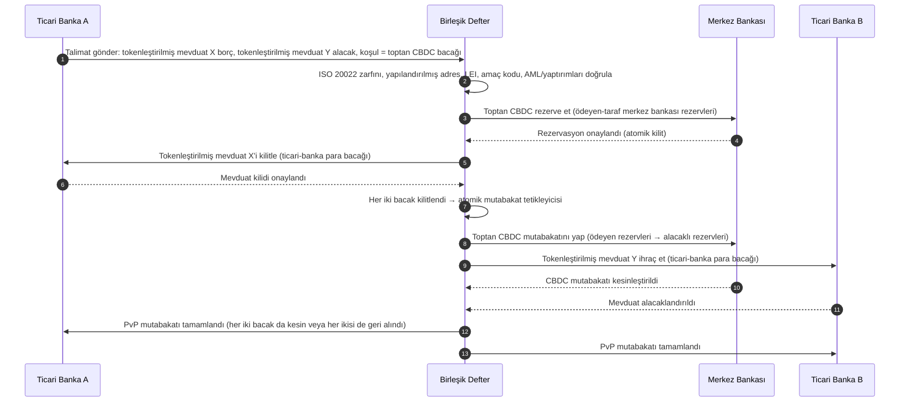

<!-- lead-start: manual -->
<aside class="post-lead" aria-label="Makale özeti">

<strong>Özet.</strong> 2026'da toptan ödemeler iki yapısal kaymanın kesişiminde duruyor: ISO 20022 yapılandırılmış ödeme verisini operasyon modeline zorluyor ve tokenleştirilmiş mevduat + BIS Proje Agorá sınır ötesi mutabakatı atomik, programlanabilir, her zaman açık raylara taşıyor. 2026'da bankanın sorusu artık "mesajları göç ettirdik mi" değil, "ödeme operasyonlarımız ölçülebilir, yönlendirilebilir ve denetlenebilir mi" — endeks bunu dört kesin yüzdeye ayırır: yapılandırılmış-veri tamlığı, ray-yönlendirme optimalliği, mutabakat-kesinlik gecikmesi ve Agorá-koridor kapsamı.

<strong>Temel çıkarımlar</strong>

<ul class="post-lead-takeaways">
  <li><strong>Kasım 2026 sert bir son tarihtir, rehber değil.</strong> SWIFT, SR 2026'da yapılandırılmamış-adres desteğini kaldırıyor; belirlenmiş alanlarda şehir ve ülke olmayan ödemeler takastan düşer. Onarım maliyeti, ret oranı ve operasyon kapasitesi "metrik" olmaktan çıkıp "düzenleyiciye görünen duruş" haline gelir.</li>
  <li><strong>Düzenlenmiş toptanda tokenleştirilmiş mevduat stabilcoinleri geçer.</strong> Banka-mudi ilişkisini ve merkez bankası mutabakat varlığını korurken programlanabilirliği açar. Stabilcoinler kenarda rol oynamayı sürdürür; tokenleştirilmiş mevduat çekirdeği sabitler.</li>
  <li><strong>BIS Proje Agorá koridor referansıdır.</strong> Bir bankanın sınır ötesi ürünü 2027'ye kadar bir Agorá koridorunda çalışamıyorsa, piyasanın geri kalanının çoktan terk ettiği bir rayda rekabet ediyor demektir.</li>
  <li><strong>Gerçek zamanlı ray orkestrasyonu operasyon modelidir.</strong> 2026'nın çoklu-ray kararı (FedNow / RTP / TIPS / SEPA Inst / zincir üstü) "hangi ray" değildir — ödeme başına rayı seçen politika sicili, likidite profili ve yönlendirme motorudur.</li>
  <li><strong>Ölçün ya da ölçülün.</strong> Dört yüzde — yapılandırılmış-veri tamlığı, ray-yönlendirme optimalliği, mutabakat-kesinlik gecikmesi, Agorá-koridor kapsamı — 2026/27 denetim penceresi öncesinde ödeme duruşunu denetim hazır kanıta dönüştürür.</li>
</ul>
</aside>
<!-- lead-end -->

# 2026'da Toptan Ödemeler Endeksi: ISO 20022, Tokenleştirilmiş Mevduat, Gerçek Zamanlı Raylar ve Sınır Ötesi Mutabakat

2026'da toptan ödemeler iki eş zamanlı kaymayla yeniden biçimleniyor: yapılandırılmış ödeme verisi ve programlanabilir mutabakat. SWIFT'in Kasım 2026 yapılandırılmış-adres kilometre taşı veri kalitesini operasyon modeline zorlarken, BIS Proje Agorá ve tokenleştirilmiş mevduat sınır ötesi mutabakatın daha atomik, şeffaf ve her zaman açık hale gelip gelemeyeceğini sınıyor.

---

> **Yönetici Özeti / Temel Çıkarımlar**
>
> - **Kasım 2026 sert bir veri kilometre taşıdır.** SWIFT, yapılandırılmamış adres içeren ödemelerin SR 2026 değişikliğinden sonra artık desteklenmeyeceğini söylüyor.
> - **Yapılandırılmış veri ürün altyapısı haline gelir.** Şehir ve ülke en azından belirlenmiş alanlarda olmalı; bu da ödeme veri kalitesini bir müşteri, operasyon ve uyum meselesine dönüştürür.
> - **Tokenleştirilmiş mevduat bir toptan tasarım seçeneğidir.** Proje Agorá, birleşik defter modelinde tokenleştirilmiş ticari banka mevduatını ve tokenleştirilmiş merkez bankası rezervlerini araştırır.
> - **Endeks mutabakat kalitesini ölçmeli, yalnızca hızı değil.** Kesinlik, şeffaflık, onarım oranları, likidite kullanımı, uyum verisi ve müşteri görünürlüğü, anlık yürütme kadar önemlidir.
> - **Sınır ötesi ödemeler kamu-özel bir gündem olmayı sürdürüyor.** FSB, kamu ve özel sektör koordinasyonuyla G20 yol haritasını uygulamaya taşımayı sürdürüyor.
>
---

## Bu Endeksin 2026'da Önemli Olmasının Nedeni

Stanford AI Endeksi, hızlı hareket eden bir teknoloji alanını ölçülebilir bir şey olarak ele aldığı için yararlıdır: araştırma çıktısı, teknik performans, sorumlu konuşlandırma, ekonomi, sektör benimsenmesi, politika ve kamuoyu duygusu tek bir çerçeveye yerleştirilir ([Stanford HAI ⧉](https://hai.stanford.edu/ai-index/2026-ai-index-report "The 2026 AI Index Report")). Bankalar ve finans kurumları artık altyapı için aynı disipline ihtiyaç duyuyor. Ajan tabanlı yapay zeka, kuantuma dayanıklı güvenlik, bulut yerel dayanıklılık ve toptan ödemeler artık ayrı inovasyon hatları değil; tek bir operasyon modelinde birleşiyorlar.

Bir banka için pratik soru, her alanın önemli olup olmadığı değildir. Kurumun hepsinde aynı anda hazırlığı ölçüp ölçemediğidir. Bir banka ajan tabanlı yapay zekayı konuşlandırabilir ve kriptografisi göç-hazır değilse yine kırılgan kalabilir. Bulut platformlarını modernize edebilir ve ödeme verisi yapılandırılmamış kalırsa yine başarısız olabilir. Tokenleştirme pilotları çalıştırabilir ve mutabakat, likidite, kimlik ve denetim katmanları birlikte tasarlanmamışsa yine sistemik risk yaratabilir.

## 2026 Endeks Mimarisi

| Endeks Katmanı | 2026 Yönü | Hazırlık Metriği | Yanlış Yönetilirse Risk |
|---|---|---|---|
| **ISO 20022 verisi** | Yapılandırılmamış metinden yönetişimli yapılandırılmış alanlara geç | Yapılandırılmış-adres hazırlığı ve ret oranı | Ödeme retleri ve manuel onarım |
| **Ray orkestrasyonu** | RTGS, anlık, muhabir, stabilcoin ve tokenleştirilmiş raylar arasında yönlendir | Maliyet, hız, kesinlik ve yargı-yetkisi farkında yönlendirme | Mükerrer kontrollü parçalı raylar |
| **Tokenleştirilmiş mutabakat** | Sürtünmeyi azalttığı yerde tokenleştirilmiş mevduat ve merkez bankası parası kullan | DvP, PvP, atomik mutabakat kapsamı | İş akışı değeri olmayan pilot varlıklar |
| **Likidite** | Gün içi likidite, takılı nakit ve mutabakat pencerelerini optimize et | Tasarruf edilen likidite ve mutabakat-başarısızlığı azaltma | Likidite üzerinde daha hızlı tükenmeler |
| **Uyum** | AML, yaptırımlar, FATF ve denetim gereksinimlerini ödeme verisine göm | Doğrudan-geçen uyum ve açıklanabilirlik | Daha güçlü kontroller olmadan zenginleştirilmiş veri |

## Küresel Önceliklere Eşlenen Temel Toptan Ödemeler Sinyalleri

2026 sinyal seti bir araştırma gündemi değildir. Bankanın Baş Ödemeler Yöneticisinin halihazırda üzerinden ölçüldüğü bir teslimat kontrol listesidir. İyileştirme işi üç yerde ortaya çıkar: mesaj zarfında, ray orkestrasyon katmanında ve mutabakat defterinde.

| Sinyal | G20 / SWIFT / BIS Referansı | Teknik Platform Uygulaması |
|---|---|---|
| **Ödeme mesajlarının %65'i hâlâ yapılandırılmamış adres içeriyor** | [SWIFT SR 2026 — yapılandırılmış-adres kilometre taşı, Kas 2026 ⧉](https://www.swift.com/news-events/news/iso-20022-milestone-november-2026-unstructured-addresses-be-removed "ISO 20022 November 2026 structured address milestone") | Mesaj SWIFTNet adaptörüne ulaşmadan önce ödeme ara yazılımında şema doğrulaması; kurumsal-kanal + muhabir-banka girişinde otomatik adres ayrıştırma. |
| **FSB G20 hedefi: 2027'ye kadar sınır ötesi ödemelerin %75'i 1 saat içinde tamamlanır** | [FSB sınır ötesi ödemeler yol haritası, 2026 uygulama aşaması ⧉](https://www.fsb.org/2026/03/fsb-kicks-off-new-implementation-phase-to-enhance-cross-border-payments-through-public-private-partnership/ "FSB cross-border payments implementation phase") | Önceden anlaşılmış likidite pencereleriyle gerçek zamanlı FX-çevirme ağ geçitleri; müşteri portalına T+0 onay kancaları; 1 sa zarfını karşılayamayan herhangi bir koridoru hariç tutan ray-yönlendirme motoru. |
| **FSB G20 hedefi: ortalama sınır ötesi işlem maliyeti %1'in, perakende %3'ün altında** | [FSB G20 niceliksel hedefler ⧉](https://www.fsb.org/2026/03/fsb-kicks-off-new-implementation-phase-to-enhance-cross-border-payments-through-public-private-partnership/ "FSB cross-border payments implementation phase") | Her koridorda maliyet-atfetme telemetrisi (FX yayılımı, muhabir ücreti, kaldırma maliyeti); fiyat öncesi uyumsuz fiyatlandırmayı yüzeye çıkaran marj politika sicili. |
| **BIS Proje Agorá yedi merkez bankası + 41 ticari banka genelinde prototip aşamasına geçer** | [BIS Proje Agorá ⧉](https://www.bis.org/about/bisih/topics/fmis/agora.htm "Project Agorá") | Birleşik-defter entegrasyon spesifikasyonu: tokenleştirilmiş mevduat defter düğümü + toptan-CBDC mutabakat düzlemi + KYC/AML kancaları; bankanın koridor payına göre boyutlandırılmış zincir üstü likidite havuzları. |
| **Deutsche Bank "dijital para" çerçevesi müşteri mimarisinde kristalleşir** | [Deutsche Bank — Dijital Para: stabilcoinler, tokenleştirilmiş mevduat ve CBDC'ler ⧉](https://flow.db.com/publications/flow-white-papers-and-guides/digital-money-a-perspective-on-stablecoins-tokenised-deposits-and-cbdcs "Digital Money: stablecoins, tokenised deposits and CBDCs") | Ödeme başına stabilcoin / tokenleştirilmiş mevduat / CBDC seçimini soyutlayan cüzdandan bağımsız mutabakat API'si; programlanabilir koşullar müşterinin değil, bankanın politika siciline göre değerlendirilir. |

## Ödeme Verisi Dönüm Noktası

ISO 20022, bir mesajlaşma-formatı projesinden bir veri-kalitesi operasyon modeline geçti. Yararlanıcı, borçlu, alacaklı, ajan, şehir, ülke, amaç ve taraf verisi zayıfsa banka retler, onarımlar, yaptırım sürtünmesi, müşteri hayal kırıklığı ve zayıf analitik yaşayacaktır.

**SR 2026 bunu bir tavsiye değil, sert bir sözleşme haline getirir.** SWIFT Standartlar Sürümü 2026 (Kasım 2026), yapılandırılmış-adres kuralını ağ katmanında uygular — `<PstlAdr>` öğesi `<TwnNm>` ve `<Ctry>` taşımayan mesajlar, onarım için işaretlenmek yerine alındığında SWIFTNet doğrulama yığını tarafından reddedilir. Onarım kuyruğu artık bir arka ofis maliyet kalemi olmaktan çıkar ve müşteri tarafında görünür gecikmeyle bir mutabakat-başarısızlığı olayına dönüşür. SR 2026'yı "daha sıkı rehber" olarak ele alan operasyon ekipleri yanlış el kitabıyla çalışıyor.

### ISO 20022 Kapsamında Yapılandırılmış Ödeme Verisi Uyumu

İyileştirme yüzeyi dar ve iyi tanımlanmıştır. Aşağıdaki XML öğeleri, Kasım 2026 SWIFTNet doğrulama yığınının mesajları gerçekten reddettiği yerlerdir; geri kalan her şey aşağı akış sonucudur.

| Veri Öğesi | ISO 20022 XML Etiketi | Kasım 2026 SWIFT Gereksinimi | Teknik İyileştirme Stratejisi |
|---|---|---|---|
| **Yapılandırılmış Adres** | `<PstlAdr>` içinde `<TwnNm>` + `<Ctry>` | Zorunlu. Yapılandırılmamış `<AdrLine>` metni, alıcı SWIFTNet adaptöründe ağ reddini tetikler. | Ödeme başlatma sırasında otomatik adres ayrıştırma; kurumsal-kanal form yeniden yazımları; bir sonraki borçlandırmadan önce her karşı tarafta arka kitap temizliği. |
| **Yasal Kuruluş Tanımlayıcısı (LEI)** | `<OrgId>` altında `<Id>` | Birey olmayan finansal karşı taraf doğrulaması için şiddetle önerilir; birkaç CBPR+ koridorunda zorunlu. | Kurumsal işe alımda LEI araması + GLEIF çapraz kontrolü; referans veri hizmetleri aracılığıyla arka kitap karşı tarafları için otomatik zenginleştirme. |
| **Ödeme Amacı Kodları** | `<Purp>` içinde `<Cd>` | Otomatik AML / yaptırım taraması için birden fazla bölgesel gerçek zamanlı koridorda (CBPR+, SEPA Inst, TIPS) zorunlu. | Eski banka-iç işlem kodlarını standart ISO 20022 ExternalPurposeCode listesine eşleyin; kurumsal-kanal UI'sinde amaç seçimini açın; bilinmeyen kodlarda varsayılan-reddet. |
| **Nihai Taraflar** | `<UltmtDbtr>` / `<UltmtCdtr>` | G20 FATF seyahat kuralı + yaptırım parametrelerini karşılamak için nihai yararlanıcı bağlamını açığa çıkarın; birkaç ödeme-türü kodu için zorunlu. | Defter alt-hesaplarından uçtan-uca taraf adlarını çıkarın; KYC grafiğine karşı mutabık kılın; her onayda nihai tarafı yüzeye çıkarın. |
| **Havale Bilgisi (Yapılandırılmış)** | `<RmtInf><Strd>` ile `<RfrdDocInf>` | CBPR+ Faz 2 kapsamında mutabık kılınabilir fatura-bağlantılı kurumsal ödemeler için gerekli. | Kurumsal portalda teklif zamanında yapılandırılmış havaleyi yakalayın; yüksek değerli akışlar için serbest-metin geri dönüşünü reddedin. |

## Tokenleştirilmiş Mevduat ve Toptan CBDC

Tokenleştirilmiş mevduat, ticari-banka para modelini korurken programlanabilirlik ekler. Toptan merkez bankası parası, mutabakat kesinliğini korur. İlgi çekici tasarım deseni kombinasyondur: müşteri ilişkileri ve kredi aracılığı için ticari banka parası, nihai mutabakat ve sistemik güven için merkez bankası parası.

Proje Agorá kombinasyonu somutlaştırır. Aşağıdaki mimari, hem bir ticari-banka mevduat defteri hem de toptan-CBDC mutabakat düzlemi kullanarak, birleşik bir defter aracılığıyla koordine edilen atomik bir ödeme-karşılığı-ödeme (PvP) sınır ötesi mutabakat için BIS referans modelidir.

Mutabakat yapısı gereği atomiktir: her iki bacak da kabul edilir veya her ikisi de geri alınır. Toptan-CBDC bacağındaki mutabakat kesinliği, ticari-banka tokenleştirilmiş mevduat transferini muhabir riski olmadan etkili kılar. Birleşik defter koordinasyon düzlemidir, kendi başına bir ödeme sistemi değil — merkez bankası hâlâ mutabakat varlığını ihraç eder ve ticari banka hâlâ mevduat yükümlülüğünü kayda alır.

## Yeni Toptan Ödeme Ürünü

Ürün artık yalnızca bir ödeme değildir. Yürütme, veri, likidite, uyum, izlenebilirlik ve istisna yönetiminden oluşan bir pakettir. Bu yetenekleri API'ler ve müşteri panoları aracılığıyla açığa çıkarabilen bankalar, altyapı uyumunu müşteri değerine dönüştürür.

## Bunun Banka Türüne Göre Anlamı

### Küresel Sistemik Önemde Bankalar

Küresel bankalar bu endeksi bir kurumsal mimari karnesi olarak ele almalıdır. Öncelik başka bir kavram kanıtı değildir; özerk iş akışlarının, kriptografik göçün, bulut bağımlılığının ve ödeme modernizasyonunun tek bir risk ve değer sistemi olarak yönetilebileceğinin kanıtıdır.

### İşlem Bankaları ve Kurumsal Bankalar

İşlem bankaları toptan ödemelere, yapılandırılmış veriye, likiditeye, tokenleştirilmiş mevduata ve ajan tabanlı hazine hizmetlerine odaklanmalıdır. En değerli müşteri önerisi yalnızca daha hızlı para hareketi değildir; daha az araştırma ve daha iyi işletme sermayesi görünürlüğüyle açıklanabilir, denetlenebilir, programlanabilir para hareketidir.

### Bölgesel Bankalar

Bölgesel bankalar bu endeksi program savruluşunu önlemek için kullanmalıdır. Her sınırda öncülük etmek zorunda değiller, ancak yapay zeka yönetişimi, kuantum sonrası envanter, bulut çıkış kanıtı ve ödeme veri hazırlığı konularında inandırıcı pozisyonlara ihtiyaçları var.

### Fintech'ler, PSP'ler ve Altyapı Sağlayıcıları

Fintech'ler ve altyapı sağlayıcıları ürün yol haritalarını ölçülebilir banka hazırlığıyla hizalamalıdır. En iyi öneriler entegrasyon riskini azaltır, kanıtı güçlendirir ve karmaşık altyapıyı bankaların yönetmesi için kolaylaştırır.

## Sonuç

Endeks tarzı bir raporun değeri, parçalı bir teknoloji gündemini ölçülebilir bir operasyon modeline dönüştürmesidir. 2026'da finansal altyapıdaki kazananlar en çok pilota sahip kurumlar olmayacak. Özerklik, güvenlik, dayanıklılık, mutabakat, ekonomi ve yönetişim genelinde hazırlığı aynı anda kanıtlayabilen kurumlar olacak.

## Sıkça Sorulan Sorular

**ISO 20022 neden 2026'da hâlâ bir mesele?**

Çünkü göç, ödeme verisi yapılandırılana, yönetişime alınana, kaynakta yakalanana ve kanallar, müşteriler ve piyasa altyapıları genelinde kullanılabilir hale gelene kadar tamamlanmaz.

**Tokenleştirilmiş mevduat nedir?**

Tokenleştirilmiş mevduat, banka-mudi ilişkisini korurken programlanabilir mutabakatı mümkün kılmak üzere tasarlanmış, ticari banka parasının dijital bir temsilidir.

**Tokenleştirilmiş mevduat stabilcoinlerin yerini alır mı?**

Her yerde değil. Stabilcoinler bazı dijital-varlık ve sınır ötesi bağlamlarda yararlı olmayı sürdürebilir; tokenleştirilmiş mevduat ise düzenlenmiş toptan bankacılık için yapısal olarak çekicidir.

**Bankalar ne ölçmeli?**

Yapılandırılmış-veri hazırlığını, ödeme retlerini, onarım maliyetini, mutabakat süresini, likidite kullanımını, ray yönlendirme sonuçlarını ve müşteri görünürlüğünü ölçün.

## Kaynaklar

- SWIFT, (2026). [ISO 20022 Kasım 2026 yapılandırılmış adres kilometre taşı ⧉](https://www.swift.com/news-events/news/iso-20022-milestone-november-2026-unstructured-addresses-be-removed "ISO 20022 November 2026 structured address milestone").
- BIS Innovation Hub, (2026). [Proje Agorá ⧉](https://www.bis.org/about/bisih/topics/fmis/agora.htm "Project Agorá").
- FSB, (2026). [Sınır ötesi ödemeler uygulama aşaması ⧉](https://www.fsb.org/2026/03/fsb-kicks-off-new-implementation-phase-to-enhance-cross-border-payments-through-public-private-partnership/ "Cross-border payments implementation phase").
- Deutsche Bank, (2026). [Dijital Para: stabilcoinler, tokenleştirilmiş mevduat ve CBDC'ler ⧉](https://flow.db.com/publications/flow-white-papers-and-guides/digital-money-a-perspective-on-stablecoins-tokenised-deposits-and-cbdcs "Digital Money: stablecoins, tokenised deposits and CBDCs").

<!-- enrich-start -->
<aside class="author-card" aria-label="Yazar hakkında"><strong class="author-card-name"><a href="/about/index.html">Sebastien Rousseau</a></strong>Uygulamalı yapay zeka, ödeme altyapısı, tokenleştirilmiş para, ISO 20022, kuantum sonrası güvenlik, bulut yerel finansal hizmetler ve düzenlenmiş dijital piyasalar üzerine yazan kıdemli bankacılık teknoloji uzmanı.HSBC Ticari ve Yatırım Bankası, PayPal, Barclays, Shazam, AKQA, Virgin Group'ta 20+ yıl. <a href="/about/index.html">Tam profil</a> &middot; <a href="https://www.linkedin.com/in/sebastienrousseau/" rel="external noopener">LinkedIn</a> &middot; <a href="https://github.com/sebastienrousseau" rel="external noopener">GitHub</a></aside>

Son inceleme <time datetime="2026-06-06">2026-06-06</time>.

<!-- enrich-end -->
