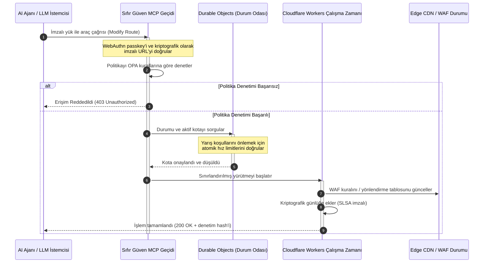

# CloudCDN: 2026'da AI-Yerel Edge için Açık Kaynak Şablon

<!-- lead-start: manual -->
<aside class="post-lead" aria-label="Makale özeti">

<strong>Özet.</strong> 2026'da kurumsal teknolojiyi, küresel olarak dağıtık sunucusuz yürütme ile ajansal AI'ın yakınsaması tanımlıyor. Statik dosya önbelleği ve temel trafik yönlendirme için inşa edilmiş standart CDN'ler, aktif ve gerçek zamanlı veri orkestrasyonu çağında yapısal olarak güncelliğini yitirdi. CloudCDN, edge'i aktif bir kontrol düzlemine dönüştüren açık kaynak bir şablondur: sunucusuz çalışma zamanları, Cloudflare Durable Objects üzerinden durumlu koordinasyon ve otonom AI ajanlarının web altyapısını sınırlandırılmış, kriptografik olarak güvence altına alınmış operasyonel zarflar içinde işletmesine izin veren sıfır güven Model Context Protocol (MCP) geçidi.

<strong>Temel çıkarımlar</strong>

<ul class="post-lead-takeaways">
  <li><strong>Statik önbellekten sınırlandırılmış kontrol düzlemine.</strong> CloudCDN operasyonel sınırı edge'e taşır; CDN düğümlerini, milisaniyenin altında güvenlik, yönlendirme ve erişim kontrolü kararları yürüten aktif politika kapılarına dönüştürür.</li>
  <li><strong>Durumlu edge koordinasyonu.</strong> Cloudflare Durable Objects, atomik ve gerçek zamanlı hız sınırlamayı ve durum koordinasyonunu küresel ölçekte uygular — dağıtık yarış koşulu yok, edge bölgeleri arasında sistemik kota istismarı yok.</li>
  <li><strong>MCP ile güvenli ajansal altyapı yönetimi.</strong> Sıfır güven bir geçit 42 özelleşmiş MCP aracını açar; AI ajanları altyapıyı kriptografik olarak imzalı sınırlar altında inceler, yapılandırır ve işletir.</li>
  <li><strong>Hat çıktısı olarak tedarik zinciri güvenliği.</strong> Her sürümde Sigstore/Cosign ile SLSA Level 3 derleme menşei ve %100 kapsamda 3.185 birim testi.</li>
  <li><strong>Panolar değil, yönetim kurulu düzeyinde kanıt.</strong> Edge telemetrisi doğrudan DORA Madde 5 yönetim kurulu hesap verebilirliğine, BCBS 239 risk raporlamasına ve Basel III operasyonel risk sermaye kurallarına eşlenir.</li>
</ul>

<strong>İlgili okumalar:</strong> <a href="/2026-05-16-best-cloud-infrastructure-architecture-2026/">2026'da En İyi Bulut Altyapı Mimarisi</a> · <a href="/2026-06-05-cloud-native-banking-index-dora-resilience-platform-engineering-2026/">2026 Bulut-Yerel Bankacılık Endeksi</a> · <a href="/2026-06-03-agentic-ai-index-banks-autonomy-governance-auditability-2026/">2026 Bankalar için Ajansal AI Endeksi</a>.

</aside>
<!-- lead-end -->

CDN tartışması bitti. Edge artık bir önbellek değil; AI-yerel yazılımın kontrol düzlemidir. Ajanlar araç çağırdıkça, veri taşıdıkça, önbellek temizledikçe, imzalı URL talep ettikçe ve iş akışlarını koordine ettikçe, opak panolara ve tescilli kontrol düzlemlerine dayanan eski model bir rahatsızlık olmaktan çıkıp düzenleyici bir yükümlülüğe dönüşüyor. CloudCDN farklı bir model savunuyor: güvenliği, erişilebilirliği, performansı ve denetlenebilirliği sağlayıcı vaatleri olarak değil, uygulanabilir varsayılanlar olarak ele alan açık, incelenebilir, ajan tarafından kontrol edilebilir bir edge platformu.

Bu makalenin açık kaynak referans noktası [cloudcdn.pro ⧉](https://github.com/sebastienrousseau/cloudcdn.pro "cloudcdn.pro"). Depo, uçtan uca okunabilen ve bağımsız olarak dağıtılabilen çok kiracılı, AI-yerel bir CDN'dir: Cloudflare PoP'ları genelinde 100 ms altı TTFB, MCP kontrolü, Durable Objects hız sınırlama, WCAG-AA erişilebilirlik, imzalı URL'ler, passkeys, SLSA Level 3 ve %100 kapsamda 3.185 test.

---

> **Yönetici Özeti / Temel Çıkarımlar**
>
> - **Edge operasyonel sınır haline geliyor.** CloudCDN, standart CDN düğümlerini milisaniyenin altında güvenlik, yönlendirme ve erişim kontrolü yürüten aktif politika kapılarına dönüştürür.
> - **Durable Objects hız sınırlamayı atomik yapar.** Gerçek zamanlı, küresel olarak tutarlı kota uygulaması, nihai tutarlılığa dayanan sınırlayıcıların saldırganlara ve arızalı ajanlara açık bıraktığı yarış koşulu penceresini kapatır.
> - **Ajanlar altyapıyı 42 sınırlandırılmış MCP aracıyla işletir.** Her çağrı, herhangi bir şey yürütülmeden önce WebAuthn passkeys, imzalı yükler ve OPA politikasına karşı doğrulanır.
> - **Tedarik zinciri ürünün parçasıdır.** Sigstore/Cosign ile SLSA Level 3 menşei, her sürümü denetlenmiş kaynağına kriptografik olarak bağlar.
> - **Telemetri uyum kanıtıdır.** Edge operasyonları DORA Madde 5'e, BCBS 239'a ve Basel III operasyonel risk sermayesine eşlenir — sonradan raporlamayla değil, doğrudan.
>
---

## Bu Açık Kaynak Projesi 2026'da Neden Önemli

2026'da kurumsal BT, statik altyapı tedarikinden gerçek zamanlı, olay güdümlü veri orkestrasyonuna geçti. Bu kaymayı iki piyasa gücü yönlendiriyor.

Birincisi, ajansal AI'ın yaygınlaşması. Otonom modeller ve yazılım ajanları artık karmaşık operasyonel görevleri yürütüyor — otomatik tehdit azaltma, yönlendirme kararları, gerçek zamanlı defter dengeleme. Pano kullanmıyorlar. Araç çağırıyorlar.

İkincisi, [Dijital Operasyonel Dayanıklılık Yasası'nın (DORA) ⧉](https://eur-lex.europa.eu/legal-content/EN/TXT/?uri=CELEX%3A32022R2554 "Finansal sektör için dijital operasyonel dayanıklılığa ilişkin (AB) 2022/2554 sayılı Tüzük") aktif olarak uygulanması. Bankacılık kurumları artık opak, tescilli üçüncü taraf CDN'lere bel bağlayamaz. Düzenleyiciler yazılım tedarik zincirinde tam görünürlük, doğrulanabilir çıkış kabiliyeti ve değiştirilemez kriptografik denetim izleri talep ediyor.

Merkezi sunucu mimarileri, gerçek zamanlı orkestrasyonun ememeyeceği gecikme cezaları dayatır. Tescilli CDN'ler, kurumları göremedikleri — kanıtlamak şöyle dursun — tedarik zinciri ihlallerine maruz bırakan kara kutular olarak çalışır. CloudCDN bu açığı, edge'i aktif bir kontrol düzlemine dönüştüren şeffaf, sıfır güven, açık kaynak bir şablonla kapatır. Teknoloji yöneticileri için konuşmayı uyumun maliyetinden Return on Resilience'a taşır: otomatik, denetime hazır operasyonel hatlarla korunan sermaye.

## Mimari Merceği

CloudCDN mimarisi, merkezi ara katmanı yerel ve durumlu edge primitifleriyle değiştiren beş katman üzerinde yapılandırılmıştır:

| Katman | Tasarım Kararı | Neden Önemli | Yanlış Yönetilirse Risk |
|---|---|---|---|
| **Edge çalışma zamanı** | Cloudflare Workers ve Pages | Merkezi VM gecikmesini ortadan kaldırır; politikaları küresel ölçekte milisaniyenin altında yürütür | Politika disiplini olmadan performans kazanımları kaotik edge sapmasına yol açar |
| **Durum koordinasyonu** | Durable Objects | Hız limitleri ve paylaşılan durum için bölgeler arasında atomik, gerçek zamanlı tutarlılık garanti eder | Dağıtık yarış koşulları, API kaynak istismarı, aşılan çevre kotaları |
| **Ajan arayüzü** | Sıfır güven MCP geçidi | AI ajanlarının altyapıyı yönetilen sınırlar altında işletmesi için 42 özelleşmiş MCP aracını açar | Sınırsız araç çağrısı ve yetkisiz yapılandırma değişiklikleri |
| **Erişim kontrolü** | WebAuthn passkeys ve imzalı URL'ler | Denetlenebilir operasyonlar için statik parolaları kriptografik imzalarla değiştirir | Zayıf atfedilen değişiklikler; çevre ihlaline yol açan kimlik bilgisi hırsızlığı |
| **Kalite kapıları** | SLSA Level 3 ve %100 test kapsamı | Derleme kaynağını matematiksel olarak doğrular; kötü amaçlı bağımlılık enjeksiyonunu engeller | Yazılım tedarik zinciri üzerinden eklenen kötü amaçlı kod |

## İzlenecek Operasyonel Sinyaller

Edge hazırlığı ölçülebilir. Niyeti değil, yürütme kabiliyetini gösteren nicel göstergeler şunlardır:

| Sinyal | Metrik / Kıyas | Düzenleyici Referans | Platform Uygulaması |
|---|---|---|---|
| **42 MCP aracı** | Otomatik yönetim için sınırlandırılmış araç kayıt defteri sayısı | COBIT 2019 (BAI06) | Ajan imzalarını OPA politikalarına karşı doğrulayan MCP geçidi |
| **Durable Objects** | Sızıntısız, milisaniyenin altında atomik kota uygulaması | DORA Madde 6 | Küresel API kota durumunu izleyen Durable Objects |
| **Passkeys ve imzalı URL'ler** | Yönetici oturumlarının %100'ü FIDO2 WebAuthn ile doğrulanır | DORA Madde 30 | Edge yönlendiricisine gömülü kriptografik imza denetimleri |
| **SLSA Level 3** | Kriptografik olarak imzalı derleme manifestleri (Sigstore) | DORA Madde 30 | İmzalı derleme metaverisi üreten GitHub Actions hatları |
| **3.185 birim testi** | %100 kapsam; her sürümde regresyon kapıları | NIST CSF 2.0 (PR.DS-01) | Herhangi bir test hatasında dağıtımı durduran CI hatları |

## CDN Aktif Bir Kontrol Düzlemi Haline Geliyor

Geleneksel CDN'ler pasif, statik içerik hızlandırma etrafında tasarlandı. CloudCDN modeli yeniden tanımlıyor. Cloudflare Workers ve Durable Objects entegre edildiğinde, edge aktif ve durumlu bir politika kapısı olarak çalışır.

Bir AI ajanı veya otomatik süreç bir altyapı yapılandırma değişikliği ya da yönlendirme ayarı talep ettiğinde, savunmasız ve merkezi bir veritabanıyla konuşmaz. Talep en yakın edge düğümünde yakalanır ve herhangi bir şey yürütülmeden önce kimlik, politika ve kota denetimlerinden geçirilir:

Bu dizideki her adım, atfedilebilir ve imzalı bir kayıt üretir. İçerik hızlandıran bir CDN ile yönetilebilen bir kontrol düzlemi arasındaki fark budur.

## Açık Kaynak Güven Modelini Neden Değiştirir

Bilgi güvenliği yöneticileri (CISO) için opak tescilli CDN'ler birikerek büyüyen bir risk oluşturur. Kapalı kaynaklı edge ağları kara kutudur: sağlayıcı bir iç ihlal yaşarsa, ihlal kamuya açıklanana kadar bankanın hiçbir görünürlüğü yoktur.

CloudCDN bu asimetriyi, üç mekanizma üzerine kurulu, tamamen denetlenebilir, açık kaynak bir güven modeliyle değiştirir:

1. **Matematiksel derleme menşei.** SLSA Level 3 altında her sürüm, açık kaynak GitHub deposuna kriptografik olarak bağlıdır. Bir CISO, Cloudflare'in küresel edge düğümlerinde çalışan ikili dosyanın tam olarak denetlenmiş kaynak kodunu içerdiğini — sözleşmeyle değil, matematiksel olarak — doğrulayabilir.
2. **Sürekli, kamuya açık güvenlik denetimleri.** Kod tabanı otomatik taramalara, kamuya açık zafiyet bildirimine ve akran incelemeli kod denetimlerine tabidir. Belirsizlik bir kontrol değildir; inceleme öyledir.
3. **Sağlayıcı kilidi yok (DORA Madde 28).** DORA, bankaların kritik üçüncü taraf sağlayıcılardan açık ve test edilmiş bir çıkış stratejisini kanıtlamasını şart koşar. CloudCDN açık kaynak olduğu ve standart sunucusuz primitifler üzerine inşa edildiği için, kurumlar edge yapılandırmalarını Cloudflare'den diğer sunucusuz çalışma zamanlarına veya özel Kubernetes kümelerine taşıyabilir — ve bu kabiliyeti düzenleyiciye kanıtlayabilir.

## Banka Kalitesinde Edge Deseni

CloudCDN, küresel finans sektörünün uyum standartlarını karşılamak üzere tasarlanmıştır; teknik edge operasyonlarını, denetçilerin fiilen incelediği çerçevelere doğrudan eşler:

- **Model riski yönetimi ([ABD Fed SR 11-7 ⧉](https://web.archive.org/web/20260414150921/https://www.federalreserve.gov/supervisionreg/srletters/sr1107.htm "Supervisory Guidance on Model Risk Management") / Birleşik Krallık PRA SS1/23).** Operasyonel görevler yürüten otonom modeller, model riski yönetişiminin kapsamına girer. CloudCDN'in MCP geçidi, ajansal araçları nicel modeller gibi ele alır: katı politika sınırları, gerçek zamanlı günlükleme ve yüksek etkili eylemler için zorunlu döngüde-insan müdahaleleri.
- **BCBS 239 (risk verisi toplulaştırma).** İşlem verisini edge'de yakalayıp etiketleyerek ve yapılandırarak, operasyonel metrikler gerçek zamanlı üretilir — veri bütünlüğü, zamanlılık ve düzenleyici izlenebilirlik için BCBS 239 gereksinimleriyle uyumlu biçimde.
- **DORA Madde 5 (yönetim kurulu hesap verebilirliği).** Operasyonel dayanıklılığın nihai kişisel sorumluluğunu yönetim kurulu taşır. CloudCDN, edge telemetrisini, teknik olmayan yöneticilerin kişisel sorumluluk denetimine götürebileceği nicelleştirilmiş, doğrulanabilir kanıta çevirir.
- **Basel III operasyonel risk sermayesi.** Bankalar operasyonel riske karşı düzenleyici sermaye tutar. Otomatik felaket kurtarma devri ve SLSA Level 3 menşei, kurumun operasyonel risk profilini düşürür — yalnızca bir denetimi tatmin etmekle kalmaz, bilançoda sermaye korur.

## Bunun Banka Türüne Göre Anlamı

### Küresel Sistemik Öneme Sahip Bankalar (G-SIB'ler)

G-SIB'ler birden çok yargı alanında devasa işlem hacimleri yürütür. Öncelik, parçalı eski çevre kontrollerini tek ve birleşik bir edge düzlemiyle değiştirmektir. CloudCDN desenini devreye almak, bir G-SIB'in güvenlik politikalarını, API geçitlerini ve ajansal yönetişimi küresel ölçekte standartlaştırmasına olanak tanır — ve DORA uyumlu kanıt hatlarını üç ayda bir telaş olarak değil, operasyonun yan ürünü olarak üretir.

### İşlem Bankacılığı ve Kurumsal Bankalar

İşlem bankaları için müşteriye dönük ürün; yürütme hızı, güvenlik ve veri şeffaflığından oluşan bir pakettir. CloudCDN deseni, bu bankaların kurumsal hazine yöneticilerine güvenli API panoları ve gerçek zamanlı nakit izleme hizmetleri sunmasına olanak tanır — kurumsal mevduatı savunan dayanıklı bir edge duruşu.

### Bölgesel ve Daha Küçük Bankalar

Bölgesel bankalar, mühendislik bütçeleri olmaksızın G-SIB'lerle aynı tehdit aktörleriyle karşı karşıyadır. Açık kaynak, banka kalitesinde bir edge şablonu kontrolleri hazır sunar: tescilli lisans maliyetleri olmadan anında düzenleyici uyum ve bunu kanıtlayacak kaynak kodu.

## Yönetim Kurulu Oyun Planı

Operasyonel dayanıklılık artık görünmez bir arka ofis BT metriği değil; kişisel sorumluluk içeren bir yönetim kurulu önceliğidir. 2026'da düzenleyicilerin, müşterilerin ve hissedarların güvenini koruyan kurumlar, teknolojiyi doğrulanabilir ve gözlemlenebilir bir varlık olarak ele alır.

Kıdemli teknoloji liderleri için yol haritası kısadır:

1. **Kanıtı bir ürün olarak zorunlu kılın.** Edge'de otomatik, kendini belgeleyen hatlar için bütçe ayırın — denetçi için derlenen değil, operasyonun ürettiği kanıt.
2. **Durumlu edge kontrolüne geçin.** Hız sınırlamayı, WAF'ı ve kimlik doğrulamayı merkezi sunuculardan alıp atomik edge primitiflerine taşıyın.
3. **Kriptografik ajansal sınırlar kurun.** Her otomatik araç çağrısı için passkey ve OPA doğrulamalı sıfır güven MCP geçitlerini uygulayın.
4. **Açık kaynak derleme denetimleri talep edin.** SLSA Level 3 derleme menşeini bir hedef değil, dağıtım koşulu yapın.

## Sıkça Sorulan Sorular

**CloudCDN, DORA denetimlerine hazır mı?**

Evet. CloudCDN, Bilgi Kayıt Defteri ITS şablonlarına (RT.01'den RT.15'e) ve DORA Madde 30 sözleşme hükümlerine doğrudan eşlenen otomatik uyum kanıtı üretmek üzere tasarlanmıştır.

**Hız sınırlama için Durable Objects kullanmanın avantajı nedir?**

Geleneksel dağıtık hız sınırlayıcılar nihai tutarlılığa dayanır; bu da saldırganların veya arızalı ajanların istismar edebileceği bir gecikme penceresi bırakır. Durable Objects, küresel ölçekte anında ve atomik tutarlılık garanti ederek yarış koşulu penceresini tamamen kapatır.

**CloudCDN'i AI-yerel yapan nedir?**

MCP-kontrollü operasyonları ve ajan-farkında kontrol modeli. Altyapı, kriptografik kimlik ve politika sınırlarına sahip 42 yönetilen araç üzerinden işletilir — yalnızca insan panoları için değil, otonom iş akışları için tasarlanmıştır.

**Açık kaynak kod, sıfırıncı gün istismarı riskini artırır mı?**

Hayır. Tescilli, kapalı kaynaklı CDN'ler belirsizlik yoluyla güvenliğe dayanır. CloudCDN'in kod tabanı sürekli olarak otomatik testlere, kamuya açık akran incelemesine ve SLSA Level 3 doğrulamasına tabidir — doğrulanabilir biçimde daha yüksek bir güven eşiği.

## Kaynakça

- Avrupa Parlamentosu ve Avrupa Birliği Konseyi, (2022). [Finansal sektör için dijital operasyonel dayanıklılığa ilişkin (AB) 2022/2554 sayılı Tüzük (DORA) ⧉](https://eur-lex.europa.eu/legal-content/EN/TXT/?uri=CELEX%3A32022R2554 "Finansal sektör için dijital operasyonel dayanıklılığa ilişkin (AB) 2022/2554 sayılı Tüzük (DORA)"). Brüksel: Avrupa Birliği Resmî Gazetesi.
- Basel Bankacılık Denetim Komitesi (BCBS), (2013). [Etkin risk verisi toplulaştırma ve risk raporlama ilkeleri (BCBS 239) ⧉](https://www.bis.org/publ/bcbs239.htm "Etkin risk verisi toplulaştırma ve risk raporlama ilkeleri (BCBS 239)"). Basel: Uluslararası Ödemeler Bankası.
- Board of Governors of the Federal Reserve System, (2011). [Supervisory Guidance on Model Risk Management (SR Letter 11-7) ⧉](https://web.archive.org/web/20260414150921/https://www.federalreserve.gov/supervisionreg/srletters/sr1107.htm "Supervisory Guidance on Model Risk Management (SR Letter 11-7)"). Washington D.C.: Federal Reserve.
- Cloudflare, (2026). [Durable Objects belgeleri: durumlu edge koordinasyonu ⧉](https://developers.cloudflare.com/durable-objects/ "Durable Objects belgeleri"). San Francisco: Cloudflare.
- Cloudflare, (2026). [MCP, kimlik doğrulama ve Durable Objects ile AI ajanları inşa etmek ⧉](https://blog.cloudflare.com/building-ai-agents-with-mcp-authn-authz-and-durable-objects/ "MCP, kimlik doğrulama ve Durable Objects ile AI ajanları inşa etmek").
- GitHub, (2026). [cloudcdn.pro deposu ⧉](https://github.com/sebastienrousseau/cloudcdn.pro "cloudcdn.pro deposu").

<!-- enrich-start -->
<aside class="author-card" aria-label="Yazar hakkında"><strong class="author-card-name"><a href="/about/index.html">Sebastien Rousseau</a></strong>Uygulamalı yapay zeka, ödeme altyapısı, tokenleştirilmiş para, ISO 20022, post-kuantum güvenlik, bulut yerel finansal hizmetler, açık kaynak altyapı ve düzenlenmiş dijital piyasalar üzerine yazan kıdemli bankacılık teknoloğu.HSBC Ticari ve Yatırım Bankası, PayPal, Barclays, Shazam, AKQA ve Virgin Group'ta 20+ yıl. <a href="/about/index.html">Tam profil</a> &middot; <a href="https://www.linkedin.com/in/sebastienrousseau/" rel="external noopener">LinkedIn</a> &middot; <a href="https://github.com/sebastienrousseau" rel="external noopener">GitHub</a></aside>

Son inceleme <time datetime="2026-06-11">2026-06-11</time>.

<!-- enrich-end -->
