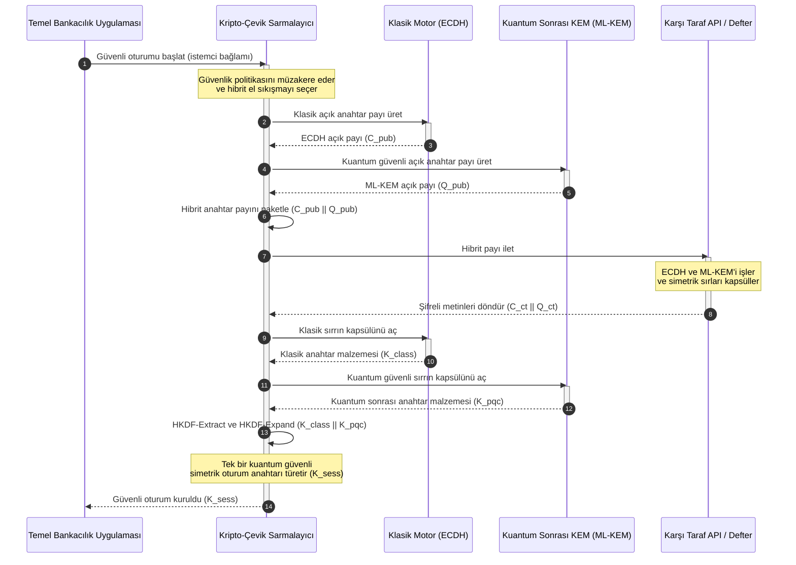

# KyberLib ve 2026'da Kuantum Sonrası Bankacılık Geçişi: Standartlardan Koda

<!-- lead-start: manual -->
<aside class="post-lead" aria-label="Makale özeti">

<strong>Özet.</strong> 2026'da bankacılık altyapısı, sonu bilinen sistemik bir tehditle karşı karşıya: kuantum ölçekli hesaplama, bugünün aktarım trafiğini koruyan RSA ve ECC anahtar değişimini kıracak. Federal standartlar ve denetim otoritelerinin politika belgeleri farkındalığı artırdı; teknik yürütme ise hâlâ silolarda. <a href="https://github.com/sebastienrousseau/kyberlib">KyberLib</a>, kuantum sonrası anlatıyı somut, bellek güvenli Rust koduna taşıyan açık kaynaklı bir mühendislik şablonudur — NIST standardı ML-KEM'i (FIPS 203) kripto-çevik soyutlama sınırlarının arkasında uygulayarak kurumların, "Şimdi Sakla, Sonra Çöz" saldırıları arşivlerine ulaşmadan önce taşıma güvenliğini ve anahtar kapsüllemeyi yükseltmesine olanak tanır.

<strong>Temel çıkarımlar</strong>

<ul class="post-lead-takeaways">
  <li><strong>Politikadan incelenebilir koda.</strong> KyberLib, kuantum sonrası kriptografiyi soyut stratejik yol haritalarından somut, yüksek performanslı, denetlenebilir Rust uygulamalarına taşır.</li>
  <li><strong>Standartlaştırılmış FIPS 203 ML-KEM yürütmesi.</strong> Kütüphane, NIST FIPS 203 kapsamında nihaileştirilen anahtar oluşturma algoritması ML-KEM'i uygulayarak uygunluğu küresel düzenleyici beklentilerle hizalı tutar.</li>
  <li><strong>Tasarım gereği kripto-çeviklik.</strong> Kararlı soyutlama sınırları, bankacılık uygulamalarının kriptografik ilkelleri pahalı ve hataya açık uygulama yeniden yazımları olmadan değiştirmesine olanak verir.</li>
  <li><strong>Rust temelli bellek güvenliği.</strong> Derleme zamanı sahiplik kuralları, eski C tabanlı kriptografik kütüphaneleri kemiren arabellek taşmalarını ve bellek sızıntılarını sıfır maliyetli soyutlama hızında ortadan kaldırır.</li>
  <li><strong>Yediemin sorumluluğunun azaltılması.</strong> Gözlemlenebilir, test edilebilir geçiş kanıtı, yöneticilere DORA Madde 5 kişisel hesap verebilirlik denetimlerinin talep ettiği "makul adımlar" kaydını sağlar.</li>
</ul>

<strong>İlgili okumalar:</strong> <a href="/2026-05-18-quantum-cryptography-standards-developments-2026/">Kuantum kriptografi standartları 2026</a>, <a href="/2026-05-28-dora-ai-act-data-sovereignty-banking-compliance-stack-2026/">DORA + AI Yasası uyum yığını</a>, <a href="/2026-05-20-cloud-native-banking-financial-institutions-2026/">Bulut yerel bankacılık</a>.

</aside>
<!-- lead-end -->

Kuantum sonrası geçiş bir planlama egzersizi olmaktan çıktı. 2026'da aktif bir operasyonel gerekliliktir ve risk artık düzenleyici niyet ile mühendislik yürütmesi arasındaki boşlukta oturmaktadır. [KyberLib ⧉](https://github.com/sebastienrousseau/kyberlib "kyberlib") bu boşluğun bir bölümünü kapatır: ML-KEM'i nihaileştirilmiş FIPS 203 parametrelerine göre uygulayan ve bir bankanın işlemsel varlık envanterinin gerçekten ihtiyaç duyduğu kripto-çevik sınırlarla saran, üretime dönük, bellek güvenli bir Rust kütüphanesi.

---

> **Yönetici Özeti / Temel Çıkarımlar**
>
> - **Tehdit zaten operasyonel.** Saldırganlar bugün "Şimdi Sakla, Sonra Çöz" toplaması yürütüyor; kriptografik olarak anlamlı bir kuantum bilgisayar geldiği gün, veri gizliliği geriye dönük olarak çöker.
> - **Standartlar nihaileşti.** NIST FIPS 203 (ML-KEM) ve FIPS 204 (ML-DSA), denetim komitelerine açık ve test edilebilir bir kıyas noktası sunar — artık "standartları bekliyoruz" savunması yoktur.
> - **KyberLib mühendislik şablonudur.** Bellek güvenli Rust, HSM'ler ve akıllı kartlar için `no_std` derleme ve klasik birlikte çalışabilirliği koruyan hibrit el sıkışma desenleri.
> - **Kripto-çeviklik kalıcı hedeftir.** Kararlı soyutlama sınırları, ilkellerin uygulama yeniden yazımı olmadan değişmesine olanak verir — tek bir algoritmayı aşan ders budur.
> - **Sorumluluğu yönetim kurulları taşır.** DORA Madde 5, yöneticilere kişisel sorumluluk yükler; incelenebilir, gözlemlenebilir geçiş kodu bu sorumluluğu karşılayan kanıttır.
>
---

## Bu Açık Kaynak Projesi 2026'da Neden Önemli

Asimetrik kriptografi geçersizliğe yaklaşırken tehdit, kriptografik olarak anlamlı bir kuantum bilgisayarın inşa edilmesini beklemiyor. Saldırganlar **"Şimdi Sakla, Sonra Çöz" (SNDL)** saldırılarını şimdi yürütüyor — kurumsal banka işlemlerinin, ticari sırların ve kurumsal iletişimlerin şifreli aktarım akışlarını, kuantum yetenekleri olgunlaştığında çözmek amacıyla topluyorlar. Bir banka için bugün hat üzerindeki her klasik el sıkışma, patlaması ertelenmiş bir gizlilik ihlalidir.

Düzenleyiciler somut yükümlülüklerle yanıt verdi:

1. **DORA Madde 6 (BİT risk yönetimi)**, kurumların kriptografik varlık envanteri genelindeki zafiyetleri haritalamasını, tanımlamasını ve azaltmasını zorunlu kılar — kimsenin envantere almadığı ara katman yazılımına gömülü asimetrik anahtar değişimi dâhil.
2. **NIST FIPS 203 ve 204**, anahtar kapsülleme (ML-KEM) ve dijital imzalar (ML-DSA) için resmî kuantum sonrası standartları belirleyerek denetim komitelerine geçiş ilerlemesinin ölçüleceği standartlaştırılmış bir kıyas noktası verir.

Bu geçişi canlı operasyonları aksatmadan yürütmek, politika belgelerinin ötesine geçip **incelenebilir, açık kaynaklı kriptografik altyapıya** geçmeyi gerektirir. [KyberLib ⧉](https://github.com/sebastienrousseau/kyberlib "kyberlib") tam olarak bunu sunar: kuantum sonrası dönüşümü ölçülebilir, doğrulanabilir bir mühendislik hattına dönüştüren, FIPS 203 ile uyumlu, bellek güvenli bir Rust kütüphanesi — ve teknoloji yatırımı tartışmasını somut bir Dayanıklılık Getirisine yönlendirir.

## Mimari Merceği

KyberLib kararlı API sınırlarının arkasında oturur ve bir bankanın çekirdek işlemsel uygulamalarını düşük seviyeli kriptografik ilkellerdeki değişikliklerden yalıtır.

| Katman | Tasarım Kararı | Neden Önemli | Yanlış Yönetilirse Risk |
|---|---|---|---|
| **İlkel** | FIPS 203 ML-KEM anahtar kapsülleme | Klasik Diffie-Hellman ve RSA anahtar değişimini kafes tabanlı yapılarla değiştirir | Nihaileştirilmiş FIPS 203 parametrelerine uyumsuzluk ve başarısız uyum denetimleri |
| **Dil** | Bellek güvenli Rust uygulaması | C/C++ için endemik bellek bozulması zafiyetlerini (arabellek taşmaları, use-after-free) ortadan kaldırır | Yapı zinciri bütünlüğünü tehlikeye atan bağımlılık yayılması |
| **Soyutlama** | Kararlı kripto-çevik sınırlar | Standartlar evrildikçe uygulamalar, birleşik bir arayüzün arkasında algoritma değiştirir | Her gelecekteki geçişte elle yeniden yazım dayatan sabit kodlanmış ilkeller |
| **Dağıtım** | Hibrit şifreleme el sıkışmaları | Kuantum sonrası KEM'leri klasik algoritmalarla çift sarmalı bir zarfta birleştirir | Eski sistemlerle birlikte çalışabilirliğin kaybı veya sessiz yapılandırma kayması |
| **Güvence** | SLSA Level 3 menşe kanıtı ve incelenebilir testler | Kod kaynağını ve menşesini garanti eder; örnekler satır satır denetlenebilir | Güvenlik tiyatrosu — uygulama hataları üretimde ortaya çıkan kara kutu kütüphaneler |

## Takip Edilecek Operasyonel Sinyaller

Denetim kurullarına ve düzenleyicilere kuantum sonrası uyumu kanıtlamak, belirli ve ölçülebilir metrikleri izlemek anlamına gelir:

| Sinyal | Metrik | Düzenleyici Referans | Platform Uygulaması |
|---|---|---|---|
| **FIPS 203 ML-KEM uygunluğu** | Nihaileştirilmiş parametrelerle (ML-KEM-512/768/1024) %100 uyum | NIST FIPS 203 | KyberLib modülleri içinde derlenmiş, parametreleri doğrulanmış kafes kriptografisi |
| **Kriptografik envanter** | Tüm sistemlerdeki asimetrik anahtar değişimi kullanımının eksiksiz envanteri | NIST SP 1800-38 | Aktif şifre paketlerini merkezi bir kayıt defterine işleyen otomatik tarama ajanları |
| **Hibrit anahtar değişimi** | Hibrit zarf içinde yürütülen taşıma katmanı el sıkışmalarının yüzdesi | DORA Madde 6 | Klasik TLS 1.3 el sıkışmalarını PQC kapsüllemesiyle saran ağ vekilleri |
| **`no_std` derleme** | Kısıtlı hedefler için Rust standart kütüphanesi olmadan derleyebilme | DORA Madde 30 | KyberLib'de Donanım Güvenlik Modülleri için koşullu `no_std` derleme |
| **Kripto-çeviklik endeksi** | API ağ geçidi genelinde bir kriptografik ilkeli değiştirmenin dakika cinsinden süresi | UK PRA SS1/23 | Algoritma tahsisini çalışma zamanı değişkenleriyle yöneten soyutlanmış yönlendirme kayıtları |

## Kuantum Sonrası Kriptografi için Rust Neden Önemli

ML-KEM gibi kuantum sonrası algoritmaları uygulamak, polinom halkaları üzerinde karmaşık, düşük seviyeli matematiksel işlemler gerektirir. Tarihsel olarak bu işlemleri üretim hızında çalıştırmak, elle yazılmış C/C++ veya assembly anlamına geliyordu — bir bankanın yanlış yapma lüksünün en az olduğu kodda, bellek bozulması için geniş bir saldırı yüzeyi.

Rust, kriptografik mühendisliğin güvenlik duruşunu üç somut şekilde değiştirir:

1. **Derleme zamanı bellek güvenliği.** Rust'ın sahiplik modeli; arabellek taşmalarının, çift serbest bırakmaların ve use-after-free hatalarının derleme zamanında engellenmesini garanti eder. Anahtar boyutlarının ve şifreli metinlerin klasik karşılıklarından belirgin biçimde büyük olduğu kuantum sonrası kütüphanelerde bu özellikle kritiktir.
2. **Deterministik, sıfır maliyetli soyutlamalar.** Rust, çöp toplayıcı olmadan yerel makine koduna derlenir; yürütme hızı ve bellek ayak izi, güvenliği korurken C tabanlı kütüphanelere eşit veya onlardan üstündür.
3. **`no_std` uyumluluğu.** KyberLib, Rust'ın standart kütüphanesi olmadan derlenir; böylece kısıtlı, çıplak donanım ortamlarında — Donanım Güvenlik Modülleri (HSM) ve akıllı kartlar dâhil — çalışarak banka düzeyinde kriptografiyi fiziksel güvenlik sınırlarının içinde tutar.

## Kripto-Çevik Bir Mimari Tasarlamak

Kriptografik geçişlerin klasik başarısızlık modu sabit kodlamadır: uygulama mantığına doğrudan gömülmüş, her dönüşümde acı verici biçimde yeniden keşfedilen algoritmaya özgü varsayımlar. 2026 için kalıcı hedef **kripto-çevikliktir** — algoritmaları kararlı bir arayüzün arkasında değiştirilebilir modüller olarak ele alan bir soyutlama katmanı; böylece bir sonraki geçiş, varlık envanteri çapında bir yeniden yazım değil, bir yapılandırma değişikliği olur.

Aşağıdaki akış, KyberLib'in kripto-çevik sarmalayıcısının hibrit (klasik artı kuantum sonrası) bir anahtar değişimi el sıkışmasını nasıl koordine ettiğini gösterir:

Operasyonel açıdan önemli ayrıntı hibrit zarftır. Kuantum sonrası ilkeller yıllar süren üretim denetimini biriktirene kadar oturum anahtarı hem klasik hem de kuantum sonrası sırdan türetilir: bir saldırganın kanalı ele geçirmesi için ECDH **ve** ML-KEM'i birlikte kırması gerekir. Geçiş yapmamış karşı taraflar çalışmaya devam eder; geçiş yapanlar ise kafes tabanlı korumayı anında kazanır.

## Yönetim Kurulu Oyun Planı

Kuantum sonrası güvenlik bir arka ofis şifreleme meselesi değildir; kişisel sonuçları olan bir yönetim kurulu yönetişim konusudur. Üst düzey yöneticiler geçişi yediemin sorumluluğu çerçevesinden ele almalıdır:

- **DORA Madde 5 (yönetişim ve organizasyon)**, BİT güvenliğinin kişisel sorumluluğunu yönetim kuruluna yükler. Açık kaynaklı, gözlemlenebilir testler, bir kişisel sorumluluk denetiminin talep ettiği doğrudan kanıttır — "incelenebilir bir FIPS 203 uygulaması seçtik ve işte uygunluk koşuları" savunulabilir bir yanıttır; "tedarikçimiz bizi temin etti" değildir.
- **Model risk yönetimi (ABD Fed SR 11-7 / UK PRA SS1/23)**, fiyatlama modelleri kadar kriptografik sarmalayıcı mimarilerine de uygulanır. Soyutlama katmanları, aşırı kesinti senaryoları altındaki performans dâhil olmak üzere MRM doğrulamasından geçmelidir.
- **Basel III operasyonel risk sermayesi**, kanıtlanmış kontrol olgunluğunu ödüllendirir. Test edilmiş hibrit el sıkışmalar, kurumun uzun vadeli operasyonel risk profilini düşürür; sermaye primini kırparak bilanço kapasitesini aktif hazine kullanımına açar.

## Banka Türüne Göre Bunun Anlamı

### Küresel Sistemik Öneme Sahip Bankalar (G-SIB'ler)

G-SIB'ler eski sistem ağırlıklı işlemsel varlık envanterleri işletir; bu nedenle bağlayıcı kısıtları keşiftir: asimetrik anahtar değişiminin fiilen nerede gerçekleştiğini bilmek. Önce NIST SP 1800-38 rehberliğinde sürekli kriptografik envanterler gelir; ardından KyberLib, envanterin ortaya çıkardığı her modern düğümde kuantum sonrası anahtar kapsüllemeyi yürütmek için standartlaştırılmış, bellek güvenli kütüphaneyi sağlar.

### İşlem ve Kurumsal Bankalar

Ödeme rayları üzerindeki gizlilik, işin özüdür. KyberLib çıplak donanım `no_std` hedeflerine derlendiği için işlem bankaları, kuantum sonrası el sıkışmaları yalnızca uygulama katmanında değil, doğrudan uçtaki ödeme yönlendirme ve likidite yönetimi donanımının içine dağıtabilir.

### Bölgesel ve Daha Küçük Bankalar

Bölgesel kurumlar, G-SIB araştırma bütçeleri olmadan aynı devlet destekli toplama faaliyetiyle karşı karşıyadır. İncelenebilir, açık kaynaklı bir Rust uygulaması, onlara kara kutu tedarikçi yol haritalarını müzakere etmeden NIST FIPS 203 uygunluğuna anında ulaşan anahtar teslim bir yol sunar.

## Yol Haritalarından Derlenen Koda

Kuantum sonrası dönüşüm aktif bir mühendislik görevidir ve 2026 boyunca denetçilerin, karşı tarafların ve kurumsal hazinecilerin güvenini koruyacak kurumlar, soyut yol haritalarından gözlemlenebilir, derlenen koda geçenlerdir. Yönetici talimatı doğrudan bunu izler: eski anahtar değişim noktalarını denetleyin, en yüksek değerli kanallarda hibrit el sıkışmaları dağıtın ve gelecekteki her ilkel değişimini rutin hale getiren kararlı soyutlama sınırlarını inşa edin. KyberLib, bu adımların her birini bir sunum taahhüdü yerine ölçülebilir bir operasyonel yetenek haline getirir.

## Sıkça Sorulan Sorular

**KyberLib, nihaileştirilmiş NIST standartlarıyla uyumlu mu?**

Evet. KyberLib, FIPS 203'te nihaileştirilen ML-KEM parametreleri etrafında tasarlanmıştır; derlenen kütüphaneyi federal ve küresel düzenleyici beklentilerle hizalı tutar.

**Kuantum sonrası bir kütüphane özel donanım gerektirir mi?**

Hayır. KyberLib'in Rust uygulaması standart sistem mimarilerine derlenir. `no_std` yeteneği ayrıca, fiziksel anahtar saklamanın zorunlu olduğu özel Donanım Güvenlik Modüllerinde ve akıllı kartlarda çalışmasına olanak verir.

**"Şimdi Sakla, Sonra Çöz" mevcut uyumu nasıl etkiler?**

Taşıma katmanı klasik RSA veya ECC'ye dayanıyorsa saldırganlar trafiği bugün toplayıp kuantum yeteneği olgunlaştığında çözebilir. Şimdi dağıtılan hibrit anahtar değişimi, ele geçirilen veriyi kafes tabanlı korumanın arkasında tutar.

**Neden doğrudan kuantum sonrası ilkellere geçmek yerine hibrit el sıkışmalar?**

Hibrit zarflar, oturum anahtarını hem klasik hem de kuantum sonrası bir sırdan türetir; dolayısıyla her ikisi birden kırılmadıkça güvenlik korunur. Bu, yeni ilkeller üretim denetimi biriktirirken geçiş yapmamış karşı taraflarla birlikte çalışabilirliği sürdürür.

## Kaynakça

- National Institute of Standards and Technology, (2024). [FIPS 203: Modül-Kafes Tabanlı Anahtar Kapsülleme Mekanizması Standardı ⧉](https://www.nist.gov/news-events/news/2024/08/nist-releases-first-3-finalized-post-quantum-encryption-standards "NIST FIPS 203 duyurusu").
- Board of Governors of the Federal Reserve System, (2011). [Model Risk Yönetimine İlişkin Denetim Rehberi (SR Letter 11-7) ⧉](https://www.federalreserve.gov/supervisionreg/srletters/sr1107.htm "Federal Reserve SR 11-7").
- European Parliament and Council of the European Union, (2022). [Finansal sektör için dijital operasyonel dayanıklılığa ilişkin (AB) 2022/2554 sayılı Tüzük (DORA) ⧉](https://eur-lex.europa.eu/legal-content/EN/TXT/?uri=CELEX%3A32022R2554 "DORA Tüzüğü").
- NIST National Cybersecurity Center of Excellence, (2025). [Kuantum Sonrası Kriptografiye Geçiş (NIST SP 1800-38) ⧉](https://www.nccoe.nist.gov/projects/migration-post-quantum-cryptography "NIST SP 1800-38").
- GitHub, (2026). [kyberlib açık kaynak deposu ⧉](https://github.com/sebastienrousseau/kyberlib "kyberlib deposu").

<!-- enrich-start -->
<aside class="author-card" aria-label="Yazar Hakkında"><strong class="author-card-name"><a href="/about/index.html">Sebastien Rousseau</a></strong>Uygulamalı yapay zeka, ödeme altyapısı, tokenleştirilmiş para, ISO 20022, kuantum sonrası güvenlik, bulut yerel finansal hizmetler, açık kaynak altyapı ve düzenlenmiş dijital piyasalar üzerine yazan kıdemli bankacılık teknoloğu.HSBC Ticari ve Yatırım Bankası, PayPal, Barclays, Shazam, AKQA ve Virgin Group'ta 20+ yıl. <a href="/about/index.html">Tam profil</a> &middot; <a href="https://www.linkedin.com/in/sebastienrousseau/" rel="external noopener">LinkedIn</a> &middot; <a href="https://github.com/sebastienrousseau" rel="external noopener">GitHub</a></aside>

Son inceleme <time datetime="2026-06-12">2026-06-12</time>.

<!-- enrich-end -->
