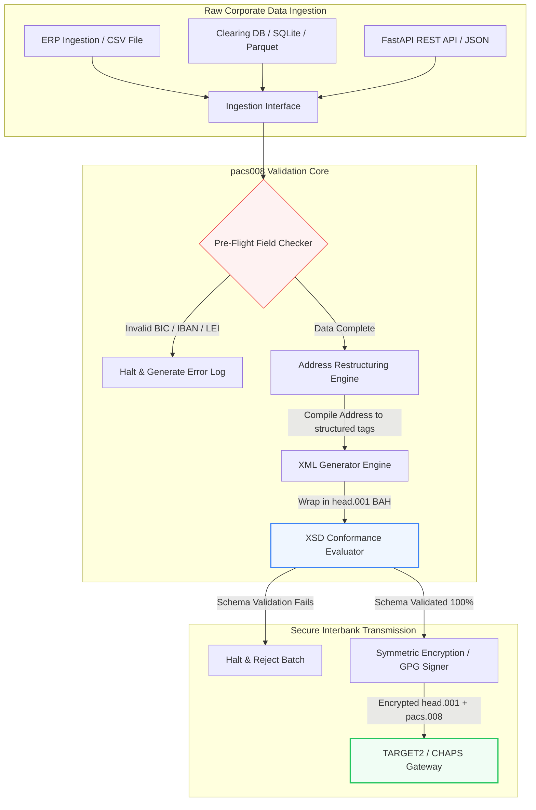

---

# Front Matter (YAML)

author: "contact@sebastienrousseau.com (Sebastien Rousseau)"
banner_alt: "Sesli asistan ve dizüstü bilgisayarla çalışan bir ofis çalışanı — pacs.008 otomasyonunun programlanabilir kıldığı yapılandırılmış, makine tarafından okunabilen bankalararası ödeme mesajlarını simgeliyor"
banner_height: "1597"
banner_width: "2584"
banner: "https://cloudcdn.pro/stocks/images/tyler-prahm-lmV3gJSAgbo.webp"
cdn: "https://cloudcdn.pro"
charset: "UTF-8"
cname: "sebastienrousseau.com"
copyright: "© Copyright 2025 - 2026 - Sebastien Rousseau. All rights reserved."
date: "June 15, 2026"
description: "pacs008, ISO 20022 pacs.008 FI-to-FI müşteri alacak transferlerinin üretimini ve doğrulamasını otomatikleştiren açık kaynaklı bir Python kütüphanesidir — yapılandırılmış adresler, BAH head.001 sarmalama, BIC/LEI/IBAN sağlamaları, OpenTelemetry UETR izleme — Kasım 2026 SWIFT geçişi için tasarlandı."
format-detection: "telephone=no"
hreflang: "tr"
icon: "https://cloudcdn.pro/clients/sebastienrousseau/v1/logos/sebastienrousseau.svg"
id: "https://sebastienrousseau.com/2026-06-15-pacs008-automation-iso-20022-interbank-payments-2026"
image_alt: "Black and White Portrait of Sebastien Rousseau"
image_height: "162"
image_width: "162"
image: "https://cloudcdn.pro/stocks/images/sebastien-rousseau.png"
keywords: "pacs008, ISO 20022 pacs.008, FI-to-FI müşteri alacak transferi, yapılandırılmış adres, SWIFT CBPR+, BAH head.001, TARGET2, CHAPS, Fedwire, DORA, BCBS 239, Basel III, UETR, LEI doğrulama, SEPA VoP"
language: "tr-TR"
last_reviewed: "2026-06-15"
layout: "report"
locale: "tr_TR"
logo_alt: "Logo for Sebastien Rousseau"
logo_height: "44"
logo_width: "44"
logo: "https://cloudcdn.pro/clients/sebastienrousseau/v1/logos/sebastienrousseau.svg"
menu: ""
measurementID: "G-169G4ET5HQ"
name: "Sebastien Rousseau"
permalink: "https://sebastienrousseau.com/2026-06-15-pacs008-automation-iso-20022-interbank-payments-2026"
rating: "general"
referrer: "no-referrer"
robots: "index, follow"
schema: "FAQPage, Article"
seo_title: "ISO 20022 Çağı için pacs.008 Otomasyonu"
short_name: "sebastienrousseau"
subtitle: "pacs.008 mesajı; bankalararası ödeme verisinin, yapılandırılmış adreslerin, uyumun, yönlendirmenin ve mutabakat operasyonlarının buluştuğu yerdir."
tags: "pacs008, ISO 20022, bankalararası ödemeler, toptan ödemeler, Python"
theme-color: "0, 83, 191"
title: "2026'da ISO 20022 Bankalararası Çağı için pacs.008 Otomasyonu İnşa Etmek"
url: "https://sebastienrousseau.com/2026-06-15-pacs008-automation-iso-20022-interbank-payments-2026"
viewport: "width=device-width, initial-scale=1, shrink-to-fit=no"

# RSS - The RSS feed front matter (YAML).
atom_link: "https://sebastienrousseau.com/2026-06-15-pacs008-automation-iso-20022-interbank-payments-2026/rss.xml"
category: "Finance"
docs: https://validator.w3.org/feed/docs/rss2.html
generator: "Static Site Generator (SSG) (version 0.0.26)"
item_description: "pacs008, bankalararası ödemeler çağında ISO 20022 FI-to-FI müşteri alacak transferi mesajlarını otomatikleştirmek için açık kaynaklı bir Python temeli sunar."
item_guid: "https://sebastienrousseau.com/2026-06-15-pacs008-automation-iso-20022-interbank-payments-2026/rss.xml"
item_link: "https://sebastienrousseau.com/2026-06-15-pacs008-automation-iso-20022-interbank-payments-2026/rss.xml"
item_pub_date: "Mon, 15 Jun 2026 06:06:06 +0000"
item_title: "2026'da ISO 20022 Bankalararası Çağı için pacs.008 Otomasyonu İnşa Etmek"
last_build_date: "Mon, 15 Jun 2026 06:06:06 +0000"
managing_editor: "contact@sebastienrousseau.com (Sebastien Rousseau)"
pub_date: "Mon, 15 Jun 2026 06:06:06 +0000"
ttl: "60"
type: "article"
webmaster: "contact@sebastienrousseau.com"

# Apple - The Apple front matter (YAML).
apple_mobile_web_app_orientations: "portrait"
apple_touch_icon_sizes: "192x192"
apple-mobile-web-app-capable: "yes"
apple-mobile-web-app-status-bar-inset: "black"
apple-mobile-web-app-status-bar-style: "black-translucent"
apple-mobile-web-app-title: "ISO 20022 Çağı için pacs.008"
apple-touch-fullscreen: "yes"

# MS Application - The MS Application front matter (YAML).

msapplication-navbutton-color: "0, 83, 191"

# Twitter Card - The Twitter Card front matter (YAML).

twitter_card: "summary_large_image"
twitter_creator: "@wwdseb"
twitter_description: "pacs008, bankalararası ödemeler çağında ISO 20022 FI-to-FI müşteri alacak transferi mesajlarını otomatikleştirmek için açık kaynaklı bir Python temeli sunar."
twitter_image: "https://cloudcdn.pro/clients/sebastienrousseau/v1/logos/sebastienrousseau.svg"
twitter_image_alt: "Logo of Sebastien Rousseau"
twitter_site: "@wwdseb"
twitter_title: "ISO 20022 Çağı için pacs.008 Otomasyonu"
twitter_url: "https://sebastienrousseau.com/2026-06-15-pacs008-automation-iso-20022-interbank-payments-2026"

excerpt: "pacs008, ISO 20022 FI-to-FI müşteri alacak transferi mesajlarını programlanabilir kılan açık kaynaklı bir Python araç setidir — yapılandırılmış adresler, doğrulama, yönlendirme, uyum kancaları ve SWIFT Kasım 2026 son tarihi öntanımlı olarak gömülüdür."

# Humans.txt - The Humans.txt front matter (YAML).
author_website: "https://sebastienrousseau.com"
author_twitter: "@wwdseb"
author_location: "London, UK"
thanks: "Okuduğunuz için teşekkürler!"
site_last_updated: "2026-06-15"
site_standards: "HTML5, CSS3, RSS, Atom, JSON, XML, YAML, Markdown, TOML"
site_components: "Kaishi, Kaishi Builder, Kaishi CLI, Kaishi Templates, Kaishi Themes"
site_software: "Static Site Generator, Rust"

---

# 2026'da Açık Kaynaklı Python ile ISO 20022 pacs.008 Bankalararası Ödemelerini Otomatikleştirme

<!-- lead-start -->
<aside class="post-lead" aria-label="Makale özeti">

<strong>Özet.</strong> SWIFT CBPR+ kılavuzları kapsamında, 14 Kasım 2026 Yapılandırılmış Adres Eşiği; TARGET2, CHAPS, Fedwire, Lynx ve SEPA genelinde yapılandırılmamış posta adreslerini devre dışı bırakır. pacs008, ISO 20022 FI-to-FI müşteri alacak transferi (pacs.008) mesajının üretimini ve doğrulamasını otomatikleştiren, ödemeleri Business Application Header (BAH head.001) içine saran ve yapılandırılmış adres uyumunu mesaj bir takas ağına dokunmadan önce veri yoluna yerleştiren açık kaynaklı bir Python kütüphanesidir.

<strong>Temel çıkarımlar</strong>

<ul class="post-lead-takeaways">
  <li><strong>Yapılandırılmış Adres Son Tarihi mutlaktır.</strong> 14 Kasım 2026'dan sonra yapılandırılmamış adres blokları geri çekilir. pacs008, sınır redlerini engellemek için yapılandırılmış posta adresi öğelerini (<code>&lt;TwnNm&gt;</code>, <code>&lt;Ctry&gt;</code>, <code>&lt;PstCd&gt;</code>) veri derleme aşamasında zorunlu kılar.</li>
  <li><strong>Birleşik mesaj orkestrasyonu.</strong> Çekirdek pacs.008 ödeme yükünü uyumlu bir Business Application Header (head.001) zarfı içine sarar ve standart bir gidiş-dönüş işleme modeli sunar.</li>
  <li><strong>Algoritmik bütünlük.</strong> BIC ve Yasal Kuruluş Tanımlayıcıları (LEI'ler) için ISO 7064 Modulo 97-10 sağlama hesaplamalarını kullanan yerleşik doğrulayıcılar.</li>
  <li><strong>DORA düzeyinde izlenebilirlik.</strong> Gerçek zamanlı denetim günlükleri ve kriptografik denetim imzaları için Uçtan Uca Tekil İşlem Referansı (UETR) üzerinden anahtarlanan tam OpenTelemetry enstrümantasyonu.</li>
  <li><strong>Yönetim kurulu düzeyinde fidüsyer koruma.</strong> Bankalararası mesaj doğruluğunu DORA Madde 5, BCBS 239 raporlaması ve Basel III Operasyonel Risk sermaye tasarruflarıyla hizalar.</li>
</ul>

<strong>İlgili okumalar:</strong> <a href="https://sebastienrousseau.com/2026-05-19-global-wholesale-payments-economics-2026">2026'da Küresel Toptan Ödemeler: ISO 20022, RTGS Yenileme ve Birlikte Çalışabilirlik Ekonomisi</a>, <a href="https://sebastienrousseau.com/2026-05-27-ai-operating-system-payments-fraud-routing-resilience-compliance-2026">Ödemelerin İşletim Sistemi Olarak Yapay Zeka: 2026'da Dolandırıcılık, Yönlendirme, Dayanıklılık ve Uyum</a>, <a href="https://sebastienrousseau.com/2026-05-12-iso-20022-pacs008-structured-address-deadline">Kasım 2026 pacs.008 Yapılandırılmış Adres Son Tarihi: Altı Aylık Görünüm</a>.

</aside>
<!-- lead-end -->

Eski finansal verilerle yapılandırılmış bankalararası mesajlaşma arasındaki boşluğu, denetlenebilir ve şema doğrulamalı bir Python boru hattıyla kapatmak.

Bu makalenin açık kaynaklı referans noktası [pacs008 ⧉](https://github.com/sebastienrousseau/pacs008 "pacs008 — açık kaynaklı Python kütüphanesi"). Depo, ISO 20022 pacs.008 FI-to-FI müşteri alacak transferi XML mesajlarını otomatikleştirmek için bir Python kütüphanesi olarak konumlandırılmıştır.

## Bu Açık Kaynaklı Proje 2026'da Neden Önemli

Küresel bankalararası ödeme takas altyapısı, yarım yüzyıla yakın süredir görülen en derin modernizasyon sürecinden geçiyor.

Haziran 2026'da finansal hizmetler sektörü, **14 Kasım 2026 SWIFT Yapılandırılmış Adres Eşiği**'ne hızla yaklaşıyor. Bu tarihten itibaren SWIFT CBPR+ kılavuzları, TARGET2, CHAPS, Fedwire ve Kanada Lynx ile birlikte, yapılandırılmamış posta adresi satırlarını (`<PstlAdr>` blokları içinde yalnızca `<AdrLine>` kullanan) resmen devre dışı bırakacak. Katılımcı tüm finansal kurumlar adresleri ya hibrit biçimde (yapılandırılmış `<TwnNm>` ve `<Ctry>`, kalan ayrıntılar için en fazla iki `<AdrLine>` öğesi) ya da tamamen yapılandırılmış biçimde (sokak adı, bina numarası ve posta kodu için ayrı öğeler) iletmek zorunda. Bu kriteri karşılayamayan tüm mesajlar ağ sınırında reddedilecek.

Finansal kurumlar için bu geçiş ciddi operasyonel kısıtlar yaratıyor:

1. **Sınır-red cezası.** Yapılandırılmış adres kriterlerini karşılamayan ödemeler anında ağ redleriyle karşılaşacak; işlem gecikmeleri, likidite tıkanıklıkları ve operasyonel birikimler tetiklenecek.
2. **SEPA Alıcı Doğrulama (VoP).** SEPA bölgesindeki tüm Ödeme Hizmeti Sağlayıcılarının (PSP'ler), alacak transferlerini gerçekleştirmeden önce lehtarın adı ile IBAN arasındaki eşleşmeyi doğrulamalarını zorunlu kılar; mesaj başlatma sürecine başka bir doğrulama kapısı ekler.

[pacs008](https://github.com/sebastienrousseau/pacs008) bu sorunu çözer. Ham finansal verilerin tamamen doğrulanmış, şema uyumlu ISO 20022 pacs.008 bankalararası müşteri alacak transferi mesajlarına dönüştürülmesini otomatikleştiren, açık kaynaklı, hafif bir Python kütüphanesidir. Eski-yapılandırılmış veri boşluğunu kapatarak pacs008, yüksek Dayanıklılık Getirisi (RoR) sunar; işletme sermayesini korur ve küresel raylar genelinde gerçek zamanlı yürütmeyi güvence altına alır.

## 2026 pacs008 Mimari Merceği

pacs008 kütüphanesi, ham girdilerin sistematik olarak ayrıştırılmasını, zenginleştirilmesini ve standart zarflar içine sarılmasını sağlayan yalıtılmış bir doğrulama ve üretim motoru olarak yapılandırılmıştır:

| Katman | Tasarım Kararı | Neden Önemli | Yanlış Yönetilirse Risk |
|---|---|---|---|
| **Giriş Katmanı** | CSV, JSON, SQLite ve Parquet yutma | Bankacılık entegrasyon ekiplerine verilerinin halihazırda bulunduğu yerde ulaşır; platform göçlerini engeller. | Ham, doğrulanmamış veya bozuk veri yüklerinin yutulması. |
| **Doğrulama Katmanı** | Resmi XSD şemalarına ve özel iş kurallarına karşı ön doğrulama | Ödeme dosyası takas ağına iletilmeden önce yürütmeyi durdurur ve hataları işaretler. | Anında ağ redlerini ve takas gecikmelerini tetikleyen geçersiz XML dosyaları. |
| **BAH Zarf Katmanı** | Otomatik Business Application Header (head.001) sarma | `<MsgDefIdr>` etiketine dayalı olarak mesaj gönderimi ve yönlendirmesini standartlaştırır. | Gerekli dış zarf olmadan ham pacs.008 yüklerinin iletilmesi; sistem reddine neden olur. |
| **Serileştirme Katmanı** | Standart XML ve ISO uyumlu JSON (TS 23029) desteği | XML ve JSON yükleri arasında doğrudan çeviriyi mümkün kılar; modern REST API ve Kafka akışını destekler. | Resmi ISO kılavuzlarını ihlal eden parçalı veri temsilleri. |
| **Gözlemlenebilirlik Katmanı** | UETR üzerinden anahtarlanan OpenTelemetry izleme | Ayrıntılı yürütme yollarını ve günlükleri yakalar; gerçek zamanlı denetlenebilirlik sağlar. | Operasyonel görünürlüğü ve denetimi engelleyen izleme boşlukları. |

## Temel Bankalararası Sinyaller ve Düzenleyici Dönüm Noktaları

İşlemsel operasyonel dayanıklılığı kanıtlamak için kıdemli teknoloji ve risk yöneticileri belirli, sayısallaştırılabilir uyum göstergelerini izlemek zorundadır:

| Sinyal | Metrik / Operasyonel Karşılaştırma | G20 / SWIFT / DORA Referansı | Teknik Platform Uygulaması |
|---|---|---|---|
| **Yapılandırılmış Adres Uyumu** | Atanmış `<TwnNm>` ve `<Ctry>` ile tamamen yapılandırılmış `<PstlAdr>` alanlarını kullanan pacs.008 mesajlarının yüzdesi. | SWIFT SR 2026 Son Tarihi | Yapılandırılmamış adres satırlarını reddeden pacs008 ön şema kontrolleri. |
| **SEPA Alıcı Doğrulama** | Mesaj yürütmesinden önce lehtarın adı ile IBAN arasında eşleşme doğrulaması. | SEPA VoP Düzenlemesi | IBAN/BIC üzerinde ön doğrulama sorguları yürüten yerleşik VoP yardımcı sınıfları. |
| **BAH head.001 Entegrasyonu** | Business Application Header içine başarıyla sarılan giden ödeme yüklerinin yüzdesi. | TARGET2 / CBPR+ Kılavuzları | Dış XML zarfını otomatik olarak derleyen BAH sarma alt sistemi. |
| **LEI Modulo Sağlaması** | Borçlu ve alacaklı `<LEI>` blokları üzerinde ISO 7064 Modulo 97-10 kontrol basamağı doğrulaması. | Bank of England Zorunluluğu | 20 karakterli tanımlayıcının bütünlüğünü doğrulayan algoritmik denetleyici. |
| **UETR İzleme Doğruluğu** | Üretilen ödemelerin %100'üne geçerli bir Uçtan Uca Tekil İşlem Referansı enjekte edilmesi. | SWIFT UETR Şartnameleri | 36 karakterli UUIDv4 referans kodunun otomatik üretimi ve izlenmesi. |

## Bankalararası Otomasyon için Python Neden İdeal On-Ramp

2026'da modern ödeme merkezleri ve hazine operasyon ekipleri; veri dönüşümü, finansal modelleme ve ERP veritabanı entegrasyonu için Python'a yoğun şekilde bel bağlıyor.

Açık kaynaklı bir Python kütüphanesinden yararlanarak kurumlar önemli avantajlar elde eder:

1. **Düşük bilişsel yük ve yüksek birlikte çalışabilirlik.** Python uyumlu bir köprü işlevi görür. Geliştiricilerin, ham ödeme talimatlarını eski veritabanlarından çeken, karmaşık uluslararası bankacılık kurallarına karşı doğrulayan ve tek, birleşik bir iş akışı içinde uyumlu XML üreten basit betikler yazmasını sağlar.
2. **"Kara kutu" opak çeviricilerin ortadan kaldırılması.** Tescilli bankacılık portalları, özel ödeme dosyası çeviricileri için sıklıkla yüksek lisans ücretleri talep eder. Bu çeviriciler tescilli kara kutulardır; güvenlik ekiplerinin verilerin nasıl işlendiğini veya anahtarların nerede saklandığını denetlemesini imkânsız kılar. pacs008 gibi açık kaynaklı, incelenebilir bir kütüphane kodun tam şeffaflığını sağlar.
3. **Sorunsuz CI/CD entegrasyonu.** pacs008, sürekli entegrasyon ve dağıtım boru hatlarına doğrudan entegre olur; geliştiricilerin ödeme dosyası testini standart yazılım teslim yaşam döngülerinin bir parçası olarak otomatikleştirmesine olanak tanır.

## Sınırları Belirlenmiş Bankalararası Boru Hattı Tasarlamak

Bankalararası takastaki başlıca açıklardan biri "kontrolsüz toplu üretim"dir — net, sınırları belirlenmiş bir doğrulama döngüsü olmadan dosya üretmek. pacs008, sıkı kontrollü, çok aşamalı bir işlem boru hattının içinde temel doğrulama motoru olarak çalışmak üzere tasarlanmıştır.

Aşağıdaki operasyonel akış, ham işlem verilerinin pacs008 boru hattından geçerek kriptografik olarak güvenli, şema uyumlu ve BAH zarfı içinde sarılmış bir pacs.008 dosyası üretmek üzere nasıl ilerlediğini gösterir:

## Yönetim Kurulu Oyun Planı ve Fidüsyer Sorumluluk

Bankalararası ödeme otomasyonu, yönetim kurulu düzeyinde bir risk yönetimi ve kurumsal yönetişim meselesidir. Kıdemli yöneticiler işlem verisi kalitesini fidüsyer sorumluluk ve operasyonel risk azaltma merceğinden ele almak zorundadır:

- **DORA Madde 5 (Yönetim Kurulu Hesap Verebilirliği).** Kurumun ICT operasyonlarının dayanıklılığı ve güvenliği konusunda yönetim kurulu üyelerine doğrudan, kişisel sorumluluk yükler. Bankalararası takas kritik bir kurumsal işlev olduğundan, yönetim kurullarının operasyonel kesintileri veya geciken ödemeleri önlemek için sağlam, doğrulanmış ve otomatikleştirilmiş işlem kontrolleri uyguladıklarını göstermesi gerekir.
- **BCBS 239 (Risk Verisi Toplama ve Raporlama).** Finansal işlem raporlamasının doğru, eksiksiz ve gerçek zamanlı üretilmesini ister. pacs008, ödeme verisinin kaynakta temiz biçimde yapılandırılmasını ve doğrulanmasını sağlayarak kurumların BCBS 239 uyumuna ulaşmasına yardımcı olur; eski elektronik tabloları zedeleyen veri boşluklarını ve manuel mutabakat hatalarını ortadan kaldırır.
- **Operasyonel Risk Sermaye Yüklerinin Azaltılması (Basel III).** Basel III kılavuzları kapsamında yüksek ödeme hata oranları ve manuel müdahale yükü, bankanın operasyonel risk sermaye gereksinimlerini artırır; aksi takdirde kredi veya yatırım için kullanılabilecek sermayeyi bağlar. Ödeme boru hattının otomatikleştirilmesi bu sermaye primlerini doğrudan en aza indirir ve bilanço değerini korur.

## Banka Türüne Göre Bunun Anlamı

### Küresel Sistemik Önemli Bankalar (G-SIB'ler)

G-SIB'ler büyük, sınır ötesi kurumsal işlem hacimlerini yönetir. Birincil zorlukları, takas ağına ulaşmadan önce yapılandırılmamış eski verinin iyileştirilmesidir. pacs008'i kurumsal bankacılık ağ geçitlerine entegre ederek G-SIB'ler, kurumsal müşterilerine otomatik doğrulama araçları sunabilir; manuel ödeme onarımı yükünü azaltır ve SWIFT ağı genelinde gerçek zamanlı yürütmeyi güvence altına alır.

### İşlem ve Kurumsal Bankalar

İşlem bankaları için ödeme verisi kalitesi rekabetçi bir farklılaştırıcıdır. pacs008 gibi açık kaynaklı, incelenebilir bir doğrulama aracını kurumsal hazine müşterilerine sunarak bu bankalar; müşteri kazanımını hızlandırabilir, ödeme dosyası redlerini en aza indirebilir ve üstün doğrudan işleme oranlarıyla müşteri güvenini inşa edebilir.

### Bölgesel ve Daha Küçük Bankalar

Bölgesel bankalar, G-SIB'lerin devasa teknoloji bütçeleri olmadan uluslararası ödeme standartlarıyla uyumu korumak zorundadır. pacs008; hafif, maliyet açısından verimli ve tamamen uyumlu Python tabanlı bir çözüm sunar; daha küçük kurumların pahalı tescilli ara yazılım lisansları olmadan modern, yapılandırılmış ödeme başlatma yetenekleri sunmasını mümkün kılar.

## Sonuç: Bankalararası Takas Yol Haritası

Yaklaşan SWIFT Kasım 2026 yapılandırılmış adres son tarihi, kurumsal hazine operasyonları için sert bir sınır oluşturur. Eski elektronik tablolara, manuel veri girişine ve yapılandırılmamış ödeme dosyalarına bel bağlamak aktif bir iş riskidir.

İşlem sürekliliğini güvence altına almak ve operasyonel yükü en aza indirmek için kıdemli teknoloji ve finans yöneticileri bugün net bir takas yol haritası yürütmelidir:

1. **Doğrulamayı kaynakta zorunlu kılın.** Tüm ödeme talimatlarının, kurumsal ERP sınırlarından ayrılmadan önce resmi ISO 20022 XSD şemalarına göre doğrulandığından ve biçimlendirildiğinden emin olun.
2. **Veri boru hattını denetleyin.** Manuel elektronik tablo işlemeden uzaklaşın ve pacs008 kullanarak otomatik, incelenebilir Python tabanlı iş akışları uygulayın.
3. **Hibrit güvenlik uygulayın.** Üretilen ödeme dosyalarının iletimden önce kriptografik olarak imzalanmasını ve şifrelenmesini sağlayın; sıfır güven ağ beklentilerini karşılayın.
4. **Fidüsyer önceliklerle hizalanın.** Ödeme otomasyonu ve veri kalitesi metriklerini, yatırımı DORA kapsamında kritik bir operasyonel risk azaltma programı olarak çerçeveleyerek yönetim kuruluna resmi olarak raporlayın.

## Sıkça Sorulan Sorular

**pacs008 yaklaşan SWIFT SR 2026 adres kurallarına uyumlu mu?**

Evet. pacs008, SWIFT Kasım 2026 yapılandırılmış adres dönüm noktasını desteklemek üzere tasarlanmıştır; posta adresi öğelerinin (şehir, ülke, posta kodu) atanmış ISO 20022 XML alanlarına zorunlu ayrılmasını uygular.

**pacs008 ödeme yüklerini Business Application Header içine sarabilir mi?**

Evet. pacs008 yerel olarak Business Application Header (BAH head.001) sarmasını desteklediği için TARGET2, CHAPS ve CBPR+ ağlarının gerektirdiği dış zarfı otomatik olarak derler.

**Tescilli dosya çeviricileri yerine neden açık kaynaklı bir kütüphane tercih edilir?**

Tescilli çeviriciler opak kara kutulardır; güvenlik denetimlerini imkânsız kılar. pacs008 gibi açık kaynaklı, hakem tarafından incelenmiş bir kütüphane kodun tam şeffaflığını sunar; güvenlik ekiplerinin işleme sırasında hiçbir hassas ödeme verisinin ifşa edilmediğini doğrulamasına olanak tanır.

**pacs008 hangi tanımlayıcıları doğrular?**

pacs008; Banka Tanımlayıcı Kodları (BIC'ler) ve Yasal Kuruluş Tanımlayıcıları (LEI'ler) için ISO 7064 Modulo 97-10 sağlama hesaplamalarını kullanan yerleşik doğrulayıcılarla, ayrıca IBAN kontrol basamağı doğrulaması ve UETR tekillik kontrolleriyle birlikte gelir.

## Kaynakça

- SWIFT, (2024). *ISO 20022 Kasım 2026 Yapılandırılmış Adres Dönüm Noktası*. La Hulpe: SWIFT. Erişim: [SWIFT ISO 20022 Dönüm Noktası ⧉](https://www.swift.com/standards/iso-20022/iso-20022-bytes/call-action-november-2026 "SWIFT ISO 20022 dönüm noktası").
- Basel Bankacılık Denetim Komitesi (BCBS), (2013). *Etkili risk verisi toplama ve risk raporlama ilkeleri (BCBS 239)*. Basel: Uluslararası Ödemeler Bankası. Erişim: [BCBS 239 İlkeleri ⧉](https://www.bis.org/publ/bcbs239.htm "BCBS 239 ilkeleri").
- Avrupa Parlamentosu ve Avrupa Birliği Konseyi, (2022). *Finansal sektör için dijital operasyonel dayanıklılık hakkında Yönetmelik (AB) 2022/2554 (DORA)*. Brüksel: Avrupa Birliği Resmi Gazetesi. Erişim: [DORA Yönetmeliği ⧉](https://eur-lex.europa.eu/legal-content/EN/TXT/?uri=CELEX%3A32022R2554 "DORA yönetmeliği").
- GitHub, (2026). *pacs008 açık kaynaklı deposu*. Erişim: [pacs008 Deposu ⧉](https://github.com/sebastienrousseau/pacs008 "pacs008 deposu").

<!-- enrich-start -->
<aside class="author-card" aria-label="Yazar hakkında"><strong class="author-card-name"><a href="/about/index.html">Sebastien Rousseau</a></strong>Uygulamalı yapay zeka, ISO 20022 göçü, finansal hizmetler için post-kuantum kriptografi ve toptan ödemelerin yapısal dönüşümü üzerine yazan kıdemli bankacılık teknoloğu.HSBC Ticari ve Yatırım Bankası, PayPal, Barclays, Shazam, AKQA ve Virgin Group'ta 20+ yıl. <a href="/about/index.html">Tam profil</a> &middot; <a href="https://www.linkedin.com/in/sebastienrousseau/" rel="external noopener">LinkedIn</a> &middot; <a href="https://github.com/sebastienrousseau" rel="external noopener">GitHub</a></aside>

Son inceleme <time datetime="2026-06-15">2026-06-15</time>.

<aside class="related-posts" aria-labelledby="related-heading">
<h2 id="related-heading" class="related-heading">İlgili okumalar</h2>

<article class="related-card"><footer class="related-body"><h3><a href="https://sebastienrousseau.com/2026-05-19-global-wholesale-payments-economics-2026">2026'da Küresel Toptan Ödemeler: ISO 20022, RTGS Yenileme ve Birlikte Çalışabilirlik Ekonomisi</a></h3>
<time datetime="2026-05-19">2026-05-19</time>
</footer></article>
<article class="related-card"><footer class="related-body"><h3><a href="https://sebastienrousseau.com/2026-05-27-ai-operating-system-payments-fraud-routing-resilience-compliance-2026">Ödemelerin İşletim Sistemi Olarak Yapay Zeka: 2026'da Dolandırıcılık, Yönlendirme, Dayanıklılık ve Uyum</a></h3>
<time datetime="2026-05-27">2026-05-27</time>
</footer></article>
<article class="related-card"><footer class="related-body"><h3><a href="https://sebastienrousseau.com/2026-05-12-iso-20022-pacs008-structured-address-deadline">Kasım 2026 pacs.008 Yapılandırılmış Adres Son Tarihi: Altı Aylık Görünüm</a></h3>
<time datetime="2026-05-12">2026-05-12</time>
</footer></article>

</aside>
<!-- enrich-end -->
