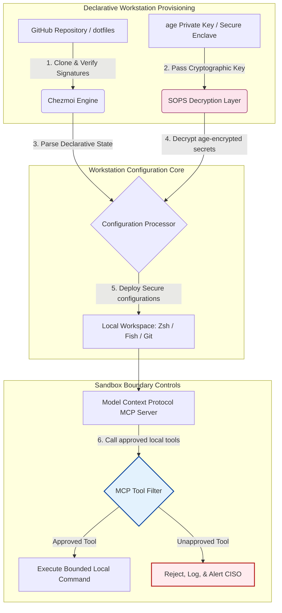

---

# Front Matter (YAML)

author: "contact@sebastienrousseau.com (Sebastien Rousseau)"
banner_alt: "Loş ışıkta geliştirici iş istasyonu — MCP sunucuları, SLSA imzalama, age/SOPS gizli anahtarları ve çoklu shell paritesi için AI farkındalıklı, yeniden üretilebilir ve güvenli dotfiles'ı simgeliyor"
banner_height: "1597"
banner_width: "2584"
banner: "https://cloudcdn.pro/stocks/images/almas-salakhov-Vq2ap8aFFEs.webp"
cdn: "https://cloudcdn.pro"
charset: "UTF-8"
cname: "sebastienrousseau.com"
copyright: "© Copyright 2025 - 2026 - Sebastien Rousseau. All rights reserved."
date: "16 Haziran 2026"
description: "AI farkındalıklı dotfiles, MCP çağı için güvenli ve yeniden üretilebilir bir iş istasyonu modelidir — Chezmoi ile bildirimsel yapılandırma, SOPS/age gizli anahtarları, SLSA Seviye 3 köken kanıtı, çoklu shell paritesi ve yerel AI ajanları için sınırlı sandbox bölgeleri."
format-detection: "telephone=no"
hreflang: "tr"
icon: "https://cloudcdn.pro/clients/sebastienrousseau/v1/logos/sebastienrousseau.svg"
id: "https://sebastienrousseau.com/2026-06-16-ai-aware-dotfiles-secure-reproducible-workstation-2026"
image_alt: "Sebastien Rousseau'nun siyah beyaz portresi"
image_height: "162"
image_width: "162"
image: "https://cloudcdn.pro/stocks/images/sebastienrousseau.webp"
keywords: "dotfiles, Chezmoi, MCP, Model Context Protocol, SLSA, SOPS, age şifreleme, bildirimsel yapılandırma, geliştirici iş istasyonu, DORA Madde 5, NIST CSF 2.0, tedarik zinciri güvenliği, ajansal AI, çoklu shell paritesi, Zsh, Fish, Nushell"
language: "tr-TR"
last_reviewed: "2026-06-16"
layout: "report"
locale: "tr_TR"
logo_alt: "Sebastien Rousseau için logo"
logo_height: "44"
logo_width: "44"
logo: "https://cloudcdn.pro/clients/sebastienrousseau/v1/logos/sebastienrousseau.svg"
menu: ""
measurementID: "G-169G4ET5HQ"
name: "Sebastien Rousseau"
permalink: "https://sebastienrousseau.com/2026-06-16-ai-aware-dotfiles-secure-reproducible-workstation-2026"
rating: "general"
referrer: "no-referrer"
robots: "index, follow"
schema: "FAQPage, Article"
seo_title: "AI Farkındalıklı Dotfiles: Güvenli Geliştirici İş İstasyonu"
short_name: "sebastienrousseau"
subtitle: "Geliştirici iş istasyonu artık AI tedarik zincirinin parçasıdır; dotfiles güvenlik, yeniden üretilebilirlik, gizli anahtar hijyeni ve MCP farkındalıklı iş akışları gerektirir."
tags: "dotfiles, geliştirici araçları, MCP, SLSA, güvenli iş istasyonu, chezmoi, macOS, Linux, WSL"
theme-color: "0, 83, 191"
title: "2026'da AI Farkındalıklı Dotfiles: MCP, SLSA ve Çoklu Shell Paritesi için Güvenli, Yeniden Üretilebilir Geliştirici İş İstasyonu"
url: "https://sebastienrousseau.com/2026-06-16-ai-aware-dotfiles-secure-reproducible-workstation-2026"
viewport: "width=device-width, initial-scale=1, shrink-to-fit=no"

# RSS - The RSS feed front matter (YAML).
atom_link: "https://sebastienrousseau.com/2026-06-16-ai-aware-dotfiles-secure-reproducible-workstation-2026/rss.xml"
category: "Technology"
docs: https://validator.w3.org/feed/docs/rss2.html
generator: "Static Site Generator (SSG) (version 0.0.26)"
item_description: "macOS, Linux ve WSL üzerinde güvenli, yeniden üretilebilir geliştirici iş istasyonları için MCP farkındalığı, SLSA, age, SOPS ve çoklu shell paritesi sunan bildirimsel dotfiles üzerine bir inceleme."
item_guid: "https://sebastienrousseau.com/2026-06-16-ai-aware-dotfiles-secure-reproducible-workstation-2026/rss.xml"
item_link: "https://sebastienrousseau.com/2026-06-16-ai-aware-dotfiles-secure-reproducible-workstation-2026/rss.xml"
item_pub_date: "Tue, 16 Jun 2026 06:06:06 +0000"
item_title: "2026'da AI Farkındalıklı Dotfiles: MCP, SLSA ve Çoklu Shell Paritesi için Güvenli, Yeniden Üretilebilir Geliştirici İş İstasyonu"
last_build_date: "Tue, 16 Jun 2026 06:06:06 +0000"
managing_editor: "contact@sebastienrousseau.com (Sebastien Rousseau)"
pub_date: "Tue, 16 Jun 2026 06:06:06 +0000"
ttl: "60"
type: "article"
webmaster: "contact@sebastienrousseau.com"

# Apple - The Apple front matter (YAML).
apple_mobile_web_app_orientations: "portrait"
apple_touch_icon_sizes: "192x192"
apple-mobile-web-app-capable: "yes"
apple-mobile-web-app-status-bar-inset: "black"
apple-mobile-web-app-status-bar-style: "black-translucent"
apple-mobile-web-app-title: "Güvenli İş İstasyonu için AI Dotfiles"
apple-touch-fullscreen: "yes"

# MS Application - The MS Application front matter (YAML).

msapplication-navbutton-color: "0, 83, 191"

# Twitter Card - The Twitter Card front matter (YAML).

twitter_card: "summary_large_image"
twitter_creator: "@wwdseb"
twitter_description: "macOS, Linux ve WSL üzerinde güvenli, yeniden üretilebilir geliştirici iş istasyonları için MCP farkındalığı, SLSA, age, SOPS ve çoklu shell paritesi sunan bildirimsel dotfiles üzerine bir inceleme."
twitter_image: "https://cloudcdn.pro/clients/sebastienrousseau/v1/logos/sebastienrousseau.svg"
twitter_image_alt: "Sebastien Rousseau logosu"
twitter_site: "@wwdseb"
twitter_title: "Güvenli Geliştirici İş İstasyonu için AI Farkındalıklı Dotfiles"
twitter_url: "https://sebastienrousseau.com/2026-06-16-ai-aware-dotfiles-secure-reproducible-workstation-2026"

excerpt: "2026'da AI farkındalıklı dotfiles, geliştirici iş istasyonunu tedarik zinciri altyapısı olarak ele alır — MCP farkındalığı, SLSA imzalı sürümler, age/SOPS gizli anahtarları, saniyenin altında başlangıç ve macOS/Linux/WSL paritesi ile bildirimsel, chezmoi tarafından yönetilen yapılandırma."

# Humans.txt - The Humans.txt front matter (YAML).
author_website: "https://sebastienrousseau.com"
author_twitter: "@wwdseb"
author_location: "London, UK"
thanks: "Okuduğunuz için teşekkürler!"
site_last_updated: "2026-06-16"
site_standards: "HTML5, CSS3, RSS, Atom, JSON, XML, YAML, Markdown, TOML"
site_components: "Kaishi, Kaishi Builder, Kaishi CLI, Kaishi Templates, Kaishi Themes"
site_software: "Static Site Generator, Rust"

---

# 2026'da AI Farkındalıklı Dotfiles: MCP, SLSA ve Çoklu Shell Paritesi için Güvenli, Yeniden Üretilebilir Geliştirici İş İstasyonu

<!-- lead-start -->
<aside class="post-lead" aria-label="Makale özeti">

<strong>Özet.</strong> Geliştirici iş istasyonu artık yalnızca bir uç nokta değildir; yazılım tedarik zincirinin aktif bir katılımcısı ve yerel AI kontrol düzleminin doğrudan arayüzüdür. Terminal tabanlı AI asistanları ve <a href="https://modelcontextprotocol.io">Model Context Protocol (MCP)</a> sunucuları yerel shell komutlarını çalıştırır, depoları inceler ve hassas yapılandırma dosyalarını doğrudan okur. <a href="https://github.com/sebastienrousseau/dotfiles">Sebastien Rousseau's Dotfiles</a>, macOS, Linux ve Windows Subsystem for Linux (WSL) üzerinde güvenli, yeniden üretilebilir iş istasyonları kuran bildirimsel, açık kaynak bir çerçevedir — <a href="https://www.chezmoi.io/">Chezmoi</a>, <a href="https://github.com/getsops/sops">SOPS, age</a> ve SLSA Seviye 3 derleme köken kanıtını entegre ederek bellek güvenli gizli anahtar izolasyonu ve yerel AI modelleri için sınırlı yürütme yolları sağlar.

<strong>Temel çıkarımlar</strong>

<ul class="post-lead-takeaways">
  <li><strong>İş istasyonları tedarik zinciri altyapısıdır.</strong> Geliştirici ortam yapılandırmaları, üretim sunucu dağıtımlarıyla aynı bildirimsel titizlikle ele alınmalı ve manuel yapılandırma kayması ortadan kaldırılmalıdır.</li>
  <li><strong>AI kontrol düzlemi sorunu.</strong> Terminal tabanlı AI modelleri ve MCP araçları yerel dizinlere erişebilir. Dotfiles, veri sızıntısını önlemek için sınırlı sandbox bölgelerini, katı araç izin listelerini ve değiştirilemez yerel günlükleri zorunlu kılmalıdır.</li>
  <li><strong>Mutlak platformlar arası parite.</strong> macOS, Linux (Zsh, Fish, Nushell) ve WSL genelinde özdeş, saniyenin altında shell performansı ve güvenlik profilleri; geliştirici onboarding süresini haftalardan dakikalara indirir.</li>
  <li><strong>Kriptografik olarak güvenli gizli anahtar izolasyonu.</strong> SOPS ve age dosya şifrelemesi, sabit kodlanmış kimlik bilgilerinin (GitHub belirteçleri, bulut erişim anahtarları) Git'e işlenmesini veya yerel LLM'ler tarafından okunmasını engeller.</li>
  <li><strong>Yönetim kurulu düzeyinde mali sorumluluk değeri.</strong> İş istasyonu yapılandırma uyumluluğunu açık yönetim kurulu önceliklerine dönüştürür; DORA Madde 5, NIST CSF 2.0 uç nokta standartları ve Basel III Operasyonel Risk azaltımını destekler.</li>
</ul>

<strong>İlgili okumalar:</strong> <a href="https://sebastienrousseau.com/2026-05-23-agentic-payments-banking-consent-liability-new-payment-ux-2026">Bankacılıkta Ajansal Ödemeler: 2026'da Onay, Sorumluluk ve Yeni Ödeme UX</a>, <a href="https://sebastienrousseau.com/2024-03-12-revolutionising-real-time-speech-recognition-on-macos-with-openai-whisper/index.html">macOS Üzerinde Hızlı Gerçek Zamanlı Konuşma Tanıma: OpenAI Whisper</a>, <a href="https://sebastienrousseau.com/2024-02-26-google-gemma-ai-transforming-open-source-ai-development/index.html">Google Gemma AI: Açık Kaynak AI Geliştirmeyi Dönüştürmek</a>.

</aside>
<!-- lead-end -->

Yerel AI modelleri ve ajansal geliştirici araçları çağında, bildirimsel iş istasyonu yapılandırması ile güvenli yazılım tedarik zincirleri arasındaki boşluğu kapatmak.

Bu makalenin açık kaynak referans noktası [dotfiles ⧉](https://github.com/sebastienrousseau/dotfiles "dotfiles — bildirimsel iş istasyonu yapılandırması") deposudur. Depo şu şekilde konumlanmıştır: macOS, Linux ve WSL için bildirimsel dotfiles; çoklu shell paritesi, saniyenin altında başlangıç, SLSA imzalı sürümler ve AI/MCP farkındalıklı yapılandırma sunar.

## Bu Açık Kaynak Projesinin 2026'da Neden Önemli Olduğu

Haziran 2026'da geliştirici iş istasyonu, yazılım tedarik zincirinin en zayıf halkasıdır ve sofistike devlet destekli ile suç odaklı siber sendikalar için yüksek değerli bir hedeftir.

Geliştirme ortamının güvenlik koşulları, terminal tabanlı AI kodlama asistanlarının (Claude Code gibi) yükselişi ve Model Context Protocol (MCP) benimsenmesiyle köklü biçimde değişti. Yerel geliştirici terminalleri artık şunları yapabilen aktif, otonom AI ajanlarını barındırıyor:

- Yerel kaynak dosyalarını okuma ve düzenleme.
- Yerel CLI araçlarını çağırma (`git`, `npm`, `aws`, `kubectl`).
- Shell ortam değişkenlerini, yerel veritabanlarını ve yapılandırma ayarlarını inceleme.

Geliştiricinin yerel ortamı katı sınırlardan yoksunsa, bu otonom AI araçları yanlışlıkla hassas kişisel verileri okuyabilir, bulut kimlik bilgilerini herkese açık LLM API'lerine sızdırabilir veya otomatik derlemeler sırasında kötü amaçlı paketleri çalıştırabilir.

Dijital Operasyonel Dayanıklılık Yasası (DORA) ve NIST Siber Güvenlik Çerçevesi (CSF) 2.0 kapsamında, finansal kurumlar yazılım tedarik zincirine erişen her cihazın kökenini ve güvenlik bütünlüğünü doğrulamakla yasal olarak yükümlüdür. "Kar tanesi dizüstü bilgisayarlar" — manuel olarak yapılandırılmış, denetlenmemiş, kayan yapılandırmalar — artık küresel bankacılık standartlarıyla uyumlu değildir.

[Sebastien Rousseau's Dotfiles](https://github.com/sebastienrousseau/dotfiles) bu sorunu çözer. Güvenli, yeniden üretilebilir geliştirici iş istasyonları kuran bildirimsel, açık kaynak bir iş istasyonu yönetim çerçevesidir. Standartlaştırılmış, denetlenebilir bir yapılandırma temeli uygulayan proje, yüksek Dayanıklılık Getirisi (Return on Resilience, RoR) sağlar; geliştirici onboarding süresini haftalardan saatlere indirir ve hassas finansal tedarik zincirlerini uç nokta zafiyetlerinden korur.

## AI Farkındalıklı İş İstasyonu 2026 Mimari Merceği

Dotfiles çerçevesi güvenli, bildirimsel bir ortam yöneticisi olarak çalışır — tüm yerel shell'ler, araçlar ve gizli anahtarlar sistematik biçimde yönetilir, denetlenir ve izole edilir:

| Katman | Tasarım Kararı | Neden Önemli | Yanlış Yönetilirse Risk |
|---|---|---|---|
| **Sağlama Katmanı** | Chezmoi ile bildirimsel yapılandırma yönetimi | macOS, Linux ve WSL üzerinde tamamen yeniden üretilebilir iş istasyonları kurar ve kaymayı ortadan kaldırır. | Denetlenmemiş, zafiyetli yerel durumlara sahip kar tanesi yapılandırmaları. |
| **Shell Katmanı** | Çoklu shell paritesi (Zsh, Fish, Nushell) | Farklı ortamlarda özdeş, saniyenin altında başlangıç ve tutarlı takma ad davranışları sağlar. | Beklenmedik komut dosyası sonuçlarına yol açan shell komut tutarsızlıkları. |
| **Gizli Anahtar Katmanı** | SOPS ve age ile dosya şifreleme | Sabit kodlanmış kimlik bilgileri ile ham anahtarların Git'e işlenmesini veya yerel LLM'lere maruz kalmasını engeller. | Herkese açık depo geçmişlerine sızan ya da yerel ajanlar tarafından ele geçirilen kimlik bilgileri. |
| **AI/MCP Katmanı** | Model Context Protocol bölge kontrolleri | Yerel AI ajanlarını onaylı araçların belirli bir listesine kısıtlar ve tüm yerel yürütmeleri günlükler. | Yerel olarak başıboş veya yıkıcı komutlar çalıştıran sınırsız AI ajanları. |
| **Tedarik Zinciri Katmanı** | SLSA imzalı sürümler ve Sigstore doğrulaması | Önyükleme komut dosyalarının ve yapılandırma dosyalarının özgünlüğünü kriptografik olarak kanıtlar. | Geliştirici ortamlarına kötü amaçlı arka kapılar enjekte eden ele geçirilmiş kurulum komut dosyaları. |

## Temel İş İstasyonu Güvenliği ve Otomasyon Sinyalleri

Geliştirme alanı genelinde mutlak güvenliği sürdürmek için Bilgi Güvenliği Baş Sorumluları (CISO'lar) ve teknoloji yöneticileri belirli, ölçülebilir operasyonel göstergeleri izlemelidir:

| Sinyal | Metrik / Operasyonel Eşik | NIST CSF / DORA Referansı | Teknik Platform Uygulaması |
|---|---|---|---|
| **İş İstasyonu Yeniden Üretilebilirliği** | Yapılandırma kayması olmadan bildirimsel dotfile depoları aracılığıyla tamamen yönetilen geliştirici dizüstü bilgisayarlarının yüzdesi. | NIST CSF 2.0 (PR.DS-01) | Terminal başlangıcında otomatik olarak çalıştırılan Chezmoi kayma tespit denetimleri. |
| **Kimlik Bilgisi Hijyeni** | Yerel yapılandırma dosyaları genelinde düz metin olarak depolanan sıfır şifrelenmemiş gizli anahtar veya anahtar. | DORA Madde 6 (BİT Güvenliği) | Şifrelenmemiş dosyaları reddeden Git ön-işleme kancaları ve yerel taramalar. |
| **Derleme Köken Kanıtı** | İş istasyonu önyükleme araçlarının %100'ü kriptografik olarak imzalı manifestolarla doğrulanır. | DORA Madde 30 (Tedarik Zinciri) | Kurulum işlem hatlarına gömülü Sigstore ve SLSA Seviye 3 doğrulaması. |
| **Geliştirici Onboarding Süresi** | Ham donanım sağlamadan tamamen yapılandırılmış, uyumlu geliştirme çalışma alanına kadar geçen süre. | Dayanıklılık Getirisi (RoR) | Ortamı 15 dakikanın altında derleyen otomatik, bildirimsel kurulum komut dosyaları. |
| **Sınırlı AI Ajan Erişimi** | Yerel AI araçlarının salt okunur varsayılanlarla tanımlı dizin sınırları içinde çalıştığının doğrulanması. | Model Risk Yönetimi | Ajan araç kataloglarını onaylı işlemlere kısıtlayan MCP yapılandırma profilleri. |

## Bildirimsel Yapılandırmanın İş İstasyonu Güvenliğinin Çekirdeği Olmasının Nedeni

Geliştirici iş istasyonu kurulumuna yönelik geleneksel yaklaşımlar yoğun biçimde manueldir ve sonuç "kar tanesi dizüstü bilgisayarlar"dır — geliştiriciler özel araçlar yükledikçe, değişkenleri ayarladıkça ve yerel komut dosyalarını değiştirdikçe yapılandırmaların zamanla kaydığı ortamlar. Bu kayma birkaç kritik zafiyet doğurur:

1. **İzlenmeyen gölge yapılandırmalar.** Kayan dizüstü bilgisayarlar genellikle güncel olmayan, zafiyetli yazılım paketleri veya kurumsal güvenlik araçlarını atlatan yerel komut dosyaları çalıştırır.
2. **Gizli anahtar sızıntısı.** Geliştiriciler API anahtarlarını, GitHub belirteçlerini veya AWS kimlik bilgilerini sıklıkla doğrudan düz metin komut dosyalarına ya da shell profillerine sabit kodlar; bu da hırsızlığa karşı yüksek savunmasızlık yaratır.
3. **Verimsiz onboarding.** Yeni bir geliştirici iş istasyonunu manuel olarak kurmak iki haftaya kadar mühendislik süresi alabilir ve ekip hızını olumsuz etkiler.

Chezmoi ile bildirimsel, model güdümlü bir yapılandırmaya geçildiğinde, tüm geliştirici çalışma alanı sürüm kontrollü, yeniden üretilebilir bir kayıt sistemi haline gelir. Her değişiklik, takma ad, paket bağımlılığı ve güvenlik varsayılanı Git'te belgelenir, kurumsal uyumluluk politikalarına göre doğrulanır ve fiziksel dizüstü bilgisayara uygulanmadan önce kriptografik olarak doğrulanır.

## Sınırlı bir AI Geliştirici Ortamı Tasarlamak

Yerel AI ajanlarının ve MCP araçlarının yerel varlıklara sınırsız erişim kazanmasını önlemek için iş istasyonu, sınırlı bir yürütme düzlemi olarak çalışmalıdır.

Aşağıdaki operasyonel akış, dotfiles çerçevesinin yerel AI ajanlarının MCP araçlarını çağırması için izole, sandbox uygulanmış bir yürütme bölgesi sürdürürken güvenli dotfiles'ı çözmek ve dağıtmak üzere Chezmoi, SOPS ve age'i nasıl koordine ettiğini gösterir:

## Yönetim Kurulu Kitabı ve Mali Sorumluluk

Geliştirici iş istasyonu güvenliği ve tedarik zinciri bütünlüğü kritik yönetim kurulu öncelikleridir. Üst düzey yöneticiler, geliştirici ortam riskini mali sorumluluk, düzenleyici uyum ve iş değeri koruma mercekleriyle ele almalıdır:

- **DORA Madde 5 (Yönetim Kurulu Hesap Verebilirliği).** Yönetim organının (yönetim kurulu) kurumun BİT risk yönetiminden nihai olarak sorumlu olduğunu hükme bağlar. Geliştirici iş istasyonları yazılım tedarik zincirinin giriş kapısı olduğundan, yönetim kurulu üyeleri uç noktaların güvenli, tamamen denetlenebilir ve düzenleyici denetimleri karşılayacak şekilde katı, yeniden üretilebilir yapılandırma çerçeveleri altında yönetildiğini doğrulamalıdır.
- **NIST CSF 2.0 Uyumluluğu (Uç Nokta Güvenliği).** Yalnızca yetkili ve doğrulanmış cihazların, standartlaştırılmış ve güvenli yapılandırmalarla çalışarak kurumsal ağlara ve depolara erişebileceğini şart koşar. Bildirimsel dotfiles, güvenlik ekiplerinin tüm geliştirici ortamlarının kurumun güvenlik temeliyle uyumlu olduğunu matematiksel olarak kanıtlamasına olanak tanır; bu da denetlenmemiş "kar tanesi" kurulumların riskini ortadan kaldırır.
- **Bilanço Değerinin Korunması.** Tek bir ele geçirilmiş geliştirici kimlik bilgisi veya tedarik zinciri ihlali, bir kuruma onarım, düzenleyici cezalar ve itibar hasarı açısından milyonlarca dolara mal olabilir. Güvenli, bildirimsel bir geliştirici ortamına geçmek bu riski doğrudan en aza indirir; bilanço değerini korur ve müşteri güvenini güvenceye alır.

## Bunun Banka Türüne Göre Anlamı

### Küresel Sistemik Açıdan Önemli Bankalar (G-SIB'ler)

G-SIB'ler birden çok kıta ve düzenleyici yargı bölgesi genelinde binlerce geliştirici iş istasyonunu yönetir. Birincil zorlukları, büyük mühendislik ekipleri genelinde yapılandırma tutarlılığını sürdürmek ve kimlik bilgisi sızıntısını önlemektir. Chezmoi kullanan bildirimsel, açık kaynak bir dotfiles modelini benimseyerek G-SIB'ler uç nokta güvenliğini standartlaştırabilir, uyumluluk denetimini otomatikleştirebilir ve küresel organizasyon genelinde geliştirici onboarding sürelerini haftalardan dakikalara indirebilir.

### İşlem ve Kurumsal Bankalar

İşlem bankaları hassas ödeme ağ geçitlerini ve toptan takas altyapılarını işletir. Bu üretim ortamlarına dağıtılan kodun mutlak bütünlüğünü kanıtlamak, pazarlığa kapalı bir düzenleyici zorunluluktur. Geliştirici iş istasyonlarını güvenli, SLSA uyumlu bir dotfiles çerçevesi altında standartlaştırmak, yazılım tedarik zincirinin tamamen denetlendiğini ve yerel geliştirici uç noktası zafiyetlerinden korunduğunu garanti eder.

### Bölgesel ve Daha Küçük Bankalar

Bölgesel bankalar, G-SIB'lerin devasa güvenlik bütçelerine sahip olmadan yüksek siber güvenlik standartlarını sürdürmek zorundadır. Bu açık kaynak dotfiles çerçevesi hafif, maliyet etkin ve son derece güvenli, Python ve Rust dostu bir çözüm sunar; daha küçük kurumların pahalı tescilli yazılım lisansları olmadan kurumsal düzeyde uç nokta güvenliği ve tedarik zinciri koruması uygulamasına olanak tanır.

## Sonuç: Geliştirici İş İstasyonu Yol Haritası

Geliştirici iş istasyonu artık çevresel bir cihaz değildir; yazılım tedarik zincirinde kritik bir kontrol düzlemidir. Manuel yapılandırılmış, denetlenmemiş "kar tanesi dizüstü bilgisayarların" kurumsal varlıklara erişmesine izin vermek ciddi bir operasyonel ve düzenleyici risktir.

Yazılım tedarik zincirini güvenceye almak ve uç noktaları yerel AI ajanı zafiyetlerinden korumak için üst düzey teknoloji ve güvenlik yöneticileri bugün net bir geliştirme yol haritası uygulamalıdır:

1. **Bildirimsel sağlamayı zorunlu kılın.** Manuel, belge güdümlü kurulum süreçlerini aşamalı olarak kaldırın ve tüm geliştirici ortamlarının Chezmoi kullanılarak bildirimsel olarak sağlanmasını zorunlu kılın.
2. **Gizli anahtar hijyenini uygulayın.** Yerel iş istasyonu yapılandırmaları genelinde sıfır ham kimlik bilgisi, anahtar veya API belirtecinin düz metin olarak saklanmasını sağlamak için katı ön-işleme kancaları ve tarama araçları uygulayın.
3. **AI sandbox bölgeleri kurun.** Yerel AI kodlama asistanlarını ve ajanlarını onaylı, salt okunur araçlara ve dizinlere kısıtlamak için güvenli, sınırlı MCP yapılandırma profilleri uygulayın.
4. **Tedarik zincirini güvenceye alın.** Tüm önyükleme komut dosyalarının ve ortam yapılandırmalarının dağıtımdan önce SLSA Seviye 3 köken kanıtı kullanılarak kriptografik olarak doğrulandığından emin olun.

## Sıkça Sorulan Sorular

**Chezmoi nedir ve neden dotfiles için kullanılır?**

Chezmoi, açık kaynak, güvenli, bildirimsel bir dotfile yöneticisidir. Geliştiricilerin yerel yapılandırmalarını sürüm kontrollü bir depo olarak yönetmesine olanak tanır; farklı işletim sistemleri (macOS, Linux, WSL) genelinde mutlak tutarlılık ve yeniden üretilebilirlik sağlar.

**Çerçeve gizli anahtarları nasıl korur?**

Çerçeve, hassas kimlik bilgilerini (GitHub belirteçleri veya bulut erişim anahtarları gibi) doğrudan dotfile deposu içinde şifrelemek için SOPS (Secrets Operations) ve age dosya şifrelemesini kullanır. Bu, anahtarların düz metin olarak işlenmesini veya yetkisiz yerel AI ajanları tarafından okunmasını engeller.

**Model Context Protocol (MCP) nedir ve güvenliği nasıl etkiler?**

MCP, AI modellerinin yerel araçları güvenli biçimde çalıştırmasına ve dosyalara erişmesine olanak tanıyan açık bir standarttır. Dotfiles çerçevesi, yerel AI araçlarını ve ajanlarını onaylı dizinler ve komutlarla kısıtlamak için katı MCP yapılandırma dosyaları uygular.

**Çerçeve hangi shell'leri destekler?**

Bash, Zsh, Fish, Nushell ve PowerShell — macOS, Linux ve WSL genelinde paritesiyle, bir geliştirici hangi terminali açarsa açsın komut davranışı özdeş kalır.

## Kaynakça

- Open Source Security Foundation (OpenSSF), (2024). *Supply-chain Levels for Software Artifacts (SLSA)*. Erişim adresi: [SLSA Çerçevesi ⧉](https://slsa.dev/ "SLSA çerçevesi").
- NIST, (2024). *NIST Cybersecurity Framework 2.0*. Gaithersburg: National Institute of Standards and Technology. Erişim adresi: [NIST CSF 2.0 ⧉](https://www.nist.gov/cyberframework "NIST Siber Güvenlik Çerçevesi 2.0").
- European Parliament and Council of the European Union, (2022). *Regulation (EU) 2022/2554 on digital operational resilience for the financial sector (DORA)*. Brussels: Official Journal of the European Union. Erişim adresi: [DORA Düzenlemesi ⧉](https://eur-lex.europa.eu/legal-content/EN/TXT/?uri=CELEX%3A32022R2554 "DORA düzenlemesi").
- GitHub, (2026). *dotfiles açık kaynak deposu*. Erişim adresi: [dotfiles Deposu ⧉](https://github.com/sebastienrousseau/dotfiles "dotfiles deposu").

<!-- enrich-start -->
<aside class="author-card" aria-label="Yazar hakkında"><strong class="author-card-name"><a href="/about/index.html">Sebastien Rousseau</a></strong>Uygulamalı AI, ISO 20022 göçü, finansal hizmetler için post-kuantum kriptografi ve toptan ödemelerin yapısal dönüşümü üzerine yazan kıdemli bankacılık teknoloğu.HSBC Ticari ve Yatırım Bankacılığı, PayPal, Barclays, Shazam, AKQA, Virgin Group'ta 20+ yıl. <a href="/about/index.html">Tam profil</a> &middot; <a href="https://www.linkedin.com/in/sebastienrousseau/" rel="external noopener">LinkedIn</a> &middot; <a href="https://github.com/sebastienrousseau" rel="external noopener">GitHub</a></aside>

Son inceleme <time datetime="2026-06-16">2026-06-16</time>.

<aside class="related-posts" aria-labelledby="related-heading">
<h2 id="related-heading" class="related-heading">İlgili okumalar</h2>

<article class="related-card"><footer class="related-body"><h3><a href="https://sebastienrousseau.com/2026-05-23-agentic-payments-banking-consent-liability-new-payment-ux-2026">Bankacılıkta Ajansal Ödemeler: 2026'da Onay, Sorumluluk ve Yeni Ödeme UX</a></h3>
<time datetime="2026-05-23">2026-05-23</time>
</footer></article>
<article class="related-card"><footer class="related-body"><h3><a href="https://sebastienrousseau.com/2024-03-12-revolutionising-real-time-speech-recognition-on-macos-with-openai-whisper/index.html">macOS Üzerinde Hızlı Gerçek Zamanlı Konuşma Tanıma: OpenAI Whisper</a></h3>
<time datetime="2024-03-12">2024-03-12</time>
</footer></article>
<article class="related-card"><footer class="related-body"><h3><a href="https://sebastienrousseau.com/2024-02-26-google-gemma-ai-transforming-open-source-ai-development/index.html">Google Gemma AI: Açık Kaynak AI Geliştirmeyi Dönüştürmek</a></h3>
<time datetime="2024-02-26">2024-02-26</time>
</footer></article>

</aside>
<!-- enrich-end -->
