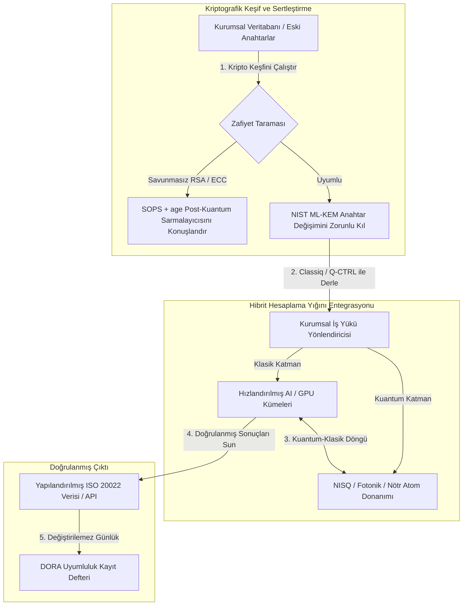

---

# Front Matter (YAML)

author: "contact@sebastienrousseau.com (Sebastien Rousseau)"
banner_alt: "Londra'daki Economist Impact 5. Yıllık Commercialising Quantum Global 2026 zirvesinden sahne görüntüsü — kuantum teknolojisinin fizik araştırmasından kurumsal hazır iş akışlarına geçişini simgeliyor"
banner_height: "1597"
banner_width: "2584"
banner: "https://cloudcdn.pro/stocks/images/sebastien-rousseau-20260617-5th-commercialising-quantum-2.webp"
cdn: "https://cloudcdn.pro"
charset: "UTF-8"
cname: "sebastienrousseau.com"
copyright: "© Copyright 2025 - 2026 - Sebastien Rousseau. All rights reserved."
date: "June 17, 2026"
description: "Economist Impact 5. Yıllık Commercialising Quantum Global 2026 zirvesinden yönetim kurulu çıkarımları — 1,3 milyar dolarlık finansman dalgası, pişman olunmayacak hibrit yığınlar, post-kuantum kriptografi göçünün aciliyeti, kuantum algılamanın ticarileştirilmesi ve HSBC'nin beklemenin zorlanmamış bir hata olduğu yönündeki direktifi."
format-detection: "telephone=no"
hreflang: "tr"
icon: "https://cloudcdn.pro/clients/sebastienrousseau/v1/logos/sebastienrousseau.svg"
id: "https://sebastienrousseau.com/2026-06-17-economist-commercialising-quantum-summit-2026"
image_alt: "Sebastien Rousseau'nun siyah beyaz portresi"
image_height: "162"
image_width: "162"
image: "https://cloudcdn.pro/stocks/images/sebastienrousseau.webp"
keywords: "Commercialising Quantum Global 2026, Economist Impact zirvesi, post-kuantum kriptografi, NIST ML-KEM, şimdi topla sonra çöz, SNDL, HSBC kuantum, Philip Intallura, kuantum algılama, GPS bağımsız navigasyon, NQCC, AB Kuantum Yasası, Quantcore, qBIG ödülü, Lord Vallance, hibrit kuantum-klasik, DORA Madde 6"
language: "tr-TR"
last_reviewed: "2026-06-17"
layout: "report"
locale: "tr_TR"
logo_alt: "Sebastien Rousseau için logo"
logo_height: "44"
logo_width: "44"
logo: "https://cloudcdn.pro/clients/sebastienrousseau/v1/logos/sebastienrousseau.svg"
menu: ""
measurementID: "G-169G4ET5HQ"
name: "Sebastien Rousseau"
permalink: "https://sebastienrousseau.com/2026-06-17-economist-commercialising-quantum-summit-2026"
rating: "general"
referrer: "no-referrer"
robots: "index, follow"
schema: "FAQPage, Article"
seo_title: "Commercialising Quantum 2026: Yönetim Kurulu Çıkarımları"
short_name: "sebastienrousseau"
subtitle: "Kuantum, spekülatif laboratuvar biliminden hibrit kurumsal iş akışlarına geçti; yönetim kurulu 2026'da 1,3 milyar dolarlık finansmana, derhal post-kuantum göçüne ve HSBC'nin beklemeyi bırakma direktifine yanıt vermek zorunda."
tags: "kuantum, post-kuantum kriptografi, NIST ML-KEM, şimdi topla sonra çöz, kuantum algılama, HSBC, Economist Impact, hibrit hesaplama, DORA, AB Kuantum Yasası, NQCC, zirve çıkarımları"
theme-color: "0, 83, 191"
title: "Kübitlerden Kâra: Economist'in 5. Yıllık Commercialising Quantum Global 2026 Zirvesinden Stratejik Çıkarımlar"
url: "https://sebastienrousseau.com/2026-06-17-economist-commercialising-quantum-summit-2026"
viewport: "width=device-width, initial-scale=1, shrink-to-fit=no"

# RSS - The RSS feed front matter (YAML).
atom_link: "https://sebastienrousseau.com/2026-06-17-economist-commercialising-quantum-summit-2026/rss.xml"
category: "Technology"
docs: https://validator.w3.org/feed/docs/rss2.html
generator: "Static Site Generator (SSG) (version 0.0.26)"
item_description: "Economist Impact 5. Yıllık Commercialising Quantum Global 2026 zirvesinden yönetim kurulu çıkarımları — 1,3 milyar dolarlık finansman dalgası, pişman olunmayacak hibrit yığınlar, post-kuantum kriptografi göçünün aciliyeti, kuantum algılamanın ticarileştirilmesi ve HSBC'nin beklemenin zorlanmamış bir hata olduğu yönündeki direktifi."
item_guid: "https://sebastienrousseau.com/2026-06-17-economist-commercialising-quantum-summit-2026/rss.xml"
item_link: "https://sebastienrousseau.com/2026-06-17-economist-commercialising-quantum-summit-2026/rss.xml"
item_pub_date: "Wed, 17 Jun 2026 06:06:06 +0000"
item_title: "Kübitlerden Kâra: Economist'in 5. Yıllık Commercialising Quantum Global 2026 Zirvesinden Stratejik Çıkarımlar"
last_build_date: "Wed, 17 Jun 2026 06:06:06 +0000"
managing_editor: "contact@sebastienrousseau.com (Sebastien Rousseau)"
pub_date: "Wed, 17 Jun 2026 06:06:06 +0000"
ttl: "60"
type: "article"
webmaster: "contact@sebastienrousseau.com"

# Apple - The Apple front matter (YAML).
apple_mobile_web_app_orientations: "portrait"
apple_touch_icon_sizes: "192x192"
apple-mobile-web-app-capable: "yes"
apple-mobile-web-app-status-bar-inset: "black"
apple-mobile-web-app-status-bar-style: "black-translucent"
apple-mobile-web-app-title: "Commercialising Quantum 2026: Yönetim Kurulu Çıkarımları"
apple-touch-fullscreen: "yes"

# MS Application - The MS Application front matter (YAML).

msapplication-navbutton-color: "0, 83, 191"

# Twitter Card - The Twitter Card front matter (YAML).

twitter_card: "summary_large_image"
twitter_creator: "@wwdseb"
twitter_description: "Economist Impact 5. Yıllık Commercialising Quantum Global 2026 zirvesinden yönetim kurulu çıkarımları — 1,3 milyar dolarlık finansman dalgası, pişman olunmayacak hibrit yığınlar, post-kuantum kriptografi göçünün aciliyeti, kuantum algılamanın ticarileştirilmesi ve HSBC'nin beklemenin zorlanmamış bir hata olduğu yönündeki direktifi."
twitter_image: "https://cloudcdn.pro/clients/sebastienrousseau/v1/logos/sebastienrousseau.svg"
twitter_image_alt: "Sebastien Rousseau logosu"
twitter_site: "@wwdseb"
twitter_title: "Commercialising Quantum 2026: Yönetim Kurulu Çıkarımları"
twitter_url: "https://sebastienrousseau.com/2026-06-17-economist-commercialising-quantum-summit-2026"

excerpt: "Economist Impact 5. Yıllık Commercialising Quantum Global 2026 zirvesi, kuantumun kurumsal iş akışlarına dönüşünü teyit etti: beş ayda 1,3 milyar dolar toplandı, post-kuantum kriptografi SNDL hasadı altında yönetim kurulu düzeyinde mali sorumluluk konusu, kuantum algılama bugün GPS bağımsız navigasyon için sevkiyat halinde ve HSBC'den Philip Intallura, hata düzeltmeli donanımı beklemenin zorlanmamış bir hata olduğu direktifini iletti."

# Humans.txt - The Humans.txt front matter (YAML).
author_website: "https://sebastienrousseau.com"
author_twitter: "@wwdseb"
author_location: "London, UK"
thanks: "Okuduğunuz için teşekkürler!"
site_last_updated: "2026-06-17"
site_standards: "HTML5, CSS3, RSS, Atom, JSON, XML, YAML, Markdown, TOML"
site_components: "Kaishi, Kaishi Builder, Kaishi CLI, Kaishi Templates, Kaishi Themes"
site_software: "Static Site Generator, Rust"

---

# Kübitlerden Kâra: Economist'in 5. Yıllık Commercialising Quantum Global 2026 Zirvesinden Stratejik Çıkarımlar

Kurumsal hazırlık, post-kuantum kriptografi göçleri, hibrit hesaplama yığınları ile kuantum algılama ve ağ oluşturmanın yükselen ticari manzarası.

**Özet.** Economist Impact tarafından 16–17 Haziran 2026 tarihlerinde Londra'daki Business Design Centre'da düzenlenen 5. Yıllık Commercialising Quantum Global 2026 konferansı; kurumsal, finans, politika ve araştırma alanlarından 1.100'ü aşkın küresel lideri bir araya getirdi. Ana tema net bir yapısal dönüşümü işaret etti: kuantum teknolojisi spekülatif laboratuvar biliminden pratik, hibrit kurumsal iş akışlarına geçti. Yalnızca 2026'nın ilk beş ayında 1,3 milyar dolarlık risk sermayesi finansmanıyla desteklenen yönetim kurulu tartışması artık fiziksel kübit sayısına odaklanmıyor; "pişman olunmayacak" hibrit hesaplama yığınları kurmaya, dijital varlıkları "şimdi topla, sonra çöz" (SNDL) kriptografik tehdidine karşı güvence altına almaya ve GPS bağımsız navigasyon için yakın vadeli kuantum algılama sistemleri konuşlandırmaya odaklanıyor.

## Temel çıkarımlar

- **Pratik iş akışlarına kurumsal kayma.** Sektör liderleri (HorizonX'ten [Steve Suarez](https://www.linkedin.com/in/stevesuarez), HSBC'den [Phil Intallura](https://www.linkedin.com/in/intallura)) kuantum entegrasyonunun artık bir fizik sorunu değil, operasyonel bir sorun olduğunu vurguladı. Bankalar ve kuruluşlar yetenekleri hazırlamak ve aktif iş yüklerini optimize etmek için hibrit kuantum-klasik pilotları konuşlandırıyor.
- **Post-kuantum kriptografi (PQC) yönetim kurulu önceliğidir.** Güvenlik ve hukuk uzmanları (CMS UK, Microsoft'tan [Joanne Miller](https://www.linkedin.com/in/joanne-miller-nso), EY'den [Craig Farrell](https://www.linkedin.com/in/craig-farrell)) kuruluşların PQC konuşlandırmak için hata düzeltmeli donanımı bekleyemeyeceği uyarısında bulundu. "Şimdi topla, sonra çöz" hasadı bugün gerçekleşiyor; NIST ML-KEM standartlarına göç bunu acil bir mali sorumluluk meselesi haline getiriyor.
- **Kuantum algılama yakın vadeli kârlılığa öncülük ediyor.** Hata düzeltmeli hesaplama yıllar uzakta kalırken kuantum algılama (Infleqtion'dan [Matthew Kinsella](https://www.linkedin.com/in/matthewkinsella)) hızla ölçekleniyor. Kuantum saatler ve eylemsizlik sensörleri GPS bağımsız navigasyon, ulusal güvenlik ve ultra kararlı enerji şebekelerinde konuşlandırılıyor.
- **Egemenlik, kümeler ve politika aciliyeti.** Birleşik Krallık Bilim Bakanı [Lord Vallance](https://www.linkedin.com/in/patrick-vallance) ve [Lord William Hague](https://www.linkedin.com/in/williamhague), araştırmayı National Quantum Computing Centre (NQCC) ile koordineli endüstriyel ölçekte "süperkümelere" dönüştürecek ulusal misyonların ana hatlarını çizdi. Yaklaşan AB Kuantum Yasası, egemen hesaplama kapasitesi için jeopolitik aciliyetin altını daha da çiziyor.
- **Quantcore qBIG ödülünü kazandı.** University of Glasgow'dan ayrılan girişim Quantcore, geleneksel malzemelere göre daha yüksek sıcaklıklarda çalışan ve kriyojenik altyapı yükünü önemli ölçüde azaltan niyobyum tabanlı süperiletken bileşenleriyle IOP qBIG ödülünü aldı.

**İlgili okumalar:** [KyberLib ve 2026'da Post-Kuantum Bankacılık Göçü: Standartlardan Koda](https://sebastienrousseau.com/2026-06-12-kyberlib-post-quantum-banking-migration-standards-code-2026/), [2026'da Bankacılık Dayanıklılık Endeksi: AI, Bulut, Kuantum, Ödemeler ve Üçüncü Taraf Yoğunlaşma Riski](https://sebastienrousseau.com/2026-06-08-banking-resilience-index-ai-cloud-quantum-payments-third-party-risk-2026/), [2026'da Bulut Yerel Bankacılık Endeksi: DORA, Platform Mühendisliği, Egemen Bulut ve Operasyonel Dayanıklılık](https://sebastienrousseau.com/2026-06-05-cloud-native-banking-index-dora-resilience-platform-engineering-2026/).

## 01. 2026 Zirvesi Yönetim Kurulu için Neden Önemli?

Economist'in Commercialising Quantum Global zirvesinin 2026 baskısı, kurumsal dünyanın derin teknolojiyi değerlendirme biçiminde kalıcı bir dönüşümü işaret etti.

Tarihsel olarak kuantum hesaplama, on yıllarca sürecek bir bilimsel girişim olarak Ar-Ge departmanlarına havale edilmişti. Haziran 2026'da bu bakış açısı geçerliliğini yitirdi. Kuruluşlar "fizik merkezli" meraktan "iş merkezli" uygulamaya geçmek zorundadır. Bunun iki nedeni vardır:

1. **Kuantum-AI yakınsaması.** Yüksek performanslı hesaplama (HPC) yığınları; klasik, hızlandırılmış AI ve NISQ (Gürültülü Orta Ölçekli Kuantum) düğümlerini tek, birleşik bir hesaplama katmanında birleştiriyor. Kuantuma hazır uygulamalar kurmayı geciktiren kuruluşlar, stratejik üstünlüğü yakalama penceresinin beklenenden hızla kapandığını fark edecek.
2. **Jeopolitik ve mali sorumluluk aciliyeti.** Birleşik Krallık'ın misyon güdümlü kuantum programı ve yaklaşan AB Kuantum Yasası ile kuantum kapasitesi ulusal egemenlik ve kurumsal süreklilik meselesi haline geldi.

Üstelik post-kuantum siber güvenlik artık geleceğe yönelik bir uyumluluk gereksinimi değil. Düşman "şimdi sakla, sonra çöz" (SNDL) saldırılarının tehdidi, bugün ele geçirilen kurumsal verilerin ticari kuantum sistemleri ölçeklendiğinde çözüleceği anlamına geliyor; bu, Dijital Operasyonel Dayanıklılık Yasası (DORA) gibi küresel operasyonel dayanıklılık zorunlulukları kapsamında derhal yükümlülük doğuruyor.

## 02. Commercialising Quantum 2026 Stratejik Merceği

Kurumsal teknoloji liderleri, zaman ufuklarını ve bilanço risklerini değerlendirerek kuantum olgunluğunu beş farklı operasyonel katmanda haritalandırmalıdır.

### Tablo 1: Commercialising Quantum 2026 stratejik merceği

| Katman | Kurumsal odak | Zaman çizelgesi / ufuk | Temel kurumsal risk |
| ---- | ---- | ---- | ---- |
| **Donanım ve derleyici** | Rakip yaklaşımlar arasında seçim (süperiletken, tuzaklanmış iyonlar, nötr atomlar, fotonik) | 3 – 5 yıl (hata düzeltme) | Çıkmaz bir mimariye kilitlenmek veya tek bir platforma çok erken yatırım yapmak. |
| **Kriptografik sertleştirme** | Kriptografik bağımlılıkların keşfi ve envanteri; NIST ML-KEM göçü | Derhal (aktif göç) | DORA ve NIST CSF 2.0 kapsamında sistemik veri ihlalleri ve uyumluluk başarısızlıkları. |
| **Kuantum algılama** | GPS bağımsız navigasyon, ultra kararlı saatler ve gravimetrelerin konuşlandırılması | 1 – 2 yıl (derhal ticari) | GPS karıştırması nedeniyle lojistik, denizcilik ve enerji şebekelerinde operasyonel aksama. |
| **Sistem entegrasyonu** | Kuantum donanımını mevcut klasik HPC ve süper bilgisayar veri merkezlerine bağlamak | 1 – 3 yıl (hibrit aşama) | Yüksek gecikme, veri aktarımı darboğazları ve parçalanmış hesaplama siloları. |
| **Kurumsal yazılım** | Kuantum algoritmalarını üst düzey soyutlama katmanları ve API'ler (Classiq, Q-CTRL) aracılığıyla açığa çıkarmak | Derhal (yetenek inşası) | Yeteneğin ve iş akışının gerçek mühendislik yürütmesinden izole olması. |

## 03. Temel Kuantum Sinyalleri ve Yönetim Kurulu Tetikleyicileri

Teknoloji liderleri, kuantum yatırımlarına yön vermek için belirli, ölçülebilir piyasa ve düzenleyici göstergeleri izlemek zorundadır.

### Tablo 2: Temel kuantum sinyalleri ve yönetim kurulu tetikleyicileri

| Sinyal | Nicel gösterge | Düzenleyici / politika referansı | Uygulanabilir platform önceliği |
| ---- | ---- | ---- | ---- |
| **Kuantum finansman dalgası** | 2026'nın ilk beş ayında küresel olarak toplanan 1,3 milyar dolar | Dayanıklılık Getirisi (RoR) | Bütçeleri spekülatif pilotlardan "pişman olunmayacak" hibrit kuantum-klasik iş yüklerine kaydırın. |
| **Veri şifre çözme riski** | Açık kanallar üzerinden iletilen şifreli verilerin %100'ü SNDL hasadına maruz | DORA Madde 6 (BİT güvenliği) | Mülkün tamamında savunmasız RSA/ECC anahtarlarını tespit etmek için kriptografik keşif araçları uygulayın. |
| **Egemen altyapı** | 2,5 milyar sterlinlik Birleşik Krallık Ulusal Kuantum Stratejisi tahsisi | UK Quantum Missions / Lord Vallance | NQCC gibi ulusal süperkümelerle yerel ortaklıklar kurun. |
| **Uyumluluk son tarihleri** | 14 Kasım 2026 SWIFT yapılandırılmış adres geçişi | SWIFT SR 2026 direktifi | Yapılandırılmış XML şartnamelerine uymak için bankalar arası veritabanlarını temizleyin ve biçimlendirin. |

## 04. Temel Zirve Temalarına Derinlemesine Bakış

### Kuantum bir yatırım eşiğine ulaşıyor

Risk sermayesi finansmanı önemli bir ivme kazandı; yalnızca 2026'nın ilk beş ayında **1,3 milyar dolar** toplandı. Önceki yılların spekülatif balon döngülerinin aksine, mevcut sermaye dalgası gerçek dünyada yakın vadeli iş yükleriyle destekleniyor. Classiq ve IBM Quantum Platform'dan konuşmacılar, yazılım soyutlama katmanlarının ve otomatik derleyicilerin uzman olmayan geliştirici ekiplerinin günümüz klasik altyapısı üzerinde hibrit kuantum-klasik algoritmalar çalıştırmasına nasıl olanak tanıdığını gösterdi. Bu "pişman olunmayacak" strateji, kuruluşların kuantuma hazır yetenek ve iş akışlarını derhal kurmasını sağlıyor.

### "Şimdi topla, sonra çöz" konusunda hukuki ve düzenleyici uyarılar

Hukuk ortakları ve siber güvenlik yöneticileri, veri riskinin acil niteliği etrafında önemli bir katılım uyandırdı. Sponsor hukuk firması CMS UK'dan ve Microsoft CSO'su [Joanne Miller](https://www.linkedin.com/in/joanne-miller-nso)'dan temsilciler üst yönetime sert bir uyarıda bulundu: *post-kuantum kriptografiyi konuşlandırmadan önce hata düzeltmeli donanımın gelmesini beklemek, kritik bir mali sorumluluk başarısızlığıdır.*

"Şimdi sakla, sonra çöz" (SNDL) paradigması altında düşman aktörler, kriptografik açıdan ilgili kuantum bilgisayarları ortaya çıkar çıkmaz çözmek niyetiyle kurumsal şifreli verileri bugün aktif olarak topluyor. Kuruluşlar uzun ömürlü hassas veri kümelerini, fikri mülkiyeti ve tarihsel müşteri kayıtlarını korumak için post-kuantum savunmaları (NIST ML-KEM gibi) derhal konuşlandırmak zorundadır.

### "Kuantum algılama" balonunun yeniden hizalanması

Hata düzeltmeli kuantum hesaplama yıllar uzakta kalırken zirve, gerçek dünya konuşlandırmasının ilk gerçekten kârlı dalgası olarak kuantum algılamayı öne çıkardı. Infleqtion CEO'su [Matthew Kinsella](https://www.linkedin.com/in/matthewkinsella), kuantum saatlerin, eylemsizlik sensörlerinin ve radyo frekansı sistemlerinin birden fazla sektörde nasıl hızla ölçeklendiğini ayrıntılandırdı.

Bu teknolojiler fiziksel sabitleri atom altı hassasiyetle ölçtüğünden **GPS bağımsız navigasyona**, ultra kararlı enerji şebekelerine ve derin uzay telekomünikasyonuna olanak tanıyor. Bu uygulamalar, artan GPS karıştırma tehditleriyle karşı karşıya kalan havacılık, denizcilik taşımacılığı ve ulusal savunma sistemleri için son derece geçerli.

### Ekosistem ve küme iş birliği

Birleşik Krallık kuantum ekosistemi, yerel inovasyon süperkümelerini sergilemek için Londra zirvesini kullandı. National Quantum Computing Centre (NQCC) ve Digital Catapult'tan canlı güncellemeler, erken aşama derin teknoloji spin-out'larının kuantum donanımını doğrudan klasik süper bilgisayar veri merkezlerine entegre ederek "teknoloji uçurumunu" nasıl kapatabileceğini ayrıntılandırdı.

İskoçyalı kuantum girişimi Quantcore'un kurucu ortağı [Wridhdhisom Karar](https://www.linkedin.com/in/wridhdhisomkarar), şirketin niyobyum tabanlı süperiletken bileşenleri için prestijli Institute of Physics (IOP) Quantum Business Innovation and Growth (qBIG) ödülünü kabul etti. Bu bileşenler geleneksel malzemelere göre daha yüksek sıcaklıklarda çalışıyor ve kuantum işlemcileri ölçeklendirmek için gereken kriyojenik altyapı yükünü önemli ölçüde azaltıyor.

### HSBC vaka çalışması: kuantumu beklemek neden "zorlanmamış bir hata"

Economist'in 5. Yıllık Commercialising Quantum Etkinliği'nde (2026) [**Philip Intallura, Ph.D.**](https://www.linkedin.com/in/intallura) (HSBC Küresel Kuantum Teknolojileri Başkanı, Birleşik Krallık Hükümeti Danışmanı ve Yönetim Kurulu Danışmanı) tarafından sunulan görüşler güçlü bir yönetim kurulu direktifi iletti: *"Başlamadan önce hata düzeltmeli kuantumu beklemek, zorlanmamış bir hatadır."*

Dr Intallura, finansal kurumlar arasındaki yaygın "bekle ve gör" yaklaşımının üç hatalı varsayım üzerine kurulu bir kendi kalesine gol olduğunu savundu:

- **Yakın vadeli yatırım getirisi gerçektir.** Ampirik testlerde HSBC, üretimde halihazırda çalışan modelleri geride bıraktı, kuantum çalışmasını işin diğer bölümlerine bağladı, en büyük müşterilerinden bazılarıyla ilişkileri derinleştirmek için kuantumu kullandı ve **HSBC Innovation Banking**'e önemli yeni iş çekti.
- **Kuantum, dik bir benimseme eğrisidir.** Ağır şekilde düzenlenmiş bir kuruluş içinde yetenek inşa etmek, strateji belirlemek, finansman sağlamak ve deney döngüleri yürütmek kısa bir uğraş değildir. Süreçler sistematik olarak test edilmeli ve teknolojiye uyarlanmalıdır.
- **Kuantum bir ekosistemdir.** Hiçbir oyuncu tek başına oraya ulaşamaz. HSBC'nin yürüttüğü her araştırma makalesi, POC ve pilot, bir kuantum sağlayıcısı ile yakın iş birliği içinde gerçekleşti — bazı durumlarda iş birliği akademiye, düzenleyicilere ve hükümete kadar uzandı.

**Kapanış yönetim kurulu direktifi:** *"Hata düzeltmenin birinci gününde ihtiyaç duyacağınız yetenek, şimdi inşa ettiğiniz yetenektir."*

## 05. Kurumsal Kuantum Entegrasyonu ve Kriptografi İşlem Hattı

Dijital varlıkları güvence altına alırken kuantuma hazırlık inşa etmek için kuruluşun açık bir entegrasyon işlem hattı kurması gerekir.

## 06. Yönetim Kurulu Kitapçığı: Uygulanabilir Zorunluluklar

Commercialising Quantum Global 2026 zirvesinin görüşlerini derhal işletme değerine dönüştürmek için üst yönetim aşağıdaki dört adımlı yönetim kurulu kitapçığını uygulamalıdır:

1. **Kriptografik keşfi zorunlu kılın.** Bilgi Güvenliği Baş Sorumlusunu (CISO) kuruluş genelindeki tüm kriptografik varlıkları kataloglamaya, her eski RSA ve ECC anahtarını post-kuantum göçüne hazırlamak üzere haritalamaya yönlendirin.
2. **"Pişman olunmayacak" hibrit stratejiyi konuşlandırın.** Kusursuz donanımı beklemeyin. Bugün karmaşık lojistiği veya risk portföylerini optimize etmek ve şirket içi yetenek geliştirmek için kuantum esinli yazılıma ve hibrit klasik-kuantum pilotlarına yatırım yapın.
3. **Lojistik için kuantum algılamayı değerlendirin.** Kuruluşunuz küresel tedarik zincirlerine, denizcilik taşımacılığına veya kritik altyapıya bağımlıysa jeopolitik kesinti risklerini azaltmak için kuantum algılama sistemlerini (GPS bağımsız navigasyon gibi) aktif olarak değerlendirin.
4. **30 Haziran Insight Hour için kayıt olun.** Kurumsal risk yönetimi ve yetenek tahsisi stratejilerini izlemeye devam etmek için teknoloji liderlerinizin 30 Haziran 2026, saat 15:00 BST'de gerçekleşecek (IonQ tarafından desteklenen) sanal **Commercialising Quantum Global Insight Hour**'a kayıt olduğundan emin olun.

## 07. Sıkça Sorulan Sorular

**"Şimdi topla, sonra çöz" (SNDL) nedir ve bugün neden önemli?**
SNDL, kriptografik açıdan ilgili kuantum bilgisayarları kullanılabilir hale geldiğinde daha sonra çözmek niyetiyle bugün şifreli verilerin ele geçirilmesi ve saklanması uygulamasıdır. Uzun ömürlü hassas veri kümeleri — fikri mülkiyet, müşteri kayıtları, hükümet iletişimleri — halihazırda hedef alınıyor. NIST ML-KEM'e geçiş, yönetim kurulunun erteleyemeyeceği bir mali sorumluluk kararıdır.

**Kuantum algılama neden hesaplama yerine ilk ticari dalga?**
Kuantum sensörleri fiziksel sabitleri atom altı hassasiyetle ölçer ve kuantum hesaplamanın gerektirdiği hata düzeltmeli donanımı gerektirmez. Kuantum saatler, gravimetreler ve eylemsizlik sensörleri zaten GPS bağımsız navigasyon, ultra kararlı enerji şebekeleri ve derin uzay iletişimleri için pilot konuşlandırmadadır.

**HSBC'nin kuantum çalışması yalnızca Ar-Ge mi, yoksa ölçülebilir getiri sağladı mı?**
Zirvedeki Philip Intallura'ya göre HSBC, üretimde halihazırda çalışan modelleri geride bıraktı, en büyük müşterileriyle ilişkileri derinleştirmek için kuantumu kullandı ve HSBC Innovation Banking'e önemli yeni iş çekti. Çalışma araştırmadan operasyonel entegrasyona geçti.

## 08. Kaynakça

- **Economist Impact, (2026).** *5th Annual Commercialising Quantum Global 2026.* Canlı konferans tutanakları, 16–17 Haziran 2026. Londra: Business Design Centre. Erişim adresi: [Economist Impact](https://events.economist.com/commercialising-quantum/).
- **National Institute of Standards and Technology (NIST), (2024).** *First Three Finalized Post-Quantum Encryption Standards (FIPS 203, 204, and 205).* Gaithersburg: U.S. Department of Commerce. Erişim adresi: [NIST Standartları](https://www.nist.gov/news-events/news/2024/08/nist-releases-first-3-finalized-post-quantum-encryption-standards).
- **European Parliament and Council of the European Union, (2022).** *Regulation (EU) 2022/2554 on digital operational resilience for the financial sector (DORA).* Brüksel: Avrupa Birliği Resmi Gazetesi. Erişim adresi: [DORA Düzenlemesi](https://eur-lex.europa.eu/legal-content/EN/TXT/?uri=CELEX%3A32022R2554).
- **SWIFT, (2024).** *ISO 20022 November 2026 Structured Address Milestone.* La Hulpe: SWIFT. Erişim adresi: [SWIFT ISO 20022 dönüm noktası](https://www.swift.com/standards/iso-20022/iso-20022-bytes/call-action-november-2026).
