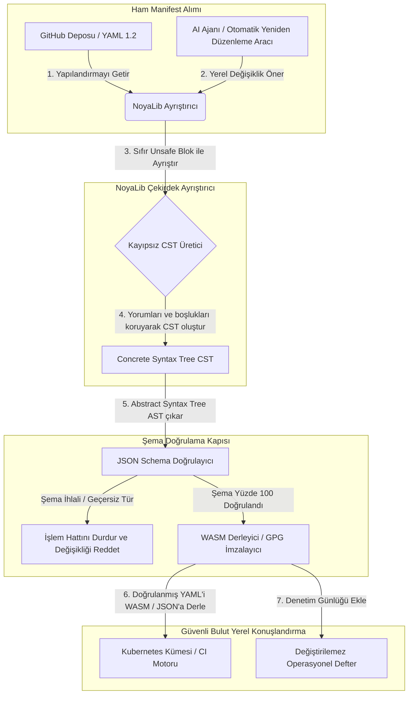

---

# Front Matter (YAML)

author: "contact@sebastienrousseau.com (Sebastien Rousseau)"
banner_alt: "Dramatik ışık altında mimari geometri — NoyaLib'in CI, Kubernetes, MCP ve finansal hizmetler yapılandırması altındaki taşıyıcı güvenli Rust YAML ayrıştırıcısı rolünü simgeliyor"
banner_height: "1597"
banner_width: "2584"
banner: "https://cloudcdn.pro/stocks/images/ken-cheung-KonWFWUaAuk.webp"
cdn: "https://cloudcdn.pro"
charset: "UTF-8"
cname: "sebastienrousseau.com"
copyright: "© Copyright 2025 - 2026 - Sebastien Rousseau. All rights reserved."
date: "18 Haziran 2026"
description: "NoyaLib, 406/406 spesifikasyon uyumlu, JSON Schema doğrulamalı, kayıpsız CST ve MCP/WASM bağlamalı sıfır-unsafe Rust YAML 1.2 ayrıştırıcısı."
format-detection: "telephone=no"
hreflang: "tr"
icon: "https://cloudcdn.pro/clients/sebastienrousseau/v1/logos/sebastienrousseau.svg"
id: "https://sebastienrousseau.com/2026-06-18-noyalib-safe-yaml-rust-ai-mcp-financial-infrastructure-2026"
image_alt: "Sebastien Rousseau'nun siyah beyaz portresi"
image_height: "162"
image_width: "162"
image: "https://cloudcdn.pro/stocks/images/sebastien-rousseau.png"
keywords: "daha güvenli Rust YAML ayrıştırıcısı, NoyaLib, YAML 1.2 spesifikasyon uyumu, sıfır-unsafe Rust, JSON Schema doğrulama, kayıpsız Concrete Syntax Tree, CST, MCP, Model Context Protocol, WebAssembly, Kubernetes manifestleri, CI/CD yapılandırması, DORA Madde 5, BCBS 239, Basel III operasyonel risk, finansal altyapı, yapılandırma güvenliği, yazılım tedarik zinciri"
language: "tr-TR"
last_reviewed: "2026-06-18"
layout: "report"
locale: "tr_TR"
logo_alt: "Sebastien Rousseau için logo"
logo_height: "44"
logo_width: "44"
logo: "https://cloudcdn.pro/clients/sebastienrousseau/v1/logos/sebastienrousseau.svg"
menu: ""
measurementID: "G-169G4ET5HQ"
name: "Sebastien Rousseau"
permalink: "https://sebastienrousseau.com/2026-06-18-noyalib-safe-yaml-rust-ai-mcp-financial-infrastructure-2026"
rating: "general"
referrer: "no-referrer"
robots: "index, follow"
schema: "FAQPage, Article"
seo_title: "AI, MCP ve Finans için Daha Güvenli Rust YAML Ayrıştırıcı"
short_name: "sebastienrousseau"
subtitle: "Daha güvenli bir Rust YAML yığını — NoyaLib — YAML 1.2'yi kolaylık biçimlendirmesinden AI ajanları, MCP, Kubernetes ve finansal hizmetler altyapısı için kriptografik açıdan güvenli, spesifikasyon uyumlu bir yapılandırma kontrol düzlemine dönüştürüyor."
tags: "daha güvenli Rust YAML ayrıştırıcısı, NoyaLib, YAML 1.2, sıfır-unsafe Rust, JSON Schema, MCP, WebAssembly, Kubernetes, DORA, BCBS 239, Basel III, finansal altyapı, tedarik zinciri güvenliği"
theme-color: "0, 83, 191"
title: "AI, MCP ve Finansal Altyapı için YAML'in 2026'da Neden Daha Güvenli Bir Rust Yığınına İhtiyacı Var"
url: "https://sebastienrousseau.com/2026-06-18-noyalib-safe-yaml-rust-ai-mcp-financial-infrastructure-2026"
viewport: "width=device-width, initial-scale=1, shrink-to-fit=no"

# RSS - The RSS feed front matter (YAML).
atom_link: "https://sebastienrousseau.com/2026-06-18-noyalib-safe-yaml-rust-ai-mcp-financial-infrastructure-2026/rss.xml"
category: "Technology"
docs: https://validator.w3.org/feed/docs/rss2.html
generator: "Static Site Generator (SSG) (version 0.0.26)"
item_description: "NoyaLib, 406/406 spesifikasyon uyumlu, JSON Schema doğrulamalı, kayıpsız CST ve MCP/WASM bağlamalı sıfır-unsafe Rust YAML 1.2 ayrıştırıcısı."
item_guid: "https://sebastienrousseau.com/2026-06-18-noyalib-safe-yaml-rust-ai-mcp-financial-infrastructure-2026/rss.xml"
item_link: "https://sebastienrousseau.com/2026-06-18-noyalib-safe-yaml-rust-ai-mcp-financial-infrastructure-2026/rss.xml"
item_pub_date: "Thu, 18 Jun 2026 06:06:06 +0000"
item_title: "AI, MCP ve Finansal Altyapı için YAML'in 2026'da Neden Daha Güvenli Bir Rust Yığınına İhtiyacı Var"
last_build_date: "Thu, 18 Jun 2026 06:06:06 +0000"
managing_editor: "contact@sebastienrousseau.com (Sebastien Rousseau)"
pub_date: "Thu, 18 Jun 2026 06:06:06 +0000"
ttl: "60"
type: "article"
webmaster: "contact@sebastienrousseau.com"

# Apple - The Apple front matter (YAML).
apple_mobile_web_app_orientations: "portrait"
apple_touch_icon_sizes: "192x192"
apple-mobile-web-app-capable: "yes"
apple-mobile-web-app-status-bar-inset: "black"
apple-mobile-web-app-status-bar-style: "black-translucent"
apple-mobile-web-app-title: "AI, MCP ve Finans için Daha Güvenli Rust YAML Ayrıştırıcı"
apple-touch-fullscreen: "yes"

# MS Application - The MS Application front matter (YAML).

msapplication-navbutton-color: "0, 83, 191"

# Twitter Card - The Twitter Card front matter (YAML).

twitter_card: "summary_large_image"
twitter_creator: "@wwdseb"
twitter_description: "NoyaLib, 406/406 spesifikasyon uyumlu, JSON Schema doğrulamalı, kayıpsız CST ve MCP/WASM bağlamalı sıfır-unsafe Rust YAML 1.2 ayrıştırıcısı."
twitter_image: "https://cloudcdn.pro/clients/sebastienrousseau/v1/logos/sebastienrousseau.svg"
twitter_image_alt: "Sebastien Rousseau logosu"
twitter_site: "@wwdseb"
twitter_title: "AI, MCP ve Finans için Daha Güvenli Rust YAML Ayrıştırıcı"
twitter_url: "https://sebastienrousseau.com/2026-06-18-noyalib-safe-yaml-rust-ai-mcp-financial-infrastructure-2026"

excerpt: "NoyaLib, daha güvenli bir Rust YAML yığınıdır — sıfır unsafe blok, 406/406 YAML 1.2 spesifikasyon uyumu, kayıpsız Concrete Syntax Tree, JSON Schema (Draft 2020-12) doğrulaması ve MCP/WASM bağlamaları — AI ajanları, Kubernetes, CI/CD ve finansal altyapının arkasındaki yapılandırma kontrol düzlemi için tasarlanmıştır."

# Humans.txt - The Humans.txt front matter (YAML).
author_website: "https://sebastienrousseau.com"
author_twitter: "@wwdseb"
author_location: "London, UK"
thanks: "Okuduğunuz için teşekkürler!"
site_last_updated: "2026-06-18"
site_standards: "HTML5, CSS3, RSS, Atom, JSON, XML, YAML, Markdown, TOML"
site_components: "Kaishi, Kaishi Builder, Kaishi CLI, Kaishi Templates, Kaishi Themes"
site_software: "Static Site Generator, Rust"

---

# AI, MCP ve Finansal Altyapı için YAML'in 2026'da Neden Daha Güvenli Bir Rust Yığınına İhtiyacı Var

Daha güvenli bir Rust YAML yığını önemlidir çünkü YAML artık CI/CD işlem hatlarını, Kubernetes manifestlerini, [Open Policy Agent](https://www.openpolicyagent.org/) kurallarını ve Model Context Protocol (MCP) araç kayıtlarını taşımaktadır — tek bir belirsiz ayrıştırma bir takas sistemini bozabilir, bir güvenlik grubunu yanlış yapılandırabilir veya yerel bir AI ajanına yanlış izinleri verebilir. [NoyaLib](https://github.com/sebastienrousseau/noyalib), bu altyapıyı varsayılan olarak güvenli kılmak için tasarlanmış saf Rust, sıfır-unsafe bir [YAML 1.2](https://yaml.org/spec/1.2.2/) ayrıştırma ve doğrulama ekosistemidir.

## Kısa yanıt

**Tek cümlede NoyaLib nedir?** NoyaLib, sıfır `unsafe` kod içeren, resmi 406 testlik YAML paketinde yüzde 100 spesifikasyon uyumu sağlayan, kayıpsız bir Concrete Syntax Tree barındıran ve gerçek zamanlı [JSON Schema](https://json-schema.org/) doğrulamasıyla donatılmış — AI ajanı, MCP, Kubernetes ve finansal altyapı yapılandırmasını varsayılan olarak güvenli kılmak için tasarlanmış, açık kaynaklı, saf Rust bir YAML 1.2 ayrıştırıcısı ve doğrulama ekosistemidir.

## Yönetici özeti

YAML, belirsiz bir ayrıştırma veya şema ihlali çok milyar dolarlık üretim takas sistemini bozana dek mütevazı görünür. 2026'da YAML, [CI/CD](https://docs.github.com/en/actions/learn-github-actions/workflow-syntax-for-github-actions) işlem hatları, [Kubernetes](https://kubernetes.io/docs/concepts/configuration/overview/) manifestleri, [Open Policy Agent](https://www.openpolicyagent.org/) kuralları ve Model Context Protocol (MCP) araç kayıtları için fiili standarttır. Bellek güvenlik açıkları ve yıkıcı ayrıştırma barındıran şeffaf olmayan eski ayrıştırıcılar kabul edilemez bir güvenlik riskidir. NoyaLib, saf Rust ve sıfır-unsafe bir YAML 1.2 ekosistemidir: resmi paketteki 406 testin tamamında yüzde 100 spesifikasyon uyumu, yorumları ve boşlukları koruyan kayıpsız bir Concrete Syntax Tree (CST) ve yerleşik JSON Schema doğrulaması. Sonuç, YAML'in denetlenebilir, güvenli ve ajan erişimine açık bir yapılandırma kontrol düzlemi olarak yeniden konumlandırılmasıdır.

## Temel çıkarımlar

- **Yapılandırma, üretim kodudur.** Hatalı biçimlendirilmiş tek bir YAML dosyası bulut yerel güvenlik gruplarını veya AI ajanı izinlerini yanlış yapılandırabilir. NoyaLib YAML'i kritik altyapı olarak ele alır.
- **Sıfır-unsafe tasarım.** Tamamen güvenli Rust içinde sıfır `unsafe` blok ile geliştirilen NoyaLib, çekirdek ayrıştırma katmanlarındaki bellek güvenliği açıklarını — arabellek taşmaları, uzaktan kod çalıştırma — ortadan kaldırır.
- **Mutlak 406/406 spesifikasyon uyumu.** Yapılandırma yapılarını matematiksel olarak doğrular, hazırlık ile üretim ortamları arasındaki ayrıştırma tutarsızlıklarını ve yapısal kaymaları ortadan kaldırır.
- **Kayıpsız Concrete Syntax Tree.** Yorumları ve biçimlendirmeyi atan eski ayrıştırıcıların aksine NoyaLib boşlukları ve açıklamaları korur; AI ajanları tarafından güvenli, gidiş-dönüş otomatik yeniden düzenlemeye olanak tanır.
- **Yönetim kurulu düzeyinde mali sorumluluk değeri.** Yapılandırma bütünlüğünü [DORA Madde 5](https://eur-lex.europa.eu/legal-content/EN/TXT/?uri=CELEX%3A32022R2554) ve [Basel III](https://www.bis.org/bcbs/publ/d424.htm) operasyonel risk sermayesi metrikleri ile ilişkilendirir; üst yönetimi kişisel sorumluluktan doğrudan korur.

**İlgili okumalar:** [KyberLib ve 2026'da Post-Kuantum Bankacılık Göçü: Standartlardan Koda](https://sebastienrousseau.com/2026-06-12-kyberlib-post-quantum-banking-migration-standards-code-2026/), [2026'da Bulut Yerel Bankacılık Endeksi: DORA, Platform Mühendisliği, Egemen Bulut ve Operasyonel Dayanıklılık](https://sebastienrousseau.com/2026-06-05-cloud-native-banking-index-dora-resilience-platform-engineering-2026/), [2026'da AI Farkındalıklı Dotfiles: MCP, SLSA ve Çoklu Kabuk Eşitliği için Güvenli, Yeniden Üretilebilir Geliştirici İş İstasyonu Kurmak](https://sebastienrousseau.com/2026-06-16-ai-aware-dotfiles-secure-reproducible-workstation-2026/).

## 01. 2026'da Neden Daha Güvenli Bir Rust YAML Yığını Önemli

Haziran 2026'da kurumsal BT altyapıları son derece dağıtık ve gittikçe otomatikleşmiş durumda.

YAML, tüm yazılım mühendisliği yığını için sessizce taşıyıcı yapılandırma diline dönüştü. Üretim eserlerini derleyen sürekli entegrasyon (CI) iş akışlarını, küresel bulut yerel kümelerini yöneten [Kubernetes](https://kubernetes.io/docs/concepts/overview/) manifestlerini ve yerel AI ajanlarına yerel işlemleri yürütme izni veren [Model Context Protocol](https://modelcontextprotocol.io/) (MCP) sunucu şemalarını taşır.

Eski YAML ayrıştırıcıları — [PyYAML](https://pyyaml.org/), [yaml-cpp](https://github.com/jbeder/yaml-cpp), [libyaml](https://github.com/yaml/libyaml) — iki yapısal risk taşır:

1. **Tür zorlama açıkları ("Norveç sorunu").** Eski ayrıştırıcılar sıklıkla tırnaksız dizeleri zorla dönüştürür (ülke kodu `NO` boolean `false`'a, `yes`/`no` da benzer şekilde) — bkz. [YAML 1.1 ile 1.2 boolean etiketi](https://yaml.org/type/bool.html) — bu da kritik sistem arızalarına veya sessiz güvenlik yanlış yapılandırmalarına yol açar.
2. **Bellek güvenliği istismarları.** C/C++ ile yazılmış şeffaf olmayan ayrıştırıcılar bellek sızıntısı ve arabellek taşması istismarlarından muzdariptir; bu da çekirdek derleme sunucularında uzaktan kod çalıştırmaya (RCE) yol açabilir.

[NoyaLib](https://github.com/sebastienrousseau/noyalib) bu zorlukları çözer. Saf Rust, sıfır-unsafe bir YAML 1.2 ayrıştırma ve doğrulama ekosistemidir. Mutlak 406/406 spesifikasyon uyumu sağlayarak ve ayrıştırma sırasında doğrudan katı JSON Schema doğrulamasını uygulayarak NoyaLib yüksek bir **Dayanıklılık Getirisi (RoR)** sunar — yapılandırma kaynaklı kesintileri önler ve finansal sınıf yazılım tedarik zincirlerini güvence altına alır.

## 02. NoyaLib 2026 Mimari Merceği

NoyaLib ekosistemi güvenli, kayıpsız bir yapılandırma ayrıştırıcısı olarak çalışır. Her yerel ve bulut manifesti en düşük yürütme katmanında yapısal olarak doğrulanır ve korunur.

### Tablo 1: NoyaLib mimari katmanları ve risk azaltma

| Katman | Tasarım kararı | Neden önemli | Yanlış ele alınırsa risk |
| ---- | ---- | ---- | ---- |
| **Ayrıştırıcı katmanı** | Sıfır `unsafe` blok içeren, YAML 1.2 uyumlu saf Rust ayrıştırıcı | Bellek güvenliği açıklarını ve arabellek taşmalarını en düşük yürütme katmanında ortadan kaldırır. | Çekirdek derleme sunucularında uzaktan kod çalıştırma (RCE). |
| **Uyumluluk katmanı** | Resmi YAML 1.2 paketinde 406/406 testte yüzde 100 uyum | Hazırlık ile üretim arasındaki ayrıştırma tutarsızlıklarını ve tür zorlama kaymasını ortadan kaldırır. | Güvenlik gruplarını devre dışı bırakan "Norveç sorunu" tür zorlama hataları. |
| **Sözdizimi ağacı katmanı** | Kayıpsız Concrete Syntax Tree (CST) | Gidiş-dönüş ayrıştırma ve programatik yeniden düzenleme sırasında yorumları, boşlukları ve sıralamayı korur. | Geliştirici açıklamalarını yok eden otomatik AI yeniden düzenlemesi. |
| **Doğrulama katmanı** | Ayrıştırma sırasında [JSON Schema (Draft 2020-12)](https://json-schema.org/draft/2020-12/release-notes) doğrulaması | Yapılandırma dosyaları üretim kümelerine ulaşmadan önce katı veri modellerini uygular. | Bulut yerel küme çökmelerini tetikleyen hatalı biçimli yapılandırma dosyaları. |
| **Arayüz katmanı** | WebAssembly (WASM) ve MCP bağlamaları | Yapılandırma doğrulamasının doğrudan tarayıcılar, kenar düğümleri ve yerel ajan araç setleri içinde çalışmasına olanak tanır. | Doğrulamanın kenar cihazlarda çalıştırılamadığı araç siloları. |

## 03. Temel İş İstasyonu ve Yapılandırma Güvenliği Sinyalleri

Geliştirme ve operasyon ortamı genelinde mutlak güvenliği korumak için Bilgi Güvenliği Baş Sorumluları (CISO'lar) belirli, ölçülebilir metrikleri izlemek zorundadır.

### Tablo 2: İş istasyonu ve yapılandırma güvenliği sinyalleri

| Sinyal | Metrik / operasyonel kıyas | NIST CSF / DORA referansı | Teknik platform uygulaması |
| ---- | ---- | ---- | ---- |
| **Ayrıştırıcı uyumu** | Resmi YAML 1.2 test paketinde yüzde 100 geçiş oranı (406/406 test). | [DORA Madde 6](https://eur-lex.europa.eu/legal-content/EN/TXT/?uri=CELEX%3A32022R2554) (BİT güvenliği) | CI yürütmesinden önce tüm manifestleri doğrulayan NoyaLib ayrıştırıcı çekirdeği. |
| **Bellek güvenliği profili** | Ayrıştırıcı ve serileştirici bağımlılıklarında sıfır `unsafe` Rust bloğu. | DORA Madde 30 (tedarik zinciri) | Cargo derlemelerinde otomatik derleyici denetimleri ([`forbid(unsafe_code)`](https://doc.rust-lang.org/reference/attributes/diagnostics.html#the-forbid-attribute)). |
| **Şema doğrulama** | Ayrıştırılan yapılandırma dosyalarının yüzde 100'ü geçerli [JSON Schema](https://json-schema.org/) modellerine karşı doğrulanır. | [NIST CSF 2.0](https://www.nist.gov/cyberframework) (PR.DS-01) | Şema ihlallerinde derleme işlem hatlarını durduran gerçek zamanlı doğrulama kapısı. |
| **Yapılandırma kayması** | Yerel yapılandırma dosyalarının git sürümlü duruma gerçek zamanlı algılanması ve kurtarılması. | Dayanıklılık Getirisi (RoR) | Tüm yerel dosya değişikliklerini günlüğe kaydeden sürekli telemetri. |
| **Ajan erişim kontrolü** | MCP yapılandırmaları aracılığıyla çalışan yerel AI araçları için sınırlı, salt okunur izinler. | Model risk yönetimi ([SR 11-7](https://www.federalreserve.gov/supervisionreg/srletters/sr1107.htm)) | Ajan operasyonlarını onaylı dizinlerle sınırlayan MCP sunucu sınırları. |

## 04. Şeffaf Olmayan Yapılandırma Ayrıştırmasının Yanılgısı

Bulut yerel operasyonlardaki büyük bir açık *şeffaf olmayan ayrıştırma*'dır — yapısal meta verileri (yorumlar, boşluklar, belge sıralaması) atan ya da derleme sırasında sessizce türleri zorlayan ayrıştırıcıların kullanılması. Bu davranış iki ciddi güvenlik riskini tetikler:

1. **Yıkıcı yeniden düzenleme.** Bir AI kodlama asistanı veya otomatik yeniden düzenleme aracı bir konuşlandırma manifestini güncellediğinde geleneksel ayrıştırıcılar geliştirici yorumlarını ve biçimlendirmeyi atar; insan incelemeleri ve olay sonrası adli analiz için gereken bağlamı yok eder.
2. **Ayrıştırma tutarsızlıkları.** Bir hazırlık ortamı Python tabanlı bir ayrıştırıcı kullanır ve üretim bir C tabanlı ayrıştırıcı çalıştırırsa YAML 1.2 spesifikasyon uyumundaki küçük farklar geçerli bir hazırlık manifestinin üretimde başarısız olmasına ya da farklı davranmasına yol açabilir; gizli güvenlik açıkları yaratır.

NoyaLib'in **kayıpsız Concrete Syntax Tree (CST)**'si bunu çözer. Ayrıştırma-ve-serileştirme döngüsü sırasında her boşluğu, yorumu ve belge satırını korur. Otomatik AI asistanları, yapılandırma dosyalarını insan tarafından yazılmış açıklamaların yüzde 100'ünü koruyarak düzenleyebilir, yeniden düzenleyebilir ve işleyebilir — mutlak bir denetim izi.

## 05. Sınırlı Bir AI Yapılandırma İşlem Hattının Tasarlanması

Kötü niyetli yapılandırma değişikliklerinin üretim ortamlarına ulaşmasını önlemek için kuruluş, katı şekilde sınırlanmış, şema doğrulamalı bir yapılandırma işlem hattı uygulamak zorundadır.

Aşağıdaki operasyonel akış, NoyaLib'in ham YAML'i nasıl ayrıştırdığını, kayıpsız bir CST oluşturduğunu, AST'yi bir JSON Schema modeline karşı doğruladığını ve tarayıcı veya kenar ortamları için WebAssembly bağlamalarını derlediğini göstermektedir.

## 06. Yönetim Kurulu Kitapçığı ve Mali Sorumluluk

Yapılandırma güvenliği ve yazılım tedarik zinciri bütünlüğü kritik yönetim kurulu önceliğidir. Üst yöneticilerin yapılandırma yönetimine mali sorumluluk ve operasyonel dayanıklılık merceğinden yaklaşması gerekir.

- **DORA Madde 5 (yönetim kurulu sorumluluğu).** Yönetim kurulunun kurumun BİT riskini yönetmekten nihai, devredilemez sorumluluk taşıdığını şart koşar. Yapılandırma dosyaları kritik bulut yerel güvenlik gruplarını ve ödeme yönlendirme yollarını kontrol ettiğinden yönetim kurulları, bu manifestleri ayrıştıran sistemlerin bellek-güvenli ve tam spesifikasyon uyumlu olduğunu düzenleyici denetimleri karşılayacak şekilde doğrulamak zorundadır. ([Düzenleme (AB) 2022/2554](https://eur-lex.europa.eu/legal-content/EN/TXT/?uri=CELEX%3A32022R2554))
- **BCBS 239 (risk verisi toplama ve raporlama).** Risk raporlamasının ve altyapı metriklerinin doğru, eksiksiz ve katı veri kalitesi kontrolleri altında üretilmesini gerektirir. NoyaLib, yapılandırma dosyalarını kaynakta katı şemalara karşı ayrıştırıp doğrulayarak BCBS 239'u destekler ve sessiz veri sızıntısını ya da yanlış yapılandırma kaynaklı kesintileri önler. ([BCBS 239 standardı](https://www.bis.org/publ/bcbs239.htm))
- **Operasyonel risk sermayesi yüklerinin azaltılması (Basel III).** Yapılandırma kaynaklı kesintiler Basel III kapsamındaki operasyonel risk sermayesi yüklerini doğrudan şişirir; bilanço sermayesini bağlar. Kurumsal yapılandırma yığınını NoyaLib gibi güvenli, saf Rust bir ayrıştırıcıda standartlaştırmak bu riski en aza indirir; sermayeyi korur ve müşteri güvenini muhafaza eder. ([Basel III standartları](https://www.bis.org/bcbs/publ/d424.htm))

## 07. Bunun Banka Türüne Göre Anlamı

### Küresel Sistemik Önemli Bankalar (G-SIB'ler)

G-SIB'ler birden fazla yargı bölgesinde binlerce mikroservis ve konuşlandırma işlem hattını yönetir. Birincil zorlukları, büyük bulut yerel ortamlarda yapılandırma tutarlılığını sürdürmek ve güvenlik kaymasını önlemektir. NoyaLib gibi daha güvenli bir Rust YAML yığınında standartlaşmak, tüm Kubernetes manifestlerinin, CI/CD işlem hatlarının ve güvenlik politikalarının yeknesak, bellek-güvenli bir çerçeve altında ayrıştırılıp doğrulanmasını güvence altına alır — denetimsiz "kar tanesi" yapılandırmaların riskini ortadan kaldırır.

### İşlem ve kurumsal bankalar

İşlem bankaları hassas ödeme ağ geçitlerini ve toptan takas altyapılarını işletir. Bu üretim ortamlarına konuşlandırılan kodun ve yapılandırmanın mutlak güvenliğini kanıtlamak pazarlık edilemez bir düzenleyici taleptir. NoyaLib'i entegre etmek, yazılım tedarik zincirinin tam olarak denetlendiğini, kayıpsız olduğunu ve ayrıştırma açıklarından korunduğunu güvence altına alır — DORA Madde 6 ve [PCI DSS v4.0](https://www.pcisecuritystandards.org/document_library/) bölüm 6 ile temiz biçimde eşleşen bir kontrol.

### Bölgesel ve küçük bankalar

Bölgesel bankalar G-SIB ölçekli teknoloji bütçeleri olmadan yüksek siber güvenlik standartlarını sürdürmek zorundadır. Açık kaynaklı NoyaLib çerçevesi hafif, uygun maliyetli ve son derece güvenli, Rust dostu bir çözüm sunarak küçük kurumların tescilli lisans ücretleri olmadan kurumsal düzeyde yapılandırma güvenliği ve tedarik zinciri koruması uygulamasına olanak tanır.

## 08. Sonuç: Yapılandırma Güvenliği Yol Haritası

Geliştirici iş istasyonu ve bulut yerel altyapı yapılandırmaları yazılım tedarik zincirindeki kritik kontrol düzlemleridir. Denetimsiz, belirsiz veya güvensiz yapılandırma dosyalarının kurumsal varlıklara ulaşmasına izin vermek kabul edilemez bir operasyonel ve düzenleyici risktir.

Yazılım tedarik zincirini güvence altına almak ve uç noktaları yapılandırma açıklarından korumak için üst düzey teknoloji ve güvenlik yöneticilerinin bugün net bir geliştirme yol haritası uygulaması gerekir:

1. **Bildirimsel yapılandırmayı zorunlu kılın.** Manuel, denetimsiz yapılandırma ayarlamalarını aşamalı olarak kaldırın ve tüm manifestlerin sürüm kontrollü, bildirimsel bir kayıt sistemi olarak yönetilmesini şart koşun.
2. **Şema doğrulamayı uygulayın.** Tüm yapılandırma dosyalarının konuşlandırmadan önce geçerli JSON Schema modellerine karşı doğrulanmasını sağlamak için katı işleme öncesi kancalar ve tarama araçları uygulayın.
3. **Kayıpsız gidiş-dönüşü uygulayın.** Tüm otomatik AI kodlama asistanlarının ve yeniden düzenleme araçlarının yorumları, boşlukları ve geliştirici bağlamını korumak için kayıpsız ayrıştırma kullandığından emin olun.
4. **Tedarik zincirini güvence altına alın.** Tüm yapılandırma kurulumlarının ve ayrıştırma araçlarının yürütülmeden önce NoyaLib gibi saf Rust, sıfır-unsafe kitaplıklar kullanılarak kriptografik olarak doğrulandığından emin olun. ([SLSA çerçevesi](https://slsa.dev/))

## 09. Sıkça Sorulan Sorular

**NoyaLib nedir ve YAML ayrıştırma için neden kullanılır?**
NoyaLib, açık kaynaklı, saf Rust, sıfır-unsafe bir YAML 1.2 ayrıştırıcısıdır. Resmi 406 testlik pakette yüzde 100 spesifikasyon uyumu sağlar, ayrıştırma sırasında katı [JSON Schema](https://json-schema.org/) doğrulaması uygular ve WASM ile [MCP](https://modelcontextprotocol.io/) bağlamalarını açar — AI ajanları, Kubernetes ve finansal altyapı için daha güvenli bir Rust YAML yığını yapar.

**Yapılandırma ayrıştırma için sıfır-unsafe tasarım neden önemli?**
C/C++ ile yazılmış eski ayrıştırıcıların içindeki bellek güvenliği açıkları — arabellek taşmaları, kullanım-sonrası-serbest bırakma — çekirdek derleme sunucularında uzaktan kod çalıştırmaya yol açabilir. NoyaLib'in [`#![forbid(unsafe_code)]`](https://doc.rust-lang.org/reference/attributes/diagnostics.html#the-forbid-attribute) ile saf Rust tasarımı bu açıkları derleme zamanında matematiksel olarak ortadan kaldırır.

**Kayıpsız Concrete Syntax Tree (CST) nedir ve neden önemlidir?**
Geleneksel ayrıştırıcılar yorumları ve biçimlendirmeyi atar; AI ajanlarının otomatik düzenlemelerini yıkıcı hale getirir. NoyaLib'in kayıpsız Concrete Syntax Tree'si her yorumu, boşluğu ve belge satırını korur — böylece AI asistanları, geliştirici bağlamını, olay sonrası adli analizi ve denetim izini bozulmamış tutarken yapılandırma dosyalarını güvenle düzenleyebilir ve yeniden düzenleyebilir.

**NoyaLib DORA, BCBS 239 ve Basel III ile nasıl eşleşir?**
DORA Madde 5, BİT risk sorumluluğunu yönetim kuruluna yükler; BCBS 239 risk raporlaması üzerinde veri kalitesi kontrolleri talep eder; Basel III operasyonel risk sermayesini vergilendirir. NoyaLib, bu düzenlemelerin kod olarak yapılandırma için gerektirdiği şema doğrulamalı, bellek-güvenli ayrıştırma katmanını sağlar — düzenleyici eşleşmeyi basit ve operasyonel risk sermayesi yükünü daha küçük yapar.

## 10. Kaynakça

- **YAML, (2026).** *YAML 1.2 specification*. Erişim adresi: [YAML 1.2 spec](https://yaml.org/spec/1.2.2/).
- **JSON Schema, (2026).** *JSON Schema Draft 2020-12 release notes*. Erişim adresi: [JSON Schema Draft 2020-12](https://json-schema.org/draft/2020-12/release-notes).
- **European Parliament and Council of the European Union, (2022).** *Regulation (EU) 2022/2554 on digital operational resilience for the financial sector (DORA)*. Brüksel: Avrupa Birliği Resmi Gazetesi. Erişim adresi: [DORA regulation](https://eur-lex.europa.eu/legal-content/EN/TXT/?uri=CELEX%3A32022R2554).
- **Basel Committee on Banking Supervision, (2013).** *Principles for effective risk data aggregation and risk reporting (BCBS 239)*. Basel: Bank for International Settlements. Erişim adresi: [BCBS 239 standard](https://www.bis.org/publ/bcbs239.htm).
- **Basel Committee on Banking Supervision, (2017).** *Basel III: finalising post-crisis reforms*. Basel: Bank for International Settlements. Erişim adresi: [Basel III standards](https://www.bis.org/bcbs/publ/d424.htm).
- **Anthropic, (2025).** *Model Context Protocol (MCP) specification*. Erişim adresi: [Model Context Protocol](https://modelcontextprotocol.io/).
- **GitHub, (2026).** *noyalib open-source repository*. Erişim adresi: [NoyaLib repository](https://github.com/sebastienrousseau/noyalib).
