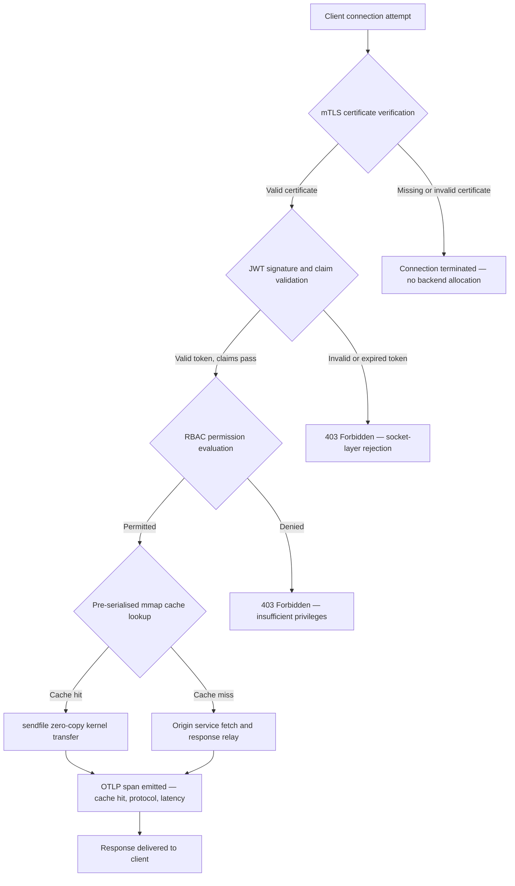

---

# Front Matter (YAML)

author: "contact@sebastienrousseau.com (Sebastien Rousseau)"
banner_alt: "Gece bir devre kartında soyut şehir manzarası — çekirdek düzeyinde zero-copy transferlerin, mTLS el sıkışmalarının ve JWT doğrulamasının tek bir statik bağlı ikili dosyada birleştiği bankacılık kenarını görselleştiriyor"
banner_height: "1597"
banner_width: "2584"
banner: "https://cloudcdn.pro/stocks/images/bit-cloud-GlqbGLCPnQ4.webp"
cdn: "https://cloudcdn.pro"
charset: "UTF-8"
cname: "sebastienrousseau.com"
copyright: "© Copyright 2025 - 2026 - Sebastien Rousseau. All rights reserved."
date: "June 20, 2026"
description: "http-handle, bankacılık kenarında sıfır çalışma zamanı bağımlılığıyla saniyede 180.000 istek ileten, entegre mTLS ve JWT doğrulaması, ALPN ile müzakere edilen HTTP/2 ve HTTP/3 ve OTLP gözlemlenebilirliği sunan statik bağlı bir Rust ikili dosyasıdır — Nginx ve Envoy'un açık bıraktığı güvenlik ve dayanıklılık boşluklarını kapatır."
format-detection: "telephone=no"
hreflang: "tr"
icon: "https://cloudcdn.pro/clients/sebastienrousseau/v1/logos/sebastienrousseau.svg"
id: "https://sebastienrousseau.com/2026-06-20-http-handle-zero-dependency-edge-ingress-banking-rust-2026"
image_alt: "Sebastien Rousseau'nun siyah beyaz portresi"
image_height: "162"
image_width: "162"
image: "https://cloudcdn.pro/stocks/images/sebastienrousseau.webp"
keywords: "http-handle, Rust edge ingress, bağımlılıksız proxy, bankacılık altyapısı, mTLS JWT, sendfile zero-copy, ALPN HTTP3, DORA uyumu, Basel III, OTLP gözlemlenebilirliği, statik ikili, ARM64 bankacılık, zero trust bankacılık, hafif ingress, Rust bankacılık güvenliği"
language: "tr-TR"
last_reviewed: "2026-06-20"
layout: "report"
locale: "tr_TR"
logo_alt: "Sebastien Rousseau logosu"
logo_height: "44"
logo_width: "44"
logo: "https://cloudcdn.pro/clients/sebastienrousseau/v1/logos/sebastienrousseau.svg"
menu: ""
measurementID: "G-169G4ET5HQ"
name: "Sebastien Rousseau"
permalink: "https://sebastienrousseau.com/2026-06-20-http-handle-zero-dependency-edge-ingress-banking-rust-2026"
rating: "general"
referrer: "no-referrer"
robots: "index, follow"
schema: "FAQPage, Article"
seo_title: "http-handle: Bankacılık için 180k istek/sn'de Bağımlılıksız Rust Ingress"
short_name: "sebastienrousseau"
subtitle: "Tek bir statik bağlı Rust ikili dosyasının bankacılık kenarında mTLS, JWT ve ALPN ile saniyede 180.000 istek nasıl ilettiği — ve bunun DORA ve Basel III uyumu için ne anlama geldiği."
tags: "http-handle, Rust, banking, edge-ingress, mTLS, JWT, ALPN, HTTP3, DORA, Basel-III, zero-copy, sendfile, ARM64, zero-trust, OTLP, observability, open-source, infrastructure"
theme-color: "0, 83, 191"
title: "http-handle: 2026'da Bankacılık için Yüksek Performanslı, Bağımlılıksız Edge Ingress"
url: "https://sebastienrousseau.com/2026-06-20-http-handle-zero-dependency-edge-ingress-banking-rust-2026"
viewport: "width=device-width, initial-scale=1, shrink-to-fit=no"

# RSS - The RSS feed front matter (YAML).
atom_link: "https://sebastienrousseau.com/2026-06-20-http-handle-zero-dependency-edge-ingress-banking-rust-2026/rss.xml"
category: "Technology"
docs: https://validator.w3.org/feed/docs/rss2.html
generator: "Static Site Generator (SSG) (version 0.0.40)"
item_description: "http-handle, bankacılık kenarında sıfır çalışma zamanı bağımlılığıyla saniyede 180.000 istek ileten, entegre mTLS ve JWT doğrulaması, ALPN ile müzakere edilen HTTP/2 ve HTTP/3 ve OTLP gözlemlenebilirliği sunan statik bağlı bir Rust ikili dosyasıdır — Nginx ve Envoy'un açık bıraktığı güvenlik ve dayanıklılık boşluklarını kapatır."
item_guid: "https://sebastienrousseau.com/2026-06-20-http-handle-zero-dependency-edge-ingress-banking-rust-2026/rss.xml"
item_link: "https://sebastienrousseau.com/2026-06-20-http-handle-zero-dependency-edge-ingress-banking-rust-2026/rss.xml"
item_pub_date: "Sat, 20 Jun 2026 07:07:07 +0000"
item_title: "http-handle: 2026'da Bankacılık için Yüksek Performanslı, Bağımlılıksız Edge Ingress"
last_build_date: "Sat, 20 Jun 2026 07:07:07 +0000"
managing_editor: "contact@sebastienrousseau.com (Sebastien Rousseau)"
pub_date: "Sat, 20 Jun 2026 07:07:07 +0000"
ttl: "60"
type: "article"
webmaster: "contact@sebastienrousseau.com"

# Apple - The Apple front matter (YAML).
apple_mobile_web_app_orientations: "portrait"
apple_touch_icon_sizes: "192x192"
apple-mobile-web-app-capable: "yes"
apple-mobile-web-app-status-bar-inset: "black"
apple-mobile-web-app-status-bar-style: "black-translucent"
apple-mobile-web-app-title: "Bağımlılıksız Bankacılık Kenarı"
apple-touch-fullscreen: "yes"

# MS Application - The MS Application front matter (YAML).

msapplication-navbutton-color: "0, 83, 191"

# Twitter Card - The Twitter Card front matter (YAML).

twitter_card: "summary_large_image"
twitter_creator: "@wwdseb"
twitter_description: "http-handle, bankacılık kenarında sıfır çalışma zamanı bağımlılığıyla saniyede 180.000 istek ileten, mTLS, JWT ve OTLP gözlemlenebilirliği sunan statik bağlı bir Rust ikili dosyasıdır."
twitter_image: "https://cloudcdn.pro/clients/sebastienrousseau/v1/logos/sebastienrousseau.svg"
twitter_image_alt: "Logo of Sebastien Rousseau"
twitter_site: "@wwdseb"
twitter_title: "http-handle: Bankacılık için 180k istek/sn'de Bağımlılıksız Rust Ingress"
twitter_url: "https://sebastienrousseau.com/2026-06-20-http-handle-zero-dependency-edge-ingress-banking-rust-2026"

# Humans.txt - The Humans.txt front matter (YAML).
author_website: "https://sebastienrousseau.com"
author_twitter: "@wwdseb"
author_location: "London, UK"
thanks: "Thanks for reading!"
site_last_updated: "2026-06-20"
site_standards: "HTML5, CSS3, RSS, Atom, JSON, XML, YAML, Markdown, TOML"
site_components: "Kaishi, Kaishi Builder, Kaishi CLI, Kaishi Templates, Kaishi Themes"
site_software: "Static Site Generator, Rust"

---

# http-handle: 2026'da Bankacılık için Yüksek Performanslı, Bağımlılıksız Edge Ingress

<!-- lead-start -->
<aside class="post-lead" aria-label="Makale özeti">

<strong>TL;DR.</strong> http-handle, bankacılık kenarında Nginx ve Envoy'un yerini alan açık kaynaklı, statik bağlı bir Rust ikili dosyasıdır. Linux <code>sendfile(2)</code> zero-copy transferleri aracılığıyla ARM64 düğümlerinde saniyede 180.000 istek iletir, herhangi bir uygulama kodu çalışmadan önce ağ soketi katmanında mTLS ve JWT doğrulamasını uygular, ALPN aracılığıyla HTTP/2 ve HTTP/3'ü otomatik olarak müzakere eder ve yerel olarak OpenTelemetry metrikleri yayar — tüm bunları <code>libc</code> dışında sıfır çalışma zamanı bağımlılığıyla.

<strong>Temel çıkarımlar</strong>

<ul class="post-lead-takeaways">
  <li><strong>Ağır proxy sorunu.</strong> Nginx ve Envoy, CVE yüzeyini genişleten ve DORA BİT risk giderme döngülerini karmaşıklaştıran bağımlılık ağaçları taşır.</li>
  <li><strong>Ölçekte zero-copy performansı.</strong> Önceden seri hale getirilmiş mmap önbellek blokları ve <code>sendfile(2)</code> çekirdek transferleri, ARM64'te milisaniyenin altında proxy yüküyle 180.000 istek/sn sürdürür.</li>
  <li><strong>Soket katmanında güvenlik, uygulamada değil.</strong> mTLS istemci sertifikası doğrulaması, JWT doğrulaması ve RBAC değerlendirmesi, istek için herhangi bir arka uç kaynağı tahsis edilmeden önce tamamlanır.</li>
  <li><strong>Dahili düzenleyici uyum.</strong> Azaltılmış saldırı yüzeyi ve denetlenebilir tek ikili dağıtımı, DORA Madde 5 ve 6'yı, Basel III operasyonel riskini ve SM&CR hesap verebilirlik zincirlerini doğrudan ele alır.</li>
</ul>

<strong>İlgili okuma:</strong> <a href="https://sebastienrousseau.com/2026-06-18-noyalib-safe-yaml-rust-ai-mcp-financial-infrastructure-2026">2026'da AI, MCP ve Finansal Altyapı için YAML Neden Daha Güvenli Bir Rust Yığınına İhtiyaç Duyuyor</a>, <a href="https://sebastienrousseau.com/2026-06-11-cloudcdn-open-source-blueprint-ai-native-edge-2026">CloudCDN: 2026'da AI-Native Edge için Açık Kaynak Planı</a>, <a href="https://sebastienrousseau.com/2026-05-16-best-cloud-infrastructure-architecture-2026">2026'da Bankalar ve Finansal Kurumlar için En İyi Bulut Altyapısı Mimarisi</a>.

</aside>
<!-- lead-end -->

Bankacılık kenarının bir bağımlılık sorunu var. Bir istemci ile temel bankacılık hizmeti arasındaki trafiği yönlendiren her Nginx veya Envoy örneği bir bağımlılık ağacı taşır: OpenSSL derlemeleri, Lua modülleri, gRPC kütüphaneleri ve konteyner katmanları — her biri potansiyel bir CVE, her biri ayrılmış bir yama döngüsü gerektiriyor, her biri SLA ölçümünü karmaşıklaştıran gecikme varyansı ekliyor. [Dijital Operasyonel Dayanıklılık Yasası (DORA)](https://eur-lex.europa.eu/eli/reg/2022/2554/oj) kapsamında, bu karmaşıklık artık operasyonel olduğu kadar düzenleyici bir yükümlülük de.

[http-handle](https://github.com/sebastienrousseau/http-handle) farklı bir yaklaşım benimser. `libc` dışında sıfır çalışma zamanı bağımlılığıyla tek, statik bağlı bir Rust ikili dosyasıdır. ARM64 düğümlerinde saniyede 180.000 istek iletir, ağ soketi katmanında karşılıklı TLS ve JWT kimlik doğrulamasını uygular ve HTTP/2 ve HTTP/3'ü otomatik olarak müzakere eder — tüm bunları 20 MB RAM'in altında bir dağıtım ayak iziyle.

## Hızlı yanıt

**http-handle tek cümlede nedir?** http-handle, bankacılık kenarında ağır proxy konteynerlerinin yerini alan açık kaynaklı, statik bağlı bir Rust ikili dosyasıdır; Linux `sendfile(2)` zero-copy çekirdek transferleri aracılığıyla ARM64'te 180.000 istek/sn iletir, herhangi bir arka uç kaynağına dokunulmadan önce soket katmanında mTLS, JWT ve RBAC uygular ve yerel [OpenTelemetry](https://opentelemetry.io/) metrikleri yayar — `libc` dışında sıfır çalışma zamanı kütüphanesi bağımlılığıyla.

## Yönetici özeti

Bankalar on yıldır kenarlarında Nginx ve Envoy kullanıyor. Her ikisi de yetkin; hiçbiri 2026'nın düzenleyici ortamı için tasarlanmamış. Bağımlılık dolu konteyner görüntüleri, uyum ekiplerinin yeterince hızlı temizleyemediği CVE kuyrukları oluşturuyor ve her kütüphane sürümü yükseltmesi regresyon riski taşıyor. DORA Madde 5 ve 6, BİT riskinin keşiften sonra yamalanmak yerine tasarım gereği yönetilmesini gerektiriyor. Basel III operasyonel risk çerçeveleri, hata noktalarının sistem karmaşıklığıyla çoğaldığı mimarileri cezalandırıyor.

http-handle bağımlılık sorununu kaynağında ortadan kaldırır. İkili dosya çalışma zamanında dış kütüphane gereksinimleri olmadan tek seferlik, statik olarak derlenir. Saldırı yüzeyi Rust standart kütüphanesi artı `libc`'ye küçülür. Güvenlik uygulaması — mTLS sertifika doğrulaması, JWT talep doğrulaması ve rol tabanlı erişim kontrolü — herhangi bir arka uç tahsisi yapılmadan önce ağ soketinde yürütülür ve Zero Trust perimetresini mümkün olan en küçük ifadeye indirger. Performans mimariden kaynaklanır: önceden seri hale getirilmiş bellek eşlemeli önbellek blokları `sendfile(2)` çekirdek transferleriyle birleştirildiğinde veriyi CPU-bellek kopyalama yolundan tamamen çıkarır ve ARM64 donanımında 180.000 istek/sn sürdürür. Sonuç, DORA dayanıklılık gereksinimlerini karşılayan, Basel III operasyonel risk azaltma argümanlarını destekleyen ve SM&CR kapsamındaki kıdemli BT liderlerine kenar altyapısı için doğrulanabilir, tek bileşenli bir hesap verebilirlik zinciri sunan bir ingress katmanıdır.

## Temel çıkarımlar

- **Daha küçük ikililer, daha küçük CVE kuyrukları.** Statik bağlı tek bir ikili dosyanın yamalanacak bir paketi, doğrulanacak bir sürümü ve denetlenecek bir artefaktı vardır. Standart modül setiyle Nginx, 30'dan fazla paylaşılan kütüphane bağımlılığıyla gelir; her birinin kendi güvenlik açığı yaşam döngüsü vardır.
- **Zero-copy bir optimizasyon değil — bir tasarım kısıtlamasıdır.** 180.000 istek/sn'de, kullanıcı alanındaki herhangi bir veri kopyası ölçülebilir gecikme varyansı getirir. `sendfile(2)`, dosya tanımlayıcı içeriğini tamamen çekirdek alanında ağ soketine aktarır. mmap ile sabitlenmiş yanıt önbellek bloklarıyla birleştirildiğinde, CPU önbelleğe alınmış yanıtlar için veri yoluna hiç dokunmaz.
- **Güvenlik perimetresi sokete aittir.** Uygulama ara yazılımında JWT'leri ve mTLS sertifikalarını doğrulamak, istek reddedilmeden önce arka ucun zaten thread ve bellek tahsis ettiği anlamına gelir. Soket katmanı doğrulaması, kimlik doğrulaması yapılmamış isteklerin hiç arka uç kaynağı tüketmemesini sağlar.
- **OTLP gözlemlenebilirlik boşluğunu ortadan kaldırır.** Yerel OpenTelemetry entegrasyonu, her isteğin, her kimlik doğrulama kararının ve her protokol müzakeresinin bir sidecar ajan olmadan yapılandırılmış telemetri üretmesi anlamına gelir. Mevcut banka kontrol panelleri OTLP izlerini doğrudan alır.

**İlgili okuma:** [2026'da AI, MCP ve Finansal Altyapı için YAML Neden Daha Güvenli Bir Rust Yığınına İhtiyaç Duyuyor](https://sebastienrousseau.com/2026-06-18-noyalib-safe-yaml-rust-ai-mcp-financial-infrastructure-2026/), [CloudCDN: 2026'da AI-Native Edge için Açık Kaynak Planı](https://sebastienrousseau.com/2026-06-11-cloudcdn-open-source-blueprint-ai-native-edge-2026/), [2026'da Bankalar ve Finansal Kurumlar için En İyi Bulut Altyapısı Mimarisi](https://sebastienrousseau.com/2026-05-16-best-cloud-infrastructure-architecture-2026/).

## 01. Bankacılıkta Ağır Proxy Sorunu

Nginx ve Envoy, modern internetin kenarını inşa etti. Yapılandırılabilirler, savaşta test edilmişlerdir ve büyük topluluklar tarafından destekleniyorlar. Aynı zamanda DORA var olmadan önce, Basel III operasyonel risk çerçeveleri ölçülebilir karmaşıklık azaltımı talep etmeden önce ve ARM64 bulut düğümleri yüksek verimli hesaplama ekonomisini değiştirmeden önce yapılan mimari seçimlerdir.

Pratik sonuç, bankaların ihtiyaç duyduğu ile ağır proxy konteynerlerinin sağladığı arasındaki uçurumdur.

**Bağımlılık yüzeyi.** Standart bir Envoy dağıtımı OpenSSL, Abseil, Protobuf, gRPC, Lua ve düzinelerce ikincil kütüphane çeker. Her birinin bağımsız bir CVE yaşam döngüsü vardır. National Vulnerability Database kritik bir OpenSSL danışmanlığı yayınladığında, kurumun her Envoy örneği bir uyum saatine dönüşür: değerlendirin, yamalayın, test edin, yeniden dağıtın ve yeniden sertifikalandırın — ikili dosyanın çalıştığı her ortamda. DORA Madde 6 kapsamında bankalar, BİT risk yönetimi süreçlerinin orantılı, belgelenmiş ve doğrulanabilir olduğunu göstermek zorunda. Çok kütüphaneli bir bağımlılık ağacı bu kanıtı sürdürmeyi pahalı kılar.

**Bellek yükü.** Minimum yapılandırılmış bir Nginx çalışan süreci, orta düzey yük altında 40–80 MB oturumlu bellek tüketir. Ölçekte — ticaret sistemlerinde, ödeme API'lerinde ve müşteri portallarında yüzlerce ingress düğümü — bu yük, iyi mühendislik edilmiş tek ikili bir alternatife göre karşılık gelen performans avantajı olmaksızın ölçülebilir bir altyapı maliyetine birikerek artar.

**Yama hızı.** Konteyner görüntüsü tedarik zincirleri, bir CVE yayınlanmasından doğrulanmış bir yamanın üretime ulaşmasına kadar çok günlük gecikme getirir. Temel görüntünün yeniden derlenmesi, uygulama katmanının yeniden katmanlanması, tam test matrisinin yeniden çalıştırılması ve dağıtım ardışık düzeninin yeniden yürütülmesi gerekir. DORA olay raporlama pencerelerinde faaliyet gösteren kritik bankacılık sistemleri için bu döngü yapısal bir risktir.

http-handle üçünü de ele alır. Bir ikili dosya. Bir CVE yüzeyi. Yamalanacak bir artefakt. Üretim ingress düğümü için 20 MB'ın altında RAM.

## 02. http-handle 2026 Mimari Mercek

İkili dosya, geleneksel proxy mimarilerinin biriktirdiği belirli risk kategorilerini ortadan kaldırmak için tasarlanmış beş karşılıklı bağımlı katman olarak yapılandırılmıştır.

### Tablo 1: http-handle mimari katmanları ve risk azaltımı

| Katman | Tasarım kararı | Neden önemli | Yanlış yönetilirse risk |
| ---- | ---- | ---- | ---- |
| **Sunucu çekirdeği** | Tek Rust ikilisi, statik bağlı, `libc` dışında sıfır bağımlılık | Yamalanacak bir artefakt; kurum genelinde kütüphane CVE yayılımını ortadan kaldırır | Bağımlılık karışıklığı saldırıları; kütüphane güvenlik açığı birikimi |
| **Hızlandırma motoru** | Önceden seri hale getirilmiş mmap önbellek blokları ve `sendfile(2)` zero-copy çekirdek transferleri | ARM64'te milisaniyenin altında proxy yüküyle 180.000 istek/sn; önbelleğe alınmış yanıtlar için hiçbir veri kullanıcı alanına girmez | Bellek eşleme sızıntıları; önbellek geçersiz kılma altında çekirdek alanı darboğazları |
| **Kriptografik güvenlik** | ALPN müzakeresi ve sıcak yeniden yükleme sertifika desteğiyle yerel mTLS | Veri bütünlüğü ve protokol uyumluluğunu garanti eder; bağlantı düşüşü olmadan sertifika rotasyonu | Hizmet kesintilerine neden olan sertifika süresi dolması; zayıf şifre paketi varsayılanları |
| **Erişim politikası düzlemi** | Soket katmanı JWT doğrulaması ve RBAC talep değerlendirmesi | Kimlik doğrulaması yapılmamış istekler arka uç kaynağı tüketmez; Zero Trust çekirdek sınırında uygulanır | JWT algoritma karışıklığı saldırıları; aşırı ayrıcalıklı erişim veren RBAC yanlış yapılandırması |
| **Gözlemlenebilirlik** | Yerel [OpenTelemetry (OTLP)](https://opentelemetry.io/docs/specs/otlp/) entegrasyonu | Sidecar ajan olmadan yapılandırılmış telemetri; mevcut banka izleme kurumlarına doğrudan alım | Kesintiler sırasında kör noktalar; DORA olay raporlaması için eksik denetim izleri |

## 03. Temel Performans ve Güvenlik Sinyalleri

Kenarda http-handle çalıştıran bankalar, DORA operasyonel raporlama gereksinimlerini ve dahili SLA yönetimini karşılamak için beş ölçülebilir sinyali enstrümante etmelidir.

### Tablo 2: Operasyonel kıyaslamalar ve düzenleyici referanslar

| Sinyal | Kıyaslama | Düzenleyici referans | Teknik uygulama |
| ---- | ---- | ---- | ---- |
| **Verim** | ARM64 düğümlerinde P99 ≤ 1 ms proxy yüküyle ≥ 180.000 istek/sn | Basel III operasyonel risk — sistem karmaşıklığı azaltımı | `sendfile(2)` + önceden seri hale getirilmiş mmap önbellek blokları; önbellek isabetleri için kullanıcı alanı veri kopyası yok |
| **Saldırı yüzeyi** | Sıfır çalışma zamanı kütüphane bağımlılığı; sürüm başına bir ikili artefakt | [DORA Madde 6](https://eur-lex.europa.eu/eli/reg/2022/2554/oj) — tasarım gereği BİT risk yönetimi | `cargo build --release --target aarch64-unknown-linux-musl` ile statik derleme |
| **Kimlik doğrulama gecikmesi** | mTLS el sıkışması + JWT doğrulaması arka uç yanıtının ilk baytından önce tamamlanıyor | [DORA Madde 5](https://eur-lex.europa.eu/eli/reg/2022/2554/oj) — BİT güvenlik koruması | Soket katmanı kesişimi; arka uç yönlendirmesinden önce çekirdek bitişik Rust'ta JWT talep değerlendirmesi |
| **Sertifika kullanılabilirliği** | Rotasyon sırasında sıfır düşürülen bağlantıyla mTLS sertifikalarının sıcak yeniden yüklenmesi | Kenar kullanılabilirliği için SM&CR kıdemli yönetim sorumluluğu | inotify tabanlı sertifika izleyici; yeniden yükleme sırasında atomik dosya tanımlayıcı değişimi |
| **Gözlemlenebilirlik kapsamı** | Kimlik doğrulama sonucu, protokol sürümü ve önbellek durumu ile OTLP span'ları üreten isteklerin %100'ü | DORA Madde 17 — olay tespiti ve raporlama | Yerel OTLP ihracatçısı; sidecar gerekmez; gRPC veya HTTP/Protobuf taşıması yapılandırılabilir |

## 04. Zero-Copy Motoru: mmap ve sendfile(2)

Yüksek frekanslı bankacılıkta ağ performansı — gerçek zamanlı ödemeler, piyasa verisi API'leri, kimlik doğrulama token hizmetleri — diğer her şeyden daha fazla tek bir kısıtlamayla sınırlandırılır: baytları depolamadan ağ soketine taşımanın maliyeti.

Geleneksel HTTP sunucuları dosya içeriğini bir kullanıcı alanı arabelleğine okur, ardından bu arabelleği sokete yazar. Bu sıra, her yanıt için iki bellek kopyası ve kullanıcı alanı ile çekirdek alanı arasında iki bağlam geçişi gerektirir. Saniyede 180.000 istekte birikmiş yük önemlidir.

http-handle her iki kopyayı da ortadan kaldırır.

**Bellek eşlemeli önbellek blokları.** Hizmet başladığında, `mmap(2)` kullanarak statik yanıt içeriğini bellek eşlemeli bölgelere seri hale getirir. Bu bölgeler çekirdeğin sayfa önbelleğine sabitlenir. Önbelleğe alınmış bir kaynak için istek geldiğinde, yanıt zaten çekirdek belleğinde eşlenmiş — disk okuması yok, arabellek tahsisi yok.

**`sendfile(2)` çekirdek transferi.** Linux `sendfile(2)` sistem çağrısı, veriyi doğrudan bir dosya tanımlayıcıdan — veya bellek eşlemeli bir bölgeden — tamamen çekirdek içinde bir ağ soket dosya tanımlayıcısına aktarır. Hiçbir bayt kullanıcı alanına girmez. CPU'nun rolü sistem çağrısını vermek ve tamamlama olayını işlemekle sınırlıdır. Bu mimariyle ARM64 düğümlerinde http-handle, sürekli yük altında milisaniyenin altında proxy yüküyle 180.000 istek/sn sürdürür.

Ay sonu toplu mutabakat, gün içi likidite raporlaması veya gerçek zamanlı sahtekarlık puanlama API trafiği yürüten bankalar için mühendislik sonucu doğrudandır: trafik katmanı başına daha az ARM64 düğümü, daha düşük altyapı maliyeti ve kapasite eksikliklerinden kaynaklanan daha küçük DORA dayanıklılık riski.

## 05. mTLS ve JWT Erişim Politikası Düzlemi

Bankacılıkta kenarda kimlik doğrulama bir özellik değil — düzenleyici bir gerekliliktir. DORA, BİT güvenlik kontrollerinin orantılı, belgelenmiş ve doğrulanabilir olmasını zorunlu kılar. SM&CR, altyapı güvenliği kararları için kişisel sorumluluğu adlandırılmış kıdemli yöneticilere yükler. Soru kenarda kimlik doğrulama yapılıp yapılmayacağı değil, hangi katmanda.

http-handle, herhangi bir arka uç kaynağı tahsis edilmeden önce üç aşamalı bir Zero Trust politikası uygular.

**Aşama 1: mTLS istemci sertifikası doğrulaması.** TLS el sıkışması sırasında http-handle, istemci sertifikasını yapılandırılabilir bir güven deposuna karşı ister ve doğrular. Geçerli sertifikası olmayan bağlantılar el sıkışmasında sona erer. Hiçbir uygulama thread'i oluşturulmaz, hiçbir bellek havuzu tahsis edilmez. Arka uç isteği hiç görmez.

**Aşama 2: JWT talep doğrulaması.** mTLS'yi geçen bağlantılar için http-handle, soket katmanında `Authorization` başlığından JSON Web Token'ı çıkarır ve doğrular. İmza doğrulaması, son kullanma tarihi kontrolleri ve yayıncı doğrulaması, istek yönlendirme katmanına ulaşmadan önce gerçekleşir. Algoritma karışıklığı saldırıları — bir sunucunun asimetrik anahtar beklenirken simetrik algoritma kabul ettiği — yapılandırmada açık algoritma izin listesiyle engellenir.

**Aşama 3: RBAC talep değerlendirmesi.** Doğrulanmış JWT talepleri, bellekteki bir rol tablosuna eşlenir. Yetersiz izinlere sahip istekler, erişim politikası düzleminde 403 yanıtı alır. Arka uç hizmeti, yetkisiz trafik için hiçbir zaman çağrılmaz.

Bu sıralama operasyonel açıdan önemlidir. Geleneksel modelde — kimlik doğrulamanın uygulama ara yazılımında çalıştığı durumlarda — bir saldırgan, tek bir red verilmeden önce kimlik doğrulaması yapılmamış isteklerle arka uç thread havuzlarını tüketebilir. Soket katmanı kimlik doğrulaması bu saldırı vektörünü tamamen ortadan kaldırır.

## 06. ALPN Yönlendirme ve HTTP/3 Yedekleme Zinciri

Bankacılık trafiği çeşitli ağ koşullarında gelir: ticaret masaları için kurumsal fiber, mobil bankacılık müşterileri için 5G, uzak operasyonlar için uydu bağlantısı ve düzenlenmiş ortamlarda TLS inceleme proxy'leri. Tek protokollü bir ingress, en küçük ortak paydayı kısıtlama olarak oluşturur.

http-handle, her bağlantı için otomatik olarak en uygun protokolü seçmek için [Application-Layer Protocol Negotiation (ALPN)](https://www.rfc-editor.org/rfc/rfc7301) kullanır.

**HTTP/2**, TCP üzerinden tarayıcı ve API trafiği için varsayılandır. Tek bağlantı üzerinden çoğullanan akışlar, HTTP/1.1'in eşzamanlı istek desenlerinde getirdiği head-of-line engellemeyi ortadan kaldırır.

**HTTP/3 (QUIC)**, ağ UDP desteklediğinde ve istemci ALPN uzantısında `h3` reklamı yaptığında etkinleşir. QUIC'in bağımsız akış çoğullama ve bağlantı geçişi, TCP bağlantılarının sık düşüp yeniden bağlandığı kalabalık hücresel ağlardaki mobil bankacılık müşterileri için materyel olarak daha iyi kılar.

**Zarif yedek.** ALPN müzakeresi başarısız olursa — çünkü bir ara proxy uzantıyı kaldırır veya eski bir istemci onu atlarsa — http-handle tüm güvenlik başlıklarını, mTLS uygulamasını ve JWT doğrulamasını koruyarak HTTP/1.1'e geri döner. Protokol yedeklemesi sırasında hiçbir güvenlik özelliği bozulmaz.

## 07. Zero-Copy İstek Yaşam Döngüsü

Aşağıdaki diyagram, kimlik doğrulama kapıları ve gözlemlenebilirlik yayım noktaları dahil olmak üzere istemci bağlantısından yanıt teslimatına kadar tam istek yolunu göstermektedir.

Önbellek isabeti yanıtları için kritik yol, üç güvenlik kapısından ve bir sistem çağrısından geçer. Yanıt gövdesi için kullanıcı alanı arabelleği tahsis edilmez. OTLP span'ı, kimlik doğrulama sonucunu, ALPN ile müzakere edilen protokol sürümünü, önbellek durumunu ve uçtan uca gecikmeyi tek bir yapılandırılmış kayıtta yakalar.

## 08. Düzenleyici Uyum: DORA, Basel III ve SM&CR

### DORA Madde 5 ve 6 — BİT risk yönetimi ve koruması

[DORA Madde 5](https://eur-lex.europa.eu/eli/reg/2022/2554/oj), finansal kuruluşların BİT risk yönetimi çerçevelerini sürdürmesini gerektirir. Madde 6, BİT sistemlerinin risk profiline orantılı koruma ve önleme tedbirleri uygulamalarını gerektirir.

Statik bağlı tek bir ikili dosya, çok kütüphaneli konteyner yığınından daha verimli biçimde her iki gereksinimi de karşılar. Saldırı yüzeyi ölçülebilir — bir artefakt, bir bağımlılık (`libc`), bir CVE yüzeyi — ve koruma tedbirleri prosedürel değil yapısaldır: mTLS ve JWT uygulaması, soket katmanında yapılandırılabilir uygulama mantığı çalışmadan önce yürütüldüğünden yanlış yapılandırmayla atlatılamaz.

### Basel III — Operasyonel risk sermaye gereksinimleri

[Basel III'ün operasyonel risk çerçevesi](https://www.bis.org/bcbs/basel3.htm), düzenleyici sermaye gereksinimlerini kanıtlanabilir risk azaltımına bağlar. Sistem karmaşıklığı ve BİT hata noktası sayısında ölçülebilir bir azalmayı belgeleyebilen bankalar, operasyonel risk sermayesi tahsisinin azaltılması için ölçülebilir bir argümana sahiptir. Çok konteynerli proxy kurumunu tek ikili ingress düğümleriyle değiştirmek, bu argümanı destekleyen tam da bu tür bir karmaşıklık azaltımıdır — mühendislik ekibinin tasdik belgelerini üretebilmesi şartıyla.

http-handle'ın denetlenebilir sürüm artefaktları — yeniden üretilebilir derlemeler, SBOM uyumlu bağımlılık bildirimleri ve OTLP tabanlı operasyonel günlükler — Basel III sermaye tartışmalarının gerektirdiği belgeleme zincirini destekler.

### SM&CR — Kıdemli yönetici sorumluluğu

[Senior Managers and Certification Regime (SM&CR)](https://www.fca.org.uk/firms/senior-managers-certification-regime), adlandırılmış kıdemli yöneticilere sorumlulukları altındaki sistemlerin BİT güvenlik duruşu için kişisel yükümlülük yükler. Hizmet kesintisi olmadan sertifikaları sıcak yeniden yükleyen, OTLP aracılığıyla yapılandırılmış denetim günlükleri üreten ve dağıtım başına bir sürüm sabitlenmiş artefakta sahip tek ikili ingress, adlandırılmış kıdemli yöneticiye doğrulanabilir, belgelenebilir bir güvenlik zinciri sunar. Çok kütüphaneli konteyner yığını bunu yapmaz.

## 09. Role Göre Bu Ne Anlama Geliyor

### Yönetim kurulu ve genel müdürler

Basel III operasyonel risk çerçeveleri kapsamında düzenleyici sermaye optimizasyonu, kanıtlanabilir karmaşıklık azaltımına bağlıdır. Nginx veya Envoy'u tek statik bağlı ikili dosyayla değiştirmek, BİT hata noktası sayısını ihtiyatlı düzenleyicilere sunulabilir ve denetlenebilir bir şekilde azaltır. Azaltılmış CVE yüzeyi aynı zamanda siber sigorta prim yeniden müzakerelerini de destekler — sigortacılar kanıtlanabilir saldırı yüzeyi metriklerine göre fiyatlandırır ve tek bağımlılıklı ingress ikilisi somut bir veri noktasıdır.

### Bilgi güvenliği direktörleri ve risk direktörleri

DORA uyumu, BİT koruma tedbirlerinin orantılı ve doğrulanabilir olmasını gerektirir. Soket katmanı mTLS ve JWT uygulaması, kenarda doğrulanabilir, atlatılamaz bir kimlik doğrulama kapısı sağlar. Sıcak yeniden yükleme sertifika rotasyonu, geleneksel sertifika güncellemelerinin taşıdığı hizmet penceresi riskini ortadan kaldırır. Sıfır bağımlılık derleme modeli, kritik bir `libc` danışmanlığı yayınlandığında tüm kurumun tek bir Rust kaynak artefaktından günler değil saatler içinde yeniden derlenebileceği, test edilebileceği ve yeniden dağıtılabileceği anlamına gelir.

### Mühendislik ve BT yönetimi

Standart bir ARM64 düğümünde 180.000 istek/sn, ödeme API'leri ve kimlik doğrulama hizmetleri için altyapı boyutlandırma konuşmasını değiştirir. Yerel OTLP entegrasyonu, Prometheus ihracatçısı, sidecar ajan veya özel günlük göndericisi ihtiyacını ortadan kaldırır. Kubernetes dağıtım modeli standart bir pod — 20 MB RAM'in altında, ayrıcalıklı konteyner izni yok, ana bilgisayar ağı erişimi yok. Sertifika sıcak yeniden yüklemesi Kubernetes yuvarlanan yeniden başlatma yükü olmadan çalışır.

## SSS

**http-handle yük altında sertifika rotasyonunu nasıl ele alır?**
İkili dosya, bir inotify izleyicisi kullanarak sertifika dosya yollarını izler. Yeni sertifika ve anahtar dosyaları algılandığında, etkin TLS bağlamının atomik değişimini gerçekleştirir — mevcut bağlantılar önceki sertifikayı kullanarak tamamlanırken yeni bağlantılar hemen döndürülmüş olanı kullanır. Hiçbir bağlantı düşürülmez. Hizmet penceresi gerekmez.

**http-handle bir Kubernetes kümesinde ingress controller olarak çalışabilir mi?**
Evet. İkili dosya, standart ingress hizmet anotasyonuyla bağımsız bir pod olarak çalışır. Kaynak gereksinimleri, ayrıcalıklı konteyner izni olmadan ve ana bilgisayar ağı erişim gereksinimi olmaksızın tam verimde 20 MB RAM'in altındadır. Ayrıca, merkezi gateway kimlik doğrulamasına kıyasla sidecar katmanında mTLS uygulamasının tercih edildiği hizmet ağlarında bir sidecar olarak da çalışabilir.

**Proxy'nin kendisinin ölçülebilir gecikme katkısı nedir?**
Önbellek isabeti yanıtları için, proxy yükü — soket kabulünden `sendfile(2)` tamamlamasına kadar — ARM64 donanımında milisaniyenin altındadır. Yukarı akış getirme gerektiren önbellek kaçırma yanıtları için yük, aynı milisaniyenin altındaki rakama artı kaynak yanıt süresidir. Proxy'nin kendisi sıraya alma gecikmesi eklemez çünkü kimlik doğrulama, kimlik bilgisi doğrulaması tamamlanmadan önce thread havuzu tahsisi olmaksızın soket katmanında eşzamanlı olarak gerçekleşir.

**http-handle mevcut bir API ağ geçidinin yanında Zero Trust mimarisine nasıl uyar?**
http-handle, OSI Katman 4/7 sınırında çalışır: yukarı akış hizmetlerine yönlendirmeden önce taşıma katmanı mTLS'yi uygular ve uygulama katmanı JWT'lerini doğrular. Tam bir API ağ geçidinin önünde oturabilir — kimlik doğrulaması yapılmamış trafiği ağ geçidinin daha pahalı işleme katmanına ulaşmadan önce emerek — veya erişim politikası tamamen JWT taleplerinde ifade edilebilen hizmetler için ağ geçidinin yerini tamamen alabilir.

**İkili çıktı tedarik zinciri denetim amaçları için yeniden üretilebilir mi?**
Evet. Yapım, sabitlenmiş Rust araç zinciri sürümü ve kilitli `Cargo.lock` ile yeniden üretilebilir. `cargo cyclonedx` aracılığıyla SBOM oluşturma, her sürüm için CycloneDX uyumlu bir malzeme listesi üretir. Her iki artefakt da bankanın dahili yazılım bileşimi analiz araç zincirine yayınlanabilir ve DORA tedarik zinciri risk belgesi gereksinimlerini karşılar.

## Sonuç

Bankacılık kenarı daha fazla özelliğe ihtiyaç duymaz — daha az bileşene ihtiyaç duyar, her biri daha az yapıyor ve bunu doğrulanabilir biçimde yapıyor. http-handle, ingress katmanını indirgenemez minimumuna indirir: sokette kimlik doğrulamayı uygulayan, veriyi kopyalamadan aktaran ve yaptığı her şeyi yapılandırılmış telemetride raporlayan tek bir Rust ikilisi. DORA uyum zaman çizelgelerini, Basel III sermaye optimizasyon incelemelerini ve SM&CR hesap verebilirlik gereksinimlerini navigasyonda olan bankalar için bu basitlik bir mühendislik tercihi değil — düzenleyici bir argümandır.

[http-handle kaynak kodu](https://github.com/sebastienrousseau/http-handle), MIT ve Apache 2.0 çift lisansı altında mevcuttur.

---

*Referanslar*

Basel Committee on Banking Supervision (2011). *Basel III: A global regulatory framework for more resilient banks and banking systems*. Bank for International Settlements. Available at: [https://www.bis.org/publ/bcbs189.pdf](https://www.bis.org/publ/bcbs189.pdf)

European Parliament and Council (2022). Regulation (EU) 2022/2554 on digital operational resilience for the financial sector (DORA). Available at: [https://eur-lex.europa.eu/legal-content/EN/TXT/?uri=CELEX:32022R2554](https://eur-lex.europa.eu/legal-content/EN/TXT/?uri=CELEX:32022R2554)

Financial Conduct Authority (2015). *Senior Managers and Certification Regime (SM&CR)*. Available at: [https://www.fca.org.uk/firms/senior-managers-certification-regime](https://www.fca.org.uk/firms/senior-managers-certification-regime)

Internet Engineering Task Force (2014). *RFC 7301: Transport Layer Security (TLS) Application-Layer Protocol Negotiation Extension*. Available at: [https://www.rfc-editor.org/rfc/rfc7301](https://www.rfc-editor.org/rfc/rfc7301)

OpenTelemetry Authors (2024). *OpenTelemetry Protocol Specification (OTLP)*. Available at: [https://opentelemetry.io/docs/specs/otlp/](https://opentelemetry.io/docs/specs/otlp/)
