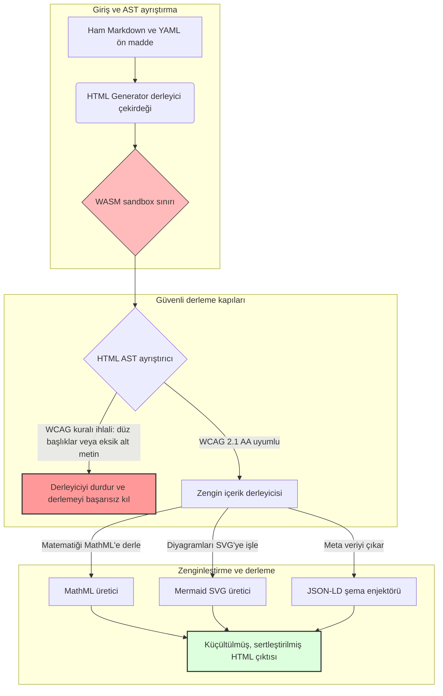

---

# Front Matter (YAML)

author: "contact@sebastienrousseau.com (Sebastien Rousseau)"
banner_alt: "Yapısal ışık altında mimari geometri — HTML Generator'ın erişilebilir, SEO'ya hazır, sandbox ortamında yayımlama altyapısı için derleme kapılı bir Markdown'dan HTML'e dönüşüm hattı olarak rolünü simgeler"
banner_height: "1597"
banner_width: "2584"
banner: "https://cloudcdn.pro/stocks/images/markus-winkler-IrRbSND5EUc-unsplash-1200.webp"
cdn: "https://cloudcdn.pro"
charset: "UTF-8"
cname: "sebastienrousseau.com"
copyright: "© Copyright 2025 - 2026 - Sebastien Rousseau. All rights reserved."
date: "June 20, 2026"
description: "HTML Generator, Markdown'ı WCAG uyumlu, SEO'ya hazır, JSON-LD zenginleştirilmiş HTML'e dönüştüren bir Rust kütüphanesidir — erişilebilirlik-as-code, MathML ve Mermaid desteği ile güvenli kurumsal yayımlama için WebAssembly sandbox ortamı."
format-detection: "telephone=no"
hreflang: "tr"
icon: "https://cloudcdn.pro/clients/sebastienrousseau/v1/logos/sebastienrousseau.svg"
id: "https://sebastienrousseau.com/2026-06-20-html-generator-accessible-seo-structured-markdown-rust-2026"
image_alt: "Sebastien Rousseau'nun Siyah Beyaz Portresi"
image_height: "162"
image_width: "162"
image: "https://cloudcdn.pro/stocks/images/sebastienrousseau.webp"
keywords: "html-generator, Rust Markdown'dan HTML'e, erişilebilirlik-as-code, WCAG 2.1 AA, SEO'ya hazır HTML, JSON-LD, MathML, Mermaid, WebAssembly, EAA, DORA, ADA Title III, erişilebilir yayımlama, sandbox ayrıştırma, açık kaynak"
language: "tr-TR"
last_reviewed: "2026-06-20"
layout: "report"
locale: "tr_TR"
logo_alt: "Sebastien Rousseau Logosu"
logo_height: "44"
logo_width: "44"
logo: "https://cloudcdn.pro/clients/sebastienrousseau/v1/logos/sebastienrousseau.svg"
menu: ""
measurementID: "G-169G4ET5HQ"
name: "Sebastien Rousseau"
permalink: "https://sebastienrousseau.com/2026-06-20-html-generator-accessible-seo-structured-markdown-rust-2026"
rating: "general"
referrer: "no-referrer"
robots: "index, follow"
schema: "FAQPage, Article"
seo_title: "Erişilebilirlik-as-Code: Rust ile Markdown'dan AAA HTML'e (2026)"
short_name: "sebastienrousseau"
subtitle: "Kurumsal web yayımcılığını, ürün dokümantasyonunu ve müşteri portallarını erişilemez metin dosyalarından yüksek yapılandırılmış, uyumlu ve sandbox HTML varlıklarına dönüştürmek."
tags: "html-generator, Rust, Markdown, erişilebilirlik, WCAG, SEO, JSON-LD, MathML, Mermaid, WebAssembly, EAA, DORA, ADA, AI-keşif, RAG, açık kaynak, bankacılık altyapısı"
theme-color: "0, 83, 191"
title: "Rust ile Markdown'ı Erişilebilir, SEO'ya Hazır, Yapılandırılmış HTML'e Dönüştürmek (2026)"
url: "https://sebastienrousseau.com/2026-06-20-html-generator-accessible-seo-structured-markdown-rust-2026"
viewport: "width=device-width, initial-scale=1, shrink-to-fit=no"

# RSS - The RSS feed front matter (YAML).
atom_link: "https://sebastienrousseau.com/2026-06-20-html-generator-accessible-seo-structured-markdown-rust-2026/rss.xml"
category: "Technology"
docs: https://validator.w3.org/feed/docs/rss2.html
generator: "Static Site Generator (SSG) (version 0.0.40)"
item_description: "HTML Generator, Markdown'ı WCAG uyumlu, SEO'ya hazır, JSON-LD zenginleştirilmiş HTML'e dönüştüren bir Rust kütüphanesidir — erişilebilirlik-as-code, MathML ve Mermaid desteği ile güvenli kurumsal yayımlama için WebAssembly sandbox ortamı."
item_guid: "https://sebastienrousseau.com/2026-06-20-html-generator-accessible-seo-structured-markdown-rust-2026/rss.xml"
item_link: "https://sebastienrousseau.com/2026-06-20-html-generator-accessible-seo-structured-markdown-rust-2026/rss.xml"
item_pub_date: "Sat, 20 Jun 2026 06:06:06 +0000"
item_title: "Rust ile Markdown'ı Erişilebilir, SEO'ya Hazır, Yapılandırılmış HTML'e Dönüştürmek (2026)"
last_build_date: "Sat, 20 Jun 2026 06:06:06 +0000"
managing_editor: "contact@sebastienrousseau.com (Sebastien Rousseau)"
pub_date: "Sat, 20 Jun 2026 06:06:06 +0000"
ttl: "60"
type: "article"
webmaster: "contact@sebastienrousseau.com"

# Apple - The Apple front matter (YAML).
apple_mobile_web_app_orientations: "portrait"
apple_touch_icon_sizes: "192x192"
apple-mobile-web-app-capable: "yes"
apple-mobile-web-app-status-bar-inset: "black"
apple-mobile-web-app-status-bar-style: "black-translucent"
apple-mobile-web-app-title: "Rust ile Markdown'dan AAA HTML'e"
apple-touch-fullscreen: "yes"

# MS Application - The MS Application front matter (YAML).

msapplication-navbutton-color: "0, 83, 191"

# Twitter Card - The Twitter Card front matter (YAML).

twitter_card: "summary_large_image"
twitter_creator: "@wwdseb"
twitter_description: "HTML Generator, Markdown'ı WCAG uyumlu, SEO'ya hazır, JSON-LD zenginleştirilmiş HTML'e dönüştüren bir Rust kütüphanesidir — erişilebilirlik-as-code, MathML ve Mermaid desteği ile güvenli kurumsal yayımlama için WebAssembly sandbox ortamı."
twitter_image: "https://cloudcdn.pro/clients/sebastienrousseau/v1/logos/sebastienrousseau.svg"
twitter_image_alt: "Sebastien Rousseau Logosu"
twitter_site: "@wwdseb"
twitter_title: "Erişilebilirlik-as-Code: Rust ile Markdown'dan AAA HTML'e"
twitter_url: "https://sebastienrousseau.com/2026-06-20-html-generator-accessible-seo-structured-markdown-rust-2026"

# Humans.txt - The Humans.txt front matter (YAML).
author_website: "https://sebastienrousseau.com"
author_twitter: "@wwdseb"
author_location: "London, UK"
thanks: "Okuduğunuz için teşekkürler!"
site_last_updated: "2026-06-20"
site_standards: "HTML5, CSS3, RSS, Atom, JSON, XML, YAML, Markdown, TOML"
site_components: "Kaishi, Kaishi Builder, Kaishi CLI, Kaishi Templates, Kaishi Themes"
site_software: "Static Site Generator, Rust"

---

# Rust ile Markdown'ı Erişilebilir, SEO'ya Hazır, Yapılandırılmış HTML'e Dönüştürmek (2026)

<!-- lead-start -->
<aside class="post-lead" aria-label="Makale özeti">

<strong>Özet.</strong> HTML Generator, derleme aşamasında WCAG 2.1 AA standartlarını zorunlu kılan, şema uyumlu JSON-LD enjekte eden, MathML ve Mermaid SVG'yi yerel olarak işleyen ve ayrıştırmayı bir WebAssembly sandbox ortamında yalıtan, saf Rust ile yazılmış bir Markdown'dan HTML'e derleyicisidir — yayımlamayı erişilebilirlik, SEO ve BİT güvenliği için derleme kapılı bir kontrol düzlemine dönüştürür.

<strong>Temel çıkarımlar</strong>

<ul class="post-lead-takeaways">
  <li><strong>Hızlı yanıt.</strong> HTML Generator tek cümlede nedir?</li>
  <li><strong>Yönetici özeti.</strong> Markdown işleme yüzeysel görünür; yayımlama kalitesinde HTML elde etmek bir uyum sorunudur.</li>
  <li><strong>01. 2026'da erişilebilirlik öncelikli bir HTML derleyicisinin önemi.</strong> EAA ve ADA Title III, erişilebilirliği mühendislik hijyeninden fiduciary yükümlülüğe taşıdı.</li>
  <li><strong>02. HTML Generator 2026 mimari perspektifi.</strong> Ham Markdown'dan sertleştirilmiş HTML çıktısına kadar çok aşamalı, derleme kapılı bir hat.</li>
</ul>

<strong>İlgili okumalar:</strong> <a href="https://sebastienrousseau.com/2026-06-18-noyalib-safe-yaml-rust-ai-mcp-financial-infrastructure-2026">2026'da YAML Neden AI, MCP ve Finansal Altyapı için Daha Güvenli Bir Rust Yığınına İhtiyaç Duyuyor</a>, 2026'da AI Çağı Yayımcılığı için Varsayılan Güvenli Static Site Generator, <a href="https://sebastienrousseau.com/2026-06-11-cloudcdn-open-source-blueprint-ai-native-edge-2026">CloudCDN: 2026'da AI'ya Özgü Edge için Açık Kaynak Planı</a>.

</aside>
<!-- lead-end -->

2026'da web içeriği, insan okuyucular kadar AI arama tarayıcıları, LLM destekli arama motorları ve Retrieval-Augmented Generation (RAG) hatları tarafından da tüketilmektedir. Düz veya hatalı biçimlendirilmiş HTML, makine tarafından keşfedilebilirliği zayıflatırken [Avrupa Erişilebilirlik Yasası (EAA)](https://www.accessibility-act.eu/) ve [ABD ADA Title III](https://www.ada.gov/topics/title-iii/) gibi katı küresel düzenlemelere uyumsuzluk artık tartışmasız bir hukuki yükümlülüktür. [HTML Generator](https://github.com/sebastienrousseau/html-generator), bu açıkları kapatmak için tasarlanmış yüksek performanslı bir Rust kütüphanesidir — derleme aşamasında müdahale eder, dağıtım sonrası yamalar beklemez.

## Hızlı yanıt

**HTML Generator tek cümlede nedir?** HTML Generator, derleme aşamasında [WCAG 2.1 AA](https://www.w3.org/TR/WCAG21/) standartlarını zorunlu kılan, anlamsal yer işaretleri ve ARIA özniteliklerini otomatik olarak oluşturan, YAML ön maddesinden şema uyumlu [JSON-LD](https://json-ld.org/) meta verisi enjekte eden, Mermaid diyagramlarını ve matematik formüllerini erişilebilir SVG ve MathML'e işleyen ve bir [WebAssembly](https://webassembly.org/) sandbox ortamında çalışan açık kaynaklı, saf Rust Markdown'dan HTML'e derleyicisidir — kurumsal yayımlamayı derleme kapılı, fiduciary kalitesinde bir kontrol düzlemine dönüştürür.

## Yönetici özeti

Markdown işleme yüzeysel görünür. Yayımlama kalitesinde HTML elde etmek bir uyum sorunudur. Haziran 2026 itibarıyla her kurumsal temas noktası — yatırımcı ilişkileri portalları, düzenleyici başvurular, müşteri dokümantasyonu, API referansları, pazarlama varlıkları — hem insanlar hem de makineler tarafından ayrıştırılmaktadır. Her sayfada iki baskı çarpışır: [EAA](https://www.accessibility-act.eu/) ve [ADA Title III](https://www.ada.gov/topics/title-iii/) erişilebilirliği yönetim kurulu düzeyinde hukuki bir risk haline getirirken, AI ingestion ve RAG hatları yapılandırılmış, makinece okunabilir çıktıyı ödüllendirir. Standart Markdown kütüphaneleri her iki kapıyı da geçemeyen düz HTML üretir. HTML Generator, belge üretimini derleme kapılı bir hat olarak ele alır: WCAG doğrulama bir derleme hatasıdır, JSON-LD YAML ön maddesinden otomatik olarak gelir, MathML ve Mermaid erişilebilir biçimde işlenir ve motor bir WebAssembly hedefi olarak paketlenir; böylece güvenilmeyen belgelerin ayrıştırılması ana sistemden yalıtılır.

## Temel çıkarımlar

- **Erişilebilirlik-as-code yeni temel standarttır.** EAA, tüketici dijital hizmetleri için erişilebilirliği zorunlu kılar. HTML Generator, derleme aşamasında belge ağacını değerlendirerek anlamsal yer işaretleri ve ARIA özniteliklerini otomatik üretir — daha az dağıtım sonrası düzeltme, daha az iyileştirme bütçesi, üretime gönderilen eksik alt metin yok.
- **AI keşfi için yapılandırılmış veri.** Modern arama ve RAG, makinece okunabilir meta veriye bağlıdır. Derleyici YAML ön maddesini ayrıştırır ve [Schema.org uyumlu JSON-LD](https://schema.org/) verilerini doğrudan belge başlığına enjekte eder — içeriği [Google Rich Results](https://developers.google.com/search/docs/appearance/structured-data/intro-structured-data), [Bing Webmaster](https://www.bing.com/webmasters) ve LLM destekli tarayıcılar tarafından tam yorumlanabilir kılar.
- **Teknik içerik mükemmeliyeti.** Teknik yayımcılık düz metin değildir. HTML Generator, ham Markdown matematik uzantılarını erişilebilir [MathML](https://www.w3.org/Math/)'e derler ve [Mermaid.js](https://mermaid.js.org/) diyagramlarını duyarlı SVG'ye dönüştürür — her ikisi de opak görsellere indirgenmek yerine WCAG uyumlu yapıyı korur.
- **WebAssembly sandbox ortamı.** Güvenilmeyen Markdown'ı ayrıştırmak bir güvenlik riskidir. [WASM](https://webassembly.org/) hedefleyerek HTML Generator, rastgele kod yürütmeyi engelleyen ve ana sistemi koruyan yalıtılmış bir sandbox ortamında çalışır — [DORA Article 6](https://eur-lex.europa.eu/legal-content/EN/TXT/?uri=CELEX%3A32022R2554) BİT güvenlik yükümlülüklerini doğrudan karşılar.
- **Yönetim kurulları için fiduciary koruma.** Teknik uyumsuzluk yönetim kurulu gündemine taşındı. Derleme kapılı bir HTML motorunu standartlaştırmak, yöneticileri ve üst yönetimi DORA, EAA ve ADA Title III kapsamındaki kişisel hukuki ve düzenleyici riskten korur.

**İlgili okumalar:** [2026'da YAML Neden AI, MCP ve Finansal Altyapı için Daha Güvenli Bir Rust Yığınına İhtiyaç Duyuyor](https://sebastienrousseau.com/2026-06-18-noyalib-safe-yaml-rust-ai-mcp-financial-infrastructure-2026/), 2026'da AI Çağı Yayımcılığı için Varsayılan Güvenli Static Site Generator, [CloudCDN: 2026'da AI'ya Özgü Edge için Açık Kaynak Planı](https://sebastienrousseau.com/2026-06-11-cloudcdn-open-source-blueprint-ai-native-edge-2026/).

## 01. 2026'da Erişilebilirlik Öncelikli Bir HTML Derleyicisinin Önemi

Kurumsal web varlıkları, dokümantasyon kütüphaneleri ve ürün yardım merkezleri kritik dijital temas noktalarıdır. Artık iki yoğun, iç içe geçmiş baskıya maruz kalmaktadır.

Birincisi **AI ile ingestion ve keşfedilebilirlik**. İçerik giderek daha fazla büyük dil modelleri ve Retrieval-Augmented Generation hatları tarafından işlenmektedir. Düz veya hatalı biçimlendirilmiş HTML, tarayıcı ayrıştırmasını karıştırarak kurumsal araştırmaları ve dokümantasyonu modern arama paradigmalarında görünmez bırakır — buna [Google Search Generative Experience](https://blog.google/products/search/generative-ai-search/), [ChatGPT](https://chat.openai.com/) taraması ve kurumsal RAG ajanları dahildir.

İkincisi **katı küresel erişilebilirlik mevzuatı**. [Avrupa Erişilebilirlik Yasası](https://www.accessibility-act.eu/) (Haziran 2025'ten itibaren tam olarak yürürlükte) ve [ABD ADA Title III](https://www.ada.gov/topics/title-iii/) kapsamında kurumsal yayım platformları eksiksiz dijital erişilebilirliği garanti etmek zorundadır. [WCAG 2.1 AA](https://www.w3.org/TR/WCAG21/) gerekliliklerini karşılamamak artık bir mühendislik ihmali değil; milyonlarca dolar anlaşmayla sonuçlanan hukuki ve düzenleyici bir yükümlülüktür.

[HTML Generator](https://github.com/sebastienrousseau/html-generator) her iki baskıyı doğrudan ele alır. Markdown'ı erişilebilir, SEO'ya hazır, yapılandırılmış HTML'e dönüştürmek için tasarlanmış iş parçacığı güvenli bir Rust kütüphanesidir. Belge üretimini derleme kapılı bir hat olarak ele alarak motor yüksek bir **Dayanıklılık Getirisi (Return on Resilience - RoR)** sağlar — erişilebilirlik davalarından bilançoları korurken AI keşfi için makine okunabilirliğini en üst düzeye çıkarır.

## 02. HTML Generator 2026 Mimari Perspektifi

Çerçeve, ham Markdown metnini kriptografik olarak doğrulanmış, yüksek erişilebilirliğe sahip statik varlıklara dönüştüren güvenli, çok aşamalı bir derleme hattı olarak tasarlanmıştır.

### Tablo 1: HTML Generator mimari katmanları ve risk azaltma

| Katman | Tasarım kararı | Önemi | Yanlış yönetilirse riski |
| ---- | ---- | ---- | ---- |
| **Giriş katmanı** | Markdown ve YAML ön madde ayrıştırıcı | Yazarları oldukları yerden karşılar; düzyazıyı yapısal meta veriden ayırır. | Tutarsız meta veri, bozuk site haritaları, dizinleme boşlukları. |
| **Yapı katmanı** | Otomatik İçerik Tablosu ve ARIA etiketleriyle anlamsal yer işaretleri | Yapı gereği gezilebilir, erişilebilir belge ağaçları üretir. | Ekran okuyucuları bozan ve WCAG'ı ihlal eden düz HTML. |
| **Zengin içerik katmanı** | Yerel MathML ve Mermaid.js SVG işleme | Formülleri ve diyagramları erişilebilir SVG ve MathML'e derler. | İstemci taraflı JS işleme gecikmesi ve bozuk yardımcı teknoloji çıktısı. |
| **SEO ve veri katmanı** | Entegre JSON-LD ve yapılandırılmış meta veri üretimi | [Schema.org](https://schema.org/) uyumlu JSON-LD'yi doğrudan başlığa enjekte eder. | Arama motorları ve AI tarayıcıların yazar, bağlam ve lisans bilgisini yanlış okuması. |
| **Çalışma zamanı katmanı** | WebAssembly hedefli yerel Rust derleyicisi | Sunucularda, edge düğümlerinde ve tarayıcılarda güvenli, sandbox yürütmeyi etkinleştirir. | Güvenilmeyen Markdown ayrıştırması sırasında rastgele kod yürütme. |

## 03. Temel Web Güvenliği ve Erişilebilirlik Göstergeleri

Kamuya açık yayım varlıklarının modern düzenleyici ve güvenlik denetimlerini karşıladığını doğrulamak için üst düzey teknoloji yöneticilerinin belirli, ölçülebilir metrikleri izlemesi gerekir.

### Tablo 2: Web güvenliği ve erişilebilirlik göstergeleri

| Gösterge | Metrik / operasyonel kıyaslama | EAA / DORA / W3C referansı | Teknik uygulama |
| ---- | ---- | ---- | ---- |
| **Erişilebilirlik uyumu** | Derlenen sayfaların % 100'ü WCAG 2.1 AA kurallarına karşı doğrulanmış. | [EAA](https://www.accessibility-act.eu/) ve [ADA Title III](https://www.ada.gov/topics/title-iii/) | Görüntü alt etiketlerini ve anlamsal yer işaretlerini değerlendiren derleme zamanı HTML ayrıştırıcısı. |
| **WASM yürütme sandbox'ı** | Güvenilmeyen Markdown girdilerinin % 100'ü yalıtılmış WebAssembly çalışma ortamında derlenir. | [DORA Article 6](https://eur-lex.europa.eu/legal-content/EN/TXT/?uri=CELEX%3A32022R2554) (BİT güvenliği) | Ayrıştırma ortamının ana sunucudan yalıtılması. |
| **Yapılandırılmış meta veri kapsamı** | Yayımlanan makalelerin % 100'ü geçerli, şema uyumlu JSON-LD başlıklarıyla enjekte edilmiş. | [Schema.org](https://schema.org/) spesifikasyonları | Ön maddenin otomatik ayrıştırılması ve JSON-LD nesnelerine dönüştürülmesi. |
| **Derleme verimi** | Ticari donanımda saniyede 10.000 sayfanın üzerinde hedef. | Dayanıklılık Getirisi (RoR) | Yüksek düzeyde paralel Rust AST derleyicisi. |
| **Zengin snippet doğrulaması** | [Google Rich Results](https://search.google.com/test/rich-results) ve [Schema validator](https://validator.schema.org/) çalışmalarında sıfır ayrıştırma hatası. | Google Arama yönergeleri | Derleme hattı sırasında üretilen JSON-LD'nin yapısal doğrulaması. |

## 04. Basit Markdown İşleme Miti

Teknoloji yöneticileri arasında yaygın bir yanılgı, Markdown'ı HTML'e dönüştürmenin basit bir metin değiştirme egzersizi olduğudur. Pek çok standart kütüphane, Markdown biçimlendirmesini düz, yapılandırılmamış HTML'e çevirir. Çıktı bir tarayıcıda görme yetisi olan bir okuyucuya doğru görünür; ancak bu bir uyum tuzağı oluşturur.

Düz HTML'de tipik olarak üç şey eksiktir.

1. **Doğru başlık hiyerarşileri.** Standart Markdown başlık sırasını zorunlu kılmaz. `<h1>`'den `<h4>`'e atlamak WCAG 2.1 AA'yı ihlal eder ve ekran okuyucular için belge gezinimini bozar.
2. **Açık tablo semantiği.** Standart Markdown tabloları, erişilebilir ayrıştırma için gereken doğru `<th>` kapsamı ve `<tbody>` öznitelikleriyle nadiren işlenir.
3. **Makinece okunabilir meta veri.** Standart HTML, modern AI arama platformlarının ve RAG ingestion sistemlerinin bağımlı olduğu JSON-LD kancalarından yoksundur.

HTML Generator, Markdown'ı bir **Soyut Sözdizimi Ağacı (AST)** olarak ayrıştırarak bu sorunu çözer. Motor HTML yaymadan önce belge yapısını değerlendirir, başlık iç içe geçişini doğrular, uygun ARIA özniteliklerini enjekte eder ve her medya varlığının alternatif metin taşıdığını öne sürer — erişilebilirliği manuel bir denetimden garantili bir derleme zamanı değişmezine dönüştürür.

## 05. Erişilebilirlik-as-Code Derleme Hattı Tasarımı

Erişilemez veya dizinlenemeyen varlıkların kamuya açık dağıtıma hiçbir zaman ulaşmaması için erişilebilirlik katı bir derleyici kapısı olmalıdır. Aşağıdaki hat, HTML Generator'ın Markdown'ı nasıl değerlendirdiğini, WebAssembly yalıtımlı doğrlamayı nasıl çalıştırdığını ve sertleştirilmiş, yapılandırılmış HTML'i nasıl yaydığını gösterir.

## 06. Yönetim Kurulu Stratejisi ve Fiduciary Yükümlülük

Modern erişilebilirlik ve web güvenliği uyumu müzakere edilemez yönetim kurulu konularıdır. Üst yönetim, yayım altyapısına hukuki risk, finansal koruma ve düzenleyici maruziyet perspektifinden yaklaşmak zorundadır.

- **Avrupa Erişilebilirlik Yasası (EAA).** Kamuya açık ve özel dijital portallara doğrudan, hukuken bağlayıcı uyum yükümlülükleri getirir. Uyumsuzluk ağır mali cezalara, hukuki davalara ve varlığın AB pazarından anında çekilmesine yol açabilir. Erişilebilirlik-as-code entegre ederek yönetim kurulları, uyumsuz kodun asla gönderilemeyeceğini onaylayabilir — reaktif iyileştirmeyi yapısal bir hukuki kalkan olarak dönüştürür.
- **DORA Article 6 (Güvenli BİT Ortamları).** BİT ortamı güvenliği için katı kurallar koyar. Markdown derlemesini bir WebAssembly sandbox içinde yalıtarak kuruluşlar, müşteri tarafından yüklenen belgelerin veya iş ortağı akışlarının ayrıştırılmasının ana sunucuları rastgele kod yürütmeye maruz bırakmayacağını — kritik bankacılık portallarını koruyarak — güvence altına alır.
- **Uyum denetimlerinde maliyet azaltma.** Geleneksel erişilebilirlik uyumu, her site için yıllık on binlerce dolarlık pahalı, geriye dönük dağıtım sonrası denetimlere dayanır. WCAG doğrulamayı derleme zamanı blok olarak uygulamak bu geriye dönük maliyetleri ortadan kaldırır ve uyum bütçesini savunmadan inovasyona kaydırır.

## 07. Banka / Kurumsal Türe Göre Anlamı

### Küresel Sistemik Açıdan Önemli Bankalar (G-SIB'ler)

G-SIB'ler, birden fazla yetki alanında binlerce araştırma raporu, düzenleyici açıklama ve yatırımcı ilişkileri belgesi yayımlayan büyük çok dilli kamuya açık varlıklar yönetir. Zorlukları ölçek ve çok dilli paritedir. HTML Generator'ın WebAssembly hedefi ve yüksek verimli Rust motoru, büyük ölçekli, yerelleştirilmiş araştırma kütüphanelerinin işleme gecikmesi veya erişilebilirlik gerilemesi olmaksızın saniyeler içinde küresel olarak güncellenmesine, derlenmesine ve dağıtılmasına olanak tanır.

### İşlem ve Kurumsal Bankalar

İşlem bankaları için müşteri portalları, dokümantasyon merkezleri ve geliştirici API rehberleri kritik dijital temas noktalarıdır. Bu varlıkları HTML Generator ile derlemek, müşteriye dönük kanalların XSS maruziyeti, bağımlılık ele geçirme vektörleri ve erişilebilirlik açıklarından yoksun olduğu anlamına gelir — kurumsal güveni korur ve dava yüzeyini azaltır.

### Bölgesel Bankalar ve Fintechler

Bölgesel bankalar ve çevik fintechler, G-SIB mühendislik bütçeleri olmadan dijital deneyimde rekabet eder. HTML Generator bu ekiplere hazır kurumsal kalitede bir yayım hattı sunar; daha küçük varlıkların hem düzenleyicilerin hem de olası kurumsal müşterilerin incelemesine dayanabilen erişilebilir, SEO'ya hazır, sandbox HTML varlıkları göndermesini sağlar.

## 08. Yayım Altyapısı Yol Haritası

Kurumsal kamuya açık web varlıkları operasyonel dayanıklılığın temel bir bileşenidir. Yavaş, dinamik olarak savunmasız, veritabanı destekli web motorlarına — veya imzasız statik varlıklara — bağımlı kalmak kabul edilemez bir iş riskidir.

Kamuya açık dijital temas noktalarını güvence altına almak ve bilançoları erişilebilirlik davalarından korumak için üst düzey teknoloji ve güvenlik yöneticilerinin net bir yol haritası uygulaması gerekir.

1. **Statik mimarilere geçiş.** Araştırma, pazarlama ve dokümantasyon varlıkları için eski dinamik CMS platformlarını aşamalı olarak kaldırın. İçeriği HTML Generator gibi derleme kapılı hatlara taşıyın.
2. **Derleme aşamasında erişilebilirliği zorunlu kılın.** Erişilebilirlik-as-code uygulayın. WCAG 2.1 AA ihlallerinde derleme hatlarını otomatik olarak başarısız kılın.
3. **WebAssembly içinde ayrıştırmayı yalıtın.** Tüm belge ve içerik ayrıştırmasını bir WASM çalışma ortamında sandbox'layın; böylece güvenilmeyen girdi hiçbir zaman ana sistemlere dokunmasın.
4. **Zengin JSON-LD meta verisi enjekte edin.** Yayımlanan her varlığın, AI keşfedilebilirliğini en üst düzeye çıkarmak için şema uyumlu JSON-LD başlıkları taşıdığından emin olun.

## 09. Sık Sorulan Sorular

**HTML Generator erişilebilirliği nasıl zorunlu kılar?**

Derleme aşamasında üretilen HTML Soyut Sözdizimi Ağacı'nı ayrıştırır ve belgeyi [WCAG 2.1 AA](https://www.w3.org/TR/WCAG21/) kurallarına karşı değerlendirir. Bir kural ihlal edilirse — eksik bir alt özniteliği, başlık atlaması, etiketlenmemiş bir form denetimi — derleyici derlemeyi durdurur ve erişilebilirliği dağıtım sonrası denetim görevi yerine derleme zamanı değişmezi olarak ele alır.

**WebAssembly yalıtımı neden önemlidir?**

[WebAssembly](https://webassembly.org/), Markdown ayrıştırma motorunun ana sunucudan ayrılmış yalıtılmış bir sandbox ortamında çalışmasına olanak tanır. Düşmanca bir aktör, ayrıştırıcı güvenlik açıklarından yararlanmak için hazırlanmış bir Markdown belgesi yüklesе dahi yürütme tuzaklanır — ana sistemleri korur ve DORA Article 6 BİT güvenlik yükümlülüklerini karşılar.

**JSON-LD 2026'da arama keşfedilebilirliğine nasıl fayda sağlar?**

[JSON-LD](https://json-ld.org/), belge başlığında yapılandırılmış, makinece okunabilir meta veri sağlar. [Google Rich Results](https://developers.google.com/search/docs/appearance/structured-data/intro-structured-data), Bing tarayıcıları ve LLM destekli arama ajanları yazar, lisans, yayım tarihi ve anlamsal bağlamı derhal tanımlar — standart HTML'nin belirsizliğini aşarak AI güdümlü keşifte yüzey alanını artırır.

**HTML Generator'ın hedef kitlesi kimdir?**

Statik site oluşturucular, dokümantasyon ekipleri, teknik yazarlar, Rust geliştiricileri ve erişilebilirlik açısından kritik veya düzenleyiciye dönük varlıklar gönderen platform mühendisleri. [Static Site Generator (SSG)](https://github.com/sebastienrousseau/static-site-generator) gibi daha büyük güvenli yayım hatları içinde uygulanabilir bir içerik işleme katmanı olarak da uygundur.

## 10. Referanslar

- World Wide Web Consortium (W3C), 2024. [Web İçeriği Erişilebilirlik Yönergeleri (WCAG) 2.1 ⧉](https://www.w3.org/TR/WCAG21/ "Web Content Accessibility Guidelines 2.1").
- Schema.org, 2026. [Schema.org yapılandırılmış veri spesifikasyonları ⧉](https://schema.org/ "Schema.org structured-data specifications").
- Avrupa Parlamentosu ve Avrupa Birliği Konseyi, 2022. [Finansal sektör için dijital operasyonel dayanıklılık hakkında (EU) 2022/2554 sayılı Tüzük (DORA) ⧉](https://eur-lex.europa.eu/legal-content/EN/TXT/?uri=CELEX%3A32022R2554 "DORA Regulation").
- Avrupa Komisyonu, 2025. [Avrupa Erişilebilirlik Yasası ⧉](https://www.accessibility-act.eu/ "European Accessibility Act").
- ABD Adalet Bakanlığı, 2024. [ADA Title III ⧉](https://www.ada.gov/topics/title-iii/ "ADA Title III").
- WebAssembly Community Group, 2026. [WebAssembly spesifikasyonu ⧉](https://webassembly.org/ "WebAssembly").
- GitHub, 2026. [HTML Generator deposu ⧉](https://github.com/sebastienrousseau/html-generator "HTML Generator open-source repository").

<!-- enrich-start -->
<aside class="author-card" aria-label="Yazar hakkında"><strong class="author-card-name"><a href="/about/index.html">Sebastien Rousseau</a></strong>Uygulamalı AI, ödeme altyapısı, tokenize para, ISO 20022, kuantum sonrası güvenlik, cloud-native finansal hizmetler, açık kaynak altyapısı ve düzenlenmiş dijital piyasalar üzerine yazan kıdemli bankacılık teknoloji uzmanı.HSBC Ticari &amp; Yatırım Bankası, PayPal, Barclays, Shazam, AKQA, Virgin Group'ta 20+ yıl. <a href="/about/index.html">Tam profil</a> &middot; <a href="https://www.linkedin.com/in/sebastienrousseau/" rel="external noopener">LinkedIn</a> &middot; <a href="https://github.com/sebastienrousseau" rel="external noopener">GitHub</a></aside>

Son inceleme tarihi <time datetime="2026-06-20">2026-06-20</time>.

<!-- enrich-end -->
