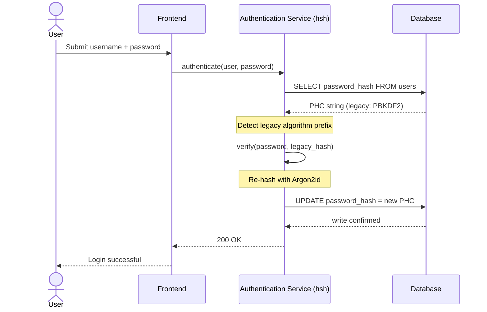
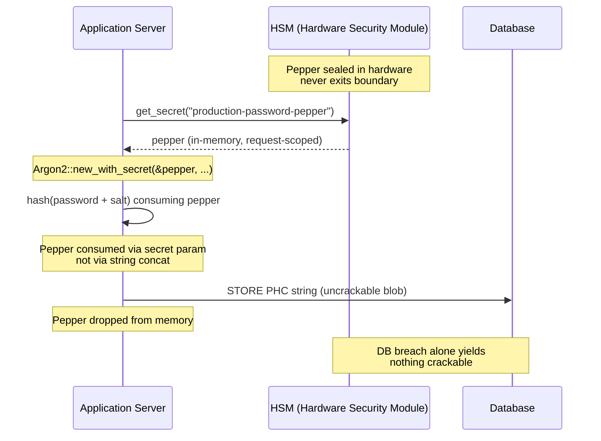

---
# Front Matter (YAML)
author: "contact@sebastienrousseau.com (Sebastien Rousseau)"
banner_alt: "Rust derleyici çıktısını kaydıran bir geliştirici terminalinin yakın çekimi — kurumsal bir bankacılık kimlik doğrulama envanterinin altında yatan bellek-güvenli, denetlenebilir kriptografik altyapının görünür disiplini"
banner_height: "1597"
banner_width: "2584"
banner: "https://cloudcdn.pro/stocks/images/rustlogs.webp"
cdn: "https://cloudcdn.pro"
charset: "UTF-8"
cname: "sebastienrousseau.com"
copyright: "© Copyright 2025 - 2026 - Sebastien Rousseau. All rights reserved."
date: "June 22, 2026"
description: "hsh, birinci kademe bankaların eski parola özetlerini sıfır kesintiyle Argon2id'ye taşımasını sağlayan saf Rust bir kriptografik çerçevedir; HSM peppering entegrasyonu ve C tabanlı FFI bellek açıklarının kaldırılmasıyla DORA dayanıklılık taleplerini karşılar."
format-detection: "telephone=no"
hreflang: "tr"
icon: "https://cloudcdn.pro/clients/sebastienrousseau/v1/logos/sebastienrousseau.svg"
id: "https://sebastienrousseau.com/2026-06-22-hsh-zero-downtime-cryptographic-stewardship-rust-banking-2026"
image_alt: "Sebastien Rousseau'nun siyah beyaz portresi"
image_height: "162"
image_width: "162"
image: "https://cloudcdn.pro/stocks/images/sebastienrousseau.webp"
keywords: "hsh, Rust kriptografi, parola özetleme, Argon2id, bankacılık güvenliği, HSM kilitlemesi, DORA uyumu, Basel III, sıfır kesintili göç, bellek güvenliği, PBKDF2, scrypt, siber kurtarma"
language: "tr-TR"
last_reviewed: "2026-06-22"
layout: "report"
locale: "tr_TR"
logo_alt: "Sebastien Rousseau için logo"
logo_height: "44"
logo_width: "44"
logo: "https://cloudcdn.pro/clients/sebastienrousseau/v1/logos/sebastienrousseau.svg"
measurementID: "G-169G4ET5HQ"
name: "Sebastien Rousseau"
permalink: "https://sebastienrousseau.com/2026-06-22-hsh-zero-downtime-cryptographic-stewardship-rust-banking-2026"
rating: "general"
referrer: "no-referrer"
robots: "index, follow"
schema: "FAQPage, Article"
seo_title: "hsh: Bankacılık için Rust ile Sıfır Kesintili Kriptografik Yönetim"
short_name: "sebastienrousseau"
subtitle: "Saf Rust bir kriptografik çerçeve, bankaların eski parolaları HSM kilitlemeleriyle Argon2id'ye sorunsuzca yükseltmesini nasıl sağlar — ve bunun DORA ile Basel III uyumu için anlamı."
tags: "hsh, Rust, bankacılık, kriptografi, Argon2id, HSM, DORA, Basel-III, güvenlik, açık kaynak, operasyonel-dayanıklılık"
theme-color: "0, 83, 191"
title: "Kurumsal Bankacılıkta Parola Yönetimini Güvence Altına Almak: hsh ile Çoklu Algoritma Özetleme ve Yükseltmeler"
url: "https://sebastienrousseau.com/2026-06-22-hsh-zero-downtime-cryptographic-stewardship-rust-banking-2026"
viewport: "width=device-width, initial-scale=1, shrink-to-fit=no"

# RSS
atom_link: "https://sebastienrousseau.com/2026-06-22-hsh-zero-downtime-cryptographic-stewardship-rust-banking-2026/rss.xml"
category: "Technology"
generator: "Static Site Generator (SSG) (version 0.0.40)"
item_description: "hsh, birinci kademe bankaların eski parola özetlerini sıfır kesintiyle Argon2id'ye taşımasını sağlayan saf Rust bir kriptografik çerçevedir; HSM peppering entegrasyonu ve C tabanlı FFI bellek açıklarının kaldırılmasıyla DORA dayanıklılık taleplerini karşılar."
item_pub_date: "Mon, 22 Jun 2026 07:07:07 +0000"
item_title: "Kurumsal Bankacılıkta Parola Yönetimini Güvence Altına Almak: hsh ile Çoklu Algoritma Özetleme ve Yükseltmeler"
pub_date: "Mon, 22 Jun 2026 07:07:07 +0000"
type: "article"

# Twitter Card
twitter_card: "summary_large_image"
twitter_creator: "@wwdseb"
twitter_description: "hsh, birinci kademe bankaların eski parola özetlerini sıfır kesinti, HSM kilitlemeleri ve bellek-güvenli Rust ile Argon2id'ye taşımasını sağlar."
twitter_image: "https://cloudcdn.pro/clients/sebastienrousseau/v1/logos/sebastienrousseau.svg"
twitter_title: "hsh: Rust ile Sıfır Kesintili Kriptografik Yönetim"
twitter_url: "https://sebastienrousseau.com/2026-06-22-hsh-zero-downtime-cryptographic-stewardship-rust-banking-2026"

excerpt: "GPU hızlandırmalı şifre çözme ve DORA taleplerinin çağında kriptografik çürüme bir sistemik risktir. Bir bankacılık veritabanında uyuyan her eski PBKDF2 veya scrypt özeti bir uzlaşma sayacıdır. hsh, sıfır kesintili, bellek-güvenli yükseltmelerle paradigmayı değiştirir..."

# Added by fix_hsh_frontmatter.py (template completeness)
apple_mobile_web_app_orientations: "portrait"
apple_touch_icon_sizes: "192x192"
apple-mobile-web-app-capable: "yes"
apple-mobile-web-app-status-bar-inset: "black"
apple-mobile-web-app-status-bar-style: "black-translucent"
apple-touch-fullscreen: "yes"
author_location: "London, United Kingdom"
author_twitter: "@wwdseb"
author_website: "https://sebastienrousseau.com"
docs: https://validator.w3.org/feed/docs/rss2.html
item_guid: "https://sebastienrousseau.com/2026-06-22-hsh-zero-downtime-cryptographic-stewardship-rust-banking-2026/rss.xml"
item_link: "https://sebastienrousseau.com/2026-06-22-hsh-zero-downtime-cryptographic-stewardship-rust-banking-2026/rss.xml"
last_build_date: "Mon, 22 Jun 2026 06:06:06 +0000"
managing_editor: "contact@sebastienrousseau.com (Sebastien Rousseau)"
menu: "active"
msapplication-navbutton-color: "0, 83, 191"
site_components: "Kaishi, Kaishi Builder, Kaishi CLI, Kaishi Templates, Kaishi Themes"
site_last_updated: "2023-07-05"
site_software: "Static Site Generator, Rust"
site_standards: "HTML5, CSS3, RSS, Atom, JSON, XML, YAML, Markdown, TOML"
ttl: "60"
twitter_site: "@wwdseb"
webmaster: "contact@sebastienrousseau.com"
apple-mobile-web-app-title: "hsh: Rust password hashing"
thanks: "Okuduğunuz için teşekkürler!"
twitter_image_alt: "Sebastien Rousseau'nun siyah beyaz portresi"
---

# Kurumsal Bankacılıkta Parola Yönetimini Güvence Altına Almak: hsh ile Çoklu Algoritma Özetleme ve Yükseltmeler

<!-- lead-start: manual -->
<aside class="post-lead" aria-label="Makale özeti">
<p class="post-lead-tldr"><strong>Özet.</strong> <a href="https://github.com/sebastienrousseau/hsh">hsh</a>, birinci kademe bankaların eski parola özetlerini Argon2id gibi modern standartlara sıfır hizmet kesintisi olmadan taşımasını sağlayan açık kaynaklı, saf Rust bir kriptografik çerçevedir. HSM destekli peppering'i entegre ederek ve C tabanlı FFI sarmalayıcıları olmadan katı bellek güvenliğini uygulayarak DORA ile Basel III uyumunu doğrudan tehdit eden kriptografik çürüme açıklarını kapatır.</p>
<p class="post-lead-heading"><strong>Temel çıkarımlar</strong></p>
<ul class="post-lead-takeaways">
  <li><strong>Kriptografik çürüme sorunu.</strong> PBKDF2 gibi eski algoritmalar donanım hızlandıkça katlanarak zayıflar; kimlik bilgisi doldurma ve çevrimdışı kaba kuvvet kampanyaları için saldırı yüzeyini genişletir.</li>
  <li><strong>Sıfır kesintili göç.</strong> <code>verify_and_upgrade</code> deseni, standart oturum açma olayları sırasında kullanıcı kimlik bilgilerini saydam biçimde yeniden özetler; toplu veritabanı göçlerinin operasyonel riskini ortadan kaldırır.</li>
  <li><strong>Donanım kilitlemesi ve peppering.</strong> Özetler, Donanım Güvenlik Modülleri (HSM'ler) ya da bulut KMS mimarileriyle sarılır; tek başına bir veritabanı ihlalinin kırılabilir aday parolalar üretmemesi sağlanır.</li>
  <li><strong>Düzenleyici taban çizgisi olarak bellek güvenliği.</strong> Tamamen güvenli Rust ile yeniden yazılan ve katı bağımlılık hijyeniyle uygulanan hsh, eski C tabanlı kriptografik kütüphanelerin doğasında bulunan arabellek taşması ve tedarik zinciri risklerini ortadan kaldırır.</li>
</ul>
<p class="post-lead-related"><strong>İlgili okumalar:</strong> <a href="https://sebastienrousseau.com/2026-06-20-http-handle-zero-dependency-edge-ingress-banking-rust-2026">http-handle: 2026'da Bankacılık için Yüksek Performanslı, Sıfır Bağımlılıklı Kenar Girişi</a>, <a href="https://sebastienrousseau.com/2026-06-07-autonomous-treasury-index-programmable-liquidity-tokenised-deposits-2026/index.html">2026'da Otonom Hazine Endeksi</a>.</p>
</aside>
<!-- lead-end -->

> **Yönetici özeti.** 2018 tehdit modeline göre kurulmuş bankacılık kimlik doğrulaması, 2026 düzenleyici rejimi altında artık amaca uygun değildir. GPU hızlandırmalı kırma, ASIC yoğunluğu ve yaklaşan post-kuantum ufku, PBKDF2 ile erken parametreli scrypt'in güvenlik marjını çökertmiştir; DORA Madde 5 bu çürümeyi yönetim kuruluna hesap veren bir yükümlülüğe dönüştürmüştür. Açık kaynaklı saf Rust bir çerçeve olan hsh sorunu paralel olarak üç katmanda ele alır: her başarılı oturum açmada saklanan kimlik bilgisini güncel Argon2id parametrelerine, bakım penceresi olmadan yeniden özetleyen bir `verify_and_upgrade` dağıtıcısı; tek başına bir veritabanı ihlalinin kırılabilir hiçbir şey üretmemesini sağlayan, HSM veya KMS ile kilitlenmiş bir peppering katmanı; ve C destekli kriptografik kütüphanelerin doğasında bulunan yabancı işlev arayüzü saldırı yüzeyini ortadan kaldıran bellek-güvenli bir tedarik zinciri. Sonuç, DORA'yı, Basel III operasyonel risk disiplinini, SM&CR üst düzey yönetici hesap verebilirliğini ve NIST IR 8547 post-kuantum göç ufkunu — kimlik doğrulama envanterini yükseltmek için tarihsel olarak gereken toplu sıfırlama programı olmadan — karşılayan bir altyapıdır.

Kurumsal bankacılıkta kimlik doğrulamanın büyük çoğunluğu hâlâ 2018 tehdit modeline göre sertleştirilmiş bir parola katmanına dayanmaktadır. Onu kıran donanım ise ilerlemiştir. GPU çiftlikleri ölçeklenirken ve kriptografik açıdan önemli kuantum bilgisayarları (CRQC'ler) yaklaşırken eski özetleme — PBKDF2, erken scrypt — saldırganların çevrimdışı kırma kuyruğunda harcadığı her hesaplama saati altında çürür. Bu çürüme sessizdir: üretim veritabanında hiçbir şey size dün güçlü olan özetin artık güçlü olmadığını söylemez.

[Dijital Operasyonel Dayanıklılık Yasası (DORA)](https://eur-lex.europa.eu/eli/reg/2022/2554/oj "Yönetmelik (AB) 2022/2554 — Dijital Operasyonel Dayanıklılık Yasası") kapsamında, üretimde döndürülmemiş, eski kriptografik varlıkları bırakmak artık teknik borç değildir. Adı konmuş bir düzenleyici yükümlülüktür.

[hsh](https://github.com/sebastienrousseau/hsh "hsh — saf Rust parola özetleme çerçevesi") bu açığı kapatır. Saf Rust bir çerçevedir; birden fazla özet biçimini yan yana yönetir ve etkin oturum açma seansları sırasında zayıf kimlik bilgilerini akış halinde yükseltir. Kimlik doğrulama altyapısı 2026 dayanıklılık taleplerine bir bakım penceresi olmadan, bir zorunlu sıfırlama olmadan, tek bir saniyelik kesinti olmadan uyumlanır.

## 01. Bankacılıkta Kriptografik Çürüme Sorunu

hsh gibi bir çerçevenin gerekliliğini anlamak için bir parola özetinin yaşam döngüsünü anlamak gerekir. Algoritmalar zarif şekilde yaşlanmaz; onları kırmak için mevcut donanıma göre çürürler.

**ASIC/GPU hızlandırma açığı.** PBKDF2 gibi algoritmalar CPU'lar için hesaplama açısından pahalı olacak şekilde tasarlandı. Bugün saldırganlar çevrimdışı sözlük saldırıları yürütmek için yüksek oranda paralelleştirilmiş GPU'lar kullanıyor. 2018'de üretilmiş bir eski özet, 2026 rakibine karşı oldukça zayıftır.

**Büyük patlama göç riski.** Bir CISO PBKDF2'den Argon2id gibi bellek-zor bir algoritmaya geçmeye karar verdiğinde, özetleri yeniden şifrelemek için tersine çeviremez. Geleneksel çözümler — milyonlarca kullanıcıyı parola sıfırlamaya zorlamak — devasa müşteri sürtünmesine ve operasyonel riske yol açar.

**C kütüphanesi tedarik zinciri.** Tarihsel olarak bankacılık ara yazılımı özetleme için `argonautica` gibi kütüphanelere veya ham C bağlamalarına dayandı. Bu kütüphaneler gizli bir tedarik zinciri riski taşır: kimlik doğrulama modülündeki tek bir bellek arabelleği taşması bankacılık yığınının en ayrıcalıklı katmanında uzaktan kod yürütmeye (RCE) yol açabilir.

### Algoritma karşılaştırması — donanım direnci ve ayar yüzeyi

Bir bankanın bir göç korpusunda gerçekçi olarak karşılaştığı üç algoritma, kriptografik primitif seçimi açısından değil, donanım baskısı altında nasıl yaşlandıkları açısından farklılaşır. Aşağıdaki tablo pratik duruşu özetler.

| Algorithm | Memory-hard | GPU / ASIC resistance | Tuning surface | 2026 status |
| ---- | ---- | ---- | ---- | ---- |
| **PBKDF2** | Hayır | Düşük — GPU'da vektörleşir; tüketici donanımında tahmin başına alt milisaniye. | Yalnızca iterasyon sayısı. | Eski. Yalnızca göç sırasında doğrulama tarafı yedeği olarak kabul edilebilir. |
| **scrypt** | Evet (orta) | Orta — bellek maliyeti basit GPU çiftliklerini bozar; ölçekte ASIC ile amorti edilebilir. | `N` (CPU/bellek), `r` (blok boyutu), `p` (paralellik). | Yeni projelerde önerilmez. Göç korpuslarında aktif. |
| **Argon2id** | Evet (yüksek) | Yüksek — bellek- ve zaman-zor; yan kanal ve TMTO saldırılarına direnir. | Bellek maliyeti (`m`), zaman maliyeti (`t`), paralellik (`p`), gizli (pepper). | Önerilen varsayılan. OWASP, NIST SP 800-63B-4 taslağı, FedRAMP. |

Göç planı için çıkarım dardır: PBKDF2 bir *doğrulama tarafı* durumudur, bir *yazma tarafı* hedefi değildir. Bir PBKDF2 kaydında her başarılı oturum açma, çıkışta bir Argon2id kaydı üretmelidir.

## 02. hsh 2026 Mimari Merceği

Çerçeve, her biri belirli bir operasyonel risk kategorisini azaltacak şekilde tasarlanmış beş çekirdek katman üzerinde yapılandırılmıştır.

### Tablo 1: hsh mimari katmanları ve risk azaltma

| Katman | Tasarım kararı | Neden önemli | Yanlış ele alınırsa risk |
| ---- | ---- | ---- | ---- |
| **Kriptografik primitif'ler** | Argon2id, scrypt ve PBKDF2'yi destekleyen birleşik PHC String Formatı | GPU saldırılarına karşı sınıfının en iyisi direnci sunarken geriye dönük uyumluluğu korur. | Veri siloları; çevrimdışı saniyede 100 milyar+ tahmine izin veren zayıf algoritmalar. |
| **Politika motoru** | `verify_and_upgrade` dağıtımı | Oturum açma sırasında eski politikalardan modern politikalara geçişi dinamik olarak otomatikleştirir. | Güvenlik çürümesi; kolayca kırılabilen eski özet türlerinde kalan aktif kullanıcılar. |
| **Donanım kilitlemesi** | HSM ve bulut KMS "peppering" yetenekleri | Tek başına bir veritabanı ihlalinin aday parolaları açığa çıkarmamasını sağlar. | SQL enjeksiyonu ihlali sonrasında başarıya ulaşan çevrimdışı kaba kuvvet saldırıları. |
| **Güvenlik hijyeni** | `deny.toml` uygulaması ve saf Rust | Güvensiz FFI ve güvenilmeyen harici C bağımlılıklarını tamamen engeller. | Felaket düzeyinde tedarik zinciri saldırıları ve bellek bozulması CVE'leri. |

## 03. Sıfır Kesintili Yeniden Özetleme Yolu

`verify_and_upgrade` deseni, veri göçünü sıfır veritabanı kesintisi gerektiren akıllı, durum farkındalıklı bir dağıtım sistemiyle çözer.

Bir kullanıcı kimlik bilgilerini gönderdiğinde hsh, depolanmış Parola Özetleme Yarışması (PHC) dizesini okur. Dize eski bir özet içeriyorsa (örn. güncel olmayan bir PBKDF2 yapılandırması), sistem aşağıdaki akışı yürütür:

1. **Tanımlama:** Eski algoritmayı ve özel parametrelerini ayrıştırır.
2. **Doğrulama:** Aday parolayı eski özete karşı doğrular.
3. **Gerçek Zamanlı Yükseltme:** Başarılı bir eşleşme üzerine aday düz metin parolayı bellekte alır ve hemen yüksek güvenlikli Argon2id politikasıyla yeni bir özet hesaplar.
4. **Kalıcılık:** Yeni PHC dizesini bankacılık uygulamasına döndürür; uygulama, eski kaydın üzerine veritabanında yazar.

Bu süreç son kullanıcı için tamamen şeffaftır. En aktif hesapları birinci günde en yüksek güvenlik kademesine taşır; bankanın saldırı yüzeyini zaman içinde organik olarak çarpıcı biçimde küçültür.

Aşağıdaki sıra diyagramı, saklanan kayıt eski bir algoritma üzerindeyken tek bir oturum açma olayında neler olduğunu gösterir. Kullanıcı hiçbir değişiklik görmez; bankanın kimlik doğrulama envanteri bir kayıt kadar güçlenir.



### Uygulama deseni — `verify_and_upgrade` dağıtımı

Bir kimlik doğrulama servisi içindeki entegrasyon yüzeyi küçüktür. Eski kod yolu yedek olarak kalır; yeni kod yolu dağıtıcıdır.

```rust
use hsh::{Hasher, UpgradeResult};

struct UserRecord {
    username: String,
    password_hash: String, // PHC string
}

async fn authenticate(user: UserRecord, password_attempt: &str) -> Result<bool, AuthError> {
    let hasher = Hasher::new();
    match hasher.verify_and_upgrade(password_attempt, &user.password_hash) {
        Ok(UpgradeResult::Verified(is_valid)) => Ok(is_valid),
        Ok(UpgradeResult::Upgraded(new_hash)) => {
            db::update_user_hash(&user.username, new_hash).await?;
            Ok(true)
        }
        Err(_) => Err(AuthError::InvalidCredentials),
    }
}
```

Üç özellik önemlidir:

- **Durum farkındalığı.** `verify_and_upgrade`, PHC dizesi önekini inceler. Algoritma işaretleyicisi eski ise çerçeve, yapılandırılmış Argon2id politikasına karşı yeniden özetlemeyi otomatik olarak tetikler. Çağıran kodda dallanma yoktur.
- **Atomiklik.** Yeniden özetleme yalnızca eski doğrulama başarılı olduktan sonra, aynı kimlik doğrulama olayı içinde gerçekleşir. Ayrı bir toplu iş, planlanmış bir göç penceresi veya geri alınacak yıkıcı bir toplu göç yoktur.
- **Kalıcılık.** `UpgradeResult::Upgraded` çeşidi yeni PHC dizesini taşır. Uygulama bunu, eski kayıt için zaten var olan aynı veri yolundan kalıcı hale getirir — paralel yazma yüzeyi yok, iki aşamalı yazma protokolü yok.

**Hata modları.** Yükseltme yazımı sırasında veritabanı yazımı başarısız olursa veya KMS kısa süreliğine erişilemez kalırsa oturum yine de eski özete karşı başarılı olur ve kayıt eski algoritmada kalır. Bir sonraki başarılı oturum açma yükseltmeyi yeniden dener. Yarı göç edilmiş bir durum ve kullanıcıya görünür bir başarısızlık yoktur — göç, oturum açma olayları boyunca monotondur ve başarısız bir yükseltmenin kayıt başına maliyeti, bir sonraki oturum açmada tam olarak bir ek deneme kadardır.

## 04. HSM / KMS Kilitlemesi ile Peppered Özetler

Standart parola özetleme doğrudan veritabanı sızıntılarına karşı korur; ancak bir saldırgan hem veritabanını (özetleri ve tuzları) ele geçirirse çevrimdışı kırma gerçekleştirebilir.

hsh sağlam bir "peppered" güvenlik katmanı sunar. Donanım Güvenlik Modülleri (HSM'ler) veya bulut yerel Anahtar Yönetim Hizmetleri (KMS) ile entegre olarak son Argon2id çıktısı, güvenli donanım sınırından asla çıkmayan yüksek entropili bir anahtarla kriptografik olarak sarılır. Kullanıcı veritabanı dışarı sızdırılırsa saldırgan yalnızca şifreli bloblara sahip olur. Bankanın fiziksel olarak izole edilmiş HSM altyapısını da ihlal etmeden parolaları kırmaya başlayamaz.

Aşağıdaki mimari diyagram gizli anahtarın izlediği yolu çıkarır. Pepper veritabanına asla düşmez; veritabanı tek başına adreslenebilir hiçbir şey tutmaz. İki depo bağımsız olarak başarısız olabilir — sistem gizliliğini yalnızca her ikisi birlikte başarısız olursa kaybeder.



### Uygulama deseni — HSM destekli peppered Argon2id

Pepper, istek anında HSM'den alınır, bir yapılandırma dosyasından değil. `Argon2::new_with_secret` onu, dize birleştirmesi yoluyla değil, algoritmanın gizli parametresi aracılığıyla tüketir.

```rust
use argon2::{
    Argon2, Algorithm, Version, Params,
    PasswordHasher, PasswordVerifier,
    password_hash::{PasswordHash, SaltString, rand_core::OsRng},
};

async fn authenticate_with_hsm(
    user: UserRecord,
    password_attempt: &str,
) -> Result<bool, AuthError> {
    let pepper = hsm::client::get_secret("production-password-pepper").await?;
    let hasher = Argon2::new_with_secret(
        &pepper,
        Algorithm::Argon2id,
        Version::V0x13,
        Params::default(),
    )
    .map_err(|_| AuthError::Internal)?;

    let parsed = PasswordHash::new(&user.password_hash)
        .map_err(|_| AuthError::InvalidCredentials)?;
    if hasher.verify_password(password_attempt.as_bytes(), &parsed).is_ok() {
        if is_legacy_hash(&user.password_hash) {
            let new_hash = hasher
                .hash_password(
                    password_attempt.as_bytes(),
                    &SaltString::generate(&mut OsRng),
                )
                .map_err(|_| AuthError::Internal)?
                .to_string();
            db::update_user_hash(&user.username, new_hash).await?;
        }
        return Ok(true);
    }
    Err(AuthError::InvalidCredentials)
}
```

Bu yapıdan DORA ile hizalı üç sonuç doğar:

- **Anahtar yönetim sorunu olarak anahtar rotasyonu.** Pepper, veritabanında değil HSM/KMS sınırının arkasında yaşar. Rotasyon, kullanıcı tabanı genelinde bir yeniden özetleme kampanyası değil, bir anahtar yönetim değişikliği haline gelir. Yeni özetler mevcut pepper sürümüne bağlanır; eski özetler doğal olarak yükseltilene kadar bağlı oldukları sürüm altında doğrulanır.
- **Görevlerin ayrılması.** Pepper'ı okuyan servis kimliği denetlenebilir ve en az ayrıcalıklı olmalıdır. Karşılık gelen HSM hibesi olmadan tam bir veritabanı sızdırması kırılabilir hiçbir şey üretmez. Veritabanı olmadan bir HSM hibesi ele geçirme adreslenebilir hiçbir şey üretmez. Tek bir hatanın patlama yarıçapı sınırlıdır.
- **Length extension ve concat hatalarından kaçınma.** Dize birleştirmesi yerine Argon2'nin gizli parametresinin kullanılması, bütün bir kriptografik tuzak sınıfını — uzunluk-uzatma, yanlış yazılmış UTF-8 birleştirmesi, salt/pepper sıralama hataları — uygulama yüzeyinden kaldırır.

## 05. Düzenleyici Uyum: DORA, Basel III ve SM&CR

- **DORA Madde 5 ve 6:** Finansal kuruluşlardan BİT risk yönetimi çerçeveleri sürdürmesini şart koşar. Döndürülmemiş, on yıllık parola özetlerine dayanan bir strateji bu ilkeleri ihlal eder. hsh, kriptografik korumaları sürekli olarak yükseltmek için belgelenmiş, otomatik bir mekanizma sunar.
- **Basel III:** Düzenleyici sermayeyi kayıp olaylarının olasılığı ve ciddiyetiyle ilişkilendirir. HSM kilitlemeli Argon2id uygulanarak bir veritabanı ihlalinin ciddiyeti çarpıcı biçimde azalır; daha düşük operasyonel risk sermayesi tahsisi için ölçülebilir argümanları destekler.
- **SM&CR hesap verebilirliği:** Kriptografik çürümeyi etkin biçimde gideren bir mimariyi onaylamak, isim verilmiş üst düzey yöneticilere doğrulanabilir, belgelenebilir bir risk azaltma zinciri sunar.

## Sıkça sorulan sorular

**hsh, birinci kademe bir bankacılık kimlik doğrulama yolu için üretime hazır mı?**
Kütüphane açık kaynaklıdır, belgelenmiştir ve Argon2id'yi RustCrypto parola özetleme ekosisteminin temelini oluşturan aynı `argon2` crate'i üzerinden çalıştırır. Birinci kademe benimseme, bankanın kendi inceleme sürecini izler: bağımsız kod incelemesi, yeniden üretilebilir derleme onayı, bağımlılık ağacı sabitleme, HSM satıcı entegrasyon testleri ve Operasyonel Risk onayı. hsh altyapıyı sağlar; banka konuşlandırmayı sertifikalandırır.

**`verify_and_upgrade`, toplu göç riskini nasıl ortadan kaldırır?**
Doğrulayıcı, ayrıştırma anında PHC dizesini inceler, parolayı doğrulamak için eski algoritmayı çalıştırır ve — saklanan algoritma veya parametre seti güncel taban çizgisinin altındaysa — düz metni bağlı HSM pepper ile Argon2id altında yeniden özetler ve yeni PHC dizesini atomik olarak geri yazar. Kullanıcı normal bir oturum açma deneyimler. Envanter, başarılı her kimlik doğrulamada bir kayıt kadar güçlenir. Sıfırlama kampanyası yok, bakım penceresi yok, operasyonel risk olayı yok.

**Asla oturum açmayan uykudaki hesaplara ne olur?**
Asla kimlik doğrulaması yapmayan kayıtlar asla yeniden özetlenmez. Bankalar bunu birbirini tamamlayan iki politikayla ele alır: hesabın kontrollü bir sıfırlama kampanyası altında idari olarak döndürüldüğü, belgelenmiş bir hareketsizlik eşiği (genellikle 18–24 ay) ve tanımlı kohortlardaki hesaplar (yüksek değerli, yüksek ayrıcalıklı, düzenlenmiş) için planlı bakım sırasında çalıştırılan bir sentetik yeniden özetleme. Her ikisi de politikadır, kütüphane davranışı değildir; hsh, dağıtım kararını denetim telemetrisine kaydeder, böylece operasyonel sahip kapsamı kanıtlayabilir.

**HSM pepper, kimlik doğrulama yolunda tek bir başarısızlık noktası getirir mi?**
Ödeme mesajlarını imzalayan ve KMS destekli anahtarları döndüren aynı HSM zaten yoldadır. Risk, bankanın mevcut duruşuyla aynıdır; hsh onu eklemez, devralır. Azaltıcılar standarttır: HA HSM çiftleri, sıcak yedek KMS bölgeleri, devre kesicili salt okunur moduna geri çekilen istek-kapsamlı pepper alımı ve HSM kullanılamazlığı için açık bir operasyonel kılavuz. Pepper, `argon2`'nin gizli parametresidir; süreç içinde tüketilir ve kullanımdan sonra bellekten düşürülür.

**hsh, post-kuantum göçüne göre nerede konumlanır?**
hsh, bir parola ve gizli özetleme çerçevesidir; bir anahtar kapsülleme veya imza primitifi değildir. [NIST IR 8547](https://csrc.nist.gov/pubs/ir/8547/ipd "Post-Kuantum Kriptografi Standartlarına Geçiş")'de belgelenen PQC geçişi anahtar tesisini (ML-KEM, FIPS 203) ve imzaları (ML-DSA, FIPS 204; SLH-DSA, FIPS 205) hedefler. hsh'nin kapsadığı özetleme katmanı bu göçe büyük ölçüde diktir. İkisi altyapı seviyesinde birleşir — her ikisi de bellek-güvenli, denetlenebilir, yeniden üretilebilir derleme bir kriptografik tedarik zinciri ister — ki hsh bugün tam olarak bu duruşu sağlar.

## Sonuç

Konuşlandır-ve-unut parola özetleme bitti. DORA, kriptografik pasifliği teknik borçtan adı konmuş bir düzenleyici yükümlülüğe taşıdı ve donanım eğrisi her yıl daha dik hale geliyor. hsh'nin katkısı daha güçlü bir algoritma değil — Argon2id yıllardır kullanılabilir. Katkı, ona geçmek için operasyonel makinedir; kesinti planlamadan, kullanıcı sıfırlamaları zorlamadan ve bankanın kimlik doğrulama yolunu C tabanlı FFI sarmalayıcılarına emanet etmeden.

[hsh kaynak kodu](https://github.com/sebastienrousseau/hsh "hsh — saf Rust parola özetleme çerçevesi, MIT ve Apache 2.0 ikili lisansı") MIT ve Apache 2.0 ikili lisansı altında erişilebilirdir.

## Kaynaklar

Basel Bankacılık Denetim Komitesi (2011). *Basel III: Daha dayanıklı bankalar ve bankacılık sistemleri için küresel bir düzenleyici çerçeve*. Uluslararası Ödemeler Bankası. Erişim: [https://www.bis.org/publ/bcbs189.pdf](https://www.bis.org/publ/bcbs189.pdf "Basel III: Daha dayanıklı bankalar ve bankacılık sistemleri için küresel bir düzenleyici çerçeve")

Biryukov, A., Dinu, D., Khovratovich, D. ve Josefsson, S. (2021). *RFC 9106: Parola Özetleme ve İş Kanıtı Uygulamaları için Argon2 Bellek-Zor İşlevi*. Internet Engineering Task Force. Erişim: [https://datatracker.ietf.org/doc/html/rfc9106](https://datatracker.ietf.org/doc/html/rfc9106 "RFC 9106 — Parola Özetleme için Argon2 Bellek-Zor İşlevi")

Avrupa Parlamentosu ve Konseyi (2022). *Finansal sektör için dijital operasyonel dayanıklılığa ilişkin (AB) 2022/2554 Sayılı Yönetmelik (DORA)*. Erişim: [https://eur-lex.europa.eu/eli/reg/2022/2554/oj](https://eur-lex.europa.eu/eli/reg/2022/2554/oj "Yönetmelik (AB) 2022/2554 — DORA")

Mali Davranış Otoritesi (2015). *Üst Düzey Yöneticiler ve Sertifikasyon Rejimi (SM&CR)*. Erişim: [https://www.fca.org.uk/firms/senior-managers-certification-regime](https://www.fca.org.uk/firms/senior-managers-certification-regime "Üst Düzey Yöneticiler ve Sertifikasyon Rejimi")

Ulusal Standartlar ve Teknoloji Enstitüsü (2024). *İlk Kamu Taslağı — Post-Kuantum Kriptografi Standartlarına Geçiş (NIST IR 8547)*. Erişim: [https://csrc.nist.gov/pubs/ir/8547/ipd](https://csrc.nist.gov/pubs/ir/8547/ipd "NIST IR 8547 — Post-Kuantum Kriptografi Standartlarına Geçiş")

OWASP Vakfı (2024). *Parola Saklama Kılavuzu*. Erişim: [https://cheatsheetseries.owasp.org/cheatsheets/Password_Storage_Cheat_Sheet.html](https://cheatsheetseries.owasp.org/cheatsheets/Password_Storage_Cheat_Sheet.html "OWASP Parola Saklama Kılavuzu")

<!-- enrich-start -->
<aside class="author-card" aria-label="Yazar hakkında"><span class="author-card-body"><strong class="author-card-name"><a href="/about/index.html">Sebastien Rousseau</a></strong><span class="author-card-bio">Uygulamalı AI, ISO 20022 göçü, finansal hizmetler için post-kuantum kriptografi ve toptan ödemelerin yapısal dönüşümü üzerine yazan kıdemli bankacılık teknoloji uzmanı.</span><span class="author-credentials">HSBC Commercial & Investment Bank, PayPal, Barclays, Shazam genelinde 20+ yıl. <a href="https://www.linkedin.com/in/sebastienrousseau/" rel="external noopener">LinkedIn</a> &middot; <a href="https://github.com/sebastienrousseau" rel="external noopener">GitHub</a></span></span></aside>
<p class="post-reviewed">Son inceleme <time datetime="2026-06-22">2026-06-22</time>.</p>
<!-- enrich-end -->
