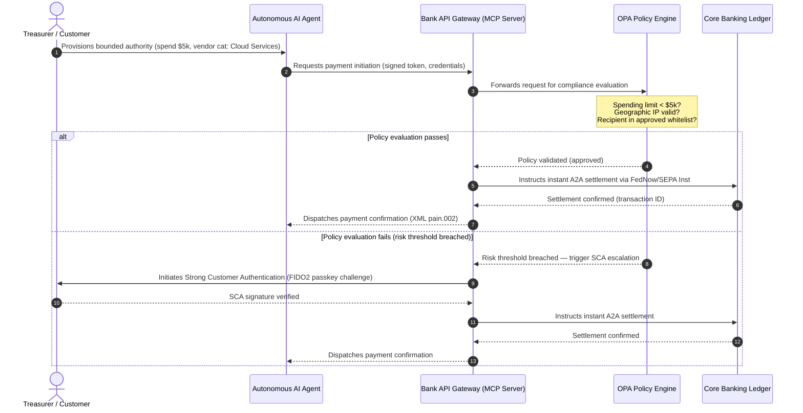

# 2026 Küresel Ödemeler Görünümü: Ajan Tabanlı, Görünmez ve Gerçek Zamanlı Bir Dünyada İşletim Modeli, Risk ve Gelir

2026 küresel ödemeler döngüsü üç yakınsayan güçle tanımlanır — ajan tabanlı ticaret, görünmez gömülü ödemeler ve gerçek zamanlı yürütme — Project Agorá altındaki tokenize birleşik defter ve sert tarihli Kasım 2026 SWIFT yapılandırılmış adres geçişi üzerinde oturmaktadır.

<!-- lead-start -->
<aside class="post-lead" aria-label="Makale özeti">

<strong>TL;DR.</strong> 2026 ödeme manzarası, mesajlaşma göçünden risk ve gelirin gerçek zamanlı yürütme tarafından belirlendiği çok boyutlu bir işletim modeline geçti. Bu makale, J.P. Morgan, Global Payments, HSBC ve Payments Association'ın 2026 görünümlerini dört sütunlu bir G-SIB işletim planında sentezler; model tarafından başlatılan ajan tabanlı ticareti, her zaman açık hazine API'lerini, BIS Project Agorá kapsamında tokenize birleşik defterleri ve 14/15 Kasım 2026 SWIFT ve SEPA yapılandırılmış adres son tarihlerini kapsar (Swift CBPR+: 14 Kasım 2026; EPC SEPA kural kitapları: 15 Kasım 2026).

<strong>Temel çıkarımlar</strong>

<ul class="post-lead-takeaways">
  <li><strong>Ajan tabanlı ticaret, devredilen sorumluluk sınırını açar.</strong> Özerk AI ajanlarının 2030'a kadar yıllık 3-5 trilyon dolarlık ticarete aracılık etmesi öngörülmektedir. Bankalar, MCP geçit denetimini, PSD3/PSR altında SCA devrini ve çok ajanlı ödeme zincirlerinde KYC/AML sahipliğini tanımlamalıdır.</li>
  <li><strong>Her zaman açık likidite artık operasyonel ve düzenleyici bir taban çizgisidir.</strong> 7/24 hazine API'leri ve sanal hesaplar sıkışmış nakdi en aza indirir ve dayanıklılık çıtasını yükseltir. Sistemik öneme sahip gerçek zamanlı hazine API'leri için beş dokuz (99,999 %) kullanılabilirlik, bankaların denetçilere DORA seviyesinde dayanıklılığı kanıtlamak üzere kendilerine koyduğu içsel mühendislik hedefi haline gelmektedir. DORA'nın kendisi evrensel bir beş dokuz eşiği öngörmez; BİT risk yönetimini, olay raporlamayı, dayanıklılık testlerini, üçüncü taraf riskini ve kritik BİT sağlayıcılarının denetimini kapsar.</li>
  <li><strong>Tokenizasyon, düzenlenmiş birleşik defterlere yükseldi.</strong> Project Agorá, tokenize ticari banka mevduatları ve merkez bankası rezervleri için en büyük kamu-özel çerçevedir. Bankaların, açık ihtiyati muamele ile beş adımlı bir tokenizasyon yolculuğuna ihtiyacı vardır.</li>
  <li><strong>14/15 Kasım 2026 yapılandırılmış adres geçişi sert tarihlidir.</strong> Swift CBPR+ yapılandırılmamış `<AdrLine>` bloğunu 14 Kasım 2026 itibarıyla kaldırır; EPC SEPA kuralları yapılandırılmamış adrese yalnızca 15 Kasım 2026'ya kadar izin verir. Her ikisi de geçişten sonra reddedilmeyi tetikler. Ürün, teknoloji ve uyum ekipleri arasında temiz veri yönetişimi gereklidir.</li>
</ul>

<strong>İlgili okumalar:</strong> <a href="https://sebastienrousseau.com/2026-06-23-iso-20022-pain001-programmable-liquidity-autonomic-treasury-2026">From Pain.001 to Programmable Liquidity: ISO 20022 as the Autonomic Nervous System of Treasury in 2026</a>, <a href="https://sebastienrousseau.com/2026-06-24-cross-border-iso-20022-open-finance-tokenised-deposits-treasury-2026">Cross-Border 2026: ISO 20022, Open Finance and Tokenised Deposits in Corporate Treasury</a>, <a href="https://sebastienrousseau.com/2026-06-25-quantum-dawn-cib-kyberlib-quantum-resilient-payments-stack-2026">Quantum Dawn for CIB: From KyberLib to a Quantum-Resilient Payments Stack</a>.

</aside>
<!-- lead-end -->

Küresel işlem bankaları için 2026-2028 döngüsü yapısal bir penceredir. Modern ödeme altyapısı artık idari bir hizmet değildir — banka düzeyinde teknoloji stratejisinin çekirdeğidir. G-SIB'ler ve büyük bölgesel kuruluşlar içinde teknoloji, düzenleme ve müşteri beklentisi tek bir işletim düzleminde birleşmiştir.

Bu döngüyü üç güç tanımlar ve her biri doğrudan bir üst düzey yönetim endişesine eşlenir.

- **Ajan tabanlı ticaret** — kanal dağıtımı, ürün tasarımı, sorumluluk atama ve denetim incelemesi altında Model Risk Yönetimi.
- **Görünmez ödemeler** — bankaların defterlerini kurumsal ve satıcı ön uçlarına gömmediği durumlarda aracılıktan çıkarma riski taşıyan müşteri deneyimi.
- **Gerçek zamanlı yürütme** — sermaye hızı; bunun likidite yönetimi, kredi riski, operasyonel dayanıklılık ve dolandırıcılık savunmasına yansıyan sonuçları.

Mali bedeller maddidir. Dolandırıcılık hız ve karmaşıklıkta ölçeklenir; düzenleyici son tarihler serttir; çekirdek sistemlerini proaktif olarak modernize eden bankalar önemli ücret-gelir fırsatlarının kilidini açar. Eylemsizliğin maliyeti tersidir: anlık işlem reddileri, operasyonel darboğazlar, düzenleyici cezalar ve hızlı pazar payı erozyonu.

## Kesinlik merdiveni — neyin tarihli, düzenlenmiş veya tahmini olduğu

Bu rapordaki her madde aynı kesinliği taşımaz. Yönetim kurulu düzeyindeki soru, hangi deltaların son tarih, hangilerinin denetim beklentisi ve hangilerinin hâlâ pazar projeksiyonu olduğudur — çünkü cevap bütçe konuşmasını değiştirir.

| Kategori | Örnekler |
| --- | --- |
| **Sert son tarihler** | Swift CBPR+ yapılandırılmış adres geçişi (14 Kasım 2026); EPC SEPA kural kitapları (15 Kasım 2026) |
| **Düzenleyici yükümlülükler** | DORA BİT riski + dayanıklılık testi + üçüncü taraf denetimi (AB); PSD3/PSR kapsamında SCA devri; SR 11-7 + PRA SS1/23 kapsamında MRM |
| **Yüksek olasılıklı pazar kaymaları** | Gerçek zamanlı hazine API'leri, AI öncülüğünde dolandırıcılık savunması, API tabanlı likidite, derin sahteciliğe dayalı biyometrik dolandırıcılık |
| **Stratejik seçenekler** | Tokenize mevduatlar, Project Agorá kapsamında birleşik defterler, ajan tabanlı ticaret koridorları, sürekli FX (Wire 365) |
| **Tahminler** | 2030'a kadar $3-$5 trillion yıllık ajan tabanlı ticaret akışları (McKinsey taban çizgisi) |

İlk iki satırı, banka herhangi bir yukarı yönlü fırsatı yakalasın ya da yakalamasın bir bütçe kalemini yönlendiren uyum gerçekleri olarak ele alın. Alt iki satırı, yön konusunda yüksek inançlı ancak yürütme zamanlamasının düzenleyici takvim girişi değil, yönetim kurulu seçimi olduğu stratejik seçenekler olarak ele alın.

## Küresel ödeme otoritelerinin yakınsaması

Bu rapor, dört yetkili sektör sesinin 2026 ödemeler ve ticaret görünümlerini sentezler — [J.P. Morgan Payments](https://www.jpmorgan.com/payments/newsroom/payments-outlook-2026-trends-report-released "J.P. Morgan Payments — Outlook 2026"), [Global Payments](https://investors.globalpayments.com/news-events/press-releases/detail/497/global-payments-releases-its-2026-commerce-and-payment "Global Payments — 2026 Commerce and Payment Trends Report"), HSBC ve The Payments Association — ve bunları [Sınır Ötesi Ödemeleri İyileştirme G20 Yol Haritası](https://www.fsb.org/2026/03/fsb-kicks-off-new-implementation-phase-to-enhance-cross-border-payments-through-public-private-partnership/ "FSB — cross-border payments implementation phase, March 2026") ile üçgenler.

Her kuruluş ekosisteme farklı bir pazar açısından yaklaşır, ancak bulguları üç değişmezde birleşir.

1. **Anında, API odaklı raylar taban çizgisidir.** Eski toplu işleme modelleri, sınır ötesi ve yüksek değerli akışlar için marjinalleştirilmiştir; bu segmentlerdeki işlem hızı, her zaman açık, gerçek zamanlı mesajlaşma ile belirlenir.
2. **AI hem tehdit hem savunmadır.** Üretken araçlar ve derin sahtekarlık, işlem dolandırıcılığını ölçeklendirir; bu da gerçek zamanlı, çok katmanlı makine öğrenimi karşı savunmalarını gerektirir.
3. **Tokenizasyon, üretime hazır altyapıdır.** Defterler, tokenize ticari yükümlülükleri ve toptan merkez bankası dijital paralarını barındırmak için birleşmektedir.

| Rapor | Birincil hedef kitle | Odak | Anahtar sütun | Banka etkisi |
| --- | --- | --- | --- | --- |
| **J.P. Morgan Payments** | Kurumsal hazinedarlar, G-SIB'ler | Gerçek zamanlı likidite, dolandırıcılık | API'ler, AI biyometriği | Sürekli 365 günlük mutabakat için likidite, FX ve risk sistemlerini yeniden inşa edin. |
| **Global Payments** | Satıcılar, e-ticaret | POS evrimi, çok kanallı | Ajan tabanlı ticaret, sürtünmesiz ödeme | Özerk AI ajanları için güvenli, API kapılı satıcı ödeme koridorları inşa edin. |
| **HSBC Insights** | Çok uluslu şirketler | ERP entegrasyonları (SAP/Oracle), gerçek zamanlı nakit | Treasury-as-a-Service, nakit görünürlüğü | İşlemsel API paketlerini paraya çevirin ve gerçek zamanlı nakit defter raporlamasını kaynakta gömün. |
| **The Payments Association** | Fintech'ler, ödeme kuruluşları | Stablecoin'ler, tokenizasyon, küresel düzenleme | Düzenlenmiş dijital varlıklar, politika uyumu | Bilançoları tokenize mevduatlara hazırlayın ve PSD3/PSR sorumluluk yapılarında yön bulun. |

Dört görünüm, kamu sektörü G20 politika altyapısının üzerinde çalışan özel sektör işletim yığınını fiilen tanımlar; politika niyetini bankalar içinde likidite, tokenizasyon, veri ve dolandırıcılık kontrolü konusunda somut kararlara dönüştürür.

## Sütun 1 — Ajan tabanlı ticaret ve görünmez ödemeler

Ajan tabanlı ticaret, insan odaklı, satın al-tıkla ödemeden özerk, model odaklı işlem başlatmaya geçiştir. Sektör tahminleri, 2030'a kadar özerk ajanlar tarafından aracılık edilen yıllık 3-5 trilyon dolarlık ticarette birleşir — küresel ödeme hacminin düşük tek haneli payı, bir insan 'satın al' düğmesine basmadan yürütülür.

Perakende ve ticari ekosistemde buna karşılık gelen bir boşluk vardır. Tüketicilerin açık çoğunluğu artık neredeyse sürtünmesiz ödemeler beklerken, satıcıların yarısından azı tek tıkla ödeme veya API erişimli ürün kataloglarını önceliklendirmiştir. AI ajanları, insan gözleri için tasarlanmış eski çok sayfalı ödeme ekranlarında gezinemez; yapılandırılmış, makineden makineye API tokalaşmalarına ihtiyaç duyarlar.

### Banka öncelikleri ve operasyonel etki

- **KYC ve AML sahipliği.** Bankalar, bir ajan tabanlı işlem zincirinde uyum yükümlülüğünü kimin taşıdığını tanımlamalıdır. Bir tüketicinin kişisel AI ajanı, bir satıcının ajan tabanlı ödemesi aracılığıyla bir işlem başlatırsa, banka, başlatan devredilen yetkinin birincil hesap sahibine kriptografik olarak bağlı olduğunu doğrulamalıdır.
- **Sorumluluk ve ters ibraz yeniden tasarımı.** Kart şemaları ve A2A rayları, insan yetkilendirmesi etrafında tasarlanmıştır. Bir AI ajanı hatalı bir satın alma yaptığında — örneğin bir veri ayrıştırma hatası nedeniyle yanlış endüstriyel envanter tedarik ettiğinde — bankalar sorumluluğu tüketici, ajan sağlayıcısı ve satıcı arasında net olarak tahsis etmelidir.
- **Ajan tabanlı akışları risk dereceleme.** Ödeme yönlendirme motorları, ajan tabanlı ödemeleri dinamik olarak risk derecelendirmelidir; istikrarlı bir mutabakat geçmişi oluşana kadar insan dışı başlatılan işlemlere daha yüksek rezerv gereksinimleri veya değişim oranları uygulamalıdır.

### Sınırlı eylem ve sınırlı yetki

"Sınırsız eylemi" — bir yazılım hatası nedeniyle sonsuz özyinelemeli bir satın alma döngüsü çalıştıran bir kurumsal satın alma ajanını — azaltmak için, bankalar **sınırlı yetkili API kapıları** kurmalıdır. Kapılar, politika düzeyindeki sınırları üç boyutta uygular.

1. **Katmanlı finansal sınırlar** — ajan harcamaları işlem büyüklüğü, günlük kümülatif değer ve satıcı kategorisine göre kısıtlanır.
2. **Bağlama duyarlı güvenceler** — ikincil sinyaller (günün saati, IP coğrafi konum, işlem sıklığı) defter fonları serbest bırakmadan önce değerlendirilir.
3. **Döngü içinde insan eskalasyonu** — bir işlem risk eşiklerini aştığında PSD3 / PSR kapsamında Güçlü Müşteri Kimlik Doğrulaması (SCA) yoluyla tetiklenen zorunlu insan yetkilendirmesi.

Aşağıdaki Mermaid sırası, birçok bankanın sınırlı yetkili ajan tabanlı ödeme akışı olarak tanıyacağı hedef mimariyi gösterir.

### Model Context Protocol (MCP)

Yerelleştirilmiş AI modellerini banka yönetimindeki yürütme katmanlarına bağlamak için sektör, [Model Context Protocol (MCP)](https://modelcontextprotocol.io "Model Context Protocol — open standard for LLM tool integration") etrafında standartlaşmaktadır — LLM'lerin temel sistemlere ham erişim olmadan açıkça kapsanmış, denetlenebilir araçları ve API'leri çağırmasına olanak tanıyan açık bir protokol.

Bankacılık API'lerini (ödeme başlatma, bakiye sorgulama, taraf doğrulama) bir MCP sunucusu içine sarmak, LLM'leri veritabanı tablolarından ve sistem-kök kontrollerden uzak tutar. Model, deftere yalnızca yapılandırılmış, denetlenmiş, hız sınırlamalı uç noktalar aracılığıyla etkileşim kurar — güvenlik, modelin içine gömülmek yerine ajan tabanlı araç yürütmenin sınırında uygulanır.

## Sütun 2 — Hazine dönüşümü ve likiditenin yeniden tasarlanması

2026'da işlem bankacılığının hızı, gün sonu toplu işlemden her zaman açık, gerçek zamanlı hazine işlemlerine geçişle belirlenir. Çok uluslu şirketler artık sıkışmış nakdi — mutabakat sistemleri kapalı olduğu için hafta sonları veya tatillerde yerel hesaplarda boşta oturan likiditeyi — tolere etmez.

### Gerçek zamanlı likidite için ekonomik gerekçe

J.P. Morgan ve HSBC, gelişmiş gerçek zamanlı nakit ve veri yeteneklerine sahip şirketlerin, esas olarak sıkışmış likiditeyi azaltarak ve işletme sermayesi döngülerini optimize ederek, gelir büyümesi ve sermaye verimliliği konusunda akranlarından önemli ölçüde daha iyi performans gösterme olasılığının daha yüksek olduğunu rapor eder.

Bu değeri yakalamak için bankalar, kurumsal ERP'lerin (SAP, Oracle) doğrudan bankanın defterine bağlanmasına olanak tanıyan **Treasury-as-a-Service (TaaS) API ürünleri** sunar.

- **Gerçek zamanlı bakiye API'leri** `camt.052` şemasını kullanır — dosya aktarım protokollerini anlık, olay odaklı nakit pozisyonu raporlamasıyla değiştirir.
- **Toplu ödeme başlatma API'leri** `pain.001` kullanır — ERP defterinden satıcı ödeme partilerinin doğrudan, düz işlem yürütmesi.
- **Sürekli FX API'leri** — hazine motorları, sınır ötesi mutabakat için gerçek zamanlı, algoritmik döviz oranlarını kilitler ve gecelik piyasa açığı riskini ortadan kaldırır.
- **Sanal hesap API'leri** — şirketler, otomatik alacak eşleştirme ve defter ayrımı için binlerce alt hesabı dinamik olarak açar ve emekliye ayırır.

### Operasyonel dayanıklılık ve DORA

Her zaman açık likidite sunmak, bankanın risk profilini dönüştürür. Sistemik öneme sahip gerçek zamanlı hazine API'leri için beş dokuz (99,999 %) kullanılabilirlik, bankaların denetçilere DORA seviyesinde dayanıklılığı kanıtlamak üzere kendilerine koyduğu içsel mühendislik hedefi haline gelmektedir. DORA'nın kendisi evrensel bir beş dokuz eşiği öngörmez; BİT risk yönetimini, olay raporlamayı, dayanıklılık testlerini, üçüncü taraf riskini ve kritik BİT sağlayıcılarının denetimini kapsar.

[Dijital Operasyonel Dayanıklılık Yasası (DORA)](https://eur-lex.europa.eu/legal-content/EN/TXT/?uri=CELEX%3A32022R2554 "Regulation (EU) 2022/2554 — Digital Operational Resilience Act") kapsamında bu yalnızca bir BT KPI'si değildir — katı bir düzenleyici beklentidir. Düzenleyiciler, bankaların gerçek zamanlı hazine API yüzeyinin ve defter veritabanının, kritik ödemeleri kesintiye uğratmadan veya sistemik likiditeyi tehlikeye atmadan ciddi-ama-makul siber saldırıları, ağ kesintilerini ve hiperölçekleyici aksaklıklarını absorbe edebileceğini kanıtlamasını bekler. Bu, coğrafi yedekli, aktif-aktif çoklu bulut veritabanı mimarilerini, gerçek zamanlı tehdit algılama katmanlarını ve otomatik yük devretmeyi gerektirir — yalnızca denetim dosyasında değil, değişim maliyet satırında görünür.

### Sürekli FX ve sınır ötesi yenilik

Gerçek zamanlı hazine tek para birimi sınırı içinde yaşayamaz. G-SIB'ler sürekli FX altyapısı kurmaktadır — J.P. Morgan'ın [Wire 365](https://www.jpmorgan.com/insights/payments/fx-cross-border/wire-365-global-clearing "J.P. Morgan — Wire 365 global clearing reinvented") platformu, geleneksel merkez bankası RTGS saatlerinin ötesinde yılın herhangi bir günü sınır ötesi ödemeleri ve FX dönüşümlerini işler. Bu katman, Sütun 3'te tartışılan tokenize mevduat ve birleşik defter sistemleriyle doğrudan kenetlenir.

## Sütun 3 — Tokenize mevduatlar ve birleşik defter

Tokenizasyon, izole kavram kanıtı pilotlarından ölçekli, banka düzeyinde parasal altyapıya yükselmiştir. Odak, özel stablecoin'lerden ve spekülatif kripto varlıklardan, programlanabilir birleşik defterler üzerinde çalışan **tokenize ticari banka mevduatlarına** ve **toptan merkez bankası dijital paralarına (wCBDC'ler)** kaymıştır.

Referans çerçevesi [Project Agorá](https://www.bis.org/about/bisih/topics/fmis/agora.htm "BIS Project Agorá — tokenisation of wholesale cross-border payments") — BIS ve IIF tarafından toplanan, **sekiz merkez bankası** ve 40'tan fazla özel finans kuruluşunu içeren büyük bir kamu-özel işbirliğidir (27 Mayıs 2026'da güncellenen BIS Agorá sayfasına göre). Proje, tokenize ticari banka mevduatlarının sınır ötesi mutabakat sürtünmesini ortadan kaldırmak, uyum kontrollerini koordine etmek ve 7/24 atomik kesinlik sağlamak için paylaşılan programlanabilir bir defter üzerinde tokenize toptan CBDC'lerle nasıl entegre olduğunu araştırır.

### Beş adımlı tokenizasyon yolculuğu

G-SIB'ler ve büyük bölgesel bankalar için tokenizasyon, dahili optimizasyondan açık pazar birlikte çalışabilirliğine doğru aşamalı bir yolculuktur.

1. **Dahili hazine likiditesi** — bankanın kendi şubeleri arasında anlık, 7/24 sınır ötesi transfer ve netleştirmeyi mümkün kılmak için dahili kurumsal nakit bakiyelerini (örneğin JPM Coin veya eşdeğer özel banka defterleri) tokenize etmek.
2. **Sınırlı çoklu banka koridorları** — farklı kuruluşlar arasında bankalararası mutabakatı ve paylaşılan defter durumunu test etmek için kapalı, düzenlenmiş konsorsiyumlar (Project Agorá kum havuzu).
3. **Sürekli programlanabilir FX** — birleşik defterdeki akıllı sözleşmeler, saat dilimleri arasında mutabakat riskini ortadan kaldırarak anlık Ödeme-karşı-Ödeme (PvP) FX yürütür.
4. **Tokenize gerçek dünya varlıkları (RWA'lar)** — tokenize nakit bacağı, anlık Teslimat-karşı-Ödeme (DvP) kesinliği için tokenize menkul kıymetler, borç veya ticaret defterleriyle entegre olur ve sermaye kilitlenmesini günlerden milisaniyelere indirir.
5. **Düzenlenmiş kamu/hibrit birlikte çalışabilirlik** — güvenli geçit sarmalayıcılar, kurumsal likiditenin açık kamu ağlarıyla güvenli bir şekilde etkileşime girmesine olanak tanır.

### İhtiyati ve bilanço etkileri

Tokenize nakit, ihtiyati çerçevelerden dikkatlice yönlendirilmelidir. Denetçiler, bir tokenize mevduatın geleneksel bir ticari banka mevduatına ekonomik olarak eşdeğer olması gerektiğini vurgular — bu, bankanın bilançosunda aynı mevduat sigortası kapsamına sahip teminatsız bir yükümlülük anlamına gelir.

Operasyonel olarak, tokenize mevduatlar, klasik likidite stres modellerinin simüle etmek üzere inşa edilmediği riskler getirir. Akıllı sözleşmeler, eski varsayımların yakalamadığı hızlarda ve hacimlerde programlanabilir çekimler yürütür. Basel III kapsamında bankalar, risk motorunun programlanabilir nakit çıkışlarını modelleyebildiğinden ve tokenize defterin günlük likidite döngüsü boyunca eski RTGS sistemleriyle temiz bir şekilde birlikte çalıştığından emin olmalıdır.

### Stablecoin'lere karşı tokenize mevduatlar — nüanslı bir tutum

Tamamen rezerv edilmiş özel stablecoin'ler (USDC, vb.), perakende sınır ötesi havale ve merkeziyetsiz ticarette pazar payı yakalamaya devam eder, ancak ticari bankacılık sisteminin kredi yaratma kapasitesinden ve mutabakat kesinliğinden yoksundur.

İşlem bankaları, perakende rayları üzerinde rekabet etmek yerine, saklama hizmetleri kurar, kendi düzenlenmiş tokenize yükümlülük araçlarını ihraç eder ve güvenli giriş-/çıkış geçitleri inşa eder. Kurumsal müşteriler, sermayeyi düzenlenmiş çevre içinde tutarken programlama esnekliği kazanır.

### Bir yönetim kurulunun tokenize para hakkında sorması gereken sorular

- **Birleşik defter katılımı.** Project Agorá gibi toptan kamu-özel birleşik defter girişimlerine katılmak için aktif stratejik yol haritamız nedir?
- **Bilanço ve risk modellemesi.** Risk motorlarımız ve sermaye yeterliliği çerçevelerimiz, akıllı sözleşme tetiklemeli token çıkışlarının hızını hesaba katmak için stres testlerini güncelledi mi?
- **İlk hareket eden müşteri segmentleri.** Kurumsal hazine ve ticari bankacılık müşteri segmentlerimizden hangileri, programlanabilir, tokenize DvP/PvP mutabakatından hemen yararlanacaktır?

## Sütun 4 — Yapılandırılmış veri ve dolandırıcılık savunması

2026'da altyapı uyumu, **14/15 Kasım 2026 yapılandırılmış adres geçişi** tarafından domine edilir — sınır ötesi ve AB içi raylarda yapılandırılmamış adres yolunu birlikte kapatan iki bitişik son tarih. [SWIFT Standards Release (SR) 2026](https://www.swift.com/standards/iso-20022/removal-unstructured-address "SWIFT — Removal of unstructured address, November 2026") kapsamında Swift CBPR+ yapılandırılmamış `<AdrLine>` bloğunu **14 Kasım 2026** itibarıyla kabul etmeyi durdurur. 2025 EPC SEPA kural kitapları kapsamında yapılandırılmamış adres formatına yalnızca **15 Kasım 2026'ya** kadar izin verilir. Geçişlerden sonra, yapılandırılmış öğelerin beklendiği yapılandırılmamış adres taşıyan herhangi bir sınır ötesi veya yerel mesaj, ağ tarafından geciktirilecek veya reddedilecektir.

Çoğu kuruluş tarihi biliyor. Birçoğu bunu arayüz katmanında yüzeysel bir eşleme alıştırması olarak ele alır. Gerçek, daha derin bir veri kalitesi ve veri yönetişimi zorluğudur. Felaket düzeyinde ret oranlarından kaçınmak için ödeme operasyonlarının net bir çapraz işlevsel yönetişim çerçevesine ihtiyacı vardır.

- **Ürün ve operasyonlar.** Kaynakta veri yakalama. Müşteriye yönelik dijital portallar, müşteri kabul arayüzleri ve kurumsal ERP girdi alanları, ödeme başlatma noktasında yapılandırılmış adres alanlarını (`<StrtNm>`, `<PstCd>`, `<TwnNm>`, `<Ctry>`) uygulamalıdır.
- **Teknoloji.** Ayrıştırma, eşleme, şema doğrulama. Doğrulama motorları, eski dosyaları SWIFT arayüzüne ulaşmadan önce engeller. Yerel olarak konuşlandırılan makine öğrenimi modelleri, eski yapılandırılmamış adres bloklarını `<PstlAdr>` altında XML uyumlu etiketlere ayrıştırır.
- **Uyum ve risk.** Yaptırım taraması, işlem izleme ve AML mantığı, yapılandırılmış XML alanlarını içselleştirmek için güncellenir — yanlış pozitif oranları ve manuel araştırmaları azaltır.

### Yapılandırılmış veri için iş gerekçesi

Bir uyum maliyeti olarak ele alındığında, yapılandırılmış veri programı pahalıdır. Bir gelir etkinleştirici olarak ele alındığında, kendi kendini öder.

1. **Gelişmiş kredi karar verme.** Yapılandırılmış fatura, havale ve nihai borçlu verileri, bankaların kurumsal müşteriler için otomatik, kesin işletme sermayesi finansmanı ve tedarik zinciri fatura faktoringi programları inşa etmesine olanak tanır.
2. **Otomatik alacak eşleştirme.** Yapılandırılmış taraf ve fatura tanımlayıcılarını açığa çıkarmak, premium nakit mutabakatı ve sanal hesap havuzlama ürünlerini destekler ve yeni işlem ücreti geliri yaratır.
3. **Paraya çevrilebilir işlem analitiği.** Bankalar, kurumsal CFO'lara ve hazinedarlara ayrıntılı gerçek zamanlı likidite ve satın alma deseni analitik panolarını paketler ve satar.

### Katmanlı bir AI dolandırıcılık savunması

İşlem hızları gerçek zamana hızlandıkça dolandırıcılık teknikleri ölçeklenmiştir. [Entrust 2026 Kimlik Sahteciliği Raporu](https://www.entrust.com/resources/reports/identity-fraud-report "Entrust 2026 Identity Fraud Report") derin sahteleri **beş biyometrik sahtecilik girişiminden birine** yerleştirir; daha önceki Entrust analizi derin sahteleri özellikle **video biyometrik sahtecilik girişimlerinin %40'ına** yerleştiriyordu. Her iki çerçevede de sentetik medya, müşteri kabul ve ödeme akışlarında ses ve yüz tanıma kontrollerini yenmek için artık maddi bir kanaldır.

Savunma, **üç katmanlı bir AI dolandırıcılık modelidir**.

1. **Kimlik katmanı.** Biyometrik olarak doğrulanmış [FIDO2](https://fidoalliance.org/fido2/ "FIDO Alliance — FIDO2 specification") geçiş anahtarları, kriptografik olarak imzalanmış donanım cihaz bağlama ve ödeme erişimini güvenli hale getirmek için merkeziyetsiz dijital kimlik cüzdanları.
2. **Davranışsal katman.** Sürekli davranışsal biyometri — oturum gezinme temposu, yazma hızı, cihaz yönelimi — otomatik bot yürütmesini veya oturum ele geçirme girişimlerini tespit etmek için.
3. **İşlem katmanı.** ISO 20022'nin yapılandırılmış alanları, gerçek zamanlı makine öğrenimi risk motorlarını besler; işlem meta verilerini paylaşılan ağ düzeyindeki konsorsiyum istihbaratıyla çapraz referanslayarak şüpheli işlemleri başlatıldıktan milisaniyeler içinde tanımlar.

Denetçileri tatmin etmek için işlem katmanı AI modelleri katı **açıklanabilirlik parametrelerini** içerir ve özel bir Model Risk Yönetimi (MRM) programı altında çalışır. Düzenleyiciler, bankaların [ABD Federal Reserve SR 11-7](https://www.federalreserve.gov/frrs/guidance/supervisory-guidance-on-model-risk-management.htm "US Federal Reserve — Supervisory Guidance on Model Risk Management, SR 11-7") ve İngiltere Bankası'nın [PRA SS1/23](https://www.bankofengland.co.uk/prudential-regulation/publication/2023/may/model-risk-management-principles-for-banks-ss "Bank of England PRA SS1/23 — Model Risk Management principles for banks") ile uyumlu olarak otomatik bir bloğu veya dolandırıcılık uyarısını tetikleyen belirli veri noktalarını ve algoritmik mantığı açıklamasını bekler.

## 2026-2028 yönetim kurulu gündemi

Dört sütun boyunca yürütmek için, G-SIB ve bölgesel banka yönetim organları, operasyonel ve teknoloji yatırımlarını net bir üç ufuk yol haritasında düzenlemelidir.

### Ufuk 1 — Anlık uyum ve çekirdek sağlamlaştırma (0-12 ay)

- **Odak.** ISO 20022 veri kalitesini standartlaştırın ve temel gerçek zamanlı işlem yollarını güvence altına alın.
- **Başarı göstergesi (KPI).** 14/15 Kasım 2026 geçişlerinden sonra SWIFT ve SEPA'da sıfır yapılandırılmamış adres reddi.
- **Yönetici sahibi.** İcra Direktörü / Ödeme Operasyonları Başkanı.
- **Teslim edilebilir tipi.** Pişman olunmayacak hamle. Çekirdek veritabanı şema güncellemeleri ve SWIFT SR 2026 doğrulama motoru.

### Ufuk 2 — Otomasyon ve ajan tabanlı güvenceler (12-24 ay)

- **Odak.** Sınırlı ajan tabanlı API kapıları ve sürekli dolandırıcılık savunma mimarisi.
- **Başarı göstergesi (KPI).** FIDO2 donanım bağlama ve sınırlı yetkili politika motorları aracılığıyla doğrulanan makineden makineye ve AI tarafından başlatılan API işlemlerinin %100'ü.
- **Yönetici sahibi.** Bilgi İşlem Direktörü / Risk Direktörü.
- **Teslim edilebilir tipi.** Pişman olunmayacak hamle (dolandırıcılık savunması) artı stratejik seçenek (ajan tabanlı ticaret). MCP yayılımı ve üç katmanlı dolandırıcılık AI'sı.

### Ufuk 3 — Platform tokenizasyonu ve birleşik defterler (24-36 ay)

- **Odak.** Hazine varlıklarını tokenize mevduatlara geçirin ve paylaşılan sınır ötesi defterlere katılın.
- **Başarı göstergesi (KPI).** Yüksek değerli kurumsal hazine mutabakat hacminin en az %15'i, tokenize mevduat araçları veya birleşik defter düzenlemeleri (örneğin Project Agorá koridorları) aracılığıyla yerel olarak işlenmektedir.
- **Yönetici sahibi.** Grup Hazinedarı / İşlem Bankacılığı Başkanı.
- **Teslim edilebilir tipi.** Stratejik seçenek. Programlanabilir defter altyapısı, akıllı sözleşme likidite kuralları, DvP/PvP mutabakat adaptörleri.

## Pazartesi sabahı yapılacaklar — bankalar için altı maddelik kontrol listesi

Üç ufuklu yol haritası döngü planıdır. Aşağıdaki kontrol listesi, programın geri kalanı ne kadar olgun olursa olsun, bir CIO, COO veya İşlem Bankacılığı Başkanının önümüzdeki çalışma haftasının sonuna kadar masaya koyabileceği şeydir.

1. **Yapılandırılmamış adres maruziyetini envantere alın** — kanal ve mesaj tipi başına. Hâlâ serbest metin `<AdrLine>` üreten her eski dosya yolu, her eski API uç noktası, her kurumsal ERP. Çıktı: kaynak başına bir sayım, bir sahip ve bir iyileştirme tarihi.
2. **Ajan tabanlı ödeme risk taksonomisi oluşturun.** İnsan dışı başlatılan akışları başlatma yöntemine (tüketici ajanı, satıcı ajanı, kurumsal satın alma ajanı), karşı taraf tipine ve raya göre kategorize edin. Çıktı: tek sayfalık bir taksonomi ve bir yönlendirme motoru bileti.
3. **AI tarafından başlatılan ödemeler için devredilmiş yetki politika sınırlarını tanımlayın.** İşlem büyüklüğü, satıcı kategorisi, coğrafyaya göre katmanlı sınırlar. Çıktı: OPA motorunun uygulayabileceği bir taslak kod olarak politika spesifikasyonu.
4. **DORA için kritik hazine API'lerini ve üçüncü taraf bağımlılıklarını haritalayın.** Hangi API'ler ciddi-ama-makul senaryo envanterinde oturuyor; hangi üçüncü taraflara bağımlılar; hangi sözleşmeler zaten DORA Madde 28'i karşılıyor. Çıktı: API başına bir kritik-BİT-üçüncü-taraf kayıt satırı.
5. **Ölçülebilir hazine değerine sahip iki tokenize mevduat kullanım senaryosu belirleyin.** Şubeler arası dahili netleştirme ve tek bir Project Agorá komşu koridoru gerçekçi ilk ikidir. Çıktı: her biri için sahip ve 90 günlük karar tarihiyle birlikte boyutlandırılmış bir iş gerekçesi.
6. **Dolandırıcılık ve ajan tabanlı karar verme için bir model risk kontrol çerçevesi oluşturun.** Dolandırıcılık ve ajan tabanlı ödeme yollarındaki her ML modelini SR 11-7 / PRA SS1/23 beklentilerine eşleyin: belgelenmiş amaç, veri soyağacı, açıklanabilirlik, izleme, geçersiz kılma yolu. Çıktı: model başına tek sayfalık bir MRM kontrol matrisi.

Listenin amacı, içindeki herhangi bir maddenin yeni olması değildir. Amaç, bu hafta başlamak için yeterince küçük, bir sonraki yürütme komitesinde takip edilmek için yeterince gözlemlenebilir ve erken işin programa rakip olmak yerine onu beslemesi için dört sütunla yapısal olarak hizalanmış olmasıdır.

## SSS

**Ajan tabanlı ticaret 2030'a kadar gerçekten 3-5 trilyon dolara ulaşacak mı?**
McKinsey taban çizgisi, 2030'a kadar 5 trilyon dolar ajan tabanlı ticaret satışlarına işaret ediyor; bir dizi bağımsız tahmin 3 trilyon ile 5 trilyon dolar arasında kümeleniyor. Değişkenlik, satıcıların makine tarafından okunabilir ödeme API'lerini ne kadar agresif bir şekilde sunduğunu ve bankaların ajanların SCA devri altında işlem yapmasına ne kadar hızlı izin verdiğini yansıtır — darboğaz, ajan yeteneği tarafında değil, banka ve satıcı tarafındadır.

**14/15 Kasım 2026 geçişleri yerel SEPA akışlarına da uygulanır mı?**
Evet. Yapılandırılmış adres gereksinimi CBPR+ sınır ötesi ve SEPA ödeme mesajlarına uygulanır. Her iki rayı çalıştıran bankaların, iki paralel eşleme değil, SWIFT arayüzünün üstünde tek bir kanonik adres şemasına ihtiyacı vardır.

**Tokenize mevduat ile stablecoin aynı şey mi?**
Hayır. Tokenize mevduat, düzenlenmiş bir bankanın bilançosunda geleneksel bir mevduatla aynı mevduat sigortası kapsamına sahip teminatsız bir yükümlülüktür. Stablecoin tipik olarak, kredi yaratma kapasitesi olmayan, banka olmayan bir kuruluş tarafından ihraç edilen tamamen rezerv edilmiş bir araçtır. Project Agorá'nın tasarımı, tokenize mevduatların paylaşılan programlanabilir bir defter üzerinde toptan CBDC'lerin yanında oturduğunu varsayar; stablecoin'ler toptan mutabakat bacağında yer almaz.

**Project Agorá mevcut wCBDC pilotlarıyla nasıl ilişkilidir?**
Agorá, entegrasyon çerçevesidir. Ulusal wCBDC deneyleri merkez bankası parası bacağını kapsar; Agorá, tokenize ticari mevduatları aynı programlanabilir deftere getirir, böylece sınır ötesi mutabakat her iki para türü arasında atomik olur. Yedi katılımcı merkez bankası ve 40'tan fazla özel kuruluş, onu toptan tokenize para mimarisi için en büyük kamu-özel tasarım alanı yapar.

**Bir TaaS API'si için minimum DORA uyum duruşu nedir?**
Coğrafi yedekli aktif-aktif dağıtım, SM&CR (Birleşik Krallık) altında adlandırılmış sahiplerle belgelenmiş ciddi-ama-makul siber senaryolar ve kritik ödemeleri kesintiye uğratmayan test edilmiş yük devretme. Bu olmadan, TaaS ürünü bir gelir kalemi olmadan önce bir düzenleyici yükümlülüktür.

## Referanslar

- Bank for International Settlements (BIS) Innovation Hub. (2026). *Project Agorá: exploring tokenisation of wholesale cross-border payments*. [BIS Project Agorá](https://www.bis.org/about/bisih/topics/fmis/agora.htm).
- Deutsche Bank. (2026). *Digital Money: a perspective on stablecoins, tokenised deposits and CBDCs*. [Deutsche Bank Flow](https://flow.db.com/publications/flow-white-papers-and-guides/digital-money-a-perspective-on-stablecoins-tokenised-deposits-and-cbdcs).
- European Parliament and Council. (2022). *Regulation (EU) 2022/2554 on Digital Operational Resilience (DORA)*. [DORA Regulation](https://eur-lex.europa.eu/legal-content/EN/TXT/?uri=CELEX%3A32022R2554).
- Financial Stability Board. (2026). *FSB kicks off new implementation phase to enhance cross-border payments*. [FSB statement](https://www.fsb.org/2026/03/fsb-kicks-off-new-implementation-phase-to-enhance-cross-border-payments-through-public-private-partnership/).
- Global Payments. (2025). *2026 Commerce and Payment Trends Report — press release*. [Global Payments press release](https://investors.globalpayments.com/news-events/press-releases/detail/497/global-payments-releases-its-2026-commerce-and-payment).
- J.P. Morgan Payments. (2026). *Payments Outlook 2026 Trends Report Released*. [J.P. Morgan Newsroom](https://www.jpmorgan.com/payments/newsroom/payments-outlook-2026-trends-report-released).
- J.P. Morgan Insights. (2026). *5 Payment Trends to Watch for in 2026*. [J.P. Morgan Trends](https://www.jpmorgan.com/insights/payments/trends-innovation/five-payment-trends-in-2026).
- J.P. Morgan FX & Cross-Border. (2026). *Wire 365: Global Clearing Reinvented*. [J.P. Morgan FX Wire 365](https://www.jpmorgan.com/insights/payments/fx-cross-border/wire-365-global-clearing).
- SWIFT. (2026). *ISO 20022 milestone for November 2026: unstructured addresses to be removed*. [SWIFT ISO 20022 Milestone](https://www.swift.com/news-events/news/iso-20022-milestone-november-2026-unstructured-addresses-be-removed).
- SWIFT Standards. (2026). *Removal of unstructured address*. [SWIFT Standards](https://www.swift.com/standards/iso-20022/removal-unstructured-address).
- Bank of England. (2023). *Supervisory Statement (SS1/23) — Model Risk Management principles for banks*. [Bank of England PRA SS1/23](https://www.bankofengland.co.uk/prudential-regulation/publication/2023/may/model-risk-management-principles-for-banks-ss).
- US Federal Reserve. (2011). *Supervisory Guidance on Model Risk Management (SR 11-7)*. [SR 11-7](https://www.federalreserve.gov/frrs/guidance/supervisory-guidance-on-model-risk-management.htm).
- McKinsey & Company. (2025). *McKinsey forecast: $5 trillion in agentic commerce sales by 2030* (via Digital Commerce 360). [McKinsey agentic forecast](https://www.digitalcommerce360.com/2025/10/20/mckinsey-forecast-5-trillion-agentic-commerce-sales-2030/).
- HSBC Business. (2026). *HSBC Business Insights*. [HSBC Insights](https://www.business.hsbc.com/en-gb/insights).
- Bright Defense. (2026). *Deepfake Statistics: A Growing Security Concern*. [Deepfake fraud statistics](https://www.brightdefense.com/resources/deepfake-statistics/).
- European Banking Authority. (2019). *Guidelines on outsourcing arrangements (EBA/GL/2019/02)*. [EBA Outsourcing Guidelines](https://www.eba.europa.eu/regulation-and-policy/internal-governance/guidelines-on-outsourcing-arrangements).

<!-- enrich-start -->
<aside class="author-card" aria-label="Yazar hakkında"><strong class="author-card-name"><a href="/about/index.html">Sebastien Rousseau</a></strong>Uygulamalı AI, ISO 20022 göçü, finansal hizmetler için post-kuantum kriptografi ve toptan ödemelerin yapısal dönüşümü üzerine yazan kıdemli bankacılık teknoloji uzmanı.HSBC Commercial &amp; Investment Bank, PayPal, Barclays, Shazam, AKQA, Virgin Group genelinde 20+ yıl. <a href="/about/index.html">Tam profil</a> &middot; <a href="https://www.linkedin.com/in/sebastienrousseau/" rel="external noopener">LinkedIn</a> &middot; <a href="https://github.com/sebastienrousseau" rel="external noopener">GitHub</a></aside>

Son inceleme <time datetime="2026-06-25">2026-06-25</time>.

<!-- enrich-end -->
