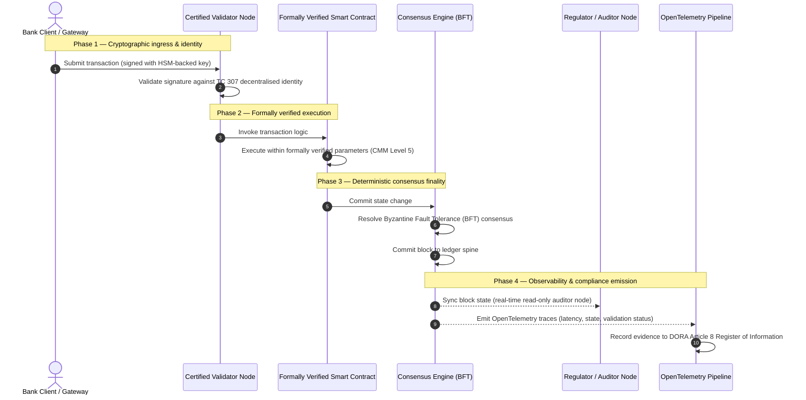

# Kanıttan hakikate: sertifikalı blok zincirleri neden bankacılık güveninin bir sonraki çağını tanımlayacak

## Stratejik özet (özün özü)

Toptan bankacılık ve küresel işlemler 2026'da tarihî bir dönüm noktasında bulunuyor. Finansal hizmetler doğuştan dijital, gerçek zamanlı takas ağlarına geçerken ve yapay zekâ olasılıksal belirsizlik getirirken, geleneksel analog, geriye dönük güvence modelleri (statik, kuruluş temelli denetimler gibi) modern risk yönetimi ve mütevelli yükümlülüklerini artık karşılamıyor.

ISO/IEC Teknik Komitesi TC 307, dağıtık defter teknolojileri için standartlaştırılmış bir temel oluşturdu. Ancak gerçek kurumsal benimseme, tanımlayıcı rehberlikten reçeteleyici, bağımsız olarak sertifikalanabilir blok zinciri güvencesine geçmeyi gerektirir. Defter yönetişimi, mutabakat bütünlüğü, akıllı sözleşme güvenliği ve kriptografik çevikliği katı beş seviyeli bir Yetenek Olgunluk Modeli'ne (CMM) göre puanlayarak bankalar, dağınık ve tedarikçiye özgü varsayımlardan sertifikalanabilir, yönetim kurulu tarafından denetlenebilir finansal hakikate geçebilir.

## Temel çıkarımlar

* **Mütevelli sürtünme boşluğu**: bugün bankayı (Basel III), bulutu (ISO 27001) ve yapay zekâ yönetişim sistemlerini (ISO 42001) sertifikalayabiliyoruz, ancak neyin doğru olduğunu giderek daha fazla belirleyen dağıtık defteri henüz sertifikalayamıyoruz. Bu asimetri büyük bir operasyonel zafiyettir.  
* **DORA doğrudan mütevelli sorumluluğu getirir**: DORA'nın 5. maddesi uyarınca, banka yönetim kurulları tüm üçüncü taraf ve defter dağıtımlarının operasyonel dayanıklılığından doğrudan, devredilemez kişisel sorumluluk taşır; başarısızlıklarda SM&CR rejimi kapsamında ağır kişisel yaptırımlar öngörülür.  
* **Yapay zekânın denetim omurgası**: makine öğreniminin yeniden üretilemeyen, olasılıksal sonuçlar ürettiği yerde, sertifikalı bir blok zinciri deterministik durum yakalaması sağlar. Model sürümlerini, girdileri ve doğrulama kararlarını zincir üzerinde kaydetmek, ISO 42001'i ve model riski yönetimi standartlarını karşılar.  
* **Sertifikalı Blok Zincirleri Endeksi**: bu endeks yönetişimi, mutabakatı, akıllı sözleşmeleri ve gözlemlenebilirliği doğrulanabilir, denetime hazır bir karneye 0'dan 5'e CMM ölçeğinde biçimlendirir ve mühendislik metriklerini yönetim kurulunca onaylanmış risk iştahı beyanlarına çevirir.

## 01. Dijital bankacılıkta mütevelli sürtünme boşluğu

Klasik bankacılıkta güven ilişkiseldir, kurumsaldır ve geriye dönüktür. Bağımsız üçüncü taraf denetçilerin finansal durumu sabit zaman noktalarında incelemesine ve ikili defter siloları arasındaki tutarsızlıkları mutabık kılmasına dayanır. 2026'nın gerçek zamanlı, API güdümlü piyasalarında bu model engelleyici gecikmeler ve yapısal riskler getirir.

İşlemler anında mutabakata bağlandığında, gün içi likidite havuzları API ağ geçitleri tarafından dinamik olarak yönetildiğinde ve varlık mülkiyeti paylaşılan defterlerde tokenleştirildiğinde, geriye dönük denetimler önleyici kontroller yerine adli tahkikat alıştırmaları hâline gelir. Mütevelliler artık yalnızca tüzel kişiliği sertifikalamaya güvenemez. Dijital altyapının kendisini sertifikalamak zorundadırlar.

Şu anda bankalar göze çarpan bir mimari asimetri altında faaliyet gösteriyor:

1. **Sertifikalı bulut altyapısı**: donanım düğümleri, sanallaştırılmış konteynerler ve fiziksel veri merkezleri ISO/IEC 27001 ve SOC 2 Type II kontrollerine göre doğrulanır.  
2. **Sertifikalı yönetim süreçleri**: operasyonel risk politikaları, iş sürekliliği planları ve algoritmik dağıtımlar katı risk çerçeveleriyle yönetilir.  
3. **Sertifikasız defter motorları**: dağıtık mutabakat mekanizmaları, doğrulayıcı düğüm tedarik zincirleri, akıllı sözleşme sınırları ve ağ yönetişim modelleri sertifikasız, özel yapım veya konsorsiyuma özgü varsayımlara bırakılır.

Bu asimetri kritik bir başarısızlık noktasıdır. Bir banka, güvenli, ISO 27001 sertifikalı bir bulut konteynerinde doğrulanmış bir uygulama çalıştırabilir; ancak o konteyner merkezî doğrulayıcı kontrolü, savunmasız mutabakat parametreleri veya denetlenmemiş akıllı sözleşmeler içeren bir dağıtık deftere yazıyorsa, işlem bütünlüğü tehlikeye girer. Bu boşluğu kapatmak için defter motorunun kendisi sertifikalanabilir bir güvence nesnesi hâline gelmelidir.

## 02. ISO/IEC TC 307 standartlaştırma temeli

Dağıtık defterleri standartlaştırmak için gereken temel çalışmayı ISO/IEC Teknik Komitesi TC 307 (Blok zinciri ve dağıtık defter teknolojileri) yürütmektedir. Blok zincirini yalıtılmış bir teknik protokol olarak ele almak yerine, TC 307 ona kurumsal bir güven altyapısı olarak yaklaşır ve çalışmasını beş temel sütun etrafında düzenler:

1. **Taksonomi ve terminoloji (ISO 22739)**: ortak bir adlandırma oluşturur ve yargı bölgeleri, finansal düzenler ve kurumlar arasında tutarlı hukuki ve operasyonel tanımlar sağlar.  
2. **Referans mimari (ISO/TR 23245)**: uyumlu bir dağıtık defter sisteminin sınırlarını, katmanlarını, veri akışlarını ve işlevsel bileşenlerini tanımlar.  
3. **Güvenlik, gizlilik ve akıllı sözleşmeler (ISO/TR 23244 / ISO 23613)**: dijital varlık sistemleri için temel güvenlik yönergeleri oluşturur ve akıllı sözleşme zafiyetlerinin azaltılması ile yaşam döngüsü yönetişimine ilişkin en iyi uygulamaları ayrıntılandırır.  
4. **Birlikte çalışabilirlik çerçeveleri**: heterojen defter ağları arasındaki veri ve varlık değişim mekanizmalarını ele alır ve yalıtılmış tokenleştirilmiş siloların oluşmasını önler.  
5. **Merkeziyetsiz kimlik ve güven çıpaları**: defter tabanlı kriptografik tanımlayıcıları resmî açık anahtar altyapılarıyla (PKI) ve devlet yetkili sicilleriyle bütünleştirir.

Toplu olarak TC 307, DLT'nin özel bir mühendislik seçiminden standartlaştırılmış bir mimari disipline geçişini işaret eder. Ancak TC 307 büyük ölçüde tanımlayıcı kalır. Mükemmelliğin nasıl göründüğünü tanımlar (rehberlik), ancak risk yetkililerinin ve denetçilerin kritik veya önemli işlevlerin (CIF) üretim dağıtımlarını yetkilendirmek için ihtiyaç duyduğu reçeteleyici doğrulama protokolünü (güvence) sağlamaz.

## 03. Rehberlik ile güvence: mütevelli ayrımı

Finansal piyasa katılımcıları bir teknolojiyi yenilikçi veya zarif olduğu için devreye almaz; yönetilebildiği, denetlenebildiği, savunulabildiği ve sermaye rezervi gereksinimleriyle mutabık kılınabildiği zaman devreye alırlar. Bu nedenle bankacılıkta standartlaştırma doğal olarak iki katmana ayrılır:

* **Rehberlik (çerçeve)**: en iyi uygulamaları, referans hedeflerini ve mimari yönergeleri ana hatlarıyla belirtir (ör. ISO/IEC TC 307, NIST çerçeveleri).  
* **Güvence (kanıt)**: çerçevenin uygulandığına ve tasarlandığı gibi çalıştığına dair bağımsız, sürekli ve üçüncü tarafça doğrulanabilir kanıt sağlar (ör. ISO 27001 sertifikasyonu, SOC 2 denetimleri, düzenleyici incelemeler).

Bulut altyapısını sertifikalarken sertifikasız defter mutabakatına güvenmek kritik bir düzenleyici boşluktur. "Değiştirilemez" bir blok zinciri, illâ "kurumsal olarak güvenilir" değildir. Değiştirilemezlik yalnızca girilen verinin değişmeden kaldığını garanti eder; doğrulayıcı düğümlerin güvenli olup olmadığını, mutabakat protokolünün gizli anlaşmaya karşı dayanıklı olup olmadığını, akıllı sözleşme mantığının matematiksel olarak sağlam olup olmadığını veya kriptografik anahtar yönetiminin kuantum sonrası zorunluluklara uyup uymadığını doğrulamaz.

Bu boşluğu kapatmak için 2026 Sertifikalı Blok Zincirleri Endeksi, bu gereksinimleri küresel bankacılık düzenlemelerine eşlenmiş, ölçülebilir bir Yetenek Olgunluk Modeli'ne (CMM) biçimlendirir.

## 04. 2026 Sertifikalı Blok Zincirleri Endeksi

Üst yönetimin defter platformlarını değerlendirip sertifikalayabilmesi için bu endeks, dağıtık defter altyapısını 0'dan 5'e CMM ölçeğinde puanlanan beş denetlenebilir operasyonel katmana yapılandırır.

## Tablo 1: Sertifikalı Blok Zincirleri Endeksi mimarisi

| Endeks katmanı | Olgunluk seviyesi (CMM) | Teknik ve operasyonel metrik | Düzenleyici / mütevelli kontrol referansı |
| ---- | ---- | ---- | ---- |
| **Defter yönetişimi** | **Seviye 0**: geçici konsorsiyum**Seviye 3**: otomatik doğrulayıcı denetimi ve rotasyonu**Seviye 5**: merkeziyetsiz, çok taraflı kriptografik kimlik çıpalama | denetlenmiş finansal kuruluşlarca işletilen doğrulayıcı düğümlerin %'si; doğrulayıcı anlaşmazlıklarını çözme ortalama süresi; düğümlerin coğrafi dağılımı | **DORA Madde 5** (Yönetişim ve organizasyon); **CPMI-IOSCO PFMI İlke 2** (Yönetişim) ve **İlke 3** (Kapsamlı risk yönetimi çerçevesi) |
| **Mutabakat bütünlüğü** | **Seviye 0**: tek düğüm veya opak PoW**Seviye 3**: deterministik kesinlikli denetlenmiş BFT**Seviye 5**: sürekli gecikme izlemeli, çok yargılı, biçimsel olarak doğrulanmış mutabakat | azami tolere edilebilir mutabakat gecikmesi; gizli anlaşmaya direnç eşiği; simüle edilmiş düğüm bölünmesinde erişilebilirlik SLA'sı | **DORA Madde 6** (BİT risk yönetimi çerçevesi); **CPMI-IOSCO PFMI İlke 8** (Mutabakat kesinliği) |
| **Kimlik ve kriptografi** | **Seviye 0**: zayıf RSA / ECDSA anahtarları**Seviye 3**: HSM destekli anahtar yönetimiyle çoklu imza**Seviye 5**: kuantum güvenli hibrit anahtarlar (FIPS 203 ML-KEM) ve sıfır bilgi gizlilik kapıları | HSM destekli anahtarlarla imzalanan defter işlemlerinin %'si; PQC geçiş hazırlık puanı; ZK kanıt gecikmesi | **NIST FIPS 203 / 204**; **ISO/IEC 27001** (Bilgi güvenliği yönetimi) |
| **Akıllı sözleşme güvencesi** | **Seviye 0**: denetlenmemiş Solidity betikleri**Seviye 3**: otomatik derleyici doğrulaması ve dış denetim**Seviye 5**: devre kesici yükseltmeli, biçimsel olarak doğrulanmış, değiştirilemez akıllı sözleşmeler | matematiksel biçimsel doğrulamaya sahip akıllı sözleşmelerin %'si; derleyici uyarısı sayısı; zafiyet taraması kapsamı | **EBA Dış Kaynak Kullanımı Yönergeleri** (81, 113-117. paragraflar); **DORA Madde 30** (Asgari sözleşme hükümleri) |
| **Denetim ve gözlemlenebilirlik** | **Seviye 0**: manuel log toplama**Seviye 3**: yapılandırılmış OTel izleri ve salt okunur denetçi düğümleri**Seviye 5**: Madde 8 siciliyle otomatik, sürekli mutabakat | OpenTelemetry izleriyle kapsanan işlemlerin %'si; blok onayından denetçi düğüm senkronizasyonuna gecikme | **BCBS 239** (Risk verisi toplama); **DORA Madde 8** (Bilgi sicili / ITS şemaları) |

## Tablo 2: küresel bankacılık standartlarına eşlenen temel güven sinyalleri

| Sinyal / ölçüt | Metrik | Bankacılık platformlarına etkisi | Düzenleyici kaynak |
| ---- | ---- | ---- | ---- |
| **ISO/IEC TC 307 ilerlemesi** | ISO/TR teknik raporlarından resmî sertifikasyon şemalarına geçiş | Dağıtık defter motorlarını sertifikalamak için ilk standartlaştırılmış çerçeveyi kurar | **ISO/IEC JTC 1 / SC 44** (Dağıtık defter teknolojileri) |
| **Agorá Projesi prototip aşaması** | 40'tan fazla katılımcı ticari banka; tokenleştirilmiş mevduatların birleşik defter testi | Sınır ötesi takası mesajlaşmadan (SWIFT) atomik tokenleştirilmiş mutabakata taşır | **Uluslararası Ödemeler Bankası (BIS) İnovasyon Merkezi** |
| **DORA Madde 30 üçüncü taraf denetimi** | Düğüm sağlayıcıları ve altyapı barındırıcılarının %100'ü güvenlik ölçütlerine göre denetlendi | "Gölge doğrulayıcı düğümleri" ortadan kaldırır; tam tedarik zinciri şeffaflığını zorunlu kılar | **Avrupa Denetim Otoriteleri (ESA)** |
| **ISO/IEC 42001 (YZ yönetişimi)** | YZ model ve eğitim logları zincir üzerinde kriptografik olarak değiştirilemez kılındı | Blok zincirini makine öğrenimi için değiştirilemez kanıt sicili ("denetim omurgası") olarak kullanır | **ISO/IEC 42001:2023** (Bilgi teknolojisi — Yapay zekâ) |
| **Basel III sermaye yeterliliği** | Belgelenmiş karmaşıklık azaltımına dayalı operasyonel risk sermaye tamponlarının azaltılması | Standartlaştırılmış operasyonel risk çerçeveleri doğrulanmış defter dayanıklılığını doğrudan hesaba katar | **Basel Bankacılık Denetim Komitesi (BCBS)** |

## 05. Yapay zekânın "denetim omurgası": deterministik altyapı üzerinde olasılıksal zekâ

Sertifikalı bir blok zincirinin 2026'daki en güçlü stratejik rollerinden biri, yapay zekâ dağıtımları için bir **"denetim omurgası"** olarak işlev görmektir. Modern finansal sistemler giderek olasılıksal hâle geliyor. Kredi skorlaması, gerçek zamanlı dolandırıcılık tespiti, algoritmik işlem ve otonom müşteri etkileşimleri, zaman içinde gelişen, kayan ve uyarlanan makine öğrenimi modelleriyle yürütülür. Bu modeller deterministik değildir: aynı girdiye iki farklı zamanda, dinamik ağırlıklar ve sürekli eğitim nedeniyle farklı çıktılar verebilirler.

Bu belirsizlik, **ISO/IEC 42001 (YZ yönetişimi)** ve model riski yönetimi (MRM) standartları (**ABD Federal Rezerv'in SR 11-7'si** ve **Birleşik Krallık PRA'nın SS1/23'ü** gibi) kapsamında derin bir yönetişim sorunu doğurur: *kesin olarak yeniden üretilemeyen kararları nasıl denetler, açıklar ve savunursunuz?*

Sertifikalı bir dağıtık defter deterministik karşı ağırlığı sağlar. YZ modelleri olasılıksal çalışırken, sertifikalı blok zinciri parametrelerini deterministik olarak kaydeder ve değiştirilemez bir kanıt omurgası kurar:

* **Model sürümleme ve ağırlık çıpalama**: dağıtılan her model sürümü, ilişkili ağırlıkları ve eğitim verilerinin sağlama toplamları derleme anında özetlenir ve deftere yazılır; böylece **SLSA Level 3** tedarik zinciri gereksinimleri karşılanır.  
* **Bağlamsal girdi kaydı**: bir YZ modeli kritik bir karar yürüttüğünde (ör. bir krediyi onaylamak veya bir işlemi işaretlemek), tam bağlamsal girdiler ve model özetleri deftere yazılır ve kurcalamaya dayanıklı bir geçmiş oluşturur.  
* **Koda erişim olmadan denetlenebilirlik**: bir düzenleyici "modeliniz bu kredi başvurusunu 3 Haziran'da neden reddetti?" diye sorarsa, banka ne özel kodunu ifşa etmek ne de modelin tam durumunu yeniden oluşturmaya çalışmak zorundadır. Girdilerin, ağırlıkların ve doğrulama durumunun kriptografik olarak imzalanmış zincir üstü kaydını sunar.

Makine öğrenimi modellerinin olasılıksal kararlarını sertifikalı bir blok zincirinin deterministik mutabakatına çıpalayarak kurum, otomatik eylemlerin savunulabilir, yeniden oluşturulabilir ve bağımsız olarak doğrulanabilir bir zaman çizelgesini yaratır.

## 06. Sertifikalı mutabakattan denetime akış hattının görselleştirilmesi

Aşağıdaki sıra diyagramı, sertifikalı bir blok zinciri platformundan geçen bir işlemin yaşam döngüsünü gösterir ve doğrulama kapılarının, mutabakat bütünlüğünün, akıllı sözleşme yürütmesinin ve telemetri yayımının yönetim kuruluna hazır düzenleyici kanıt üretmek için nasıl iç içe geçtiğini ortaya koyar:

Bu işlem sırasının kritik yolu, her doğrulama, yürütme ve mutabakat adımının kriptografik olarak imzalanmasını ve böylece uçtan uca kaynak kanıtını gerektirir. Düzenleyicinin denetçi düğümü blok durumunu gerçek zamanlı senkronize eder ve geriye dönük, manuel finansal mutabakat ihtiyacını ortadan kaldırır.

## 07. Üst düzey yöneticiler için yönetim kurulu el kitabı

Örgütsel güvenden altyapısal güvene geçişi başarıyla yönetmek için banka yöneticileri ve üst düzey yönetim dört temel direktifi hemen uygulamalıdır:

1. **Defter denetimlerini kurumsal risk yönetiminde (ERM) zorunlu kılmak**: hiçbir dağıtık defter platformunun — özel, kamusal veya konsorsiyum temelli — beş katmanlı **Sertifikalı Blok Zincirleri Endeksi mimarisine** göre denetlenmeden (asgari CMM Seviye 3) kritik veya önemli işlevler (CIF) için dağıtılamayacağı bir politikayı uygulamak.  
2. **Blok zincirlerini ISO 42001 YZ kanıt omurgası olarak entegre etmek**: Risk Yönetiminden Sorumlu Direktör ve Baş YZ Mimarı'nı, tüm yüksek etkili makine öğrenimi modellerini sertifikalı bir blok zinciriyle entegre etmekle görevlendirmek ve model sürümleri, ağırlıklar, girdiler ve kararlardan oluşan kurcalamaya dayanıklı bir denetim sicili oluşturmak.  
3. **Doğrulayıcı düğüm tedarik zincirini denetlemek (DORA Madde 30)**: satın alma biriminin, doğrulayıcı düğümleri barındıran veya DLT ağları için bulut barındırma yöneten tüm üçüncü tarafları denetlemesini şart koşmak ve bankanın dâhilî bulut düğümlerine uygulanan aynı siber güvenlik ve operasyonel dayanıklılık standartlarını dayatmak.  
4. **Defter mimarilerini CPMI-IOSCO ve BCBS 239 ile hizalamak**: platform mühendisliği ekibini, defter çıktı telemetrisini doğrudan **BCBS 239** veri raporlama gereksinimleriyle hizalamakla görevlendirmek ve mutabakat ile mutabakat kesinliği parametrelerinin **CPMI-IOSCO İlke 8 ve 9'a** kesinlikle uymasını sağlamak.

## 08. Sıkça sorulan sorular

**ISO/IEC TC 307 bir sertifikasyon standardı mı?**  
Hayır. ISO/IEC TC 307, terminoloji, referans mimariler ve güvenlik yönergeleri oluşturan bir teknik komitedir. "Mükemmelliğin nasıl göründüğünü" tanımlasa da (rehberlik), sektörün bankacılık denetçilerini tatmin etmek için bu belgeleri resmî, denetlenebilir sertifikasyon şemalarına (güvence) dönüştürmesi gerekir.

**Sertifikalı bir blok zinciri DORA uyumunu nasıl destekler?**  
DORA'nın 5. maddesi uyarınca banka yönetim kurulları teknolojik dayanıklılıktan doğrudan kişisel sorumluluk taşır. Sertifikalı bir blok zinciri; mutabakat bütünlüğü, doğrulayıcı tedarik zinciri kontrolü ve akıllı sözleşme güvenliğine dair doğrulanabilir kriptografik kanıt sağlar ve yönetim kurulu üyelerine SM&CR kapsamındaki kişisel sorumluluk iddialarına karşı savunmada gereken, belgelenebilir "makul adımları" verir.

Geleneksel bir defter denetimi ile sertifikalı bir blok zinciri denetimi arasındaki fark nedir?  
Geleneksel bir denetim geriye dönüktür: işlemler mutabakata bağlandıktan sonra manuel kayıtları ve statik dosyaları doğrular. Sertifikalı bir blok zinciri denetimi sürekli ve gerçek zamanlıdır; doğrulayıcı düğümler, BFT mutabakat motoru ve biçimsel olarak doğrulanmış akıllı sözleşmeler işlemleri deterministik olarak yürütmek üzere sertifikalıdır ve sistemin sağlığını sürekli doğrulayan yapılandırılmış telemetri (OpenTelemetry) yayar.

Kamusal blok zincirleri bankacılık kullanımı için sertifikalanabilir mi?  
Çoğu yargı bölgesinde, tamamen izinsiz kamusal blok zincirleri; doğrulayıcı kimlik doğrulamasının olmaması, öngörülemeyen işlem maliyetleri ve deterministik olmayan kesinlik (ör. olasılıksal proof-of-work/stake çatallanmaları) nedeniyle bankacılık düzenlemelerini karşılamaz. Bankacılıkta sertifikalı blok zincirleri genellikle, doğrulayıcı düğüm operatörlerinin kimliği belirlenmiş ve denetlenmiş finansal kuruluşlar olduğu, izinli kurumsal mimarileri veya sıkı düzenlenmiş kamusal-hibrit mimarileri kullanır.

## 09. Kaynaklar

* Basel Bankacılık Denetim Komitesi (BCBS), 2013. *Principles for effective risk data aggregation and reporting (BCBS 239)*. Basel: Uluslararası Ödemeler Bankası. Şu adreste mevcuttur: [https://www.bis.org/publ/bcbs239.pdf](https://www.bis.org/publ/bcbs239.pdf).  
* Committee on Payments and Market Infrastructures ve Technical Committee of the International Organization of Securities Commissions (CPMI-IOSCO), 2012. *Principles for financial market infrastructures*. Basel: Uluslararası Ödemeler Bankası. Şu adreste mevcuttur: [https://www.bis.org/cpmi/publ/d101a.pdf](https://www.bis.org/cpmi/publ/d101a.pdf).  
* Avrupa Bankacılık Otoritesi (EBA), 2019. *EBA/GL/2019/02 — Guidelines on outsourcing arrangements*. Paris: EBA. Şu adreste mevcuttur: [https://www.eba.europa.eu/regulation-and-policy/internal-governance/guidelines-on-outsourcing-arrangements](https://www.eba.europa.eu/regulation-and-policy/internal-governance/guidelines-on-outsourcing-arrangements).  
* Avrupa Parlamentosu ve Avrupa Birliği Konseyi, 2022. *Finansal sektör için dijital operasyonel dayanıklılığa ilişkin (AB) 2022/2554 Tüzüğü (DORA)*. Brüksel: Avrupa Birliği Resmî Gazetesi. Şu adreste mevcuttur: [https://eur-lex.europa.eu/legal-content/EN/TXT/?uri=CELEX%3A32022R2554](https://eur-lex.europa.eu/legal-content/EN/TXT/?uri=CELEX%3A32022R2554).  
* ISO/IEC JTC 1/SC 42, 2023. *ISO/IEC 42001:2023 — Information technology — Artificial intelligence — Management system*. Cenevre: Uluslararası Standardizasyon Örgütü. Şu adreste mevcuttur: [https://www.iso.org/standard/81230.html](https://www.iso.org/standard/81230.html).  
* ISO/IEC Teknik Komitesi 307, 2020. *ISO/IEC 22739:2020 — Blockchain and distributed ledger technologies — Vocabulary*. Cenevre: Uluslararası Standardizasyon Örgütü. Şu adreste mevcuttur: [https://www.iso.org/standard/73771.html](https://www.iso.org/standard/73771.html).  
* National Institute of Standards and Technology (NIST), 2026. *First Three Finalized Post-Quantum Encryption Standards (FIPS 203, 204, and 205)*. Gaithersburg: U.S. Department of Commerce. Şu adreste mevcuttur: [https://www.nist.gov/news-events/news/2024/08/nist-releases-first-3-finalized-post-quantum-encryption-standards](https://www.nist.gov/news-events/news/2024/08/nist-releases-first-3-finalized-post-quantum-encryption-standards).
