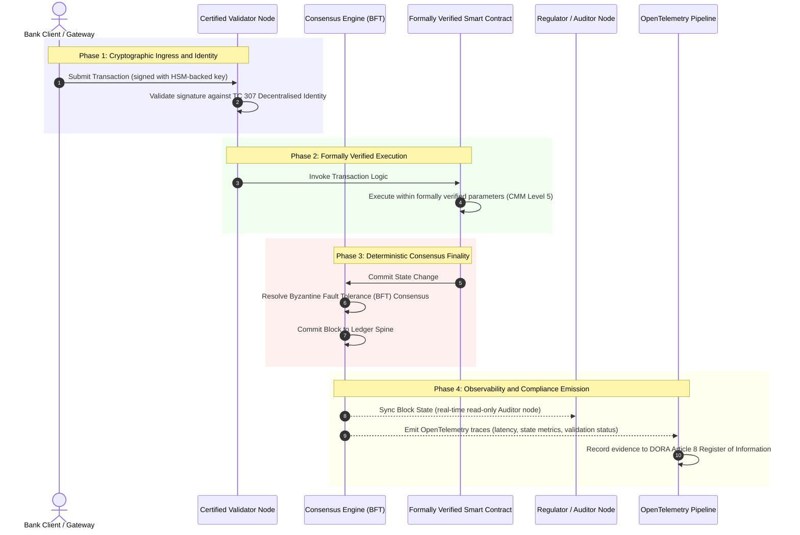

# Kanıttan Gerçeğe: Sertifikalı Blok Zincirleri Neden Bankacılık Güveninin Yeni Çağını Belirleyecek

**Değişmez olmak, güvenilir olmakla aynı şey değildir.** Toptan bankacılık gerçek zamanlı mutabakata ve olasılıksal yapay zekâya geçerken, neyin gerçek olduğuna karar veren defter, bankaların hâlâ sertifikalayamadığı tek katman hâline geldi. Kurumu Basel III kapsamında, bulutu ISO 27001 kapsamında ve yapay zekâlarını ISO 42001 kapsamında sertifikalıyorlar; ancak dağıtık defter, onun yönetişimi, mutabakatı, kriptografisi ve akıllı sözleşmeleri satıcıya özgü varsayımlara bırakılıyor. Bu rapor, söz konusu vekâlet açığını kapatmanın ISO/IEC TC 307 rehberliğinden kural koyucu güvenceye geçmeyi gerektirdiğini savunuyor: defteri, mühendislik metriklerini yönetim kurulunca denetlenebilir, DORA karşısında savunulabilir bir gerçeğe dönüştüren 5 seviyeli bir Sertifikalı Blok Zinciri Endeksi'ne göre puanlamak.

<!-- lead-start -->
<aside class="post-lead" aria-label="Makale özeti">

<strong>Özet.</strong> Bankalar kurumu, bulutu ve yapay zekâlarını sertifikalıyor; ancak giderek neyin gerçek olduğunu belirleyen defteri değil. ISO/IEC TC 307 rehberlik sağlar, güvence değil. 5 seviyeli bir Sertifikalı Blok Zinciri Endeksi; defter yönetişimini, mutabakat bütünlüğünü, kimlik ve kriptografiyi, akıllı sözleşme güvencesini ve gözlemlenebilirliği bir Yetenek Olgunluk Modeli'ne göre puanlayarak vekâlet açığını kapatır ve olasılıksal yapay zekâya kesin bir denetim omurgası kazandırır.

<strong>Ana çıkarımlar</strong>

<ul class="post-lead-takeaways">
  <li><strong>Vekâlet sürtünme açığı.</strong> Banka (Basel III), bulut (ISO 27001) ve yapay zekâ yönetişim sistemi (ISO 42001) sertifikalanabilir; neyin gerçek olduğuna karar veren dağıtık defter ise henüz sertifikalanamaz. Bu asimetri, canlı bir operasyonel zafiyettir.</li>
  <li><strong>DORA bunu kişiselleştirir.</strong> DORA Article 5 kapsamında banka yönetim kurulları, üçüncü taraf ve defter dağıtımlarının dayanıklılığından doğrudan ve devredilemez şekilde sorumludur; başarısızlık hâlinde SM&amp;CR kişisel yaptırımları söz konusudur.</li>
  <li><strong>Yapay zekâ denetim omurgası.</strong> Makine öğrenmesi yeniden üretilebilir değildir; sertifikalı bir blok zinciri, model sürümlerini, girdileri ve doğrulama kararlarını zincir üzerinde kesin biçimde kaydederek ISO 42001 ve model risk yönetimi standartlarını karşılar.</li>
  <li><strong>Sertifikalı Blok Zinciri Endeksi.</strong> Yönetişim, mutabakat, kriptografi, akıllı sözleşmeler ve gözlemlenebilirlik; mühendislik metriklerini yönetim kurulunca onaylanmış Risk İştahı Beyanlarına dönüştüren 0'dan 5'e bir CMM karnesine dönüşür.</li>
</ul>

<strong>İlgili okuma:</strong> <a href="https://sebastienrousseau.com/2026-07-02-certified-blockchains-banking-trust-tc307-assurance-2026">Sertifikalı Blok Zincirleri ve Bankacılık Güveni: TC 307 Güvencesi</a>, <a href="https://sebastienrousseau.com/2026-07-24-global-payments-outlook-operating-model-risk-revenue">2026 Küresel Ödemeler Görünümü</a>.

</aside>
<!-- lead-end -->

> **Yönetici Özeti**
>
> - **Toptan bankacılık bir dönüm noktasında.** Gerçek zamanlı takas ve olasılıksal yapay zekâ, analog ve geriye dönük güvence modelini kırıyor: statik, kuruma dayalı denetimler artık modern risk yönetimi veya vekâlet taleplerini karşılamıyor.
> - **TC 307 bir taban çizgisidir, sertifika değil.** ISO/IEC TC 307, dağıtık defterler için sözlüğü, referans mimariyi ve güvenlik rehberliğini standartlaştırdı; ancak betimleyicidir. İyinin neye benzediğini tanımlar; risk yetkililerinin ve denetçilerin üretim dağıtımını onaylamak için ihtiyaç duyduğu kural koyucu doğrulamayı sağlamaz.
> - **Güvence, defteri puanlamak demektir.** Yönetişim, mutabakat bütünlüğü, akıllı sözleşme güvenliği ve kriptografik çeviklik; katı 5 seviyeli bir Yetenek Olgunluk Modeli'ne göre puanlandığında, bankaları yamalı, satıcıya özgü varsayımdan sertifikalanabilir, yönetim kurulunca denetlenebilir finansal gerçeğe taşır.
> - **Defter, yapay zekânın denetim omurgasıdır.** Model sürümlerini, girdileri ve doğrulama kararlarını kesin mutabakata sabitlemek, yeniden üretilemeyen makine öğrenmesine ISO 42001, SR 11-7 ve PRA SS1/23 kapsamında savunulabilir, yeniden oluşturulabilir bir kanıt kaydı sağlar.

## Dijital Bankacılıkta Vekâlet Sürtünme Açığı

Klasik bankacılıkta güven ilişkiseldir, kurumsaldır ve geriye dönüktür. Bağımsız, üçüncü taraf denetçilerin finansal durumu statik zaman noktalarında incelemesine ve ikili defter siloları arasındaki tutarsızlıkları mutabık kılmasına dayanır. 2026'nın gerçek zamanlı, API odaklı piyasalarında bu model, kabul edilemez gecikmeler ve yapısal riskler getirir.

İşlemler anında mutabık kılındığında, gün içi likidite havuzları API ağ geçitleri tarafından dinamik olarak yönetildiğinde ve varlık mülkiyeti paylaşılan defterler üzerinde tokenleştirildiğinde, geriye dönük denetimler önleyici kontroller yerine adli incelemelere dönüşür. Vekiller artık yalnızca kurumsal kuruluşu sertifikalamaya güvenemez. Dijital zemini de sertifikalamalıdırlar.

Bugün bankalar, göze çarpan bir mimari asimetri altında çalışıyor:

1. **Sertifikalı Bulut Altyapısı**: Donanım düğümleri, sanallaştırılmış konteynerler ve fiziksel veri merkezleri ISO/IEC 27001 ve SOC 2 Type II kontrollerine göre doğrulanır.  
2. **Sertifikalı Yönetim Süreçleri**: Operasyonel risk politikaları, iş sürekliliği planları ve algoritmik dağıtımlar katı risk çerçeveleri altında yönetilir.  
3. **Sertifikasız Defter Motorları**: Temel dağıtık mutabakat mekanizmaları, doğrulayıcı düğüm tedarik zincirleri, akıllı sözleşme sınırları ve ağ yönetişim modelleri sertifikasız, özel veya konsorsiyuma özgü varsayımlara bırakılır.

Bu asimetri büyük bir başarısızlık noktasıdır. Bir banka, güvenli, ISO 27001 sertifikalı bir bulut konteyneri içinde doğrulanmış bir uygulamayı çalıştırabilir; ancak o konteyner, merkezileştirilmiş doğrulayıcı denetimi, savunmasız mutabakat parametreleri veya denetlenmemiş akıllı sözleşmeler içeren bir dağıtık deftere yazıyorsa, işlem bütünlüğü tehlikeye girer. Bu açığı kapatmak için defter motorunun kendisi sertifikalanabilir bir güvence nesnesine dönüşmelidir.

## ISO/IEC TC 307 Standartlaştırma Taban Çizgisi

Dağıtık defterleri standartlaştırmak için gereken temel çalışma, ISO/IEC Teknik Komite 307 (TC 307\) (Blok zinciri ve dağıtık defter teknolojileri) tarafından oluşturuluyor. Blok zincirini yalıtılmış bir teknik protokol olarak ele almak yerine, TC 307 onu kurumsal bir güven altyapısı olarak ele alır ve çalışmalarını beş temel sütun etrafında düzenler:

1. **Taksonomi ve Sözlük (ISO 22739\)**: Farklı yargı bölgeleri, finansal şemalar ve kurumlar arasında tutarlı yasal ve operasyonel tanımlar sağlayarak ortak bir adlandırma oluşturur.  
2. **Referans Mimari (ISO/TR 23245\)**: Uyumlu bir dağıtık defter sisteminin sınırlarını, katmanlarını, veri akışlarını ve işlevsel bileşenlerini tanımlar.  
3. **Güvenlik, Gizlilik ve Akıllı Sözleşmeler (ISO/TR 23244 / ISO 23613\)**: Dijital varlık sistemleri için temel güvenlik yönergeleri oluşturur ve akıllı sözleşme zafiyetlerinin azaltılması ile yaşam döngüsü yönetişimi için en iyi uygulamaları ayrıntılandırır.  
4. **Birlikte Çalışabilirlik Çerçeveleri**: Heterojen defter ağları arasındaki veri ve varlık değişim mekanizmalarını ele alarak yalıtılmış tokenleştirilmiş siloların oluşmasını önler.  
5. **Merkezî Olmayan Kimlik ve Güven Çıpaları**: Defter tabanlı kriptografik tanımlayıcıları resmi açık anahtar altyapılarıyla (PKI) ve devlet yetkili sicilleriyle bütünleştirir.

Toplu olarak TC 307, DLT'nin özel bir mühendislik tercihinden standartlaştırılmış bir mimari disipline geçişine işaret ediyor. Ancak TC 307 esas olarak betimleyici olmaya devam ediyor. İyinin neye benzediğini tanımlar (rehberlik), ancak risk yetkililerinin ve denetçilerin kritik veya önemli işlevlerin (CIFs) üretim dağıtımlarını onaylamak için gerektirdiği kural koyucu doğrulama protokolünü (güvence) sağlamaz.

## Rehberlik ve Güvence: Vekâlet Ayrımı

Finansal piyasa katılımcıları teknolojiyi yenilikçi veya zarif olduğu için dağıtmaz; onu yönetilebildiğinde, denetlenebildiğinde, savunulabildiğinde ve sermaye rezervi gereksinimleriyle mutabık kılınabildiğinde dağıtırlar. Bu nedenle bankacılıkta standartlaştırma doğal olarak iki katmana ayrılır:

* **Rehberlik (Çerçeve)**: En iyi uygulamaları, referans hedeflerini ve mimari yönergeleri ana hatlarıyla belirtir (örneğin ISO/IEC TC 307, NIST çerçeveleri).  
* **Güvence (Kanıt)**: Çerçevenin tasarlandığı gibi uygulandığına ve işlediğine dair bağımsız, sürekli ve üçüncü tarafça doğrulanabilir kanıt sağlar (örneğin ISO 27001 sertifikasyonu, SOC 2 denetimleri, düzenleyici incelemeler).

Bulut altyapısını sertifikalarken sertifikasız defter mutabakatına güvenmek, kritik bir düzenleyici açıktır. "Değişmez" olan bir blok zinciri, mutlaka "kurumsal olarak güvenilir" değildir. Değişmezlik yalnızca girilen verinin değişmediğini garanti eder; doğrulayıcı düğümlerin güvenli olduğunu, mutabakat protokolünün gizli anlaşmaya karşı dayanıklı olduğunu, akıllı sözleşme mantığının matematiksel olarak sağlam olduğunu veya kriptografik anahtar yönetiminin post-kuantum zorunluluklarına uyduğunu doğrulamaz.

Bu açığı kapatmak için 2026 Sertifikalı Blok Zinciri Endeksi, bu gereksinimleri küresel bankacılık düzenlemelerine eşlenmiş ölçülebilir bir Yetenek Olgunluk Modeli'ne (CMM) resmileştirir.

## 2026 Sertifikalı Blok Zinciri Endeksi

Üst yönetimin defter platformlarını değerlendirmesini ve sertifikalamasını sağlamak için bu endeks, dağıtık defter altyapısını 0'dan 5'e bir CMM ölçeğinde puanlanan beş denetlenebilir operasyonel katmana yapılandırır.

### Tablo 1: Sertifikalı Blok Zinciri Endeksi Mimarisi

| Endeks Katmanı | Yetenek Olgunluk Seviyesi (CMM) | Teknik ve Operasyonel Metrik | Düzenleyici / Vekâlet Kontrol Referansı |
| ---- | ---- | ---- | ---- |
| **Defter Yönetişimi** | **Seviye 0**: Anlık konsorsiyum**Seviye 3**: Otomatik doğrulayıcı denetimi ve rotasyonu**Seviye 5**: Merkezî olmayan, çok taraflı kriptografik kimlik sabitleme | Onaylanmış finansal kuruluşlarca işletilen doğrulayıcı düğümlerin yüzdesi; doğrulayıcı anlaşmazlıklarının ortalama çözüm süresi; düğümlerin coğrafi dağılımı | **DORA Article 5** (Yönetişim ve Organizasyon); **CPMI-IOSCO PFMI Principle 2** (Yönetişim) ve **Principle 3** (Risklerin kapsamlı yönetimi çerçevesi) |
| **Mutabakat Bütünlüğü** | **Seviye 0**: Tek düğüm veya şeffaf olmayan POW**Seviye 3**: Kesin sonlandırmalı denetlenmiş BFT**Seviye 5**: Sürekli gecikme izlemeli, çok yargı bölgeli, resmi olarak doğrulanmış mutabakat | Azami tolere edilebilir mutabakat gecikmesi; gizli anlaşmaya direnç eşiği; simüle edilmiş düğüm bölünmesi altında çalışma süresi SLA'sı | **DORA Article 6** (BİT Risk Yönetimi Çerçevesi); **CPMI-IOSCO PFMI Principle 8** (Mutabakat Kesinliği) |
| **Kimlik ve Kriptografi** | **Seviye 0**: Zayıf RSA / ECDSA anahtarları**Seviye 3**: HSM destekli anahtar yönetimiyle çoklu imza**Seviye 5**: Kuantuma dayanıklı hibrit anahtarlar (FIPS 203 ML-KEM) ve sıfır bilgi gizlilik geçitleri | HSM destekli anahtarlarla imzalanan defter işlemlerinin yüzdesi; PQC geçiş hazırlık puanı; ZK kanıt gecikmesi | **NIST FIPS 203 / 204**; **ISO/IEC 27001** (Bilgi Güvenliği Yönetimi) |
| **Akıllı Sözleşme Güvencesi** | **Seviye 0**: Denetlenmemiş solidity betikleri**Seviye 3**: Otomatik derleyici doğrulaması ve dış denetim**Seviye 5**: Devre kesici yükseltmelere sahip, resmi olarak doğrulanmış, değişmez akıllı sözleşmeler | Matematiksel resmi doğrulamaya sahip akıllı sözleşmelerin yüzdesi; derleyici uyarılarının sayısı; zafiyet tarama kapsamı | **EBA Guidelines on Outsourcing Arrangements** (Paragraf 81, 113-117); **DORA Article 30** (Asgari Sözleşme Hükümleri) |
| **Denetim ve Gözlemlenebilirlik** | **Seviye 0**: Elle log taraması**Seviye 3**: Yapılandırılmış OTel izleri ve salt okunur denetçi düğümleri**Seviye 5**: Article 8 siciline otomatik, sürekli mutabakat | OpenTelemetry izleriyle kapsanan işlemlerin yüzdesi; defter blok taahhüdünden denetçi düğüm senkronizasyonuna gecikme | **BCBS 239** (Risk Verisi Toplulaştırma); **DORA Article 8** (Bilgi Sicili / ITS Şemaları) |

### Tablo 2: Küresel Bankacılık Standartlarına Eşlenmiş Temel Güven Sinyalleri

| Sinyal / Kıyaslama | Metrik | Bankacılık Platformlarına Etkisi | Düzenleyici Kaynak |
| ---- | ---- | ---- | ---- |
| **ISO/IEC TC 307 İlerlemesi** | ISO/TR teknik raporlarından resmi sertifikasyon şemalarına geçiş | Dağıtık defter motorlarını sertifikalamak için ilk standartlaştırılmış çerçeveyi oluşturur | **ISO/IEC JTC 1 / SC 44** (Dağıtık Defter Teknolojileri) |
| **Project Agorá Prototip Aşaması** | 40'tan fazla katılımcı ticari banka; tokenleştirilmiş mevduatların birleşik defter testi | Sınır ötesi takası mesajlaşmadan (SWIFT) atomik tokenleştirilmiş mutabakata taşır | **Bank for International Settlements (BIS) Innovation Hub** |
| **DORA Article 30 Üçüncü Taraf Denetimi** | Düğüm sağlayıcılarının ve altyapı barındırıcılarının %100'ü güvenlik kriterlerine göre denetlenir | "Gölge doğrulayıcı düğümleri" ortadan kaldırır; tam tedarik zinciri şeffaflığını zorunlu kılar | **European Supervisory Authorities (ESA)** |
| **ISO/IEC 42001 (YZ Yönetişimi)** | Kriptografik olarak değişmezleştirilmiş YZ modeli ve eğitim logları zincir üzerinde | Makine öğrenmesi için blok zincirini değişmez kanıt defteri ("denetim omurgası") olarak kullanır | **ISO/IEC 42001:2023** (Bilgi teknolojisi, Yapay zekâ) |
| **Basel III Sermaye Yeterliliği** | Belgelenmiş karmaşıklık azaltımına dayalı operasyonel risk sermaye tamponlarında azalma | Standartlaştırılmış operasyonel risk çerçeveleri, doğrulanmış defter dayanıklılığını doğrudan hesaba katar | **Basel Committee on Banking Supervision (BCBS)** |

## Yapay Zekânın "Denetim Omurgası": Kesin Altyapı Üzerinde Olasılıksal Zekâ

Sertifikalı bir blok zincirinin 2026'daki en güçlü stratejik rollerinden biri, yapay zekâ dağıtımları için bir **"Denetim Omurgası"** işlevi görmesidir. Modern finansal sistemler giderek olasılıksal hâle geliyor. Kredi puanlaması, gerçek zamanlı dolandırıcılık tespiti, algoritmik alım satım ve otonom müşteri etkileşimleri; zamanla gelişen, kayan ve uyum sağlayan makine öğrenmesi modelleri tarafından yürütülüyor. Bu modeller belirlenimci değildir: aynı girdi iki farklı zamanda verildiğinde, dinamik ağırlıklar ve sürekli eğitim nedeniyle farklı çıktılar üretebilirler.

Bu belirlenimsizlik, **ISO/IEC 42001 (YZ Yönetişimi)** ve **Model Risk Yönetimi (MRM)** standartları (örneğin **US Federal Reserve SR 11-7** ve **UK PRA SS1/23**) kapsamında derin bir yönetişim sorunu getirir: *Kesin olarak yeniden üretilemeyen kararları nasıl denetler, açıklar ve savunursunuz?*

Sertifikalı bir dağıtık defter, kesin karşı ağırlığı sağlar. Yapay zekâ modelleri olasılıksal olarak işlerken, sertifikalı blok zinciri onların parametrelerini kesin biçimde kaydederek değiştirilemez bir kanıt omurgası oluşturur:

* **Model Sürümleme ve Ağırlık Sabitleme**: Dağıtılan her model sürümü, ilişkili ağırlıkları ve eğitim verisi sağlama toplamları, derleme zamanında karma işlenerek deftere yazılır ve **SLSA Level 3** tedarik zinciri gereksinimlerini karşılar.  
* **Bağlamsal Girdi Kaydı**: Bir yapay zekâ modeli kritik bir karar yürüttüğünde (örneğin bir krediyi onaylamak veya bir işlemi işaretlemek), tam bağlamsal girdiler ve model karmaları deftere yazılarak kurcalamaya karşı kanıtlı bir geçmiş oluşturulur.  
* **Kod Erişimi Olmadan Denetlenebilirlik**: Bir düzenleyici, "Modeliniz 3 Haziran'da bu kredi başvurusunu neden reddetti?" diye sorarsa, bankanın tescilli kodu açığa çıkarmasına veya tam model durumunu yeniden oluşturmaya çalışmasına gerek yoktur. Girdilerin, ağırlıkların ve doğrulama durumunun kriptografik olarak imzalanmış, zincir üzerindeki defter kaydını sunar.

Makine öğrenmesi modellerinin olasılıksal kararlarını sertifikalı bir blok zincirinin kesin mutabakatına sabitleyerek kurum, otomatik eylemlerin savunulabilir, yeniden oluşturulabilir ve bağımsız olarak doğrulanabilir bir zaman çizelgesini oluşturur.

## Sertifikalı Mutabakattan Denetime Uzanan Hattın Görselleştirilmesi

Aşağıdaki sıra diyagramı, sertifikalı bir blok zinciri platformundan geçen bir işlemin yaşam döngüsünü göstererek doğrulama geçitlerinin, mutabakat bütünlüğünün, akıllı sözleşme yürütmesinin ve telemetri yayımının, yönetim kuruluna hazır düzenleyici kanıt üretmek için nasıl iç içe geçtiğini gösterir:

Bu işlem sırası için kritik yol, her doğrulama, yürütme ve mutabakat adımının kriptografik olarak imzalanmasını gerektirir; bu da uçtan uca kanıtlanabilir köken sağlar. Düzenleyicinin denetçi düğümü blok durumunu gerçek zamanlı olarak senkronize eder ve geriye dönük, elle yapılan finansal mutabakat ihtiyacını ortadan kaldırır.

## Üst Düzey Yöneticiler için Yönetim Kurulu Kılavuzu

Kurumsal güvenden altyapısal güvene geçişi başarıyla yönetmek için banka yöneticileri ve üst düzey yöneticiler dört temel direktifi derhal uygulamalıdır:

1. **Kurumsal Risk Yönetiminde (ERM) Defter Denetimlerini Zorunlu Kılın**: Özel, kamusal veya konsorsiyum tabanlı olsun, hiçbir dağıtık defter platformunun, 5 katmanlı **Sertifikalı Blok Zinciri Endeksi Mimarisi**'ne göre denetlenmedikçe (asgari CMM Level 3) kritik veya önemli işlevler (CIFs) için dağıtılamayacağı bir politikayı uygulayın.  
2. **Blok Zincirlerini ISO 42001 YZ Kanıt Omurgası Olarak Bütünleştirin**: Risk Direktörü'nü (CRO) ve Baş YZ Mimarı'nı, yüksek etkili tüm makine öğrenmesi modellerini sertifikalı bir blok zinciriyle bütünleştirmeye ve model sürümlerinin, ağırlıkların, girdilerin ve kararların kurcalamaya karşı kanıtlı bir denetim defterini oluşturmaya yönlendirin.  
3. **Doğrulayıcı Düğüm Tedarik Zincirini Denetleyin (DORA Article 30\)**: Satın alma bölümünden, doğrulayıcı düğümleri barındıran veya DLT ağları için bulut barındırmayı yöneten tüm üçüncü taraf kuruluşları denetlemesini isteyin ve bankanın dâhili bulut düğümlerine uygulanan aynı siber güvenlik ve operasyonel dayanıklılık standartlarına uyumu zorunlu kılın.  
4. **Defter Mimarilerini CPMI-IOSCO ve BCBS 239 ile Uyumlulaştırın**: Platform mühendisliği ekibine, defter çıktı telemetrisini doğrudan **BCBS 239** veri raporlama gereksinimleriyle uyumlulaştırma talimatı verin ve mutabakat ile mutabakat kesinliği parametrelerinin **CPMI-IOSCO Principles 8 and 9** ile katı biçimde uyumlu olmasını sağlayın.

## Sıkça Sorulan Sorular

**ISO/IEC TC 307 bir sertifikasyon standardı mıdır?**  
Hayır. ISO/IEC TC 307, sözlük, referans mimariler ve güvenlik yönergeleri oluşturan bir teknik komitedir. "İyinin neye benzediğini" (rehberlik) tanımlasa da, sektörün bankacılık denetçilerini tatmin etmek için bu belgeleri resmi, denetlenebilir sertifikasyon şemalarına (güvence) dönüştürmesi gerekir.

**Sertifikalı bir blok zinciri DORA uyumluluğunu nasıl destekler?**  
DORA Article 5 kapsamında banka yönetim kurulları, teknoloji dayanıklılığından doğrudan, kişisel sorumluluk taşır. Sertifikalı bir blok zinciri; mutabakat bütünlüğü, doğrulayıcı tedarik zinciri denetimi ve akıllı sözleşme güvenliği hakkında doğrulanabilir, kriptografik kanıt sağlayarak yönetim kurulu üyelerine SM\&CR kişisel sorumluluk iddialarına karşı savunma için gereken belgelenebilir "makul adımları" verir.

**Geleneksel bir defter denetimi ile sertifikalı bir blok zinciri denetimi arasındaki fark nedir?**  
Geleneksel bir denetim geriye dönüktür; işlemler mutabık kılındıktan sonra elle yapılan girişleri ve statik dosyaları doğrular. Sertifikalı bir blok zinciri denetimi sürekli ve gerçek zamanlıdır; doğrulayıcı düğümler, BFT mutabakat motoru ve resmi olarak doğrulanmış akıllı sözleşmeler işlemleri kesin biçimde yürütmek üzere sertifikalanır ve sistemin sağlığını sürekli doğrulayan yapılandırılmış telemetri (OpenTelemetry) yayar.

**Kamusal blok zincirleri bankacılık kullanımı için sertifikalanabilir mi?**  
Çoğu yargı bölgesinde, saf izinsiz kamusal blok zincirleri; doğrulayıcı kimlik doğrulamasının eksikliği, öngörülemeyen gas/işlem maliyetleri ve belirlenimci olmayan sonlandırma (örneğin olasılıksal proof-of-work/stake çatallanmaları) nedeniyle bankacılık düzenlemelerini karşılayamaz. Bankacılıkta sertifikalı blok zincirleri tipik olarak, doğrulayıcı düğüm operatörlerinin kimliği belirlenmiş ve denetlenmiş finansal kuruluşlar olduğu kurumsal izinli veya sıkı düzenlenmiş kamusal-hibrit mimarileri kullanır.

## Kaynakça

* Basel Committee on Banking Supervision (BCBS), 2013\. *Principles for effective risk data aggregation and reporting (BCBS 239\)*. Basel: Bank for International Settlements. Erişim adresi: [Basel Committee on Banking Supervision (BCBS), 2013\.](https://www.bis.org/publ/bcbs239.pdf "Basel Committee on Banking Supervision (BCBS), 2013\.").  
* Committee on Payments and Market Infrastructures and Technical Committee of the International Organisation of Securities Commissions (CPMI-IOSCO), 2012\. *Principles for financial market infrastructures*. Basel: Bank for International Settlements. Erişim adresi: [Committee on Payments and Market Infrastructures and Technical Committee of the International Organisation of Securities Commissions (CPMI-IOSCO), 2012\.](https://www.bis.org/cpmi/publ/d101.htm "Committee on Payments and Market Infrastructures and Technical Committee of the International Organisation of Securities Commissions (CPMI-IOSCO), 2012\.").  
* European Banking Authority (EBA), 2019\. *EBA/GL/2019/02, Guidelines on outsourcing arrangements*. Paris: EBA. Erişim adresi: [European Banking Authority (EBA), 2019\.](https://www.eba.europa.eu/regulation-and-policy/internal-governance/guidelines-on-outsourcing-arrangements "European Banking Authority (EBA), 2019\.").  
* European Parliament and Council of the European Union, 2022\. *Regulation (EU) 2022/2554 on digital operational resilience for the financial sector (DORA)*. Brüksel: Official Journal of the European Union. Erişim adresi: [European Parliament and Council of the European Union, 2022\.](https://eur-lex.europa.eu/legal-content/EN/TXT/?uri=CELEX%3A32022R2554 "European Parliament and Council of the European Union, 2022\.").  
* ISO/IEC JTC 1/SC 42, 2023\. *ISO/IEC 42001:2023, Information technology, Artificial intelligence, Management system*. Cenevre: International Organisation for Standardisation. Erişim adresi: [ISO/IEC JTC 1/SC 42, 2023\.](https://www.iso.org/standard/81230.html "ISO/IEC JTC 1/SC 42, 2023\.").  
* ISO/IEC Technical Committee 307, 2020\. *ISO/IEC 22739:2020, Blockchain and distributed ledger technologies, Vocabulary*. Cenevre: International Organisation for Standardisation. Erişim adresi: [ISO/IEC Technical Committee 307, 2020\.](https://www.iso.org/standard/73771.html "ISO/IEC Technical Committee 307, 2020\.").  
* National Institute of Standards and Technology (NIST), 2026\. *First Three Finalised Post-Quantum Encryption Standards (FIPS 203, 204, and 205\)*. Gaithersburg: U.S. Department of Commerce. Erişim adresi: [National Institute of Standards and Technology (NIST), 2026\.](https://www.nist.gov/news-events/news/2024/08/nist-releases-first-3-finalized-post-quantum-encryption-standards "National Institute of Standards and Technology (NIST), 2026\.").

