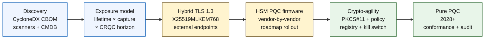

# Індекс квантово-стійкого банкінгу 2026: постквантова криптографія, QKD, крипто-гнучкість і ризик Harvest-Now-Decrypt-Later

<!-- lead-start: manual -->
<aside class="post-lead" aria-label="Стислий зміст статті">

<strong>Стисло.</strong> Квантово-стійкий банкінг у 2026 — це програма реалізації з дедлайном, який задає перетин двох кривих: тривалість конфіденційності даних, що банк тримає сьогодні, і горизонт появи криптографічно релевантного квантового комп'ютера (CRQC). NIST FIPS 203 / 204 / 205 фіналізовано у серпні 2024; CNSA 2.0 встановлює кінцевий стан федерального рівня США на 2033; harvest-now-decrypt-later уже відбувається на довготривалих даних. Квантовий скоркард для ради директорів відстежує чотири точні відсотки: повноту інвентаризації, експозицію HNDL, прогрес міграції NIST та готовність до крипто-гнучкості.

<strong>Ключові висновки</strong>

<ul class="post-lead-takeaways">
  <li><strong>Дебати про алгоритми закрилися 13 серпня 2024.</strong> ML-KEM (FIPS 203), ML-DSA (FIPS 204), SLH-DSA (FIPS 205) — це відповіді. Банки, які у 2026 досі проводять внутрішні оцінки, щоб «обрати переможця», відстають на 18 місяців.</li>
  <li><strong>Harvest-now-decrypt-later уже застосовний.</strong> Усе, що має тривалість конфіденційності понад правдоподібний термін появи CRQC — 30-річні іпотеки, андеррайтинг страхування життя, записи транзакцій MiFID II / GDPR, архіви зберігання M&amp;A — мусить перейти на гібридну квантово-стійку інкапсуляцію ключів зараз, а не тоді, коли оголосять CRQC.</li>
  <li><strong>Інвентаризація — це обмежувальна ланка зрілості.</strong> Криптографічна специфікація компонентів (CBOM) — протокол, бібліотека, сертифікат, розділ HSM, залежність постачальника, власник застосунку, тривалість класифікації даних — це передумова всього іншого. Відстежуйте свіжість, а не покриття.</li>
  <li><strong>Гібридний TLS 1.3 — це розгортання 2026.</strong> Гібридний key share X25519MLKEM768 — це те, що Chrome / Firefox / Cloudflare / Akamai фактично узгоджують сьогодні. Чистий ML-KEM TLS чекає на прошивку HSM і готовність CA.</li>
  <li><strong>Крипто-гнучкість — це довговічний результат.</strong> Абстракція PKCS#11, маркіровані ключі, реєстр політик, який мапить бізнес-сервіс на дозволений набір алгоритмів. Без цього наступний перехід алгоритмів — ще одна багаторічна програма.</li>
</ul>
</aside>
<!-- lead-end -->

Квантово-стійкий банкінг у 2026 — це операційна міграція, а не спекуляція. NIST фіналізував перші три постквантові криптографічні стандарти, і банкам тепер потрібно зрозуміти, які системи залежать від RSA, ECC, TLS, підписів, HSM, сертифікатів, платіжних каналів, архівів і довготривалих конфіденційних даних. Запитання індексу просте: чи може установа замінити криптографію до того, як загроза стане операційною?

---

> **Резюме для керівництва / ключові висновки**
>
> - **Стандарти NIST тепер конкретні.** FIPS 203 визначає ML-KEM для інкапсуляції ключів, FIPS 204 визначає ML-DSA для підписів, а FIPS 205 визначає SLH-DSA як безстановий хеш-базований стандарт підпису.
> - **Інвентаризація — це перший контроль зрілості.** Банк не може мігрувати те, чого не бачить: сертифікати, ключі, протоколи, застосунки, постачальники, HSM, API, архіви та вбудовані системи мусять бути картовані.
> - **Крипто-гнучкість — це довговічна ціль.** Мета — не одноразова заміна алгоритму; це здатність змінювати криптографічні примітиви без перепроєктування цілих застосунків.
> - **Довготривалі дані змінюють терміновість.** Ризик harvest-now-decrypt-later означає, що дані, перехоплені сьогодні, можуть стати читабельними пізніше, якщо залишатимуться цінними достатньо довго.
> - **QKD — це спеціалізоване доповнення.** Квантовий розподіл ключів може бути доречним для найвищоцінних каналів, але він не замінює міграцію PQC на рівні установи.
>
---

## Чому 2026 — це рік, коли цей індекс має значення

Три зрушення у 2024–2025 зробили квантово-стійкий банкінг вимірюваною банківською програмою, а не дослідницькою точкою спостереження. По-перше, NIST фіналізував основні постквантові стандарти 13 серпня 2024: [FIPS 203 (ML-KEM) ⧉](https://nvlpubs.nist.gov/nistpubs/FIPS/NIST.FIPS.203.pdf "FIPS 203 — Module-Lattice-Based Key-Encapsulation Mechanism"), [FIPS 204 (ML-DSA) ⧉](https://nvlpubs.nist.gov/nistpubs/FIPS/NIST.FIPS.204.pdf "FIPS 204 — Module-Lattice-Based Digital Signature Standard"), [FIPS 205 (SLH-DSA) ⧉](https://nvlpubs.nist.gov/nistpubs/FIPS/NIST.FIPS.205.pdf "FIPS 205 — Stateless Hash-Based Digital Signature Standard"). Дебати про вибір алгоритму закрилися у цю дату; банки, які у 2026 досі ведуть внутрішні потоки робіт «яка схема переможе», відстають на 18 місяців.

По-друге, [CNSA 2.0 від NSA ⧉](https://media.defense.gov/2022/Sep/07/2003071834/-1/-1/0/CSA_CNSA_2.0_ALGORITHMS_.PDF "Commercial National Security Algorithm Suite 2.0") встановлює кінцевий стан федерального рівня США на 2033 з проміжними дедлайнами, починаючи з 2027 для підпису програмного забезпечення та прошивок і 2030 для браузерів та операційних систем. Будь-який банк із федеральним контрагентним зв'язком США — FedNow, операції Казначейства, рахунки федеральних клієнтів — перебуває всередині цього периметра для систем, які торкаються федеральних даних. Годинник уже не абстрактний.

По-третє, [Harvest-Now-Decrypt-Later (HNDL) ⧉](https://csrc.nist.gov/Projects/post-quantum-cryptography "Програма постквантової криптографії NIST") — це несучий аргумент ризику щодо терміновості. Витончені супротивники вже перехоплюють захищені TLS платіжні повідомлення, конверти SWIFT, документацію KYC та довготривалий архівний шифротекст у великих фінансових центрах. Дані, перехоплені у 2026, мають залишатися чутливими до конфіденційності лише в момент розшифрування — для 30-річних іпотек, андеррайтингу страхування життя, записів транзакцій MiFID II / GDPR та архівів зберігання M&A це вікно простягається далеко за межі будь-якої правдоподібної оцінки появи криптографічно релевантного квантового комп'ютера (CRQC). Супротивнику не потрібен квантовий комп'ютер сьогодні. Він потрібен йому до того, як дані перестануть мати значення.

Індекс квантово-стійкого банкінгу вимірює, чи може ваша установа здійснити міграцію до настання цього перетину. Робота вже не про те, чи мігрувати; вона про те, чи завершиться міграція в межах захищеного графіка.

## Архітектура індексу 2026

| Шар індексу | Напрям 2026 | Метрика готовності | Ризик у разі недбалого підходу |
|---|---|---|---|
| **Інвентаризація** | Картувати криптографічні активи, протоколи, сертифікати, постачальників і класи даних | Відсоток картованої частки інфраструктури | Невідомі квантово-вразливі залежності |
| **Експозиція** | Класифікувати системи за тривалістю конфіденційності та критичністю транзакцій | Високоризикові активи за вартістю та тривалістю | Неправильна пріоритизація міграції |
| **Міграція** | Прийняти гібридні та PQC-готові шаблони відповідно до стандартів NIST | Готовність до ML-KEM та ML-DSA | Аварійне перепроєктування платформи в умовах дедлайну |
| **Крипто-гнучкість** | Відокремити логіку застосунку від криптографічних примітивів | Покриття крипто, контрольованого політикою | Жорстко закодовані алгоритми по всій інфраструктурі |
| **Засвідчення** | Перевіряти сумісність, продуктивність, підтримку HSM, сертифікати та готовність постачальників | Частка пройдених тестів і реєстр винятків | Поламані канали або слабкі резервні контролі |

### Квантовий скоркард для ради директорів

Достовірний скоркард квантової готовності вимагає відстеження точних відсотків, а не лише статусів проєктів:

1. **Повнота інвентаризації:** відсоток застосунків першого рівня з повністю картованою криптографічною специфікацією компонентів (CBOM).
2. **Експозиція HNDL:** обсяг довготривалих конфіденційних даних (наприклад, PII, комерційних таємниць), що передаються мережами без гібридної квантово-стійкої інкапсуляції ключів.
3. **Прогрес міграції NIST:** відсоток асиметричних ключів шифрування та цифрових підписів, мігрованих на стандарти FIPS 203 (ML-KEM) та FIPS 204 (ML-DSA).
4. **Готовність крипто-гнучкості:** відсоток критичних систем, де криптографічні алгоритми можна ротувати через централізовану політику без перекомпіляції коду.

## Поточні сигнали для відстеження

| Сигнал | Що це означає для банків | Джерело |
|---|---|---|
| **FIPS 203 ML-KEM** | Основний стандарт NIST для встановлення ключів загального шифрування | [NIST ⧉](https://www.nist.gov/news-events/news/2024/08/nist-releases-first-3-finalized-post-quantum-encryption-standards "First three finalized post-quantum encryption standards") |
| **FIPS 204 ML-DSA** | Основний стандарт NIST для цифрових підписів | [NIST ⧉](https://www.nist.gov/news-events/news/2024/08/nist-releases-first-3-finalized-post-quantum-encryption-standards "First three finalized post-quantum encryption standards") |
| **FIPS 205 SLH-DSA** | Альтернатива на основі хешу та резервне рішення | [NIST ⧉](https://www.nist.gov/news-events/news/2024/08/nist-releases-first-3-finalized-post-quantum-encryption-standards "First three finalized post-quantum encryption standards") |
| **Заохочується негайна інтеграція** | NIST прямо радить адміністраторам починати інтеграцію стандартів, бо повна інтеграція займає час | [NIST ⧉](https://www.nist.gov/news-events/news/2024/08/nist-releases-first-3-finalized-post-quantum-encryption-standards "First three finalized post-quantum encryption standards") |
| **Банківські квантові програми розширюються** | Великі банки досліджують квантові технології, готуючись до переходу на PQC | [Quantum Insider ⧉](https://thequantuminsider.com/2026/03/27/15-plus-global-banks-probing-the-wonderful-world-of-quantum-technologies/ "Overview of global banks exploring quantum technologies") |

## Міграція починається з реєстру криптографії

Послідовність міграції на цьому етапі добре зрозуміла. Кожний контроль виробляє свідчення, що рухає наступний; пропускання чи стиснення контролю — саме те, що породжує ризик аварійного перепроєктування, який з'являється у стовпці «провал» Архітектури індексу.

Перший результат — це не новий алгоритм; це криптографічна специфікація компонентів (CBOM). Банкам потрібен живий реєстр, що поєднує бізнес-сервіси з алгоритмами, бібліотеками, сертифікатами, довжинами ключів, HSM, тривалостями даних, постачальниками та операційними власниками. Без цього реєстру квантово-стійка міграція перетворюється на здогадки.

Набір записів CBOM має фіксувати для кожного криптографічного примітиву: протокол або інтерфейс (TLS 1.3, IPsec, SSH, власний формат платіжного повідомлення), алгоритм і набір параметрів (RSA-2048, ECDH P-256, ML-KEM-768, ML-DSA-65), бібліотеку і версію (OpenSSL 3.4, BoringSSL commit hash, складання SDK постачальника), апаратну межу (розділ HSM, TPM, безпечний анклав або жодну), сертифікаційну ідентичність, якщо застосовно, власника застосунку та тривалість класифікації даних. Інструменти, які виходять у продакшен у 2025–2026 — IBM Quantum Safe Inventory, відкрита [специфікація CycloneDX CBOM ⧉](https://cyclonedx.org/capabilities/cbom/ "CycloneDX Cryptography Bill of Materials"), корпоративні сканери від CryptoNext / Sandbox / PQShield — інтегруються в наявні CMDB-конвеєри. Жоден з них не є повним сам по собі; розраховуйте на цикл побудови CBOM у 12–18 місяців навіть з інструментами постачальника та виділеним персоналом.

Метрика, яку слід відстежувати, — це свіжість, а не покриття. CBOM, який двомісячної давності, гірший за відсутній CBOM, бо дає команді безпеки хибну впевненість щодо того, що було мігровано.

## Спочатку гібрид, завжди гнучко

Більшість банків не перемкнуть усе одночасно. Реалістичний шаблон — гібридне розгортання, де класичні та постквантові механізми працюють разом, поки постачальники, протоколи, сертифікати та операційний інструментарій дозрівають. Довгострокова мета — крипто-гнучкість: контрольований політикою вибір криптографії, який можна змінювати без перебудови бізнес-застосунку.

[Вставити інтерактивний компонент: калькулятор ризику Harvest-Now-Decrypt-Later (HNDL) — інструмент із повзунками, де керівники задають термін придатності даних і прогнозований квантовий графік, щоб побачити вікно експозиції.]

> **Ключова думка:** якщо ваші дані мають залишатися конфіденційними 10 років, а до криптографічно релевантного квантового комп'ютера (CRQC) лишилося 7 років, ваш дедлайн міграції не через 7 років — він був 3 роки тому.

На практиці це означає TLS 1.3 з гібридним key share `X25519MLKEM768` для зовнішньо звернених ендпоінтів (Chrome / Firefox / Cloudflare / Akamai усі вже підтримують це), класичні ланцюги підписів, поки інфраструктура HSM і CA не наздожене, та шар абстракції PKCS#11, що дозволяє реєстру політик ротувати алгоритми без перекомпіляції бізнес-застосунків. Крипто-гнучкість — це те, що визначає, чи стане наступний перехід алгоритмів (коли, а не якщо) шеститижневою ротацією, чи ще однією семирічною програмою.

## Де місце для QKD

Квантовий розподіл ключів належить до індексу як опція для каналу високої чутливості, особливо для інфраструктури фінансового ринку, зв'язку з центробанком та надчутливих інституційних потоків. Його слід трактувати як доповнення до PQC, а не як виправдання для затримки корпоративної міграції.

## Що це означає за типом банку

### Глобально системно важливі банки

Складна проблема — масштаб: десятки тисяч TLS-ендпоінтів, сотні розділів HSM, десятки внутрішніх центрів сертифікації, сотні бізнес-застосунків з вбудованими криптографічними примітивами та SDK постачальників, які банк не може модифікувати. Інвестиція — це не ще один пілот; це інструментарій CBOM, шар абстракції PKCS#11, підключений до кожної нової побудови, план консолідації HSM, який обирає одного постачальника як лідера з прошивки PQC і приймає багаторічний хвіст на інших, та реєстр політик, який стає довговічною поверхнею крипто-гнучкості ще довго після завершення міграції FIPS 203 / 204 / 205.

### Транзакційні та корпоративні банки

Обсяг міграції вужчий, ніж на рівні G-SIB, але експозиція HNDL гостра: транскордонні повідомлення SWIFT, структуровані платіжні дані з PII корпоративних контрагентів, платформи обміну документами, що тримають документацію торговельного фінансування, та архіви довготривалої звітності. Пріоритезуйте гібридний TLS на кожному клієнтському ендпоінті та PQC у спокої для архівів зберігання. Тисніть на підзвітність постачальника HSM — команда платформи корпоративного банкінгу має пряме закупівельне плече, якого часто бракує команді технологій оптового сегмента.

### Регіональні банки

Купуйте стек постачальника, який уже має примітиви крипто-гнучкості. Обирайте платформу основного банкінгу, постачальник якої публікує CBOM і зобов'язується щодо термінів підтримки ML-KEM / ML-DSA. Перевірте, що дорожня карта HSM постачальника узгоджується з дедлайном міграції банку. Інженерна потужність, потрібна щоб побудувати крипто-гнучкість з нуля, — багаторічна; постачальник несе цю вартість для багатьох клієнтів, а банк успадковує вигоду. Робота з валідації — перевірка, що твердження постачальника проходять процес MRM установи — це правомірний внутрішній обсяг.

### Фінтехи, PSP та постачальники інфраструктури

Конкурентне питання для постачальників, які продають банкам у 2026, не «чи підтримуєте ви PQC». Це «чи можете ви виробити CycloneDX CBOM для вашої платформи, матрицю підтримки постачальників HSM та письмову SLA на ротацію алгоритмів». Постачальники, які відповідають «так», пройдуть закупівельні контролі першого рівня у 2026–2027. Ті, що не зможуть, втратять цикл подовження на користь конкурента, який зможе.

## Висновок

Квантово-стійкий банкінг у 2026 — це не дослідницька точка спостереження; це програма реалізації з дедлайном, який задає перетин двох кривих: тривалість конфіденційності даних, що установа тримає сьогодні, і горизонт появи криптографічно релевантного квантового комп'ютера. Установи, які виглядатимуть достовірно перед регуляторами та контрагентами у 2030, — це ті, хто розпочав побудову CBOM у 2024, розгорнув гібридний TLS на кожному зовнішньому ендпоінті до кінця 2026 і вбудував крипто-гнучкість у кожну нову побудову з першого дня. Установи, які цього не зробили, з'ясують, чи не зачинилося вже їхнє вікно міграції для даних, що супротивник збирає сьогодні.

Вимірюйте міграцію так, як вимірюєте будь-яку операційну програму: обсяг відомий, послідовність розставлена за пріоритетами, дедлайни зафіксовані, реєстри винятків чесні. Чим уважніше ви дивитеся на власну інфраструктуру, тим меншим відчувається вікно міграції.

## Поширені запитання

**Що банк має інвентаризувати першим?**

Почніть із зовнішньо експонованих TLS, платіжних каналів, автентифікації клієнтів, міжбанківського зв'язку, сервісів на основі HSM, довгострокових архівів і систем, що обробляють конфіденційні дані з тривалим терміном корисності.

**Чи PQC — це лише питання кібербезпеки?**

Ні. Це впливає на платежі, ідентичність, юридичні докази, підпис транзакцій, довіру клієнтів, зберігання даних, керування постачальниками та операційну стійкість.

**Що означає крипто-гнучкість?**

Крипто-гнучкість — це здатність змінювати криптографічні примітиви через політику та контролі платформи замість жорстко закодованих змін у застосунках.

**Чи банкам слід чекати на нові стандарти?**

Ні. NIST заохотив адміністраторів починати інтеграцію перших фінальних стандартів, бо повна інтеграція займає час.

## Джерела

- NIST, (2026). [Перші три фіналізовані постквантові стандарти шифрування ⧉](https://www.nist.gov/news-events/news/2024/08/nist-releases-first-3-finalized-post-quantum-encryption-standards "First three finalized post-quantum encryption standards").

<!-- enrich-start -->
<aside class="author-card" aria-label="Про автора"><strong class="author-card-name"><a href="/about/index.html">Sebastien Rousseau</a></strong>Старший банківський технолог, який пише про прикладний AI, платіжну інфраструктуру, токенізовані гроші, ISO 20022, постквантову безпеку, хмарно-нативні фінансові послуги та регульовані цифрові ринки.Понад 20 років у HSBC Commercial &amp; Investment Bank, PayPal, Barclays, Shazam, AKQA, Virgin Group. <a href="/about/index.html">Повний профіль</a> &middot; <a href="https://www.linkedin.com/in/sebastienrousseau/" rel="external noopener">LinkedIn</a> &middot; <a href="https://github.com/sebastienrousseau" rel="external noopener">GitHub</a></aside>

Востаннє переглянуто <time datetime="2026-06-04">2026-06-04</time>.

<!-- enrich-end -->
