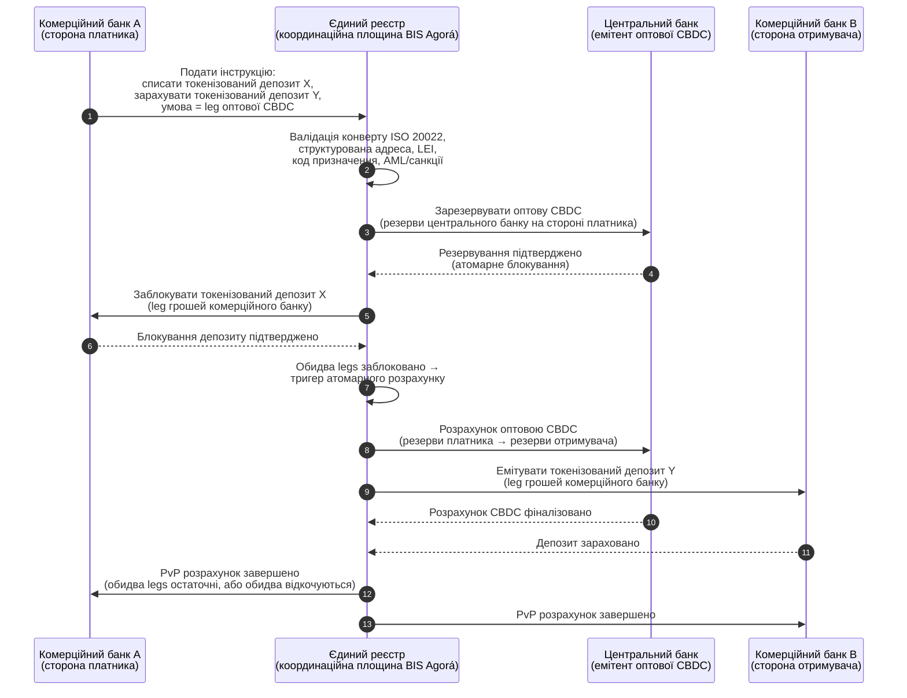

<!-- lead-start: manual -->
<aside class="post-lead" aria-label="Резюме статті">

<strong>Стисло.</strong> Оптові платежі у 2026 опинилися на перетині двох структурних зсувів: ISO 20022 заштовхує структуровані платіжні дані в операційну модель, а токенізовані депозити плюс BIS Project Agorá переводять транскордонний розрахунок до атомарних, програмованих рейок, що працюють завжди. Питання 2026 року для банку — вже не «чи мігрували ми повідомлення», а «чи піддаються наші платіжні операції вимірюванню, маршрутизації та нагляду» — і індекс розкладає це на чотири точні відсотки: повнота структурованих даних, оптимальність маршрутизації рейок, лаг остаточності розрахунку та покриття коридорів Agorá.

<strong>Ключові висновки</strong>

<ul class="post-lead-takeaways">
  <li><strong>Листопад 2026 — жорсткий дедлайн, а не рекомендація.</strong> SWIFT прибирає підтримку неструктурованих адрес у SR 2026; платежі без міста й країни у визначених полях перестають клірингуватися. Вартість виправлень, частка відхилень і потужність операцій переходять з категорії «метрика» в категорію «позиція, видима регулятору».</li>
  <li><strong>Токенізовані депозити переграють стейблкоїни в регульованому оптовому сегменті.</strong> Вони зберігають відносини «банк–вкладник» і актив розрахунку центрального банку, відкриваючи водночас програмованість. Стейблкоїни лишаються на периферії; токенізовані депозити закріплюють ядро.</li>
  <li><strong>BIS Project Agorá — еталон коридорів.</strong> Якщо транскордонний продукт банку не може працювати в коридорі Agorá до 2027, він конкурує на рейці, з якої решта ринку вже виходить.</li>
  <li><strong>Оркестрація рейок реального часу — це операційна модель.</strong> Багаторейкове рішення 2026 (FedNow / RTP / TIPS / SEPA Inst / on-chain) — не «яка рейка», а реєстр політик, профіль ліквідності та маршрутизаційний рушій, що обирає рейку для кожного платежу.</li>
  <li><strong>Вимірюй — або тебе виміряють.</strong> Чотири відсотки — повнота структурованих даних, оптимальність маршрутизації рейок, лаг остаточності розрахунку, покриття коридорів Agorá — перетворюють позицію з платежів на наглядово готовий доказ напередодні аудиторського вікна 2026/27.</li>
</ul>
</aside>
<!-- lead-end -->

# Індекс оптових платежів у 2026: ISO 20022, токенізовані депозити, рейки реального часу й транскордонний розрахунок

Оптові платежі у 2026 перебудовуються двома одночасними зсувами: структурованими платіжними даними та програмованим розрахунком. Віха SWIFT щодо структурованих адрес у листопаді 2026 заштовхує якість даних в операційну модель, а BIS Project Agorá та токенізовані депозити перевіряють, чи може транскордонний розрахунок стати більш атомарним, прозорим і безперервним.

---

> **Виконавче резюме / ключові висновки**
>
> - **Листопад 2026 — жорстка віха щодо даних.** SWIFT заявляє, що платежі з неструктурованими адресами більше не підтримуватимуться після зміни SR 2026.
> - **Структуровані дані стають продуктовою інфраструктурою.** Місто й країна щонайменше мають бути у визначених полях, що перетворює якість платіжних даних на питання клієнтів, операцій і комплаєнсу.
> - **Токенізовані депозити — варіант дизайну для оптових платежів.** Project Agorá досліджує токенізовані депозити комерційних банків і токенізовані резерви центрального банку в моделі єдиного реєстру.
> - **Індекс має вимірювати якість розрахунку, а не лише швидкість.** Остаточність, прозорість, частка виправлень, використання ліквідності, дані комплаєнсу та видимість для клієнта важать не менше за миттєве виконання.
> - **Транскордонні платежі залишаються публічно-приватним порядком денним.** FSB продовжує рухати дорожню карту G20 на етапі впровадження за координацією державного та приватного секторів.
>
---

## Чому 2026 — рік, коли цей індекс набуває ваги

Stanford AI Index корисний тим, що ставиться до швидкорухомої технологічної сфери як до того, що піддається вимірюванню: дослідницький випуск, технічна продуктивність, відповідальне впровадження, економіка, секторальне ухвалення, політика та суспільні настрої зведені в єдину рамку ([Stanford HAI ⧉](https://hai.stanford.edu/ai-index/2026-ai-index-report "The 2026 AI Index Report")). Банкам і фінансовим установам тепер потрібна та сама дисципліна для інфраструктури. Агентний ШІ, квантово-стійка безпека, хмарно-нативна стійкість і оптові платежі — це більше не окремі інноваційні треки; вони сходяться в одну операційну модель.

Практичне питання для банку — не в тому, чи важлива кожна сфера. Воно в тому, чи здатна установа одночасно вимірювати готовність у всіх них. Банк може розгортати агентний ШІ та все одно лишатися крихким, якщо його криптографія не готова до міграції. Він може модернізувати хмарні платформи й усе одно зазнати невдачі, якщо платіжні дані залишаються неструктурованими. Він може запускати пілоти токенізації й усе одно створити системний ризик, якщо рівні розрахунку, ліквідності, ідентифікації та журналу аудиту не спроєктовані разом.

## Архітектура індексу 2026

| Рівень індексу | Напрям 2026 | Метрика готовності | Ризик у разі недогляду |
|---|---|---|---|
| **Дані ISO 20022** | Перехід від неструктурованого тексту до керованих структурованих полів | Готовність структурованих адрес і частка відхилень | Відхилення платежів і ручні виправлення |
| **Оркестрація рейок** | Маршрутизація по RTGS, миттєвих, кореспондентських, стейблкоїн- і токенізованих рейках | Маршрутизація з урахуванням вартості, швидкості, остаточності та юрисдикції | Фрагментовані рейки з дубльованими контролями |
| **Токенізований розрахунок** | Використання токенізованих депозитів і грошей центрального банку там, де вони знижують тертя | Покриття DvP, PvP, атомарного розрахунку | Пілотні активи без бізнес-цінності у потоці робіт |
| **Ліквідність** | Оптимізація внутрішньоденної ліквідності, замороженої готівки та розрахункових вікон | Збережена ліквідність і скорочення невдалих розрахунків | Швидші відтоки ліквідності |
| **Комплаєнс** | Вбудовування вимог AML, санкцій, FATF та аудиту у платіжні дані | Наскрізний комплаєнс і пояснюваність | Багатші дані без сильніших контролів |

## Ключові сигнали оптових платежів у прив'язці до глобальних пріоритетів

Сигнальний набір 2026 — не дослідницький порядок денний. Це чек-лист поставки, за яким Chief Payments Officer банку вже отримує оцінку. Робота з ремедіації проявляється у трьох місцях: конверт повідомлення, рівень оркестрації рейок і реєстр розрахунку.

| Сигнал | Прив'язка G20 / SWIFT / BIS | Технічна реалізація на платформі |
|---|---|---|
| **65% платіжних повідомлень досі містять неструктуровані адреси** | [SWIFT SR 2026 — віха структурованих адрес, листопад 2026 ⧉](https://www.swift.com/news-events/news/iso-20022-milestone-november-2026-unstructured-addresses-be-removed "ISO 20022 November 2026 structured address milestone") | Валідація схеми у платіжному middleware ще до того, як повідомлення потрапить в адаптер SWIFTNet; автоматизований парсинг адреси на вході з корпоративного каналу та банку-кореспондента. |
| **Ціль FSB G20: 75% транскордонних платежів за 1 годину до 2027** | [Дорожня карта FSB щодо транскордонних платежів, фаза впровадження 2026 ⧉](https://www.fsb.org/2026/03/fsb-kicks-off-new-implementation-phase-to-enhance-cross-border-payments-through-public-private-partnership/ "FSB cross-border payments implementation phase") | Шлюзи FX-конверсії в реальному часі з попередньо узгодженими вікнами ліквідності; підтвердження T+0 в клієнтський портал; маршрутизаційний рушій рейок, що відсікає коридор, який не вкладається в 1 годину. |
| **Ціль FSB G20: середня вартість транскордонної транзакції менше 1%, роздрібна — менше 3%** | [Кількісні цілі FSB G20 ⧉](https://www.fsb.org/2026/03/fsb-kicks-off-new-implementation-phase-to-enhance-cross-border-payments-through-public-private-partnership/ "FSB cross-border payments implementation phase") | Телеметрія атрибуції витрат на кожному коридорі (FX-спред, комісія кореспондента, lifting cost); реєстр маржинальної політики, що піднімає невідповідне ціноутворення до моменту котирування. |
| **BIS Project Agorá виходить у фазу прототипу між сімома центральними банками та 41 комерційним** | [BIS Project Agorá ⧉](https://www.bis.org/about/bisih/topics/fmis/agora.htm "Project Agorá") | Специфікація інтеграції з єдиним реєстром: вузол реєстру токенізованих депозитів + площина оптового CBDC + хуки KYC/AML; on-chain пули ліквідності, масштабовані під частку банку в коридорі. |
| **Рамка «цифрових грошей» Deutsche Bank кристалізується в клієнтській архітектурі** | [Deutsche Bank — Digital Money: stablecoins, tokenised deposits and CBDCs ⧉](https://flow.db.com/publications/flow-white-papers-and-guides/digital-money-a-perspective-on-stablecoins-tokenised-deposits-and-cbdcs "Digital Money: stablecoins, tokenised deposits and CBDCs") | API розрахунку, незалежний від гаманця, що абстрагує вибір стейблкоїн / токенізований депозит / CBDC для кожного платежу; програмовані умови оцінюються проти реєстру політик банку, а не клієнта. |

## Точка зламу платіжних даних

ISO 20022 перейшов від проєкту формату повідомлень до операційної моделі якості даних. Якщо дані бенефіціара, платника, отримувача, агента, міста, країни, призначення та сторін слабкі, банк отримає відхилення, виправлення, тертя за санкційними перевірками, розчарування клієнтів і слабку аналітику.

**SR 2026 перетворює це з рекомендації на жорсткий контракт.** SWIFT Standards Release 2026 (листопад 2026) примусово застосовує правило структурованої адреси на мережевому рівні — повідомлення, у яких елемент `<PstlAdr>` не містить `<TwnNm>` і `<Ctry>`, відхилятимуться на прийомі стеком валідації SWIFTNet, а не позначатимуться для виправлення. Черга на виправлення перестає бути статтею витрат бек-офісу й перетворюється на подію невдалого розрахунку з видимою клієнту затримкою. Операційні команди, які трактують SR 2026 як «жорсткіше методичне керівництво», працюють за хибним runbook.

### Відповідність структурованим платіжним даним за ISO 20022

Поверхня ремедіації вузька й чітко окреслена. Елементи XML нижче — це місця, де стек валідації SWIFTNet у листопаді 2026 насправді відхиляє повідомлення; решта — низхідні наслідки.

| Елемент даних | XML-тег ISO 20022 | Вимога SWIFT станом на листопад 2026 | Стратегія технічної ремедіації |
|---|---|---|---|
| **Структурована адреса** | `<PstlAdr>`, що містить `<TwnNm>` + `<Ctry>` | Обов'язкова. Неструктурований текст у `<AdrLine>` спричиняє мережеве відхилення на адаптері SWIFTNet-приймача. | Автоматизований парсинг адреси на ініціації платежу; перебудова форм у корпоративному каналі; очищення back-book по кожному контрагенту до наступного списання. |
| **Ідентифікатор юридичної особи (LEI)** | `<Id>` під `<OrgId>` | Наполегливо рекомендований для верифікації нефізичних фінансових контрагентів; обов'язковий у кількох коридорах CBPR+. | Запит LEI + перехресна звірка з GLEIF при онбордингу корпоративного клієнта; автоматичне збагачення back-book контрагентів через довідкові сервіси. |
| **Коди призначення платежу** | `<Purp>`, що містить `<Cd>` | Обов'язковий у кількох регіональних коридорах реального часу (CBPR+, SEPA Inst, TIPS) для автоматизованого AML / санкційного скринінгу. | Мапінг внутрішньобанківських транзакційних кодів на стандартний перелік ISO 20022 ExternalPurposeCode; винесення вибору призначення в UI корпоративного каналу; default-deny на невідомих кодах. |
| **Кінцеві сторони** | `<UltmtDbtr>` / `<UltmtCdtr>` | Розкриття контексту кінцевого бенефіціара для відповідності travel-rule FATF G20 та санкційним параметрам; обов'язкове для кількох типів платежів. | Витяг імен наскрізних сторін з під-рахунків реєстру; звірка з графом KYC; винесення кінцевої сторони на кожне підтвердження. |
| **Структурована реквізитна інформація** | `<RmtInf><Strd>` з `<RfrdDocInf>` | Обов'язкова для звіряних корпоративних платежів, прив'язаних до інвойсів, у межах CBPR+ Phase 2. | Захоплення структурованих реквізитів на етапі котирування у корпоративному порталі; відмова від вільного текстового fallback для високовартісних потоків. |

## Токенізовані депозити й оптова CBDC

Токенізовані депозити зберігають модель грошей комерційного банку, додаючи програмованість. Оптові гроші центрального банку зберігають остаточність розрахунку. Цікавий патерн дизайну — це комбінація: гроші комерційного банку для відносин з клієнтами та кредитного посередництва, гроші центрального банку для остаточного розрахунку та системної впевненості.

Project Agorá робить цю комбінацію конкретною. Архітектура нижче — еталонний патерн BIS для атомарного транскордонного розрахунку payment-versus-payment (PvP), що задіює одночасно реєстр депозитів комерційного банку та площину розрахунку оптовою CBDC, скоординованих через єдиний реєстр.

Розрахунок є атомарним за конструкцією: обидва legs комітяться або обидва відкочуються. Остаточність розрахунку на legу оптової CBDC робить переказ токенізованого депозиту комерційного банку дійсним без ризику кореспондента. Єдиний реєстр — це координаційна площина, а не платіжна система сама собою: центральний банк і далі емітує розрахунковий актив, а комерційний банк — і далі обліковує депозитне зобов'язання.

## Новий продукт оптового платежу

Продукт більше не є просто платежем. Це пакет із виконання, даних, ліквідності, комплаєнсу, простежуваності та керування винятками. Банки, здатні відкрити ці можливості через API та клієнтські панелі, перетворять інфраструктурний комплаєнс на клієнтську цінність.

## Що це означає за типом банку

### Глобально системно важливі банки

Глобальні банки мають ставитися до цього індексу як до архітектурного скоркарду рівня підприємства. Пріоритет — не ще один proof of concept; це доказ того, що автономними процесами, криптографічною міграцією, хмарною залежністю та модернізацією платежів можна керувати як єдиною системою ризику й цінності.

### Транзакційні та корпоративні банки

Транзакційним банкам слід зосередитися на оптових платежах, структурованих даних, ліквідності, токенізованих депозитах та агентних казначейських сервісах. Найцінніша клієнтська пропозиція — це не просто швидший рух грошей; це пояснюваний, придатний до аудиту, програмований рух грошей з меншою кількістю розслідувань і кращою видимістю оборотного капіталу.

### Регіональні банки

Регіональним банкам варто використовувати індекс, щоб уникати розповзання програм. Їм не обов'язково лідирувати на кожному фронті, але потрібні достовірні позиції щодо врядування ШІ, постквантового інвентаря, доказів виходу з хмари та готовності платіжних даних.

### Фінтехи, PSP та постачальники інфраструктури

Фінтехам і постачальникам інфраструктури слід вирівнювати продуктові дорожні карти за вимірюваною готовністю банків. Найкращі пропозиції зменшать інтеграційний ризик, посилять доказову базу і зроблять складну інфраструктуру простішою для врядування банків.

## Висновок

Цінність звіту в стилі індексу в тому, що він перетворює фрагментований технологічний порядок денний на вимірювану операційну модель. У 2026 переможцями у фінансовій інфраструктурі будуть не установи з найбільшою кількістю пілотів. Ними стануть установи, здатні довести готовність одночасно по автономії, безпеці, стійкості, розрахунку, економіці та врядуванню.

## Часті запитання

**Чому ISO 20022 залишається питанням 2026?**

Бо міграція не завершена, доки платіжні дані не стануть структурованими, керованими, захопленими в джерелі та придатними для використання по каналах, клієнтах і ринкових інфраструктурах.

**Що таке токенізований депозит?**

Токенізований депозит — це цифрове представлення грошей комерційного банку, що зберігає відносини «банк–вкладник», водночас уможливлюючи програмований розрахунок.

**Чи замінюють токенізовані депозити стейблкоїни?**

Не скрізь. Стейблкоїни можуть залишатися корисними в певних контекстах цифрових активів і транскордонних платежів, тоді як токенізовані депозити структурно привабливі для регульованого оптового банкінгу.

**Що банки мають вимірювати?**

Готовність структурованих даних, відхилення платежів, вартість виправлень, час розрахунку, використання ліквідності, результати маршрутизації рейок і видимість для клієнта.

## Посилання

- SWIFT, (2026). [ISO 20022 November 2026 structured address milestone ⧉](https://www.swift.com/news-events/news/iso-20022-milestone-november-2026-unstructured-addresses-be-removed "ISO 20022 November 2026 structured address milestone").
- BIS Innovation Hub, (2026). [Project Agorá ⧉](https://www.bis.org/about/bisih/topics/fmis/agora.htm "Project Agorá").
- FSB, (2026). [Cross-border payments implementation phase ⧉](https://www.fsb.org/2026/03/fsb-kicks-off-new-implementation-phase-to-enhance-cross-border-payments-through-public-private-partnership/ "Cross-border payments implementation phase").
- Deutsche Bank, (2026). [Digital Money: stablecoins, tokenised deposits and CBDCs ⧉](https://flow.db.com/publications/flow-white-papers-and-guides/digital-money-a-perspective-on-stablecoins-tokenised-deposits-and-cbdcs "Digital Money: stablecoins, tokenised deposits and CBDCs").

<!-- enrich-start -->
<aside class="author-card" aria-label="Про автора"><strong class="author-card-name"><a href="/about/index.html">Sebastien Rousseau</a></strong>Старший банківський технолог, який пише про прикладний ШІ, інфраструктуру платежів, токенізовані гроші, ISO 20022, постквантову безпеку, хмарно-нативні фінансові сервіси та регульовані цифрові ринки.20+ років у HSBC Commercial &amp; Investment Bank, PayPal, Barclays, Shazam, AKQA, Virgin Group. <a href="/about/index.html">Повний профіль</a> &middot; <a href="https://www.linkedin.com/in/sebastienrousseau/" rel="external noopener">LinkedIn</a> &middot; <a href="https://github.com/sebastienrousseau" rel="external noopener">GitHub</a></aside>

Востаннє переглянуто <time datetime="2026-06-06">2026-06-06</time>.

<!-- enrich-end -->
