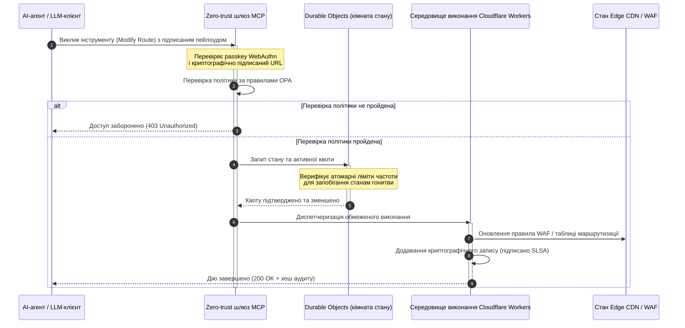

# CloudCDN: відкрита схема AI-нативної периферії у 2026

<!-- lead-start: manual -->
<aside class="post-lead" aria-label="Стислий зміст статті">

<strong>Коротко.</strong> Корпоративні технології у 2026 році визначає конвергенція глобально розподіленого безсерверного виконання та агентного ШІ. Стандартні CDN — створені для кешування статичних файлів і базової маршрутизації трафіку — структурно застаріли в епоху активної оркестрації даних у реальному часі. CloudCDN — це схема з відкритим вихідним кодом, що перепрофільовує периферію в активну площину управління: безсерверні середовища виконання, координація стану через Cloudflare Durable Objects і zero-trust шлюз Model Context Protocol (MCP), який дозволяє автономним AI-агентам керувати вебінфраструктурою в межах обмежених, криптографічно захищених операційних конвертів.

<strong>Ключові висновки</strong>

<ul class="post-lead-takeaways">
  <li><strong>Від статичного кешу до обмеженої площини управління.</strong> CloudCDN переносить операційну межу на периферію, перетворюючи вузли CDN на активні шлюзи політик, що виконують субмілісекундні рішення з безпеки, маршрутизації та контролю доступу.</li>
  <li><strong>Координація стану на периферії.</strong> Cloudflare Durable Objects забезпечують атомарне обмеження частоти запитів і координацію стану в реальному часі глобально — без розподілених станів гонитви та без системного зловживання квотами між периферійними регіонами.</li>
  <li><strong>Безпечне агентне керування інфраструктурою через MCP.</strong> Zero-trust шлюз експонує 42 спеціалізовані інструменти MCP, дозволяючи AI-агентам перевіряти, конфігурувати та експлуатувати інфраструктуру в криптографічно підписаних межах.</li>
  <li><strong>Безпека ланцюга постачання як результат конвеєра.</strong> Провенанс збірок SLSA Level 3 через Sigstore/Cosign і 3 185 модульних тестів зі 100% покриттям у кожному релізі.</li>
  <li><strong>Докази рівня правління, а не дашборди.</strong> Периферійна телеметрія напряму відображається на підзвітність правління за статтею 5 DORA, ризик-звітність BCBS 239 і правила Basel III щодо капіталу під операційний ризик.</li>
</ul>

<strong>Пов'язане читання:</strong> <a href="/2026-05-16-best-cloud-infrastructure-architecture-2026/">Найкраща архітектура хмарної інфраструктури у 2026</a> · <a href="/2026-06-05-cloud-native-banking-index-dora-resilience-platform-engineering-2026/">Індекс хмарно-орієнтованого банкінгу у 2026</a> · <a href="/2026-06-03-agentic-ai-index-banks-autonomy-governance-auditability-2026/">Індекс агентного ШІ для банків у 2026</a>

</aside>
<!-- lead-end -->

Дискусію про CDN завершено. Периферія більше не кеш; це площина управління для AI-нативного програмного забезпечення. Коли агенти викликають інструменти, переміщають дані, очищають кеші, запитують підписані URL і координують робочі процеси, стара модель непрозорих панелей і пропрієтарних площин управління перестає бути незручністю та стає регуляторним зобов'язанням. CloudCDN обстоює іншу модель: відкриту, перевіряну, агент-керовану периферійну платформу, що трактує безпеку, доступність, продуктивність і перевіреність як примусово застосовувані стандартні значення, а не обіцянки вендора.

Опорний проєкт з відкритим вихідним кодом для цієї статті — [cloudcdn.pro ⧉](https://github.com/sebastienrousseau/cloudcdn.pro "cloudcdn.pro"). Репозиторій — це мультитенантний AI-нативний CDN, який можна прочитати наскрізно та розгорнути незалежно: TTFB до 100 мс через Cloudflare PoPs, MCP-керування, обмеження частоти запитів на Durable Objects, доступність WCAG-AA, підписані URL, passkeys, SLSA Level 3 і 3 185 тестів зі 100% покриттям.

---

> **Резюме для правління / Ключові висновки**
>
> - **Периферія стає операційною межею.** CloudCDN перетворює стандартні вузли CDN на активні шлюзи політик, що виконують субмілісекундні рішення з безпеки, маршрутизації та контролю доступу.
> - **Durable Objects роблять обмеження частоти запитів атомарним.** Глобально консистентне виконання квот у реальному часі закриває вікно станів гонитви, яке лімітери з відкладеною консистентністю залишають відкритим для зловмисників і несправних агентів.
> - **Агенти керують інфраструктурою через 42 обмежені інструменти MCP.** Кожен виклик перевіряється за passkeys WebAuthn, підписаними пейлоудами та політикою OPA до того, як будь-що виконається.
> - **Ланцюг постачання — частина продукту.** Провенанс SLSA Level 3 через Sigstore/Cosign криптографічно пов'язує кожен реліз з його перевіреним вихідним кодом.
> - **Телеметрія — це доказ комплаєнсу.** Периферійні операції відображаються на статтю 5 DORA, BCBS 239 і капітал Basel III під операційний ризик — напряму, а не через звітність постфактум.
>
---

## Чому цей проєкт з відкритим вихідним кодом має значення у 2026 році

Корпоративне ІТ у 2026 році перейшло від статичного виділення інфраструктури до подієво-орієнтованої оркестрації даних у реальному часі. Зсув зумовлюють дві ринкові сили.

Перша — поширення агентного ШІ. Автономні моделі та програмні агенти тепер виконують складні операційні завдання — автоматизоване пом'якшення загроз, рішення з маршрутизації, балансування реєстрів у реальному часі. Вони не користуються панелями. Вони викликають інструменти.

Друга — активне застосування [Закону про цифрову операційну стійкість (DORA) ⧉](https://eur-lex.europa.eu/legal-content/EN/TXT/?uri=CELEX%3A32022R2554 "Регламент (ЄС) 2022/2554 про цифрову операційну стійкість фінансового сектору"). Банківські установи більше не можуть покладатися на непрозорі пропрієтарні CDN третіх сторін. Регулятори вимагають повної видимості ланцюга постачання програмного забезпечення, перевіреної здатності до виходу та незмінних криптографічних аудиторських слідів.

Централізовані серверні архітектури накладають штрафи на затримку, яких оркестрація в реальному часі не може поглинути. Пропрієтарні CDN функціонують як чорні скриньки, що наражають установи на компрометацію ланцюга постачання, якої вони не бачать — і тим паче не можуть задокументувати. CloudCDN закриває цю прогалину прозорою, zero-trust схемою з відкритим вихідним кодом, що перетворює периферію на активну площину управління. Для технологічних керівників вона зміщує розмову від вартості комплаєнсу до віддачі від стійкості (Return on Resilience): капіталу, збереженого завдяки автоматизованим, готовим до аудиту операційним конвеєрам.

## Архітектурна призма

Архітектура CloudCDN структурована за п'ятьма шарами, замінюючи централізоване проміжне програмне забезпечення локалізованими периферійними примітивами зі станом:

| Шар | Проєктне рішення | Чому це важливо | Ризик при неналежному поводженні |
|---|---|---|---|
| **Периферійне середовище виконання** | Cloudflare Workers і Pages | Усуває затримку централізованих VM; виконує субмілісекундні політики глобально | Виграш у продуктивності без дисципліни політик породжує хаотичний периферійний дрейф |
| **Координація стану** | Durable Objects | Гарантує атомарну консистентність лімітів частоти та спільного стану між регіонами в реальному часі | Розподілені стани гонитви, зловживання ресурсами API, обхід периметрових квот |
| **Інтерфейс агента** | Zero-trust шлюз MCP | Експонує 42 спеціалізовані інструменти MCP, щоб AI-агенти керували інфраструктурою в регульованих межах | Необмежений виклик інструментів і несанкціоновані зміни конфігурації |
| **Контроль доступу** | Passkeys WebAuthn і підписані URL | Замінює статичні паролі криптографічними підписами для підзвітних операцій | Слабко атрибутовані зміни; крадіжка облікових даних з проривом периметра |
| **Шлюзи якості** | SLSA Level 3 і 100% покриття тестами | Математично верифікує джерело збірки; блокує впровадження шкідливих залежностей | Шкідливий код, впроваджений через ланцюг постачання програмного забезпечення |

## Операційні сигнали для відстеження

Готовність периферії вимірювана. Це кількісні індикатори, що демонструють здатність до виконання, а не наміри:

| Сигнал | Метрика / Бенчмарк | Регуляторне посилання | Реалізація на платформі |
|---|---|---|---|
| **42 інструменти MCP** | Обмежений реєстр інструментів для автоматизованого керування | COBIT 2019 (BAI06) | Шлюз MCP, що перевіряє підписи агентів за політиками OPA |
| **Durable Objects** | Атомарне субмілісекундне виконання квот без витоків | DORA, стаття 6 | Durable Objects, що відстежують глобальний стан квот API |
| **Passkeys і підписані URL** | 100% адміністративних сесій верифіковано через FIDO2 WebAuthn | DORA, стаття 30 | Перевірки криптографічних підписів, вбудовані в периферійний маршрутизатор |
| **SLSA Level 3** | Криптографічно підписані маніфести збірок (Sigstore) | DORA, стаття 30 | Конвеєри GitHub Actions, що генерують підписані метадані збірок |
| **3 185 модульних тестів** | 100% покриття; регресійні шлюзи в кожному релізі | NIST CSF 2.0 (PR.DS-01) | CI-конвеєри, що зупиняють розгортання при будь-якому збої тесту |

## CDN стає активною площиною управління

Традиційні CDN проєктувалися навколо пасивного прискорення статичного контенту. CloudCDN переозначує модель. З інтегрованими Cloudflare Workers і Durable Objects периферія функціонує як активний шлюз політик зі станом.

Коли AI-агент або автоматизований процес запитує зміну конфігурації інфраструктури чи коригування маршрутизації, він не звертається до вразливої централізованої бази даних. Запит перехоплюється на найближчому периферійному вузлі та проходить перевірки ідентичності, політики й квоти до того, як будь-що виконається:

Кожен крок цієї послідовності створює атрибутований, підписаний запис. У цьому різниця між CDN, який прискорює контент, і площиною управління, якою можна керувати.

## Чому відкритий вихідний код змінює модель довіри

Для директорів з інформаційної безпеки непрозорі пропрієтарні CDN становлять ризик, що накопичується. Периферійні мережі із закритим кодом — це чорні скриньки: якщо вендор зазнає внутрішньої компрометації, банк має нульову видимість, поки про злам не повідомлять публічно.

CloudCDN замінює цю асиметрію повністю перевіряною моделлю довіри з відкритим вихідним кодом, побудованою на трьох механізмах:

1. **Математичний провенанс збірок.** За SLSA Level 3 кожен реліз криптографічно пов'язаний з його відкритим репозиторієм на GitHub. CISO може верифікувати — математично, а не контрактно, — що бінарний файл на глобальних периферійних вузлах Cloudflare містить саме той вихідний код, який пройшов аудит.
2. **Безперервні публічні аудити безпеки.** Кодова база проходить автоматизовані сканування, публічне розкриття вразливостей і рецензовані аудити коду. Непрозорість — не контроль; контроль — це рецензування.
3. **Без прив'язки до вендора (DORA, стаття 28).** DORA вимагає від банків довести чітку, протестовану стратегію виходу від критичних сторонніх постачальників. Оскільки CloudCDN має відкритий вихідний код і побудований на стандартних безсерверних примітивах, установи можуть мігрувати периферійні конфігурації з Cloudflare на інші безсерверні середовища виконання чи приватні кластери Kubernetes — і задокументувати цю здатність регулятору.

## Шаблон периферії банківського рівня

CloudCDN спроєктовано відповідно до комплаєнс-стандартів глобального фінансового сектору, відображаючи технічні периферійні операції безпосередньо на структури, які наглядові органи реально перевіряють:

- **Управління модельним ризиком ([US Fed SR 11-7 ⧉](https://www.federalreserve.gov/supervisionreg/srletters/sr1107.htm "Наглядові настанови щодо управління модельним ризиком") / UK PRA SS1/23).** Автономні моделі, що виконують операційні завдання, підпадають під управління модельним ризиком. Шлюз MCP CloudCDN трактує агентні інструменти як кількісні моделі: суворі межі політик, журналювання в реальному часі та обов'язкові human-in-the-loop перевизначення для дій з високим впливом.
- **BCBS 239 (агрегація даних про ризики).** Завдяки захопленню, маркуванню та структуруванню транзакційних даних на периферії операційні метрики генеруються в реальному часі — відповідно до вимог BCBS 239 щодо цілісності даних, своєчасності та регуляторної простежуваності.
- **DORA, стаття 5 (підзвітність правління).** Правління несе остаточну персональну відповідальність за операційну стійкість. CloudCDN перетворює периферійну телеметрію на кількісні, верифіковані докази, які нетехнічні директори можуть взяти з собою на аудит персональної відповідальності.
- **Капітал Basel III під операційний ризик.** Банки тримають регуляторний капітал проти операційного ризику. Автоматизоване перемикання DR при відмові та провенанс SLSA Level 3 знижують профіль операційного ризику установи — зберігаючи капітал на балансі, а не лише задовольняючи аудит.

## Що це означає за типами банків

### Глобальні системно важливі банки (G-SIB)

G-SIB обробляють величезні обсяги транзакцій у багатьох юрисдикціях. Пріоритет — заміна фрагментованих успадкованих периметрових контролів єдиною уніфікованою периферійною площиною. Розгортання шаблону CloudCDN дозволяє G-SIB стандартизувати політики безпеки, шлюзи API та агентне управління глобально — і генерувати DORA-сумісні конвеєри доказів як побічний продукт експлуатації, а не квартальний аврал.

### Транзакційні та корпоративні банки

Для транзакційних банків клієнтський продукт — це пакет зі швидкості виконання, безпеки та прозорості даних. Шаблон CloudCDN дозволяє цим банкам експонувати корпоративним казначеям захищені API-панелі та сервіси відстеження грошових коштів у реальному часі — стійку периферійну позицію, що захищає корпоративні депозити.

### Регіональні та менші банки

Регіональні банки стикаються з тими самими загрозами, що й G-SIB, без відповідних інженерних бюджетів. Відкрита периферійна схема банківського рівня надає контролі з коробки: негайне регуляторне вирівнювання без витрат на пропрієтарні ліцензії та вихідний код, щоб це довести.

## Плейбук для правління

Операційна стійкість більше не невидима бек-офісна ІТ-метрика; це пріоритет правління з прив'язаною персональною відповідальністю. Установи, які у 2026 році зберігають довіру регуляторів, клієнтів і акціонерів, трактують технологію як верифікований, спостережуваний актив.

Дорожня карта для старших технологічних керівників коротка:

1. **Зробіть докази продуктом.** Бюджетуйте автоматизовані, самодокументовані конвеєри на периферії — докази, що генеруються самою експлуатацією, а не збираються для аудитора.
2. **Перейдіть до периферійного управління зі станом.** Зніміть обмеження частоти запитів, WAF і верифікацію ідентичності з централізованих серверів і перенесіть на атомарні периферійні примітиви.
3. **Встановіть криптографічні агентні межі.** Запровадьте zero-trust шлюзи MCP з валідацією passkey та OPA для кожного автоматизованого виклику інструменту.
4. **Вимагайте аудитів збірок з відкритим кодом.** Зробіть провенанс збірок SLSA Level 3 умовою розгортання, а не прагненням.

## Часті запитання

**Чи готовий CloudCDN до аудитів DORA?**

Так. CloudCDN спроєктовано для створення автоматизованих доказів комплаєнсу, що напряму відображаються на шаблони ITS Реєстру інформації (від RT.01 до RT.15) і договірні положення статті 30 DORA.

**У чому перевага Durable Objects для обмеження частоти запитів?**

Традиційні розподілені лімітери частоти покладаються на відкладену консистентність, яка залишає вікно затримки, що його можуть використати зловмисники чи несправні агенти. Durable Objects гарантують негайну атомарну консистентність глобально, повністю закриваючи вікно станів гонитви.

**Що робить CloudCDN AI-нативним?**

Його MCP-керовані операції та агент-усвідомлена модель управління. Інфраструктура експлуатується через 42 регульовані інструменти з криптографічною ідентичністю та межами політик — спроєктовано для автономних робочих процесів, а не лише для людських панелей.

**Чи збільшує відкритий вихідний код ризик zero-day експлойтів?**

Ні. Пропрієтарні CDN із закритим кодом покладаються на безпеку через непрозорість. Кодова база CloudCDN безперервно проходить автоматизоване тестування, публічне рецензування та валідацію SLSA Level 3 — це верифіковано вищий поріг довіри.

## Посилання

- Європейський Парламент і Рада Європейського Союзу, (2022). [Регламент (ЄС) 2022/2554 про цифрову операційну стійкість фінансового сектору (DORA) ⧉](https://eur-lex.europa.eu/legal-content/EN/TXT/?uri=CELEX%3A32022R2554 "Регламент (ЄС) 2022/2554 про цифрову операційну стійкість фінансового сектору (DORA)"). Брюссель: Офіційний вісник Європейського Союзу.
- Базельський комітет з банківського нагляду (BCBS), (2013). [Принципи ефективної агрегації даних про ризики та звітності про ризики (BCBS 239) ⧉](https://www.bis.org/publ/bcbs239.htm "Принципи ефективної агрегації даних про ризики та звітності про ризики (BCBS 239)"). Базель: Банк міжнародних розрахунків.
- Рада керуючих Федеральної резервної системи, (2011). [Наглядові настанови щодо управління модельним ризиком (SR Letter 11-7) ⧉](https://www.federalreserve.gov/supervisionreg/srletters/sr1107.htm "Наглядові настанови щодо управління модельним ризиком (SR Letter 11-7)"). Вашингтон: Федеральна резервна система.
- Cloudflare, (2026). [Документація Durable Objects: координація стану на периферії ⧉](https://developers.cloudflare.com/durable-objects/ "Документація Durable Objects"). Сан-Франциско: Cloudflare.
- Cloudflare, (2026). [Створення AI-агентів з MCP, автентифікацією та Durable Objects ⧉](https://blog.cloudflare.com/building-ai-agents-with-mcp-authn-authz-and-durable-objects/ "Створення AI-агентів з MCP, автентифікацією та Durable Objects").
- GitHub, (2026). [Репозиторій cloudcdn.pro ⧉](https://github.com/sebastienrousseau/cloudcdn.pro "Репозиторій cloudcdn.pro").

<!-- enrich-start -->
<aside class="author-card" aria-label="Про автора"><strong class="author-card-name"><a href="/about/index.html">Себастьян Руссо</a></strong>Старший банківський технолог, пише про прикладний ШІ, інфраструктуру платежів, токенізовані гроші, ISO 20022, постквантову безпеку, хмарно-орієнтовані фінансові послуги, інфраструктуру з відкритим вихідним кодом та регульовані цифрові ринки.Понад 20 років у HSBC Commercial &amp; Investment Bank, PayPal, Barclays, Shazam, AKQA, Virgin Group. <a href="/about/index.html">Повний профіль</a> &middot; <a href="https://www.linkedin.com/in/sebastienrousseau/" rel="external noopener">LinkedIn</a> &middot; <a href="https://github.com/sebastienrousseau" rel="external noopener">GitHub</a></aside>

Останній перегляд <time datetime="2026-06-11">2026-06-11</time>.

<!-- enrich-end -->
