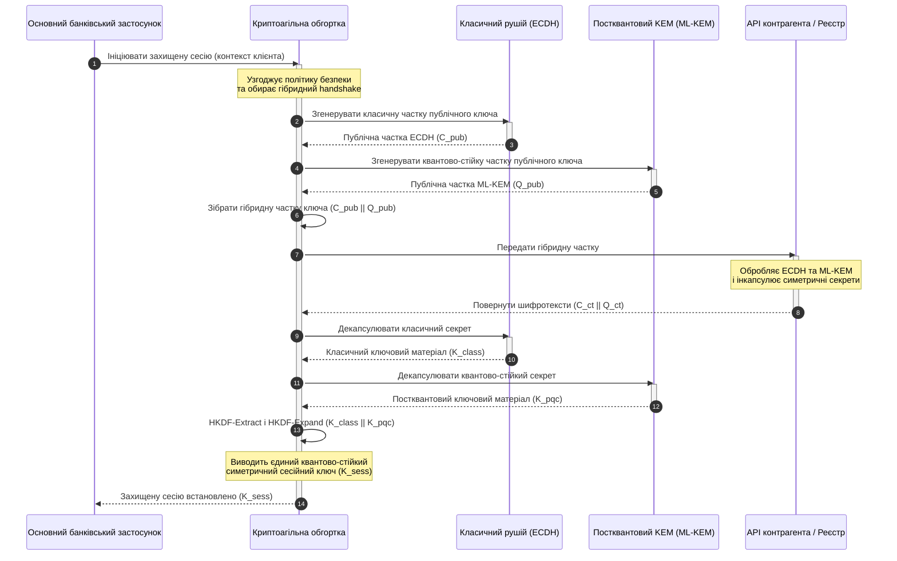

# KyberLib і постквантова міграція банків 2026: від стандартів до коду

<!-- lead-start: manual -->
<aside class="post-lead" aria-label="Стислий зміст">

<strong>Коротко.</strong> Банківська інфраструктура у 2026 році стоїть перед системною загрозою з відомою кінцевою точкою: обчислення квантового масштабу зламають обмін ключами RSA та ECC, який сьогодні захищає трафік у транзиті. Федеральні стандарти та наглядові політичні документи підвищили обізнаність; технічне виконання залишається розрізненим. <a href="https://github.com/sebastienrousseau/kyberlib">KyberLib</a> — це інженерна схема з відкритим вихідним кодом, яка переводить постквантовий наратив у конкретний, безпечний щодо пам'яті код на Rust: стандартизований NIST ML-KEM (FIPS 203) за криптоагільними межами абстракції, щоб установи встигли оновити транспортну безпеку та інкапсуляцію ключів до того, як атаки «Store Now, Decrypt Later» дістануться їхніх архівів.

<strong>Ключові висновки</strong>

<ul class="post-lead-takeaways">
  <li><strong>Від політики до перевіряного коду.</strong> KyberLib переносить постквантову криптографію з абстрактних стратегічних дорожніх карт у конкретні, високопродуктивні, придатні до аудиту впровадження на Rust.</li>
  <li><strong>Стандартизоване виконання ML-KEM за FIPS 203.</strong> Бібліотека впроваджує ML-KEM — алгоритм встановлення ключів, фіналізований у NIST FIPS 203, — утримуючи відповідність у руслі глобальних регуляторних очікувань.</li>
  <li><strong>Криптоагільність за задумом.</strong> Стабільні межі абстракції дають банківським застосункам змогу замінювати криптографічні примітиви без дорогих і схильних до помилок переписувань.</li>
  <li><strong>Безпека пам'яті завдяки Rust.</strong> Правила володіння на етапі компіляції викорінюють переповнення буфера та витоки пам'яті, що переслідують спадкові криптографічні бібліотеки на C, — за швидкості абстракцій нульової вартості.</li>
  <li><strong>Зменшення фідуціарної відповідальності.</strong> Спостережувані, тестовані докази міграції дають директорам той запис «розумних кроків», якого вимагають аудити персональної відповідальності за статтею 5 DORA.</li>
</ul>

<strong>Додаткове читання:</strong> <a href="/2026-05-18-quantum-cryptography-standards-developments-2026/">Перезавантаження квантової криптографії у 2026: стандарти PQC та міграційна робота банків</a> · <a href="/2026-05-28-dora-ai-act-data-sovereignty-banking-compliance-stack-2026/">Стек комплаєнсу DORA + AI Act</a> · <a href="/2026-05-20-cloud-native-banking-financial-institutions-2026/">Хмарно-орієнтований банкінг</a>

</aside>
<!-- lead-end -->

Постквантова міграція перестала бути плановою вправою. У 2026 році це чинна операційна вимога, і ризик тепер сидить у розриві між регуляторним наміром та інженерним виконанням. [KyberLib ⧉](https://github.com/sebastienrousseau/kyberlib "kyberlib") закриває частину цього розриву: орієнтована на промислову експлуатацію, безпечна щодо пам'яті бібліотека на Rust, яка впроваджує ML-KEM за фіналізованими параметрами FIPS 203 і загортає його в криптоагільні межі, яких насправді потребує транзакційна інфраструктура банку.

---

> **Резюме для правління / Ключові висновки**
>
> - **Загроза вже операційна.** Зловмисники ведуть збирання за схемою «Store Now, Decrypt Later» уже сьогодні; конфіденційність даних руйнується заднім числом у день появи криптографічно релевантного квантового комп'ютера.
> - **Стандарти фіналізовано.** NIST FIPS 203 (ML-KEM) та FIPS 204 (ML-DSA) дають аудиторським комітетам чіткий, тестований орієнтир — захисту «чекаємо на стандарти» більше не існує.
> - **KyberLib — інженерна схема.** Безпечний щодо пам'яті Rust, компіляція `no_std` для HSM та смарт-карток, а також шаблони гібридного обміну ключами, що зберігають класичну сумісність.
> - **Криптоагільність — стійка мета.** Стабільні межі абстракції дозволяють змінювати примітиви без переписування застосунків — урок, що переживе будь-який окремий алгоритм.
> - **Відповідальність несуть ради.** Стаття 5 DORA покладає персональну відповідальність на директорів; перевіряний, спостережуваний код міграції — це доказ, який її задовольняє.
>
---

## Чому цей проєкт з відкритим кодом важливий у 2026 році

Наближення асиметричної криптографії до зношення не означає, що загроза чекає, поки криптографічно релевантний квантовий комп'ютер буде збудовано. Зловмисники виконують атаки **«Store Now, Decrypt Later» (SNDL)** уже зараз — збирають зашифровані потоки корпоративних банківських транзакцій, комерційних таємниць та інституційних комунікацій у транзиті, щоб розшифрувати їх, щойно квантові потужності визріють. Для банку кожен класичний обмін ключами на дроті сьогодні — це порушення конфіденційності з відкладеною датою детонації.

Регулятори відповіли конкретними зобов'язаннями:

1. **Стаття 6 DORA (управління ІКТ-ризиками)** вимагає від установ картографувати, ідентифікувати та усувати вразливості по всьому криптографічному парку — включно з асиметричним обміном ключами, захованим у проміжному ПЗ, яке ніхто не інвентаризував.
2. **NIST FIPS 203 та 204** встановлюють офіційні постквантові стандарти для інкапсуляції ключів (ML-KEM) та цифрових підписів (ML-DSA), даючи аудиторським комітетам стандартизований орієнтир, за яким вимірюється поступ міграції.

Виконати цю міграцію без зриву живих операцій можна, лише вийшовши за межі політичних документів — до **перевіряної криптографічної інфраструктури з відкритим вихідним кодом**. [KyberLib ⧉](https://github.com/sebastienrousseau/kyberlib "kyberlib") дає саме це: безпечну щодо пам'яті бібліотеку на Rust, що відповідає FIPS 203 і перетворює постквантовий перехід на вимірюваний, верифіковний інженерний конвеєр — зміщуючи розмову про технологічні інвестиції в бік відчутної віддачі на стійкість.

## Архітектурна оптика

KyberLib стоїть за стабільними межами API, ізолюючи основні транзакційні застосунки банку від змін у низькорівневих криптографічних примітивах.

| Шар | Проєктне рішення | Чому це важливо | Ризик у разі помилки |
|---|---|---|---|
| **Примітив** | Інкапсуляція ключів ML-KEM за FIPS 203 | Замінює класичний обмін ключами Діффі—Геллмана та RSA структурами на ґратках | Невідповідність фіналізованим параметрам FIPS 203 і, як наслідок, провалені комплаєнс-аудити |
| **Мова** | Безпечне щодо пам'яті впровадження на Rust | Усуває вразливості пошкодження пам'яті (переповнення буфера, use-after-free), ендемічні для C/C++ | Розростання залежностей, що підриває цілісність ланцюга збирання |
| **Абстракція** | Стабільні криптоагільні межі | Застосунки перемикають алгоритми за єдиним інтерфейсом у міру еволюції стандартів | Зашиті примітиви, що змушують до ручних переписувань у кожній наступній міграції |
| **Розгортання** | Гібридний обмін ключами (handshake) | Поєднує постквантові KEM із класичними алгоритмами у подвійно загорнутому конверті | Втрата сумісності зі спадковими системами або непомічений дрейф конфігурації |
| **Підтвердження** | Провенанс SLSA Level 3 та перевіряні тести | Гарантує джерело та походження коду; приклади можна аудитувати рядок за рядком | Театр безпеки — бібліотеки-«чорні скриньки», чиї помилки впровадження спливають у проді |

## Операційні сигнали для відстеження

Демонстрація постквантової відповідності наглядовим радам і регуляторам означає відстеження конкретних, кількісних метрик:

| Сигнал | Метрика | Регуляторне посилання | Впровадження на платформі |
|---|---|---|---|
| **Відповідність ML-KEM за FIPS 203** | 100% відповідність фіналізованим параметрам (ML-KEM-512/768/1024) | NIST FIPS 203 | Криптографія на ґратках з верифікованими параметрами, скомпільована в модулях KyberLib |
| **Криптографічна інвентаризація** | Повна інвентаризація використання асиметричного обміну ключами в усіх системах | NIST SP 1800-38 | Автоматизовані агенти сканування, що журналюють активні набори шифрів до центрального реєстру |
| **Гібридний обмін ключами** | Частка handshake транспортного рівня, виконуваних у гібридному конверті | DORA, стаття 6 | Мережеві проксі, що загортають класичні handshake TLS 1.3 у PQC-інкапсуляцію |
| **Компіляція `no_std`** | Здатність компілюватися без стандартної бібліотеки Rust для обмежених цілей | DORA, стаття 30 | Умовна компіляція `no_std` у KyberLib для апаратних модулів безпеки (HSM) |
| **Індекс криптоагільності** | Час у хвилинах на заміну криптографічного примітива на API-шлюзі | UK PRA SS1/23 | Абстраговані реєстри маршрутизації, що керують розподілом алгоритмів через змінні часу виконання |

## Чому Rust важливий для постквантової криптографії

Впровадження постквантових алгоритмів на кшталт ML-KEM потребує складних низькорівневих математичних операцій над поліноміальними кільцями. Історично запуск цих операцій на промисловій швидкості означав рукописний C/C++ або асемблер — велику поверхню атаки для пошкодження пам'яті саме в тому коді, помилку в якому банк може дозволити собі найменше.

Rust змінює безпековий профіль криптографічної інженерії трьома конкретними способами:

1. **Безпека пам'яті на етапі компіляції.** Модель володіння в Rust гарантує, що переповнення буфера, подвійні звільнення та помилки use-after-free відсікаються ще компілятором. Для постквантових бібліотек це критично: розміри ключів і шифротекстів тут суттєво більші за класичні аналоги.
2. **Детерміновані абстракції нульової вартості.** Rust компілюється в нативний машинний код без збирача сміття, тож швидкість виконання та обсяг пам'яті відповідають бібліотекам на C або перевершують їх — зі збереженням безпеки.
3. **Сумісність із `no_std`.** KyberLib компілюється без стандартної бібліотеки Rust і тому працює в обмежених bare-metal середовищах — включно з апаратними модулями безпеки (HSM) та смарт-картками, утримуючи криптографію банківського класу всередині фізичних периметрів безпеки.

## Проєктування криптоагільної архітектури

Класичний режим відмови криптографічних міграцій — зашивання: алгоритмо-специфічні припущення, вбудовані просто в логіку застосунків і болісно перевідкривані під час кожного переходу. Стійка мета на 2026 рік — **криптоагільність**: шар абстракції, що трактує алгоритми як замінні модулі за стабільним інтерфейсом, щоб наступна міграція була зміною конфігурації, а не переписуванням усього парку систем.

Послідовність нижче показує, як криптоагільна обгортка KyberLib координує гібридний (класичний плюс постквантовий) обмін ключами:

Гібридний конверт — операційно важлива деталь. Поки постквантові примітиви не накопичать роки промислової перевірки, сесійний ключ виводиться і з класичного, і з постквантового секрету: щоб відновити канал, атакувальник має зламати ECDH **і** ML-KEM. Контрагенти, які ще не мігрували, продовжують працювати; контрагенти, які мігрували, негайно отримують захист на основі ґраток.

## Плейбук для правління

Постквантова безпека — це не бек-офісне питання шифрування, а питання корпоративного управління з персональними ставками. Вищому керівництву варто розглядати міграцію крізь призму фідуціарної відповідальності:

- **Стаття 5 DORA (управління та організація)** покладає персональну відповідальність за ІКТ-безпеку на раду директорів. Відкриті, спостережувані тести — це прямий доказ, якого вимагає аудит персональної відповідальності: «ми обрали перевіряне впровадження FIPS 203, ось його прогони на відповідність» — захищена відповідь; «наш постачальник нас запевнив» — ні.
- **Управління модельним ризиком (SR 11-7 ФРС США / SS1/23 PRA Великої Британії)** стосується архітектур криптографічних обгорток так само, як і моделей ціноутворення. Шари абстракції мають проходити валідацію MRM, включно з продуктивністю за сценаріями екстремальних збоїв.
- **Капітал під операційний ризик за Basel III** винагороджує доведену зрілість контролів. Протестований гібридний обмін ключами знижує довгостроковий профіль операційного ризику установи, зменшуючи капітальну премію та вивільняючи балансову місткість для активного казначейського розміщення.

## Що це означає для різних типів банків

### Глобальні системно важливі банки (G-SIB)

G-SIB експлуатують транзакційні системи з великою часткою спадщини, тож їхнє головне обмеження — виявлення: знати, де насправді відбувається асиметричний обмін ключами. Спершу — безперервна криптографічна інвентаризація за настановами NIST SP 1800-38; далі KyberLib дає стандартизовану, безпечну щодо пам'яті бібліотеку для постквантової інкапсуляції ключів на кожному сучасному вузлі, який інвентаризація виявить.

### Транзакційні та корпоративні банки

Конфіденційність на платіжних рейках — це і є франшиза. Оскільки KyberLib компілюється під bare-metal цілі `no_std`, транзакційні банки можуть розгортати постквантовий обмін ключами безпосередньо в периферійному обладнанні маршрутизації платежів та управління ліквідністю — а не лише на рівні застосунків.

### Регіональні та менші банки

Регіональні установи стикаються з тим самим державно спонсорованим збиранням трафіку без дослідницьких бюджетів G-SIB. Перевіряне відкрите впровадження на Rust дає їм готовий шлях до відповідності NIST FIPS 203 негайно — без перемовин щодо непрозорих дорожніх карт постачальників.

## Від дорожніх карт до коду, що компілюється

Постквантовий перехід — активне інженерне завдання, і довіру наглядачів, контрагентів та корпоративних казначеїв упродовж 2026 року збережуть ті установи, які перейдуть від абстрактних дорожніх карт до спостережуваного коду, що компілюється. Виконавчий мандат випливає прямо: провести аудит спадкових точок обміну ключами, розгорнути гібридний handshake на каналах найвищої цінності та збудувати стабільні межі абстракції, які зроблять кожну майбутню заміну примітива рутиною. KyberLib перетворює кожен із цих кроків на вимірювану операційну спроможність, а не на обіцянку зі слайдів.

## Поширені запитання

**Чи відповідає KyberLib фіналізованим стандартам NIST?**

Так. KyberLib спроєктовано навколо параметрів ML-KEM, фіналізованих у FIPS 203, що утримує скомпільовану бібліотеку в руслі федеральних і глобальних регуляторних очікувань.

**Чи потребує постквантова бібліотека спеціалізованого обладнання?**

Ні. Впровадження KyberLib на Rust компілюється під стандартні системні архітектури. Здатність до `no_std` додатково дозволяє запускати її на спеціалізованих апаратних модулях безпеки (HSM) та смарт-картках, де потрібне фізичне зберігання ключів.

**Як «Store Now, Decrypt Later» впливає на поточний комплаєнс?**

Якщо транспортний рівень спирається на класичні RSA чи ECC, зловмисники можуть збирати трафік сьогодні й розшифрувати його, щойно квантові потужності визріють. Гібридний обмін ключами, розгорнутий зараз, утримує захоплені дані за захистом на основі ґраток.

**Чому гібридний handshake, а не одразу перехід на постквантові примітиви?**

Гібридні конверти виводять сесійний ключ і з класичного, і з постквантового секрету, тож безпека тримається, доки не зламано обидва. Це зберігає сумісність із контрагентами, які ще не мігрували, поки нові примітиви накопичують промислову перевірку.

## Джерела

- National Institute of Standards and Technology, (2024). [FIPS 203: стандарт механізму інкапсуляції ключів на модульних ґратках ⧉](https://www.nist.gov/news-events/news/2024/08/nist-releases-first-3-finalized-post-quantum-encryption-standards "Анонс NIST FIPS 203").
- Board of Governors of the Federal Reserve System, (2011). [Наглядові настанови щодо управління модельним ризиком (SR Letter 11-7) ⧉](https://www.federalreserve.gov/supervisionreg/srletters/sr1107.htm "Federal Reserve SR 11-7").
- European Parliament and Council of the European Union, (2022). [Регламент (ЄС) 2022/2554 про цифрову операційну стійкість фінансового сектору (DORA) ⧉](https://eur-lex.europa.eu/legal-content/EN/TXT/?uri=CELEX%3A32022R2554 "Регламент DORA").
- NIST National Cybersecurity Center of Excellence, (2025). [Міграція на постквантову криптографію (NIST SP 1800-38) ⧉](https://www.nccoe.nist.gov/projects/migration-post-quantum-cryptography "NIST SP 1800-38").
- GitHub, (2026). [Відкритий репозиторій kyberlib ⧉](https://github.com/sebastienrousseau/kyberlib "Репозиторій kyberlib").

<!-- enrich-start -->
<aside class="author-card" aria-label="Про автора"><strong class="author-card-name"><a href="/about/index.html">Себастьян Руссо</a></strong>Старший банківський технолог, пише про прикладний ШІ, інфраструктуру платежів, токенізовані гроші, ISO 20022, постквантову безпеку, хмарно-орієнтовані фінансові послуги, відкриту інфраструктуру та регульовані цифрові ринки.Понад 20 років у HSBC Commercial &amp; Investment Bank, PayPal, Barclays, Shazam, AKQA, Virgin Group. <a href="/about/index.html">Повний профіль</a> &middot; <a href="https://www.linkedin.com/in/sebastienrousseau/" rel="external noopener">LinkedIn</a> &middot; <a href="https://github.com/sebastienrousseau" rel="external noopener">GitHub</a></aside>

Останній перегляд <time datetime="2026-06-12">2026-06-12</time>.

<!-- enrich-end -->
