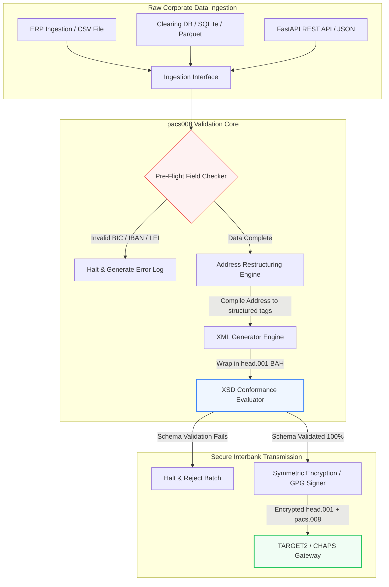

---

# Front Matter (YAML)

author: "contact@sebastienrousseau.com (Sebastien Rousseau)"
banner_alt: "Офісний працівник із голосовим асистентом і ноутбуком — символ структурованих машинозчитуваних міжбанківських платіжних повідомлень, які автоматизація pacs.008 робить програмованими"
banner_height: "1597"
banner_width: "2584"
banner: "https://cloudcdn.pro/stocks/images/tyler-prahm-lmV3gJSAgbo.webp"
cdn: "https://cloudcdn.pro"
charset: "UTF-8"
cname: "sebastienrousseau.com"
copyright: "© Copyright 2025 - 2026 - Sebastien Rousseau. All rights reserved."
date: "June 15, 2026"
description: "Pacs008 — це open-source бібліотека Python, що автоматизує генерацію та валідацію pacs.008 FI-to-FI клієнтських кредитових переказів ISO 20022: структуровані адреси, обгортання BAH head.001, контрольні суми BIC/LEI/IBAN, трасування UETR через OpenTelemetry — побудована під перехід SWIFT у листопаді 2026 року."
format-detection: "telephone=no"
hreflang: "uk"
icon: "https://cloudcdn.pro/clients/sebastienrousseau/v1/logos/sebastienrousseau.svg"
id: "https://sebastienrousseau.com/2026-06-15-pacs008-automation-iso-20022-interbank-payments-2026"
image_alt: "Чорно-білий портрет Себастьяна Руссо"
image_height: "162"
image_width: "162"
image: "https://cloudcdn.pro/stocks/images/sebastienrousseau.webp"
keywords: "pacs008, ISO 20022 pacs.008, FI-to-FI клієнтський кредитовий переказ, структурована адреса, SWIFT CBPR+, BAH head.001, TARGET2, CHAPS, Fedwire, DORA, BCBS 239, Basel III, UETR, валідація LEI, SEPA VoP"
language: "uk-UA"
last_reviewed: "2026-06-15"
layout: "report"
locale: "uk_UA"
logo_alt: "Логотип Себастьяна Руссо"
logo_height: "44"
logo_width: "44"
logo: "https://cloudcdn.pro/clients/sebastienrousseau/v1/logos/sebastienrousseau.svg"
menu: ""
measurementID: "G-169G4ET5HQ"
name: "Sebastien Rousseau"
permalink: "https://sebastienrousseau.com/2026-06-15-pacs008-automation-iso-20022-interbank-payments-2026"
rating: "general"
referrer: "no-referrer"
robots: "index, follow"
schema: "FAQPage, Article"
seo_title: "Автоматизація pacs.008 для епохи ISO 20022"
short_name: "sebastienrousseau"
subtitle: "Повідомлення pacs.008 — точка, де сходяться дані міжбанківських платежів, структуровані адреси, комплаєнс, маршрутизація та операції розрахунків."
tags: "pacs008, ISO 20022, міжбанківські платежі, оптові платежі, Python"
theme-color: "0, 83, 191"
title: "Побудова автоматизації pacs.008 для міжбанківської епохи ISO 20022 у 2026 році"
url: "https://sebastienrousseau.com/2026-06-15-pacs008-automation-iso-20022-interbank-payments-2026"
viewport: "width=device-width, initial-scale=1, shrink-to-fit=no"

# RSS - The RSS feed front matter (YAML).
atom_link: "https://sebastienrousseau.com/2026-06-15-pacs008-automation-iso-20022-interbank-payments-2026/rss.xml"
category: "Finance"
docs: https://validator.w3.org/feed/docs/rss2.html
generator: "Static Site Generator (SSG) (version 0.0.26)"
item_description: "pacs008 — open-source основа Python для автоматизації повідомлень ISO 20022 FI-to-FI клієнтського кредитового переказу в епоху міжбанківських платежів."
item_guid: "https://sebastienrousseau.com/2026-06-15-pacs008-automation-iso-20022-interbank-payments-2026/rss.xml"
item_link: "https://sebastienrousseau.com/2026-06-15-pacs008-automation-iso-20022-interbank-payments-2026/rss.xml"
item_pub_date: "Mon, 15 Jun 2026 06:06:06 +0000"
item_title: "Побудова автоматизації pacs.008 для міжбанківської епохи ISO 20022 у 2026 році"
last_build_date: "Mon, 15 Jun 2026 06:06:06 +0000"
managing_editor: "contact@sebastienrousseau.com (Sebastien Rousseau)"
pub_date: "Mon, 15 Jun 2026 06:06:06 +0000"
ttl: "60"
type: "article"
webmaster: "contact@sebastienrousseau.com"

# Apple - The Apple front matter (YAML).
apple_mobile_web_app_orientations: "portrait"
apple_touch_icon_sizes: "192x192"
apple-mobile-web-app-capable: "yes"
apple-mobile-web-app-status-bar-inset: "black"
apple-mobile-web-app-status-bar-style: "black-translucent"
apple-mobile-web-app-title: "Автоматизація pacs.008 для епохи ISO 20022"
apple-touch-fullscreen: "yes"

# MS Application - The MS Application front matter (YAML).

msapplication-navbutton-color: "0, 83, 191"

# Twitter Card - The Twitter Card front matter (YAML).

twitter_card: "summary_large_image"
twitter_creator: "@wwdseb"
twitter_description: "pacs008 — open-source основа Python для автоматизації повідомлень ISO 20022 FI-to-FI клієнтського кредитового переказу в епоху міжбанківських платежів."
twitter_image: "https://cloudcdn.pro/clients/sebastienrousseau/v1/logos/sebastienrousseau.svg"
twitter_image_alt: "Логотип Себастьяна Руссо"
twitter_site: "@wwdseb"
twitter_title: "Автоматизація pacs.008 для епохи ISO 20022"
twitter_url: "https://sebastienrousseau.com/2026-06-15-pacs008-automation-iso-20022-interbank-payments-2026"

excerpt: "pacs008 — це open-source інструментарій Python, який робить повідомлення ISO 20022 FI-to-FI клієнтського кредитового переказу програмованими: структуровані адреси, валідація, маршрутизація, гачки комплаєнсу та термін SWIFT листопада 2026 року вбудовані як замовчування."

# Humans.txt - The Humans.txt front matter (YAML).
author_website: "https://sebastienrousseau.com"
author_twitter: "@wwdseb"
author_location: "London, UK"
thanks: "Дякуємо за прочитання!"
site_last_updated: "2026-06-15"
site_standards: "HTML5, CSS3, RSS, Atom, JSON, XML, YAML, Markdown, TOML"
site_components: "Kaishi, Kaishi Builder, Kaishi CLI, Kaishi Templates, Kaishi Themes"
site_software: "Static Site Generator, Rust"

---

# Автоматизація міжбанківських платежів ISO 20022 pacs.008 за допомогою open-source Python у 2026 році

<!-- lead-start -->
<aside class="post-lead" aria-label="Стислий зміст статті">

<strong>Коротко.</strong> Згідно з настановами SWIFT CBPR+, 14 листопада 2026 року «обрив структурованих адрес» виводить з експлуатації неструктуровані поштові адреси у TARGET2, CHAPS, Fedwire, Lynx та SEPA. Pacs008 — це open-source бібліотека Python, що автоматизує генерацію та валідацію повідомлень FI-to-FI клієнтських кредитових переказів ISO 20022 (pacs.008), обгортає платежі у Business Application Headers (BAH head.001) і вбудовує відповідність структурованим адресам у шлях даних ще до того, як повідомлення дотягнеться до клірингової мережі.

<strong>Ключові висновки</strong>

<ul class="post-lead-takeaways">
  <li><strong>Термін щодо структурованих адрес — абсолютний.</strong> Після 14 листопада 2026 року блоки неструктурованих адрес виводять з обігу. Pacs008 примусово застосовує елементи структурованої поштової адреси (<code>&lt;TwnNm&gt;</code>, <code>&lt;Ctry&gt;</code>, <code>&lt;PstCd&gt;</code>) на етапі компіляції даних, щоб уникнути відмов на кордоні мережі.</li>
  <li><strong>Єдина оркестрація повідомлень.</strong> Обгортає основне корисне навантаження pacs.008 у відповідний конверт Business Application Header (head.001), задаючи стандартну модель кругового опрацювання.</li>
  <li><strong>Алгоритмічна цілісність.</strong> Вбудовані валідатори BIC та Legal Entity Identifier (LEI) із контрольними сумами ISO 7064 Modulo 97-10.</li>
  <li><strong>Простежуваність рівня DORA.</strong> Повна інструментація OpenTelemetry, прив'язана до Unique End-to-End Transaction Reference (UETR), для журналів аудиту в реальному часі та криптографічних аудиторських підписів.</li>
  <li><strong>Збереження фідуціарних обов'язків на рівні правління.</strong> Узгоджує точність міжбанківських повідомлень із DORA Article 5, звітністю BCBS 239 та економією капіталу за операційним ризиком Basel III.</li>
</ul>

<strong>Пов'язане читання:</strong> <a href="https://sebastienrousseau.com/2026-05-19-global-wholesale-payments-economics-2026">Глобальні оптові платежі у 2026 році: ISO 20022, оновлення RTGS та економіка операційної сумісності</a>, <a href="https://sebastienrousseau.com/2026-05-27-ai-operating-system-payments-fraud-routing-resilience-compliance-2026">ШІ як операційна система платежів: шахрайство, маршрутизація, стійкість і комплаєнс у 2026 році</a>, <a href="https://sebastienrousseau.com/2026-05-12-iso-20022-pacs008-structured-address-deadline">Термін структурованих адрес pacs.008 у листопаді 2026 року: погляд на шість місяців уперед</a>.

</aside>
<!-- lead-end -->

Перекидаємо місток між успадкованими фінансовими даними і структурованим міжбанківським повідомленням через перевіряний, валідований за схемою конвеєр на Python.

Орієнтиром open-source для цієї статті є [pacs008 ⧉](https://github.com/sebastienrousseau/pacs008 "pacs008 — open-source бібліотека Python"). Репозиторій позиціонується як бібліотека Python для автоматизації XML-повідомлень ISO 20022 pacs.008 FI-to-FI клієнтського кредитового переказу.

## Чому цей open-source проєкт має значення у 2026 році

Світова інфраструктура міжбанківського клірингу платежів проходить через найглибшу модернізацію за майже півстоліття.

У червні 2026 року фінансовий сектор стрімко наближається до **обриву структурованих адрес SWIFT 14 листопада 2026 року**. Починаючи з цієї дати, настанови SWIFT CBPR+, разом із TARGET2, CHAPS, Fedwire та канадським Lynx, офіційно виводять з експлуатації неструктуровані рядки поштових адрес (де використовується лише `<AdrLine>` у блоках `<PstlAdr>`). Усі фінансові установи-учасники повинні передавати адреси у гібридному форматі (структуровані `<TwnNm>` та `<Ctry>`, із не більше ніж двома елементами `<AdrLine>` для решти деталей) або у повністю структурованому форматі (окремі елементи для назви вулиці, номера будинку та поштового індексу). Будь-яке повідомлення, що не відповідає цьому критерію, буде відхилене на кордоні мережі.

Для фінансових установ цей перехід створює серйозні операційні обмеження:

1. **Штраф за відхилення на кордоні мережі.** Платежі, що не відповідають критеріям структурованої адреси, отримують негайні відмови мережі, що спричиняє транзакційні затримки, блокування ліквідності та операційні затори.
2. **SEPA Verification of Payee (VoP).** Зобов'язує всіх постачальників платіжних послуг (PSP) у зоні SEPA перевіряти відповідність імені бенефіціара та IBAN перед виконанням кредитових переказів, додаючи ще один валідаційний шлюз на етапі ініціації повідомлення.

[Pacs008](https://github.com/sebastienrousseau/pacs008) розв'язує цю задачу. Це open-source, легковажна бібліотека Python, що автоматизує перетворення сирих фінансових даних на повністю валідовані повідомлення міжбанківських клієнтських кредитових переказів ISO 20022 pacs.008, відповідні схемі. Долаючи розрив між успадкованими та структурованими даними, pacs008 забезпечує високий Return on Resilience (RoR), зберігаючи робочий капітал і гарантуючи виконання платежів у реальному часі на глобальних рейках.

## Архітектурна призма pacs008 у 2026 році

Бібліотека pacs008 побудована як ізольований рушій валідації та генерації, що гарантує систематичний розбір, збагачення та обгортання сирих вхідних даних у стандартні конверти:

| Шар | Проєктне рішення | Чому це важливо | Ризик у разі помилки |
|---|---|---|---|
| **Шар введення** | Прийом із CSV, JSON, SQLite та Parquet | Зустрічає команди банківської інтеграції там, де вже зберігаються їхні дані, без міграції платформ. | Прийом сирих, невалідованих або пошкоджених навантажень даних. |
| **Шар валідації** | Передпольотна валідація проти офіційних XSD-схем і користувацьких бізнес-правил | Зупиняє виконання та позначає помилки до того, як платіжний файл потрапить у клірингову мережу. | Невалідні XML-файли, що спричиняють негайні відмови мережі та затримки клірингу. |
| **Шар конверта BAH** | Автоматичне обгортання Business Application Header (head.001) | Стандартизує надсилання та маршрутизацію повідомлень за тегом `<MsgDefIdr>`. | Передача сирих pacs.008 без обов'язкового зовнішнього конверта, що призводить до відмов системи. |
| **Шар серіалізації** | Підтримка стандартного XML та ISO-сумісного JSON (TS 23029) | Дає змогу прямо перекладати XML- та JSON-навантаження, підтримуючи сучасні REST API та потоки Kafka. | Фрагментовані представлення даних, що порушують офіційні настанови ISO. |
| **Шар спостережуваності** | Трасування OpenTelemetry, прив'язане до UETR | Фіксує детальні шляхи виконання та журнали, забезпечуючи аудит у реальному часі. | Прогалини у трасуванні, що блокують операційну видимість і аудит. |

## Ключові міжбанківські сигнали та регуляторні віхи

Щоб продемонструвати транзакційну операційну стійкість, керівники з технологій і ризиків мають відстежувати конкретні, вимірювані індикатори комплаєнсу:

| Сигнал | Метрика / операційний орієнтир | Посилання G20 / SWIFT / DORA | Реалізація на технічній платформі |
|---|---|---|---|
| **Відповідність структурованим адресам** | % повідомлень pacs.008, що використовують повністю структуровані поля `<PstlAdr>` із визначеними `<TwnNm>` та `<Ctry>`. | Термін SWIFT SR 2026 | Передпольотні перевірки схеми у pacs008, що відхиляють неструктуровані рядки адрес. |
| **SEPA Verification of Payee** | Перевірка відповідності імені бенефіціара та IBAN перед виконанням повідомлення. | Регуляція SEPA VoP | Вбудовані класи-помічники VoP, що виконують перед-валідаційні запити до IBAN/BIC. |
| **Інтеграція BAH head.001** | Відсоток вихідних платіжних навантажень, успішно обгорнутих у Business Application Headers. | Настанови TARGET2 / CBPR+ | Підсистема обгортання BAH автоматично формує зовнішній XML-конверт. |
| **Контрольна сума LEI Modulo** | Валідація контрольної цифри ISO 7064 Modulo 97-10 на блоках `<LEI>` боржника та кредитора. | Мандат Bank of England | Алгоритмічний перевірник, що верифікує цілісність 20-символьного ідентифікатора. |
| **Точність відстеження UETR** | 100% згенерованих платежів отримують валідний Unique End-to-End Transaction Reference. | Специфікації SWIFT UETR | Автоматичне генерування і трасування 36-символьного коду посилання UUIDv4. |

## Чому Python — ідеальний майданчик для міжбанківської автоматизації

Сучасні платіжні хаби та команди операцій казначейства у 2026 році активно покладаються на Python для перетворення даних, фінансового моделювання та інтеграції з базами даних ERP.

Використовуючи open-source бібліотеку Python, установи отримують суттєві переваги:

1. **Низьке когнітивне навантаження та висока операційна сумісність.** Python виступає як єдиний місток. Він дозволяє розробникам писати прості скрипти, що витягують сирі платіжні інструкції з успадкованих баз даних, валідують їх проти складних міжнародних банківських правил і видають відповідний XML у межах єдиного робочого процесу.
2. **Усунення «чорних скриньок» непрозорих перекладачів.** Пропрієтарні банківські портали часто беруть високі ліцензійні платежі за кастомні перекладачі платіжних файлів. Ці перекладачі — пропрієтарні чорні скриньки, тому команди безпеки не можуть перевірити, як опрацьовуються дані та де зберігаються ключі. Open-source, перевіряна бібліотека на кшталт pacs008 гарантує повну прозорість коду.
3. **Бездоганна інтеграція у CI/CD.** Pacs008 безпосередньо інтегрується у конвеєри безперервної інтеграції та розгортання, дозволяючи автоматизувати тестування платіжних файлів як частину стандартного циклу постачання ПЗ.

## Проєктування обмеженого міжбанківського конвеєра

Серйозна вразливість у міжбанківському клірингу — «неконтрольована пакетна генерація»: формування файлів без чіткого, обмеженого циклу верифікації. Pacs008 побудовано так, щоб працювати як основний рушій валідації всередині строго контрольованого, багатоетапного транзакційного конвеєра.

Операційний потік нижче показує, як сирі транзакційні дані проходять через конвеєр pacs008, аби згенерувати криптографічно безпечний, відповідний схемі файл pacs.008, обгорнутий у конверт BAH:

## Посібник для правління та фідуціарна відповідальність

Автоматизація міжбанківських платежів — це питання управління ризиками та корпоративного управління рівня правління. Старші керівники мають підходити до якості транзакційних даних через призму фідуціарної відповідальності та зменшення операційного ризику:

- **DORA Article 5 (Board Accountability).** Покладає пряму, особисту відповідальність на членів правління за стійкість і безпеку ІКТ-операцій установи. Оскільки міжбанківський кліринг є критичною корпоративною функцією, правління повинні продемонструвати впровадження надійних, валідованих і автоматизованих транзакційних контролів для запобігання операційним збоям або затримкам платежів.
- **BCBS 239 (Risk Data Aggregation and Reporting).** Вимагає, щоб звітність про фінансові транзакції була точною, повною та формувалася в реальному часі. Pacs008 допомагає установам досягти відповідності BCBS 239, гарантуючи, що платіжні дані чисто структуровані та валідовані в джерелі, усуваючи прогалини в даних і ручні помилки звірки, які переслідують успадковані електронні таблиці.
- **Зменшення вимог до капіталу за операційним ризиком (Basel III).** Згідно з настановами Basel III, високі рівні платіжних помилок і витрати на ручне втручання збільшують вимоги до капіталу банку за операційним ризиком, заморожуючи капітал, який інакше міг би бути спрямований на кредитування або інвестиції. Автоматизація платіжного конвеєра прямо мінімізує ці капітальні премії, зберігаючи балансову вартість.

## Що це означає за типом банку

### Глобальні системно важливі банки (G-SIB)

G-SIB управляють масивними обсягами транскордонних корпоративних транзакцій. Їхній головний виклик — санація неструктурованих успадкованих даних до того, як вони потраплять у клірингову мережу. Інтегруючи pacs008 у корпоративні банківські шлюзи, G-SIB можуть надавати своїм корпоративним клієнтам утиліти автоматичної валідації, знижуючи накладні витрати на ручні платіжні виправлення та гарантуючи виконання в реальному часі через мережу SWIFT.

### Транзакційні та корпоративні банки

Для транзакційних банків якість платіжних даних є конкурентним диференціатором. Пропонуючи корпоративним клієнтам казначейства open-source, перевіряний інструмент валідації на кшталт pacs008, ці банки можуть пришвидшити онбординг, мінімізувати відмови платіжних файлів і будувати довіру клієнта через вищі показники наскрізного опрацювання.

### Регіональні та менші банки

Регіональні банки повинні підтримувати відповідність міжнародним платіжним стандартам без масивних технологічних бюджетів G-SIB. Pacs008 надає легке, економне і повністю відповідне рішення на Python, що дозволяє меншим установам пропонувати сучасні структуровані можливості ініціації платежів без дорогих ліцензій на пропрієтарне проміжне ПЗ.

## Висновок: дорожня карта міжбанківського клірингу

Майбутній термін SWIFT щодо структурованих адрес у листопаді 2026 року — це жорсткий кордон для операцій корпоративного казначейства. Покладатися на успадковані таблиці, ручне введення даних і неструктуровані платіжні файли — це активний бізнес-ризик.

Щоб забезпечити безперервність транзакцій і мінімізувати операційні витрати, керівники з технологій та фінансів мають уже сьогодні виконати чітку клірингову дорожню карту:

1. **Примусово застосуйте валідацію в джерелі.** Зобов'яжіть валідовувати та форматувати всі платіжні інструкції згідно з офіційними XSD-схемами ISO 20022 ще до виходу за межі корпоративних ERP.
2. **Проаудитуйте конвеєр даних.** Відмовтесь від ручної обробки електронних таблиць і впровадьте автоматизовані, перевіряні робочі процеси на Python з використанням pacs008.
3. **Запровадьте гібридну безпеку.** Гарантуйте, що згенеровані платіжні файли криптографічно підписані та зашифровані перед передачею, відповідаючи очікуванням мереж нульової довіри.
4. **Узгодьте з фідуціарними пріоритетами.** Офіційно звітуйте правлінню метрики автоматизації платежів і якості даних, подаючи інвестицію як критичну програму зменшення операційного ризику в межах DORA.

## Поширені запитання

**Чи відповідає pacs008 майбутнім правилам адрес SWIFT SR 2026?**

Так. Pacs008 спроєктовано для підтримки жорсткої віхи SWIFT щодо структурованих адрес у листопаді 2026 року, з примусовим розділенням елементів поштової адреси (місто, країна, поштовий індекс) на визначені XML-поля ISO 20022.

**Чи може pacs008 обгортати платіжні навантаження у Business Application Headers?**

Так. Оскільки pacs008 нативно підтримує обгортання Business Application Header (BAH head.001), він автоматично формує зовнішній конверт, необхідний для мереж TARGET2, CHAPS та CBPR+.

**Чому open-source бібліотека краща за пропрієтарні перекладачі файлів?**

Пропрієтарні перекладачі — це непрозорі чорні скриньки, що унеможливлює аудит безпеки. Open-source, рецензована спільнотою бібліотека на кшталт pacs008 надає повну прозорість коду, дозволяючи командам безпеки перевірити, що чутливі платіжні дані не розкриваються під час обробки.

**Які ідентифікатори валідує pacs008?**

Pacs008 поставляється з вбудованими валідаторами Bank Identifier Code (BIC) та Legal Entity Identifier (LEI) із контрольними сумами ISO 7064 Modulo 97-10, а також валідацією контрольної цифри IBAN і перевірками унікальності UETR.

## Джерела

- SWIFT, (2024). *ISO 20022 November 2026 Structured Address Milestone*. La Hulpe: SWIFT. Доступно за посиланням: [Віха SWIFT ISO 20022 ⧉](https://www.swift.com/standards/iso-20022/iso-20022-bytes/call-action-november-2026 "Віха SWIFT ISO 20022").
- Basel Committee on Banking Supervision (BCBS), (2013). *Principles for effective risk data aggregation and risk reporting (BCBS 239)*. Basel: Bank for International Settlements. Доступно за посиланням: [Принципи BCBS 239 ⧉](https://www.bis.org/publ/bcbs239.htm "Принципи BCBS 239").
- European Parliament and Council of the European Union, (2022). *Regulation (EU) 2022/2554 on digital operational resilience for the financial sector (DORA)*. Brussels: Official Journal of the European Union. Доступно за посиланням: [Регуляція DORA ⧉](https://eur-lex.europa.eu/legal-content/EN/TXT/?uri=CELEX%3A32022R2554 "Регуляція DORA").
- GitHub, (2026). *Open-source репозиторій pacs008*. Доступно за посиланням: [Репозиторій pacs008 ⧉](https://github.com/sebastienrousseau/pacs008 "Репозиторій pacs008").

<!-- enrich-start -->
<aside class="author-card" aria-label="Про автора"><strong class="author-card-name"><a href="/about/index.html">Себастьян Руссо</a></strong>Старший банківський технолог, пише про прикладний ШІ, міграцію ISO 20022, постквантову криптографію для фінансових послуг і структурну трансформацію оптових платежів.Понад 20 років у HSBC Commercial &amp; Investment Bank, PayPal, Barclays, Shazam, AKQA, Virgin Group. <a href="/about/index.html">Повний профіль</a> &middot; <a href="https://www.linkedin.com/in/sebastienrousseau/" rel="external noopener">LinkedIn</a> &middot; <a href="https://github.com/sebastienrousseau" rel="external noopener">GitHub</a></aside>

Останній перегляд <time datetime="2026-06-15">2026-06-15</time>.

<aside class="related-posts" aria-labelledby="related-heading">
<h2 id="related-heading" class="related-heading">Пов'язане читання</h2>

<article class="related-card"><footer class="related-body"><h3><a href="https://sebastienrousseau.com/2026-05-19-global-wholesale-payments-economics-2026">Глобальні оптові платежі у 2026 році: ISO 20022, оновлення RTGS та економіка операційної сумісності</a></h3>
<time datetime="2026-05-19">2026-05-19</time>
</footer></article>
<article class="related-card"><footer class="related-body"><h3><a href="https://sebastienrousseau.com/2026-05-27-ai-operating-system-payments-fraud-routing-resilience-compliance-2026">ШІ як операційна система платежів: шахрайство, маршрутизація, стійкість і комплаєнс у 2026 році</a></h3>
<time datetime="2026-05-27">2026-05-27</time>
</footer></article>
<article class="related-card"><footer class="related-body"><h3><a href="https://sebastienrousseau.com/2026-05-12-iso-20022-pacs008-structured-address-deadline">Термін структурованих адрес pacs.008 у листопаді 2026 року: погляд на шість місяців уперед</a></h3>
<time datetime="2026-05-12">2026-05-12</time>
</footer></article>

</aside>
<!-- enrich-end -->
