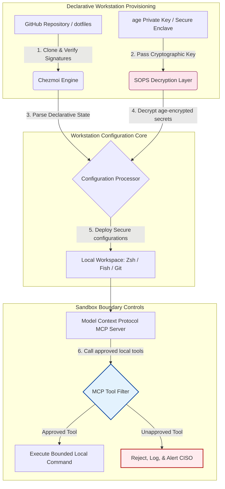

---

# Front Matter (YAML)

author: "contact@sebastienrousseau.com (Sebastien Rousseau)"
banner_alt: "Робоча станція розробника в приглушеному світлі — символізує AI-обізнані, відтворювані, безпечні dotfiles для серверів MCP, підпису SLSA, секретів age/SOPS та паритету багатьох оболонок"
banner_height: "1597"
banner_width: "2584"
banner: "https://cloudcdn.pro/stocks/images/almas-salakhov-Vq2ap8aFFEs.webp"
cdn: "https://cloudcdn.pro"
charset: "UTF-8"
cname: "sebastienrousseau.com"
copyright: "© Copyright 2025 - 2026 - Sebastien Rousseau. All rights reserved."
date: "16 червня 2026 року"
description: "AI-обізнані dotfiles — це шаблон безпечної, відтворюваної робочої станції для епохи MCP: декларативна конфігурація через Chezmoi, секрети SOPS/age, провенанс SLSA Level 3, паритет багатьох оболонок і обмежені межі пісочниці для локальних ШІ-агентів."
format-detection: "telephone=no"
hreflang: "uk"
icon: "https://cloudcdn.pro/clients/sebastienrousseau/v1/logos/sebastienrousseau.svg"
id: "https://sebastienrousseau.com/2026-06-16-ai-aware-dotfiles-secure-reproducible-workstation-2026"
image_alt: "Чорно-білий портрет Себастьяна Руссо"
image_height: "162"
image_width: "162"
image: "https://cloudcdn.pro/stocks/images/sebastien-rousseau.png"
keywords: "dotfiles, Chezmoi, MCP, Model Context Protocol, SLSA, SOPS, шифрування age, декларативна конфігурація, робоча станція розробника, DORA стаття 5, NIST CSF 2.0, безпека ланцюга постачання, агентний ШІ, паритет багатьох оболонок, Zsh, Fish, Nushell"
language: "uk-UA"
last_reviewed: "2026-06-16"
layout: "report"
locale: "uk_UA"
logo_alt: "Логотип Себастьяна Руссо"
logo_height: "44"
logo_width: "44"
logo: "https://cloudcdn.pro/clients/sebastienrousseau/v1/logos/sebastienrousseau.svg"
menu: ""
measurementID: "G-169G4ET5HQ"
name: "Sebastien Rousseau"
permalink: "https://sebastienrousseau.com/2026-06-16-ai-aware-dotfiles-secure-reproducible-workstation-2026"
rating: "general"
referrer: "no-referrer"
robots: "index, follow"
schema: "FAQPage, Article"
seo_title: "AI-обізнані dotfiles для безпечної робочої станції розробника"
short_name: "sebastienrousseau"
subtitle: "Робоча станція розробника тепер є частиною ланцюга постачання ШІ; dotfiles потребують безпеки, відтворюваності, гігієни секретів і MCP-обізнаних робочих процесів."
tags: "dotfiles, інструменти розробника, MCP, SLSA, безпечна робоча станція, chezmoi, macOS, Linux, WSL"
theme-color: "0, 83, 191"
title: "AI-обізнані dotfiles у 2026: безпечна, відтворювана робоча станція для MCP, SLSA та паритету оболонок"
url: "https://sebastienrousseau.com/2026-06-16-ai-aware-dotfiles-secure-reproducible-workstation-2026"
viewport: "width=device-width, initial-scale=1, shrink-to-fit=no"

# RSS - The RSS feed front matter (YAML).
atom_link: "https://sebastienrousseau.com/2026-06-16-ai-aware-dotfiles-secure-reproducible-workstation-2026/rss.xml"
category: "Technology"
docs: https://validator.w3.org/feed/docs/rss2.html
generator: "Static Site Generator (SSG) (version 0.0.26)"
item_description: "Огляд декларативних dotfiles для безпечних, відтворюваних робочих станцій розробника на macOS, Linux та WSL — з MCP-обізнаністю, SLSA, age, SOPS і паритетом багатьох оболонок."
item_guid: "https://sebastienrousseau.com/2026-06-16-ai-aware-dotfiles-secure-reproducible-workstation-2026/rss.xml"
item_link: "https://sebastienrousseau.com/2026-06-16-ai-aware-dotfiles-secure-reproducible-workstation-2026/rss.xml"
item_pub_date: "Tue, 16 Jun 2026 06:06:06 +0000"
item_title: "AI-обізнані dotfiles у 2026: безпечна, відтворювана робоча станція для MCP, SLSA та паритету оболонок"
last_build_date: "Tue, 16 Jun 2026 06:06:06 +0000"
managing_editor: "contact@sebastienrousseau.com (Sebastien Rousseau)"
pub_date: "Tue, 16 Jun 2026 06:06:06 +0000"
ttl: "60"
type: "article"
webmaster: "contact@sebastienrousseau.com"

# Apple - The Apple front matter (YAML).
apple_mobile_web_app_orientations: "portrait"
apple_touch_icon_sizes: "192x192"
apple-mobile-web-app-capable: "yes"
apple-mobile-web-app-status-bar-inset: "black"
apple-mobile-web-app-status-bar-style: "black-translucent"
apple-mobile-web-app-title: "AI-обізнані dotfiles для безпечної робочої станції"
apple-touch-fullscreen: "yes"

# MS Application - The MS Application front matter (YAML).

msapplication-navbutton-color: "0, 83, 191"

# Twitter Card - The Twitter Card front matter (YAML).

twitter_card: "summary_large_image"
twitter_creator: "@wwdseb"
twitter_description: "Огляд декларативних dotfiles для безпечних, відтворюваних робочих станцій розробника на macOS, Linux та WSL — з MCP-обізнаністю, SLSA, age, SOPS і паритетом багатьох оболонок."
twitter_image: "https://cloudcdn.pro/clients/sebastienrousseau/v1/logos/sebastienrousseau.svg"
twitter_image_alt: "Логотип Себастьяна Руссо"
twitter_site: "@wwdseb"
twitter_title: "AI-обізнані dotfiles для безпечної робочої станції розробника"
twitter_url: "https://sebastienrousseau.com/2026-06-16-ai-aware-dotfiles-secure-reproducible-workstation-2026"

excerpt: "AI-обізнані dotfiles у 2026 розглядають робочу станцію розробника як інфраструктуру ланцюга постачання — декларативна конфігурація під chezmoi з MCP-обізнаністю, релізами з підписом SLSA, секретами age/SOPS, запуском за частку секунди та паритетом macOS/Linux/WSL."

# Humans.txt - The Humans.txt front matter (YAML).
author_website: "https://sebastienrousseau.com"
author_twitter: "@wwdseb"
author_location: "London, UK"
thanks: "Дякуємо за прочитання!"
site_last_updated: "2026-06-16"
site_standards: "HTML5, CSS3, RSS, Atom, JSON, XML, YAML, Markdown, TOML"
site_components: "Kaishi, Kaishi Builder, Kaishi CLI, Kaishi Templates, Kaishi Themes"
site_software: "Static Site Generator, Rust"

---

# AI-обізнані dotfiles у 2026: безпечна, відтворювана робоча станція для MCP, SLSA та паритету оболонок

<!-- lead-start -->
<aside class="post-lead" aria-label="Стислий зміст статті">

<strong>Коротко.</strong> Робоча станція розробника більше не є просто кінцевою точкою; це активний учасник ланцюга постачання програмного забезпечення та прямий інтерфейс до локальної контрольної площини ШІ. Термінальні ШІ-асистенти та сервери <a href="https://modelcontextprotocol.io">Model Context Protocol (MCP)</a> виконують локальні команди оболонки, інспектують репозиторії та читають чутливі файли конфігурації безпосередньо. <a href="https://github.com/sebastienrousseau/dotfiles">Dotfiles Себастьяна Руссо</a> — це декларативний open-source фреймворк, який будує безпечні, відтворювані робочі станції на macOS, Linux та Windows Subsystem for Linux (WSL) — інтегруючи <a href="https://www.chezmoi.io/">Chezmoi</a>, <a href="https://github.com/getsops/sops">SOPS, age</a> та провенанс збірок SLSA Level 3 для ізоляції секретів у пам'ятебезпечний спосіб та обмежених шляхів виконання для локальних ШІ-моделей.

<strong>Ключові висновки</strong>

<ul class="post-lead-takeaways">
  <li><strong>Робочі станції — це інфраструктура ланцюга постачання.</strong> До конфігурацій середовища розробника треба ставитися з тією самою декларативною суворістю, що й до розгортань продакшен-серверів, виключаючи ручний дрейф конфігурацій.</li>
  <li><strong>Виклик контрольної площини ШІ.</strong> Термінальні ШІ-моделі та інструменти MCP можуть отримувати доступ до локальних каталогів. Dotfiles мають накладати обмежені межі пісочниці, суворі списки дозволів для інструментів і незмінні локальні журнали, щоб запобігти витоку даних.</li>
  <li><strong>Абсолютний кросплатформений паритет.</strong> Ідентична продуктивність оболонки за частку секунди та однакові профілі безпеки на macOS, Linux (Zsh, Fish, Nushell) та WSL скорочують час онбордингу розробників з тижнів до хвилин.</li>
  <li><strong>Криптографічно безпечна ізоляція секретів.</strong> Шифрування файлів через SOPS і age зупиняє жорстко закодовані облікові дані (токени GitHub, ключі доступу до хмари) від потрапляння в Git або зчитування локальними LLM.</li>
  <li><strong>Фідуціарна цінність на рівні правління.</strong> Перетворює відповідність конфігурації робочої станції на чіткі пріоритети правління, підтримуючи DORA статтю 5, стандарти кінцевих точок NIST CSF 2.0 та зниження операційного ризику за Базелем III.</li>
</ul>

<strong>Дотичні матеріали:</strong> <a href="https://sebastienrousseau.com/2026-05-23-agentic-payments-banking-consent-liability-new-payment-ux-2026">Агентні платежі в банкінгу: згода, відповідальність і новий UX платежів у 2026</a>, <a href="https://sebastienrousseau.com/2024-03-12-revolutionising-real-time-speech-recognition-on-macos-with-openai-whisper/index.html">Швидке розпізнавання мовлення в реальному часі на macOS: OpenAI Whisper</a>, <a href="https://sebastienrousseau.com/2024-02-26-google-gemma-ai-transforming-open-source-ai-development/index.html">Google Gemma AI: трансформація open-source розробки ШІ</a>.

</aside>
<!-- lead-end -->

Закриття розриву між декларативною конфігурацією робочої станції та безпечними ланцюгами постачання програмного забезпечення в епоху локальних ШІ-моделей та агентних інструментів розробника.

Орієнтиром з відкритим вихідним кодом для цієї статті є [dotfiles ⧉](https://github.com/sebastienrousseau/dotfiles "dotfiles — декларативна конфігурація робочої станції"). Репозиторій позиціонується як: декларативні dotfiles для macOS, Linux і WSL, що пропонують паритет багатьох оболонок, запуск за частку секунди, релізи з підписом SLSA та AI/MCP-обізнану конфігурацію.

## Чому цей проєкт з відкритим вихідним кодом має значення у 2026 році

У червні 2026 року робоча станція розробника — це найслабша ланка в ланцюгу постачання програмного забезпечення та високоцінна ціль для досвідчених державних і кримінальних кіберсиндикатів.

Безпекова картина середовища розробки радикально змінилася з появою термінальних ШІ-асистентів для кодування (як-от Claude Code) та впровадженням Model Context Protocol (MCP). Локальні термінали розробників тепер хостять активних, автономних ШІ-агентів, здатних:

- Читати та редагувати локальні файли вихідного коду.
- Викликати локальні CLI-інструменти (`git`, `npm`, `aws`, `kubectl`).
- Інспектувати змінні середовища оболонки, локальні бази даних та налаштування конфігурації.

Якщо локальному середовищу розробника бракує суворих меж, ці автономні ШІ-інструменти можуть ненавмисно зчитувати чутливі персональні дані, зливати хмарні облікові дані в публічні LLM API або виконувати шкідливі пакети під час автоматизованих збірок.

Згідно з Digital Operational Resilience Act (DORA) та NIST Cybersecurity Framework (CSF) 2.0, фінансові установи юридично зобов'язані перевіряти провенанс і безпекову цілісність кожного пристрою, що отримує доступ до ланцюга постачання програмного забезпечення. «Ноутбуки-сніжинки» — налаштовані вручну, неаудитовані конфігурації, що дрейфують — більше не відповідають глобальним банківським стандартам.

[Dotfiles Себастьяна Руссо](https://github.com/sebastienrousseau/dotfiles) вирішує цю проблему. Це open-source декларативний фреймворк управління робочою станцією, який встановлює безпечні, відтворювані середовища розробника. Завдяки накладанню стандартизованої, придатної до аудиту базової лінії конфігурації проєкт забезпечує високий Return on Resilience (RoR), скорочуючи час онбордингу розробника з тижнів до годин та захищаючи чутливі фінансові ланцюги постачання від уразливостей кінцевих точок.

## Архітектурна призма робочої станції AI-обізнаної 2026

Фреймворк dotfiles працює як безпечний декларативний менеджер середовища — усі локальні оболонки, інструменти та секрети систематично керовані, аудитовані та ізольовані:

| Шар | Дизайн-рішення | Чому це важливо | Ризик у разі недбалості |
|---|---|---|---|
| **Шар постачання** | Декларативне управління конфігурацією через Chezmoi | Будує повністю відтворювані робочі станції на macOS, Linux та WSL, виключаючи дрейф. | Конфігурації-сніжинки з неаудитованими, вразливими локальними станами. |
| **Шар оболонки** | Паритет багатьох оболонок (Zsh, Fish, Nushell) | Забезпечує ідентичний запуск за частку секунди та узгоджену поведінку аліасів у різних середовищах. | Невідповідності команд оболонки, що спричиняють неочікувані результати скриптів. |
| **Шар секретів** | Шифрування файлів через SOPS і age | Запобігає жорстко закодованим обліковим даним і необробленим ключам від потрапляння в Git або експозиції локальним LLM. | Витік облікових даних в історії публічних репозиторіїв або компрометація локальними агентами. |
| **Шар AI/MCP** | Контролі меж Model Context Protocol | Обмежує локальних ШІ-агентів конкретним списком схвалених інструментів, логуючи всі локальні виконання. | Необмежені ШІ-агенти, що виконують неконтрольовані або деструктивні команди локально. |
| **Шар ланцюга постачання** | Релізи з підписом SLSA та верифікація Sigstore | Криптографічно доводить автентичність bootstrap-скриптів і файлів конфігурації. | Скомпрометовані setup-скрипти, що впроваджують шкідливі бекдори в середовища розробника. |

## Ключові сигнали безпеки та автоматизації робочої станції

Щоб підтримувати абсолютну безпеку в усьому маєтку розробки, Chief Information Security Officers (CISO) та технологічні менеджери мають відстежувати конкретні, кількісно вимірювані операційні показники:

| Сигнал | Метрика / операційний орієнтир | Посилання на NIST CSF / DORA | Технічна реалізація платформи |
|---|---|---|---|
| **Відтворюваність робочої станції** | % ноутбуків розробників, повністю керованих через декларативні репозиторії dotfile без дрейфу конфігурації. | NIST CSF 2.0 (PR.DS-01) | Аудити виявлення дрейфу Chezmoi виконуються автоматично при запуску терміналу. |
| **Гігієна облікових даних** | Нуль незашифрованих секретів або ключів, що зберігаються у відкритому тексті в локальних файлах конфігурації. | DORA Article 6 (ICT Security) | Pre-commit хуки Git та локальні сканери відхиляють незашифровані файли. |
| **Провенанс збірок** | 100% bootstrap-утиліт робочої станції перевірені через криптографічно підписані маніфести. | DORA Article 30 (Supply Chain) | Верифікація Sigstore та SLSA Level 3 вбудована в setup-пайплайни. |
| **Час онбордингу розробника** | Час від отримання необробленого обладнання до повністю налаштованого, відповідного робочого простору розробки. | Return on Resilience (RoR) | Автоматизовані декларативні setup-скрипти збирають середовище менш ніж за 15 хвилин. |
| **Обмежений доступ ШІ-агента** | Перевірка того, що локальні ШІ-інструменти працюють у межах визначених лімітів каталогів з типовим режимом «лише читання». | Model Risk Management | Профілі конфігурації MCP обмежують каталоги інструментів агента схваленими операціями. |

## Чому декларативна конфігурація — це серце безпеки робочої станції

Традиційні підходи до налаштування робочої станції розробника є переважно ручними, що призводить до «ноутбуків-сніжинок» — середовищ, де конфігурації дрейфують з часом, оскільки розробники встановлюють кастомні інструменти, коригують змінні та модифікують локальні скрипти. Цей дрейф створює кілька критичних уразливостей:

1. **Невідстежувані тіньові конфігурації.** Дрейфуючі ноутбуки часто запускають застарілі, уразливі пакети програмного забезпечення або локальні скрипти, що оминають корпоративні безпекові інструменти.
2. **Витік секретів.** Розробники часто жорстко кодують API-ключі, токени GitHub або облікові дані AWS безпосередньо у відкриті текстові скрипти чи профілі оболонки, роблячи їх дуже вразливими до крадіжки.
3. **Неефективний онбординг.** Налаштування нової робочої станції розробника вручну може займати до двох тижнів інженерного часу, впливаючи на швидкість команди.

Переходячи на декларативну, керовану моделлю конфігурацію через Chezmoi, увесь робочий простір розробника стає системою запису під контролем версій, придатною до відтворення. Кожна зміна, аліас, залежність пакету та типове налаштування безпеки документуються в Git, валідуються щодо політик організаційної відповідності та криптографічно перевіряються перед застосуванням до фізичного ноутбука.

## Проєктування обмеженого середовища розробника зі ШІ

Щоб локальні ШІ-агенти та інструменти MCP не отримували необмеженого доступу до локальних активів, робоча станція має працювати як обмежена площина виконання.

Операційний потік нижче показує, як фреймворк dotfiles координує Chezmoi, SOPS та age для розшифрування та розгортання безпечних dotfiles, водночас підтримуючи ізольовану, обгороджену межу виконання для локальних ШІ-агентів, що викликають інструменти MCP:

## Сценарій для правління та фідуціарна відповідальність

Безпека робочої станції розробника та цілісність ланцюга постачання — критичні пріоритети правління. Топ-менеджери мають вирішувати ризик середовища розробника крізь призму фідуціарної відповідальності, регуляторної відповідності та збереження бізнес-цінності:

- **DORA стаття 5 (підзвітність правління).** Зобов'язує управлінський орган (правління) нести остаточну відповідальність за управління ICT-ризиками установи. Оскільки робочі станції розробника — це шлюз до ланцюга постачання програмного забезпечення, директори правління мають перевіряти, що кінцеві точки є безпечними, повністю придатними до аудиту та керованими в межах суворих, відтворюваних фреймворків конфігурації, щоб задовольняти регуляторні аудити.
- **Відповідність NIST CSF 2.0 (безпека кінцевих точок).** Вимагає, щоб лише авторизовані та валідовані пристрої, що працюють зі стандартизованими, безпечними конфігураціями, отримували доступ до корпоративних мереж і репозиторіїв. Декларативні dotfiles дозволяють командам безпеки математично довести, що всі середовища розробника відповідають базовому рівню безпеки організації, виключаючи ризик неаудитованих «сніжинкових» налаштувань.
- **Збереження цінності балансу.** Один скомпрометований обліковий запис розробника або порушення ланцюга постачання може коштувати установі мільйонів доларів на усунення наслідків, регуляторні штрафи та репутаційні збитки. Перехід на безпечне декларативне середовище розробника безпосередньо мінімізує цей ризик, зберігаючи цінність балансу та захищаючи довіру клієнтів.

## Що це означає за типом банку

### Глобальні системно важливі банки (G-SIBs)

G-SIBs керують тисячами робочих станцій розробників на кількох континентах і в різних регуляторних юрисдикціях. Їхній головний виклик — підтримувати узгодженість конфігурації та запобігати витоку облікових даних у масивних інженерних командах. Прийнявши декларативну open-source модель dotfiles через Chezmoi, G-SIBs можуть стандартизувати безпеку кінцевих точок, автоматизувати аудити відповідності та скоротити час онбордингу розробника з тижнів до хвилин у глобальній організації.

### Транзакційні та корпоративні банки

Транзакційні банки управляють чутливими платіжними шлюзами та інфраструктурою оптового клірингу. Доведення абсолютної цілісності коду, розгорнутого в цих продакшен-середовищах, — це регуляторна вимога, що не підлягає обговоренню. Стандартизація робочих станцій розробника під безпечним SLSA-сумісним фреймворком dotfiles гарантує, що ланцюг постачання програмного забезпечення повністю аудитований і захищений від уразливостей локальних кінцевих точок розробника.

### Регіональні та менші банки

Регіональні банки мають підтримувати високі стандарти кібербезпеки без масивних безпекових бюджетів G-SIBs. Цей open-source фреймворк dotfiles надає легке, економічно ефективне та високобезпечне рішення, дружнє до Python і Rust, дозволяючи меншим установам впроваджувати безпеку кінцевих точок корпоративного рівня та захист ланцюга постачання без дорогих ліцензій на пропрієтарне програмне забезпечення.

## Висновок: дорожня карта робочої станції розробника

Робоча станція розробника більше не є периферійним пристроєм; це критична контрольна площина в ланцюгу постачання програмного забезпечення. Дозволяти налаштованим вручну, неаудитованим «ноутбукам-сніжинкам» отримувати доступ до корпоративних активів — це серйозний операційний і регуляторний ризик.

Щоб убезпечити ланцюг постачання програмного забезпечення та захистити кінцеві точки від уразливостей локальних ШІ-агентів, старші технологічні менеджери та менеджери з безпеки мають виконати чітку дорожню карту розробки вже сьогодні:

1. **Зобов'язати декларативне постачання.** Поступово відмовитися від ручних процесів налаштування на основі документації та зобов'язати, щоб усі середовища розробника постачалися декларативно через Chezmoi.
2. **Запровадити гігієну секретів.** Накласти суворі pre-commit хуки та утиліти сканування, щоб забезпечити нуль необроблених облікових даних, ключів або API-токенів, що зберігаються у відкритому тексті в локальних конфігураціях робочої станції.
3. **Встановити межі пісочниці ШІ.** Впровадити безпечні, обмежені профілі конфігурації MCP, щоб обмежити локальних ШІ-асистентів кодування та агентів схваленими інструментами та каталогами лише для читання.
4. **Убезпечити ланцюг постачання.** Гарантувати, що всі bootstrap-скрипти та конфігурації середовища криптографічно перевірені через провенанс SLSA Level 3 перед розгортанням.

## Часті запитання

**Що таке Chezmoi і чому його використовують для dotfiles?**

Chezmoi — це open-source, безпечний, декларативний менеджер dotfile. Він дозволяє розробникам керувати локальними конфігураціями як репозиторієм під контролем версій, забезпечуючи абсолютну узгодженість і відтворюваність у різних операційних системах (macOS, Linux, WSL).

**Як фреймворк захищає секрети?**

Фреймворк використовує SOPS (Secrets Operations) та шифрування файлів age для шифрування чутливих облікових даних (як-от токени GitHub або ключі доступу до хмари) безпосередньо в репозиторії dotfile. Це запобігає потраплянню ключів у відкритому тексті або зчитуванню несанкціонованими локальними ШІ-агентами.

**Що таке Model Context Protocol (MCP) і як це впливає на безпеку?**

MCP — це відкритий стандарт, що дозволяє ШІ-моделям безпечно виконувати локальні інструменти та отримувати доступ до файлів. Фреймворк dotfiles реалізує суворі файли конфігурації MCP, щоб обмежити локальні ШІ-інструменти та агентів схваленими каталогами та командами.

**Які оболонки підтримує фреймворк?**

Bash, Zsh, Fish, Nushell і PowerShell — з паритетом на macOS, Linux та WSL, тож поведінка команд залишається ідентичною незалежно від того, який термінал відкриває розробник.

## Джерела

- Open Source Security Foundation (OpenSSF), (2024). *Supply-chain Levels for Software Artifacts (SLSA)*. Доступно за посиланням: [Фреймворк SLSA ⧉](https://slsa.dev/ "Фреймворк SLSA").
- NIST, (2024). *NIST Cybersecurity Framework 2.0*. Gaithersburg: National Institute of Standards and Technology. Доступно за посиланням: [NIST CSF 2.0 ⧉](https://www.nist.gov/cyberframework "NIST Cybersecurity Framework 2.0").
- European Parliament and Council of the European Union, (2022). *Regulation (EU) 2022/2554 on digital operational resilience for the financial sector (DORA)*. Brussels: Official Journal of the European Union. Доступно за посиланням: [Регламент DORA ⧉](https://eur-lex.europa.eu/legal-content/EN/TXT/?uri=CELEX%3A32022R2554 "Регламент DORA").
- GitHub, (2026). *Репозиторій dotfiles з відкритим вихідним кодом*. Доступно за посиланням: [Репозиторій dotfiles ⧉](https://github.com/sebastienrousseau/dotfiles "Репозиторій dotfiles").

<!-- enrich-start -->
<aside class="author-card" aria-label="Про автора"><strong class="author-card-name"><a href="/about/index.html">Sebastien Rousseau</a></strong>Старший банківський технолог, який пише про прикладний ШІ, міграцію ISO 20022, постквантову криптографію для фінансових послуг і структурну трансформацію оптових платежів.Понад 20 років у HSBC Commercial &amp; Investment Bank, PayPal, Barclays, Shazam, AKQA, Virgin Group. <a href="/about/index.html">Повний профіль</a> &middot; <a href="https://www.linkedin.com/in/sebastienrousseau/" rel="external noopener">LinkedIn</a> &middot; <a href="https://github.com/sebastienrousseau" rel="external noopener">GitHub</a></aside>

Востаннє переглянуто <time datetime="2026-06-16">2026-06-16</time>.

<aside class="related-posts" aria-labelledby="related-heading">
<h2 id="related-heading" class="related-heading">Дотичні матеріали</h2>

<article class="related-card"><footer class="related-body"><h3><a href="https://sebastienrousseau.com/2026-05-23-agentic-payments-banking-consent-liability-new-payment-ux-2026">Агентні платежі в банкінгу: згода, відповідальність і новий UX платежів у 2026</a></h3>
<time datetime="2026-05-23">2026-05-23</time>
</footer></article>
<article class="related-card"><footer class="related-body"><h3><a href="https://sebastienrousseau.com/2024-03-12-revolutionising-real-time-speech-recognition-on-macos-with-openai-whisper/index.html">Швидке розпізнавання мовлення в реальному часі на macOS: OpenAI Whisper</a></h3>
<time datetime="2024-03-12">2024-03-12</time>
</footer></article>
<article class="related-card"><footer class="related-body"><h3><a href="https://sebastienrousseau.com/2024-02-26-google-gemma-ai-transforming-open-source-ai-development/index.html">Google Gemma AI: трансформація open-source розробки ШІ</a></h3>
<time datetime="2024-02-26">2024-02-26</time>
</footer></article>

</aside>
<!-- enrich-end -->
