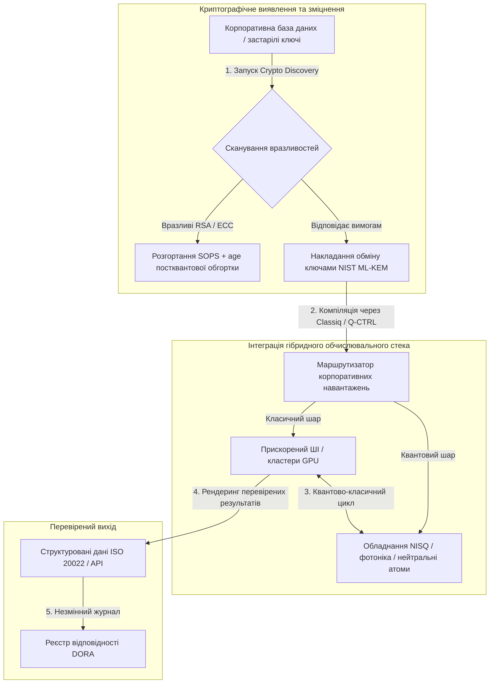

---

# Front Matter (YAML)

author: "contact@sebastienrousseau.com (Sebastien Rousseau)"
banner_alt: "Вид зі сцени саміту Economist Impact 5th Annual Commercialising Quantum Global 2026 у Лондоні — символізує перехід квантових технологій від фізичних досліджень до готових до промислової експлуатації корпоративних робочих процесів"
banner_height: "1597"
banner_width: "2584"
banner: "https://cloudcdn.pro/stocks/images/sebastien-rousseau-20260617-5th-commercialising-quantum-2.webp"
cdn: "https://cloudcdn.pro"
charset: "UTF-8"
cname: "sebastienrousseau.com"
copyright: "© Copyright 2025 - 2026 - Sebastien Rousseau. All rights reserved."
date: "17 червня 2026 року"
description: "Висновки рівня правління з саміту Economist Impact 5th Annual Commercialising Quantum Global 2026 — приплив фінансування $1,3 млрд, гібридні стеки без жалю, терміновість міграції на постквантову криптографію, комерціалізація квантового сенсингу та директива HSBC, що чекання — це неспровокована помилка."
format-detection: "telephone=no"
hreflang: "uk"
icon: "https://cloudcdn.pro/clients/sebastienrousseau/v1/logos/sebastienrousseau.svg"
id: "https://sebastienrousseau.com/2026-06-17-economist-commercialising-quantum-summit-2026"
image_alt: "Чорно-білий портрет Себастьяна Руссо"
image_height: "162"
image_width: "162"
image: "https://cloudcdn.pro/stocks/images/sebastien-rousseau.png"
keywords: "Commercialising Quantum Global 2026, саміт Economist Impact, постквантова криптографія, NIST ML-KEM, harvest-now decrypt-later, SNDL, квантова програма HSBC, Philip Intallura, квантовий сенсинг, GPS-незалежна навігація, NQCC, EU Quantum Act, Quantcore, премія qBIG, Lord Vallance, гібридний квантово-класичний, DORA Article 6"
language: "uk-UA"
last_reviewed: "2026-06-17"
layout: "report"
locale: "uk_UA"
logo_alt: "Логотип Себастьяна Руссо"
logo_height: "44"
logo_width: "44"
logo: "https://cloudcdn.pro/clients/sebastienrousseau/v1/logos/sebastienrousseau.svg"
menu: ""
measurementID: "G-169G4ET5HQ"
name: "Sebastien Rousseau"
permalink: "https://sebastienrousseau.com/2026-06-17-economist-commercialising-quantum-summit-2026"
rating: "general"
referrer: "no-referrer"
robots: "index, follow"
schema: "FAQPage, Article"
seo_title: "Commercialising Quantum 2026: висновки рівня правління"
short_name: "sebastienrousseau"
subtitle: "Квантові технології перейшли зі спекулятивної лабораторної науки в гібридні корпоративні робочі процеси; правління має реагувати на $1,3 млрд фінансування у 2026, негайну постквантову міграцію та директиву HSBC припинити чекати."
tags: "квантові технології, постквантова криптографія, NIST ML-KEM, harvest-now decrypt-later, квантовий сенсинг, HSBC, Economist Impact, гібридні обчислення, DORA, EU Quantum Act, NQCC, висновки саміту"
theme-color: "0, 83, 191"
title: "Від кубітів до прибутку: стратегічні висновки з 5-го щорічного саміту Economist Commercialising Quantum Global 2026"
url: "https://sebastienrousseau.com/2026-06-17-economist-commercialising-quantum-summit-2026"
viewport: "width=device-width, initial-scale=1, shrink-to-fit=no"

# RSS - The RSS feed front matter (YAML).
atom_link: "https://sebastienrousseau.com/2026-06-17-economist-commercialising-quantum-summit-2026/rss.xml"
category: "Technology"
docs: https://validator.w3.org/feed/docs/rss2.html
generator: "Static Site Generator (SSG) (version 0.0.26)"
item_description: "Висновки рівня правління з саміту Economist Impact 5th Annual Commercialising Quantum Global 2026 — приплив фінансування $1,3 млрд, гібридні стеки без жалю, терміновість міграції на постквантову криптографію, комерціалізація квантового сенсингу та директива HSBC, що чекання — це неспровокована помилка."
item_guid: "https://sebastienrousseau.com/2026-06-17-economist-commercialising-quantum-summit-2026/rss.xml"
item_link: "https://sebastienrousseau.com/2026-06-17-economist-commercialising-quantum-summit-2026/rss.xml"
item_pub_date: "Wed, 17 Jun 2026 06:06:06 +0000"
item_title: "Від кубітів до прибутку: стратегічні висновки з 5-го щорічного саміту Economist Commercialising Quantum Global 2026"
last_build_date: "Wed, 17 Jun 2026 06:06:06 +0000"
managing_editor: "contact@sebastienrousseau.com (Sebastien Rousseau)"
pub_date: "Wed, 17 Jun 2026 06:06:06 +0000"
ttl: "60"
type: "article"
webmaster: "contact@sebastienrousseau.com"

# Apple - The Apple front matter (YAML).
apple_mobile_web_app_orientations: "portrait"
apple_touch_icon_sizes: "192x192"
apple-mobile-web-app-capable: "yes"
apple-mobile-web-app-status-bar-inset: "black"
apple-mobile-web-app-status-bar-style: "black-translucent"
apple-mobile-web-app-title: "Commercialising Quantum 2026: висновки правління"
apple-touch-fullscreen: "yes"

# MS Application - The MS Application front matter (YAML).

msapplication-navbutton-color: "0, 83, 191"

# Twitter Card - The Twitter Card front matter (YAML).

twitter_card: "summary_large_image"
twitter_creator: "@wwdseb"
twitter_description: "Висновки рівня правління з саміту Economist Impact 5th Annual Commercialising Quantum Global 2026 — приплив фінансування $1,3 млрд, гібридні стеки без жалю, терміновість міграції на постквантову криптографію, комерціалізація квантового сенсингу та директива HSBC, що чекання — це неспровокована помилка."
twitter_image: "https://cloudcdn.pro/clients/sebastienrousseau/v1/logos/sebastienrousseau.svg"
twitter_image_alt: "Логотип Себастьяна Руссо"
twitter_site: "@wwdseb"
twitter_title: "Commercialising Quantum 2026: висновки рівня правління"
twitter_url: "https://sebastienrousseau.com/2026-06-17-economist-commercialising-quantum-summit-2026"

excerpt: "Саміт Economist Impact 5th Annual Commercialising Quantum Global 2026 підтвердив поворот квантових технологій до корпоративних робочих процесів: $1,3 млрд залучено за п'ять місяців, постквантова криптографія — це фідуціарне питання рівня правління в умовах збирання SNDL, квантовий сенсинг уже сьогодні постачається для GPS-незалежної навігації, а Філіп Інталлура з HSBC видав директиву, що чекати відмовостійкого обладнання — це неспровокована помилка."

# Humans.txt - The Humans.txt front matter (YAML).
author_website: "https://sebastienrousseau.com"
author_twitter: "@wwdseb"
author_location: "London, UK"
thanks: "Дякуємо за прочитання!"
site_last_updated: "2026-06-17"
site_standards: "HTML5, CSS3, RSS, Atom, JSON, XML, YAML, Markdown, TOML"
site_components: "Kaishi, Kaishi Builder, Kaishi CLI, Kaishi Templates, Kaishi Themes"
site_software: "Static Site Generator, Rust"

---

# Від кубітів до прибутку: стратегічні висновки з 5-го щорічного саміту Economist Commercialising Quantum Global 2026

Готовність підприємств, міграції на постквантову криптографію, гібридні обчислювальні стеки та комерційний ландшафт, що формується навколо квантового сенсингу і мереж.

**Коротко.** 5-та щорічна конференція Commercialising Quantum Global 2026, проведена Economist Impact 16–17 червня 2026 року в Business Design Centre у Лондоні, зібрала понад 1 100 глобальних лідерів зі сфер бізнесу, фінансів, політики та досліджень. Центральна тема позначила чіткий структурний поворот: квантові технології перейшли зі спекулятивної лабораторної науки до практичних гібридних корпоративних робочих процесів. На тлі $1,3 млрд венчурного капіталу, залученого лише за перші п'ять місяців 2026 року, дискусія в правлінні більше не зосереджена на підрахунку фізичних кубітів, а на побудові гібридних обчислювальних стеків «без жалю», захисті цифрових активів від криптографічної загрози «harvest-now, decrypt-later» (SNDL) і впровадженні квантових сенсорних систем найближчого терміну для GPS-незалежної навігації.

## Ключові висновки

- **Поворот підприємств до практичних робочих процесів.** Лідери індустрії ([Steve Suarez](https://www.linkedin.com/in/stevesuarez) з HorizonX, [Phil Intallura](https://www.linkedin.com/in/intallura) з HSBC) підкреслили, що квантова інтеграція більше не є проблемою фізики, а операційним питанням. Банки та підприємства розгортають гібридні квантово-класичні пілотні проєкти, щоб готувати кадри та оптимізувати активні робочі навантаження.
- **Постквантова криптографія (PQC) — пріоритет правління.** Експерти з безпеки та права (CMS UK, [Joanne Miller](https://www.linkedin.com/in/joanne-miller-nso) з Microsoft, [Craig Farrell](https://www.linkedin.com/in/craig-farrell) з EY) попередили, що організації не можуть чекати на відмовостійке обладнання, щоб розгорнути PQC. Збирання за моделлю «harvest-now, decrypt-later» відбувається вже сьогодні, що робить міграцію на стандарти NIST ML-KEM безпосередньою фідуціарною турботою.
- **Квантовий сенсинг очолює прибутковість найближчого терміну.** Тоді як відмовостійкі обчислення залишаються справою кількох років, квантовий сенсинг ([Matthew Kinsella](https://www.linkedin.com/in/matthewkinsella) з Infleqtion) стрімко масштабується. Квантові годинники та інерційні датчики розгортаються в GPS-незалежній навігації, національній безпеці та ультрастабільних енергомережах.
- **Суверенітет, кластери та політична терміновість.** Міністр науки Великобританії [Lord Vallance](https://www.linkedin.com/in/patrick-vallance) і [Lord William Hague](https://www.linkedin.com/in/williamhague) окреслили національні місії з перетворення досліджень на «суперкластери» промислового масштабу у координації з National Quantum Computing Centre (NQCC). Майбутній EU Quantum Act ще більше підкреслює геополітичну гонку за суверенними обчислювальними потужностями.
- **Quantcore здобуває премію qBIG.** Спін-аут Університету Глазго Quantcore отримав премію IOP qBIG за прорив у надпровідних компонентах на основі ніобію, які працюють за вищих температур, ніж традиційні матеріали, значно знижуючи накладні витрати на криогенну інфраструктуру.

**Дотичні матеріали:** [KyberLib і постквантова банківська міграція у 2026: від стандартів до коду](https://sebastienrousseau.com/2026-06-12-kyberlib-post-quantum-banking-migration-standards-code-2026/), [Індекс банківської стійкості у 2026: ШІ, хмара, квантові технології, платежі та концентраційний ризик третіх сторін](https://sebastienrousseau.com/2026-06-08-banking-resilience-index-ai-cloud-quantum-payments-third-party-risk-2026/), [Індекс cloud-native банкінгу у 2026: DORA, платформна інженерія, суверенна хмара та операційна стійкість](https://sebastienrousseau.com/2026-06-05-cloud-native-banking-index-dora-resilience-platform-engineering-2026/).

## 01. Чому саміт 2026 має значення для правління

Видання саміту Economist Commercialising Quantum Global 2026 ознаменувало незворотний зсув у тому, як корпоративний світ оцінює deep tech.

Історично квантові обчислення відносили до R&D-підрозділів як багатодесятилітнє наукове починання. У червні 2026 така перспектива застаріла. Організації мають перейти від «фізично-орієнтованої» цікавості до «бізнес-орієнтованого» впровадження. Причина двостороння:

1. **Конвергенція квантових технологій і ШІ.** Стеки високопродуктивних обчислень (HPC) поєднують класичні, прискорені ШІ та NISQ-вузли (Noisy Intermediate-Scale Quantum) в єдиний уніфікований обчислювальний шар. Організації, які зволікають з побудовою quantum-ready застосунків, виявлять, що вікно для отримання стратегічної переваги закривається швидше, ніж очікувалося.
2. **Геополітична та фідуціарна терміновість.** З огляду на квантову програму Великобританії, керовану місіями, та майбутній EU Quantum Act, квантові потужності стали справою національного суверенітету та корпоративної безперервності.

Крім того, постквантова кібербезпека більше не є вимогою відповідності на майбутнє. Загроза ворожих атак «store now, decrypt later» (SNDL) означає, що корпоративні дані, перехоплені сьогодні, будуть розшифровані, коли комерційні квантові системи масштабуються, створюючи негайну відповідальність за глобальними мандатами операційної стійкості, як-от Digital Operational Resilience Act (DORA).

## 02. Стратегічна призма Commercialising Quantum 2026

Лідери корпоративних технологій мають мапувати квантову зрілість на п'яти окремих операційних шарах, оцінюючи часові горизонти та балансові ризики.

### Таблиця 1: Стратегічна призма Commercialising Quantum 2026

| Шар | Корпоративний фокус | Часовий горизонт | Ключовий корпоративний ризик |
| ---- | ---- | ---- | ---- |
| **Обладнання та компілятор** | Вибір між конкурентними підходами (надпровідники, заряджені іони, нейтральні атоми, фотоніка) | 3–5 років (відмовостійкість) | Прив'язка до тупикової архітектури або зарання обрана єдина платформа. |
| **Криптографічне зміцнення** | Виявлення та інвентаризація криптографічних залежностей; міграція на NIST ML-KEM | Негайно (активна міграція) | Системні витоки даних та невідповідність DORA і NIST CSF 2.0. |
| **Квантовий сенсинг** | Розгортання GPS-незалежної навігації, ультрастабільних годинників і гравіметрів | 1–2 роки (негайна комерціалізація) | Операційні збої логістики, судноплавства та енергомереж через глушіння GPS. |
| **Системна інтеграція** | Підключення квантового обладнання до наявних класичних центрів обробки даних HPC та суперкомп'ютерів | 1–3 роки (гібридна фаза) | Висока затримка, вузькі місця передачі даних і фрагментовані обчислювальні силоси. |
| **Корпоративне ПЗ** | Експонування квантових алгоритмів через високорівневі шари абстракції та API (Classiq, Q-CTRL) | Негайно (нарощування навичок) | Ізоляція талантів і робочих процесів від реального інженерного виконання. |

## 03. Ключові квантові сигнали та тригери для правління

Технологічні лідери мають моніторити конкретні, кількісно вимірювані ринкові та регуляторні метрики, щоб скеровувати свої квантові інвестиції.

### Таблиця 2: Ключові квантові сигнали та тригери для правління

| Сигнал | Кількісна метрика | Регуляторне / політичне посилання | Дієвий пріоритет платформи |
| ---- | ---- | ---- | ---- |
| **Приплив квантового фінансування** | $1,3 млрд залучено глобально за перші п'ять місяців 2026 | Return on Resilience (RoR) | Перенести бюджети зі спекулятивних пілотів на гібридні квантово-класичні робочі навантаження «без жалю». |
| **Експозиція даних до розшифрування** | 100% зашифрованих даних, що передаються публічними каналами, відкриті до збирання SNDL | DORA Article 6 (ICT security) | Розгорнути інструменти криптографічного виявлення для ідентифікації вразливих ключів RSA/ECC у всьому маєтку. |
| **Суверенна інфраструктура** | £2,5 млрд асигнувань UK National Quantum Strategy | UK Quantum Missions / Lord Vallance | Налагодити локальні партнерства з національними суперкластерами на кшталт NQCC. |
| **Строки відповідності** | 14 листопада 2026 — перехід SWIFT на структуровану адресу | Директива SWIFT SR 2026 | Очистити та сформатувати міжбанківські бази даних відповідно до структурованих специфікацій XML. |

## 04. Поглиблений огляд основних тем саміту

### Квантові технології досягають інвестиційної точки перелому

Венчурне фінансування зазнало значного прискорення, залучивши **$1,3 млрд** лише за перші п'ять місяців 2026 року. На відміну від спекулятивних циклів хайпу попередніх років, поточна капітальна хвиля підкріплена реальними робочими навантаженнями найближчого терміну. Спікери з Classiq та IBM Quantum Platform продемонстрували, як шари програмної абстракції та автоматизовані компілятори дозволяють командам розробників без вузької спеціалізації виконувати гібридні квантово-класичні алгоритми на наявній сьогодні класичній інфраструктурі. Ця стратегія «без жалю» дозволяє організаціям негайно нарощувати quantum-ready кадри та робочі процеси.

### Юридичні та регуляторні попередження щодо «harvest now, decrypt later»

Юридичні партнери та керівники з кібербезпеки спричинили активне обговорення безпосередньої актуальності ризику даних. Представники юридичної фірми-спонсора CMS UK і CSO Microsoft [Joanne Miller](https://www.linkedin.com/in/joanne-miller-nso) видали чітке попередження топ-менеджменту: *чекання на відмовостійке обладнання перед розгортанням постквантової криптографії — це критичний фідуціарний провал.*

За парадигмою «store now, decrypt later» (SNDL) ворожі суб'єкти вже сьогодні активно збирають зашифровані корпоративні дані з наміром розшифрувати їх, щойно з'являться криптографічно релевантні квантові комп'ютери. Організації мають негайно розгорнути постквантові захисти (як-от NIST ML-KEM), щоб захистити довгоживучі чутливі набори даних, інтелектуальну власність та історичні клієнтські записи.

### Перебалансування хайпу «квантового сенсингу»

Тоді як відмовостійкі квантові обчислення залишаються справою кількох років, саміт виокремив квантовий сенсинг як першу справді прибуткову хвилю реального розгортання. Головний виконавчий директор [Matthew Kinsella](https://www.linkedin.com/in/matthewkinsella) з Infleqtion детально описав, як квантові годинники, інерційні датчики та радіочастотні системи стрімко масштабуються в багатьох галузях.

Оскільки ці технології вимірюють фізичні константи із субатомною точністю, вони уможливлюють **GPS-незалежну навігацію**, ультрастабільні енергомережі та далекокосмічні телекомунікації. Ці застосування дуже актуальні для авіації, морського транспорту та національних оборонних систем, що стикаються зі зростаючими загрозами глушіння GPS.

### Екосистемна та кластерна співпраця

Британська квантова екосистема використала лондонський саміт, щоб представити внутрішні інноваційні суперкластери. Прямі оновлення від National Quantum Computing Centre (NQCC) та Digital Catapult детально показали, як ранні deep-tech спін-аути можуть подолати «технологічний розрив», інтегруючи квантове обладнання безпосередньо в класичні центри обробки даних суперкомп'ютерів.

[Wridhdhisom Karar](https://www.linkedin.com/in/wridhdhisomkarar), співзасновник шотландського квантового стартапу Quantcore, прийняв престижну премію Institute of Physics (IOP) Quantum Business Innovation and Growth (qBIG) за надпровідні компоненти компанії на основі ніобію. Ці компоненти працюють за вищих температур, ніж традиційні матеріали, значно знижуючи накладні витрати на криогенну інфраструктуру, потрібну для масштабування квантових процесорів.

### Кейс HSBC: чому чекати на квантові технології — це «неспровокована помилка»

Висновки [**Philip Intallura, Ph.D.**](https://www.linkedin.com/in/intallura) (глобальний керівник напрямку квантових технологій у HSBC, радник уряду Великобританії та радник правління) на 5-му щорічному заході Economist Commercialising Quantum (2026) пролунали як потужна директива для правлінь: *«Чекати на відмовостійкі квантові технології перед стартом — це неспровокована помилка»*.

Доктор Інталлура стверджував, що поширений у фінансових установах підхід «почекаємо й подивимось» — це автогол, побудований на трьох помилкових припущеннях:

- **ROI найближчого терміну реальний.** В емпіричному тестуванні HSBC перевершив моделі, що зараз працюють у продакшені, поєднав квантові роботи з іншими бізнес-напрямами, використовував квантові підходи для поглиблення відносин з деякими з найбільших клієнтів і залучив значні нові обсяги бізнесу в **HSBC Innovation Banking**.
- **Квантові технології — це крута крива впровадження.** Розбудова потужностей, формування стратегії, забезпечення фінансування та запуск експериментальних циклів усередині суворо регульованої організації — справа не на короткий термін. Процеси мають систематично тестуватися та адаптуватися під технологію.
- **Квантові технології — це екосистема.** Жоден гравець не дійде туди сам. Кожна наукова стаття, POC і пілот, які виконав HSBC, реалізовувалися у тісній співпраці з квантовим провайдером — а в деяких випадках співпраця поширювалася й на академію, регуляторів і уряд.

**Заключна директива правлінню:** *«Спроможність, потрібна вам у перший день відмовостійкості, — це спроможність, яку ви будуєте зараз»*.

## 05. Корпоративний пайплайн квантової інтеграції та криптографії

Щоб захистити цифрові активи, одночасно розбудовуючи квантову готовність, підприємство має сформувати чіткий інтеграційний пайплайн.

## 06. Сценарій для правління: дієві імперативи

Щоб перетворити висновки саміту Commercialising Quantum Global 2026 на негайну бізнес-цінність, топ-менеджмент має виконати такий чотирикроковий сценарій правління:

1. **Зобов'язати криптографічне виявлення.** Доручити Chief Information Security Officer (CISO) каталогізувати всі криптографічні активи, мапуючи кожен застарілий ключ RSA та ECC по всьому підприємству для підготовки до постквантової міграції.
2. **Розгорнути гібридну стратегію «без жалю».** Не чекати на ідеальне обладнання. Інвестувати в quantum-inspired програмне забезпечення та гібридні класично-квантові пілоти, щоб уже сьогодні розвивати внутрішні таланти й оптимізувати складну логістику чи ризиковані портфелі.
3. **Оцінити квантовий сенсинг для логістики.** Якщо ваша організація залежить від глобальних ланцюгів постачання, судноплавства чи критичної інфраструктури, активно оцінити квантові сенсорні системи (як-от GPS-незалежну навігацію), щоб знизити ризики геополітичних збоїв.
4. **Зареєструватися на Insight Hour 30 червня.** Забезпечити, щоб ваші технологічні лідери зареєструвалися на віртуальний **Commercialising Quantum Global Insight Hour** 30 червня 2026 року о 15:00 BST (за підтримки IonQ), щоб і далі відстежувати корпоративне управління ризиками та стратегії розподілу талантів.

## 07. Часті запитання

**Що таке «harvest now, decrypt later» (SNDL) і чому це важливо вже сьогодні?**
SNDL — це практика перехоплення та зберігання зашифрованих даних сьогодні з наміром розшифрувати їх пізніше, щойно стануть доступні криптографічно релевантні квантові комп'ютери. Довгоживучі чутливі набори даних — інтелектуальна власність, клієнтські записи, державні комунікації — вже сьогодні є мішенню. Міграція на NIST ML-KEM — це фідуціарне рішення, яке правління не може відкласти.

**Чому квантовий сенсинг — це перша комерційна хвиля, а не обчислення?**
Квантові сенсори вимірюють фізичні константи із субатомною точністю та не потребують відмовостійкого обладнання, якого вимагають квантові обчислення. Квантові годинники, гравіметри та інерційні датчики вже перебувають у пілотному розгортанні для GPS-незалежної навігації, ультрастабільних енергомереж і далекокосмічних комунікацій.

**Квантові роботи HSBC — це лише R&D чи вони принесли вимірювані віддачі?**
За словами Філіпа Інталлури на саміті, HSBC перевершив моделі, що зараз працюють у продакшені, використовував квантові підходи для поглиблення відносин з найбільшими клієнтами і залучив значні нові обсяги бізнесу в HSBC Innovation Banking. Робота перейшла від досліджень до операційної інтеграції.

## 08. Джерела

- **Economist Impact, (2026).** *5th Annual Commercialising Quantum Global 2026.* Матеріали прямої конференції, 16–17 червня 2026 року. Лондон: Business Design Centre. Доступно за посиланням: [Economist Impact](https://events.economist.com/commercialising-quantum/).
- **National Institute of Standards and Technology (NIST), (2024).** *First Three Finalized Post-Quantum Encryption Standards (FIPS 203, 204, and 205).* Гейтерсбург: U.S. Department of Commerce. Доступно за посиланням: [Стандарти NIST](https://www.nist.gov/news-events/news/2024/08/nist-releases-first-3-finalized-post-quantum-encryption-standards).
- **European Parliament and Council of the European Union, (2022).** *Regulation (EU) 2022/2554 on digital operational resilience for the financial sector (DORA).* Брюссель: Official Journal of the European Union. Доступно за посиланням: [Регламент DORA](https://eur-lex.europa.eu/legal-content/EN/TXT/?uri=CELEX%3A32022R2554).
- **SWIFT, (2024).** *ISO 20022 November 2026 Structured Address Milestone.* Ла-Юльп: SWIFT. Доступно за посиланням: [Етап SWIFT ISO 20022](https://www.swift.com/standards/iso-20022/iso-20022-bytes/call-action-november-2026).
