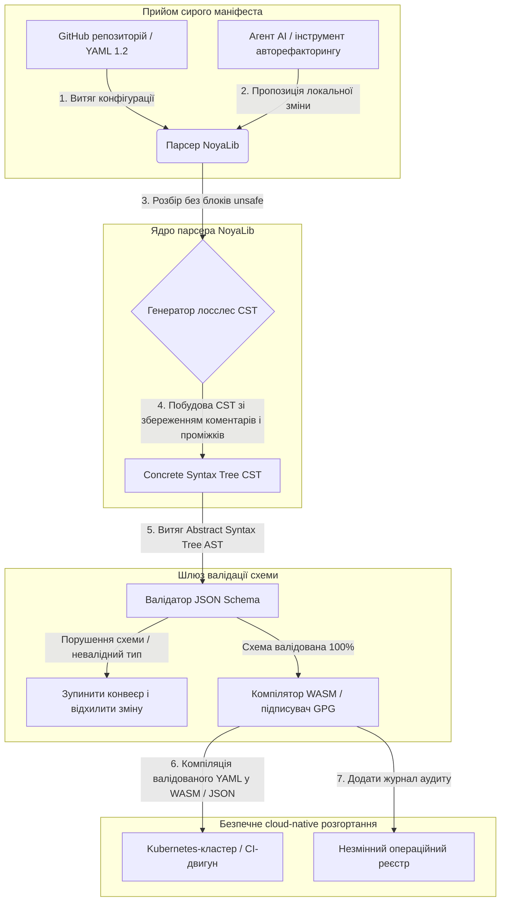

---

# Front Matter (YAML)

author: "contact@sebastienrousseau.com (Sebastien Rousseau)"
banner_alt: "Архітектурна геометрія у драматичному світлі — символізує роль NoyaLib як несучого безпечного парсера YAML на Rust під CI, Kubernetes, MCP та конфігурацією для фінансових послуг"
banner_height: "1597"
banner_width: "2584"
banner: "https://cloudcdn.pro/stocks/images/ken-cheung-KonWFWUaAuk.webp"
cdn: "https://cloudcdn.pro"
charset: "UTF-8"
cname: "sebastienrousseau.com"
copyright: "© Copyright 2025 - 2026 - Sebastien Rousseau. All rights reserved."
date: "18 червня 2026 року"
description: "NoyaLib — це zero-unsafe парсер YAML 1.2 на Rust зі 100% сумісністю 406/406, JSON Schema, лосслес CST та прив'язками MCP/WASM."
format-detection: "telephone=no"
hreflang: "uk"
icon: "https://cloudcdn.pro/clients/sebastienrousseau/v1/logos/sebastienrousseau.svg"
id: "https://sebastienrousseau.com/2026-06-18-noyalib-safe-yaml-rust-ai-mcp-financial-infrastructure-2026"
image_alt: "Чорно-білий портрет Себастьяна Руссо"
image_height: "162"
image_width: "162"
image: "https://cloudcdn.pro/stocks/images/sebastienrousseau.webp"
keywords: "безпечніший парсер YAML на Rust, NoyaLib, сумісність зі специфікацією YAML 1.2, zero-unsafe Rust, валідація JSON Schema, лосслес Concrete Syntax Tree, CST, MCP, Model Context Protocol, WebAssembly, маніфести Kubernetes, конфігурація CI/CD, DORA Article 5, BCBS 239, операційний ризик Basel III, фінансова інфраструктура, безпека конфігурації, ланцюг постачання програмного забезпечення"
language: "uk-UA"
last_reviewed: "2026-06-18"
layout: "report"
locale: "uk_UA"
logo_alt: "Логотип Себастьяна Руссо"
logo_height: "44"
logo_width: "44"
logo: "https://cloudcdn.pro/clients/sebastienrousseau/v1/logos/sebastienrousseau.svg"
menu: ""
measurementID: "G-169G4ET5HQ"
name: "Sebastien Rousseau"
permalink: "https://sebastienrousseau.com/2026-06-18-noyalib-safe-yaml-rust-ai-mcp-financial-infrastructure-2026"
rating: "general"
referrer: "no-referrer"
robots: "index, follow"
schema: "FAQPage, Article"
seo_title: "Безпечніший парсер YAML на Rust для AI, MCP і фінансів"
short_name: "sebastienrousseau"
subtitle: "Безпечніший стек YAML на Rust — NoyaLib — перетворює YAML 1.2 із зручної розмітки на криптографічно захищену, спецсумісну площину керування конфігурацією для агентів AI, MCP, Kubernetes та інфраструктури фінансових послуг."
tags: "безпечніший парсер YAML на Rust, NoyaLib, YAML 1.2, zero-unsafe Rust, JSON Schema, MCP, WebAssembly, Kubernetes, DORA, BCBS 239, Basel III, фінансова інфраструктура, безпека ланцюга постачання"
theme-color: "0, 83, 191"
title: "Чому YAML потребує безпечнішого стека на Rust для AI, MCP і фінансової інфраструктури у 2026"
url: "https://sebastienrousseau.com/2026-06-18-noyalib-safe-yaml-rust-ai-mcp-financial-infrastructure-2026"
viewport: "width=device-width, initial-scale=1, shrink-to-fit=no"

# RSS - The RSS feed front matter (YAML).
atom_link: "https://sebastienrousseau.com/2026-06-18-noyalib-safe-yaml-rust-ai-mcp-financial-infrastructure-2026/rss.xml"
category: "Technology"
docs: https://validator.w3.org/feed/docs/rss2.html
generator: "Static Site Generator (SSG) (version 0.0.26)"
item_description: "NoyaLib — це zero-unsafe парсер YAML 1.2 на Rust зі 100% сумісністю 406/406, JSON Schema, лосслес CST та прив'язками MCP/WASM."
item_guid: "https://sebastienrousseau.com/2026-06-18-noyalib-safe-yaml-rust-ai-mcp-financial-infrastructure-2026/rss.xml"
item_link: "https://sebastienrousseau.com/2026-06-18-noyalib-safe-yaml-rust-ai-mcp-financial-infrastructure-2026/rss.xml"
item_pub_date: "Thu, 18 Jun 2026 06:06:06 +0000"
item_title: "Чому YAML потребує безпечнішого стека на Rust для AI, MCP і фінансової інфраструктури у 2026"
last_build_date: "Thu, 18 Jun 2026 06:06:06 +0000"
managing_editor: "contact@sebastienrousseau.com (Sebastien Rousseau)"
pub_date: "Thu, 18 Jun 2026 06:06:06 +0000"
ttl: "60"
type: "article"
webmaster: "contact@sebastienrousseau.com"

# Apple - The Apple front matter (YAML).
apple_mobile_web_app_orientations: "portrait"
apple_touch_icon_sizes: "192x192"
apple-mobile-web-app-capable: "yes"
apple-mobile-web-app-status-bar-inset: "black"
apple-mobile-web-app-status-bar-style: "black-translucent"
apple-mobile-web-app-title: "Безпечніший парсер YAML на Rust для AI, MCP і фінансів"
apple-touch-fullscreen: "yes"

# MS Application - The MS Application front matter (YAML).

msapplication-navbutton-color: "0, 83, 191"

# Twitter Card - The Twitter Card front matter (YAML).

twitter_card: "summary_large_image"
twitter_creator: "@wwdseb"
twitter_description: "NoyaLib — це zero-unsafe парсер YAML 1.2 на Rust зі 100% сумісністю 406/406, JSON Schema, лосслес CST та прив'язками MCP/WASM."
twitter_image: "https://cloudcdn.pro/clients/sebastienrousseau/v1/logos/sebastienrousseau.svg"
twitter_image_alt: "Логотип Себастьяна Руссо"
twitter_site: "@wwdseb"
twitter_title: "Безпечніший парсер YAML на Rust для AI, MCP і фінансів"
twitter_url: "https://sebastienrousseau.com/2026-06-18-noyalib-safe-yaml-rust-ai-mcp-financial-infrastructure-2026"

excerpt: "NoyaLib — це безпечніший стек YAML на Rust: нуль блоків unsafe, 100% сумісність 406/406 зі специфікацією YAML 1.2, лосслес Concrete Syntax Tree, валідація JSON Schema (Draft 2020-12) і прив'язки MCP/WASM — створений для агентів AI, Kubernetes, CI/CD та площини керування конфігурацією за фінансовою інфраструктурою."

# Humans.txt - The Humans.txt front matter (YAML).
author_website: "https://sebastienrousseau.com"
author_twitter: "@wwdseb"
author_location: "London, UK"
thanks: "Дякуємо за прочитання!"
site_last_updated: "2026-06-18"
site_standards: "HTML5, CSS3, RSS, Atom, JSON, XML, YAML, Markdown, TOML"
site_components: "Kaishi, Kaishi Builder, Kaishi CLI, Kaishi Templates, Kaishi Themes"
site_software: "Static Site Generator, Rust"

---

# Чому YAML потребує безпечнішого стека на Rust для AI, MCP і фінансової інфраструктури у 2026

Безпечніший стек YAML на Rust має значення, тому що YAML тепер несе на собі конвеєри CI/CD, маніфести Kubernetes, правила [Open Policy Agent](https://www.openpolicyagent.org/) та реєстри інструментів Model Context Protocol (MCP) — і один-єдиний неоднозначний розбір здатен зламати кліринговий контур, помилково налаштувати групу безпеки або видати локальному агенту AI неправильні дозволи. [NoyaLib](https://github.com/sebastienrousseau/noyalib) — це чистий на Rust, zero-unsafe екосистема розбору й валідації [YAML 1.2](https://yaml.org/spec/1.2.2/), створена, щоб така інфраструктура була безпечною за замовчуванням.

## Коротка відповідь

**Що таке NoyaLib одним реченням?** NoyaLib — це опенсорсна, чисто-Rust екосистема розбору та валідації YAML 1.2 з нульовим кодом `unsafe`, 100% сумісністю зі специфікацією по всіх 406 офіційних тестах YAML, лосслес Concrete Syntax Tree та валідацією [JSON Schema](https://json-schema.org/) у реальному часі — створена, щоб конфігурація для агентів AI, MCP, Kubernetes і фінансової інфраструктури була безпечною за замовчуванням.

## Резюме для керівництва

YAML виглядає скромно, доки неоднозначний розбір або порушення схеми не зламає багатомільярдну продакшен-систему клірингу. У 2026 році YAML є де-факто стандартом для конвеєрів [CI/CD](https://docs.github.com/en/actions/learn-github-actions/workflow-syntax-for-github-actions), маніфестів [Kubernetes](https://kubernetes.io/docs/concepts/configuration/overview/), правил [Open Policy Agent](https://www.openpolicyagent.org/) та реєстрів інструментів Model Context Protocol (MCP). Непрозорі застарілі парсери — з вразливостями пам'яті та деструктивним розбором — становлять неприйнятний ризик безпеки. NoyaLib — це чисто-Rust, zero-unsafe екосистема YAML 1.2: 100% сумісність зі специфікацією по всіх 406 офіційних тестах, лосслес Concrete Syntax Tree (CST), що зберігає коментарі та проміжки, і вбудована валідація JSON Schema. Як наслідок, YAML перетворюється на придатну до аудиту, безпечну й доступну для агентів площину керування конфігурацією.

## Ключові висновки

- **Конфігурація — це продакшен-код.** Один-єдиний некоректний файл YAML здатен помилково налаштувати cloud-native групи безпеки або дозволи агента AI. NoyaLib ставиться до YAML як до критичної інфраструктури.
- **Архітектура zero-unsafe.** Побудований повністю на безпечному Rust, з нульовою кількістю блоків `unsafe`, NoyaLib усуває вразливості безпеки пам'яті — переповнення буфера, віддалене виконання коду — на основних шарах розбору.
- **Абсолютна сумісність зі специфікацією 406/406.** Математично валідує структури конфігурації, усуваючи розбіжності розбору та структурний дрейф між staging і продакшен-середовищами.
- **Лосслес Concrete Syntax Tree.** На відміну від застарілих парсерів, що відкидають коментарі та форматування, NoyaLib зберігає проміжки та анотації, уможливлюючи безпечний автоматизований рефакторинг агентами AI з повним «зворотним рейсом».
- **Фідуціарна цінність рівня правління.** Пов'язує цілісність конфігурації зі [статтею 5 DORA](https://eur-lex.europa.eu/legal-content/EN/TXT/?uri=CELEX%3A32022R2554) та метриками капіталу операційного ризику [Basel III](https://www.bis.org/bcbs/publ/d424.htm), безпосередньо захищаючи топ-менеджмент від персональної відповідальності.

**Дотичні матеріали:** [KyberLib і постквантова банківська міграція у 2026: від стандартів до коду](https://sebastienrousseau.com/2026-06-12-kyberlib-post-quantum-banking-migration-standards-code-2026/), [Індекс cloud-native банкінгу у 2026: DORA, платформна інженерія, суверенна хмара та операційна стійкість](https://sebastienrousseau.com/2026-06-05-cloud-native-banking-index-dora-resilience-platform-engineering-2026/), [AI-обізнані dotfiles у 2026: побудова безпечної, відтворюваної робочої станції розробника для MCP, SLSA та паритету між шеллами](https://sebastienrousseau.com/2026-06-16-ai-aware-dotfiles-secure-reproducible-workstation-2026/).

## 01. Чому безпечніший стек YAML на Rust має значення у 2026

У червні 2026 року корпоративні ІТ-інфраструктури є високорозподіленими і дедалі більш автоматизованими.

YAML непомітно став несучою мовою конфігурації для всього стека розробки програмного забезпечення. Він несе на собі робочі процеси безперервної інтеграції (CI), що компілюють продакшен-артефакти, маніфести [Kubernetes](https://kubernetes.io/docs/concepts/overview/), що оркеструють глобальні cloud-native кластери, та схеми серверів [Model Context Protocol](https://modelcontextprotocol.io/) (MCP), що надають локальним агентам AI дозвіл на виконання локальних операцій.

Застарілі парсери YAML — [PyYAML](https://pyyaml.org/), [yaml-cpp](https://github.com/jbeder/yaml-cpp), [libyaml](https://github.com/yaml/libyaml) — несуть два структурні ризики:

1. **Вразливості приведення типів («проблема Норвегії»).** Застарілі парсери часто приводять нелапковані рядки (код країни `NO` — до булевого `false`, так само `yes`/`no`) — див. [булевий тег YAML 1.1 проти 1.2](https://yaml.org/type/bool.html) — спричиняючи критичні системні збої або «тихі» помилкові налаштування безпеки.
2. **Експлойти безпеки пам'яті.** Непрозорі парсери, написані на C/C++, страждають від експлойтів витоку пам'яті та переповнення буфера, що може призвести до віддаленого виконання коду (RCE) на основних серверах збірки.

[NoyaLib](https://github.com/sebastienrousseau/noyalib) вирішує ці виклики. Це чисто-Rust, zero-unsafe екосистема розбору та валідації YAML 1.2. Завдяки абсолютній сумісності зі специфікацією 406/406 і застосуванню суворої валідації JSON Schema безпосередньо під час розбору NoyaLib забезпечує високий **Return on Resilience (RoR)** — запобігає простоям, спричиненим конфігурацією, і захищає ланцюги постачання програмного забезпечення фінансового рівня.

## 02. Архітектурна призма NoyaLib 2026

Екосистема NoyaLib функціонує як безпечний, лосслес парсер конфігурації. Кожен локальний і хмарний маніфест структурно валідується та захищений на найнижчому шарі виконання.

### Таблиця 1: шари архітектури NoyaLib та зниження ризиків

| Шар | Проєктне рішення | Чому це важливо | Ризик у разі неналежного поводження |
| ---- | ---- | ---- | ---- |
| **Шар парсера** | YAML 1.2-сумісний, чисто-Rust парсер з нульовою кількістю блоків `unsafe` | Усуває вразливості безпеки пам'яті та переповнення буфера на найнижчому шарі виконання. | Віддалене виконання коду (RCE) на основних серверах збірки. |
| **Шар відповідності** | 100% сумісність по всіх 406/406 офіційних тестах YAML 1.2 | Усуває розбіжності розбору та дрейф приведення типів між staging і продакшеном. | Помилки приведення типів за «проблемою Норвегії», що вимикають групи безпеки. |
| **Шар синтаксичного дерева** | Лосслес Concrete Syntax Tree (CST) | Зберігає коментарі, проміжки та порядок при «зворотному рейсі» розбору й програмному рефакторингу. | Автоматизований AI-рефакторинг руйнує анотації розробників. |
| **Шар валідації** | Валідація [JSON Schema (Draft 2020-12)](https://json-schema.org/draft/2020-12/release-notes) під час розбору | Застосовує сувору модель даних до файлів конфігурації ще до того, як вони потраплять у продакшен-кластери. | Некоректні файли конфігурації спричиняють збої cloud-native кластерів. |
| **Шар інтерфейсу** | Прив'язки WebAssembly (WASM) та MCP | Дозволяє валідації конфігурації працювати безпосередньо у браузерах, edge-вузлах та локальних інструментаріях агентів. | Силоси інструментів, де валідація не може виконуватися на edge-пристроях. |

## 03. Ключові сигнали безпеки робочої станції та конфігурації

Щоб підтримувати абсолютну безпеку у всьому портфелі розробки та експлуатації, директорам з інформаційної безпеки (CISO) необхідно моніторити конкретні, кількісно вимірювані метрики.

### Таблиця 2: сигнали безпеки робочої станції та конфігурації

| Сигнал | Метрика / операційний орієнтир | Посилання на NIST CSF / DORA | Технічна реалізація на платформі |
| ---- | ---- | ---- | ---- |
| **Відповідність парсера** | 100% проходження офіційного набору тестів YAML 1.2 (406/406 тестів). | [DORA Article 6](https://eur-lex.europa.eu/legal-content/EN/TXT/?uri=CELEX%3A32022R2554) (безпека ICT) | Ядро парсера NoyaLib валідує всі маніфести перед виконанням CI. |
| **Профіль безпеки пам'яті** | Нульова кількість блоків `unsafe` Rust у парсері та залежностях серіалізатора. | DORA Article 30 (ланцюг постачання) | Автоматизовані перевірки компілятора ([`forbid(unsafe_code)`](https://doc.rust-lang.org/reference/attributes/diagnostics.html#the-forbid-attribute)) у складах cargo. |
| **Валідація схеми** | 100% розібраних файлів конфігурації перевірено за валідними моделями [JSON Schema](https://json-schema.org/). | [NIST CSF 2.0](https://www.nist.gov/cyberframework) (PR.DS-01) | Шлюз валідації в реальному часі зупиняє конвеєри збірки на порушеннях схеми. |
| **Дрейф конфігурації** | Виявлення в реальному часі та відновлення локальних файлів конфігурації до стану, керованого git. | Return on Resilience (RoR) | Безперервна телеметрія, що логує всі модифікації локальних файлів. |
| **Контроль доступу агента** | Обмежені дозволи лише для читання для локальних інструментів AI, що працюють через конфігурації MCP. | Управління модельним ризиком ([SR 11-7](https://www.federalreserve.gov/supervisionreg/srletters/sr1107.htm)) | Межі сервера MCP обмежують операції агента схваленими каталогами. |

## 04. Хибність непрозорого розбору конфігурації

Серйозною вразливістю у cloud-native експлуатації є *непрозорий розбір* — використання парсерів, що відкидають структурні метадані (коментарі, пробіли, порядок документів) або «тихо» приводять типи під час компіляції. Така поведінка створює два серйозні ризики безпеки:

1. **Деструктивний рефакторинг.** Коли асистент із кодування на AI або інструмент автоматизованого рефакторингу оновлює маніфест розгортання, традиційні парсери відкидають коментарі та форматування розробників, руйнуючи контекст, потрібний для людських код-рев'ю та постінцидентної криміналістики.
2. **Розбіжності розбору.** Якщо staging-середовище використовує парсер на Python, а продакшен працює з парсером на C, дрібні розбіжності у відповідності специфікації YAML 1.2 здатні зробити валідний staging-маніфест таким, що падає або поводиться інакше в продакшені, створюючи приховані вразливості безпеки.

**Лосслес Concrete Syntax Tree (CST)** NoyaLib вирішує це. Він зберігає кожен пробіл, коментар і рядок документа протягом циклу розбору й серіалізації. Автоматизовані асистенти AI можуть редагувати, рефакторити та комітити файли конфігурації, зберігаючи 100% анотацій, написаних людиною — абсолютний слід аудиту.

## 05. Проєктування обмеженого конвеєра конфігурації для AI

Щоб запобігти потраплянню зловмисних змін конфігурації у продакшен-середовища, організація має реалізувати суворо обмежений, валідований за схемою конвеєр конфігурації.

Операційний потік нижче показує, як NoyaLib розбирає сирий YAML, будує лосслес CST, валідує AST за моделлю JSON Schema і компілює прив'язки WebAssembly для браузера чи edge-середовищ.

## 06. Сценарій для правління і фідуціарна відповідальність

Безпека конфігурації та цілісність ланцюга постачання програмного забезпечення є критичними пріоритетами рівня правління. Топ-менеджмент має підходити до управління конфігурацією крізь призму фідуціарного обов'язку та операційної стійкості.

- **DORA Article 5 (підзвітність правління).** Встановлює, що правління несе остаточну, нерозподілювану відповідальність за управління ICT-ризиком установи. Оскільки файли конфігурації контролюють критичні cloud-native групи безпеки та маршрутизацію платежів, правління мають перевірити, що системи, які розбирають ці маніфести, є безпечними для пам'яті та повністю відповідають специфікації, щоб задовольнити регуляторні аудити. ([Regulation (EU) 2022/2554](https://eur-lex.europa.eu/legal-content/EN/TXT/?uri=CELEX%3A32022R2554))
- **BCBS 239 (агрегація даних ризиків і звітність).** Вимагає, щоб звітність про ризики та метрики інфраструктури були точними, повними та формувалися під суворим контролем якості даних. NoyaLib підтримує BCBS 239, розбираючи та валідуючи файли конфігурації за суворими схемами на джерелі, запобігаючи «тихим» витокам даних або відмовам через помилкові налаштування. ([стандарт BCBS 239](https://www.bis.org/publ/bcbs239.htm))
- **Зниження капітальних навантажень операційного ризику (Basel III).** Простої, спричинені конфігурацією, безпосередньо роздувають капітальні навантаження операційного ризику за Basel III, заморожуючи балансовий капітал. Стандартизація корпоративного стека конфігурації на безпечному, чисто-Rust парсері на кшталт NoyaLib мінімізує цей ризик, зберігаючи капітал і захищаючи довіру клієнтів. ([стандарти Basel III](https://www.bis.org/bcbs/publ/d424.htm))

## 07. Що це означає за типом банку

### Глобальні системно важливі банки (G-SIB)

G-SIB управляють тисячами мікросервісів і конвеєрів розгортання у багатьох юрисдикціях. Їхній основний виклик — підтримання узгодженості конфігурації та запобігання дрейфу безпеки у масштабних cloud-native портфелях. Стандартизація на безпечнішому стеку YAML на Rust, як-от NoyaLib, гарантує, що всі маніфести Kubernetes, конвеєри CI/CD та політики безпеки розбираються й валідуються в єдиній, безпечній для пам'яті системі — усуваючи ризик неаудитованих «сніжинкових» конфігурацій.

### Транзакційні та корпоративні банки

Транзакційні банки оперують чутливими платіжними шлюзами та оптовою кліринговою інфраструктурою. Доведення абсолютної безпеки коду та конфігурації, що розгортаються у цих продакшен-середовищах, є непереборною регуляторною вимогою. Інтеграція NoyaLib гарантує, що ланцюг постачання програмного забезпечення повністю аудитований, лосслес і захищений від уразливостей розбору — контроль, який чітко мапується на DORA Article 6 та [PCI DSS v4.0](https://www.pcisecuritystandards.org/document_library/) розділ 6.

### Регіональні та менші банки

Регіональні банки мають підтримувати високі стандарти кібербезпеки без технологічних бюджетів масштабу G-SIB. Опенсорсний фреймворк NoyaLib забезпечує легке, економічно ефективне та високобезпечне Rust-дружнє рішення, дозволяючи меншим установам впроваджувати безпеку конфігурації корпоративного рівня та захист ланцюга постачання без ліцензійних зборів за пропрієтарне ПЗ.

## 08. Висновок: дорожня карта безпеки конфігурації

Робоча станція розробника та cloud-native інфраструктурні конфігурації є критичними площинами керування у ланцюгу постачання програмного забезпечення. Допускати неаудитовані, неоднозначні чи небезпечні файли конфігурації до корпоративних активів — неприйнятний операційний і регуляторний ризик.

Щоб захистити ланцюг постачання програмного забезпечення й уберегти ендпоінти від уразливостей конфігурації, топ-керівники з технологій та безпеки мають уже сьогодні виконати чітку дорожню карту розробки:

1. **Зобов'язати декларативну конфігурацію.** Поступово вивести з обігу ручні, неаудитовані налаштування і встановити, що всі маніфести керуються як версіонована, декларативна система обліку.
2. **Застосувати валідацію схеми.** Запровадити суворі pre-commit хуки та утиліти сканування, щоб усі файли конфігурації валідувалися за валідними моделями JSON Schema перед розгортанням.
3. **Реалізувати лосслес «зворотний рейс».** Забезпечити, щоб усі автоматизовані асистенти кодування на AI та інструменти рефакторингу використовували лосслес розбір зі збереженням коментарів, проміжків і контексту розробника.
4. **Захистити ланцюг постачання.** Забезпечити, щоб усі налаштування конфігурації та утиліти розбору криптографічно верифікувалися з використанням чисто-Rust, zero-unsafe бібліотек на кшталт NoyaLib перед виконанням. ([SLSA framework](https://slsa.dev/))

## 09. Часті запитання

**Що таке NoyaLib і чому він використовується для розбору YAML?**
NoyaLib — це опенсорсний, чисто-Rust, zero-unsafe парсер YAML 1.2. Він досягає 100% сумісності зі специфікацією по всіх 406 тестах офіційного набору, застосовує сувору валідацію [JSON Schema](https://json-schema.org/) під час розбору та виставляє прив'язки WASM і [MCP](https://modelcontextprotocol.io/) — роблячи його безпечнішим стеком YAML на Rust для агентів AI, Kubernetes та фінансової інфраструктури.

**Чому архітектура zero-unsafe важлива для розбору конфігурації?**
Уразливості безпеки пам'яті — переповнення буфера, use-after-free — всередині застарілих парсерів, написаних на C/C++, можуть призвести до віддаленого виконання коду на основних серверах збірки. Чисто-Rust архітектура NoyaLib з [`#![forbid(unsafe_code)]`](https://doc.rust-lang.org/reference/attributes/diagnostics.html#the-forbid-attribute) математично усуває ці вразливості на етапі компіляції.

**Що таке лосслес Concrete Syntax Tree (CST) і чому це важливо?**
Традиційні парсери відкидають коментарі та форматування, роблячи автоматизовані правки агентами AI деструктивними. Лосслес Concrete Syntax Tree від NoyaLib зберігає кожен коментар, пробіл і рядок документа — тож асистенти AI можуть безпечно редагувати і рефакторити файли конфігурації, утримуючи контекст розробника, постінцидентну криміналістику та слід аудиту неушкодженими.

**Як NoyaLib мапується на DORA, BCBS 239 і Basel III?**
DORA Article 5 покладає відповідальність за ICT-ризик на правління; BCBS 239 вимагає контролю якості даних у звітності про ризики; Basel III оподатковує капітал операційного ризику. NoyaLib постачає валідований за схемою, безпечний для пам'яті шар розбору, який ці регламенти вимагають для конфігурації як коду — роблячи регуляторне мапування простим, а капітальне навантаження операційного ризику меншим.

## 10. Джерела

- **YAML, (2026).** *Специфікація YAML 1.2*. Доступно за посиланням: [YAML 1.2 spec](https://yaml.org/spec/1.2.2/).
- **JSON Schema, (2026).** *Примітки до випуску JSON Schema Draft 2020-12*. Доступно за посиланням: [JSON Schema Draft 2020-12](https://json-schema.org/draft/2020-12/release-notes).
- **European Parliament and Council of the European Union, (2022).** *Regulation (EU) 2022/2554 on digital operational resilience for the financial sector (DORA)*. Брюссель: Official Journal of the European Union. Доступно за посиланням: [Регламент DORA](https://eur-lex.europa.eu/legal-content/EN/TXT/?uri=CELEX%3A32022R2554).
- **Basel Committee on Banking Supervision, (2013).** *Principles for effective risk data aggregation and risk reporting (BCBS 239)*. Базель: Bank for International Settlements. Доступно за посиланням: [Стандарт BCBS 239](https://www.bis.org/publ/bcbs239.htm).
- **Basel Committee on Banking Supervision, (2017).** *Basel III: finalising post-crisis reforms*. Базель: Bank for International Settlements. Доступно за посиланням: [Стандарти Basel III](https://www.bis.org/bcbs/publ/d424.htm).
- **Anthropic, (2025).** *Специфікація Model Context Protocol (MCP)*. Доступно за посиланням: [Model Context Protocol](https://modelcontextprotocol.io/).
- **GitHub, (2026).** *Опенсорсний репозиторій noyalib*. Доступно за посиланням: [Репозиторій NoyaLib](https://github.com/sebastienrousseau/noyalib).
