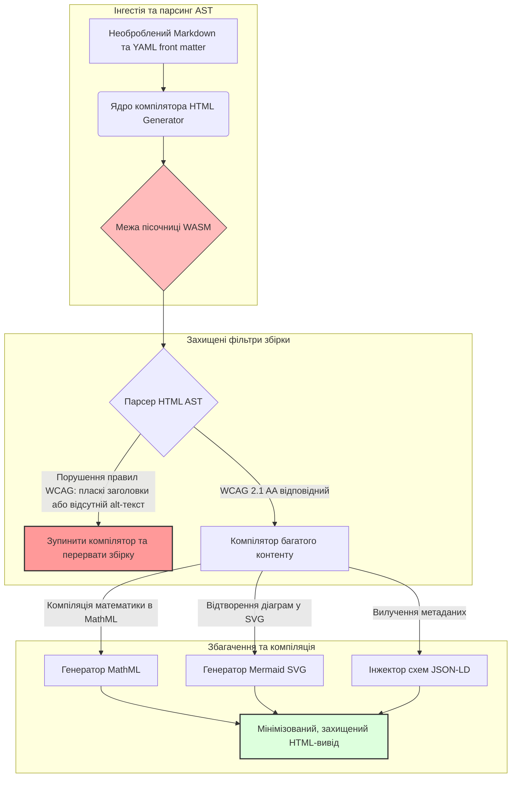

---

# Front Matter (YAML)

author: "contact@sebastienrousseau.com (Sebastien Rousseau)"
banner_alt: "Архітектурна геометрія у структурованому світлі — символізує роль HTML Generator як компілятивного конвеєра перетворення Markdown на HTML для доступної, SEO-оптимізованої, захищеної видавничої інфраструктури"
banner_height: "1597"
banner_width: "2584"
banner: "https://cloudcdn.pro/stocks/images/markus-winkler-IrRbSND5EUc-unsplash-1200.webp"
cdn: "https://cloudcdn.pro"
charset: "UTF-8"
cname: "sebastienrousseau.com"
copyright: "© Copyright 2025 - 2026 - Sebastien Rousseau. All rights reserved."
date: "June 20, 2026"
description: "HTML Generator — це бібліотека на Rust, яка перетворює Markdown на WCAG-сумісний, SEO-готовий HTML зі збагаченням JSON-LD: доступність як код, підтримка MathML і Mermaid, виконання у пісочниці WebAssembly для безпечного корпоративного видання."
format-detection: "telephone=no"
hreflang: "uk"
icon: "https://cloudcdn.pro/clients/sebastienrousseau/v1/logos/sebastienrousseau.svg"
id: "https://sebastienrousseau.com/2026-06-20-html-generator-accessible-seo-structured-markdown-rust-2026"
image_alt: "Чорно-білий портрет Себастьєна Руссо"
image_height: "162"
image_width: "162"
image: "https://cloudcdn.pro/stocks/images/sebastien-rousseau.png"
keywords: "html-generator, Rust Markdown до HTML, доступність як код, WCAG 2.1 AA, SEO-готовий HTML, JSON-LD, MathML, Mermaid, WebAssembly, EAA, DORA, ADA Title III, доступне видання, захищений парсинг, відкритий код"
language: "uk-UA"
last_reviewed: "2026-06-20"
layout: "report"
locale: "uk_UA"
logo_alt: "Логотип Себастьєна Руссо"
logo_height: "44"
logo_width: "44"
logo: "https://cloudcdn.pro/clients/sebastienrousseau/v1/logos/sebastienrousseau.svg"
menu: ""
measurementID: "G-169G4ET5HQ"
name: "Sebastien Rousseau"
permalink: "https://sebastienrousseau.com/2026-06-20-html-generator-accessible-seo-structured-markdown-rust-2026"
rating: "general"
referrer: "no-referrer"
robots: "index, follow"
schema: "FAQPage, Article"
seo_title: "Доступність як код: Markdown до HTML рівня AAA за допомогою Rust у 2026 році"
short_name: "sebastienrousseau"
subtitle: "Трансформація корпоративного веб-видання, технічної документації та клієнтських порталів: від неструктурованих текстових файлів до високоструктурованих, нормативно відповідних і захищених цифрових активів."
tags: "html-generator, Rust, Markdown, доступність, WCAG, SEO, JSON-LD, MathML, Mermaid, WebAssembly, EAA, DORA, ADA, AI-виявлення, RAG, відкритий код, банківська інфраструктура"
theme-color: "0, 83, 191"
title: "Перетворення Markdown на доступний, SEO-готовий, структурований HTML за допомогою Rust у 2026 році"
url: "https://sebastienrousseau.com/2026-06-20-html-generator-accessible-seo-structured-markdown-rust-2026"
viewport: "width=device-width, initial-scale=1, shrink-to-fit=no"

# RSS - The RSS feed front matter (YAML).
atom_link: "https://sebastienrousseau.com/2026-06-20-html-generator-accessible-seo-structured-markdown-rust-2026/rss.xml"
category: "Technology"
docs: https://validator.w3.org/feed/docs/rss2.html
generator: "Static Site Generator (SSG) (version 0.0.40)"
item_description: "HTML Generator — це бібліотека на Rust, яка перетворює Markdown на WCAG-сумісний, SEO-готовий HTML зі збагаченням JSON-LD: доступність як код, підтримка MathML і Mermaid, виконання у пісочниці WebAssembly для безпечного корпоративного видання."
item_guid: "https://sebastienrousseau.com/2026-06-20-html-generator-accessible-seo-structured-markdown-rust-2026/rss.xml"
item_link: "https://sebastienrousseau.com/2026-06-20-html-generator-accessible-seo-structured-markdown-rust-2026/rss.xml"
item_pub_date: "Sat, 20 Jun 2026 06:06:06 +0000"
item_title: "Перетворення Markdown на доступний, SEO-готовий, структурований HTML за допомогою Rust у 2026 році"
last_build_date: "Sat, 20 Jun 2026 06:06:06 +0000"
managing_editor: "contact@sebastienrousseau.com (Sebastien Rousseau)"
pub_date: "Sat, 20 Jun 2026 06:06:06 +0000"
ttl: "60"
type: "article"
webmaster: "contact@sebastienrousseau.com"

# Apple - The Apple front matter (YAML).
apple_mobile_web_app_orientations: "portrait"
apple_touch_icon_sizes: "192x192"
apple-mobile-web-app-capable: "yes"
apple-mobile-web-app-status-bar-inset: "black"
apple-mobile-web-app-status-bar-style: "black-translucent"
apple-mobile-web-app-title: "Markdown до HTML рівня AAA з Rust"
apple-touch-fullscreen: "yes"

# MS Application - The MS Application front matter (YAML).

msapplication-navbutton-color: "0, 83, 191"

# Twitter Card - The Twitter Card front matter (YAML).

twitter_card: "summary_large_image"
twitter_creator: "@wwdseb"
twitter_description: "HTML Generator — це бібліотека на Rust, яка перетворює Markdown на WCAG-сумісний, SEO-готовий HTML зі збагаченням JSON-LD: доступність як код, підтримка MathML і Mermaid, виконання у пісочниці WebAssembly."
twitter_image: "https://cloudcdn.pro/clients/sebastienrousseau/v1/logos/sebastienrousseau.svg"
twitter_image_alt: "Логотип Себастьєна Руссо"
twitter_site: "@wwdseb"
twitter_title: "Доступність як код: Markdown до HTML рівня AAA з Rust"
twitter_url: "https://sebastienrousseau.com/2026-06-20-html-generator-accessible-seo-structured-markdown-rust-2026"

# Humans.txt - The Humans.txt front matter (YAML).
author_website: "https://sebastienrousseau.com"
author_twitter: "@wwdseb"
author_location: "London, UK"
thanks: "Дякуємо за читання!"
site_last_updated: "2026-06-20"
site_standards: "HTML5, CSS3, RSS, Atom, JSON, XML, YAML, Markdown, TOML"
site_components: "Kaishi, Kaishi Builder, Kaishi CLI, Kaishi Templates, Kaishi Themes"
site_software: "Static Site Generator, Rust"

---

# Перетворення Markdown на доступний, SEO-готовий, структурований HTML за допомогою Rust у 2026 році

<!-- lead-start -->
<aside class="post-lead" aria-label="Резюме статті">

<strong>TL;DR.</strong> HTML Generator — це чистий Rust-компілятор Markdown-до-HTML, який забезпечує дотримання WCAG 2.1 AA на етапі збірки, автоматично інжектує схема-сумісний JSON-LD, відтворює MathML і Mermaid SVG нативно та ізолює парсинг у пісочниці WebAssembly — перетворюючи видання на компілятивно-контрольовану керуючу площину для доступності, SEO та ІКТ-безпеки.

<strong>Ключові висновки</strong>

<ul class="post-lead-takeaways">
  <li><strong>Коротка відповідь.</strong> Що таке HTML Generator в одному реченні?</li>
  <li><strong>Резюме для керівництва.</strong> Відтворення Markdown виглядає тривіальним; отримати видавничо-якісний HTML — це завдання відповідності нормативним вимогам.</li>
  <li><strong>01. Чому компілятор HTML з пріоритетом доступності важливий у 2026 році.</strong> EAA та ADA Title III перемістили доступність з інженерної гігієни у сферу фідуціарної відповідальності.</li>
  <li><strong>02. Архітектурна призма HTML Generator 2026.</strong> Багатоетапний, компілятивно-контрольований конвеєр від необробленого Markdown до захищеного HTML-виводу.</li>
</ul>

<strong>Суміжні матеріали:</strong> <a href="https://sebastienrousseau.com/2026-06-18-noyalib-safe-yaml-rust-ai-mcp-financial-infrastructure-2026">Чому YAML потребує безпечнішого стеку Rust для ШІ, MCP та фінансової інфраструктури у 2026 році</a>, <a href="https://sebastienrousseau.com/2026-06-17-static-site-generator-secure-default-ai-era-publishing-2026">Безпечний за замовчуванням Static Site Generator для видання в епоху ШІ у 2026 році</a>, <a href="https://sebastienrousseau.com/2026-06-11-cloudcdn-open-source-blueprint-ai-native-edge-2026">CloudCDN: відкритий план для AI-нативної периферії у 2026 році</a>.

</aside>
<!-- lead-end -->

У 2026 році веб-контент споживається не менше ШІ-пошуковими краулерами, пошуковими системами на основі LLM та конвеєрами Retrieval-Augmented Generation (RAG), ніж людьми-читачами. Плаский або деформований HTML ускладнює машинне виявлення, тоді як недотримання жорстких глобальних регуляторних вимог, зокрема [Європейського акту про доступність (EAA)](https://www.accessibility-act.eu/) та [US ADA Title III](https://www.ada.gov/topics/title-iii/), є однозначною цивільно-правовою відповідальністю. [HTML Generator](https://github.com/sebastienrousseau/html-generator) — це високопродуктивна бібліотека на Rust, розроблена для усунення цих прогалин — на рівні компілятора, а не в патчах після розгортання.

## Коротка відповідь

**Що таке HTML Generator в одному реченні?** HTML Generator — це відкрита, чиста Rust-бібліотека-компілятор Markdown-до-HTML, яка забезпечує дотримання [WCAG 2.1 AA](https://www.w3.org/TR/WCAG21/) на етапі збірки, автоматично генерує семантичні орієнтири та ARIA-атрибути, інжектує схема-сумісний [JSON-LD](https://json-ld.org/) з YAML front matter, відтворює діаграми Mermaid і математичні формули у доступні SVG і MathML, та виконується у пісочниці [WebAssembly](https://webassembly.org/) — перетворюючи корпоративне видання на компілятивно-контрольовану, фідуціарно-орієнтовану керуючу площину.

## Резюме для керівництва

Відтворення Markdown виглядає тривіальним. Видавничо-якісний HTML — це завдання відповідності нормативним вимогам. У червні 2026 року кожна корпоративна точка взаємодії — портали для інвесторів, регуляторні розкриття, клієнтська документація, API-довідники, маркетингові ресурси — обробляється як людьми, так і машинами. На кожній сторінці стикаються два тиски: [EAA](https://www.accessibility-act.eu/) та [ADA Title III](https://www.ada.gov/topics/title-iii/) роблять доступність правовим ризиком на рівні ради директорів, тоді як ШІ-інгестія та конвеєри RAG винагороджують структурований, машиночитабельний контент. Стандартні бібліотеки Markdown виробляють плаский HTML, який не проходить обидва фільтри. HTML Generator розглядає генерацію документів як компілятивно-контрольований конвеєр: валідація WCAG є помилкою збірки, JSON-LD надходить з YAML front matter без ручного маркування, MathML і Mermaid відтворюються доступно, а весь рушій постачається як ціль WebAssembly, щоб парсинг ненадійних документів залишався ізольованим від хоста.

## Ключові висновки

- **Доступність як код — новий базовий стандарт.** EAA встановлює обов'язкові вимоги доступності для споживчих цифрових сервісів. HTML Generator оцінює дерево документа на етапі компіляції, автоматично генеруючи семантичні орієнтири та ARIA-атрибути — менше виправлень після розгортання, менші бюджети на усунення, жодного відсутнього alt-тексту у продакшні.
- **Структуровані дані для виявлення ШІ.** Сучасний пошук і RAG залежать від машиночитабельних метаданих. Компілятор аналізує YAML front matter та інжектує [Schema.org-сумісний JSON-LD](https://schema.org/) безпосередньо в заголовок документа, роблячи контент повністю інтерпретованим для [Google Rich Results](https://developers.google.com/search/docs/appearance/structured-data/intro-structured-data), [Bing Webmaster](https://www.bing.com/webmasters) та краулерів на основі LLM.
- **Досконалість технічного контенту.** Технічне видання — це не плаский текст. HTML Generator компілює розширення Markdown для математики у доступний [MathML](https://www.w3.org/Math/), а діаграми [Mermaid.js](https://mermaid.js.org/) відтворює у адаптивні SVG — обидва зберігають WCAG-сумісну структуру, а не деградують до непрозорих зображень.
- **Ізоляція WebAssembly.** Парсинг ненадійного Markdown є ризиком безпеки. Завдяки орієнтуванню на [WASM](https://webassembly.org/), HTML Generator виконується у ізольованій пісочниці, що запобігає довільному виконанню коду та захищає хост-систему — безпосередньо виконуючи зобов'язання ІКТ-безпеки відповідно до [DORA Article 6](https://eur-lex.europa.eu/legal-content/EN/TXT/?uri=CELEX%3A32022R2554).
- **Фідуціарний захист для рад директорів.** Технічна невідповідність вийшла на рівень залу засідань. Стандартизація на компілятивно-контрольованому HTML-рушії захищає директорів та вище керівництво від особистої цивільно-правової та регуляторної відповідальності відповідно до DORA, EAA та ADA Title III.

**Суміжні матеріали:** [Чому YAML потребує безпечнішого стеку Rust для ШІ, MCP та фінансової інфраструктури у 2026 році](https://sebastienrousseau.com/2026-06-18-noyalib-safe-yaml-rust-ai-mcp-financial-infrastructure-2026/), [Безпечний за замовчуванням Static Site Generator для видання в епоху ШІ у 2026 році](https://sebastienrousseau.com/2026-06-17-static-site-generator-secure-default-ai-era-publishing-2026/), [CloudCDN: відкритий план для AI-нативної периферії у 2026 році](https://sebastienrousseau.com/2026-06-11-cloudcdn-open-source-blueprint-ai-native-edge-2026/).

## 01. Чому компілятор HTML з пріоритетом доступності важливий у 2026 році

Корпоративні веб-ресурси, бібліотеки документації та центри підтримки продуктів є критичними цифровими точками взаємодії. Зараз вони зазнають двох інтенсивних, взаємопов'язаних тисків.

Перший — **інгестія ШІ та виявлення контенту**. Контент дедалі більше обробляється великими мовними моделями та конвеєрами Retrieval-Augmented Generation. Плаский або деформований HTML ускладнює парсинг краулерів, роблячи корпоративні дослідження та документацію невидимими для сучасних пошукових парадигм — включно з [Google Search Generative Experience](https://blog.google/products/search/generative-ai-search/), переглядом [ChatGPT](https://chat.openai.com/) та корпоративними агентами RAG.

Другий — **жорстке глобальне законодавство про доступність**. Відповідно до [Європейського акту про доступність](https://www.accessibility-act.eu/) (повністю застосовного з червня 2025 року) та [US ADA Title III](https://www.ada.gov/topics/title-iii/), корпоративні платформи видання повинні гарантувати повну цифрову доступність. Недотримання [WCAG 2.1 AA](https://www.w3.org/TR/WCAG21/) більше не є інженерною помилкою; це цивільно-правова та регуляторна відповідальність, що призвела до багатомільйонних врегулювань.

[HTML Generator](https://github.com/sebastienrousseau/html-generator) усуває обидва тиски безпосередньо. Це потокобезпечна бібліотека Rust, розроблена для перетворення Markdown на доступний, SEO-готовий, структурований HTML. Розглядаючи генерацію документів як компілятивно-контрольований конвеєр, рушій забезпечує високий **Return on Resilience (RoR)** — захищаючи баланси від позовів за доступність та максимізуючи машиночитабельність для виявлення ШІ.

## 02. Архітектурна призма HTML Generator 2026

Фреймворк спроектований як захищений, багатоетапний конвеєр компіляції, що перетворює необроблений текст Markdown на криптографічно верифіковані, високодоступні статичні активи.

### Таблиця 1: Архітектурні рівні HTML Generator та пом'якшення ризиків

| Рівень | Проектне рішення | Чому це важливо | Ризик при неправильному поводженні |
| ---- | ---- | ---- | ---- |
| **Рівень вводу** | Парсер Markdown і YAML front matter | Зустрічає авторів там, де вони є; відокремлює прозу від структурованих метаданих. | Непослідовні метадані, зламані карти сайтів, прогалини в індексації. |
| **Рівень структури** | Автоматизований зміст та семантичні орієнтири з тегами ARIA | Будує навіговані, доступні дерева документів за своєю конструкцією. | Плаский HTML, що порушує роботу скрін-рідерів та WCAG. |
| **Рівень багатого контенту** | Нативне відтворення MathML та Mermaid.js SVG | Компілює формули та діаграми в доступні SVG та MathML. | Затримка клієнтського JS-відтворення та зламаний вивід допоміжних технологій. |
| **Рівень SEO та даних** | Інтегрована генерація JSON-LD та структурованих метаданих | Інжектує [Schema.org](https://schema.org/) сумісний JSON-LD безпосередньо в заголовок. | Пошукові системи та ШІ-краулери неправильно читають автора, контекст, ліцензування. |
| **Рівень виконання** | Нативний компілятор Rust з ціллю WebAssembly | Забезпечує безпечне, ізольоване виконання на серверах, периферійних вузлах та в браузерах. | Довільне виконання коду під час парсингу ненадійного Markdown. |

## 03. Ключові сигнали веб-безпеки та доступності

Щоб перевірити відповідність публічних видавничих активів сучасним регуляторним та безпековим аудитам, старшим технологічним керівникам необхідно відстежувати конкретні, кількісно визначені метрики.

### Таблиця 2: Сигнали веб-безпеки та доступності

| Сигнал | Метрика / операційний орієнтир | Посилання EAA / DORA / W3C | Технічна реалізація |
| ---- | ---- | ---- | ---- |
| **Відповідність доступності** | 100% скомпільованих сторінок перевірено за правилами WCAG 2.1 AA. | [EAA](https://www.accessibility-act.eu/) та [ADA Title III](https://www.ada.gov/topics/title-iii/) | Парсер HTML на етапі збірки, що оцінює alt-теги зображень та семантичні орієнтири. |
| **Пісочниця виконання WASM** | 100% ненадійних вводів Markdown компілюється у ізольованому середовищі виконання WebAssembly. | [DORA Article 6](https://eur-lex.europa.eu/legal-content/EN/TXT/?uri=CELEX%3A32022R2554) (ІКТ-безпека) | Ізоляція середовища парсингу від хост-сервера. |
| **Охоплення структурованими метаданими** | 100% опублікованих статей збагачено валідними, схема-сумісними заголовками JSON-LD. | Специфікації [Schema.org](https://schema.org/) | Автоматичний парсинг front matter та конверсія в об'єкти JSON-LD. |
| **Пропускна здатність компіляції** | Ціль — понад 10 000 сторінок на секунду на типовому обладнанні. | Return on Resilience (RoR) | Високопаралельний компілятор Rust AST. |
| **Перевірка розширених фрагментів** | Нуль помилок парсингу в [Google Rich Results](https://search.google.com/test/rich-results) та перевірках [Schema validator](https://validator.schema.org/). | Вимоги Google Search | Структурна валідація згенерованого JSON-LD під час конвеєра збірки. |

## 04. Міф про просте відтворення Markdown

Поширене хибне уявлення серед технологічних менеджерів — що конвертація Markdown в HTML є простою вправою з текстових замін. Багато стандартних бібліотек переводять форматування Markdown у плаский, неструктурований HTML. Вивід відображається для зрячого читача у браузері, але є пасткою відповідності.

Пласкому HTML зазвичай бракує трьох речей.

1. **Правильні ієрархії заголовків.** Стандартний Markdown не забезпечує порядок заголовків. Перехід з `<h1>` на `<h4>` порушує WCAG 2.1 AA та ламає навігацію за документом для скрін-рідерів.
2. **Явна семантика таблиць.** Таблиці стандартного Markdown рідко відтворюються з правильними атрибутами scope для `<th>` та `<tbody>`, необхідними для доступного парсингу.
3. **Машиночитабельні метадані.** Стандартний HTML позбавлений JSON-LD-хуків, від яких залежать сучасні платформи ШІ-пошуку та системи інгестії RAG.

HTML Generator вирішує це, аналізуючи Markdown у **Abstract Syntax Tree (AST)**. Рушій оцінює структуру документа перед генерацією HTML, валідуючи вкладеність заголовків, інжектуючи відповідні ARIA-атрибути та стверджуючи, що кожен медіа-актив має альтернативний текст — перетворюючи доступність з ручного аудиту на гарантований інваріант часу компіляції.

## 05. Проектування конвеєра збірки доступності як коду

Щоб запобігти потраплянню недоступних або неіндексованих активів у публічне розгортання, доступність повинна бути суворим фільтром компілятора. Наступний конвеєр показує, як HTML Generator оцінює Markdown, виконує валідацію з ізоляцією WebAssembly та генерує захищений, структурований HTML.

## 06. Посібник для залу засідань та фідуціарна відповідальність

Сучасна відповідність доступності та веб-безпеці є невід'ємними питаннями залу засідань. Вище керівництво повинно підходити до видавничої інфраструктури через призму правових ризиків, фінансового захисту та регуляторного впливу.

- **Європейський акт про доступність (EAA).** Встановлює прямі, юридично обов'язкові вимоги відповідності для публічних та приватних цифрових порталів. Невідповідність може призвести до значних фінансових штрафів, цивільних позовів та негайного виведення активу з ринку ЄС. Інтегруючи доступність як код, ради директорів можуть засвідчити, що невідповідний код не може потрапити у виробництво — перетворюючи реактивне усунення на структурний правовий захист.
- **DORA Article 6 (Безпечні ІКТ-середовища).** Встановлює суворі правила для безпеки ІКТ-середовища. Ізолюючи компіляцію Markdown у пісочниці WebAssembly, організації гарантують, що парсинг завантажених клієнтами документів або партнерських потоків не може наражати хост-сервери на довільне виконання коду, захищаючи критичні банківські портали.
- **Зниження витрат на аудит відповідності.** Традиційна відповідність доступності спирається на дорогі, ретроспективні аудити після розгортання — десятки тисяч доларів щороку на кожен сайт. Впровадження валідації WCAG як блокуючого фільтра часу компіляції усуває ці ретроспективні витрати, переміщуючи бюджет відповідності від захисту до інновацій.

## 07. Що це означає за типом банку / підприємства

### Глобально системно важливі банки (G-SIB)

G-SIB управляють масштабними, багатомовними публічними ресурсами, що публікують тисячі наукових робіт, регуляторних розкриттів та документів для відносин з інвесторами в різних юрисдикціях. Їх виклик — масштаб та мовний паритет. Ціль WebAssembly та високопропускний рушій Rust дозволяють великим, локалізованим науковим бібліотекам оновлюватися, компілюватися та розгортатися глобально за лічені секунди — без затримки відтворення та регресії доступності.

### Транзакційні та корпоративні банки

Для транзакційних банків клієнтські портали, центри документації та посібники API для розробників є критичними цифровими точками взаємодії. Компіляція цих активів через HTML Generator означає, що клієнтські канали не мають XSS-вразливостей, векторів перехоплення залежностей та дефіцитів доступності — зберігаючи інституційну довіру та зменшуючи поверхню для позовів.

### Регіональні банки та фінтехи

Регіональні банки та гнучкі фінтехи конкурують за цифровий досвід без інженерних бюджетів G-SIB. HTML Generator надає цим командам корпоративний видавничий конвеєр з коробки, дозволяючи меншим ресурсам постачати доступні, SEO-готові, ізольовані активи, що витримують перевірку як регуляторів, так і потенційних корпоративних клієнтів.

## 08. Дорожня карта видавничої інфраструктури

Корпоративні публічні веб-ресурси є основним компонентом операційної стійкості. Покладатися на повільні, динамічно вразливі, бази даних-підтримувані веб-рушії — або непідписані статичні активи — є неприйнятним бізнес-ризиком.

Щоб захистити публічні цифрові точки взаємодії та захистити баланси від позовів за доступність, старшим технологічним та безпековим менеджерам слід виконати чітку дорожню карту.

1. **Перехід до статичних архітектур.** Виведення з експлуатації застарілих динамічних CMS-платформ для досліджень, маркетингу та документаційних ресурсів. Переміщення контенту в компілятивно-контрольовані конвеєри, такі як HTML Generator.
2. **Забезпечення доступності на етапі збірки.** Впровадження доступності як коду. Автоматичне переривання конвеєрів компіляції при будь-якому порушенні WCAG 2.1 AA.
3. **Ізоляція парсингу у WebAssembly.** Ізоляція всього парсингу документів і контенту в середовищі виконання WASM, щоб ненадійний ввід ніколи не торкався хост-систем.
4. **Інжекція багатих метаданих JSON-LD.** Забезпечення того, щоб кожен опублікований актив містив схема-сумісні заголовки JSON-LD для максимального виявлення ШІ.

## 09. Питання, що часто задаються

**Як HTML Generator забезпечує доступність?**

Він аналізує згенерований HTML Abstract Syntax Tree на етапі збірки, оцінюючи документ за правилами [WCAG 2.1 AA](https://www.w3.org/TR/WCAG21/). Якщо правило порушено — відсутній атрибут alt, пропуск заголовка, немаркований елемент керування формою — компілятор зупиняє збірку, розглядаючи доступність як інваріант часу компіляції, а не завдання аудиту після розгортання.

**Чому ізоляція WebAssembly важлива?**

[WebAssembly](https://webassembly.org/) дозволяє рушію парсингу Markdown виконуватися в ізольованій пісочниці, відокремленій від хост-сервера. Навіть коли зловмисник завантажує спеціально створений документ Markdown, призначений для експлуатації вразливостей парсера, виконання залишається заблокованим — захищаючи хост-системи та виконуючи зобов'язання ІКТ-безпеки DORA Article 6.

**Як JSON-LD покращує виявлення в пошуку у 2026 році?**

[JSON-LD](https://json-ld.org/) надає структуровані, машиночитабельні метадані в заголовку документа. [Google Rich Results](https://developers.google.com/search/docs/appearance/structured-data/intro-structured-data), краулери Bing та пошукові агенти на основі LLM негайно ідентифікують автора, ліцензію, дату публікації та семантичний контекст — оминаючи неоднозначність стандартного HTML та збільшуючи охоплення у виявленні на основі ШІ.

**Хто є цільовою аудиторією HTML Generator?**

Розробники статичних сайтів, команди документації, технічні письменники, розробники Rust та інженери платформ, що постачають ресурси, критичні для доступності або регуляторного контролю. Це також придатний рівень обробки контенту всередині більших конвеєрів безпечного видання, таких як [Static Site Generator (SSG)](https://github.com/sebastienrousseau/static-site-generator).

## 10. Посилання

- World Wide Web Consortium (W3C), 2024. [Настанови з доступності веб-контенту (WCAG) 2.1 ⧉](https://www.w3.org/TR/WCAG21/ "Web Content Accessibility Guidelines 2.1").
- Schema.org, 2026. [Специфікації структурованих даних Schema.org ⧉](https://schema.org/ "Schema.org structured-data specifications").
- European Parliament and Council of the European Union, 2022. [Регламент (ЄС) 2022/2554 про цифрову операційну стійкість фінансового сектора (DORA) ⧉](https://eur-lex.europa.eu/legal-content/EN/TXT/?uri=CELEX%3A32022R2554 "DORA Regulation").
- European Commission, 2025. [Європейський акт про доступність ⧉](https://www.accessibility-act.eu/ "European Accessibility Act").
- US Department of Justice, 2024. [ADA Title III ⧉](https://www.ada.gov/topics/title-iii/ "ADA Title III").
- WebAssembly Community Group, 2026. [Специфікація WebAssembly ⧉](https://webassembly.org/ "WebAssembly").
- GitHub, 2026. [Репозиторій HTML Generator ⧉](https://github.com/sebastienrousseau/html-generator "HTML Generator open-source repository").

<!-- enrich-start -->
<aside class="author-card" aria-label="Про автора"><strong class="author-card-name"><a href="/about/index.html">Sebastien Rousseau</a></strong>Старший банківський технолог, який пише про прикладний ШІ, платіжну інфраструктуру, токенізовані гроші, ISO 20022, постквантову безпеку, хмарно-нативні фінансові послуги, відкриту інфраструктуру та регульовані цифрові ринки.20+ років у HSBC Commercial &amp; Investment Bank, PayPal, Barclays, Shazam, AKQA, Virgin Group. <a href="/about/index.html">Повний профіль</a> &middot; <a href="https://www.linkedin.com/in/sebastienrousseau/" rel="external noopener">LinkedIn</a> &middot; <a href="https://github.com/sebastienrousseau" rel="external noopener">GitHub</a></aside>

Останній перегляд <time datetime="2026-06-20">2026-06-20</time>.

<!-- enrich-end -->
