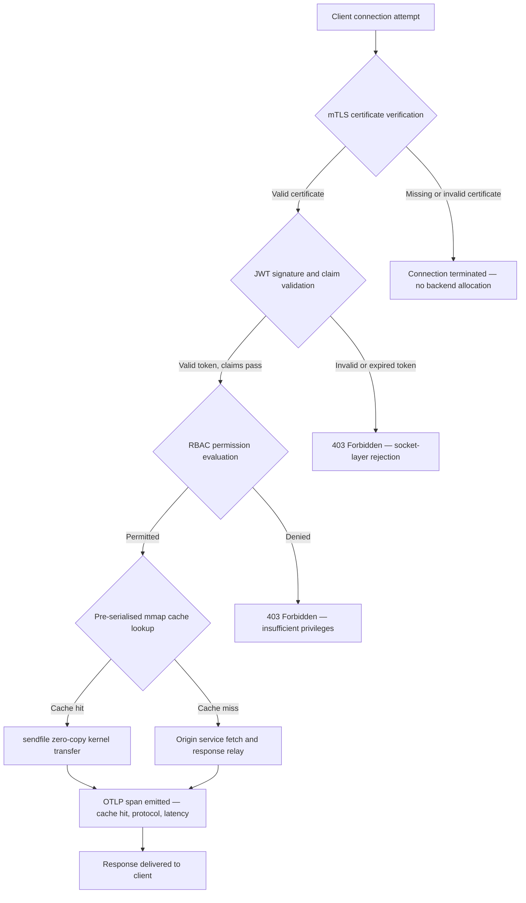

---

# Front Matter (YAML)

author: "contact@sebastienrousseau.com (Sebastien Rousseau)"
banner_alt: "Абстрактний нічний міський пейзаж на друкованій платі — візуалізація банківського периметра, де передачі zero-copy на рівні ядра, рукостискання mTLS та валідація JWT зходяться в одному статично скомпільованому бінарному файлі"
banner_height: "1597"
banner_width: "2584"
banner: "https://cloudcdn.pro/stocks/images/bit-cloud-GlqbGLCPnQ4.webp"
cdn: "https://cloudcdn.pro"
charset: "UTF-8"
cname: "sebastienrousseau.com"
copyright: "© Copyright 2025 - 2026 - Sebastien Rousseau. All rights reserved."
date: "June 20, 2026"
description: "http-handle — це статично скомпільований бінарний файл Rust, який забезпечує 180 000 запитів на секунду на банківському периметрі з нульовими залежностями від середовища виконання, інтегрованою перевіркою mTLS і JWT, HTTP/2 та HTTP/3 з узгодженням ALPN та спостережуваністю OTLP — закриваючи прогалини в безпеці та стійкості, які залишають Nginx і Envoy."
format-detection: "telephone=no"
hreflang: "uk"
icon: "https://cloudcdn.pro/clients/sebastienrousseau/v1/logos/sebastienrousseau.svg"
id: "https://sebastienrousseau.com/2026-06-20-http-handle-zero-dependency-edge-ingress-banking-rust-2026"
image_alt: "Чорно-біле портретне фото Себастьєна Руссо"
image_height: "162"
image_width: "162"
image: "https://cloudcdn.pro/stocks/images/sebastienrousseau.webp"
keywords: "http-handle, Rust edge ingress, проксі без залежностей, банківська інфраструктура, mTLS JWT, sendfile zero-copy, ALPN HTTP3, відповідність DORA, Базель III, спостережуваність OTLP, статичний бінарний файл, ARM64 банкінг, zero trust банкінг, легкий ingress, безпека банківських систем Rust"
language: "uk-UA"
last_reviewed: "2026-06-20"
layout: "report"
locale: "uk_UA"
logo_alt: "Логотип Себастьєна Руссо"
logo_height: "44"
logo_width: "44"
logo: "https://cloudcdn.pro/clients/sebastienrousseau/v1/logos/sebastienrousseau.svg"
menu: ""
measurementID: "G-169G4ET5HQ"
name: "Sebastien Rousseau"
permalink: "https://sebastienrousseau.com/2026-06-20-http-handle-zero-dependency-edge-ingress-banking-rust-2026"
rating: "general"
referrer: "no-referrer"
robots: "index, follow"
schema: "FAQPage, Article"
seo_title: "http-handle: Ingress Rust без залежностей для банкінгу при 180k запитів/с"
short_name: "sebastienrousseau"
subtitle: "Як один статично скомпільований бінарний файл Rust забезпечує 180 000 запитів на секунду з mTLS, JWT та ALPN на банківському периметрі — і що це означає для відповідності DORA та Базелю III."
tags: "http-handle, Rust, banking, edge-ingress, mTLS, JWT, ALPN, HTTP3, DORA, Basel-III, zero-copy, sendfile, ARM64, zero-trust, OTLP, observability, open-source, infrastructure"
theme-color: "0, 83, 191"
title: "http-handle: Високопродуктивний Ingress Edge без Залежностей для Банкінгу у 2026"
url: "https://sebastienrousseau.com/2026-06-20-http-handle-zero-dependency-edge-ingress-banking-rust-2026"
viewport: "width=device-width, initial-scale=1, shrink-to-fit=no"

# RSS - The RSS feed front matter (YAML).
atom_link: "https://sebastienrousseau.com/2026-06-20-http-handle-zero-dependency-edge-ingress-banking-rust-2026/rss.xml"
category: "Technology"
docs: https://validator.w3.org/feed/docs/rss2.html
generator: "Static Site Generator (SSG) (version 0.0.40)"
item_description: "http-handle — це статично скомпільований бінарний файл Rust, який забезпечує 180 000 запитів на секунду на банківському периметрі з нульовими залежностями від середовища виконання, інтегрованою перевіркою mTLS і JWT, HTTP/2 та HTTP/3 з узгодженням ALPN та спостережуваністю OTLP — закриваючи прогалини в безпеці та стійкості, які залишають Nginx і Envoy."
item_guid: "https://sebastienrousseau.com/2026-06-20-http-handle-zero-dependency-edge-ingress-banking-rust-2026/rss.xml"
item_link: "https://sebastienrousseau.com/2026-06-20-http-handle-zero-dependency-edge-ingress-banking-rust-2026/rss.xml"
item_pub_date: "Sat, 20 Jun 2026 07:07:07 +0000"
item_title: "http-handle: Високопродуктивний Ingress Edge без Залежностей для Банкінгу у 2026"
last_build_date: "Sat, 20 Jun 2026 07:07:07 +0000"
managing_editor: "contact@sebastienrousseau.com (Sebastien Rousseau)"
pub_date: "Sat, 20 Jun 2026 07:07:07 +0000"
ttl: "60"
type: "article"
webmaster: "contact@sebastienrousseau.com"

# Apple - The Apple front matter (YAML).
apple_mobile_web_app_orientations: "portrait"
apple_touch_icon_sizes: "192x192"
apple-mobile-web-app-capable: "yes"
apple-mobile-web-app-status-bar-inset: "black"
apple-mobile-web-app-status-bar-style: "black-translucent"
apple-mobile-web-app-title: "Банківський периметр без залежностей"
apple-touch-fullscreen: "yes"

# MS Application - The MS Application front matter (YAML).

msapplication-navbutton-color: "0, 83, 191"

# Twitter Card - The Twitter Card front matter (YAML).

twitter_card: "summary_large_image"
twitter_creator: "@wwdseb"
twitter_description: "http-handle — це статично скомпільований бінарний файл Rust, який забезпечує 180 000 запитів на секунду на банківському периметрі з нульовими залежностями від середовища виконання, mTLS, JWT та спостережуваністю OTLP."
twitter_image: "https://cloudcdn.pro/clients/sebastienrousseau/v1/logos/sebastienrousseau.svg"
twitter_image_alt: "Logo of Sebastien Rousseau"
twitter_site: "@wwdseb"
twitter_title: "http-handle: Ingress Rust без залежностей для банкінгу при 180k запитів/с"
twitter_url: "https://sebastienrousseau.com/2026-06-20-http-handle-zero-dependency-edge-ingress-banking-rust-2026"

# Humans.txt - The Humans.txt front matter (YAML).
author_website: "https://sebastienrousseau.com"
author_twitter: "@wwdseb"
author_location: "London, UK"
thanks: "Thanks for reading!"
site_last_updated: "2026-06-20"
site_standards: "HTML5, CSS3, RSS, Atom, JSON, XML, YAML, Markdown, TOML"
site_components: "Kaishi, Kaishi Builder, Kaishi CLI, Kaishi Templates, Kaishi Themes"
site_software: "Static Site Generator, Rust"

---

# http-handle: Високопродуктивний Ingress Edge без Залежностей для Банкінгу у 2026

<!-- lead-start -->
<aside class="post-lead" aria-label="Стислий зміст статті">

<strong>TL;DR.</strong> http-handle — це бінарний файл Rust з відкритим вихідним кодом, статично скомпільований, який замінює Nginx і Envoy на банківському периметрі. Він забезпечує 180 000 запитів на секунду на вузлах ARM64 через передачі zero-copy <code>sendfile(2)</code> Linux, застосовує mTLS і валідацію JWT на рівні мережевого сокета до запуску будь-якого коду застосунку, автоматично узгоджує HTTP/2 та HTTP/3 через ALPN і надсилає метрики OpenTelemetry нативно — все з нульовими залежностями від середовища виконання поза <code>libc</code>.

<strong>Ключові висновки</strong>

<ul class="post-lead-takeaways">
  <li><strong>Проблема важких проксі.</strong> Nginx і Envoy несуть дерева залежностей, які розширюють поверхню CVE і ускладнюють цикли усунення ризиків ІКТ відповідно до DORA.</li>
  <li><strong>Продуктивність zero-copy у масштабі.</strong> Попередньо серіалізовані блоки кешу mmap і передачі ядра <code>sendfile(2)</code> підтримують 180 000 запитів/с на ARM64 із затримкою проксі менше мілісекунди.</li>
  <li><strong>Безпека на рівні сокета, а не застосунку.</strong> Верифікація клієнтського сертифіката mTLS, валідація JWT і оцінка RBAC завершуються до того, як для запиту виділяється будь-який ресурс бекенду.</li>
  <li><strong>Вбудована відповідність регуляторним вимогам.</strong> Зменшена поверхня атаки та підлягаюче аудиту розгортання єдиного бінарного файлу безпосередньо відповідають статтям 5 і 6 DORA, операційному ризику Базелю III та ланцюжкам відповідальності SM&CR.</li>
</ul>

<strong>Пов'язане читання:</strong> <a href="https://sebastienrousseau.com/2026-06-18-noyalib-safe-yaml-rust-ai-mcp-financial-infrastructure-2026">Чому YAML потребує безпечнішого стека Rust для ШІ, MCP та фінансової інфраструктури у 2026</a>, <a href="https://sebastienrousseau.com/2026-06-11-cloudcdn-open-source-blueprint-ai-native-edge-2026">CloudCDN: Blueprint з відкритим вихідним кодом для нативного ШІ-периметра у 2026</a>, <a href="https://sebastienrousseau.com/2026-05-16-best-cloud-infrastructure-architecture-2026">Найкраща архітектура хмарної інфраструктури для банків та фінансових установ у 2026</a>.

</aside>
<!-- lead-end -->

Банківський периметр має проблему залежностей. Кожен екземпляр Nginx або Envoy, що маршрутизує трафік між клієнтом і основним банківським сервісом, несе дерево залежностей: збірки OpenSSL, модулі Lua, бібліотеки gRPC та шари контейнерів — кожен є потенційним CVE, кожен вимагає виділеного циклу виправлень, кожен додає варіабельність затримки, що ускладнює вимірювання SLA. В рамках [Регламенту про цифрову операційну стійкість (DORA)](https://eur-lex.europa.eu/eli/reg/2022/2554/oj) ця складність тепер є регуляторним зобов'язанням не менше, ніж операційним.

[http-handle](https://github.com/sebastienrousseau/http-handle) застосовує інший підхід. Це єдиний статично скомпільований бінарний файл Rust з нульовими залежностями від середовища виконання поза `libc`. Він забезпечує 180 000 запитів на секунду на вузлах ARM64, застосовує взаємний TLS і аутентифікацію JWT на рівні мережевого сокета та автоматично узгоджує HTTP/2 та HTTP/3 — все в межах розгортання з обсягом менше 20 МБ оперативної пам'яті.

## Коротка відповідь

**Що таке http-handle в одному реченні?** http-handle — це бінарний файл Rust з відкритим вихідним кодом, статично скомпільований, який замінює важкі контейнери проксі на банківському периметрі, забезпечуючи 180 000 запитів/с на ARM64 через передачі ядра zero-copy `sendfile(2)` Linux, застосовуючи mTLS, JWT та RBAC на рівні сокета до звернення до будь-яких ресурсів бекенду та надсилаючи нативні метрики [OpenTelemetry](https://opentelemetry.io/) — з нульовими залежностями від бібліотек середовища виконання поза `libc`.

## Резюме для керівництва

Банки використовують Nginx і Envoy на своєму периметрі протягом десяти років. Обидва функціональні; жоден не був розроблений для регуляторного середовища 2026 року. Образи контейнерів з великою кількістю залежностей генерують черги CVE, з якими команди з відповідності не можуть впоратися достатньо швидко, а кожне оновлення версії бібліотеки несе ризик регресії. Статті 5 і 6 DORA вимагають, щоб ризики ІКТ управлялися відповідно до дизайну, а не виправлялися після виявлення. Операційні риск-фреймворки Базелю III штрафують архітектури, в яких точки відмови множаться зі складністю системи.

http-handle усуває проблему залежностей у джерелі. Бінарний файл компілюється один раз, статично, без вимог до зовнішніх бібліотек під час виконання. Поверхня атаки скорочується до стандартної бібліотеки Rust плюс `libc`. Забезпечення безпеки — верифікація сертифікатів mTLS, валідація тверджень JWT та контроль доступу на основі ролей — виконується на мережевому сокеті до будь-якого виділення ресурсів бекенду, стискаючи периметр Zero Trust до найменшого можливого виразу. Продуктивність випливає з архітектури: попередньо серіалізовані блоки кешу з відображенням у пам'яті в поєднанні з передачами ядра `sendfile(2)` повністю виключають дані зі шляху копіювання ЦП-до-пам'яті, підтримуючи 180 000 запитів/с на апаратному забезпеченні ARM64. Результатом є рівень ingress, що відповідає вимогам стійкості DORA, підтримує аргументи зниження операційного ризику Базелю III та дає старшим ІТ-керівникам у рамках SM&CR перевірений ланцюжок відповідальності з одним компонентом для периметральної інфраструктури.

## Ключові висновки

- **Менші бінарні файли, менші черги CVE.** Єдиний статично скомпільований бінарний файл має один пакет для виправлення, один реліз для перевірки та один артефакт для аудиту. Nginx зі стандартним набором модулів постачається з більш ніж 30 залежностями від спільних бібліотек; кожна має власний життєвий цикл вразливості.
- **Zero-copy — не оптимізація, а конструктивне обмеження.** При 180 000 запитів/с будь-яке копіювання даних у просторі користувача вносить вимірювану варіабельність затримки. `sendfile(2)` передає вміст файлового дескриптора до мережевого сокета повністю в просторі ядра. У поєднанні з блоками кешу відповідей, закріпленими mmap, ЦП ніколи не торкається шляху даних для кешованих відповідей.
- **Периметр безпеки належить сокету.** Валідація JWT і сертифікатів mTLS у middleware застосунку означає, що бекенд вже виділив потоки та пам'ять до відхилення запиту. Валідація на рівні сокета гарантує, що неаутентифіковані запити взагалі не споживають ресурсів бекенду.
- **OTLP усуває прогалину в спостережуваності.** Нативна інтеграція OpenTelemetry означає, що кожен запит, кожне рішення про аутентифікацію та кожне узгодження протоколу виробляє структуровану телеметрію без агента-помічника. Існуючі банківські дашборди безпосередньо приймають трасування OTLP.

**Пов'язане читання:** [Чому YAML потребує безпечнішого стека Rust для ШІ, MCP та фінансової інфраструктури у 2026](https://sebastienrousseau.com/2026-06-18-noyalib-safe-yaml-rust-ai-mcp-financial-infrastructure-2026/), [CloudCDN: Blueprint з відкритим вихідним кодом для нативного ШІ-периметра у 2026](https://sebastienrousseau.com/2026-06-11-cloudcdn-open-source-blueprint-ai-native-edge-2026/), [Найкраща архітектура хмарної інфраструктури для банків та фінансових установ у 2026](https://sebastienrousseau.com/2026-05-16-best-cloud-infrastructure-architecture-2026/).

## 01. Проблема важких проксі в банкінгу

Nginx і Envoy побудували периметр сучасного інтернету. Вони налаштовувані, перевірені в бойових умовах і підтримуються великими спільнотами. Вони також є архітектурними рішеннями, прийнятими до того, як з'явився DORA, до того, як операційні риск-фреймворки Базелю III зажадали кількісного зниження складності, і до того, як хмарні вузли ARM64 змінили економіку високопродуктивних обчислень.

Практичним наслідком є розрив між тим, що потрібно банкам, і тим, що забезпечують важкі контейнери проксі.

**Поверхня залежностей.** Стандартне розгортання Envoy включає OpenSSL, Abseil, Protobuf, gRPC, Lua і десятки вторинних бібліотек. Кожна має незалежний життєвий цикл CVE. Коли National Vulnerability Database публікує критичне попередження для OpenSSL, кожен екземпляр Envoy в інфраструктурі стає годинником відповідності: оцініть, виправте, протестуйте, повторно розгорніть і повторно сертифікуйте — у кожному середовищі, де працює бінарний файл. Згідно зі статтею 6 DORA банки повинні демонструвати, що процеси управління ризиками ІКТ є пропорційними, задокументованими та верифікованими. Дерево залежностей із кількох бібліотек робить це доведення дорогим в обслуговуванні.

**Накладні витрати пам'яті.** Мінімально налаштований робочий процес Nginx споживає 40–80 МБ резидентної пам'яті при помірному навантаженні. У масштабі — сотні вузлів ingress у торговельних системах, платіжних API та клієнтських порталах — ці накладні витрати накопичуються у вимірювану вартість інфраструктури без відповідної переваги в продуктивності порівняно з добре спроектованою альтернативою з єдиним бінарним файлом.

**Швидкість виправлень.** Ланцюжки постачання образів контейнерів вводять багатоденну затримку між публікацією CVE і надходженням перевіреного виправлення у виробництво. Базовий образ повинен бути перебудований, шар застосунку перекладений, повна матриця тестів повторно запущена та конвейєр розгортання повторно виконаний. Для критичних банківських систем, що працюють у межах вікон звітності про інциденти DORA, цей цикл є структурним ризиком.

http-handle вирішує всі три. Один бінарний файл. Одна поверхня CVE. Один артефакт для виправлення. Менше 20 МБ оперативної пам'яті для виробничого вузла ingress.

## 02. Архітектурна лінза http-handle 2026

Бінарний файл структурований як п'ять взаємозалежних рівнів, кожен з яких розроблений для усунення конкретної категорії ризику, що накопичується традиційними архітектурами проксі.

### Таблиця 1: Архітектурні рівні http-handle та пом'якшення ризиків

| Рівень | Проектне рішення | Чому це важливо | Ризик при неналежному управлінні |
| ---- | ---- | ---- | ---- |
| **Ядро сервера** | Єдиний бінарний файл Rust, статично скомпільований, нульові залежності поза `libc` | Один артефакт для виправлення; усуває поширення CVE бібліотек по всій інфраструктурі | Атаки dependency confusion; накопичення вразливостей бібліотек |
| **Двигун прискорення** | Попередньо серіалізовані блоки кешу mmap і передачі ядра zero-copy `sendfile(2)` | 180 000 запитів/с на ARM64 із затримкою проксі менше мілісекунди; жодні дані не потрапляють у простір користувача для кешованих відповідей | Витоки відображення пам'яті; вузькі місця в просторі ядра при інвалідації кешу |
| **Криптографічна безпека** | Нативний mTLS з підтримкою гарячого перезавантаження сертифікатів і узгодженням ALPN | Гарантує цілісність даних і сумісність протоколів; ротація сертифікатів без втрати з'єднань | Закінчення терміну дії сертифіката, що спричиняє перебої в роботі сервісу; слабкі стандартні набори шифрів |
| **Площина політики доступу** | Валідація JWT на рівні сокета і оцінка тверджень RBAC | Неаутентифіковані запити не споживають ресурсів бекенду; Zero Trust застосовується на межі ядра | Атаки плутанини алгоритмів JWT; неправильна конфігурація RBAC, що надає надмірні привілеї |
| **Спостережуваність** | Нативна інтеграція [OpenTelemetry (OTLP)](https://opentelemetry.io/docs/specs/otlp/) | Структурована телеметрія без агентів-помічників; пряме надходження в існуючі банківські системи моніторингу | Сліпі плями під час збоїв; неповні аудиторські сліди для звітності про інциденти DORA |

## 03. Ключові сигнали продуктивності та безпеки

Банки, що експлуатують http-handle на периметрі, повинні інструментувати п'ять кількісно вимірюваних сигналів для виконання вимог операційної звітності DORA та внутрішнього управління SLA.

### Таблиця 2: Операційні орієнтири та нормативні посилання

| Сигнал | Орієнтир | Нормативне посилання | Технічна реалізація |
| ---- | ---- | ---- | ---- |
| **Пропускна здатність** | ≥ 180 000 запитів/с на вузлах ARM64 при P99 ≤ 1 мс накладних витрат проксі | Операційний ризик Базелю III — зниження складності системи | `sendfile(2)` + попередньо серіалізовані блоки кешу mmap; без копіювання даних у просторі користувача для кеш-попадань |
| **Поверхня атаки** | Нульові залежності від бібліотек середовища виконання; один бінарний артефакт на реліз | [Стаття 6 DORA](https://eur-lex.europa.eu/eli/reg/2022/2554/oj) — управління ризиками ІКТ відповідно до дизайну | Статична компіляція з `cargo build --release --target aarch64-unknown-linux-musl` |
| **Затримка аутентифікації** | Рукостискання mTLS + валідація JWT завершені до першого байта відповіді бекенду | [Стаття 5 DORA](https://eur-lex.europa.eu/eli/reg/2022/2554/oj) — захист безпеки ІКТ | Перехоплення на рівні сокета; оцінка тверджень JWT у Rust, суміжному з ядром, до маршрутизації бекенду |
| **Доступність сертифікатів** | Гаряче перезавантаження сертифікатів mTLS з нульовою кількістю втрачених з'єднань під час ротації | Відповідальність вищого керівництва SM&CR за доступність периметра | Спостерігач сертифікатів на основі inotify; атомарна заміна файлового дескриптора під час перезавантаження |
| **Охоплення спостережуваності** | 100% запитів, що генерують спани OTLP з результатом аутентифікації, версією протоколу та статусом кешу | Стаття 17 DORA — виявлення інцидентів і звітність | Нативний експортер OTLP; агент-помічник не потрібен; транспорт gRPC або HTTP/Protobuf налаштовується |

## 04. Двигун zero-copy: mmap і sendfile(2)

Мережева продуктивність у високочастотному банкінгу — платежі в реальному часі, API ринкових даних, сервіси токенів аутентифікації — обмежується одним обмеженням більше, ніж будь-яким іншим: вартістю переміщення байтів зі сховища до мережевого сокета.

Звичайні HTTP-сервери зчитують вміст файлу у буфер простору користувача, а потім записують цей буфер у сокет. Ця послідовність вимагає двох копіювань пам'яті та двох перемикань контексту між простором користувача і простором ядра для кожної відповіді. При 180 000 запитах на секунду накопичені накладні витрати суттєві.

http-handle усуває обидві копії.

**Блоки кешу з відображенням у пам'яті.** При запуску сервіс серіалізує статичний вміст відповідей у регіони з відображенням у пам'яті за допомогою `mmap(2)`. Ці регіони закріплені в кеші сторінок ядра. Коли надходить запит до кешованого ресурсу, відповідь вже відображена в пам'яті ядра — без читання з диска, без виділення буфера.

**Передача ядра `sendfile(2)`.** Системний виклик Linux `sendfile(2)` передає дані безпосередньо з файлового дескриптора — або регіону з відображенням у пам'яті — до файлового дескриптора мережевого сокета, повністю в ядрі. Жоден байт не потрапляє у простір користувача. Роль ЦП зводиться до видачі системного виклику та обробки події завершення. На вузлах ARM64 з цією архітектурою http-handle підтримує 180 000 запитів/с із затримкою проксі менше мілісекунди при стійкому навантаженні.

Для банків, що виконують пакетне звірення наприкінці місяця, внутрішньоденну звітність про ліквідність або трафік API оцінки шахрайства в реальному часі, інженерний наслідок є безпосереднім: менше вузлів ARM64 на рівень трафіку, нижча вартість інфраструктури та менший ризик стійкості DORA через нестачу потужностей.

## 05. Площина політики доступу mTLS і JWT

У банкінгу аутентифікація на периметрі — не функція, а регуляторна вимога. DORA вимагає, щоб засоби контролю безпеки ІКТ були пропорційними, задокументованими та верифікованими. SM&CR покладає особисту відповідальність за рішення в галузі безпеки інфраструктури на поіменно призначених старших менеджерів. Питання не в тому, чи аутентифікувати на периметрі, а на якому рівні.

http-handle застосовує трирівневу політику Zero Trust до виділення будь-яких ресурсів бекенду.

**Етап 1: Верифікація клієнтського сертифіката mTLS.** Під час рукостискання TLS http-handle запитує і перевіряє клієнтський сертифікат відносно налаштовуваного сховища довіри. З'єднання без дійсного сертифіката завершуються на рукостисканні. Жоден потік застосунку не створюється, жоден пул пам'яті не виділяється. Бекенд ніколи не бачить запиту.

**Етап 2: Валідація тверджень JWT.** Для з'єднань, що пройшли mTLS, http-handle витягує та перевіряє JSON Web Token із заголовка `Authorization` на рівні сокета. Верифікація підпису, перевірки терміну дії та валідація видавця відбуваються до того, як запит досягає рівня маршрутизації. Атаки плутанини алгоритмів — де сервер приймає симетричний алгоритм при очікуваному асиметричному ключі — блокуються явним переліком дозволених алгоритмів у конфігурації.

**Етап 3: Оцінка тверджень RBAC.** Перевірені твердження JWT зіставляються з таблицею ролей в пам'яті. Запити з недостатніми дозволами отримують відповідь 403 на площині політики доступу. Сервіс бекенду ніколи не викликається для неавторизованого трафіку.

Це впорядкування має операційне значення. За традиційної моделі — де аутентифікація виконується в middleware застосунку — зловмисник може вичерпати пули потоків бекенду неаутентифікованими запитами до видачі єдиної відмови. Аутентифікація на рівні сокета повністю усуває цей вектор атаки.

## 06. Маршрутизація ALPN і ланцюжок резервного перемикання HTTP/3

Банківський трафік надходить у різноманітних мережевих умовах: корпоративна оптика для торгових столів, 5G для клієнтів мобільного банкінгу, супутниковий зв'язок для віддалених операцій та проксі-сервери інспекції TLS в регульованих середовищах. Ingress з єдиним протоколом створює обмеження найменшого спільного знаменника.

http-handle використовує [Application-Layer Protocol Negotiation (ALPN)](https://www.rfc-editor.org/rfc/rfc7301) для автоматичного вибору оптимального протоколу для кожного з'єднання.

**HTTP/2** є стандартним для трафіку браузерів і API через TCP. Мультиплексовані потоки через єдине з'єднання усувають блокування head-of-line, яке HTTP/1.1 вводить при паралельних шаблонах запитів.

**HTTP/3 (QUIC)** активується, коли мережа підтримує UDP і клієнт оголошує `h3` у своєму розширенні ALPN. Незалежне мультиплексування потоків та міграція з'єднань QUIC роблять його матеріально кращим для клієнтів мобільного банкінгу в перевантажених мобільних мережах, де TCP-з'єднання часто розриваються та відновлюються.

**Плавне резервне перемикання.** Якщо узгодження ALPN не вдається — тому що проміжний проксі видаляє розширення або застарілий клієнт його опускає — http-handle повертається до HTTP/1.1, зберігаючи всі заголовки безпеки, застосування mTLS та валідацію JWT. Жодна властивість безпеки не деградує під час резервного перемикання протоколу.

## 07. Життєвий цикл запиту zero-copy

Наступна діаграма показує повний шлях запиту від з'єднання клієнта до доставки відповіді, включаючи ворота аутентифікації та точки випромінювання даних спостережуваності.

Критичний шлях для відповідей при кеш-попаданні проходить через три ворота безпеки та один системний виклик. Жоден буфер простору користувача не виділяється для тіла відповіді. Спан OTLP фіксує результат аутентифікації, узгоджену через ALPN версію протоколу, статус кешу та наскрізну затримку в одному структурованому записі.

## 08. Відповідність регуляторним вимогам: DORA, Базель III та SM&CR

### Статті 5 і 6 DORA — Управління ризиками ІКТ та захист

[Стаття 5 DORA](https://eur-lex.europa.eu/eli/reg/2022/2554/oj) вимагає від фінансових організацій підтримки рамок управління ризиками ІКТ. Стаття 6 вимагає від них впровадження заходів захисту та запобігання, пропорційних профілю ризику їхніх систем ІКТ.

Єдиний статично скомпільований бінарний файл задовольняє обом вимогам ефективніше, ніж стек контейнерів із кількох бібліотек. Поверхня атаки є кількісно вимірюваною — один артефакт, одна залежність (`libc`), одна поверхня CVE — а заходи захисту є структурними, а не процедурними: застосування mTLS і JWT не може бути обійдене неправильною конфігурацією, оскільки вони виконуються на рівні сокета до запуску будь-якої налаштовуваної логіки застосунку.

### Базель III — Вимоги до капіталу на покриття операційного ризику

[Рамка операційного ризику Базелю III](https://www.bis.org/bcbs/basel3.htm) пов'язує регуляторні вимоги до капіталу з доведеним зниженням ризику. Банки, які можуть задокументувати вимірюване зниження складності системи та кількості точок відмови ІКТ, мають кількісно вимірюваний аргумент на користь зниження розподілу капіталу на операційний ризик. Заміна інфраструктури проксі з кількох контейнерів на вузли ingress з єдиним бінарним файлом — це саме той тип зниження складності, який підтримує цей аргумент — за умови, що інженерна команда може надати документацію-атестацію.

Підлягаючі аудиту артефакти релізу http-handle — відтворювані збірки, сумісні з SBOM маніфести залежностей та операційні журнали на основі OTLP — підтримують ланцюжок документації, якого потребують обговорення капіталу в рамках Базелю III.

### SM&CR — Відповідальність старшого менеджера

[Senior Managers and Certification Regime (SM&CR)](https://www.fca.org.uk/firms/senior-managers-certification-regime) покладає особисту відповідальність на поіменно призначених старших менеджерів за стан безпеки ІКТ систем під їхньою відповідальністю. Ingress з єдиним бінарним файлом, що гаряче перезавантажує сертифікати без перебоїв у роботі сервісу, генерує структуровані аудиторські журнали через OTLP та має один версійний артефакт на розгортання, дає поіменно призначеному старшому менеджеру верифікований, документований ланцюжок безпеки. Стек контейнерів із кількох бібліотек цього не забезпечує.

## 09. Що це означає за ролями

### Рада директорів та генеральні директори

Оптимізація регуляторного капіталу в рамках операційних риск-фреймворків Базелю III залежить від доведеного зниження складності. Заміна Nginx або Envoy єдиним статично скомпільованим бінарним файлом зменшує кількість точок відмови ІКТ у спосіб, що підлягає аудиту та може бути представлений пруденційним регуляторам. Зменшена поверхня CVE також підтримує перегляд премій кіберстрахування — страховики встановлюють ціни на основі вимірюваних показників поверхні атаки, а бінарний файл ingress з однією залежністю є конкретною точкою даних.

### Директори з інформаційної безпеки та директори з ризиків

Відповідність DORA вимагає, щоб заходи захисту ІКТ були пропорційними та верифікованими. Застосування mTLS і JWT на рівні сокета забезпечує верифіковані, не піддатні обходу ворота аутентифікації на периметрі. Гаряча ротація сертифікатів усуває ризик сервісного вікна, який несуть традиційні оновлення сертифікатів. Модель компіляції без залежностей означає, що коли публікується критичне попередження для `libc`, вся інфраструктура може бути перебудована, протестована та повторно розгорнута з єдиного вихідного артефакту Rust за години, а не дні.

### Інженерія та управління ІТ

180 000 запитів/с на стандартному вузлі ARM64 змінює розмову про масштабування інфраструктури для платіжних API та сервісів аутентифікації. Нативна інтеграція OTLP усуває потребу в експортерах Prometheus, агентах-помічниках або користувацьких відправниках журналів. Модель розгортання Kubernetes — стандартний под менше 20 МБ оперативної пам'яті, без привілейованих дозволів контейнера, без доступу до мережі хоста. Гаряче перезавантаження сертифікатів працює без накладних витрат на поступовий перезапуск Kubernetes.

## FAQ

**Як http-handle обробляє ротацію сертифікатів під навантаженням?**
Бінарний файл відстежує шляхи файлів сертифікатів за допомогою спостерігача inotify. При виявленні нових файлів сертифіката та ключа він виконує атомарну заміну активного TLS-контексту — існуючі з'єднання завершуються з використанням попереднього сертифіката, тоді як нові з'єднання негайно використовують ротований. Жодне з'єднання не втрачається. Сервісне вікно не потрібне.

**Чи може http-handle працювати всередині кластера Kubernetes як контролер ingress?**
Так. Бінарний файл запускається як самостійний под зі стандартною анотацією сервісу ingress. Вимоги до ресурсів — менше 20 МБ оперативної пам'яті при повній пропускній здатності, без привілейованих дозволів контейнера та без вимоги доступу до мережі хоста. Він також може запускатися як помічник у сервісних мережах, де застосування mTLS на рівні помічника є кращим за централізовану аутентифікацію шлюзу.

**Який вимірюваний внесок затримки самого проксі?**
Для відповідей при кеш-попаданні накладні витрати проксі — від прийняття сокета до завершення `sendfile(2)` — становлять менше мілісекунди на апаратному забезпеченні ARM64. Для відповідей при кеш-промаху, що вимагають отримання від джерела, накладні витрати — це те ж саме число менше мілісекунди плюс час відповіді джерела. Сам проксі не додає затримку черги, оскільки аутентифікація відбувається синхронно на рівні сокета без виділення пулу потоків до завершення перевірки облікових даних.

**Як http-handle вписується в архітектуру Zero Trust поряд з існуючим API-шлюзом?**
http-handle працює на межі рівнів OSI 4/7: він застосовує mTLS транспортного рівня та валідує JWT застосункового рівня до маршрутизації до upstream-сервісів. Він може розташовуватися перед повноцінним API-шлюзом — поглинаючи неаутентифікований трафік до його надходження до дорожчого рівня обробки шлюзу — або повністю замінювати шлюз для сервісів, політика доступу яких повністю виражається у твердженнях JWT.

**Чи є бінарний вивід відтворюваним для цілей аудиту ланцюжка постачання?**
Так. Збірка є відтворюваною з зафіксованою версією інструментального ланцюжка Rust і заблокованим `Cargo.lock`. Генерація SBOM через `cargo cyclonedx` виробляє сумісний з CycloneDX перелік матеріалів для кожного релізу. Обидва артефакти можуть бути опубліковані у внутрішньому інструментальному ланцюжку аналізу складу програмного забезпечення банку і задовольняють вимоги документації ризиків ланцюжка постачання DORA.

## Висновок

Банківський периметр не потребує більше функцій — він потребує менше компонентів, кожен з яких робить менше і робить це верифіковано. http-handle зводить рівень ingress до його нескоротного мінімуму: єдиний бінарний файл Rust, що застосовує аутентифікацію на сокеті, передає дані без їх копіювання та звітує про все, що робить, у структурованій телеметрії. Для банків, що навігують у часових рамках відповідності DORA, оглядах оптимізації капіталу Базелю III та вимогах відповідальності SM&CR, ця простота — не інженерна перевага, а регуляторний аргумент.

[Вихідний код http-handle](https://github.com/sebastienrousseau/http-handle) доступний за подвійною ліцензією MIT і Apache 2.0.

---

*Посилання*

Basel Committee on Banking Supervision (2011). *Basel III: A global regulatory framework for more resilient banks and banking systems*. Bank for International Settlements. Available at: [https://www.bis.org/publ/bcbs189.pdf](https://www.bis.org/publ/bcbs189.pdf)

European Parliament and Council (2022). Regulation (EU) 2022/2554 on digital operational resilience for the financial sector (DORA). Available at: [https://eur-lex.europa.eu/legal-content/EN/TXT/?uri=CELEX:32022R2554](https://eur-lex.europa.eu/legal-content/EN/TXT/?uri=CELEX:32022R2554)

Financial Conduct Authority (2015). *Senior Managers and Certification Regime (SM&CR)*. Available at: [https://www.fca.org.uk/firms/senior-managers-certification-regime](https://www.fca.org.uk/firms/senior-managers-certification-regime)

Internet Engineering Task Force (2014). *RFC 7301: Transport Layer Security (TLS) Application-Layer Protocol Negotiation Extension*. Available at: [https://www.rfc-editor.org/rfc/rfc7301](https://www.rfc-editor.org/rfc/rfc7301)

OpenTelemetry Authors (2024). *OpenTelemetry Protocol Specification (OTLP)*. Available at: [https://opentelemetry.io/docs/specs/otlp/](https://opentelemetry.io/docs/specs/otlp/)
