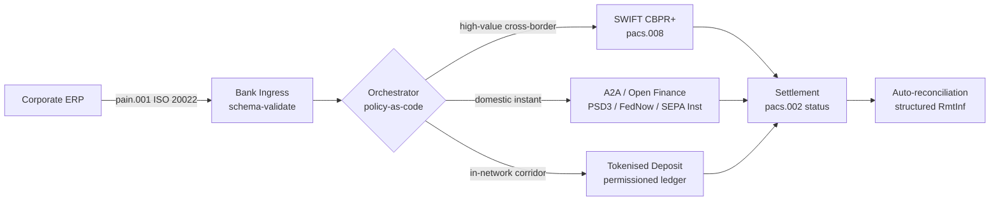

---

# Front Matter (YAML)

author: "contact@sebastienrousseau.com (Sebastien Rousseau)"
banner_alt: "Контейнеровоз у глибоководному порту на світанку — символізує мультирейкове транскордонне переміщення корпоративної вартості через ISO 20022, відкриті фінанси та мережі розрахунків токенізованих депозитів у 2026"
banner_height: "1597"
banner_width: "2584"
banner: "https://cloudcdn.pro/stocks/images/viktor-forgacs-KxVRDiFdTVo.webp"
cdn: "https://cloudcdn.pro"
charset: "UTF-8"
cname: "sebastienrousseau.com"
copyright: "© Copyright 2025 - 2026 - Sebastien Rousseau. All rights reserved."
date: "June 24, 2026"
description: "Як ISO 20022, A2A, відкриті фінанси за PSD3/FiDA та токенізовані депозити перебудовують транскордонне корпоративне казначейство поряд зі SWIFT у 2026."
format-detection: "telephone=no"
hreflang: "uk"
icon: "https://cloudcdn.pro/clients/sebastienrousseau/v1/logos/sebastienrousseau.svg"
id: "https://sebastienrousseau.com/2026-06-24-cross-border-iso-20022-open-finance-tokenised-deposits-treasury-2026"
image_alt: "Чорно-білий портрет Себастьяна Руссо"
image_height: "162"
image_width: "162"
image: "https://cloudcdn.pro/stocks/images/sebastienrousseau.webp"
keywords: "транскордонні платежі, ISO 20022, відкриті фінанси, PSD3, FiDA, токенізовані депозити, стейблкоїни, A2A, казначейство, CIB, Nexi, Mastercard, мультирейк, pacs.008, pain.001, SWIFT, FedNow, SEPA Instant, RTP, CBPR+"
language: "uk-UA"
last_reviewed: "2026-06-24"
layout: "report"
locale: "uk_UA"
logo_alt: "Логотип Себастьяна Руссо"
logo_height: "44"
logo_width: "44"
logo: "https://cloudcdn.pro/clients/sebastienrousseau/v1/logos/sebastienrousseau.svg"
menu: ""
measurementID: "G-169G4ET5HQ"
name: "Sebastien Rousseau"
permalink: "https://sebastienrousseau.com/2026-06-24-cross-border-iso-20022-open-finance-tokenised-deposits-treasury-2026"
rating: "general"
referrer: "no-referrer"
robots: "index, follow"
schema: "FAQPage, Article"
seo_title: "Транскордон 2026: ISO 20022, відкриті фінанси, токен-рейки"
short_name: "sebastienrousseau"
subtitle: "Транскордонне корпоративне казначейство у 2026 працює на мультирейковій механіці — ISO 20022 як спільна граматика, A2A та відкриті фінанси як клієнтський рейк, токенізовані депозити як оптова розрахункова ланка, а SWIFT досі утримує довгий хвіст."
tags: "транскордонні платежі, ISO 20022, відкриті фінанси, PSD3, FiDA, токенізовані депозити, A2A, казначейство, CIB, мультирейк, pacs.008, pain.001, SWIFT, FedNow, SEPA Instant, RTP, CBPR+"
theme-color: "0, 83, 191"
title: "Транскордон 2026: ISO 20022, відкриті фінанси та токенізовані депозити у корпоративному казначействі"
url: "https://sebastienrousseau.com/2026-06-24-cross-border-iso-20022-open-finance-tokenised-deposits-treasury-2026"
viewport: "width=device-width, initial-scale=1, shrink-to-fit=no"

# RSS - The RSS feed front matter (YAML).
atom_link: "https://sebastienrousseau.com/2026-06-24-cross-border-iso-20022-open-finance-tokenised-deposits-treasury-2026/rss.xml"
category: "Technology"
docs: https://validator.w3.org/feed/docs/rss2.html
generator: "Static Site Generator (SSG) (version 0.0.26)"
item_description: "Як ISO 20022, A2A, відкриті фінанси за PSD3/FiDA та токенізовані депозити перебудовують транскордонне корпоративне казначейство поряд зі SWIFT у 2026."
item_guid: "https://sebastienrousseau.com/2026-06-24-cross-border-iso-20022-open-finance-tokenised-deposits-treasury-2026/rss.xml"
item_link: "https://sebastienrousseau.com/2026-06-24-cross-border-iso-20022-open-finance-tokenised-deposits-treasury-2026/rss.xml"
item_pub_date: "Wed, 24 Jun 2026 07:07:07 +0000"
item_title: "Транскордон 2026: ISO 20022, відкриті фінанси та токенізовані депозити у корпоративному казначействі"
last_build_date: "Wed, 24 Jun 2026 06:06:06 +0000"
managing_editor: "contact@sebastienrousseau.com (Sebastien Rousseau)"
pub_date: "Wed, 24 Jun 2026 07:07:07 +0000"
ttl: "60"
type: "article"
webmaster: "contact@sebastienrousseau.com"

# Apple - The Apple front matter (YAML).
apple_mobile_web_app_orientations: "portrait"
apple_touch_icon_sizes: "192x192"
apple-mobile-web-app-capable: "yes"
apple-mobile-web-app-status-bar-inset: "black"
apple-mobile-web-app-status-bar-style: "black-translucent"
apple-mobile-web-app-title: "Транскордон 2026: ISO 20022, відкриті фінанси, токен-рейки"
apple-touch-fullscreen: "yes"

# MS Application - The MS Application front matter (YAML).

msapplication-navbutton-color: "0, 83, 191"

# Twitter Card - The Twitter Card front matter (YAML).

twitter_card: "summary_large_image"
twitter_creator: "@wwdseb"
twitter_description: "Як ISO 20022, A2A, відкриті фінанси за PSD3/FiDA та токенізовані депозити перебудовують транскордонне корпоративне казначейство поряд зі SWIFT у 2026."
twitter_image: "https://cloudcdn.pro/clients/sebastienrousseau/v1/logos/sebastienrousseau.svg"
twitter_image_alt: "Логотип Себастьяна Руссо"
twitter_site: "@wwdseb"
twitter_title: "Транскордон 2026: ISO 20022, відкриті фінанси, токен-рейки"
twitter_url: "https://sebastienrousseau.com/2026-06-24-cross-border-iso-20022-open-finance-tokenised-deposits-treasury-2026"

excerpt: "Транскордонне корпоративне казначейство у 2026 — це мультирейкова інженерна задача. ISO 20022 — спільна граматика, A2A та відкриті фінанси за PSD3/FiDA — клієнтський рейк, токенізовані депозити несуть оптову розрахункову ланку, а SWIFT досі утримує довгий хвіст. Цікава робота — в шарі оркестрації, не в моделі."

# Humans.txt - The Humans.txt front matter (YAML).
author_website: "https://sebastienrousseau.com"
author_twitter: "@wwdseb"
author_location: "London, UK"
thanks: "Дякуємо за прочитання!"
site_last_updated: "2026-06-24"
site_standards: "HTML5, CSS3, RSS, Atom, JSON, XML, YAML, Markdown, TOML"
site_components: "Kaishi, Kaishi Builder, Kaishi CLI, Kaishi Templates, Kaishi Themes"
site_software: "Static Site Generator, Rust"

---

# Транскордон 2026: ISO 20022, відкриті фінанси та токенізовані депозити у корпоративному казначействі

<!-- lead-start -->
<aside class="post-lead" aria-label="Article summary">

<strong>TL;DR.</strong> Транскордонне корпоративне казначейство у 2026 працює на чотирьох рейках паралельно — SWIFT CBPR+, миттєвий A2A за PSD3/FiDA, токенізовані депозити та стейблкоїн-рейки — зшитих ISO 20022 як спільною граматикою. Робота для команд CIB і корпоративного казначейства — це оркестрація, а не вибір рейка.

<strong>Ключові висновки</strong>

<ul class="post-lead-takeaways">
  <li><strong>Мультирейк — це дефолт.</strong> Жоден окремий рейк не клірить кожен коридор, кожен розмір тікета, кожен cut-off. Казначейство обирає рейк на платіж, а не на банк.</li>
  <li><strong>ISO 20022 — це лінгва франка.</strong> pacs.008, pacs.009 і pain.001 тепер несуть дані ремітансу через RTGS, миттєві, A2A та рейки токенізованих депозитів — роблячи рішення з маршрутизації керованими даними, а не прив'язаними до рейка.</li>
  <li><strong>Відкриті фінанси розширюють периметр.</strong> PSD3 та FiDA штовхають модель відкритого банкінгу у пенсії, страхування та казначейські дані; Nexi та Mastercard будують шар оркестрації, який споживають корпорати.</li>
  <li><strong>Токенізовані депозити — це оптова ланка.</strong> Токенізовані депозити, емітовані банками, та інтегровані стейблкоїн-рейки сидять під клієнтським миттєвим рейком і розраховують оптову ланку у близькому до T+0.</li>
</ul>

<strong>Дотичні матеріали:</strong> <a href="https://sebastienrousseau.com/2026-06-07-autonomous-treasury-index-programmable-liquidity-tokenised-deposits-2026">Індекс автономного казначейства 2026: програмована ліквідність і токенізовані депозити</a>, <a href="https://sebastienrousseau.com/2026-06-15-pacs008-automation-iso-20022-interbank-payments-2026">Автоматизація pacs.008: міжбанківські платежі ISO 20022 у 2026</a>.

</aside>
<!-- lead-end -->

> **Виконавче резюме.** Транскордонне корпоративне казначейство у 2026-му — це мультирейкова інженерна задача, перш ніж стати задачею управління відносинами. PSD3 і регламент Financial Data Access (FiDA) розширюють периметр відкритого банкінгу на корпоративні казначейські дані; перехід SWIFT MT/MX у листопаді 2026-го робить pacs.008, сумісний з CBPR+, єдиним життєздатним форматом для транскордонного міжбанківського обміну; токенізовані депозити та регульовані стейблкоїн-рейки несуть оптову розрахункову ланку у близькому до T+0 всередині пермісованих мереж. CIB, що перемагає в цьому циклі, — не той, що обирає один рейк; це той, що проєктує шар оркестрації, який їх зв'язує. Ця стаття проходить чотирирейковою архітектурою (A2A за PSD3, SWIFT CBPR+, токенізовані депозити, емітовані банками, регульовані стейблкоїни) — що кожен рейк робить добре, де лежать межі кредитної експозиції, і що шар оркестрації на основі політики-як-коду над ними має нав'язувати, щоб корпорат бачив один платіж, а наглядач — один аудиторний слід.

Європейська промислова корпорація платить бразильському постачальнику EUR 4,2 мільйона у середу зранку. Казначейська робоча станція не обирає банк. Вона обирає рейк — послідовність рейків. Клієнтська інструкція приходить як A2A pain.001, маршрутизована через провайдера відкритих фінансів за PSD3. Банк проводить її через дві кореспондентські юрисдикції на токенізованих депозитах у приватній мережі CIB. Довгий хвіст — підчистка інвойсу на USD 80 000 субпостачальнику без відносин з токенізованим депозитом — досі їде SWIFT CBPR+ як pacs.008. Клієнт бачить один платіж. Архітектура бачить чотири рейки. ISO 20022 — єдина причина, чому це тримається купи.

Це операційна модель, яку описує Mastercard, коли говорить про [еволюцію від відкритого банкінгу до відкритих фінансів](https://www.mastercard.com/us/en/news-and-trends/Insights/2026/open-banking-to-open-finance-the-evolution-of-financial-data.html "Mastercard: від відкритого банкінгу до відкритих фінансів, еволюція фінансових даних") — дані й платежі зрощені в один шар оркестрації, з рейком, обраним системою, а не клієнтом. Цікаве питання для старших банківських технологів — не який рейк перемагає. Це те, як шар оркестрації спроєктовано, керовано та узгоджено.

## 01. Від карток до A2A — зсув відкритих фінансів

Карткові рейки нікуди не йдуть. Їх переосмислюють.

Протягом 2025-го і у 2026-му [PSD3 та регламент Financial Data Access (FiDA)](https://www.consultancy.uk/news/42202/orchestrating-open-banking-for-platform-growth-2026-outlook "Consultancy.uk: оркестрація відкритого банкінгу для зростання платформ, прогноз 2026") поширили зобов'язання відкритого банкінгу за межі платіжних рахунків на пенсії, іпотеки, заощадження, страхування та корпоративні казначейські дані. Імплікація для корпоративного казначейства пряма: відносинський менеджер CIB тепер може споживати повну ліквідну картину корпорату по кількох банках через один API-контракт — за дорученням корпорату.

Два оператори видимо будують шар оркестрації, який споживатимуть корпорати. Nexi розширила свій еквайринговий слід на ініціювання A2A у SEPA Instant та загальноєвропейських RTGS-коридорах, ISO 20022 native наскрізно. Платформа відкритих фінансів Mastercard — закріплена на її придбаннях Aiia і Finicity — забезпечує шар агрегації даних і згоди під ним, а ініціювання платежу виходить через ту саму API-естейт, що раніше обслуговувала карткові авторизації.

Цей зсув важливий з трьох причин:

1. **Юніт-економіка.** A2A, ініційований за PSD3, прибирає інтерчейндж із платежу. Для високобілетних B2B-потоків економія матеріальна; для низькобілетних споживчих потоків стек витрат мерчанта обвалюється.
2. **Якість даних.** A2A за ISO 20022 несе структуровані дані ремітансу, які картки ніколи не могли. Рівні авторекoнсиляції понад 95% тепер — табл-стейкс.
3. **Модель ризику.** A2A — це кредитовий трансфер, а не карткова авторизація. Поверхня шахрайства, модель чарджбеку та модель спору — інші. Команди корпоративного казначейства мають розуміти: шар захисту клієнта перебудовується, а не успадковується.

CIB, що продає мультирейкову пропозицію у 2026-му, продає оркестрацію — не доступ. Доступ тепер регулюється.

## 02. ISO 20022 як лінгва франка через рейки

Причина, чому мультирейк взагалі робочий — у тому, що формат повідомлень тепер консистентний через рейки.

Комітет BIS з платежів і ринкових інфраструктур (CPMI) виклав архітектурну справу ясно у [вимогах гармонізації ISO 20022 для посилення транскордонних платежів](https://www.bis.org/cpmi/publ/d230.pdf "BIS CPMI: вимоги гармонізації ISO 20022 для посилення транскордонних платежів"). Перехід у листопаді 2025-го на CBPR+ закрив еру MT103 / MT202 для транскордонного міжбанківського обміну повідомленнями. З цього моменту кожен великий рейк — SWIFT, FedNow, SEPA Instant, RTP та великі системи миттєвих платежів в Азії та Латинській Америці — говорить тією самою граматикою pacs.008 / pacs.009 / pain.001.

Практичний наслідок для корпоративного казначейства:

- **Маршрутизація керується даними.** Казначейська робоча станція може прочитати pain.001 один раз і вирішити рейк на платіж на основі коридору, розміру тікета, cut-off і відносин з контрагентом — без перевідображення повідомлення.
- **Дані ремітансу виживають хоп.** Структуровані поля ремітансу (`<RmtInf><Strd>`) проходять через кореспондентські ланки без обрізання. Рівні авторекoнсиляції зростають, бо дані більше не губляться на межі рейка.
- **Скринінг санкцій стає аудиторним.** Структуровані поля `<Dbtr>` / `<Cdtr>` / `<DbtrAgt>` / `<CdtrAgt>` з посиланнями LEI замінюють скринінг імен з вільного тексту. Рівні влучань падають. Черги розслідувань зменшуються.

Діаграма нижче простежує одне pain.001 через інгрес банку, у поліс-ас-код оркестратор і назовні — на той рейк, якого вимагають коридор і розмір тікета: одне повідомлення, багато рейків, без перевідображення.

Ціна цієї консистентності — інженерна дисципліна. ISO 20022 — пермісивний. Два банки можуть бути повністю CBPR+-сумісними і досі продукувати повідомлення pacs.008, що відрізняються використанням полів, кодуванням символів і структурою даних ремітансу. CIB, що перемагає у транскордонних у 2026-му, нав'язує суворіший профіль повідомлення, ніж вимагає стандарт — і відхиляє на парсінгу, а не на розрахунку.

## 03. Токенізовані депозити та стабільні рейки

Оптова розрахункова ланка — це там, де історія рейків стає цікавою.

Картина 2026-го, добре зафіксована в [аналізі Trade Treasury Payments автоматизації, контингентних рейків, ISO 20022 і стейблкоїнів](https://tradetreasurypayments.com/articles/automation-contingency-rails-iso-20022-and-stablecoins-the-2026-trends-reshaping-corporate-finance-and-b2b-payments "Trade Treasury Payments: автоматизація, контингентні рейки, ISO 20022 і стейблкоїни, тренди 2026, що перебудовують корпоративні фінанси і B2B-платежі"), розщеплює шар оптових розрахунків на дві структурно різні моделі.

**Токенізовані депозити, емітовані банком.** Комерційний банк випускає токенізоване зобов'язання у пермісований реєстр — JPM Coin, депозитний токен HSBC, пов'язаний з Orion, основні європейські CIB-еквіваленти. Токен — пряма вимога до банку-емітента. Розрахунок — близький до T+0 всередині мережі. Комплаєнс — відповідальність банку-емітента. Рейк повністю регульований, повністю простежуваний і обмежений учасниками, яких емітент онбордив.

**Інтегровані стейблкоїн-рейки.** Регульований стейблкоїн — повністю резервований, аудитований і працюючий за MiCA або еквівалентним регіональним режимом — розраховує коридор, куди емітовані банком токенізовані депозити поки не дістають. Токен — це вимога до резерву, а не до банківського балансу. Комплаєнс розподілений між емітентом, on-ramp і off-ramp.

Дві моделі не конкурують. Вони складені у стек. Транскордонний продукт CIB у 2026-му зазвичай використовує емітовані банком токенізовані депозити для in-network ланки і регульований стейблкоїн для коридору, де in-network рейк завершується. Корпорат бачить один платіж ISO 20022. Розрахункова історія під ним — мультитокенна.

Питання рівня правління те саме, яке комітети операційного ризику ставлять із перших пілотів програмованої ліквідності: хто несе кредитну експозицію на токені і як довго? Токенізовані депозити дають чисту відповідь — банк-емітент, до моменту спалювання. Інтегровані стейблкоїн-рейки дають нюансованішу — резерв, з огляду на аудитний цикл і гарантію погашення. Команда казначейства, що не документує відповідь на рейк на коридор, несе невиміряний кредитний ризик на своєму балансі.

## 04. Стек автономного казначейства

Над шаром рейків сидить шар оркестрації. Над шаром оркестрації сидить агентний шар.

Я виклав архітектуру детально у [Індексі автономного казначейства 2026: програмована ліквідність і токенізовані депозити](https://sebastienrousseau.com/2026-06-07-autonomous-treasury-index-programmable-liquidity-tokenised-deposits-2026 "Sebastien Rousseau: Індекс автономного казначейства 2026"). Коротка версія: агентне казначейство у 2026-му — це шар оркестрації, виражений як політика-як-код, з обмеженими агентами, що виконуються всередині нього.

Стек такий:

1. **Шар рейків.** SWIFT CBPR+, миттєвий A2A, токенізовані депозити, регульовані стейблкоїни. Кожен рейк має опублікований профіль, таблицю cut-off, криву витрат і модель фінальності розрахунку.
2. **Шар оркестрації.** ISO 20022 на вході, ISO 20022 на виході. Рішення про рейк на платіж на основі коридору, тікета, cut-off, відносин з контрагентом і політики. Політика версіонується, підписується й аудитна.
3. **Агентний шар.** Обмежені казначейські агенти виконують політику оркестрації з межами викликів інструментів, журналами аудиту та кіл-світчами. Агент не обирає рейк. Політика обирає рейк. Агент виконує політику.
4. **Шар реконсиляції.** Повідомлення ISO 20022 pacs.008 / pacs.002 / camt.054 узгоджуються з оригінальною інструкцією pain.001, при цьому структуровані дані ремітансу замикають петлю без ручного втручання.

CIB, що продає цей стек у 2026-му, продає чотири речі одночасно — і ціноутворює їх окремо. Корпорат, що купує його, купує опціональність через рейки, з одним стандартом повідомлень, одним шаром політики, одним фідом реконсиляції. Це і є архітектурний зсув. Усе решта — деталь реалізації.

## Часті запитання

**Чи "відкриті фінанси" — це просто ребрендовий відкритий банкінг?**
Ні. Відкритий банкінг за PSD2 охоплював платіжні рахунки. PSD3 і регламент Financial Data Access (FiDA) поширюють обов'язок обміну даними на пенсії, іпотеки, заощадження, страхування та корпоративні казначейські дані. Імплікація для корпоративного казначейства пряма: відносинський менеджер CIB тепер може споживати повну ліквідну картину корпорату по кількох банках через один API-контракт, за дорученням корпорату, а не лише історію його платіжного рахунку.

**Чому архітектурний фокус — на шарі оркестрації, а не на рейку?**
Бо рейки тепер комодитизуються. SWIFT CBPR+ pacs.008, A2A за PSD3, токенізовані депозити та регульовані стейблкоїни — усі несуть ту саму граматику ISO 20022 на рівні повідомлень. Що відрізняє CIB 2026-го — це двигун політики-як-коду, який обирає рейк на платіж на основі коридору, розміру тікета, вимоги фінальності розрахунку і відносин з контрагентом — і фіксує вибір в аудит-телеметрії, яку запитає наглядач. Без цього двигуна мультирейк — це просто опціональність без управління.

**Де лежить межа кредитної експозиції на ланці токенізованого депозиту?**
Токенізовані депозити, емітовані банком, у пермісованому реєстрі — це пряма вимога до банку-емітента; кредитна експозиція закінчується спалюванням. Регульовані стейблкоїн-рейки (під наглядом MiCA в ЄС, режим дискусійного документа Банку Англії у Великій Британії, аналоги в інших юрисдикціях) — це вимога до резерву, з вікном експозиції, що залежить від аудитного циклу і умов гарантії погашення. Команда казначейства, що не документує відповідь на рейк на коридор, несе невиміряний кредитний ризик на своєму балансі.

**Що відбувається зі SWIFT у цій архітектурі?**
SWIFT не зникає — він закріплює довгий хвіст. Коридори, куди емітовані банком токенізовані депозити поки не дістають (більшість відносин із субпостачальниками на ринках, що розвиваються, більшість низькочастотних / низькобілетних транскордонних потоків), і коридори, де корпорат або банк потребує кореспондентського аудиторного сліду CBPR+, продовжують іти на SWIFT pacs.008. Архітектура 2026-го — це "SWIFT + нові рейки", а не "нові рейки замість SWIFT".

**Що корпорат купує, коли купує цей стек?**
Опціональність через рейки, з одним стандартом повідомлень (ISO 20022), одним шаром політики (двигун оркестрації) і одним фідом реконсиляції (статус pacs.002 + підтвердження camt.054 + структуровані виписки camt.053). Корпорат не платить за чотири окремі підключення до рейків. Він платить за шар оркестрації, що змушує чотири рейки поводитися як один операційно — і за аудиторний слід, що дозволяє відповісти "яким рейком пройшов той платіж на EUR 4,2 млн і чому?" наступного ранку після чергового наглядового запиту.

## Висновок

Транскордонне корпоративне казначейство у 2026-му — це мультирейкова інженерна задача. ISO 20022 — це граматика, що робить мультирейк трактабельним. PSD3 і FiDA розширюють периметр даних і втягують відкриті фінанси у казначейський робочий процес корпорату. Токенізовані депозити та регульовані стейблкоїни несуть оптову розрахункову ланку. SWIFT досі утримує довгий хвіст.

CIB, що перемагає, — той, що будує шар оркестрації, а не той, що обирає один рейк і ставить франшизу на нього. Команда корпоративного казначейства, що перемагає, — та, що документує кредитну експозицію на рейк на коридор, нав'язує суворіший профіль ISO 20022, ніж вимагає регулятор, і ставиться до вибору рейка як до політики, а не як до судження на платіж.

Цікава робота — у шарі оркестрації. Будуйте його уважно.

## Посилання

Bank for International Settlements, Committee on Payments and Market Infrastructures (2023). *Harmonised ISO 20022 data requirements for enhancing cross-border payments* (CPMI Papers No. 230). Available at: [https://www.bis.org/cpmi/publ/d230.htm](https://www.bis.org/cpmi/publ/d230.htm "BIS CPMI 230 — Harmonised ISO 20022 data requirements")

Bank for International Settlements (2024). *Project Agorá: cross-border payments with tokenised commercial bank deposits and central bank money*. BIS Innovation Hub. Available at: [https://www.bis.org/about/bisih/topics/fmis/agora.htm](https://www.bis.org/about/bisih/topics/fmis/agora.htm "BIS Project Agorá")

Bank of England (2023). *Regulatory regime for systemic payment systems using stablecoins and related service providers — Discussion Paper*. Available at: [https://www.bankofengland.co.uk/paper/2023/dp/regulatory-regime-for-systemic-payment-systems-using-stablecoins-and-related-service-providers](https://www.bankofengland.co.uk/paper/2023/dp/regulatory-regime-for-systemic-payment-systems-using-stablecoins-and-related-service-providers "Bank of England — Regulatory regime for stablecoins discussion paper")

European Commission (2023). *Proposal for a Directive on payment services and electronic money services (PSD3)*. Available at: [https://finance.ec.europa.eu/regulation-and-supervision/financial-services-legislation/implementing-and-delegated-acts/payment-services-directive_en](https://finance.ec.europa.eu/regulation-and-supervision/financial-services-legislation/implementing-and-delegated-acts/payment-services-directive_en "European Commission — Payment Services Directive proposal")

European Parliament and Council (2023). *Regulation (EU) 2023/1114 on markets in crypto-assets (MiCA)*. Available at: [https://eur-lex.europa.eu/eli/reg/2023/1114/oj](https://eur-lex.europa.eu/eli/reg/2023/1114/oj "Regulation (EU) 2023/1114 — Markets in Crypto-Assets (MiCA)")

Financial Action Task Force (2023). *International standards on combating money laundering and the financing of terrorism — Recommendation 16 on wire transfers*. Available at: [https://www.fatf-gafi.org/en/publications/Fatfrecommendations/Fatf-recommendations.html](https://www.fatf-gafi.org/en/publications/Fatfrecommendations/Fatf-recommendations.html "FATF Recommendations")

International Organization for Standardization (2020). *ISO 17442 Financial services — Legal entity identifier (LEI)*. Available at: [https://www.gleif.org/en/about-lei/iso-17442-the-lei-code-structure](https://www.gleif.org/en/about-lei/iso-17442-the-lei-code-structure "ISO 17442 — Legal Entity Identifier")

SWIFT (2024). *Cross-Border Payments and Reporting Plus (CBPR+) usage guidelines*. Available at: [https://www.swift.com/standards/iso-20022/iso-20022-programme](https://www.swift.com/standards/iso-20022/iso-20022-programme "SWIFT CBPR+ usage guidelines")

<!-- enrich-start -->
<aside class="author-card" aria-label="About the author"><strong class="author-card-name"><a href="/about/index.html">Sebastien Rousseau</a></strong>Старший банківський технолог, що пише про прикладний AI, міграцію ISO 20022, постквантову криптографію для фінансових послуг і структурну трансформацію оптових платежів.20+ років у HSBC Commercial &amp; Investment Bank, PayPal, Barclays, Shazam, AKQA, Virgin Group. <a href="/about/index.html">Повний профіль</a> &middot; <a href="https://www.linkedin.com/in/sebastienrousseau/" rel="external noopener">LinkedIn</a> &middot; <a href="https://github.com/sebastienrousseau" rel="external noopener">GitHub</a></aside>

Останній перегляд <time datetime="2026-06-24">2026-06-24</time>.

<!-- enrich-end -->
