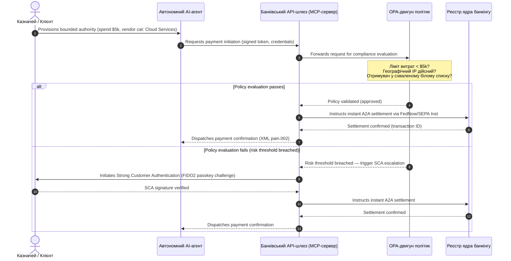

# Глобальний платіжний прогноз 2026 року: операційна модель, ризик і дохід в агентському, невидимому світі реального часу

Глобальний платіжний цикл 2026 року визначають три збіжні сили — агентська комерція, невидимі вбудовані платежі та виконання в реальному часі — поверх токенізованого єдиного реєстру у межах Project Agorá та жорсткої дати переходу SWIFT на структуровану адресу в листопаді 2026 року.

<!-- lead-start -->
<aside class="post-lead" aria-label="Article summary">

<strong>Стисло.</strong> Платіжний ландшафт 2026 року перейшов від міграції повідомлень до багатовимірної операційної моделі, де ризик і дохід диктує виконання в реальному часі. Цей матеріал синтезує прогнози 2026 року J.P. Morgan, Global Payments, HSBC і Payments Association у чотирьохстовпний операційний план G-SIB, охоплюючи агентську комерцію, ініційовану моделями, постійно ввімкнені казначейські API, токенізовані єдині реєстри у межах BIS Project Agorá та крайній термін SWIFT для структурованої адреси 14 листопада 2026 року.

<strong>Ключові висновки</strong>

<ul class="post-lead-takeaways">
  <li><strong>Агентська комерція відкриває рубіж делегованої відповідальності.</strong> За прогнозами, автономні AI-агенти посередничать у комерції на $3–$5 трлн щорічно до 2030 року. Банки мають визначити шлюзування MCP, делегування SCA згідно з PSD3/PSR і власників KYC/AML у мультиагентних платіжних ланцюгах.</li>
  <li><strong>Постійно ввімкнена ліквідність тепер є операційним і регуляторним базовим рівнем.</strong> Цілодобові казначейські API та віртуальні рахунки мінімізують заморожені кошти та піднімають планку стійкості. У межах DORA продукти ліквідності в реальному часі мають спиратися на геогрезервовану інфраструктуру active-active з доступністю 99,999%.</li>
  <li><strong>Токенізація перейшла до регульованих єдиних реєстрів.</strong> Project Agorá — це найбільша публічно-приватна рамка для токенізованих депозитів комерційних банків і резервів центральних банків. Банкам потрібен п’ятикроковий шлях токенізації з чітким пруденційним режимом.</li>
  <li><strong>Перехід на структуровану адресу 14 листопада 2026 року має жорстку дату.</strong> Неструктуровані поля поштової адреси в повідомленнях CBPR+ і SEPA призведуть до миттєвих відмов. Потрібне чисте управління даними у командах продукту, технологій і комплаєнсу.</li>
</ul>

<strong>Пов’язане читання:</strong> <a href="https://sebastienrousseau.com/2026-06-23-iso-20022-pain001-programmable-liquidity-autonomic-treasury-2026">From Pain.001 to Programmable Liquidity: ISO 20022 as the Autonomic Nervous System of Treasury in 2026</a>, <a href="https://sebastienrousseau.com/2026-06-24-cross-border-iso-20022-open-finance-tokenised-deposits-treasury-2026">Cross-Border 2026: ISO 20022, Open Finance and Tokenised Deposits in Corporate Treasury</a>, <a href="https://sebastienrousseau.com/2026-06-25-quantum-dawn-cib-kyberlib-quantum-resilient-payments-stack-2026">Quantum Dawn for CIB: From KyberLib to a Quantum-Resilient Payments Stack</a>.

</aside>
<!-- lead-end -->

Для глобальних транзакційних банків цикл 2026–2028 років є структурним вікном. Сучасна платіжна інфраструктура більше не є адміністративною утилітою — вона є ядром технологічної стратегії банківського рівня. Усередині G-SIB і великих регіональних інституцій технології, регулювання та очікування клієнтів зійшлися в одну операційну площину.

Цикл визначають три сили, кожна з яких безпосередньо проєктується на пріоритет вищого керівництва.

- **Агентська комерція** — розподіл каналів, дизайн продукту, призначення відповідальності та управління модельним ризиком під наглядом регулятора.
- **Невидимі платежі** — клієнтський досвід із ризиком дезінтермедіації, якщо банки не вбудують свій реєстр у фронтенди корпоративних клієнтів і продавців.
- **Виконання в реальному часі** — швидкість капіталу з відповідними змінами в управлінні ліквідністю, кредитному ризику, операційній стійкості та боротьбі з шахрайством.

Фінансові ставки матеріальні. Шахрайство масштабується за швидкістю та витонченістю; регуляторні дедлайни жорсткі; банки, які проактивно модернізують свої ключові системи, відкривають суттєві можливості для комісійного доходу. Ціна бездіяльності протилежна: миттєві відмови у транзакціях, операційні вузькі місця, регуляторні штрафи та швидка ерозія частки ринку.

## Збіг глобальних платіжних авторитетів

Цей звіт синтезує прогнози платежів і комерції 2026 року від чотирьох авторитетних галузевих голосів — [J.P. Morgan Payments](https://www.jpmorgan.com/payments/newsroom/payments-outlook-2026-trends-report-released "J.P. Morgan Payments — Outlook 2026"), [Global Payments](https://investors.globalpayments.com/news-events/press-releases/detail/497/global-payments-releases-its-2026-commerce-and-payment "Global Payments — 2026 Commerce and Payment Trends Report"), HSBC і The Payments Association — та триангулює їх з [Дорожньою картою G20 для покращення транскордонних платежів](https://www.fsb.org/2026/03/fsb-kicks-off-new-implementation-phase-to-enhance-cross-border-payments-through-public-private-partnership/ "FSB — cross-border payments implementation phase, March 2026").

Кожна організація підходить до екосистеми з іншого ринкового кута, але їхні висновки збігаються на трьох інваріантах.

1. **Миттєві рейки, керовані API, є базовим рівнем.** Застарілі моделі пакетної обробки маргіналізовані для транскордонних і високовартісних потоків; швидкість транзакцій у цих сегментах диктують постійно ввімкнені повідомлення в реальному часі.
2. **AI — це водночас загроза та захист.** Генеративні інструменти та діпфейки масштабують транзакційне шахрайство, що вимагає багатошарових контрзаходів машинного навчання в реальному часі.
3. **Токенізація — це готова до виробництва інфраструктура.** Реєстри уніфікуються, щоб розміщувати токенізовані комерційні зобов’язання та цифрові валюти центральних банків оптового рівня.

| Звіт | Основна аудиторія | Фокус | Ключовий стовп | Вплив на банк |
| --- | --- | --- | --- | --- |
| **J.P. Morgan Payments** | Corporate treasurers, G-SIBs | Real-time liquidity, fraud | APIs, AI biometrics | Rebuild liquidity, FX, and risk systems for continuous 365-day settlement. |
| **Global Payments** | Merchants, e-commerce | POS evolution, omnichannel | Agentic commerce, frictionless checkout | Build secure, API-gated merchant payment corridors for autonomous AI agents. |
| **HSBC Insights** | Multinational corporates | ERP integrations (SAP/Oracle), real-time cash | Treasury-as-a-Service, cash visibility | Monetise transactional API suites and embed real-time cash ledger reporting at source. |
| **The Payments Association** | Fintechs, payment institutions | Stablecoins, tokenisation, global regulation | Regulated digital assets, policy compliance | Prepare balance sheets for tokenised deposits and navigate PSD3/PSR liability structures. |

Чотири прогнози фактично визначають приватний операційний стек, що працює поверх публічної політичної інфраструктури G20, перекладаючи політичні наміри у конкретні рішення щодо ліквідності, токенізації, даних і контролю шахрайства всередині банків.

## Стовп 1 — Агентська комерція та невидимі платежі

Агентська комерція — це перехід від людиноорієнтованого оформлення замовлення «клік-щоб-купити» до автономної, керованої моделями ініціації транзакцій. Галузеві прогнози сходяться на $3–$5 трлн щорічної комерції, опосередкованої автономними агентами, до 2030 року — частка нижніх однозначних відсотків глобального платіжного обсягу, виконана без людського кліку «купити».

Роздрібна та комерційна екосистема має відповідний розрив. Чітка більшість споживачів тепер очікує платежів майже без тертя, проте менш ніж половина продавців пріоритезували оформлення в один клік або каталоги продуктів, доступні через API. AI-агенти не можуть навігувати застарілі багатосторінкові екрани оформлення замовлення, розроблені для людських очей; їм потрібні структуровані API-рукостискання «машина-машина».

### Банківські пріоритети та операційний вплив

- **Володіння KYC та AML.** Банки мають визначити, хто несе зобов’язання з комплаєнсу всередині агентського транзакційного ланцюга. Якщо персональний AI-агент споживача ініціює транзакцію через агентську касу продавця, банк має перевірити, що первинні делеговані повноваження криптографічно прив’язані до основного власника рахунку.
- **Переробка відповідальності та повернень платежів.** Карткові схеми та рейки A2A розроблено навколо людської авторизації. Коли AI-агент здійснює помилкову покупку — наприклад, закуповуючи неправильні промислові запаси через помилку парсингу даних — банки мають чітко розподіляти відповідальність між споживачем, постачальником агента та продавцем.
- **Оцінка ризику агентських потоків.** Двигуни маршрутизації платежів мають динамічно оцінювати ризик агентських платежів, застосовуючи вищі резервні вимоги або міжбанківські комісії до не-людиноорієнтованих транзакцій, доки не з’явиться стабільна історія розрахунків.

### Обмежена дія та обмежені повноваження

Щоб пом’якшити «необмежену дію» — наприклад, корпоративний агент закупівель, що виконує нескінченний рекурсивний цикл покупок через програмний збій — банки мають розгорнути **API-шлюзи з обмеженими повноваженнями**. Шлюзи забезпечують політичні обмеження за трьома вимірами.

1. **Ступінчасті фінансові ліміти** — витрати агента обмежені розміром транзакції, щоденною кумулятивною вартістю та категорією продавця.
2. **Контекстно-залежні захисти** — другорядні сигнали (час доби, IP-геолокація, частота транзакцій) оцінюються до того, як реєстр вивільнить кошти.
3. **Ескалація з людиною в петлі** — обов’язкова людська авторизація, ініційована через посилену автентифікацію клієнта (SCA) згідно з PSD3 / PSR, коли транзакція перевищує порогові значення ризику.

Діаграма Mermaid нижче показує цільову архітектуру, яку багато банків впізнають як агентський платіжний потік із обмеженими повноваженнями.

### Model Context Protocol (MCP)

Щоб з’єднати локалізовані AI-моделі з керованими банком шарами виконання, галузь стандартизується навколо [Model Context Protocol (MCP)](https://modelcontextprotocol.io "Model Context Protocol — open standard for LLM tool integration") — відкритого протоколу, який дозволяє LLM викликати чітко обмежені, такі, що піддаються аудиту, інструменти та API без сирого доступу до ключових систем.

Обгортання банківських API (ініціація платежу, запит балансу, верифікація сторони) всередині MCP-сервера тримає LLM подалі від таблиць бази даних і кореневих контролів системи. Модель взаємодіє з реєстром лише через структуровані, аудитовані кінцеві точки з обмеженням частоти — безпека забезпечується на межі агентського виконання інструментів, а не похована всередині моделі.

## Стовп 2 — Трансформація казначейства та переосмислена ліквідність

Швидкість транзакційного банкінгу у 2026 році задається зсувом від пакетної обробки в кінці дня до постійно ввімкнених казначейських операцій у реальному часі. Транснаціональні корпорації більше не толерують заморожені кошти — ліквідність, що простоює на локальних рахунках у вихідні чи свята, бо системи розрахунку закриті.

### Економічне обґрунтування ліквідності в реальному часі

J.P. Morgan і HSBC обидва повідомляють, що корпорації з розвиненими можливостями керування грошима та даними в реальному часі суттєво частіше перевершують конкурентів у зростанні доходів і ефективності капіталу, головним чином завдяки зменшенню заморожених коштів і оптимізації циклів робочого капіталу.

Щоб охопити цю цінність, банки постачають **API-продукти Treasury-as-a-Service (TaaS)**, які дозволяють корпоративним ERP (SAP, Oracle) безпосередньо під’єднуватися до реєстру банку.

- **API балансу в реальному часі** з використанням схеми `camt.052` — замінюючи протоколи передачі файлів на миттєву, керовану подіями звітність про грошову позицію.
- **API пакетної ініціації платежів** з використанням `pain.001` — пряме, наскрізне виконання пакетів платежів постачальникам із реєстру ERP.
- **Безперервні FX API** — казначейські двигуни фіксують у реальному часі алгоритмічні курси обміну валют для транскордонного розрахунку, усуваючи ризик нічного розриву ринку.
- **API віртуальних рахунків** — корпорації динамічно створюють і виводять з обігу тисячі субрахунків для автоматизованого зіставлення дебіторської заборгованості та поділу реєстру.

### Операційна стійкість і DORA

Пропозиція постійно ввімкненої ліквідності трансформує ризиковий профіль банку. Платформа має утримувати **99,999% операційної доступності** під безперервним навантаженням у реальному часі.

Згідно з [Digital Operational Resilience Act (DORA)](https://eur-lex.europa.eu/legal-content/EN/TXT/?uri=CELEX%3A32022R2554 "Regulation (EU) 2022/2554 — Digital Operational Resilience Act"), це не IT KPI — це сувора регуляторна вимога. Регулятори очікують, що банки доведуть, що поверхня казначейського API в реальному часі та база даних реєстру можуть поглинати серйозні, але правдоподібні кібератаки, мережеві збої та порушення роботи гіперскейлерів без переривання критичних платежів чи компрометації системної ліквідності. Це вимагає геогрезервованих, active-active мультихмарних архітектур баз даних, шарів виявлення загроз у реальному часі та автоматизованого фейловера — видимих у статті витрат на зміни, а не лише у аудиторському досьє.

### Безперервний FX і транскордонна інновація

Казначейство в реальному часі не може жити всередині одновалютної межі. G-SIB розгортають інфраструктуру безперервного FX — платформа J.P. Morgan [Wire 365](https://www.jpmorgan.com/insights/payments/fx-cross-border/wire-365-global-clearing "J.P. Morgan — Wire 365 global clearing reinvented") обробляє транскордонні платежі та конвертації FX у будь-який день року, поза традиційними годинами RTGS центральних банків. Цей шар безпосередньо стикується з системами токенізованих депозитів і єдиних реєстрів, обговорюваними у Стовпі 3.

## Стовп 3 — Токенізовані депозити та єдиний реєстр

Токенізація перейшла від ізольованих пілотів «доказ концепції» до масштабованої монетарної інфраструктури банківського рівня. Фокус змістився від приватних стейблкоінів і спекулятивних криптоактивів до **токенізованих депозитів комерційних банків** і **оптових цифрових валют центральних банків (wCBDC)**, що працюють на програмованих єдиних реєстрах.

Еталонна рамка — [Project Agorá](https://www.bis.org/about/bisih/topics/fmis/agora.htm "BIS Project Agorá — tokenisation of wholesale cross-border payments") — велика публічно-приватна співпраця, скликана BIS і IIF, за участю семи центральних банків і понад 40 приватних фінансових установ. Проєкт досліджує, як токенізовані депозити комерційних банків інтегруються з токенізованими оптовими CBDC у спільному програмованому реєстрі, щоб усунути тертя транскордонного розрахунку, координувати перевірки комплаєнсу та забезпечити цілодобову атомарну фінальність.

### П’ятикроковий шлях токенізації

Для G-SIB і великих регіональних банків токенізація — це покроковий шлях від внутрішньої оптимізації до сумісності з відкритим ринком.

1. **Внутрішня казначейська ліквідність** — токенізація внутрішніх корпоративних грошових балансів (наприклад, JPM Coin або еквівалентні приватні банківські реєстри) для миттєвого, цілодобового транскордонного переказу та неттингу між власними відділеннями банку.
2. **Обмежені багатобанківські коридори** — закриті, регульовані консорціуми (пісочниця Project Agorá) для тестування міжбанківського розрахунку та спільного стану реєстру між окремими установами.
3. **Безперервний програмований FX** — смартконтракти на єдиному реєстрі виконують миттєвий FX за схемою «платіж проти платежу» (PvP), усуваючи ризик розрахунку між часовими поясами.
4. **Токенізовані реальні активи (RWA)** — токенізована грошова нога інтегрується з токенізованими цінними паперами, борговими або торговими реєстрами для миттєвої фінальності «поставка проти платежу» (DvP), скорочуючи блокування капіталу з днів до мілісекунд.
5. **Регульована публічна/гібридна сумісність** — безпечні шлюзові обгортки дозволяють інституційній ліквідності безпечно взаємодіяти з відкритими публічними мережами.

### Пруденційні та балансові наслідки

З токенізованими грошима треба обережно навігувати пруденційні рамки. Наглядачі підкреслюють, що токенізований депозит має бути економічно еквівалентним традиційному депозиту комерційного банку — тобто незабезпеченим зобов’язанням на балансі банку з тим самим покриттям страхування депозитів.

Операційно токенізовані депозити вносять ризики, які класичні моделі стрес-тестування ліквідності не були побудовані симулювати. Смартконтракти виконують програмовані виведення коштів зі швидкостями та обсягами, які не охоплюють застарілі припущення. Згідно з Basel III, банки мають забезпечити, щоб двигун ризику міг моделювати програмовані відтоки коштів і щоб токенізований реєстр чисто взаємодіяв із застарілими системами RTGS протягом щоденного циклу ліквідності.

### Стейблкоіни проти токенізованих депозитів — нюансована позиція

Приватні повністю забезпечені стейблкоіни (USDC тощо) продовжують захоплювати частку ринку в роздрібних транскордонних переказах і децентралізованій комерції, але не мають здатності до створення кредиту та фінальності розрахунку комерційної банківської системи.

Замість того щоб конкурувати на роздрібних рейках, транзакційні банки створюють кастоді, випускають власні регульовані токенізовані інструменти зобов’язань і будують безпечні шлюзи on-/off-ramp. Корпоративні клієнти отримують програмну гнучкість, зберігаючи капітал усередині регульованого периметра.

### Питання, які рада директорів має поставити щодо токенізованих грошей

- **Участь у єдиному реєстрі.** Якою є наша активна стратегічна дорожня карта участі в оптових публічно-приватних ініціативах єдиного реєстру на кшталт Project Agorá?
- **Баланс і моделювання ризику.** Чи оновили наші двигуни ризику та рамки достатності капіталу стрес-тестування, щоб врахувати швидкість відтоків токенів, ініційованих смартконтрактами?
- **Сегменти клієнтів — першопрохідців.** Які з наших сегментів корпоративного казначейства та комерційного банкінгу негайно виграють від програмованого, токенізованого розрахунку DvP/PvP?

## Стовп 4 — Структуровані дані та захист від шахрайства

Інфраструктурний комплаєнс у 2026 році домінує **перехід на структуровану адресу 14 листопада 2026 року**, встановлений у межах [SWIFT Standards Release (SR) 2026](https://www.swift.com/standards/iso-20022/removal-unstructured-address "SWIFT — Removal of unstructured address, November 2026"). Від цієї дати платіжні мережі CBPR+ і SEPA припиняють приймати повністю неструктуровані, текстові блоки поштової адреси (`<AdrLine>`) у платіжних повідомленнях. Будь-яке транскордонне або внутрішнє повідомлення з неструктурованою адресою там, де очікуються структуровані елементи, буде затримане або відхилене мережею.

Більшість установ знає дату. Багато хто розглядає її як поверхневу вправу зі зіставлення на рівні інтерфейсу. Реальність — глибший виклик якості та управління даними. Щоб уникнути катастрофічних показників відмов, операції платежів потребують чіткої міжфункціональної рамки управління.

- **Продукт і операції.** Захоплення даних у джерелі. Цифрові портали для клієнтів, інтерфейси онбордингу та поля введення корпоративних ERP мають примушувати структуровані поля адреси (`<StrtNm>`, `<PstCd>`, `<TwnNm>`, `<Ctry>`) у точці ініціації платежу.
- **Технології.** Парсинг, зіставлення, валідація схеми. Валідаційні двигуни блокують застарілі файли до того, як вони потраплять до інтерфейсу SWIFT. Локально розгорнуті моделі машинного навчання парсять застарілі неструктуровані адресні блоки в XML-сумісні теги під `<PstlAdr>`.
- **Комплаєнс і ризик.** Скринінг санкцій, моніторинг транзакцій і логіка AML оновлені, щоб приймати структуровані XML-поля — зменшуючи показники хибних спрацьовувань і ручних розслідувань.

### Бізнес-обґрунтування для структурованих даних

Розглянута як витрата на комплаєнс, програма структурованих даних дорога. Розглянута як рушій доходу, вона окупає себе.

1. **Розширене прийняття кредитних рішень.** Структуровані дані рахунка-фактури, ремітансу та кінцевого боржника дозволяють банкам будувати автоматизовані, точні програми фінансування робочого капіталу та факторингу рахунків ланцюга постачання для корпоративних клієнтів.
2. **Автоматизоване зіставлення дебіторської заборгованості.** Експозиція структурованих ідентифікаторів сторони та рахунка-фактури підтримує преміальні продукти грошової реконсиляції та пулінгу віртуальних рахунків, генеруючи новий комісійний дохід від транзакцій.
3. **Монетизована транзакційна аналітика.** Банки пакують і продають детальні дашборди аналітики ліквідності в реальному часі та закупівельних патернів корпоративним CFO і казначеям.

### Багатошаровий захист від шахрайства на основі AI

Оскільки швидкості транзакцій прискорюються до реального часу, техніки шахрайства масштабувалися. Нещодавнє дослідження вказує, що діпфейки становлять близько 40% спроб біометричного шахрайства, причому синтетичні медіа дедалі частіше використовуються для обходу контролю розпізнавання голосу та обличчя в потоках онбордингу та платежів.

Захист — це **трирівнева AI-модель шахрайства**.

1. **Шар ідентичності.** Біометрично верифіковані ключі доступу [FIDO2](https://fidoalliance.org/fido2/ "FIDO Alliance — FIDO2 specification"), криптографічно підписана прив’язка апаратного пристрою та децентралізовані цифрові ID-гаманці для захисту доступу до платежів.
2. **Поведінковий шар.** Безперервна поведінкова біометрія — темп навігації сесії, ритм набору, орієнтація пристрою — для виявлення автоматизованого виконання ботів або спроб перехоплення сесії.
3. **Транзакційний шар.** Структуровані поля ISO 20022 живлять двигуни ризику машинного навчання в реальному часі, перехресно посилаючись на метадані транзакцій зі спільною мережевою консорціальною розвідкою, щоб ідентифікувати підозрілі транзакції протягом мілісекунд після ініціації.

Щоб задовольнити наглядачів, AI-моделі транзакційного шару включають суворі **параметри інтерпретованості** та працюють у межах виділеної програми управління модельним ризиком (MRM). Регулятори очікують, що банки пояснять конкретні дані та алгоритмічну логіку, що спричинили автоматичне блокування або сповіщення про шахрайство, відповідно до [US Federal Reserve SR 11-7](https://www.federalreserve.gov/frrs/guidance/supervisory-guidance-on-model-risk-management.htm "US Federal Reserve — Supervisory Guidance on Model Risk Management, SR 11-7") і [PRA SS1/23](https://www.bankofengland.co.uk/prudential-regulation/publication/2023/may/model-risk-management-principles-for-banks-ss "Bank of England PRA SS1/23 — Model Risk Management principles for banks") Банку Англії.

## Порядок денний ради директорів на 2026–2028 роки

Щоб виконати завдання чотирьох стовпів, керівні органи G-SIB і регіональних банків мають організувати операційні та технологічні інвестиції за чіткою триетапною дорожньою картою.

### Горизонт 1 — Негайний комплаєнс і зміцнення ядра (0–12 місяців)

- **Фокус.** Стандартизувати якість даних ISO 20022 і забезпечити базові транзакційні шляхи в реальному часі.
- **Показник успіху (KPI).** Нуль відмов через неструктуровану адресу в SWIFT і SEPA після переходу 14 листопада 2026 року.
- **Виконавчий власник.** Головний операційний директор / Голова операцій платежів.
- **Тип результату.** Безсумнівний крок. Оновлення схеми ядра бази даних і валідаційний двигун SWIFT SR 2026.

### Горизонт 2 — Автоматизація та агентські запобіжники (12–24 місяці)

- **Фокус.** Обмежені агентські API-шлюзи та архітектура безперервного захисту від шахрайства.
- **Показник успіху (KPI).** 100% транзакцій API «машина-машина» та ініційованих AI валідовані через апаратну прив’язку FIDO2 та двигуни політик з обмеженими повноваженнями.
- **Виконавчий власник.** Головний інформаційний директор / Головний ризик-директор.
- **Тип результату.** Безсумнівний крок (захист від шахрайства) плюс стратегічна опція (агентська комерція). Розгортання MCP і трирівневий AI шахрайства.

### Горизонт 3 — Платформна токенізація та єдині реєстри (24–36 місяців)

- **Фокус.** Перехід казначейських активів до токенізованих депозитів і участь у спільних транскордонних реєстрах.
- **Показник успіху (KPI).** Щонайменше 15% обсягу високовартісного корпоративного казначейського розрахунку, обробленого нативно через інструменти токенізованих депозитів або механізми єдиного реєстру (наприклад, коридори Project Agorá).
- **Виконавчий власник.** Груповий казначей / Голова транзакційного банкінгу.
- **Тип результату.** Стратегічна опція. Програмована інфраструктура реєстру, правила ліквідності смартконтрактів, адаптери розрахунку DvP/PvP.

## Часті запитання

**Чи дійсно агентська комерція досягне $3–$5 трлн до 2030 року?**
Базовий сценарій McKinsey вказує на $5 трлн продажів агентської комерції до 2030 року, з діапазоном незалежних прогнозів, що кластеризуються між $3 трлн і $5 трлн. Розкид відображає, наскільки агресивно продавці постачають машиночитні API оформлення замовлення та як швидко банки дозволяють агентам здійснювати транзакції за делегацією SCA — вузьке місце на боці банків і продавців, а не на боці можливостей агентів.

**Чи поширюється перехід SWIFT 14 листопада 2026 року також на внутрішні потоки SEPA?**
Так. Вимога структурованої адреси застосовується до транскордонних CBPR+ і до платіжних повідомлень SEPA. Банкам, що працюють на обох рейках, потрібна єдина канонічна схема адреси вище за потоком від інтерфейсу SWIFT, а не два паралельні зіставлення.

**Чи токенізований депозит — це те саме, що стейблкоін?**
Ні. Токенізований депозит — це незабезпечене зобов’язання на балансі регульованого банку з тим самим покриттям страхування депозитів, що й традиційний депозит. Стейблкоін, як правило, є повністю забезпеченим інструментом, випущеним небанківською установою, без здатності до створення кредиту. Дизайн Project Agorá припускає, що токенізовані депозити стоять поруч із оптовими CBDC у спільному програмованому реєстрі; стейблкоіни не фігурують в оптовому розрахунковому сегменті.

**Як Project Agorá співвідноситься з існуючими пілотами wCBDC?**
Agorá — це інтегруюча рамка. Національні експерименти wCBDC охоплюють сегмент грошей центрального банку; Agorá виводить токенізовані комерційні депозити на той самий програмований реєстр, щоб транскордонний розрахунок був атомарним між обома типами грошей. Сім центральних банків-учасників і 40+ приватних установ роблять його найбільшим публічно-приватним полігоном проєктування архітектури оптових токенізованих грошей.

**Який мінімальний комплаєнс-режим DORA для TaaS API?**
Геогрезервоване розгортання active-active, документовані серйозні, але правдоподібні кіберсценарії з названими власниками згідно з SM&CR (Велика Британія) та протестований фейловер, що не перериває критичних платежів. Без цього продукт TaaS — це регуляторне зобов’язання, а не лінія доходу.

## Посилання

- Bank for International Settlements (BIS) Innovation Hub. (2026). *Project Agorá: exploring tokenisation of wholesale cross-border payments*. [BIS Project Agorá](https://www.bis.org/about/bisih/topics/fmis/agora.htm).
- Deutsche Bank. (2026). *Digital Money: a perspective on stablecoins, tokenised deposits and CBDCs*. [Deutsche Bank Flow](https://flow.db.com/publications/flow-white-papers-and-guides/digital-money-a-perspective-on-stablecoins-tokenised-deposits-and-cbdcs).
- European Parliament and Council. (2022). *Regulation (EU) 2022/2554 on Digital Operational Resilience (DORA)*. [DORA Regulation](https://eur-lex.europa.eu/legal-content/EN/TXT/?uri=CELEX%3A32022R2554).
- Financial Stability Board. (2026). *FSB kicks off new implementation phase to enhance cross-border payments*. [FSB statement](https://www.fsb.org/2026/03/fsb-kicks-off-new-implementation-phase-to-enhance-cross-border-payments-through-public-private-partnership/).
- Global Payments. (2025). *2026 Commerce and Payment Trends Report — press release*. [Global Payments press release](https://investors.globalpayments.com/news-events/press-releases/detail/497/global-payments-releases-its-2026-commerce-and-payment).
- J.P. Morgan Payments. (2026). *Payments Outlook 2026 Trends Report Released*. [J.P. Morgan Newsroom](https://www.jpmorgan.com/payments/newsroom/payments-outlook-2026-trends-report-released).
- J.P. Morgan Insights. (2026). *5 Payment Trends to Watch for in 2026*. [J.P. Morgan Trends](https://www.jpmorgan.com/insights/payments/trends-innovation/five-payment-trends-in-2026).
- J.P. Morgan FX & Cross-Border. (2026). *Wire 365: Global Clearing Reinvented*. [J.P. Morgan FX Wire 365](https://www.jpmorgan.com/insights/payments/fx-cross-border/wire-365-global-clearing).
- SWIFT. (2026). *ISO 20022 milestone for November 2026: unstructured addresses to be removed*. [SWIFT ISO 20022 Milestone](https://www.swift.com/news-events/news/iso-20022-milestone-november-2026-unstructured-addresses-be-removed).
- SWIFT Standards. (2026). *Removal of unstructured address*. [SWIFT Standards](https://www.swift.com/standards/iso-20022/removal-unstructured-address).
- Bank of England. (2023). *Supervisory Statement (SS1/23) — Model Risk Management principles for banks*. [Bank of England PRA SS1/23](https://www.bankofengland.co.uk/prudential-regulation/publication/2023/may/model-risk-management-principles-for-banks-ss).
- US Federal Reserve. (2011). *Supervisory Guidance on Model Risk Management (SR 11-7)*. [SR 11-7](https://www.federalreserve.gov/frrs/guidance/supervisory-guidance-on-model-risk-management.htm).
- McKinsey & Company. (2025). *McKinsey forecast: $5 trillion in agentic commerce sales by 2030* (via Digital Commerce 360). [McKinsey agentic forecast](https://www.digitalcommerce360.com/2025/10/20/mckinsey-forecast-5-trillion-agentic-commerce-sales-2030/).
- HSBC Business. (2026). *HSBC Business Insights*. [HSBC Insights](https://www.business.hsbc.com/en-gb/insights).
- Bright Defense. (2026). *Deepfake Statistics: A Growing Security Concern*. [Deepfake fraud statistics](https://www.brightdefense.com/resources/deepfake-statistics/).
- European Banking Authority. (2019). *Guidelines on outsourcing arrangements (EBA/GL/2019/02)*. [EBA Outsourcing Guidelines](https://www.eba.europa.eu/regulation-and-policy/internal-governance/guidelines-on-outsourcing-arrangements).

<!-- enrich-start -->
<aside class="author-card" aria-label="About the author"><strong class="author-card-name"><a href="/about/index.html">Sebastien Rousseau</a></strong>Старший банківський технолог, що пише про прикладний AI, міграцію ISO 20022, постквантову криптографію для фінансових послуг і структурну трансформацію оптових платежів.Понад 20 років у HSBC Commercial &amp; Investment Bank, PayPal, Barclays, Shazam, AKQA, Virgin Group. <a href="/about/index.html">Повний профіль</a> &middot; <a href="https://www.linkedin.com/in/sebastienrousseau/" rel="external noopener">LinkedIn</a> &middot; <a href="https://github.com/sebastienrousseau" rel="external noopener">GitHub</a></aside>

Останнє оновлення <time datetime="2026-06-25">2026-06-25</time>.

<!-- enrich-end -->
