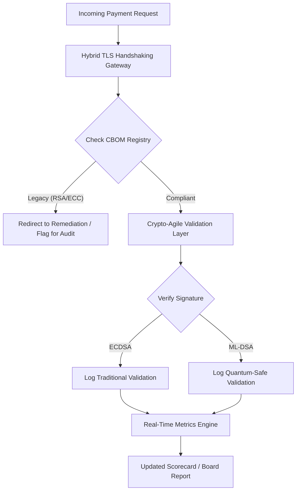

# Постквантова оцінкова картка безпеки 2026: метрична рамка для ради з фідуціарної криптоагільності

<aside class="post-lead" aria-label="Резюме статті">

<strong>Стисло.</strong> Станом на червень 2026 постквантова криптографія (PQC) перейшла з експериментальної технічної проблеми у первинне фідуціарне зобов'язання. Ради тепер повинні наглядати за систематичною міграцією застарілого шифрування до стандартів NIST FIPS 203 і 204, щоб пом'якшити системні фінансові та операційні ризики згідно з DORA.

<strong>Ключові висновки</strong>

<ul class="post-lead-takeaways">
  <li><strong>Узгодження з G20 та жорсткі терміни.</strong> Міжнародні регулятори визначили кінець 2020-х років як жорсткий термін для квантово-стійких переходів, вимагаючи від установ демонструвати кількісно вимірюваний прогрес міграції.</li>
  <li><strong>Криптографічний перелік матеріалів (CBOM).</strong> За аналогією з програмним BOM, CBOM — це живий, автоматизований інвентар усіх криптографічних активів, необхідний для забезпечення видимості по всьому ланцюгу постачання.</li>
  <li><strong>Експозиція Harvest-Now-Decrypt-Later (HNDL).</strong> Зловмисники зараз перехоплюють і зберігають зашифровані дані оптових платежів високої цінності; пом'якшення цього вимагає негайного розгортання гібридних PQC-архітектур.</li>
  <li><strong>Фідуціарне управління через криптоагільність.</strong> Криптоагільність — це вимірювана метрика управління. Здатність замінювати криптографічні примітиви без переінженерії основних систем (за допомогою таких бібліотек, як KyberLib) тепер є підзвітністю на рівні ради згідно з SM&CR.</li>
</ul>

<strong>Пов'язане читання:</strong> <a href="https://sebastienrousseau.com/2026-06-12-kyberlib-post-quantum-banking-migration-standards-code-2026">KyberLib і постквантова банківська міграція у 2026</a>, <a href="https://sebastienrousseau.com/2023-11-19-crystals-kyber-the-safeguarding-algorithm-in-a-quantum-age/index.html">CRYSTALS-Kyber: захисний алгоритм у квантову епоху</a>.

</aside>
Постквантова безпека більше не є дослідницьким проєктом. «Наглядовий годинник» цокає у бік кінцевих термінів виконання у кінці 2020-х років. Завершення [NIST FIPS 203 (ML-KEM)](https://csrc.nist.gov/pubs/fips/203/final) та [NIST FIPS 204 (ML-DSA)](https://csrc.nist.gov/pubs/fips/204/final) кодифікувало стандарти для інкапсуляції ключів та цифрових підписів.

Регуляторні органи тепер очікують, що банки Tier-1 вийдуть за межі пілотних програм. У 2026 фокус змістився на індустріалізацію цих стандартів. Невдача у демонстрації чіткого шляху міграції тягне за собою значні регуляторні штрафи згідно з [Digital Operational Resilience Act (DORA)](https://eur-lex.europa.eu/eli/reg/2022/2554/oj) та потенційну особисту відповідальність для директорів, які ігнорують передбачувану загрозу квантово-увімкненої розшифровки.

## 01. Квантова оцінкова картка на рівні ради

Наступні метрики надають стандартизовану рамку для рад, щоб оцінювати квантову готовність та криптографічне здоров'я у володіннях Commercial and Investment Banking (CIB).

### Таблиця 1: метрики PQC-оцінкової картки та допуски

| Метрика | Математична формула | Допуски, затверджені радою | Ризик у разі виходу за межі |
| ---- | ---- | ---- | ---- |
| **Відсоток повноти інвентаризації (ICP)** | (Ідентифіковані крипто-активи / Загальна оцінка активів) × 100 | > 98% | Тіньове шифрування та сліпі зони у шляхах даних клірингу високої цінності. |
| **Рівень експозиції HNDL (HER)** | (Довгоживучі дані на застарілій крипто / Загальні довгоживучі дані) × 100 | < 5% | Постійна компрометація комерційних таємниць, реєстрів суверенного боргу та записів оптових платежів. |
| **Рівень прогресу міграції NIST (MPR)** | (Системи, що працюють на FIPS 203/204 / Загальна кількість критичних систем) × 100 | > 60% (до кінця 2026) | Регуляторне невиконання та виключення з контрагентів, узгоджених з G20. |
| **Індекс готовності криптоагільності (CARI)** | (Застосунки з абстрагованими крипто-шарами / Загальна кількість основних застосунків) × 100 | > 85% | Серйозний технічний борг та неспроможність реагувати на майбутні припинення підтримки алгоритмів. |

## 02. Криптографічний перелік матеріалів (CBOM)

Метрика ICP вибудовується через комплексну **фазу виявлення CBOM**. Це автоматизований процес, який ідентифікує кожну криптографічну кінцеву точку всередині підприємства.

- **Виявлення кінцевих точок:** сканування внутрішніх та хмарних мереж щодо активних TLS-сесій для ідентифікації застарілого використання RSA або ECC.
- **Інвентаризація ключів:** зіставлення пар публічних/приватних ключів з їхніми відповідними власниками та визначення точних дат закінчення.
- **Картування залежностей:** ідентифікація сторонніх бібліотек та API, які покладаються на застарілі алгоритми.

Ця фаза виявлення створює єдине джерело істини, що дозволяє CISO звітувати про криптографічне здоров'я з такою самою деталізацією, як про фінансові показники.

## 03. Усунення експозиції HNDL у оптових платежах

Зловмисники активно цілять оптові платежі та довгоживучі корпоративні бази даних. Ці атаки «Harvest-Now-Decrypt-Later» (HNDL) полягають у перехопленні та архівації сьогоднішнього зашифрованого трафіку.

Навіть якщо криптографічно релевантний квантовий комп'ютер (CRQC) сьогодні не існує, дані, перехоплені зараз, будуть уразливими у майбутньому. Пом'якшення цього вимагає міграції з високим пріоритетом довгоживучих даних (наприклад, ідентифікаційних записів, 30-річних облігаційних контрактів та юридичних архівів), що безпосередньо знижує метрику HER. Оновлення платіжних каналів до гібридного PQC-традиційного шифрування (з використанням ML-KEM поряд з X25519) забезпечує негайний захист від архівних загроз.

## 04. Операціоналізація криптоагільності через добре спроєктовані інтерфейси

Криптоагільність реалізується через інженерні абстракції. Сучасні бібліотеки на кшталт [KyberLib](https://sebastienrousseau.com/2026-06-12-kyberlib-post-quantum-banking-migration-standards-code-2026) демонструють, як розробники можуть впроваджувати квантово-стійкі модулі без переписування всього стека застосунку.

- **Абстраговані обгортки:** застосунки викликають загальну функцію `encrypt()` або `sign()`, а не алгоритм-специфічні підпрограми.
- **Заміна під час виконання:** базовий модуль можна замінити з ECDSA на ML-DSA через зміну конфігурації, а не через складні розгортання коду.

Ця архітектура гарантує, що якщо конкретний PQC-алгоритм буде скомпрометований у майбутньому, організація може здійснити поворот за години, а не за роки.

## 05. Робочий процес валідації квантово-стійкого вхідного трафіку

Наступна діаграма ілюструє життєвий цикл даних, що входять у безпечний периметр у квантово-агільному банківському середовищі.

## Висновок

Криптографічні володіння банку Tier-1 більше не є справою лише CISO. Це фідуціарна інфраструктура. NIST FIPS 203 та 204 встановлюють алгоритми; Стаття 5 DORA встановлює поверхню підзвітності; SM&CR прикріплює її до іменованого старшого менеджера. Оцінкова картка вище — повнота інвентаризації, експозиція HNDL, прогрес міграції, криптоагільність — дає раді чотири числа, які вона потребує, щоб керувати цими володіннями без необхідності читати криптографічний код.

Число, яке має найбільше значення, — це експозиція HNDL. Кожен запис із застарілим шифруванням, що зберігається сьогодні в архіві оптових платежів, буде придатним для читання у день, коли буде поставлений перший криптографічно релевантний квантовий комп'ютер. Зворотний відлік мовчазний і асиметричний: захисники можуть діяти лише з тими даними, які тримають, а зловмисники можуть діяти з даними, які вони вже ексфільтрували роки тому. Контракт на 30-річну корпоративну облігацію, зашифрований RSA-2048 у 2024, — це контракт, який втрачає гарантію конфіденційності у день, коли CRQC введуть в експлуатацію.

[KyberLib](https://sebastienrousseau.com/2026-06-12-kyberlib-post-quantum-banking-migration-standards-code-2026) і його однолітки перетворюють це з багаторічного перепису платформи на зміну конфігурації. Робота ради не полягає в тому, щоб писати код. Робота ради полягає в тому, щоб вимагати, щоб індекс готовності криптоагільності — частка основних застосунків за абстрагованим криптографічним інтерфейсом — перетнула 85 % протягом дванадцяти місяців, і читати щоквартальну оцінкову картку.

<aside class="author-card" aria-label="Про автора"><strong class="author-card-name"><a href="/about/index.html">Sebastien Rousseau</a></strong>Старший банківський технолог, що пише про прикладний AI, міграцію на ISO 20022, постквантову криптографію для фінансових послуг та структурну трансформацію оптових платежів.Понад 20 років у HSBC Commercial & Investment Bank, PayPal, Barclays, Shazam. <a href="https://www.linkedin.com/in/sebastienrousseau/" rel="external noopener">LinkedIn</a> &middot; <a href="https://github.com/sebastienrousseau" rel="external noopener">GitHub</a></aside>

Востаннє переглянуто <time datetime="2026-06-29">2026-06-29</time>.

