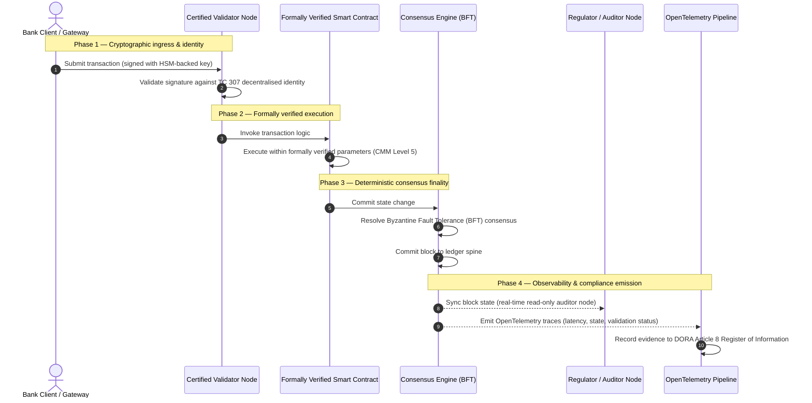

# Від доказу до істини: чому сертифіковані блокчейни визначать наступну еру банківської довіри

## Стратегічне резюме (найголовніше)

Оптове банківництво та глобальні транзакції у 2026 році перебувають на історичній точці перелому. У міру того як фінансові послуги переходять на нативно цифрові, клірингові мережі реального часу, а штучний інтелект запроваджує ймовірнісний недетермінізм, традиційні аналогові, ретроспективні моделі забезпечення (як-от статичні аудити на основі суб'єкта) перестають відповідати сучасним вимогам управління ризиками та фідуціарним обов'язкам.

Технічний комітет ISO/IEC TC 307 встановив нормалізовану основу для технологій розподіленого реєстру. Проте справжнє інституційне впровадження вимагає переходу від описових настанов до приписового, незалежно сертифікованого забезпечення блокчейну. Оцінюючи врядування реєстру, цілісність консенсусу, безпеку смарт-контрактів і криптографічну гнучкість за суворою п'ятирівневою моделлю зрілості спроможностей (CMM), банки можуть перейти від фрагментарних, специфічних для постачальника припущень до сертифікованої, аудитованої радою фінансової істини.

## Ключові висновки

* **Фідуціарний розрив тертя**: сьогодні ми вміємо сертифікувати банк (Basel III), хмару (ISO 27001) та системи врядування ШІ (ISO 42001), але ще не вміємо сертифікувати розподілений реєстр, який дедалі більше визначає, що є істиною. Ця асиметрія є значною операційною вразливістю.  
* **DORA запроваджує пряму фідуціарну відповідальність**: згідно зі статтею 5 DORA, ради директорів банків несуть пряму, неделеговану особисту відповідальність за операційну стійкість усіх розгортань третіх сторін і реєстрів, із суворими особистими санкціями за режимом SM&CR за невиконання.  
* **Аудиторський хребет ШІ**: там, де машинне навчання дає невідтворювані, ймовірнісні результати, сертифікований блокчейн забезпечує детерміноване фіксування стану. Запис версій моделей, вхідних даних і рішень щодо валідації в мережі задовольняє ISO 42001 та стандарти управління модельним ризиком.  
* **Індекс сертифікованих блокчейнів**: цей індекс формалізує врядування, консенсус, смарт-контракти й спостережуваність у перевірювану, готову до аудиту оцінну картку за шкалою CMM від 0 до 5, перекладаючи інженерні метрики у затверджені радою заяви про ризик-апетит.

## 01. Фідуціарний розрив тертя в цифровому банківництві

У класичному банківництві довіра є реляційною, інституційною та ретроспективною. Вона спирається на незалежних сторонніх аудиторів, які перевіряють фінансовий стан у фіксовані моменти часу, узгоджуючи розбіжності між силосами двосторонніх реєстрів. На керованих API ринках реального часу 2026 року ця модель запроваджує заборонні затримки та структурні ризики.

Коли транзакції розраховуються миттєво, внутрішньоденні пули ліквідності динамічно керуються шлюзами API, а власність на активи токенізується у спільних реєстрах, ретроспективні аудити стають криміналістичними вправами, а не превентивними контролями. Фідуціарії більше не можуть покладатися лише на сертифікацію юридичної особи. Вони мають сертифікувати сам цифровий субстрат.

Нині банки працюють в умовах кричущої архітектурної асиметрії:

1. **Сертифікована хмарна інфраструктура**: апаратні вузли, віртуалізовані контейнери та фізичні центри обробки даних валідуються за контролями ISO/IEC 27001 та SOC 2 Type II.  
2. **Сертифіковані процеси управління**: політики операційного ризику, плани безперервності діяльності та алгоритмічні розгортання регулюються суворими рамками ризику.  
3. **Несертифіковані двигуни реєстру**: механізми розподіленого консенсусу, ланцюги постачання вузлів-валідаторів, межі смарт-контрактів і моделі врядування мережі залишаються несертифікованим, замовним або специфічним для консорціуму припущенням.

Ця асиметрія є критичною точкою відмови. Банк може запускати валідований застосунок усередині безпечного, сертифікованого за ISO 27001 хмарного контейнера, але якщо цей контейнер записує до розподіленого реєстру з централізованим контролем валідаторів, вразливими параметрами консенсусу або неаудитованими смарт-контрактами, цілісність транзакції скомпрометована. Щоб подолати цей розрив, сам двигун реєстру має стати сертифікованим об'єктом забезпечення.

## 02. Основа нормалізації ISO/IEC TC 307

Фундаментальну роботу, необхідну для нормалізації розподілених реєстрів, виконує Технічний комітет ISO/IEC TC 307 (Технології блокчейну та розподіленого реєстру). Замість того щоб розглядати блокчейн як ізольований технічний протокол, TC 307 підходить до нього як до інституційної інфраструктури довіри, організовуючи свою роботу навколо п'яти основних стовпів:

1. **Таксономія та термінологія (ISO 22739)**: встановлює спільну номенклатуру, забезпечуючи узгоджені юридичні та операційні визначення в різних юрисдикціях, фінансових схемах та установах.  
2. **Референсна архітектура (ISO/TR 23245)**: визначає межі, рівні, потоки даних і функціональні компоненти відповідної системи розподіленого реєстру.  
3. **Безпека, приватність і смарт-контракти (ISO/TR 23244 / ISO 23613)**: встановлює базові настанови безпеки для систем цифрових активів і деталізує найкращі практики пом'якшення вразливостей смарт-контрактів та врядування їхнім життєвим циклом.  
4. **Рамки взаємодії**: розглядає механізми обміну даними й активами між гетерогенними мережами реєстрів, запобігаючи утворенню ізольованих токенізованих силосів.  
5. **Децентралізована ідентичність і якорі довіри**: інтегрує криптографічні ідентифікатори на основі реєстру з формальними інфраструктурами відкритих ключів (PKI) та державно уповноваженими реєстрами.

Загалом TC 307 сигналізує перехід DLT від замовного інженерного вибору до нормалізованої архітектурної дисципліни. Однак TC 307 залишається переважно описовим. Він визначає, як виглядає досконалість (настанови), але не надає приписового протоколу верифікації (забезпечення), якого потребують ризик-менеджери та наглядові органи, щоб авторизувати продуктивні розгортання критичних або важливих функцій (CIF).

## 03. Настанови проти забезпечення: фідуціарна різниця

Учасники фінансових ринків не впроваджують технологію тому, що вона інноваційна чи елегантна; вони впроваджують її, коли нею можна керувати, її можна аудитувати, захищати та узгоджувати з вимогами до капітальних резервів. Ось чому нормалізація у банківництві природно розкладається на два рівні:

* **Настанови (рамка)**: окреслюють найкращі практики, референсні цілі та архітектурні орієнтири (напр. ISO/IEC TC 307, рамки NIST).  
* **Забезпечення (доказ)**: надає незалежні, безперервні та перевірювані третьою стороною докази того, що рамку впроваджено і вона працює за призначенням (напр. сертифікація ISO 27001, аудити SOC 2, регуляторні перевірки).

Покладатися на несертифікований консенсус реєстру, водночас сертифікуючи хмарну інфраструктуру, — це критична регуляторна прогалина. «Незмінний» блокчейн не обов'язково є «інституційно довіреним». Незмінність гарантує лише те, що введені дані залишаються незміненими; вона не перевіряє, чи вузли-валідатори безпечні, чи протокол консенсусу стійкий до змови, чи логіка смарт-контрактів математично коректна, чи управління криптографічними ключами відповідає постквантовим мандатам.

Щоб закрити цей розрив, Індекс сертифікованих блокчейнів 2026 формалізує ці вимоги у вимірювану модель зрілості спроможностей (CMM), зіставлену з глобальними банківськими регуляціями.

## 04. Індекс сертифікованих блокчейнів 2026

Щоб дати вищому керівництву змогу оцінювати й сертифікувати свої платформи реєстру, цей індекс структурує інфраструктуру розподіленого реєстру у п'ять аудитованих операційних рівнів, оцінюваних за шкалою CMM від 0 до 5.

## Таблиця 1: архітектура Індексу сертифікованих блокчейнів

| Рівень індексу | Рівень зрілості (CMM) | Технічна та операційна метрика | Регуляторне / фідуціарне контрольне посилання |
| ---- | ---- | ---- | ---- |
| **Врядування реєстру** | **Рівень 0**: спеціальний консорціум**Рівень 3**: автоматизована перевірка та ротація валідаторів**Рівень 5**: децентралізоване, багатостороннє криптографічне якорування ідентичності | % вузлів-валідаторів, керованих перевіреними фінансовими установами; середній час вирішення спорів валідаторів; географічний розподіл вузлів | **DORA стаття 5** (Врядування та організація); **CPMI-IOSCO PFMI Принцип 2** (Врядування) та **Принцип 3** (Рамка комплексного управління ризиками) |
| **Цілісність консенсусу** | **Рівень 0**: один вузол або непрозорий PoW**Рівень 3**: аудитований BFT з детермінованою остаточністю**Рівень 5**: багатоюрисдикційний, формально верифікований консенсус із безперервним моніторингом затримки | макс. допустима затримка консенсусу; поріг стійкості до змови; SLA доступності за симульованого розділення вузлів | **DORA стаття 6** (Рамка управління ІКТ-ризиками); **CPMI-IOSCO PFMI Принцип 8** (Остаточність розрахунку) |
| **Ідентичність та криптографія** | **Рівень 0**: слабкі ключі RSA / ECDSA**Рівень 3**: мультипідпис з управлінням ключами на базі HSM**Рівень 5**: квантово-безпечні гібридні ключі (FIPS 203 ML-KEM) та шлюзи приватності з нульовим розголошенням | % транзакцій реєстру, підписаних ключами на базі HSM; оцінка готовності до міграції PQC; затримка доказів ZK | **NIST FIPS 203 / 204**; **ISO/IEC 27001** (Управління інформаційною безпекою) |
| **Забезпечення смарт-контрактів** | **Рівень 0**: неаудитовані скрипти Solidity**Рівень 3**: автоматизована валідація компілятора та зовнішній аудит**Рівень 5**: формально верифіковані, незмінні смарт-контракти з оновленнями типу «запобіжник» | % смарт-контрактів із математичною формальною верифікацією; кількість попереджень компілятора; покриття сканувань вразливостей | **Настанови EBA щодо аутсорсингу** (пункти 81, 113-117); **DORA стаття 30** (Мінімальні договірні положення) |
| **Аудит та спостережуваність** | **Рівень 0**: ручне збирання логів**Рівень 3**: структуровані трейси OTel та аудиторські вузли лише для читання**Рівень 5**: автоматизоване, безперервне узгодження з реєстром за статтею 8 | % транзакцій, охоплених трейсами OpenTelemetry; затримка від фіксації блоку до синхронізації аудиторського вузла | **BCBS 239** (Агрегація ризикових даних); **DORA стаття 8** (Реєстр інформації / схеми ITS) |

## Таблиця 2: ключові сигнали довіри, зіставлені з глобальними банківськими стандартами

| Сигнал / орієнтир | Метрика | Вплив на банківські платформи | Регуляторне джерело |
| ---- | ---- | ---- | ---- |
| **Прогрес ISO/IEC TC 307** | Перехід від технічних звітів ISO/TR до формальних схем сертифікації | Встановлює першу нормалізовану рамку для сертифікації двигунів розподіленого реєстру | **ISO/IEC JTC 1 / SC 44** (Технології розподіленого реєстру) |
| **Прототипна фаза Проєкту Agorá** | Понад 40 комерційних банків-учасників; тестування єдиного реєстру токенізованих депозитів | Переміщує транскордонний кліринг від обміну повідомленнями (SWIFT) до атомарного токенізованого розрахунку | **Інноваційний хаб Банку міжнародних розрахунків (BIS)** |
| **Аудит третьої сторони DORA стаття 30** | 100 % постачальників вузлів та хостів інфраструктури аудитовано за критеріями безпеки | Усуває «тіньові вузли-валідатори»; вимагає повної прозорості ланцюга постачання | **Європейські наглядові органи (ESA)** |
| **ISO/IEC 42001 (врядування ШІ)** | Логи моделей та навчання ШІ зроблено криптографічно незмінними в мережі | Використовує блокчейн як незмінний доказовий реєстр («аудиторський хребет») для машинного навчання | **ISO/IEC 42001:2023** (Інформаційні технології — Штучний інтелект) |
| **Достатність капіталу Basel III** | Зменшення буферів капіталу під операційний ризик на основі задокументованого зниження складності | Нормалізовані рамки операційного ризику безпосередньо зараховують перевірену стійкість реєстру | **Базельський комітет з банківського нагляду (BCBS)** |

## 05. «Аудиторський хребет» ШІ: ймовірнісний інтелект на детермінованій інфраструктурі

Однією з найпотужніших стратегічних ролей сертифікованого блокчейну у 2026 році є функція **«аудиторського хребта»** для розгортань штучного інтелекту. Сучасні фінансові системи дедалі більше стають ймовірнісними. Кредитний скоринг, виявлення шахрайства в реальному часі, алгоритмічна торгівля та автономні взаємодії з клієнтами керуються моделями машинного навчання, які еволюціонують, дрейфують і адаптуються з часом. Ці моделі недетерміновані: за однакового вхідного даних у два різні моменти вони можуть давати різні результати через динамічні ваги та безперервне навчання.

Цей недетермінізм породжує глибокий виклик врядування за **ISO/IEC 42001 (врядування ШІ)** та стандартами управління модельним ризиком (MRM) (як-от **SR 11-7 Федеральної резервної системи США** та **SS1/23 британського PRA**): *як аудитувати, пояснювати й захищати рішення, які не є строго відтворюваними?*

Сертифікований розподілений реєстр забезпечує детермінований противаг. Там, де моделі ШІ працюють ймовірнісно, сертифікований блокчейн записує їхні параметри детерміновано, встановлюючи незмінний доказовий хребет:

* **Версіонування моделей та якорування ваг**: кожна розгорнута версія моделі, її пов'язані ваги та контрольні суми її навчальних даних хешуються й записуються до реєстру під час збирання, задовольняючи вимоги ланцюга постачання **SLSA Level 3**.  
* **Контекстне логування вхідних даних**: коли модель ШІ виконує критичне рішення (напр. схвалює позику або позначає транзакцію), точні контекстні вхідні дані та хеші моделі записуються до реєстру, створюючи стійку до підробки історію.  
* **Аудитованість без доступу до коду**: якщо регулятор запитує «чому ваша модель відхилила цю кредитну заявку 3 червня?», банку не потрібно ані розкривати свій пропрієтарний код, ані намагатися відтворити точний стан моделі. Він надає криптографічно підписаний запис у мережі щодо вхідних даних, ваг і стану валідації.

Якоруючи ймовірнісні рішення моделей машинного навчання до детермінованого консенсусу сертифікованого блокчейну, установа створює захищувану, відтворювану та незалежно перевірювану часову шкалу автоматизованих дій.

## 06. Візуалізація сертифікованого конвеєра від консенсусу до аудиту

Наведена нижче діаграма послідовності ілюструє життєвий цикл транзакції, що проходить через сертифіковану блокчейн-платформу, показуючи, як шлюзи валідації, цілісність консенсусу, виконання смарт-контрактів та емісія телеметрії переплітаються, щоб створити готовий для ради регуляторний доказ:

Критичний шлях цієї транзакційної послідовності вимагає, щоб кожен крок валідації, виконання та консенсусу був криптографічно підписаний, забезпечуючи наскрізне походження. Аудиторський вузол регулятора синхронізує стан блоків у реальному часі, усуваючи потребу в ретроспективному, ручному фінансовому узгодженні.

## 07. Настільна книга ради для вищого керівництва

Щоб успішно пройти перехід від організаційної довіри до інфраструктурної, керівники та вище керівництво банків повинні негайно виконати чотири ключові директиви:

1. **Зробити аудити реєстру обов'язковими в управлінні ризиками підприємства (ERM)**: запровадити політику, за якою жодна платформа розподіленого реєстру — приватна, публічна чи консорціумна — не може бути розгорнута для критичних або важливих функцій (CIF) без аудиту за п'ятирівневою **архітектурою Індексу сертифікованих блокчейнів** (щонайменше CMM Рівень 3).  
2. **Інтегрувати блокчейни як доказовий хребет ШІ за ISO 42001**: доручити директору з ризиків та провідному архітекторові ШІ інтегрувати всі високовпливові моделі машинного навчання з сертифікованим блокчейном, створюючи стійкий до підробки аудиторський реєстр версій моделей, ваг, вхідних даних і рішень.  
3. **Аудитувати ланцюг постачання вузлів-валідаторів (DORA стаття 30)**: вимагати, щоб відділ закупівель аудитував усіх третіх сторін, які хостять вузли-валідатори або керують хмарним хостингом для мереж DLT, дотримуючись тих самих стандартів кібербезпеки та операційної стійкості, що й для внутрішніх хмарних вузлів банку.  
4. **Узгодити архітектури реєстру з CPMI-IOSCO та BCBS 239**: доручити команді платформної інженерії узгодити вихідну телеметрію реєстру безпосередньо з вимогами до звітності даних **BCBS 239** і забезпечити, щоб параметри консенсусу та остаточності розрахунку суворо відповідали **Принципам 8 і 9 CPMI-IOSCO**.

## 08. Поширені запитання

**Чи є ISO/IEC TC 307 стандартом сертифікації?**  
Ні. ISO/IEC TC 307 — це технічний комітет, який встановлює термінологію, референсні архітектури та настанови безпеки. Хоча він визначає, «як виглядає досконалість» (настанови), галузь має операціоналізувати ці документи у формальні, аудитовані схеми сертифікації (забезпечення), щоб задовольнити банківських наглядовців.

**Як сертифікований блокчейн підтримує відповідність DORA?**  
Згідно зі статтею 5 DORA, ради банків несуть пряму особисту відповідальність за технологічну стійкість. Сертифікований блокчейн надає перевірюваний криптографічний доказ цілісності консенсусу, контролю ланцюга постачання валідаторів і безпеки смарт-контрактів, даючи членам ради задокументовувані «розумні кроки», потрібні для захисту від претензій щодо особистої відповідальності за SM&CR.

Яка різниця між традиційним аудитом реєстру та аудитом сертифікованого блокчейну?  
Традиційний аудит є ретроспективним: він перевіряє ручні записи та статичні файли після того, як транзакції розраховано. Аудит сертифікованого блокчейну є безперервним і в реальному часі; вузли-валідатори, консенсусний двигун BFT та формально верифіковані смарт-контракти сертифіковані виконувати транзакції детерміновано, випромінюючи структуровану телеметрію (OpenTelemetry), яка безперервно валідує стан системи.

Чи можна сертифікувати публічні блокчейни для банківського використання?  
У більшості юрисдикцій суто безозвольні публічні блокчейни не задовольняють банківські регуляції через відсутність перевірки ідентичності валідаторів, непередбачувані транзакційні витрати та недетерміновану остаточність (напр. ймовірнісні форки proof-of-work/stake). Сертифіковані блокчейни в банківництві зазвичай використовують корпоративні дозвільні архітектури або жорстко регульовані публічно-гібридні архітектури, де оператори вузлів-валідаторів є ідентифікованими та аудитованими фінансовими установами.

## 09. Джерела

* Базельський комітет з банківського нагляду (BCBS), 2013. *Principles for effective risk data aggregation and reporting (BCBS 239)*. Базель: Банк міжнародних розрахунків. Доступно за: [https://www.bis.org/publ/bcbs239.pdf](https://www.bis.org/publ/bcbs239.pdf).  
* Committee on Payments and Market Infrastructures та Technical Committee of the International Organization of Securities Commissions (CPMI-IOSCO), 2012. *Principles for financial market infrastructures*. Базель: Банк міжнародних розрахунків. Доступно за: [https://www.bis.org/cpmi/publ/d101a.pdf](https://www.bis.org/cpmi/publ/d101a.pdf).  
* Європейський банківський орган (EBA), 2019. *EBA/GL/2019/02 — Guidelines on outsourcing arrangements*. Париж: EBA. Доступно за: [https://www.eba.europa.eu/regulation-and-policy/internal-governance/guidelines-on-outsourcing-arrangements](https://www.eba.europa.eu/regulation-and-policy/internal-governance/guidelines-on-outsourcing-arrangements).  
* Європейський Парламент і Рада Європейського Союзу, 2022. *Регламент (ЄС) 2022/2554 про цифрову операційну стійкість фінансового сектору (DORA)*. Брюссель: Офіційний вісник Європейського Союзу. Доступно за: [https://eur-lex.europa.eu/legal-content/EN/TXT/?uri=CELEX%3A32022R2554](https://eur-lex.europa.eu/legal-content/EN/TXT/?uri=CELEX%3A32022R2554).  
* ISO/IEC JTC 1/SC 42, 2023. *ISO/IEC 42001:2023 — Information technology — Artificial intelligence — Management system*. Женева: Міжнародна організація зі стандартизації. Доступно за: [https://www.iso.org/standard/81230.html](https://www.iso.org/standard/81230.html).  
* Технічний комітет ISO/IEC 307, 2020. *ISO/IEC 22739:2020 — Blockchain and distributed ledger technologies — Vocabulary*. Женева: Міжнародна організація зі стандартизації. Доступно за: [https://www.iso.org/standard/73771.html](https://www.iso.org/standard/73771.html).  
* National Institute of Standards and Technology (NIST), 2026. *First Three Finalized Post-Quantum Encryption Standards (FIPS 203, 204, and 205)*. Гейтерсберг: U.S. Department of Commerce. Доступно за: [https://www.nist.gov/news-events/news/2024/08/nist-releases-first-3-finalized-post-quantum-encryption-standards](https://www.nist.gov/news-events/news/2024/08/nist-releases-first-3-finalized-post-quantum-encryption-standards).
